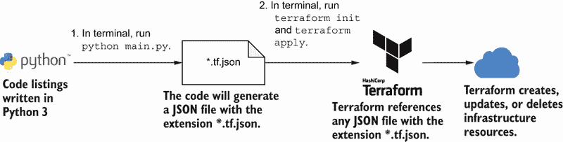
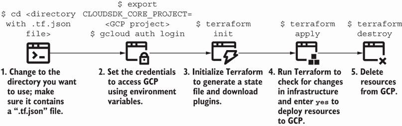

# 附录 A. 运行示例

本书中的示例使用 Python 创建一个 JSON 配置文件，以便您可以使用 HashiCorp Terraform 运行。本附录提供了运行示例的指导。为什么要费心进行这个两步手动过程：首先使用 Python 生成 JSON 文件，然后使用 Terraform 创建资源？

首先，我想确保任何想要运行示例但无法使用 Google Cloud Platform (GCP) 的人都有机会进一步检查它们。这允许进行“本地”开发和测试，并可选择创建实时基础设施资源。

第二，JSON 文件内容很多！它们在代码列表中显得相当冗长。一个 Python 包装器允许我提供模式示例，而无需浏览 JSON 配置的行。在 Terraform JSON 语法周围添加 Python 代码提供了一些未来保障，以防我需要将示例重写为另一个工具。

注意：参考链接、库和工具语法可能会更改。请查阅 [`github.com/joatmon08/manning-book`](https://github.com/joatmon08/manning-book) 以获取最新的代码。



图 A.1 使用用 Python 编写的代码列表生成 JSON 文件，并用 Terraform 运行它。

图 A.1 重复说明了运行示例所需的流程。如果您运行 `python main.py`，您将得到一个扩展名为 .tf.json 的 JSON 文件。在您的 CLI 中运行 `terraform init` 以初始化工具状态，然后运行 `terraform apply` 以配置资源。

我将简要讨论如何设置各种云提供商的账户。然后，我将介绍 Python 以及我在示例中引用的库，例如基础设施 API 访问和测试。最后，我将简要解释如何使用 Terraform 与 GCP 一起使用。

## A.1 云提供商

本书中的示例使用 Google Cloud Platform (GCP) 作为云提供商。如果您更喜欢其他云提供商，许多示例都有侧边栏，提供了等效的实现来达到类似的架构。表 A.1 将 GCP、Amazon Web Services (AWS) 和 Microsoft Azure 中每种资源类型的近似值进行了映射。

表 A.1 云提供商间资源映射

| 资源 | GCP | AWS | Azure |
| --- | --- | --- | --- |
| 资源分组 | GCP 项目 | AWS 账户 | Azure 订阅和资源组 |
| 身份和访问管理 (IAM) | Google IAM | AWS IAM | Azure Active Directory |
| Linux 服务器（Ubuntu） | Google 计算实例 | Amazon EC2 实例 | Azure Linux 虚拟机 |
| 网络 | Google 虚拟私有云 (VPC) 子网 注意：具有默认网络 | Amazon 虚拟私有云 (VPC) 子网 路由表 网关 注意：具有默认网络 | Azure 虚拟网络 子网 路由表关联 |
| 防火墙规则 | 防火墙规则 | 安全组网络访问控制列表 | 网络安全组 |
| 负载均衡 | Google compute forwarding rule (L4)HTTP(S) 负载均衡 (L7) | AWS Elastic Load Balancing (ELB) (L4)AWS 应用程序负载均衡器 (ALB) (L7) | Azure 负载均衡器 (L4)Azure 应用程序网关 (L7) |
| 关系型数据库 (PostgreSQL) | Google Cloud SQL | Amazon Relational Database Service (RDS) | Azure Database for PostgreSQL |
| 容器编排器 (Kubernetes) | Google Kubernetes Engine (GKE) | Amazon Elastic Kubernetes Service (EKS) | Azure Kubernetes Service (AKS) |

在本节中，我将概述如果您选择，为每个云服务提供商需要进行的初始设置。

### A.1.1 Google Cloud Platform

当您开始使用 GCP 时，创建一个新项目 ([`mng.bz/mOV2`](http://mng.bz/mOV2)) 并在该项目中运行所有示例。这允许您在完成本书后删除项目及其资源。

接下来，安装 `gcloud` CLI ([`cloud.google.com/sdk/docs/install`](https://cloud.google.com/sdk/docs/install))。CLI 将帮助您进行验证，以便 Terraform 可以访问 GCP API：

```
$ gcloud auth application-default login
```

这将在您的机器上设置凭据，以便 Terraform 可以验证 GCP ([`mng.bz/5Qw1`](http://mng.bz/5Qw1))。

### A.1.2 Amazon Web Services

当您开始使用 AWS 时，创建一个新账户 ([`mng.bz/6XDD`](http://mng.bz/6XDD)) 并在该账户中运行所有示例。这允许您在完成本书后删除账户及其资源。

接下来，在 AWS 控制台中创建一组访问密钥 ([`mng.bz/o21r`](http://mng.bz/o21r))。您需要保存这些密钥，以便 Terraform 可以访问 AWS API。

复制访问密钥 ID 和秘密访问密钥并将其保存到环境变量中：

```
$ export AWS_ACCESS_KEY_ID="<Access key ID>" 
$ export AWS_SECRET_ACCESS_KEY="<Secret access key>" 
```

然后，设置您想要使用的 AWS 区域：

```
$ export AWS_REGION="us-east-1" 
```

这将在您的机器上设置凭据，以便 Terraform 可以验证 AWS ([`mng.bz/nNWg`](http://mng.bz/nNWg))。

### A.1.3 Microsoft Azure

当您开始使用 Azure 时，创建一个新账户 ([`mng.bz/v6nJ`](http://mng.bz/v6nJ))。创建新账户会默认为您提供一个订阅。这允许您在订阅内创建资源并将它们按资源组分组。完成本书后，您可以删除资源组。

接下来，安装 Azure CLI ([`mng.bz/44Da`](http://mng.bz/44Da))。CLI 将帮助您进行验证，以便 Terraform 可以访问 Azure API。

登录到 Azure CLI：

```
$ az login
```

列出订阅，以便您可以获取默认订阅的 ID：

```
$ az account list
```

复制订阅 ID 并将其保存到环境变量中：

```
$ export ARM_SUBSCRIPTION_ID="<subscription ID>" 
```

这将在您的机器上设置凭据，以便 Terraform 可以验证 Azure ([`mng.bz/QvPw`](http://mng.bz/QvPw))。您应该为每个示例创建一个 Azure 资源组 ([`mng.bz/XZNG`](http://mng.bz/XZNG))。删除资源组以移除示例的所有基础设施资源。

## A.2 Python

在您开始运行示例之前，您必须下载 Python。我在代码列表中使用 Python 3。您可以通过选择您的包管理器或 Python 下载页面（[www.python.org/downloads/](https://www.python.org/downloads)）来安装 Python。然而，我更喜欢使用 pyenv ([`github.com/pyenv/pyenv`](https://github.com/pyenv/pyenv)) 来下载和管理我的 Python 版本。pyenv 允许您选择所需的 Python 版本，并使用 Python 的 venv 库（[`docs.python.org/3/library/venv.xhtml`](https://docs.python.org/3/library/venv.xhtml)）将其安装到虚拟环境中。

我使用虚拟环境，因为我有多个项目需要不同的 Python 版本。在同一个环境中安装每个项目的不同版本会让人困惑，并且经常导致代码损坏。因此，我想将每个项目与其依赖项和 Python 版本分开，分别放入一个开发环境中。

### A.2.1 安装 Python 库

在您将 Python 3 安装到您的开发或虚拟环境之后，您需要安装一些外部库。在列表 A.1 中，我捕获了 requirements.txt 文件中的库和依赖项，这是一个包含包和版本的纯文本文件。

列表 A.1 包含本书库的 Python requirements.txt

```
apache-libcloud==3.3.1               ❶
google-api-python-client==2.17.0     ❷
google-cloud-billing==1.3.3          ❷
netaddr==0.8.0                       ❸
pytest==6.2.4                        ❹
```

❶ 安装 Apache Libcloud 库

❷ 安装 GCP 的客户端库，包括 Python 客户端和 Cloud Billing 客户端

❸ 安装 netaddr，这是一个用于解析网络信息的 Python 库

❹ 安装 pytest，这是一个 Python 测试框架

示例仓库包含一个 requirements.txt 文件，该文件冻结了您需要安装的库版本。在您的 Python 开发环境中，使用您的 CLI 通过 pip 安装库，这是 Python 的包安装程序：

```
$ pip install -r requirements.txt
```

一些示例需要更复杂的自动化或测试。它们引用了您需要单独导入的库。让我们更详细地检查需要下载的库。

Apache Libcloud

Apache Libcloud ([`libcloud.apache.org/`](https://libcloud.apache.org/)) 提供了一个 Python 接口来创建、更新、读取和删除云资源。它包含一个与云服务或提供商无关的单个接口。我在本书的早期部分引用了这个库，以提供集成和端到端测试的示例。要在以下列表中使用 Apache Libcloud，您可以导入 `libcloud` 包并设置一个驱动程序以连接到 GCP。

列表 A.2 导入 Apache Libcloud

```
from libcloud.compute.types import Provider            ❶
from libcloud.compute.providers import get_driver      ❷

ComputeEngine = get_driver(Provider.GCE)               ❸
driver = ComputeEngine(                                ❹
    credentials.GOOGLE_SERVICE_ACCOUNT,                ❹
    credentials.GOOGLE_SERVICE_ACCOUNT_FILE,           ❹
    project=credentials.GOOGLE_PROJECT,                ❹
    datacenter=credentials.GOOGLE_REGION)              ❹
```

❶ 导入设置云提供商的对象，例如 GCP

❷ 导入初始化云提供商驱动程序的函数

❸ 设置连接到 Google Cloud 的驱动程序

❹ 将凭证传递给 Google Cloud API 以初始化驱动程序

在测试中，我使用 Apache Libcloud 而不是 Google Cloud 的客户端库，因为它提供了一个统一的 API 来访问任何云。如果我想将示例切换到 AWS 或 Azure，我只需要更改云提供商的驱动程序。测试只从云提供商读取信息，并不使用 Apache Libcloud 执行任何复杂操作。

AWS 和 Azure 等效

您需要更新 Apache Libcloud 驱动程序以使用 Amazon EC2 驱动程序 ([`mng.bz/yvQG`](http://mng.bz/yvQG)) 或 Azure ARM Compute 驱动程序 ([`mng.bz/M5B7`](http://mng.bz/M5B7))。

Google Cloud 的 Python 客户端

书的后面部分包括更复杂的 IaC 和测试，这些我无法在 Apache Libcloud 中实现。Apache Libcloud 无法支持我获取 Google Cloud 资源特定信息的用例，例如定价信息！下面的列表展示了我是如何在这些用例中使用特定于 Google Cloud 的客户端库的。

列表 A.3 导入 Google Cloud 客户端库

```
import googleapiclient.discovery          ❶
from google.cloud import billing_v1       ❷
```

❶ 导入 Python 的 Google Cloud 客户端库

❷ 导入 Google Cloud Billing API 的 Python 客户端

AWS 和 Azure 等效

您可以导入 AWS SDK for Python ([`aws.amazon.com/sdk-for-python/`](https://aws.amazon.com/sdk-for-python/)) 或 Azure Python 库 ([`mng.bz/VMV0`](http://mng.bz/VMV0)) 来构建 AWS 或 Azure 中的示例。

示例使用了两个由 Google Cloud 维护的库。Python 的 Google Cloud 客户端库 ([`mng.bz/aJ1z`](http://mng.bz/aJ1z)) 允许您访问 Google Cloud 上的许多 API 并创建、读取、更新和删除资源。然而，它*不包含*对 Google Cloud Billing API 的访问。

因此，对于第十二章关于成本的内容，我不得不导入由 Google Cloud 维护的另一个库来检索计费目录信息。Google Cloud Billing API 的 Python 客户端 ([`mng.bz/gwBl`](http://mng.bz/gwBl)) 允许我从 Google Cloud 服务目录中读取信息。

当您有需要引用特定资源或 API（如 Apache Libcloud 中的统一 API 所不具备的）的 IaC 时，您通常需要找到一个单独的库来检索所需的信息。虽然我们希望最小化依赖，但我们必须认识到并非每个库都能满足每个用例！如果您觉得现有的库无法完成所需的自动化，请选择不同的库。

netaddr

在第五章中，我需要修改一个 IP 地址块。虽然我考虑了通过数学计算正确地址的可能性，但我决定使用库。Python 确实有一个内置的 ipaddress 库，但它不包括我需要的功能。我安装了 netaddr ([`netaddr.readthedocs.io/en/latest/`](https://netaddr.readthedocs.io/en/latest/)) 来减少我需要计算 IP 地址的额外代码。

pytest

本书中的许多测试使用 pytest，一个 Python 测试框架。您也可以使用 Python 的 unittest 模块来编写和运行测试。我更喜欢 pytest，因为它提供了一个简单的接口来编写和运行测试，而不需要更复杂的测试功能。而不是深入解释 pytest，我将概述我在测试中使用的一些功能和如何运行它们。

Pytest 搜索以 test_ 为前缀的 Python 文件。此文件名表示该文件包含 Python 测试。每个测试函数也使用前缀 test_。Pytest 根据前缀选择并运行测试。

本书中的许多测试都包括测试夹具。一个 *测试夹具* 捕获一个已知对象，例如一个名称或常量，您可以在多个测试中进行比较。在下面的列表中，我使用夹具传递多个测试中常用的对象，如网络属性。

列表 A.4 使用 pytest 的示例

```
import pytest                                                              ❶

@pytest.fixture                                                            ❷
def network():                                                             ❸
   return 'my-network'                                                     ❸

def test_configuration_for_network_name(network):                          ❸
   assert network == 'my-network', 'Network name does not match expected'  ❹
```

❶ 导入 pytest 库

❷ 设置已知对象或测试夹具

❸ 返回已知的网络名称“my-network”并将其传递给您的第一个测试

❹ 断言网络名称与预期匹配，如果不匹配则测试失败。您还可以包含一个描述性错误消息。

测试最重要的部分是检查预期值与实际值是否匹配，或 *断言*。Pytest 建议每个测试使用一个 `assert` 语句。我遵循这个约定，因为它有助于我编写更描述性、更有帮助的测试。您的测试应该尽可能清晰地描述其意图和测试内容。

要使用 pytest 运行一系列测试，您可以传递包含测试的目录。但是，请确保您的测试目录包含通过 pytest 读取的任何文件的绝对路径！例如，第四章的测试读取外部 JSON 文件。因此，您需要将工作目录更改为章节和部分：

```
$ cd ch05/s02
```

您可以通过在命令行中将点（`.`）传递给 pytest 来运行目录中的所有测试：

```
$ pytest .
```

您可以通过在命令行中添加文件名来运行一个文件：

```
$ pytest test_network.py
```

本书中的许多测试使用类似的夹具和 `assert` 语句模式。有关其他 pytest 功能的更多信息，请参阅其文档（[`docs.pytest.org`](https://docs.pytest.org)）。您将在 CLI 中运行 `pytest` 或 `python main.py` 命令来运行示例。

### A.2.2 运行 Python

我将每个基础设施资源分离到一个 Python 文件中。每个目录都包含一个 main.py 文件，如列表 A.5 所示。该文件始终包含将 Python 字典写入 JSON 文件的代码。该对象需要使用 Terraform 的 JSON 配置语法来表示基础设施资源。

列表 A.5 示例 main.py 文件将字典写入 JSON 文件

```
import json

if __name__ == "__main__":
   server = ServerFactoryModule(name='hello-world')                      ❶
   with open('main.tf.json', 'w') as outfile:                            ❷
       json.dump(server.resources, outfile, sort_keys=True, indent=4)    ❸
```

❶ 为 GCP 服务器生成 Python 字典

❷ 创建一个名为“main.tf.json”的 JSON 文件，其中包含与 Terraform 兼容的 JSON 配置

❸ 将服务器字典写入 JSON 文件

您可以在终端中运行 Python 脚本：

```
$ python main.py
```

当您列出文件时，您将找到一个名为 main.tf.json 的新 JSON 文件：

```
$ ls
main.py      main.tf.json
```

许多示例要求您运行 Python 的 main.py 并生成一个名为 main.tf.json 的 JSON 文件，除非另有说明。然而，一些示例使用其他库或代码进行自动化或测试。

## A.3 HashiCorp Terraform

使用 `python main.py` 生成 main.tf.json 文件后，您需要在 GCP 中创建资源。.tf.json 文件需要使用 HashiCorp Terraform 来创建、读取、更新和删除 GCP 中的资源。

您可以使用您选择的软件包管理器下载并安装 Terraform（[www.terraform.io/downloads.xhtml](https://www.terraform.io/downloads.xhtml)）。您通过一组 CLI 命令运行它，因此您需要下载二进制文件并确保您可以在终端中运行它。Terraform 在工作目录中搜索具有 .tf 或 .tf.json 扩展名的文件，并创建、读取、更新和删除您在这些文件中定义的资源。

### A.3.1 JSON 配置语法

Terraform 提供了各种接口供您创建基础设施资源。其大部分文档使用 HashiCorp 配置语言（HCL），这是一种 DSL，用于为每个云提供商定义基础设施资源。有关 Terraform 的更多信息，请参阅其文档（[www.terraform.io/docs/index.xhtml](https://www.terraform.io/docs/index.xhtml)）。

本书中的示例不使用 HCL。相反，它们使用 Terraform 特定的 JSON 配置语法（[www.terraform.io/docs/language/syntax/json.xhtml](https://www.terraform.io/docs/language/syntax/json.xhtml)）。这种语法使用与 HCL 相同的 DSL，只是格式化为 JSON。

Python 中的每个 main.py 文件都会将一个字典写入 JSON 文件。列表 A.6 展示了如何创建一个字典，该字典使用 JSON 配置语法定义 Terraform 资源。JSON 资源引用了 Terraform 定义的 `google_compute_instance` 资源（[`mng.bz/e71z`](http://mng.bz/e71z)）并设置了所有必需的属性。

列表 A.6 Terraform JSON 中服务器的 Python 字典

```
terraform_json = {
    'resource': [{                                  ❶
        'google_compute_instance': [{               ❷
            'my_server': [{                         ❸
               'allow_stopping_for_update': True
               'boot_disk': [{
                   'initialize_params': [{
                       'image': 'ubuntu-1804-lts'
                    }]
               }],
               'machine_type': 'e2-micro',
               'name': 'my-server',
               'zone': 'us-central1-a',
            }]
        }]
    }]
}
```

❶ 向 Terraform 信号，您将定义资源列表

❷ 定义了一个“google_compute_instance”，这是一个将在 GCP 中创建和配置服务器的 Terraform 资源

❸ 为服务器定义一个唯一标识符，以便 Terraform 可以跟踪它

AWS 和 Azure 的等效资源

在 AWS 中，您将使用带有默认 VPC 引用的 `aws_instance` Terraform 资源（[`mng.bz/pOPG`](http://mng.bz/pOPG)）。

在 Azure 中，您需要创建一个虚拟网络和子网。然后，在网络上创建 `azurerm_linux_virtual_machine` Terraform 资源（[`mng.bz/Ooxn`](http://mng.bz/Ooxn)）。

当您将其写入 JSON 文件时，Python 字典变为 Terraform JSON 配置语法。Terraform 只会创建其当前工作目录中定义的资源，这些资源具有 .tf 或 .tf.json 扩展名。如果您更新代码以将配置写入没有 .tf.json 扩展名的 JSON 文件，Terraform 将不会识别文件中的资源。

### A.3.2 初始化状态

在运行 Python 并创建 JSON 文件后，您需要在工作目录中初始化 Terraform。图 A.2 概述了您需要在终端中运行的命令以初始化状态并应用基础设施更改。



图 A.2 在工作目录中使用 Terraform 初始化和部署资源；完成示例后销毁资源。

在您的终端中，切换到包含 *.tf.json 文件的目录。例如，我切换到包含 2.3 节示例的目录：

```
$ cd ch02/s03

```

在您的终端中初始化 Terraform：

```
$ terraform init
Initializing the backend...

Initializing provider plugins...
- Reusing previous version of hashicorp/google from the dependency lock file
- Using previously-installed hashicorp/google v3.86.0

Terraform has been successfully initialized!

You may now begin working with Terraform. Try running "terraform plan"
➥to see any changes that are required for your infrastructure. 
➥All Terraform commands should now work.

If you ever set or change modules or backend configuration 
➥for Terraform, rerun this command to reinitialize 
➥your working directory. If you forget, other
➥commands will detect it and remind you to do so if necessary.
```

Terraform 执行一个初始化步骤，创建一个名为 *backend* 的工具状态，并安装插件和模块。初始化会创建一系列文件，您不应从文件系统中删除这些文件。初始化 Terraform 后，您在列出目录内容时将找到一些隐藏的新文件：

```
$ ls -al
drwxr-xr-x  .terraform
-rw-r--r--  .terraform.lock.hcl
-rw-r--r--  main.py
-rw-r--r--  main.tf.json
-rw-r--r--  terraform.tfstate
-rw-r--r--  terraform.tfstate.backup
```

Terraform 将其工具状态存储在状态文件中，以便快速协调您对基础设施资源所做的任何更改。Terraform 可以引用存储在本地或服务器、工件注册库、对象存储或其他位置的状态文件。示例将工具状态存储在名为 terraform.tfstate 的本地文件中。如果您意外删除此文件，Terraform 将不再识别其管理下的资源！请确保您不要删除本地状态文件或更新示例以使用远程后端。您还可能找到一个 terraform.tfstate.backup 文件，Terraform 在进行更改之前使用该文件来备份其工具状态。

初始化还安装了一个用于 Terraform 与 Google 通信的插件。Terraform 使用插件系统来扩展其引擎并与云提供商接口。AWS 示例使用相同的 `terraform init` 命令为您自动下载 AWS 插件。插件或模块将被下载到 .terraform 文件夹中。

Terraform 还为您固定了插件版本，类似于 Python 的 requirements.txt 文件。您将在 .terraform.lock.hcl 中找到一个固定插件版本的列表。在示例存储库中，我将 .terraform.lock.hcl 提交到版本控制，这样 Terraform 只会安装我在生成示例时测试过的插件。

### A.3.3 在您的终端中设置凭证

大多数 Terraform 插件通过使用环境变量来读取基础设施提供者 API 的凭证。我通常设置 GCP 项目环境变量，这样 Terraform 就能连接到正确的 GCP 项目：

```
$ export CLOUDSDK_CORE_PROJECT=<your GCP project ID>
```

我还通过使用 gcloud CLI 工具验证 GCP。该命令会自动为 Terraform 设置凭证以访问 GCP：

```
$ gcloud auth login
```

对于其他云提供商，我建议在您的终端中设置环境变量以验证您的 AWS 或 Azure 账户。参考 A.1 节以获取它们的配置。

### A.3.4 应用 Terraform

在设置好凭证后，您可以使用 Terraform 进行干运行和部署您的基础设施资源。在您的终端中，您可以通过运行 `terraform apply` 来开始部署您的更改：

```
$ terraform apply

Terraform used the selected providers to generate 
➥the following execution plan. Resource actions 
➥are indicated with the following symbols:
  + create

Terraform will perform the following actions:

  # google_compute_instance.hello-world will be created
  + resource "google_compute_instance" "hello-world" {

... OMITTED ...

Plan: 1 to add, 0 to change, 0 to destroy.

Do you want to perform these actions?
  Terraform will perform the actions described above.
  Only 'yes' will be accepted to approve.

  Enter a value:
```

命令将停止并等待您在 `Enter a value` 处输入 `yes`。它等待您审查更改并确认您想要添加、更改或销毁资源。在输入 yes 之前，始终审查更改！

在您输入 `yes` 后，Terraform 将开始部署资源：

```
  Enter a value: yes

google_compute_instance.hello-world: Creating...
google_compute_instance.hello-world: 
➥Still creating... [10s elapsed]
google_compute_instance.hello-world: 
➥Creation complete after 15s [id=projects/infrastructure-as-code-book/zones
➥/us-central1-a/instances/hello-world]

Apply complete! Resources: 1 added, 0 changed, 0 destroyed.
```

使用 `terraform apply` 后，您将在您的 GCP 项目中找到您的资源。

### A.3.5 清理

许多示例使用重叠的名称或网络 CIDR 块。我建议您在每个章节和部分之间清理资源。Terraform 使用 `terraform destroy` 命令从 GCP 删除 terraform.tfstate 中列出的所有资源。在您的终端中，请确保您已验证 GCP 或您的基础设施提供商。

当您运行 `terraform destroy` 时，它会输出它将销毁的资源。请审查资源列表，并确保您想要删除它们！

```
$ terraform destroy

Terraform used the selected providers to generate 
➥the following execution plan. Resource actions 
➥are indicated with the following symbols:
  - destroy

Terraform will perform the following actions:

  # google_compute_instance.hello-world will be destroyed

 ... OMITTED ...

Plan: 0 to add, 0 to change, 1 to destroy.

Do you really want to destroy all resources?
  Terraform will destroy all your managed infrastructure, 
  ➥as shown above.
  There is no undo. Only 'yes' will be accepted to confirm.

  Enter a value: 
```

在您审查了预期要删除的资源后，在命令提示符处输入 `yes`。Terraform 将从 GCP 删除资源。删除将需要一些时间，因此请预计这将运行几分钟。一些示例的部署和销毁可能需要更长的时间，因为它们涉及许多资源：

```
  Enter a value: yes

google_compute_instance.hello-world: Destroying... elapsed]
google_compute_instance.hello-world: Still destroying...
➥[id=projects/infrastructure-as-code-book/zones
➥/us-central1-a/instances/hello-world, 2m10s elapsed]
google_compute_instance.hello-world: Destruction complete after 2m24s

Destroy complete! Resources: 1 destroyed.
```

在销毁资源后，如果您愿意，可以删除 terraform.tfstate、terraform .tfstate.backup 和 .terraform 文件。请记住，每次完成示例后，都要从 GCP 删除您的资源（或删除整个项目），这样您可以减少云费用！
