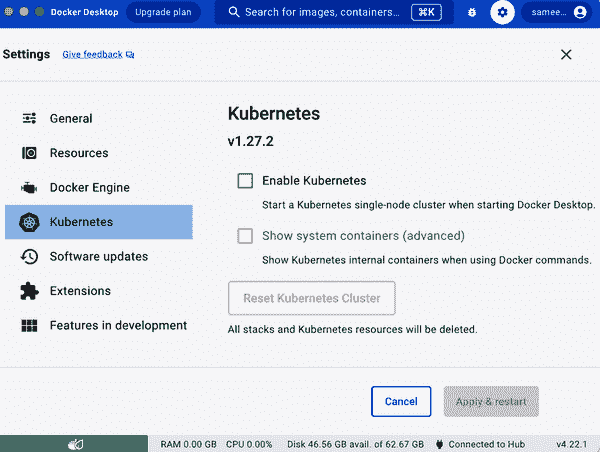
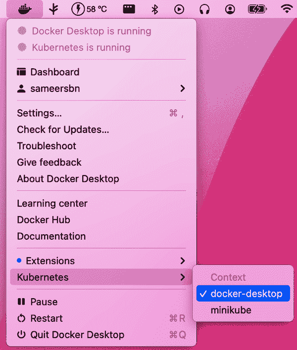

# 第一章：Kubernetes 入门

在本章中，我们介绍了一些可以帮助你开始使用 Kubernetes 的配方。我们向你展示了如何在不安装 Kubernetes 的情况下使用它，并介绍了诸如命令行界面（CLI）和仪表板之类的组件，这些组件允许你与集群交互，以及 Minikube，一个可以在笔记本电脑上运行的一体化解决方案。

# 1.1 安装 Kubernetes 命令行工具 kubectl

## 问题

你希望安装 Kubernetes 命令行界面，以便与 Kubernetes 集群交互。

## 解决方案

最简单的选择是下载最新的官方版本。例如，在 Linux 系统上获取最新稳定版本，请输入以下命令：

```
$ wget https://dl.k8s.io/release/$(wget -qO - https://dl.k8s.io/release/
stable.txt)/bin/linux/amd64/kubectl

$ sudo install -m 755 kubectl /usr/local/bin/kubectl

```

使用[Homebrew 软件包管理器](https://brew.sh)，Linux 和 macOS 用户也可以安装 `kubectl`：

```
$ brew install kubectl
```

安装完成后，请通过列出其版本来确保 `kubectl` 可正常工作：

```
$ kubectl version --client
Client Version: v1.28.0
Kustomize Version: v5.0.4-0.20230...

```

## 讨论

`kubectl` 是官方的 Kubernetes 命令行工具，并且是开源软件，这意味着如果需要的话，你可以自行构建 `kubectl` 的可执行文件。详见配方 15.1 以了解如何在本地编译 Kubernetes 源代码。

值得注意的是，Google Kubernetes Engine 用户（参见配方 2.11）可以使用 `gcloud` 安装 `kubectl`：

```
$ gcloud components install kubectl

```

此外，请注意，在最新版本的 Minikube 中（参见配方 1.2），你可以将 `kubectl` 作为 `minikube` 的子命令来运行一个与集群版本匹配的 `kubectl` 可执行文件：

```
$ minikube kubectl -- version --client
Client Version: version.Info{Major:"1", Minor:"27", GitVersion:"v1.27.4", ...}
Kustomize Version: v5.0.1

```

## 另见

+   有关[安装 `kubectl`](https://oreil.ly/DgK8a)的文档

# 1.2 安装 Minikube 以运行本地 Kubernetes 实例

## 问题

你希望在本地机器上用于测试、开发或培训目的使用 Kubernetes。

## 解决方案

[Minikube](https://oreil.ly/97IFg) 是一个工具，可以让你在本地机器上轻松使用 Kubernetes。

要在本地安装 Minikube CLI，你可以获取最新的预构建版本或从源代码构建。要在基于 Linux 的机器上安装最新版本的 `minikube`，请执行以下操作：

```
$ wget https://storage.googleapis.com/minikube/releases/latest/
minikube-linux-amd64 -O minikube 

$ sudo install -m 755 minikube /usr/local/bin/minikube
```

这将把 `minikube` 可执行文件放在你的路径中，并使其可以从任何位置访问。

安装完成后，你可以使用以下命令验证 Minikube 的版本：

```
$ minikube version
minikube version: v1.31.2
commit: fd7ecd...
```

## 讨论

Minikube 可以部署为虚拟机、容器或裸金属。在创建 Minikube 集群时，可以使用 `--driver` 标志进行配置。当未指定此标志时，Minikube 将自动选择最佳的运行时环境。

*虚拟化管理程序*是创建和管理虚拟机的软件或硬件组件。它负责分配和管理主机系统的物理资源（CPU、内存、存储、网络），允许多个虚拟机（VM）在同一物理硬件上并发运行。Minikube 支持多种虚拟化管理程序，例如[VirtualBox](https://oreil.ly/-tbK7)、[Hyperkit](https://oreil.ly/djLvh)、[Docker Desktop](https://oreil.ly/xQ-mj)、[Hyper-V](https://oreil.ly/5EAe0)等。[驱动程序](https://oreil.ly/Y1jpt)页面提供了支持的运行时概述。

Minikube 还可以使用容器运行时在主机上创建集群。此驱动仅在基于 Linux 的主机上可用，在这些主机上可以本地运行 Linux 容器，无需使用虚拟机。虽然基于容器的运行时不像虚拟机那样提供相同级别的隔离，但它确实提供了最佳的性能和资源利用率。在撰写本文时，Minikube 支持[Docker 引擎](https://oreil.ly/7gZPf)和[Podman](https://oreil.ly/y6N3t)（实验性支持）。

其他可用于在 Linux 容器上运行本地 Kubernetes 集群的工具如下：

+   Docker Desktop 中的 Kubernetes（参见配方 1.6）

+   种类（参见配方 1.5）

+   [k3d](https://k3d.io)

## 参见

+   [Minikube 入门指南！](https://oreil.ly/2b1fA)

+   [Minikube 驱动程序](https://oreil.ly/HAZgT)

+   `minikube` 的源码在[GitHub](https://oreil.ly/HmCEJ)

# 1.3 在本地使用 Minikube 进行开发

## 问题

您希望在本地使用 Minikube 进行 Kubernetes 应用程序的测试和开发。您已经安装并启动了 `minikube`（参见配方 1.2），并且想知道一些额外的命令来简化开发体验。

## 解决方案

使用 `minikube start` 命令在本地创建 Kubernetes 集群：

```
$ minikube start
```

默认情况下，集群将分配 2 GB 的 RAM。如果您不喜欢默认设置，可以覆盖参数，例如内存和 CPU 数量，并选择特定的 Kubernetes 版本为 Minikube VM——例如：

```
$ minikube start --cpus=4 --memory=4096 --kubernetes-version=v1.27.0

```

此外，您可以通过覆盖默认值来指定集群节点的数量为一个节点：

```
$ minikube start --cpus=2 --memory=4096 --nodes=2

```

要检查 Minikube 集群的状态，请执行以下操作：

```
$ minikube status
minikube
type: Control Plane
host: Running
kubelet: Running
apiserver: Running
kubeconfig: Configured

minikube-m02
type: Worker
host: Running
kubelet: Running

```

类似地，要检查运行在 Minikube 内的 Kubernetes 集群的状态，请执行以下操作：

```
$ kubectl cluster-info
Kubernetes control plane is running at https://192.168.64.72:8443
CoreDNS is running at https://192.168.64.72:8443/api/v1/namespaces/
kube-system/services/kube-dns:dns/proxy

To further debug and diagnose cluster problems, use 'kubectl cluster-info dump'.

```

使用 Minikube 创建的 Kubernetes 集群利用主机机器的资源，因此在完成后，请不要忘记使用 `minikube stop` 停止它，以释放系统资源。

## 讨论

Minikube CLI 提供了一些命令，可以让您的生活更轻松。CLI 提供了内置帮助，您可以使用它自行发现子命令——以下是一小部分：

```
$ minikube
...
Basic Commands:
  start            Starts a local Kubernetes cluster
  status           Gets the status of a local Kubernetes cluster
  stop             Stops a running local Kubernetes cluster
  delete           Deletes a local Kubernetes cluster
...
Configuration and Management Commands:
  addons           Enable or disable a minikube addon
...

```

除了 `start`、`stop` 和 `delete`，您还应该熟悉 `ip`、`ssh`、`tunnel`、`dashboard` 和 `docker-env` 命令。

###### 提示

如果由于任何原因你的 Minikube 变得不稳定，或者你想重新开始，你可以使用`minikube stop`和`minikube delete`来删除它。然后`minikube start`将给你一个新的安装。

# 1.4 在 Minikube 上启动你的第一个应用程序

## 问题

你已经启动了 Minikube（参见 Recipe 1.3），现在你想在 Kubernetes 上启动你的第一个应用程序。

## 解决方案

例如，你可以使用两个`kubectl`命令在 Minikube 上启动[Ghost](https://ghost.org)微博平台：

```
$ kubectl run ghost --image=ghost:5.59.4 --env="NODE_ENV=development"
$ kubectl expose pod ghost --port=2368 --type=NodePort

```

手动监视 Pod，查看其何时开始运行：

```
$ kubectl get pods
NAME                     READY     STATUS    RESTARTS   AGE
ghost-8449997474-kn86m   1/1       Running   0          24s

```

现在，你可以使用`minikube service`命令在 Web 浏览器中自动加载应用程序服务的 URL：

```
$ minikube service ghost

```

## 讨论

`kubectl run`命令被称为*生成器*；它是一个便利命令，用于创建`Pod`对象（参见 Recipe 4.4）。`kubectl expose`命令也是一个生成器，一个便利命令，用于创建`Service`对象（参见 Recipe 5.1），将网络流量路由到你的部署启动的容器。

当你不再需要该应用程序时，可以删除`Pod`以释放集群资源：

```
$ kubectl delete pod ghost
```

另外，你应该删除由`kubectl expose`命令创建的`ghost`服务：

```
$ kubectl delete svc ghost
```

# 1.5 使用 kind 在本地运行 Kubernetes

## 问题

[kind](https://kind.sigs.k8s.io)是一种在本地运行 Kubernetes 的替代方法。它最初设计用于测试 Kubernetes，但现在也经常用于在笔记本上轻松尝试基于 Kubernetes 的解决方案。你可以在本地使用 kind 来测试和开发你的 Kubernetes 应用程序。

## 解决方案

使用 kind 的最低要求是 Go 和一个 Docker 运行时。kind 在任何平台上都很[容易安装](https://oreil.ly/1MxZo)，例如使用`brew`：

```
$ brew install kind
```

然后，创建集群就像这样简单：

```
$ kind create cluster
```

删除它同样很容易：

```
$ kind delete cluster
```

## 讨论

因为 kind 最初是为了测试 Kubernetes 而开发的，其[核心设计原则](https://oreil.ly/jNTNx)之一是它应该很好地支持自动化。如果你计划自动部署用于测试目的的 Kubernetes 集群，你可能考虑使用 kind。

## 参见

+   官方的[快速入门指南](https://oreil.ly/aXjcY)

# 1.6 在 Docker Desktop 中使用 Kubernetes

## 问题

Docker Desktop 是建立在 Docker Engine 之上的一个提供多种有用开发者工具的产品，包括内置版本的 Kubernetes 和一个关联的负载均衡器来将流量路由到集群中。这意味着你可以安装一个单一工具，并且可以访问几乎你需要的所有内容。你可以在本地使用 Docker Desktop 来测试和开发你的 Kubernetes 应用程序。

## 解决方案

[安装 Docker Desktop](https://oreil.ly/HKVaR)并确保在安装过程中启用了 Kubernetes。

您可以在 Docker Desktop 的设置面板中激活和停用 Kubernetes，如 图 1-1 所示。如果您仅使用 Docker Desktop 的 Docker 引擎而不使用 Kubernetes，可以执行此操作以节省计算机资源。正如所示，设置面板还显示了 Docker Desktop 提供的 Kubernetes 版本，这在调试时可能很有用，因为某些解决方案可能对可以运行的 Kubernetes 的最低或最高版本有要求。



###### 图 1-1\. Docker Desktop Kubernetes 设置面板快照

值得注意的是，嵌入 Docker Desktop 的 Kubernetes 版本落后于最新版本几个版本，而 Minikube 更倾向于保持更新。

如 图 1-2 所示，Docker Desktop 工具栏菜单允许您轻松在不同的本地集群之间切换 `kubectl` 上下文，这意味着您可以同时运行 Minikube 和 Docker Desktop 的 Kubernetes，但可以在它们之间切换（尽管我们不建议这样做）。有关如何直接从 `kubectl` 执行此操作的信息，请参阅配方 1.7。



###### 图 1-2\. Docker Desktop 的 `kubectl` 上下文切换器快照

## 讨论

虽然这是一个快速且简便的开始 Kubernetes 的方式，但请注意 Docker Desktop 不是开源的，而且免费版本仅限个人、小型企业、学生和教育工作者以及非商业开源开发者使用。

另一方面，用于运行 Minikube 的 Docker 引擎具有 Apache 2.0 许可证，Minikube 本身也是如此。

# 1.7 切换 kubectl 上下文

## 问题

默认情况下，`kubectl` 总是配置为与特定的 Kubernetes 集群通信，这个配置是 *上下文* 的一部分。如果您忘记了 `kubectl` 设置为哪个集群，想要在不同集群之间切换，或者想要更改其他与上下文相关的参数，则可以使用本文提供的方法。

## 解决方案

要查看 `kubectl` 可用的上下文，请使用 `kubectl config get-contexts` 命令：

```
$ kubectl config get-contexts
CURRENT   NAME             CLUSTER          AUTHINFO         NAMESPACE
          docker-desktop   docker-desktop   docker-desktop
          kind-kind        kind-kind        kind-kind
*         minikube         minikube         minikube         default

```

正如您从输出中看到的，在这种情况下，`kubectl` 可用于三个 Kubernetes 集群，并且当前上下文设置为与 `minikube` 集群通信。

要切换到 `kind-kind` 集群，请执行以下命令：

```
$ kubectl config use-context kind-kind
Switched to context "kind-kind".

```

## 讨论

如果您希望使用本地的 `kubectl` 访问远程集群，可以通过编辑 kubeconfig 文件来实现。在[官方文档](https://oreil.ly/jMZ3h)中了解更多关于 kubeconfig 文件的信息。

# 1.8 使用 kubectx 和 kubens 切换上下文和命名空间

## 问题

你希望找到一个更简单的方法来切换上下文（即集群）和命名空间，因为切换上下文的命令很长，而且很难记住。

## 解决方案

`kubectx` 和 `kubens` 是一对流行的开源脚本，可以大大简化 `kubectl` 切换上下文和切换命名空间的操作，这样你就不必为每个命令显式设置命名空间名字。

有很多可用的安装选项。如果你能使用 `brew`，那么你可以尝试这样做：

```
$ brew install kubectx
```

然后您可以像这样轻松列出可用的 `kubectl` 上下文：

```
$ kubectx
docker-desktop
kind-kind
minikube

```

并且同样简单地切换上下文：

```
$ kubectx minikube
Switched to context "minikube".

```

类似地，`kubens` 允许您轻松列出和切换命名空间：

```
$ kubens
default
kube-node-lease
kube-public
kube-system
test

```

```
$ kubens test
default
Context "minikube" modified.
Active namespace is "test".

```

从那时起，所有的命令都将在所选命名空间的上下文中执行：

```
$ kubectl get pods
default
No resources found in test namespace.

```

## 参见

+   [kubectl 和 kubens 工具的存储库](https://oreil.ly/QBH3N)
