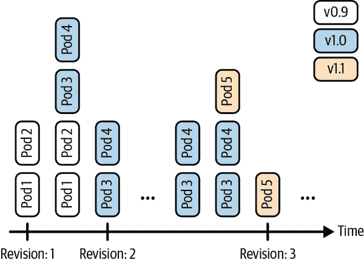
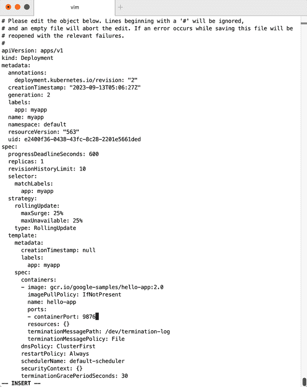

# 第四章：创建和修改基础工作负载

在本章中，我们提供了显示如何管理基本 Kubernetes 工作负载类型（pod 和部署）的配方。我们展示了如何通过 CLI 命令和从 YAML 清单创建部署和 pod，并解释了如何扩展和更新部署。

# 4.1 使用 `kubectl run` 创建 pod

## 问题

您希望快速启动一个长时间运行的应用程序，例如 Web 服务器。

## 解决方案

使用 `kubectl run` 命令，它是一个即时创建 pod 的生成器。例如，要创建运行 NGINX 反向代理的 pod，请执行以下操作：

```
$ kubectl run nginx --image=nginx

$ kubectl get pod/nginx
NAME    READY   STATUS    RESTARTS   AGE
nginx   1/1     Running   0          3m55s

```

## 讨论

`kubectl run` 命令可以接受多个参数来配置 pod 的附加参数。例如，您可以执行以下操作：

+   使用 `--env` 设置环境变量。

+   使用 `--port` 定义容器端口。

+   使用 `--command` 定义要运行的命令。

+   使用 `--expose` 自动创建关联的服务。

+   使用 `--dry-run=client` 运行测试而不实际运行任何内容。

典型用法如下。要在端口 2368 上启动提供 NGINX 服务并创建与之关联的服务，请输入以下内容：

```
$ kubectl run nginx --image=nginx --port=2368 --expose

```

要启动设置了 root 密码的 MySQL，请输入以下内容：

```
$ kubectl run mysql --image=mysql --env=MYSQL_ROOT_PASSWORD=root

```

要在启动时启动一个 `busybox` 容器并执行命令 `sleep 3600`，请输入以下内容：

```
$ kubectl run myshell --image=busybox:1.36 --command -- sh -c "sleep 3600"

```

参见 `kubectl run --help` 获取有关可用参数的更多详细信息。

# 4.2 使用 `kubectl create` 创建部署

## 问题

您希望快速启动一个长时间运行的应用程序，例如内容管理系统。

## 解决方案

使用 `kubectl create deployment` 即时创建部署清单。例如，要创建运行 WordPress 内容管理系统的部署，请执行以下操作：

```
$ kubectl create deployment wordpress --image wordpress:6.3.1

$ kubectl get deployments.apps/wordpress
NAME        READY   UP-TO-DATE   AVAILABLE   AGE
wordpress   1/1     1            1           90s

```

## 讨论

`kubectl create deployment` 命令可以接受多个参数来配置部署的附加参数。例如，您可以执行以下操作：

+   使用 `--port` 定义容器端口。

+   使用 `--replicas` 定义副本数量。

+   使用 `--dry-run=client` 运行测试而不实际运行任何内容。

+   使用 `--output yaml` 提供创建的清单。

参见 `kubectl create deployment --help` 获取有关可用参数的更多详细信息。

# 4.3 从文件清单创建对象

## 问题

不要像使用 `kubectl run` 这样的生成器一样创建对象，你希望明确声明其属性，然后创建它。

## 解决方案

使用 `kubectl apply` 命令如下所示：

```
$ kubectl apply -f *<manifest>*

```

在 Recipe 7.3 中，你将看到如何使用 YAML 清单创建命名空间。这是一个非常简单的示例，因为清单非常简短。它可以用 YAML 或 JSON 编写，例如，使用 YAML 清单文件 *myns.yaml* 如下所示：

```
apiVersion: v1
kind: Namespace
metadata:
  name: myns
```

您可以使用以下命令创建此对象：

```
$ kubectl apply -f myns.yaml

```

使用以下命令检查命名空间是否已创建：

```
$ kubectl get namespaces

```

## 讨论

你可以将`kubectl apply`指向 URL 而不是本地文件系统中的文件名。例如，要为规范的 Guestbook 应用程序创建前端，请获取定义应用程序的原始 YAML 的 URL，并输入以下内容：

```
$ kubectl apply -f https://raw.githubusercontent.com/kubernetes/examples/
    master/guestbook/all-in-one/guestbook-all-in-one.yaml

```

检查通过此操作创建的资源，例如：

```
$ kubectl get all

```

# 4.4 从头编写 Pod 清单

## 问题

你希望从头开始编写 Pod 清单并以声明性方式应用它，而不是使用`kubectl run`这样的命令，后者是命令式的，不需要手动编辑清单。

## 解决方案

一个 Pod 是一个`/api/v1`对象，与任何其他 Kubernetes 对象一样，其清单文件包含以下字段：

+   `apiVersion`，指定 API 版本

+   `kind`，指示对象类型

+   `metadata`，提供了关于对象的一些元数据

+   `spec`，提供对象规范

Pod 清单包含容器数组和可选的卷数组（参见第八章）。在其最简单的形式中，具有单个容器且没有卷的情况下，看起来类似于这样：

```
apiVersion: v1
kind: Pod
metadata:
  name: oreilly
spec:
  containers:
  - name: oreilly
    image: nginx:1.25.2
```

将此 YAML 清单保存到名为*oreilly.yaml*的文件中，然后使用`kubectl`创建它：

```
$ kubectl apply -f oreilly.yaml

```

检查通过此操作创建的资源，例如：

```
$ kubectl get all

```

## 讨论

Pod 的 API 规范比解决方案中显示的要丰富得多，后者是最基本的运行 Pod。例如，一个 Pod 可以包含多个容器，如下所示：

```
apiVersion: v1
kind: Pod
metadata:
  name: oreilly
spec:
  containers:
  - name: oreilly
    image: nginx:1.25.2
  - name: safari
    image: redis:7.2.0
```

一个 Pod 还可以包含卷定义，以在容器中加载数据（参见 Recipe 8.1），以及用于检查容器化应用程序健康状况的探针（参见 Recipes 11.2 和 11.3）。

关于许多规范字段背后思想的描述以及完整 API 对象规范的链接都在[文档](https://oreil.ly/pSCBL)中详细说明。

###### 注意

除非有非常特定的原因，否则不要单独创建 Pod。使用`Deployment`对象（参见 Recipe 4.5）来监督 Pod——它将通过另一个称为`ReplicaSet`的对象监视 Pod。

# 4.5 使用清单启动部署

## 问题

你希望对（长期运行的）应用程序的启动和监控拥有完全的控制权。

## 解决方案

编写一个部署清单。关于基础知识，还请参见 Recipe 4.4。

假设你有一个名为*fancyapp.yaml*的清单文件，其内容如下：

```
apiVersion: apps/v1
kind: Deployment
metadata:
  name: fancyapp
spec:
  replicas: 5
  selector:
    matchLabels:
      app: fancy
  template:
    metadata:
      labels:
        app: fancy
        env: development
    spec:
      containers:
      - name: sise
        image: gcr.io/google-samples/hello-app:2.0
        ports:
        - containerPort: 8080
        env:
        - name: SIMPLE_SERVICE_VERSION
          value: "2.0"
```

如您所见，启动应用程序时可能希望显式执行几件事情：

+   设置应该启动和监控的 Pod 数（`replicas`），或者说是相同的副本。

+   标记它，例如使用`env=development`（另请参阅 Recipes 7.5 和 7.6）。

+   设置环境变量，例如`SIMPLE_SERVICE_VERSION`。

现在让我们看一下部署包含的内容：

```
$ kubectl apply -f fancyapp.yaml
deployment.apps/fancyapp created

$ kubectl get deployments
NAME       READY   UP-TO-DATE   AVAILABLE   AGE
fancyapp   5/5     5            5           57s

$ kubectl get replicasets
NAME                  DESIRED   CURRENT   READY     AGE
fancyapp-1223770997   5         5         0         59s

$ kubectl get pods -l app=fancy
NAME                                 READY   STATUS    RESTARTS      AGE
fancyapp-74c6f7cfd7-98d97            1/1     Running   0             115s
fancyapp-74c6f7cfd7-9gm2l            1/1     Running   0             115s
fancyapp-74c6f7cfd7-kggsx            1/1     Running   0             115s
fancyapp-74c6f7cfd7-xfs6v            1/1     Running   0             115s
fancyapp-74c6f7cfd7-xntk2            1/1     Running   0             115s

```

###### 警告

当您想要摆脱一个部署及其监督的复制集和 Pod 时，请执行类似`kubectl delete deploy/fancyapp`的命令。不要尝试删除单个 Pod，因为它们将由部署重新创建。这常常让初学者感到困惑。

部署允许您扩展应用程序（参见 Recipe 9.1），以及部署新版本或将`ReplicaSet`回滚到先前版本。总的来说，它们非常适合需要具有相同特性的无状态应用程序。

## 讨论

部署是 Pod 和复制集（RSs）的监督者，可以精细地控制何时以及如何将新的 Pod 版本部署或回滚到先前的状态。部署监督的 RSs 和 Pod 通常对您来说不感兴趣，除非例如需要调试一个 Pod（参见 Recipe 12.5）。图 4-1 展示了如何在部署修订之间来回切换。



###### 图 4-1\. 部署修订

要生成部署的清单，可以使用`kubectl create`命令和`--dry-run=client`选项。这将允许您以 YAML 或 JSON 格式生成清单，并保存清单以供以后使用。例如，要使用容器镜像`nginx`创建名为`fancy-app`的部署清单，请执行以下命令：

```
$ kubectl create deployment fancyapp --image nginx:1.25.2 -o yaml \
    --dry-run=client
kind: Deployment
apiVersion: apps/v1
metadata:
  name: fancyapp
  creationTimestamp:
  labels:
    app: fancyapp
...
```

## 参见

+   Kubernetes [`Deployment`文档](https://oreil.ly/IAghn)

# 4.6 更新部署

## 问题

您已经部署了一个应用，并希望部署一个新版本。

## 解决方案

更新您的部署，并让默认的更新策略`RollingUpdate`自动处理部署过程。

例如，如果您创建了一个新的容器镜像，并希望基于它更新部署，可以这样做：

```
$ kubectl create deployment myapp --image=gcr.io/google-samples/hello-app:1.0
deployment.apps/myapp created

$ kubectl set image deployment/myapp \
    hello-app=gcr.io/google-samples/hello-app:2.0
deployment.apps/myapp image updated

$ kubectl rollout status deployment myapp
deployment "myapp" successfully rolled out

$ kubectl rollout history deployment myapp
deployment.apps/myapp
REVISION        CHANGE-CAUSE
1               <none>
2               <none>

```

现在您已成功部署了新的版本，仅容器镜像发生了变化。部署的其他属性，如副本数量，保持不变。但是如果您想更新部署的其他方面，比如更改环境变量，您可以使用一些`kubectl`命令来进行更新。例如，要向当前部署添加端口定义，可以使用`kubectl edit`：

```
$ kubectl edit deploy myapp

```

这个命令将在您的默认编辑器中打开当前部署，或者在设置和导出时，在由环境变量`KUBE_EDITOR`指定的编辑器中打开。

假设您想要添加以下端口定义（参见 Figure 4-2 以获取完整文件）：

```
...
  ports:
  - containerPort: 9876
...
```

编辑过程的结果（在本例中，使用`KUBE_EDITOR`设置为`vi`）显示在 Figure 4-2 中。

保存并退出编辑器后，Kubernetes 将启动一个新的部署，现在带有定义的端口。让我们验证一下：

```
$ kubectl rollout history deployment myapp
deployments "sise"
REVISION        CHANGE-CAUSE
1               <none>
2               <none>
3               <none>

```

实际上，我们看到修订版本 3 已经根据我们使用 `kubectl edit` 引入的更改进行了推出。然而，`CHANGE-CAUSE` 列为空。您可以通过使用特殊的注解为修订版本指定更改原因。以下是为最近的修订版本设置更改原因的示例：

```
$ kubectl annotate deployment/myapp \
    kubernetes.io/change-cause="Added port definition."
deployment.apps/myapp annotate

```



###### 图 4-2\. 编辑部署

正如前面提到的，还有更多的 `kubectl` 命令可用于更新您的部署：

+   使用 `kubectl apply` 从清单文件更新部署（或者如果不存在则创建它）—例如，`kubectl apply -f simpleservice.yaml`。

+   使用 `kubectl replace` 从清单文件替换部署—例如，`kubectl replace -f simpleservice.yaml`。请注意，与 `apply` 不同，要使用 `replace`，部署必须已经存在。

+   使用 `kubectl patch` 更新特定键—例如：

    ```
    kubectl patch deployment myapp -p '{"spec": {"template":
    {"spec": {"containers":
    [{"name": "sise", "image": "gcr.io/google-samples/hello-app:2.0"}]}}}}'
    ```

如果在部署的新版本中出现错误或遇到问题怎么办？幸运的是，Kubernetes 通过 `kubectl rollout undo` 命令非常容易回滚到已知的良好状态。例如，假设最后一次编辑是错误的，您想要回滚到修订版本 2。您可以使用以下命令来执行此操作：

```
$ kubectl rollout undo deployment myapp ‐‐to‐revision 2

```

然后，您可以验证端口定义是否已通过 `kubectl get deploy/myapp -o yaml` 删除。

###### 注意

部署的推出仅在更改了 pod 模板的部分（即 `.spec.template` 下的键），例如环境变量、端口或容器镜像时才会触发，而如副本数等部署的其他方面的更改则不会触发新的部署。

# 4.7 运行批处理作业

## 问题

您想要运行一个需要一定时间完成的过程，例如批量转换、备份操作或数据库架构升级。

## 解决方案

使用 Kubernetes [`Job`](https://oreil.ly/1whb2) 来启动和监督执行批处理过程的 pod(s)。

首先，在名为 *counter-batch-job.yaml* 的文件中为作业定义 Kubernetes 清单：

```
apiVersion: batch/v1
kind: Job
metadata:
  name: counter
spec:
  template:
    metadata:
      name: counter
    spec:
      containers:
      - name: counter
        image: busybox:1.36
        command:
         - "sh"
         - "-c"
         - "for i in 1 2 3 ; do echo $i ; done"
      restartPolicy: Never
```

然后启动作业并查看其状态：

```
$ kubectl apply -f counter-batch-job.yaml
job.batch/counter created

$ kubectl get jobs
NAME      COMPLETIONS   DURATION   AGE
counter   1/1           7s         12s

$ kubectl describe jobs/counter
Name:             counter
Namespace:        default
Selector:         controller-uid=2d21031e-7263-4ff1-becd-48406393edd5
Labels:           controller-uid=2d21031e-7263-4ff1-becd-48406393edd5
                  job-name=counter
Annotations:      batch.kubernetes.io/job-tracking:
Parallelism:      1
Completions:      1
Completion Mode:  NonIndexed
Start Time:       Mon, 03 Apr 2023 18:19:13 +0530
Completed At:     Mon, 03 Apr 2023 18:19:20 +0530
Duration:         7s
Pods Statuses:    0 Active (0 Ready) / 1 Succeeded / 0 Failed
Pod Template:
  Labels:  controller-uid=2d21031e-7263-4ff1-becd-48406393edd5
           job-name=counter
  Containers:
   counter:
    Image:      busybox:1.36
    Port:       <none>
    Host Port:  <none>
    Command:
      sh
      -c
      for i in 1 2 3 ; do echo $i ; done
    Environment:  <none>
    Mounts:       <none>
  Volumes:        <none>
Events:
  Type    Reason            Age   From            Message
  ----    ------            ----  ----            -------
  Normal  SuccessfulCreate  30s   job-controller  Created pod: counter-5c8s5
  Normal  Completed         23s   job-controller  Job completed

```

最后，您希望验证它是否确实执行了任务（从 1 到 3 进行计数）：

```
$ kubectl logs jobs/counter
1
2
3

```

实际上，正如您所看到的，`counter` 作业按预期进行了计数。

## 讨论

作业成功执行后，由作业创建的 pod 将处于 *Completed* 状态。如果不再需要，可以删除作业，这将清理它创建的 pod：

```
$ kubectl delete jobs/counter 

```

您还可以暂时挂起作业的执行，并稍后恢复。挂起作业也将清理它创建的 pod：

```
$ kubectl patch jobs/counter --type=strategic --patch '{"spec":{"suspend":true}}'

```

要恢复作业，只需切换 `suspend` 标志：

```
$ kubectl patch jobs/counter --type=strategic \
    --patch '{"spec":{"suspend":false}}'

```

# 4.8 在 Kubernetes 管理的 pod 中按时间表运行任务

## 问题

您想要在由 Kubernetes 管理的 pod 内部按特定时间表运行任务。

## 解决方案

使用 Kubernetes `CronJob` 对象。`CronJob` 对象是更通用的 `Job` 对象的派生（参见 Recipe 4.7）。

您可以通过编写类似于此处显示的清单定期调度作业。在 `spec` 中，您可以看到一个遵循 crontab 格式的 `schedule` 部分。您还可以使用一些宏，例如 `@hourly`、`@daily`、`@weekly`、`@monthly` 和 `@yearly`。`template` 部分描述了将运行的 pod 和将执行的命令（此命令每小时将当前日期和时间打印到 `stdout`）：

```
apiVersion: batch/v1
kind: CronJob
metadata:
  name: hourly-date
spec:
  schedule: "0 * * * *"
  jobTemplate:
    spec:
      template:
        spec:
          containers:
          - name: date
            image: busybox:1.36
            command:
              - "sh"
              - "-c"
              - "date"
          restartPolicy: OnFailure
```

## 讨论

就像一个工作一样，`cron job` 也可以通过翻转 `suspend` 标志来暂停和恢复。例如：

```
$ kubectl patch cronjob.batch/hourly-date --type=strategic \
    --patch '{"spec":{"suspend":true}}'

```

如果您不再需要 cron job，请删除它以清理它创建的 pod：

```
$ kubectl delete cronjob.batch/hourly-date

```

## 参见

+   [Kubernetes `CronJob` 文档](https://oreil.ly/nrxxh)

# 4.9 每个节点运行基础设施守护程序

## 问题

您希望启动基础设施守护程序—例如日志收集器或监控代理—以确保每个节点仅运行一个 pod。

## 解决方案

使用 `DaemonSet` 来启动和监督守护进程。例如，要在集群中的每个节点上启动一个 Fluentd 代理，创建一个名为 *fluentd-daemonset.yaml* 的文件，内容如下：

```
kind: DaemonSet
apiVersion: apps/v1
metadata:
  name: fluentd
spec:
  selector:
    matchLabels:
      app: fluentd
  template:
    metadata:
      labels:
        app: fluentd
      name: fluentd
    spec:
      containers:
      - name: fluentd
        image: gcr.io/google_containers/fluentd-elasticsearch:1.3
        env:
         - name: FLUENTD_ARGS
           value: -qq
        volumeMounts:
         - name: varlog
           mountPath: /varlog
         - name: containers
           mountPath: /var/lib/docker/containers
      volumes:
         - hostPath:
             path: /var/log
           name: varlog
         - hostPath:
             path: /var/lib/docker/containers
           name: containers
```

现在启动 `DaemonSet`，如下所示：

```
$ kubectl apply -f fluentd-daemonset.yaml
daemonset.apps/fluentd created

$ kubectl get ds
NAME     DESIRED   CURRENT   READY   UP-TO-DATE   AVAILABLE   NODE SELECTOR   AGE
fluentd  1         1         1       1            1           <none>          60s

$ kubectl describe ds/fluentd
Name:           fluentd
Selector:       app=fluentd
Node-Selector:  <none>
Labels:         <none>
Annotations:    deprecated.daemonset.template.generation: 1
Desired Number of Nodes Scheduled: 1
Current Number of Nodes Scheduled: 1
Number of Nodes Scheduled with Up-to-date Pods: 1
Number of Nodes Scheduled with Available Pods: 1
Number of Nodes Misscheduled: 0
Pods Status:  1 Running / 0 Waiting / 0 Succeeded / 0 Failed
...

```

## 讨论

注意，在上述输出中，由于命令在 Minikube 上执行，您只会看到一个正在运行的 pod，因为此设置中只有一个节点。如果集群中有 15 个节点，则总共将有 15 个 pod，每个节点运行一个 pod。您还可以使用 `DaemonSet` 清单的 `spec` 中的 `nodeSelector` 部分将守护进程限制在某些节点上。
