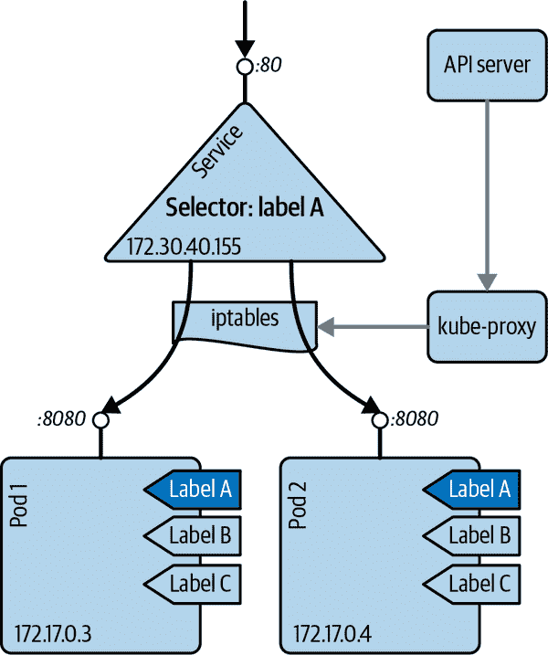
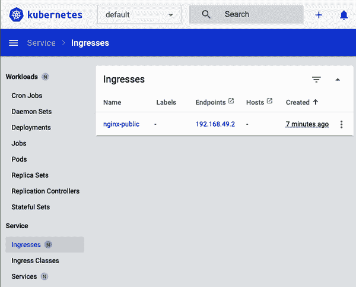
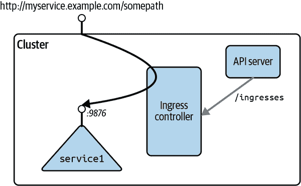

# 第五章：使用服务工作

在本章中，我们讨论了 Pod 在集群内部如何通信，应用程序如何发现彼此，以及如何暴露 Pod 以便从集群外部访问。

这里使用的资源称为 Kubernetes [*服务*](https://oreil.ly/BGn9e)，如图 5-1 所示。



###### 图 5-1\. Kubernetes 服务概念

服务为一组 Pod 提供了稳定的虚拟 IP（VIP）地址。尽管 Pod 可能会动态变化，但服务允许客户端通过 VIP 可靠地发现和连接运行在 Pod 中的容器。VIP 中的“虚拟”意味着它不是连接到网络接口的实际 IP 地址；它的目的纯粹是将流量转发到一个或多个 Pod。保持 VIP 与 Pod 之间的映射信息更新是`kube-proxy`的工作，这是运行在集群每个节点上的一个进程。`kube-proxy`通过查询 API 服务器来了解集群中的新服务，并相应地更新节点的 iptables 规则，以提供必要的路由信息。

# 5.1 创建一个暴露应用程序的服务

## 问题

您希望为在集群内部发现和访问您的应用程序提供一种稳定和可靠的方式。

## 解决方案

为构成您的应用程序的 Pod 创建一个 Kubernetes 服务。

假设您使用`kubectl create deployment nginx --image nginx:1.25.2`创建了一个`nginx`部署，您可以使用`kubectl expose`命令自动创建一个`Service`对象，如下所示：

```
$ kubectl expose deploy/nginx --port 80
service "nginx" exposed

$ kubectl describe svc/nginx
Name:              nginx
Namespace:         default
Labels:            app=nginx
Annotations:       <none>
Selector:          app=nginx
Type:              ClusterIP
IP Family Policy:  SingleStack
IP Families:       IPv4
IP:                10.97.137.240
IPs:               10.97.137.240
Port:              <unset>  80/TCP
TargetPort:        80/TCP
Endpoints:         172.17.0.3:80
Session Affinity:  None
Events:            <none>

```

当您列出`Service`时，您将看到对象出现：

```
$ kubectl get svc nginx
NAME         TYPE        CLUSTER-IP     EXTERNAL-IP   PORT(S)   AGE
nginx        ClusterIP   10.97.137.240   <none>        80/TCP    2s

```

## 讨论

要通过浏览器访问此服务，请在单独的终端中运行代理，如下所示：

```
$ kubectl proxy
Starting to serve on 127.0.0.1:8001

```

然后使用以下命令在浏览器中打开：

```
$ open http://localhost:8001/api/v1/namespaces/default/services/nginx/proxy/

```

您应该看到 NGINX 的默认页面。

###### 提示

如果您的服务似乎无法正常工作，请检查选择器中使用的标签，并验证使用`kubectl get endpoints` `*<service-name>*`是否填充了一组端点。如果没有，则很可能是您的选择器未找到任何匹配的 Pod。

如果您想手动为相同的`nginx`部署创建一个`Service`对象，您可以编写以下 YAML 文件：

```
apiVersion:  v1
kind: Service
metadata:
  name: nginx
spec:
  selector:
    app: nginx
  ports:
  - port: 80
```

在这个 YAML 文件中需要注意的一点是*选择器*，它用于选择构成这个微服务抽象的所有 Pod。Kubernetes 使用`Service`对象动态配置所有节点上的 iptables，以便将网络流量发送到构成微服务的容器。选择是通过标签查询来完成的（参见 Recipe 7.6），并导致一个端点列表。

###### 注意

Pod 的监管者，如`Deployments`或`ReplicationSets`，与`Services`的运作方式是正交的。虽然两者都通过标签找到它们管理的 Pod，但它们的任务不同：监管者监控并重新启动 Pod 的健康状态，而`Services`则以可靠的方式使它们可访问。

## 参见

+   Kubernetes [`Service`文档](https://oreil.ly/BGn9e)

+   Kubernetes 教程[“使用服务来暴露您的应用程序”](https://oreil.ly/NVOhU)

# 5.2 验证服务的 DNS 条目

## 问题

您已经创建了一个服务（参见 Recipe 5.1），并希望验证您的域名系统（DNS）注册是否正常工作。

## 解决方案

默认情况下，Kubernetes 使用`ClusterIP`作为服务类型，并将服务暴露在集群内部 IP 上。如果 DNS 集群附加组件可用且正常工作，则可以通过形如`$SERVICENAME.$NAMESPACE.svc.cluster.local`的完全限定域名(FQDN)访问服务。

要验证这是否按预期工作，请在集群中的容器内获取交互式 shell。最简单的方法是使用`kubectl run`命令和`busybox`镜像，如下所示：

```
$ kubectl run busybox --rm -it --image busybox:1.36 -- /bin/sh
If you don't see a command prompt, try pressing enter.

/ # nslookup nginx
Server:		10.96.0.10
Address:	10.96.0.10:53

Name:	nginx.default.svc.cluster.local
Address: 10.100.34.223

```

返回的 IP 地址应对应于其集群 IP。

输入`exit`并按 Enter 键离开容器。

## 讨论

默认情况下，DNS 查询将限定在与发出请求的 Pod 相同的命名空间内。例如，在前面的示例中，如果你在运行`nginx`的命名空间与运行`busybox`的命名空间不同，那么默认情况下查找将不会返回任何结果。要指定正确的命名空间，请使用以下语法：`*<service-name>*``.``*<namespace>*`，例如，`nginx.staging`。

# 5.3 更改服务类型

## 问题

如果您已经有一个现有的服务，比如类型为`ClusterIP`，如 Recipe 5.2 所述，并且您希望将其类型更改为`NodePort`或通过云提供商负载均衡器使用`LoadBalancer`服务类型来暴露应用程序。

## 解决方案

使用`kubectl edit`命令及您喜欢的编辑器更改服务类型。假设您有一个名为*simple-nginx-svc.yaml*的清单文件，内容如下：

```
kind: Service
apiVersion: v1
metadata:
  name: webserver
spec:
  ports:
  - port: 80
  selector:
    app: nginx
```

创建`webserver`服务并查询它：

```
$ kubectl apply -f simple-nginx-svc.yaml

$ kubectl get svc/webserver
NAME        TYPE        CLUSTER-IP      EXTERNAL-IP   PORT(S)   AGE
webserver   ClusterIP   10.98.223.206   <none>        80/TCP    11s

```

接下来，将服务类型更改为`NodePort`，如下所示：

```
$ kubectl edit svc/webserver

```

这个命令将下载 API 服务器当前的服务规范，并在你的默认编辑器中打开它。请注意文末的粗体区域，在这里我们已经从`ClusterIP`类型更改为`NodePort`类型：

```
# Please edit the object below. Lines beginning with a '#' will be ignored,
# and an empty file will abort the edit. If an error occurs while saving this...
# reopened with the relevant failures.
#
apiVersion: v1
kind: Service
metadata:
  annotations:
    kubectl.kubernetes.io/last-applied-configuration: |
      {"apiVersion":"v1","kind":"Service","metadata":{"annotations":{},"name"...
  creationTimestamp: "2023-03-01T14:07:55Z"
  name: webserver
  namespace: default
  resourceVersion: "1128"
  uid: 48daed0e-a16f-4923-bd7e-1d879dc2221f
spec:
  clusterIP: 10.98.223.206
  clusterIPs:
  - 10.98.223.206
  externalTrafficPolicy: Cluster
  internalTrafficPolicy: Cluster
  ipFamilies:
  - IPv4
  ipFamilyPolicy: SingleStack
  ports:
  - nodePort: 31275
    port: 80
    protocol: TCP
    targetPort: 80
  selector:
    app: nginx
  sessionAffinity: None
  type: NodePort
status:
  loadBalancer: {}

```

保存编辑（将`type`更改为`NodePort`）后，您可以验证更新的服务，如下所示：

```
$ kubectl get svc/webserver
NAME        TYPE       CLUSTER-IP      EXTERNAL-IP   PORT(S)        AGE
webserver   NodePort   10.98.223.206   <none>        80:31275/TCP   4m

$ kubectl get svc/webserver -o yaml
apiVersion: v1
kind: Service
metadata:
  annotations:
    kubectl.kubernetes.io/last-applied-configuration: |
      {"apiVersion":"v1","kind":"Service","metadata":{"annotations":{},"name"...
  creationTimestamp: "2023-03-01T14:07:55Z"
  name: webserver
  namespace: default
  resourceVersion: "1128"
  uid: 48daed0e-a16f-4923-bd7e-1d879dc2221f
spec:
  clusterIP: 10.98.223.206
  clusterIPs:
  - 10.98.223.206
  externalTrafficPolicy: Cluster
  internalTrafficPolicy: Cluster
  ipFamilies:
  - IPv4
  ipFamilyPolicy: SingleStack
  ports:
  - nodePort: 31275
    port: 80
    protocol: TCP
    targetPort: 80
  selector:
    app: nginx
  sessionAffinity: None
  type: NodePort
status:
  loadBalancer: {}

```

## 讨论

请注意，您可以根据您的用例更改服务类型；但是，请注意某些类型（例如`LoadBalancer`）可能触发公共云基础设施组件的配置，如果在没有意识和/或监控的情况下使用可能会很昂贵。

## 参见

+   关于不同类型的[Kubernetes 服务](https://oreil.ly/r63eA)的详细信息

# 5.4 部署 Ingress 控制器

## 问题

您希望部署一个 Ingress 控制器来了解 `Ingress` 对象。您对 `Ingress` 对象感兴趣，因为您希望从 Kubernetes 集群外部访问正在运行的应用程序；但是，您不希望创建 `NodePort` 或 `LoadBalancer` 类型的服务。

## 解决方案

Ingress 控制器充当反向代理和负载均衡器。它将外部流量路由到平台内运行的 Pod，并允许您在集群上部署多个应用程序，每个应用程序都可通过主机名和/或 URI 路径进行寻址。

要使 `Ingress` 对象（在 Recipe 5.5 中讨论）生效，并为外部集群到您的 Pod 提供路由，您需要部署一个 Ingress 控制器：

```
$ kubectl apply -f https://raw.githubusercontent.com/kubernetes/ingress-nginx/
controller-v1.8.1/deploy/static/provider/cloud/deploy.yaml

```

###### 提示

在 Minikube 上，您可以简单地启用 `ingress` 插件，如下所示：

```
$ minikube addons enable ingress

```

大约一分钟后，在新创建的 `ingress-nginx` 命名空间中将启动一个新的 Pod。

```
$ kubectl get pods -n ingress-nginx
NAME                                       READY   STATUS      RESTARTS   AGE
ingress-nginx-admission-create-xpqbt       0/1     Completed   0          3m39s
ingress-nginx-admission-patch-r7cnf        0/1     Completed   1          3m39s
ingress-nginx-controller-6cc5ccb977-l9hvz  1/1     Running     0          3m39s

```

现在您可以创建 `Ingress` 对象了。

## 讨论

NGINX 是 Kubernetes 项目正式支持的 Ingress 控制器之一，但还有许多其他 [开源和商业解决方案](https://oreil.ly/eukmq) 支持 Ingress 规范，其中许多提供更广泛的 API 管理功能。

在撰写本文时，新的 Kubernetes [Gateway API 规范](https://oreil.ly/Y27m-) 正在作为 Ingress 规范的未来替代品出现，并且已经得到许多第三方网关提供商的支持。如果您刚开始使用 Ingress，考虑将 Gateway API 作为更为未来证明的起点是值得的。

## 参见

+   [Kubernetes `Ingress` 文档](https://oreil.ly/9xoks)

+   [基于 NGINX 的 Ingress 控制器](https://oreil.ly/691Lx)

+   [Minikube 的 `ingress-dns` 插件](https://oreil.ly/To14r)

# 5.5 使服务从集群外部访问

## 问题

您希望从集群外部通过 URI 路径访问 Kubernetes 服务。

## 解决方案

使用 Ingress 控制器（参见 Recipe 5.4），通过创建 `Ingress` 对象进行配置。

假设您想部署一个简单的服务，可以调用并返回“Hello, world!”，请从创建部署开始：

```
$ kubectl create deployment web --image=gcr.io/google-samples/hello-app:2.0

```

然后暴露服务：

```
$ kubectl expose deployment web --port=8080

```

验证所有这些资源是否已正确创建：

```
$ kubectl get all -l app=web
NAME                       READY   STATUS    RESTARTS   AGE
pod/web-79b7b8f988-95tjv   1/1     Running   0          47s

NAME          TYPE        CLUSTER-IP      EXTERNAL-IP   PORT(S)    AGE
service/web   ClusterIP   10.100.87.233   <none>        8080/TCP   8s

NAME                  READY   UP-TO-DATE   AVAILABLE   AGE
deployment.apps/web   1/1     1            1           47s

NAME                             DESIRED   CURRENT   READY   AGE
replicaset.apps/web-79b7b8f988   1         1         1       47s

```

下面是配置 URI 路径 `/web` 到 `hello-app` 服务的 `Ingress` 对象清单：

```
$ cat nginx-ingress.yaml
apiVersion: networking.k8s.io/v1
kind: Ingress
metadata:
  name: nginx-public
  annotations:
    nginx.ingress.kubernetes.io/rewrite-target: /
spec:
  ingressClassName: nginx
  rules:
  - host:
    http:
      paths:
      - path: /web
        pathType: Prefix
        backend:
          service:
            name: web
            port:
              number: 8080

$ kubectl apply -f nginx-ingress.yaml

```

现在您可以在 Kubernetes 仪表板中看到为 NGINX 创建的 `Ingress` 对象（图 5-2）。



###### 图 5-2\. NGINX `Ingress` 对象

从 Kubernetes 仪表板上，您可以看到 NGINX 将通过 IP 地址 192.168.49.2（您的可能会有所不同）可用。基于此信息，您可以按以下方式从集群外部访问 NGINX 的 `/web` URI 路径：

```
$ curl https://192.168.49.2/web
Hello, world!
Version: 1.0.0
Hostname: web-68487bc957-v9fj8

```

## 讨论

使用以下命令而不是使用仪表板查看您的服务 IP 地址的替代方法：

```
$ kubectl describe ingress

```

通常情况下，Ingress 的工作原理如 图 5-3 所示：Ingress 控制器监听 API 服务器的 `/ingresses` 端点，了解新规则。然后配置路由，使外部流量到达特定的（集群内部）服务，在所示示例中是端口 9876 上的 `service1`。



###### 图 5-3\. Ingress 概念

## 另请参阅

+   [GitHub 上的 *kubernetes/ingress-nginx* 仓库](https://oreil.ly/guulG)
