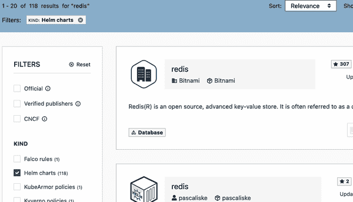

# 第六章：管理应用程序清单

在本章中，我们将探讨如何通过使用工具如 Helm、`kompose` 和 kapp 简化 Kubernetes 上应用程序的管理。这些工具主要集中在管理你的 YAML 清单文件。Helm 是一个 YAML 模板化、打包和部署工具，而 Kompose 是一个帮助你将 Docker Compose 文件迁移到 Kubernetes 资源清单的工具。kapp 是一个相对较新的工具，允许你将一组 YAML 文件管理为一个应用程序，并以此方式管理它们的部署作为单个应用程序。

# 6.1 安装 Helm，Kubernetes 的包管理器

## 问题

你不想手工编写所有的 Kubernetes 清单。相反，你希望能够在仓库中搜索一个包，并使用命令行界面下载并安装它。

## 解决方案

使用 [Helm](https://helm.sh)。Helm 包括一个名为 `helm` 的客户端 CLI，用于在 Kubernetes 集群上搜索和部署图表。

你可以从 GitHub 的 [release 页面](https://oreil.ly/0A7Ty) 下载 Helm，并将 `helm` 二进制文件移到你的 `$PATH` 中。例如，在 macOS（Intel）上，对于 v3.12.3 版本，执行以下操作：

```
$ wget https://get.helm.sh/helm-v3.12.3-darwin-amd64.tar.gz
$ tar -xvf helm-v3.12.3-darwin-amd64.tar.gz
$ sudo mv darwin-amd64/helm /usr/local/bin

```

或者，你可以使用便捷的 [安装脚本](https://oreil.ly/V6_bt) 安装最新版本的 Helm：

```
$ wget -O get_helm.sh https://raw.githubusercontent.com/helm/helm/main/
scripts/get-helm-3

$ chmod +x get_helm.sh
$ ./get_helm.sh

```

## 讨论

Helm 是 Kubernetes 的包管理器；它将 Kubernetes 包定义为一组清单和一些元数据。这些清单实际上是模板。当 Helm 实例化包时，模板中的值被填充。Helm 包被称为 *chart*，并且打包的图表在图表仓库中向用户提供。

在 Linux 或 macOS 上安装 Helm 的另一种方法是使用 [Homebrew](https://brew.sh) 包管理器：

```
$ brew install helm

```

# 6.2 将图表仓库添加到 Helm

## 问题

你已经安装了 `helm` 客户端（参见 Recipe 6.1），现在你想要找到并添加图表仓库到 Helm。

## 解决方案

图表仓库包含打包的图表和一些元数据，这使得 Helm 能够在仓库中搜索图表。在你可以使用 Helm 安装应用程序之前，你需要找到并添加提供图表的图表仓库。

正如 Figure 6-1 所示，[Artifact Hub](https://artifacthub.io) 是一个基于 Web 的服务，允许你从各种发布者那里搜索 [超过 10,000 个图表](https://oreil.ly/0olJi) 并将图表仓库添加到 Helm 中。



###### 图 6-1\. 工件中心，搜索 Redis 的 Helm 图表

## 讨论

`helm` 命令还与 Artifact Hub 集成，允许你直接从 `helm` 命令行搜索 Artifact Hub。

假设你想要搜索提供 Redis 图表的发布者。你可以使用 `helm search hub` 命令来找到一个：

```
$ helm search hub --list-repo-url redis
URL                      CHART VER... APP VER...  DESCRIPTION    REPO URL
https://art...s/redis    0.1.1        6.0.8.9     A Helm cha...  https://spy8...
https://art...s-arm/...  17.8.0       7.0.8       Redis(R) i...  https://libr...
https://art...ontain...  0.15.2       0.15.0      Provides e...  https://ot-c...
...

```

如果您想部署由[Bitnami](https://oreil.ly/jL7Xz)发布的图表（一个知名的发布者，拥有超过 100 个生产质量的图表），请使用以下命令添加图表仓库：

```
$ helm repo add bitnami https://charts.bitnami.com/bitnami

```

现在你已经准备好从仓库安装图表。

# 6.3 使用 Helm 安装应用程序

## 问题

您已将图表仓库添加到 Helm 中（参见 Recipe 6.2），现在您想要搜索图表并部署它们。

## 解决方案

假设你想要从[Bitnami chart repository](https://oreil.ly/TAPRO)部署 Redis 图表。

在搜索图表仓库之前，更新图表仓库的本地缓存索引是一个良好的实践：

```
$ helm repo update
Hang tight while we grab the latest from your chart repositories...
...Successfully got an update from the "bitnami" chart repository
Update Complete. ⎈Happy Helming!⎈

```

在 Bitnami 图表库中搜索`redis`：

```
$ helm search repo bitnami/redis
NAME                  CHART VERSION APP VERSION DESCRIPTION
bitnami/redis         18.0.1        7.2.0       Redis(R) is an...
bitnami/redis-cluster 9.0.1         7.2.0       Redis(R) is an...

```

并使用`helm install`部署图表：

```
$ helm install redis bitnami/redis

```

Helm 将使用默认的图表配置并创建一个名为`redis`的 Helm 发布。Helm 发布是在图表中定义的所有 Kubernetes 对象的集合，您可以将其作为单个单元管理。

过一段时间后，您应该会看到`redis`的 Pod 正在运行：

```
$ kubectl get all -l app.kubernetes.io/name=redis
NAME                   READY   STATUS    RESTARTS   AGE
pod/redis-master-0     1/1     Running   0          114s
pod/redis-replicas-0   1/1     Running   0          114s
pod/redis-replicas-1   1/1     Running   0          66s
pod/redis-replicas-2   1/1     Running   0          38s

NAME                    TYPE        CLUSTER-IP      EXTERNAL-IP   PORT(S)    AGE
service/redis-headless  ClusterIP   None            <none>        6379/TCP   114s
service/redis-master    ClusterIP   10.105.20.184   <none>        6379/TCP   114s
service/redis-replicas  ClusterIP   10.105.27.109   <none>        6379/TCP   114s

NAME                              READY   AGE
statefulset.apps/redis-master     1/1     114s
statefulset.apps/redis-replicas   3/3     114s

```

## 讨论

`helm install`命令的输出可能包含有关部署的重要信息，例如从秘密中检索的密码、已部署的服务等。您可以使用`helm list`命令列出现有的 Helm 安装，然后使用`helm status *<name>*`查看该安装的详细信息：

```
% helm status redis
NAME: redis
LAST DEPLOYED: Fri Nov 10 09:42:17 2023
NAMESPACE: default
STATUS: deployed
...

```

要了解有关 Helm 图表以及如何创建自己的图表的更多信息，请参阅 Recipe 6.8。

# 6.4 检查图表的可自定义参数

## 问题

您想了解图表的可自定义参数及其默认值。

## 解决方案

图表发布者公开了图表的各种参数，可以在安装图表时进行配置。这些参数的默认值配置在一个*Values*文件中，其内容可以使用`helm show values`命令查看，例如：

```
$ helm show values bitnami/redis
...
...
## @param architecture Redis® architecture. Allowed values: `standalone` or
`replication`
##
architecture: replication
...
...

```

## 讨论

出版者通常会在*Values*文件中记录图表参数的使用。然而，图表的*Readme*文件可以提供更详尽的文档，包括特定的使用说明。要查看图表的*Readme*文件，使用`helm show readme`命令。例如：

```
$ helm show readme bitnami/redis
...
...
### Redis® common configuration parameters

| Name                       | Description                     | Value         |
| -------------------------- | --------------------------------| ------------- |
| `architecture`             | Redis® architecture...          | `replication` |
| `auth.enabled`             | Enable password authentication  | `true`        |
...
...

```

值得注意的是，这个*Readme*与在[Artifact Hub](https://oreil.ly/dIYpI)上呈现的图表相同。

# 6.5 覆盖图表参数

## 问题

您已经了解了图表的各种可自定义参数（参见 Recipe 6.4），现在您想要自定义图表的部署。

## 解决方案

安装图表时，可以通过传递`--set` `*key*``=``*value*`标志来覆盖 Helm 图表的默认参数。可以多次指定该标志，或者用逗号分隔键/值对，例如：`key1=value1,key2=value2`。

例如，您可以覆盖`bitnami/redis`图表的部署配置，以使用`standalone`架构，如下所示：

```
$ helm install redis bitnami/redis --set architecture=standalone

```

## 讨论

当您需要覆盖许多图表参数时，可以提供 `--values` 标志以输入包含所有要覆盖参数的 YAML 格式文件。对于前面的示例，创建一个名为 *values.yaml* 的文件，其中包含以下内容：

```
architecture: standalone
```

然后将文件输入到 `helm install` 中：

```
$ helm install redis bitnami/redis --values values.yaml

```

`bitnami/redis` 图表的 `standalone` 配置生成较少的 pod 资源，适用于开发目的。让我们看一下：

```
$ kubectl get pods
NAME             READY   STATUS    RESTARTS   AGE
redis-master-0   1/1     Running   0          3m14s

```

# 6.6 获取 Helm 发布的用户提供的参数

## 问题

您的 Kubernetes 集群有一个 Helm 发布，您想知道安装图表时指定的用户提供的图表参数。

## 解决方案

`helm list` 命令获取集群中存在的 Helm 发布对象列表：

```
$ helm list
NAME  NAMESPACE REVISION  UPDATED              STATUS    CHART        APP VERSION
redis default   1         2022-12-30 14:02...  deployed  redis-17.4.0 7.0.7

```

您可以使用 `helm get` 命令获取有关 Helm 发布的扩展信息，例如用户提供的值：

```
$ helm get values redis
USER-SUPPLIED VALUES:
architecture: standalone

```

## 讨论

除了 `values` 之外，您还可以使用 `helm get` 命令检索配置图表中的 YAML 清单、部署后笔记和钩子。

# 6.7 使用 Helm 卸载应用程序

## 问题

您不再需要使用 Helm 安装的应用程序（参见 Recipe 6.3），希望将其移除。

## 解决方案

当您使用图表安装应用程序时，它会创建一个 Helm 发布，可以作为单个单元管理。要移除使用 Helm 安装的应用程序，只需使用 `helm uninstall` 命令移除 *release* 即可。

假设您要删除一个名为 *redis* 的 Helm 发布：

```
$ helm uninstall redis
release "redis" uninstalled

```

Helm 将删除与发布关联的所有 Kubernetes 对象，并释放与它们对象关联的集群资源。

# 6.8 使用 Helm 创建自己的图表以打包您的应用程序

## 问题

您已经编写了一个包含多个 Kubernetes 清单的应用程序，并希望将其打包为 Helm 图表。

## 解决方案

使用 `helm create` 和 `helm package` 命令。

使用 `helm create` 命令生成您的图表的框架。在终端中输入该命令，并指定您的图表名称。例如，要创建一个 `oreilly` 图表：

```
$ helm create oreilly
Creating oreilly

$ tree oreilly/
oreilly/
├── Chart.yaml
├── charts
├── templates
│   ├── NOTES.txt
│   ├── _helpers.tpl
│   ├── deployment.yaml
│   ├── hpa.yaml
│   ├── ingress.yaml
│   ├── service.yaml
│   ├── serviceaccount.yaml
│   └── tests
│       └── test-connection.yaml
└── values.yaml

3 directories, 10 files

```

## 讨论

`helm create` 命令为典型的 Web 应用程序生成脚手架。您可以编辑生成的脚手架并适应您的应用程序，或者如果您已经编写了自己的清单，则可以删除 *templates/* 目录中的内容，并将您现有的模板复制到其中。如果您希望对清单进行模板化，请在 *values.yaml* 文件中编写需要替换的值。编辑元数据文件 *Chart.yaml*，如果有任何依赖图表，请将它们放在 */charts* 目录中。

您可以通过运行以下命令在本地测试您的图表：

```
$ helm install oreilly-app ./oreilly

```

最后，您可以使用 `helm package oreilly/` 将其打包，生成一个可重新分发的图表压缩包。如果要将图表发布到图表存储库，请将其复制到存储库并使用命令 `helm repo index .` 生成一个新的 *index.yaml*。更新图表注册表完成后，假设您已将图表存储库添加到 Helm（参见 Recipe 6.2），`helm search repo oreilly` 应该返回您的图表：

```
$ helm search repo oreilly
NAME            	VERSION	DESCRIPTION
oreilly/oreilly 	0.1.0  	A Helm chart for Kubernetes

```

## 参见

+   [“创建您的第一个 Helm Chart”](https://oreil.ly/fGfgF) 在 VMware 应用程序目录文档中

+   [“图表最佳实践指南”](https://oreil.ly/kcznF) 在 Helm 文档中

# 6.9 安装 Kompose

## 问题

您已经开始使用 Docker 容器并编写了一些 Docker compose 文件来定义您的多容器应用程序。现在您想开始使用 Kubernetes，并想知道是否以及如何重用您的 Docker compose 文件。

## 解决方案

使用 [Kompose](https://kompose.io)。Kompose 是一个将 Docker compose 文件转换为 Kubernetes（或 OpenShift）清单的工具。

首先，从 GitHub [发布页面](https://oreil.ly/lmiCJ) 下载 `kompose` 并将其移动到您的 `$PATH`，以便使用时更加方便。

例如，在 macOS 上，执行以下操作：

```
$ wget https://github.com/kubernetes/kompose/releases/download/v1.27.0/
kompose-darwin-amd64 -O kompose

$ sudo install -m 755 kompose /usr/local/bin/kompose
$ kompose version

```

或者，Linux 和 macOS 用户可以使用 [Homebrew](https://brew.sh) 软件包管理器安装 `kompose` 命令行工具：

```
$ brew install kompose

```

# 6.10 将 Docker Compose 文件转换为 Kubernetes Manifests

## 问题

您已经安装了 `kompose` 命令（参见 Recipe 6.9），现在您想将 Docker compose 文件转换为 Kubernetes manifests。

## 解决方案

假设您有以下启动 `redis` 容器的 Docker compose 文件：

```
version: '2'

services:
  redis:
    image: redis:7.2.0
    ports:
    - "6379:6379"
```

使用 Kompose，您可以使用以下命令自动将其转换为 Kubernetes manifests：

```
$ kompose convert

```

Kompose 将读取 Docker compose 文件的内容并在当前目录生成 Kubernetes manifests。然后您可以使用 `kubectl apply` 在集群中创建这些资源。

## 讨论

将 `--stdout` 参数添加到 `kompose convert` 命令中将生成 YAML，可以直接传输到 `kubectl apply`，如下所示：

```
$ kompose convert --stdout | kubectl apply -f -

```

一些 Docker compose 指令未转换为 Kubernetes。在这种情况下，`kompose` 会打印警告，告知您转换未成功。

虽然通常不会引起问题，但转换可能导致 Kubernetes 中的工作清单不起作用。这是预期的，因为这种转换类型无法完美。但是，它将使您接近一个可工作的 Kubernetes manifest。特别是，处理卷和网络隔离通常需要您手动进行自定义工作。

# 6.11 将 Docker Compose 文件转换为 Helm Chart

## 问题

您已经安装了 `kompose` 命令（参见 Recipe 6.9），现在您想从 Docker compose 文件创建一个 Helm chart。

## 解决方案

除了使用 Kompose 将 Docker compose 文件转换为 Kubernetes 清单（参见 Recipe 6.10）外，您还可以使用它为转换后的对象生成 Helm 图表。

使用 Kompose 从您的 Docker compose 文件生成 Helm 图表，如下所示：

```
$ kompose convert --chart

```

将在当前目录中生成一个新的 Helm 图表。可以使用 `helm` CLI 打包、部署和管理此图表（参见 Recipe 6.3）。

# 6.12 安装 kapp

## 问题

您已编写了部署应用程序到集群的 YAML 文件，并希望部署和管理部署的生命周期，但不想将其打包为 Helm 图表。

## 解决方案

使用 [kapp](https://carvel.dev/kapp)，这是一个 CLI 工具，可以批量管理资源。与 Helm 不同，kapp 将 YAML 模板化视为其范围之外，并专注于管理应用程序部署。

要安装 kapp，请使用 [下载脚本](https://oreil.ly/iAQPd) 从 GitHub [发布页面](https://oreil.ly/9g2f3) 下载适合您平台的最新版本：

```
$ mkdir local-bin/
$ wget https://carvel.dev/install.sh -qO - | \
    K14SIO_INSTALL_BIN_DIR=local-bin bash

$ sudo install -m 755 local-bin/kapp /usr/local/bin/kapp
$ kapp version

```

## 讨论

Linux 和 macOS 用户还可以使用 [Homebrew](https://brew.sh) 软件包管理器安装 kapp：

```
$ brew tap vmware-tanzu/carvel
$ brew install kapp
$ kapp version

```

# 6.13 使用 kapp 部署 YAML 清单

## 问题

您已安装了 kapp（参见 Recipe 6.12），现在您希望使用 kapp 部署和管理您的 YAML 清单。

## 解决方案

kapp 将一组具有相同标签的资源视为一个应用程序。假设您有一个名为 *manifests/* 的文件夹，其中包含部署 NGINX 服务器的 YAML 文件。kapp 将所有这些清单视为单个应用程序：

```
$ cat manifests/deploy.yaml
apiVersion: apps/v1
kind: Deployment
metadata:
  name: nginx
  labels:
    app: nginx
spec:
  replicas: 1
  selector:
    matchLabels:
      app: nginx
  template:
    metadata:
      labels:
        app: nginx
    spec:
      containers:
      - name: nginx
        image: nginx:1.25.2
        ports:
        - containerPort: 80

$ cat manifests/svc.yaml
apiVersion:  v1
kind: Service
metadata:
  name: nginx
spec:
  selector:
    app: nginx
  ports:
  - port: 80

```

要将这些清单部署为带有标签 `nginx` 的应用程序，请使用以下命令：

```
$ kapp deploy -a nginx -f manifests/
...
Namespace  Name   Kind        Age  Op      Op st.  Wait to    Rs  Ri
default    nginx  Deployment  -    create  -       reconcile  -   -
^          nginx  Service     -    create  -       reconcile  -   -
...
Continue? [yN]:

```

kapp 将提供将在集群上创建的资源的概述，并要求用户确认。要更新应用程序，您只需更新 *manifests/* 文件夹中的 YAML 文件，并重新运行 `deploy` 命令。您可以添加 `--diff-changes` 选项以查看更新后 YAML 的差异。

## 讨论

使用 kapp 部署应用程序后，您还可以管理其生命周期。例如，要检查为应用程序部署创建的资源，请执行以下操作：

```
$ kapp inspect -a nginx
...
Name   Namespaces  Lcs   Lca
nginx  default     true  4s
...

```

要列出所有已部署的应用程序，请执行以下操作：

```
$ kapp ls
...
Name   Namespaces  Lcs   Lca
nginx  default     true  4s
...

```

要使用 kapp 删除已部署的应用程序，请执行以下操作：

```
$ kapp delete -a nginx

```
