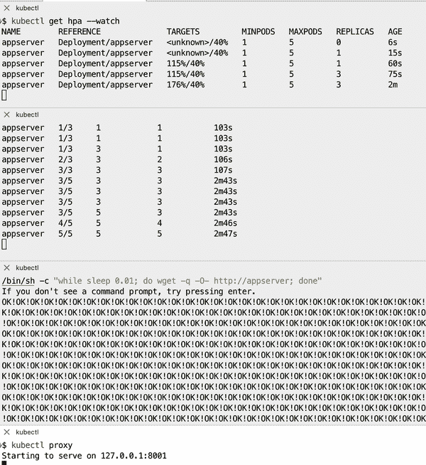
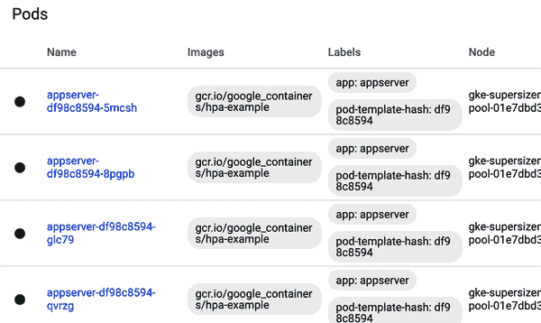
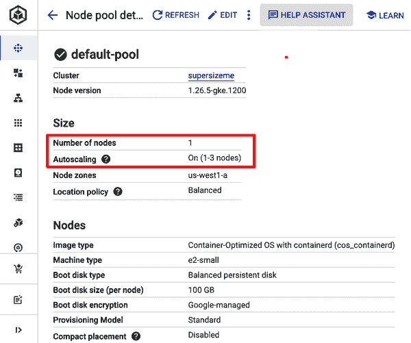
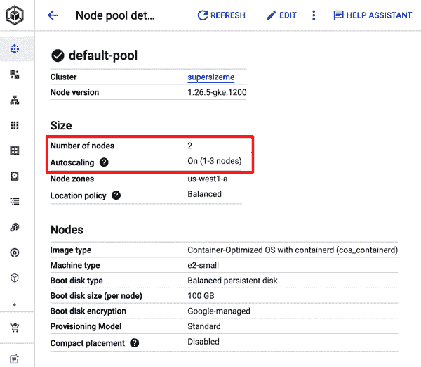

# 第九章：扩展

在 Kubernetes 中，扩展可能对不同的用户意味着不同的事情。我们区分两种情况：

集群扩展

有时被称为*集群弹性*，这指的是根据集群利用率自动添加或移除工作节点的过程。

应用程序级别的扩展

有时被称为*Pod 扩展*，这指的是根据各种指标调整 Pod 特性的（自动化）过程，从低级信号如 CPU 利用率到高级信号如每秒服务的 HTTP 请求，都适用于特定的 Pod。

存在两种类型的 Pod 级别扩展器：

水平 Pod 自动伸缩器（HPAs）

HPAs 根据特定的指标自动增加或减少 Pod 副本的数量。

垂直 Pod 自动伸缩器（VPAs）

VPAs 自动增加或减少运行在 Pod 中的容器的资源需求。

在本章中，我们首先检查 GKE、AKS 和 EKS 的集群弹性，然后讨论使用 HPAs 进行 Pod 扩展。

# 9.1 扩展部署

## 问题

你有一个部署并希望进行水平扩展。

## 解决方案

使用`kubectl scale`命令扩展部署。

让我们重用来自配方 4.5 的`fancyapp`部署，使用五个副本。如果还没有运行，请使用`kubectl apply -f fancyapp.yaml`进行创建。

现在假设负载已经减少，不再需要五个副本；三个就足够了。要将部署规模缩减到三个副本，请执行以下操作：

```
$ kubectl get deploy fancyapp
NAME       READY   UP-TO-DATE   AVAILABLE   AGE
fancyapp   5/5     5            5           59s

$ kubectl scale deployment fancyapp --replicas=3
deployment "fancyapp" scaled

$ kubectl get deploy fancyapp
NAME       READY   UP-TO-DATE   AVAILABLE   AGE
fancyapp   3/3     3            3           81s

```

你可以自动化这个过程，而不是手动调整部署的规模；参见配方 9.2 作为例子。

# 9.2 使用水平 Pod 自动伸缩

## 问题

你想要根据负载自动增加或减少部署中的 Pod 数量。

## 解决方案

如此描述，使用 HPA。

要使用 HPAs，必须可用 Kubernetes Metrics API。要安装 Kubernetes Metrics Server，请参见配方 2.7。

首先，创建一个应用程序——一个 PHP 环境和服务器，作为 HPA 的目标：

```
$ kubectl create deployment appserver --image=registry.k8s.io/hpa-example \
    --port 80
deployment.apps/appserver created
$ kubectl expose deployment appserver --port=80 --target-port=80
$ kubectl set resources deployment appserver -c=hpa-example --requests=cpu=200m

```

接下来，创建一个 HPA 并定义触发参数`--cpu-percent=40`，这意味着 CPU 利用率不应超过 40%：

```
$ kubectl autoscale deployment appserver --cpu-percent=40 --min=1 --max=5
horizontalpodautoscaler.autoscaling/appserver autoscaled

$ kubectl get hpa --watch
NAME        REFERENCE              TARGETS   MINPODS   MAXPODS  REPLICAS   AGE
appserver   Deployment/appserver   1%/40%    1         5        1          2m29s

```

在第二个终端会话中，监视部署的情况：

```
$ kubectl get deploy appserver --watch

```

最后，在第三个终端会话中，启动负载生成器：

```
$ kubectl run -i -t loadgen --rm --image=busybox:1.36 --restart=Never -- \
    /bin/sh -c "while sleep 0.01; do wget -q -O- http://appserver; done"

```

由于涉及三个并行的终端会话，因此在图 9-1 中提供了整体情况的概述。



###### 图 9-1\. 设置 HPA 的终端会话

在展示 Kubernetes 仪表板中的图 9-2 中，你可以看到 HPA 对`appserver`部署的影响。



###### 图 9-2\. Kubernetes 仪表板，显示 HPA 的效果

## 参见

+   [Kubernetes 事件驱动自动伸缩](https://keda.sh)

+   [Kubernetes 文档中的 HPA 演练](https://oreil.ly/b6Pwx)

# 9.3 在 GKE 中自动调整集群大小

## 问题

您希望 GKE 集群中的节点数量根据利用率自动增减。

## 解决方案

使用 GKE 集群自动缩放器。本文假定您已安装了`gcloud`命令，并设置了环境（即您已创建了一个项目并启用了计费）。

创建一个带有一个工作节点并启用集群自动缩放的集群：

```
$ gcloud container clusters create supersizeme --zone=us-west1-a \
    --machine-type=e2-small --num-nodes=1 \
    --min-nodes=1 --max-nodes=3 --enable-autoscaling
Creating cluster supersizeme in us-west1-a... Cluster is being health-checked
(master is healthy)...done.
Created [https://container.googleapis.com/v1/projects/k8s-cookbook/zones/
us-west1-a/clusters/supersizeme].
To inspect the contents of your cluster, go to: https://console.cloud.google.com/
kubernetes/workload_/gcloud/us-west1-a/supersizeme?project=k8s-cookbook
kubeconfig entry generated for supersizeme.
NAME         LOCATION    ...  MACHINE_TYPE  NODE_VERSION     NUM_NODES  STATUS
supersizeme  us-west1-a  ...  e2-small      1.26.5-gke.1200  1          RUNNING

```

此时，在谷歌云控制台上查看时，您应该看到类似于图 9-3 所示的内容。



###### 图 9-3. 谷歌云控制台，显示初始为一个节点的集群大小

现在，使用一个部署启动三个 Pod，并请求集群资源以触发集群自动缩放：

```
$ kubectl create deployment gogs --image=gogs/gogs:0.13 --replicas=3
$ kubectl set resources deployment gogs -c=gogs --requests=cpu=200m,memory=256Mi

```

一段时间后，部署将会更新：

```
$ kubectl get deployment gogs
NAME   READY   UP-TO-DATE   AVAILABLE   AGE
gogs   3/3     3            3           2m27s

```

现在您应该拥有两个节点的集群，如图 9-4 所示。



###### 图 9-4. 谷歌云控制台，显示扩展到两个节点的集群结果

## 讨论

在创建后，可以在 GKE 集群上启用或更新集群自动缩放：

```
$ gcloud container clusters update supersizeme --zone=us-west1-a \
    --min-nodes=1 --max-nodes=3 --enable-autoscaling

```

选择用于集群节点的[机器类型](https://oreil.ly/lz7wQ)是需要考虑的重要因素，这取决于运行工作负载所需的资源。如果您的工作负载需要更多资源，则应考虑使用较大的机器类型。

与 Pod 的缩放不同，集群缩放会动态地向您的集群添加资源，这可能会显著增加您的云账单。确保适当配置 GKE 集群的最大节点数，以避免超出您的消费限制。

当您不再需要集群时，请删除它以避免因未使用的计算资源而被收费：

```
$ gcloud container clusters delete supersizeme

```

## 参见

+   [集群自动缩放器](https://oreil.ly/QHik5)，位于*kubernetes/autoscaler*仓库中

+   [集群自动缩放器](https://oreil.ly/g8lfr)在 GKE 文档中

# 9.4 在 Amazon EKS 集群中自动调整大小

## 问题

您希望 AWS EKS 集群中的节点数量根据利用率自动增减。

## 解决方案

使用[集群自动缩放器](https://oreil.ly/6opBo)，一个利用 AWS 自动扩展组的 Helm 包。按照 Recipe 6.1 安装 Helm 客户端，该客户端用于安装该包。

首先，创建一个带有一个工作节点的集群，并确保可以使用`kubectl`访问它：

```
$ eksctl create cluster --name supersizeme \
    --region eu-central-1 --instance-types t3.small \
    --nodes 1 --nodes-min 1 --nodes-max 3
2023-04-11 12:00:50 [i]  eksctl version 0.136.0-dev+3f5a7c5e0.2023-03-31T10...
2023-04-11 12:00:50 [i]  using region eu-central-1
...
2023-04-11 12:17:31 [i]  kubectl command should work with "/Users/sameersbn/
.kube/config", try 'kubectl get nodes'
2023-04-11 12:17:31 [✔]  EKS cluster "supersizeme" in "eu-central-1" region
is ready

$ aws eks update-kubeconfig --name supersizeme --region eu-central-1

```

接下来，部署 Cluster Autoscaler Helm 图表：

```
$ helm repo add autoscaler https://kubernetes.github.io/autoscaler
$ helm install autoscaler autoscaler/cluster-autoscaler \
    --set autoDiscovery.clusterName=supersizeme \
    --set awsRegion=eu-central-1 \
    --set awsAccessKeyID=<*YOUR AWS KEY ID>* \
    --set awsSecretAccessKey=<*YOUR AWS SECRET KEY>*

```

此时，集群只有一个节点：

```
$ kubectl get nodes
NAME                                 STATUS   ROLES    AGE   VERSION
ip...eu-central-1.compute.internal   Ready    <none>   31m   v1.25.9-eks-0a21954

```

现在，使用一个部署启动五个 Pod，并请求集群资源以触发集群自动缩放：

```
$ kubectl create deployment gogs --image=gogs/gogs:0.13 --replicas=5
$ kubectl set resources deployment gogs -c=gogs --requests=cpu=200m,memory=512Mi

```

一段时间后，部署将会更新：

```
$ kubectl get deployment gogs
NAME   READY   UP-TO-DATE   AVAILABLE   AGE
gogs   5/5     5            5           2m7s

```

现在你的集群应该已经扩展以容纳所请求的资源：

```
$ kubectl get nodes
NAME                                 STATUS   ROLES    AGE   VERSION
ip...eu-central-1.compute.internal   Ready    <none>   92s   v1.25.9-eks-0a21954
ip...eu-central-1.compute.internal   Ready    <none>   93s   v1.25.9-eks-0a21954
ip...eu-central-1.compute.internal   Ready    <none>   36m   v1.25.9-eks-0a21954

```

要避免因未使用资源而收费，请在不再需要时删除集群：

```
$ eksctl delete cluster --name supersizeme --region eu-central-1

```
