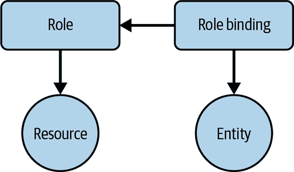

# 第十章：安全性

在 Kubernetes 中运行应用程序需要开发人员和运维人员共同承担责任，以确保最小化攻击向量、遵循最小权限原则，并清晰定义对资源的访问。在本章中，我们将介绍您可以使用的、也应该使用的配方，以确保集群和应用程序的安全运行。本章的配方涵盖以下内容：

+   服务账户的角色和用法

+   基于角色的访问控制（RBAC）

+   定义 Pod 的安全上下文

# 10.1 为应用程序提供唯一标识

## 问题

想要以细粒度控制向应用程序授予对受限资源的访问权限。

## 解决方案

创建具有特定秘密访问权限的服务账户，并在 Pod 规范中引用它。

首先，为此和以下示例创建一个专用命名空间，称为`sec`：

```
$ kubectl create namespace sec
namespace/sec created

```

然后，在该命名空间中创建一个名为`myappsa`的新服务账户，并仔细查看它：

```
$ kubectl create serviceaccount myappsa -n sec
serviceaccount/myappsa created

$ kubectl describe sa myappsa -n sec
Name:                myappsa
Namespace:           sec
Labels:              <none>
Annotations:         <none>
Image pull secrets:  <none>
Mountable secrets:   <none>
Tokens:              <none>
Events:              <none>

```

您可以在 Pod 清单中引用此服务账户，我们将其称为*serviceaccountpod.yaml*，如下所示。请注意，我们还将此 Pod 放置在`sec`命名空间中：

```
apiVersion: v1
kind: Pod
metadata:
  name: myapp
  namespace: sec
spec:
  serviceAccountName: myappsa
  containers:
  - name: main
    image: busybox:1.36
    command:
      - "bin/sh"
      - "-c"
      - "sleep 10000"
```

创建 Pod：

```
$ kubectl apply -f serviceaccountpod.yaml
pod/myapp created

```

服务账户的 API 凭据将自动挂载到*/var/run/secrets/kubernetes.io/serviceaccount/token*位置：

```
$ kubectl exec myapp -n sec -- \
    cat /var/run/secrets/kubernetes.io/serviceaccount/token
eyJhbGciOiJSUzI1NiIsImtpZCI6IkdHeTRHOUUwNl ...

```

实际上，`myappsa`服务账户的令牌已经挂载到 Pod 中预期的位置，并且可以在后续使用。

尽管单独的服务账户并不是非常有用，但它构成了细粒度访问控制的基础；请参阅配方 10.2 了解更多信息。

## 讨论

能够识别实体是认证和授权的前提条件。从 API 服务器的角度看，有两种类型的实体：人类用户和应用程序。虽然用户身份（管理）不在 Kubernetes 的范围之内，但表示应用程序身份的一流资源是服务账户。

从技术上讲，应用程序的认证由位于*/var/run/secrets/kubernetes.io/serviceaccount/token*位置的文件中的令牌捕获，该文件通过秘密自动挂载。服务账户是命名空间资源，其表示如下：

```
system:serviceaccount:$NAMESPACE:$SERVICEACCOUNT
```

列出特定命名空间中的服务账户会得到类似以下的结果：

```
$ kubectl get sa -n sec
NAME      SECRETS   AGE
default   0         3m45s
myappsa   0         3m2s

```

注意这里的服务账户名为`default`。此账户是自动创建的；如果未显式为 Pod 设置服务账户（就像解决方案中所做的那样），它将被分配到其命名空间中的`default`服务账户。

## 参见

+   [“管理服务账户”](https://oreil.ly/FsNK7)，Kubernetes 文档中

+   [“为 Pod 配置服务账户”](https://oreil.ly/mNP_M)，Kubernetes 文档中

+   [“从私有注册表中拉取镜像”](https://oreil.ly/Fg06V)，Kubernetes 文档中

# 10.2 列出和查看访问控制信息

## 问题

您想了解您被允许做的操作——例如，更新部署或列出 secrets。

## 解决方案

下面的解决方案假设您使用 RBAC 作为[授权模式](https://oreil.ly/K7y65)。RBAC 是 Kubernetes 上默认的访问控制模式。

要检查特定用户是否允许对资源执行某个操作，请使用 `kubectl auth can-i`。例如，您可以执行此命令来检查之前在上一节中创建的名为 `system:serviceaccount:sec:myappsa` 的服务账户是否被允许在命名空间 `sec` 中列出 pods：

```
$ kubectl auth can-i list pods --as=system:serviceaccount:sec:myappsa -n=sec
no

```

您可以使用 Kubernetes 内置的 RBAC 系统将角色分配给服务账户。例如，您可以通过为该命名空间分配预定义的 `view` 集群角色，为服务账户授予查看所有资源的权限：

```
$ kubectl create rolebinding my-sa-view \
    --clusterrole=view \
    --serviceaccount=sec:myappsa \
    --namespace=sec
rolebinding.rbac.authorization.k8s.io/my-sa-view created

```

现在如果您运行相同的 `can-i` 命令，您会看到服务账户现在有权限在 `sec` 命名空间中读取 pods：

```
$ kubectl auth can-i list pods --as=system:serviceaccount:sec:myappsa -n=sec
yes

```

###### 注意

对于 Minikube 上的此配方，根据您运行的版本，可能需要在启动 Minikube 集群时添加参数 `--extra-config=apiserver.authorization-mode=Node,RBAC`。

要列出命名空间中可用的角色，请执行以下操作：

```
$ kubectl get roles -n=kube-system
extension-apiserver-authentication-reader        2023-04-14T15:06:36Z
kube-proxy                                       2023-04-14T15:06:38Z
kubeadm:kubelet-config                           2023-04-14T15:06:36Z
kubeadm:nodes-kubeadm-config                     2023-04-14T15:06:36Z
system::leader-locking-kube-controller-manager   2023-04-14T15:06:36Z
system::leader-locking-kube-scheduler            2023-04-14T15:06:36Z
system:controller:bootstrap-signer               2023-04-14T15:06:36Z
system:controller:cloud-provider                 2023-04-14T15:06:36Z
system:controller:token-cleaner                  2023-04-14T15:06:36Z
system:persistent-volume-provisioner             2023-04-14T15:06:39Z

$ kubectl get clusterroles
NAME                               CREATED AT
admin                              2023-04-14T15:06:36Z
cluster-admin                      2023-04-14T15:06:36Z
edit                               2023-04-14T15:06:36Z
kubeadm:get-nodes                  2023-04-14T15:06:37Z
system:aggregate-to-admin          2023-04-14T15:06:36Z
system:aggregate-to-edit           2023-04-14T15:06:36Z
system:aggregate-to-view           2023-04-14T15:06:36Z
system:auth-delegator              2023-04-14T15:06:36Z
...

```

输出显示了预定义的角色，您可以直接为用户和服务账户使用。

要进一步探索特定角色并了解允许的操作，请使用以下方法：

```
$ kubectl describe clusterroles/view
Name:           view
Labels:         kubernetes.io/bootstrapping=rbac-defaults
                rbac.authorization.k8s.io/aggregate-to-edit=true
Annotations:    rbac.authorization.kubernetes.io/autoupdate=true
PolicyRule:
  Resources                                     Non-Resource URLs     ...  ...
  ---------                                     -----------------     ---  ---
  bindings                                      []                    ...  ...
  configmaps                                    []                    ...  ...
  cronjobs.batch                                []                    ...  ...
  daemonsets.extensions                         []                    ...  ...
  deployments.apps                              []                    ...  ...
  deployments.extensions                        []                    ...  ...
  deployments.apps/scale                        []                    ...  ...
  deployments.extensions/scale                  []                    ...  ...
  endpoints                                     []                    ...  ...
  events                                        []                    ...  ...
  horizontalpodautoscalers.autoscaling          []                    ...  ...
  ingresses.extensions                          []                    ...  ...
  jobs.batch                                    []                    ...  ...
  limitranges                                   []                    ...  ...
  namespaces                                    []                    ...  ...
  namespaces/status                             []                    ...  ...
  persistentvolumeclaims                        []                    ...  ...
  pods                                          []                    ...  ...
  pods/log                                      []                    ...  ...
  pods/status                                   []                    ...  ...
  replicasets.extensions                        []                    ...  ...
  replicasets.extensions/scale                  []                    ...  ...
  ...

```

除了 `kube-system` 命名空间中定义的默认角色外，您还可以定义自己的角色；请参见第 10.3 节。

## 讨论

如您在图 10-1 中看到的，处理 RBAC 授权时有一些移动部件：

+   一个实体——即组、用户或服务账户

+   诸如 pod、service 或 secret 等资源

+   一个角色，定义了对资源的操作规则

+   一个角色绑定，将一个角色应用到一个实体上



###### 图 10-1\. RBAC 概念

角色在其规则中使用的资源操作称为动词：

+   `get`、`list`、`watch`

+   `create`

+   `update`/`patch`

+   `delete`

关于角色，我们区分两种类型：

全局集群范围内

集群角色及其相应的集群角色绑定。请注意，您也可以将集群角色附加到常规角色绑定上。

命名空间范围内

角色与角色绑定。

在第 10.3 节中，我们将进一步讨论如何创建并应用您自己的规则到用户和资源上。

## 另请参阅

+   [“授权概述”](https://oreil.ly/57NdL) 在 Kubernetes 文档中

+   [“使用 RBAC 授权”](https://oreil.ly/n0i0c) 在 Kubernetes 文档中

# 10.3 控制对资源的访问

## 问题

对于特定用户或应用程序，您希望允许或拒绝某个操作，如查看 secrets 或更新部署。

## 解决方案

假设您希望限制应用程序仅能查看 pods——即列出 pods 并获取 pods 的详细信息。

我们将在名为 `sec` 的命名空间中操作，因此首先使用 `kubectl create namespace sec` 创建该命名空间。

然后，在 YAML 清单 *pod-with-sa.yaml* 中创建一个 pod 定义，使用专用服务账户 `myappsa`（详见 Recipe 10.1）：

```
apiVersion: v1
kind: Pod
metadata:
  name: myapp
  namespace: sec
spec:
  serviceAccountName: myappsa
  containers:
  - name: main
    image: busybox:1.36
    command:
      - "sh"
      - "-c"
      - "sleep 10000"
```

接下来，在清单 *pod-reader.yaml* 中定义一个角色——我们将其称为 `podreader`，定义在资源上的允许操作：

```
apiVersion: rbac.authorization.k8s.io/v1
kind: Role
metadata:
  name: podreader
  namespace: sec
rules:
- apiGroups: [""]
  resources: ["pods"]
  verbs: ["get", "list"]
```

最后但同样重要的是，您需要将角色 `podreader` 应用到服务账户 `myappsa`，使用 *pod-reader-binding.yaml* 中的角色绑定：

```
apiVersion: rbac.authorization.k8s.io/v1
kind: RoleBinding
metadata:
  name: podreaderbinding
  namespace: sec
roleRef:
  apiGroup: rbac.authorization.k8s.io
  kind: Role
  name: podreader
subjects:
- kind: ServiceAccount
  name: myappsa
  namespace: sec
```

在创建相应资源时，您可以直接使用 YAML 清单（假设服务账户已创建）：

```
$ kubectl create -f pod-reader.yaml
$ kubectl create -f pod-reader-binding.yaml
$ kubectl create -f pod-with-sa.yaml

```

而不是为角色和角色绑定创建清单，您可以使用以下命令：

```
$ kubectl create role podreader \
    --verb=get --verb=list \
    --resource=pods -n=sec

$ kubectl create rolebinding podreaderbinding \
    --role=sec:podreader \
    --serviceaccount=sec:myappsa \
    --namespace=sec

```

注意，这是一个命名空间访问控制设置的案例，因为您正在使用角色和角色绑定。要进行集群范围的访问控制，您将使用相应的 `create clusterrole` 和 `create clusterrolebinding` 命令。

## 讨论

有时候不明确是否应该使用角色还是集群角色和/或角色绑定，因此以下是一些您可能会发现有用的经验法则：

+   如果您希望限制对特定命名空间中的命名空间资源（如服务或 Pod）的访问，请使用角色和角色绑定（就像我们在这个示例中所做的那样）。

+   如果您想要在几个命名空间中重用一个角色，请使用带有角色绑定的集群角色。

+   如果您希望限制对集群范围资源（如节点）或跨所有命名空间的命名空间资源的访问，请使用带有集群角色绑定的集群角色。

## 参见

+   [Kubernetes 授权使用 RBAC 的文档](https://oreil.ly/n0i0c)

# 10.4 保护 Pods

## 问题

您想要在 pod 级别定义应用程序的安全上下文。例如，您希望将应用程序作为非特权进程运行。

## 解决方案

要在 Kubernetes 的 pod 级别强制执行策略，请在 pod 规范中使用 `securityContext` 字段。

假设您想要一个作为非根用户运行的应用程序。为此，您将在容器级别使用安全上下文，如以下清单 *securedpod.yaml* 所示：

```
kind: Pod
apiVersion: v1
metadata:
  name: secpod
spec:
  containers:
  - name: shell
    image: ubuntu:20.04
    command:
      - "bin/bash"
      - "-c"
      - "sleep 10000"
    securityContext:
      runAsUser: 5000
```

现在创建 pod 并检查容器运行的用户：

```
$ kubectl apply -f securedpod.yaml
pod/secpod created

$ kubectl exec secpod -- ps aux
USER         PID %CPU %MEM    VSZ   RSS TTY      STAT START   TIME COMMAND
5000           1  0.0  0.0   2204   784 ?        Ss   15:56   0:00 sleep 10000
5000          13  0.0  0.0   6408  1652 ?        Rs   15:56   0:00 ps aux

```

如预期的那样，它以用户 ID `5000` 运行。请注意，您也可以在 pod 级别而不是特定容器上使用 `securityContext` 字段。

## 讨论

在 pod 级别强制执行策略的更强大方法是使用 pod 安全入场。详见 Kubernetes 文档中的 [“Pod Security Admission”](https://oreil.ly/ujeV4)。

## 参见

+   [“为 Pod 或容器配置安全上下文”](https://oreil.ly/ENH8N)，详见 Kubernetes 文档
