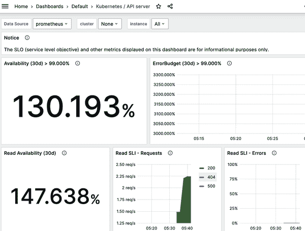

# 第十一章：监控和日志

在本章中，我们专注于基础设施和应用程序级别的监控和日志记录食谱。在 Kubernetes 的上下文中，不同的角色通常有不同的范围：

管理员角色

管理员，如集群管理员、网络操作人员或命名空间级别的管理员，关注的是集群控制平面。他们可能会问自己一些例子性问题：节点是否健康？我们应该添加一个工作节点吗？集群的利用率如何？用户是否接近使用配额限制？

开发人员角色

开发人员主要在应用程序或数据平面的上下文中思考和行动，这在微服务时代可能是一个手到擒来的事情——有时候可能是一到十几个 pod。例如，开发人员可能会问：我分配给运行应用程序的资源足够吗？我应该将应用程序扩展到多少副本？我是否有访问正确卷的权限，它们的使用情况如何？我的某个应用程序是否失败了，如果失败了，原因是什么？

我们将首先通过利用 Kubernetes 存活和就绪探测来聚焦于集群内部监控的食谱，然后关注使用[Metric Server](https://oreil.ly/agm34)和[Prometheus](https://prometheus.io)进行监控，最后涵盖与日志相关的食谱。

# 11.1 访问容器的日志

## 问题

您希望访问运行在特定 pod 中某个容器内的应用程序的日志。

## 解决方案

使用`kubectl logs`命令。要查看各种选项，请检查用法，如下所示：

```
$ kubectl logs --help | more
Print the logs for a container in a pod or specified resource. If the pod has
only one container, the container name is optional.

Examples:
  # Return snapshot logs from pod nginx with only one container
  kubectl logs nginx
...

```

例如，给定由部署启动的 pod（参见食谱 4.1），您可以像这样检查日志：

```
$ kubectl get pods
NAME                             READY   STATUS    RESTARTS   AGE
nginx-with-pv-7d6877b8cf-mjx5m   1/1     Running   0          140m

$ kubectl logs nginx-with-pv-7d6877b8cf-mjx5m
...
2023/03/31 11:03:24 [notice] 1#1: using the "epoll" event method
2023/03/31 11:03:24 [notice] 1#1: nginx/1.23.4
2023/03/31 11:03:24 [notice] 1#1: built by gcc 10.2.1 20210110 (Debian 10.2.1-6)
2023/03/31 11:03:24 [notice] 1#1: OS: Linux 5.15.49-linuxkit
2023/03/31 11:03:24 [notice] 1#1: getrlimit(RLIMIT_NOFILE): 1048576:1048576
2023/03/31 11:03:24 [notice] 1#1: start worker processes
...

```

###### 提示

如果一个 pod 中有多个容器，您可以通过使用`kubectl logs`的`-c`选项并指定容器的名称来获取任何一个容器的日志。

## 讨论

[Stern](https://oreil.ly/o4dxI)是 Kubernetes 上查看 pod 日志的有用替代工具。它使得跨命名空间获取日志变得轻而易举，只需在查询中提供部分 pod 名称（而不是使用选择器，有时可能更繁琐）。

# 11.2 使用存活探测从故障状态恢复

## 问题

您希望确保，如果某些 pod 中运行的应用程序处于故障状态，Kubernetes 将自动重新启动这些 pod。

## 解决方案

使用存活探测。如果探测失败，`kubelet`将自动重新启动 pod。探测是 pod 规范的一部分，并添加到`containers`部分。每个 pod 中的容器都可以有一个存活探测。

一个探测可以有三种不同的类型：可以是在容器内执行的命令，是对容器内部 HTTP 服务器特定路由的 HTTP 或 gRPC 请求，或者是更通用的 TCP 探测。

在以下示例中，我们展示了一个基本的 HTTP 探测：

```
apiVersion: v1
kind: Pod
metadata:
  name: liveness-nginx
spec:
  containers:
  - name: nginx
    image: nginx:1.25.2
    livenessProbe:
      httpGet:
        path: /
        port: 80
```

请参见食谱 11.5 以获取完整示例。

## 参见

+   Kubernetes 的[容器探测文档](https://oreil.ly/nrqEP)

# 11.3 使用就绪性探针控制到 Pod 的流量

## 问题

根据存活性探针（参见 Recipe 11.2），您的 Pod 正在运行，但只有在应用程序准备好提供服务时才希望将流量发送到它们。

## 解决方案

在您的 Pod 规范中添加[就绪性探针](https://oreil.ly/oU3wa)。以下是使用 `nginx` 容器映像运行单个 Pod 的直接示例。就绪性探针向端口 80 发送 HTTP 请求：

```
apiVersion: v1
kind: Pod
metadata:
  name: readiness-nginx
spec:
  containers:
  - name: readiness
    image: nginx:1.25.2
    readinessProbe:
      httpGet:
        path: /
        port: 80
```

## 讨论

尽管此配方中显示的就绪性探针与 Recipe 11.2 中的存活性探针相同，但它们通常应该不同，因为两个探针的目的是提供关于应用程序不同方面的信息。存活性探针检查应用程序进程是否存活，但可能尚未准备好接受请求。就绪性探针检查应用程序是否正确服务请求。因此，只有在就绪性探针通过时，Pod 才会成为服务的一部分（参见 Recipe 5.1）。

## 参见

+   Kubernetes [容器探针文档](https://oreil.ly/nrqEP)

# 11.4 使用启动探针保护启动缓慢的容器

## 问题

您的 Pod 包含一个容器，在首次初始化时需要额外的启动时间，但您不希望使用存活性探针（参见 Recipe 11.2），因为这只是 Pod 第一次启动时的要求。

## 解决方案

根据您的 Pod 规范添加启动探针，设置 `failureThreshold` 和 `periodSeconds` 为足够覆盖 Pod 启动时间。类似于存活性探针，启动探针可以分为三种类型。以下是使用 `nginx` 容器映像运行单个 Pod 的直接示例。启动探针向端口 80 发送 HTTP 请求：

```
apiVersion: v1
kind: Pod
metadata:
  name: startup-nginx
spec:
  containers:
  - name: startup
    image: nginx:1.25.2
    startupProbe:
      httpGet:
        path: /
        port: 80
      failureThreshold: 30
      periodSeconds: 10
```

## 讨论

有时您必须处理需要很长时间才能启动的应用程序。例如，应用程序可能需要执行一些需要很长时间才能完成的数据库迁移。在这种情况下，设置存活性探针可能会有些棘手，而不会影响这种探针推动的快速响应死锁。为了解决这个问题，除了存活性探针之外，还可以设置一个与相同命令、HTTP 检查或 TCP 检查相同的启动探针，但 `failureThreshold * periodSeconds` 要足够长以覆盖最坏情况的启动时间。

如果配置了启动探针，则存活性和就绪性探针在成功之前不会启动，确保这些探针不会干扰应用程序的启动。此技术可安全实现对启动缓慢容器的存活性检查，避免它们在完全运行之前被 `kubelet` 杀死。

## 参见

+   Kubernetes [容器探针文档](https://oreil.ly/nrqEP)

+   [“配置存活性、就绪性和启动探针”](https://oreil.ly/CoMlg)，在 Kubernetes 文档中

# 11.5 向您的部署添加存活性和就绪性探针

## 问题

您希望能够自动检查您的应用程序是否健康，并让 Kubernetes 在这种情况下采取行动。

## 解决方案

要向 Kubernetes 发信号表明您的应用程序的状态，请按照此处描述的方式添加活力和就绪探针。

起始点是一个部署清单，*webserver.yaml*：

```
apiVersion: apps/v1
kind: Deployment
metadata:
  name: webserver
spec:
  replicas: 1
  selector:
    matchLabels:
      app: nginx
  template:
    metadata:
      labels:
        app: nginx
    spec:
      containers:
      - name: nginx
        image: nginx:1.25.2
        ports:
        - containerPort: 80
```

活力和就绪探针在 pod 规范的`containers`部分中定义。查看入门示例（Recipes 11.2 和 11.3）并将以下内容添加到您的部署的 pod 模板中的容器规范中：

```
...
        livenessProbe:
          httpGet:
            path: /
            port: 80
          initialDelaySeconds: 2
          periodSeconds: 10
        readinessProbe:
          httpGet:
            path: /
            port: 80
          initialDelaySeconds: 2
          periodSeconds: 10
...
```

现在，您可以启动它并检查探针：

```
$ kubectl apply -f webserver.yaml
deployment.apps/webserver created

$ kubectl get pods
NAME                         READY     STATUS    RESTARTS   AGE
webserver-4288715076-dk9c7   1/1       Running   0          2m

$ kubectl describe pod/webserver-4288715076-dk9c7
Name:           webserver-4288715076-dk9c7
Namespace:      default
Priority:       0

...
Status:         Running
IP:             10.32.0.2
...
Containers:
  nginx:
    ...
    Ready:           True
    Restart Count:   0
    Liveness:       http-get http://:80/ delay=2s timeout=1s period=10s #succe...
    Readiness:      http-get http://:80/ delay=2s timeout=1s period=10s #succe...
    ...
...

```

请注意，`kubectl describe`命令的输出已编辑为重要部分；还有更多信息可用，但在此问题中无关紧要。

## 讨论

要验证 pod 中的容器是否健康并准备好提供流量，Kubernetes 提供了一系列健康检查机制。健康检查或在 Kubernetes 中称为*探针*，在容器级别定义，并由两个不同的组件执行：

+   每个工作节点上的`kubelet`使用规范中的`livenessProbe`指令来确定何时重新启动一个容器。这些活力探针可以帮助解决启动问题或死锁问题。

+   一个负载均衡一组 pod 的服务使用`readinessProbe`指令来确定一个 pod 是否准备好，因此应该接收流量。如果不是这种情况，它将从服务的端点池中排除。请注意，当所有容器都准备就绪时，一个 pod 被视为准备就绪。

何时使用哪个探针？这实际上取决于容器的行为。如果您的容器在探针失败时可以且应该被杀死并重新启动，请使用活力探针和`restartPolicy`为`Always`或`OnFailure`。如果只有当 pod 准备好时才想要发送流量，请使用就绪探针。请注意，在后一种情况下，就绪探针可以配置为使用与活力探针相同的探测声明端点（例如 URL）。

启动探针用于确定 pod 中的应用程序是否正常启动和运行。它们可以用来延迟活力和就绪探针的初始化，如果应用程序尚未正确启动，则这些探针可能会失败。

## 参见

+   [“配置活力、就绪和启动探针”](https://oreil.ly/CoMlg) 在 Kubernetes 文档中

+   [Kubernetes pod 生命周期文档](https://oreil.ly/vEOdP)

+   [Kubernetes init 容器文档](https://oreil.ly/NWpRM)（v1.6 及以上版本稳定）

# 11.6 在 CLI 中访问 Kubernetes 指标

## 问题

您已安装了 Kubernetes Metrics Server（参见 Recipe 2.7），并希望使用 Kubernetes CLI 访问指标。

## 解决方案

Kubernetes CLI 具有显示节点和 pod 资源使用情况的`top`命令：

```
$ kubectl top node
NAME       CPU(cores)   CPU%   MEMORY(bytes)   MEMORY%
minikube   338m         8%     1410Mi          17%

$ kubectl top pods --all-namespaces
NAMESPACE     NAME                               CPU(cores)   MEMORY(bytes)
default       db                                 15m          440Mi
default       liveness-nginx                     1m           5Mi
default       nginx-with-pv-7d6877b8cf-mjx5m     0m           3Mi
default       readiness-nginx                    1m           3Mi
default       webserver-f4f7cb455-rhxwt          1m           4Mi
kube-system   coredns-787d4945fb-jrp8j           4m           12Mi
kube-system   etcd-minikube                      48m          52Mi
kube-system   kube-apiserver-minikube            78m          266Mi
...

```

这些指标也可以在图形用户界面中查看，即 Kubernetes 仪表盘（参见 配方 2.5）。

###### 提示

在启动 Metrics Server 后，可能需要几分钟才能使其可用。如果尚未准备就绪，则 `top` 命令可能会产生错误。

# 11.7 在 Minikube 上使用 Prometheus 和 Grafana

## 问题

您希望从一个中心位置查看和查询集群的系统和应用程序指标。

## 解决方案

在 Minikube 上部署 Prometheus 和 Grafana。我们将利用 [kube-prometheus 项目](https://oreil.ly/3oyNd)，这是一个独立项目，可以轻松在任何 Kubernetes 集群上安装 Prometheus 和 Grafana。

运行以下命令启动一个新的 Minikube 实例，并正确配置以运行 kube-prometheus：

```
$ minikube delete && minikube start --kubernetes-version=v1.27.0 \
    --memory=6g --bootstrapper=kubeadm \
    --extra-config=kubelet.authentication-token-webhook=true \
    --extra-config=kubelet.authorization-mode=Webhook \
    --extra-config=scheduler.bind-address=0.0.0.0 \
    --extra-config=controller-manager.bind-address=0.0.0.0

```

确保在 Minikube 上禁用 `metrics-server` 插件：

```
$ minikube addons disable metrics-server

```

克隆 kube-prometheus 项目：

```
$ git clone https://github.com/prometheus-operator/kube-prometheus.git

```

切换到克隆的存储库，然后运行以下命令，它将创建一个名为 `monitoring` 的专用命名空间，并创建所需的自定义资源定义：

```
$ kubectl apply --server-side -f manifests/setup
$ kubectl wait \
    --for condition=Established \
    --all CustomResourceDefinition \
    --namespace=monitoring
$ kubectl apply -f manifests/

```

要打开 Prometheus 仪表盘，您可以使用如下的端口转发，或者您可以按照 配方 5.5 中定义的方式使用 ingress：

```
$ kubectl --namespace monitoring port-forward svc/prometheus-k8s 9090

```

您随后可以在浏览器中打开 *localhost:9090* 上的 Prometheus。

您可以执行类似的操作以访问 Grafana 仪表盘：

```
$ kubectl --namespace monitoring port-forward svc/grafana 3000

```

然后在浏览器中打开本地的 Grafana 仪表盘，网址为 *localhost:3000*。

使用默认凭据登录：用户名为 `admin`，密码为 `admin`。如果您只在本地 Minikube 实例上运行此配方，则可以跳过更改密码的步骤。

Kubernetes API 服务器有一个内置的仪表盘。要找到它，打开 URL *[*http://localhost:3000/dashboards*](http://localhost:3000/dashboards)* 或使用左侧菜单导航到仪表盘。找到名为“Kubernetes / API server”的仪表盘；打开它，您应该看到类似 图 11-1 所示的页面。



###### 图 11-1\. Grafana 中的 Kubernetes/API 服务器仪表盘

## 讨论

此处提供了一个很好的方法来开始尝试使用 Grafana 和 Prometheus，并展示如何使用内置的示例仪表盘快速启动。一旦开始部署自己的自定义工作负载和应用程序，您可以创建自己的自定义查询和仪表盘，以提供更符合您工作负载需求的指标。您可以在 [Prometheus 查询参考文档](https://oreil.ly/23dQ9) 中了解更多关于 Prometheus 查询的信息，在 [Grafana 文档](https://oreil.ly/nf6jI) 中了解更多关于 Grafana 仪表盘的信息。

## 另请参阅

+   [GitHub 上的 kube-prometheus](https://oreil.ly/3oyNd)

+   [GitHub 上的 Prometheus Operator](https://oreil.ly/q6pdv)

+   [Prometheus Operator](https://prometheus-operator.dev)

+   [Prometheus](https://prometheus.io)

+   [Grafana](https://grafana.com)
