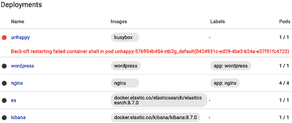
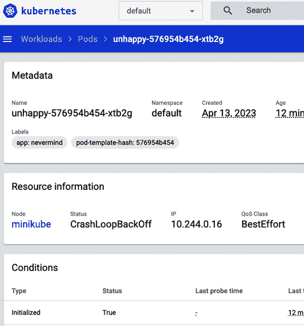
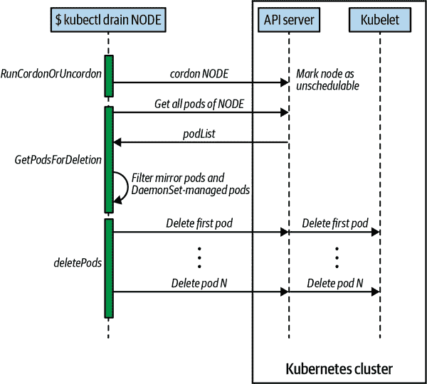

# 第十二章：维护与故障排除

在本章中，您将找到处理应用程序级别和集群级别维护的各种配方。我们涵盖了各种故障排除方面，从调试 pod 和容器到测试服务连接性，解释资源状态以及维护节点。最后但并非最不重要的是，我们将讨论如何处理 Kubernetes 控制平面存储组件 etcd。这一章对集群管理员和应用程序开发人员都有意义。

# 12.1 启用 kubectl 的自动补全

## 问题

输入完整的`kubectl` CLI 命令和参数很麻烦，因此您希望为其添加自动补全功能。

## 解决方案

启用`kubectl`自动补全。

对于 bash shell，您可以使用以下命令在当前 shell 中启用`kubectl`自动补全：

```
$ source <(kubectl completion bash)

```

将此添加到您的*~/.bashrc*文件中，以便在所有 shell 会话中加载自动补全：

```
$ echo 'source <(kubectl completion bash)' >>~/.bashrc

```

请注意，bash 的自动补全依赖于已安装的[bash-completion](https://oreil.ly/AdlLN)。

对于 zsh shell，您可以使用以下命令启用`kubectl`自动补全：

```
$ source <(kubectl completion zsh)

```

而且您可以将同样的命令添加到您的*~/.zshrc*文件中，以便在所有 shell 会话中加载自动补全。

要使 zsh 中的自动补全功能正常工作，您可能需要在您的*~/.zshrc*文件的开头添加以下命令：

```
autoload -Uz compinit
compinit

```

对于其他操作系统和 shell，请查看[文档](https://oreil.ly/G3das)。

## 讨论

提升`kubectl`开发体验的另一个流行方法是将别名定义为缩短`kubectl`为字母`k`。您可以通过执行以下命令或将它们添加到您的 shell 启动脚本中来实现：

```
alias k=kubectl
complete -o default -F __start_kubectl k

```

然后，你可以简单地输入像`k apply -f myobject.yaml`这样的命令。这与自动补全结合使用使生活变得更加轻松。

## 参见

+   [kubectl 概述](https://oreil.ly/mu6PZ)

+   [`kubectl` 速查表](https://oreil.ly/Yrk3C)

# 12.2 从服务中删除一个 Pod

## 问题

您拥有一个明确定义的服务（参见配方 5.1），支持多个 pod。但其中一个 pod 导致问题（例如崩溃或无响应），您希望将其从端点列表中移出以便稍后检查。

## 解决方案

使用`--overwrite`选项重新标记 pod——这将允许您更改 pod 上的`run`标签的值。通过覆盖此标签，您可以确保它不会被服务选择器（配方 5.1）选中，并将其从端点列表中移除。同时，监视您的 pod 的副本集将会注意到一个 pod 消失，并将启动一个新的副本。

要查看其工作原理，请从使用`kubectl run`生成的简单部署开始（参见配方 4.5）：

```
$ kubectl create deployment nginx --image nginx:1.25.2 --replicas 4

```

当您列出带有键`app`的 pod 并显示值为`nginx`的标签时，您将看到四个带有值`nginx`的 pod（`app=nginx`是由`kubectl create deployment`命令自动生成的标签）：

```
$ kubectl get pods -Lapp
NAME                      READY   STATUS    RESTARTS   AGE     APP
nginx-748c667d99-85zxr    1/1     Running   0          14m     nginx
nginx-748c667d99-jrhpc    1/1     Running   0          14m     nginx
nginx-748c667d99-rddww    1/1     Running   0          14m     nginx
nginx-748c667d99-x6h6h    1/1     Running   0          14m     nginx

```

然后你可以暴露这个部署与一个服务，并检查端点，这些端点对应于每个 Pod 的 IP 地址：

```
$ kubectl expose deployments nginx --port 80

$ kubectl get endpoints
NAME            ENDPOINTS                                                  AGE
kubernetes      192.168.49.2:8443                                          3h36m
nginx           10.244.0.10:80,10.244.0.11:80,10.244.0.13:80 + 1 more...   13m

```

假设列表中的第一个 Pod 正在出现问题，尽管它的状态是 *Running*。

通过重新标记将第一个 Pod 移出服务池可以通过单个命令完成：

```
$ kubectl label pod nginx-748c667d99-85zxr app=notworking --overwrite

```

###### 提示

要找到 Pod 的 IP 地址，可以使用 Go 模板格式化 Pod 信息并仅显示其 IP 地址：

```
$ kubectl get pod nginx-748c667d99-jrhpc \
    --template '{{.status.podIP}}' 
10.244.0.11

```

你将看到一个带有标签 `app=nginx` 的新 Pod 出现，你会看到你的不工作的 Pod 仍然存在，但不再出现在服务端点列表中：

```
$ kubectl get pods -Lapp
NAME                      READY   STATUS    RESTARTS   AGE     APP
nginx-748c667d99-85zxr    1/1     Running   0          14m     notworking
nginx-748c667d99-jrhpc    1/1     Running   0          14m     nginx
nginx-748c667d99-rddww    1/1     Running   0          14m     nginx
nginx-748c667d99-x6h6h    1/1     Running   0          14m     nginx
nginx-748c667d99-xfgqp    1/1     Running   0          2m17s   nginx

$ kubectl describe endpoints nginx
Name:         nginx
Namespace:    default
Labels:       app=nginx
Annotations:  endpoints.kubernetes.io/last-change-trigger-time: 2023-04-13T13...
Subsets:
  Addresses:          10.244.0.10,10.244.0.11,10.244.0.13,10.244.0.9
  NotReadyAddresses:  <none>
  Ports:
    Name     Port  Protocol
    ----     ----  --------
    <unset>  80    TCP

Events:  <none>

```

# 12.3 在集群外部访问 ClusterIP 服务

## 问题

你有一个内部服务正给你带来麻烦，你想在本地测试它是否正常工作，而不需要将服务暴露在外部。

## 解决方案

使用 `kubectl proxy` 对 Kubernetes API 服务器进行本地代理。

假设你已经创建了一个部署和一个服务，就像 Recipe 12.2 中描述的那样。当你列出服务时，你应该看到一个 `nginx` 服务：

```
$ kubectl get svc
NAME            TYPE        CLUSTER-IP      EXTERNAL-IP   PORT(S)    AGE
nginx           ClusterIP   10.108.44.174   <none>        80/TCP     37m

```

这个服务在 Kubernetes 集群外部是无法访问的。但是，你可以在单独的终端中运行一个代理，然后在 *localhost* 上访问它。

首先，在单独的终端中运行代理：

```
$ kubectl proxy
Starting to serve on 127.0.0.1:8001

```

###### 提示

可以使用 `--port` 选项指定代理要运行的端口。

然后，在你的原始终端中，你可以使用浏览器或 `curl` 访问你的服务暴露的应用程序：

```
$ curl http://localhost:8001/api/v1/namespaces/default/services/nginx/proxy/
<!DOCTYPE html>
<html>
<head>
<title>Welcome to nginx!</title>
...

```

注意服务的特定路径；它包含一个 `/proxy` 部分。如果没有这个部分，你将获得表示服务的 JSON 对象。

###### 注意

注意，现在你也可以使用 `curl` 在 *localhost* 上访问整个 Kubernetes API。

## 讨论

此示例演示了一种适用于调试的方法，并不适用于生产环境中服务的常规访问。相反，请使用安全的 Recipe 5.5 处理生产场景。

# 12.4 理解和解析资源状态

## 问题

你希望监视一个对象，比如一个 Pod，并对对象状态的变化做出反应。有时这些状态变化会触发 CI/CD 管道中的事件。

## 解决方案

使用 `kubectl get $KIND/$NAME -o json` 并使用这里描述的两种方法之一解析 JSON 输出。

如果你已经安装了 JSON 查询工具 `jq` [（已安装）](https://oreil.ly/qopuJ)，你可以使用它来解析资源状态。假设你有一个名为 `jump` 的 Pod。你可以这样做来找出这个 Pod 属于什么 [Quality of Service (QoS) class](https://oreil.ly/3CcxH)：

```
$ kubectl run jump --image=nginx
pod/jump created

$ kubectl get po/jump -o json | jq --raw-output .status.qosClass
BestEffort

```

注意，`jq` 的 `--raw-output` 参数将显示原始值，并且 `.status.qosClass` 是匹配相应子字段的表达式。

另一个状态查询可能围绕事件或状态转换。例如：

```
$ kubectl get po/jump -o json | jq .status.conditions
[
  {
    "lastProbeTime": null,
    "lastTransitionTime": "2023-04-13T14:00:13Z",
    "status": "True",
    "type": "Initialized"
  },
  {
    "lastProbeTime": null,
    "lastTransitionTime": "2023-04-13T14:00:18Z",
    "status": "True",
    "type": "Ready"
  },
  {
    "lastProbeTime": null,
    "lastTransitionTime": "2023-04-13T14:00:18Z",
    "status": "True",
    "type": "ContainersReady"
  },
  {
    "lastProbeTime": null,
    "lastTransitionTime": "2023-04-13T14:00:13Z",
    "status": "True",
    "type": "PodScheduled"
  }
]

```

当然，这些查询不仅限于 Pod —— 你可以将这种技术应用于任何资源。例如，你可以查询 Deployment 的修订版本：

```
$ kubectl create deployment wordpress --image wordpress:6.3.1
deployment.apps/wordpress created

$ kubectl get deploy/wordpress -o json | jq .metadata.annotations
{
  "deployment.kubernetes.io/revision": "1"
}

```

或者你可以列出组成一个服务的所有端点：

```
$ kubectl get ep/nginx -o json | jq '.subsets'
[
  {
    "addresses": [
      {
        "ip": "10.244.0.10",
        "nodeName": "minikube",
        "targetRef": {
          "kind": "Pod",
          "name": "nginx-748c667d99-x6h6h",
          "namespace": "default",
          "uid": "a0f3118f-32f5-4a65-8094-8e43979f7cec"
        }
      },
    ...
    ],
    "ports": [
      {
        "port": 80,
        "protocol": "TCP"
      }
    ]
  }
]

```

现在您已经看到`jq`的运行情况，让我们转向一种不需要外部工具的方法——即使用 Go 模板的内置功能。

编程语言 Go 定义了一个名为`text/template`的包，可以用于任何类型的文本或数据转换，而`kubectl`对其具有内置支持。例如，要列出当前命名空间中使用的所有容器镜像，请执行以下操作：

```
$ kubectl get pods -o go-template \
    --template="{{range .items}}{{range .spec.containers}}{{.image}} \
          {{end}}{{end}}"
fluent/fluentd:v1.16-1   nginx

```

## 讨论

您可能还想查看 JSONPath 作为解析`kubectl`生成的 JSON 的替代方法。它提供了一个更易读和更容易理解的语法。示例可在[Kubernetes 文档](https://oreil.ly/muOnq)中找到。

## 参见

+   [jq 手册](https://oreil.ly/Z7rul)

+   使用[jqplay](https://jqplay.org)来尝试查询而无需安装`jq`

+   [Go `template`包](https://oreil.ly/qfQAO)

# 12.5 调试 Pods

## 问题

您面临的情况是 Pod 未按预期达到或保持在运行状态，或者在一段时间后完全失败。

## 解决方案

为了系统地发现并修复问题的根本原因，请进入[OODA 循环](https://oreil.ly/alw1o)：

1.  *观察*。在容器日志中看到了什么？发生了什么事件？网络连接如何？

1.  *定位*。制定一组可能的假设——保持开放的心态，不要轻易下结论。

1.  *决策*。选择一个假设。

1.  *行动*。测试假设。如果确认，则完成；否则，返回步骤 1 并继续。

让我们看一个具体的例子，一个 Pod 失败的情况。创建一个名为*unhappy-pod.yaml*的清单，其内容如下：

```
apiVersion: apps/v1
kind: Deployment
metadata:
  name: unhappy
spec:
  replicas: 1
  selector:
    matchLabels:
      app: nevermind
  template:
    metadata:
      labels:
        app: nevermind
    spec:
      containers:
      - name: shell
        image: busybox:1.36
        command:
        - "sh"
        - "-c"
        - "echo I will just print something here and then exit"
```

现在当您启动该部署并查看它创建的 Pod 时，您会发现它很不开心：

```
$ kubectl apply -f unhappy-pod.yaml
deployment.apps/unhappy created

$ kubectl get pod -l app=nevermind
NAME                         READY   STATUS             RESTARTS      AGE
unhappy-576954b454-xtb2g     0/1     CrashLoopBackOff   2 (21s ago)   42s

$ kubectl describe pod -l app=nevermind
Name:             unhappy-576954b454-xtb2g
Namespace:        default
Priority:         0
Service Account:  default
Node:             minikube/192.168.49.2
Start Time:       Thu, 13 Apr 2023 22:31:28 +0200
Labels:           app=nevermind
                  pod-template-hash=576954b454
Annotations:      <none>
Status:           Running
IP:               10.244.0.16
IPs:
  IP:           10.244.0.16
Controlled By:  ReplicaSet/unhappy-576954b454
...
Conditions:
  Type              Status
  Initialized       True
  Ready             False
  ContainersReady   False
  PodScheduled      True
Volumes:
  kube-api-access-bff5c:
    Type:                    Projected (a volume that contains injected data...)
    TokenExpirationSeconds:  3607
    ConfigMapName:           kube-root-ca.crt
    ConfigMapOptional:       <nil>
    DownwardAPI:             true
QoS Class:                   BestEffort
Node-Selectors:              <none>
Tolerations:                 node.kubernetes.io/not-ready:NoExecute op=Exist...
                             node.kubernetes.io/unreachable:NoExecute op=Exist...
Events:
  Type     Reason     ...   Message
  ----     ------     ---   -------
  Normal   Scheduled  ...   Successfully assigned default/unhappy-576954b454-x...
  Normal   Pulled     ...   Successfully pulled image "busybox" in 2.945704376...
  Normal   Pulled     ...   Successfully pulled image "busybox" in 1.075044917...
  Normal   Pulled     ...   Successfully pulled image "busybox" in 1.119703875...
  Normal   Pulling    ...   Pulling image "busybox"
  Normal   Created    ...   Created container shell
  Normal   Started    ...   Started container shell
  Normal   Pulled     ...   Successfully pulled image "busybox" in 1.055005126...
  Warning  BackOff    ...   Back-off restarting failed container shell in pod...

```

如你在描述底部看到的，`Events`部分，Kubernetes 认为此 Pod 未准备好为流量提供服务，因为“Back-off restarting failed…​.”

另一种观察方法是使用 Kubernetes 仪表板查看部署（图 12-1），以及受监控的副本集和 Pod（图 12-2）。通过 Minikube，您可以通过运行命令`minikube dashboard`轻松打开仪表板。



###### 图 12-1\. 部署处于错误状态



###### 图 12-2\. Pod 处于错误状态

## 讨论

问题，无论是 Pod 失败还是节点表现异常，都可能有许多不同的原因。在怀疑软件错误之前，以下是您要检查的一些事项：

+   清单是否正确？使用诸如[Kubeconform](https://oreil.ly/q_e39)之类的工具进行检查。

+   您能在 Kubernetes 之外本地运行容器吗？

+   Kubernetes 能否访问容器注册表并实际拉取容器镜像？

+   节点之间能够互相通信吗？

+   节点能够达到控制平面吗？

+   集群中是否可用 DNS？

+   节点上是否有足够的资源可用，例如 CPU、内存和磁盘空间？

+   你是否限制了容器或命名空间的资源使用？

+   对象描述中的事件说了什么？

## 另请参阅

+   [“调试 Pods”](https://oreil.ly/nuThZ) 在 Kubernetes 文档中

+   [“调试运行中的 Pods”](https://oreil.ly/61xce) 在 Kubernetes 文档中

+   [“调试 Services”](https://oreil.ly/XrF29) 在 Kubernetes 文档中

+   [“集群故障排除”](https://oreil.ly/LD9oN) 在 Kubernetes 文档中

# 12.6 影响 Pod 的启动行为

## 问题

为了让你的 Pod 正常运行，它依赖于其他一些服务的可用性。你希望影响 Pod 的启动行为，以便它只在依赖的 Pod 可用时才启动。

## 解决方案

使用 [init containers](https://oreil.ly/NWpRM) 来影响 Pod 的启动行为。

假设你想要启动一个依赖于后端服务的 NGINX Web 服务器来提供内容。因此，你希望确保只有在后端服务已经启动并运行时，NGINX Pod 才启动。

首先，创建 Web 服务器依赖的后端服务：

```
$ kubectl create deployment backend --image=gcr.io/google-samples/hello-app:2.0
deployment.apps/backend created
$ kubectl expose deployment backend --port=80 --target-port=8080

```

然后，你可以使用以下清单 *nginx-init-container.yaml* 来启动 NGINX 实例，并确保它只在 `backend` 部署准备好接受连接时才启动：

```
kind: Deployment
apiVersion: apps/v1
metadata:
  name: nginx
spec:
  replicas: 1
  selector:
    matchLabels:
      app: nginx
  template:
    metadata:
      labels:
        app: nginx
    spec:
      containers:
      - name: webserver
        image: nginx:1.25.2
        ports:
        - containerPort: 80
      initContainers:
      - name: checkbackend
        image: busybox:1.36
        command: ['sh', '-c', 'until nc -w 5 backend.default.svc.cluster.local
                 80; do echo
                 "Waiting for backend to accept connections"; sleep 3; done; echo
                 "Backend is up, ready to launch web server"']
```

现在，你可以启动 `nginx` 部署，并通过查看它监督的 Pod 的日志来验证 init 容器是否已完成其工作：

```
$ kubectl apply -f nginx-init-container.yaml
deployment.apps/nginx created

$ kubectl get po
NAME                       READY   STATUS    RESTARTS   AGE
backend-8485c64ccb-99jdh   1/1     Running   0          4m33s
nginx-779d9fcdf6-2ntpn     1/1     Running   0          32s

$ kubectl logs nginx-779d9fcdf6-2ntpn -c checkbackend
Server:   10.96.0.10
Address:  10.96.0.10:53

Name: backend.default.svc.cluster.local
Address: 10.101.119.67

Backend is up, ready to launch web server

```

正如你所见，init 容器中的命令确实按计划运行。

## 讨论

Init 容器在等待服务可用时，防止应用程序发生崩溃循环非常有用。例如，如果你部署需要连接到数据库服务器的应用程序，可以配置一个 init 容器来检查并等待数据库服务器准备好，然后再尝试连接。

然而，重要的是要记住 Kubernetes 在成功启动 Pod 后也可以随时杀死它。因此，你需要确保你的应用程序具有足够的弹性，以应对其他依赖服务的故障。

# 12.7 获取集群状态的详细快照

## 问题

你想要获得整个集群状态的详细快照，以便进行定位、审计或故障排除。

## 解决方案

使用 `kubectl cluster-info dump` 命令。例如，要在子目录 *cluster-state-2023-04-13* 中创建集群状态的转储，请执行以下操作：

```
$ mkdir cluster-state-2023-04-13

$ kubectl cluster-info dump --all-namespaces \
    --output-directory=cluster-state-2023-04-13
Cluster info dumped to cluster-state-2023-04-13

$ tree ./cluster-state-2023-04-13
./cluster-state-2023-04-13
├── default
│   ├── daemonsets.json
│   ├── deployments.json
│   ├── es-598664765b-tpw59
│   │   └── logs.txt
│   ├── events.json
│   ├── fluentd-vw7d9
│   │   └── logs.txt
│   ├── jump
│   │   └── logs.txt
│   ├── kibana-5847789b45-bm6tn
│   │   └── logs.txt
    ...
├── ingress-nginx
│   ├── daemonsets.json
│   ├── deployments.json
│   ├── events.json
│   ├── ingress-nginx-admission-create-7qdjp
│   │   └── logs.txt
│   ├── ingress-nginx-admission-patch-cv6c6
│   │   └── logs.txt
│   ├── ingress-nginx-controller-77669ff58-rqdlq
│   │   └── logs.txt
│   ├── pods.json
│   ├── replicasets.json
│   ├── replication-controllers.json
│   └── services.json
├── kube-node-lease
│   ├── daemonsets.json
│   ├── deployments.json
│   ├── events.json
│   ├── pods.json
│   ├── replicasets.json
│   ├── replication-controllers.json
│   └── services.json
├── kube-public
│   ├── daemonsets.json
│   ├── deployments.json
│   ├── events.json
│   ├── pods.json
│   ├── replicasets.json
│   ├── replication-controllers.json
│   └── services.json
├── kube-system
│   ├── coredns-787d4945fb-9k8pn
│   │   └── logs.txt
│   ├── daemonsets.json
│   ├── deployments.json
│   ├── etcd-minikube
│   │   └── logs.txt
│   ├── events.json
│   ├── kube-apiserver-minikube
│   │   └── logs.txt
│   ├── kube-controller-manager-minikube
│   │   └── logs.txt
│   ├── kube-proxy-x6zdw
│   │   └── logs.txt
│   ├── kube-scheduler-minikube
│   │   └── logs.txt
│   ├── pods.json
│   ├── replicasets.json
│   ├── replication-controllers.json
│   ├── services.json
│   └── storage-provisioner
│       └── logs.txt
├── kubernetes-dashboard
│   ├── daemonsets.json
│   ├── dashboard-metrics-scraper-5c6664855-sztn5
│   │   └── logs.txt
│   ├── deployments.json
│   ├── events.json
│   ├── kubernetes-dashboard-55c4cbbc7c-ntjwk
│   │   └── logs.txt
│   ├── pods.json
│   ├── replicasets.json
│   ├── replication-controllers.json
│   └── services.json
└── nodes.json

30 directories, 66 files

```

# 12.8 添加 Kubernetes 工作节点

## 问题

你需要向你的 Kubernetes 集群添加一个工作节点，比如因为你想增加集群的容量。

## 解决方案

在您的环境中，根据需要配置新的机器（例如，在裸金属环境中，您可能需要在机架中物理安装新服务器，在公共云设置中，您需要创建新的虚拟机等），然后安装作为 Kubernetes 工作节点的三个组件作为守护程序：

`kubelet`

这是所有 Pod 的节点管理器和监督者，无论它们是由 API 服务器控制还是在本地运行，比如静态 Pod。请注意，`kubelet` 是决定哪些 Pod 可以在给定节点上运行的最终裁决者，并负责以下任务：

+   向 API 服务器报告节点和 Pod 的状态

+   定期执行存活探针

+   挂载 Pod 卷和下载机密

+   控制容器运行时（见下文）

容器运行时

这负责下载容器镜像并运行容器。Kubernetes 要求使用符合 [容器运行时接口（CRI）](https://oreil.ly/6hmkR) 的运行时，如 [cri-o](http://cri-o.io)、[Docker Engine](https://docs.docker.com/engine) 或 [containerd](https://containerd.io)。

`kube-proxy`

此过程动态配置节点上的 iptables 规则，以启用 Kubernetes 服务抽象（将 VIP 重定向到端点，一个或多个表示服务的 Pod）。

组件的实际安装严重依赖于您的环境和使用的安装方法（云、`kubeadm` 等）。有关可用选项的列表，请参阅 [`kubelet` 参考文档](https://oreil.ly/8XBRS) 和 [`kube-proxy` 参考文档](https://oreil.ly/mED8e)。

## 讨论

与部署或服务等其他 Kubernetes 资源不同，工作节点并不直接由 Kubernetes 控制平面创建，而是仅由其管理。这意味着当 Kubernetes 创建节点时，实际上只创建一个表示工作节点的对象。它通过基于节点的 `metadata.name` 字段的健康检查来验证节点，如果节点有效——即所有必要的组件正在运行——则认为它是集群的一部分；否则，在节点变为有效之前，它将被忽略不参与任何集群活动。

## 参见

+   [“节点”](https://oreil.ly/MQ4ZV)，详见 Kubernetes 集群架构概念

+   [“节点与控制平面之间的通信”](https://oreil.ly/ePukq)，详见 Kubernetes 文档

+   [“创建静态 Pod”](https://oreil.ly/_OKBq)，详见 Kubernetes 文档

# 12.9 为维护而排空 Kubernetes 节点

## 问题

您需要对节点执行维护操作，例如应用安全补丁或升级操作系统。

## 解决方案

使用 `kubectl drain` 命令。例如，使用 `kubectl get nodes` 列出节点，然后执行对节点 `123-worker` 的维护：

```
$ kubectl drain 123-worker

```

当您准备好将节点重新投入服务时，请使用 `kubectl uncordon 123-worker` 命令，这将使节点再次可调度。

## 讨论

`kubectl drain` 命令首先将指定节点标记为不可调度，以阻止新的 Pod 进入（本质上是 `kubectl cordon`）。然后，如果 API 服务器支持[驱逐](https://oreil.ly/xXLII)，它会驱逐这些 Pod。否则，它将使用 `kubectl delete` 删除这些 Pod。Kubernetes 文档中有一个简洁的步骤序列图，详见图 12-3。



###### 图 12-3\. 节点排空序列图

`kubectl drain` 命令会驱逐或删除除镜像 Pod 外的所有 Pod（不能通过 API 服务器删除的镜像 Pod）。对于由 `DaemonSet` 管理的 Pod，如果不使用 `--ignore-daemonsets`，`drain` 将不会继续进行；而且无论如何都不会删除任何由 `DaemonSet` 管理的 Pod——这些 Pod 将立即被 `DaemonSet` 控制器替换，后者会忽略不可调度标记。

###### 警告

`drain` 等待优雅终止，因此在 `kubectl drain` 命令完成之前不应操作此节点。请注意，`kubectl drain $NODE --force` 还将驱逐不由 `ReplicationController`、`ReplicaSet`、`Job`、`DaemonSet` 或 `StatefulSet` 管理的 Pod。

## 参见

+   [“安全地排空节点”](https://oreil.ly/upbMl) Kubernetes 文档中

+   `kubectl drain` [参考文档](https://oreil.ly/YP6zg)
