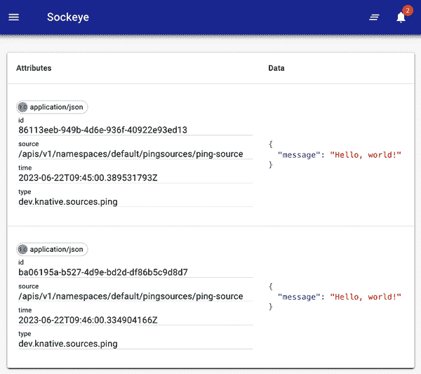

# 第十四章：无服务器和事件驱动应用程序

无服务器代表一种云原生开发范式，赋予开发者创建和部署应用程序的能力，而无需管理服务器的负担。虽然服务器仍然是方程式的一部分，但该平台将其从应用程序开发的复杂性中抽象出来。

在本章中，您将找到展示如何使用 [Knative](https://knative.dev) 栈在 Kubernetes 上部署无服务器工作负载的示例。

# 14.1 安装 Knative Operator

## 问题

您希望将 Knative 平台部署到您的集群中。

## 解决方案

使用 [Knative Operator](https://oreil.ly/y_7fy)，您可以轻松地将 Knative 栈组件部署到您的集群中。该操作员定义了自定义资源 (CRs)，使您能够轻松配置、安装、升级和管理 Knative 栈的生命周期。

要从 [发布页面](https://oreil.ly/6CRLJ) 安装 Knative Operator 的 1.11.4 版本，请执行以下操作：

```
$ kubectl apply -f https://github.com/knative/operator/releases/download/
knative-v1.11.4/operator.yaml

```

验证操作员是否在运行：

```
$ kubectl get deployment knative-operator
NAME               READY   UP-TO-DATE   AVAILABLE   AGE
knative-operator   1/1     1            1           13s

```

## 讨论

Knative 是一个开源项目，旨在为 Kubernetes 上的无服务器、云原生应用程序开发、部署和管理组件。该平台由两个主要组件组成，即 [Serving](https://oreil.ly/dpMyf) 和 [Eventing](https://oreil.ly/kYtPu)。

虽然 Knative Operator 是部署和配置 Knative 组件的首选方法，但这些组件也可以使用其各自发布页面上提供的 YAML 文件部署。

# 14.2 安装 Knative Serving 组件

## 问题

您已安装了 Knative Operator（参见 Recipe 14.1），现在您想要部署 [Knative Serving](https://oreil.ly/dpMyf) 组件来运行无服务器应用程序。

## 解决方案

使用 Knative Operator 提供的 [`KnativeServing`](https://oreil.ly/v-LsX) 自定义资源安装 Knative 的 Serving 组件。

Knative Serving 应安装在名为 `knative-serving` 的命名空间中：

```
$ kubectl create ns knative-serving
namespace/knative-serving created

```

您必须创建一个 `KnativeServing` CR，添加一个网络层，并配置 DNS。对于网络层，我们将使用 [Kourier](https://oreil.ly/5DRRi)，这是 Knative Serving 的轻量级 `Ingress` 对象。对于 DNS，我们将使用 [sslip.io](https://sslip.io) DNS 服务。

创建名为 *serving.yaml* 的文件，并包含以下内容：

```
apiVersion: operator.knative.dev/v1beta1
kind: KnativeServing
metadata:
  name: knative-serving
  namespace: knative-serving
spec:
  ingress:
    kourier:
      enabled: true
  config:
    network:
      ingress-class: "kourier.ingress.networking.knative.dev"

```

现在使用 `kubectl` 应用此配置：

```
$ kubectl apply -f serving.yaml
knativeserving.operator.knative.dev/knative-serving created

```

Knative Serving 组件成功部署需要几分钟时间。您可以使用以下命令来查看其部署状态：

```
$ kubectl -n knative-serving get KnativeServing knative-serving -w
NAME              VERSION   READY   REASON
knative-serving   1.11.0    False   NotReady
knative-serving   1.11.0    False   NotReady
knative-serving   1.11.0    True

```

或者，您可以使用 YAML 文件安装 Knative Serving：

```
$ kubectl apply -f https://github.com/knative/serving/releases/download/
knative-v1.11.0/serving-crds.yaml
$ kubectl apply -f https://github.com/knative/serving/releases/download/
knative-v1.11.0/serving-core.yaml

```

检查 `kourier` 服务是否已分配外部 IP 地址或 CNAME：

```
$ kubectl -n knative-serving get service kourier
NAME      TYPE           CLUSTER-IP     EXTERNAL-IP    PORT(S)         AGE
kourier   LoadBalancer   10.99.62.226   10.99.62.226   80:30227/T...   118s

```

###### 提示

在 Minikube 集群上，在终端中运行命令 `minikube tunnel`，以便为 `kourier` 服务分配外部 IP 地址。

最后，配置 Knative Serving 使用 sslip.io 作为 DNS 后缀：

```
$ kubectl apply -f https://github.com/knative/serving/releases/download/
knative-v1.11.0/serving-default-domain.yaml
job.batch/default-domain created
service/default-domain-service created

```

## 讨论

Knative Serving 组件启用了 Serving API。它提供了一个高级抽象，用于部署、管理和自动缩放无状态、请求驱动的无服务器工作负载应用程序。其主要目标是简化以无服务器方式部署和管理容器化应用程序的过程，使开发人员能够专注于编写代码，而无需管理基础设施问题。

sslip.io 是一个 DNS 服务，允许您通过域名轻松访问部署在 Knative 上的应用程序，无需管理 DNS 记录。服务的 URL 将带有 sslip.io 后缀，当使用包含嵌入 IP 地址的主机名查询时，服务将返回该 IP 地址。

在生产环境中，强烈建议为部署在 Knative 上的工作负载配置一个[真实的 DNS](https://oreil.ly/Shtsq)。

## 另请参阅

+   [安装 Knative](https://knative.dev/docs/install)

+   [配置 DNS](https://oreil.ly/Shtsq)

# 14.3 安装 Knative CLI

## 问题

您已安装了 Knative Operator（Recipe 14.1），现在希望有一种简便的方法来管理 Knative 资源，而不必处理 YAML 文件。

## 解决方案

使用 [`kn`](https://knative.dev/docs/client/install-kn)，即 Knative CLI。

从 GitHub 的[发布页面](https://oreil.ly/wZXg6)安装 `kn` 二进制文件，并将其移动到您的 `$PATH`。例如，在 macOS（Intel）上安装 `kn` v1.8.2，请执行以下操作：

```
$ wget https://github.com/knative/client/releases/download/knative-v1.11.0/
kn-darwin-amd64

$ sudo install -m 755 kn-darwin-amd64 /usr/local/bin/kn

```

或者，Linux 和 macOS 用户可以使用 [Homebrew](https://brew.sh) 包管理器安装 Knative CLI：

```
$ brew install knative/client/kn

```

`kn` 的安装在[项目页面](https://oreil.ly/Ks0Oh)有详细文档。

## 讨论

`kn` 提供了一种快速简便的方式来创建 Knative 资源，比如服务和事件源，而无需直接处理 YAML 文件。`kn` 工具提供了多个命令来管理 Knative 资源。

要查看可用命令的概述，请执行以下操作：

```
$ kn help
kn is the command line interface for managing Knative Serving and Eventing

Find more information about Knative at: https://knative.dev

Serving Commands:
  service      Manage Knative services
  revision     Manage service revisions
  ...

Eventing Commands:
  source       Manage event sources
  broker       Manage message brokers
  ...

Other Commands:
  plugin       Manage kn plugins
  completion   Output shell completion code
  version      Show the version of this client

```

您将在本章的其余部分找到 `kn` 的使用示例场景。

# 14.4 创建一个 Knative Service

## 问题

您已安装了 Knative Serving（请参阅 Recipe 14.2），现在希望在 Kubernetes 上部署一个应用程序，当不使用时将释放集群资源。

## 解决方案

使用 Knative Serving API 创建一个 Knative `Service`，在不使用时自动缩减至零。

例如，让我们部署应用程序 `functions/nodeinfo`，它提供有关其运行的 Kubernetes 节点的信息。创建一个名为 *nodeinfo.yaml* 的文件，以将该应用程序部署为一个 Knative `Service`：

```
apiVersion: serving.knative.dev/v1
kind: Service
metadata:
  name: nodeinfo
spec:
  template:
    spec:
      containers:
        - image: functions/nodeinfo:latest

```

需要注意的是，这种类型的服务与 Figure 5-1 中描述的 `Service` 对象不同；相反，此 `Service` 对象是从[Knative Serving API](https://oreil.ly/G3_jU) 实例化的。

使用以下命令部署应用程序：

```
$ kubectl apply -f nodeinfo.yaml
service.serving.knative.dev/nodeinfo created

```

使用以下命令检查服务的状态：

```
$ kubectl get ksvc nodeinfo
NAME       URL                          LATESTCREATED    LATESTREADY      READY
nodeinfo   http://nodeinfo...sslip.io   nodeinfo-00001   nodeinfo-00001   True

```

服务成功启动后，在浏览器中打开 URL 以查看节点信息。

现在，查看为服务创建的 pods：

```
$ kubectl get po -l serving.knative.dev/service=nodeinfo -w
NAME                       READY   STATUS    RESTARTS   AGE
nodeinfo-00001-deploy...   0/2     Pending   0          0s
nodeinfo-00001-deploy...   0/2     Pending   0          0s
nodeinfo-00001-deploy...   0/2     ContainerCreating   0          0s
nodeinfo-00001-deploy...   1/2     Running             0          2s
nodeinfo-00001-deploy...   2/2     Running             0          2s

```

关闭浏览器窗口，大约两分钟后，您应该注意到`nodeinfo` pods 会自动缩减为零：

```
$ kubectl get po -l serving.knative.dev/service=nodeinfo
No resources found in default namespace.

```

现在，如果在浏览器中打开 URL，将自动启动一个新的`Pod`对象来处理传入的请求。由于创建新的`Pod`来处理此请求，您应该注意到页面渲染的延迟。

## 讨论

使用`kn`客户端（参见 Recipe 14.3），您可以创建服务而无需编写 YAML 文件：

```
$ kn service create nodeinfo --image functions/nodeinfo:latest --port 8080
Creating service 'nodeinfo' in namespace 'default':

  0.054s The Route is still working to reflect the latest desired specification.
  0.068s Configuration "nodeinfo" is waiting for a Revision to become ready.
  3.345s ...
  3.399s Ingress has not yet been reconciled.
  3.481s Waiting for load balancer to be ready
  3.668s Ready to serve.

Service 'nodeinfo' created to latest revision 'nodeinfo-00001' is available at
URL: http://nodeinfo.default.10.96.170.166.sslip.io

```

# 14.5 安装 Knative Eventing 组件

## 问题

您已安装 Knative Operator（参见 Recipe 14.1），现在您想部署[Knative Eventing](https://oreil.ly/kYtPu)组件来构建基于事件驱动的应用程序。

## 解决方案

使用 Knative Operator 提供的[`KnativeEventing`](https://oreil.ly/1u62U)自定义资源安装 Knative 的 Eventing 组件。

Knative Eventing 应安装在名为`knative-eventing`的命名空间中：

```
$ kubectl create ns knative-eventing
namespace/knative-eventing created

```

创建一个名为*eventing.yaml*的文件，并包含以下内容：

```
apiVersion: operator.knative.dev/v1beta1
kind: KnativeEventing
metadata:
  name: knative-eventing
  namespace: knative-eventing

```

现在使用`kubectl`应用此配置：

```
$ kubectl apply -f eventing.yaml
knativeeventing.operator.knative.dev/knative-eventing created

```

`Knative Eventing`组件成功部署需要几分钟时间。您可以使用以下命令观察其部署状态：

```
$ kubectl --namespace knative-eventing get KnativeEventing knative-eventing -w
NAME               VERSION   READY   REASON
knative-eventing   1.11.1    False   NotReady
knative-eventing   1.11.1    False   NotReady
knative-eventing   1.11.1    False   NotReady
knative-eventing   1.11.1    True

```

或者，通过 YAML 文件安装 Knative Eventing，请执行以下操作：

```
$ kubectl apply -f https://github.com/knative/eventing/releases/download/
knative-v1.11.1/eventing-crds.yaml
$ kubectl apply -f https://github.com/knative/eventing/releases/download/
knative-v1.11.1/eventing-core.yaml

```

然后安装内存通道和`MTChannelBasedBroker`：

```
$ kubectl apply -f https://github.com/knative/eventing/releases/download/
knative-v1.11.1/in-memory-channel.yaml
$ kubectl apply -f https://github.com/knative/eventing/releases/download/
knative-v1.11.1/mt-channel-broker.yaml

```

## 讨论

Knative Eventing 组件使得 Eventing API 生效。它提供了在云原生环境中管理和处理事件的框架。这里的事件指系统内发生或变化的事件，例如创建新资源、更新现有资源或外部触发器。此组件使开发人员能够构建响应实时变化和触发器的反应式和灵活应用程序，跨云原生生态系统响应这些变化和触发器。

# 14.6 部署 Knative Eventing 源

## 问题

您已安装 Knative Eventing（参见 Recipe 14.5），现在您想部署一个生成事件的源，以便可以使用这些事件来触发 Knative 中的工作流。

## 解决方案

事件源是一个 Kubernetes 自定义资源，充当事件生产者和事件接收器之间的链接。要检查当前可用的事件源，请执行以下操作：

```
$ kubectl api-resources --api-group='sources.knative.dev'
NAME              SHORTNAMES  APIVERSION           NAMESPACED   KIND
apiserversources              sources.kn...dev/v1  true         ApiServerSource
containersources              sources.kn...dev/v1  true         ContainerSource
pingsources                   sources.kn...dev/v1  true         PingSource
sinkbindings                  sources.kn...dev/v1  true         SinkBinding

```

[PingSource](https://oreil.ly/KlpSU)是一个事件源，定期按照 cron 调度定义的固定载荷生成事件。让我们部署一个`PingSource`并将其连接到名为`sockeye`的[Sink](https://oreil.ly/RWa85)。

首先创建`sockeye`服务：

```
$ kubectl apply -f https://github.com/n3wscott/sockeye/releases/download/
v0.7.0/release.yaml
service.serving.knative.dev/sockeye created

```

验证`sockeye`服务是否成功创建：

```
$ kubectl get ksvc sockeye
NAME      URL                         LATESTCREATED   LATESTREADY     READY
sockeye   http://sockeye...sslip.io   sockeye-00001   sockeye-00001   True

```

创建一个名为*pingsource.yaml*的文件，用来创建`PingSource`并将其与`sockeye`应用程序连接起来：

```
apiVersion: sources.knative.dev/v1
kind: PingSource
metadata:
  name: ping-source
spec:
  schedule: "* * * * *"
  contentType: "application/json"
  data: '{ "message": "Hello, world!" }'
  sink:
    ref:
      apiVersion: serving.knative.dev/v1
      kind: Service
      name: sockeye

```

应用此清单：

```
$ kubectl apply -f pingsource.yaml
pingsource.sources.knative.dev/ping-source created

```

验证`PingSource`是否成功创建：

```
$ kubectl get pingsource ping-source -w
NAME          ...   AGE   READY   REASON
ping-source   ...   52s   False   MinimumReplicasUnavailable
ping-source   ...   59s   True

```

使用以下命令获取`sockeye`服务的 URL：

```
$ kubectl get ksvc sockeye  -o jsonpath={.status.url}
http://sockeye.default.10.99.62.226.sslip.io

```

在浏览器中打开 URL 后，您应该可以看到每分钟出现新事件，如 Figure 14-1 所示。



###### 图 14-1\. Sockeye 中显示的事件

## 讨论

如果您不想编写 YAML 文件，可以使用`kn`客户端（参见 Recipe 14.3）。

使用以下命令创建`sockeye`服务：

```
$ kn service create sockeye --image docker.io/n3wscott/sockeye:v0.7.0

```

接下来，创建`PingSource`：

```
$ kn source ping create ping-source --data '{ "message": "Hello, world!" }' \
    --schedule '* * * * *' --sink sockeye

```

# 14.7 启用 Knative Eventing 事件源

## 问题

您已安装了 Knative Eventing 组件（参见 Recipe 14.5），并且希望启用默认未启用的 Knative 事件源。

## 解决方案

[其他事件源](https://oreil.ly/ZP2Wa)由 Knative 社区开发，例如 GitHub、GitLab、Apache Kafka 等，可以在 Knative Eventing 自定义资源中配置。例如，要安装[GitHub 事件源](https://oreil.ly/8HavC)，请按照 Recipe 14.5 更新*eventing.yaml*文件：

```
apiVersion: operator.knative.dev/v1beta1
kind: KnativeEventing
metadata:
  name: knative-eventing
  namespace: knative-eventing
spec:
  source:
    github:
      enabled: true

```

使用以下命令应用更改：

```
$ kubectl apply -f eventing.yaml
knativeeventing.operator.knative.dev/knative-eventing configured

```

查看更新的状态：

```
$ kubectl -n knative-eventing get KnativeEventing knative-eventing -w
NAME               VERSION   READY   REASON
knative-eventing   1.11.1    False   NotReady
knative-eventing   1.11.1    True

```

现在，如果您检查可用的事件源，应该会看到`GitHubSource`事件源：

```
$ kubectl api-resources --api-group='sources.knative.dev'
NAME                 APIVERSION                  NAMESPACED    KIND
apiserversources     sources.kn..dev/v1          true          ApiServerSource
containersources     sources.kn..dev/v1          true          ContainerSource
githubsources        sources.kn..dev/v1alpha1    true          GitHubSource
pingsources          sources.kn..dev/v1          true          PingSource
sinkbindings         sources.kn..dev/v1          true          SinkBinding

```

## 讨论

`GitHubSource`事件源注册以便在指定的 GitHub 组织或仓库上监听事件，并对所选的 GitHub 事件类型触发新的事件。

还可以获取 GitLab、Apache Kafka、RabbitMQ 等开源事件源。

# 14.8 安装 TriggerMesh 的事件源

## 问题

您已安装了 Knative Eventing（参见 Recipe 14.5），现在您希望安装 TriggerMesh 提供的事件源，以便您可以访问各种平台和服务的事件源。

## 解决方案

要安装 TriggerMesh 的 v1.26.0 版本，请执行以下操作：

```
$ kubectl apply -f https://github.com/triggermesh/triggermesh/releases/
download/v1.26.0/triggermesh-crds.yaml
...k8s.io/awscloudwatchlogssources.sources.triggermesh.io created
...k8s.io/awscloudwatchsources.sources.triggermesh.io created
...k8s.io/awscodecommitsources.sources.triggermesh.io create
...

$ kubectl apply -f https://github.com/triggermesh/triggermesh/releases/
download/v1.26.0/triggermesh.yaml
namespace/triggermesh created
clusterrole.rbac.authorization.k8s.io/triggermesh-namespaced-admin created
clusterrole.rbac.authorization.k8s.io/triggermesh-namespaced-edit created
clusterrole.rbac.authorization.k8s.io/triggermesh-namespaced-view created
...

```

您可以使用以下命令检查 TriggerMesh API 提供的事件源：

```
$ kubectl api-resources --api-group='sources.triggermesh.io'
NAME                     APIVERSION       NAMESPACED  KIND
awscloudwatchlog...      sources.tri...   true        AWSCloudWatchLogsSource
awscloudwatchsou...      sources.tri...   true        AWSCloudWatchSource
awscodecommitsou...      sources.tri...   true        AWSCodeCommitSource
...

```

类似地，您可以使用以下命令列出 TriggerMesh API 提供的所有接收器。

```
$ kubectl api-resources --api-group='targets.triggermesh.io'
NAME                 SHORT...  APIVERSION       NAMESPACED  KIND
awscomprehendtar...            targets.tri...   true        AWSComprehendTarget
awsdynamodbtarge...            targets.tri...   true        AWSDynamoDBTarget
awseventbridgeta...            targets.tri...   true        AWSEventBridgeTarget
...

```

## 讨论

[TriggerMesh](https://triggermesh.com)是一款免费开源软件，可让您轻松构建事件驱动应用程序。TriggerMesh 为 AWS、Google Cloud、Azure、Salesforce、Zendesk 等各种平台和服务提供事件源。除事件源外，TriggerMesh 还提供组件，使您能够转换云事件。

转到[TriggerMesh 文档](https://oreil.ly/0lDap)了解更多信息。

## 参见

+   [TriggerMesh 源](https://oreil.ly/-bqVQ)

+   [TriggerMesh 目标](https://oreil.ly/7tlVP)

+   [TriggerMesh 转换](https://oreil.ly/O2Et4)
