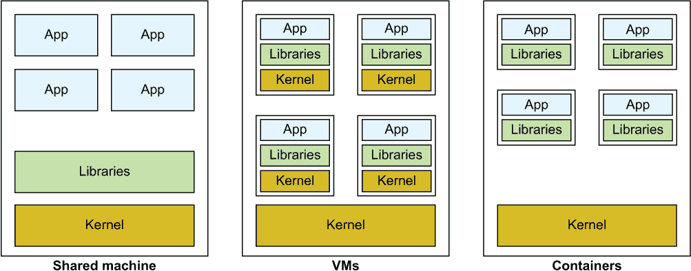
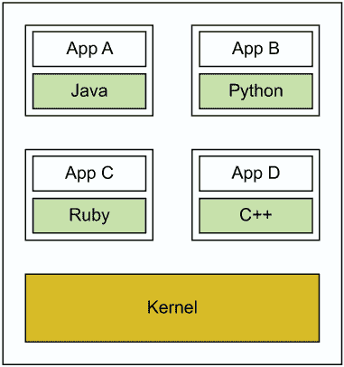
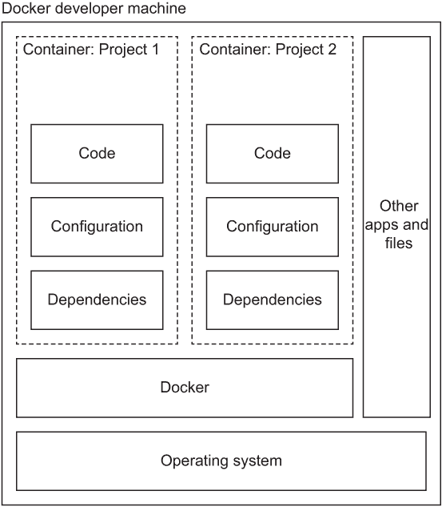
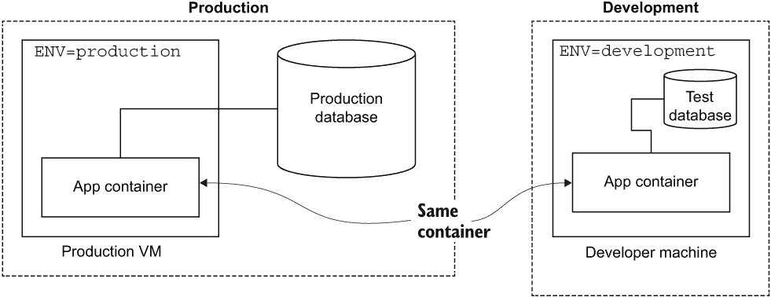
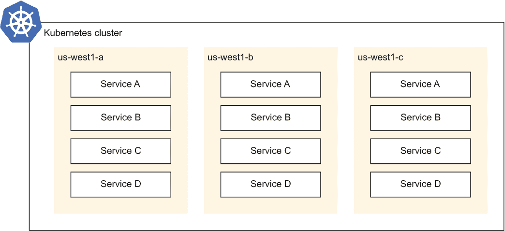
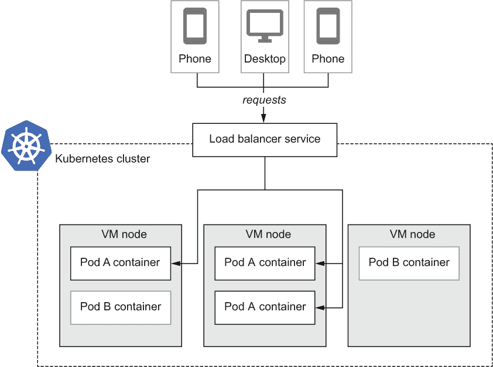
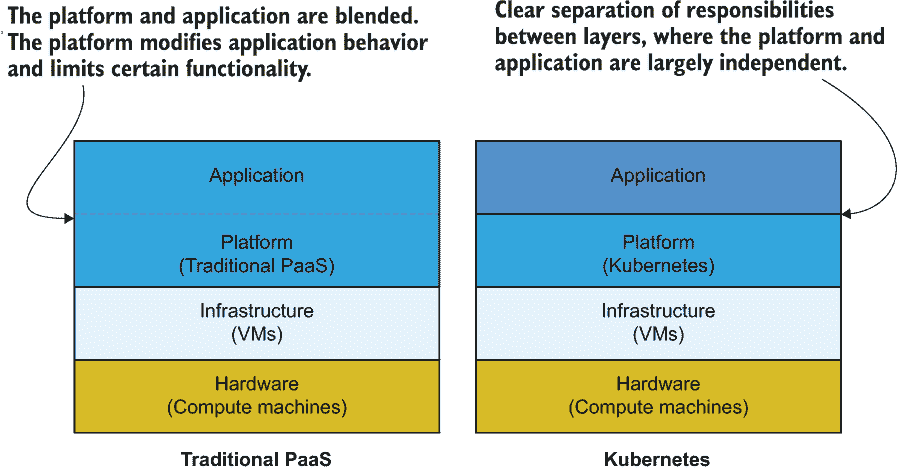
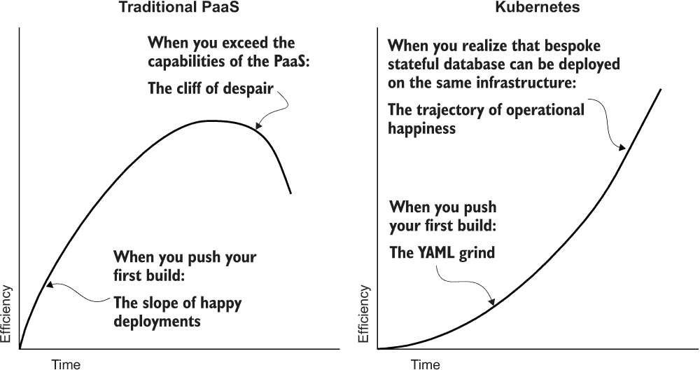

# 1 Kubernetes 用于应用部署

本章涵盖

+   将应用打包在容器中的好处

+   Kubernetes 为何是部署容器的理想平台

+   决定何时使用 Kubernetes

周五下午 5 点，你过去一年一直在工作的产品突然走红。你需要快速扩展一切。你的应用及其运行的平台能否扩展 100 倍，准备好捕捉你的成功，还是你将陷入脆弱的代码和缺乏弹性的平台，这意味着你所有的努力都将付诸东流？

你在流行的应用平台上构建了一个令人惊叹的无状态应用，该平台能够快速扩展，一切运行良好。然而，有一天，你的业务需求发生了变化，你突然需要运行一个定制的有状态应用来处理一些关键业务数据或配置一个夜间批量处理管道。这些新工作负载能否无缝地与现有的工作负载结合，还是你需要从头开始或拼凑多个不同的系统？

Kubernetes 正迅速成为运行各种形状和大小的工作负载的行业标准，通过承诺解决这些担忧以及更多问题。它使你能够以快速扩展的能力启动容器化应用，同时，它还能处理从无状态应用到有状态数据库、具有短暂存储的批量作业等各种复杂的部署模式。Kubernetes 是在谷歌发明、开源并由 Spotify¹、CapitalOne²、OpenAI³等无数组织使用⁴的，它是一个开放、供应商无关且经过充分验证的平台，对于云部署来说，就像 Linux 对于操作系统一样。

然而，所有这些灵活性都伴随着一定的学习曲线。作为一个能够处理如此多不同部署结构的通用平台，Kubernetes 的学习可能会让人感到畏惧。不过，我要告诉你的是，（a）它并没有人们想象中那么难，（b）学习它是值得的。如果你从基础知识开始，并逐渐添加新的结构（这正是本书的结构），它就会变得更容易接近。你可以用几行 YAML 部署一个无状态应用，并从那里开始构建你的知识。

作为一名专业人士，当你面临问题，比如如何最好地部署你的应用时，我相信正确的答案并不总是选择可以解决你当前问题的最简单选项，而是投入时间去学习一个能够满足你当前和未来需求、让你随着需求的发展而发展技能和职业的平台。Kubernetes 就是这样一种平台。你可以通过一些简单的部署在几小时内启动并运行，同时知道有大量的功能可供你学习和应用，当你需要时，无论何时。

如果您已经接受了 Kubernetes 的概念，我建议跳到第二章开始构建 Docker 镜像，如果您已经知道 Docker 容器是什么，并想开始部署到 Kubernetes，请直接跳到第三章。本章的其余部分将涵盖为什么 Kubernetes 和容器对于应用程序部署如此受欢迎的原因。

## 1.1 为什么选择容器？

Kubernetes 是一个容器部署平台。所有部署到 Kubernetes 中的代码，就像您的应用程序一样，需要首先打包成容器。什么是容器，为什么要费心去使用它们呢？

容器是打包和运行应用程序的现代方式。除非您在每个主机上运行一个应用程序（这相当低效），否则您通常希望有一种方法将多个应用程序部署到一台机器或一组机器上。有哪些选择？

在虚拟机（VMs）出现之前，通常是将每个应用程序安装到共享主机上的不同目录中，每个应用程序都在单独的端口上提供服务。这带来了一些问题，因为各种应用程序在共享依赖项和机器资源（如 CPU、内存和可用端口）时需要相互协作。这也可能难以扩展：如果您有一个应用程序突然接收了更多流量，您如何仅扩展该应用程序，而让其他应用程序保持不变？

最近，随着虚拟机（VMs）的出现，解决方案是将每个应用程序打包成独立的虚拟机。这样，每个应用程序都有自己的操作系统环境，以便可以隔离依赖项并分配资源。然而，由于每个虚拟机都具有独立主机的复杂性，因此现在您需要为每个应用程序维护操作系统和所有包，这具有很高的开销且难以维护。

这就引出了容器。容器是一种将您的应用程序及其所需的依赖项打包到隔离环境中托管的方法，类似于虚拟机，但无需为应用程序安装和管理操作系统。

图 1.1 展示了托管服务的演变，从在单个主机上运行多个工作负载，到在单独的虚拟机上运行，最后到容器。容器提供了虚拟机的大部分优势，但无需运行另一个操作系统内核，这使得它们成为逻辑上的现代前进路径。



图 1.1 共享托管架构的演变

### 1.1.1 容器优势

人们选择容器的一些主要原因包括语言灵活性（能够在容器平台上运行任何语言或环境）、轻量级隔离（在不使用虚拟机的情况下保护工作负载免受彼此干扰）、开发者效率（将生产环境更接近开发环境并允许轻松设置）以及可重复性（在容器构建文件中记录创建环境的步骤）。

语言灵活性

容器使你摆脱了部署系统中的语言或库要求。你可以带来任何语言并更新任何包。你不再被锁定在特定的语言和版本中，或者被一些可能在操作系统几年前的版本中发货的关键依赖项所困扰，就像你可能在传统的平台即服务（PaaS）平台上一样。

在同一主机上运行的两个容器之间没有共享库，这意味着一个容器的配置不会干扰另一个。需要两个不同版本的 Java 或一些随机依赖项？没问题。这种隔离不仅限于容器的库：每个容器都可以使用完全不同的基础操作系统和包管理器——例如，一个使用 Ubuntu 和 APT，而另一个使用 CentOS 和 RPM。这种灵活性使得从多个服务（称为*微服务*的模式）中构建系统变得简单，每个服务由不同的团队维护，具有自己的依赖项或语言。容器将这些不同的应用程序依赖项相互隔离，使得在同一个主机上运行它们变得简单（图 1.2）。



图 1.2 具有不同语言的四个容器共享主机

无开销的隔离

在过去，为了在同一个主机上运行多个应用程序之间的隔离，你会使用虚拟机（VMs）。虚拟机在镜像大小和 CPU/内存资源开销方面都比较重，因为每个虚拟机都会复制内核和大部分操作系统。虽然容器比虚拟机轻，但它们仍然提供了大部分相同的资源隔离优势。你可以在 Kubernetes 上将容器限制为仅使用主机的一些资源，系统将限制它们使用更多资源。这最终意味着你可以在单个主机上打包更多的应用程序，从而降低你的基础设施成本（图 1.3）。


图 1.3 在同一主机上运行的四个容器，完全隔离但共享内核

开发者效率

使容器通过隔离依赖项在生产中变得出色的特性，也使它们在开发中变得出色，因为你可以在一台机器上开发无数的应用程序，而无需为每个应用程序配置主机的依赖项（图 1.4）。除了直接在 Linux 上开发 Linux 应用程序外，使用 Docker，你还可以使用 macOS 或 Windows 工作站来开发 Linux 容器，而无需为这些平台创建应用程序的原生版本，从而消除了开发中的平台特定配置。



图 1.4 具有两个基于容器的项目的开发机器

现在您也不再需要为开发者提供大量的设置说明来开始工作，因为设置现在就像安装 Docker、检出代码、构建和运行一样简单。在团队内部或为不同团队工作多个项目现在也变得简单，因为每个项目都很好地隔离在其容器中，无需特定的主机配置。

使用容器，您的开发和生产应用程序看起来非常相似，甚至可以是完全相同的容器——不再有开发特定的特性阻碍，比如 MacOS 有不同的 MySQL 库或代码打包生产时的微妙差异。试图诊断生产问题？下载那个确切的容器，在您的开发环境中运行它，看看出了什么问题（图 1.5）。



图 1.5 同一个容器在生产环境和开发环境中的应用

可重现性

容器还使您更容易重现应用程序环境。想象一下，您有一个部署了应用程序的虚拟机，您需要为安全的 HTTPs 连接配置传输层安全性（TLS）。您通过 SSH 连接到生产主机，并将 TLS 证书添加到一个文件夹中。它不起作用，所以您将其添加到另一个文件夹。很快，它们就在三个文件夹中，而且它开始工作了，所以您没有去动它。一年后，您需要更新 TLS 证书。您能记得如何操作，以及三个位置中的哪一个需要更新吗？

容器解决了这个问题。而不是通过 SSH 和调整状态，您会在容器中添加 TLS 证书作为构建步骤。如果不起作用，您会调整那个构建步骤直到它起作用，但关键是要只保留真正起作用的步骤（或步骤）。在这个步骤中添加的文件也很好地与系统其他部分隔离，所以本质上您是在捕捉基于系统的增量，或差异——只是您需要做的那些修改。这意味着一年后当您需要更新证书时，您只需替换证书文件并重新运行容器构建，它就会放在正确的位置。

下面的列表提供了一个 Dockerfile 的伪代码示例——即用纯英语表达的配置容器的代码（在第二章中，我们将使用一些真实的例子）。

列表 1.1 第一章/1.1.1_ 伪代码 Dockerfile

```
Use the Ubuntu OS
Copy and configure TLS certificate
Copy the application
```

注意，将 Docker 作为创建容器的工具并不完美地适用于可重复性。例如，使用`apt-get`安装依赖项的命令是在一个实时系统上运行的，因此你实际上不会为相同的输入获得相同的输出，因为那些依赖系统（如 APT 仓库）可能在构建之间发生了变化。像 Bazel 这样的工具，由谷歌开源，旨在解决这个问题以及更多，但它们也带来了自己的复杂性，并且更推荐用于复杂的企业部署。尽管存在这种限制，但 Docker 的构建系统仍然比试图回忆一年前当你通过 SSH 连接到那个 Linux 盒子来修复问题时所做的事情要强得多，而且对于大多数项目来说已经足够好了。

## 1.2 为什么选择 Kubernetes？

如果容器听起来像是一个打包您应用程序的好主意，你仍然需要一种实际运行和管理这些容器的方法。当然，你可以在每个主机上运行一个或几个容器，就像从文件夹或虚拟机镜像中运行多个不同的应用程序一样，但以这种方式运行往往会创建特殊的机器，并限制了你的扩展能力，因为配置和管理主机需要大量的手动操作。

更好的选择是拥有一个共享的机器（节点）池（集群），并使用所谓的容器编排器（如 Kubernetes）来运行资源池上的容器。这样，机器作为一个组一起管理，其中没有任何一个需要赋予任何特殊意义。如果其中一个失败了，另一个会来填补空缺。这种模式让你摆脱了单机业务，并允许你比团队规模更快地扩展你的应用程序。

以前，能够在大规模上灵活编排容器的系统是大型公司的专属。特别是，公共云上的托管 Kubernetes 服务使得这种操作模式对所有规模的项目都变得可访问，从在一台机器上运行的单个容器应用程序到由不同团队在 15000 台机器的巨兽上运行的多个微服务集合。

Kubernetes 还使得为您的应用程序实现高可用性变得容易。如图 1.6 所示，我们可以在多个可用区部署相同的服务，即使整个区域丢失也不会导致停机。使用手动部署系统，这可能很复杂，但我们可以通过简单地定义我们想要看到的内容（在这种情况下，跨多个区域的容器）在 Kubernetes 中快速实现这种部署模式。第 8.2.1 节对此进行了介绍。



图 1.6 一个在三个区域中运行的 Kubernetes 集群，管理四个服务

最好的部分是，在 Kubernetes 中更新服务只需要更改一行配置，Kubernetes 会根据你的要求自动将更新部署到每个区域。Kubernetes 平台本身的更新也以类似、自动化的方式进行（前提是你使用的是托管平台，它会处理这一点），节点会逐渐被更新版本所取代，你的工作负载会被迁移以避免停机。如果你的应用程序规模不大，不需要高可用性的多区域部署，无需担心：Kubernetes 也可以在小规模上运行，并且当你需要时可以扩展。

Kubernetes 因其自动化了在资源池上调度和运行容器的许多操作方面而受到欢迎，并为开发者提供了看似恰到好处的抽象级别。它既不是那么低级，以至于你担心单个机器，同时也不是那么高级，以至于限制了你可以部署的工作负载。

### 1.2.1 可组合的构建块

在 Kubernetes 中，容器被分组为所谓的 *Pods*。Pod 简单地是一组被一起调度并被视为单一单元的容器。通常，Pod 只是一个容器，但在你的应用程序由多个连接部分组成的情况下，它也可能是多个容器。从概念上讲，Pod 是你的应用程序及其依赖项。服务用于向 Pod 组提供连接性，无论是在集群内部还是外部。图 1.7 展示了部署到 Kubernetes 集群中的典型应用程序的资源。



图 1.7 一个运行着两个不同应用容器的 Kubernetes 集群，通过负载均衡暴露

Kubernetes 有几个更高阶的工作负载构建块，本书中会对其进行描述，这些构建块封装了 Pods。对于无状态应用程序，你会创建一个 *Deployment* 对象，它封装了 Pod 定义（指定你的容器版本），在这里你指定你想要多少个副本（实例）。在这些所有情况下，Kubernetes 会为你完成繁重的任务，在集群中找到空间来放置 Pods，以满足你的要求。

你可以在 Kubernetes 配置中描述的工作负载类型范围广泛，包括以下内容：

+   无状态应用程序

+   具有持久状态的数据库和其他应用程序

+   以前在虚拟机中配置的应用程序

+   你希望按特定时间表运行的批处理过程

+   你想要一次性运行的批处理任务，例如训练机器学习模型

在所有情况下，应用程序都被容器化并分组在 Pods 中，你通过配置文件向 Kubernetes 描述你想要如何运行你的工作负载。

### 1.2.2 特性和优势

在本节中，我们将讨论一些人们选择 Kubernetes 来部署他们的容器的主要原因。

自动化操作

只要正确配置你的部署，Kubernetes 就会为你自动化各种操作方面。在节点上运行的进程会重新启动崩溃的容器，同时存活性和就绪性探针会继续监控容器的健康和提供实时流量的能力。你可以在部署上配置 Pod 自动扩展器，根据如利用率等指标自动增加副本的数量。

Kubernetes 本身不会修复计算节点级别的问题。然而，你可以选择一个提供此类自动化的托管平台。以 Google Kubernetes Engine 的 Autopilot 模式为例：它会自动为你的 Pods 提供计算能力，根据你更改副本数量的情况自动扩展和缩减，并在需要时修复和升级节点。

高可扩展性

无论你的应用程序大小如何，你都需要考虑它如何进行扩展。无论是部署一个大型企业级应用程序，还是你是一个自筹资金的初创公司，你都需要一个能够随着你一起扩展的解决方案。当你需要扩展的时候，并不是开始思考你将如何扩展的时候！

创造一个成功的产品已经足够困难；在你成功的时刻——当每个人都试图使用你的产品而敲你的门时——你最不希望看到的是你的应用程序离线。在那个时刻，甚至在未来几个月和几年里，你可能无法完全重新架构你的应用程序以实现扩展。

Kubernetes 可以处理任何大小的应用程序。你可以有一个单节点集群，只有一个 CPU 和大量内存，或者一个多千节点的巨兽，就像 Niantic 在推出 Pokémon Go 时使用的拥有数万个核心。当然，你的应用程序本身需要具有使其能够扩展的特性，以及任何依赖项，尤其是数据库依赖项，但至少你可以放心，你的计算平台会随着你一起扩展。

工作负载抽象

抽象层是很好的，直到它们不是。找到工具来抽象你不想关心的事情，同时不隐藏你关心的细节，这是一个挑战。但是，根据我的经验，Kubernetes 最接近于实现这一点。

基础设施即服务（IaaS）是硬件级别的抽象。你不需要与实际带有旋转磁盘和网络卡的机器交互，而是与一个提供实现相同接口的软件的 API 进行交互。

与之相比，Kubernetes 是一个工作负载级别的抽象。这意味着你用工作负载术语描述你的应用程序。例如，我有一个需要以分布式方式运行的服务器；我有一个需要连接特定磁盘卷的数据库；我有一个需要在每个节点上运行的日志工具；或者也许我有一个电影需要渲染，一次渲染一帧，在可用的最便宜的资源上。所有这些部署结构和更多都可以在 Kubernetes 中本地表示。

Kubernetes 在计算实例（虚拟机）之上提供了一个层，让你无需管理或关心单个机器。你指定你的容器需要哪些资源：CPU、内存、磁盘、GPU 等。一个管理的 Kubernetes 平台通常也会提供计算能力来处理你的工作负载。你不需要担心单个机器，但仍然可以做一些你期望在机器级别做的事情，比如写入持久性本地磁盘，这些任务直到最近在这个抽象级别通常是不可能的。

抽象层通过不干扰你的应用程序（图 1.8）而保持相当干净。与许多传统的 PaaS 环境不同，Kubernetes 不会修改你的应用程序的运行方式；例如，没有代码被注入或更改，对应用程序可以做什么的限制也非常少。如果应用程序可以在容器中运行，那么它很可能可以在 Kubernetes 上运行。



图 1.8 不同计算层之间关注点分离的示意图

声明式配置

Kubernetes 使用声明式资源模型。你在配置（主要是 YAML 文件）中描述你的工作负载，系统会努力执行你的配置并使其成为现实。例如，如果在 Deployment 中你指定你想要三个由负载均衡器连接到外部世界的应用副本（复制品），Kubernetes 将在你的集群中找到空间来运行这三个副本并附加一个负载均衡器。Kubernetes 不仅最初放置这些副本，而且它将继续监控它们，并在发生崩溃或故障的情况下尝试保持它们运行。

声明式配置很有用，因为它允许你描述你希望的状态（例如，运行我的应用程序的三个副本）并让 Kubernetes 完成实际产生该状态的工作，而不是发出命令式命令（例如，创建我的应用程序的三个副本）然后你自己进行监控和调整（比如查询当前运行的应用程序副本数量并相应调整）。

成本效益

Kubernetes 将最低层的计算构建块（虚拟机）进行管理，使其变得易于管理。在过去，你可能出于维护原因，每个虚拟机分配一个应用程序，而 Kubernetes 允许你在一个机器上高效地托管多个应用程序实例或应用程序，以实现高效率（所谓装箱）。使用通用构建块（原始计算节点）与强大的工作负载编排相结合，通常从价格角度使 Kubernetes 具有吸引力。

除了装箱之外，资源池也是 Kubernetes 的另一个好处，可以提高效率。你可以配置你的工作负载，使其具有一定数量的保证资源，当出现使用高峰时，利用其他容器已预留但尚未使用的容量。

可扩展性

当你需要做 Kubernetes 无法做到的事情时，你可以获取或甚至编写自己的 Kubernetes 风格的 API 来实现它。这并不是针对每个人，而且绝对不是部署大多数工作负载（如无状态或有状态 Web 应用程序）所必需的，但当你需要添加特定的业务逻辑或 Kubernetes 不支持的新结构时，它可能非常有用。自定义资源定义对象和操作符模式允许你创建自己的 Kubernetes 风格的 API。

开源

Kubernetes 是开源的，并且作为托管服务在所有主要云平台上提供。尽管存在许多不同的平台、发行版和安装程序，但大多数此类服务都通过了云原生计算基金会认证计划⁶的认证，该计划围绕工作负载的可移植性和兼容性提供了一些保证。实际上，一个产品要包含名称*Kubernetes*（例如 Google Kubernetes Engine），唯一的方法是正式通过这些测试。

你也可以从头开始自己运行 Kubernetes。如果你自己运行 Kubernetes，那么代码的质量对你来说很重要。并非所有开源项目都是平等的。虽然开源通常可以让你摆脱专有锁定，但除非有一个强大的社区，否则你可能会发现自己需要自己维护它（你使用它，你就拥有它）。例外是像 Linux 这样的大型、维护良好的开源项目，如此多的人依赖它，如此多的人使用它，以至于你可以放心，你不需要接管维护。幸运的是，作为领先的开放源代码容器编排器，Kubernetes 属于这一类别。

提示：虽然你可以在公共云或树莓派集群上自己托管 Kubernetes，但我通常不推荐这种做法用于生产环境（即除了学习如何管理集群之外的情况）。花时间做你最擅长的事情——构建出色的应用程序——并让其他人帮你处理运行 Kubernetes 的细节。

除了项目本身是开源的，Kubernetes 还有一个充满活力的社区。有开源工具可以完成几乎所有的事情，所以你通常可以选择使用托管服务或自己部署开源工具。这与过去 PaaS 系统中仅有的专有市场形成对比，在那里，任何类型的组件的唯一选择都是付费的。你是否从托管监控工具中获得了价值？使用专有产品。只想自己管理？去安装开源的 Prometheus。Kubernetes 拥有大量不断增长的使用者，所以无论是什么主题，你都应该能在 Stack Overflow 或像这本书这样的书中找到帮助。

定制化工作流程

Kubernetes 对如何设置开发工作流程持中立态度。想要“git push 即部署”风格的流程？有很多种方法可以实现，其中一些只需要最少的设置。通常，你会从一系列 CI/CD 构建块开始，将它们组装成你想要的流程，从简单的推送部署到具有准入控制、自动注入密钥和安全扫描的复杂管道。缺点是它不像传统的 PaaS 那样即买即用，但本书将向你展示它并非*那么*难上手。

尤其对于大型团队来说，Kubernetes 在这个领域提供的灵活性通常是一个巨大的优势。拥有中央核心平台团队的公司将为他们的应用程序开发团队创建有观点的管道。这个管道可以用来确保围绕安全、资源使用等方面的一些开发实践。

### 1.2.3 Kubernetes 与平台即服务（PaaS）的比较

应用程序部署的另一种方法是使用 PaaS。PaaS 通过为你处理大量的打包和部署方面，使大规模部署应用程序代码变得容易。只要你的应用程序在语言、依赖项、如何处理状态等方面符合 PaaS 提供的范围，你就可以将每个应用程序部署到 PaaS 中，而不必担心底下的机器。

然而，当你需要高度定制依赖项时，比如使用特定版本的 Java，会发生什么？你能否在无状态的前端旁边托管有状态的后端？当你有多个应用程序，每个都需要许多副本时，这是否具有成本效益？在某个点上，PaaS 的局限性可能会变得阻碍重重，一旦你离开了 PaaS 世界，你就必须从头开始——这是一个令人畏惧的前景。

传统的 PaaS 通常学习速度快，但随着你的成熟，速度会减慢，如果你超出了系统的功能，需要从头开始，可能会遇到一个潜在的悬崖。Kubernetes 的学习曲线在开始时较慢，但随着你的成长，可能性却很广泛（图 1.9）。



图 1.9 使用传统 PaaS 和 Kubernetes 提高开发者效率

如果你使用 PaaS 并且一切都很顺利，可能没有必要迁移到 Kubernetes。然而，我常见的一个问题是，团队达到一定程度的复杂性，他们的需求超过了 PaaS 的能力。处于这种位置的最可怕的事情之一是你不能简单地“打破玻璃”并假设自己有更多的控制权。通常，你需要重新架构整个系统，甚至失去你原本满意的部分，来构建你需要的新部分。在这本书中，我将向你展示 Kubernetes 如何以比专用 PaaS 略高的复杂性运行 PaaS 类型的工作负载，以及如何运行各种其他工作负载结构，如具有状态的工作负载、后台处理和批处理作业，这些都可以通过使你能够实现更复杂的产品需求来为你未来的成功奠定基础。

简单性一词

我喜欢说，要警惕那些让简单的事情更容易但让复杂的事情更难的工具。当然，当某件事能帮助你更快地上手时，那很好，但它是否让你处于良好的状态，拥有完成工作的正确知识和工具？Kubernetes 足够简单，可以开始使用，同时足够强大，可以满足你随着成长和扩展的需求。在选择你的平台时，优先考虑使复杂任务成为可能，而不是使简单任务变得更加容易。

Kubernetes 将使你能够运行一个简单的、12 因素无状态应用程序；迁移之前安装在虚拟机上的定制状态应用程序；甚至运行你自己的数据库。抽象层不会限制你可以做什么，同时仍然允许你只使用最初需要的部分来开始。

一些更现代的 PaaS 支持容器，因此你可以在那里运行并享受到两者的最佳结合：容器的灵活性和易于部署。一个缺点是，即使是现代的 PaaS 也对你可以运行的工作负载类型有许多限制。例如，它能否运行一个带有基于块的卷的具有状态的应用程序，就像你需要迁移遗留应用程序时可能需要的那样？或者运行一个没有托管服务存在的定制数据库？我建议你仔细考虑你当前和未来的需求，并选择一个能够随着你的成长而扩展的平台。

### 1.2.4 何时（不）使用 Kubernetes

和大多数工具一样，Kubernetes 的目标是提高你的效率——在这种情况下，管理你的应用程序部署。最好忽略炒作，真正考虑 Kubernetes 是否会帮助你或阻碍你运行服务的能力。托管 Kubernetes 平台存在是为了保持你的集群组件平稳运行，但请注意，运行像 Kubernetes 这样的通用平台有一些开销。操作任务包括为容器分配 CPU 和内存资源、更新部署、配置你的网络，以及在不中断运行服务的情况下保持一切更新。

如果您现在和未来都能准确预测业务需求的确切范围，并且不需要 Kubernetes 提供的灵活性，不关心 Kubernetes 生态系统的供应商可移植性，并且可以将您的应用程序架构完美地适应更特殊用途平台的期望，那么请继续使用它！说实话，您可能会更容易一些。

我通常不推荐在存在完全托管等效软件的情况下使用 Kubernetes 进行部署。例如，为什么要在 Kubernetes 中运行 SQL 数据库，当您的云提供商可以为您做这件事时？有些情况下，自我管理变得令人向往，但总的来说，我相信如果托管服务存在，您应该使用它！

尽管如此，Kubernetes 在一些事情上确实非常出色，比如在高密度下运行无状态应用程序；混合多个工作负载，如现代无状态应用程序和遗留有状态单体；将服务从过时的系统迁移到统一平台；处理高性能计算，如数据分析和机器学习的批处理作业；当然，运行大量微服务。在这些情况下，Kubernetes 通过提高效率、统一您的托管平台、自动化您的系统以及运行您的批处理作业，带来了很多好处。

Kubernetes 确实引入了新的管理开销级别，这需要考虑。如果您将当前正在进行的操作（假设它运行良好）直接扔到 Kubernetes 上，可能会简单地用另一个问题替换一个问题。您可能需要仔细考虑的情况包括：如果无状态平台已经满足您的需求，那么替换它；以及移动具有良好建立部署模式的标准有状态工作负载，如 SQL 数据库。虽然您可能会在 Kubernetes 中看到这样的工作负载的好处，但优势可能不会那么多，因此权衡需要更加仔细地考虑。

为了做出决定，我建议权衡将迁移到容器并统一您的计算平台，围绕一个适合各种工作负载的部署系统所带来的好处，以及管理 Kubernetes 所需的额外知识。如果您一开始就是一堆在各个阶段损坏的定制虚拟机上运行的服务，那么这很可能不是一个艰难的选择。同样，如果您已经超过了您的 PaaS 或有一个高度熟练的团队希望使用现代工具更快地部署，那么就去做吧。但那个运行得如丝般顺滑的 MySQL 集群，在定制的集群设置下具有四个 9 的可靠性？也许现在让它保持现状是可行的。

转向 Kubernetes 不需要是一个全有或全无的决定。我建议从那些最有意义的负载开始，随着您和您的团队在操作 Kubernetes 方面积累知识，逐步迁移它们。

## 摘要

+   容器是运行应用程序的现代方式，它能够在同一主机上运行多个应用程序之间实现隔离，并且与虚拟机相比具有低开销。

+   Kubernetes 是容器化应用程序的部署平台。

+   Kubernetes 有一定的学习曲线，但它允许你表达大量的部署结构，并负责配置基础设施和保持应用程序运行。

+   托管平台（如 Google Kubernetes Engine）承担了管理 Kubernetes 的管理负担，让你可以专注于应用程序部署。

+   应用开发者可以专注于使用 Kubernetes 术语描述他们的应用程序配置，之后系统将负责以你描述的方式运行它。

+   Kubernetes 的一个关键好处是，它允许你随着需求的演变而增长；你很可能不需要因为新要求（如应用程序需要其自己的本地状态）而更改平台。

+   当需求增加需要扩展时，Kubernetes 可以帮助你以高效的方式完成。

* * *

(1.) [`cloud.google.com/learn/what-is-kubernetes`](https://cloud.google.com/learn/what-is-kubernetes)

(2.) [`kubernetes.io/case-studies/spotify/`](https://kubernetes.io/case-studies/spotify/)

(3.) [`kubernetes.io/case-studies/capital-one/`](https://kubernetes.io/case-studies/capital-one/)

(4.) [`kubernetes.io/case-studies/openai/`](https://kubernetes.io/case-studies/openai/)

(5.) [`cloud.google.com/blog/products/gcp/bringing-pokemon-go-to-life-on-google-cloud`](https://cloud.google.com/blog/products/gcp/bringing-pokemon-go-to-life-on-google-cloud)

(6.) [`www.cncf.io/certification/software-conformance/`](https://www.cncf.io/certification/software-conformance/)
