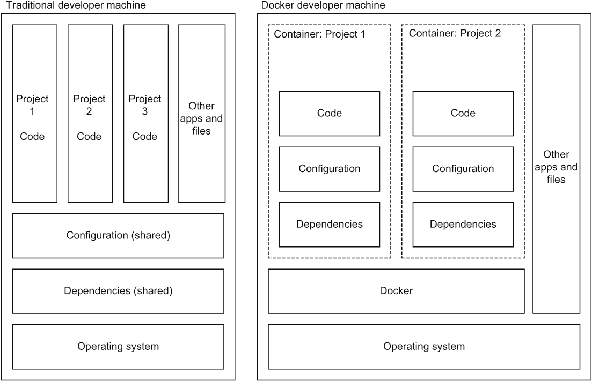
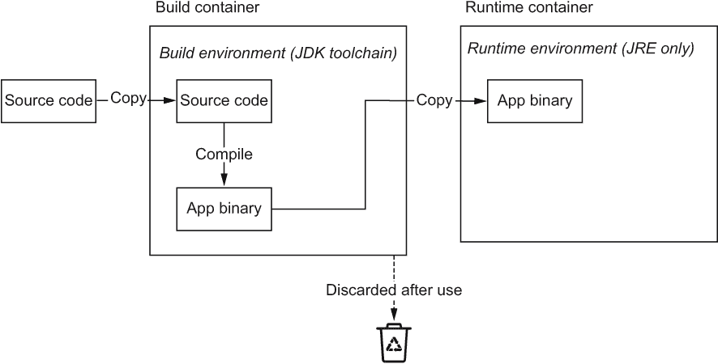

# 2 容器化应用程序

本章涵盖

+   如何容器化应用程序

+   在本地运行您的容器

+   在容器上下文中执行命令

将应用程序容器化——即，将应用程序及其依赖项打包到可执行容器中——在采用 Kubernetes 之前是一个必要的步骤。好消息是，容器化应用程序的好处不仅在于能够将其部署到 Kubernetes 中；它本身就是一个有价值的步骤，因为您正在打包应用程序的依赖项，然后可以在任何地方运行它，而无需在主机机器上安装这些依赖项。

无论您如何部署您的应用程序，将其容器化意味着您的开发人员可以使用 Docker 在本地开始工作，使他们能够在不进行除安装 Docker 之外任何设置的情况下开始新的项目。它提供了在不同应用程序之间轻松切换环境，因为环境是完全隔离的（见图 2.1）。即使您最终没有使用容器将应用程序部署到生产环境中，这些特性也使其成为提高开发者生产力的宝贵方式（尽管您可能也希望这样做）。



图 2.1 比较开发机器上容器化和非容器化多个项目

将您的应用程序打包到容器中意味着所有依赖项和配置都由容器配置文件——Dockerfile——捕获，而不是由 bash 脚本、基于文本的指令、人类记忆和其他非标准配置系统混合而成。这使得在单个主机机器上部署多个应用程序成为可能，无需担心它们会相互干扰，并且比完整虚拟化具有更高的性能和更低的开销。

## 2.1 构建 Docker 容器

让我们拿一个应用程序并将其放入容器中。

### 2.1.1 开发者设置

Docker 作为一种开发者工具，可在大多数平台上使用 Docker Desktop([`www.docker.com/products/docker-desktop`](https://www.docker.com/products/docker-desktop))进行分发，其中包含一些方便的实用工具，例如本地 Kubernetes 环境（在第三章中介绍）。对于 Linux（包括 Windows Subsystem for Linux [WSL]），您还可以单独安装 Docker Engine。

Mac

在 Mac 上，只需安装 Docker Desktop。

Windows

在 Windows 上，我强烈建议首先配置 WSL([`learn.microsoft.com/en-us/windows/wsl/install`](https://learn.microsoft.com/en-us/windows/wsl/install))。您需要的是 WSL 2，这样 Docker 才能使用它。安装了 WSL 2 后，您还可以安装 Linux 的发行版，如 Ubuntu([`mng.bz/pP40`](http://mng.bz/pP40))，它提供了一个 bash shell，并且是运行本节中展示的示例的便捷方式。一旦配置了 WSL，安装 Docker Desktop。

Linux

对于 Linux，除了 Docker Desktop 之外，还有一个选项——Docker Engine。你可以在这里找到各种平台（包括 Ubuntu）的说明：[`docs.docker.com/engine/install/ubuntu/`](https://docs.docker.com/engine/install/ubuntu/)。当你通过 WSL 使用 Linux 时，Docker Engine 也是一个选项。

### 2.1.2 在 Docker 中运行命令

在我们构建自己的应用程序容器之前，为了探索 Docker 的工作原理，我们可以在 Docker 中启动一个容器化的 Linux shell，如下所示：

```
$ docker run -it ubuntu bash
root@18e78382b32e:/# 
```

这将下载基础`ubuntu`镜像，启动一个容器，并对其运行 bash 命令。`-it`参数使其成为一个交互式 bash 终端。现在我们已经在容器中，我们运行的任何东西都会在容器中发生。

由于我们将在 Ubuntu 上构建应用程序，让我们安装语言包。我将在本章的许多示例中使用 Python，但这个概念同样适用于任何其他语言。

在容器 shell 中运行以下两个命令：

```
apt-get update
apt-get install -y python3
```

现在我们可以尝试交互式地运行 Python，例如：

```
# python3
>>> print("Hello Docker")
Hello Docker
>>> exit()
#
```

我们可以将这个最基本的命令捕获到我们自己的 Python 脚本中：

```
# echo 'print("Hello Docker")' > hello.py
# python3 hello.py 
Hello Docker
```

当你在容器中玩够了，使用`exit`退出。

这的好处是我们在容器中安装了 Python 并运行了我们的 Python 命令，而不是在本地系统中。Docker 的`run`命令实际上创建了一个*容器*，从我们的*镜像*中。镜像`ubuntu`是一个预先构建的文件系统，容器进程在其中运行。当我们退出与容器的交互会话时，它将被停止，但你可以很容易地再次启动它，使用`docker` `ps` `-a`获取容器 ID，`docker` `start` `$CONTAINER_ID`来启动它，以及`docker` `attach` `$CONTAINER_ID`来重新连接我们的 shell：

```
$ docker ps -a
CONTAINER ID   IMAGE     COMMAND    CREATED         STATUS                  
c5e023cab033   ubuntu    "bash"     5 minutes ago   Exited (0) 1 second ago

$ CONTAINER_ID=c5e023cab033
$ docker start $CONTAINER_ID
$ docker attach $CONTAINER_ID
# echo "run more commands"
# exit
```

运行了很多 Docker 容器后，你最终会得到一个相当大的停止容器列表（以及大量的硬盘空间被使用）。为了清理这些通常不需要保留的镜像，在任何时候，运行：

```
docker system prune -a
```

容器镜像与容器实例

在 Docker 术语中，容器*镜像*是文件工件（无论是从本节中提到的注册表中下载，还是本地构建），而容器实例（或简称容器）是容器的调用。在 Kubernetes 中，配置仅指镜像，而容器实例在运行时创建，并且是短暂的（当 Pod 停止时它们会被删除）。在本地使用 Docker 时，实例概念很重要，因为每次调用都会创建一个持久化的容器实例，所以最终你需要清理它们以恢复磁盘空间。

通过这些步骤，我们现在拥有了一个 Linux 环境，我们可以用它来测试和运行随机命令，而无需在我们的本地机器上安装任何东西（除了 Docker）。想要两个配置不同的 Linux 容器环境？不用担心——只需运行另一个容器！

如果您之前曾经设置过虚拟机（VM），您将非常欣赏设置速度有多快！容器易于创建。正如您将在下一节中看到的那样，它们也易于构建和扩展。

### 2.1.3 构建我们自己的镜像

在上一节中，我们启动了一个 Linux 容器，安装了 Python，并创建了一个简单的 Python 脚本，我们在容器中运行了这个脚本。假设我们想要使其可重复。也就是说，我们想要在我们的容器镜像中捕获容器的配置（安装 Python）和我们的应用程序（Python 脚本）。这样的镜像非常有用，这样我们就不必记住我们采取的步骤，而且其他人也可以构建我们的神奇应用程序！

虽然这个示例只使用了简单的 Python 脚本，但您可以想象应用程序可以变得多大和多复杂，您想要让它变得多大。它不仅限于 Python；这些步骤适用于任何解释型语言（有关如何处理编译应用程序的说明，请参阅 2.1.7 节）。只需将 Python 配置替换为您使用的任何语言即可。

构建我们的容器镜像以便进行可重复的应用程序部署的过程使用一个名为 Dockerfile 的配置文件。Dockerfile 是一组用于构建容器的程序性指令。将其想象成一个配置带有你的应用程序及其依赖项的虚拟机镜像的 bash 脚本；只是输出是一个容器镜像。

运行示例

本书列出的示例 Docker 应用程序和 Kubernetes 配置可以在源代码库中找到。克隆仓库并切换到根目录，如下所示：

```
git clone https://github.com/WilliamDenniss/kubernetes-for-developers.git
cd kubernetes-for-developers
```

示例按章节和节进行排列。例如，第二章的代码在名为 Chapter02 的文件夹中，第 2.1.3 节的示例在 2.1.3_Dockerfile 文件夹中。每个代码列表都包括样本文件的路径，以便您可以找到它。

给出的 shell 命令从根样本代码文件夹（`kubernetes-for-developers`，如果您按照之前的命令克隆了仓库）开始，所以在运行任何示例或探索代码后，只需切换回该目录，您就应该准备好继续您离开的地方并跟随下一个示例。

我们将从上一节中创建的基本 Python 程序开始，如下所示。

列表 2.1 Chapter02/2.1.3_Dockerfile/hello.py

```
print("Hello Docker")
```

要为这个脚本构建一个容器镜像，你需要创建一个 Dockerfile，选择一个基础容器镜像作为起点，配置 Python，并添加程序。目前，我们将从通用的基础镜像`ubuntu`开始，它提供了一个容器化的 Linux 环境。以下列表显示了一个基本的 Dockerfile 来捕获这些步骤。

列表 2.2 Chapter02/2.1.3_Dockerfile/Dockerfile

```
FROM ubuntu                      ❶
RUN apt-get update               ❷
RUN apt-get install -y python3   ❷
COPY . /app                      ❸
WORKDIR /app                     ❹
```

❶ 指定基础容器镜像

❷ 配置我们的环境

❸ 将应用程序复制到容器中

❹ 设置当前工作目录

构建这个容器，并将其命名为（标记为）`hello`，如下所示：

```
cd Chapter02/2.1.3_Dockerfile/
docker build . -t hello
```

一旦构建完成，我们就可以在名为`hello`的容器上运行`python3 hello.py`命令，如下所示：

```
$ docker run hello python3 hello.py
Hello Docker
```

注意到我们 Dockerfile 中的命令与上一节中使用的命令基本相同。我们不是直接启动`ubuntu`容器镜像，而是将其用作 Dockerfile 的基础镜像。然后我们运行与之前相同的两个`apt-get`命令来安装 Python，将我们的 Python 脚本复制到镜像中，并指定默认工作目录以指示命令将运行的位置。此外，请注意，运行代码的命令仍然是`python3 hello.py`；只是现在它被添加了前缀以在新的容器镜像中运行。

我们现在将构建的环境和我们的脚本封装到一个整洁的包中，我们可以自己使用和运行，也可以与他人分享。容器最奇妙的地方在于它们封装了配置步骤以及程序本身。最好的部分是，当`ubuntu`基础镜像更新时，我们只需再次运行那个`build`命令就可以重新构建我们的镜像。

将其与在你的开发机器上安装 Python 并本地运行所有内容进行比较。首先，如果你那样做了，现在 Python 就已经安装了。你可能会很高兴 Python 已经安装，但想象一个更复杂的应用程序，它带来了数十个工具和库。你真的想在你的系统上安装所有这些吗？此外，如果你正在开发几个不同的应用程序，每个应用程序都有自己的依赖项，或者有相同的依赖项但需要特定版本的依赖项，使得同时满足两个应用程序的依赖项变得不可能（这种情况有时被称为“依赖地狱”）？

容器通过在各自的容器镜像中隔离应用程序及其依赖项来解决这个问题。你可以愉快地在多个项目中工作，与你的开发团队共享 Dockerfile，并将容器镜像上传到你的生产环境，而不会弄乱你的开发机器。

对于像 Ruby 这样的不同语言，设置相当相似，如下面的两个列表所示。

列表 2.3 Chapter02-ruby/2.1.3_Dockerfile/hello.rb

```
puts "Hello Docker"
```

列表 2.4 Chapter02-ruby/2.1.3_Dockerfile/Dockerfile

```
FROM ubuntu
RUN apt-get update
RUN apt-get install -y ruby
COPY . /app
WORKDIR /app
```

运行时，唯一的区别是传递的命令：

```
$ cd Chapter02-ruby/2.1.3_Dockerfile
$ docker build . -t hello_ruby
$ docker run hello_ruby ruby hello.rb
Hello Docker
```

### 2.1.4 使用基础镜像

上一节使用 Linux 容器`ubuntu`作为基础来配置我们的基于 Linux 的应用。基础镜像，包括`ubuntu`和其他如`centos`和`alpine`等发行版，是配置任何基于 Linux 应用的良好起点。然而，为了方便，容器社区已经创建了几个更具体的镜像，这些镜像针对各种语言和环境进行了设计。

我们不需要自己将 Python 安装到`ubuntu`基础镜像中，我们可以直接从`python`镜像开始，并节省一些步骤。额外的优势是，这些基础镜像通常由专家创建，因此它们配置良好，可以运行 Python 应用程序。以下列表显示了相同的容器，但以`python`基础镜像开始。

列表 2.5 第二章/2.1.4_BaseImage/Dockerfile

```
FROM python:3
COPY . /app
WORKDIR /app 
```

更简单吗？构建和运行与之前相同：

```
$ cd Chapter02/2.1.4_BaseImage
$ docker build . -t hello2
$ docker run hello2 python3 hello.py
Hello Docker
```

究竟什么是基础镜像？

在本例中使用的*基础镜像*，*python*，*实际上是通过 Dockerfile 构建的，并配置了一个包含运行 Python 程序所需所有内容的运行环境。对于来自 Docker Hub 的容器镜像，它们的 Dockerfile 源代码是链接的，这样你可以看到它们是如何组成的。基础镜像通常以另一个基础镜像开始，以此类推，直到一个以完全空容器`scratch`开始的镜像。

如果你使用的是 Ruby 而不是 Python，设置相当类似。只需使用`ruby`基础镜像，如下面的两个列表所示。

列表 2.6 第二章-ruby/2.1.4_BaseImage/hello.rb

```
puts "Hello Docker"
```

列表 2.7 第二章-ruby/2.1.4_BaseImage/Dockerfile

```
FROM ruby
COPY . /app
WORKDIR /app
```

构建和运行：

```
$ cd Chapter02-ruby/2.1.4_BaseImage
$ docker build . -t hello_ruby2
$ docker run hello_ruby2 ruby hello.rb
Hello Docker
```

不仅存在操作系统和语言特定的基础镜像。如果你使用的是 Apache 这样的环境，你可以从`httpd`基础镜像开始。有时你可能会遇到多个可以作为基础镜像的情况。最好的经验法则是选择可以节省最多配置的镜像（你总是可以从未选择的镜像的 Dockerfile 中借鉴！）。

基础镜像——或者至少你可以复制的公共示例——几乎为每种常见的语言、环境和开源应用程序都存在。在从头开始构建自己的镜像之前，明智的做法是在 Docker Hub 或 Google 中搜索基础镜像，看看是否有人为你所在的环境提供了一个可以使用的示例，作为起点。

### 2.1.5 添加默认命令

通常，在容器中执行的命令（在之前的 Python 示例中为`python3 hello.py`）每次都是相同的。你可以在 Dockerfile 中指定它，而不是每次都重复它。

列表 2.8 第二章/2.1.5_DefaultCommand/Dockerfile

```
FROM python:3
COPY . /app
WORKDIR /app 
CMD python3 hello.py
```

要构建和运行此容器，请在命令行中执行以下操作：

```
$ cd Chapter02/2.1.5_DefaultCommand
$ docker build . -t hello3
$ docker run hello3       
Hello Docker
```

与我们之前在 Dockerfile 中使用的其他行不同，`CMD`是独特的，因为它实际上并不改变容器构建的*方式*。它只是保存了在没有指定命令的情况下调用`docker run`时将执行的默认命令。这并不会阻止你覆盖它并在运行时执行不同的命令。现在命令已在 Dockerfile 中指定，要构建和运行此程序的 Ruby 版本，也只需简单地`docker run $IMAGE_NAME`：

```
$ cd Chapter02-ruby/2.1.5_DefaultCommand
$ docker build . -t hello_ruby3
$ docker run hello_ruby3
Hello Docker
```

### 2.1.6 添加依赖项

大多数非平凡的应用程序都将有自己的依赖项，这些依赖项不包括在基础镜像中。为了加载这些依赖项，你可以在容器构建过程中运行命令来配置镜像，以满足你的需求。这就是我们在前面的示例中向 Linux 基础镜像添加 Python 的方法，这种方法可以用来安装应用程序需要的所有依赖项。如果你的应用程序连接到 MariaDB 数据库，你可能构建的容器如下所示。

列表 2.9 第二章/2.1.6_ 依赖项/Dockerfile

```
FROM python:3
RUN apt-get update                      ❶
RUN apt-get install -y mariadb-client   ❶
COPY . /app
WORKDIR /app 
CMD python3 hello.py
```

❶ 使用 apt-get 配置你的 Linux 容器，使其包含你的应用程序所需的一切。

`python` 基础镜像是从 Debian 构建的，Debian 是广泛用于容器的 Linux 发行版，它使用 apt-get 软件包管理器，因此我们可以使用 `apt-get` 安装我们需要的几乎所有其他依赖项。

你也不一定只能使用 `apt-get`。比如说，你有一个创建 PDF 文件的服务，你需要包含一个 Unicode 字体。你可以构建一个包含 Google 的 Noto 免费字体的镜像，如下面的列表所示。

列表 2.10 第二章/2.1.6_ 依赖项-2/Dockerfile

```
FROM python:3
RUN apt-get update
RUN apt-get install -y libarchive-tools                ❶
RUN mkdir -p ~/.fonts; cd ~/.fonts                     ❷
RUN curl "https://noto-website-2.storage.googleapis\ ❸
.com/pkgs/Noto-hinted.zip" | bsdtar -xvf- ❸
RUN fc-cache -f -v                                     ❹
COPY . /app
WORKDIR /app
CMD python3 hello.py
```

❶ 安装 bsdtar

❷ 创建一个新的目录并切换到它。注意如何在同一行上组合多个命令。

❸ 下载字体包并提取它

❹ 安装字体

容器通常有许多依赖项，你可以以这种方式配置操作系统的任何部分，例如安装字体或 TLS 证书。

### 2.1.7 在 Docker 中编译代码

对于需要编译的程序，如 Java、.NET、Swift 和 C++，怎么办？显然，在 Dockerfile 中仅使用 `COPY` 命令是不够的，除非你已经有现成的编译二进制文件。

在本地预编译应用程序是一个选项，但为什么不使用 Docker 来编译你的应用程序呢！让我们重新实现我们的“Hello World”示例，用 Java 编写并编译到我们的容器中，如下面的两个列表所示。

列表 2.11 第二章/2.1.7_ 编译代码/Hello.java

```
class Hello {
    public static void main(String[] args) {
        System.out.println("Hello Docker");
    }
}
```

列表 2.12 第二章/2.1.7_ 编译代码/Dockerfile

```
FROM openjdk
COPY . /app
WORKDIR /app
RUN javac Hello.java ❶
CMD java Hello
```

❶ 编译命令

这个 Dockerfile 与之前的类似：我们以 OpenJDK (`openjdk`) 基础镜像开始，并复制应用程序。然而，在这种情况下，我们将使用 `RUN` 命令来构建应用程序，前面加上一个 `WORKDIR` 指令来指定这个操作（以及随后的操作）应该在哪里执行。

要构建和运行此示例，请执行以下操作：

```
$ cd Chapter02/2.1.7_CompiledCode
$ docker build . -t compiled_code
$ docker run compiled_code
Hello Docker
```

另一个示例在第二章-swift/2.1.7_ 编译代码文件夹中，它可以用相同的方式构建和运行。

### 2.1.8 使用多阶段构建编译代码

使用 `RUN` 来编译代码或执行其他操作是一个可行的途径；然而，缺点是最终你会在容器镜像中配置所需的工具来执行 `RUN` 命令。这些工具最终会与任何源代码一起出现在最终的容器镜像中。

例如，如果你查看上一节中创建的镜像并运行`ls`，

```
$ docker run compiled_code ls
Dockerfile
Hello.class
Hello.java
```

你会看到源代码仍然存在。此外，Java 编译器（`javac`）仍然存在于镜像中，即使它将不再被使用（我们在运行应用程序时不需要编译器）。

这种将容器镜像的责任混合在一起——既用于构建又用于运行——并不是最佳选择。这不仅让所有额外的二进制文件膨胀了容器镜像，还无谓地增加了容器的攻击面（因为现在容器中运行的任何进程都有一个编译器可用）。你可以使用一些额外的 Docker 命令（例如，删除源代码，卸载不再需要的工具）来清理容器，但这并不总是实用的，尤其是如果所有这些额外的工具都来自基础镜像。

解决这个问题的更好方法是使用多阶段容器构建（图 2.2）。使用多阶段构建，我们首先配置一个临时容器，其中包含构建程序所需的一切，然后我们配置一个最终容器，其中包含运行程序所需的一切。这保持了关注点的分离，并将它们干净利落地隔离到各自的容器中。



图 2.2 多阶段容器构建，其中使用了一个中间容器来构建二进制文件

让我们重新整理上一节中的示例，使其使用多阶段 Dockerfile 进行构建。

列表 2.13 Chapter02/2.1.8_MultiStage/Dockerfile

```
FROM openjdk:11 AS buildstage                   ❶
COPY . /app
WORKDIR /app
RUN javac Hello.java

FROM openjdk:11-jre-slim                        ❷
COPY --from=buildstage /app/Hello.class /app/   ❸
WORKDIR /app
CMD java Hello
```

❶ 构建容器被命名为 buildstage，其责任是构建代码。

❷ 运行时容器使用了一个精简的基础镜像，没有包含编译工具

❸ 使用`--from=`来引用构建容器中的文件。

从这个示例中可以看出，似乎有一个 Dockerfile 中包含了两个（每个都以`FROM`命令开始）。第一个配置和构建纯粹是为了编译应用程序，使用完整的`openjdk`基础镜像，其中包含 Java 编译器，而第二个只包含运行应用程序所需的内容，并从`jre`基础镜像构建，该镜像只包含 Java 运行时环境。

这个 Dockerfile 产生的最终产物是一个生产容器，它只包含编译后的 Java 类和运行它所需的依赖项。构建应用程序的第一个容器的中间产物在构建完成后实际上被丢弃（技术上，它被保存在你的 docker 缓存中，但没有任何部分包含在最终产物中，你会在生产中使用）。

要运行此示例，请执行以下操作：

```
$ cd Chapter02/2.1.8_MultiStage
$ docker build . -t compiled_code2
$ docker run compiled_code2
Hello Docker
```

如果我们在这个新的容器上运行`ls`命令，我们可以看到其中只有编译后的代码：

```
$ docker run compiled_code2 ls
Hello.class
```

在 Chapter02-swift/2.1.8_MultiStage 文件夹中给出了另一个示例，它使用多阶段构建过程编译服务器端 Swift 应用程序。它可以以相同的方式构建和运行。

## 2.2 服务器应用程序的容器化

上一节中的示例都是一些运行一次然后退出的简单程序。这是一个适用于命令行程序、批处理工作负载，甚至在函数即服务环境中处理请求的容器用例。然而，在 Kubernetes 中部署的最常见工作负载之一是 HTTP 服务——也就是说，一个监听并处理传入请求的应用程序（即一个网络服务器）。

从 Docker 的角度来看，服务器应用程序与其他任何应用程序没有区别。由于你很可能希望容器持续运行（以便它可以处理请求），因此在启动和连接到容器的方式上可能有一些差异。你很可能还希望从你的本地机器转发端口，以便你可以连接到它。

### 2.2.1 容器化应用程序服务器

到目前为止，示例程序一直是一个基本的“Hello World”Python 脚本。为了演示如何容器化 HTTP 服务器，我们需要一个实际上是 HTTP 服务器的例子！列表 2.14 是一个 Python 中裸骨 HTTP 服务器的示例，它返回当前的日期和时间。不必太担心代码本身。这本书是语言无关的，这里使用的 Python 纯粹是一个例子。你可以将这些原则应用到任何 HTTP 服务器上。

列表 2.14 Chapter02/timeserver/server.py

```
from http.server import ThreadingHTTPServer, BaseHTTPRequestHandler
from datetime import datetime

class RequestHandler(BaseHTTPRequestHandler):
    def do_GET(self):
        self.send_response(200)
        self.send_header('Content-type', 'text/plain')
        self.end_headers()
        now = datetime.now()
        response_string = now.strftime("The time is %-I:%M %p, UTC.")
        self.wfile.write(bytes(response_string, "utf-8")) 

def startServer():
    try:
        server = ThreadingHTTPServer(('', 80), RequestHandler)
        print("Listening on " + ":".join(map(str, server.server_address)))
        server.serve_forever()
    except KeyboardInterrupt:
        server.shutdown()

if __name__== "__main__":
    startServer()
```

容器化这个服务器应用程序与早期的命令行程序非常相似，如下所示。

列表 2.15 Chapter02/timeserver/Dockerfile

```
FROM python:3.12
ENV PYTHONUNBUFFERED 1
COPY . /app
WORKDIR /app 
CMD python3 server.py
```

容器化自己的应用程序

如果你正在容器化自己的应用程序，请遵循以下通用步骤：

1.  找到一个理想的基镜像，尽可能多地提供你的配置。对于一个 Ruby on Rails 应用程序，从`ruby`开始，而不是更通用的`ubuntu`。对于 Django，使用`python`，依此类推。

1.  配置任何你需要的应用程序特定依赖项（通过`RUN`语句，就像我们之前做的那样）。

1.  复制你的应用程序。

我发现谷歌搜索在这方面真的是你的朋友。除非你在做一些新颖和异国情调的事情，否则可能有人已经找到了并分享了一个示例 Dockerfile，说明了如何使用你的框架配置应用程序。如果你使用像 Django、Ruby on Rails、WordPress、Node.JS 或 SpringBoot 这样的流行框架，我可以肯定地说，有很多资源可以借鉴。每个应用程序都是不同的——你的依赖项并不总是与别人的完全匹配——但你可以通过这种方式获得巨大的优势。

现在我们有了 HTTP 服务器应用程序，我们可以像往常一样构建它：

```
$ cd Chapter02/timeserver
$ docker build . -t timeserver
```

运行它这次有些不同，因为我们需要从主机机器转发端口到容器，这样我们实际上可以在浏览器中尝试这个应用程序。让我们将本地机器上的端口 8080 转发到应用程序监听的容器的端口 80：

```
$ docker run -it -p 8080:80 timeserver
Listening on 0.0.0.0:80
```

现在你应该能够浏览到 http://localhost:8080 并查看应用程序。或者，使用`curl`，执行以下操作：

```
$ curl http://localhost:8080
The time is 1:30 PM, UTC.
```

`-it` 参数（实际上是两个参数，但通常一起使用）允许我们通过发送 `SIGTERM`（通常是 Ctrl/Command+C）来终止。这使得典型的开发者循环（构建-运行-修复-重复）变得简单（运行，Ctrl+C，修复，重复）。或者，你可以使用 `docker` `run` `-d` `-p` `8080:80` `timeserver` 在后台运行 Docker。如果不使用 `-it`，你需要手动停止进程：使用 `docker` `ps` 列出进程，然后使用 `docker` `stop` `$CONTAINER_ID` 停止它，或者使用 `docker` `stop` `$(docker` `ps` `-q)` 停止所有正在运行的容器。

为了一个整洁的开发循环，我喜欢使用以下一行命令，它将一次性构建并运行镜像。当你需要重新构建时，只需按下 Ctrl+C（或等效键），使用上箭头显示最后使用的命令，然后按 Enter 重新执行。务必在构建阶段查看控制台输出，以检查是否有任何错误，否则它将运行最后一个构建的镜像：

```
docker build . -t timeserver; docker run -it -p 8080:80 timeserver
```

就这样！我们现在有一个在 Docker 中运行的应用程序容器。在第 2.3 节中，我介绍了如何使用 Docker Compose 配置和运行本地调试设置（如果你的应用程序由几个不同的容器组成，这很有用），在下一章中，我将介绍如何将这个 Web 应用程序部署到 Kubernetes。

### 2.2.2 调试

如果你配置 Dockerfile 后遇到应用程序运行困难的问题，进入容器环境进行探索以查看哪里出错可能很有用。当容器正在运行时，你可以使用之前的指令从新的控制台窗口进入正在运行的容器，如下所示：

```
$ docker ps
CONTAINER ID    IMAGE       COMMAND                 CREATED         STATUS
6989d3097d6b    timeserver  "/bin/sh -c 'python3..."  2 minutes ago   Up 2 min

$ CONTAINER_ID=6989d3097d6b
$ docker exec -it $CONTAINER_ID sh
# ls
Dockerfile  server.py
# exit
$
```

你也可以运行除 `sh` 之外的其他任何命令；例如，在一个 Ruby on Rails 项目中，你可能会在这里运行 `bundle` `exec` `rails` `console` 来直接启动 rails 控制台，而不需要中间步骤。

我不会列出每个 Docker 命令，因为文档在这方面做得很好，但我发现另一个特别有用的调试命令是 `docker` `cp`。它允许你在主机和容器之间复制文件。以下是一个示例：

```
docker cp server.py $CONTAINER_ID:/app
```

或者，要从容器中复制文件，请执行以下操作：

```
docker cp $CONTAINER_ID:/app/server.py .
```

如果你通过 `exec` 运行命令或复制文件来修复任何问题，请确保在 Dockerfile 中捕获更改。Dockerfile 是你的主要规范，而不是容器实例。如果你依赖于对容器实例的手动更改，那么它并不比我们正在远离的旧“进入虚拟机并更改内容”模式更好。

## 2.3 使用 Docker Compose 进行本地测试

到目前为止，我们已经构建了一个容器镜像，并准备好开始使用 Kubernetes。如果你愿意，可以跳到下一章，立即将新构建的容器部署到云或本地 Kubernetes 环境中。本节介绍了在部署到 Kubernetes 之前，如何使用 Docker Compose 进行本地容器测试和开发。

在上一节中，我们使用 Docker 启动了我们的服务器应用，并将端口转发到主机进行测试。在开发过程中使用这种方法进行测试有几个缺点。每次测试时，您都必须设置要转发的端口，如果您正在开发一个包含几个容器的应用，那么配置正确的端口并使一切正常运行可能会变得复杂。

这就是 Docker Compose 的用武之地。Compose 是一个迷你容器编排器，可以在逻辑组中启动和销毁多个容器，并在运行之间保留运行时设置，这对于本地测试非常有用。要使用 Compose 运行 2.2.1 节中的 Web 服务器容器，我们可以配置一个 docker-compose.yaml 文件，如下所示。

列表 2.16 第二章/2.3_Compose/docker-compose.yaml

```
services:
  web:
    build: ../timeserver         ❶
    command: python3 server.py   ❷
    ports:                       ❸
      - "8080:80"                ❸
```

❶ 包含要构建的 docker 容器的目录路径

❷ 在容器上运行的命令。如果 Dockerfile 指定了 CMD，则可以省略。

❸ 将端口从本地机器转发到容器。在这种情况下，本地机器上的 8080 端口将被转发到容器的 80 端口。

要构建和运行容器，请执行以下操作：

```
cd Chapter02/2.3_Compose
docker compose build
docker compose up
```

在开发过程中，我倾向于将这两个步骤合并为一个，这样我就可以创建一个紧凑的重构循环：

```
docker compose build; docker compose up
```

使用这种简单的配置，无需记住启动和测试应用的特定 Docker 命令——所有内容都整齐地存储在 compose 文件中。在这个例子中，这主要是一些要转发的端口，但随着您添加更多配置和依赖项，这种好处将变得明显。

### 2.3.1 本地映射文件夹

之前，我们使用`docker` `cp`将文件复制到容器实例中。Compose 的一个非常有用的功能是您实际上可以将本地文件夹直接映射到容器中。换句话说，容器不会包含您应用的副本，它实际上只是链接到您硬盘上的应用文件夹。在开发过程中，这非常有用，因为它允许您直接从桌面工作在容器中的文件，而无需来回复制文件或重建容器。

回想一下列表 2.15 中的 Dockerfile，我们的服务器应用被复制到容器内的/app 目录。我们现在想做的就是在相同的目录下使用卷绑定将我们的本地目录挂载到容器中，如下所示。

列表 2.17 第二章/2.3.1_ 卷挂载/docker-compose.yaml

```
services:
  frontend:
    build: .
    command: python3 server.py
 volumes:         ❶
 - type: bind ❶
 source: . ❶
 target: /app ❶
    environment:
 PYTHONDONTWRITEBYTECODE: 1 ❷
    ports:
      - "8080:80"
```

❶ 将本地容器构建目录绑定到容器的/app 目录（与 Dockerfile 匹配）

❷ 设置一个新的环境变量，以便 Python 可以重新加载我们的源代码

使用这种卷绑定，我们的本地机器上的文件将用于构建容器时复制的文件。当我们本地更新这些文件时，更改可以立即在容器中读取，无需重新构建。对于 Python、Ruby 和 PHP 等解释型语言以及 HTML 和 CSS 等标记语言来说，这意味着您可能有一个设置，只需在编辑器中点击保存，然后在浏览器中重新加载页面，就可以有一个非常紧密的开发循环。

注意：对于编译代码，这可能没有太大帮助。您可以在本地构建二进制文件，将其替换到容器中，但如果您更喜欢通过 Docker（或者您的本地环境和容器之间存在架构差异）构建一切，那么这可能没有帮助。对于编译代码，我建议使用其他开发工具，如 Skaffold¹ 以提供紧密的开发循环。

然而，要让这个示例应用程序工作有一个技巧。我们的 Python 代码默认情况下，在发生更改时不会从磁盘重新加载。因此，虽然我们可以修改源代码，但一旦容器运行，它就不会有任何效果。这同样适用于许多其他构建系统。

让我们更新 Python 时间服务器应用程序以支持在运行时重新加载代码，并在 Compose 中配置本地挂载。这里的步骤将因语言和框架而异。对于 Python，我们可以使用 *reloading* 库，以便在每次有新请求时从磁盘重新加载我们的 `GET` 函数。

列表 2.18 第二章/2.3.1_VolumeMount/server.py

```
from reloading import reloading
from http.server import ThreadingHTTPServer, BaseHTTPRequestHandler
from datetime import datetime

class RequestHandler(BaseHTTPRequestHandler):
 @reloading  ❶
    def do_GET(self):
        self.send_response(200)
        self.send_header('Content-type', 'text/plain')
        self.end_headers()
        now = datetime.now()
        response_string = now.strftime("The time is %-I:%M %p, UTC.")
        self.wfile.write(bytes(response_string,"utf-8")) 

def startServer():
    try:
        server = ThreadingHTTPServer(('',80), RequestHandler)
        print("Listening on " + ":".join(map(str, server.server_address)))
        server.serve_forever()
    except KeyboardInterrupt:
        server.shutdown()

if __name__== "__main__":
    startServer()
```

❶ 通过在我们的方法中添加 @reloading 标签，每次运行时它都会从磁盘重新加载，这样我们就可以在运行时更改我们的 do_GET 函数。

由于我们使用了一个新的库，我们还需要在 Dockerfile 中添加这个依赖项。

列表 2.19 第二章/2.3.1_VolumeMount/Dockerfile

```
FROM python:3
RUN pip install reloading
ENV PYTHONUNBUFFERED 1
COPY . /app
WORKDIR /app 
CMD python3 server.py
```

在我们的应用程序配置为从磁盘重新加载文件后，我们现在可以像以前一样使用 Compose 运行它：

```
$ cd Chapter02/2.3.1_VolumeMount
$ docker compose build; docker compose up
Creating network "231_volumemount_default" with the default driver
Creating 231_volumemount_frontend_1 ... done
Attaching to 231_volumemount_frontend_1
```

如前所述，浏览到 http://localhost:8080/ 上的应用程序。这次，打开 2.3.1_VolumeMount/server.py 代码（列表 2.18）并修改响应。例如，我们可以通过将第 12 行替换为以下内容来将响应更改为 24 小时时间：

```
response_string = now.strftime("The time is %H:%M, UTC.")
```

在您的编辑器中保存文件并重新加载页面。您应该会在响应中看到新的文本：

```
$ curl http://localhost:8080
The time is 17:23, UTC.
```

在这个例子中，我们不得不做一些代码更改才能使其工作，但如果你使用的是标准开发框架，那么这很可能不是必要的，因为你将能够配置它以自动执行重新加载。

能够将本地文件夹映射到容器中，创建一个与在代码编辑器中点击保存然后重新加载浏览器页面一样快的开发循环，这必须是我最喜欢的 Docker Compose 和容器的一般特性之一。您拥有容器的一切好处，您不需要在本地安装开发工具，效率与您在本地运行时没有任何构建步骤一样。

绑定是双向的。如果你在绑定卷内的容器中进行了任何更改，它将反映在你的本地磁盘上。当你想在容器中运行命令并保存它们的输出时，这非常有用。实际上，使用这种方法，你可以完全避免在本地机器上安装开发者工具。例如，Rails 开发者有时会在他们的项目目录中运行 `gem update rails` 来保持框架更新。使用卷绑定，你可以在容器中运行它，并在你的硬盘上获得已更改的包列表，以便提交到版本控制。

### 2.3.2 添加服务依赖项

在你的应用程序完全独立的情况下，恭喜你，你已经完成了。然而，在其余的时间里，你很可能会需要其他服务来与你的应用程序一起启动。这些可能包括你构建的其他独立服务器，或者可能由你的云服务提供商运行的标准组件，比如数据库。在这两种情况下，你都可以在 Compose 中添加这些依赖项来创建一个本地开发环境。

Compose 或 Kubernetes 用于本地开发？

为什么选择使用 Compose 而不是直接使用 Kubernetes 来为开发搭建依赖服务呢？Kubernetes 当然可以用于本地开发，如果你想要复制生产环境，它无疑是最佳选择（第三章包含关于本地开发的章节）。然而，Compose 在这项任务中之所以受欢迎，主要是因为它的简单性。

如果你只需要少量依赖服务，那么 Compose 的本地设置非常简单，对于许多简单应用程序来说就是这样。在生产环境中，你不仅仅是在一台机器上运行几个单实例服务，这是一个不同（更复杂）的故事，这正是 Kubernetes 之所以出色的地方。

这种双重性意味着在本地开发中使用 Compose 和在生产中使用 Kubernetes 是很常见的。这也意味着你的运行时配置实际上是重复的，但由于这个配置有两个不同的目的——开发和生产——所以即使全部都在 Kubernetes 中，它也可能不会看起来完全相同。我建议简单地使用任何能让开发者生活更轻松的方法。

可以轻松地将多个服务添加到 Compose 中。这些服务可以引用标准镜像（例如，对于像 MySQL 这样的依赖项）或你电脑上的其他项目。一个常见的项目结构是有一个根文件夹用于所有服务，每个服务都在子文件夹中检出，并且有一个 Docker Compose 文件可以引用它们。

列表 2.20 提供了一个包含两个容器化服务的 Compose 文件示例：我们本地构建的应用程序和一个使用公共 MySQL 容器的数据库实例。这里的演示应用程序实际上并没有使用 MySQL，但希望你能看到添加应用程序所需依赖项有多容易。你可以在这里添加所有需要的服务，包括多个本地构建的容器和多个外部镜像。

列表 2.20 Chapter02/2.3.2_MultipleServices/docker-compose.yaml

```
services:
  frontend:                                        ❶
    build: ../timeserver                           ❶
    command: python3 server.py                     ❶
    environment:                                   ❶
      PYTHONDONTWRITEBYTECODE: 1                   ❶
    ports:                                         ❶
      - "8080:80"                                  ❶

  db:
    image: mysql:5.7                               ❷
    volumes:                                       ❷
      - db_data:/var/lib/mysql                     ❷
    restart: always                                ❷
    environment:                                   ❷
      MYSQL_ROOT_PASSWORD: super secret password   ❷
      MYSQL_DATABASE: my_database                  ❷
      MYSQL_USER: dev_user                         ❷
      MYSQL_PASSWORD: another secret password      ❷
volumes:                                           ❸
    db_data:                                       ❸
```

❶ 我们本地构建的应用程序；你可以拥有多个本地构建的应用程序。

❷ 运行公共图像的服务；你也可以拥有多个这样的服务。

❸ 为开发数据库定义卷，以便它在重启之间持续存在

这也是使用 Compose 而不是仅使用 Docker 进行本地测试的关键原因之一——能够通过单个命令启动完整的测试环境并将其拆除。

提示：当配置你的应用程序用于本地开发和生产时，所有配置更改都应通过环境变量进行。甚至一个表示`prod`或`dev`以选择要使用哪个配置文件的单个环境变量也足够了。配置不应以将需要在不同环境之间修改的方式嵌入到容器中。这允许你在所有环境中重用相同的容器，这也意味着你在测试生产工件。

### 2.3.3 模拟外部依赖

如果到目前为止，你一直在针对远程依赖项（如云存储 API）进行测试，那么现在可能是一个好时机，看看你是否可以用模拟来替换这些远程依赖项。模拟是外部依赖项相同 API 的轻量级实现，通过提供本地服务来加速开发和测试。

在过去，你可能被迫寻找与你的应用程序编写语言相同（出于实际原因，如不想为一个项目支持多个不同的环境）的模拟。容器的一个好处是，就像你可能不关心你消费的云服务是用什么语言编写的，你也不再需要关心你的模拟是用什么语言编写的，因为你不需要维护环境——它在自己的容器中运行。

这也带来了高质量模拟的机会，这些模拟实际上只是生产中使用的相同 API 的更轻量级实现。就像在列表 2.20 中我们使用容器中的真实 MySQL（而不是模拟）一样，你可以使用真实对象存储提供商进行测试，即使你最终使用像 Google Cloud Storage 或 Amazon S3 这样的云服务提供商服务。

以对象存储为例，假设你的应用程序使用与 S3 兼容的 API 进行云存储（例如，使用 S3 本身或许多支持该 API 的对象存储之一，如 Google Cloud Storage）。为了快速迭代而设置本地模拟，你可以获取一个像 Adobe 的 S3Mock²这样的容器，但使用容器，使用一个完整的 S3 兼容的本地存储解决方案（如 MinIO³）同样容易。MinIO 实际上不是一个模拟——在你想管理自己的块存储服务的情况下，你可以将其部署到生产环境中——但你仍然可以使用它作为一个高质量的模拟，并获得如方便的用户界面等好处。

对象存储的 S3 API 的普遍性

就像 SQL 标准化的数据库查询语言一样，S3 的 API 对于对象存储提供商来说出奇地受欢迎。例如，Google Cloud、Azure 以及（当然）AWS 都实现了 S3 API，以及大多数其他云和几个裸金属存储选项。这种普遍性的好处是您可以轻松地在提供商之间切换，并从多个伪造中选择以进行本地开发。

之前，我讨论了容器如何使混合和匹配服务变得容易，所有这些服务都在它们自己的环境中运行。在这里，我们看到这种能力如何使开发变得更好。您不必自己实现伪造或为您的环境找到原始的伪造，您可以使用与生产中相同的服务本地使用（例如 MySQL）或找到您使用的另一个云服务的生产级替代品（例如 MinIO 作为云对象存储的替代）。让我们将 MinIO 作为另一个服务添加到我们的 Docker Compose 文件中。

列表 2.21 第二章/2.3.3_Fakes/docker-compose.yaml

```
services:

  storage:                                           ❶
 image: minio/minio            ❶
 command: minio server /data            ❶
 volumes:            ❶
 - storage_data:/data            ❶
 restart: always            ❶
 environment:            ❶
 MINIO_ACCESS_KEY: fakeaccesskey            ❶
 MINIO_SECRET_KEY: fakesecretkey            ❶
 ports:            ❶
 - "9000:9000"            ❶

  frontend:
    build: ../timeserver
    command: python3 server.py
    environment:
      PYTHONDONTWRITEBYTECODE: 1
      S3_ENDPOINT:            http://storage:9000 ❷
 S3_USE_PATH_STYLE:      1 ❷
 S3_ACCESS_KEY_ID:       fakeaccesskey ❷
 S3_SECRET_ACCESS_KEY:   fakesecretkey         ❷
    ports:
      - "8080:80"

volumes:
    db_data:
    storage_data:
```

❶ 新的存储伪造

❷ 配置为使用新伪造的应用程序

通常，对于用作伪造的服务，例如我们在这里使用 MinIO，您可以指定它将接受的访问密钥，然后只需将这些相同的密钥作为环境变量指定给应用程序即可。

## 摘要

+   容器化将您的应用程序的构建、环境和配置捕获到一个标准化的格式中，然后可以像虚拟机一样进行隔离运行，但无需虚拟机的开销。

+   容器化是采用 Kubernetes 的关键步骤，因为这是 Kubernetes 支持的执行环境。

+   不仅用于生产，容器还有助于开发者同时处理多个项目，无需担心环境冲突，也不需要复杂的设置说明。

+   构建容器镜像的过程使用一个名为 Dockerfile 的配置文件，其中包含用于构建您容器的一系列过程指令。

+   要构建 Dockerfile，首先从满足您需求的最完整的基镜像开始，然后配置您的应用程序及其依赖项。

+   多阶段构建对于编译型应用程序很有用。

+   在多阶段容器构建中，我们首先配置一个临时容器，其中包含构建程序所需的一切，然后配置另一个容器，其中包含运行程序所需的一切。这保持了关注点的分离，并将它们干净地隔离到各自的容器中。

+   Docker Compose 是一个轻量级的容器编排器，可以为多个服务提供一个基于容器的快速开发环境。

+   使用 Compose 映射本地文件夹可以实时编辑非编译应用程序，创建紧密的开发循环。

+   在测试期间，容器允许使用高质量的伪造外部依赖项，这些依赖项实际上是您在生产中使用的相同 API 的轻量级实现，例如容器中的 MySQL 或真实的对象存储提供商。

* * *

^(1.) [`skaffold.dev/`](https://skaffold.dev/)

(2.) [`github.com/adobe/S3Mock`](https://github.com/adobe/S3Mock)

(3.) [`min.io/`](https://min.io/)
