# 3 部署到 Kubernetes

本章涵盖

+   与指定和托管应用程序部署相关的 Kubernetes 概念

+   在云平台上将容器化应用程序部署到 Kubernetes

+   使用应用程序容器的新版本更新部署

+   在本地运行 Kubernetes 版本进行测试和开发

在上一章中，我们介绍了如何容器化你的应用程序。如果你在那里停止，你将有一个便携且可重复的环境，更不用说方便的开发者设置。然而，当你进入生产时，你可能会有困难来扩展那个应用程序。

对于超简单部署，如果你不介意每个虚拟机（VM）运行一个容器，你可能会直接将容器部署到 VM 上，然后根据需要扩展你的 VM。你会得到一些容器的好处，比如方便的打包。然而，如果你像大多数人一样，有多个不同的服务要部署，你可能需要更灵活的东西。

这就是容器编排器如 Kubernetes 发挥作用的地方。容器编排只是指处理多个不同机器上多个不同容器调度和监控的工具。它允许你主要从应用程序部署的角度工作——容器及其部署属性，例如应该有多少个容器副本（实例）；以及高可用性（跨故障域扩展）、服务网络等要求——而不是过度关注底层计算的配置。

能够方便地管理共享计算资源池中的多个服务，当运行多个应用程序或采用如微服务这样的模式时，其中应用程序的不同部分被分别部署和管理，这会给你带来效率。你还可以混合不同类型的部署，从无状态应用程序到有状态数据库、批处理作业等——而不必过多担心每个容器最终实际运行在哪个机器上。

## 3.1 Kubernetes 架构

Kubernetes 是一个抽象层，它位于原始计算原语（如 VM 或裸机）和负载均衡器之上的工作负载级别。VM 被称为 *节点*，并排列成 *集群*。容器（一个或多个）被组合成一个称为 *Pod* 的调度单元。网络通过 *服务* 进行配置。其他更高阶的构建块，如 *Deployment*，存在以使 Pod 更容易管理。在我们部署第一个工作负载之前，让我们探索这个架构的一些基本构建块。

### 3.1.1 Kubernetes 集群

Kubernetes 集群是由节点组成的集合，这些节点是运行容器的计算实例。最常见的是虚拟机，但它们也可以是裸机（非虚拟化）机器。每个节点都运行一个特殊的 Kubernetes 进程，称为*kubelet*，它负责与控制平面（Kubernetes 编排过程）通信并管理在节点上通过容器运行时运行的容器的生命周期。除了操作系统、kubelet 和容器运行时环境之外，其他进程，包括您的工作负载和一些负责日志记录和监控的系统组件，都在容器中运行，如图 3.1 所示。

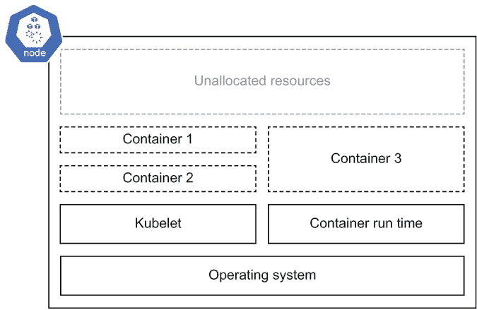

图 3.1 在虚拟机上运行的过程，Kubernetes 称之为*节点*

在集群中，一个或多个（在高可用模式下操作时）节点具有特殊角色，如图 3.2 所示：运行 Kubernetes 编排程序本身。构成控制平面的特殊节点负责

+   运行 API，您可以使用它通过工具（如 Kubernetes 命令行界面（CLI）工具）与集群交互

+   存储集群的状态

+   协调集群中的所有节点以调度（启动、停止、重启）它们上的容器

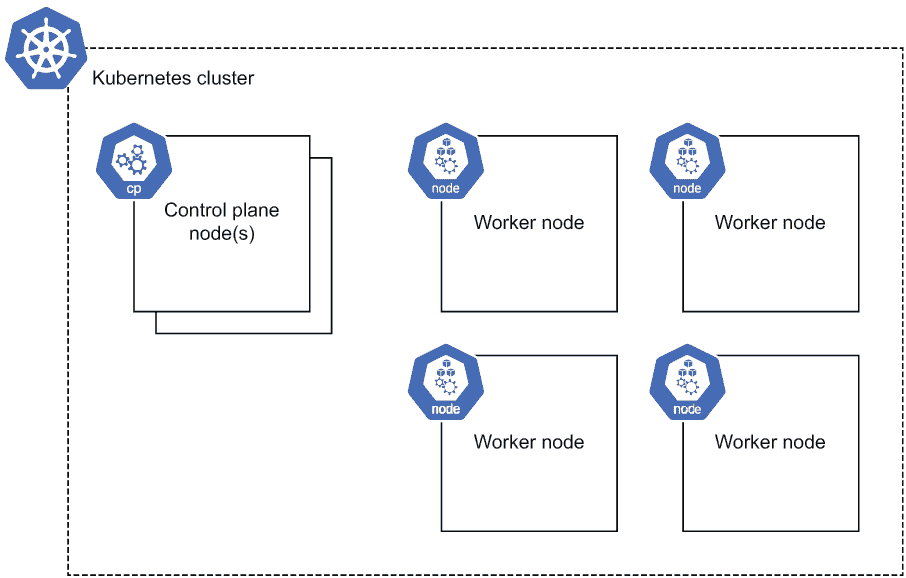

图 3.2 自管理的 Kubernetes 集群，包含控制平面和工作节点

在大多数云环境中，控制平面作为托管服务提供。在这样的环境中，控制平面节点通常对用户不可见，控制平面可能运行在节点上是一个实现细节。在这些环境中，您通常会认为集群是托管控制平面与工作节点组成的，如图 3.3 所示。

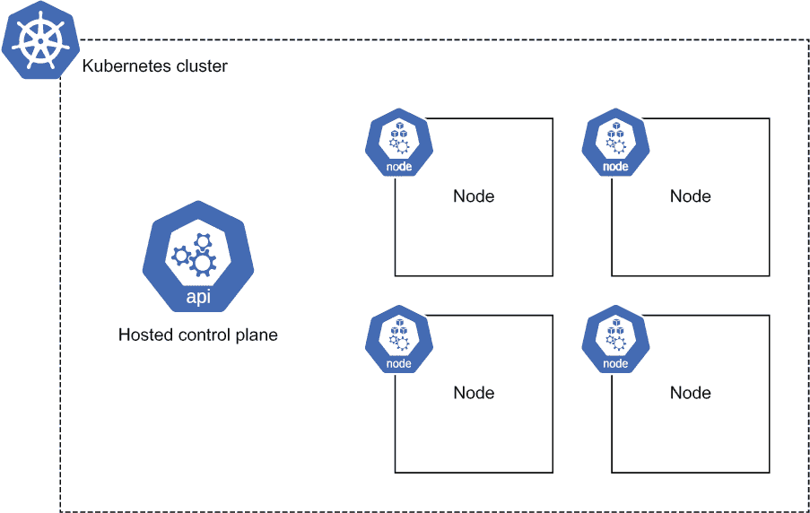

图 3.3 基于云的 Kubernetes 集群，节点连接到托管控制平面

工作节点（在此简称为*节点*）负责管理运行中的容器的生命周期，包括启动和停止容器等任务。控制平面将指示节点运行特定的容器，但容器的实际执行则是节点的责任。节点也会自行采取一些行动，而无需向控制平面汇报，例如重启已崩溃的容器或在节点内存不足时回收内存。

总体而言，控制平面和节点组成了*Kubernetes 集群*，并提供了可以在其上调度你的工作负载的 Kubernetes 平台。集群本身是由你用来运行 Kubernetes 的平台提供商提供的，它负责创建集群资源，如节点。本书旨在面向开发者，主要关注*使用*Kubernetes 集群来运行你的工作负载，而不是平台提供商的任务（这些任务更多地属于云提供商领域），为开发者提供这项服务。

### 3.1.2 Kubernetes 对象

一旦集群创建完成，你主要通过创建、检查和修改通过 Kubernetes API 的 Kubernetes 对象与 Kubernetes 交互。这些对象中的每一个都代表系统中的特定部署结构。例如，有一个对象代表一组容器（Pod），一个代表一组 Pod（Deployment），一个用于网络服务，等等。甚至节点也被表示为一个对象，你可以查询它来查看当前状态的一些方面，例如正在使用多少资源。要将典型的无状态 Web 应用程序部署到集群中，你将使用三个对象：Pod、Deployment（它封装 Pod）和服务。

Pod

Pod 仅仅是容器的一个集合。通常，Pod 将只是一个单个容器，但在紧密耦合的容器需要一起部署的情况下，Pod 可能会有多个容器（图 3.4）。

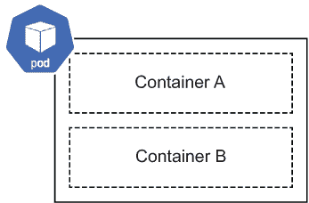

图 3.4 Kubernetes Pod，可以有一个或多个容器

Pod 被用作 Kubernetes 中的主要调度单元。它包含你的应用程序及其容器，是 Kubernetes 根据你所需的资源在节点上调度的计算单元。例如，如果你的工作负载需要两个 CPU 核心来运行，你可以在 Pod 定义中指定这一点，Kubernetes 将找到一个有两个可用 CPU 资源的机器。

一个 Pod 有多少个容器？

除了存在多个容器之间紧密耦合依赖的简单情况外，大多数容器都是独立部署的，每个 Pod 一个容器。你可能有多容器的情况包括所谓的 sidecars，其中第二个容器用于授权、日志记录或其他功能，以及其他多个容器紧密耦合的情况，这样它们可以从一起部署中受益。

如果你检查节点上运行的过程，你不会看到 Pod 本身，只会看到来自容器的许多进程（图 3.5）。Pod 只是容器的一个逻辑分组。是 Kubernetes 将这些容器绑定在一起，确保它们共享一个共同的生存周期：它们一起创建；如果一个失败，它们会一起重启；并且它们会一起终止。

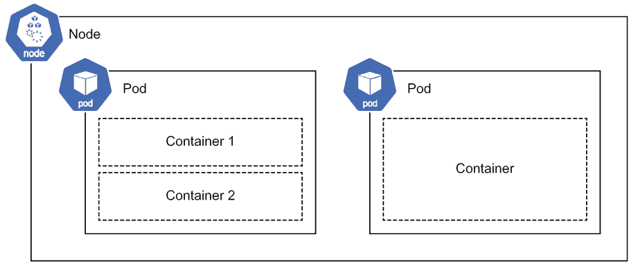

图 3.5 节点上运行的多个 Pod

Deployment

虽然你可以指示 Kubernetes 直接运行 Pods，但你很少这样做。应用程序会崩溃，机器会失败，因此 Pods 需要重新启动或重新调度。与其直接调度 Pods，不如将它们包装成一个更高阶的对象，该对象管理 Pods 的生命周期。

对于需要持续运行的 Web 服务器等应用程序，该对象是 *Deployment*。其他选项包括在第十章中介绍的用于运行批处理过程的 *Job*。在 Deployment 中，你指定希望运行的 Pod 副本数量以及其他信息，例如如何滚动更新。

与 Kubernetes 中的所有对象一样，Deployment（图 3.6）是系统期望状态的规范，Kubernetes 试图实现这一状态。你可以指定诸如 Pod 的副本数量等信息，以及我们在后续章节中将要讨论的 Pod 在集群中分布的详细要求。Kubernetes 在尝试提供你所请求的内容的同时，持续地将观察到的状态与期望状态进行协调。例如，如果某个 Pod 在部署后某个时间点变得不可用，比如运行它的节点失败，Kubernetes 会观察到运行的 Pods 数量少于期望值，并调度新的 Pod 实例以满足你的要求。这些自动化的扩展和修复操作是使用 Deployment 而不是直接运行 Pods 来管理服务生命周期的首要原因。

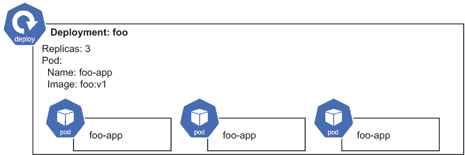

图 3.6 包含三个 Pod `foo-app` 副本的 Deployment

服务

服务是暴露在一系列 Pods 上运行的应用程序作为网络服务的方式。服务提供了一个单一的寻址机制，并在 Pods 之间分配负载（图 3.7）。服务有自己的内部 IP 地址和 DNS 记录，可以在集群内运行的其他 Pods 中引用，也可以分配一个外部 IP 地址。


图 3.7 Kubernetes 服务

## 3.2 部署应用程序

让我们从部署一个应用程序并在互联网上使其可用开始。稍后，我们将使用新版本更新它。换句话说，我们将使用 Kubernetes 在前一个章节中讨论的对象执行基本的应用程序开发-发布-更新周期：一个 *Pod*，它将由 *Deployment* 管理，并通过 *Service* 暴露。

### 3.2.1 创建集群

在部署应用程序之前，你需要一个 Kubernetes 集群来使用。我建议在公共云上创建一个，因为这样设置起来更方便，人们可以立即查看你的作品，因为你可以为部署的任何服务共享一个公共 IP。许多云服务提供商都提供免费试用，以帮助在学习过程中降低成本。

使用本地 Kubernetes 集群进行开发是另一种选择，但本地 Kubernetes 集群的环境与基于云的集群之间有一些固有的差异，尤其是在像负载均衡这样的问题上。我更喜欢学习第一天就能在生产环境中使用的环境，因此我建议选择一个云提供商并从那里开始。

倾向于使用本地集群？

如果你更愿意使用本地的 Kubernetes 发行版，我已经为你准备好了。按照第 3.4 节的步骤操作，将你的 `kubectl` 命令连接到本地集群，然后再回到第 3.2.3 节继续部署到 Kubernetes 的内容。

只要注意，当你准备部署你自己的本地构建的容器镜像时，有一些在 3.4 节中概述的考虑因素，以确保 Kubernetes 可以找到你的镜像，并且由于缺乏公共负载均衡器，你访问你创建的任何服务的方式将不同（也在该节中概述）。

最后，你只需要一个托管在某处的 Kubernetes 集群和认证到该集群使用的 Kubernetes 命令行工具 `kubectl`（发音为：“cube cuttle”），就可以运行这本书中的几乎所有示例了。接下来的两个步骤将使用 Google Cloud，但我也会在过程中提供如何替换你选择的平台的说明。

Google Kubernetes Engine

Google Kubernetes Engine (GKE) 是第一个推向市场的 Kubernetes 产品，由于其成熟度和易用性，成为尝试 Kubernetes 的热门选择。我在 GKE 团队工作，对这个平台最为了解，因此我将在这本书中需要特定平台要求的一些地方使用它。

我写这本书是为了在任何你找到 Kubernetes 的地方都能使用，我预计无论你是使用 GKE、OpenShift、Azure Kubernetes Service (AKS)、Elastic Kubernetes Service (EKS) 还是其他任何 Kubernetes 平台和发行版，这本书都将对你学习 Kubernetes 有用。在少数几个地方，平台会发挥作用（比如现在创建集群的时候），在这些情况下，我会用 GKE 的说明来演示操作，但我也会提供如何在其他平台上找到等效操作的指南。

在任何云上创建 Kubernetes 集群

在此设置部分之后，你只需要运行本章示例的 `kubectl` 工具已经认证到你所选择的 Kubernetes 集群。创建和认证 `kubectl` 是目标，正如你将看到的 GKE 一样，这可以通过两个命令完成。你可以用你选择的平台的等效集群创建和认证命令替换这些命令。

要在任何提供程序上运行以下示例，请遵循您选择的提供程序的集群创建指南，然后继续到第 3.2.2 节。上传容器也是另一个特定于提供程序的操作，但我已经为您提供了如何在任何平台上完成此操作的通用提示。

要开始使用 GKE，您需要一个 Google 账户（如果您有@gmail.com 电子邮件地址，那么您就有 Google 账户）。请访问[`console.cloud.google.com/`](https://console.cloud.google.com/)，选择您的账户，并查看条款。如果您尚未激活免费试用，请激活它，或者添加账单信息以便您能够运行这些示例（如果您希望在本地上运行示例，您也可以按照第 3.4 节中的步骤操作以获取仅本地的集群）。

在您的账户设置完成后，转到控制台中的 GKE（直接链接：[`console.cloud.google.com/kubernetes`](https://console.cloud.google.com/kubernetes)）并创建一个集群。我建议使用自动模式，该模式会为您处理节点的供应和管理。使用自动模式，您可以设置名称，选择一个区域（如图 3.8 所示），并将网络和高级设置保留为默认值。

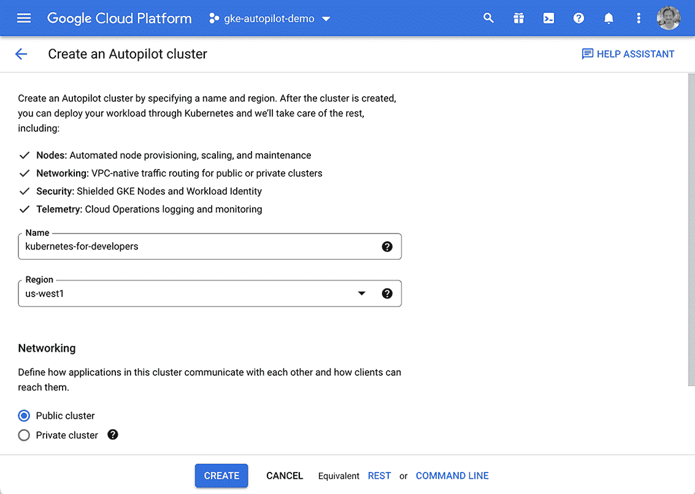

图 3.8 GKE Autopilot 的集群创建用户界面

接下来，设置命令行工具。您需要云提供程序 CLI（在本例中为`gcloud`用于 Google Cloud）来执行集群操作，如创建和认证，以及`kubectl`用于与 Kubernetes API 交互。在[`cloud.google.com/sdk/install`](https://cloud.google.com/sdk/install)下载`gcloud` CLI 并按照安装说明操作。

安装完成后，运行`gcloud init`命令进行登录。如果您有多个 Google 账户，请确保选择您之前创建集群时使用的相同账户：

```
gcloud init
```

Kubernetes CLI，`kubectl`，可以独立安装（按照[`kubernetes.io/docs/tasks/tools/`](https://kubernetes.io/docs/tasks/tools/)中的说明操作）或通过`gcloud`安装。安装方式无关紧要，但鉴于本例使用`gcloud`，我们可以方便地使用它来安装`kubectl`，如下所示：

```
gcloud components install kubectl
```

一旦集群准备就绪且`gcloud`已配置，请在 UI 中点击“连接”，并将提供的 gcloud 命令（如图 3.9 所示）复制到您的 shell 中以认证`kubectl`。或者，使用您自己的集群详细信息运行以下命令：

```
CLUSTER_NAME=my-cluster
REGION=us-west1
gcloud container clusters get-credentials $CLUSTER_NAME --region $REGION
```

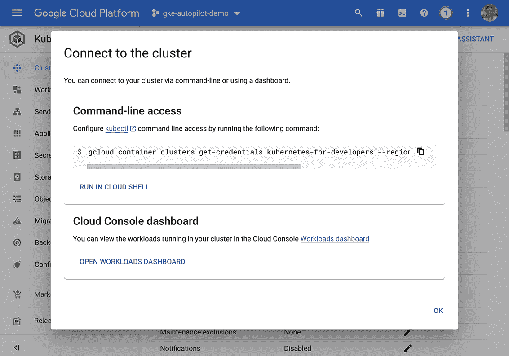

图 3.9 GKE 的集群连接用户界面

该命令是 Google Cloud 世界和 Kubernetes 之间的粘合剂，并使用正确的凭据对`kubectl` CLI 进行认证以访问您的 GKE 集群。

在 CLI 中创建集群

而不是使用用户界面，您可以从命令行执行创建和连接步骤，如下所示：

```
CLUSTER_NAME=my-cluster
REGION=us-west1
gcloud container clusters create-auto $CLUSTER_NAME --region $REGION
gcloud container clusters get-credentials $CLUSTER_NAME --region $REGION
```

在你的集群创建并`kubectl`认证后，你就可以开始使用你的第一个应用程序了！为了确保一切正常，运行`kubectl get pods`。它应该指出没有资源（因为我们还没有部署任何 Pods）：

```
$ kubectl get pods
No resources found in default namespace.
```

如果你遇到错误，很可能是你的集群没有正确创建或认证。尝试重复之前的步骤或查找错误信息。

### 3.2.2 上传你的容器

到目前为止，我们创建的容器都存储和运行在本地的机器上。在你可以将容器部署到云中运行的 Kubernetes 之前，你需要将你的容器镜像上传到容器注册库。这只是一个存储容器镜像数据并提供 Kubernetes 获取镜像的方式的地方。大多数注册库支持公共镜像选项，任何人都可以使用（如开源项目和书籍的示例），或者私有镜像，这需要认证（你将使用它来为你的专有应用程序）。

如果你愿意，你可以跳过此步骤并使用以下示例中引用的公开可用的镜像。然而，我建议你构建并上传自己的容器来使用，这样你就可以在需要的时候部署自己的应用程序。

Docker Hub 作为一个容器注册库的选择很受欢迎，尤其是在公共容器镜像方面。这包括基础镜像（如我们在上一章中使用的那些），开源软件如 MariaDB，或者可能是你希望与世界分享的自己的软件和演示。你还可以从 Docker Hub（和其他注册库）访问任何 Kubernetes 平台的私有容器镜像，只需进行一些额外的配置来设置凭证。

对于大多数希望保持其镜像*私有*的用户来说，使用云提供商的容器注册库是默认选择，因为这通常在镜像拉取时间、减少网络数据成本和简化认证方面提供了效率。对于 Google Cloud，那是 Artifact Registry；在 Amazon Web Services (AWS)上，它是 Amazon Elastic Container Registry；在 Azure 上，它是 Azure Container Registry；等等。

一旦你选择了你偏好的位置，按照以下步骤上传你的容器。

账户设置

要开始，如果你还没有账户，首先在你偏好的提供商处创建一个账户，然后创建一个仓库，你将在其中上传图片。对于 Docker Hub，请访问[`hub.docker.com/`](https://hub.docker.com/)，登录，然后导航到创建仓库。

对于 Artifact Registry，请访问[`console.cloud.google.com/artifacts`](https://console.cloud.google.com/artifacts)，并在你希望的位置创建一个类型为 Docker 的新仓库。注意生成的路径，它看起来可能像`us-docker.pkg.dev/my-project/my-repository`。

认证

接下来，你想要验证`docker`命令行工具，以便它可以上传镜像到你的新创建的仓库。按照你的容器仓库的说明来验证`docker`命令行工具。

要在 Docker Hub 中这样做，你会运行

```
docker login
```

对于工件仓库，回想一下你之前创建的仓库路径。取该路径的主机部分（例如，`us-docker.pkg.dev`），然后运行以下命令将凭证助手安装到 Docker 工具中，以便你可以将镜像上传到那里。你可以多次运行此命令，每次运行针对你使用的每个单独的主机：

```
HOST_NAME=us-docker.pkg.dev
gcloud auth configure-docker $HOST_NAME
```

提示：使用你选择的云提供商验证 Docker 通常是一个简单的操作。只需查找配置 Docker CLI 的正确凭证的云特定命令。搜索查询“使用[你的云提供商]容器仓库验证 Docker”应该可以解决问题！

标签

当你构建镜像时，它们会被分配一个基于随机哈希的名称，例如`82ca16cefe84`。通常，添加一个具有一定意义的自定义标签是一个好主意，这样你可以轻松地引用自己的镜像。在前一章中，我们使用了这些标签，这样我们就可以使用像`docker` `run` `timeserver`这样的友好名称在本地运行我们的镜像，而不是使用`docker` `run` `82ca16cefe84`。

当你将容器上传到容器仓库时，标签具有额外的含义。你必须使用遵循容器仓库指定的特定路径约定的名称来标记镜像，以便它知道将镜像存储在哪个账户和路径中（以及让你的本地 Docker 客户端知道上传到哪个仓库）。当你上传到这些仓库时，使用像`timeserver`这样的简单名称来标记你的镜像将不起作用。

Docker Hub 使用以下约定

```
docker.io/$USERNAME/$REPOSITORY_NAME:$VERSION_TAG
```

其中`$USERNAME`是你的 Docker 用户名，`$REPOSITORY_NAME`是你创建在 Docker Hub 中的仓库名称，`$VERSION_TAG`是一个任意字符串（通常包括一个数字）。结合我的情况，我的用户名是“wdenniss”，我的仓库是“timeserver”，我得到的字符串是`docker.io/wdenniss/timeserver:1`。

版本标签

版本标签是一个无结构的字符串，用于引用镜像的版本。约定是使用版本号（可能构造为 major.minor .patch）和可选后缀：例如，`2`.`2.1`，`2.1.5`，`2.1.5-beta`。可以使用特殊的版本标签`latest`来引用运行容器时最新的镜像，但在标记上传的镜像时不要使用`latest`，因为它会被容器仓库自动应用。

每个仓库都有自己的格式。对于 Google Cloud 的工件仓库，其格式由以下结构组成：

```
$LOCATION-docker.pkg.dev/$PROJECT_ID/$REPOSITORY_NAME/
$VERSION_TAG
```

在 UI 控制台中创建 Artifact Registry 仓库后，您应该看到字符串的前一部分显示出来（例如，`us-docker.pkg.dev/wdenniss/ts`），您可以复制（或者您也可以使用前面的公式构建字符串）。在这个前缀后面，添加您喜欢的任何镜像名称和标记，例如`timeserver:1`。将其组合起来，对我来说，看起来如下所示：

```
us-docker.pkg.dev/wdenniss/ts/timeserver:1
```

容器仓库标记约定

每个私有容器仓库都有自己的魔法字符串连接，您需要创建正确的标记，而且它们都不同。例如，Azure^a 记录了`$REGISTRY_NAME.azurecr.io/$REPOSITORY_NAME:$VERSION_TAG`，AWS^b 记录了`$AWS_ACCOUNT_ID.dkr.ecr.$REGION.amazonaws.com/$REPOSITORY_NAME: $VERSION_TAG`*.* 我可以肯定的是：确保您遵循您所使用的容器仓库的指南；否则，Kubernetes 将不知道将镜像推送到哪里。我使用的搜索词是“[cloud provider] registry container tag name”。

^a [`mng.bz/o1YD`](http://mng.bz/o1YD)

^b [`mng.bz/nWOd`](http://mng.bz/nWOd)

一旦确定了要使用的正确镜像标记（在后续示例中我们将称之为`$IMAGE_TAG`），您就可以为上传标记任何现有的 Docker 镜像。要将我们在早期章节中构建的其中一个镜像上传到容器仓库，您可以引用其之前的标记并添加容器仓库标记（镜像可以有多个标记）。如果您在 2.2.1 节中使用`docker` `build` `.` `-t` `timeserver`构建了示例，这个镜像将具有`timeserver`标记，这意味着我们可以将其重新标记为容器仓库，如下所示：

```
IMAGE_TAG=us-docker.pkg.dev/wdenniss/ts/timeserver:1
docker tag timeserver $IMAGE_TAG
```

注意：如果您收到“没有这样的镜像”错误，请继续阅读，因为我们即将从头开始再次构建它。

您可以查看生成的镜像列表，如下所示：

```
$ docker images
REPOSITORY                                TAG     IMAGE ID      CREATED
timeserver                                latest  c07e34564aa0  2 minutes ago
us-docker.pkg.dev/wdenniss/ts/timeserver  1       c07e34564aa0  2 minutes ago
python                                    3.10    cf0643aafe49  1 days ago
```

您还可以根据镜像 ID（`docker` `tag` `$IMAGE_ID` `$IMAGE_TAG`）查找现有镜像并对其进行标记，但我建议在构建时进行标记以避免混淆。实际上，我通常发现简单地重新构建镜像比事后尝试找到正确的镜像 ID 要快得多。

要构建和标记示例容器，请将`$IMAGE_TAG`替换为您自己的仓库镜像名称，然后从根示例目录运行

```
IMAGE_TAG=us-docker.pkg.dev/wdenniss/ts/timeserver:1
cd Chapter02/timeserver
docker build . -t $IMAGE_TAG
```

推送

一旦我们的仓库设置完成，Docker 认证就绪，并且您的镜像已标记，您可以使用以下命令将镜像推送到仓库

```
docker push $IMAGE_TAG 
```

之前的认证步骤在 Docker 配置中安装了一个辅助程序，使 Docker 能够与您的云容器仓库进行通信，无论是什么。如果您收到“权限拒绝”错误，那么要么您没有正确认证 Docker，要么您的镜像标记字符串构建错误。请验证您是否已将 Docker 认证到适当的仓库并设置了正确的镜像标记。请参考您选择的容器仓库的最新文档以获取指导。

如果一切顺利，你应该会看到以下输出。特别注意最后一行，这是任何认证错误将显示的位置：

```
$ docker push $IMAGE_TAG
The push refers to repository [us-docker.pkg.dev/wdenniss/ts/timeserver]
9ab1337ca015: Pushed
3eaafa0b4285: Layer already exists
a6a5635d5171: Layer already exists
8c25977a7f15: Layer already exists
1cad4dc57058: Layer already exists
4ff8844d474a: Layer already exists
b77487480ddb: Layer already exists
cd247c0fb37b: Layer already exists
cfdd5c3bd77e: Layer already exists
870a241bfebd: Layer already exists
1: digest: sha256:edb99776ae47b...97f7a9f1864afe7 size: 2425
```

一旦镜像已上传，你现在就可以将你的代码部署到 Kubernetes 中了！

### 3.2.3 部署到 Kubernetes

在创建集群并使用 `kubectl` 进行认证后，我们可以部署我们的第一个应用程序。为此，我们将创建一个恰如其分的 Deployment 对象。Kubernetes 使用声明式配置，你在配置文件中声明你想要的状态（例如，“我想要在集群中运行 3 个我的容器副本”），然后提交该配置到集群，Kubernetes 将努力满足你指定的要求。

对于配置文件，大多数开发者使用 YAML，因为它更容易手动编辑。JSON 是另一个选项（主要用于自动化访问），并且某些配置可以命令式地创建（在第 3.3 节中讨论）。列表 3.1 是来自第二章的 timeserver 应用程序的极简 Deployment 规范。它引用了一个由包含的样本应用程序构建的公共容器镜像，我已经将其上传到 Docker Hub。如果你有自己的镜像，例如在上一节中推送到容器仓库的镜像，请编辑此文件，并用你的镜像替换我的镜像。

列表 3.1 第三章/3.2_DeployingToKubernetes/deploy.yaml

```
apiVersion: apps/v1
kind: Deployment
metadata:
  name: timeserver
spec:
  replicas: 3                                    ❶
  selector:
    matchLabels:
      pod: timeserver-pod
  template:
    metadata:
      labels:
        pod: timeserver-pod
    spec:
      containers:
      - name: timeserver-container
        image: docker.io/wdenniss/timeserver:1   ❷
```

❶ 部署多少个 Pod 副本（实例）

❷ 部署和运行哪个容器镜像

此清单将创建我们容器的三个副本。稍后，我们将看到如何配置负载均衡器来将这些三个运行实例的传入请求进行分配。在这个极简的 Deployment 配置示例中，最重要的三条线是名称，这是检查、修改和删除 Deployment 所必需的；副本数量；以及容器名称。其余部分基本上是使一切工作的粘合剂（别担心，我还会解释粘合剂是如何工作的）。

容器镜像路径就像一个 URL，它引用了查找容器的位置。如果你按照上一节上传了你的容器，你已经在那个步骤中有了这个镜像路径。我的带有 docker.io 前缀的容器镜像可在 Docker Hub 上找到，这是一个流行的托管公共镜像的地方，包括基础镜像。需要注意的是，如果你看到没有域的镜像路径，例如 `ubuntu` 或 `wdenniss/timeserver`，它只是指在 Docker Hub 上托管的镜像的简写。

因此，这就是 Deployment。让我们在集群中创建它。从根样本目录中运行

```
cd Chapter03/3.2_DeployingToKubernetes/
kubectl create -f deploy.yaml
```

这指示 Kubernetes 创建配置文件中定义的对象。如果你在部署后需要做出更改（例如更改镜像版本），你可以在本地进行更改，并使用以下命令更新集群中的 Deployment

```
kubectl apply -f deploy.yaml
```

要观察 Deployment 的状态，请运行

```
$ kubectl get deploy
NAME         READY   UP-TO-DATE   AVAILABLE   AGE
timeserver   3/3     3            3           36s
```

如前所述，Deployment 是你所需要求的声明性语句，例如，“3 个副本的此 Pod。”当你创建 Deployment 并系统返回成功响应时，这仅仅意味着 Kubernetes 接受了你的 Deployment 以进行调度——并不意味着它已经按照你期望的方式完成了调度。使用 `kubectl get` 查询 Deployment 将会显示当前状态，例如有多少个 Pod 准备好服务流量（`READY` 列中的数字），以及稍后，当你更新 Deployment 时，有多少个 Pod 在新版本部署过程中运行最新版本（`UP-TO-DATE` 列中的数字）。要查看构成你的 Deployment 的 Pod 的更多详细信息，你也可以查询这些 Pod 本身：

```
$ kubectl get pods
NAME                          READY   STATUS    RESTARTS   AGE
timeserver-6df7df9cbb-7g4tx   1/1     Running   0          68s
timeserver-6df7df9cbb-kjg4d   1/1     Running   0          68s
timeserver-6df7df9cbb-lfq6w   1/1     Running   0          68s
```

注意：如果这里显示 Pod 处于挂起状态，这可能意味着你的集群没有足够的资源。在动态配置的环境中，通常只需等待一分钟或更长时间就足够看到它们被调度。如果它们仍然处于挂起状态，请查看“故障排除：卡在挂起状态”部分中的后续建议。

`kubectl get pods` 命令返回活动命名空间中所有 Pod 的状态，所以一旦你有很多 Deployment，这可能会变得有些混乱。相反，你可以使用更详细的形式，其中你传递 Pod 的标签（在第 3.2.4 节中讨论过）作为选择器。以下是一个使用示例 Deployment 标签的完整示例：

```
$ kubectl get pods --selector=pod=timeserver-pod
NAME                          READY   STATUS    RESTARTS   AGE
timeserver-6df7df9cbb-7g4tx   1/1     Running   0          2m13s
timeserver-6df7df9cbb-kjg4d   1/1     Running   0          2m13s
timeserver-6df7df9cbb-lfq6w   1/1     Running   0          2m13s
```

一旦 Pod 运行起来，我们就可以与之交互了！为了连接到我们刚刚创建的 Deployment 并访问之前创建公共 IP 之前部署的服务器，我们可以简单地从我们的本地机器转发一个端口到容器，如下所示：

```
$ kubectl port-forward deploy/timeserver 8080:80
Forwarding from 127.0.0.1:8080 -> 80
Forwarding from [::1]:8080 -> 80
```

这允许你通过浏览 http://localhost:8080 来从 localhost 与 Deployment 交互。当你尝试容器化应用程序时，你可以在新的命令行外壳中查看日志输出，如下所示：

```
$ kubectl logs -f deploy/timeserver
Found 3 pods, using pod/timeserver-8bbb895dc-kgl8l
Listening on 0.0.0.0:80
127.0.0.1 - - [09:59:08] “GET / HTTP/1.1” 200 -
```

使用 `-f`（跟随）参数的日志命令将从 Deployment 中的一个 Pod 流式传输日志。在你的应用程序启动时将一条语句记录到 `stdout` 中是一个好主意，就像这里用“Listening on 0.0.0.0:80”所做的那样，这样你可以确保容器确实按照预期启动。

在 Kubernetes 中，你执行的大多数操作都不是瞬时的。创建一个 Pod 需要时间来配置新的计算能力（这取决于你使用的 Kubernetes 平台），从容器仓库下载容器，并启动你的容器。如果一切顺利，你应在几分钟内就有正在运行的容器。

当一切顺利时，你的部署中的 Pod 将报告一个状态（使用`kubectl get pods`查询时），状态为`Running`。你可能还会看到其他状态，如`Pending`，当它在等待容量时，以及`ContainerCreating`，一旦容器被调度到你的节点并启动。令人困惑的是，有时一个 Pod 可能会卡在`Pending`状态——这是一个有点模糊的状态——并且可能还有其他错误。以下是一些常见的错误情况列表。

故障排除：镜像拉取错误（ErrImagePull/ErrImagePullBackoff）

此错误表明 Kubernetes 无法下载容器镜像。这通常意味着在你的配置中镜像名称拼写错误，镜像不存在于镜像仓库中，或者你的集群没有访问仓库所需的凭据。

检查你的镜像拼写，并验证该镜像是否存储在你的仓库中。为了快速修复以使部署运行，可以尝试使用我提供的公共容器镜像。你可以使用`kubectl apply -f deploy.yaml`来应用你对部署配置所做的任何修复。

故障排除：卡在挂起状态

如果你看到一个 Pod 在`Pending`状态中挂起一分钟以上，通常意味着 Kubernetes 调度器无法在你的集群中找到空间来部署 Pod。通常，这个问题可以通过向你的集群添加额外的资源来解决，比如添加一个额外的或更大的计算节点。

你可以通过以下方式“描述”挂起的 Pod 来查看其详细信息：

```
$ kubectl get pods
NAME                          READY   STATUS    RESTARTS   AGE
timeserver-6df7df9cbb-7g4tx   1/1     Pending   0          1m16s

$ POD_NAME=timeserver-6df7df9cbb-7g4tx
$ kubectl describe pod $POD_NAME
```

`Events`部分包含 Kubernetes 遇到的所有错误列表。如果你尝试调度一个部署但没有可用资源，你会看到一个警告，例如`FailedScheduling`。以下是我看到的一个 Pod 尝试调度但资源不足的事件文本：

```
Warning  FailedScheduling  26s (x2 over 26s)  default-scheduler
➥ 0/2 nodes are available: 2 Insufficient cpu.
```

只要至少有一个你的 Pod 处于`Running`状态，你现在就不必担心，因为只要有一个 Pod 存在来响应请求，你的服务应该仍然可以运行。然而，如果它们都处于挂起状态，你可能需要采取行动——很可能是通过添加更多的计算资源。

故障排除：容器崩溃（CrashLoopBackOff）

另一个常见的错误是容器崩溃。容器崩溃可能有各种原因，包括容器启动失败（例如，由于配置错误）或者容器启动后不久就崩溃。

在 Kubernetes 部署的范围内，任何终止的容器进程都算作崩溃——即使是以成功的退出代码终止的。部署是为长时间运行的过程设计的，而不是一次性任务（Kubernetes 确实有一种表示应作为一次性任务调度的 Pod 的方法，那就是 Job 对象，在第十章中介绍）。

在像我们在这里部署的 Deployment 管理的 Pod 中，容器偶尔崩溃会被优雅地处理，通过重启它。实际上，当你运行 `kubectl get pods` 时，你可以看到容器重启了多少次。你可以有一个每小时崩溃一次的容器，从 Kubernetes 的角度来看，这完全没问题；它将继续重启它，并继续其愉快的旅程。

然而，一个在启动时立即崩溃或在启动后很快崩溃的容器会被放入一个指数退避循环中，在这种循环中，Kubernetes 不是持续不断地重启它（消耗系统的资源），而是在重启尝试之间引入一个指数级增加的延迟（例如，10 秒，然后 20 秒，40 秒，以此类推）。

当容器第一次崩溃时，它将有一个类似于 `RunContainerError`（对于在启动时出错的容器）的状态，或者对于退出的容器是 `Completed`。一旦崩溃重复了两次，状态将变为 `CrashLoopBackOff`。可能性很大，任何处于 `CrashLoopBackOff` 状态的容器都存在需要你注意的问题。一种可能性是，当外部依赖（如数据库）未满足时，容器可能会退出，在这种情况下，你应该确保外部服务正在运行并且可以连接到。

要调试崩溃的容器，我总是从像早期问题中那样使用 `kubectl describe pod $POD_NAME` 开始，查看那里的事件以获取线索。容器的日志也是另一个很好的检查点。你可以使用 `kubectl logs $POD_NAME` 来检索这些日志。在处理崩溃的容器时，你可能希望查看容器在 *之前* 实例化时的日志（在崩溃后重启之前），以查看崩溃时打印的任何错误，因为这通常将指示原因。为此，将 `--previous`（或仅 `-p`）添加到你的日志请求中：

```
kubectl logs -p $POD_NAME
```

### 3.2.4 PodSpec

值得花点时间理解 Deployment 对象是如何组成的，因为它实际上封装了一个具有自己规范的 Pod 对象。你将在 Kubernetes 中其他更高阶的工作负载类型（如 Job）中看到这种模式的重复。这也很重要，因为我们通过引用 Pod 而不是 Deployment 来公开 Deployment。

当你创建一个包含三个副本的 Deployment 时，实际上你是在指示 Kubernetes Deployment 控制器创建和管理三个 Pod。Deployment 控制器管理这些 Pod 的生命周期，包括当你使用新的容器更新 Deployment 时用新版本替换它们，以及重新安排因计划内或计划外维护事件而被驱逐的 Pod。图 3.10 展示了此对象组成的视觉分解。

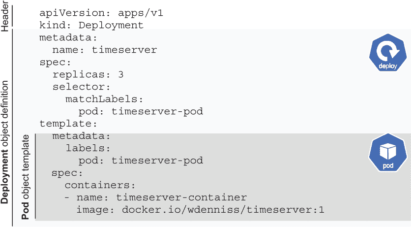

图 3.10 Pod 对象嵌入在 Deployment 对象中

Kubernetes API 文档中将 Pod 对象模板称为 PodSpec。实际上，您可以将其提取出来单独运行。为此，您需要提供一个标题，指定此对象是 Pod 类型而不是 Deployment 类型；然后，您可以将 `template` 下的整个 YAML 复制到配置的根目录中，如下面的列表所示。

列表 3.2 第三章/3.2.4_ThePodSpec/pod.yaml

```
apiVersion: v1
kind: Pod
metadata:
  name: timeserver
  labels:
    pod: timeserver-pod
spec:
  containers:
  - name: timeserver-container
    image: docker.io/wdenniss/timeserver:1
```

您可以直接创建这个 Pod。这样的 Pod 不会被任何 Kubernetes 控制器管理。如果它们崩溃，将会重启，但如果由于升级事件或节点故障等原因被驱逐，它们将不会被重新调度。这就是为什么通常您不会直接调度 Pod，而是使用更高阶的对象，如 Deployment，或者，正如我们将在后面的章节中看到的，StatefulSet、Job 以及其他。

注意：Kubernetes 中这种对象组合的关键要点之一是，每次您在 Deployment 等对象中看到 PodSpec 时，都知道它携带了 Pod 的所有功能。这意味着您可以查看 Pod 的文档，并使用管理对象 Pod 模板中的任何值。

PodSpec 包含了关于您应用程序的关键信息，包括构成它的容器或容器。这些容器中的每一个都有自己的名称（因此您可以在多容器 Pod 中引用单个容器），以及最重要的字段：容器镜像路径。还有许多可选字段，包括一些重要的字段来指定健康检查和资源需求，这些内容将在接下来的章节中介绍。

在 Deployment 及其嵌入的 PodSpec 中也有一些看似重复的标签。Deployment 的规范有一个 `selector` `→` `matchLabels` 部分，PodSpec 有一个 `metadata` `→` `labels` 部分，两者都包含相同的键值对 `pod:` `timeserver-pod`。那么这里发生了什么？

嗯，由于 Pod 对象在创建后实际上存在某种程度的独立性（它被创建为一个由 Deployment 控制器管理的独立对象），我们需要一种方式来引用它。Kubernetes 通过要求 Pod 有一个标签（这是一个任意的键值对），并且从 Deployment 中引用（选择）相同的标签来解决此问题。这实际上是绑定两个对象的粘合剂。如图 3.11 所示，在图表中更容易可视化。

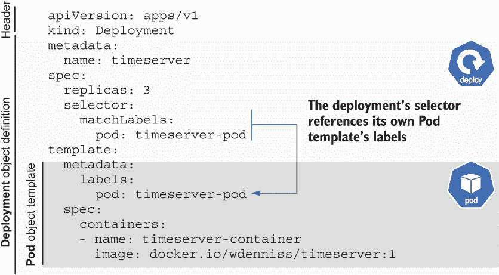

图 3.11 部署的选择器和 Pod 模板标签之间的关系

这个过程可能看起来是不必要的：既然 PodSpec 已经嵌入到 Deployment 中，Kubernetes 不能为我们做这个对象链接吗？你需要手动指定这些标签的原因是，它们在直接在其他对象中引用 Pods 时扮演着重要的角色。例如，在下一节中，当我们配置网络服务时，它直接引用了 Deployment 的 Pods，而不是 Deployment 本身。书中稍后讨论的其他概念也是如此，例如 Pod 故障预算（PDB）。通过指定你的 Pod 标签，你将知道在这些其他对象中应该引用哪个标签。Pod 是 Kubernetes 中的基本执行和调度单元，而 Deployment 只是创建、管理和与 Pods 交互的多种方式之一。

对于键值标签本身，它是完全任意的。你可以使用 `foo:` `bar` 对 Kubernetes 来说都一样。我使用了 `pod:` `timeserver-pod`，因为我发现当在其它对象中选择 Pods 时，这样读起来很好。很多文档都使用类似 `app:` `timeserver` 的格式。我避免重复使用 Deployment (`timeserver`) 的名称作为标签的值，以避免产生误解，即 Deployment 的名称与 Pod 标签有任何关联（因为实际上没有）。

因此，这就是使用嵌入 PodSpec 的方式构建 Deployment 对象。我希望这有助于理解对象组合以及 Pod 的引用方式。在下一节中，我们将向世界展示这个 Deployment，它将通过标签引用 Pod。

### 3.2.5 发布你的服务

当你的容器成功部署后，毫无疑问你将想要与之交互！每个 Pod 都会被分配一个自己的集群本地（内部）IP 地址，这可以用于集群内 Pods 之间的通信。你也可以直接在互联网上以及节点的 IP 地址上（使用 `hostPort` 字段）公开 Pods，但除非你正在编写实时游戏服务器，否则这很少是你要做的事情。通常情况下，尤其是在使用 Deployment 时，你将把你的 Pods 聚合成一个服务，该服务提供一个单一的访问点，具有内部（和可选的）IP，并在你的 Pods 之间进行负载均衡。即使你只有一个 Pod 的 Deployment，你仍然需要创建一个服务来提供一个稳定的地址。

除了负载均衡之外，服务还跟踪哪些 Pods 正在运行并且能够接收流量。例如，虽然你可能已经在你的 Deployment 中指定了三个副本，但这并不意味着三个副本将始终可用。如果节点正在升级，可能只有两个副本，或者在你部署 Deployment 的新版本时，可能会有超过三个副本。服务只会将流量路由到正在运行的 Pods（在下一章中，我们将介绍一些关键信息，你需要提供这些信息以确保其顺利工作）。

服务在集群内部使用，用于实现多个应用程序（所谓的微服务架构）之间的通信，并为此提供方便的功能，如服务发现。这个主题在第七章中详细讨论。现在，让我们专注于使用服务，并通过指定一个`LoadBalancer`类型的服务将你的新应用程序暴露给互联网，以便最终用户可以使用它。与 Deployment 一样，我们将从 YAML 配置开始。

列表 3.3 第三章/3.2_Kubernetes 部署/service.yaml

```
apiVersion: v1
kind: Service
metadata:
  name: timeserver
spec:
  selector:               ❶
    pod: timeserver-pod   ❶
  ports:
  - port: 80              ❷
    targetPort: 80        ❸
    protocol: TCP         ❹
  type: LoadBalancer      ❺
```

❶ 流量将被路由到具有此标签的 Pod

❷ 服务将公开的端口

❸ 容器的目标端口，流量将被转发到该端口

❹ 网络协议

❺ 服务类型；在这种情况下，是外部负载均衡器

端口列表允许你配置为服务用户公开哪个端口（`port`）以及将流量发送到的 Pod 的哪个端口（`targetPort`）。这允许你，比如说，在端口 80（默认的 HTTP 端口）上公开一个服务，并将其连接到运行在端口 8080 的应用程序。

Kubernetes 中的每个 Pod 和服务都有自己的内部集群 IP，因此你不需要担心 Pod 之间的端口冲突。因此，你可以将你的应用程序运行在任何你喜欢的端口上（例如 HTTP 服务的端口 80），并且为了简单起见，可以将`port`和`targetPort`设置为相同的数字，就像上一个示例中那样。如果你这样做，你可以完全省略`targetPort`，因为默认情况下会使用`port`值。

所有服务（除了在第九章中提到的无头服务）都会分配一个内部、集群本地的 IP 地址，集群中的 Pod 可以使用这个 IP 地址。如果你像上一个示例中那样指定`type:` `LoadBalancer`，那么还会额外分配一个外部 IP 地址。

注意，这个服务有一个名为`selector`的部分，就像我们的 Deployment 一样。服务并不引用 Deployment，实际上对 Deployment 一无所知。相反，它引用了具有给定标签的 Pod 集合（在这种情况下，将是我们的 Deployment 创建的 Pod）。再次强调，如图 3.12 所示，这更容易可视化。

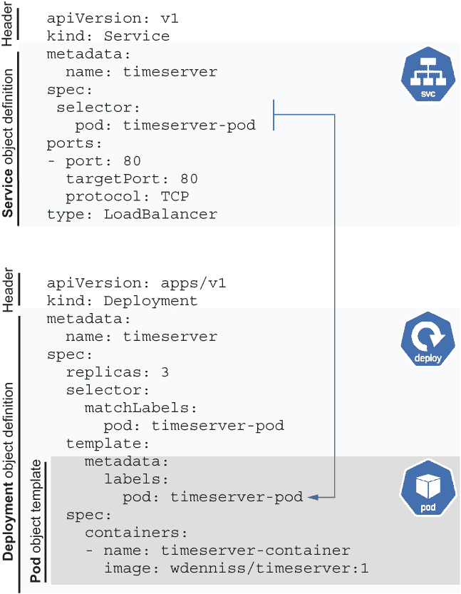

图 3.12 服务与其目标 Pod（选择器）之间的关系

与 Deployment 对象不同，`selector`部分没有`matchLabels`子部分。然而，它们是等效的。Deployment 只是在 Kubernetes 中使用了一种更新、更易于表达的语法。Deployment 和 Service 中的选择器达到了相同的结果：指定对象引用的 Pod 集合。

使用以下命令在你的集群上创建服务对象

```
cd Chapter03/3.2_DeployingToKubernetes
kubectl create -f service.yaml
```

注意，创建命令（`kubectl create`）对于 Deployment 和服务是相同的。所有 Kubernetes 对象都可以使用四个`kubectl`命令进行创建、读取、更新和删除（所谓的 CRUD 操作）：`kubectl create`、`kubectl get`、`kubectl apply`和`kubectl delete`。

要查看服务状态，你可以调用`kubectl get`命令来获取对象类型，如下所示：

```
$ kubectl get service
NAME         TYPE           CLUSTER-IP     EXTERNAL-IP    PORT(S)        AGE
kubernetes   ClusterIP      10.22.128.1    <none>         443/TCP        1h
timeserver   LoadBalancer   10.22.129.13   203.0.113.16   80:30701/TCP   26m
```

注意你的服务在那里列出（在这个例子中是`timeserver`），以及另一个名为`kubernetes`的服务。如果显示`kubernetes`服务，你可以忽略它，因为那是运行在你集群中的 Kubernetes API 服务本身。你也可以使用`kubectl get service $SERVICE_NAME`来指定你感兴趣的服务。

如果输出中的`External IP`显示为`Pending`，这仅仅意味着外部 IP 正在等待负载均衡器上线。这种情况通常需要一两分钟，所以除非已经这样了一段时间，否则无需急于调试为什么它处于挂起状态。与其反复重复之前的`get`命令，不如通过添加`--watch/-w`标志（即`kubectl get service -w`）来流式传输任何状态变化。运行该命令，几分钟后，你应该会看到输出指示你的服务现在有一个外部 IP。

注意：要分配外部 IP，你必须在一个云提供商上运行 Kubernetes，因为提供商在幕后提供可外部路由的网络负载均衡器。如果你在本地开发，请参阅第 3.4.3 节了解如何使用`kubectl port-forward`等工具连接。

一旦 IP 上线，尝试通过访问 URL 来访问服务。根据前面的示例输出，这意味着访问`http://203.0.113.16`（但用`kubectl get service`获取的你的自己的外部 IP 替换它）。`curl`工具非常适合从命令行测试 HTTP 请求（`curl http://203.0.113.16`）；在浏览器中查看效果一样好：

```
$ curl http://203.0.113.16
The time is 7:01 PM, UTC.
```

故障排除：无法连接

导致“无法连接”错误的两个常见原因是（1）选择器不正确和（2）你的端口设置错误。请三倍检查选择器是否与你的部署 Pod 模板中的标签匹配。验证目标端口确实是你容器监听的端口（容器启动时的调试信息中打印的端口可以是一个帮助验证的好方法），并且你正在从浏览器连接到正确的端口。

检查你是否可以直接通过`kubectl`的端口转发功能连接到你的 Pod 的`targetPort`。如果你无法直接连接到 Pod，那么问题可能就出在 Pod 本身。如果连接成功，问题可能是服务定义不正确。你可以通过以下命令设置端口转发到部署中的某个 Pod：

```
kubectl port-forward deploy/$DEPLOYMENT_NAME $FROM_PORT:$TO_PORT
```

其中，`$FROM_PORT`是你将使用的本地端口，`$TO_PORT`是你服务中定义的`targetPort`。使用我们之前的例子，这将是这样：

```
kubectl port-forward deploy/timeserver 8080:80
```

然后，浏览到 http://localhost:8080。这将自动选择部署中的一个 Pod（绕过服务）。你也可以直接指定要连接的特定 Pod：

```
kubectl port-forward pod/$POD_NAME $FROM_PORT:$TO_PORT
```

故障排除：外部 IP 挂起

获取外部 IP 可能需要一点时间，所以请给它几分钟。验证您的云提供商是否会为类型为 `LoadBalanacer` 的服务提供外部 IP。请查阅提供商的文档以获取有关在 Kubernetes 中设置负载均衡器的任何附加信息。

如果您在本地运行或只想尝试服务而不等待外部 IP，您可以将您的机器上的端口转发到服务，如下所示：

```
kubectl port-forward service/$SERVICE_NAME $FROM_PORT:$TO_PORT
```

### 3.2.6 与部署交互

在开发过程中，能够与容器交互以运行命令或复制文件来来回去是非常方便的。幸运的是，Kubernetes 使这几乎与 Docker 一样简单。

运行一次性命令

正如我们可以在 Docker 镜像上使用 `docker` `exec` 命令（在第二章中介绍）运行一次性命令一样，我们也可以使用 `kubectl` `exec` 在我们的 Pod 上运行一次性命令。用于诊断容器问题的常见命令是 `sh`，它将在容器上提供一个交互式 shell（假设容器中提供了 `sh`）。从那里，您可以执行您需要在容器内进行的任何其他调试步骤。

技术上，`exec` 是针对 Pod 运行的，但我们可以指定 Deployment 而不是特定的 Pod，`kubectl` 将随机选择一个 Pod 来运行该命令：

```
$ kubectl exec -it deploy/timeserver -- sh
# echo "Testing exec"
Testing exec
```

您可以使用这种方式在容器上运行任何命令，例如：

```
$ kubectl exec -it deploy/timeserver -- echo "Testing exec"
Testing exec
```

将文件复制到/从容器

同样，类似于 Docker，`kubectl` 有一个 `cp` 命令允许您在您的系统和容器之间复制文件。此命令要求您的容器镜像中存在 `tar` 二进制文件。这可以在您想要下载应用程序日志或其他诊断信息时很有用。默认路径是容器的当前工作目录，所以如果您在容器中有一个名为“example.txt”的文件，您可以将它复制到您的机器上，如下所示：

```
kubectl cp $POD_NAME:example.txt example.txt
```

您还可以在相反方向复制文件：

```
kubectl cp example.txt $POD_NAME:.
```

### 3.2.7 更新您的应用程序

现在您的应用程序已经部署并发布到全世界，毫无疑问您会想要能够更新它。对示例应用程序进行代码更改，然后使用新的版本标签构建并推送容器镜像到容器仓库。例如，如果您之前使用的是 `us-docker.pkg.dev/wdenniss/ts/timeserver:1`，您的新镜像可以是 `us-docker.pkg.dev/wdenniss/ts/timeserver:2`。您可以随意命名这个标签，但使用版本号是一个好习惯。

一旦容器镜像已推送到仓库（如我们在 3.2.2 节中所做的那样），使用列表 3.1 中的新镜像名称更新 `deploy.yaml` 文件——例如（强调部分）：

列表 3.4 第三章/3.2.7_ 更新/deploy.yaml

```
apiVersion: apps/v1
kind: Deployment
metadata:
  name: timeserver
spec:
  replicas: 3
  selector:
    matchLabels:
      pod: timeserver-pod
  template:
    metadata:
      labels:
        pod: timeserver-pod
    spec:
      containers:
      - name: timeserver-container
 image: docker.io/wdenniss/timeserver:2 ❶
```

❶ 新镜像版本

保存文件并使用以下命令将更改应用到您的集群中

```
$ kubectl apply -f deploy.yaml 
deployment.apps/timeserver configured
```

当你应用这个更改时，会发生一些有趣的事情。还记得 Kubernetes 如何不断寻求执行你的要求，将系统观察到的状态驱动到你所需要的状态吗？好吧，既然你刚刚声明部署现在正在使用版本标签为 `2` 的镜像，并且所有 Pod 当前都标记为 `1`，Kubernetes 将寻求更新实时状态，以便所有 Pod 都是当前版本。

我们可以通过运行 `kubectl get deploy` 来看到这个功能的具体实现。以下是一些示例输出：

```
$ kubectl get deploy
NAME         READY   UP-TO-DATE   AVAILABLE   AGE
timeserver   3/3     1            3           10m
```

`READY` 列显示有多少 Pod 在处理流量以及我们请求了多少个。在这种情况下，所有三个都准备好了。然而，`UP-TO-DATE` 列却表明，这些 Pod 中只有一个处于当前版本。这是因为，为了避免一次性替换所有 Pod 导致应用程序出现停机时间，默认情况下，Pod 会通过所谓的滚动更新策略进行更新——即一次更新一个或几个。

滚动更新和其他部署策略将在下一章中详细说明，以及需要配置的重要健康检查，以避免在部署过程中出现故障。目前，只需知道 Kubernetes 将执行你的更改，并将旧的 v1 Pods 替换为新的 v2 Pods。

一旦 `UP-TO-DATE` 的数量等于 `READY` 的数量，部署就完成了。你还可以通过 `kubectl get pods` 来观察正在创建和替换的各个 Pod，这将显示部署中所有 Pod 的列表，包括新的和旧的。

监视部署

由于 `kubectl get` 命令的输出显示的是瞬时的信息，但部署是持续变化的，大多数操作员都会以自动化的方式监视部署，避免需要不断重新运行相同的命令。Kubernetes 包含一个这样的选项，即 `--watch/-w` 标志，它可以添加到大多数 `kubectl` 命令中，例如 `kubectl get pods -w` 和 `kubectl get deploy -w`。当指定了 `watch` 时，任何状态的变化都会流式传输到控制台输出。

`watch` 标志的缺点是它有点混乱输出。如果你有很多 Pod 发生变化，你会看到一行行打印出来，很容易失去对系统当前状态的视线。我的偏好是使用 Linux 的 `watch` 命令。与 `watch` 标志不同，`watch` 命令会刷新整个输出，可选地显示当前更新和上次更新之间的更改。这个命令在大多数 Linux 发行版、macOS 和 Windows Subsystem for Linux (WSL) 中都可用，可以在你获取软件包的地方找到。

当安装了 `watch` 之后，你只需将其添加到任何 `kubectl` 命令之前，例如

```
watch kubectl get deploy
```

我最喜欢的 `watch` 标志是 `-d`，它将突出显示任何更改：

```
watch -d kubectl get deploy
```

在打开一个用于监视每个命令的终端窗口（或 tmux 会话窗口）的情况下，你可以仅使用 `watch` 和 `kubectl` 组装一个实时状态仪表板。

监视部署

之前讨论的`kubectl get deploy`和`kubectl get pods`命令分别返回当前命名空间中的所有 Deployment 和 Pod。随着你创建更多的 Deployment，你可能只想指定你感兴趣的资源：

```
kubectl get deploy $DEPLOYMENT_NAME
```

对象的名称可以在文件顶部的元数据部分的`name`字段中找到。从单个 Deployment 中查看所有 Pod 可能有点棘手；然而，你可以使用标签选择器来获取一组 Pod 的状态

```
kubectl get pods --selector=pod=timeserver-pod
```

其中`pod=timeserver-pod`是在 Deployment 中指定的标签选择器。

### 3.2.8 清理

清理我们创建的对象有几种方法。你可以按对象类型和名称进行删除：

```
 kubectl delete deploy timeserver 
deployment.apps "timeserver" deleted
$ kubectl delete service timeserver 
service "timeserver" deleted
$ kubectl delete pod timeserver 
pod "timeserver" deleted
```

注意：你不需要删除由其他对象（如 Deployment）管理的 Pod，只需删除你手动创建的 Pod。删除 Deployment 将自动删除它所管理的所有 Pod。

或者，你可以通过引用单个配置文件或配置文件目录来删除对象：

```
$ cd Chapter03
$ kubectl delete -f 3.2_DeployingToKubernetes 
deployment.apps "timeserver" deleted
service "timeserver" deleted
$ kubectl delete -f 3.2.4_ThePodSpec/pod.yaml
pod "timeserver" deleted
```

如果你删除后改变了主意，你可以简单地再次创建它们（例如，`kubectl create -f 3.2_DeployingToKubernetes`）。这就是捕获你的配置在文件中的美妙之处：你不需要记住你对实时状态所做的任何调整，因为一切首先都在配置中更新。

集群本身通常会产生费用，所以一旦你一天的工作完成，你也可以考虑将其删除。这可以通过大多数云提供商的 UI 控制台完成。如果你使用 GKE 并通过命令行，你可以运行`gcloud container clusters delete $CLUSTER_NAME --region $REGION`。即使集群中没有运行任何 Pod 或 Service，节点本身通常也会产生费用（除非你使用像 GKE Autopilot 这样的平台），但删除集群应该也会清理它们。如果你保留集群并且使用按节点计费的平台，除了你的 Kubernetes 对象外，还要注意你的节点资源，这样你只有你需要的东西。

提示：本书的其余部分将假设你知道如何删除你不想保留的资源。当你尝试本书（以及其他地方）的示例时，请记住这些步骤，并确保删除你创建的任何不再需要的对象，以释放资源并减少你的账单！

## 3.3 命令式命令

Kubernetes 提供了两种与系统交互的方法：声明式，其中你在配置文件中指定（声明）你想要的状态，并将这些配置应用到集群中；以及命令式，其中你一次指令 API 一个命令（命令式）来执行你的愿望。配置驱动的声明式模型是大多数从业者（包括我自己）强烈首选的方法，也是你将在工作场所最常遇到的方法。

实际上，可以使用我们的容器创建 Deployment 并仅使用命令式命令将其暴露到互联网上。为了完整性，以下是这样做的方法（假设在 3.2.8 节中清理步骤之后删除了前面的示例）：

1.  创建 Deployment：

    ```
    $ kubectl create deployment timeserver \
        --image=docker.io/wdenniss/timeserver:1
    deployment.apps/timeserver created
    ```

1.  在端口 80 上创建一个类型为 `LoadBalancer` 的服务以暴露此服务：

    ```
    $ kubectl expose deployment timeserver --type=LoadBalancer --port 80
    service/timeserver exposed 
    ```

1.  观察结果：

    ```
    $ kubectl get deploy,svc
    NAME                           READY   UP-TO-DATE   AVAILABLE   AGE
    deployment.apps/timeserver     1/1     1            1           4m49s

    NAME                   TYPE           CLUSTER-IP      EXTERNAL-IP   AGE
    service/kubernetes     ClusterIP      10.22.128.1     <none>        5m2
    service/timeserver     LoadBalancer   10.22.130.202   <pending>     31s
    ```

1.  更新 Deployment 中的容器为新版本：

    ```
    $ kubectl set image deployment timeserver timeserver=wdenniss/timeserver:2
    deployment.apps/timeserver image updated
    ```

与使用有时略显冗长的配置文件控制 Kubernetes 相比，这种选项乍一看可能看起来更简单。然而，有很好的理由选择基于配置的方法。第一个原因是可重复性。假设你需要在其他环境中重现配置，比如生产环境和预发布环境，这是一个相当常见的用例。使用声明式方法，你只需在新环境中应用完全相同的配置（进行任何必要的调整）。如果你选择了命令式路线，你需要记住命令，可能将它们存储在 bash 脚本中。

改变也更为困难。使用配置文件时，如果你需要更改设置，只需更新配置并重新应用即可，之后 Kubernetes 将尽职尽责地执行你的愿望。使用基于命令的方法，每个更改都是一个不同的命令：使用 `kubectl` `set` `image` 更改镜像，使用 `kubectl` `scale` 更改副本数量，等等。你还面临命令可能失败的风险，这可能是因为网络超时，而使用配置，更改将在下一次应用时被捕获。第十一章介绍了将配置文件视为应用程序源代码的方式，这是一种所谓的 GitOps 或配置即代码方法，其中命令式命令根本不是一种选择。

如果你遇到一个以前用命令式命令构建的系统，不要害怕，因为可以使用 `kubectl` `get` `-o` `yaml` `$RESOURCE_TYPE` `$RESOURCE_NAME` 从集群中导出配置。然而，当从运行中的集群导出此类配置时，你需要移除一些额外的字段（在 11.1.2 节中介绍）。幸运的是，切换永远不会太晚，因为无论你使用声明式还是命令式命令，Kubernetes 都会以相同的方式存储对象。

## 3.4 本地 Kubernetes 环境

到目前为止，本章已经使用基于云的 Kubernetes 提供商作为部署环境。当然，你可以在本地运行 Kubernetes。我选择以公共云提供商而不是本地开发集群作为起点，是为了展示如何在 Kubernetes 上进行部署，因为我假设，对于大多数人来说，目标是发布你的服务并使其超出你自己的机器可访问的范围。确实，如果你按照本章的示例顺序进行，那么恭喜你：你现在可以使用 Kubernetes 将你的应用程序部署到全世界！在未来的章节中，你将学习如何使它们投入运营、扩展规模以及更多。

然而，本地 Kubernetes 开发集群确实有其位置。在开发过程中，当你希望在 Kubernetes 集群中快速部署和迭代代码时，它们非常有用，尤其是当你的应用程序由几个不同的服务组成时。它们是尝试和学习 Kubernetes 构造的好地方，无需支付云服务费用，并且是本地测试部署配置的便捷选项。

在非生产级环境中使用 Kubernetes 在机器上本地运行与使用具有动态预配的生产级云服务相比，存在许多差异。在云中，你可以使用地理区域内分布的多个机器进行大规模扩展，而你的本地机器资源是固定的。在云中，你可以为你的服务获取生产级可路由的公共 IP 地址——在你的本地机器上则不然。由于这些差异以及更多，我相信直接在目标产品环境中学习效率更高。因此，本书的重点是生产级集群。话虽如此，只要你能理解这些差异，本地开发集群确实是一个非常有用的工具。

你需要 Kubernetes 集群来进行应用程序开发吗？

由于你在生产部署中使用 Kubernetes，并不意味着在应用程序开发期间也必须使用 Kubernetes。我观察到的一个相当常见的应用程序开发模式是使用 Docker Compose（在第 2.3 节中介绍）进行本地开发和测试，然后将应用程序部署到 Kubernetes 进行生产。

Docker Compose 对于开发只有少量服务依赖的应用程序来说效果相当不错。缺点是你需要为应用程序配置定义两次（一次是使用 Compose 进行开发，一次是在 Kubernetes 中进行生产），但对于只有少量服务依赖的应用程序来说，这种开销微乎其微。优点是 Docker 为开发提供了一些有用的工具，特别是能够将本地文件夹挂载到容器中，这意味着对于像 Python 和 Ruby 这样的解释型语言，你可以在不重新构建容器的情况下更改代码。由于你可以跳过所有与生产相关的配置，如副本数量和资源需求，因此配置起来也很简单。

强调 Compose 能够将你的本地应用文件夹挂载为可读写卷，无需重新构建容器即可编辑代码，从你在容器中运行的命令（如日志文件）中获取输出，并在你的开发文件夹中直接执行数据库升级，其有用性不容小觑。Kubernetes 确实有一些工具可以平衡这个领域，如 Skaffold，它为你提供了一个与 Kubernetes（本地或云）作为目标紧密的开发循环，但 Docker 在开发者中享有良好的声誉是有原因的。

正如我经常说的，使用最适合的工具。决定是使用本地 Kubernetes 集群还是 Docker Compose 设置来开发应用程序，并使用最适合你的方法。即使你选择使用 Compose 进行应用程序开发，你仍然可以利用本地 Kubernetes 集群进行部署测试。

运行本地 Kubernetes 集群有多种选项。其中最受欢迎的是 Docker Desktop 和 Minikube。实际上，如果你已经安装了 Docker Desktop，那么你已经有了一个本地的单节点 Kubernetes 集群！Minikube 是由 Kubernetes 项目创建的，设置起来也很简单，并提供了一些更高级的选项，如多个节点，这在你想测试更高级的 Kubernetes 构造，如 Pod 扩散策略和亲和力（第八章）时很有用。

### 3.4.1 Docker Desktop 的 Kubernetes 集群

Docker Desktop 自带单节点 Kubernetes 开发环境。如果你已经安装了 Docker Desktop，那么你已经有了一个本地的 Kubernetes 环境。按照 [`docs.docker.com/desktop/kubernetes/`](https://docs.docker.com/desktop/kubernetes/) 中的说明，只需两步即可开始使用：

1.  在 Docker Desktop 设置中启用 Kubernetes 并确保其正在运行。

1.  使用 `kubectl` 切换到 Docker Desktop 集群。

注意：Docker 的本地 Kubernetes 选项包含在“Docker Desktop”产品中。如果你是通过 Linux 上的 Docker Engine 安装使用 Docker，则没有这项功能。

一旦 Docker Desktop 启用了 Kubernetes，你可以查看上下文并切换到它：

```
kubectl config get-contexts
kubectl config use-context docker-desktop
```

实际上，你可以使用这些命令切换到之前连接过的任何集群，包括本章之前使用过的云平台。任何时候你想切换集群，只需运行

```
kubectl config get-contexts
kubectl config use-context $CONTEXT
```

我发现当频繁在集群之间切换时，那两个命令输入起来有点繁琐，所以我强烈推荐 `kubectx` 工具 ([`github.com/ahmetb/kubectx`](https://github.com/ahmetb/kubectx))，它可以使切换上下文变得更快。要使用 `kubectx` 切换上下文，请使用

```
kubectx
kubectx $CONTEXT
```

如果你在 Docker Desktop 上遇到任何问题，那么调试菜单中的“重启 Kubernetes 集群”和“清理/清除数据”选项将是你的朋友。

### 3.4.2 Minikube

Minikube 是本地测试的另一个优秀选择，它通过提供一个多节点环境，允许你测试更多的 Kubernetes 功能。它由开源 Kubernetes 社区维护。按照 [`minikube.sigs.k8s.io/docs/start/`](https://minikube.sigs.k8s.io/docs/start/) 中的说明为你的系统安装 Minikube。

安装完成后，要启动一个虚拟的多节点集群（我推荐这样做，因为它更接近生产环境中的 Kubernetes 环境），请运行 `minikube start` 并传递你想要的节点数量：

```
minikube start --nodes 3
```

`start` 命令将自动配置 `kubectl` 以使用 Minikube 上下文，这意味着任何 `kubectl` 命令都将作用于 Minikube 集群。要更改上下文回到不同的集群，例如你的生产集群，请使用前一小节中描述的 `kubectl config` 或 `kubectx` 命令。

一旦 Minikube 运行起来，你就可以像使用常规 Kubernetes 集群一样使用它，按照本章中的说明进行操作。在开始使用之前，为了验证一切按预期运行，请运行 `kubectl get nodes` 来检查你是否可以连接到集群：

```
$ kubectl get nodes
NAME           STATUS   ROLES           AGE     VERSION
minikube       Ready    control-plane   4m54s   v1.24.3
minikube-m02   Ready    <none>          4m32s   v1.24.3
minikube-m03   Ready    <none>          3m58s   v1.24.3
```

如果你已经完成使用 Minikube 并想恢复你机器的 CPU 和内存资源，请运行 `minikube stop`。要删除所有数据并为下一次使用不同设置（如不同的节点数量）的新 Minikube 集群腾出空间，请使用 `minikube delete`。

### 3.4.3 使用你的本地 Kubernetes 集群

当 `kubectl` 设置为指向你偏好的本地 Kubernetes 集群时，你可以使用本章前面展示的相同 `kubectl` 命令在本地部署你的应用程序。然而，有两个重要的区别，那就是你如何暴露和访问服务以及如何引用本地构建的容器镜像。要部署本章中的示例应用程序，从示例根目录运行

```
$ cd Chapter03/3.2_DeployingToKubernetes
$ kubectl create -f .
deployment.apps/timeserver created
service/timeserver created
```

声明式配置的好处

在整本书中，示例都是使用声明式配置而不是 imperative 命令给出的。换句话说，要创建一个 Deployment，我们首先创建 Deployment 的配置，然后应用它，而不是直接使用 `kubectl` 创建 Deployment。

这种方法的好处之一是，你可以在本地测试你的配置，然后有信心将其部署到生产环境中，而不需要记住一大堆一次性命令。注意我们如何将相同的配置文件部署到本地集群和到生产集群。真 neat！

访问服务

与在云 Kubernetes 提供商上开发不同，当在本地创建 `LoadBalancer` 类型的服务时，你不会得到一个外部 IP。对于 Docker Desktop、Minikube 以及实际上任何 Kubernetes 集群，你也可以使用 `kubectl` 将你的本地机器的端口转发到集群内部的服务。这对于针对本地 Kubernetes 集群进行测试和调试云集群非常有用。要本地暴露服务，请使用

```
kubectl port-forward service/$SERVICE_NAME $FROM_PORT:$TO_PORT
```

其中 `FROM_PORT` 是你将在本地访问服务的端口，而 `TO_PORT` 是服务的 IP 地址。在我们的演示中，选择 `8080` 作为高级端口，命令可能看起来如下所示：

```
kubectl port-forward service/timeserver 8080:80
```

然后，你可以浏览到 http://localhost:8080 来连接到服务。`port-forward` 有很多有用的标志¹，包括 `--address 0.0.0.0`，以便绑定到所有网络接口，这样你就可以从网络上的其他设备访问转发的服务（如果你的防火墙允许这样做）。端口转发对于调试在云 Kubernetes 平台上运行的服务也非常有用。

Minikube 提供了一种额外的路由流量到你的服务的方法²。你可以通过以下方式访问：

```
minikube service $SERVICE_NAME
```

对于前面章节中的示例，那将是

```
minikube service timeserver
```

从 Docker 本地访问 Kubernetes 服务

你是否在 Kubernetes 中运行一个服务，出于某种原因你想直接从运行在 Kubernetes 外部的 Docker 容器访问它？例如，你正在 Docker 中进行一些快速迭代，并想访问 Kubernetes 中已建立的服务。

解决方案很简单。将服务转发，使得端口在你的本地机器上是开放的，就像之前描述的那样。然后你可以在 Docker 中直接运行的容器中引用它，使用 `host.docker.internal` 在你转发的任何端口上。`host.docker.internal` 是容器如何与本地机器上的服务通信的方式，由于你已将端口转发到本地机器，连接可以通过。

例如，假设你在 Kubernetes 中部署 Redis（见第九章），并使用 `kubectl port-forward service/timeserver 6379:6379` 转发端口。然后你想要从运行 Python 的本地 Docker 容器连接到它。你可以使用 `redis.Redis(host='host.docker.internal', port='6379')` 来实现。祝您编码愉快！

部署本地镜像

默认情况下，本地 Kubernetes 集群将尝试从互联网拉取容器镜像——表现得就像一个生产 Kubernetes 集群一样。对于公共镜像，如 `ubuntu` 或我的示例镜像 `docker.io/wdenniss/timeserver`，一切都会正常工作。但是，为了向本地集群提供你自己构建的本地镜像，你需要采取额外步骤。当然，你可以像在生产环境中一样将它们上传到公共容器注册库，这样你的本地集群就会像在生产环境中一样拉取它们。

然而，在开发过程中上传你构建的每个镜像，却有点麻烦。这会减慢你的开发速度，因为你需要等待推送和拉取。此外，除非你使用公共镜像，否则你需要提供凭证，以便你的本地集群可以访问它们（通常当你从 Kubernetes 提供商的容器注册库拉取私有镜像时，这一步骤会为你完成）。

要使您的本地集群使用本地镜像，您需要修改您的 Kubernetes 部署配置文件的两个地方。首先，添加 `imagePullPolicy` 参数并将其设置为 `Never`，其次，使用不带任何仓库前缀的本地镜像名称引用您的镜像。

本地构建的镜像的路径只是它们的仓库和版本标签，没有仓库 URL 前缀。如果您已经使用 `docker` `build` `.` `-t` `timeserver` 构建了一个镜像，就像我们在第二章中所做的那样，您可以在配置文件中将此引用为 `image:` `timeserver:latest`（使用 `latest` 作为版本标签将给我们最新的构建镜像）。运行 `docker` `images` 查看可用本地镜像列表。以下是一个引用此本地构建镜像的 Deployment 示例：

列表 3.5 第三章/3.4.3_ 本地开发/deploy.yaml

```
apiVersion: apps/v1
kind: Deployment
metadata:
  name: timeserver
spec:
  replicas: 3
  selector:
    matchLabels:
      pod: timeserver-pod
  template:
    metadata:
      labels:
        pod: timeserver-pod
    spec:
      containers:
      - name: timeserver-container
 image: timeserver:latest ❶
 imagePullPolicy: Never  ❷
```

❶ 对本地可用镜像的引用

❷ 镜像拉取策略阻止 Kubernetes 尝试从远程位置获取此本地镜像。

提示：仅将 `imagePullPolicy:` `Never` 配置应用于您计划本地提供的镜像。您不希望将此设置在远程镜像上，因为它们不会被拉取，并且会因 `ErrImageNeverPull` 状态而出现错误。如果您看到这个错误，这意味着镜像尚未本地可用，但部署已被配置为使用本地镜像。

如果您使用的是 Minikube，还有一步。虽然 Docker Desktop 可以访问您使用 Docker 本地构建的所有镜像，但 Minikube 不能（它有自己的独立容器运行时，并且不会与您本地的 Docker 安装共享镜像）。要将您想要推送到 Minikube 的本地镜像推送到 Minikube，只需运行以下命令

```
minikube image load $REPOSITORY:$TAG
```

例如

```
minikube image load timeserver:latest
```

然后，像之前一样使用 `kubectl` 应用您的更改：

```
kubectl apply -f deploy.yaml
```

## 摘要

+   Kubernetes 集群由控制平面和运行您的容器的节点组成。

+   您通过 Kubernetes API 与集群交互，通常使用命令行工具 `kubectl`。

+   要将您自己的应用程序部署到 Kubernetes，首先，将容器镜像上传到容器仓库。

+   使用如 Deployment 这样的对象指定工作负载，它封装了一个 Pod，该 Pod 定义了您的容器。

+   服务用于创建网络端点并将容器暴露到互联网。

+   Pod 通过标签被其他对象（如 Deployment 和 Service）引用。

+   Kubernetes 使用声明性配置，通常是 YAML 格式的配置文件。

+   您通过配置指定您的需求，Kubernetes 控制器会持续尝试实现和满足这些需求。

+   更新应用程序就像使用新容器版本修改配置并将更改应用到集群一样简单。

+   Kubernetes 将比较配置版本之间的更改，并实现任何指定的更改。

* * *

^ (1.) [`kubernetes.io/docs/reference/generated/kubectl/kubectl-commands#port-forward`](https://kubernetes.io/docs/reference/generated/kubectl/kubectl-commands#port-forward)

[`kubernetes.io/docs/setup/learning-environment/minikube/#services`](https://kubernetes.io/docs/setup/learning-environment/minikube/#services)
