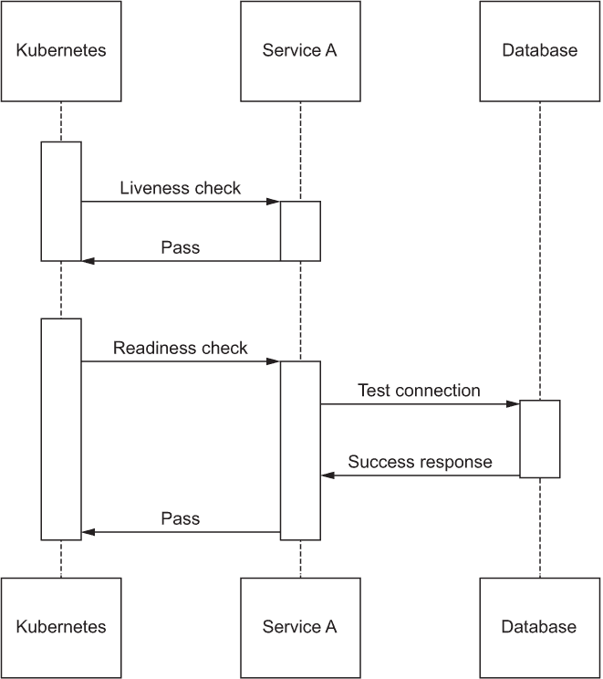
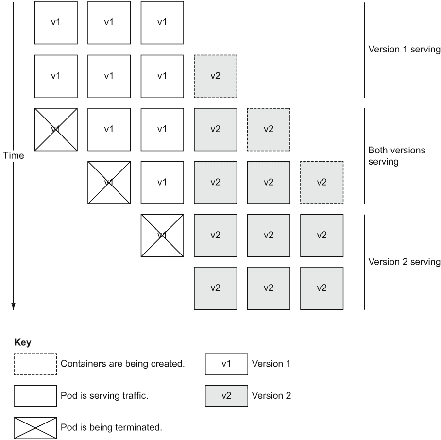
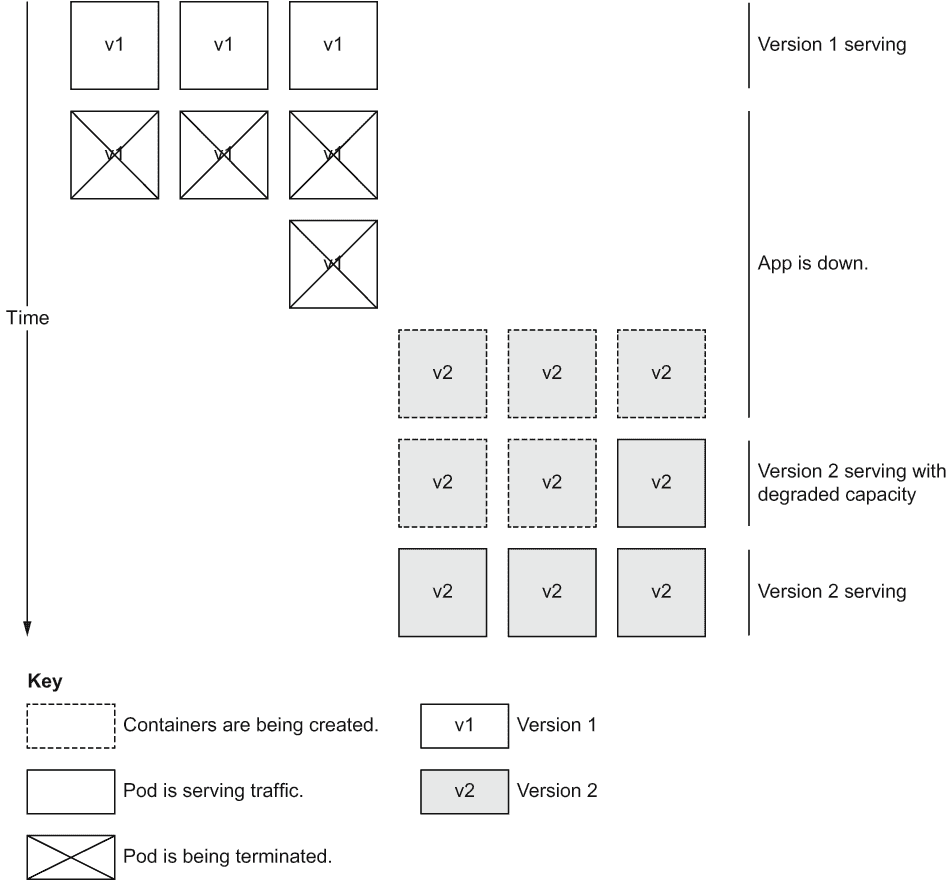
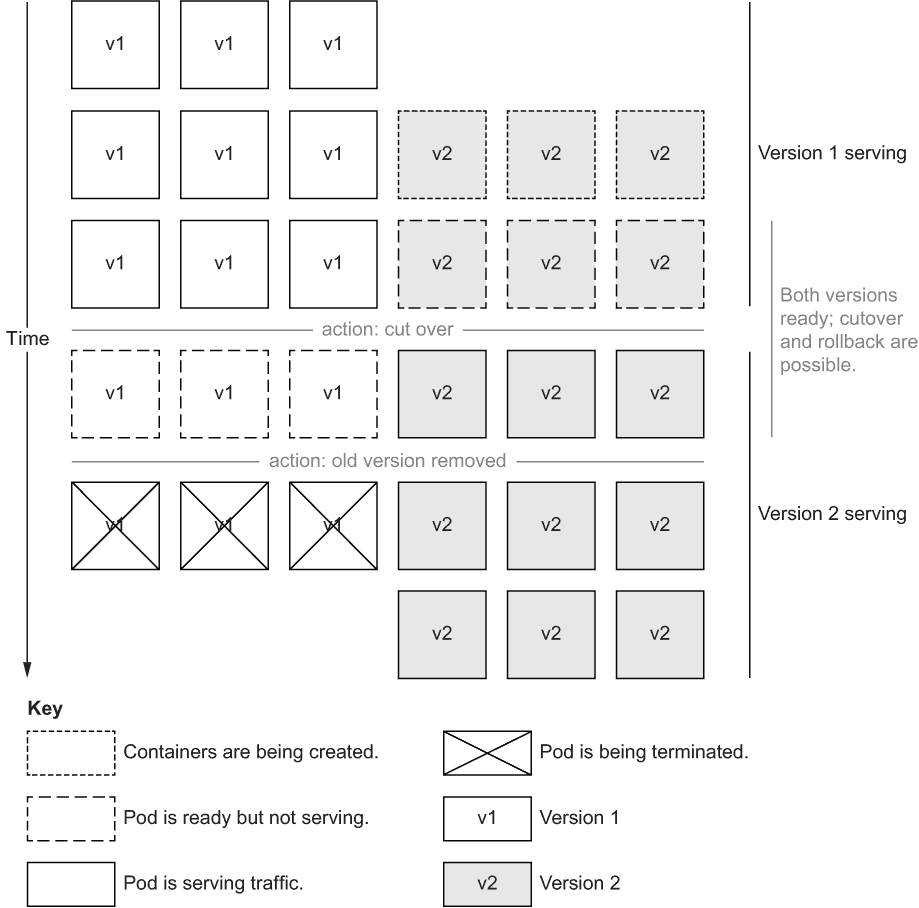
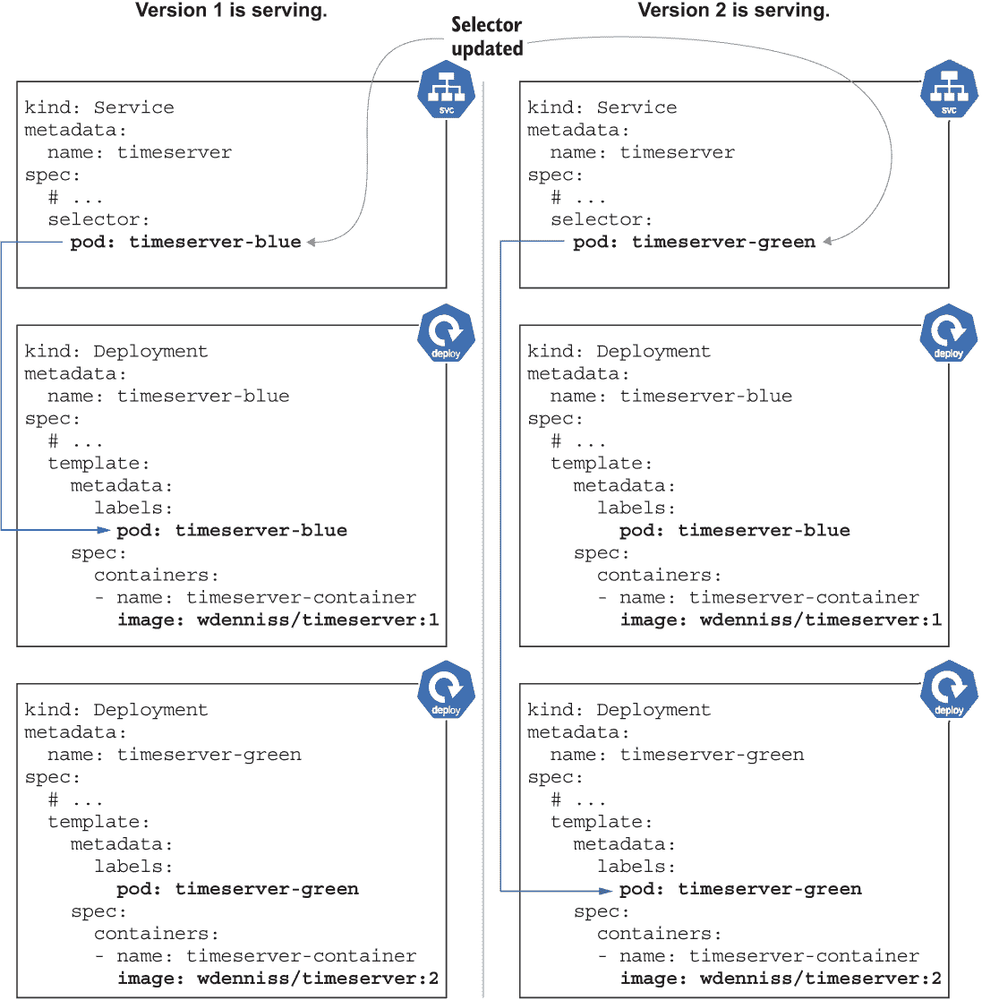

# 4 自动化操作

本章涵盖

+   创建持久、可靠的部署

+   让 Kubernetes 在无需您干预的情况下保持应用运行

+   无停机更新应用

Kubernetes 可以自动化许多操作，如容器崩溃时重启容器，以及在硬件故障的情况下迁移应用。因此，Kubernetes 可以帮助使您的部署更加可靠，而无需您 24/7 进行监控。这些自动化操作是 Kubernetes 的核心价值主张之一，理解它们是充分利用 Kubernetes 提供的一切的必要步骤。

Kubernetes 可以通过启动新版本并监控其状态，确保在删除旧版本之前它已准备好服务流量，从而帮助您在不出现中断和故障的情况下更新应用。

为了帮助 Kubernetes 在正常操作和升级期间保持应用的无停机运行，您需要通过称为健康检查的过程提供有关应用状态的信息。在下一节中，我们将介绍如何将各种健康检查添加到您的应用中，在稍后的章节中，我们将介绍如何使用 Kubernetes 内置的滚动策略来更新应用，而不会出现故障或停机。

## 4.1 带健康检查的自动化正常运行时间

有些条件 Kubernetes 可以自行检测和修复。如果您的应用崩溃，Kubernetes 会自动重启它。同样，如果运行容器的节点失败或被移除，Kubernetes 会注意到您的部署缺少副本，并在集群中可用空间上启动新的副本。

但其他类型的应用故障怎么办，比如挂起的进程、停止接受连接的 Web 服务，或者当外部服务变得不可访问时依赖该服务的应用？Kubernetes 可以优雅地检测并尝试从所有这些条件中恢复，但它需要您提供有关应用健康状况以及它是否准备好接收流量的信号。提供这些信号的过程称为健康检查，Kubernetes 将其称为**活跃性和就绪性探测**。

由于 Kubernetes 无法知道平台上每个运行的服务处于关闭或开启、准备好或未准备好接收流量的具体含义，因此应用必须自行实现此测试。简单来说，探测会查询容器状态，容器会检查其内部状态，如果一切正常则返回成功代码。如果请求超时（例如，如果应用负载过重）或容器本身确定存在问题（例如，关键依赖项问题），则探测被视为失败。

### 4.1.1 活跃性和就绪性探测

在 Kubernetes 中，容器的健康状态由两个独立的探针确定：*生存性*，它确定容器是否正在运行，以及*就绪性*，它指示容器何时能够接收流量。这两个探针使用相同的技巧进行检查，但 Kubernetes 使用探针结果的方式不同（见表 4.1）。

表 4.1 生存性和就绪性的区别

|  | 生存性 | 就绪性 |
| --- | --- | --- |
| 语义含义 | 容器是否正在运行？ | 容器是否准备好接收流量？ |
| 探针失败超过阈值的含义 | Pod 被终止并替换。 | Pod 在探针通过之前被移除以接收流量。 |
| 从失败的探针中恢复的时间 | 慢：Pod 在失败时重新调度并需要时间启动。 | 快：Pod 已经运行，一旦探针通过即可立即接收流量。 |
| 容器启动时的默认状态 | 通过（活动）。 | 失败（未就绪）。 |

存在两种探针类型的原因有几个。一个是启动状态。注意生存性探针从通过或活动状态开始（假设容器在 Pod 证明其不活动之前是活动的），而就绪性探针从未就绪状态开始（假设容器在证明其能够服务流量之前无法服务流量）。

没有就绪性检查，Kubernetes 没有办法知道容器何时准备好接收流量，因此它必须假设容器在启动的那一刻就绪，并且它将立即被添加到服务的负载均衡轮询中。大多数容器需要数十秒甚至数分钟才能启动——因此立即发送流量会导致启动期间一些流量损失。就绪性检查通过仅在内部测试通过时才报告“就绪”来解决此问题。

同样，与生存性检查一样，需要容器重启的条件可能与指示容器未准备好接收流量的条件不同。最好的例子是等待外部依赖项（如数据库连接）的容器。直到容器建立了数据库连接，它才不应该提供服务（因此它是未就绪的），但内部容器是良好的。您不希望太急切地替换此容器，以便它有足够的时间建立其依赖的数据库连接。

存在两种类型探针的其他原因包括敏感性和恢复时间。就绪性检查通常调整得很快，以便快速将 Pod 从负载均衡器中移除（因为这是一种快速且成本低的操作来启动），并在检查再次通过时将其添加回去，而生存性检查通常调整得稍微不那么急迫，因为重新创建容器所需的时间更长。

### 4.1.2 添加就绪性探针

对于一个网络服务，一个基本的健康检查可以简单地测试“服务是否在处理流量？”在为你的服务构建一个专门的健康检查端点之前，你可以在服务上找到任何返回 HTTP 200 状态码的端点，并将其用作健康检查。

如果根路径在所有响应中都返回 HTTP 200，你就可以直接使用该路径。由于在我们的示例容器中根路径表现是这样的，所以下面的就绪检查将正常工作。

列表 4.1 第四章/4.1.2_Readiness/deploy.yaml

```
apiVersion: apps/v1
kind: Deployment
metadata:
  name: timeserver
spec:
  replicas: 3
  selector:
    matchLabels:
      pod: timeserver-pod
  template:
    metadata:
      labels:
        pod: timeserver-pod
    spec:
      containers:
      - name: timeserver-container
        image: docker.io/wdenniss/timeserver:1
 readinessProbe:
 initialDelaySeconds: 15 ❶
 periodSeconds: 30     ❷
 httpGet:      ❸
 path: /      ❸
 port: 80      ❸
 scheme: HTTP      ❸
 timeoutSeconds: 2     ❹
 failureThreshold: 1  ❺
 successThreshold: 1   ❻
```

❶ 初始延迟后

❷ 每 30 秒

❸ 执行此 HTTP 请求。

❹ 2 秒后超时。

❺ 将一个错误响应视为容器未就绪。

❻ 将一个成功的响应视为容器在被视为未就绪后已准备好。

从根目录更新`timeserver` Deployment：

```
cd Chapter04/4.1.2_Readiness
kubectl apply -f deploy.yaml
```

现在，任何容器未能响应就绪检查时，该 Pod 将被临时从服务中移除。假设你有三个 Pod 副本，其中一个未能响应。任何访问服务的流量都将被路由到剩余的两个健康 Pod。一旦 Pod 返回成功（在这种情况下是一个 HTTP 200 响应），它将被重新加入到服务中。

这种就绪检查在更新期间尤为重要，因为你不希望 Pod 在启动时接收流量（因为这些请求将失败）。通过正确实现的就绪检查，你可以实现零停机更新，因为流量只被路由到已就绪的 Pod，而不是正在创建的 Pod。

观察差异

如果你想通过自己的实验来查看有无就绪检查之间的差异，请尝试以下测试。在一个 shell 窗口中，创建一个没有就绪检查的 Deployment（让我们使用第三章中的那个）：

```
cd Chapter03/3.2_DeployingToKubernetes
kubectl create -f .
```

等待服务被分配一个外部 IP：

```
kubectl get svc -w
```

现在，设置你的 IP，并在单独的控制台窗口中设置对服务端点的监视：

```
EXTERNAL_IP=203.0.113.16
watch -n 0.25 -d curl "http://$EXTERNAL_IP"
```

在第一个窗口中，触发一个回滚：

```
kubectl rollout restart deploy timeserver
```

随着 Pod 的重启，你应该在 curl 窗口中看到一些间歇性的连接问题。

现在更新 Deployment 以包含就绪检查（如本节中所示）并应用：

```
cd ../../
cd Chapter04/4.1.2_Readiness
kubectl apply -f deploy.yaml
```

这次，由于部署有一个就绪检查，你不应该在`curl`窗口中看到任何连接问题。

### 4.1.3 添加存活探针

存活探针与就绪探针具有相同的规范，但使用键`livenessProbe`指定。另一方面，探针的使用方式相当不同。就绪探针的结果决定了 Pod 是否接收流量，而失败的存活探针将导致 Pod 重启（一旦达到失败阈值）。

我们在前一节中添加到部署的就绪检查是基本的，因为它只是使用了服务的根路径而不是一个专门的端点。我们现在可以继续这种做法，并在以下示例中使用就绪探测的相同端点作为活跃探测，进行一些小的修改以增加故障容忍度。由于容器在活跃探测失败时达到阈值会重启，并且需要一些时间才能恢复，我们不希望活跃探测被设置为过于敏感。让我们为我们的部署添加一个活跃探测，如果它失败 180 秒（在 30 秒间隔内六次失败），则将其重启。

列表 4.2 第四章/4.1.3_Liveness/deploy.yaml

```
apiVersion: apps/v1
kind: Deployment
metadata:
  name: timeserver
spec:
  replicas: 3
  selector:
    matchLabels:
      pod: timeserver-pod
  template:
    metadata:
      labels:
        pod: timeserver-pod
    spec:
      containers:
      - name: timeserver-container
        image: docker.io/wdenniss/timeserver:1
        readinessProbe:
          initialDelaySeconds: 15
          periodSeconds: 30
          httpGet:
            path: /
            port: 80
            scheme: HTTP
          timeoutSeconds: 2
          failureThreshold: 1
          successThreshold: 1
 livenessProbe:            ❶
 initialDelaySeconds: 30 ❷
 periodSeconds: 30      ❸
 httpGet:        ❹
 path: / ❹
 port: 80 ❹
 scheme: HTTP ❹
 timeoutSeconds: 5      ❺
 failureThreshold: 10  ❻
 successThreshold: 1       ❼
```

❶ 这次指定一个活跃探测

❷ 在初始延迟 30 秒后

❸ 每 30 秒

❹ 执行此 HTTP 请求。

❺ 5 秒后超时（比就绪检查更宽容）。

❻ 连续 10 次错误响应以指示容器未就绪。

❼ 考虑一个成功的响应以指示容器在被视为未就绪后已就绪。

使用这些最新的更改更新`timeserver`部署：

```
cd Chapter04/4.1.3_Liveness
kubectl apply -f deploy.yaml
```

现在，您的部署有了就绪和活跃探测。即使这些基本的探测也能极大地提高部署的可靠性。如果您就此止步，这可能对于一个基本的应用程序来说已经足够了。下一节将详细说明一些进一步的设计考虑，以确保您的探测在生产使用中更加稳固。

### 4.1.4 设计良好的健康检查

在使用现有端点，就像我们在前两个章节中所做的那样，尽管健康检查路径总比没有好，但通常最好为您的应用程序添加专用的健康检查端点。这些健康检查应该实现就绪和活跃的具体语义，并尽可能轻量。如果不理解活跃和就绪之间的语义差异，可能会因为重启过多和级联故障而看到不稳定性。此外，如果您正在重用其他端点，那么它可能比所需的更重。为什么要在整个 HTML 页面渲染的成本上付费，而一个简单的 HTTP 头部响应就足够了呢？

在创建 HTTP 端点以实现这些检查时，考虑任何正在测试的外部依赖项非常重要。通常，您不希望在活跃探测中检查外部依赖项；相反，它应该只测试容器本身是否正在运行（假设您的容器将重试其外部连接的连接）。对于运行良好的容器或仅因为无法连接到另一个有问题的服务而重启的容器，实际上并没有太多价值。这可能导致不必要的重启，从而产生波动并导致级联故障，尤其是如果您有一个复杂的依赖图。然而，对于活跃探测中不测试依赖项的原则有一个例外，我将在后面的章节中介绍。

由于存活探测仅测试服务器是否响应，结果可以且应该是极其简单的，通常只是一个 HTTP 200 状态响应，甚至可以没有响应体文本。如果请求能够到达服务器代码，那么它必须是活跃的，这已经足够了。

对于就绪性探测而言，通常希望它们测试它们的外部依赖，如数据库连接（见图 4.1）。假设你有三个 Pod 副本，但只有两个可以连接到你的数据库。只让那些两个完全功能的 Pod 在负载均衡器轮询中是有意义的。测试连接的一种方法是在就绪性检查中从数据库中查找单行。



图 4.1 存活性和就绪性检查以及外部依赖

例如，数据库连接检查的伪代码可能看起来像这样

```
result = sql.execute("SELECT id FROM users LIMIT 1;")
if result:
  http_response(200, "Ready")
else:
  http_response(503, "Not Ready")
```

执行一个简单的 SQL 查询应该足以确保数据库既已连接又可响应。与其使用`SELECT`查询，你还可以执行任何其他数据库操作，但我个人更喜欢`SELECT`语句的合法性。如果它有效，我就有信心其他查询也会有效。

Python 的`timeserver`示例应用没有数据库依赖。但是，让我们重构代码以包括特定的路径，我们将它们命名为`/healthz`和`/readyz`，因为为这些探测保留专用端点是最佳实践。

列表 4.3 第四章/timeserver2/server.py

```
from http.server import ThreadingHTTPServer, BaseHTTPRequestHandler
from datetime import datetime

class RequestHandler(BaseHTTPRequestHandler):
    def do_GET(self):
        match self.path:
            case '/':
                now = datetime.now()
                response_string = now.strftime("The time is %-I:%M %p, UTC.")
                self.respond_with(200, response_string)
            case '/healthz': ❶
 self.respond_with(200, "Healthy") ❶
 case '/readyz': ❶
 dependencies_connected = True ❶
 # TODO: actually verify any dependencies ❶
 if (dependencies_connected): ❶
 self.respond_with(200, "Ready") ❶
 else: ❶
 self.respond_with(503, "Not Ready") ❶
            case _:
                self.respond_with(404, "Not Found")

    def respond_with(self, status_code: int, content: str) -> None:
        self.send_response(status_code)
        self.send_header('Content-type', 'text/plain')
        self.end_headers()
        self.wfile.write(bytes(content, "utf-8")) 

def startServer():
    try:
        server = ThreadingHTTPServer(('', 80), RequestHandler)
        print("Listening on " + ":".join(map(str, server.server_address)))
        server.serve_forever()
    except KeyboardInterrupt:
        server.shutdown()

if __name__== "__main__":
    startServer()
```

❶ 新的健康检查路径

在更新了这些新端点的部署配置之后，我们得到以下列表中的代码。

列表 4.4 第四章/4.1.4_ 良好的健康检查/deploy.yaml

```
apiVersion: apps/v1
kind: Deployment
metadata:
  name: timeserver
spec:
  replicas: 3
  selector:
    matchLabels:
      pod: timeserver-pod
  template:
    metadata:
      labels:
        pod: timeserver-pod
    spec:
      containers:
      - name: timeserver-container
        image: docker.io/wdenniss/timeserver:2
        readinessProbe:
          initialDelaySeconds: 15
          periodSeconds: 30
          httpGet:
 path: /readyz     ❶
            port: 80
            scheme: HTTP
          timeoutSeconds: 2
          failureThreshold: 1
          successThreshold: 1
        livenessProbe:
          initialDelaySeconds: 30
          periodSeconds: 30
          httpGet:
 path: /healthz ❶
            port: 80
            scheme: HTTP
          timeoutSeconds: 5
          failureThreshold: 3      ❷
          successThreshold: 1
```

❶ 更新后的端点

❷ 现在存活探测变得轻量级，我们可以降低失败阈值。

以通常的方式应用这个新配置。你的应用程序可能具有更复杂的就绪性和存活性逻辑。这里的`healthz`端点可能适用于许多 HTTP 应用程序（简单地测试 HTTP 服务器是否响应请求就足够了）。然而，每个具有数据库等依赖的应用程序都应该定义自己的就绪性测试，以确定你的应用程序是否真正准备好服务用户请求。

### 4.1.5 重新调度未就绪的容器

前一节详细介绍了在 Kubernetes 中设置存活和就绪检查的标准方法，其中你只需验证就绪检查中的服务依赖。不测试存活检查中的依赖可能会出现一个有问题的条件。通过将关注点分离为就绪性（“容器是否准备好接收流量？”）和存活性（“容器是否正在运行？”），可能会出现容器正在运行，但由于容器重试逻辑中的错误，外部连接从未解决的情况。换句话说，你的容器可能会永远处于未就绪状态，这可能需要重启来解决。

记得我们通常不在存活性检查中测试就绪性，因为这可能会导致 Pod 被太快地重新创建，没有为外部依赖项的解决提供任何时间。然而，如果 Pod 长时间不可用，重新创建这个 Pod 可能是有意义的。有时最好的办法就是关掉它再打开它！

不幸的是，Kubernetes 没有直接表达这种逻辑的方法，但很容易将其添加到我们自己的存活性检查中，以便如果 Pod 在一段时间内没有就绪，它就会失败。你可以简单地记录每个就绪性成功响应的时间，然后如果时间过长（例如，5 分钟），就失败存活性检查。以下列表提供了将此逻辑简单实现到`timeserver`容器的示例。

列表 4.5 第四章/timeserver3/server.py

```
from http.server import ThreadingHTTPServer, BaseHTTPRequestHandler
from datetime import datetime, timedelta

last_ready_time = datetime.now()                                             ❶

class RequestHandler(BaseHTTPRequestHandler):

    def do_GET(self):
 global last_ready_time

        match self.path:
            case '/':
                now = datetime.now()
                response_string = now.strftime("The time is %-I:%M %p, UTC.")
                self.respond_with(200, response_string)
            case '/healthz':
 if (datetime.now() > last_ready_time + timedelta(minutes=5)):❷
 self.respond_with(503, "Not Healthy") ❷
 else: ❷
 self.respond_with(200, "Healthy") ❷
            case '/readyz':
                dependencies_connected = True 
                # TODO: actually verify any dependencies
                if (dependencies_connected):
 last_ready_time = datetime.now()                      ❸
                    self.respond_with(200, "Ready")
                else:
                    self.respond_with(503, "Not Ready")
            case _:
                self.respond_with(404, "Not Found")

    def respond_with(self, status_code: int, content: str) -> None:
        self.send_response(status_code)
        self.send_header('Content-type', 'text/plain')
        self.end_headers()
        self.wfile.write(bytes(content, "utf-8")) 

def startServer():
    try:
        server = ThreadingHTTPServer(('', 80), RequestHandler)
        print("Listening on " + ":".join(map(str, server.server_address)))
        server.serve_forever()
    except KeyboardInterrupt:
        server.shutdown()

if __name__== "__main__":
    startServer()
```

❶ “最后就绪”时间初始化为当前时间，以便在启动后允许 5 分钟。

❷ 如果自上次成功的就绪性结果（或自启动以来）已过去 5 分钟，则失败存活性检查。

❸ 每次就绪性通过时，时间都会更新。

如果容器在给定时间内没有就绪，存活性检查最终会失败，这给了它重启的机会。现在，我们拥有了两者之最：我们不在存活性检查中测试外部依赖项，但在就绪性检查中测试。这意味着当依赖项未连接时，我们的容器不会收到流量，但它也不会重启，这给了它一些时间来自我修复。但是，如果在 5 分钟后容器仍然没有就绪，它将失败存活性检查并被重启。

实现这一目标（在长时间不可用后重启容器）的另一种方法是同时使用存活性和就绪性探针的存活性端点，但具有不同的容忍度。也就是说，例如，就绪性检查在 30 秒后失败，但存活性检查仅在 5 分钟后失败。这种方法仍然给容器一些时间来解决任何相互依赖的服务，在最终重启之前，这可能会表明容器本身存在问题。这种技术从技术上讲不是 Kubernetes 的惯用方法，因为你在存活性检查中仍在测试依赖项，但它完成了工作。

总之，这两个探针对于向 Kubernetes 提供它需要的信息以自动化应用程序的可靠性至关重要。理解它们之间的区别并实施适当的检查，考虑到应用程序的具体细节，是至关重要的。

### 4.1.6 探针类型

到目前为止，示例都假设了 HTTP 服务，因此探针被实现为 HTTP 请求。Kubernetes 可以用于托管许多不同类型的服务，以及没有任何服务端点的批处理作业。幸运的是，有几种方法可以公开健康检查。

HTTP

对于提供 HTTP 服务的任何容器，建议使用 HTTP。服务公开一个端点，例如`/healthz`。HTTP 200 响应表示成功；任何其他响应（或超时）表示失败。

TCP

对于除了 HTTP 之外的基于 TCP 的服务（例如，SMTP 服务），建议使用 TCP。如果可以打开连接，则探针成功。

```
readinessProbe:
  initialDelaySeconds: 15
  periodSeconds: 30
 tcpSocket:    ❶
 port: 25 ❶
  successThreshold: 1
  failureThreshold: 1
```

❶ TCP 探针规范

Bash 脚本

对于不提供 HTTP 或 TCP 服务的任何容器，如不运行服务端点的批处理作业，建议使用 bash 脚本。Kubernetes 将执行您指定的脚本，允许您执行所需的任何测试。非零退出代码表示失败。第 10.4 节有一个后台任务存活探针的完整示例。

## 4.2 更新运行中的应用程序

实施就绪性检查后，现在您可以无停机地推出应用程序更改。Kubernetes 在更新期间使用就绪性检查来确定新 Pod 何时准备好接收流量，并根据您设置的参数控制部署的速度。您可以选择几种不同的部署策略，每种策略都有其自身的特点。

### 4.2.1 滚动更新策略

Kubernetes 提供的默认零停机更新策略是滚动更新。在滚动更新中，会以组的形式创建具有新版本的新 Pod（组的大小是可调的）。Kubernetes 等待新组的 Pod 变得可用，然后终止运行旧版本相同数量的 Pod，重复此过程，直到所有 Pod 都运行新版本（图 4.2）。



图 4.2 滚动更新期间的 Pod 状态。使用此策略，在部署完成之前，请求可以由应用程序的旧版或新版提供服务。

此策略的目标有两个：

+   在部署过程中提供连续的运行时间

+   在更新过程中尽可能少地使用额外资源

重要的是，使用此策略时，您的应用程序的两个版本（旧版和新版）需要能够共存，因为它们将同时运行一段时间。也就是说，您的后端或任何其他依赖项必须能够处理这两个不同的版本，并且当用户进行不同请求时，可能会得到交替的版本。想象一下，重新加载页面看到新版本，然后再次重新加载看到旧版本。根据您拥有的副本数量，滚动更新可能需要一段时间才能完成（因此，任何回滚也可能需要一段时间）。

让我们配置我们的 Deployment 以使用以下列表中的滚动更新策略。 

列表 4.6 Chapter04/4.2.1_RollingUpdate/deploy.yaml

```
apiVersion: apps/v1
kind: Deployment
metadata:
  name: timeserver
spec:
  replicas: 3
  selector:
    matchLabels:
      pod: timeserver-pod
  strategy:
 type: RollingUpdate ❶
 rollingUpdate: ❷
 maxSurge: 2 ❷
 maxUnavailable: 1  ❷
  template:
    metadata:
      labels:
        pod: timeserver-pod
    spec:
      containers:
      - name: timeserver-container
        image: docker.io/wdenniss/timeserver:3
```

❶ 滚动更新策略

❷ 可选配置

可以使用`maxSurge`和`maxUnavailable`选项来控制部署的速度。

MaxSurge

`maxSurge` 控制在滚动更新过程中你愿意创建多少额外的 Pods。例如，如果你设置了副本数量为 `5`，并且 `maxSurge` 为 `2`，那么可能会有七个 Pods（不同版本）被调度。

权衡是，这个数字越高，滚动更新完成得越快，但（暂时）使用的资源也越多。如果你高度优化成本，可以将 `maxSurge` 设置为 `0`。或者，对于大型部署，你可以在滚动更新期间暂时增加集群中可用的资源，通过添加节点，并在滚动更新完成后移除它们。

最大不可用数

`maxUnavailable` 设置了在更新过程中可以不可用的最大 Pod 数量（也接受百分比值，并向下取整到最接近的整数）。如果你已经调整了副本数量以处理预期的流量，你可能不希望将此值设置得比 `0` 高得多，因为在更新期间你的服务质量可能会下降。这里的权衡是，值越高，一次可以替换的 Pods 越多，滚动更新完成得越快，但暂时会减少能够处理流量的就绪 Pods 数量。

滚动更新可能与降低可用性的其他事件同时发生，例如节点故障。因此，对于生产工作负载，我建议将 `maxUnavailable` 设置为 `0`。需要注意的是，如果你将其设置为 `0` 而你的集群没有可调度的资源，滚动更新将会卡住，你将看到 Pod 处于 `Pending` 状态，直到资源变得可用。当 `maxUnavailable` 为 `0` 时，`maxSurge` 不能也为 `0`，因为为了保持完全可用性，系统需要暂时增加副本数量，以便为新 Pods 提供就绪时间。

建议

滚动更新是大多数服务的一个很好的策略。对于生产服务，`maxUnavailable` 最好设置为 `0`。`maxSurge` 至少应该是 `1`，或者如果你有足够的备用容量并且希望更快地滚动更新，可以设置得更高。

使用滚动更新部署更改

一旦你的 Deployment 配置为使用滚动更新，部署你的更改就像更新 Deployment 清单（例如，使用新的容器版本）并用 `kubectl apply` 应用更改一样简单。对 Deployment 所做的几乎所有更改，包括就绪和存活检查，也都是版本化的，并且会像新的容器镜像版本一样进行滚动更新。如果你需要，你也可以使用 `kubectl rollout restart deploy $DEPLOYMENT_NAME` 强制进行滚动更新，而无需在 Deployment 对象中做任何更改。

### 4.2.2 重新创建策略

另一种方法——有些人可能会说是老式方法——是直接切换应用程序，删除旧版本的所有 Pod 并安排新版本的替换。与这里讨论的其他策略不同，这种方法**不是**零停机时间。它几乎肯定会导致一些不可用（见图 4.3）。如果有适当的就绪性检查，这种停机时间可以短到启动第一个 Pod 的时间，前提是它能在那一刻处理客户端流量。这种策略的好处是它不需要新旧版本之间的兼容性（因为两个版本不会同时运行），也不需要任何额外的计算能力（因为它是一个直接替换）。



图 4.3 使用重新创建策略的 Pod 状态。在这种类型的滚动更新中，应用将经历一段完全停机的时间和一段容量下降的时间。

这种策略可能适用于开发和测试环境，以避免需要过度配置计算能力来处理滚动更新，并提高速度，但除此之外，通常应避免使用。要使用此策略，在列表 4.6 中给出的 `strategy` 字段中，你将声明：

```
  strategy:
    type: Recreate
```

### 4.2.3 蓝绿策略

蓝绿策略是一种滚动更新策略，其中新应用程序版本与现有版本一起部署（见图 4.4）。这些版本被命名为“蓝色”和“绿色”。当新版本完全部署、测试并准备好使用时，服务将切换。如果出现问题，可以立即切换回旧版本。经过一段时间，如果一切看起来都很好，可以删除旧版本。与前面的两种策略不同，旧版本仍然可以提供服务，只有在新版本经过验证（并且通常涉及人类决策）后才会被删除。



图 4.4 蓝绿滚动更新中的 Pod 状态。与之前的策略不同，有两个操作点，其他系统（可能包括人类操作者）会做出决策。

这种策略的好处包括以下内容：

+   一次只运行一个版本的程序，以确保用户体验的一致性。

+   滚动更新非常快（在几秒内完成）。

+   回滚操作也很快。

其缺点包括以下内容：

+   它暂时消耗了双倍的计算资源。

+   它不是由 Kubernetes Deployments 直接支持的。

这种方法是一种高级推出策略，在大规模部署中很受欢迎。通常还包括其他几个过程。例如，当新版本准备好时，可以先由一组内部用户进行测试，然后在外部流量的百分比之前进行测试，在 100% 切换之前——这个过程被称为 *金丝雀分析*。切换后，通常有一个时间段，在新版本在旧版本缩放之前继续评估（这可能需要几天）。当然，同时保持两个版本缩放会增加资源使用量，但权衡是可以在那个窗口期间实现几乎即时的回滚。

与前两种策略——滚动更新和重新创建——不同，Kubernetes 并没有内置对蓝/绿部署的支持。通常，用户会使用额外的工具来帮助处理这种部署的复杂性。这些工具包括 Istio，用于在细粒度级别分割流量，以及 Spinnaker，用于通过金丝雀分析和决策点帮助自动化部署管道。

尽管缺乏内置支持，但在 Kubernetes 中执行蓝/绿部署是可能的。如果没有上述工具来帮助处理管道和流量分割，这将是一个稍微手动的过程，并且会失去一些好处，比如能够在极小比例的生产流量上进行金丝雀分析。然而，这并不意味着它难以实现。

回想一下我们在第三章中部署的部署和服务。对于这个应用程序采用蓝/绿策略只需要有一个额外的部署。复制部署，给其中一个添加后缀 `-blue`，另一个添加 `-green`。这个后缀应该应用于部署的名称和 Pod 的标签。然后您可以通过选择带有 `-blue` 或 `-green` 标签的 Pod 来通过服务引导流量。

在这种情况下，您在部署配置中指定的更新策略是 `Recreate` 策略。由于只有非活动部署中的 Pod 被更新，删除所有旧版本并创建带有新版本的 Pod 不会导致停机，并且比滚动更新更快。

服务的选择器用于决定将流量路由到哪个版本（图 4.5）。在这个双部署系统中，一个版本是活动的，另一个在任何给定时间都不是活动的。服务通过标签选择器选择活动部署的 Pod。



图 4.5 一个服务在两个不同的部署之间交替，每个部署都有一个不同的容器版本。

使用蓝/绿部署推出新版本的步骤如下：

1.  识别非活动部署（服务未选择的那个）。

1.  使用新的容器镜像版本更新非活动部署的镜像路径。

1.  等待部署完全推出（使用 `kubectl get deploy`）。

1.  更新服务的选择器，使其指向新版本的 Pod 标签。

更新步骤是通过修改相关资源的 YAML 配置并使用 `kubectl apply` 应用更改来执行的。下次您想对此应用程序进行更改发布时，步骤相同，但标签会反转（如果上一次更新中蓝色是活动的，则绿色将是下一次的活动）。

如前所述，此策略将 Deployment 使用的 Pod 数量翻倍，这可能会影响您的资源使用。为了最小化资源成本，当您当前没有进行发布时，可以将非活动 Deployment 缩放到 `0`，当您即将进行发布时，将其缩放回与活动版本匹配。您可能还需要调整集群中的节点数量（在第六章中介绍）。

### 4.2.4 选择滚动发布策略

对于大多数 Deployment，内置的滚动发布策略应该足够。使用 `RollingUpdate` 作为在 Kubernetes 上实现零停机时间更新的简单方法。为了实现零停机时间或中断，您还需要实施就绪检查；否则，流量可能会在容器完全启动之前发送到您的容器。您的应用程序的两个版本可以同时处理流量，因此您必须考虑到这一点来设计属性，如数据格式。能够支持至少当前版本和上一个版本通常是良好的实践，因为它还允许您在出现问题的情况下回滚到上一个版本。

当您真的不希望同时运行两个应用程序版本时，`Recreate` 策略非常有用。它可以用于像遗留的单实例服务这样的东西，其中一次只能存在一个副本。

蓝绿是一种高级策略，需要额外的工具或流程，但具有几乎即时切换的优势，同时提供了两个世界的最佳之处，即一次只有一个版本是活动的，但没有 `Recreate` 策略的停机时间。我建议从内置策略开始，但记住当您需要更多功能时可以考虑这个策略。

## 摘要

+   Kubernetes 提供了许多工具来帮助您保持您的部署运行和更新。

+   定义健康检查很重要，这样 Kubernetes 就有信号来通过重启卡住或无响应的容器来保持您的应用程序运行。

+   Kubernetes 使用存活探针来确定您的应用程序何时需要重启。

+   就绪探针控制哪些副本从服务接收流量，这在更新期间尤其重要，可以防止请求丢失。

+   Kubernetes 还可以帮助您在不中断服务的情况下更新应用程序。

+   `RollingUpdate` 是 Kubernetes 中的默认滚动发布策略，在最小化额外资源使用的同时，提供零停机时间的发布。

+   `Recreate` 是一种替代的滚动发布策略，它通过一些停机时间进行就地更新，但不会使用额外的资源。

+   蓝绿部署是一种 Kubernetes 不支持直接使用的滚动发布策略，但仍然可以通过标准的 Kubernetes 结构来执行。

+   蓝绿部署提供了一些最高品质的保证，但更为复杂，并且暂时将部署所需的资源数量翻倍。
