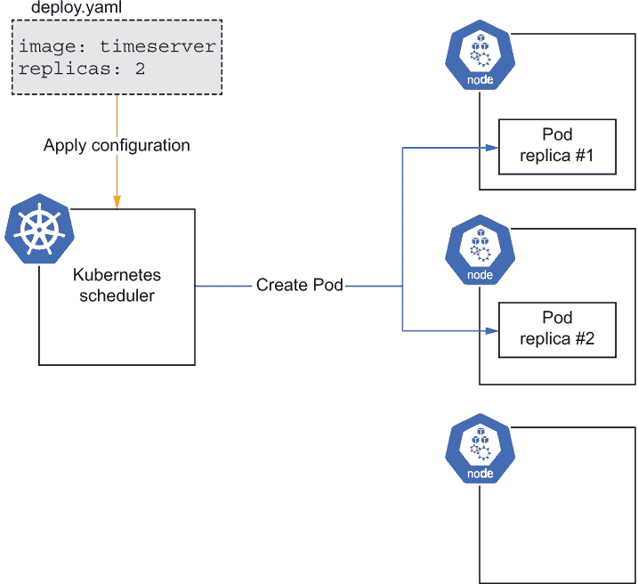
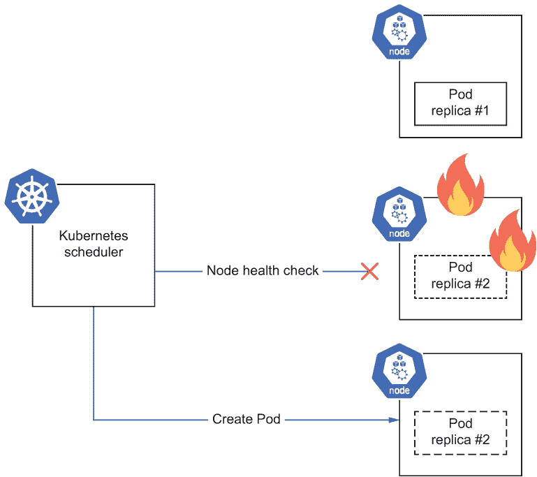
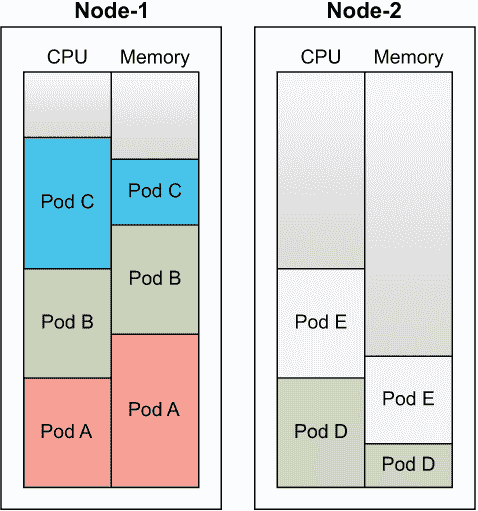
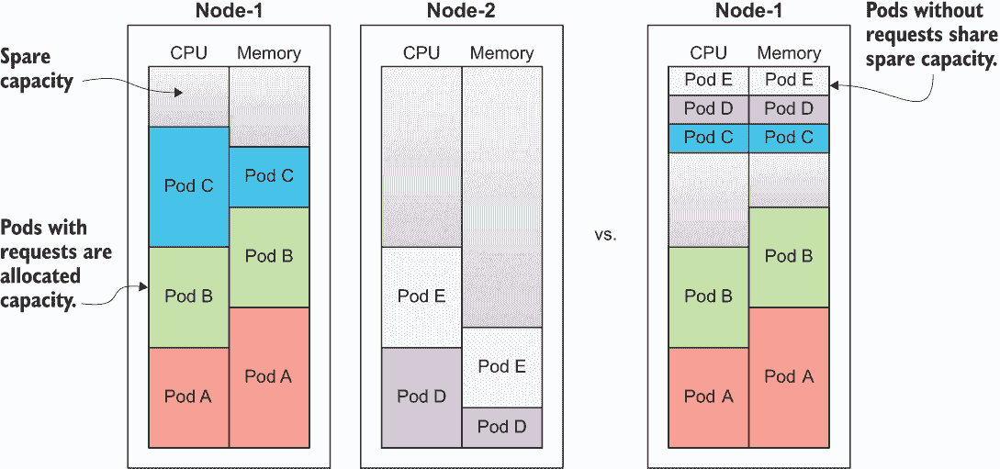
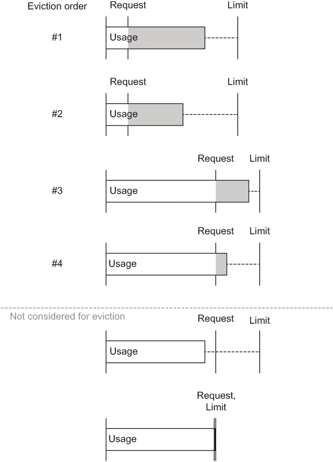
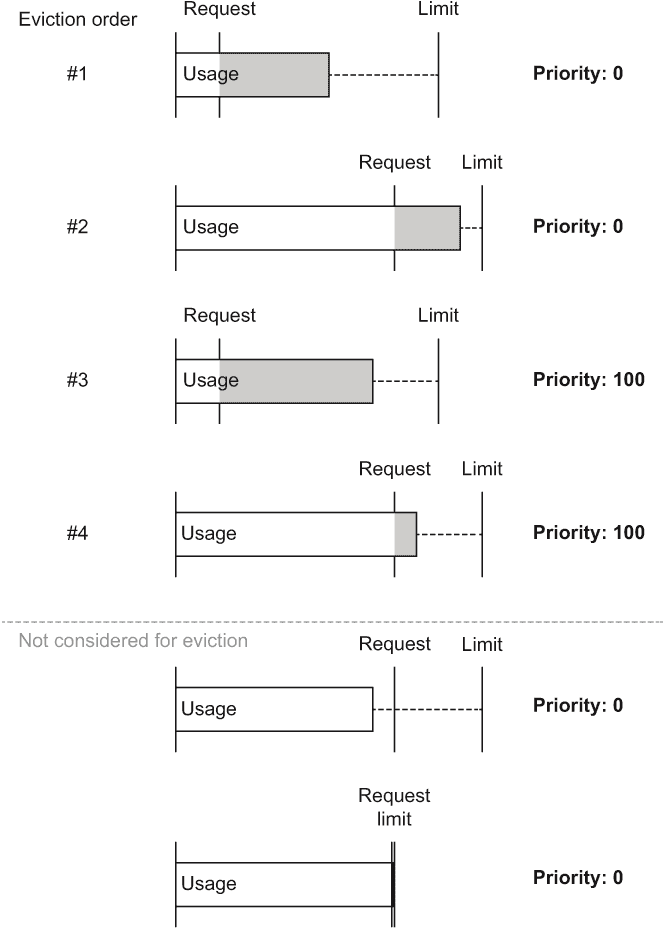
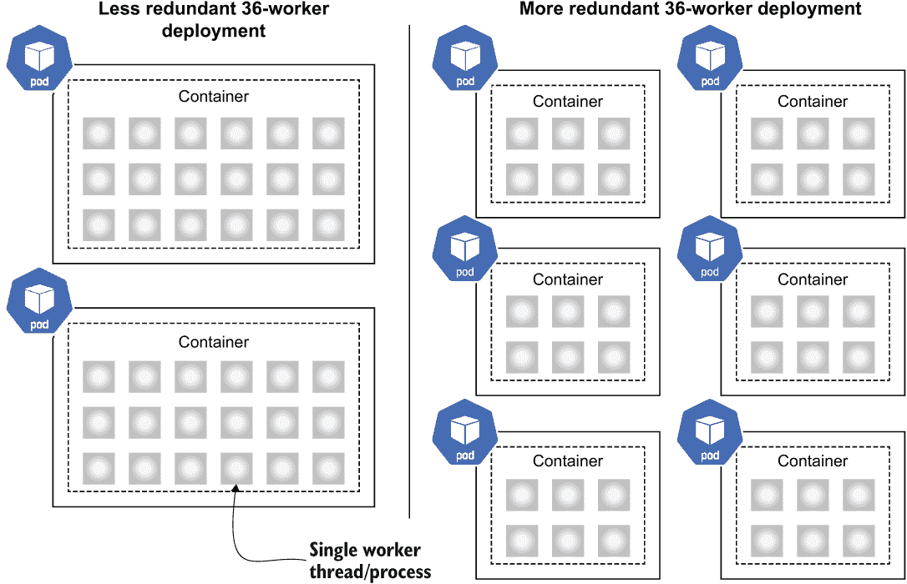

# 5 资源管理

本章涵盖

+   Kubernetes 如何在您的集群中分配资源

+   将工作负载配置为仅请求所需的资源

+   过度承诺资源以提高您的成本/性能比

+   通过内部并发平衡 Pod 副本数

第二章介绍了容器是新的隔离级别，每个容器都有自己的资源，第三章讨论了 Kubernetes 中的可调度单元——Pod（它本身是一组容器的集合）。本章介绍了根据资源需求和您需要提供给系统的信息，如何将 Pod 分配到机器上，以便您的 Pod 能够获得所需的资源。了解 Pod 如何分配到节点有助于您在资源请求、爆发、过载、可用性和可靠性等方面做出更好的架构决策。

## 5.1 Pod 调度

Kubernetes 调度程序执行基于资源的 Pod 到节点的分配，实际上是整个系统的核心。当您将配置提交给 Kubernetes（如我们在第三章和第四章中所做的那样），是调度程序负责找到集群中具有足够资源并负责启动和运行 Pod 中容器的节点（图 5.1）。



图 5.1 对用户应用的配置做出响应，调度程序在节点上创建 Pod 副本。

调度程序和相关组件的工作并不止于此。在部署对象（我们在本书中一直使用）的情况下，它持续监控系统，目标是使系统状态符合您的要求。换句话说，如果您的部署请求两个 Pod 副本，调度程序不仅会创建这些副本然后忘记它们；它还会持续验证是否仍然有两个副本在运行。如果发生某些情况（例如，由于某些故障，节点消失），它会尝试在新的位置调度 Pod，以确保您的期望状态（在这种情况下，两个副本）仍然得到满足（图 5.2）。



图 5.2 如果其中一个节点出现问题，Kubernetes 控制平面的健康检查失败。因此，调度程序在健康节点上创建一个新的 Pod 副本。

由于节点故障而由调度程序重新创建 Pod 的行为与我们在上一章中讨论的 Pod 重启是不同的。由于存活性或就绪性失败而导致的 Pod 重启由 kubelet 在节点上本地处理，而调度程序负责监控节点的健康状态，并在检测到问题时重新分配 Pod。

由于集群中的每个节点都受可用资源的限制，并且 Pod 本身可能具有不同的资源需求，因此调度器的一个重要职责是找到足够的空间来运行您的 Pod（图 5.3）。在决定将您的 Pod 的容器放置在集群中的位置时，它考虑了多个调度维度，无论是首次部署还是响应中断，如图 5.2 所示。



图 5.3 根据资源需求在两个节点上分配了五个容器

调度器的任务是找到集群中合适的位置来放置 Pod，基于其资源需求和（我们将在第八章中介绍）任何其他放置要求。任何无法在集群中放置的 Pod 将具有`Pending`状态（如果您有 Pod 长时间保持此状态，请参阅第三章中标题为“故障排除：卡在挂起状态”的建议）。

### 5.1.1 指定 Pod 资源

您通过在 Deployment 清单中指定资源请求来向调度器提供它做出调度决策所需的信息（以及具有嵌入式 Pod 规范的其他工作负载类型）。到目前为止，本书中的示例尚未指定其资源需求，但对于生产级部署，需要添加这些信息。一个需要 20%的 CPU 核心时间和 200MiB 内存的 Pod 将按照以下列表进行指定。

列表 5.1 第五章/5.1.1_PodResources/deploy_requests.yaml

```
apiVersion: apps/v1
kind: Deployment
metadata:
  name: timeserver
spec:
  replicas: 3
  selector:
    matchLabels:
      pod: timeserver-pod
  template:
    metadata:
      labels:
        pod: timeserver-pod
    spec:
      containers:
      - name: timeserver-container
        image: docker.io/wdenniss/timeserver:3
 resources:
 requests: ❶
 cpu: 200m ❶
 memory: 250Mi ❶
```

❶ 此容器的资源请求

这里示例中的`200m`代表 200 毫核——即一个核心的 20%。您也可以使用浮点数（例如，`0.2`）；然而，在 Kubernetes 实践中，使用毫核是非常常见的。内存的`Mi`后缀表示米贝（MiB），而`Gi`表示吉贝（1,024 的幂）。`M`和`G`表示兆字节和吉字节（1,000 的幂）。

指定资源很重要，因为它为 Kubernetes 提供了将 Pod 需求与节点容量匹配所需的信息。某些 Pod 未指定资源意味着它们将被随机放置在节点上。比较图 5.4 中的并排图。在左侧，我们有五个 Pod 根据其需求被放置在两个节点上，而在右侧，有三个 Pod 没有指定资源，所以它们只是被扔在与其他 Pod 相同的节点上。注意，当未指定资源时，节点资源的一半被分配给了相同的 5 个 Pod。这里的风险是，未指定资源规格的 Pod 可能会资源不足，或者如果它们使用的内存超过节点上的可用内存，可能会被驱逐。



图 5.4 比较了所有 Pod 都有资源请求和只有一些 Pod 有资源请求时的 Pod 分配情况。没有资源请求的 Pod 将根据最佳努力原则共享剩余容量，不考虑它们的实际需求。

到目前为止，Kubernetes 的 Pod 放置可能听起来相当简单——我们只是在请求与资源之间进行配对。如果考虑到*突发的*能力——即消耗比请求更多的资源，这实际上会变得简单。很多时候，一个进程可能不需要它请求的所有资源。如果节点上的其他 Pod 可以在临时基础上使用这部分容量，那不是很好吗？这正是 Kubernetes 所提供的，并且它通过*限制*进行配置。一个 Pod（如下面的列表所示）声明了它们请求的资源，这些资源用于调度，并设置了限制，这些限制在 Pod 被调度和运行后约束了使用的资源。

列表 5.2 第五章/5.1.1_PodResources/deploy_requests_limits.yaml

```
apiVersion: apps/v1
kind: Deployment
metadata:
  name: timeserver
spec:
  replicas: 3
  selector:
    matchLabels:
      pod: timeserver-pod
  template:
    metadata:
      labels:
        pod: timeserver-pod
    spec:
      containers:
      - name: timeserver-container
        image: docker.io/wdenniss/timeserver:3
        resources:
          requests:
            cpu: 200m
            memory: 250Mi
 limits: ❶
 cpu: 300m ❶
 memory: 400Mi ❶
```

❶ 该容器的资源限制。容器可以使用高达 CPU 核心的 30%和 400 MiB 的内存。

在节点上放置 Pod 时，调度器只考虑 Pod 的资源请求（在调度时根本不考虑限制）。然而，请求和限制都会对运行 Pod 的性能产生影响。

一旦运行，超出其内存*限制*的 Pod 将被重启，而超出其 CPU 限制的 Pod 将被限制。这些操作直接在节点上由 kubelet 处理。

在资源争用的情况下，超出其内存请求的 Pod 可能会被驱逐（有关如何选择驱逐 Pod 的详细信息，请参阅 5.1.3 节），而超出其 CPU 请求的 Pod 将被限制在请求的 CPU 上。

由于这些值在 Pod 的调度和运行中起着如此重要的作用，因此对于 Pod 中的容器设置请求和限制是最佳实践。但您如何确定设置它们的值呢？请继续阅读，了解请求和限制如何相互作用以形成服务质量（QoS）类，以及您如何测量应用程序的性能以确定要设置的值。

### 5.1.2 服务质量

当请求高于限制，或者根本未设置时，会引入一个新的问题：当这些 Pod 消耗了过多的资源（最常见的是过多的内存），并且需要被驱逐以回收资源时，您应该怎么做？为了解决这个问题，Kubernetes 会对 Pod 进行排序，以确定先移除哪个。

在规划您的工作负载时，请考虑它们所需的服务质量。Kubernetes 提供了三个服务质量级别：保证的、可突发的和尽力而为的。

保证类

在保证类 Pod 中，限制被设置为等于请求。这种配置是最稳定的，因为 Pod 保证获得它请求的资源——不多也不少。如果您的 Pod 有多个容器，它们都必须满足这一要求，Pod 才能被认为是保证的。

保证类 Pod 将在不同条件下始终有相同数量的资源可用，并且它们不会被从节点上驱逐，因为它们不可能使用比已安排的更多资源。

可突发现类

可扩展类 Pod 的限制设置高于请求，并且可以在资源可用的情况下“突发”临时增加（例如，来自其他未使用所有请求或节点上未分配空间的 Pod）。您需要小心处理这些 Pod，因为可能会有一些不可预见的结果，例如意外依赖突发。比如说，一个 Pod 落在空节点上，可以尽情地突发。然后，在稍后的某个时候，它被重新调度到资源较少的另一个节点上；性能现在将不同。因此，在多种条件下测试可扩展 Pod 非常重要。如果一个 Pod 有多个容器，并且它不符合保证类的标准，且其中任何一个容器设置了请求，则该 Pod 被认为是可扩展的。除非它们超过了一个不可压缩资源（如内存）的请求，否则这些 Pod 不会因驱逐而受到威胁。

尽力而为

没有设置任何请求或限制的 Pod 被认为是“尽力而为”的，并且会被调度到 Kubernetes 希望的地方。这种设置是所有类别中最低的，我强烈建议不要使用这种模式。您可以通过设置非常低的请求来实现类似的结果，这比闭着眼睛希望结果最好要明确得多。

当考虑 Pod 的稳定性时，至少将资源请求设置为足够高的值，以便为它们提供运行资源，并避免完全不设置任何资源请求。对于高优先级、关键工作负载，应始终将限制设置为请求，以确保保证性能。这些 Pod 在资源竞争时是第一个被从节点驱逐的。

### 5.1.3 驱逐、优先级和抢占

在资源有限（如内存）的竞争情况下（例如，太多 Pod 同时尝试增加内存使用），Kubernetes 将通过一种称为*驱逐*的过程，通过移除使用超出其请求分配的资源（Pod）来回收资源。因此，确保 Pod 资源得到充分指定非常重要。属于管理型工作负载结构（如 Deployment）的驱逐 Pod 将在集群中重新调度，通常是在另一个节点上。但是，如果您的 Pod 被频繁驱逐，可能会降低工作负载的可用性，这也是您应该增加资源请求的信号。

驱逐

保证类 Pod 在资源竞争时永远不会被驱逐，因此为了实现坚不可摧的部署，始终将 Pod 的限制设置为与其请求相等，以将它们定义为保证类。本节其余部分将讨论在考虑驱逐时非保证类 Pod 的排名方式以及如何影响排序。

在寻找要驱逐的 Pod 时，Kubernetes 首先考虑那些使用比其请求量更多资源的 Pod，并按其优先级数字排序，然后按 Pod 使用的额外资源（竞争资源）量排序。由于最佳努力 QoS 类 Pod 没有资源请求，它们将是首先被驱逐的（从使用最多资源的 Pod 开始）。默认情况下，具有相同优先级数字（`0`）的所有 Pod 以及具有相同优先级的 Pod，其使用量超过请求量的多少将用于对它们进行排名，如图 5.5 所示。



图 5.5 具有相同优先级的 Pod 的驱逐顺序

被驱逐的错误状态

如果您查询您的 Pod 并看到`Evicted`状态，这表明调度器驱逐了一个 Pod，因为它使用了比请求量更多的资源。如果这种情况偶尔发生，这可能是可以接受的，但如果您看到频繁的驱逐，请增加您容器请求的资源量，并检查您是否需要向您的集群添加更多计算能力。

优先级

优先级只是一个整数（介于`0`和`1,000,000,000`之间），您可以通过优先级类将其分配给 Pod 以改变其排名。图 5.6 显示了将优先级数字分配给 Pods 的驱逐顺序，如图 5.5 所示。如您所见，驱逐首先按优先级排序，然后按使用量超过请求量的多少排序。那些未使用超过其请求量的 Pod 不会面临驱逐风险，无论其优先级如何。



图 5.6 具有多个优先级值的 Pod 的驱逐顺序

要创建自己的优先级级别，您首先需要创建一个 PriorityClass 对象。

列表 5.3 第五章/5.1.3_ 优先级/priorityclass.yaml

```
apiVersion: scheduling.k8s.io/v1
kind: PriorityClass
metadata:
  name: high-priority
value: 1000000              ❶
preemptionPolicy: Never     ❷
globalDefault: false        ❸
description: "Critical services."
```

❶ 优先级整数

❷ 如果集群中没有可用容量，则此优先级类不会导致低优先级 Pod 被驱逐。

❸ 是否应将此优先级类设置为默认值

然后将 PriorityClass 对象分配给一个 Pod。

列表 5.4 第五章/5.1.3_ 优先级/deploy.yaml

```
apiVersion: apps/v1
kind: Deployment
metadata:
  name: timeserver
spec:
  replicas: 3
  selector:
    matchLabels:
      pod: timeserver-pod
  template:
    metadata:
      labels:
        pod: timeserver-pod
    spec:
 priorityClassName: high-priority  ❶
      containers:
      - name: timeserver-container
        image: docker.io/wdenniss/timeserver:3
        resources:
          requests:
            cpu: 200m
            memory: 250Mi
```

❶ 为此部署使用的优先级类

优先级数字在调度期间也被使用。如果您有很多 Pod 等待调度，调度器将首先调度优先级最高的 Pod。使用优先级来控制调度顺序对于确定哪些批处理作业应该首先执行特别有用（批处理作业在第十章中介绍）。

预占

当单独使用时，优先级有助于对工作负载进行排序，以便更重要的工作负载首先被调度，最后被驱逐。然而，可能存在一种情况，即集群在一段时间内没有足够的资源，高优先级 Pod 被留在`Pending`状态，而低优先级 Pod 已经运行。

如果您希望高优先级工作负载主动提升低优先级工作负载，而不是等待容量释放，您可以通过更改`PriorityClass`中的`preemptionPolicy`字段来添加抢占行为，如下面的列表所示。

列表 5.5 Chapter05/5.1.3_Priority/priorityclass-preemption.yaml

```
apiVersion: scheduling.k8s.io/v1
kind: PriorityClass
metadata:
  name: high-priority-preemption
value: 1000000
preemptionPolicy: PreemptLowerPriority     ❶
globalDefault: false
description: "Critical services."
```

❶ 如果集群中没有可用容量，此优先级类将导致低优先级 Pod 被驱逐。

幸运的是，Kubernetes 不会忘记由于驱逐或抢占而被从节点移除的 Pod，只要这些 Pod 属于部署或其他受管理的工作负载类型。这些 Pod 将被返回到`Pending`状态，并在集群有足够容量时重新调度。这也是您始终应使用类似 Deployment 这样的工作负载结构的重要原因之一，因为以这种方式驱逐的独立 Pod 将不会被重新调度。

何时使用优先级和抢占

优先级和抢占是 Kubernetes 的有用功能，由于它们对驱逐和调度的影响，因此理解它们非常重要。在花费太多时间配置所有部署的优先级之前，我建议您优先确保您的 Pod 请求和限制是适当的，因为这是最重要的配置。

当您在处理多个部署并试图通过过度提交来节省资金，即通过从集群中榨取每一滴计算能力时，优先级和抢占才能真正发挥作用，这需要您有一种方式来表示 Pod 的相对重要性以解决资源争用。我不建议从这个设计开始，因为您只是在增加复杂性。更简单的方法是分配足够的资源来充分调度所有工作负载，然后在以后进行微调以从集群中挤出更多效率。再次强调，确保您的关键服务性能的最简单方法是适当地设置资源请求，并在您的集群中拥有足够的节点以便它们都能被调度。

## 5.2 计算 Pod 资源

在上一节中，我们讨论了为什么对于获得最可靠的运行体验来说，为 Pod 设置适当的资源请求和限制很重要。但您如何确定最佳值呢？关键在于运行并观察您的 Pod。

Kubernetes 自带了一个资源使用监控工具`kubectl top`，您可以使用它来查看 Pod 和节点使用的资源。我们将重点关注 Pod，因为这是我们设置正确资源请求所需了解的内容。

首先，部署一个资源请求过高的 Pod。这个 Pod 可能已经在生产中部署了——毕竟，对于性能来说，通常可以高估所需的资源（尽管对于预算来说并不总是这样）。这个练习的目标是先从高开始，观察 Pod 的实际使用情况，然后将请求配对以提供正确的资源并避免浪费。

在你充分了解 Pod 需要多少资源之前，最好保持限制未设置（允许它使用节点上的所有空闲资源）。这并不能完全解决设置*一些*资源请求的需求，因为你更希望一开始就分配比所需更多的专用容量。

列表 5.6 Chapter05/5.2_ResourceUsageTest/deploy.yaml

```
apiVersion: apps/v1
kind: Deployment
metadata:
  name: timeserver
spec:
  replicas: 1                      ❶
  selector:
    matchLabels:
      pod: timeserver-pod
  template:
    metadata:
      labels:
        pod: timeserver-pod
    spec:
      containers:
      - name: timeserver-container
        image: docker.io/wdenniss/timeserver:3
        resources:                 ❷
          requests:
            cpu: 200m
            memory: 250Mi
```

❶ 将副本设置为 1 进行负载测试

❷ 正在测试的 Pod。未设置资源限制，因此我们可以分析使用情况。

运行 `kubectl top pods`（你可能需要等待一分钟左右数据可用），并注意启动资源使用情况，特别是内存。了解 Pod 启动所需的资源量是有用的，因为这将是如果你选择使用可弹性的 QoS 的下限。

备注：如果你使用 Minikube 并且收到类似 `error:` `Metrics` `API` `not` `available` 的错误，你可以使用 `minikube addons enable metrics-server` 启用指标。

现在，直接向 Pod 施加足够的负载以模拟真实世界的使用。性能工具如 Apache Bench（与 Apache¹ 一起安装）在这里很有帮助。以下是一个 Apache Bench 命令示例，它将使用 20 个线程生成总共 10,000 个请求。你通常想运行这个测试一段时间（比如 5 分钟），以便更容易观察峰值：

```
kubectl get svc
EXTERNAL_IP=203.0.113.16
ab -n 10000 -c 20 http://$EXTERNAL_IP/
```

你还可以观察一个 Pod 接收正常的生产负载。由于你不想在生产环境中过度限制 Pod 直到你知道它需要多少资源，你应该先高估资源请求，然后测量实际使用情况。一旦你有了对实际需求的良好衡量，你可以在以后调整请求并适当调整。

在你的 Pod 下加负载时，再次运行 `kubectl top pods`（记住，可能需要一分钟左右的时间来反映最新值，所以保持你的负载模拟运行）。输出将类似于：

```
$ kubectl top pod
NAME                          CPU(cores)    MEMORY(bytes)   
timeserver-dd88988f5-tq2d9    145m          11Mi
```

一旦你对自己的 Pod 完成测试，你应该有像表 5.1 中显示的值（此表中的数据纯粹是示例）。

表 5.1 启动和负载下的内存和 CPU 使用情况

|  | CPU (核心) | 内存 (字节) |
| --- | --- | --- |
| 启动 | 20m | 200Mi |
| 正常负载下 | 200m | 400Mi |

可能需要重复这个过程几次，并获取你的 Pod 在不同负载（例如，低、正常和高流量）和时间框架下的值。多个时间框架（例如，启动后直接、启动后 1 小时、启动后 1 天）有助于考虑使用量的潜在增长（例如，内存泄漏）。因此，你可能会得到像表 5.2 中那样的结果。

表 5.2 测试后的内存和 CPU 使用情况

|  | CPU (核心) | 内存 (字节) |
| --- | --- | --- |
| 启动 | 20m | 400Mi |
| 正常负载下 | 200m | 500Mi |
| 高负载下 | 850m | 503Mi |
| 1 小时后 | 210m | 505Mi |
| 1 天后 | 200m | 600Mi |

### 5.2.1 设置内存请求和限制

拥有这些数据在手，你应该如何设置你的资源请求？首先，你现在有一个绝对的下限：400 MiB。由于你只能保证获得你的资源请求，并且你知道你的 Pod 在负载下使用 400 MiB，将这个值设置得更低很可能会导致你的 Pod 被 OOMKilled（因内存不足而被终止）。如果你设置了更高的资源限制，你可能不会立即看到它，但当你知道你需要它时，你不想依赖额外的容量。

这使 400 MiB 成为正确的请求吗？可能不是。首先，你肯定想要有一个缓冲区，比如 10%。此外，你可以看到一小时后，使用了 505 MiB，所以这可能是更好的起始下限（在考虑缓冲区之前）。但是，它需要是 600 MiB 吗？我们看到，一天后，Pod 需要这么多，可能是由于某个地方的泄漏。这个答案取决于具体情况。你当然可以设置这个更高的限制，然后你可以有信心你的 Pod 可以运行一天。然而，由于 Kubernetes 会自动重启崩溃的容器（包括由于系统因内存不足而移除它们的情况），因此系统在一天后重启泄漏进程以回收内存可能是可以接受的，甚至可能是理想的。

当内存泄漏是可以接受的

Instagram 众所周知^a 禁用了 Python 的垃圾回收以获得 10% 的 CPU 性能提升。虽然这可能不是对每个人都适用，但它是一个值得考虑的有趣模式。如果所有的事情都是自动发生的，并且有数千个副本，那么一个进程随着时间的推移而膨胀并在重启时进行清理，这真的那么重要吗？可能不是。

Kubernetes 会自动重启崩溃的容器（包括由于系统因内存不足而移除它们的情况），这使得实现这种模式变得相对容易。我不会在没有彻底调查的情况下推荐这种策略，但我确实认为如果你的应用程序有一个缓慢的泄漏，这可能不是你最需要修复的最高优先级错误。

重要的是，你需要确保至少给容器分配足够的资源，以便它能启动并运行一段时间。否则，你可能会陷入 OOMKill 冲突循环，这对任何人来说都不是什么乐事。拥有足够的副本（下一节将介绍）也是避免用户可见故障的重要因素。

^a [`instagram-engineering.com/dismissing-python-garbage-collection-at-instagram-4dca40b29172`](https://instagram-engineering.com/dismissing-python-garbage-collection-at-instagram-4dca40b29172)

使用你收集的数据，通过查看你的 Pod 在负载下的内存使用情况来找到下限，并添加一个合理的缓冲区（至少 10%）。根据这个示例数据，我会选择 505 MiB * 1.1 ≈ 555 MiB。你知道这足以让 Pod 在负载下至少运行一小时，还有一点富余。根据你的预算和风险概况，你可以相应地调整这个数字（数值越高，风险越低，但成本越高）。

因此，请求至少需要覆盖 Pod 的稳定状态。那么内存**限制**呢？假设您的数据是稳定的，覆盖了所有情况（即，在您观察期间没有执行的高内存代码路径），我不会将其设置得比一天内的值高太多。设置过高的限制（比如说，是限制的两倍或更高）实际上帮助不大，因为您已经测量了 Pod 在一天内需要的内存量。如果您确实有内存泄漏，当达到限制时系统重启 Pod 可能比允许 Pod 过度增长更好。

另一个选择是将限制设置为保证 QoS 类的请求。这种策略的优点是无论节点上运行着什么，都能保证 Pod 的恒定性能。在这种情况下，您应该给 Pod 留一点额外的资源缓冲，因为 Pod 一旦超出请求量就会被终止。

### 5.2.2 设置 CPU 请求和限制

与内存不同，CPU 是**可压缩的**。换句话说，如果应用程序没有得到它需要的所有 CPU 资源，它只是运行得更慢。这与内存有很大不同：如果应用程序耗尽内存，它将会崩溃。您仍然可能希望给应用程序足够的 CPU 资源。否则，性能会下降，但与内存相比，不需要有那么多额外容量的缓冲。

在我们应用示例数据表 5.2 中，我们可以看到稳定状态大约是 CPU 的 200 mCPU。这似乎是您 CPU 请求的一个很好的起点。如果您想省钱并且可以接受性能下降，您可以将它设置得稍低一些。

CPU 限制是 Kubernetes 可以提高您资源效率的领域，因为您可以将限制设置得高于请求，以使您的应用程序在需要时能够消耗节点上的未使用周期。与内存一样，Kubernetes 只保证请求的 CPU，但通常允许 Pod 利用节点上的未使用容量以运行得更快是很不错的。对于花费大量时间等待外部依赖（例如，等待数据库响应）的 Web 应用程序，节点上通常会有额外的 CPU 容量，活跃请求可以利用这些容量。

与内存一样，将限制设置得高于请求（即可爆发的 QoS 类）的缺点是您的性能不会是恒定的。在空节点上运行的爆发性 Pod 将比在 Pod 密集的节点上拥有更多的资源。虽然，通常来说，能够通过消耗节点上的未使用容量来处理流量爆发是很不错的，但如果恒定性能很重要，将限制设置为请求可能更可取。

### 5.2.3 通过超分配 CPU 降低成本

降低成本的一种策略是在节点上过度承诺 CPU 资源。这种过度承诺是通过将 CPU 请求设置为一个低值（低于 Pod 实际需要的值）来实现的，因此可以在节点上放置比如果将 CPU 请求设置为实际使用量更多的 Pod。

这种策略可以节省资金，但有一个明显的性能缺点。然而，对于被认为是高度**突发性**的工作负载，这可以是一个非常理想的策略。假设你正在托管数百个低流量网站。每个网站每小时可能只收到几个请求，只需要在那个时间使用 CPU。对于这种部署，每个应用程序可以有一个 50m 的 CPU 请求（允许每个核心调度 20 个 Pod）和 1000m 的限制（允许它临时爆满到满核心）。

使这种过度承诺策略有效的关键是深入了解机器上运行的其他内容。如果你有信心大多数网站大部分时间都是空闲的，这种方法可能可行。然而，如果所有 Pod 中的容器需要同时爆发，性能可能会下降。这种类型的设置意味着你的容器不再相互隔离：现在，你需要相应地了解和计划节点的组成。然而，这是可以做到的。

当然，最安全的做法是完全不进行过度承诺。一个合理的折衷方案是不要过度承诺太多。通过将 Pod 的 CPU 资源限制设置得高于它们的请求，可以以机会主义的方式减少延迟。然而，你应该将 CPU 资源请求设置得足够高，以便处理合理的基线负载，这样过剩的容量就不会被依赖。

### 5.2.4 平衡 Pod 副本和内部 Pod 并发

现在你已经了解了资源请求如何影响你的 Pod 的调度以及它们获取的资源，考虑 Pod 内部的并发性就很有意义了。Pod 的并发性（例如，应用程序运行了多少个进程/线程）会影响资源的大小，通过在 Pod 内部使用并发而不是 Pod 副本，可以在效率和持久性之间进行权衡。

如果你来自一个应用安装成本较高的环境，无论是服务器上的货币成本还是配置实例的时间，你的应用可能已经通过使用线程或派生配置了大量的内部并发。在 Kubernetes 世界中，由于资源效率高，并发工作者仍然具有优势。我不会将当前有 10 个工作者的 Pod 部署为 10 个副本，每个副本只有一个工作者。容器内部的并发性在内存使用上非常高效，因为派生共享了应用程序二进制文件使用的一些内存，而线程共享的更多。CPU 也在工作者之间池化，这对于典型的 Web 应用程序来说很有用，因为它们在等待外部依赖上花费了大量的时间——这意味着通常有额外的容量可以同时处理多个请求。

在单个 Pod 中平衡并发工作者的好处是，Pod 的副本越多，它的耐用性就越高。例如，假设你有一个 Pod 的两个副本，每个副本有 18 个工作者，总共处理 36 个并发连接，如图 5.7 所示。如果其中的一个 Pod 崩溃（或者因为未通过第四章中设置的健壮性检查而重启），在 Pod 重启之前，你的一半容量将离线。更好的方法可能是拥有六个 Pod 副本，每个副本有六个工作者，这样仍然保持了一些容器间的并发性，同时增加了一些冗余。



图 5.7 36 个工作者可能的两种部署比较

为了达到正确的平衡，可以使用一个简单的启发式方法。考虑你需要为用户服务的总工作者数量，以及其中有多少可以在任何给定时间内离线而不会对用户产生明显影响。一旦计算出可以离线的数量——使用我们之前的例子，假设在问题被发现之前，36 个工作者中有 16% 可以离线——那么你可以在单个 Pod 中集中的最多工作者数量是 16%，即六个。

简而言之，你拥有的 Pod 副本越多，设计就越安全，但在资源使用效率方面就越低。因此，考虑如何平衡你自己的可用性和资源需求是值得的。

在平衡您拥有的 Pod 副本数量之后，另一个提高可用性的重要属性是确保您的 Pod 分布在多个节点上。毕竟，如果您设计了多个副本，但所有这些副本都在同一个节点上运行，那么如果该节点出现故障，您仍然面临单点故障的风险。幸运的是，大多数 Kubernetes 平台（包括 Google Kubernetes Engine）默认启用了 Pod 扩散策略，该策略将在所有可用节点和多个区域（对于区域集群的情况）上扩散 Pod。要获得此默认行为，通常只需确保您在集群的不同区域中有一定数量的节点。如果您想深入了解节点放置和 Pod 扩散拓扑，第八章将为您解答。

## 摘要

+   Kubernetes 调度器位于系统的核心，负责在您的基础设施上为您的 Deployment 的 Pod 找到合适的家。

+   调度器会尝试在给定的节点上放置尽可能多的 Pod，前提是 Pod 的容器设置了适当的资源请求。

+   Kubernetes 通过 Pod 的资源请求和限制来管理资源的分配、过度承诺和回收。

+   使用突发来过度承诺资源可以节省资源，但会引入性能可变性。

+   您的工作负载对请求和限制的指定设置了它们所接收的质量服务（QoS）。

+   在设计工作负载时，副本数量和 Pod 内部线程/进程工作计数之间存在可用性/资源使用权衡。

+   大多数平台默认启用 Pod 扩散，以确保副本通常不会放置在同一个节点上，从而避免单点故障。请确保您在集群中有几个节点以实现更高的可用性。

* * *

^（1）[`httpd.apache.org/docs/2.4/install.html`](http://httpd.apache.org/docs/2.4/install.html)
