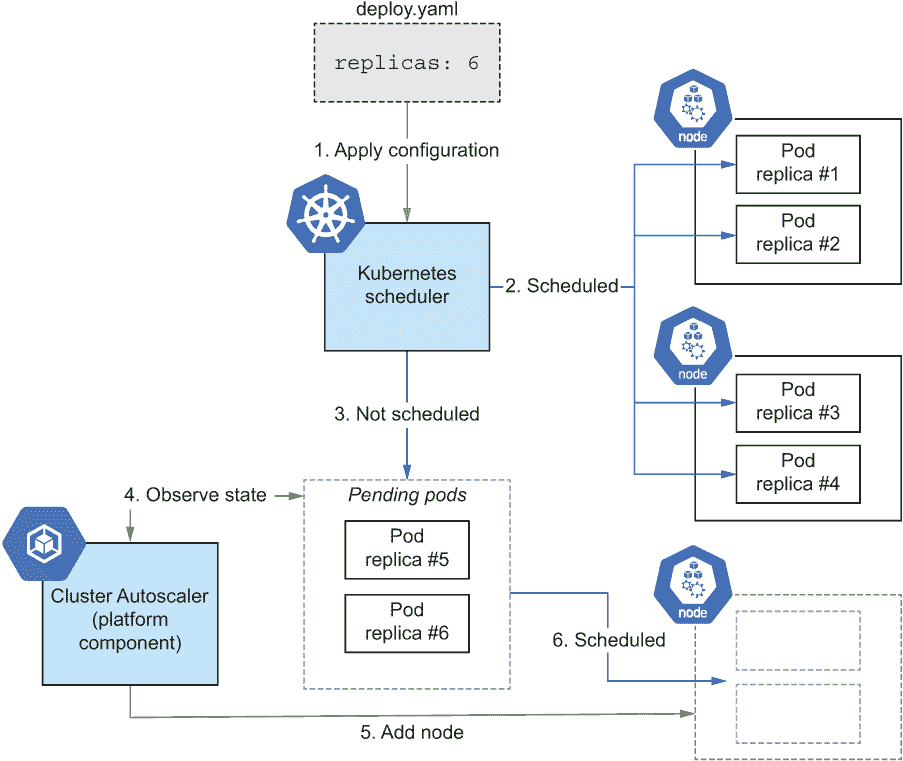
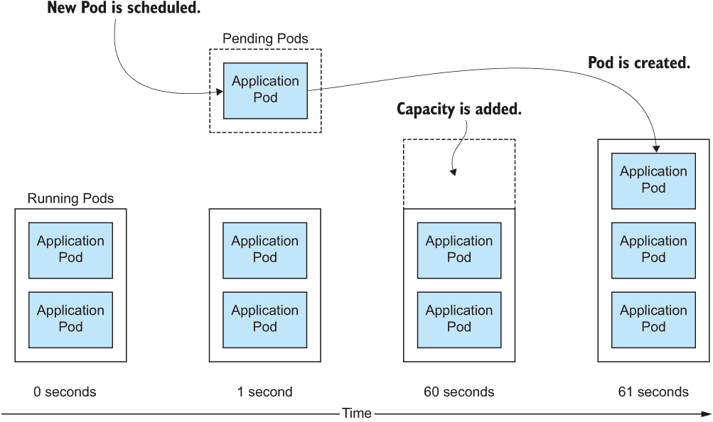
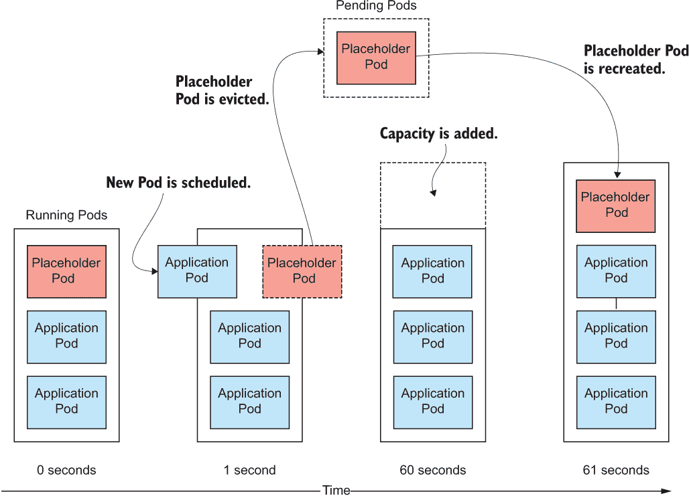
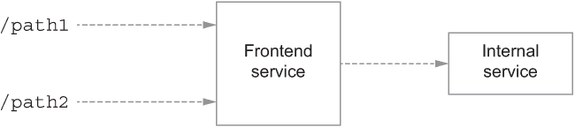
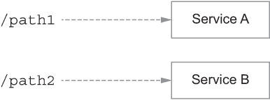

# 6 扩展

本章涵盖

+   手动扩展 Pods 和节点

+   使用 CPU 利用率和其他指标动态扩展 Pod 副本

+   利用托管平台根据您的 Pods 所需资源添加和删除节点

+   使用低优先级占位符 Pods 来提供突发容量

+   设计应用程序以便它们可以扩展

现在我们已经部署了应用程序，并设置了健康检查以保持其运行而无需干预，现在是时候考虑如何进行扩展了。我将其命名为“扩展”，因为我认为每个人都非常关心当应用程序取得巨大成功，您需要为所有新用户提供服务时，系统架构是否能够处理扩展。但别担心，我还会介绍如何缩小规模，以便您在淡季节省费用。

最终的目标是，通过自动扩展来使我们的部署投入运行。这样，我们就可以在澳大利亚的海滩上熟睡或放松，而我们的应用程序可以动态地响应流量峰值。为了达到这个目标，我们需要确保应用程序能够扩展，了解 Kubernetes 集群中 Pods 和节点的扩展交互，并确定正确的指标来配置自动扩展器为我们完成所有这些工作。

## 6.1 扩展 Pods 和节点

将您的应用程序容器化并在 Kubernetes 上部署，这是构建能够扩展并支持您增长的应用程序部署的巨大一步。现在，让我们来了解一下，当成功时刻到来，流量增加时，如何实际进行扩展（并在淡季降低规模以节省一些费用）。

在 Kubernetes 中，您需要扩展的基本资源有两个：您的应用程序（Pods）以及它们运行的计算资源（节点）。使生活变得复杂的是，您扩展这些资源的方式是分开的，尽管需求（例如，更多的应用程序容量）在一定程度上是相关的。仅仅扩展 Pods 是不够的，因为它们会耗尽运行所需的计算资源，同样，仅仅扩展节点也是不够的，因为这只会增加空余容量。需要同时扩展并且保持正确的比例。幸运的是，有一些工具可以使您的生活更轻松（以及一些完全自动化的平台，它们会为您处理一切），以下讨论中我会涉及这些内容。

首先，为了处理更多流向您应用程序的流量，您需要增加 Pod 副本的数量。从手动方法开始，您可以通过以下方式更新您的 Deployment 配置以实现所需的副本数。

列表 6.1 第六章/6.1_Replicas/deploy.yaml

```
apiVersion: apps/v1
kind: Deployment
metadata:
  name: timeserver
spec:
 replicas: 6      ❶
  selector:
    matchLabels:
      pod: timeserver-pod
  template:
    metadata:
      labels:
        pod: timeserver-pod
    spec:
      containers:
      - name: timeserver-container
        image: docker.io/wdenniss/timeserver:3
        resources:
          requests:
            cpu: 200m
            memory: 250Mi
```

❶ 副本字段指定了您希望运行的 Pod 的副本数量。

如同往常，您可以使用 `kubectl` 命令 `apply` `-f` `deploy.yaml` 来应用您对配置所做的更改。

`kubectl` 还提供了一个方便的命令行命令，可以达到相同的效果：

```
kubectl scale deployment timeserver --replicas=6
```

然而，如果你尝试添加太多的副本，你很快就会在你的集群中没有足够的空间来调度这些 Pod。这就是节点扩展发挥作用的地方。当你运行`kubectl get pods`时，你会知道你已经没有空间了，因为会有很多 Pod 被列为`Pending`。

Pods 可能因为多种原因处于`Pending`状态，其中最常见的原因（如果 Pod 处于这种状态一分钟或更长时间）是资源不足。本质上，资源不足是一个未满足的条件，Pod 将保持`Pending`状态，直到条件得到满足。如果 Pod 有依赖关系（例如，需要部署在另一个尚未创建的 Pod 所在的节点上），也可能存在其他未满足的条件。为了消除歧义，使用`kubectl describe pod $POD_NAME`描述 Pod 并查看事件。如果你看到一个事件，例如带有类似`Insufficient CPU`消息的`FailedScheduling`，你很可能需要添加更多的节点。

无节点 Kubernetes

我想花一点时间来谈谈无节点 Kubernetes 平台。在我看来，理想的云 Kubernetes 平台是一个你不必过多担心节点的平台。毕竟，如果你使用云服务，为什么不有一个根据 Pod 需求提供所需节点资源的平台，这样你就可以更多地专注于创建优秀的应用和服务呢？

在我作为谷歌云产品经理的角色中，这正是我和我的团队一起构建的产品。我们将其命名为*GKE Autopilot*。这是一个让开发者从担心节点中解放出来的平台。使用 GKE Autopilot，你可以创建标准的 Kubernetes 工作负载，如 Deployments、StatefulSets 和 Jobs，指定副本计数和所需的 CPU 和内存资源。然后 Autopilot 会为你提供必要的计算资源来运行 Pod，并代表你管理计算容量。这有两个关键优势：它通过消除在 Pod 和节点中定义计算需求的需要来提高开发者的效率，并通过显著减少节点管理的负担来提高运营效率。

Autopilot 与众不同的一个特点是 Kubernetes 节点概念仍然保持一定的相关性。许多与节点相关的调度逻辑（如第八章中提到的拓扑分布、亲和性和反亲和性）仍然相关，并且仍然可以使用。Autopilot 在无节点意义上意味着你不再需要担心节点是如何提供或管理的，但它并没有完全抽象或隐藏节点。毕竟，某处确实有一台机器在运行你的代码，这可能在诸如故障域或希望为了降低延迟而将 Pod 放置在一起等方面具有物理相关性。

我认为 Autopilot 具有最佳的设计，它为你提供了所需的节点级控制，同时仍然消除了操作和管理这些节点的负担。不再需要关心你有多少节点，它们的大小和形状，它们是否健康，以及它们是否处于空闲或未充分利用状态。

如果你使用 GKE Autopilot 或类似的平台，你可以基本上忽略本章中关于扩展 *节点* 的所有内容，而纯粹关注扩展 *Pods*。使用 Autopilot，手动或自动（例如使用水平 Pod 自动扩展器）扩展 Pods 是你需要做的所有事情，因为系统会为你配置必要的节点资源，无需任何额外配置。

要扩展节点，你需要查阅你的 Kubernetes 提供商的平台文档，因为 Kubernetes 本身并不编排节点。在 Google Kubernetes Engine (GKE) 的情况下，如果你使用 Autopilot，节点将自动配置，你可以直接跳到第 6.2 节。对于具有节点池的 GKE 集群，命令看起来是这样的：

```
gcloud container clusters resize $CLUSTER_NAME \
  --node-pool $NODE_POOL_NAME \
  --num-nodes $NODE_COUNT
```

缩小扩展使用相同的命令执行。当你缩小节点时，根据你的提供商，你应该能够运行与扩展时相同的命令。集群首先隔离节点以防止新的 Pods 被调度到它们上，然后排空节点，在给 Pods 时间优雅关闭的同时驱逐所有 Pods。在 Deployment 或其他高级工作负载结构中管理的 Pods 将在其他节点上重新调度。

手动隔离和排空节点

如果你想要观察节点缩小时的操作，你可以使用以下命令手动隔离、排空和移除节点：

```
$ kubectl get nodes
NAME                                       STATUS  ROLES   AGE  VERSION
gke-cluster-1-default-pool-f1e6b3ef-3o5d   Ready   <none>  7d   v1.27.3-gke.100
gke-cluster-1-default-pool-f1e6b3ef-fi16   Ready   <none>  7d   v1.27.3-gke.100
gke-cluster-1-default-pool-f1e6b3ef-yc82   Ready   <none>  7d   v1.27.3-gke.100

$ NODE_NAME=gke-cluster-1-default-pool-f1e6b3ef-3o5d

$ kubectl cordon $NODE_NAME
node/gke-cluster-1-default-pool-f1e6b3ef-3o5d cordoned

$ kubectl drain $NODE_NAME --ignore-daemonsets --delete-emptydir-data
node/gke-cluster-1-default-pool-f1e6b3ef-3o5d already cordoned
evicting pod default/timeserver-784d5485d9-mrspm
evicting pod kube-system/metrics-server-v0.5.2-66bbcdbffc-78gl7
pod/timeserver-784d5485d9-mrspm evicted
pod/metrics-server-v0.5.2-66bbcdbffc-78gl7 evicted
node/gke-cluster-1-default-pool-f1e6b3ef-3o5d drained
```

注意，通过 `kubectl` 删除节点并不总是删除底层的虚拟机，这意味着你仍然可能需要为此付费！如果你使用 `kubectl delete node $NODE_NAME` 删除节点，请跟进以确保虚拟机也被删除。在 Autopilot 模式下的 GKE 中，隔离和排空足以将节点从使用中移除，系统会为你处理删除。对于基于节点的 GKE 集群，请确保你自己删除虚拟机，例如：

```
$ gcloud compute instances delete $NODE_NAME --zone us-west1-c
```

通常，当你在缩小节点时，集群会自动执行这些操作，所以你通常不需要自己运行它们；然而，如果你需要移除一个表现不佳的节点，这些操作会很有用。

因此，这就是你手动扩展 Pods 和节点的方式。继续阅读，了解如何通过水平 Pod 自动扩展来自动化这两个操作以扩展 Pods，以及通过集群自动扩展来扩展节点（对于提供此功能的云提供商）。

## 6.2 水平 Pod 自动扩展

在 Kubernetes 中，扩展应用程序的 Pod 副本数量被称为 *水平 Pod 自动扩展*。它是水平的，因为您正在增加副本数量以服务增加的流量，而不是垂直的，垂直意味着增加每个副本可用的资源。通常，为了扩展系统，您希望进行水平扩展。

Kubernetes 包含一个名为水平 Pod 自动扩展器（HPA）的功能，这是一个系统，您指定一个 Pod *指标*（如 CPU 使用率）进行观察和目标，以及一些扩展限制（最小和最大副本数）。然后 HPA 将尝试通过创建和删除 Pod 来满足您的指标。在 CPU 的情况下，如果您的目标是，比如说，20% 的 CPU 利用率，当您的平均利用率（跨所有 Pod）超过 20%（Pod 在其资源请求中请求的）时，HPA 将添加副本，当它低于 20% 时将其删除。这些操作受您提供的最小和最大限制以及冷却期的影响，以避免过多的波动。我们可以在以下列表中为我们的部署创建一个 HPA。

列表 6.2 第六章/6.2_HPA/hpa.yaml

```
apiVersion: autoscaling/v2
kind: HorizontalPodAutoscaler
metadata:
  name: timeserver
spec:
  minReplicas: 1                 ❶
  maxReplicas: 10                ❷
  metrics:
  - resource:
      name: cpu
      target:
        averageUtilization: 20   ❸
        type: Utilization
    type: Resource
  scaleTargetRef:                ❹
    apiVersion: apps/v1          ❹
    kind: Deployment             ❹
    name: timeserver             ❹
```

❶ 最小副本数

❷ 最大副本数

❸ CPU 利用率目标。当 Pod 的 CPU 利用率高于此值时，HPA 将创建更多副本

❹ 将要扩展的部署

您也可以强制创建它。像往常一样，我更喜欢配置方法，因为它使得稍后编辑事物变得更容易。但这里提供了等效的强制命令，以保持完整性：

```
kubectl autoscale deployment timeserver --cpu-percent=20 --min=1 --max=10
```

为了测试这一点，我们需要让 CPU 真的忙碌起来。使用以下两个列表，让我们向 timeserver 应用程序添加一个非常 CPU 密集型的路径：计算 π。

列表 6.3 第六章/timeserver4/pi.py

```
from decimal import *

# Calculate pi using the Gregory-Leibniz infinity series
def leibniz_pi(iterations):

  precision = 20
  getcontext().prec = 20
  piDiv4 = Decimal(1)
  odd = Decimal(3)

  for i in range(0, iterations):
    piDiv4 = piDiv4 - 1/odd
    odd = odd + 2
    piDiv4 = piDiv4 + 1/odd
    odd = odd + 2

  return piDiv4 * 4
```

列表 6.3 是我们计算 π 的方法，列表 6.4 显示了向 server.py 添加新的 URL 路径，并调用它。

列表 6.4 第六章/timeserver4/server.py

```
from pi import *

# ...

case '/pi':                          ❶
    pi = leibniz_pi(1000000)         ❶
    self.respond_with(200, str(pi))  ❶
```

❶ 新的 HTTP 路径

以下列表提供了一个修订后的部署，它引用了带有新路径的容器的新版本。为了与 HPA 正确工作，设置资源请求非常重要，我们在第五章中添加了这些请求，并且在这里也存在。

列表 6.5 第六章/6.2_HPA/deploy.yaml

```
apiVersion: apps/v1
kind: Deployment
metadata:
  name: timeserver
spec:
  replicas: 1                                    ❶
  selector:
    matchLabels:
      pod: timeserver-pod
  template:
    metadata:
      labels:
        pod: timeserver-pod
    spec:
      containers:
      - name: timeserver-container
 image: docker.io/wdenniss/timeserver:4 ❷
        resources:                               ❸
          requests:                              ❸
            cpu: 250m                            ❸
            memory: 250Mi                        ❸
```

❶ 初始副本数设置为 1

❷ 新的应用程序版本

❸ 资源请求对于 HPA 正确工作很重要。

我们现在可以创建部署、服务和 HPA：

```
$ cd Chapter06/6.2_HPA
$ kubectl create -f deploy.yaml -f service.yaml -f hpa.yaml
deployment.apps/timeserver created
service/timeserver created
horizontalpodautoscaler.autoscaling/timeserver created
$ kubectl get svc -w
NAME         TYPE           CLUSTER-IP      EXTERNAL-IP     PORT(S)        AGE
kubernetes   ClusterIP      10.22.128.1     <none>          443/TCP        6m35s
timeserver   LoadBalancer   10.22.131.179   <pending>       80:32650/TCP   18s
timeserver   LoadBalancer   10.22.131.179   203.0.113.16    80:32650/TCP   26s
```

当您等待外部 IP 分配时，您可以使用以下命令开始监视 Pod 的 CPU 利用率（我建议将其放入新窗口）：

```
kubectl top pods
```

一旦您有了外部 IP，在端点生成一些负载。Apache Bench，您可以在大多数系统上安装，对此效果很好。以下命令将同时发送 50 个请求到我们的端点，直到发送了 10,000 个请求——这应该足够了：

```
EXTERNAL_IP=203.0.113.16
ab -n 10000 -c 5 http://$EXTERNAL_IP/pi
```

您可以使用以下方式查看部署的扩展状态：

```
kubectl get pods -w
```

Linux 的 `watch` 命令方便地使用单个命令监视所有资源（`kubectl` 本身无法做到这一点）：

```
watch -d kubectl get deploy,hpa,pods
```

如果一切顺利，你应该观察到 CPU 利用率随着 `kubectl top pods` 命令的可见性而增加，并且更多的 Pod 副本被创建。一旦你停止向端点发送负载（例如，通过中断 `ab` 或等待其完成），你应该观察到这些副本逐渐被移除。

你可能会观察到，在响应高请求负载进行扩容时，副本的调度速度比在请求停止时缩容时移除副本要快。这只是系统在移除容量时稍微谨慎一些，以避免需求激增时的波动。以下是我样本运行的情况：

```
$ kubectl get deploy,hpa,pods 
NAME                         READY   UP-TO-DATE   AVAILABLE   AGE
deployment.apps/timeserver   2/6     6            2           7m7s

NAME            REFERENCE              TARGETS   MINPODS  MAXPODS  REPLICAS
hpa/timeserver  Deployment/timeserver  100%/30%  1        6        6   
NAME                             READY   STATUS              RESTARTS   AGE
pod/timeserver-b8789946f-2b969   1/1     Running             0          7m7s
pod/timeserver-b8789946f-fzbnk   0/1     Pending             0          96s
pod/timeserver-b8789946f-httwn   1/1     Running             0          96s
pod/timeserver-b8789946f-vvnhj   0/1     Pending             0          96s
pod/timeserver-b8789946f-xw9zf   0/1     ContainerCreating   0          36s
pod/timeserver-b8789946f-zbzw9   0/1     ContainerCreating   0          36s
```

这里展示的 HPA 使用 CPU 指标效果相当不错，但有一个问题：你的工作负载可能不是 CPU 密集型的。与演示中使用的 CPU 密集型请求不同，许多 HTTP 服务花费大量时间等待外部服务，如数据库。这些部署可能需要使用其他指标进行缩放，例如每秒请求次数（RPS），而不是 CPU 利用率。Kubernetes 提供了两个内置指标：CPU（在先前的示例中演示）和内存。它不直接支持 RPS 这样的指标，但可以通过使用由你的监控服务公开的自定义和外部指标进行配置。下一节将介绍这种情况。

那么，垂直 Pod 自动缩放呢？

垂直 Pod 自动缩放（VPA）是一种概念，通过调整 Pod 的 CPU 和内存资源来垂直缩放 Pod。在 Kubernetes 中的实现通过观察 Pod 资源使用情况并在时间动态地改变 Pod 的资源请求来实现 VPA。Kubernetes 并不提供内置的 VPA 实现，尽管有一个开源实现^a，以及包括 GKE 在内的云提供商提供他们自己的版本。

由于 VPA 可以自动确定 Pod 的资源请求，它可以节省你一些精力并提供一些资源效率。如果你需要 Pod 的资源请求随时间动态调整（对于资源需求波动很大的 Pod），这也是合适的工具。

使用 VPA 会增加其自身的复杂性，并且不一定总是与 HPA 玩得很好。我首先会关注设置合适的 Pod 资源请求和副本的水平缩放。

^a [`github.com/kubernetes/autoscaler`](https://github.com/kubernetes/autoscaler)

### 6.2.1 外部指标

一个流行的缩放指标是每秒请求次数（RPS）。使用 RPS 指标进行缩放的基础是测量你的应用程序实例每秒可以处理多少请求（副本的容量）。然后，将当前请求的数量除以这个值， voila，你就有了所需的副本数量：

replica_count = RPS ÷ replica_capacity

RPS 指标的好处是，如果你确信你的应用程序可以处理你对其测试的 RPS，那么你可以确信它可以在负载下进行扩展，因为自动扩展器的任务是提供足够的容量。

事实上，即使你不在进行 *自动* 扩展，这个指标也是一个非常好的规划容量的方法。你可以测量副本的容量，预测流量，并相应地增加副本。但是，使用 Kubernetes，我们也可以配置一个带有 RPS 指标的 HPA 以进行自动扩展。

现在，在这种情况下，我们将使用 HPA 的 *外部指标* 属性。这个问题的一个问题是，正如其名称所暗示的，这个指标是从集群外部获取的。所以，如果你使用的是与我示例中使用的不同的监控解决方案，你需要查找相关的 RPS 指标。幸运的是，RPS 是一个非常常见的指标，任何值得信赖的监控解决方案都会提供它。

在之前的章节中，我们讨论了几种通过所谓的第 4 层负载均衡器（在 TCP/IP 层运行）和所谓的第 7 层 Ingress（在 HTTP 层运行）将流量引入集群的不同方法。由于 *请求* 是 HTTP 概念，你需要使用 Ingress 来获取这个指标。Ingress 将在下一章中深入讨论；现在，只需知道这个对象可以查看和检查你的 HTTP 流量，因此可以暴露你接收到的请求数量指标。

对于这个例子，如下两个列表所示，我们将使用相同的部署，但通过一个类型为 `NodePort` 的服务（而不是之前章节中的 `LoadBalancer` 类型）将其暴露在 Ingress 上。

列表 6.6 第六章/6.2.1_ExternalMetricGCP/service.yaml

```
apiVersion: v1
kind: Service
metadata:
  name: timeserver-internal   ❶
spec:
  selector:
    pod: timeserver-pod
  ports:
  - port: 80
    targetPort: 80
    protocol: TCP
  type: NodePort              ❷
```

❶ 此内部服务的名称

❷ 使用 NodePort 类型用于 Ingress。

列表 6.7 第六章/6.2.1_ExternalMetricGCP/ingress.yaml

```
apiVersion: networking.k8s.io/v1
kind: Ingress
metadata:
  name: timeserver-ingress
spec:
  rules:
  - http:
      paths:
      - path: /
        pathType: Prefix
        backend:
          service:
            name: timeserver-internal   ❶
            port:
              number: 80
```

❶ 引用列表 6.6 中的内部服务

如果你正在使用 Google Cloud，一旦你将转发规则名称替换为你自己的，以下 HPA 定义就可以从 Ingress 中获取 RPS 指标。

列表 6.8 第六章/6.2.1_ExternalMetricGCP/hpa.yaml

```
apiVersion: autoscaling/v2
kind: HorizontalPodAutoscaler
metadata:
  name: timeserver-autoscaler
spec:
  minReplicas: 1
  maxReplicas: 6
 metrics: ❶
 - type: External ❶
 external: ❶
 metric: ❶
 name: loadbalancing.googleapis.com|https|request_count ❶
 selector: ❶
 matchLabels: ❶
 resource.labels.forwarding_rule_name: "k8s2-fr-21mgs2fl" ❶
 target: ❶
 type: AverageValue ❶
 averageValue: 5 ❶
  scaleTargetRef:
    apiVersion: apps/v1
    kind: Deployment
    name: timeserver
```

❶ 外部指标

`forwarding_rule_name` 是指标服务器知道你正在谈论哪个 Ingress 对象的方式。你可以完全省略 `selector` 字段，但这样它将匹配所有 Ingress 对象——这可能不是你想要的。

使问题复杂化的是，这个转发规则名称是一个平台特定的资源名称，而不是 Kubernetes 对象名称（在这个例子中，该名称由 GKE 自动设置）。为了发现平台资源名称，在等待几分钟以配置你的 Ingress 之后，你可以描述你的 Ingress 对象：

```
$ kubectl describe ingress timeserver-ingress
Name:             timeserver-ingress
Namespace:        default
Address:          203.0.113.16
Default backend:  default-http-backend:80 (10.22.0.202:8080)
Rules:
  Host        Path  Backends
  ----        ----  --------
  *           
              /   timeserver-internal:80 (10.22.0.130:80,10.22.0.131:80,10.22.0.196:80 + 1 more...)
Annotations:  ingress.kubernetes.io/backends:
                {"k8s -be-32730":"HEALTHY","k8s1-a5225067":"HEALTHY"}
              ingress.kubernetes.io/forwarding-rule: k8s2-fr-21mgs2fl   ❶
              ingress.kubernetes.io/target-proxy: k8s2-tp-21mgs2fl
              ingress.kubernetes.io/url-map: k8s2-um-21mgs2flEvents:
  Type    Reason  Age                    From                     Message
  ----    ------  ----                   ----                     -------
  Normal  Sync    6m28s (x31 over 5h6m)  loadbalancer-controller  Scheduled for sync
```

❶ 转发规则名称

另一种查询此信息的方法，这对于配置自动化工具非常重要，是了解数据在对象结构中的位置，并使用 `kubectl` 的 JsonPath 格式：

```
$ kubectl get ingress -o=jsonpath="{.items[0].metadata.annotations['ingress\.
➥ kubernetes\.io\/forwarding-rule ']}"
k8s2-fr-21mgs2fl
```

小贴士：我通过首先查询 Ingress 的 `-o=json` 版本，然后通过查看 JsonPath 文档、Stack Overflow 和试错来构建 JsonPath 表达式。

一旦对象准备就绪，还有最后一步，即确保您的集群中的工作负载已启用 Cloud Monitoring，并安装一些粘合剂，以便 HPA 可以访问指标。按照¹中的说明安装自定义指标 - Stackdriver 适配器*.*。

在我们的部署、服务类型为 `NodePort`、入口、HPA 和指标适配器都配置完成后，我们现在可以尝试一下！生成一些对入口的请求（替换您的入口 IP，通过 `kubectl get ingress` 获取）：

```
ab -n 100000 -c 100 http://203.0.113.16/
```

此外，在另一个窗口中，观察扩展：

```
$ kubectl get hpa,ingress,pods
NAME             REFERENCE              TARGETS   MINPODS MAXPODS REPLICAS
hpa/timeserver   Deployment/timeserver  94%/30%   1       6       4       

NAME                         CLASS    HOSTS   ADDRESS          PORTS
ingress/timeserver-ingress   <none>   *       203.0.113.16     80   

NAME                             READY   STATUS              RESTARTS   AGE
pod/timeserver-b8789946f-8dpmg   1/1     Running             0          5h51m
pod/timeserver-b8789946f-gsrt5   0/1     ContainerCreating   0          110s
pod/timeserver-b8789946f-sjvqb   1/1     Running             0          110s
pod/timeserver-b8789946f-vmhsw   0/1     ContainerCreating   0          110s
```

你可能会注意到，验证系统是否按预期运行已经更容易了。Apache Bench 允许你指定并发请求；你可以看到它们花费了多长时间（因此可以计算 RPS）并查看副本数量以确定是否正确。这个过程对于 CPU 指标来说有点困难，为了测试，你可能需要尽可能让 Pod 变得忙碌，就像我们在上一个示例中所做的那样。基于 *用户请求* 的扩展属性是它成为流行指标的一个原因。

观察和调试

要查看 HPA 在做什么，你可以运行 `kubectl describe hpa`。特别注意 `ScalingActive` 条件。如果它是 `False`，这通常意味着你的指标未激活，这可能由多种原因造成：（1）指标适配器未安装（或未认证），（2）你的指标名称或选择器错误，或者（3）尚无针对给定指标的监控样本。请注意，即使配置正确，在没有监控数据样本的情况下（例如，没有请求），你也会看到 `False`，所以在进一步调查之前，请确保向端点发送一些请求并等待一分钟或两分钟，以便数据通过。

平均值 vs. 值

在上一个示例中，我们使用了 `targetAverageValue`。`targetAverageValue` 是该指标的每个 Pod 的目标值。`targetValue` 是一个替代方案，它是目标绝对值。由于 RPS 容量是在每个 Pod 级别计算的，所以我们想要的是 `targetAverageValue`。

其他指标

在处理后台任务（在第十章中介绍）时，另一个流行的外部度量标准是 Pub/Sub 队列长度。Pub/Sub 是一个排队系统，允许您有一个需要执行的工作队列，您可以在 Kubernetes 中设置一个工作负载来处理该队列。对于此类设置，您可能希望通过添加或删除 Pod 副本（可以处理队列的工作者）来对队列大小做出反应。您可以在 GKE 文档中找到一个完整的示例²；本质上，它类似于之前的 HPA，只是度量不同：

```
metric:
  name: pubsub.googleapis.com|subscription|num_undelivered_messages
  selector:
    matchLabels:
      resource.labels.subscription_id: echo-read
```

此配置包括度量名称和度量资源标识符——在这种情况下，是 Google Cloud Pub/Sub 订阅标识符。

其他监控解决方案

外部度量标准是您应该能够为 *任何* Kubernetes 监控系统配置的。虽然之前给出的示例使用了 Google Cloud 上的 Cloud Monitoring，但如果您使用 Prometheus 或其他云监控系统，同样的原则也应该适用。要开始，您需要确定（1）如何为您的监控解决方案安装度量适配器，（2）在该系统中度量名称是什么，以及（3）正确选择度量资源的方式。

## 6.3 节点自动缩放和容量规划

使用水平 Pod 自动缩放是一种根据需求自动缩放您的 Pod 的好方法。然而，如果您必须手动缩放节点以添加和删除容量，仍然需要人工介入。常见的集群自动缩放器集群功能使您能够根据需求缩放节点，并且与 HPA 配合良好以缩放 Pod。

### 6.3.1 集群自动缩放

集群自动缩放不是 Kubernetes 基础 API 的一部分，而是一个可选组件。幸运的是，大多数云服务提供商都提供（或提供类似功能）并将其作为平台的一个属性来构建，该属性可以为您自动缩放节点数量，让您只需关注您的应用程序及其副本数量。由于此功能依赖于平台，具体的实现会有所不同（并非所有提供商都提供此功能）。搜索“[产品名称] 集群自动缩放器”以找到相关文档。

在 GKE 的情况下，如果您使用操作模式的 Autopilot，集群将内置节点预配和自动缩放；无需进一步配置。对于具有节点池的 GKE 集群，您可以在创建节点池或更新现有节点池时配置自动缩放。

当使用集群自动缩放时，您可以专注于缩放您的工作负载，让集群自动响应（如图 6.1）。这非常方便，因为它可以在缩放现有工作负载和部署新工作负载时解决 `Pending` Pods 问题。不过，请阅读您提供商的具体实现细节，以了解哪些情况不受覆盖（例如，如何处理太大而无法适应当前节点配置的 Pods）。



图 6.1 集群自动扩展器监视挂起的 Pod，并在需要时创建新节点。

传统的集群自动扩展器可能只能添加现有预定义配置的新节点，需要你定义你希望使用的每个可能的节点类型，所以请务必阅读文档。如果你使用 Autopilot（无需配置；这是出厂设置的工作方式）或基于节点的模式并配置了节点自动供应，GKE 可以添加任何类型的新节点。

集群自动扩展和其他可以自动添加和删除节点的提供者工具通过允许你主要忽略节点并专注于自己的 Pod 来使你的生活变得更轻松。当与基于 Pod 的扩展如 HorizontalPodAutoscaler 配合使用时，你可以有一个相当不干预、自动化的部署。

### 6.3.2 集群自动扩展的备用容量

与手动添加节点相比，自动扩展节点的缺点之一是有时自动扩展器可能会调整得“太”好，导致没有备用容量。这可以很好地降低成本，但会使启动新 Pod 的速度变慢，因为容量需要在 Pod 启动之前配置。

添加新节点然后启动 Pod 比向现有节点添加新 Pod 要慢。节点需要配置和启动，而那些被调度到现有节点的 Pod 只需拉取容器并启动——如果容器已经在缓存中，它们甚至可以立即开始启动。如图 6.2 所示，新调度的 Pod 必须等待容量配置完毕后才能开始启动。



图 6.2 使用自动扩展动态添加容量以适应新调度的 Pod

一种在保持自动扩展器的同时解决这两个问题的方法是通过使用低优先级的占位符 Pod。这个 Pod 本身不执行任何操作，只是保留容量（保持额外的节点处于待机状态）。这个 Pod 的优先级很低，所以当你的工作负载扩展时，它们可以抢占这个 Pod 并使用节点容量（图 6.3）。



图 6.3 使用占位符 Pod 进行自动扩展，允许使用备用容量快速启动新 Pod

要创建我们的占位符 Pod 部署，首先，我们需要一个 PriorityClass。这个优先级类应该有一个低于零的优先级（我们希望其他所有优先级类都能被它抢占），如下所示。

列表 6.9 第六章/6.3.2_PlaceholderPod/placeholder-priority.yaml

```
apiVersion: scheduling.k8s.io/v1
kind: PriorityClass
metadata:
  name: placeholder-priority
value: -10                      ❶
preemptionPolicy: Never         ❷
globalDefault: false
description: "Placeholder Pod priority."
```

❶ 占位符 Pod 的低优先级值

❷ 不会抢占其他 Pod

现在，我们可以创建我们的“不执行任何操作”的容器部署，如下所示。

列表 6.10 第六章/6.3.2_PlaceholderPod/placeholder-deploy.yaml

```
apiVersion: apps/v1
kind: Deployment
metadata:
  name: placeholder
spec:
  replicas: 10                                  ❶
  selector:
    matchLabels:
      pod: placeholder-pod
  template:
    metadata:
      labels:
        pod: placeholder-pod
    spec:
      priorityClassName: placeholder-priority   ❷
      terminationGracePeriodSeconds: 0          ❸
      containers:
      - name: ubuntu
        image: ubuntu
        command: ["sleep"]                      ❹
        args: ["infinity"]                      ❹
        resources:
          requests:
            cpu: 200m                           ❺
            memory: 250Mi                       ❺
```

❶ 你想要多少个副本？这，加上 CPU 和内存请求，决定了占位符 Pod 提供的头空间容量的大小。

❷ 使用我们刚刚创建的优先级类

❸ 我们希望这个 Pod 立即关闭，没有任何宽限期。

❹ 这是我们的“什么都不做”命令。

❺ 占位符 Pod 将保留的资源。这应该等于你希望替换此 Pod 的最大 Pod。

当你自己创建时，考虑你需要多少个副本以及每个副本的大小（内存和 CPU 请求）。大小应该至少与你的最大常规 Pod 大小相同；否则，当占位符 Pod 被抢占时，你的工作负载可能无法适应空间。同时，不要增加太多大小；如果你希望保留额外容量，使用比标准工作负载、Pod 大得多的副本可能更好。

为了让这些占位符 Pod 被你安排的其他 Pod 抢占，那些 Pod 需要有优先级类，其值更高，并且没有`preemptionPolicy`为`Never`。幸运的是，默认优先级类有一个`value`为`0`和`preemptionPolicy`为`PreemptLowerPriority`，所以默认情况下，所有其他 Pod 都会替换我们的占位符 Pod。

为了表示 Kubernetes 默认值作为其自己的优先级类，它看起来就像列表 6.11。由于你实际上不需要更改默认值，所以我不必麻烦配置这个。但是，如果你正在创建自己的优先级类，你可以使用这个列表作为参考（只是不要将`globalDefault`设置为`true`，除非你真的打算这样做）。再次强调，为了使占位符 Pod 抢占工作，务必*不要*将`preemptionPolicy`设置为`Never`。

列表 6.11 Chapter06/6.3.2_PlaceholderPod/default-priority.yaml

```
apiVersion: scheduling.k8s.io/v1
kind: PriorityClass
metadata:
  name: default-priority
value: 0                                         ❶
preemptionPolicy: PreemptLowerPriority           ❷
globalDefault: true                              ❸
description: "The global default priority. Will preempt the placeholder Pods."
```

❶ 优先级值高于占位符 Pod

❷ 将抢占其他 Pod

❸ 设置为默认值，以便其他 Pod 抢占占位符 Pod。

类似这样的部署封装的占位符 Pod 对于提供恒定的扩展空间很有用，为你提供一定量的容量，以便快速调度。或者，你可以将它们封装在 Job 中，用于一次性容量配置，CronJob 以按计划配置容量，或者作为独立 Pod 运行。

## 6.4 构建可扩展的应用程序

扩展你的应用程序只是方程的一部分。应用程序本身需要考虑扩展来构建。即使你可能还没有到达需要担心这些问题的增长点，我相信*你需要扩展的时候，不是设计如何扩展的时候！*

当你的应用程序是具有不可预测增长的应用（例如，具有潜在无限用户的初创公司）时，你真的需要提前规划以避免“成功失败”的场景。这就是在你成功的突破时刻，应用程序失败，因为它无法处理规模。由于你不知道这个突破时刻何时会发生，你需要提前为此做好准备。并不是每个初创公司都会有一个突破时刻，但如果你有，你希望准备好利用这个机会；否则，一切可能都徒劳无功。

幸运的是，通过选择 Kubernetes 来编排你的容器，你已经在为可扩展的应用程序打下了坚实的基础。在设计应用程序时，还有一些其他因素需要考虑，这些因素在很大程度上与 Kubernetes 独立。大多数可扩展设计原则都适用于 Kubernetes 和非 Kubernetes 环境，但我会介绍一些在 Kubernetes 上构建可扩展应用程序时值得记住的最佳实践。在开发应用程序时关注一些可扩展性原则，在未来你的突破时刻到来并需要将其扩展到极致时可能会很重要。

### 6.4.1 避免状态

能够扩展的一个重要方面是避免在应用程序中存在本地状态。无状态设计是指你的应用程序运行的每个副本（实例）都可以在没有参考任何存储在另一个实例上的本地数据的情况下服务任何传入的请求。本地短暂存储可以用于临时数据处理，只要它不在副本之间共享，并且不需要为下一个请求提供可用性。

**注意**：我认为应用程序的无状态属性是流行的十二要素应用程序设计方法中最重要的因素。（[`12factor.net/processes`](https://12factor.net/processes)）。无状态应用程序更容易扩展和维护，因为每个实例都可以独立地处理任何请求。

与传统的宿主机不同，在 Kubernetes 中，容器写入磁盘的所有数据默认都是短暂的（当容器终止或重启时会被删除）。你可以使用持久卷和 StatefulSet 构造（见第九章）来创建有状态的应用程序，但默认情况下，容器被视为无状态的，你通常希望保持这种状态以便进行扩展。

而不是在 Kubernetes 中管理磁盘上存储状态，使用外部数据存储来存储数据，例如 SQL 和 NoSQL 数据库用于结构化数据，对象存储用于文件，以及像 Redis 这样的内存数据库用于会话状态。为了支持你的扩展能力，选择托管服务（而不是自托管）并确保你选择的服务可以处理你的潜在增长。

这并不是说所有状态都是坏的。毕竟，你需要某个地方来存储你的状态，有时这可能需要是一个自托管的应用程序。当你创建这样的应用程序时，请确保选择高度可扩展的解决方案，例如具有成功记录的流行开源解决方案（例如 Redis）。

关系型数据库的陷阱

如果你使用像 MySQL 或 PostgreSQL 这样的关系型数据库来存储数据，那么有相当多的潜在陷阱值得注意。

**驯服你的查询**

不言而喻，低效的查询会导致低效的扩展，随着数据量的增加和请求数量的增加而变慢。为了保持控制，我建议记录并分析你的查询，并在开发早期阶段就开始（你不想等到你的应用成为热门后才查看查询！）。

你不能提高你没有衡量的东西，所以记录每个请求中执行的 SQL 查询的性能是最重要的第一步。寻找生成大量查询或慢查询的请求，并从这里开始。

MySQL 和 PostgreSQL 都支持 `EXPLAIN` 命令，这可以帮助分析特定查询的性能。提高性能的常见策略包括为常用搜索列添加索引和减少需要执行的 `JOIN` 数量。MySQL 的文档“优化 SELECT 语句”^a 详细介绍了许多不同的优化策略。

**避免 N+1 查询**

即使你的查询非常高效，你对数据库的每个查询都会产生开销。理想情况下，你的应用程序处理的每个请求都应该执行固定数量的查询，无论显示多少数据。

如果你有一个渲染对象列表的请求，你理想上希望不为列表中的每个对象生成单独的查询。这通常被称为 N+1 查询问题（当问题发生时，通常有一个查询用于获取列表，然后为列表中的每个项目 [N 个项目] 有一个查询）。

这种反模式在那些使用对象关系映射（ORM）并且具有父子对象懒加载功能的系统中尤为常见。使用懒加载渲染一对多关系中的子对象通常会导致 N+1 查询（一个查询用于父对象，N 个查询用于 N 个子对象），这些查询将出现在你的日志中。幸运的是，在这样系统中通常有方法可以提前表明你打算访问子对象，以便可以将查询批量处理。

这种 N+1 查询情况通常可以被优化为固定数量的查询，无论是通过 `JOIN` 来在列表查询中返回子对象，还是两个查询：一个用于获取记录集，另一个用于获取该集中子对象的详细信息。记住，目标是每个请求都只有少量固定的查询，特别是查询的数量不应该与展示的记录数量成线性关系。

**使用只读副本进行 SELECT 查询**

减轻主数据库压力的最好方法之一是创建一个只读副本。在云环境中，这通常非常简单。将所有只读查询发送到你的只读副本（或副本！）以减轻主读/写实例的负载。

在你实际上需要读取副本之前，考虑到这种模式来设计你的应用程序，你可以在应用程序中设置到同一数据库的两个数据库连接，使用第二个来模拟读取副本。设置只具有读取权限的自己的只读连接的用户。稍后，当你需要部署实际的读取副本时，你只需更新第二个连接的实例地址，然后就可以继续了！

**递增主键**

如果你真的取得了巨大成功，你可能会后悔使用递增主键。它们是扩展的问题，因为它们假设一个单一的可写数据库实例（阻碍了水平扩展）并且在插入时需要加锁，这会影响性能（即，你不能同时插入两个记录）。

这实际上只在大规模时才是一个问题，但值得记住，因为当你突然需要扩展时，重新架构事情会更困难。解决这个问题的常见方法是使用全局 UUID（例如，`8fe05a6e-e65d-11ea-b0da-00155d51dc33`），这是一个 128 位的数字，通常以十六进制字符串的形式显示，可以由任何客户端（包括在用户设备上运行的代码）唯一生成。

当 Twitter 需要扩展时，它选择创建自己的全局递增 ID 以保留它们可排序的特性（即，较新的推文具有更高的 ID 号），你可以在他们的文章“宣布 Snowflake”中了解更多信息。^b

另一方面，你可能出于美学原因更喜欢保留递增主键，例如当记录 ID 暴露给用户时（如推文 ID 的情况）或为了简单起见。即使你计划保留递增主键一段时间，你仍然可以在一开始就采取的一个步骤是不在它们不会增加任何价值的地方使用自动递增主键，比如用户会话对象——也许不是*每个*表都需要递增主键。

^a [`dev.mysql.com/doc/refman/8.0/en/select-optimization.html`](https://dev.mysql.com/doc/refman/8.0/en/select-optimization.html)

^b [`blog.twitter.com/engineering/en_us/a/2010/announcing-snowflake.html`](https://blog.twitter.com/engineering/en_us/a/2010/announcing-snowflake.html)

### 6.4.2 微服务架构

构建你的应用程序的一种方法是将服务拆分为多个服务，这通常被描述为使用微服务架构。这种方法基本上就是创建几个内部服务来执行不同的任务，并通过远程过程调用（本质上是一个 HTTP 请求）从其他服务调用这些函数。这与将完整程序逻辑放在单个容器中的单体服务设计方法形成对比。

虽然将单一架构拆分为多个较小的服务有一些好处，但也存在一些缺点，所以我并不主张仅仅为了使用微服务架构。好处包括可以为每个服务使用不同的编程语言，独立开发（例如，由不同的团队），以及独立扩展。缺点包括更复杂的调试和集成测试，因为你现在有更多的组件，需要一种方法来追踪系统中的请求。

微服务与单一架构

你应该构建微服务还是单一架构？为了这次辩论，我不会在本书中详细讨论，但让我分享两个关于这个话题的观点，由你自己来判断。

David Heinemeier Hansson (DHH) 在他的文章“宏伟的单一架构”^a 中写道，微服务适合大型科技公司，而对于大多数小型团队来说，单一架构可能更合适。他的论点是，尽管微服务在某些情况下可能具有优势，但并非总是那么明确，尤其是对于小型团队来说，这种开销（尤其是额外的开销）并不值得。

James Lewis 和 Martin Fowler 在他们的文章“微服务”^b 中阐述了对微服务的深思熟虑且平衡的观点。其中一个突出的好处是产品心态，即内部团队专注于构建和管理自己的组件，这种去中心化的方法允许团队做出自己的架构决策。

^a [`m.signalvnoise.com/the-majestic-monolith/`](https://m.signalvnoise.com/the-majestic-monolith/)

^b [`martinfowler.com/articles/microservices.html`](http://martinfowler.com/articles/microservices.html)

无论你是否完全采用微服务，我想强调的关键点是，如果你有多个服务，你可以单独扩展它们。当然，即使你除了主应用程序外只有一个内部服务，这也是正确的——没有必要让每个端点都成为自己的服务以从这种架构中受益。例如，假设你有一个主要提供 HTML 和 JSON 请求的 Web 应用程序，但有一个端点执行一些需要比平均请求更多内存的实时图形工作。可能值得创建一个单独的部署（甚至可以使用相同的容器）来提供服务端点，这样你就可以单独扩展它，并且稍微隔离它。

有几种实现方式。你可以有一个单独的前端来调用内部服务，如图 6.4 所示，或者你可以让最终用户直接连接到这个新服务，如图 6.5 所示。



图 6.4 由同一前端提供服务的两个 HTTP 路径，该前端与内部服务通信



图 6.5 由不同服务提供的两个路径

无论你是全情投入微服务，还是将单个服务拆分出来由其单独可扩展的部署处理，使用多种编程语言，或者运行内部开发和开源软件来提供你的应用程序，你最终都会在 Kubernetes 中创建*内部服务*。内部服务使用私有集群 IP 地址进行配置，并由集群中的其他服务调用以提供这种架构。下一章将介绍如何配置此类内部服务。

### 6.4.3 背景任务

另一个帮助你扩展的重要因素是避免进行任何重量级的内联处理。例如，假设你有一个端点返回图像的缩略图，并且如果缓存中没有该缩略图，则会生成缩略图。你可以将此逻辑内联，即用户请求缩略图，服务通过返回缓存中的缩略图或在没有缓存的情况下生成一个来响应。这种设计的问题在于，从缓存中提供缩略图应该非常快，而创建缩略图则不是。如果有很多请求进来，都需要创建缩略图，服务器可能会变慢或崩溃。此外，由于某些请求很轻量，而其他请求则非常重，因此很难进行扩展。你可以扩展此服务，但仍然可能不幸地将所有重请求都导向单个实例。

解决方案是使用第十章详细介绍的背景任务模式。基本上，当需要重量级处理时，而不是直接进行，你安排一个任务，并向客户端返回一个状态码，指示它应该重试请求。有一个配置了处理此任务队列的容器，可以根据当前队列长度准确地进行扩展。因此，请求进来，导致缓存未命中并排队。如果一切顺利，当客户端在短时间内自动重试请求后，缩略图将已由后台队列处理并准备好提供服务——对用户来说，这是一个类似的结果，需要额外构建一个后台队列和具有重试逻辑的客户端，但具有更好的可扩展性。

## 摘要

+   Kubernetes 非常适合帮助你进行扩展；一些最大的应用程序都在 Kubernetes 上运行。

+   为了充分利用这种架构，从一开始就设计你的应用程序，使其能够进行横向扩展。

+   水平 Pod 自动扩展器可以根据需要提供新的 Pod，与集群自动扩展协同工作，形成一个完整的自动扩展解决方案。

+   你不仅限于 CPU 指标，可以根据你的监控解决方案导出的任何指标来扩展你的 Pod。

+   集群自动扩展功能（如果由你的提供商支持）可以根据需要提供新的节点。

+   占位符 Pod 可以在自动扩展的同时增加容量空间。

+   考虑将您的应用程序拆分为微服务，或者简单地托管同一应用程序的多个部署，以便允许独立的扩展组。

* * *

[`cloud.google.com/kubernetes-engine/docs/tutorials/autoscaling-metrics`](https://cloud.google.com/kubernetes-engine/docs/tutorials/autoscaling-metrics)

[`cloud.google.com/kubernetes-engine/docs/tutorials/autoscaling-metrics#pubsub`](https://cloud.google.com/kubernetes-engine/docs/tutorials/autoscaling-metrics#pubsub)
