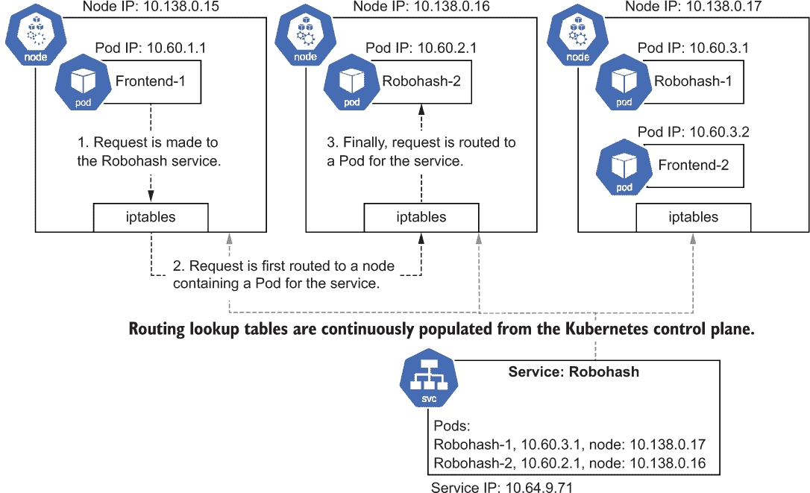
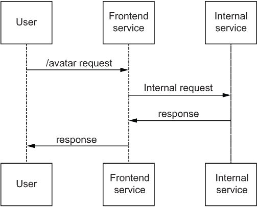
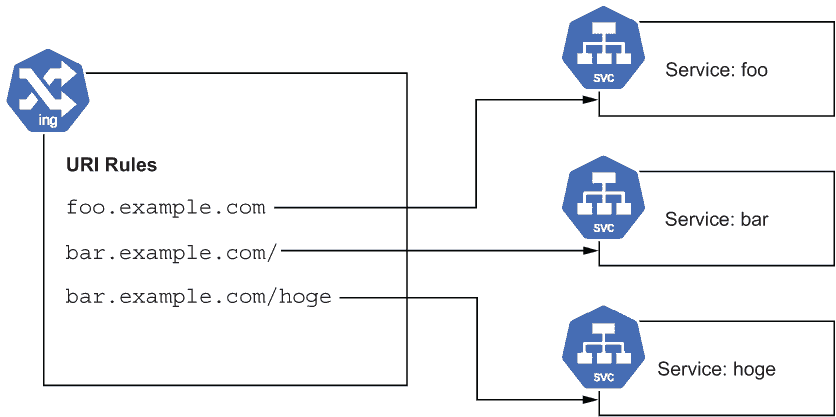
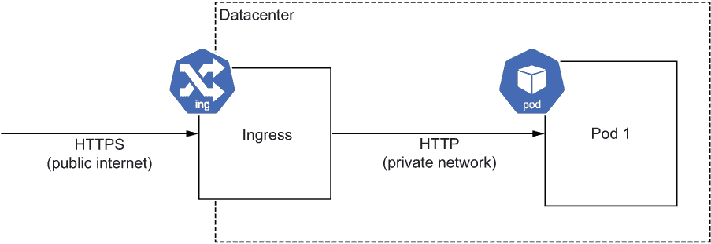

# 7 内部服务和负载均衡

本章涵盖

+   创建内部服务

+   在 Kubernetes 中在 Pod 和服务的虚拟 IP 地址之间路由数据包

+   发现内部服务的 IP 地址

+   使用 Ingress 配置 HTTP 负载均衡器

+   配置 TLS 证书以创建 HTTPS 端点

内部服务是一种通过将应用程序拆分为多个较小的服务来扩展您开发和服务应用程序的方式。这些单独的服务可以处于不同的开发周期中（可能由不同的团队完成）并使用彼此完全不同的编程语言和技术。毕竟，只要您可以将它容器化，您就可以在 Kubernetes 中运行它。您不再需要担心您的应用程序部署平台是否可以运行您需要运行的内容。

在本章中，我们将探讨如何在集群中配置和发现内部服务，以及 Kubernetes 如何为这些服务分配集群本地 IP 地址并实现内部网络路由，以便其他集群中的 Pod 可以访问它们。我们还将探讨如何使用 Ingress 在单个外部 IP 上公开多个服务，以及 Ingress 如何处理 TLS 终止，这样您就可以为应用程序提供 HTTPS 端点，而无需在应用程序中配置 TLS 证书。

## 7.1 内部服务

有许多原因需要创建完全属于您集群内部的服务的。可能您采用了微服务架构，或者您正在集成开源服务，或者您只是想连接两个用不同语言编写的应用程序。

在第三章中，我介绍了 `LoadBalancer` 类型的服务，作为在公共 IP 上获取外部流量的方式。服务还用于连接内部服务，但使用集群 IP 地址。Kubernetes 支持几种不同的服务类型；用于内部服务的是 `ClusterIP` 和 `NodePort`。

`ClusterIP` 类型为您在 Kubernetes 集群中提供了一个虚拟 IP 地址。此 IP 地址可以从您集群中的任何 Pod 访问（例如，从您的主要应用程序）。`NodePort` 类型还在每个集群节点上保留了一个高端口号，允许您从集群外部访问它（因为节点的 IP 地址可以从网络直接访问）。内部集群通信通常使用 `ClusterIP`，而 `NodePort` 用于路由外部流量，包括与 Ingress 一起使用。在这两种情况下，Kubernetes 都会配置网络以代理请求到支持服务的 Pod。

注意实际上，三种服务类型都获得集群 IP，而不仅仅是 `ClusterIP` 类型。`NodePort` 和 `LoadBalancer` 类型获得了 `ClusterIP` 类型之外的 *附加* 访问方法，并且也可以通过集群 IP 访问。

### 7.1.1 Kubernetes 集群网络

现在可能是快速介绍 Kubernetes 网络的好时机。每个 Pod 都有自己的 IP 地址，并且可以直接与集群中的所有其他 Pod 通信，而无需 NAT（网络地址转换）。Pod 内的容器共享相同的 IP。Kubernetes 的这个特性使得 Pod 的行为有点像虚拟机，这很方便，因为您不需要担心节点上 Pod 之间的端口冲突（即，多个 Pod 可以在端口 80 上运行容器）。节点有自己的 IP，该 IP 分配给虚拟机的网络接口，而 Pod IP 使用一个虚拟网络接口，其中流量通过节点的接口进行路由。

服务（除了在第九章中提到的无头服务）被分配了一个虚拟 IP。这个虚拟 IP 不会路由到单个 Pod 或节点，而是使用节点上的某些网络粘合剂来平衡支持服务的 Pod 之间的流量。这种网络粘合剂由 Kubernetes（使用 iptables 或 IP 虚拟服务[IPVS]）提供，并处理流量路由。节点上维护着一个支持服务的 Pod 及其 IP 列表，用于此路由。

当从 Pod 通过集群 IP 或节点端口向服务发起请求时，该请求首先由节点上的网络粘合剂处理，该粘合剂拥有来自 Kubernetes 控制平面的每个属于该服务的 Pod 的更新列表（以及这些 Pod 所在的节点）。它将随机选择一个 Pod IP，并通过其节点将该请求路由到该 Pod（图 7.1）。幸运的是，所有这些操作都非常顺畅；您的应用程序可以简单地使用服务的 IP 发起一个类似`HTTP GET`的请求，一切都会如您所期望的那样运行。



图 7.1 展示了名为 Robohash 的内部服务的 IP 路由。`Frontend-1` Pod 向服务发起内部请求。节点上的 iptables 路由粘合剂有一个服务 Pod 列表，该列表由 Kubernetes 控制平面提供，并随机选择名为`Robohash-2`的 Pod。请求随后通过该 Pod 所在的节点路由到该 Pod（图 7.1）。然后，请求通过其节点路由到该 Pod。

这意味着当您需要部署内部服务时，您可以通过创建一个类型为`ClusterIP`的服务来实现，从而获得一个其他 Pod（如您的应用程序的前端）可以无缝通信的 IP 地址。这个 IP 地址会自动平衡内部服务所有 Pod 副本之间的负载。作为开发者，您通常不需要担心使这一切成为可能的网络粘合剂，但希望本节至少为您提供了对它是如何工作的基本理解。

### 7.1.2 创建内部服务

现在你可能已经对 Kubernetes 网络内部的工作原理有了更深的理解，让我们构建一个可以被集群中其他 Pod 使用的内部服务。作为一个例子，让我们在我们的应用程序中部署一个新的内部服务。为此，我将使用一个叫做 Robohash 的 neat 开源库，它可以基于哈希（比如 IP 的哈希）为用户生成可爱的机器人头像。对于你自己的部署，内部服务可以是像头像生成器这样简单的东西，也可以是应用程序的其他部分，甚至是整个数据库部署。以下列表显示了新容器的部署。

列表 7.1 第七章/7.1_ 内部服务/robohash-deploy.yaml

```
apiVersion: apps/v1
kind: Deployment
metadata:
  name: robohash
spec:
  replicas: 1
  selector:
    matchLabels:
      app: robohash
  template:
    metadata:
      labels:
        app: robohash
    spec:
      containers:
      - name: robohash-container
        image: wdenniss/robohash:1    ❶
```

❶ Robohash 容器

这次，我们不会使用类型为`LoadBalancer`的 Service 将此服务暴露给世界，而是将其保持为内部服务，使用类型为`ClusterIP`的 Service。以下列表提供了我们的 Robohash 部署的内部服务定义。

列表 7.2 第七章/7.1_ 内部服务/robohash-service.yaml

```
apiVersion: v1
kind: Service
metadata:
  name: robohash-internal
spec:
  selector:
    app: robohash
  ports:
  - port: 80
    targetPort: 80
    protocol: TCP
 type: ClusterIP ❶
```

❶ 定义一个本地服务

由于这不是像我们在第三章中使用的那种`LoadBalancer`类型的 Service，它没有外部 IP。在创建这两个资源之后，要尝试它，你可以使用`kubectl`端口转发：

```
kubectl port-forward service/robohash-internal 8080:80
```

现在，你可以在本地机器上浏览到 http://localhost:8080 并检查该服务。要生成一个测试头像，尝试类似 http://localhost:8080/example 的地址。你应该会看到一个自动生成的机器人头像图像，如图 7.2 所示。


图 7.2 示例机器人头像（机器人部件由 Zikri Kader 设计，由 Robohash.org 组装，并授权于 CC-BY）

接下来，让我们使用这个内部服务从另一个服务——我们的前端——构建我们的微服务架构（图 7.3）！



图 7.3 简单微服务配置的序列图

要从其他 Pod 访问此内部服务，你可以引用其集群 IP。要查看分配的集群 IP，查询服务：

```
$ kubectl get service
NAME                TYPE        CLUSTER-IP      EXTERNAL-IP   PORT(S)    
robohash-internal   ClusterIP   10.63.254.218   <none>        80/TCP
```

在这种情况下，你可以从给定集群 IP（在之前的输出中显示为`10.63.254.218`）上的其他 Pod 访问该服务，例如通过向`http://10.63.254.218/example`发送一个`HTTP` `GET`请求。这个地址只能在集群内的其他 Pod 中访问。

### 7.1.3 服务发现

在上一个示例中，我们使用了`kubectl` `get` `service`来查找分配给我们的服务的内部集群 IP 地址。虽然你可以简单地取出这个 IP 地址并将其硬编码到你的应用程序中，但这样做并不利于可移植性。你可能希望在几个不同的地方部署相同的应用程序，比如在本地开发机器上、在预发布环境中，以及在生产环境中（如何设置这些不同的环境在第十一章中有介绍）。如果你直接引用 IP 地址，每次都需要更新你的代码。

最好从需要调用服务的 Pod 动态发现 IP 地址，就像我们使用 `kubectl` 发现 IP 地址一样。Kubernetes 为 Pods 提供了两种进行服务发现的方式：使用 DNS 查询或环境变量。DNS 查询在集群范围内工作，而环境变量仅适用于同一命名空间内的 Pods。

使用环境变量进行服务发现

Kubernetes 自动为每个服务创建一个环境变量，用集群 IP 填充它，并在创建服务后的每个 Pod 中提供 IP 地址。变量遵循命名转换规则，我们的示例 `robohash-internal` 服务获得环境变量 `ROBOHASH_INTERNAL_SERVICE_HOST`。

而不是找出正确的转换，你可以通过在 Pod 上运行 `env` 命令（使用 `exec`，输出被截断）来查看你的 Pod 可用的所有此类环境变量的列表：

```
$ kubectl get pods
NAME                        READY   STATUS    RESTARTS   AGE
robohash-6c96c64448-7fn24   1/1     Running   0          2d23h

$ kubectl exec robohash-6c96c64448-7fn24 -- env
ROBOHASH_INTERNAL_PORT_80_TCP_ADDR=10.63.243.43
ROBOHASH_INTERNAL_PORT_80_TCP=tcp://10.63.243.43:80
ROBOHASH_INTERNAL_PORT_80_TCP_PROTO=tcp
ROBOHASH_INTERNAL_SERVICE_PORT=80
ROBOHASH_INTERNAL_PORT=tcp://10.63.243.43:80
ROBOHASH_INTERNAL_PORT_80_TCP_PORT=80
ROBOHASH_INTERNAL_SERVICE_HOST=10.63.243.43
```

这种方法的优点是它非常快。环境变量只是字符串常量，没有依赖于 Pod 本身之外的外部依赖。这也让你可以指定任何你喜欢的 DNS 服务器来处理 Pod 的其他请求（例如，`8.8.8.8`）。缺点是只有与 Pod 同一命名空间中的服务会被填充到环境变量中，并且顺序很重要：服务必须在 Pod 之前创建，这样 Pod 才能获取到服务的环境变量。

如果你发现自己处于需要重启 Deployment 的 Pods 以获取服务更改的情况，你可以使用以下命令（不需要更改 Pod）：

```
kubectl rollout restart deployment $DEPLOYMENT_NAME
```

引用这些变量的一个常见方式是在 Deployment 中定义自己的环境变量，提供内部服务的完整 HTTP 端点。这允许你的容器更加便携，能够在 Kubernetes 之外运行（例如，在 Docker Compose 中）。以下列表显示了如何将自动生成的环境变量（`ROBOHASH_INTERNAL_SERVICE_HOST`）的值嵌入到自己的自定义环境变量（`AVATAR_ENDPOINT`）中，该变量最终将由你的应用程序使用。

列表 7.3 Chapter07/7.1_InternalServices/timeserver-deploy-env.yaml

```
apiVersion: apps/v1
kind: Deployment
metadata:
  name: timeserver
spec:
  replicas: 1
  selector:
    matchLabels:
      pod: timeserver-pod
  template:
    metadata:
      labels:
        pod: timeserver-pod
    spec:
      containers:
      - name: timeserver-container
        image: docker.io/wdenniss/timeserver:5
 env:
 - name: AVATAR_ENDPOINT
 value: http://$(ROBOHASH_INTERNAL_SERVICE_HOST)   ❶
```

❶ 使用环境变量进行服务发现

使用这种额外的间接层，其中我们的自定义环境变量引用 Kubernetes 的环境变量，现在我们可以将这个容器独立运行在 Docker 中（只需在运行内部服务的任何地方用内部服务的端点填充 `AVATAR_ENDPOINT`）或切换到基于 DNS 的查找。

总结来说，环境变量发现有几个优点：

+   极快性能（它们是字符串常量）

+   不依赖于其他 DNS Kubernetes 组件

它也有一些缺点：

+   仅适用于同一命名空间中的 Pods

+   Pods 必须在服务创建之后创建

使用 DNS 进行服务发现

发现服务的另一种方式是通过集群的内部 DNS 服务。对于在 Pod 所在的不同命名空间中运行的服务，这是唯一的发现选项。服务的名称作为 DNS 主机暴露，因此您可以对`robohash-internal`（或使用`http://robohash-internal`作为您的 HTTP 路径）进行 DNS 查找，它将解析。当从其他命名空间调用服务时，请附加命名空间——例如，使用`robohash-internal.default`来调用`default`命名空间中的服务`robohash-internal`。

这种方法的唯一缺点是，由于需要 DNS 查找，解析 IP 地址会稍微慢一些。在许多 Kubernetes 集群中，这个 DNS 服务将在同一节点上运行，所以它相当快；在其他集群中，可能需要跳转到运行在不同节点上的 DNS 服务或托管 DNS 服务，因此请确保缓存结果。

由于我们之前将端点 URL 设置为 Deployment 的环境变量，我们可以轻松地更新该变量，这次给它提供服务名称（`http://robohash-internal`）。完整的 Deployment 将如下所示。

列表 7.4 第七章/7.1_InternalServices/timeserver-deploy-dns.yaml

```
apiVersion: apps/v1
kind: Deployment
metadata:
  name: timeserver
spec:
  replicas: 1
  selector:
    matchLabels:
      pod: timeserver-pod
  template:
    metadata:
      labels:
        pod: timeserver-pod
    spec:
      containers:
      - name: timeserver-container
        image: docker.io/wdenniss/timeserver:5
 env:
 - name: AVATAR_ENDPOINT
 value: http://robohash-internal    ❶
```

❶ 使用 DNS 进行服务发现

总结来说，基于 DNS 的服务发现有几个优点：

+   可以从集群中的任何命名空间调用

+   没有顺序依赖

它也有一些缺点：

+   比使用环境变量（这是一个常量）略慢

+   依赖于内部 DNS 服务

因此，使用环境变量和 DNS 查找是我们前端服务发现内部服务的内部 Pod IP 的两种方式，而不是将 IP 地址硬编码。由于这些发现方法具有 Kubernetes 特定性，建议您像示例中那样将路径作为环境变量提供给容器。然后，您可以在 Kubernetes 外部运行容器时轻松提供完全不同的路径。

将所有这些放在一起

让我们从 timeserver 应用向新的端点`/avatar`上的内部 Robohash 服务发起调用。这个新端点所做的只是从内部服务读取一个图像并将其返回。

列表 7.5 第七章/timeserver5/server.py

```
import urllib.request
import os
import random

# ...

case '/avatar':
    url = os.environ['AVATAR_ENDPOINT'] + "/" + str(random.randint(0, 100))
    try:
        with urllib.request.urlopen(url) as f:
            data = f.read()
            self.send_response(200)
            self.send_header('Content-type', 'image/png')
            self.end_headers()
            self.wfile.write(data) 
    except urllib.error.URLError as e:
        self.respond_with(500, e.reason)

# ...
```

现在我们应用程序实际上使用了内部服务，我们可以将其全部部署到 Kubernetes 中：

```
$ cd Chapter07/7.1_InternalServices
$ kubectl create -f robohash-deploy.yaml
deployment.apps/robohash created
$ kubectl create -f robohash-service.yaml
service/robohash-internal created
$ kubectl create -f timeserver-deploy-dns.yaml
deployment.apps/timeserver created
$ kubectl create -f timeserver-service.yaml
service/timeserver created

$ kubectl get svc/timeserver
NAME         TYPE           CLUSTER-IP      EXTERNAL-IP    PORT(S)        AGE
timeserver   LoadBalancer   10.22.130.155   203.0.113.16   80:32131/TCP   4m25s

$ open "http://203.0.113.16/avatar"
```

等待外部 IP 配置完成，然后尝试使用`/avatar` URL。您应该会看到一个机器人头像。将 timeserver-deploy-dns.yaml 替换为 timeserver-deploy-env.yaml 以使用具有相同结果的替代发现方法。

我们现在正在使用微服务架构！使用这种技术，您可以拥有多个可以单独部署和管理的内部服务（可能由不同的团队管理）。您可以使用开源工具添加单独的服务，或者简单地汇集您用不同语言编写的应用程序的不同组件。

## 7.2 入口：HTTP(S)负载均衡

到目前为止，在本书中，我们一直在使用类型为 `LoadBalancer` 的服务创建外部 IP。这为您提供了一个所谓的第 4 层（L4）负载均衡器，它在网络层平衡请求，并且可以与各种协议（例如，TCP、UDP、SCTP）一起工作。您使用所需的协议和端口配置服务，然后您会得到一个将在您的 Pods 上平衡流量的 IP。如果您通过负载均衡器公开 HTTP 服务，您需要实现自己的 TLS 终止处理（即配置证书并运行 HTTPS 端点），并且所有到该端点的流量都将被路由到一组 Pods（基于 `matchLabels` 规则）。没有直接在同一个负载均衡器上公开两个或更多独立服务的选项（尽管可以在内部代理请求到另一个服务）。

当您专门发布 HTTP 应用程序时，您可能可以从所谓的第 7 层（L7）负载均衡器中获得更多实用功能，该负载均衡器在 HTTP 请求层进行平衡，并且可以执行更多复杂的功能，例如终止 HTTPS 连接（这意味着它将为您处理 HTTPS 的细节），并执行基于路径的路由，以便您可以使用多个服务为单个域名主机提供服务。在 Kubernetes 中，HTTP 负载均衡器是通过入口对象创建的。

入口允许您在单个外部 IP 后面放置多个内部服务，并实现负载均衡。您可以根据它们的 URI 路径（`/foo`、`/bar`）、主机名（`foo.example.com`、`bar.example.com`）或两者（图 7.4）将 HTTP 请求定向到不同的后端服务。能够在单个 IP 上运行多个服务，并且可能在不同域名下提供不同路径的能力是入口独有的，因为如果您像前几章中那样使用类型为 `LoadBalancer` 的独立服务公开它们，则服务将具有不同的 IP 地址，需要不同的域名（例如，使用 `foo.example.com` 来访问一个，使用 `bar.example.com` 来访问另一个）。



图 7.4 入口的规则列表，或 URL 映射，允许一个 HTTP 负载均衡器处理多个服务的流量。

入口能够将多个服务放置在单个主机下的属性，在扩展您的应用程序时非常有用。当您需要将服务拆分成多个服务以提高开发效率（例如，团队想要管理自己的部署生命周期）或进行扩展（例如，能够单独扩展应用程序的某些方面）时，您可以使用入口来路由请求，同时不更改任何面向公众的 URL。例如，假设您的应用程序有一个特别占用 CPU 的路径。您可能希望将其移动到自己的服务中，以便它可以单独扩展。入口允许您无缝地对最终用户进行此类更改。

列表 7.6 提供了一个示例 Ingress，其中路由由不同的后端提供服务。在这个例子中，我们将暴露根路径（`/`）上的内部 Timeserver 服务，以及 `/robohash` 上的内部 Robohash 服务。

列表 7.6 第七章/7.2_Ingress/ingress_path.yaml

```
apiVersion: networking.k8s.io/v1
kind: Ingress
metadata:
  name: timeserver-ingress
spec:
  rules:
  - http:
      paths:
 - path: /         ❶
        pathType: Prefix
        backend:
          service:
            name: timeserver-internal
            port:
              number: 80
 - path: /robohash ❷
        pathType: Prefix
        backend:
          service:
            name: robohash-internal
            port:
              number: 80
```

❶ 第一路径，由 timeserver-internal 服务处理

❷ 第二路径，由 robohash-internal 服务处理

列表 7.7 展示了使用不同主机的变体。这些主机也可以使用列表 7.6 中的格式拥有多个路径。

列表 7.7 第七章/7.2_Ingress/ingress_host.yaml

```
apiVersion: networking.k8s.io/v1
kind: Ingress
metadata:
  name: timeserver-ingress
spec:
  rules:
 - host: timeserver.example.com  ❶
    http:
      paths:
      - path: /
        pathType: Prefix
        backend:
          service:
            name: timeserver-internal
            port:
              number: 80
 - host: robohash.example.com  ❷
    http:
      paths:
      - path: /
        pathType: Prefix
        backend:
          service:
            name: robohash-internal
            port:
              number: 80
```

❶ 第一主机，由 timeserver-internal 服务处理

❷ 第二主机，由 robohash-internal 服务处理

Ingress 引用了指定为 `NodePort` 类型的服务作为内部服务，如下列所示。[*]

列表 7.8 第七章/7.2_Ingress/timeserver-service-internal.yaml

```
apiVersion: v1
kind: Service
metadata:
  name: timeserver-internal
spec:
  selector:
    pod: timeserver-pod
  ports:
  - port: 80
    targetPort: 80
    protocol: TCP
 type: NodePort  ❶
```

❶ 要使用 Ingress 中的内部服务，它需要是 NodePort 类型

可以通过 `pathType` 属性配置 Ingress 对象以执行精确匹配（即，只有与给定路径完全匹配的请求将被路由到服务）或前缀匹配（即，所有与路径前缀匹配的请求都将被路由）。这里我不会详细介绍，因为官方文档已经做得很好。值得重现的一个方面是关于多个匹配的规则：

在某些情况下，Ingress 内部的多个路径将匹配一个请求。在这些情况下，优先级将首先给予最长匹配的路径。如果两个路径仍然完全匹配，则优先级将给予具有精确路径类型的路径，而不是前缀路径类型。¹

正如你在列表 7.6 中所见，存在一个 `/` 路径和一个 `/robohash` 的第二个路径。对 `/robohash` 的请求将被路由到第二个服务，即使它也匹配第一个路径。如果你过去使用过其他路由机制（如 Apache URL 重写），通常优先级会给予第一个匹配的规则——但在 Kubernetes 中并非如此，其中较长的匹配规则会获得优先级。我发现这种设计很方便，因为它很好地符合开发者的意图。

要部署此示例，如果之前运行的示例仍在运行，请先删除它（`kubectl` `delete` `-f` `Chapter07/7.1_InternalServices`），然后运行以下命令：

```
$ cd Chapter07/7.2_Ingress 
$ kubectl create -f robohash-deploy.yaml 
deployment.apps/robohash created
$ kubectl create -f robohash-service.yaml 
service/robohash-internal created
$ kubectl create -f timeserver-deploy-dns.yaml 
deployment.apps/timeserver created
$ kubectl create -f timeserver-service-internal.yaml 
service/timeserver-internal created
$ kubectl create -f ingress_path.yaml
ingress.networking.k8s.io/timeserver-ingress created

$ kubectl get ing -w
NAME                 CLASS    HOSTS   ADDRESS        PORTS   AGE
timeserver-ingress   <none>   *                      80      4s
timeserver-ingress   <none>   *       203.0.113.20   80      100s
```

一旦你的 Ingress 有了一个 IP，你就可以浏览它。尝试 `/robohash` 路径通过 Ingress 连接到 Robohash 服务。请注意，支持 Ingress 的资源可能需要一些额外的时间来配置。即使你已经有了 IP 地址并浏览了它，你可能会看到一段时间的 `404` 错误。我建议大约 5 分钟后再试一次，以便给云服务提供商一些时间来更新 Ingress。

要调试 Ingress 的问题，可以使用 `kubectl` `describe` `ingress`。以下是我描述 Ingress 时的所见，当时它已经分配了 IP，但尚未就绪：

```
$ kubectl describe ingress
Name:             timeserver-ingress
Namespace:        default
Address:          203.0.113.20
Default backend:  default-http-backend:80 (10.22.0.130:8080)
Rules:
  Host        Path  Backends
  ----        ----  --------
  *           
              /           timeserver-internal:80 (10.22.0.135:80)
              /robohash   robohash-internal:80 (10.22.1.4:80)
Annotations:  ingress.kubernetes.io/backends:                      ❶
 {"k8s-be-32730--a52250670846a599":"Unknown", ❶
                "k8s1-a5225067":"Unknown","k8s1-a5225067-default-timeser ...
              ingress.kubernetes.io/forwarding-rule: k8s2-fr-21mgs2fl
              ingress.kubernetes.io/target-proxy: k8s2-tp-21mgs2fl
              ingress.kubernetes.io/url-map: k8s2-um-21mgs2fl
Events:
  Type    Reason     From          Message
  ----    ------     ----          -------
  Normal  Sync       loadbalancer  UrlMap "k8s2-um-21mgs2fl" created
  Normal  Sync       loadbalancer  TargetProxy "k8s2-tp-21mgs2fl" created
  Normal  Sync       loadbalancer  ForwardingRule "k8s2-fr-21mgs2fl" created
  Normal  IPChanged  loadbalancer  IP is now 203.0.113.20
  Normal  Sync       loadbalancer  Scheduled for sync
```

❶ 后端状态未知

以下是在等待几分钟后的状态。注意注释如何从`Unknown`变为`HEALTHY`。之后，我能够浏览到 IP 并访问服务：

```
$ kubectl describe ing
Name:             timeserver-ingress
Namespace:        default
Address:          203.0.113.20
Default backend:  default-http-backend:80 (10.22.0.130:8080)
Rules:
  Host        Path  Backends
  ----        ----  --------
  *           
              /           timeserver-internal:80 (10.22.0.135:80)
              /robohash   robohash-internal:80 (10.22.1.4:80)
Annotations:  ingress.kubernetes.io/backends: ❶
 {"k8s-be-32730--a52250670846a599":"HEALTHY", ❶
                "k8s1-a5225067":"HEALTHY","k8s1-a5225067-default-timeser...
              ingress.kubernetes.io/forwarding-rule: k8s2-fr-21mgs2fl
              ingress.kubernetes.io/target-proxy: k8s2-tp-21mgs2fl
              ingress.kubernetes.io/url-map: k8s2-um-21mgs2fl
Events:
  Type    Reason     From          Message
  ----    ------     ----          -------
  Normal  Sync       loadbalancer  UrlMap "k8s2-um-21mgs2fl" created
  Normal  Sync       loadbalancer  TargetProxy "k8s2-tp-21mgs2fl" created
  Normal  Sync       loadbalancer  ForwardingRule "k8s2-fr-21mgs2fl" created
  Normal  IPChanged  loadbalancer  IP is now 203.0.113.20
  Normal  Sync       loadbalancer  Scheduled for sync
```

❶ 后端状态现在是健康的

节省成本技巧：使用 Ingress 保存 IP

Ingress 的一个好处是，通过使用基于主机的路由，你可以托管多个服务，所有这些服务都使用相同的公网 IP 地址。Ingress 会检查 HTTP 请求中的`Host`头，并根据此进行流量路由。这与类型为`LoadBalancer`的服务形成对比，其中每个服务都分配了自己的 IP 地址，并且不执行基于 HTTP 请求的路由。

云服务提供商通常根据负载均衡规则收费，这大致等同于分配了多少个负载均衡的外部 IP 地址。通过使用 Ingress 将多个服务组合成一个，而不是每个服务都使用自己的 IP 进行暴露，你可能会节省一些费用。

如果你的云服务提供商将 HTTP 负载均衡器（Ingress）和网络负载均衡器（类型为`LoadBalancer`的服务）分开管理，并且有最低规则费用（例如，在撰写本文时，谷歌云有最低规则费用），那么你可能想要在需要超过最低费用之前，只使用其中之一。

另一个技巧，但我不推荐的是运行自己的 Ingress *控制器*。这种技术（本书未涉及）意味着部署一个开源组件作为负载均衡器来实现 Kubernetes Ingress 功能，覆盖云提供商的默认实现。这种方法意味着 Ingress 对象和类型为`LoadBalancer`的服务对象在计费上被视为相同的规则类型，如果你需要两者，这可以节省一些费用，但有一个牺牲：你现在需要自己管理这个组件。你是 Kubernetes Ingress 控制器调试方面的专家吗？根据我的经验，最好是全盘使用标准的 Ingress 对象，或者如果你需要节省费用，就坚持使用纯负载均衡器。

### 7.2.1 使用 TLS 保护连接

Ingress 的另一个有用特性是它会为你执行 TLS 加密。现代 Web 应用程序通常以安全的 HTTPS 应用程序的形式托管，使用 TLS，这对于安全性很重要，但会给应用程序服务器带来一些开销。根据你使用的服务器中间件，你可能通过让 Ingress 负载均衡器处理 TLS 连接（充当所谓的 TLS 终止器）并通过 HTTP 与后端通信（当然是通过云提供商的网络安全网络，如图 7.5 所示）来获得性能提升。如果你愿意，Ingress 可以重新加密流量并通过 HTTPS 连接到你的服务，但没有任何选项可以直接将未修改的加密流量从客户端直接传递到后端。为此，你需要使用类型为`LoadBalancer`的服务，就像我们在第三章中所做的那样。



图 7.5 入口终止 HTTPS (TLS)流量，并将其通过普通 HTTP 或 HTTPS 连接转发到服务 Pod。

现在 Ingress 正在终止你的 TLS 连接，你需要使用证书来设置它。如果你像我一样，已经在不同的系统上做过几次，你可能对这一步感到担忧。幸运的是，Kubernetes 让这个过程变得非常简单！

你只需要将你的证书和密钥作为 Kubernetes 密钥导入，然后在 Ingress 配置中引用该密钥。Kubernetes 密钥只是你集群中的一个数据对象，用于包含像 TLS 密钥这样的东西。

要做到这一点，通常你会遵循证书颁发机构的说明来创建证书，最终产品将包括我们需要的两个文件：你创建的私钥和证书颁发机构签发的证书。

为了演示目的，我们可以创建自己的自签名证书来代替受信任的证书。请注意，虽然这将为连接提供相同的加密，但没有身份验证，你会在浏览器中看到一些令人恐惧的消息。以下命令将创建这样的证书：

```
# create a private key
openssl genrsa -out example.key 2048

# create a certificate request for 'example.com'
openssl req -new -key example.key -out example.csr \
    -subj "/CN=example.com"

# self-issue an untrusted certificate
openssl x509 -req -days 365 -in example.csr -signkey \
    example.key -out example.crt
```

一旦你有了私钥和证书，无论是根据前面的说明创建的还是根据证书颁发机构的说明创建的，你现在可以创建 Kubernetes 密钥了：

```
kubectl create secret tls my-tls-cert --cert example.crt --key example.key
```

你可能会注意到这里的强制`kubectl` `create`命令。这是我推荐使用强制命令而不是在文件中定义配置的少数几次之一，因为它比手动创建对象并 Base64 编码所有数据要简单。如果你想查看这个命令创建的配置，你可以很容易地使用`kubectl` `get` `-o` `yaml` `secret` `my-tls-cert`来查看。

最后一步是在我们的 Ingress 中引用这个密钥，如下所示。

列表 7.9 第七章/7.2.1_TLS/ingress_tls.yaml

```
apiVersion: networking.k8s.io/v1
kind: Ingress
metadata:
  name: timeserver-tls
spec:
 tls:
 - secretName: my-tls-cert ❶
  rules:
  - host: example.com
    http:
      paths:
      - path: /
        pathType: Prefix
        backend:
          service:
            name: timeserver-internal
            port:
              number: 80
  - http:
      paths:
      - path: /
        pathType: Prefix
        backend:
          service:
            name: robohash-internal
            port:
              number: 80
```

❶ 引用 TLS 密钥

引用上一节中创建的`NodePort`类型的服务，我们可以使用 TLS 密钥创建这个新的 Ingress：

```
$ cd Chapter07/7.2.1_TLS/
$ kubectl create -f ingress_tls.yaml 
ingress.networking.k8s.io/timeserver-tls created
$ kubectl get ing
NAME             CLASS    HOSTS         ADDRESS          PORTS     AGE
timeserver-tls   <none>   example.com   203.0.113.15     80, 443   9m15s
$ open "https://203.0.113.15"
```

记住，即使 Ingress 已经收到了 IP，预配步骤也可能需要一段时间。如果你使用的是自签名证书，你会在浏览器中看到一些令人恐惧的警告。

要测试这个 Ingress 中的域名路由（例如示例中的`example.com`），你需要配置你使用的域名的 DNS，并使用 Ingress 的 IP。要本地测试，你也可以编辑你的 hosts 文件并添加 IP 和域名（要找到如何操作的说明，可以在“如何在<你的操作系统版本>中更新 hosts 文件”的 Google 搜索中找到答案！）。你可以使用`kubectl` `get` `ingress`来找到 Ingress 的 IP。以下是我的 Ingress 对象的外观，以及我添加到本地 hosts 文件中的条目：

```
$ kubectl get ingress
NAME               CLASS    HOSTS         ADDRESS        PORTS     AGE
timeserver-tls     <none>   example.com   203.0.113.15   80, 443   82m

$ cat /etc/hosts
# ...
203.0.113.15 example.com
```

现在，假设你已经配置了你的主机，你应该能够浏览到 https://example.com。如果你生成一个自签名证书，你会得到一个令人恐惧的浏览器错误，在这种情况下，点击通过是可以的。要实际上将你的服务发布到世界，你需要返回并从实际的证书颁发机构请求一个证书，并使用它来创建 TLS 秘密。

再次强调，Kubernetes 的好处在于所有这些配置都是以 Kubernetes 对象的形式存在，而不是主机上的随机文件，这使得在其他地方重现环境变得简单直接。

使用 GKE？尝试使用托管证书

之前的说明是关于向你的 Kubernetes Ingress 对象添加经过验证的 CA 证书。如果你使用 Google Kubernetes Engine (GKE) 并希望采用更简单的方法，你可以使用托管证书。

使用托管证书，你可以跳过 CA 签名步骤以及将你的私钥和证书复制到 Kubernetes 作为秘密的过程。相反，你首先需要向 Google（在 Google Cloud 控制台中）证明你对域的所有权，创建一个 GKE 特定的 ManagedCertificate 对象，列出你希望为哪些（子）域名提供证书，然后在你的 Ingress 中引用该对象。Google 将自动提供和管理证书。这一切都很简单，所以我会让官方文档^a 成为你的指南。

^a [`cloud.google.com/kubernetes-engine/docs/how-to/managed-certs`](https://cloud.google.com/kubernetes-engine/docs/how-to/managed-certs)

## 摘要

+   当你的需求超出单个容器可以托管的内容时，Kubernetes 提供了多种工具来创建、发现、连接和公开多个服务。

+   内部服务是一种连接各种工作负载的方式，这些工作负载可以用不同的语言编写，处于不同的发布计划，或者简单地需要独立扩展。

+   内部服务可以暴露在集群 IP 上，允许它们被集群中的其他 Pods 调用。

+   Kubernetes 提供了两种服务发现形式来查找这些内部服务 IP：环境变量和 DNS。

+   Ingress 可以用来通过单个 IP 向互联网公开多个内部服务，路由通过路径或主机名执行。

+   Ingress 是一个 HTTP(S) 负载均衡器，可以配置多个 TLS 证书以执行 TLS 终止。

+   通过在负载均衡器层执行 TLS 终止，你可以节省应用程序的配置工作量并减少 CPU 负载。

* * *

^(1.) [`kubernetes.io/docs/concepts/services-networking/ingress/#multiple-matches`](https://kubernetes.io/docs/concepts/services-networking/ingress/#multiple-matches)
