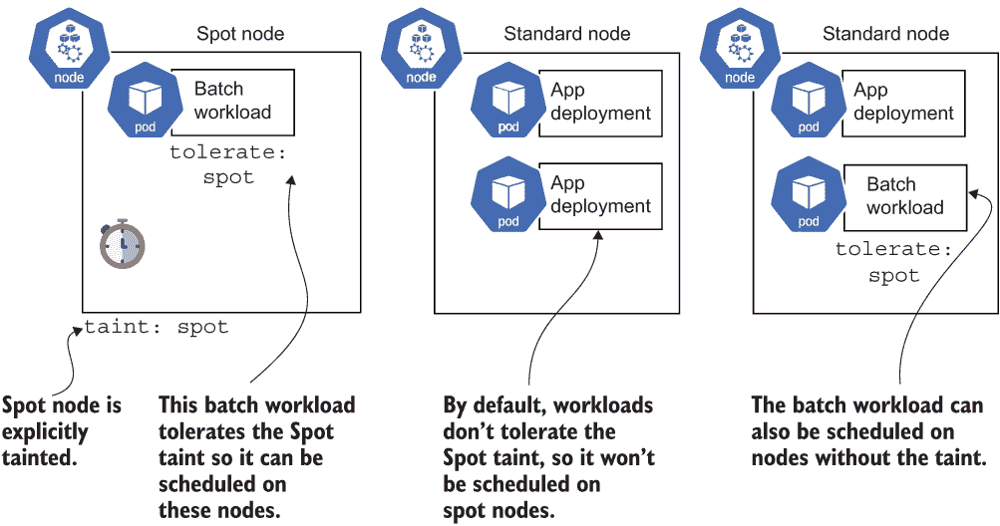
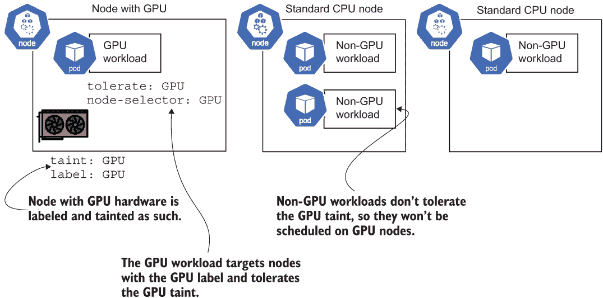
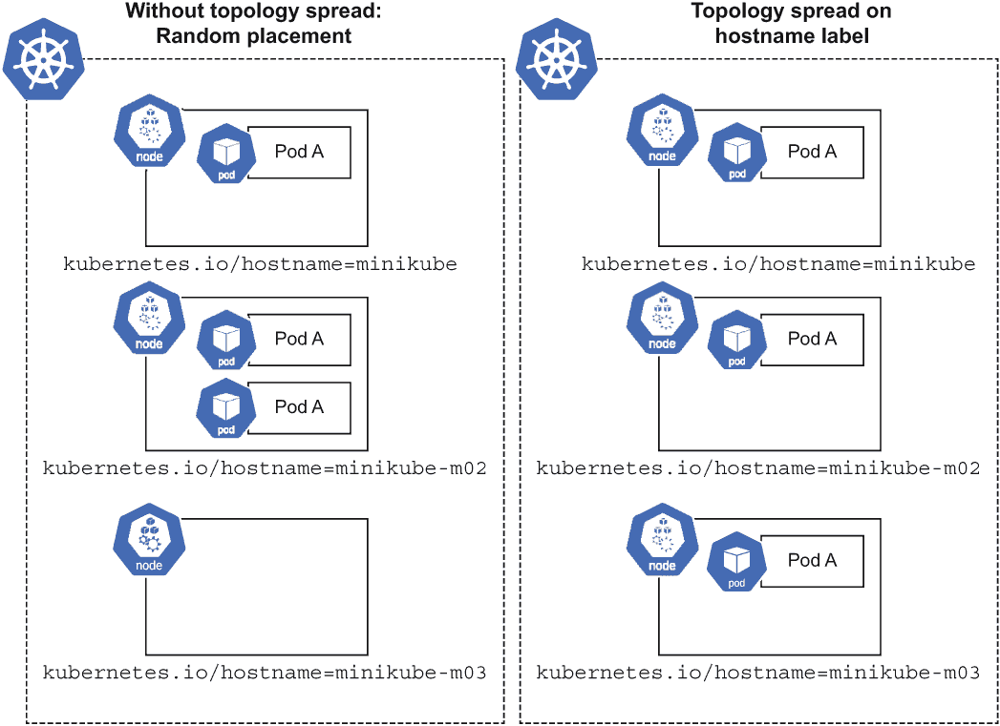
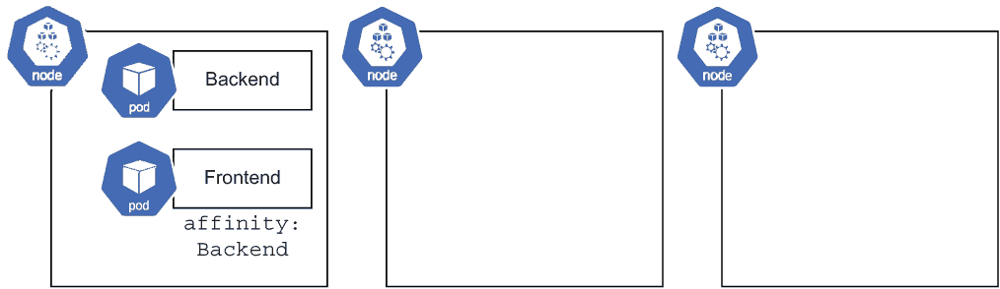

# 8 节点特征选择

本章涵盖

+   选择具有特定硬件属性的节点

+   使用污点（taints）和容忍（tolerations）来管理具有特殊硬件的节点上的调度行为

+   在离散节点上保持工作负载分离

+   使用高可用性部署策略避免单点故障

+   在节点上将一些 Pod 分组在一起，同时避免包含特定其他 Pod 的节点

到目前为止，本书将集群中的计算节点——负责实际运行您的容器的机器——视为平等。不同的 Pod 可能需要更多或更少的 CPU，但它们都在底层相同类型的节点上运行。

云计算的一个基本属性是，即使您在使用一个抽象平台，该平台为您处理许多底层计算预留（如 Kubernetes 平台所能做到的），您仍然可能在一定程度上关心实际运行您工作负载的服务器。无服务器是一个很好的概念，但最终，工作负载是在计算机上运行的，您并不总是能摆脱该机器的特性，也不总是想这么做。

这就是节点特征选择发挥作用的地方。在托管平台上，包括 Google Kubernetes Engine (GKE)，节点有各种各样的不同硬件和配置选项。节点的 CPU 可以是 x86 架构或 Arm。它可能是 AMD 或 Intel。如果需要，节点可以连接昂贵的硬件，如 GPU，或者可以在低价的 Spot 预留模式下运行，在节省资金的同时承担中断的风险。您可能并不总是需要关心这些元素，但它们可能很有用，比如使用 Spot 节省资金，或者当您需要 GPU 来运行 AI/ML 工作负载时至关重要。

另一个需要注意的方面是，Kubernetes 在同一节点上运行多个 Pod，这是一种称为装箱的技术。在同一硬件上运行多个容器可以帮助您节省资金，并且对于需要临时使用其他 Pod 的预留容量的突发情况特别有用。装箱的缺点是存在单点故障的可能性。幸运的是，Kubernetes 内置了一种称为 *pod spread topology* 的方法，以避免同一节点上相同 Pod 的副本集中。在本章中，您将学习如何根据节点的特征选择节点，将 Pod 分组在一起，并将它们分散开来。

## 8.1 节点特征选择

并非所有计算节点都是相同的。您可能有一些需要额外硬件的工作负载，例如更高性能的 CPU 和 GPU，或者运行在 Spot 预留模型中的属性。一些节点运行 Linux，而其他节点运行 Windows。一些 CPU 使用 x86 架构；其他使用 Arm 等等。就像过去我们可能会将工作负载放置在具有特定功能的机器上一样，我们可以在 Kubernetes 中通过节点选择和亲和性做到这一点。

### 8.1.1 节点选择器

在 Kubernetes 中，节点功能通过节点标签来区分。您从 Pod 中选择特定节点功能的方式是通过节点选择或节点亲和性。节点选择和亲和性只是表达所需节点标签（因此是功能）的 Pod 所需节点的方式。

以一个需要运行在基于 Arm 的节点上的 Pod 为例。基于 Arm 的节点被标记为众所周知的标签`kubernetes.io/arch:` `arm64`（众所周知的标签是在开源中定义的，旨在在不同提供商之间保持一致性）。我们可以使用节点选择器或节点亲和性来定位该标签，并确保我们的 Pod 只运行在基于 Arm 的节点上。在下面的列表中，工作负载选择`arm64`架构以防止 Pod 被调度到任何其他类型的 CPU 架构。

列表 8.1 第八章/8.1.1_ 节点选择/deploy_nodeselector.yaml

```
apiVersion: apps/v1
kind: Deployment
metadata:
  name: timeserver
spec:
  replicas: 1
  selector:
    matchLabels:
      pod: timeserver-pod
  template:
    metadata:
      labels:
        pod: timeserver-pod
    spec:
 nodeSelector: ❶
 kubernetes.io/arch: arm64 ❶
      containers:
      - name: timeserver-container
        image: docker.io/wdenniss/timeserver:5
```

❶ 选择具有 arm64 架构的节点

通过节点亲和性以更详细的方式表达相同的要求。

列表 8.2 第八章/8.1.1_ 节点选择/deploy_nodeaffinity.yaml

```
apiVersion: apps/v1
kind: Deployment
metadata:
  name: timeserver
spec:
  replicas: 1
  selector:
    matchLabels:
      pod: timeserver-pod
  template:
    metadata:
      labels:
        pod: timeserver-pod
    spec:
 affinity: ❶
 nodeAffinity: ❶
 requiredDuringSchedulingIgnoredDuringExecution: ❶
 nodeSelectorTerms: ❶
 - matchExpressions: ❶
 - key: kubernetes.io/arch ❶
 operator: In ❶
 values: ❶
 - arm64 ❶
      containers:
      - name: timeserver-container
        image: docker.io/wdenniss/timeserver:5
```

❶ 另一种选择具有 arm64 架构的节点的方法

这两个之前的部署配置将实现完全相同的结果：仅将 Pod 放置在基于 Arm 的节点上（要验证 Pod 的放置位置，可以使用`kubectl get pods -o wide`查询，然后使用`kubectl describe node $NODE_NAME | grep arch`检查节点）。节点亲和性方法的优点，以及您会使用它的原因，是它允许表达更复杂的逻辑，我将在下一节中详细介绍。

在您的 PodSpecs 中要求这些与功能相关的节点标签是第一步，但您需要一种方法来实际部署具有该功能的节点（即，拥有您所选择的标签）。始终如一，节点的提供及其相关功能是在平台级别完成的。如果您正在使用完全管理的平台，如 Autopilot 模式下的 GKE，只需指定带有功能标签的节点选择器就足够了，以获取具有那些功能的节点，前提是平台提供了该功能。在更传统的 Kubernetes 平台上，您需要独立提供具有那些功能的节点，例如，通过创建具有所需属性的节点池或节点组。

要找出支持哪些功能，提供商的文档是最好的。然而，如果您在集群中有一个具有所需属性的节点，您也可以检查它并查看可用的标签：

```
kubectl describe nodes
```

这里是 GKE 上运行的一个基于 Arm 的节点的一些标签输出示例：

```
Labels:             cloud.google.com/compute-class=Scale-Out
                    cloud.google.com/gke-boot-disk=pd-standard
                    cloud.google.com/gke-container-runtime=containerd
                    cloud.google.com/gke-image-streaming=true
                    cloud.google.com/gke-max-pods-per-node=32
                    cloud.google.com/gke-nodepool=nap-19wjaxds
                    cloud.google.com/gke-os-distribution=cos
                    cloud.google.com/machine-family=t2a
 kubernetes.io/arch=arm64          ❶
                    kubernetes.io/hostname=gk3-autopilot-cluster-4-nap-19wja
                    kubernetes.io/os=linux
                    node.kubernetes.io/instance-type=t2a-standard-4
                    node.kubernetes.io/masq-agent-ds-ready=true
                    topology.gke.io/zone=us-central1-f
                    topology.kubernetes.io/region=us-central1
                    topology.kubernetes.io/zone=us-central1-f
```

❶ 列表 8.1 和 8.2 中引用的节点标签

### 8.1.2 节点亲和性和反亲和性

节点亲和性非常灵活，可以做到比要求一组标签更多的事情。例如，使用`In`运算符，你可以指定一个可能的值列表。假设你想要选择 x86 或 Arm 作为架构；你可以通过节点亲和性提供可能的值列表来实现，如下所示。

列表 8.3 Chapter08/8.1.2_NodeAffinity/deploy_nodeaffinity_multi.yaml

```
apiVersion: apps/v1
kind: Deployment
metadata:
  name: timeserver
spec:
  replicas: 6
  selector:
    matchLabels:
      pod: timeserver-pod
  template:
    metadata:
      labels:
        pod: timeserver-pod
    spec:
 affinity: ❶
 nodeAffinity: ❶
 requiredDuringSchedulingIgnoredDuringExecution: ❶
 nodeSelectorTerms: ❶
 - matchExpressions: ❶
 - key: kubernetes.io/arch ❶
 operator: In ❶
 values: ❶
 - arm64 ❶
 - amd64 ❶
      containers:
      - name: timeserver-container
        image: docker.io/wdenniss/timeserver:5
          resources:
            requests:
              cpu: 500m
```

❶ 此 Pod 可以在 arm64（Arm）或 amd64（x86）架构上运行。

虽然在列表 8.1 中使用的`nodeSelector`字段可以在多个条件下进行选择，但所有条件都必须满足，Pod 才能被调度。这里使用的`In`逻辑允许在不同的值上进行调度，这是节点亲和性的独特之处。你可以在`matchExpressions`下添加额外的表达式来要求多个条件满足。

使用`operator`逻辑，可以通过`NotIn`将表达式转换为反亲和性（即避免具有给定标签的节点），这将确保 Pod 不会落在具有指定标签的节点上（见表 8.1）。

表 8.1 操作符逻辑

| 操作符 | 描述 |
| --- | --- |
| `In` | 节点标签的值是给定选项之一。 |
| `NotIn` | 给定的值不在你提供的列表中。 |
| `Exists` | 节点上存在标签键（任何值）。 |
| `DoesNotExist` | 节点上不存在标签键。 |
| `Gt` | 给定的值大于节点标签中的值。 |
| `Lt` | 给定的值小于节点标签中的值。 |

节点亲和性的另一个好处是，你可以创建*偏好*而不是*必需*的规则来表示一组偏好。例如，如果你的容器是多架构的，可以在 x86 或 Arm 上运行，但你更喜欢尽可能使用 Arm（例如，出于成本原因），那么你可以在以下列表中表达这一点。

列表 8.4 Chapter08/8.1.2_NodeAffinity/deploy_nodeaffinity_preferred.yaml

```
apiVersion: apps/v1
kind: Deployment
metadata:
  name: timeserver
spec:
  replicas: 6
  selector:
    matchLabels:
      pod: timeserver-pod
  template:
    metadata:
      labels:
        pod: timeserver-pod
    spec:
 affinity: ❶
 nodeAffinity: ❶
 preferredDuringSchedulingIgnoredDuringExecution: ❶
 - weight: 100 ❶
 preference: ❶
 matchExpressions: ❶
 - key: kubernetes.io/arch ❶
 operator: In ❶
 values: ❶
 - arm64 ❶
      containers:
      - name: timeserver-container
        image: docker.io/wdenniss/timeserver:5
        resources:
          requests:
            cpu: 500m
```

❶ 偏好调度在 arm64 上，但如果 arm64 不可用，则会在任何节点上调度。

偏好亲和性的注意事项

这种`preferredDuringSchedulingIgnoredDuringExecution`逻辑有时可能会产生令人惊讶的结果。当你在节点上有现有的未分配容量时，偏好排序是有效的，但当没有未分配的偏好类型容量且需要新节点时，它与集群自动扩展的交互可能与你所期望的相反。例如，如果你的集群中现有的节点上有任何未分配的容量，即使是不偏好的类型，Kubernetes 实际上会首先在那里调度 Pod，然后平台才会启动以添加你偏好的类型的节点。

原因在于，Kubernetes 调度器，负责将 Pod 放置在节点上，以及平台自动扩展器（一个常见的平台组件，负责添加新节点），它们在某种程度上是独立操作的。在平台层面，一个典型的节点自动扩展器会寻找可以调度的挂起 Pod，如果增加了更多容量。但由于 Kubernetes 调度器首先启动并将 Pod 放置在不太受欢迎但可用的容量上，自动扩展器就没有机会进行操作了。

当使用云提供商时，你通常只需要求你需要的功能，并依赖他们将有能力满足这些需求的事实。

### 8.1.3 通过污点化节点来防止默认调度

通常，当你有一组具有特殊特征的节点，你可能希望默认防止 Pod 被调度到这些节点上。以 Arm 架构为例：由于并非所有容器镜像都支持它，你可能想配置你的集群，以便 Arm 架构的节点默认不用于调度，除非工作负载明确表示支持。其他例子包括当你有一个具有特殊硬件（如 GPU）的节点，你需要只为将使用此硬件的 Pod 保留时，或者当你有可以突然关闭的 Spot 计算时，并非所有工作负载都可能对此做出良好响应。

当你*可以*通过节点反亲和性（即使用`NotIn`操作符的节点亲和性规则）注释每个 Pod 来避免这些节点，这确实很费时。相反，Kubernetes 允许你“污点化”一个节点，以防止 Pod 默认被调度到它上面。其工作原理是这样的：你污点化具有特殊特征且不应默认被调度的节点。然后，你“容忍”这个污点，仅针对那些可以在这些节点上运行的工作负载的 PodSpec。

以为例，我们可以单独污点化节点以观察其效果。在生产环境中你通常不会这样做，但这是一种不错的实验方法。对于这个演示，我们可以使用 Minikube（在第三章中介绍）并按照以下方式污点化一个节点：

```
$ minikube start --nodes 3
Done! kubectl is now configured to use "minikube" cluster

$ kubectl get nodes
NAME           STATUS     ROLES           AGE   VERSION
minikube       Ready      control-plane   77s   v1.24.3
minikube-m02   Ready      <none>          55s   v1.24.3
minikube-m03   NotReady   <none>          19s   v1.24.3

$ NODE_NAME=minikube-m02
$ kubectl taint nodes $NODE_NAME spot=true:NoSchedule
node/minikube-m02 tainted
```

TIP 如果稍后你想移除污点，可以使用`kubectl taint nodes $NODE_NAME spot-`

在这个例子中，`spot=true`是我们为污点赋予的名称，并在稍后标记 Pod 为能够容忍这个污点时使用。`NoSchedule`关键字表示这个污点效果期望的行为（即没有容忍的 Pod 不应被调度）。有其他替代的`NoSchedule`行为，但我不建议使用它们。`PreferNoSchedule`是一个创建软规则的选项，听起来可能很有用；然而，如果你的主要目标是避免在节点类别上调度 Pod，软规则无法实现这一点，并且可能会使调试更困难。有时，有一个需要分配资源的未调度 Pod 比在特殊污点机器上调度它并引起其他未指定的问题要好。

当你在托管 Kubernetes 平台上操作时，你不太可能像上一个例子那样单独标记节点。通常，污点适用于具有相同特征的一组节点，节点在升级或维修事件期间会定期更换，这意味着任何单个节点的污点标记都会被撤销。寻找平台提供商的 API，该 API 允许你标记节点组，以便污点将应用于组中的所有节点，并在升级期间持续存在。

GKE 中的节点污点

当使用 GKE 的 Autopilot 模式时，节点污点完全是自动的。当你选择特定的（非默认）功能，如 Spot 计算或 Arm 架构时，配置的节点会自动标记污点。方便的是，Pod 也会修改以容忍自动污点，所以你只需要选择功能即可。这种 Pod 的自动修改是通过一个准入控制器（在第十二章中介绍）完成的，该控制器由平台安装和维护。

当使用 GKE 与节点池时，你可以在创建节点池时标记节点池。例如，如果你正在创建一个由虚拟机组成的节点池，你可以配置所有节点如下进行污点标记：

```
gcloud container node-pools create $NODE_POOL_NAME --cluster $CLUSTER_NAME \
  --spot --node-taints spot=true:NoSchedule
```

如果你的整个集群都由 Spot 节点组成，通常不需要污点，因为没有必要区分节点。

一旦你标记了节点，如果你调度一个工作负载，你会注意到它不会被调度到这些节点上（使用`kubectl` `get` `pods` `-o` `wide`来查看 Pod 落在哪个节点上）。为了使工作负载可以在你刚刚标记的节点上调度，工作负载需要更新以容忍污点，如下所示。

列表 8.5 第八章/8.1.3_Taints/deploy_tolerate_spot.yaml

```
apiVersion: apps/v1
kind: Deployment
metadata:
  name: timeserver
spec:
  replicas: 3
  selector:
    matchLabels:
      pod: timeserver-pod
  template:
    metadata:
      labels:
        pod: timeserver-pod
    spec:
 tolerations: ❶
 - key: spot ❶
 value: "true" ❶
      containers:
      - name: timeserver-container
        image: docker.io/wdenniss/timeserver:5
```

❶ 此工作负载可以容忍具有 spot=true 污点的节点，因此可能被调度到这些节点上。

单独的容忍并不会强制 Pod 只被调度到污点节点上；它仅仅*允许*它在那里被调度。Pod 将被调度到哪个节点将由几个其他因素决定，如可用容量。因此，具有容忍的 Pod 可以落在无污点节点上，也可以落在它们可以容忍污点的节点上，如图 8.1 所示。



图 8.1 此集群有一个低可用性的 Spot 虚拟机和两个标准节点。批处理工作负载 Pod 可以容忍污点，因此可以调度到这两个节点上，而应用部署 Pod 则不行，所以它们只能调度到无污点节点上。

通常，你会将污点和容忍与节点选择器或节点亲和力结合使用，以确保特定的 Pod 集，并且只有这个 Pod 集，将在相关的节点上运行。一个很好的例子是 GPU 工作负载：这些工作负载必须只在具有 GPU 的节点上运行，你不想非 GPU 工作负载占用那个宝贵空间（图 8.2）。



图 8.2 这个集群有一个特殊的节点带有 GPU 和两个标准节点。GPU 节点被标记为污点，以防止标准工作负载被调度到它上面。GPU 工作负载容忍污点，因此可以调度到 GPU 节点，并使用节点选择器来确保它只在这个节点上调度。

容忍所有污点

一些工作负载——最常见的是作为 DaemonSet（在第十二章中介绍）部署的工作负载——需要在每个节点上运行，并且必须设计为处理集群的所有配置。这些工作负载通常容忍所有污点，如下面的列表所示。

列表 8.6 第八章/8.1.3_ 污点/daemonset_tolerate_all_taints.yaml

```
apiVersion: apps/v1
kind: DaemonSet
metadata:
  name: example-ds
spec:
  selector:
    matchLabels:
      pod: example-pod
  template:
    metadata:
      labels:
        pod: example-pod
    spec:
 tolerations: ❶
 - effect: NoExecute ❶
 operator: Exists ❶
 - effect: NoSchedule ❶
 operator: Exists ❶
      containers:
      - image: ubuntu
        command: ["sleep", "infinity"]
        name: ubuntu-container
```

❶ 容忍所有污点

只要注意，当你这样做时，你的 Pod 实际上需要在集群现在和未来可能存在的所有节点类型上运行。当添加像基于 Arm 的节点这样的功能时，这可能会成为问题，因为需要为 Arm 架构特别构建容器。如果出现需要将 Pod 调度到所有节点上，无论是否有污点，*除了*具有特定标签（如 Arm 架构）的污点的情况，你可以通过将容忍度与节点反亲和性规则相结合来实现，如下一个列表所示。

列表 8.7 第八章/8.1.3_ 污点/daemonset_tolerate_antiaffinity.yaml

```
apiVersion: apps/v1
kind: DaemonSet
metadata:
  name: example-ds
spec:
  selector:
    matchLabels:
      pod: example-pod
  template:
    metadata:
      labels:
        pod: example-pod
    spec:
      tolerations:                                          ❶
      - effect: NoExecute                                   ❶
        operator: Exists                                    ❶
      - effect: NoSchedule                                  ❶
        operator: Exists                                    ❶
 affinity: ❷
 nodeAffinity: ❷
 requiredDuringSchedulingIgnoredDuringExecution: ❷
 nodeSelectorTerms: ❷
 - matchExpressions: ❷
 - key: kubernetes.io/arch ❷
 operator: NotIn ❷
 values: ❷
 - arm64 ❷
      containers:
      - image: ubuntu
        command: ["sleep", "infinity"]
        name: ubuntu-container
```

❶ 容忍所有污点...

❷ ...但不要在基于 Arm 的节点上调度

### 8.1.4 工作负载分离

污点、容忍度和节点选择器的另一个用途是分离工作负载。到目前为止，我们介绍的节点选择用例都是围绕基于特性的选择——需要 Arm 架构、Spot 计算、GPU 节点等。

节点选择不仅限于节点特性，还可以用于在节点上分离工作负载。虽然你可以使用 Pod 反亲和性（在第 8.2.3 节中介绍）来防止特定的 Pod 被放置在同一位置，但有时仅仅将工作负载保持在它们各自专门的节点组上是有帮助的。

我多次听到的这个要求来自运行批处理工作负载的人，这些工作负载由协调器 Pod（调度工作）和工作 Pod（执行工作）组成。他们更喜欢将这两个角色的 Pod 分别放在它们自己的节点上，这样任何针对工作 Pod 的节点自动扩展，这些 Pod 往往来去不定，就不会影响协调器 Pod 的扩展，这些 Pod 往往相对稳定。另一个例子是嘈杂邻居问题，其中两个 Pod 可能会在节点上竞争资源，如果分离的话会工作得更好。

要实现工作负载分离，我们可以结合迄今为止使用的一些技术，以及自定义节点标签。节点获得一个标签和一个污点，而工作负载则获得对该标签的容忍度和选择器，这共同意味着工作负载将独立地（可能与其他具有相同选择器和容忍度的工作负载共享）在节点组上调度。

下面的列表提供了一个具有任意容忍和节点选择器的示例部署，以实现工作负载分离。为了方便，我们将使用相同的键/值对（`"group=1"`）来表示这两个元素，尽管请注意，它们在 Kubernetes 中是不同的概念。

列表 8.8 Chapter08/8.1.4_WorkloadSeparation/deploy_group1.yaml

```
apiVersion: apps/v1
kind: Deployment
metadata:
  name: timeserver1
spec:
  replicas: 5
  selector:
    matchLabels:
      pod: timeserver1-pod
  template:
    metadata:
      labels:
        pod: timeserver1-pod
    spec:
 tolerations: ❶
 - key: group ❶
 operator: Equal ❶
 value: "1" ❶
 effect: NoSchedule ❶
 nodeSelector:     ❷
 group: "1" ❷
      containers:
      - name: timeserver-container
        image: docker.io/wdenniss/timeserver:5
```

❶ 容忍 group=1 污点

❷ 选择 group=1 标签

此外，为了演示，我们可以在文件 deploy_group2.yaml 中复制这个部署，使用 `"group=2"` 作为容忍和选择器的键/值：

```
      tolerations:
      - key: group           ❶
        operator: Equal      ❶
        value: "2"           ❶
        effect: NoSchedule   ❶
      nodeSelector:          ❷
        group: "2"           ❷
```

❶ 容忍 group=2 污点

❷ 选择 group=2 标签

要将这些部署的 Pods 部署在离散的节点集上，我们需要有被污点化的节点来防止其他 Pods 落在这些节点上，并且被标记以便我们的工作负载可以针对它们。如果您跳过标记节点，这些部署将永远不会被调度，因为没有节点满足节点选择器要求。如果您标记了节点但没有污点化它们，这些工作负载将可以调度并且通过节点选择器彼此分离。然而，由于没有污点来阻止它们，其他随机的 Pods 也可能落在它们上面。

在 GKE Autopilot 上的工作负载分离

如果您在 GKE 的自动驾驶模式下部署先前的工作负载，将自动配置具有所需标签和污点的节点！这是因为这个无节点操作平台正在根据您的 Pod 要求进行操作，并提供匹配的节点，所以您不需要做任何事情。在一个传统的 Kubernetes 平台上，您需要自己创建具有这些属性的节点。

在您管理的 Kubernetes 环境中，您需要提供具有正确污点和标签的节点以实现工作负载分离。使用 Minikube 进行演示，我们可以直接污点并标记节点。请注意，在托管平台上，您通常在节点池或组级别操作节点，并使用平台 API 提供节点，因此请在该 API 中查找标签和污点参数：

```
$ minikube start --nodes 3                               ❶

$ kubectl get nodes                                      ❷
NAME           STATUS   ROLES           AGE   VERSION
minikube       Ready    control-plane   67s   v1.24.3
minikube-m02   Ready    <none>          46s   v1.24.3
minikube-m03   Ready    <none>          24s   v1.24.3
$ kubectl taint nodes minikube-m02 group=1:NoSchedule    ❸
$ kubectl label node minikube-m02 group=1                ❸

$ kubectl taint nodes minikube-m03 group=2:NoSchedule    ❹
$ kubectl label node minikube-m03 group=2                ❹
```

❶ 创建一个新的 Minikube 集群。

❷ 查看节点。

❸ 为 group 1 污点并标记 m02 节点。

❹ 为 group 2 污点并标记 m03 节点。

污点（以及匹配的容忍和节点选择器）都是必需的（因为它们服务于不同的目的）。污点阻止除了可以容忍污点的工作负载之外的所有工作负载落在其上，而标签可以用来确保工作负载不会落在任何其他节点上（例如，没有任何污点的节点）。为了方便，我使用了相同的键/值对（`"group=1"`）来表示污点和标签，但这并不一定必须如此。

在配置好我们的集群后，我们可以部署我们的工作负载分离部署并查看结果。特别注意 Pods 落在哪个节点上：

```
$ kubectl create -f Chapter08/8.1.4_WorkloadSeparation
deployment.apps/timeserver1 created
deployment.apps/timeserver2 created

$ kubectl get pods -o wide
NAME                          READY  STATUS   RESTARTS  AGE   NODE
timeserver1-75b69b5795-9n7ds  1/1    Running  0         2m2s  minikube-m02 ❶
timeserver1-75b69b5795-kft64  1/1    Running  0         2m2s  minikube-m02 ❶
timeserver1-75b69b5795-mnc4j  1/1    Running  0         2m2s  minikube-m02 ❶
timeserver1-75b69b5795-msg9v  1/1    Running  0         2m2s  minikube-m02 ❶
timeserver1-75b69b5795-r8r9t  1/1    Running  0         2m2s  minikube-m02 ❶
timeserver2-6cbf875b6b-6wm7w  1/1    Running  0         2m2s  minikube-m03 ❷
timeserver2-6cbf875b6b-dtnhm  1/1    Running  0         2m2s  minikube-m03 ❷
timeserver2-6cbf875b6b-fd6vh  1/1    Running  0         2m2s  minikube-m03 ❷
timeserver2-6cbf875b6b-q6fk8  1/1    Running  0         2m2s  minikube-m03 ❷
timeserver2-6cbf875b6b-zvk72  1/1    Running  0         2m2s  minikube-m03 ❷
```

❶ timeserver1 的 Pods 正在 minikube-m02 节点上运行

❷ timeserver2 的 Pods 正在 minikube-m03 节点上运行

一旦你完成了 minikube 集群，你可以删除它的所有痕迹：

```
minikube delete
```

## 8.2 放置 Pod

在一个 Pod 失败健康检查或出现内存泄漏并需要重启的情况下，拥有多个 Pod 副本是一种良好的实践。除了副本数量如何影响可用性（在第 5.2.4 节中讨论）之外，考虑*在哪里*放置这些 Pod 也很重要。

如果你有一个 Pod 的 10 个副本，但它们都在单个节点上，你将受到该节点故障的影响。扩展到典型的云拓扑，如果你的所有*节点*都在单个可用区中，你将面临区域故障的风险。你应该花费多少时间和金钱来防范这些条件，这是一个你需要根据自己的生产保证和预算来做出的选择，因为天空才是极限（例如，你是否采用多云？）。

我将专注于一些合理且经济的策略，以在已有的节点上分散你的 Pod。你可以不额外付费就做到这一点，并且这会给你带来一些额外的可用性。

### 8.2.1 构建高可用部署

到目前为止，我们已经了解了如何使用资源请求将 Pod 分配给节点。然而，还有其他维度需要考虑。为了使你的应用程序具有高可用性，理想的情况是副本不会都落在同一个节点上。比如说，你有一个小的 Pod（100 mCPU，100 MiB）和三个副本。这三个副本可以很容易地都放在同一个节点上。但是，如果那个节点发生故障，部署就会离线。

最好的做法是将调度器将这些 Pod 分散到你的集群中！幸运的是，Kubernetes 有一个内置的方式来实现这一点，称为*拓扑分布约束*（图 8.3）。拓扑分布约束旨在将你的节点分散到故障域中，例如节点或整个区域；可以指定多个约束，这样你就可以在节点和区域或任何其他由你的提供商定义的故障域中分散。



图 8.3 带和不带拓扑约束的单个工作负载的 Pod 放置

nOTE 许多 Kubernetes 提供商为工作负载部署提供一些默认拓扑分布，包括 GKE。如果你信任默认设置在大多数情况下做正确的事情，你可以自由跳过本节。无论如何，我都包括了这个信息，因为我认为了解为什么事情会这样工作是有帮助的，所以我认为了解 Pod 为什么会在节点之间分散是很重要的。也有可能使用本章中的技术来修改默认策略，例如，对关键任务部署施加更严格的限制，并将拓扑分布应用于默认不获得它们的对象，如作业（在第十章中介绍）。

要覆盖特定工作负载的分布拓扑，你可以添加`topologySpreadConstraints`键，就像我在以下列表中所做的那样。

列表 8.9 第八章/8.2.1_TopologySpread/deploy_topology.yaml

```
apiVersion: apps/v1
kind: Deployment
metadata:
  name: timeserver
spec:
  replicas: 3
  selector:
    matchLabels:
      pod: timeserver-pod
  template:
    metadata:
      labels:
        pod: timeserver-pod
    spec:
 topologySpreadConstraints:            ❶
 - maxSkew: 1                          ❷
 topologyKey: kubernetes.io/hostname ❸
 whenUnsatisfiable: ScheduleAnyway ❹
 labelSelector:             ❺
 matchLabels:             ❺
 pod: timeserver-pod             ❺
      containers:
      - name: timeserver-container
        image: docker.io/wdenniss/timeserver:5
        resources:
          requests:
            cpu: 200m
            memory: 250Mi
```

❶ 添加的拓扑约束

❷ 复制副本最大不平衡数

❸ 用于拓扑的节点标签

❹ 当无法满足拓扑要求时的行为

❺ 另一个标签选择器设置为该模板的元数据标签

在此示例中，我们使用`topologyKey`参数针对`kubernetes.io/hostname`拓扑，这意味着 Kubernetes 将考虑所有具有相同`kubernetes.io/hostname`键值的标签节点视为相等。由于没有两个节点应该具有相同的主机名，这导致了一个节点级别的扩展目标。

为了使此配置生效——我必须强调这一点——您必须确保您的集群中的节点实际上具有在`topologyKey`中指定的标签（在我的例子中是`kubernetes.io/hostname`）。有一些众所周知的标签，¹就像我这里使用的那样，但无法保证您的 Kubernetes 平台会使用它们。因此，通过运行`kubectl` `describe` `node`并查看您的节点具有的标签来验证。

在示例中查看其余的设置，我使用了`maxSkew`为`1`的最小偏斜。因此，最多只能有一级不平衡，这意味着任何节点最多只能比其他节点多一个 Pod。

`whenUnsatisfiable`参数控制当约束无法满足时（例如，节点完全被其他 Pod 填满）会发生什么。选项有`ScheduleAnyway`和`DoNotSchedule`，其行为是显而易见的。`DoNotSchedule`在测试时很有用，因为它使得更容易看到规则何时生效，但在生产环境中，`ScheduleAnyway`将更安全。虽然`ScheduleAnyway`使规则成为一个“软”规则，但 Kubernetes 仍会尽力满足您的需求，我认为这比完全未安排副本要好，尤其是当我们的目标是提高副本的高可用性时！

最后一个字段是一个带有子`matchLabels`组的`labelSelector`，您可能还记得第三章的内容。Kubernetes 在这里没有简单的自引用功能确实令人沮丧；也就是说，为什么您需要这个，因为它已经嵌入在 Pod 的规范中？无论如何，`matchLabels`应该与您在 Deployment 中已经指定的内容相同。

在此基础上，让我们继续部署此示例并验证结果放置是否符合预期。为了演示这一点，我们需要一个包含几个节点的集群和一个没有任何默认扩展行为的集群。GKE 自带默认节点和区域扩展，因此在该平台上此设置不是必需的；了解幕后发生的事情或如果您需要微调行为，这仍然是有益的。为了尝试此操作并查看不同拓扑之间的差异，我建议使用配置了三个节点的 Minikube：

```
minikube start --nodes 3
cd Chapter08/8.2.1_TopologySpread 
kubectl create -f deploy_topology.yaml
kubectl get pods -o wide
```

查看图 8.4 中的`NODE`列，您应该看到三个单独的节点（假设您的集群中有三个节点）。


图 8.4：使用`topologySpreadConstraints`的部署，框内显示了唯一节点

nOTE 拓扑扩展是在调度时间的一个约束；换句话说，它只在 Pod 放置到节点上时考虑。一旦所有副本都在运行，如果拓扑发生变化（例如，添加了一个节点），正在运行的 Pod 不会被移动。如果需要，你可以通过将更改部署进行滚动更新来重新部署 Pod，这将再次应用调度规则，因此任何拓扑变化都会被考虑。

从图 8.4 的输出中我们可以看到，我们的三个 Pod 分别被调度在不同的节点上。为了比较，部署相同的部署但不包含`topologySpreadConstraints`字段，你会注意到 Pod 可以聚集在同一个节点上。如果你观察到即使没有设置拓扑，Pod 也会分散，那么这很可能是由于集群默认设置。

`topologySpreadConstraints`字段可以与任何节点标签一起使用，因此另一种常见策略是在区域（如果你有一个多区域集群）之间进行扩展。为此，你可以重复之前的例子，但使用基于区域的键，其中`topology.kubernetes.io/zone`是标准化且广为人知的键。但再次提醒，请检查你的节点实际上是否有这个标签；否则，它将没有任何效果，或者根据你如何配置`whenUnsatisfiable`字段，它可能会阻止整个调度。

### 8.2.2 将相互依赖的 Pod 进行协同定位

在某些情况下，你可能会有紧密耦合的 Pod，你希望它们存在于同一台物理机器上（图 8.5）。特别“健谈”的服务（即，它们进行很多跨服务过程调用）通常是这种类型架构的候选者。比如说，你有一个前端和一个后端，它们之间有很多通信。你可能希望将它们配对在同一个节点上，以减少网络延迟和流量。



图 8.5：在同一个节点上调度了与后端 Pod 相同的三个前端 Pod，使用 Pod 亲和性

这种部署结构可以通过 Pod 亲和性规则实现。本质上，其中一个部署——使用之前的例子，可能是前端——获得一个规则告诉调度器，“只将这个 Pod 放置在具有后端 Pod 的节点上。”让我们假设我们有一个如以下列表所示的后端部署。

列表 8.10：Chapter08/8.2.2_Colocation/backend.yaml

```
apiVersion: apps/v1
kind: Deployment
metadata:
  name: mariadb
spec:
  replicas: 1
  selector:
    matchLabels:
      pod: mariadb-pod
  template:
    metadata:
      labels:              ❶
        pod: mariadb-pod   ❶
    spec:
      containers:
      - name: mariadb-container
        image: mariadb
        env:
        - name: MARIADB_RANDOM_ROOT_PASSWORD
          value: "1"
```

❶ 将用于亲和性的标签。

这个部署没有任何特别之处；它遵循我们一直在使用的相同模式。这个 Pod 将被放置在集群中的任何可用空间上。

现在，对于前端部署，我们希望它被放置在包含后端部署 Pod 实例的节点上，我们可以使用以下列表中的配置。

列表 8.11 第八章/8.2.2_ 同地部署/frontend.yaml

```
apiVersion: apps/v1
kind: Deployment
metadata:
  name: timeserver
spec:
  replicas: 3
  selector:
    matchLabels:
      pod: timeserver-pod
  template:
    metadata:
      labels:
        pod: timeserver-pod
    spec:
      containers:
      - name: timeserver-container
        image: docker.io/wdenniss/timeserver:5
 affinity: ❶
 podAffinity: ❶
 requiredDuringSchedulingIgnoredDuringExecution: ❶
 - labelSelector: ❶
 matchExpressions:❶
 - key: pod❶
 operator: In❶
 values:❶
 - mariadb-pod❶
 topologyKey: "kubernetes.io/hostname" ❶
```

❶ Pod 亲和度规则

此规范要求调度器将此 Pod 定位到具有现有带有标签 `pod:` `mariadb-pod` 的 Pod 的指定拓扑结构中的节点。如果您在之前章节使用的相同 minikube 集群中创建这两个对象，您将注意到所有四个 Pod 都被放置在同一个节点上（即后端 Pod 被调度所在的节点）。由于示例中的拓扑结构是节点拓扑（使用主机名的已知标签），应用程序将只被调度到具有目标 Pod 的节点上。如果使用区域拓扑（使用区域已知标签，如 8.2.1 中讨论的），Pod 将被放置在具有目标标签的任何节点上。

要使这种同地部署成为一个软（或尽力）要求，以便即使无法满足要求，您的 Pod 仍然可以被调度，可以使用 `preferredDuringSchedulingIgnoredDuringExecution` 而不是 `requiredDuringSchedulingIgnoredDuringExecution`。当使用首选亲和度时，需要在规范中添加一些额外的字段，例如规则的权重（如果表达多个偏好，则用于对优先级进行排序）。

如您所见，Kubernetes 确实非常灵活，允许您创建绑定或仅作为指南的调度规则，并以无数种方式（节点和区域是两种常见选择）指定您首选的拓扑结构。事实上，这种灵活性可能会导致您在选择时感到困惑。对于大多数部署，我建议一开始**不**使用 Pod 亲和度，而是将这些技术放在您的“口袋”里，并在您需要解决特定问题时（例如，希望将 Pod 部署在单个节点上以减少服务间延迟）应用它们。

### 8.2.3 避免某些 Pod

在 8.2.1 节中，我介绍了如何使用拓扑分布将来自 **相同** 工作负载部署的 Pod 分散开来，以避免单点故障。那么对于相关（因此您希望它们分散）但分别部署（拓扑分布不适用）的 Pod 呢？例如，假设您有一个后端服务的 Deployment 和一个单独的缓存服务的 Deployment，并且您希望它们分散部署。

对于此目的，您可以使用 Pod 反亲和度。这简单地将之前章节中的 Pod 亲和度规则反转，以便 Pod 将被调度到其他节点或您选择的拓扑结构。

列表 8.12 第八章/8.2.3_Pod 反亲和度/frontend.yaml

```
apiVersion: apps/v1
kind: Deployment
metadata:
  name: timeserver
spec:
  replicas: 3
  selector:
    matchLabels:
      pod: timeserver-pod
  template:
    metadata:
      labels:
        pod: timeserver-pod
    spec:
      containers:
      - name: timeserver-container
        image: docker.io/wdenniss/timeserver:5
      affinity:
 podAntiAffinity:              ❶
          requiredDuringSchedulingIgnoredDuringExecution:
          - labelSelector:
              matchExpressions:
              - key: pod
                operator: In
                values:
                - mariadb-pod
            topologyKey: "kubernetes.io/hostname"
```

❶ 上一个示例中的 Pod 亲和度规则被反转，因此现在这个 Pod 将明确避免具有 pod: mariadb-pod 标签的 Pod 所在的节点。

所有这些结构都可以一起使用，因此你可以拥有一个广泛地试图将 Pods 分开的拓扑结构，并使用亲和规则进行精细控制。只需小心确保你的规则实际上是可以满足的；否则，你最终会得到未安排的 Pods。正如前一小节中提到的常规亲和性一样，你也可以通过指定`preferredDuringSchedulingIgnoredDuringExecution`而不是`requiredDuringSchedulingIgnoredDuringExecution`来使用软规则。当你这样做的时候，你可能想先使用规则的要求版本进行测试，以确保在切换到首选版本之前你的`labelSelector`字段设置正确。下一节将提供一些设置这些规则的调试技巧。

## 8.3 调试放置问题

Pod 放置是一个相当复杂的话题，所以如果你遇到问题不要感到惊讶。最常见的问题发生在你需要一个标签，但你的所有节点都没有，或者在无节点平台的情况下，一个平台不支持的功能的标签。这样的 Pod 永远不会被安排。以下几节将突出一些你可能遇到的一些常见问题以及如何解决它们。

### 8.3.1 放置规则似乎不起作用

如果你的放置规则在测试中似乎不起作用，我首先建议确保你没有使用任何软（首选）放置规则。这些规则意味着当规则无法满足时，调度器基本上会忽略你的规则，这对测试来说并不太好。在将它们改为软规则之前，最好验证所有规则都在正常工作。

使用只有几个节点且没有软规则的小集群，你应该能够观察到放置功能的效果。通过故意尝试安排违反规则的 Pod 来验证规则是否得到执行。它们的状态应该是`Pending`，因为约束无法满足。

### 8.3.2 Pods 处于挂起状态

处于`Pending`状态的 Pod 意味着调度器找不到它们合适的位置。在第三章中，我们讨论了在集群没有足够的资源来放置 Pod 的情况下出现的这个错误。一旦你配置了放置规则，Pod 可能无法被安排，因为规则无法满足。要找出原因（即哪个规则无法满足），*描述* Pod。请注意，你需要以 Pod 级别进行此操作——Deployment 本身不会显示任何错误消息，尽管它会指示所需的副本数量没有达到：

```
kubectl get pods
kubectl describe Pod $POD_NAME
```

以下是一个在可用的节点有一个 Pod 无法容忍的污点的情况的输出示例。要么将容忍度添加到 Pod 中，要么添加更多没有污点的节点。一些示例错误包括以下内容：

```
Events:
  Type     Reason            Age               From               Message
  ----     ------            ----              ----               -------
Warning    FailedScheduling  4s                default-scheduler  0/1 nodes are available: 1 node(s) had taints that the pod didn't tolerate.
```

这里有一些 Pod 的亲和性或反亲和性规则无法满足的情况的输出。审查并修改规则，然后再次尝试：

```
  Type     Reason            Age               From               Message
  ----     ------            ----              ----               -------
Warning    FailedScheduling  17s (x3 over 90s) default-scheduler  0/1 nodes are available: 1 node(s) didn't match pod affinity/anti-affinity, 1 node(s) didn't match pod anti-affinity rules.
```

## 摘要

+   您可以从 Pod 规范中选择或避免具有特定硬件属性的节点。

+   具有特殊特性的节点可以通过污点（taint）来防止默认调度。为在这些节点上运行的 Pod 配置容忍污点（tolerate the taint）。

+   污点、容忍、节点标签和选择器可以组合使用，以保持某些工作负载彼此分离。

+   使用多个副本和良好配置的拓扑分布策略构建高可用性部署。

+   可以通过 Pod 亲和性将相互受益的 Pod 放置在同一位置。

+   不希望与某些 Pod 共存的 Pod 可以配置 Pod 反亲和性。

* * *

^[1](https://kubernetes.io/docs/reference/kubernetes-api/labels-annotations-taints/) [`kubernetes.io/docs/reference/kubernetes-api/labels-annotations-taints/`](https://kubernetes.io/docs/reference/kubernetes-api/labels-annotations-taints/)
