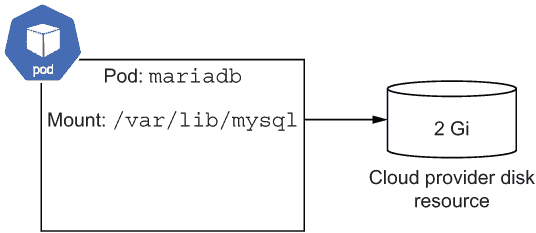
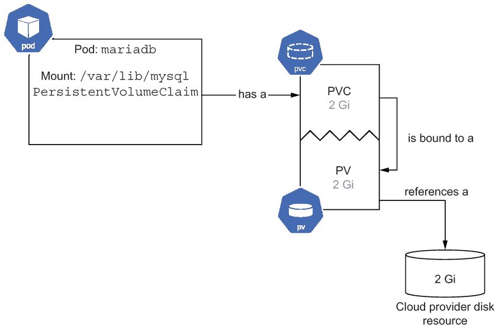
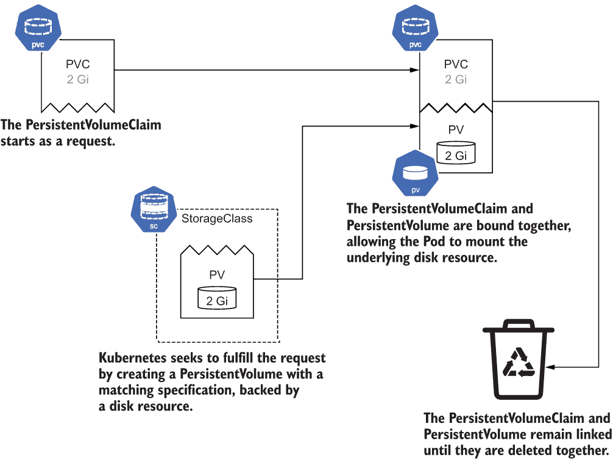
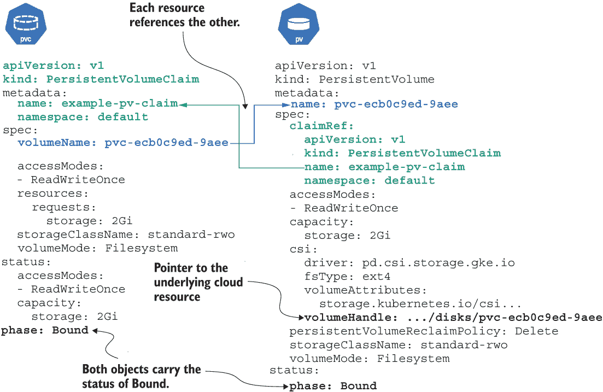
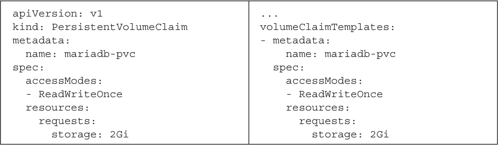
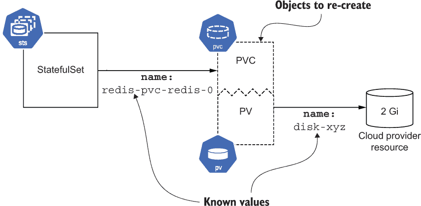
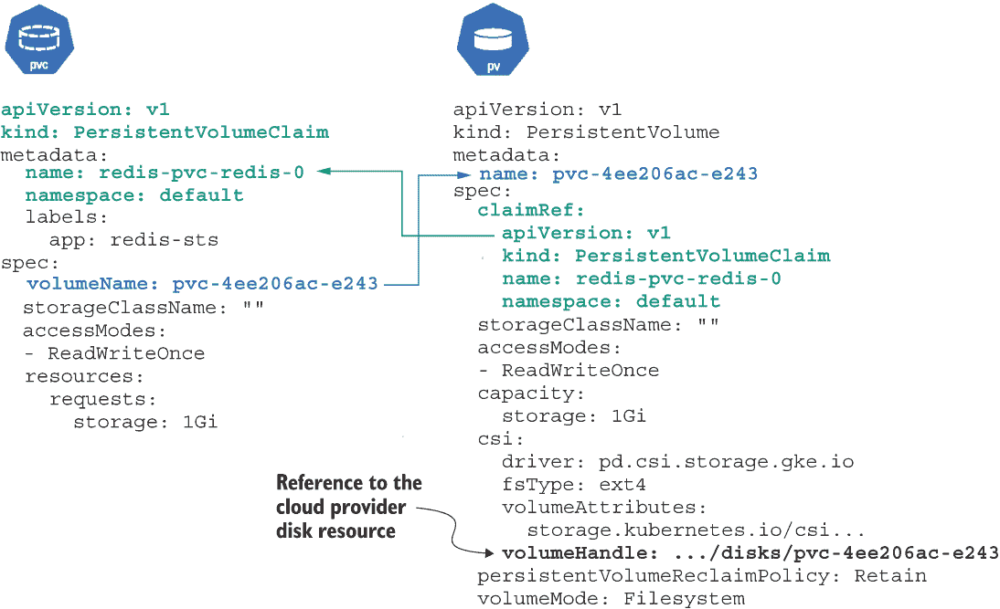

# 9 状态化应用

本章涵盖

+   Kubernetes 用于表示磁盘和状态的结构

+   将持久存储添加到 Pods

+   使用 StatefulSet 以具有领导者角色的方式部署多 Pod 状态化应用

+   通过将 Kubernetes 对象重新链接到磁盘资源来迁移和恢复数据

+   为 Pods 提供大型的临时存储卷

状态化应用（即具有附加存储的工作负载）终于在 Kubernetes 中找到了归宿。虽然无状态应用因其部署简便性和高可扩展性而常受到赞誉，这得益于无需附加和管理存储的需求，但这并不意味着状态化应用没有其位置。无论你是部署复杂的数据库还是将旧状态化应用从虚拟机（VM）迁移过来，Kubernetes 都能为你提供支持。

使用持久卷，您可以将状态化存储附加到任何 Kubernetes Pod。当涉及到具有状态的多副本工作负载时，正如 Kubernetes 提供了 Deployment 作为管理无状态应用的高级结构一样，StatefulSet 存在就是为了提供状态化应用的高级管理。

## 9.1 卷、持久卷、持久卷声明和存储类

要在 Kubernetes 中开始存储状态，在继续到更高层次的状态化集结构之前，需要了解一些关于卷（磁盘）管理的基本概念。就像节点是 Kubernetes 对 VM 的表示一样，Kubernetes 也有自己的磁盘表示。

### 9.1.1 卷

Kubernetes 为 Pods 提供了功能，允许它们挂载卷。什么是 *卷*？文档这样描述它：

在其核心，卷只是一个目录，可能包含一些数据，这些数据对 Pod 中的容器是可访问的。这个目录是如何形成的，支持它的介质以及它的内容是由特定卷类型使用的¹决定的。

Kubernetes 随带一些内置的卷类型，其他类型可以通过您的平台管理员通过存储驱动程序添加。您可能会经常遇到的一种类型是 `emptyDir`，这是一个与节点生命周期相关的临时卷，ConfigMap，它允许您在 Kubernetes 清单中指定文件，并将它们作为磁盘上的文件呈现给您的应用程序，以及云提供商的持久存储磁盘。

EmptyDir 卷

内置的卷类型 `emptyDir` 是一种临时卷，它从节点的启动磁盘上分配空间。如果 Pod 被删除或移动到另一个节点，或者节点本身变得不健康，所有数据都会丢失。那么它的好处是什么呢？

Pods 可以有多个容器，并且`emptyDir`挂载可以在它们之间共享。所以当你需要在容器之间共享数据时，你会在 Pod 中的每个容器中定义一个`emptyDir`卷并将其挂载（见 9.1 列表）。数据也会在容器*重启*之间持久化，只是不是之前提到的所有事件。这对于像磁盘缓存这样的临时数据很有用，如果数据在 Pod 重启之间被保留，但长期存储不是必需的。

列表 9.1 第九章/9.1.1_ 卷/emptydir_pod.yaml

```
apiVersion: v1
kind: Pod
metadata:
  name: emptydir-pod
  labels:
    pod: timeserver-pod
spec:
  containers:
  - name: timeserver-container
    image: docker.io/wdenniss/timeserver:5
    volumeMounts:
    - name: cache-volume        ❶
      mountPath: /app/cache/    ❶
  volumes:
  - name: cache-volume          ❷
    emptyDir: {}                ❷
```

❶ 挂载路径

❷ 卷定义

为什么这被称为`emptyDir`？因为数据存储在节点上最初为空的目录中。在我看来，这是一个误称，但你又能怎么办呢？

提示：如果你在寻找工作负载的临时空间，请参阅 9.4 节关于通用临时卷，这是一种更现代的方法，可以在不依赖于主机卷的情况下获得临时存储。

对于一个实际示例，请参阅 9.2.2 节，其中使用`emptyDir`在同一个 Pod 中的两个容器之间共享数据，其中一个容器是一个首先运行的 init 容器，可以为主容器执行设置步骤。

ConfigMap 卷

ConfigMap 是一个有用的 Kubernetes 对象。你可以在一个地方定义键值对，并从多个其他对象中引用它们。你还可以使用它们来存储整个文件！通常，这些文件将是配置文件，如 MariaDB 的`my.cnf`，Apache 的`httpd.conf`，Redis 的`redis.conf`等。你可以将 ConfigMap 作为卷挂载，这允许从容器中读取它定义的文件。ConfigMap 卷是只读的。

这种技术特别适用于定义用于公共容器镜像的配置文件，因为它允许你提供配置，而无需扩展镜像本身。例如，要运行 Redis，你可以引用官方的 Redis 镜像，只需将你的配置文件挂载到 ConfigMap 中，Redis 期望的位置即可——无需构建自己的镜像仅为了提供这个文件。有关使用通过 ConfigMap 卷指定的自定义配置文件配置 Redis 的示例，请参阅 9.2.1 和 9.2.2 节。

云提供商卷

更适用于构建*有状态*的应用程序，在这些应用程序中，你通常不希望使用临时或只读卷，是将云提供商的磁盘作为卷挂载。无论你在哪里运行 Kubernetes，你的提供商都应该已经将驱动程序提供给集群，允许你挂载持久存储，无论是 NFS 还是基于块的（通常是两者都有）。



图 9.1 挂载云提供商卷的 Pod

例如，以下列表提供了在 Google Kubernetes Engine (GKE)中运行的 MariaDB Pod 的规范，该 Pod 在`/var/lib/mysql`挂载 GCE 持久磁盘以进行持久存储，如图 9.1 所示。

列表 9.2 第九章/9.1.1_ 卷/mariadb_pod.yaml

```
apiVersion: v1
kind: Pod
metadata:
  name: mariadb-demo
  labels:
    app: mariadb
spec:
  nodeSelector:
    topology.kubernetes.io/zone: us-west1-a   ❶
  containers:
  - name: mariadb-container
    image: mariadb:latest
    volumeMounts:                             ❷
    - mountPath: /var/lib/mysql               ❷
      name: mariadb-volume                    ❷
    env:
    - name: MARIADB_ROOT_PASSWORD
      value: "your database password"
  volumes:
  - name: mariadb-volume
    gcePersistentDisk:
      pdName: mariadb-disk                    ❸
      fsType: ext4
```

❶ 节点选择器针对磁盘存在的区域，以确保 Pod 将在该区域创建

❷ 磁盘将要挂载的目录

❸ Google Cloud 资源持久磁盘的名称

与我们接下来将要介绍的更自动化和云无关的方法不同，这种方法与您的云提供商相关联，并需要手动创建磁盘。您需要确保存在指定名称的磁盘，您需要通过外部方式（即使用您的云提供商的工具）创建它，并且磁盘和 Pod 都在同一个区域。在这个例子中，我使用 `nodeSelector` 来定位磁盘的区域，这对于存在于多个区域的任何 Kubernetes 集群来说都很重要；否则，您的 Pod 可能会被调度到与磁盘不同的区域。

使用以下命令可以创建本例中使用的磁盘：

```
gcloud compute disks create --size=10GB --zone=us-west1-a mariadb-disk
```

注意：本例及其伴随的特定于云提供者的说明提供是为了完整性，并说明如何开发卷，但这不是推荐使用卷的方式。继续阅读以了解使用 PersistentVolumes 和 StatefulSet 创建磁盘的更好、平台无关的方法！

由于我们正在手动创建此磁盘，请密切关注资源创建的位置。之前命令中的区域和通过 `nodeSelector` 配置设置的区域需要匹配。如果您看到您的 Pod 卡在 `Container` `Creating` 状态，请检查事件日志以获取答案。以下是一个我没有在正确项目中创建磁盘的情况：

```
$ kubectl get events -w

0s Warning FailedAttachVolume pod/mariadb-demo
AttachVolume.Attach failed for volume "mariadb-volume" : GCE persistent disk
not found: diskName="mariadb-disk" zone="us-west1-a"
```

直接挂载卷的缺点是磁盘需要在 Kubernetes 之外创建，这意味着以下：

+   创建 Pod 的用户必须具有创建磁盘的权限，这并不总是如此。

+   存在于 Kubernetes 配置之外且需要记住并手动运行的步骤。

+   卷描述符是平台相关的，因此这个 Kubernetes YAML 文件不可移植，且在其他提供者上无法使用。

自然地，Kubernetes 为这种不可移植性提供了解决方案。通过使用 Kubernetes 提供的持久卷抽象，您可以简单地请求所需的磁盘资源，并且它们将为您配置，无需执行任何外部步骤。请继续阅读。

### 9.1.2 持久卷和声明

为了以更平台无关的方式管理卷，Kubernetes 提供了更高层次的原始操作：*PersistentVolume*（PV）和 *PersistentVolumeClaim*（PVC）。Pod 不是直接链接到卷，而是引用一个 *PersistentVolumeClaim* 对象，该对象以平台无关的术语定义了 Pod 所需的磁盘资源（例如，“1 GB 的存储空间”）。磁盘资源本身在 Kubernetes 中使用 *PersistentVolume* 对象表示，就像 Kubernetes 中的节点表示 VM 资源一样。当创建 *PersistentVolumeClaim* 时，Kubernetes 将寻求通过创建或匹配它来提供声明中请求的资源，并将这两个对象绑定在一起（图 9.2）。一旦绑定，PV 和 PVC，现在相互引用，通常在底层磁盘被删除之前保持链接。



图 9.2 一个引用 `PersistentVolumeClaim` 的 Pod，该 `PersistentVolumeClaim` 被绑定到 `PersistentVolume`，后者引用一个磁盘

这种拥有请求资源的需求和表示资源可用性的对象的行为，类似于 Pod 请求计算资源（如 CPU 和内存），而集群找到具有这些资源的节点来调度 Pod 的方式。这也意味着存储请求是以平台无关的方式定义的。与直接使用云提供商的磁盘不同，当使用 *PersistentVolumeClaim* 时，只要平台支持持久存储，您的 Pods 可以部署在任何地方。

让我们重写上一节中的 Pod，使用 PersistentVolumeClaim 请求为我们的 Pod 请求一个新的 PersistentVolume。这个 Pod 将挂载一个连接到 `/var/lib/mysql` 的外部磁盘，这是 MariaDB 存储其数据的地方。

列表 9.3 Chapter09/9.1.2_PersistentVolume/pvc-mariadb.yaml

```
apiVersion: v1
kind: Pod
metadata:
  name: mariadb-demo
  labels:
    app: mariadb
spec:
  containers:
  - name: mariadb-container
    image: mariadb:latest
    volumeMounts:                   ❶
    - mountPath: /var/lib/mysql     ❶
      name: mariadb-volume          ❶
    resources:                      ❷
      requests:                     ❷
        cpu: 1                      ❷
        memory: 4Gi                 ❷
    env:
    - name: MARIADB_ROOT_PASSWORD
      value: "your database password"
  volumes:
  - name: mariadb-volume
    persistentVolumeClaim:          ❸
      claimName: mariadb-pv-claim   ❸
---
apiVersion: v1
kind: PersistentVolumeClaim         ❹
metadata:
  name: mariadb-pv-claim
spec:
  accessModes:
  - ReadWriteOnce
  resources:                        ❺
    requests:                       ❺
      storage: 2Gi                  ❺
```

❶ PVC 支持的卷将被挂载的 MariaDB 数据目录

❷ Pod 请求的计算资源

❸ 使用持久化卷声明对象而不是磁盘资源

❹ 持久化卷声明对象

❺ Pod 请求的存储资源

在 *PersistentVolumeClaim* 定义中，我们请求了 2 GiB 的存储空间，并指定了所需的 `accessMode`。`ReadWriteOnce` 访问模式适用于像传统硬盘一样行为的卷，其中您的存储被挂载到单个 Pod 以进行读写访问，这是最常见的方式。`accessMode` 的其他选择包括 `ReadOnlyMany`，它可以用来挂载跨多个 Pod 共享的现有数据卷，以及 `ReadWriteMany` 用于挂载文件存储（如 NFS），在这种情况下，多个 Pod 可以同时进行读写（这是一种相当特殊的模式，仅由少数存储驱动程序支持）。在本章中，目标是使用基于传统块存储的持久化应用，因此 `ReadWriteOnce` 被用于整个过程中。

如果你的提供商支持动态配置，则会创建一个由磁盘资源支持的`PersistentVolume`来满足`PersistentVolumeClaim`请求的存储，之后`PersistentVolumeClaim`和`PersistentVolume`将被绑定在一起。`PersistentVolume`的动态配置行为通过`StorageClass`定义，我们将在下一节中介绍。GKE 和几乎每个提供商都支持动态配置，并将有一个默认的存储类，因此列表 9.3 中的先前 Pod 定义几乎可以在任何地方部署。

在罕见的情况下，如果你的提供商*不支持*动态配置，你（或集群操作员/管理员）将需要手动创建足够的资源来满足`PersistentVolumeClaim`请求的`PersistentVolume`（图 9.3）。Kubernetes 仍然会执行将声明与手动创建的 PersistentVolumes 的卷匹配的配对。



图 9.3 动态配置系统中`PersistentVolumeClaim`和`PersistentVolume`的生命周期

如前例中定义的`PersistentVolumeClaim`可以被视为对资源的请求。当它与`PersistentVolume`资源匹配并绑定时，对资源的声明发生，这两个资源相互链接。本质上，`PersistentVolumeClaim`的生命周期从请求开始，在绑定时成为声明。

我们可以将其留在这里，但由于你的宝贵数据将存储在这些磁盘上，让我们深入了解这种绑定是如何工作的。如果我们创建列表 9.3 中的资源，然后查询绑定后的`PersistentVolumeClaim`的 YAML，你会看到它已经更新了`volumeName`。这个`volumeName`是它链接到的`PersistentVolume`的名称，现在它声称。以下是它的样子（省略了一些冗余信息以提高可读性）：

```
$ kubectl create -f Chapter09/9.1.2_PersistentVolume/pvc-mariadb.yaml
pod/mariadb-demo created
persistentvolumeclaim/mariadb-pv-claim created

$ kubectl get -o yaml pvc/mariadb-pv-claim
apiVersion: v1
PersistentVolumeClaim
metadata:
  name: mariadb-pv-claim
spec:
  accessModes:
  - ReadWriteOnce
  resources:
    requests:
      storage: 2Gi
  storageClassName: standard-rwo
  volumeMode: Filesystem
 volumeName: pvc-ecb0c9ed-9aee-44b2-a1e5-ff70d9d3823a ❶
status:
  accessModes:
  - ReadWriteOnce
  capacity:
    storage: 2Gi
  phase: Bound
```

❶ 当前对象绑定的`PersistentVolume`

我们可以使用`kubectl` `get` `-o` `yaml` `pv` `$NAME`查询此配置中命名的`PersistentVolume`，我们会看到它直接链接回 PVC。以下是我的查询结果：

```
$ kubectl get -o yaml pv pvc-ecb0c9ed-9aee-44b2-a1e5-ff70d9d3823a
apiVersion: v1
kind: PersistentVolume
metadata:
  name: pvc-ecb0c9ed-9aee-44b2-a1e5-ff70d9d3823a
spec:
  accessModes:
  - ReadWriteOnce
  capacity:
    storage: 2Gi
  claimRef:
    apiVersion: v1
    kind: PersistentVolumeClaim
 name: mariadb-pv-claim         ❶
 namespace: default ❶
  csi:
    driver: pd.csi.storage.gke.io
    fsType: ext4
    volumeAttributes:
      storage.kubernetes.io/csiProvisionerIdentity: 1615534731524-8081-pd.
➥ csi.storage.gke.io
    volumeHandle: projects/gke-autopilot-test/zones/us-west1-b/disks/pvc-ecb
➥ 0c9ed-9aee-44b2-a1e5-ff70d9d3823a     ❷
  persistentVolumeReclaimPolicy: Delete
  storageClassName: standard-rwo
  volumeMode: Filesystem
status:
  phase: Bound                           ❸
```

❶ 当前`PersistentVolume`绑定的`PersistentVolumeClaim`

❷ 指向底层磁盘资源的指针

❸ 状态现在是已绑定。

将这些并排放置有助于可视化，所以请查看图 9.4。



图 9.4 在`PersistentVolume`配置后，`PersistentVolumeClaim`和`PersistentVolume`的绑定情况

PersistentVolumeClaim 在这里经历了真正的蜕变，从对资源的请求变成了对特定磁盘资源的声明，该资源将包含你的数据。这与其他我能想到的 Kubernetes 对象真的不太一样。虽然通常 Kubernetes 会在对象上添加字段并执行操作，但像这样的变化很少，它从一个通用的存储请求和表示开始，最终变成了一个绑定状态对象。

对于 PersistentVolumeClaim 的典型生命周期有一个例外，那就是当你有现有数据希望挂载到 Pod 中时。在这种情况下，你创建 PersistentVolumeClaim 和 PersistentVolume 对象，它们已经相互指向，因此它们在创建时立即绑定。这种情况在 9.3 节中讨论了迁移和恢复磁盘，包括一个完整的数据恢复场景。

本地测试 MariaDB Pod

想要连接到 MariaDB 并检查一切是否设置正确？很简单。只需将 mariadb 容器的端口转发到你的机器：

```
kubectl port-forward pod/mariadb-demo 3306:3306
```

然后，从本地 mysql 客户端连接到它。没有客户端？你可以通过 Docker 运行一个！

```
docker run --net=host -it --rm mariadb mariadb -h localhost -P 3306 \
-u root -p
```

数据库密码可以在 Pod 的环境变量中找到（见 9.3 列表）。一旦连接，你可以运行一个 SQL 查询来测试它，例如：

```
MariaDB [(none)]> SELECT user, host FROM mysql.user;
+-------------+-----------+
| User        | Host      |
+-------------+-----------+
| root        | %         |
| healthcheck | 127.0.0.1 |
| healthcheck | ::1       |
| healthcheck | localhost |
| mariadb.sys | localhost |
| root        | localhost |
+-------------+-----------+
6 rows in set (0.005 sec)

MariaDB [(none)]> CREATE DATABASE foo;
Query OK, 1 row affected (0.006 sec)

MariaDB [(none)]> exit
Bye
```

### 9.1.3 存储类

到目前为止，我们一直依赖于平台提供者的默认动态预配行为。但如果我们想在绑定过程中更改我们想要的磁盘类型怎么办？或者，如果删除 PersistentVolumeClaim，数据会怎样？这就是存储类发挥作用的地方。

存储类是一种描述可以从 PersistentVolumeClaims 请求的不同类型的*动态*存储的方式，以及以这种方式请求的卷应该如何配置。你的 Kubernetes 集群可能已经定义了一些。让我们用`kubectl get storageclass`来查看它们（为了可读性，输出中已删除一些列）：

```
$ kubectl get storageclass
NAME                     PROVISIONER             RECLAIMPOLICY
premium-rwo              pd.csi.storage.gke.io   Delete       
standard                 kubernetes.io/gce-pd    Delete       
standard-rwo (default)   pd.csi.storage.gke.io   Delete       
```

在上一节中创建 Pod 并使用 PersistentVolumeClaim 时，使用了默认的存储类（在本例中为`standard-rwo`）。如果你回到之前查看绑定的 PersistentVolumeClaim 对象，你会在`storageClassName`配置下看到这个存储类。

这是一个很好的开始，你可能不需要做太多改变，但有一个方面可能值得审查。如果你阅读了之前`kubectl get storageclass`命令输出的`RECLAIMPOLICY`列，你可能注意到它表示`Delete`。这意味着如果 PVC 被删除，绑定的 PV 及其背后的磁盘资源也将被删除。如果你的有状态工作负载主要是缓存服务，存储非关键数据，这可能没问题。然而，如果你的工作负载存储的是独特且宝贵的数据，这种默认行为并不理想。

Kubernetes 还提供了一个`Retain`回收策略，这意味着在删除 PVC 时，底层磁盘资源不会被删除。这允许你保留磁盘，并将其绑定到一个新的 PV 和 PVC 上，甚至可能是你在一个完全独立的集群中创建的（你可能会在迁移工作负载时这样做）。`Retain`的缺点，以及为什么它通常不是默认设置，是你需要手动删除你不想保留的磁盘，这对测试和开发，或者具有临时数据（如缓存）的工作负载来说并不理想。

要构建我们自己的 StorageClass，最简单的方法是从现有的一个开始，将其用作模板，例如当前的默认设置。我们可以按照以下方式导出前面列出的默认 StorageClass。如果你的 StorageClass 名称与我的不同，将`standard-rwo`替换为你想要修改的存储类：

```
kubectl get -o yaml storageclass standard-rwo > storageclass.yaml
```

现在我们可以自定义并设置至关重要的`Retain`回收策略。由于我们想要创建一个新的策略，因此给它一个新的名称并删除`uid`和其他不需要的元数据字段也很重要。完成这些步骤后，我得到了以下列表。

列表 9.4 第九章/9.1.3_StorageClass/storageclass.yaml

```
apiVersion: storage.k8s.io/v1
kind: StorageClass
metadata:
  annotations:
    storageclass.kubernetes.io/is-default-class: "true"  ❶
  name: example-default-rwo
parameters:
  type: pd-balanced                                      ❷
provisioner: pd.csi.storage.gke.io
reclaimPolicy: Retain                                    ❸
volumeBindingMode: WaitForFirstConsumer
allowVolumeExpansion: true
```

❶ 设置为默认的可选注释

❷ 设置存储类型的平台特定值

❸ 配置为在删除 PV 时保留磁盘

你可以直接在包含`storageClassName`字段的任何 PersistentVolumeClaim 对象或模板中引用你的新 StorageClass。这是一个很好的选择，比如说，如果你只想为少数几个工作负载使用保留回收策略。

可选地，你可以通过添加列表 9.4 中显示的`is-default-class`注释来设置一个新的默认存储类。如果你想更改默认设置，你需要将当前默认设置标记为非默认。你可以使用`kubectl edit storageclass standard-rwo`编辑它，或者使用以下单行命令修补它。再次提醒，将`standard-rwo`替换为你默认类的名称：

```
kubectl patch storageclass standard-rwo -p '{"metadata": {"annotations":
➥ {"storageclass.kubernetes.io/is-default-class":"false"}}}'
```

准备就绪后，使用`kubectl create -f storageclass.yaml`创建新的存储类。如果你更改了默认设置，任何新创建的 PersistentVolume 都将使用你的新 StorageClass。

通常会有多个存储类，具有不同的性能和保留特性，为不同类型的数据定义。例如，你可能有一个数据库的临界生产数据，它需要快速存储并保留，缓存数据可以从高性能中受益但可以被删除，以及用于批处理的临时存储，可以使用平均性能的磁盘且不需要保留。根据你的偏好选择一个好的默认设置，并通过在 PersistentVolumeClaim 中指定`storageClassName`手动引用其他存储类。

### 9.1.4 单 Pod 有状态工作负载部署

利用 PersistentVolumeClaims，我们可以通过将我们的 Pod 包裹在一个 Deployment 中来简单地部署一个单副本有状态的工作负载。即使对于单个副本的 Pod，使用 Deployment 的好处是，如果 Pod 被终止，它将被重新创建。

列表 9.5 第 09/9.1.4_Deployment_MariaDB/mariadb-deploy.yaml

```
apiVersion: apps/v1
kind: Deployment
metadata:
  name: mariadb-demo
spec:
  replicas: 1
  selector:
    matchLabels:
      app: mariadb
  strategy:            ❶
    type: Recreate     ❶
  template:            ❷
    metadata:
      labels:
        app: mariadb
    spec: 
      containers:
      - name: mariadb-container
        image: mariadb:latest
        volumeMounts:
        - mountPath: /var/lib/mysql
          name: mariadb-volume
        resources:
          requests:
            cpu: 1
            memory: 4Gi
        env:
        - name: MARIADB_ROOT_PASSWORD
          value: "your database password"
      volumes:
      - name: mariadb-volume
        persistentVolumeClaim:
          claimName: mariadb-pvc
---
apiVersion: v1
kind: PersistentVolumeClaim
metadata:
  name: mariadb-pvc
spec:
  accessModes:
  - ReadWriteOnce
  resources:
    requests:
      storage: 2Gi
```

❶ 重新创建用于防止在滚动部署期间多个副本尝试挂载同一卷的策略。

❷ Pod 模板规范与第 9.1.2 节中显示的规范相同。

因此，这就是我们得到的结果。这是一个 MariaDB 数据库的单 Pod 部署，它附加了一个磁盘，即使整个 Kubernetes 集群被删除，这个磁盘也不会被删除，这要归功于我们在上一节中创建的默认存储类中的 `Retain` 策略。

如果您想尝试这个数据库，为它创建一个 Service（第 09/9.1.4_ Deployment_MariaDB/service.yaml 章节）。一旦 Service 创建成功，您就可以从本地客户端连接到数据库（参见侧边栏“在本地测试 MariaDB Pod”），或者您可以尝试容器化的 phpMyAdmin（参见伴随本书的代码仓库中的 Bonus/phpMyAdmin 文件夹）。

在 Kubernetes 中运行数据库

在您决定在 Kubernetes 中管理自己的 MariaDB 数据库之前，您可能希望寻找云提供商提供的托管解决方案。我知道直接在 Kubernetes 中部署很有吸引力，因为创建这样的数据库相对容易，正如我演示的那样。然而，运营成本会在您必须对其进行安全、更新和管理时出现。通常，我建议将 Kubernetes 的有状态工作负载功能保留用于定制或定制的服务，或者您的云提供商不作为托管服务提供的那些服务。

如本节所示，我们可以通过使用 PersistentVolumeClaims 挂载卷来使我们的工作负载具有状态。然而，使用 Pod 和 Deployment 对象进行此操作限制了我们对单副本有状态工作负载的限制。这可能对一些人来说已经足够了，但如果你有一个具有多个副本的复杂有状态工作负载，如 Elasticsearch 或 Redis，你会怎么办？你可以尝试将多个 Deployment 连接起来，但幸运的是，Kubernetes 有一个高级构建块，专门用于表示这种类型的工作负载，称为 StatefulSet。

## 9.2 StatefulSet

我们已经看到如何在 Kubernetes 中的 Pod 中添加持久存储——这是一个有用的功能，因为 Pod 是 Kubernetes 中的基本构建块，并且它们被用于许多不同的工作负载结构中，如 Deployments（第三章）和 Jobs（第十章）。现在，您可以为它们中的任何一个添加持久存储，并在需要的地方构建有状态 Pod，只要所有实例的卷规范相同即可。

工作负载构造（如 Deployment）的限制是所有 Pod 共享相同的规范，这为具有`ReadWriteOnce`访问方法的传统卷创建问题，因为它们只能由单个实例挂载。当你的 Deployment 中只有一个副本时，这是可以接受的，但如果你创建第二个副本，那么该 Pod 将无法创建，因为卷已经被挂载。

幸运的是，Kubernetes 有一个高级工作负载构造，当我们需要多个 Pod 且每个 Pod 都有自己的磁盘时（这是一个高度常见的模式），它使我们的生活变得更简单。就像 Deployment 是一个高级构造，用于管理持续运行的服务（通常是无状态的）一样，StatefulSet 是为管理有状态服务提供的构造。

StatefulSet 为构建此类服务提供了一些有用的属性。您可以在 PodSpec 中定义一个卷模板，而不是引用单个卷，Kubernetes 将为每个 Pod 创建一个新的 PersistentVolumeClaim (PVC)（从而解决了使用 Deployment 与卷的问题，其中每个实例都获得了完全相同的 PVC）。StatefulSet 为每个 Pod 分配一个稳定的标识符，它与特定的 PVC 相关联，并在创建、扩展和更新期间提供排序保证。使用 StatefulSet，您可以通过使用此稳定的标识符来协调多个 Pod，并可能为每个 Pod 分配不同的角色。

### 9.2.1 部署 StatefulSet

将其付诸实践，让我们看看两个流行的有状态工作负载——MariaDB 和 Redis——以及如何将它们作为 StatefulSet 部署。一开始，我们将保持单个 Pod 的 StatefulSet，这是在不涉及多个角色的情况下最容易演示的。下一节将添加具有不同角色的额外副本，以充分利用 StatefulSet 的功能。

MariaDB

首先，让我们将上一节中创建的单 Pod MariaDB Deployment 转换为使用 StatefulSet，并利用 PVC 模板来避免我们需要自己创建单独的*PVC*对象。

列表 9.6 Chapter09/9.2.1_StatefulSet_MariaDB/mariadb-statefulset.yaml

```
apiVersion: apps/v1
kind: StatefulSet
metadata:
  name: mariadb
spec:
  selector:                               ❶
    matchLabels:                          ❶
      app: mariadb-sts                    ❶
serviceName: mariadb-service              ❷
  replicas: 1
  template:
    metadata:
      labels:
        app: mariadb-sts
    spec:
      terminationGracePeriodSeconds: 10   ❸
      containers:
      - name: mariadb-container
        image: mariadb:latest
        volumeMounts:
        - name: mariadb-pvc               ❹
          mountPath: /var/lib/mysql
        resources:
          requests:
            cpu: 1
            memory: 4Gi
        env:
        - name: MARIADB_ROOT_PASSWORD
          value: "your database password"
  volumeClaimTemplates:                   ❺
  - metadata:                             ❺
      name: mariadb-pvc                   ❺
    spec:                                 ❺
      accessModes:                        ❺
      - ReadWriteOnce                     ❺
      resources:                          ❺
        requests:                         ❺
          storage: 2Gi                    ❺
---
apiVersion: v1                            ❻
kind: Service                             ❻
metadata:                                 ❻
  name: mariadb-service                   ❻
spec:                                     ❻
  ports:                                  ❻
  - port: 3306                            ❻
  clusterIP: None                         ❻
  selector:                               ❻
    app: mariadb-sts                      ❻
```

❶ StatefulSet 使用与 Deployments 相同的匹配标签模式，这在第三章中已有讨论。

❷ 这是对无头服务的引用，该服务在文件底部定义。

❸ StatefulSet 要求设置一个优雅的终止期。这是 Pod 在终止前必须自行退出的秒数。

❹ 现在在 volumeClaimTemplates 部分定义的 MariaDB 数据卷挂载

❺ 使用 StatefulSet，我们可以定义一个 PersistentVolumeClaim 的模板，就像我们定义 Pod 副本的模板一样。此模板用于创建 PersistentVolumeClaims，将每个 Pod 副本与一个关联。

❻ 为此 StatefulSet 的无头服务

这个 StatefulSet 规范与上一节中相同 MariaDB Pod 的 Deployment 规范有何不同？除了不同的对象元数据外，有两个关键变化。第一个区别是 PersistentVolumeClaim 的配置方式。在上一节中使用时，它被定义为独立的对象。在 StatefulSet 中，这被整合到定义本身中，在`volumeClaimTemplates`下，就像 Deployment 有一个 Pod 模板一样。在每个 Pod 中，StatefulSet 将根据此模板创建一个 PersistentVolumeClaim。对于单 Pod StatefulSet，你最终得到类似的结果（但不需要定义单独的 PersistentVolumeClaim 对象），这在创建多个副本的 StatefulSet 时变得至关重要。图 9.5 显示了在 Deployment 中使用的 PersistentVolumeClai*m*（`volumeClaimTemplates`在 StatefulSet 中使用）并并排展示。



图 9.5 PersistentVolumeClaim 与`volumeClaimTemplates`

在创建 StatefulSet 之后查询 PVC，你会看到其中一个是用此模板创建的（为了可读性移除了一些列）：

```
$ kubectl get pvc
NAME                    STATUS   VOLUME     CAPACITY   ACCESS MODES
mariadb-pvc-mariadb-0   Bound    pvc-71b1e  2Gi        RWO         
```

主要区别在于，使用模板创建的 PVC 附加了 Pod 名称（在第一个 Pod 的情况下为`mariadb-0`）。因此，它不再是`mariadb-pvc`（索赔模板的名称），而是`mariadb-pvc-mariadb-0`（索赔模板名称和 Pod 名称的组合）。

与 Deployment 相比的另一个区别是，在 StatefulSet 中通过`serviceName:` `mariadb-service`行引用了服务，并定义如下：

```
apiVersion: v1
kind: Service
metadata:
mariadb-service 
spec:
  ports:
  - port: 3306
  clusterIP: None
  selector:
    app: mariadb-sts
```

此服务与书中迄今为止所介绍的服务略有不同，因为它被称为无头服务（在规范中的`clusterIP:` `None`表示）。与其他服务类型不同，不会创建虚拟集群 IP 来在 Pods 之间平衡流量。如果你查询此服务的 DNS 记录（例如，通过进入 Pod 并运行`host` `mariadb-service`），你会注意到它仍然返回一个`A`记录。这个记录实际上是 Pod 本身的 IP 地址，而不是虚拟集群 IP。对于具有多个 Pod 的无头服务（如 Redis StatefulSet；参见下一节），查询服务将返回多个`A`记录（即每个 Pod 一个）。

无头 Service 的另一个有用属性是 StatefulSet 中的 Pods 获得它们自己的稳定网络标识。由于 StatefulSet 中的每个 Pod 都是唯一的，并且每个都附加了自己的卷，因此能够单独地访问它们是有用的。这与 Deployment 中的 Pods 不同，Deployment 中的 Pods 被设计成是相同的，因此对于任何给定的请求，连接到哪一个并不重要。为了便于直接连接到 StatefulSet 中的 Pods，每个都分配了一个递增的整数值，称为序号（0、1、2 等等）。如果 StatefulSet 中的 Pod 在中断后重新创建，它将保留相同的序号，而那些在 Deployment 中被替换的则被分配一个新的随机名称。

可以使用它们的序号通过构造 `$STATEFULSET_NAME-$POD_ORDINAL.$SERVICE_NAME.` 来访问 StatefulSet 中的 Pods。在这个例子中，我们的单个 Pod 可以使用 DNS 地址 `mariadb-0.mariadb-service` 来引用。从命名空间外部，你可以附加命名空间（就像任何 Service 一样）。例如，对于名为 `production` 的命名空间，Pod 可以通过 `mariadb-0-mariadb-service.production.svc` 来访问。

要尝试运行在 StatefulSet 中的这个 MariaDB 实例，我们可以转发端口并使用 `kubectl port-forward sts/mariadb 3306:3306` 在本地连接，但为了更有趣，让我们在集群中运行一个临时的 Pod 来创建 MariaDB 客户端，并使用服务主机名进行连接。

```
kubectl run my -it --rm --restart=Never --pod-running-timeout=3m \
  --image mariadb -- mariadb -h mariadb-0.mariadb-service -P 3306 -u root -p
```

这在集群中创建了一个运行 MariaDB 客户端的 Pod，该客户端配置为连接到我们的 StatefulSet 中的主 Pod。它是临时的，一旦你退出交互会话，它就会被删除，这使得它成为在集群内部执行一次性调试的便捷方式。当 Pod 准备就绪时，在列表 9.6 中输入 MARIADB_ROOT_PASSWORD 环境变量中找到的数据库密码，你现在可以执行数据库命令。当你完成时，输入 `exit` 结束会话。

Redis

另一个我们可以使用的例子是 Redis。Redis 是 Kubernetes 中非常流行的负载部署，有许多不同的可能用途，通常包括缓存和其他实时数据存储和检索需求。对于这个例子，让我们想象一个数据不是特别珍贵的缓存用例。你仍然希望将数据持久化到磁盘，以避免在重启时重建缓存，但不需要进行备份。以下是为此类应用程序提供的完全可用的单个 Pod Redis 设置，适用于 Kubernetes。

要配置 Redis，我们首先定义我们的配置文件，我们可以将其挂载为容器中的卷。

列表 9.7 第九章/9.2.1_StatefulSet_Redis/redis-configmap.yaml

```
apiVersion: v1
kind: ConfigMap
metadata:
  name: redis-config
data:
  redis.conf: |
    bind 0.0.0.0        ❶
    port 6379           ❷
    protected-mode no   ❸
    appendonly yes      ❹
    dir /redis/data     ❺
```

❶ 绑定到所有接口，以便其他 Pods 可以连接

❷ 要使用的端口

❸ 禁用保护模式，以便集群中的其他 Pods 可以无密码连接

❹ 启用将日志附加到磁盘以持久化数据

❺ 指定数据目录

这个配置的关键是我们将 Redis 状态持久化到`/redis/data`目录，这样如果 Pod 被重新创建，它就可以被重新加载，接下来我们需要配置卷以挂载到该目录。

这个例子没有为 Redis 配置身份验证，这意味着集群中的每个 Pod 都将具有读写访问权限。如果你将此示例用于生产集群，请考虑你希望如何配置集群。

现在让我们继续创建一个将引用此配置并将`/redis/data`目录作为持久卷挂载的有状态副本集。

列表 9.8 Chapter09/9.2.1_StatefulSet_Redis/redis-statefulset.yaml

```
apiVersion: apps/v1
kind: StatefulSet
metadata:
  name: redis
spec:
  selector:
    matchLabels:
      app: redis-sts
  serviceName: redis-service
  replicas: 1                              ❶
  template:
    metadata:
      labels:
        app: redis-sts
    spec:
      terminationGracePeriodSeconds: 10
      containers:
      - name: redis-container
        image: redis:latest
        command: ["redis-server"]
        args: ["/redis/conf/redis.conf"]
        volumeMounts:
        - name: redis-configmap-volume     ❷
          mountPath: /redis/conf/          ❷
        - name: redis-pvc                  ❸
          mountPath: /redis/data           ❸
        resources:
          requests:
            cpu: 1
            memory: 4Gi
      volumes:
      - name: redis-configmap-volume
        configMap:                         ❹
          name: redis-config               ❹
  volumeClaimTemplates:
  - metadata:
      name: redis-pvc
    spec:
      accessModes: [ "ReadWriteOnce" ]
      resources:
        requests:
          storage: 1Gi
---
apiVersion: v1
kind: Service
metadata:
  name: redis-service
spec:
  ports:
  - port: 6379
  clusterIP: None
  selector:
    app: redis-sts
```

❶ 1 个副本，因为这是一个单角色有状态副本集

❷ 将列表 9.7 中的配置文件挂载到容器中的目录。

❸ 在 volumeClaimTemplates 部分定义的 Redis 数据卷挂载

❹ 引用了列表 9.7 中定义的 ConfigMap 对象

与 MariaDB 有状态副本集相比，除了应用特定的差异（如使用的不同端口、容器镜像以及将配置映射挂载到`/redis/conf`）之外，设置是相似的。

在创建 Chapter09/9.2.1_StatefulSet_Redis 中的资源后，为了连接到 Redis 并验证其是否正常工作，你可以将端口转发到你的本地机器，并使用 redis-cli 工具连接，如下所示：

```
$ kubectl port-forward pod/redis-0 6379:6379
Forwarding from 127.0.0.1:6379 -> 6379

$ docker run --net=host -it --rm redis redis-cli
27.0.0.1:6379> INFO
# Server
redis_version:7.2.1
127.0.0.1:6379> exit
```

这就是单个副本有状态副本集的两个例子。即使只有一个副本，使用 Deployment 来处理这种工作负载也更加方便，因为 Kubernetes 可以自动处理创建持久卷声明。

如果你删除了有状态副本集对象，持久卷声明对象将保留。如果你随后重新创建有状态副本集，它将重新附加到相同的持久卷声明，因此不会丢失任何数据。不过，根据存储类配置，删除持久卷声明对象本身*可能*会删除底层数据。如果你关心存储的数据（例如，不仅仅是可以重新创建的缓存），请确保遵循第 9.1.3 节中的步骤来设置一个存储类，以便在持久卷声明对象因任何原因被删除时保留底层云资源。

如果我们增加这个有状态副本集的副本数量，它将为我们提供带有自己存储卷的新 Pod，但这并不意味着它们会自动相互通信。对于这里定义的 Redis 有状态副本集，增加副本数量只会给我们更多的单个 Redis 实例。下一节将详细介绍如何在单个有状态副本集中设置多 Pod 架构，其中每个独特的 Pod 根据 Pod 的序号配置不同，并相互连接。

### 9.2.2 部署多角色有状态副本集

当你需要多个 Pod 时，有状态集的真正威力才显现出来。在设计将使用有状态集的应用程序时，有状态集内的 Pod 副本需要相互了解并作为有状态应用程序设计的一部分进行通信。这是使用有状态集类型的优势，因为每个 Pod 都在称为序号的集合中获得一个唯一的标识符。你可以使用这种唯一性和保证的顺序来为集合中的不同唯一 Pod 分配不同的角色，并通过更新甚至删除和重新创建来关联相同的持久磁盘。

在此示例中，我们将从上一节中的单个 Pod Redis 有状态集转换为三个 Pod 的设置，通过引入副本角色。Redis 使用主/从复制策略，由一个主 Pod（在第 9.2.1 节中，这是唯一的 Pod）和具有副本角色的额外 Pods 组成（不要与 Kubernetes 中的“副本”混淆，它指的是有状态集或部署中的所有 Pods）。

在上一节示例的基础上，我们将保持主 Pod 的相同 Redis 配置，并为副本添加一个额外的配置文件，该文件包含对主 Pod 地址的引用。列表 9.9 是定义这两个配置文件的 ConfigMap。

列表 9.9 第九章/9.2.2_ 有状态集 _Redis_Multi/redis-configmap.yaml

```
apiVersion: v1
kind: ConfigMap
metadata:
  name: redis-role-config
data:
  primary.conf: |                          ❶
    bind 0.0.0.0
    port 6379
    protected-mode no
    appendonly yes
    dir /redis/data
  replica.conf: |                          ❷
 replicaof redis-0.redis-service 6379 ❸
    bind 0.0.0.0
    port 6379
    protected-mode no
    appendonly yes
    dir /redis/data
```

❶ 配置映射中的第一个文件，用于配置主角色

❷ 配置映射中的第二个文件，用于配置副本角色

❸ 配置 Redis 副本来通过其名称引用主 Pod

ConfigMaps 只是我们定义两个配置文件的便捷方式，每个角色一个。我们同样可以使用 Redis 基础镜像构建自己的容器，并将这两个文件放入其中。但由于我们只需要这种唯一定制，所以在这里定义它们并将其挂载到我们的容器中会更简单。

接下来，我们将更新有状态集工作负载以使用 `init` 容器（即在 Pod 初始化期间运行的容器）来设置每个 Pod 副本的角色。在这个 `init` 容器中运行的脚本查找正在初始化的 Pod 的序号以确定其角色，并复制该角色的相关配置——回想一下，有状态集的一个特殊功能是每个 Pod 都分配了一个唯一的序号。我们可以使用 `0` 的序数值来指定主角色，而将剩余的 Pod 分配给副本角色。

这种技术可以应用于具有多个角色的各种不同有状态工作负载。如果你在寻找 MariaDB，Kubernetes 文档中提供了一个非常好的指南²。

列表 9.10 第九章/9.2.2_ 有状态集 _Redis_Multi/redis-statefulset.yaml

```
apiVersion: apps/v1
kind: StatefulSet
metadata:
  name: redis
spec:
  selector:
    matchLabels:
      app: redis-sts
  serviceName: redis-service
  replicas: 3                                 ❶
  template:
    metadata:
      labels:
        app: redis-sts
    spec:
      terminationGracePeriodSeconds: 10
      initContainers:
      - name: init-redis                      ❷
        image: redis:latest
        command:                              ❸
        - bash                                ❸
        - "-c"                                ❸
        - |
          set -ex
          # Generate server-id from Pod ordinal index.
          [[ `hostname` =~ -([0-9]+)$ ]] || exit 1
          ordinal=${BASH_REMATCH[1]}
          echo "ordinal ${ordinal}"
          # Copy appropriate config files from config-map to emptyDir.
          mkdir -p /redis/conf/
          if [[ $ordinal -eq 0 ]]; then
            cp /mnt/redis-configmap/primary.conf /redis/conf/redis.conf
          else
            cp /mnt/redis-configmap/replica.conf /redis/conf/redis.conf
          fi
          cat /redis/conf/redis.conf
        volumeMounts:
        - name: redis-config-volume          ❹
          mountPath: /redis/conf/            ❹
        - name: redis-configmap-volume       ❺
          mountPath: /mnt/redis-configmap    ❺
      containers:
      - name: redis-container                ❻
        image: redis:latest
        command: ["redis-server"]
        args: ["/redis/conf/redis.conf"]
        volumeMounts:
        - name: redis-config-volume          ❼
          mountPath: /redis/conf/            ❼
        - name: redis-pvc                    ❽
          mountPath: /redis/data             ❽
        resources:
          requests:
            cpu: 1
            memory: 4Gi
      volumes:
      - name: redis-configmap-volume
        configMap:                           ❾
          name: redis-role-config            ❾
      - name: redis-config-volume            ❿
        emptyDir: {}                         ❿
  volumeClaimTemplates:
  - metadata:
      name: redis-pvc
    spec:
      accessModes: [ "ReadWriteOnce" ]
      resources:
        requests:
          storage: 1Gi
---
apiVersion: v1
kind: Service
metadata:
  name: redis-service
spec:
  ports:
  - port: 6379
  clusterIP: None
  selector:
    app: redis-sts
```

❶ 多角色有状态集的 3 个副本

❷ 在启动时运行一次的初始化容器，用于将配置文件从 ConfigMap 挂载复制到 emptyDir 挂载

❸ 运行以下脚本。

❹ 与主容器共享的 emptyDir 挂载

❺ 使用列表 9.9 中的 2 个文件配置 ConfigMap 挂载

❻ 主 Redis 容器

❼ 与 init 容器共享的 emptyDir 挂载

❽ 在 volumeClaimTemplates 部分定义的 Redis 数据卷挂载

❾ 引用列表 9.9 中定义的 ConfigMap 对象

❿ 定义 emptyDir 卷

这里有一些需要解释的内容，让我们仔细看看。与我们的单实例 Redis StatefulSet 的主要区别是存在一个`init`容器。正如其名称所暗示的，这个`init`容器在 Pod 的初始化阶段运行。它挂载两个卷，ConfigMap 和一个新的卷`redis-config-volume`：

```
        volumeMounts:
        - name: redis-config-volume
          mountPath: /redis/conf/
        - name: redis-configmap-volume
          mountPath: /mnt/redis-configmap
```

`redis-config-volume`类型为`emptyDir`，允许容器之间共享数据，但如果 Pod 被重新调度（与 PersistentVolume 不同），则不会持久化数据。我们只使用这个`emptyDir`卷来存储配置的副本，这对于它是理想的。`init`容器运行一个包含在 YAML 中的 bash 脚本：

```
        command:
        - bash
        - "-c"
        - |
          set -ex
          # Generate server-id from Pod ordinal index.
          [[ `hostname` =~ -([0-9]+)$ ]] || exit 1
          ordinal=${BASH_REMATCH[1]}
          # Copy appropriate config files from config-map to emptyDir.
          mkdir -p /redis/conf/
          if [[ $ordinal -eq 0 ]]; then
            cp /mnt/redis-configmap/primary.conf /redis/conf/redis.conf
          else
            cp /mnt/redis-configmap/replica.conf /redis/conf/redis.conf
          fi
```

此脚本将根据 Pod 的序号从*ConfigMap*卷（挂载在`/mnt/redis-configmap`）复制两个不同的配置之一到这个共享的`emptyDir`卷（挂载在`/redis/conf`）。也就是说，如果 Pod 是`redis-0`，则复制`primary.conf`文件；对于其余的，复制`replica.conf`。

主容器随后在`/redis/conf`上挂载相同的`redis-config-volume` `emptyDir`卷。当 Redis 进程启动时，它将使用位于`/redis/conf/redis.conf`的任何配置。

要尝试它，您可以使用端口转发/本地客户端组合连接到主 Pod，或者按照前几节中所述创建一个短暂的 Pod。我们还可以通过 exec 直接连接，快速写入一些数据，如下所示：

```
$ kubectl exec -it redis-0 -- redis-cli
127.0.0.1:6379> SET capital:australia "Canberra"
OK
127.0.0.1:6379> exit
```

然后连接到一个副本并读取它：

```
$ kubectl exec -it redis-1 -- redis-cli
Defaulted container "redis-container" out of: redis-container, init-redis (init)
127.0.0.1:6379> GET capital:australia
"Canberra"
```

副本为只读，因此您无法直接写入数据：

```
127.0.0.1:6379> SET capital:usa "Washington"
(error) READONLY You can't write against a read only replica.
127.0.0.1:6379> exit
```

## 9.3 迁移/恢复磁盘

现在我知道你在想什么：我真的可以信任 Kubernetes 来处理我宝贵的数据吗？这里有点太神奇了；如果 Kubernetes 集群消失了，我怎么能确信我的数据是安全且可恢复的？

建立一些信心的时候到了。让我们在 Kubernetes 中创建一个有状态的工作负载。然后，我们将完全删除与之相关的所有 Kubernetes 对象，并尝试从头开始重新创建该工作负载，将其重新链接到底层云磁盘资源。

有一个事情需要非常注意，那就是通常情况下，默认情况下，Kubernetes 创建的磁盘资源如果删除了相关的绑定 PersistentVolumeClaim，就会被删除，因为它们配置了`reclaimPolicy`设置为`Delete`。删除 StatefulSet 本身不会删除相关的 PersistentVolumeClaim 对象，这很有用，因为它迫使你在不再需要数据时手动删除这些对象，但删除 PersistentVolumeClaim 对象*将会*删除底层的磁盘资源，而且这并不难做到（例如，通过将`--all`传递给相关的`kubectl delete`命令）。

因此，如果你重视你的数据，首要任务是确保创建用于你宝贵数据的磁盘时使用的 StorageClass 的`reclaimPolicy`设置为`Retain`，而不是`Delete`。这样，当 Kubernetes 对象被删除时，将保留底层云盘，允许你手动在相同或不同的集群中重新创建 PersistentVolumeClaim-PersistentVolume 配对（我将演示）。

要运行这个实验，请从第 9.2.2 节部署 Redis 示例，使用默认存储类或显式配置为保留数据的存储类。为了验证创建 PersistentVolumes 后的状态，使用`kubectl get pv`来检查，如果需要，使用`kubectl edit pv $PV_NAME`来修改`persistentVolumeReclaimPolicy`字段。

在我们的 reclaim 策略设置正确后，我们现在可以添加一些数据，以验证我们在删除 Kubernetes StatefulSet 后恢复其能力。要添加数据，首先进入主 Pod 并运行`redis-cli`工具。你可以使用以下命令完成这两步：

```
kubectl exec -it redis-0 -- redis-cli
```

连接后，我们可以添加一些数据。如果你之前没有使用过 Redis，不用担心这个问题——我们只是添加一些琐碎的数据来证明我们可以恢复它。这个示例数据是一些世界首都的键值对：

```
127.0.0.1:6379> SET capital:australia "Canberra"
OK
127.0.0.1:6379> SET capital:usa "Washington"
OK
```

如果你愿意，此时你可以删除 StatefulSet 并重新创建它。然后，回到 CLI 并测试数据。以下是方法：

```
$ cd Chapter09/9.2.2_StatefulSet_Redis_Multi/
$ kubectl delete -f redis-statefulset.yaml
service "redis-service" deleted
statefulset.apps "redis" deleted

$ kubectl create -f redis-statefulset.yaml 
service/redis-service created
statefulset.apps/redis created

$ kubectl exec -it redis-0 -- redis-cli
127.0.0.1:6379> GET capital:usa
"Washington"
```

这之所以有效（即数据被持久化），是因为当 StatefulSet 重新创建时，它引用了包含 Redis 启动时加载数据的相同 PersistentVolumeClaim，因此 Redis 可以从上次停止的地方继续运行。

到目前为止一切顺利。现在让我们采取一个更激进的步骤，删除 PVC 和 VC，并尝试重新创建。如果你喜欢，可以在一个全新的集群中重新创建，以模拟整个集群被删除的情况。只需确保使用相同的云区域，以便可以访问磁盘。

在我们删除这些对象之前，让我们保存它们的配置。这并不是绝对必要的；你当然可以在需要时从头开始重新创建它们，但这将有助于节省时间。使用以下命令列出并保存对象（输出已截断以提高可读性）：

```
$ kubectl get pvc,pv
NAME                                      STATUS   VOLUME      
persistentvolumeclaim/redis-pvc-redis-0   Bound    pvc-64b52138
persistentvolumeclaim/redis-pvc-redis-1   Bound    pvc-4530141b
persistentvolumeclaim/redis-pvc-redis-2   Bound    pvc-5bbf6729

NAME                            STATUS   CLAIM                    
persistentvolume/pvc-4530141b   Bound    default/redis-pvc-redis-1
persistentvolume/pvc-5bbf6729   Bound    default/redis-pvc-redis-2
persistentvolume/pvc-64b52138   Bound    default/redis-pvc-redis-0

$ kubectl get -o yaml persistentvolumeclaim/redis-pvc-redis-0 > pvc.yaml
$ PV_NAME=pvc-64b52138
$ kubectl get -o yaml persistentvolume/$PV_NAME > pv.yaml
```

现在，让我们采取一个更激进的步骤：删除命名空间中的所有 StatefulSets、PVCs 和 PVs。

```
kubectl delete statefulset,pvc,pv --all
```

警告：仅在测试集群中运行该注释！它将删除命名空间中该类型的所有对象，而不仅仅是示例 Redis 部署。

由于`StorageClass`上的`Retain`策略（希望您按照说明使用了具有`Retain`的存储类！），云磁盘资源仍然存在。现在的问题只是手动创建一个 PV 来链接到该磁盘，以及一个 PVC 来链接到该磁盘。

这里是我们所知道的信息（图 9.6）：

+   我们知道（或可以找出）底层磁盘资源的名称来自我们的云提供商

+   我们知道 StatefulSet 将要消耗的 PVC 的名称（`redis-pvc-redis-0`）



图 9.6 已知值和我们需要重新创建的对象

因此，我们需要创建一个名为`redis-pvc-redis-0`的 PVC，并将其绑定到一个引用磁盘的 PV 上。重要的是，PVC 需要命名 PV，PV 需要定义绑定的 PVC；否则，PVC 可能会绑定到不同的 PV，PV 也可能被不同的 PVC 绑定。

使用`kubectl create -f pv.yaml`和`kubectl create -f pvc.yaml`直接从我们的保存配置创建对象不起作用。该配置还导出了绑定的*状态*，它使用在从配置删除和创建对象时不会传递的唯一标识符。如果您不修改地创建这些对象，您会看到 PVC 的`Status`是`Lost`，PV 的状态是`Released`——这不是我们想要的。

为了解决这个问题，我们只需要从保存的配置中移除绑定状态和`uid`：

1.  编辑 PV（我们导出到`pv.yaml`的配置）并做出两个更改：

    1.  从`claimRef`部分移除`uid`字段（`claimRef`是指向 PVC 的指针；问题是 PVC 的`uid`已更改）。

    1.  将`storageClassName`设置为空字符串""（我们手动配置，不想使用`storageClass`）。

1.  编辑 PVC（我们导出到`pvc.yaml`的配置）并做出两个更改：

    1.  删除注释`pv.kubernetes.io/bind-completed:` `"yes"`（这个 PVC 需要重新绑定，而这个注释将阻止这种情况）。

    1.  将`storageClassName`设置为空字符串""（与上一步相同的原因）。

或者，如果您是从头开始重新创建此配置，关键是 PVC 的`volumeName`需要设置为 PV 的`volumeName`，PV 的`claimRef`需要引用 PVC 的名称和命名空间，并且两者都具有`storageClassName`为`""`。

逐行可视化会更直观。图 9.7 是基于我在运行此测试并按照之前概述的文档移除字段时导出的配置。



图 9.7 预链接的 PVC 和 PV 对象

准备就绪后，您可以在集群中创建这两个配置文件，然后使用`kubectl get pvc,pv`检查它们的状态。

如果一切顺利，PV 的状态应该显示为`Bound`，而 PVC 则显示为`Pending`（在等待 StatefulSet 创建时）。如果其中一个或两个都列为`Pending`或`Released`，请返回并检查它们是否与所有必要的信息正确链接，且没有额外的信息。是的，遗憾的是，这确实有些麻烦，但如果底层的云资源仍然存在（由于你在 StorageClass 上使用了`Retain`策略，对吧？），这些对象是可以重新绑定的。这就是成功的样子（为了可读性移除了一些列）：

```
$ kubectl create -f pv.yaml 
persistentvolume/pvc-f0fea6ae-e229 created

$ kubectl get pv
NAME                RECLAIM POLICY   STATUS      CLAIM                    
pvc-f0fea6ae-e229   Retain           Available   default/redis-pvc-redis-0

$ kubectl create -f pvc.yaml 
persistentvolumeclaim/redis-pvc-redis-0 created

$ kubectl get pv,pvc
NAME                   RECLAIM POLICY   STATUS   CLAIM                    
pv/pvc-f0fea6ae-e229   Retain           Bound    default/redis-pvc-redis-0

NAME                                      STATUS    VOLUME           
persistentvolumeclaim/redis-pvc-redis-0   Pending   pvc-f0fea6ae-e229
```

一旦你手动创建了 PVC 和 PV 对象，就是时候重新创建 StatefulSet 了。正如我们之前在删除和重新创建 StatefulSet 时测试的那样，只要 PVC 存在且名称符合预期，它就会重新附加到 StatefulSet 的 Pod 上。StatefulSet 创建的 PVC 名称是确定的，因此当我们重新创建 StatefulSet 时，它会看到现有的 PVC 对象并引用它们，而不是创建新的。基本上，一切都应该和之前使用相同名称重新创建这些对象时一样工作。

注意，在这个例子中，尽管 StatefulSet 有三个 PVC，因此有三个相关的磁盘，但我们只手动恢复了其中一个磁盘——即连接到主 Pod 的磁盘。Redis 副本将自动从该源重新创建其数据。当然，你也可以手动重新链接所有三个磁盘。

```
$ kubectl create -f redis-statefulset.yaml
service/redis-service created
statefulset.apps/redis created

$ kubectl get pv,pvc,pods
NAME                     RECLAIM POLICY   STATUS   CLAIM                    
pv/pvc-f0fea6ae-e229     Retain           Bound    default/redis-pvc-redis-0
pv/pvc-9aabd1b8-ca4f     Retain           Bound    default/redis-pvc-redis-1
pv/pvc-db153655-88c2     Retain           Bound    default/redis-pvc-redis-2

NAME                                      STATUS    VOLUME           
persistentvolumeclaim/redis-pvc-redis-0   Bound     pvc-f0fea6ae-e229
persistentvolumeclaim/redis-pvc-redis-1   Bound     pvc-9aabd1b8-ca4f
persistentvolumeclaim/redis-pvc-redis-2   Bound     pvc-db153655-88c2

NAME          READY      STATUS    RESTARTS         AGE
pod/redis-0   1/1        Running   0                15m
pod/redis-1   1/1        Running   0                13m
pod/redis-2   1/1        Running   0                11m
```

StatefulSet 创建完成后，所有的 PV 和 PVC 对象都显示为`Bound`。一旦 StatefulSet 部署完成，让我们进入其中一个副本，看看我们之前创建的数据是否还在那里：

```
$ kubectl exec -it redis-1 -- redis-cli
127.0.0.1:6379> GET capital:australia
"Canberra"
```

如果你能够读取之前写入 Redis 的数据，恭喜你！你已经从头恢复了 StatefulSet。同样的技术可以用来将磁盘迁移到新集群中的 StatefulSet。只需遵循这些步骤，但在新集群中创建对象。请注意磁盘的位置，因为通常集群需要位于同一区域。

我希望这一节已经让你对使用`Retain`策略时数据的持久性有了信心。正如所示，你可以完全删除所有对象（甚至整个集群），并从头开始重新创建所有链接。这确实有些费劲，但却是可行的。为了减少工作量，建议（但不是必需的）导出你的 PVC 和 PV 对象的配置，并将它们存储在你的配置仓库中，以便将来更快地重新创建这些对象。

## 9.4 通用临时卷用于临时空间

到目前为止，我们已经使用了*PersistentVolumes 和 PersistentVolumesClaims*来为有状态服务提供支持。那么，当您只需要一个很大的磁盘来进行一些临时计算——例如数据处理任务的临时空间时怎么办？在本章的开头，`emptyDir`被提及为一种临时空间的选择，但它有一些缺点。具体来说，您需要在节点上预分配存储空间才能使用`emptyDir`，这需要预先规划节点启动磁盘的大小（而且在没有暴露节点的平台上可能根本不可能做到）。通用临时卷是通过以与持久卷相同的方式挂载附加卷来获取临时空间的一种方法。

当您需要处理大量临时数据时，使用临时卷而不是`emptyDir`有许多好处。由于与启动磁盘独立，您可以在不进行预先规划的情况下动态分配非常大的空间（例如，在撰写本文时，Google Cloud 支持高达 64 TB）。您还可以挂载多个卷，因此这个限制是每个卷的限制。您还可以访问不同的存储类，并在存储类上配置不同的属性，例如，配置一个比节点自己的启动磁盘性能更高的 SSD 磁盘。以下列表提供了一个示例。

列表 9.11 第九章/9.4_ 临时卷/ephemeralvolume_pod.yaml

```
apiVersion: v1
kind: Pod
metadata:
  name: ephemeralvolume-pod
  labels:
    pod: timeserver-pod
spec:
  containers:
  - name: timeserver-container
    image: docker.io/wdenniss/timeserver:1
 volumeMounts:
 - mountPath: "/scratch"               ❶
 name: scratch-volume ❶
 volumes:
 - name: scratch-volume ❷
 ephemeral: ❷
 volumeClaimTemplate: ❷
 metadata: ❷
 labels: ❷
 type: scratch-volume ❷
 spec: ❷
 accessModes: [ "ReadWriteOnce" ] ❷
 storageClassName: "ephemeral" ❷
 resources: ❷
 requests: ❷
 storage: 1Ti ❷
```

❶ 临时卷的挂载点

❷ 定义一个 1TB 的临时卷

当使用通用临时卷时，您想要确保您的存储类已设置 reclaim 策略为`Delete`。否则，临时存储将被保留，这并不是真正的目的。以下列表提供了一个这样的 StorageClass。

列表 9.12 第九章/9.4_ 临时卷/ephemeral_storageclass.yaml

```
apiVersion: storage.k8s.io/v1
kind: StorageClass
metadata:
  name: ephemeral
parameters:
  type: pd-ssd                           ❶
provisioner: pd.csi.storage.gke.io
reclaimPolicy: Delete                    ❷
volumeBindingMode: WaitForFirstConsumer
allowVolumeExpansion: true
```

❶ 根据临时存储的性能要求设置磁盘类型。

❷ 使用 Delete reclaimPolicy 是因为这是为临时使用而设计的。

将这些放在一起，让我们运行、检查并清理示例。以下命令（从示例根目录运行）显示了创建的 Pod，其中附加了一个 1TB 磁盘，然后删除了它，这清理了所有资源（输出被截断以提高可读性）：

```
$ kubectl create -f Chapter09/9.4_EphemeralVolume
storageclass.storage.k8s.io/ephemeral created
pod/ephemeralvolume-pod created

$ kubectl get pod,pvc,pv
NAME                      READY   STATUS    RESTARTS   AGE
pod/ephemeralvolume-pod   1/1     Running   0          34s

NAME                STATUS   VOLUME    CAPACITY   ACCESS MODES   STORAGECLASS
pvc/scratch-volume  Bound    pvc-a5a2  1Ti        RWO            ephemeral

NAME          CAPACITY   RECLAIM POLICY   STATUS   CLAIM
pv/pvc-a5a2   1Ti        Delete           Bound    default/scratch-volume

$ kubectl exec -it ephemeralvolume-pod -- df -h
Filesystem      Size  Used Avail Use% Mounted on
overlay          95G  4.6G   90G   5% /
/dev/sdb       1007G   28K 1007G   1% /scratch    ❶

$ kubectl delete pod ephemeralvolume-pod
pod "ephemeralvolume-pod" deleted

$ kubectl get pod,pvc,pv
No resources found
```

❶ 1TiB 卷可供使用。

如您所见，使用临时卷时，删除 Pod 将删除相关的 PVC 对象。这与 StatefulSet 不同，当删除 StatefulSet 时，需要手动删除 PVC 对象。您还可以将此 Pod 包装在一个 Deployment 中，其中每个副本都将获得自己的临时卷。

## 摘要

+   Kubernetes 不仅限于运行无状态工作负载；它还可以巧妙地处理有状态工作负载。

+   Kubernetes 支持多种类型的卷，包括直接从云提供商资源挂载持久磁盘的能力。

+   PersistentVolume 和 PersistentVolumeClaim，连同 StorageClass 一起，是 Kubernetes 动态分配磁盘资源的抽象层，并使工作负载可移植。

+   StatefulSet 是为运行有状态工作负载而设计的高级工作负载类型，具有诸如能够为每个副本定义不同角色等优势。

+   PersistentVolume 和 PersistentVolumeClaim 对象具有复杂的生命周期，从请求开始，然后绑定成一个单独的逻辑对象。

+   可以配置 StorageClasses 以启用具有您首选选项的动态存储——最重要的是，如果 Kubernetes 对象被删除，应该保留云提供商磁盘资源的选项。

+   即使集群中的所有对象都被删除，只要使用保留回收策略，数据仍然可以恢复。

+   通用临时卷提供了一种使用挂载磁盘作为临时擦除空间的方法。

* * *

(1.) [`kubernetes.io/docs/concepts/storage/volumes/`](https://kubernetes.io/docs/concepts/storage/volumes/)

(2.) [`kubernetes.io/docs/tasks/run-application/run-replicated-stateful-application/`](https://kubernetes.io/docs/tasks/run-application/run-replicated-stateful-application/)
