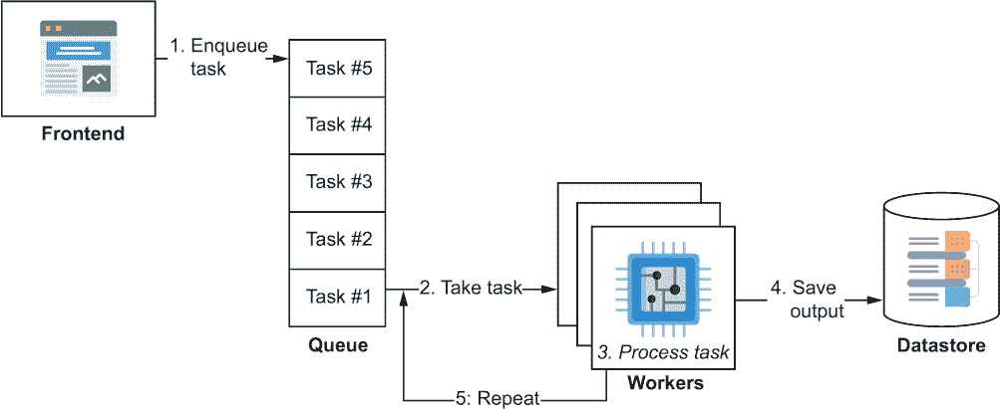
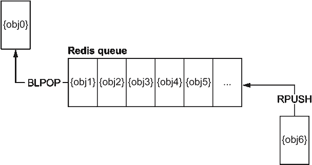
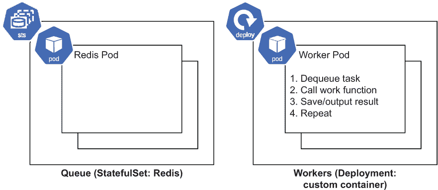
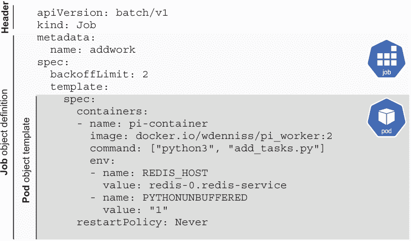
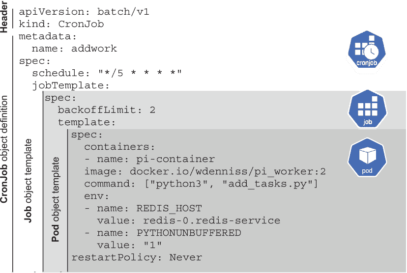

# 10. 后台处理

本章涵盖

+   如何在 Kubernetes 中处理后台任务

+   Kubernetes Job 和 CronJob 对象

+   在何时以及何时不使用 Job 对象来处理自己的批量处理工作负载

+   使用 Redis 创建自定义任务队列

+   使用 Kubernetes 实现后台处理任务队列

在前面的章节中，我们探讨了开发暴露在 IP 地址上的服务，无论是提供公共地址上的外部服务还是集群本地 IP 上的内部服务。但关于所有可能需要执行但不直接属于请求-响应链的其他计算怎么办，比如调整大量图像、发送设备通知、运行 AI/ML 训练作业、处理财务数据或逐帧渲染电影？这些通常作为后台任务处理，这些任务是接受输入并产生输出，但不属于用户请求的同步处理。

您可以使用 Deployment 或 Kubernetes Job 对象来处理后台任务。Deployment 对于像大多数 Web 应用程序运行图像调整等持续运行的任务队列来说非常理想。Kubernetes Job 结构非常适合运行一次性维护任务、周期性任务（通过 CronJob）以及在有一定工作量需要完成时处理批量工作负载。

术语：任务或工作

实践者通常在提及后台计算（例如，作业队列、任务队列、后台作业、后台任务）时将术语*任务*和*工作*互换使用。由于 Kubernetes 有一个名为 Job 的对象，为了减少歧义，我在提及该对象本身时始终使用*Job*，而在提及一般后台处理概念（无论其实现方式如何）时使用*任务*（例如，后台任务、任务队列）。

本章介绍了使用 Deployment 和 Job 进行后台任务处理。到本章结束时，您将能够为 Web 应用程序配置一个连续的后台任务处理队列，并使用 Kubernetes 定义具有最终状态的批量工作负载，包括周期性和一次性任务。

## 10.1 后台处理队列

在野外部署的大多数 Web 应用程序都有一个主要的后台任务处理组件，用于处理在短 HTTP 请求-响应时间窗口内无法完成的处理任务。谷歌进行的研究表明，页面加载时间越长，用户“跳出”（即离开页面并去其他地方）的可能性就越高，观察到“当页面加载时间从 1 秒增加到 3 秒时，跳出概率增加 32%。”¹。因此，在用户等待时尝试进行任何重负载通常是一个错误；相反，应该将任务放入后台队列，并让用户了解其进度。页面加载速度需要让每个前端开发者到后端开发者都牢记在心；这是一个集体责任。

加载页面所需的时间有很多，许多方面，如图片大小和 JavaScript，都不在 Kubernetes 的范围内。当您在 Kubernetes 中查看工作负载部署时，需要考虑的一个相关指标是首次字节时间（TTFB）。这是您的 Web 服务器完成请求处理并客户端开始下载响应的时间。为了实现低整体页面加载时间，减少 TTFB 时间是至关重要的，并且需要在亚秒内响应。这基本上排除了任何作为请求一部分的行内数据处理。需要创建 ZIP 文件供用户使用或缩小他们刚刚上传的图片？最好不要在请求本身中执行这些操作。

因此，常见的模式是运行一个持续的后台处理队列。Web 应用程序将无法行内处理的任务，如数据处理，转交给后台队列（图 10.1）。在后台队列处理期间，Web 应用程序可能会显示一个旋转器或其他 UI 提示，当结果准备好时给用户发邮件，或者简单地提示用户稍后再回来。您如何架构用户交互取决于您。在这里我们将介绍如何在 Kubernetes 中部署这种类型的后台处理任务队列。



图 10.1 前端 Web 服务器与后台任务队列

回想一下，部署（如第三章所述）是 Kubernetes 中的一个工作负载结构，其目的是维护一组持续运行的 Pods。对于后台任务处理队列，您需要一组持续运行的 Pods 来作为您的任务工作者。所以这是一个匹配！部署中的 Pods 不会通过服务暴露出来并不重要；关键是您希望至少有一个工作者持续运行。您将像更新服务于前端请求的部署一样更新这个部署，使用新的容器版本并对其进行扩展和缩减，所以我们迄今为止学到的所有内容都可以同样应用于后台任务工作者的部署。

### 10.1.1 创建自定义任务队列

在您的任务处理部署中部署的工作节点 Pods 有一个简单的角色：接收输入并产生输出。但它们从哪里获取输入呢？为了这个目的，您需要一个队列，应用程序的其他组件可以在此队列中添加任务。这个队列将存储待处理任务的列表，工作节点 Pods 将处理这些任务。对于后台队列有许多现成的解决方案（其中一些我在第 10.1.4 节中提到），但要最好地理解它们是如何工作的，让我们自己创建一个吧！

对于队列数据存储，我们将使用我们在上一章中创建的相同的 Redis 工作负载部署。Redis 内置了对队列的支持，这使得它非常适合这项任务（并且许多现成的解决方案也使用 Redis）。我们的任务处理系统设计相当简单：Web 应用程序角色将任务入队到 Redis（我们可以通过手动添加任务来模拟这个角色），然后我们的 Deployment 中的工作 Pod 从队列中弹出任务，执行工作，并等待下一个任务。

Redis 中的队列

Redis 自带了几个方便的数据结构。我们在这里使用的是队列。在这个队列结构上，我们将使用两个函数来实现 FIFO（先进先出）的顺序，这在后台队列中很典型（即按添加顺序处理项目）：`RPUSH`用于将项目添加到队列的末尾，`BLPOP`用于从队列的前端弹出项目，如果没有可用项目则阻塞。



如果你把队列想象成从右到左，最右边的项目在队列的末尾，最左边的项目在队列的前端，那么`L`和`R`函数前缀将更有意义（`RPUSH`用于在右侧推送对象，`BLPOP`用于以阻塞方式弹出队列中最左边的项目）。额外的`B`前缀表示函数的阻塞形式（在这种情况下，`LPOP`的阻塞版本），这将导致它在队列为空时等待项目，而不是立即返回 nil。我们可以在自己的重试循环中简单地使用`LPOP`，但阻塞在响应上可以避免“忙等待”，这样可以节省更多资源，并且我们可以将这项任务留给 Redis。

作为具体但简单的例子，我们的任务将接受一个整数*n*作为输入，并使用莱布尼茨级数公式进行*n*次迭代来计算π（以这种方式计算π时，迭代次数越多，最终结果越准确）。在实际应用中，你的任务将完成你需要它完成的任意处理，并且可能以 URL 或键值参数字典作为输入。概念是相同的。

创建工作容器

在我们到达 Kubernetes Deployment 之前，我们需要创建我们的工作容器。我将再次使用 Python 作为这个示例，因为我们可以在几行 Python 代码中实现一个完整的任务队列。这个容器的完整代码可以在本书附带源代码的 Chapter10/pi_worker 文件夹中找到。它由三个 Python 文件组成，如下所示。

列表 10.1 是工作函数，其中发生实际计算。它没有意识到自己在队列中；它只是进行处理。在你的情况下，你会用你需要做的任何计算来替换这个（例如，创建 ZIP 文件或调整图像大小）。

列表 10.1 第十章/pi_worker/pi.py

```
from decimal import *

# Calculate pi using the Gregory-Leibniz infinity series
def leibniz_pi(iterations):

  precision = 20
  getcontext().prec = 20
  piDiv4 = Decimal(1)
  odd = Decimal(3)

  for i in range(0, iterations):
    piDiv4 = piDiv4 - 1/odd
    odd = odd + 2
    piDiv4 = piDiv4 + 1/odd
    odd = odd + 2

  return piDiv4 * 4
```

然后，在列表 10.2 中，我们有我们的工作实现，它将取队列头部的任务对象，并使用需要完成的工作的参数调用 `leibniz_pi` 函数执行工作。对于你的实现，你排队的对象只需要包含任务的相关函数参数，比如创建或处理图像的详细信息。将队列处理逻辑与工作函数分开是有用的，这样后者可以在其他环境中重用。

列表 10.2 第十章/pi_worker/pi_worker.py

```
import os
import redis
from pi import *

redis_host = os.environ.get('REDIS_HOST')   ❶
assert redis_host != None
r = redis.Redis(host=redis_host,            ❷
                port='6379',                ❷
                decode_responses=True)      ❷

print("starting")
while True:
  task = r.blpop('queue:task')              ❸
  iterations = int(task[1])
  print("got task: " + str(iterations))
  pi = leibniz_pi(iterations)               ❹
  print (pi) 
```

❶ 从环境变量中检索 Redis 主机（由列表 10.5 中的 Deployment 提供）。

❷ 连接到 Redis 服务。

❸ 弹出下一个任务（如果没有任务在队列中，则阻塞）。

❹ 执行工作。

要弹出基于 Redis 的队列，我们使用 Redis 的 `BLPOP` 命令，它将获取列表中的第一个元素，如果队列为空，则阻塞并等待添加更多任务。为了使这个产品级应用更完善，我们还需要做更多的事情，比如添加信号处理以处理 Pod 终止的情况（在第 10.1.2 节中介绍），但现在这已经足够了。

最后，在列表 10.3 中，我们有一个小脚本，用于向这个队列添加一些工作。在现实世界中，你将根据需要排队任务（通过使用带有任务参数的 `RPUSH` 调用），例如，在用户上传图片时响应性地排队调整图片大小的任务。在我们的演示中，我们可以用一些随机值初始化我们的任务队列。下面的列表将使用随机值（值在 1 到 100 万之间）创建 10 个示例任务。

列表 10.3 第十章/pi_worker/add_tasks.py

```
import os
import redis
import random

redis_host = os.environ.get('REDIS_HOST')
assert redis_host != None
r = redis.Redis(host=redis_host,
                port='6379',
                decode_responses=True)

random.seed()
for i in range(0, 10):                     ❶
  rand = random.randint(10,100)
  iterations = rand * 100000               ❷
  r.rpush('queue:task', iterations)        ❸
  print("added task: " + str(iterations))

print("queue depth", str(r.llen('queue:task')))
print ("done")
```

❶ 循环 10 次添加 10 个任务。

❷ 创建一个随机任务参数。

❸ 将任务添加到队列。

`rpush` 方法（对应 `RPUSH²`）将给定的值（在我们的例子中，是一个整数）添加到由键指定的列表中（在我们的例子中，键是 `"queue:task"`）。如果你之前没有使用过 Redis，你可能期望更复杂的东西，但创建队列只需要这些。不需要预先配置或模式。

将这三个 Python 脚本打包成一个容器相当简单。如列表 10.4 所示，我们可以使用官方的 Python 基础镜像并添加 Redis 依赖（如果你需要复习如何构建这样的容器，请参阅第二章）。对于默认容器入口点，我们将使用 `python3` `pi_worker.py` 运行我们的工作进程。

列表 10.4 第十章/pi_worker/Dockerfile

```
FROM python:3
RUN pip install redis     ❶
COPY . /app
WORKDIR /app 
CMD python3 pi_worker.py  ❷
```

❶ 包含 Redis 依赖。

❷ 运行工作进程。

在创建我们的 Python 工作容器后，我们现在可以进入部署到 Kubernetes 的有趣部分了！

部署到 Kubernetes

图 10.2 展示了 Kubernetes 架构的样子：我们有运行 Redis 的 StatefulSet 和运行工作 Pod 的 Deployment。还有一个添加任务的 Web 应用程序角色，但在这个例子中我们将手动进行。



图 10.2 背景处理任务队列的 Kubernetes 架构

我们的工人 Pod 将以一个希望现在熟悉的 Deployment 配置（来自第三章）进行部署。我们将通过一个环境变量传入 Redis 主机的位置，该变量引用内部服务主机（如第 7.1.3 节所述）。

列表 10.5 第十章/10.1.1_ 任务队列/deploy_worker.yaml

```
apiVersion: apps/v1
kind: Deployment
metadata:
  name: pi-worker
spec:
  replicas: 2
  selector:
    matchLabels:
      pod: pi
  template:
    metadata:
      labels:
        pod: pi
    spec:
      containers:
      - name: pi-container
        image: docker.io/wdenniss/pi_worker:1   ❶
        env:
        - name: REDIS_HOST
          value: redis-0.redis-service          ❷
        - name: PYTHONUNBUFFERED                ❸
          value: "1"
```

❶ 工人容器镜像

❷ 主要 Redis Pod 的 Kubernetes 服务主机名

❸ 环境变量，指示 Python 立即输出所有打印语句

注意，与本书中用于公开 web 服务的其他 Deployment 相比，这个 Deployment 没有任何特别之处。它只是一组我们碰巧赋予任务工作者角色的 Pod。

我们的工人 Pod 期待一个 Redis 实例，所以让我们先部署它。我们可以使用第九章中的那个；9.2.1_ 有状态集 _Redis 和 9.2.2_ 有状态集 _Redis_Multi 文件夹中的解决方案都适用于我们的目的。从代码样本根目录，只需运行：

```
$ kubectl create -f Chapter09/9.2.2_StatefulSet_Redis_Multi
configmap/redis-config created
service/redis-service created
statefulset.apps/redis created

$ kubectl get pods
NAME      READY   STATUS     RESTARTS   AGE
redis-0   1/1     Running    0          20s
redis-1   1/1     Running    0          13s
redis-2   0/1     Init:0/1   0          7s
```

现在创建我们的工人部署：

```
kubectl create -f Chapter10/10.1.1_TaskQueue/deploy_worker.yaml
```

最后，验证一切是否运行正常。你应该看到五个正在运行的 Pod：

```
$ kubectl get pods
NAME                         READY   STATUS    RESTARTS   AGE
pi-worker-55477bdf7b-7rmhp   1/1     Running   0          2m5s
pi-worker-55477bdf7b-ltcsd   1/1     Running   0          2m5s
redis-0                      1/1     Running   0          3m41s
redis-1                      1/1     Running   0          3m34s
redis-2                      1/1     Running   0          3m28s
```

观察滚动进度

我在这里展示的 `get` 命令，如 `kubectl get pods`，给你一个时间点的状态。回想一下第三章，有两个很好的选项来监视你的滚动：你可以在 kubectl 命令中附加 `-w`，这是 Kubernetes 的内置监视选项（例如，`kubectl get pods -w`），或者你可以使用我最喜欢的 Linux `watch` 命令。我使用 `watch -d kubectl get pods`，这将每 2 秒刷新状态，并突出显示更改。你还可以自定义刷新率。为了在书中保持语法简单，我不会在每个我分享的命令中添加监视，但请记住，它们是可以使用的。

现在我们已经部署了应用程序，我们可以查看日志以了解它在做什么。Kubernetes 中没有内置的方法可以同时流式传输多个 Pod（如我们的两个工人）的日志，但通过指定 Deployment，系统将随机选择一个并跟随其日志：

```
$ kubectl logs -f deployment/pi-worker
Found 2 pods, using pod/pi-worker-55477bdf7b-7rmhp
starting
```

如果你只想查看部署中所有 Pod 的日志而不进行流式传输，也可以通过引用 PodSpec 中的元数据标签来完成，在我们的情况下是 `pod=pi`：

```
$ kubectl logs --selector pod=pi
starting
starting
```

无论你以何种方式查看日志，我们都可以看到 Pod 打印了 `starting` 并没有其他内容，因为我们的 Pod 正在等待任务被添加到队列中。让我们添加一些任务供它处理。

向队列添加工作

通常，添加工作到后台队列的将是 web 应用程序或另一个进程。所有 web 应用程序需要做的只是调用 `redis.rpush('queue:task', object)` *带有表示任务的对象*。

对于这个例子，我们可以运行我们包含在容器中（列表 10.3）的`add_tasks.py`脚本来安排一些任务。我们可以在我们的 Pod 之一上执行一次性命令：

```
$ kubectl exec -it deploy/pi-worker -- python3 add_tasks.py
added task: 9500000
added task: 3800000
added task: 1900000
added task: 3600000
added task: 1200000
added task: 8600000
added task: 7800000
added task: 7100000
added task: 1400000
added task: 5600000
queue depth 8
done
```

注意，当我们在这里传递`deploy/pi-worker`时，`exec`将随机选择我们的 Pod 之一来运行实际命令（这甚至可以是处于`Terminating`状态的 Pod，所以请小心！）您也可以使用`kubectl exec -it $POD_NAME -- python3 add_tasks.py`直接在您选择的 Pod 上运行命令。

查看工作情况

在队列中添加任务后，我们可以观察我们的一个工作 Pod 的日志，以了解它们的运行情况：

```
$ kubectl logs -f deployment/pi-worker
Found 2 pods, using pod/pi-worker-54dd47b44c-bjccg
starting
got task: 9500000
3.1415927062213693620
got task: 8600000
3.1415927117293246813
got task: 7100000
3.1415927240123234505
```

此工作 Pod 正在获取任务（即使用 Gregory-Leibniz 无穷级数算法的*n*次迭代来计算π）并执行工作。

### 10.1.2 工作 Pod 中的信号处理

有一个需要注意的事项是，之前的工人实现没有 SIGTERM 处理，这意味着当 Pod 需要替换时，它不会优雅地关闭。Pod 可能被终止的原因有很多，包括更新部署或 Kubernetes 节点升级，所以这是一个非常重要的信号需要处理。

在 Python 中，我们可以通过实现一个 SIGTERM 处理程序来实现这一点，该处理程序将指示我们的工作员在完成当前任务后终止。我们还将添加一个超时到我们的队列弹出调用，以便工作员可以更频繁地检查状态。对于您自己的工作，查找如何在您选择的语言中实现 SIGTERM 信号处理。让我们在以下列表中添加终止处理，以便在接收到 SIGTERM 时关闭工作员。

列表 10.6 第十章/pi_worker2/pi_worker.py

```
import os
import signal
import redis
from pi import *

redis_host = os.environ.get('REDIS_HOST')
assert redis_host != None
r = redis.Redis(host=redis_host,
                port='6379',
                decode_responses=True)
running = True                                 ❶

def signal_handler(signum, frame): ❷
 print("got signal") ❷
 running = False ❷

signal.signal(signal.SIGTERM, signal_handler) ❷

print("starting")
while running:
 task = r.blpop('queue:task', 5)            ❸
 if task != None:
    iterations = int(task[1])
    print("got task: " + str(iterations))
    pi = leibniz_pi(iterations)
    print (pi)
```

❶ 如果信号处理程序将此变量设置为 false，则退出循环，而不是无限循环。

❷ 当接收到 SIGTERM 时，注册信号处理程序以将运行状态设置为 false。

❸ 弹出下一个任务，但现在如果队列为空，则只等待 5 秒钟（以允许检查运行条件）

然后，在更新的部署中部署此修订版，指定新镜像以及`terminationGracePeriodSeconds`以请求 2 分钟来处理 SIGTERM，通过完成当前工作并退出。

列表 10.7 第十章/10.1.2_TaskQueue2/deploy_worker.yaml

```
apiVersion: apps/v1
kind: Deployment
metadata:
  name: pi-worker
spec:
  replicas: 2
  selector:
    matchLabels:
      pod: pi
  template:
    metadata:
      labels:
        pod: pi
    spec:
      containers:
      - name: pi-container
 image: docker.io/wdenniss/pi_worker:2 ❶
        env:
        - name: REDIS_HOST
          value: redis-0.redis-service
        - name: PYTHONUNBUFFERED
          value: "1"
        resources:                             ❷
          requests:                            ❷
            cpu: 250m                          ❷
            memory: 250Mi                      ❷
 terminationGracePeriodSeconds: 120 ❸
```

❶ 具有 SIGTERM 处理的新的应用程序版本

❷ 添加资源请求，以便它可以与 HPA 一起工作

❸ 请求 120 秒的优雅终止期，以便容器在接收到 SIGTERM 后有足够的时间关闭。

一起，Pod 中的信号处理和终止宽限期意味着，一旦接收到 SIGTERM，此 Pod 将停止接受新的工作，并将有 120 秒的时间来处理任何当前的工作。根据您自己的工作负载需要调整`terminationGracePeriodSeconds`的值。

在这里，我们还没有考虑一些其他事情。例如，如果工作器在处理任务时崩溃，那么该任务就会丢失，因为它将从队列中移除但未完成。此外，只有最小程度的可观察性和其他功能。前一个示例的目标不是提供一个完整的队列系统，而是从概念上展示它们是如何工作的。您可以继续实现容错和其他功能，或者采用开源的后台任务队列，让它为您完成这些工作。这个选择由您自己决定。

### 10.1.3 扩展工作 Pod

扩展工作 Pod 的技术对于任何 Deployment 都是一样的，如第六章所述。您可以手动设置副本数量或使用水平 Pod 自动扩展器 (HPA)。由于我们的示例工作负载是 CPU 密集型的，因此 CPU 指标非常适合使用 HPA 进行扩展，所以现在让我们设置一个。

列表 10.8 第十章第 10.1.3_HPA/worker_hpa.yaml

```
apiVersion: autoscaling/v2
kind: HorizontalPodAutoscaler
metadata:
  name: pi-worker-autoscaler
spec:
  scaleTargetRef:         ❶
    apiVersion: apps/v1   ❶
    kind: Deployment      ❶
    name: pi-worker       ❶
  minReplicas: 2
  maxReplicas: 10
  metrics:
  - type: Resource
    resource:
      name: cpu
      target:
        type: Utilization
        averageUtilization: 20
```

❶ 引用列表 10.7 中的 Deployment

此代码将使我们的部署扩展到 2 到 10 个 Pod 之间，目标是使 Pod 平均使用其请求的 CPU 资源的 20%。创建 HPA 如下：

```
kubectl create -f Chapter10/10.1.3_HPA
```

在设置了 HPA 之后，您可以重复第 10.1.1 节中的“添加任务”步骤，并观察 HPA 执行其操作。`kubectl` `get` 命令支持多种资源类型，因此您可以运行 `kubectl` `get` `pods,hpa`，我通常在 Linux `watch` 命令前加上前缀，以观察所有组件的交互：

```
$ kubectl exec -it deploy/pi-worker -- python3 add_tasks.py
$ kubectl get pods,hpa
NAME                             READY   STATUS    RESTARTS   AGE
pod/pi-worker-54dd47b44c-22x9b   1/1     Running   0          2m42s
pod/pi-worker-54dd47b44c-9wppc   1/1     Running   0          2m27s
pod/pi-worker-54dd47b44c-bjccg   1/1     Running   0          13m
pod/pi-worker-54dd47b44c-f79hx   1/1     Running   0          2m42s
pod/pi-worker-54dd47b44c-fptj9   1/1     Running   0          2m27s
pod/pi-worker-54dd47b44c-hgbqd   1/1     Running   0          2m27s
pod/pi-worker-54dd47b44c-lj2bk   1/1     Running   0          2m27s
pod/pi-worker-54dd47b44c-wc267   1/1     Running   0          2m10s
pod/pi-worker-54dd47b44c-wk4dg   1/1     Running   0          2m10s
pod/pi-worker-54dd47b44c-x2s4m   1/1     Running   0          13m
pod/redis-0                      1/1     Running   0          56m
pod/redis-1                      1/1     Running   0          56m
pod/redis-2                      1/1     Running   0          56m

NAME                  REFERENCE             TARGETS MINPODS MAXPODS REPLICAS
pi-worker-autoscaler  Deployment/pi-worker  66%/20% 2       10      10      
```

### 10.1.4 开源任务队列

到目前为止，我们一直在构建自己的任务队列。我发现亲自动手了解事物的工作原理是最好的。然而，您可能不需要从头开始自己实现任务队列，因为其他人已经为您完成了这项工作。

对于 Python，RQ³ 是一个流行的选择，它允许您基本上使用一堆参数来排队一个函数调用。甚至不需要将此函数包装在一个符合所需协议的对象中。

对于 Ruby 开发者来说，GitHub 团队创建的 Resque⁴ 是一个流行的选择。Resque 中的任务只是实现了 `perform` 方法的 Ruby 类。Ruby on Rails 框架通过其 Active Job 框架使得 Resque（以及其他任务队列实现）特别容易使用，该框架允许 Resque（以及其他任务队列实现）作为排队后端使用。

在出去构建自己的队列之前，我建议您查看这些选项以及更多内容。如果您必须自己构建某些内容，或者现成的选项根本不够用，我希望您从早期的示例中看到了，至少开始起来是相当直接的。

## 10.2 工作

Kubernetes 提供了一种使用 Job 结构定义有限工作集的方法。Job 和 Deployment 都可以用于在 Kubernetes 中处理批量作业和后台处理。关键区别在于，Job 是设计来处理有限的工作集，并且可能不需要像 Redis 这样的队列数据结构，而 Deployment 是用于持续运行的后台队列，它需要某种类型的队列结构来进行协调（就像我们在第 10.1 节中所做的那样）。你还可以使用 Jobs 来运行一次性任务和周期性任务，如维护操作，这在 Deployment 中是不合理的（Deployment 会在 Pod 完成后重启 Pod）。

你可能想知道为什么在 Kubernetes 中需要一个单独的结构来运行一次性的任务，因为独立的 Pods 也能做到这一点。虽然确实可以安排一个 Pod 来执行任务并在完成后关闭，但没有控制器来确保任务实际上完成了。例如，如果 Pod 在有机会完成之前因为维护事件而被驱逐，这种情况就会发生。Job 通过在 Pod 旁边添加一些有用的结构来确保任务完成，包括在任务失败或被驱逐时重新安排任务，以及跟踪多个完成和并行性的可能性。

最后，Job 只是 Kubernetes 中用于管理 Pods 的另一个高级工作负载控制器，就像 Deployment 和 StatefulSet 一样。所有三个都创建 Pods 来运行你的实际代码，只是控制器提供的调度和管理逻辑不同。Deployments 用于创建一组持续运行的 Pods；StatefulSet 用于具有唯一序号的 Pods，可以通过持久卷模板附加磁盘；而 Jobs 用于应该运行到完成的 Pods，可能需要多次运行。

### 10.2.1 使用 Jobs 运行一次性任务

Jobs 对于运行一次性任务非常出色。假设你想执行一个维护任务，比如清理缓存或其他本质上只是在你容器中运行命令的任务。而不是在现有的 Pod 上使用 `kubectl` `exec`，你可以安排一个 Job 来以单独的过程运行任务，并为其分配自己的资源，确保操作将按请求完成（或报告失败状态），并使其易于重复。

`exec` 命令实际上应该仅用于调试正在运行的 Pods。如果你使用 `exec` 来执行维护任务，你的任务将与 Pod 共享资源，这并不理想。Pod 可能没有足够的资源来同时处理两者，并且你正在影响性能。通过将任务移动到 Job，它们将获得自己的 Pod 和自己的资源分配。

配置代码用于维护任务

在整本书中，我一直强调捕获配置中的所有内容是多么重要。通过将常规维护任务作为 Job 来捕获，而不是有一个要复制/粘贴的 shell 命令列表，你正在构建一个可重复的配置。如果你遵循 GitOps 方法，其中生产变更通过 Git 进行（下一章将介绍），你的维护任务可以通过你通常的代码审查流程部署到生产环境中。

在上一节中，我们需要在容器中执行一个命令来向我们的队列添加一些工作，我们使用了`kubectl` `exec`在现有的 Pod 上运行`python3` `add_tasks.py`。让我们升级添加工作的过程，使其成为一个具有自己 Pod 的 Job。以下 Job 定义可以用来在我们的名为`pi`的容器上执行`python3` `add_tasks.py`任务。

列表 10.9 第十章/10.2.1_Job/job_addwork.yaml

```
apiVersion: batch/v1
kind: Job
metadata:
  name: addwork
spec:
  backoffLimit: 2
  template:
    spec:
      containers:
      - name: pi-container
        image: docker.io/wdenniss/pi_worker:2    ❶
        command: ["python3",  "add_tasks.py"]    ❷
        env:
        - name: REDIS_HOST
          value: redis-0.redis-service
        - name: PYTHONUNBUFFERED
          value: "1"
      restartPolicy: Never
```

❶ 引用与工作节点相同的容器镜像...

❷ ...但对于 addwork Job 指定了不同的运行命令

在`spec`模式中的`template`内部的`spec`可能看起来很熟悉，这是因为这个对象就像 Deployment 和 StatefulSet 一样嵌入了一个 PodSpec 模板（见图 10.3，展示了对象组成）。Pod 的所有参数都可以在这里使用，例如资源请求和环境变量，只有少数几个参数组合在 Job 上下文中没有意义。



图 10.3 Job 的对象组成

我们 Job 的 PodSpec 与我们的 Deployment 中的 PodSpec 具有相同的环境变量。这就是 Kubernetes 对象组合的好处：无论 Pod 在哪里嵌入，规范都是相同的。其他的不同之处在于`restartPolicy`和`backoffLimit`字段。

Pod 的`restartPolicy`是 Job 中嵌入的 PodSpec 的一个属性，它决定了节点上的 kubelet 是否会重启因错误退出的容器。对于 Job，这可以设置为`OnFailure`，如果容器失败则重启，或者设置为`Never`来忽略失败。对于 Job 来说，`Always`选项没有意义，因为这会重启一个成功的 Pod，而这并不是 Job 设计的目的（这更属于 Deployment 的领域）。

倒计时限制是 Job 的一部分，它决定了尝试运行 Job 的次数。这包括崩溃和节点故障。例如，如果 Job 崩溃两次然后因为节点维护而被驱逐，这算作三次重启。一些实践者喜欢在开发期间使用`Never`，因为这更容易调试并查看所有失败的 Pod 以及查询它们的日志。

创建 Job 就像创建任何其他 Kubernetes 对象一样，然后观察进度：

```
$ kubectl create -f Chapter10/10.2.1_Job/job_addwork.yaml
job.batch/addwork created

$ kubectl get job,pods
NAME                COMPLETIONS   DURATION   AGE
job.batch/addwork   1/1           3s         9s

NAME                             READY   STATUS      RESTARTS   AGE
pod/addwork-99q5k                0/1     Completed   0          9s
pod/pi-worker-6f6dfdb548-7krpm   1/1     Running     0          7m2s
pod/pi-worker-6f6dfdb548-pzxq2   1/1     Running     0          7m2s
pod/redis-0                      1/1     Running     0          8m3s
pod/redis-1                      1/1     Running     0          7m30s
pod/redis-2                      1/1     Running     0          6m25s 
```

如果 Job 成功，我们可以观察我们的工作节点 Pod，它们应该会因新添加的工作而变得忙碌。如果你之前部署了 HPA，那么你很快就会看到新容器被创建，就像我这里做的那样：

```
$ kubectl get pods,hpa
NAME                             READY   STATUS              RESTARTS   AGE
pod/addwork-99q5k                0/1     Completed           0          58s
pod/pi-worker-6f6dfdb548-7krpm   1/1     Running             0          7m51s
pod/pi-worker-6f6dfdb548-h6pld   0/1     ContainerCreating   0          8s
pod/pi-worker-6f6dfdb548-pzxq2   1/1     Running             0          7m51s
pod/pi-worker-6f6dfdb548-qpgxp   1/1     Running             0          8s
pod/redis-0                      1/1     Running             0          8m52s
pod/redis-1                      1/1     Running             0          8m19s
pod/redis-2                      1/1     Running             0          7m14s

NAME                  REFERENCE            TARGETS   MINPODS MAXPODS REPLICAS
pi-worker-autoscaler  Deployment/pi-worker 100%/20%  2       10      2  
```

关于 Job 有一点需要注意：无论 Job 是否已完成，你都无法使用相同的名称（即重复该操作）再次调度它，除非先删除它。这是因为尽管工作现在已经完成，但 Job 对象仍然存在于 Kubernetes 中。你可以像删除任何通过配置创建的对象一样删除它：

```
kubectl delete -f Chapter10/10.2.1_Job/job_addwork.yaml
```

总结一下，Job 是当你有一些任务或工作要完成时使用的。我们的例子是执行一个简单的命令。然而，这也可以是一个漫长且复杂的计算任务。如果你需要运行一个一次性后台进程，只需将其容器化，在 Job 中定义它，并调度它。当 Job 报告自己为 `Completed`（通过成功退出状态终止）时，工作就完成了。

我们没有使用来运行一次性任务的 Job 参数是 `completions` 和 `parallelism`。这些参数允许你使用单个 Job 对象描述来处理一批任务，这将在第 10.3 节中介绍。在我们到达那里之前，让我们看看如何定期调度 Job。 

### 10.2.2 使用 CronJobs 调度任务

在上一节中，我们创建了一个合适的 Kubernetes 对象来封装我们在集群上手动执行的命令。现在，团队中的任何开发者都可以通过创建 Job 对象来执行这个任务，而不是需要记住一个复杂的 `exec` 命令。

那么，对于需要定期在固定间隔运行的任务怎么办？Kubernetes 提供了 CronJob。CronJob 封装了一个 Job 对象，并添加了一个频率参数，允许你设置每天或每小时（或任何你喜欢的间隔）的频率来运行 Job，如下面的列表所示。这是调度像每日缓存清理这样的任务的一种流行方式。

列表 10.10 第十章/10.2.2_CronJob/cronjob_addwork.yaml

```
apiVersion: batch/v1
kind: CronJob
metadata:
  name: addwork
spec:
  schedule: "*/5 * * * *"   ❶
  jobTemplate:
    spec:                   ❷
      backoffLimit: 2
      template:
        spec:
          containers:
          - name: pi-container
            image: docker.io/wdenniss/pi_worker:2
            command: ["python3",  "add_tasks.py"]
            env:
            - name: REDIS_HOST
              value: redis-0.redis-service
            - name: PYTHONUNBUFFERED
              value: "1"
          restartPolicy: Never 
```

❶ 运行 Job 的 cron 调度计划

❷ 与列表 10.9 类似的 Job 规范

你可能会注意到，我们只是将 Job 的整个规范（即 `spec` 字典）从列表 10.9 下的这个 CronJob 的 `spec` 字典中复制过来，作为 `jobTemplate` 键，并添加了一个额外的规范级别字段名为 `schedule`。回想一下，Job 有自己的模板用于将要创建的 Pods，这些 Pods 也有自己的规范。

因此，CronJob 包含一个 Job 对象，而该对象反过来又包含一个 Pod。通过对象组合可视化这一点可能会有所帮助，所以请看一下图 10.4。



图 10.4 CronJob 的对象组合

Kubernetes 中的对象组合

在所有规范和模板嵌入其他模板和规范的情况下，有时感觉就像在 Kubernetes 中一直向下是乌龟。这里有一个 CronJob，其规范包含在计划上运行的 Job 的模板，它本身包含具有自己规范的 Pod 的模板。这可能会让人感到困惑和重复，或者两者兼而有之，但这种方法有一个巨大的好处。在查看 API 文档时，你可以在`jobTemplate`中使用 Job 的任何字段，就像你可以在`spec`部分中使用 Pod 的任何字段一样。Kubernetes 对象是由其他对象的组合构建的。

一些术语值得学习：当一个 Pod 嵌入到另一个对象中时，我们称嵌入 Pod 的规范为*PodSpec*（例如，Deployment 包含一个 PodSpec）。当那个高级对象的控制器在集群中创建 Pod 时，该 Pod 与任何其他 Pod 都相同，包括那些直接使用它们自己的规范创建的 Pod。唯一的区别是，由控制器（如 Job 或 Deployment）创建的 Pod 将继续被该控制器观察（即，如果它们失败，则重新创建它们，等等）。

那么这就是它的组成方式。关于`schedule`字段，这是 CronJob 对规范的贡献？`schedule`是我们定义频率的地方，使用古老的 Unix cron 格式。cron 格式非常具有表现力。在列表 10.10 中，`*/5` `*` `*` `*` `*`表示“每 5 分钟”。你可以配置像“每 30 分钟运行一次”(`*/30` `*` `*` `*` `*`)、午夜运行(`*` `0` `*` `*` `*`*)、周一下午 4:00(`0` `16` `*` `*` `1`)等时间表。我建议使用可视化的 cron 编辑器（通过谷歌搜索“cron editor”应该可以解决问题）来验证你偏好的表达式，而不是等待一周来验证你想要每周运行的 Job 实际上是否运行了。

创建新的 CronJob：

```
$ kubectl create -f Chapter10/10.2.2_CronJob/cronjob_addwork.yaml
cronjob.batch/addwork created

$ kubectl get cronjob,job
NAME                    SCHEDULE      SUSPEND   ACTIVE   LAST SCHEDULE   AGE
cronjob.batch/addwork   */5 * * * *   False     0        <none>          58s
```

等待几分钟（在这个例子中，Job 每 5 分钟创建一次，即：00，05，等等），然后你可以看到 Job 及其产生的 Pod：

```
$ kubectl get cronjob,job,pods
NAME                    SCHEDULE      SUSPEND   ACTIVE   LAST SCHEDULE   AGE
cronjob.batch/addwork   */5 * * * *   False     0        2m38s           3m11s

NAME                         COMPLETIONS   DURATION   AGE
job.batch/addwork-27237815   1/1           107s       2m38s

NAME                             READY   STATUS      RESTARTS   AGE
pod/addwork-27237815-b44ws       0/1     Completed   0          2m38s
pod/pi-worker-6f6dfdb548-5czkc   1/1     Running     5          14m
pod/pi-worker-6f6dfdb548-gfkcq   1/1     Running     0          7s
pod/pi-worker-6f6dfdb548-pl584   1/1     Running     0          7s
pod/pi-worker-6f6dfdb548-qpgxp   1/1     Running     5          25m
pod/redis-0                      1/1     Running     0          14m
pod/redis-1                      1/1     Running     0          33m
pod/redis-2                      1/1     Running     0          32m
```

CronJob 将按计划生成一个新的 Job，反过来，这个 Job 将生成一个新的 Pod。你可以检查这些历史 Job，因为它们保持`Complete`状态。CronJobSpec 中的`successfulJobsHistoryLimit`和`failedJobsHistoryLimit`选项可以用来控制保留多少个历史 Job。

时区

注意，CronJob 将在你的集群时区运行，对于许多平台，包括 Google Kubernetes Engine（GKE），将是 UTC。使用的时区是系统 Kubernetes 控制器组件的时区，该组件运行在控制平面。如果你在一个托管平台上，可能无法直接查询控制平面节点，但可以检查工作节点，它们可能使用相同的时区。以下是如何创建一个一次性 Pod 来运行 Linux `date`命令然后以粗体输出结果的步骤：

```
$ kubectl run date --restart=Never -it --rm --image ubuntu -- date +%Z
UTC

```

## 10.3 使用 Job 进行批量任务处理

如果你有一批工作想要作为常规或一次性事件处理，会怎样？如第 10.1 节所述，如果你想要一个持续运行的任务队列，那么部署实际上是正确的 Kubernetes 对象。但是，如果你有一批有限的工作要处理，那么 Job 是理想的 Kubernetes 结构。

如果你有一个像我们在第 10.1 节中那样的动态工作队列数据结构，但希望当队列空时你的工作者完全关闭，那么 Job 可以做到这一点。使用部署，你需要一个单独的系统（如`HorizontalPodAutoscaler`）来上下调整工作者 Pod 的数量，例如，当队列中没有更多工作时要这样做。当使用 Job 时，工作者 Pod 本身可以向 Job 控制器发出信号，表明工作已完成，它们应该关闭并回收资源。

使用 Job 的另一种方式是在静态工作队列上运行它，这样根本不需要数据库。比如说，你知道你需要处理队列中的 100 个任务。你可以运行 Job 100 次。当然，问题是 Job 系列中的每个 Pod 实例化都需要知道要运行哪 100 个任务，这就是索引 Job 发挥作用的地方。

在本节中，我将介绍动态和静态任务处理方法。

### 10.3.1 使用 Job 进行动态队列处理

让我们重新设计第 10.1 节中的动态队列，使用 Job 而不是部署。部署和 Job 都允许创建多个 Pod 工作者，并且两者在发生故障时都会重新创建 Pod。然而，部署没有 Pod“完成”的注释（即，以成功退出状态终止）。你给部署的任何副本数，它都会努力保持始终运行。另一方面，当由 Job 管理的 Pod 以成功退出代码（例如，`exit` `0`）终止时，它向 Job 控制器表明工作已成功完成，Pod 不会被重新启动。

Job 的这一特性允许个别工作者在完成工作时发出信号，这使得 Job 非常有用。如果你使用的是动态 Kubernetes 环境，例如具有自动缩放（包括 Autopilot 模式下的 GKE）的环境，那么 Job 允许你“设置并忘记”工作，你安排它，一旦完成，资源消耗就会降到零。请注意，一旦完成，你不能将其缩放回原大小，但你可以删除并重新创建它，这本质上启动了一个新的处理队列。

为了使我们的任务工作者容器在 Job 环境中正确工作，我们需要为队列变为空时添加一个成功退出条件。以下列表显示了我们的修订后的工作者代码。

列表 10.11 第十章/pi_worker3/pi_worker.py

```
import os
import signal
import redis
from pi import *

redis_host = os.environ.get('REDIS_HOST')
assert redis_host != None
r = redis.Redis(host=redis_host,
                port='6379',
                decode_responses=True)
running = True

def signal_handler(signum, frame):
  print("got signal")
  running = False

signal.signal(signal.SIGTERM, signal_handler)

print("starting")
while running:
  task = r.blpop('queue:task', 5)
  if task != None:
    iterations = int(task[1])
    print("got task: " + str(iterations))
    pi = leibniz_pi(iterations)
    print (pi)
 else: ❶
 if os.getenv('COMPLETE_WHEN_EMPTY', '0') != '0': ❶
 print ("no more work") ❶
 running = False ❶

exit(0)                                               ❷
```

❶ 当配置为 COMPLETE_WHEN_EMPTY=1 时，当队列空时不要等待新任务。

❷ 0 退出代码向 Kubernetes 表明 Job 已成功完成。

在我们的工作容器设置正确地以作业上下文行为后，我们可以创建一个 Kubernetes 作业来运行它。在部署中，我们使用`replica`字段来控制同时运行的 Pod 数量，而在作业中，则是`parallelism`参数，它基本上做的是同样的事情。

列表 10.12 第十章/10.3.1_JobWorker/job_worker.yaml

```
apiVersion: batch/v1
kind: Job
metadata:
  name: jobworker
spec:
  backoffLimit: 2
  parallelism: 2                               ❶
  template:
    metadata:
      labels:
        pod: pi
    spec:
      containers:
      - name: pi-container
        image: docker.io/wdenniss/pi_worker:3  ❷
        env:
        - name: REDIS_HOST
          value: redis-0.redis-service
        - name: PYTHONUNBUFFERED
          value: "1"
        - name: COMPLETE_WHEN_EMPTY            ❸
          value: "1"
      restartPolicy: OnFailure
```

❶ 同时运行多少个 Pod 来处理这个任务队列

❷ 带有完成逻辑的新容器版本

❸ 指定以启用工作者中的完成行为的环境变量

如果您将列表 10.12 中作为作业创建的工作者的 PodSpec 与列表 10.7 中作为部署创建的工作者的 PodSpec 进行比较，您会注意到除了添加了`COMPLETE_WHEN_EMPTY`环境变量和`restartPolicy`字段之外，内嵌的 PodSpec（`template`下的字段）是相同的。添加重启策略是因为 Pod 的默认值`Always`不适用于旨在终止的作业。使用`OnFailure`重启策略，只有在工作者 Pod 崩溃而没有返回成功时，工作者 Pod 才会重启，这通常是期望的。我们并不严格需要这个工作者的作业版本的标签元数据，但它可以像之前讨论的那样（即使用`kubectl logs --selector pod=pi`）同时查询多个 Pod 的日志。

准备中

在运行基于作业的任务工作者的版本之前，删除之前的部署版本的工作者，并移除旧的“addwork”作业和 CronJob，以便它们可以再次运行：

```
$ cd Chapter10

$ kubectl delete -f 10.1.2_TaskQueue2
deployment.apps "pi-worker" deleted

$ kubectl delete -f 10.2.1_Job
job.batch "addwork" deleted
$ kubectl delete -f 10.2.2_CronJob
cronjob.batch "addwork" deleted
```

由于我们的基于 Redis 的队列可能有一些现有的作业，您也可以使用 LTRIM Redis 命令来重置它：

```
$ kubectl exec -it pod/redis-0 -- redis-cli ltrim queue:task 0 0
OK
```

如果您更喜欢交互式运行`redis-cli`来重置队列，也可以：

```
$ kubectl exec -it pod/redis-0 -- redis-cli
127.0.0.1:6379> LTRIM queue:task 0 0
OK
```

让我们尝试这个基于作业的工作者。首先，我们可以像之前一样向我们的 Redis 队列添加一些工作：

```
$ cd Chapter10

$ kubectl create -f 10.2.1_Job
job.batch/addwork created

$ kubectl get job,pod
NAME                COMPLETIONS   DURATION   AGE
job.batch/addwork   0/1           19s        19s

NAME                READY   STATUS              RESTARTS   AGE
pod/addwork-l9fgg   0/1     ContainerCreating   0          19s
pod/redis-0         1/1     Running             0          19h
pod/redis-1         1/1     Running             0          19h
pod/redis-2         1/1     Running             0          19h
```

TIP 您不能两次创建相同的作业对象，即使第一个实例已经运行并完成。要重新运行作业，首先删除它然后再创建。

一旦这个`addwork`作业完成，我们可以运行新的作业队列来处理工作。与之前不同，这里的顺序很重要，因为如果队列中没有工作，作业工作者将退出，所以请确保在运行作业队列之前`addwork`已经完成。观察状态如下：

```
$ kubectl get job,pod
NAME                COMPLETIONS   DURATION   AGE
job.batch/addwork   1/1           22s        36s

NAME                READY   STATUS      RESTARTS   AGE
pod/addwork-l9fgg   0/1     Completed   0          37s
pod/redis-0         1/1     Running     0          19h
pod/redis-1         1/1     Running     0          19h
pod/redis-2         1/1     Running     0          19h
```

一旦我们在`addwork`任务上看到`Completed`状态，我们就可以继续安排作业队列：

```
$ kubectl create -f 10.3.1_JobWorker
job.batch/jobworker created

$ kubectl get job,pod
NAME                  COMPLETIONS   DURATION   AGE
job.batch/addwork     1/1           22s        3m45s
job.batch/jobworker   0/1 of 2      2m16s      2m16s

NAME                  READY   STATUS      RESTARTS   AGE
pod/addwork-l9fgg     0/1     Completed   0          3m45s
pod/jobworker-swb6k   1/1     Running     0          2m16s
pod/jobworker-tn6cd   1/1     Running     0          2m16s
pod/redis-0           1/1     Running     0          19h
pod/redis-1           1/1     Running     0          19h
pod/redis-2           1/1     Running     0          19h
```

接下来应该发生的事情是，工作 Pods 将处理队列，当队列为空时，工作者将完成他们目前正在处理的任务，然后成功退出。如果您想监控队列深度以了解何时应该结束工作，您可以在 Redis 队列上运行`LLEN`来观察当前队列长度：

```
$ kubectl exec -it pod/redis-0 -- redis-cli llen queue:task
(integer) 5
```

当它达到零时，您应该观察到 Pod 进入`Completed`状态。请注意，它们不会立即进入这个状态，而是在完成它们正在处理的最后一个任务之后：

```
$ kubectl get job,pod
NAME                  COMPLETIONS   DURATION   AGE
job.batch/addwork     1/1           22s        3m45s
job.batch/jobworker   0/1 of 2      2m16s      2m16s

NAME                  READY   STATUS      RESTARTS   AGE
pod/addwork-l9fgg     0/1     Completed   0          10m09s
pod/jobworker-swb6k   1/1     Completed   0          8m40s
pod/jobworker-tn6cd   1/1     Completed   0          8m40s
pod/redis-0           1/1     Running     0          19h
pod/redis-1           1/1     Running     0          19h
pod/redis-2           1/1     Running     0          19h
```

记住，如果你想重新运行任何作业，你首先需要删除它们，然后再重新创建，即使作业已经完成且没有 Pod 在运行。为了再次运行之前的演示，请删除两个作业（添加工作负载的作业和运行工作者的作业）并重新创建它们：

```
$ kubectl delete -f 10.2.1_Job
job.batch "addwork" deleted
$ kubectl delete -f 10.3.1_JobWorker
job.batch "jobworker" deleted
$ kubectl create -f 10.2.1_Job
job.batch/addwork created
$ kubectl create -f 10.3.1_JobWorker
job.batch/jobworker created
```

### 10.3.2 使用作业进行静态队列处理

有多种方法可以在 Kubernetes 中使用静态队列运行作业，而不是像我们在上一节中那样使用 Redis 这样的动态队列来存储任务列表。当使用静态队列时，队列长度是事先已知的，并作为作业本身的一部分进行配置，并为每个任务创建一个新的 Pod。你不需要让任务工作者一直运行直到队列为空，而是预先定义了工作者 Pod 的实例化次数。

做这件事的主要原因是为了避免容器需要理解如何从动态队列中拉取任务，对于现有的容器来说，这通常意味着需要付出努力来添加这项功能。缺点是通常需要在 Kubernetes 端进行额外的配置。这实际上是将配置负担从工作容器转移到了 Kubernetes 对象上。

注意，即使你有不能修改执行工作的容器的需求，这并不意味着你必须使用静态队列。你可以在 Pod 中有多个容器，并让其中一个容器执行出队操作，然后将参数传递给另一个容器。

那么如何在 Kubernetes 配置中表示静态工作队列呢？有几个不同的选项，其中三个我将在这里概述。

使用索引的静态队列

在我看来，索引作业是静态队列选项中最有趣的一个。当你事先知道要处理多少个任务以及任务列表是易于索引的时候，它们非常有用。一个例子是渲染动画电影。你知道帧数（队列长度），并且可以轻松地将每个实例的帧数（即渲染帧的队列索引）传递给它们。

Kubernetes 将根据你指定的总次数（`completions`）运行作业，为每个任务创建一个 Pod。每次运行时，它都会给作业下一个索引（通过环境变量 `$JOB_COMPLETION_INDEX` 提供）。如果你的工作是自然索引的（例如，在动画电影中渲染帧），这将非常有效！你可以轻松地指示 Kubernetes 运行作业 30,000 次（即渲染 30,000 帧），并且它会为每个 Pod 提供帧号。另一个明显的方法是使用某种数据结构（例如，YAML 编码的任务数组或纯文本，每行一个任务）为每个作业提供完整的工作列表，Kubernetes 提供索引。然后作业可以使用索引在列表中查找任务。

以下列表提供了一个简单输出帧号的索引作业的配置示例。你可以自己替换实际的渲染电影逻辑。

列表 10.13 第十章/10.3.2_IndexedJob/indexed_job.yaml

```
apiVersion: batch/v1
kind: Job
metadata:
  name: echo
spec:
  completions: 5                                                    ❶
  parallelism: 3                                                    ❷
  completionMode: Indexed                                           ❸
  template:
    metadata:
      labels:
        pod: framerender
    spec:
      restartPolicy: Never
      containers:
      - name: 'worker'
        image: 'docker.io/library/busybox'
        command: ["echo", "render frame: $(JOB_COMPLETION_INDEX)"]  ❹
```

❶ 运行作业的次数（索引的上限）

❷ 并行运行的 Worker Pods 数量

❸ 以索引模式运行，通过环境变量传递 JOB_COMPLETION_INDEX。

❹ 输出当前索引的命令

运行并观察此作业：

```
$ kubectl create -f 10.3.2_IndexedJob 
job.batch/echo created

$ kubectl get job,pods
NAME             COMPLETIONS   DURATION   AGE
job.batch/echo   5/5           20s        58s

NAME               READY   STATUS      RESTARTS   AGE
pod/echo-0-r8v52   0/1     Completed   0          58s
pod/echo-1-nxwsm   0/1     Completed   0          58s
pod/echo-2-49kz2   0/1     Completed   0          58s
pod/echo-3-9lvt2   0/1     Completed   0          51s
pod/echo-4-2pstq   0/1     Completed   0          45s
```

要检查日志，请执行以下操作：

```
$ kubectl logs --selector pod=framerender
render frame: 0
render frame: 1
render frame: 2
render frame: 3
render frame: 4
```

您的应用程序可以直接使用此环境变量，或者您可以使用一个*init*容器来获取索引并执行为主容器执行工作所需的任何配置步骤——例如，通过构建一个将要运行的脚本。

带有消息队列服务的静态队列

另一种不需要修改容器的方法是填充一个消息队列，并让每个 Pod 从该队列中提取工作。由于容器可以通过 Kubernetes 配置中的环境变量获取所需的参数，因此可以构建一个作业，其中容器对队列一无所知。它仍然是“静态”的，因为您必须提前声明有多少个任务，并为每个任务运行一个 worker Pod，但它也需要一个数据结构（即消息队列）。Kubernetes 文档使用 RabbitMQ 作为消息队列，出色地演示了这种方法。⁶

通过脚本实现的静态队列

另一个选项是使用脚本为队列中的每个任务创建一个单独的作业。基本上，如果您有 100 个任务要完成，您会设置一个脚本来遍历您的任务定义并创建 100 个单独的作业，为每个作业提供它需要的特定输入数据。这对我来说是个人最不喜欢的选项，因为它有点难以管理。想象一下，您将所有这些工作排队，然后想要取消它。与该节中所有其他示例不同，您需要删除 100 个作业，因此您可能需要更多的脚本来完成这项工作，以此类推。再次强调，Kubernetes 文档有一个很好的演示，如果您感兴趣，可以查看它。⁷

## 10.4 背景任务的存活性探测

就像处理 HTTP 流量的容器一样，执行任务的容器（无论配置为 Deployment 还是 Job）也应该有存活性探测。存活性探测为 Kubernetes 提供所需的信息，以便重启运行但未按预期执行（例如，进程挂起或外部依赖失败）的容器。kubelet 会自动重启*崩溃*的容器（除非 PodSpec 的`restartPolicy`字段设置为`Never`），但没有存活性探测，它无法知道您的进程是否挂起或未按预期执行。

在第四章，我们讨论了在 HTTP 服务工作负载的上下文中准备就绪和活动性探测。对于后台任务，我们可以忽略准备就绪，因为后台任务没有服务可以基于准备就绪添加或删除，我们只需关注活动性。与服务工作负载一样，活动性可以用来检测后台任务中的停滞或挂起容器，这样 Kubernetes 就可以重新启动它们。

由于后台任务没有 HTTP 或 TCP 端点可用于活动性探测，这留下了基于命令的探测选项。你可以指定在容器上运行的任何命令，如果它以成功退出，则容器被认为是活动的。但应该使用什么命令呢？一种方法是为任务定期将当前时间戳写入文件，然后有一个脚本检查该时间戳的新鲜度，这可以用作活动性命令。

让我们为我们的任务工作容器配置这样的活动性探测。首先，我们需要一个函数，将当前时间（作为 Unix 时间戳）写入文件。以下列表实现了这一点。

列表 10.14 第十章/pi_worker4/liveness.py

```
import os
import time

def update_liveness():

    timestamp = int(time.time())                     ❶
    with open("logs/lastrun.date", "w") as myfile:   ❷
      myfile.write(f"{timestamp}")                   ❷
```

❶ 当前时间作为 Unix 时间戳

❷ 将时间戳写入文件 logs/lastrun.date。

然后，我们需要在 worker 运行循环的各个阶段调用这个 `update_liveness()` 方法，以表明进程仍然处于活动状态。显然，放置它的最佳位置就在主循环中。如果你有一个非常长的运行任务，你可能还想在更多的地方添加它。以下列表显示了在 pi_worker.py 中添加此方法的位置（请参阅随书提供的源代码以获取完整文件）。

列表 10.15 第十章/pi_worker4/pi_worker.py

```
from liveness import *

# ...

while running:
 update_liveness() ❶
  task = r.blpop('queue:task', 5)

# ...
```

❶ 在主运行循环中标记任务为“活动”。

接下来，我们需要一个在容器中可以由 liveness 命令引用的 bash 脚本，以确定此时间戳的新鲜度。列表 10.16 是这样一个脚本。它接受两个参数：要读取的文件（变量 `$1`）和认为结果处于活动状态所需考虑的秒数（变量 `$2`）。它将文件内容与当前时间进行比较，如果认为时间戳是新鲜的，则返回成功（退出代码 `0`），如果不新鲜，则返回失败（非零退出代码）。示例用法是 `./health_check.sh` `logs/lastrun .date` `300`，如果写入 lastrun.date 文件的时间戳在当前时间的 300 秒（5 分钟）内，则返回成功。请参阅随书提供的源代码以获取包括输入验证在内的完整文件。

列表 10.16 第十章/pi_worker4/check_liveness.sh

```
#!/bin/bash

# ...

if ! rundate=$(<$1); then                           ❶
  echo >&2 "Failed: unable to read logfile"         ❶
  exit 2                                            ❶
fi                                                  ❶

curdate=$(date +'%s')                               ❷

time_difference=$((curdate-rundate))                ❸

if [ $time_difference -gt $2 ]                      ❹
then                                                ❹
  echo >&2 "Liveness failing, timestamp too old."   ❹
  exit 1                                            ❹
fi                                                  ❹

exit 0                                              ❺
```

❶ 读取时间戳文件（由输入参数 $1 指定），如果不存在则退出错误

❷ 获取当前时间戳。

❸ 比较两个时间戳

❹ 如果进程的时间戳早于阈值（参数 $2），则返回错误状态码。

❺ 返回成功退出状态。

通过任务 worker 写入时间戳和 bash 脚本来检查它，最后一步是更新我们的工作负载定义，通过`livenessProbe`字段添加存活探针。该字段是 PodSpec 的一部分，因此可以添加到任务 worker 的 Deployment 或 Job 版本中。以下列表将 worker Deployment 从列表 10.7 更新，以添加存活探针。

列表 10.17 第十章/10.4_ 任务存活/deploy_worker.yaml

```
apiVersion: apps/v1
kind: Deployment
metadata:
  name: pi-worker
spec:
  replicas: 2
  selector:
    matchLabels:
      pod: pi
  template:
    metadata:
      labels:
        pod: pi
    spec:
      containers:
      - name: pi-container
        image: docker.io/wdenniss/pi_worker:4   ❶
        env:
        - name: REDIS_HOST
          value: redis-0.redis-service
        - name: PYTHONUNBUFFERED
          value: "1"
 livenessProbe:              ❷
 initialDelaySeconds: 60
 periodSeconds: 30
 exec:
 command: ["./check_liveness.sh", "logs/lastrun.date", "300"]
 successThreshold: 1
 timeoutSeconds: 1
      terminationGracePeriodSeconds: 120
```

❶ 带有存活探针逻辑的新容器版本

❷ 新的存活探针

将所有这些放在一起，我们现在有一个检测任务 worker 中挂起进程的过程。如果 worker 未能将更新的时间戳写入文件，且在所需的新鲜度时间阈值内（示例中设置为 300 秒），存活探针命令将*返回失败状态，并且 Pod 将被重启*。

确保您的 worker 更新这个时间戳的频率高于指定的频率。如果您有一个非常长的运行任务，要么增加新鲜度时间阈值，要么在任务处理期间多次更新时间戳文件，而不是像我们在列表 10.15 中所做的那样只在循环中更新。另一个考虑因素是确保只有在 worker 正常行为时才写入时间戳。例如，您可能不会在异常处理程序中调用`update_liveness()`。

注意：在这个例子中，被认为是过时的（不活跃的）阈值与存活探针运行的频率（`periodSeconds`字段）无关。如果您需要增加阈值，请增加作为存活探针第三个值的秒数——即`["./check_liveness.sh", "logs/lastrun.date", "300"]`中的`"300"`。

通过将这个存活探针配置到后台任务中，现在 Kubernetes 有了它需要的信息，以更少的干预来保持您的代码运行。

## 摘要

+   Kubernetes 有几种不同的选项来处理后台任务队列和批量作业。

+   部署可以用来构建一个持续运行的任务队列，利用像 Redis 这样的队列数据结构进行协调。

+   许多网站运行的后台处理，用于卸载计算密集型请求，通常作为部署来运行。

+   Kubernetes 还有一个专门的 Job 对象用于运行任务。

+   Jobs 可以用于一次性任务，例如手动维护任务。

+   CronJob 可以用来安排作业运行，例如，每天进行清理任务。

+   任务可以使用来自动处理任务队列并在工作完成后自我终止，例如在运行一次性或周期性批量作业时。

+   与基于部署的后台队列不同，Job 可以用来在静态队列上调度工作，避免需要像 Redis 这样的队列数据结构。

+   存活检查对于处理后台任务的 Pod 仍然相关，用于检测卡住/挂起的进程，并且可以使用基于命令的存活检查进行配置。

* * *

(1.) Google/SOASTA 研究所，2017 年。[`www.thinkwithgoogle.com/marketing-strategies/app-and-mobile/page-load-time-statistics/`](https://www.thinkwithgoogle.com/marketing-strategies/app-and-mobile/page-load-time-statistics/)

(2.) [`redis.io/commands/rpush`](https://redis.io/commands/rpush)

(3.) [`python-rq.org/`](https://python-rq.org/)

(4.) [`github.com/resque/resque`](https://github.com/resque/resque)

(5.) [`kubernetes.io/docs/reference/kubernetes-api/workload-resources/cron-job-v1/#CronJobSpec`](https://kubernetes.io/docs/reference/kubernetes-api/workload-resources/cron-job-v1/%23CronJobSpec)

(6.) [`kubernetes.io/docs/tasks/job/coarse-parallel-processing-work-queue/`](https://kubernetes.io/docs/tasks/job/coarse-parallel-processing-work-queue/)

(7.) [`kubernetes.io/docs/tasks/job/parallel-processing-expansion/`](https://kubernetes.io/docs/tasks/job/parallel-processing-expansion/)
