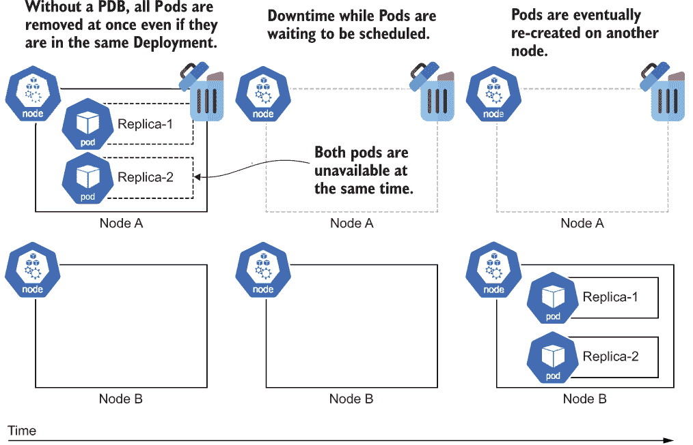
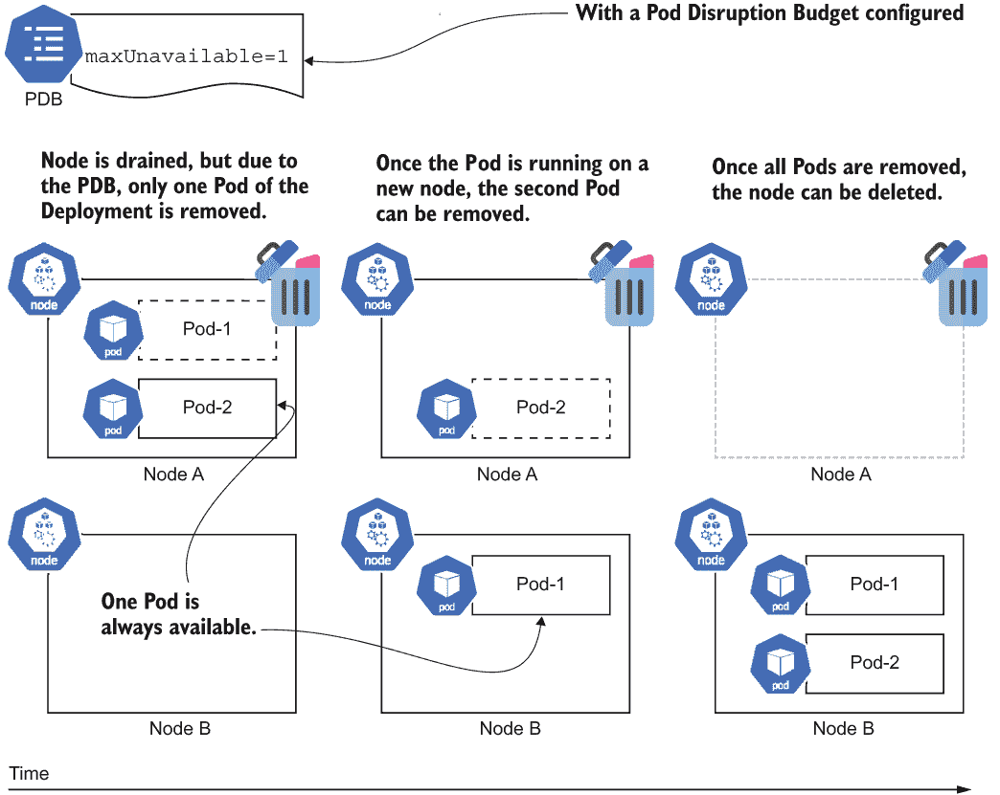
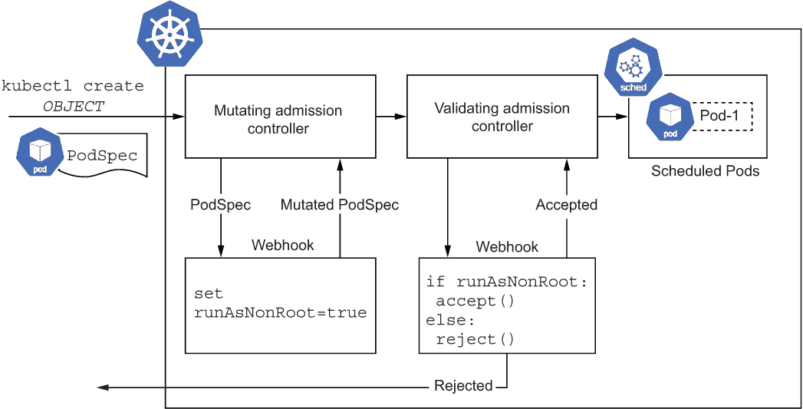

# 12 保护 Kubernetes

本章涵盖了

+   保持集群更新和打补丁

+   管理中断

+   使用 DaemonSets 将节点代理部署到每个节点

+   以非 root 用户运行容器

+   使用准入控制器验证和修改 Kubernetes 对象

+   执行 Pod 安全标准

+   使用 RBAC 控制命名空间访问

到目前为止，这本书主要关注将不同类型的软件部署到 Kubernetes 集群中。在本章的最后，我将介绍一些保持一切安全的关键主题。安全是一个巨大的领域，Kubernetes 也不例外。如果你将代码部署到由其他团队管理的 Kubernetes 集群，那么你很幸运——你可能不需要担心这些主题中的某些。对于既负责运维又是集群操作员的开发者来说，保护集群和更新集群是一个关键责任。

除了保持集群更新、处理中断、部署节点代理和构建非 root 容器之外，本章还介绍了为开发团队创建专用命名空间的过程以及如何具体授权访问该命名空间。这是我在公司观察到的相当常见的模式，其中几个团队共享集群。

## 12.1 保持更新

Kubernetes 的表面面积很大。这里有运行在控制平面和用户节点上的 Linux 内核和 Kubernetes 软件。然后，还有你自己的容器以及所有依赖项，包括基础镜像。这意味着有很多东西需要保持更新并保护免受漏洞的侵害。

### 12.1.1 集群和节点更新

对于 Kubernetes 操作员来说，一个关键任务是确保你的集群和节点保持更新。这有助于缓解 Kubernetes 以及运行在节点上的操作系统的已知漏洞。

与本书迄今为止讨论的大多数主题不同，集群和节点的更新实际上不是 Kubernetes API 的一部分。它位于平台级别，因此你需要查阅你的 Kubernetes 平台文档。幸运的是，如果你使用的是托管平台，这应该很简单。如果你是通过在 VM 上手动安装（我不推荐这样做）来艰难地运行 Kubernetes，那么这些更新将是一个重大的负担，因为你现在是你自己的 Kubernetes 平台提供者。

更新 Google Kubernetes Engine

在 GKE 的情况下，保持更新很容易。只需注册三个发布渠道之一：稳定版、常规版或快速版。安全补丁会迅速推广到所有渠道。不同的是，你将何时获得 Kubernetes 和 GKE 平台的其他新功能。

当注册到发布渠道时，集群版本和节点都会自动保持更新。不推荐使用较老的静态版本选项，因为你需要手动跟踪更新。

### 12.1.2 更新容器

保持 Kubernetes 集群更新并不是你需要做的唯一更新。安全漏洞通常存在于基础镜像（如 Ubuntu）的组件中。由于你的容器化应用程序是基于这些基础镜像构建的，它可能会继承其中存在的漏洞。

解决方案是定期重建和更新你的容器，特别是如果你发现使用的基镜像中存在任何漏洞。许多开发者和企业使用漏洞扫描器（通常在已知漏洞在公共漏洞和暴露系统（CVE）中记录后被称为 *CVE 扫描器*）来检查构建的容器，以确定是否存在任何报告的漏洞，从而优先重建和部署。

在更新你的容器时，确保指定包含最新修复的基镜像。通常，这可以通过仅指定你使用的基镜像的次要版本而不是特定补丁版本来实现。你可以使用 `latest` 标签来达到这个目的，但这样可能会引入一些不希望的功能变更。

例如，以 Python 基础镜像为例。¹ 对于任何给定的 Python 版本（比如，v3.10.2），你有一系列不同的选择：`3.10.2-bullseye`、`3.10-bullseye`、`3-bullseye` 和 `bullseye`（`bullseye` 指的是它使用的 Debian 版本）。你也可以使用 `latest`。对于遵循语义版本控制（semver）原则的镜像，我通常会推荐使用 `major.minor` 版本——在这个例子中，`3.10-bullseye`。这允许你自动获取 v3.10 的补丁，同时避免破坏性变更。缺点是，你需要注意 3.10 的支持何时终止并进行迁移。选择主要版本（即，在这个例子中的 `3-bullseye`）将提供更长的支持，但会有稍微更高的破坏风险。从理论上看，使用 semver，你应该安全地使用主要版本，因为变更应该是向后兼容的，但在实践中，我发现使用次要版本更安全。使用 `latest`，虽然从安全角度来看很好，但由于向后不兼容的变更风险极高，通常不推荐这样做。

无论你如何配置 Dockerfile，关键原则是经常重建，引用最新的基础镜像，频繁推出工作负载的更新，并使用 CVE 扫描来查找过时的容器。为了减少应用程序容器中的潜在漏洞，进一步缓解措施是构建极其轻量级的容器，只包含运行你的应用程序及其依赖项所需的绝对最小内容。使用典型的基镜像，如 Ubuntu，包括包管理器和各种软件包，这使得生活变得容易，但也增加了漏洞表面积。你的容器中来自其他来源的代码越少，由于在该代码中发现漏洞而需要更新的次数就越少，你可能会暴露的缺陷也就越少。

在 2.1.8 节的多阶段构建中使用的 Dockerfile 通过使用一个容器来构建你的代码，另一个容器来运行代码，应用了这一原则。为了减少潜在的攻击面，关键是选择尽可能瘦的运行时基础镜像作为容器构建的第二阶段。Google 有一个开源项目 distroless²，用于帮助提供超轻量级的运行时容器。以下列表提供了 distroless 项目的构建 Java 容器示例，在第二步引用了 Google 提供的无分发镜像。

列表 12.1 https://github.com/GoogleContainerTools/distroless/tree/main/examples/java/Dockerfile

```
FROM openjdk:11-jdk-slim-bullseye AS build-env    ❶
COPY . /app/examples
WORKDIR /app
RUN javac examples/*.java
RUN jar cfe main.jar examples.HelloJava examples/*.class 

FROM gcr.io/distroless/java11-debian11            ❷
COPY --from=build-env /app /app
WORKDIR /app
CMD ["main.jar"]
```

❶ 使用常规的 OpenJDK 镜像来构建代码。

❷ 使用无分发的 Java 镜像来运行代码。

### 12.1.3 处理中断

在所有这些更新之后，你可能想知道你的运行工作负载会发生什么。当你更新时，Pods 被删除和重新创建是不可避免的。这显然会非常干扰那些 Pod 中运行的工作负载，但幸运的是，Kubernetes 有多种方法来减少这种干扰，并可能消除任何不良影响。

准备性检查

首先，如果你还没有设置准备性检查（就像我们在第四章中做的那样），现在是时候回去做了，因为这绝对是至关重要的。Kubernetes 依赖于你的容器报告其何时准备好，如果你不这样做，它将假设在进程开始运行的那一刻它就准备好了，这很可能是 *在* 你的应用程序完成初始化并实际上准备好服务生产流量之前。你的 Pods 被移动得越多，比如在更新期间，如果没有实施适当的准备性检查，错误请求就会更多，因为它们会击中尚未准备好的 Pods。

信号处理和优雅终止

正如就绪性检查用于确定应用程序何时准备好启动一样，优雅终止被 Kubernetes 用来知道应用程序何时准备好停止。在作业的情况下，它可能有一个需要一段时间才能完成的过程，你可能不希望简单地终止该过程，如果可以避免的话。即使是具有短暂请求的生命周期 Web 应用程序也可能遭受突然终止，导致请求失败。

为了防止这些问题，处理应用程序代码中的 SIGTERM 事件以启动关闭过程，并设置一个足够长的优雅终止窗口（通过`terminationGracePeriodSeconds`配置）来完成终止是很重要的。Web 应用程序应该处理 SIGTERM，在所有当前请求完成后关闭服务器，而批处理作业理想情况下应该完成他们正在执行的工作，并且不启动任何新任务。

在某些情况下，你可能有一个正在执行长时间运行的任务的作业，如果被中断，就会丢失其进度。在这些情况下，你可能会设置一个非常长的优雅终止窗口，使得应用程序接受 SIGTERM 信号，但仍然像以前一样继续尝试完成当前任务。托管平台可能对系统起源的干扰的优雅终止窗口的长度有限制。

第 10.1.2 节提供了在作业上下文中处理 SIGTERM 和`terminationGracePeriodSeconds`配置的示例。相同的原理适用于其他工作负载类型。

滚动更新

当你更新部署或有状态集（例如，更新基础镜像）中的容器时，滚动更新由你的滚动更新策略控制。在第四章中介绍的滚动更新是推荐的策略，通过批量更新 Pod 以最小化更新工作负载时的中断。对于部署，请确保配置部署的`maxSurge`参数，这将通过临时增加 Pod 副本数来进行滚动更新，这比减少副本数对可用性更安全。

Pod 中断预算

当节点更新时，这个过程不会像部署的更新那样经过相同的滚动更新过程。以下是它是如何工作的。首先，节点被隔离以防止新的 Pod 部署在其上。然后节点被排空，Pod 从这个节点删除并在另一个节点上重新创建。默认情况下，Kubernetes 将一次性从节点删除所有 Pod，并且（在 Pod 由部署等工作负载资源管理的情况下）将它们调度到其他地方。请注意，它并不是首先将它们调度到其他地方然后再删除。如果单个部署的多个副本在同一节点上运行，当它们同时被驱逐时，这可能导致不可用，如图 12.1 所示。



图 12.1 无 Pod 中断预算的节点删除。节点上的所有 Pod 将同时变得不可用。

为了解决从包含多个 Pods 的同一 Deployment 中排空节点可能会降低你的 Deployment 可用性的问题（意味着运行副本太少），Kubernetes 有一个名为 Pod Disruption Budgets（PDBs）的功能。PDBs 允许你通知 Kubernetes 你愿意让你的 Pods 中有多少或多少百分比不可用，以便你的工作负载仍然按你设计的方式运行。

列表 12.2 第十二章/12.1_PDB/pdb.yaml

```
apiVersion: policy/v1
kind: PodDisruptionBudget
metadata:
  name: timeserver-pdb
spec:
  maxUnavailable: 1          ❶
  selector:                  ❷
    matchLabels:             ❷
      pod: timeserver-pod    ❷
```

❶ 声明在故障期间可以不可用的 Pods 的最大数量

❷ 通过标签选择 Pods

将此 PDB 部署到你的集群将确保在故障期间不会有多于一个的你的 Pod 不可用，如图 12.2 所示。另一种配置使用`minAvailable`来设置你需要多少个副本。我更喜欢`maxUnavailable`，因为它与扩展配合得更好。如果你使用`minAvailable`，你可能需要随着副本数量的增加来调整该值，以保持所需的最低可用性，这只会增加额外的工作。



图 12.2 使用 PDB，Kubernetes 将在删除其他 Pod 之前等待部署中所需数量的 Pod 可用，从而减少中断。

注意：PDB 可以防止自愿驱逐，例如在节点升级期间，但不能防止所有可能的故障情况，例如如果节点突然失败。

使用 PDB 处理中断的过程与滚动更新避免同时删除太多 Pods 的方式有些相似。为了确保你的应用程序在由你发起的更新期间保持可用，并且由集群更新引发的中断，你需要同时配置滚动更新和 PDB。

## 12.2 使用 DaemonSet 部署节点代理

这本书涵盖了多种高级工作负载结构，这些结构封装了具有特定目标的 Pods，例如用于应用部署的 Deployment、用于数据库部署的 StatefulSet 以及用于周期性任务的 CronJob。DaemonSet 是另一种工作负载类型，它允许你在每个节点上运行 Pod。

你什么时候需要这些？这几乎完全是出于集群操作的原因，比如日志记录、监控和安全。作为一个应用开发者，DaemonSet 通常不是你的首选工作负载结构。由于可以在集群 IP 上内部暴露服务，你集群中的任何 Pod 都可以与任何你创建的服务通信，因此你不需要在每个节点上运行服务，只是为了在集群内部使其可用。如果你需要能够连接到 localhost 上的服务，你可以通过类型为`NodePort`的服务在虚拟上做到这一点。DaemonSets 通常用于当你需要在节点级别执行操作时，比如读取负载日志或观察性能，这完全属于系统管理领域。

DaemonSet 通常是如何部署日志记录、监控和安全供应商的软件。该软件执行诸如从节点读取日志并将其上传到中央日志解决方案、查询 kubelet API 以获取性能指标（如运行中的 Pod 数量、它们的启动时间等）以及安全监控容器和主机行为等操作。这些都是需要在每个节点上运行的 Pod 的示例，以便收集产品运行所需的数据。

典型的集群将运行一些在 `kube-system` 中的 DaemonSet，如下所示，这是一个来自 GKE 集群的简略列表，它提供了日志记录、监控和集群 DNS 等功能：

```
$ kubectl get daemonset -n kube-system
NAMESPACE     NAME                         
kube-system   filestore-node               
kube-system   fluentbit-gke                
kube-system   gke-metadata-server          
kube-system   gke-metrics-agent            
kube-system   kube-proxy                   
kube-system   metadata-proxy-v0.1          
kube-system   netd                         
kube-system   node-local-dns               
kube-system   pdcsi-node                   
```

通常，应用程序开发者不会直接创建 DaemonSet，而是会使用供应商提供的现成产品。尽管如此，以下列表是一个简单的 DaemonSet，它从节点读取日志到标准输出（stdout）。

列表 12.3 第十二章/12.2_DaemonSet/logreader.yaml

```
apiVersion: apps/v1
kind: DaemonSet
metadata:
  name: logreader
spec:
  selector:
    matchLabels:
      pod: logreader-pod
  template:
    metadata:
      labels:
        ds: logreaderpod
    spec:
      containers:
      - image: ubuntu
        command:                                            ❶
        - bash                                              ❶
        - "-c"                                              ❶
        - |                                                 ❶
          tail -f /var/log/containers/*_kube-system_*.log   ❶
        name: logreader-container
        resources:
          requests:
            cpu: 50m                                        ❷
            memory: 100Mi
            ephemeral-storage: 100Mi
        volumeMounts:                                       ❸
        - name: logpath                                     ❸
          mountPath: /var/log                               ❸
          readOnly: true                                    ❸
      volumes:                                              ❹
      - hostPath:                                           ❹
          path: /var/log                                    ❹
        name: logpath                                       ❹
```

❶ 从节点读取并输出 kube-system 容器的日志

❷ DaemonSet 通常使用低资源请求。

❸ 将“logpath”卷挂载到 /var/log。

❹ 从主机上的 /var/log 定义“logpath”卷。

要创建 DaemonSet，请使用

```
$ kubectl create -f Chapter12/12.2_DaemonSet/logreader.yaml
daemonset.apps/logreader created
```

一旦 Pods 准备就绪，我们可以流式传输日志：

```
$ kubectl get pods
NAME              READY   STATUS    RESTARTS   AGE
logreader-2nbt4   1/1     Running   0          4m14s

$ kubectl logs -f logreader-2nbt4 --tail 10
==> /var/log/containers/filestore-node_kube-system_gcp-filestore-1b5.log <==
lock is held by gk3-autopilot-cluster-2sc2_e4337a2e and has not yet expired
```

在实践中，你可能会在部署日志记录、监控和安全解决方案时遇到 DaemonSet。

## 12.3 Pod 安全上下文

PodSpec 有一个 `securityContext` 属性，其中定义了 Pod 及其容器的安全属性。如果你的 Pod 需要执行某种管理功能（例如，它可能是执行节点级操作的 DaemonSet 的一部分），你将在这里定义它需要的各种权限。例如，以下是一个请求节点权限的 DaemonSet 中的 Pod：

列表 12.4 第十二章/12.3_PodSecurityContext/admin-ds.yaml

```
apiVersion: apps/v1
kind: DaemonSet
metadata:
  name: admin-workload
spec:
  selector:
    matchLabels:
      name: admin-app
  template:
    metadata:
      labels:
        name: admin-app
    spec:
      containers:
      - name: admin-container
        image: ubuntu
 command: ["sleep", "infinity"]
 securityContext:
 privileged: true
```

通过这种访问权限，Pod 实际上具有 root 权限，例如，可以将节点的宿主文件系统挂载到容器中，如下所示：

```
$ kubectl exec -it admin-workload-px6xg -- bash
root@admin-workload-px6xg:/# df
Filesystem    1K-blocks    Used      Available   Use%   Mounted on
overlay       98831908     4652848   94162676    5%     /
tmpfs         65536        0         65536       0%     /dev
/dev/sda1     98831908     4652848   94162676    5%     /etc/hosts
shm           65536        0         65536       0%     /dev/shm
root@admin-workload-px6xg:/# mkdir /tmp/host
root@admin-workload-px6xg:/# mount /dev/sda1 /tmp/host
root@admin-workload-px6xg:/# cd /tmp/host
root@admin-workload-px6xg:/tmp/host# ls
dev_image  etc  home  lost+found  var  var_overlay  vmlinuz_hd.vblock
root@admin-workload-px6xg:/tmp/host#
```

如果你在没有权限的容器上尝试相同的操作，挂载将会失败。

作为在 Kubernetes 上运行的应用程序的开发者，你更有可能使用 `securityContext` 属性来 *限制* 你的 Pod 可以使用的功能，以降低风险。与前面的示例形成对比，以下是一个 PodSpec，它具有受限权限，以非 root 用户身份运行且无法提升权限。

列表 12.5 第十二章/12.3_PodSecurityContext/pod.yaml

```
apiVersion: v1
kind: Pod
metadata:
  name: ubuntu
  labels:
    pod: ubuntu-pod
spec:
  containers:
  - name: ubuntu-container
    image: ubuntu
    command: ["sleep", "infinity"]
 securityContext:
 runAsNonRoot: true
 runAsUser: 1001
 allowPrivilegeEscalation: false
 capabilities:
 drop:
 - ALL
```

默认情况下，任何 Pod 都可以自由请求它想要的任何能力，甚至 root 访问权限（除非您的 Kubernetes 平台对此进行了限制，就像一些无节点平台所做的那样）。作为集群操作员，您可能希望限制这一点，因为这基本上意味着任何拥有 kubectl 访问集群的人都有 root 权限。此外，还有一些其他推荐的原则用于强化集群，例如不作为 root 用户运行容器（这与在节点上拥有 root 权限是不同的），这在先前的示例中的`runAsNonRoot:` `true`配置中得到强制执行。

以下章节涵盖了这些主题，从如何构建容器使其不需要以 root 用户身份运行开始，以及作为集群管理员，如何强制集群用户采用此和其他期望的安全设置。

## 12.4 非 root 容器

部署容器时，一个常见的安全建议是以非 root 用户身份运行它们。这样做的原因是，尽管有所有这些花哨的包装，Linux 容器基本上只是应用了沙箱技术的宿主上运行的进程（如 Linux cgroups 和 namespaces）。如果您的容器被构建为使用 root 用户运行，这是默认设置，它实际上在节点上作为 root 运行，只是沙箱化。容器沙箱意味着进程没有 root 访问权限，但它仍在 root 用户下运行。问题是，尽管沙箱防止进程获得 root 访问权限，但如果由于底层 Linux 容器化技术的错误存在“容器逃逸”漏洞，沙箱化的容器进程可以获得与它运行的用户的相同权限。这意味着如果容器以 root 身份运行，容器逃逸将给节点带来完整的 root 访问权限——这并不理想。

由于 Docker 默认将所有进程作为 root 运行，这意味着任何容器逃逸漏洞都可能带来问题。虽然此类漏洞相对较少见，但它们确实存在，并且根据被称为*深度防御*的安全原则，最好对其进行防护。深度防御意味着尽管容器隔离可以在您的应用程序被入侵时保护主机，但理想情况下，您应该有进一步的防御层以防该保护被突破。在这种情况下，深度防御意味着以非 root 用户身份运行容器，因此即使攻击者能够突破您的容器并利用 Linux 中的容器逃逸漏洞，他们也不会在节点上获得提升的权限。他们需要串联另一个漏洞来提升他们的权限，从而形成三层防御（您的应用程序、Linux 容器化和 Linux 用户权限）。

注意：您可能想知道如果不以 root 用户运行容器进程是最佳实践，那么为什么 Docker 在构建容器时默认使用 root 用户？答案是开发者便利性。在容器中以 root 用户身份操作很方便，因为您可以使用特权端口（如默认的 HTTP 端口 80 等低于 1024 的端口），并且您不必处理任何文件夹权限问题。正如您将在本节后面看到的那样，以非 root 用户构建和运行容器可能会引入一些需要解决的错误。如果您从一开始就采用这个原则，那么在问题出现时，您可能不会觉得修复这些问题那么困难，而且回报是向您的系统添加一层额外的防御。

在 Kubernetes 中防止容器以 root 用户运行很简单，尽管（我们很快就会看到）问题在于并非所有容器都设计为以这种方式运行，可能会失败。您可以在 Kubernetes 中注释您的 Pod 以防止它们以 root 用户运行。因此，为了达到不作为 root 用户运行的目标，第一步就是简单地添加这个注释！如果您正在为更广泛的团队配置 Kubernetes 集群，或者您是该团队的一员，正在使用这样的配置集群，可以使用 Kubernetes 准入控制器自动将此注释添加到每个 Pod（见第 12.5.1 节）。最终结果是一样的，所以在这个演示中，我们只需手动添加。以下部署强制执行防止容器以 root 用户运行的最佳实践。

列表 12.6 第十二章/12.4_ 非 root 容器/1_permission_error/deploy.yaml

```
apiVersion: apps/v1
kind: Deployment
metadata:
  name: timeserver
spec:
  replicas: 1
  selector:
    matchLabels:
      pod: timeserver-pod
  template:
    metadata:
      labels:
        pod: timeserver-pod
    spec:
      containers:
      - name: timeserver-container
        image: docker.io/wdenniss/timeserver:6
 securityContext: ❶
 runAsNonRoot: true ❶
```

❶ 防止以 root 用户运行此容器。

不幸的是，我们还没有完成，因为容器本身没有配置非 root 用户来运行。如果您尝试创建此部署，Kubernetes 将强制执行`securityContext`，并阻止容器以 root 用户运行。以下是在尝试创建此部署时您将看到的截断输出。

```
$ kubectl get pods         
NAME                            READY  STATUS                       RESTARTS
timeserver-pod-fd574695c-5t92p  0/1    CreateContainerConfigError   0       

$ kubectl describe pod timeserver-pod-fd574695c-5t92p
Name:         timeserver-pod-fd574695c-5t92p
Events:
  Type     Reason     Age                From     Message
  ----     ------     ----               ----     -------
  Warning  Failed     10s (x3 over 23s)  kubelet  Error: container has 
 runAsNonRoot and image will run as root
```

要解决这个问题，您需要配置 Pod 将运行的用户。root 用户总是用户 0，所以我们只需要设置任何其他用户编号；我将选择用户 1001。这可以在 Dockerfile 中使用`USER` `1001`声明，或者在 Kubernetes 配置中使用`runAsUser:` `1001`。当两者都存在时，Kubernetes 配置具有优先级，类似于 Kubernetes PodSpec 中的`command`参数覆盖 Dockerfile 中存在的`CMD`。以下是 Dockerfile 选项：

```
FROM python:3
COPY . /app
WORKDIR /app
RUN mkdir logs
CMD python3 server.py
USER 1001
```

或者，您可以在 PodSpec 中通过在安全上下文部分添加一个额外的字段来指定它：

列表 12.7 第十二章/12.4_ 非 root 容器/1_permission_error/deploy-runas.yaml

```
# ... 
securityContext:
  runAsNonRoot: true
 runAsUser: 1001
```

这两种方法都有效，但我推荐你在 Kubernetes 侧进行配置，因为这样可以更好地将你的开发和生产环境分开。如果你在 Dockerfile 中指定了运行用户，并想在 Kubernetes 之外本地运行容器并尝试挂载卷，你可能会遇到像 Docker 问题#2259³这样的问题，这阻止你以非 root 用户身份挂载卷，这是一个 7 年以上的问题。由于原始的安全担忧仅与生产环境有关，为什么不让整个“以非 root 用户身份运行”的问题也归咎于生产环境呢？幸运的是，在 Docker 本地以最大便利性让容器以 root 用户身份运行，在生产环境中在 Kubernetes 中以非 root 用户身份运行，以更好地进行深度防御。

指定`runAsUser:` `1001`就足以以非 root 用户身份运行我们的容器。只要容器能够以非 root 用户身份运行，你的任务就完成了。大多数公共、知名的容器应该被设计成以非 root 用户身份运行，但你的容器可能不是这种情况。

在我们的示例容器的情况下，它没有被设计成以非 root 用户身份运行，需要修复。以非 root 用户身份运行容器时的两个主要区别是，你不能监听特权端口（即 1 到 1023 之间的端口），并且默认情况下你没有对容器可写层的写入访问权限（这意味着默认情况下，你不能写入任何文件！）。这对于版本 6 的 Timeserver 示例应用（第十二章/timeserver6/server.py）来说是个问题，它监听端口 80 并将日志文件写入`/app/logs`。

更新容器以以非 root 用户身份运行

如果你使用列表 12.7 中指定的`runAsUser`部署修订版的 Deployment，你将看到在部署时没有`CreateContainerConfigError`错误，但容器本身正在崩溃。当你将容器运行的用户更改为非 root 用户后，容器开始崩溃，这很可能是与该更改相关的权限错误。在你开始调试非 root 用户错误之前，确保你的容器以 root 用户身份运行良好；否则，问题可能是完全无关的。

对于以非 root 用户身份运行的容器，调试权限问题的步骤可能会有所不同，但让我们通过我们的示例应用来了解一下如何找到并修复这两个常见的错误。以下是我看到的这个崩溃容器的输出和截断日志：

```
$ kubectl get pods
NAME                               READY   STATUS             RESTARTS      AGE
timeserver-demo-774c7f5ff9-fq94k   0/1     CrashLoopBackOff   5 (47s ago)   4m4s

$ kubectl logs timeserver-demo-76ddf6d5c-7s9zc
Traceback (most recent call last):
  File "/app/server.py", line 23, in <module>
    startServer()
  File "/app/server.py", line 17, in startServer
 server = ThreadingHTTPServer(('',80), RequestHandler)
  File "/usr/local/lib/python3.9/socketserver.py", line 452, in __init__
    self.server_bind()
  File "/usr/local/lib/python3.9/http/server.py", line 138, in server_bind
    socketserver.TCPServer.server_bind(self)
  File "/usr/local/lib/python3.9/socketserver.py", line 466, in server_bind
    self.socket.bind(self.server_address)
PermissionError: [Errno 13] Permission denied
```

幸运的是，Kubernetes 中的端口问题是一个简单的修复，不会对最终用户产生影响。我们可以更改容器使用的端口，同时保持负载均衡器使用的标准端口 80。首先，让我们更新容器使用的端口。

列表 12.8 第十二章/timeserver7/server.py

```
//...

def startServer():
    try:
 server = ThreadingHTTPServer(('',8080), RequestHandler)
        print("Listening on " + ":".join(map(str, server.server_address)))
        server.serve_forever()
    except KeyboardInterrupt:
        server.shutdown()

if __name__== "__main__":
    startServer()
```

如果我们正在更改应用程序的端口，我们需要更新我们的 Kubernetes 服务配置，通过更新 `targetPort` 来匹配新的端口。幸运的是，我们不需要更改服务的端口号，因为服务网络粘合剂由 Kubernetes 提供，并且不以特定用户身份运行，因此它可以使用低于 1024 的端口。

列表 12.9 第十二章第 12.4 节/非 root 容器/2_fixed/service.yaml

```
apiVersion: v1
kind: Service
metadata:
  name: timeserver
spec:
  selector:
    pod: timeserver-pod
  ports:
  - port: 80
 targetPort: 8080  ❶
    protocol: TCP
  type: LoadBalancer 
```

❶ 定位新的容器端口

一旦解决了套接字问题，并重新运行应用程序，当应用程序尝试将日志写入磁盘上的日志文件时，将遇到另一个错误。这个错误并没有阻止应用程序启动，但在请求时遇到了。查看这些日志，我看到

```
$ kubectl logs timeserver-demo-5fd5f6c7f9-cxzrb
10.22.0.129 - - [24/Mar/2022 02:10:43] “GET / HTTP/1.1” 200 -
Exception occurred during processing of request from (‘10.22.0.129’, 41702)
Traceback (most recent call last):
  File  “/usr/local/lib/python3.10/socketserver.py”, line 683, in
    process_request_thread
    self.finish_request(request, client_address)
  File “/usr/local/lib/python3.10/socketserver.py”, line 360, in
    finish_request
    self.RequestHandlerClass(request, client_address, self)
  File “/usr/local/lib/python3.10/socketserver.py”, line 747, in
    __init__
    self.handle()
  File “/usr/local/lib/python3.10/http/server.py”, line 425, in
    handle
    self.handle_one_request()
  File “/usr/local/lib/python3.10/http/server.py”, line 413, in
    handle_one_request
    method()
  File “/app/server.py”, line 11, in do_GET
    with open(“logs/log.txt”, “a”) as myfile:
PermissionError: [Errno 13] Permission denied: ‘logs/log.txt’
```

如果在以非 root 身份运行并写入文件时遇到权限拒绝错误，这是您的文件夹权限没有正确设置给非 root 用户的明确迹象。

解决这个问题的最简单方法是将相关文件夹的组权限设置好。我喜欢使用组权限，因为我们可以使用相同的组（即，组 0）在本地使用 Docker 运行，并在生产中部署到 Kubernetes，而无需在 Dockerfile 中进行针对特定环境的更改。让我们更新 Dockerfile 以给予组 0 写入权限。

列表 12.10 第十二章 timeserver7/Dockerfile

```
FROM python:3.12
ENV PYTHONUNBUFFERED 1
COPY . /app
WORKDIR /app
RUN mkdir logs
RUN chgrp -R 0 logs \ ❶
 && chmod -R g+rwX logs ❶
CMD python3 server.py
```

❶ 更新日志文件夹的权限

如果您想在本地使用 Docker 以非 root 用户运行容器进行测试，然后再部署到 Kubernetes，您可以在运行时设置用户：`docker` `run` `--user` `1001:0` `$CONTAINER_NAME`。

因此，这就是我们——经过修订的容器（发布为版本 7）现在作为非 root 用户愉快地运行。将第十二章第 12.4 节/非 root 容器/2_fixed 中的配置部署以查看其运行。如果您想查看为使容器和配置以非 root 身份运行所做的所有更改，请比较前后差异：

```
cd Chapter12
diff -u timeserver6 timeserver7
diff -u 12.4_NonRootContainers/1_permission_error \
        12.4_NonRootContainers/2_fixed
```

## 12.5 准入控制器

在上一节中，我们将 `runAsNonRoot` 添加到我们的 Pod 中，以防止它以 root 身份运行，但我们手动完成了这项操作。如果我们希望所有 Pods 都有这个设置，理想情况下，我们能够配置集群拒绝任何没有此配置的 Pod，或者甚至自动添加它。

这就是准入控制器发挥作用的地方。准入控制器是一段代码，当您创建一个对象时，例如使用 `kubectl` 的 `create` 命令（如图 12.3），将通过 webhook 执行。它们有两种类型：验证型和突变型。验证型准入 webhook 可以接受或拒绝 Kubernetes 对象——例如，拒绝没有 `runAsNonRoot` 的 Pods。突变型准入 webhook 可以在对象到来时更改对象——例如，将 `runAsNonRoot` 设置为 `true`。



图 12.3 被调度 Pod 的准入过程

您可以编写自己的准入控制器来实现所需的操作，但根据您希望实现的目标，您可能不需要这样做。Kubernetes 自带了一个准入控制器，并且可能还有其他商业或开源部署可用。

### 12.5.1 Pod 安全准入

编写准入控制器并非易事。您需要配置证书，构建一个可以作为 webhook 设置的应用程序，该 webhook 符合 Kubernetes 的请求/响应 API，并有一个开发流程来保持其与 Kubernetes 的更新，Kubernetes 更新相当频繁。好消息是，大多数开发者不需要编写自己的准入控制器。您通常会使用第三方提供的或包含在 Kubernetes 中的那些。

Kubernetes 包括可以强制执行安全策略的准入控制器，例如要求`runAsNonRoot`。在 Kubernetes v1.25 之前，PodSecurityPolicy 曾承担这一职责，但从未离开测试版，并且已被移除。自 Kubernetes v1.25 以来，Pod 安全准入是推荐通过准入控制器强制执行安全策略的方式。您甚至可以将它手动部署到运行较旧版本 Kubernetes 或该功能未由平台运营商启用的集群中。

Pod 安全标准

Pod 安全标准定义了三个安全策略级别，这些级别适用于命名空间级别：

+   *特权*—Pod 拥有无限制的管理访问权限，并且可以获取节点的 root 访问权限。

+   *基准*—Pod 不能提升权限以获得管理访问权限。

+   *受限*—强制执行加固（即深度防御）的最佳实践，在基准配置文件之上添加额外的保护层，包括限制以 root 用户身份运行。

基本上，`privileged`权限应仅授予系统工作负载；`baseline`提供了安全和兼容性之间的良好平衡；而`restricted`则在一定程度上牺牲了兼容性，以提供更深入的安全防御，例如需要确保所有容器都能以非 root 用户身份运行，如第 12.4 节所述。

创建具有 Pod 安全的命名空间

为了与本章的运行示例保持一致并实现最安全的配置文件，让我们创建一个应用`restricted`策略的命名空间。这将要求 Pod 以非 root 用户身份运行，并强制执行其他几个安全最佳实践。

首先，创建一个新的命名空间并应用`restricted`策略。我们可以将其命名为`team1`，因为这个命名空间可以成为假设的`team1`部署代码的地方。

列表 12.11 第十二章/12.5_PodSecurityAdmission/namespace.yaml

```
apiVersion: v1
kind: Namespace
metadata:
  name: team1
  labels:
    pod-security.kubernetes.io/enforce: restricted
    pod-security.kubernetes.io/enforce-version: v1.28
```

这两个标签设置了我们要实施的策略以及将要实施的策略版本。`enforce-version` 标签存在，因为策略实际执行的定义可能会随着新安全风险的发现而演变。例如，你不必将特定版本固定为 `v1.28`，你可以指定 `latest` 以应用最新的策略。然而，政策在 Kubernetes 版本之间的变化可能会破坏现有的工作负载，因此建议始终选择一个特定版本。理想情况下，你会在生产环境更新 `enforce-version` 之前，在一个暂存命名空间或集群中测试较新的策略版本以验证它们。

让我们创建这个命名空间：

```
kubectl create -f Chapter12/12.5_PodSecurityAdmission/namespace.yaml
kubectl config set-context --current --namespace=team1
```

现在，如果我们尝试部署第三章中未设置 `runAsNonRoot` 的 Pod，Pod 将会被拒绝：

```
$ kubectl create -f Chapter03/3.2.4_ThePodSpec/pod.yaml
Error from server (Forbidden): error when creating 
"Chapter03/3.2.4_ThePodspec/pod.yaml": admission webhook
"pod-security-webhook.kubernetes.io" denied the request: pods "timeserver"
is forbidden: violates PodSecurity "restricted:v1.28":
allowPrivilegeEscalation != false (container "timeserver-container" must set
securityContext.allowPrivilegeEscalation=false), unrestricted capabilitie
 (container "timeserver-container" must set
 securityContext.capabilities.drop=["ALL"]), runAsNonRoot != true (pod or
 container "timeserver-container" must setsecurityContext.runAsNonRoot=true)
```

如果我们添加适当的 `securityContext`（见 12.12），以满足 Pod 安全性接受策略，我们的 Pod 将会被接受。同时，使用上一节中设计为以 root 用户运行的新容器也非常重要，以确保它在这些新条件下能够正确运行。

列表 12.12 Chapter12/12.5_PodSecurityAdmission/nonroot_pod.yaml

```
apiVersion: v1
kind: Pod
metadata:
  name: timeserver-pod
spec:
  securityContext:
    seccompProfile:
      type: RuntimeDefault
  containers:
  - name: timeserver-container
    image: docker.io/wdenniss/timeserver:7
 securityContext: ❶
 runAsNonRoot: true ❶
 allowPrivilegeEscalation: false ❶
 runAsUser: 1001 ❶
 capabilities: ❶
 drop: ❶
 - ALL ❶
```

❶ 受限配置文件所需的安全上下文

创建这个非 root Pod 应该现在可以成功：

```
$ kubectl create -f Chapter12/12.5_PodSecurityAdmission/nonroot_pod.yaml
pod/timeserver-pod created

```

调试 Deployments 的 Pod 接受拒绝问题

本节中的两个示例使用了独立的 Pods，而不是 Deployments。我这样做的原因是当 Pod 的接受被拒绝时更容易调试。一旦你确认它作为一个独立的 Pod 运作正常，你就可以将其 PodSpec 嵌入你选择的任何 Deployments 中。

如果你创建了一个违反安全约束的 Deployment，你不会在控制台上看到错误打印，就像我在尝试直接创建 Pod 时的例子一样。这是 Kubernetes 实现 Deployment 的一个不幸事实。创建 Deployment 对象本身是成功的，所以你不会在控制台上看到错误。然而，当 Deployment 然后尝试创建其 Pods 时，它们将会失败。此外，由于 Deployment 实际上在底层创建了一个名为 ReplicaSet 的对象来管理特定版本的 Pods，所以如果你描述 Deployment 对象而不是检查其 ReplicaSet，你甚至找不到这个错误。

我在书中还没有提到 ReplicaSet，因为它基本上是实现细节。基本上，ReplicaSet 是一个管理一组 Pods 的工作负载结构。Deployment 通过为每个部署的版本创建一个新的 ReplicaSet 来使用它们。所以当你进行滚动更新时，Deployment 实际上会有两个 ReplicaSets，

一个用于旧版本，一个用于新版本；这些版本会逐步扩展以实现滚动更新。通常，这个实现细节并不重要，这就是为什么我在书中至今没有花时间讨论它，但这里是一个例外，因为 ReplicaSet 是这个特定错误隐藏的地方。

这并不完全简单，但以下是如何调试这类问题的方法。通常，当你创建一个 Deployment 时，它将创建 Pod。如果你运行`kubectl get pods`，你应该看到很多 Pod。现在，这些 Pod 可能并不总是`Ready`——它们可能`Pending`的原因有很多（在某些情况下，它们可能永远卡在`Pending`状态，如第 3.2.3 节所述），但这些 Pod 对象通常至少会存在一些状态。如果你调用`kubectl get pods`却看不到你的 Deployment 的任何 Pod 对象，这可能意味着这些 Pod 在准入过程中被拒绝，这就是为什么没有 Pod 对象的原因。

由于是 Deployment 拥有的 ReplicaSet 实际创建了 Pod，你需要使用`kubectl describe replicaset`（简称`kubectl describe rs`）来描述 ReplicaSet 以查看错误。以下是一个示例，输出被截断以显示感兴趣的错误消息：

```
$ kubectl create -f Chapter03/3.2_DeployingToKubernetes/deploy.yaml
deployment.apps/timeserver created

$ kubectl get deploy
NAME         READY   UP-TO-DATE   AVAILABLE   AGE
timeserver   0/3     0            0           12s

$ kubectl get pods
No resources found in myapp namespace.
$ kubectl get rs
NAME                   DESIRED   CURRENT   READY   AGE
timeserver-5b4fc5bb4   3         0         0       31s

$ kubectl describe rs
Events:
  Type     Reason        Age                  From                   Message
  ----     ------        ----                 ----                   -------
  Warning FailedCreate 36s             replicaset-controller
  Error creating: admission webhook "pod-security-webhook.kubernetes.io"
  denied the request: pods "timeserver-5b4fc5bb4-hvqcm" is forbidden:
  violates PodSecurity "restricted:v1.28": allowPrivilegeEscalation != false
  (container "timeserver-container" must set
  securityContext.allowPrivilegeEscalation=false), unrestricted capabilities
  (container "timeserver-container" must set
  securityContext.capabilities.drop=["ALL"]), runAsNonRoot != true (pod or
  container "timeserver-container" must set
  securityContext.runAsNonRoot=true)
```

当你完成时，你可以按照以下方式删除此命名空间及其所有资源：

```
$ kubectl delete ns team1
namespace "team1" deleted
```

### 12.5.2 在安全性与兼容性之间取得平衡

在上一节中，我们使用了`受限`Pod 安全配置文件的例子，并配置了我们的容器以非 root 用户身份运行。希望这已经给了你信心，能够以高度安全的方式运行容器。虽然这是最佳实践，并且在像受监管行业这样的情况下可能需要，但它与开发便利性之间存在明显的权衡，并且可能并不总是实际可行。最终，这取决于你、你的安全团队，也许还有你的监管机构，来决定你满意的哪个安全配置文件。我并不一定建议将每个 Kubernetes 工作负载都放入具有`受限`配置文件的命名空间中。我确实建议你为你在集群中部署的每个非管理性工作负载使用`基准`配置，因为它有助于保护你的集群，以防万一你的某个容器被入侵，而且不应与普通应用程序造成任何不兼容性。需要`特权`配置文件的管理性工作负载应在自己的命名空间中运行，与普通工作负载分开。

## 12.6 基于角色的访问控制

假设你需要 Pod 以非 root 身份运行（第 12.4 节）并设置一个准入控制器，使用 Pod 安全准入（第 12.5 节）来强制执行此要求。这听起来很棒，前提是你信任你的集群的所有用户不会搞砸任何事情并移除这些限制，无论是意外还是故意。为了实际强制执行准入控制器的要求并创建一个分层用户权限设置，包括平台操作员角色（可以配置命名空间和控制器）和开发者角色（可以部署到命名空间，但不能移除准入控制器），你可以使用基于角色的访问控制（RBAC）。

RBAC 是一种控制集群用户访问权限的方式。一种常见的设置是为团队中的开发者提供对集群中特定命名空间的访问权限，并配置所有所需的 Pod 安全策略。这给了他们在命名空间内部署他们喜欢的内容的自由，前提是它符合已设定的安全要求。这种方式仍然遵循 DevOps 原则，因为开发者是进行部署的人，只是有一些安全措施。

RBAC 通过两个 Kubernetes 对象类型在命名空间级别进行配置：Role 和 RoleBinding。Role 是你为命名空间定义特定角色的地方，如开发者角色。RoleBinding 是你将此角色分配给集群中的主体（即你的开发者身份）的地方。还有集群级别的版本，ClusterRole 和 ClusterRoleBinding，它们的行为与其命名空间级别的对应物相同，只是它们在集群级别授予访问权限。

命名空间角色

在 Role 中，你指定 API 组（s）、该组内的资源（s）以及你授予访问权限的动词（s）。访问是累加的（没有减法选项），所以你定义的所有内容都授予访问权限。由于我们的目标是创建一个 Role，让开发者能够访问他们命名空间内的几乎所有内容 *除了* 修改命名空间本身和删除 Pod 安全注释，以下列表是一个可以达成此目标的 Role。

列表 12.13 第十二章/12.6_RBAC/role.yaml

```
apiVersion: rbac.authorization.k8s.io/v1
kind: Role
metadata:
  name: developer-access
  namespace: team1
rules:
  - apiGroups:
    - ""                      ❶
    resources:
    - namespaces              ❷
    verbs: ["get"]            ❷
  - apiGroups:                ❸
    - ""                      ❸
    resources:                ❸
    - events                  ❸
    - pods                    ❸
    - pods/log                ❸
    - pods/portforward        ❸
    - services                ❸
    - secrets                 ❸
    - configmaps              ❸
    - persistentvolumeclaims  ❸
    verbs: ["*"]              ❸
  - apiGroups:
    - apps                    ❹
    - autoscaling             ❺
    - batch                   ❻
    - networking.k8s.io       ❼
    - policy                  ❽
    resources: ["*"]
    verbs: ["*"]
```

❶ 这里的空字符串表示核心 API 组。

❷ 允许开发者查看命名空间资源但不能编辑它

❸ 授予开发者对核心工作负载类型的完全访问权限

❹ apps 包括像 Deployment 这样的资源。

❺ autoscaling 包括像 HorizontalPodAutoscaler 这样的资源。

❻ batch 包括 Job 工作负载。

❼ networking.k8s.io 是必需的，以便开发者可以配置 Ingress。

❽ policy 是配置 PodDisruptionBudgets 所必需的。

此角色授予对 `team1` 命名空间的访问权限，并允许用户在核心 API 组中修改 Pods、Services、Secrets 和 ConfigMaps，以及在 apps、autoscaling、batch、networking.k8s.io 和 policy 组中的所有资源。这个特定的权限集将允许开发者部署本书中的几乎所有 YAML 文件，包括 Deployment、StatefulSet、Service、Ingress、Horizontal Pod Autoscaler 和 Job 对象。重要的是，namespaces 资源未列在核心 API 组中（这是与空字符串 `""` 列出的组），因此用户将无法修改命名空间。

一旦 Role 存在，为了将此 Role 授予我们的开发者，我们可以使用 RoleBinding，其中主体是我们的用户。

列表 12.14 第十二章/12.6_RBAC/rolebinding.yaml

```
kind: RoleBinding
apiVersion: rbac.authorization.k8s.io/v1
metadata:
  name: developerA
  namespace: team1
roleRef:
  kind: Role
  name: developer-access         ❶
  apiGroup: rbac.authorization.k8s.io
subjects:
# Google Cloud user account
- kind: User
  name: example@gmail.com        ❷
```

❶ 引用列表 12.13 中的 Role

❷ 将此设置为开发者的身份标识。对于 GKE，这是一个具有 Kubernetes Engine Cluster Viewer IAM 角色访问权限的 Google 用户。

注意，`User`主题中可接受的价值受您的 Kubernetes 平台和您配置的任何身份系统管理。使用 Google Cloud，这里的名称可以是任何 Google 用户，通过他们的电子邮件地址引用。RBAC 授权用户执行角色中指定的操作。然而，用户还需要能够对集群进行认证。在 Google Cloud 的例子中，这是通过将 Kubernetes Engine 集群查看器等角色分配给用户来实现的。此角色包括`container.clusters.get`权限，允许用户在不实际在集群内部获得任何权限的情况下对集群进行认证（允许您使用 RBAC 配置精细的权限）。这里的具体步骤将根据您的平台提供商而有所不同。

认证与授权的区别

认证（AuthN）是用户向系统展示其身份凭证的手段。在这种情况下，能够对集群进行认证意味着用户可以通过`kubectl`检索到访问集群的凭证。授权（AuthZ）是在集群内授予用户访问权限的过程。根据您的平台 IAM 系统的不同，应该可以允许用户对集群进行认证（例如，获取使用`kubectl`的凭证），但实际上无法执行任何操作（没有授权）。然后您可以使用 RBAC 授予您想要的精确授权。在 GKE 的例子中，在 IAM 权限（在 Kubernetes 之外）中授予用户 Kubernetes Engine 集群查看器角色，将允许他们进行认证，之后您可以使用 RBAC 和这里展示的示例授权他们访问特定的资源。再次强调，根据您的特定 Kubernetes 平台，就像 GKE 的情况一样，某些 IAM 角色可能会授予用户除了您在这里设置的 RBAC 规则之外的某些资源的授权。在 GKE 中，项目级查看器角色就是这样一个例子，它将允许用户无需特定的 RBAC 规则即可查看集群中的大多数资源。

作为集群管理员，创建命名空间和这两个对象：

```
$ cd Chapter12/12.6_RBAC/
$ kubectl create ns team1
namespace/team1 created
$ kubectl create -f role.yaml 
krole.rbac.authorization.k8s.io/developer-access created
$ kubectl create -f rolebinding.yaml 
rolebinding.rbac.authorization.k8s.io/developerA created
```

在集群中部署了此角色和绑定后，我们的开发者用户应该能够在`team1`命名空间中部署本书中的大多数代码，但具体不能更改任何其他命名空间或编辑`team1`命名空间本身。为了进行有意义的实验，您需要在 RoleBinding 中将实际用户设置为`User`主题——例如，一个测试开发者账户）。

要验证 RBAC 是否配置正确，通过作为`subjects`字段中指定的用户对集群进行认证来切换到测试开发者账户。一旦以我们的开发者用户身份认证，尝试在默认命名空间中部署某些内容，它应该会失败，因为没有授予任何 RBAC 权限：

```
$ kubectl config set-context --current --namespace=default
$ kubectl create -f Chapter03/3.2_DeployingToKubernetes/deploy.yaml
Error from server (Forbidden): error when creating 
"Chapter03/3.2_DeployingToKubernetes/deploy.yaml": deployments.apps is 
forbidden: User "example@gmail.com" cannot create resource "deployments" in
API group "apps" in the namespace "default": requires one of
["container.deployments.create"] permission(s).
```

切换到 `team1` 命名空间，我们之前已经为这个测试用户配置了该角色，现在我们应该能够创建 Deployment：

```
$ kubectl config set-context --current --namespace=team1
Context "gke_project-name_us-west1_cluster-name" modified.
$ kubectl create -f Chapter03/3.2_DeployingToKubernetes/deploy.yaml
deployment.apps/timeserver created
```

虽然这个开发者现在可以在命名空间中部署东西，但如果他们尝试编辑命名空间以获得特权 Pod 安全级别，他们将受到对命名空间资源编辑权限不足的限制：

```
$ kubectl label --overwrite ns team1 pod-security.kubernetes.io/enforce=privileged
Error from server (Forbidden): namespaces "team1" is forbidden: User
"example@gmail.com" cannot patch resource "namespaces" in API group "" in
the namespace "team1": requires one of ["container.namespaces.update"]
permission(s).
```

集群角色

到目前为止，我们已经设置了一个 Role 和 RoleBinding，以授予开发者访问特定命名空间的权限。有了这个 Role，他们可以部署本书中的大部分配置。然而，他们无法做到的是创建 *PriorityClass*（第六章）、创建 *StorageClass*（第九章）或列出集群中的 *PersistentVolumes*（第九章）。这些资源被认为是集群级别的对象，因此我们不能修改之前创建的命名空间特定的 Role 来授予该权限。相反，我们需要一个单独的 ClusterRole 和 ClusterRole binding 来授予额外的访问权限。

确定要授予的权限

我在这里做了工作，提供了一个涵盖所有部署书中代码所需权限的 Role 定义，但可能还有其他缺失的权限，您需要在您自己的工作负载部署的上下文中授予开发者。为了确定您需要授予哪些组、资源和动词，您可以查阅 API 文档。当调试权限错误时——比如说开发者抱怨他们没有所需的访问权限——您可以简单地检查错误信息。考虑以下示例：

```
$ kubectl create -f Chapter06/6.3.2_PlaceholderPod/placeholder-priority.yaml
Error from server (Forbidden): error when creating "placeholder-priority.yaml":
priorityclasses.scheduling.k8s.io is forbidden: User "example@gmail.com"
cannot create resource "priorityclasses" in API group "scheduling.k8s.io"
at the cluster scope: RBAC: clusterrole.rbac.authorization.k8s.io
"developer-cluster-access" not found requires one of
["container.priorityClasses.create"] permission(s).
```

要将此权限添加到 Role 中，我们可以看到组是 `scheduling.k8s.io`，资源是 `priorityClasses`，动词是 `create`，RBAC 范围是 `clusterrole`。因此，在 ClusterRole 定义中添加一个具有这些值的规则。

下一个列表显示了一个 ClusterRole，以提供创建 StorageClass 和 PriorityClass 对象所需的其他权限。

列表 12.15 第十二章/12.6_RBAC/clusterrole.yaml

```
apiVersion: rbac.authorization.k8s.io/v1
kind: ClusterRole
metadata:
  name: developer-cluster-access
rules:
- apiGroups:               ❶
  - scheduling.k8s.io      ❶
  resources:               ❶
  - priorityclasses        ❶
  verbs: ["*"]             ❶
- apiGroups:               ❷
  - storage.k8s.io         ❷
  resources:               ❷
  - storageclasses         ❷
  verbs: ["*"]             ❷
- apiGroups:               ❸
  - ""                     ❸
  resources:               ❸
  - persistentvolumes      ❸
  - namespaces             ❸
  verbs: ["get", "list"]   ❸
```

❶ 授予开发者修改集群中所有 PriorityClasses 的访问权限

❷ 授予开发者修改集群中所有 StorageClasses 的访问权限

❸ 授予开发者只读访问权限以查看和列出 PersistentVolumes 和 Namespaces

下一个列表显示了 ClusterRoleBinding，将其绑定到我们的测试用户，这与之前使用的 RoleBinding 非常相似。

列表 12.16 第十二章/12.6_RBAC/clusterrolebinding.yaml

```
kind: ClusterRoleBinding
apiVersion: rbac.authorization.k8s.io/v1
metadata:
  name: developerA
  namespace: team1
roleRef:
  kind: ClusterRole                    ❶
  name: developer-cluster-access       ❶
  apiGroup: rbac.authorization.k8s.io
subjects:
- kind: User
  name: example@gmail.com              ❷
```

❶ 引用了列表 12.15 中的 ClusterRole

❷ 将此设置为开发者的身份。对于 GKE，这是一个具有 Kubernetes Engine 集群查看 IAM 角色访问权限的 Google 用户。

通过这些额外的集群角色和绑定，我们的开发者应该能够执行本书中的每一个操作。

身份联合

为了使 RBAC 能够将你的开发人员身份作为用户和组进行引用，你的集群需要了解如何验证你的开发人员的身份。在 GKE 的情况下，当启用 RBAC 的 Google Groups 功能时，它能够原生地理解用户字段中的 Google 用户以及 Google 组。根据你的平台和你的企业身份提供者，你可能已经拥有了类似的访问权限，或者你可能需要设置它。这种设置超出了本书的范围，但你可能考虑配置 OpenID Connect（OIDC）集成，以便 RBAC 可以引用你的身份系统提供的身份。

此外，当使用提供组支持的标识系统插件时，你不需要列出每个用户作为我们的角色绑定主体，而可以指定一个单一的组。

应用 Pod 安全配置文件

本节中的命名空间是在没有使用 Pod 安全的情况下创建的。如果我们回到配置命名空间，使用 12.5 节中的 Pod 安全标签，它将锁定此命名空间到受限的 Pod 安全配置文件，并且由于 RBAC 的存在，我们的开发人员将无法修改这个限制。任务完成。

ServiceAccounts 的 RBAC

在本节中的示例中，我们使用了基于用户的 RBAC（基于角色的访问控制），因为我们的开发人员是集群的实际人类用户。RBAC 的另一个常见用例是授予对服务的访问权限——即在集群中运行的代码。

假设你有一个 Pod 属于集群中的 Deployment，该 Deployment 需要访问 Kubernetes API——比如说，它在监控另一个 Deployment 的 Pod 状态。为了给这个机器用户授予访问权限，你可以创建一个 Kubernetes ServiceAccount，然后在你的 RBAC 绑定主体中引用它，而不是用户。

你可能会看到一些为人类用户设置 ServiceAccounts 的文档，其中用户随后下载服务账户的证书以与 Kubernetes 交互。虽然这是一种配置开发人员并绕过设置身份联合的需要的办法，但它不建议这样做，因为它位于你的身份系统之外。例如，如果开发人员离职并且他们的账户在身份系统中被暂停，他们为 ServiceAccount 下载的令牌仍然有效。更好的做法是正确配置身份联合，并且只为人类用户使用用户主体，这样如果用户在身份系统中被暂停，他们的 Kubernetes 访问也将被撤销。再次强调，像 Google Cloud 这样的托管平台使这种集成变得简单；对于其他平台，你可能需要做一些设置才能使其工作。

Kubernetes ServiceAccounts 旨在当你有一个例如集群内的 Pod 需要对其自己的 Kubernetes API 进行访问时使用。比如说，你想创建一个 Pod 来监控另一个 Deployment。你可以创建一个 ServiceAccount 作为 RoleBinding 的主题，并将该服务账户分配给 Pod。然后，Pod 可以在进行 API 调用时利用这些凭据，包括使用 kubectl。

## 12.7 下一步

Pod 安全准入可以用来控制 Pod 在节点上的权限，而 RBAC 管理用户可以在集群中管理哪些资源。这是一个好的开始；然而，如果你需要在网络和容器级别进行进一步隔离，你还可以做更多。

### 12.7.1 网络策略

默认情况下，每个 Pod 都可以与集群中的其他所有 Pod 通信。这很有用，因为它允许在不同命名空间中工作的团队共享服务，但这也意味着 Pod，包括可能被破坏的 Pod，可以访问其他内部服务。为了控制网络和其他 Pod 的流量，包括限制命名空间中的 Pod 访问其他命名空间的 Pod 的能力，你可以配置网络策略。⁵

网络策略的工作方式是，如果没有网络策略应用于 Pod（通过选择它），则允许所有流量（默认情况下没有网络策略，因此允许所有流量）。然而，一旦网络策略选择了 Pod 进行入站或出站流量，则除了你明确允许的流量之外，所有选择方向的流量都将被拒绝。这意味着要拒绝特定目的地的出站流量，你需要构建一个详尽的允许列表，这需要理解 Pod 的要求。

例如，为了限制对其他命名空间中 Pod 的流量，你可能创建一个规则来允许命名空间内的流量和对公共互联网的流量。由于这样的规则集省略了其他命名空间的 Pod，因此该流量将被拒绝，从而实现目标。

网络策略的这一特性，即拒绝除你明确允许的所有流量之外的所有流量，意味着你需要仔细研究所需的访问权限（包括可能的一些特定平台要求），并且可能需要一些尝试和错误才能正确设置。我在[`wdenniss.com/networkpolicy`](https://wdenniss.com/networkpolicy)上发布了一系列关于这个主题的文章，可以帮助你开始。

### 12.7.2 容器隔离

容器化提供了一定程度的进程与节点的隔离，Pod 安全准入允许您限制容器拥有的访问权限，但有时会出现所谓的容器逃逸漏洞，这可能导致进程获得节点级访问权限。可以在容器和主机之间添加额外的隔离层，以提供比仅容器化更多的深度防御。这种隔离通常伴随着性能损失，这也是为什么您通常看不到默认配置的原因。如果您在集群中运行不受信任的代码，例如，在多租户系统中，用户提供自己的容器，那么您几乎肯定需要一个额外的隔离层。

您可以通过定义一个安全的 RuntimeClass 来配置 Pod 以实现额外的隔离。⁶一个流行的选择是由 Google 开发和开源的 gVisor⁷，它实现了 Linux 内核 API 并拦截容器和系统内核之间的系统调用，以提供一个隔离的沙盒。

### 12.7.3 集群加固

我希望这一章在您开发和部署应用程序到 Kubernetes 时提供了一些实际的安全考虑，并且可能发现自己正在操作具有 RBAC 权限和受限准入规则（如运行非 root 容器）的集群。对于集群管理员来说，加固集群及其操作环境（如网络、节点和云资源）的更广泛主题是一个漫长的过程，其中许多考虑因素都特定于您选择的精确平台。

我建议阅读最新的加固信息，并搜索“Kubernetes 加固指南”。由于许多内容取决于您的特定操作系统环境，一个好的起点是阅读您特定平台的加固指南，例如来自 GKE 的*加固您的集群安全*⁸。安全领域不断演变，因此请确保通过权威来源了解最新的最佳实践。

## 摘要

+   保持您的集群及其节点更新对于减轻安全漏洞至关重要。

+   Docker 基本镜像也引入了他们自己的攻击面，需要监控和更新已部署的容器，CI/CD 系统可以帮助解决这个问题。

+   使用尽可能小的基本镜像可以帮助减少攻击面，降低应用程序更新的频率，以减轻安全漏洞。

+   DaemonSets 可用于在每个节点上运行 Pod，通常用于在集群中配置日志记录、监控和安全软件。

+   Pod 安全上下文是配置 Pod 以具有提升或受限权限的方式。

+   准入控制器可用于在创建 Kubernetes 对象时进行更改并强制执行要求，包括 Pod 安全上下文。

+   Kubernetes 附带了一个名为 Pod Security admission 的准入控制器，允许您强制执行安全配置文件，如基线，以减轻大多数已知攻击，以及限制，以在 Pod 上强制执行安全最佳实践。

+   RBAC 是一种基于角色的权限系统，允许具有集群管理员角色的用户向系统中的开发者授予细粒度的访问权限，例如限制一个团队访问特定的命名空间。

+   默认情况下，Pod 可以与集群中的所有 Pod 进行通信。可以使用网络策略来控制 Pod 的网络访问。

+   为了提供另一层隔离，尤其是如果您在集群中运行不受信任的代码，请应用一个如 gVisor 的 RuntimeClass。

+   请查阅您平台上的 Kubernetes 加固指南，以获取全面和针对特定平台的安全考虑。

* * *

^（1.）[`hub.docker.com/_/python`](https://hub.docker.com/_/python)

^（2.）[`github.com/GoogleContainerTools/distroless`](https://github.com/GoogleContainerTools/distroless)

^（3.）[`github.com/moby/moby/issues/2259`](https://github.com/moby/moby/issues/2259)

^（4.）[`kubernetes.io/docs/concepts/security/pod-security-standards/`](https://kubernetes.io/docs/concepts/security/pod-security-standards/)

^（5.）[`kubernetes.io/docs/concepts/services-networking/network-policies/`](https://kubernetes.io/docs/concepts/services-networking/network-policies/)

^（6.）[`kubernetes.io/docs/concepts/containers/runtime-class/`](https://kubernetes.io/docs/concepts/containers/runtime-class/)

^（7.）[`gvisor.dev/`](https://gvisor.dev/)

^（8.）[`cloud.google.com/kubernetes-engine/docs/how-to/hardening-your-cluster`](https://cloud.google.com/kubernetes-engine/docs/how-to/hardening-your-cluster)
