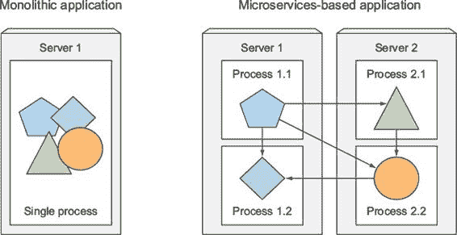
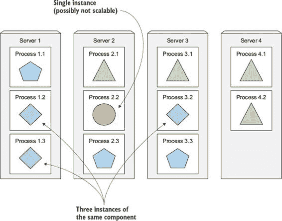
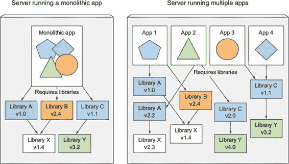
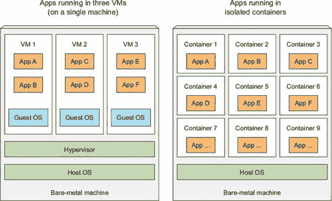
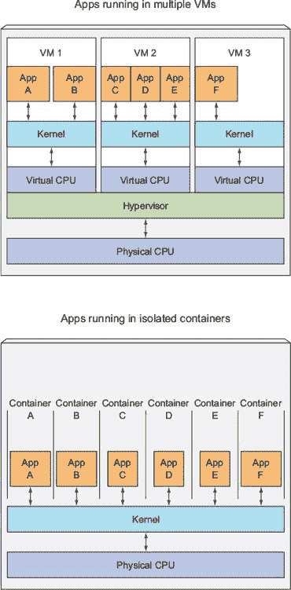
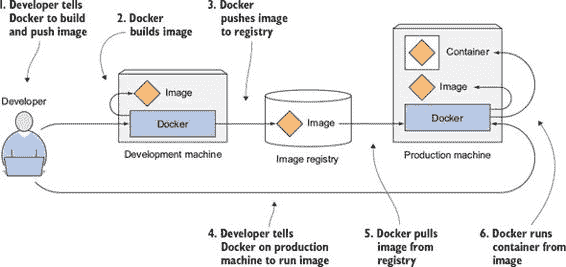
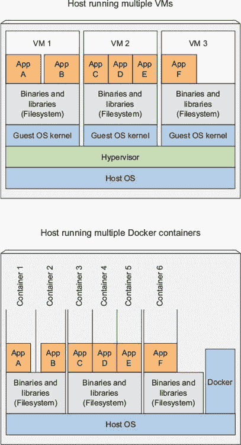
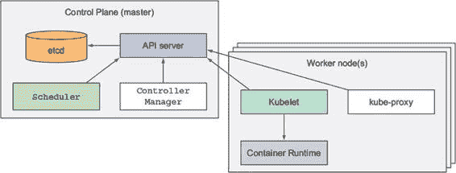
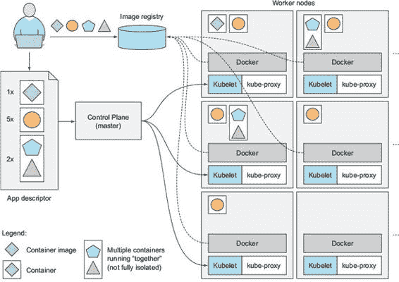

第一章\. 介绍 Kubernetes

本章涵盖

+   理解近年来软件开发和部署的变化

+   使用容器隔离应用程序并减少环境差异

+   理解 Kubernetes 如何使用容器和 Docker

+   使用 Kubernetes 使开发者和系统管理员的工作变得更简单

几年前，大多数软件应用程序都是大型单体，要么作为一个单独的进程运行，要么作为少量分散在几台服务器上的进程运行。这些遗留系统今天仍然很普遍。它们的发布周期缓慢，更新相对较少。在每个发布周期的末尾，开发者将整个系统打包，并将其交给运维团队，然后运维团队部署并监控它。在硬件故障的情况下，运维团队手动将其迁移到剩余的健康服务器。

今天，这些大型单体遗留应用程序正在逐渐被分解成更小、独立运行的组件，称为微服务。由于微服务彼此解耦，它们可以单独开发、部署、更新和扩展。这使得您能够快速且频繁地更改组件，以跟上今天快速变化的业务需求。

但是，随着可部署组件数量的增加和数据中心规模的不断扩大，配置、管理和保持整个系统平稳运行变得越来越困难。确定每个组件放置的位置以实现高资源利用率并因此降低硬件成本变得更加困难。手动完成所有这些工作是一项艰巨的任务。我们需要自动化，这包括自动将这些组件调度到我们的服务器上、自动配置、监督和故障处理。这正是 Kubernetes 发挥作用的地方。

Kubernetes 允许开发者自行部署他们的应用程序，并且可以随时进行部署，无需从运维（ops）团队获得任何帮助。但 Kubernetes 的好处不仅限于开发者。它还通过在硬件故障的情况下自动监控和重新调度这些应用程序来帮助运维团队。系统管理员（sysadmins）的焦点从监督单个应用程序转移到主要监督和管理 Kubernetes 以及其他基础设施，而 Kubernetes 本身则负责应用程序。

| |
| --- |

注意

Kubernetes 在希腊语中意为飞行员或舵手（握有船舵的人）。人们对 Kubernetes 的发音有几种不同的方式。许多人将其发音为 Koo-ber-nay-tace，而其他人则更接近于 Koo-ber-netties。无论您使用哪种形式，人们都会理解您的意思。

| |
| --- |

Kubernetes 抽象化了硬件基础设施，并将您的整个数据中心暴露为一个单一的巨大计算资源。它允许您部署和运行软件组件，而无需了解实际的服务器。当通过 Kubernetes 部署多组件应用程序时，它会为每个组件选择一个服务器，部署它，并使其能够轻松地找到并与其他应用程序的所有其他组件进行通信。

这使得 Kubernetes 非常适合大多数本地数据中心，但它在被用于最大的数据中心时开始发光，例如由云服务提供商建设和运营的那些数据中心。Kubernetes 允许他们为开发者提供一个简单的平台，用于部署和运行任何类型的应用程序，同时不需要云服务提供商的自己的系统管理员了解在其硬件上运行的数万个应用程序的任何信息。

随着越来越多的大型公司接受 Kubernetes 模型作为运行应用程序的最佳方式，它正在成为在云中以及本地本地基础设施上运行分布式应用程序的标准方式。

1.1. 理解需要像 Kubernetes 这样的系统

在您开始详细了解 Kubernetes 之前，让我们快速看一下近年来应用程序的开发和部署是如何发生变化的。这种变化既是将大型单体应用程序拆分为更小的微服务的结果，也是运行这些应用程序的基础设施变化的结果。理解这些变化将帮助您更好地看到使用 Kubernetes 和 Docker 等容器技术的好处。

1.1.1. 从单体应用程序迁移到微服务

单体应用程序由所有紧密耦合在一起的组件组成，必须作为一个整体进行开发、部署和管理，因为它们都作为一个单独的操作系统进程运行。应用程序某一部分的更改需要整个应用程序的重部署，随着时间的推移，部分之间缺乏明确的边界导致复杂性增加，由于这些部分之间相互依赖的无约束增长，整个系统的质量因此恶化。

运行单体应用程序通常需要少量强大的服务器，这些服务器能够提供足够的资源来运行应用程序。为了应对系统负载的增加，你随后可以选择通过增加 CPU、内存和其他服务器组件来垂直扩展服务器（也称为向上扩展），或者通过设置额外的服务器并运行应用程序的多个副本（或副本）来水平扩展整个系统（向外扩展）。虽然向上扩展通常不需要对应用程序进行任何更改，但它相对较快地变得昂贵，并且在实践中总是有一个上限。另一方面，向外扩展在硬件方面相对便宜，但可能需要在应用程序代码中进行重大更改，并且并不总是可行——应用程序的某些部分在水平扩展方面极其困难或几乎不可能（例如关系数据库）。如果单体应用程序的任何部分不可扩展，整个应用程序就变得不可扩展，除非你能以某种方式将其拆分。

将应用程序拆分为微服务

这些以及其他问题迫使我们必须开始将复杂的单体应用程序拆分成更小的、可以独立部署的组件，这些组件被称为微服务。每个微服务作为一个独立的过程运行（参见图 1.1），并通过简单、定义良好的接口（API）与其他微服务进行通信。

图 1.1\. 单体应用程序内部的组件与独立微服务

微服务通过同步协议（如 HTTP）进行通信，通常通过 RESTful（表示状态传输）API 公开，或者通过异步协议（如 AMQP，高级消息队列协议）进行通信。这些协议简单、大多数开发者都理解，并且与任何特定的编程语言无关。每个微服务都可以使用最适合实现该特定微服务的语言编写。

由于每个微服务都是一个具有相对静态外部 API 的独立进程，因此可以单独开发和部署每个微服务。只要 API 没有更改或仅以向后兼容的方式进行更改，对其中任何一个的更改就不需要更改或重新部署任何其他服务。

微服务的扩展

与需要整体扩展系统的单体系统不同，微服务的扩展是基于每个服务的，这意味着你可以选择只扩展那些需要更多资源的特定服务，而将其他服务保持在原始规模。图 1.2 展示了一个示例。某些组件被复制并在不同的服务器上作为多个进程部署，而其他组件则作为一个单一的应用程序进程运行。当一个单体应用程序无法扩展，因为其某个部分不可扩展时，将应用程序拆分为微服务允许你水平扩展允许扩展的部分，而对于不扩展的部分则垂直扩展。

图 1.2\. 每个微服务都可以单独扩展。

微服务的部署

像往常一样，微服务也有其缺点。当你的系统只包含少量可部署的组件时，管理这些组件是容易的。决定每个组件部署位置是微不足道的，因为没有那么多选择。当这些组件的数量增加时，与部署相关的决策变得越来越困难，因为不仅部署组合的数量增加了，而且组件之间的相互依赖关系也以更大的比例增加。

微服务作为一个团队一起执行工作，因此它们需要找到彼此并进行通信。在部署它们时，需要有人或某种机制来正确配置所有这些服务，以便它们能够作为一个单一系统协同工作。随着微服务数量的增加，这变得既繁琐又容易出错，尤其是当考虑到当服务器失败时运维/系统管理员团队需要做什么时。

微服务还带来其他问题，例如使调试和跟踪执行调用变得困难，因为它们跨越多个进程和机器。幸运的是，这些问题现在正在通过分布式跟踪系统如 Zipkin 得到解决。

理解环境需求差异

正如我之前提到的，微服务架构中的组件不仅独立部署，而且也是这样开发的。由于它们的独立性和通常有单独的团队开发每个组件的事实，没有任何东西阻碍每个团队使用不同的库，并在需要时替换它们。应用程序组件之间的依赖关系差异，如图 1.3 所示，其中应用程序需要同一库的不同版本，是不可避免的。

图 1.3\. 在同一主机上运行的多应用程序可能会有冲突的依赖关系。

部署需要不同版本的共享库，以及/或其他环境特定要求的动态链接应用程序，对于在生产服务器上部署和管理它们的运维团队来说，很快就会变成一场噩梦。你需要部署在同一主机上的组件数量越多，管理它们的所有依赖关系以满足所有要求就越困难。

1.1.2\. 为应用程序提供一致的环境

无论你正在开发和部署多少个单独的组件，开发和运维团队始终必须处理的一个最大的问题是他们在其中运行应用程序的环境差异。不仅开发和生产环境之间存在巨大差异，个别生产机器之间也存在差异。另一个不可避免的事实是，单个生产机器的环境会随着时间的推移而变化。

这些差异从硬件到操作系统，再到每台机器上可用的库都有所不同。生产环境由运维团队管理，而开发者通常自己负责他们的开发笔记本电脑。差异在于这两组人对系统管理的了解程度，这可以理解地导致这两个系统之间存在相当大的差异，更不用说系统管理员更注重保持系统与最新的安全补丁保持更新，而许多开发者并不那么关心这一点。

此外，生产系统可以运行来自多个开发者或开发团队的应用程序，这对于开发者的计算机来说并不一定是真的。生产系统必须为它所托管的所有应用程序提供适当的环境，即使它们可能需要不同版本，甚至是冲突的库版本。

为了减少仅在生产环境中出现的问题数量，如果应用程序在开发和生产过程中能够在完全相同的环境中运行，那么它们将拥有完全相同的操作系统、库、系统配置、网络环境以及所有其他内容，这将是非常理想的。此外，你也不希望这个环境随着时间的推移发生太大的变化，如果可能的话。另外，如果可能的话，你希望有将应用程序添加到同一服务器上的能力，而不会影响该服务器上现有的任何应用程序。

1.1.3\. 转向持续交付：DevOps 和 NoOps

在过去几年里，我们也看到了整个应用程序开发过程以及应用程序在生产中的维护方式的转变。在过去，开发团队的工作是创建应用程序并将其移交给运维团队，然后运维团队负责部署、维护并确保其正常运行。但现在，组织意识到最好让开发应用程序的同一团队也参与部署和维护其整个生命周期。这意味着开发人员、QA 和运维团队现在需要在整个过程中进行协作。这种做法被称为 DevOps。

理解好处

让开发人员更多地参与到应用程序的生产运行中，使他们更好地理解用户的需要和问题，以及运维团队在维护应用程序时面临的问题。现在，应用程序开发人员也更倾向于尽早向用户提供应用程序，并利用他们的反馈来引导应用程序的进一步开发。

为了更频繁地发布应用程序的新版本，你需要简化部署流程。理想情况下，你希望开发人员自己部署应用程序，而无需等待运维人员。但部署应用程序通常需要了解底层基础设施和数据中心的硬件组织结构。开发人员并不总是知道这些细节，而且大多数时候，他们甚至不想了解这些。

让开发人员和系统管理员发挥他们最擅长的

尽管开发人员和系统管理员都致力于实现同一个目标，即成功运行软件应用程序作为服务提供给客户，但他们有不同的个人目标和激励因素。开发人员喜欢创建新功能和改进用户体验。他们通常不希望成为确保底层操作系统保持最新状态、所有安全补丁等的人。他们更愿意将这项工作留给系统管理员。

运维团队负责生产部署以及它们运行的硬件基础设施。他们关心系统安全、利用率和其他对开发人员来说不是高优先级的问题。运维人员不希望处理所有应用程序组件的隐含依赖关系，也不希望考虑底层操作系统或基础设施的更改如何影响应用程序的整体运行，但他们必须这样做。

理想情况下，你希望开发人员自己部署应用程序，而不需要了解任何关于硬件基础设施的信息，也不需要与运维团队打交道。这被称为 NoOps。显然，你仍然需要有人来维护硬件基础设施，但理想情况下，无需处理运行在其上的每个应用程序的特定问题。

正如您将看到的，Kubernetes 使我们能够实现所有这些功能。通过抽象化实际硬件并将其作为部署和运行应用程序的单个平台暴露出来，它允许开发者配置和部署他们的应用程序，而无需任何系统管理员的帮助，并允许系统管理员专注于保持底层基础设施的正常运行，而无需了解其上运行的实际应用程序。

1.2\. 介绍容器技术

在第 1.1 节中，我列举了当今开发和运维团队面临的一些问题。虽然您有多种方法来处理这些问题，但本书将专注于它们如何通过 Kubernetes 得到解决。

Kubernetes 使用 Linux 容器技术来提供运行应用程序的隔离，因此在我们深入研究 Kubernetes 本身之前，您需要熟悉容器的基本知识，以了解 Kubernetes 本身做什么，以及它将哪些任务卸载给容器技术，如 Docker 或 rkt（发音为“rock-it”）。

1.2.1\. 理解容器是什么

在第 1.1.1 节中，我们看到了在同一台机器上运行的不同的软件组件将需要不同、可能冲突的依赖库版本，或者通常具有其他不同的环境要求。

当一个应用程序仅由少量大型组件组成时，为每个组件分配一个专用的虚拟机（VM）并为他们各自提供操作系统实例来隔离其环境是完全可接受的。但当这些组件开始变小且数量开始增加时，如果您不想浪费硬件资源并保持硬件成本较低，您就不能为每个组件分配自己的虚拟机。但这不仅仅是关于浪费硬件资源。因为每个虚拟机通常都需要单独配置和管理，虚拟机数量的增加也会导致人力资源的浪费，因为它们大大增加了系统管理员的负担。

使用 Linux 容器技术隔离组件

与使用虚拟机来隔离每个微服务（或一般软件流程）的环境相比，开发者正在转向 Linux 容器技术。它们允许您在同一台主机机器上运行多个服务，不仅为每个服务提供不同的环境，而且将它们彼此隔离，类似于虚拟机，但开销要小得多。

在容器中运行的过程是在宿主操作系统中运行的，就像所有其他进程一样（与虚拟机不同，虚拟机中的进程在单独的操作系统中运行）。但容器中的进程仍然与其他进程隔离。对于进程本身来说，它看起来就像它是这台机器和其操作系统中唯一运行的进程。

比较虚拟机与容器

与虚拟机相比，容器要轻量得多，这使得你可以在相同的硬件上运行更多的软件组件，主要是因为每个虚拟机都需要运行自己的系统进程集，这需要额外的计算资源，除了组件自身进程消耗的资源之外。另一方面，容器不过是在宿主操作系统上运行的单个隔离进程，仅消耗应用程序消耗的资源，而不需要任何额外进程的开销。

由于虚拟机的开销，你通常会将多个应用程序组合到每个虚拟机中，因为你没有足够的资源为每个应用程序分配整个虚拟机。当使用容器时，你可以（并且应该）为每个应用程序使用一个容器，如图图 1.4 所示。最终结果是，你可以在同一裸机机器上容纳更多的应用程序。

图 1.4\. 使用虚拟机隔离应用程序组与使用容器隔离单个应用程序

当你在主机上运行三个虚拟机时，有三个完全独立的操作系统在相同的裸机硬件上运行和共享。在这些虚拟机下面是宿主操作系统和一个虚拟机管理程序，它将物理硬件资源划分为更小的虚拟资源集，这些资源可以被每个虚拟机内部的操作系统使用。在那些虚拟机内部运行的应用程序会对虚拟机中的客户操作系统内核执行系统调用，然后内核通过虚拟机管理程序在宿主物理 CPU 上执行 x86 指令。

| |
| --- |

注意

存在两种类型的虚拟机管理程序。类型 1 虚拟机管理程序不使用宿主操作系统，而类型 2 则使用。

| |
| --- |

另一方面，容器都在宿主操作系统运行的相同内核上执行系统调用。这个单一的内核是唯一在宿主 CPU 上执行 x86 指令的内核。CPU 不需要像虚拟机那样进行任何类型的虚拟化（见图 1.5）。

图 1.5\. 虚拟机中的应用程序使用 CPU 的方式与容器中应用程序使用 CPU 的方式的区别

虚拟机的主要优势是它们提供的完全隔离，因为每个虚拟机都运行自己的 Linux 内核，而容器都调用相同的内核，这显然可能构成安全风险。如果你硬件资源有限，当需要隔离少量进程时，虚拟机可能是一个选择。要在一个机器上运行更多数量的隔离进程，容器由于它们的低开销，是一个更好的选择。记住，每个虚拟机都运行自己的系统服务集，而容器则不需要，因为它们都在同一个操作系统上运行。这也意味着运行容器时，不需要像虚拟机那样启动任何东西。在容器中运行的进程会立即启动。

介绍使容器隔离成为可能机制

到目前为止，你可能想知道容器如何在同一操作系统中运行时如何精确地隔离进程。两种机制使得这一点成为可能。第一种是 Linux 命名空间（Linux Namespaces），确保每个进程看到自己的系统视图（文件、进程、网络接口、主机名等）。第二种是 Linux 控制组（cgroups），它限制了进程可以消耗的资源量（CPU、内存、网络带宽等）。

使用 Linux 命名空间隔离进程

默认情况下，每个 Linux 系统最初只有一个命名空间。所有系统资源，如文件系统、进程 ID、用户 ID、网络接口等，都属于单个命名空间。但你可以创建额外的命名空间并在它们之间组织资源。当运行一个进程时，你将在其中一个命名空间内运行它。进程将只能看到同一命名空间内的资源。嗯，存在多种命名空间，所以一个进程不属于一个命名空间，而是属于每种类型的命名空间。

存在以下类型的命名空间：

+   挂载（mnt）

+   进程 ID（pid）

+   网络（net）

+   进程间通信（ipc）

+   UTS

+   用户 ID（user）

每种类型的命名空间用于隔离一组特定的资源。例如，UTS 命名空间决定了运行在该命名空间内的进程可以看到的主机名和域名。通过将两个不同的 UTS 命名空间分配给一对进程，你可以使它们看到不同的本地主机名。换句话说，对于这两个进程来说，它们似乎在不同的机器上运行（至少在主机名方面是这样）。

同样，进程所属的网络命名空间决定了运行在该进程内的应用程序可以看到哪些网络接口。每个网络接口属于恰好一个命名空间，但可以从一个命名空间移动到另一个命名空间。每个容器使用自己的网络命名空间，因此每个容器都看到自己的网络接口集。

这应该能给你一个基本的概念，了解命名空间是如何用来隔离容器中运行的应用程序的。

限制进程可用的资源

容器隔离的另一部分是限制容器可以消耗的系统资源量。这是通过 cgroups 实现的，它是 Linux 内核的一个功能，可以限制进程（或一组进程）的资源使用。进程不能使用超过配置的 CPU、内存、网络带宽等资源量。这样，进程就不能占用为其他进程保留的资源，这类似于每个进程都在单独的机器上运行。

1.2.2. 介绍 Docker 容器平台

尽管容器技术已经存在很长时间了，但随着 Docker 容器平台的兴起，它们变得更加广为人知。Docker 是第一个使容器能够在不同机器之间轻松便携的容器系统。它简化了打包应用程序的过程，不仅包括应用程序，还包括所有库和其他依赖项，甚至包括整个操作系统文件系统，使其成为一个简单、便携的包，可用于将应用程序部署到任何运行 Docker 的其他机器上。

当你运行一个用 Docker 打包的应用程序时，它会看到你与之捆绑的确切文件系统内容。无论它是在你的开发机器上运行还是在生产机器上运行，它都会看到相同的文件，即使生产服务器运行的是完全不同的 Linux 操作系统。应用程序不会看到它运行的服务器上的任何内容，因此如果服务器安装的库与你的开发机器完全不同，这并不重要。

例如，如果你已经将应用程序与整个 Red Hat Enterprise Linux (RHEL)操作系统的文件打包在一起，那么当你在运行 Fedora 的开发计算机上运行它，或者在运行 Debian 或其他 Linux 发行版的服务器上运行它时，应用程序都会相信它是在 RHEL 内部运行的。唯一可能不同的是内核。

这类似于通过在虚拟机中安装操作系统来创建 VM 镜像，然后在其中安装应用程序，并将整个 VM 镜像分发并运行。Docker 实现了相同的效果，但它不是使用 VM 来实现应用程序隔离，而是使用上一节中提到的 Linux 容器技术来提供（几乎）与 VM 相同的隔离级别。它不是使用庞大的单体 VM 镜像，而是使用容器镜像，这些镜像通常更小。

Docker 容器镜像与 VM 镜像之间的一大区别是，容器镜像由层组成，这些层可以在多个镜像之间共享和重用。这意味着如果之前在运行包含相同层的不同容器镜像时已经下载了其他层，则只需要下载该镜像的某些层。

理解 Docker 概念

Docker 是一个用于打包、分发和运行应用程序的平台。正如我们之前所述，它允许你将应用程序及其整个环境打包在一起。这可以是应用程序所需的几个库，甚至是通常在已安装操作系统的文件系统上可用的所有文件。Docker 使得将此包传输到中央存储库成为可能，然后可以从该存储库将其传输到任何运行 Docker 的计算机上，并在那里执行（大多数情况下是这样，但并非总是如此，我们很快会解释）。

Docker 中的三个主要概念构成了这个场景：

+   镜像——基于 Docker 的容器镜像是将您的应用程序及其环境打包进的东西。它包含将可供应用程序和其他元数据使用的文件系统，例如，当运行镜像时应执行的可执行文件路径。

+   注册表——Docker 注册表是一个存储您的 Docker 镜像并便于不同人之间和计算机之间共享这些镜像的仓库。当您构建镜像时，您可以在构建它的计算机上运行它，或者将镜像推送到注册表，然后在另一台计算机上拉取（下载）它并运行。某些注册表是公开的，允许任何人从中拉取镜像，而另一些则是私有的，只有某些人或机器可以访问。

+   容器——基于 Docker 的容器是从基于 Docker 的容器镜像创建的常规 Linux 容器。运行中的容器是在运行 Docker 的主机上运行的进程，但它与主机以及所有其他在其上运行的进程完全隔离。该进程也受到资源限制，这意味着它只能访问和使用分配给它的资源（CPU、RAM 等）。

构建、分发和运行 Docker 镜像

图 1.6 展示了这三个概念以及它们之间的关系。开发者首先构建一个镜像，然后将其推送到注册表。因此，任何可以访问注册表的人都可以使用该镜像。然后，他们可以将镜像拉取到任何运行 Docker 的其他机器上并运行它。Docker 基于该镜像创建一个隔离的容器，并运行作为镜像一部分指定的二进制可执行文件。

图 1.6\. Docker 镜像、注册表和容器

比较虚拟机和 Docker 容器

我已经解释了 Linux 容器通常与虚拟机相似，但更轻量。现在让我们看看 Docker 容器具体是如何与虚拟机（以及 Docker 镜像与 VM 镜像）相比的。图 1.7 再次显示了相同的六个应用程序在虚拟机和 Docker 容器中同时运行。

图 1.7\. 在三个虚拟机上运行六个应用程序与在 Docker 容器中运行它们的比较

您会注意到，当在虚拟机中运行以及作为两个独立的容器运行时，应用程序 A 和 B 都可以访问相同的二进制文件和库。在虚拟机中，这是显而易见的，因为两个应用程序都看到相同的文件系统（虚拟机的文件系统）。但我们说过每个容器都有自己的隔离文件系统。应用程序 A 和应用程序 B 如何共享相同的文件？

理解镜像层

我已经说过，Docker 镜像由层组成。不同的镜像可以包含完全相同的层，因为每个 Docker 镜像都是建立在另一个镜像之上的，并且两个不同的镜像都可以使用相同的父镜像作为其基础。这加快了图像在网络上的分发，因为作为第一个图像的一部分已经传输的层在传输其他图像时不需要再次传输。

但层不仅使分发更高效，还有助于减少镜像的存储占用。每个层只存储一次。因此，从基于相同基础层的两个镜像创建的两个容器可以读取相同的文件，但如果其中一个覆盖了这些文件，另一个则看不到这些更改。因此，即使它们共享文件，它们之间仍然是隔离的。这是因为容器镜像层是只读的。当容器运行时，在镜像的层之上创建一个新的可写层。当容器中的进程向位于底层之一的文件写入时，在顶层创建整个文件的副本，并且进程向副本写入。

理解容器镜像的可移植性限制

理论上，容器镜像可以在运行 Docker 的任何 Linux 机器上运行，但存在一个小小的限制——与所有容器都在主机上使用主机的 Linux 内核这一事实相关。如果一个容器化应用程序需要特定的内核版本，它可能不会在每台机器上运行。如果机器运行的是不同的 Linux 内核版本或没有相同的内核模块可用，该应用程序就不能在该机器上运行。

与虚拟机相比，容器要轻量得多，但它们对容器内运行的应用程序施加了某些限制。虚拟机没有这样的限制，因为每个虚拟机都运行自己的内核。

不仅关乎内核。还应该明确，为特定硬件架构构建的容器化应用程序只能在具有相同架构的其他机器上运行。你不能将针对 x86 架构构建的应用程序容器化并期望它在基于 ARM 的机器上运行，因为这也运行 Docker。你仍然需要虚拟机来做到这一点。

1.2.3\. 介绍 rkt——Docker 的替代品

Docker 是第一个使容器主流化的容器平台。我希望我已经清楚地说明，Docker 本身并不提供进程隔离。容器的实际隔离是在 Linux 内核级别通过使用如 Linux Namespaces 和 cgroups 等内核功能来实现的。Docker 只是使这些功能更容易使用。

在 Docker 成功之后，开放容器倡议（OCI）诞生，旨在围绕容器格式和运行时创建开放行业标准。Docker 是这一倡议的一部分，rkt（发音为“rock-it”）也是，它是另一个 Linux 容器引擎。

与 Docker 类似，rkt 是一个运行容器的平台。它非常重视安全性、可组合性和符合开放标准。它使用 OCI 容器镜像格式，甚至可以运行常规的 Docker 容器镜像。

本书侧重于使用 Docker 作为 Kubernetes 的容器运行时，因为它是 Kubernetes 初始支持的唯一一种。最近，Kubernetes 也开始支持 rkt，以及其他容器运行时。

我在这里提到 rkt 的原因是为了防止你犯这样一个错误：认为 Kubernetes 是一个专门为基于 Docker 的容器设计的容器编排系统。实际上，在本书的整个过程中，你会发现 Kubernetes 的本质并不是编排容器。它要复杂得多。容器恰好是运行在不同集群节点上的最佳方式。考虑到这一点，让我们最终深入探讨本书的核心内容——Kubernetes。

1.3\. 介绍 Kubernetes

我们已经展示了随着你的系统中可部署的应用程序组件数量的增加，管理它们变得越来越困难。谷歌可能是第一家意识到它需要一种更好的方式来部署和管理其软件组件及其基础设施以实现全球扩展的公司。它是世界上为数不多的运行数十万台服务器并不得不处理如此大规模部署管理的公司之一。这迫使他们开发解决方案，以使成千上万的软件组件的开发和部署变得可管理且成本效益高。

1.3.1\. 了解其起源

经过多年的发展，谷歌开发了一个内部系统，称为 Borg（后来又开发了一个新的系统，称为 Omega），该系统帮助应用程序开发者和系统管理员管理那些成千上万的应用程序和服务。除了简化开发和管理工作外，它还帮助他们实现了基础设施的高效利用，这对于组织规模很大时尤为重要。当你运行数十万台机器时，即使是利用率的微小提升也能带来数百万美元的节省，因此开发这样一个系统的激励措施是显而易见的。

在将 Borg 和 Omega 保密整整十年之后，2014 年谷歌推出了 Kubernetes，这是一个基于 Borg、Omega 和其他内部谷歌系统经验积累的开源系统。

1.3.2\. 从山顶俯瞰 Kubernetes

Kubernetes 是一个软件系统，它允许你轻松地在它之上部署和管理容器化应用。它依赖于 Linux 容器的特性，以运行异构应用，而无需了解这些应用的任何内部细节，也无需在每个主机上手动部署这些应用。因为这些应用在容器中运行，所以它们不会影响同一服务器上运行的其他应用，这在运行针对完全不同组织的应用时至关重要。这对云服务提供商来说至关重要，因为他们力求最大限度地利用其硬件，同时仍需保持托管应用之间的完全隔离。

Kubernetes 允许你在数千个计算机节点上运行你的软件应用，就像所有这些节点都是一个单一、巨大的计算机一样。它抽象出底层基础设施，通过这样做，简化了开发和运维团队的开发、部署和管理。

无论你的集群只包含几个节点还是数千个节点，通过 Kubernetes 部署应用总是相同的。集群的大小根本无关紧要。额外的集群节点仅仅代表了可供部署应用使用的额外资源量。

理解 Kubernetes 的核心功能

图 1.8 展示了 Kubernetes 系统最简单的视图。该系统由一个主节点和任意数量的工作节点组成。当开发者向主节点提交应用列表时，Kubernetes 将它们部署到工作节点集群中。组件最终落在哪个节点上（并且不应该）并不重要——无论是对于开发者还是系统管理员来说。

图 1.8\. Kubernetes 将整个数据中心暴露为单个部署平台。

开发者可以指定某些应用必须一起运行，Kubernetes 将它们部署在同一个工作节点上。其他应用将被分散在集群中，但它们可以以相同的方式相互通信，无论它们部署在哪里。

帮助开发者专注于核心应用功能

可以将 Kubernetes 视为集群的操作系统。它使应用开发者从将某些基础设施相关服务实现到他们的应用中解脱出来；相反，他们依赖 Kubernetes 提供这些服务。这包括服务发现、扩展、负载均衡、自我修复甚至领导者选举。因此，应用开发者可以专注于实现应用的真正功能，而无需浪费时间考虑如何将它们与基础设施集成。

帮助运维团队实现更好的资源利用率

Kubernetes 将在集群的某个位置运行您的容器化应用，向其组件提供信息以了解如何找到彼此，并保持所有组件的运行。因为您的应用不关心它运行在哪个节点上，所以 Kubernetes 可以在任何时候重新定位应用，并通过混合匹配应用，实现比手动调度更好的资源利用率。

1.3.3.理解 Kubernetes 集群的架构

我们已经看到了 Kubernetes 架构的全貌。现在让我们更详细地看看 Kubernetes 集群是由什么组成的。在硬件层面，Kubernetes 集群由许多节点组成，这些节点可以分为两种类型：

+   主节点，它托管 Kubernetes 控制平面，该平面控制和管理工作整个 Kubernetes 系统

+   运行您部署的实际应用的 Worker 节点

图 1.9 显示了在这些两组节点上运行的组件。我将在下面解释它们。

图 1.9。组成 Kubernetes 集群的组件

控制平面

控制平面是控制集群并使其运行的部分。它由多个组件组成，这些组件可以运行在单个主节点上，也可以跨多个节点分割并复制以确保高可用性。这些组件包括

+   Kubernetes API 服务器，您和其他控制平面组件与之通信

+   调度器，它调度您的应用（为您的应用的每个可部署组件分配一个 Worker 节点）

+   控制器管理器，它执行集群级别的功能，例如复制组件、跟踪 Worker 节点、处理节点故障等

+   etcd，一个可靠的分布式数据存储，用于持久化存储集群配置。

控制平面的组件持有并控制集群的状态，但它们不运行您的应用。这项工作由（Worker）节点来完成。

节点

Worker 节点是运行您的容器化应用的机器。运行、监控和为您的应用提供服务的工作由以下组件完成：

+   Docker、rkt 或另一个容器运行时，它运行您的容器

+   Kubelet，它与 API 服务器通信并管理其节点上的容器

+   Kubernetes 服务代理（kube-proxy），它在应用组件之间进行网络流量负载均衡

我们将在第十一章中详细解释所有这些组件。我不喜欢在解释事物的工作原理之前先解释事物的作用，并教人们如何使用它。这就像学习开车一样。您不想知道引擎盖下是什么。您首先想学习如何从 A 点到 B 点驾驶。只有在你学会了如何做到这一点之后，你才会对汽车是如何做到这一点感兴趣。毕竟，了解引擎盖下的事情可能会在汽车抛锚并让您被困在路边时帮助您再次启动汽车。

1.3.4. 在 Kubernetes 中运行应用程序

要在 Kubernetes 中运行应用程序，您首先需要将其打包成一个或多个容器镜像，将这些镜像推送到镜像仓库，然后将您的应用程序描述发布到 Kubernetes API 服务器。

描述包括有关容器镜像或包含您的应用程序组件的镜像的信息，以及这些组件之间是如何相互关联的，以及哪些组件需要运行在同一个节点上（协同运行）以及哪些不需要。对于每个组件，您还可以指定您想要运行多少个副本（或副本）。此外，描述还包括哪些组件为内部或外部客户端提供服务，并且应该通过单个 IP 地址公开，并使其他组件能够发现。

理解描述如何导致运行中的容器

当 API 服务器处理您的应用程序描述时，调度器根据每个组所需的计算资源以及每个节点在该时刻未分配的资源，将指定的容器组调度到可用的工作节点上。然后，这些节点上的 Kubelet 指示容器运行时（例如 Docker）拉取所需的容器镜像并运行容器。

查看图 1.10，以更好地理解应用程序如何在 Kubernetes 中部署。应用程序描述列出了四个容器，分为三个集合（这些集合被称为 pod；我们将在第三章中解释它们是什么）。前两个 pod 每个只包含一个容器，而最后一个包含两个。这意味着两个容器都需要协同运行，并且不应该相互隔离。在每个 pod 旁边，您还可以看到一个表示每个 pod 需要并行运行的副本数量的数字。在将描述提交给 Kubernetes 后，它将指定每个 pod 的副本数量调度到可用的工作节点上。节点上的 Kubelets 然后将告诉 Docker 从镜像仓库拉取容器镜像并运行容器。

图 1.10。Kubernetes 架构的基本概述以及在其上运行的应用程序

保持容器运行

一旦应用程序开始运行，Kubernetes 将不断确保应用程序的部署状态始终与您提供的描述相匹配。例如，如果您指定您始终想要运行五个 Web 服务器的实例，Kubernetes 将始终保持恰好五个实例运行。如果这些实例中的一个停止正常工作，比如其进程崩溃或停止响应，Kubernetes 将自动重启它。

类似地，如果整个工作节点死亡或变得不可访问，Kubernetes 将为在节点上运行的所有容器选择新的节点，并在新选择的节点上运行它们。

扩展副本数量

当应用程序运行时，您可以决定您想要增加或减少副本数量，Kubernetes 将启动额外的副本或停止多余的副本。您甚至可以将决定最佳副本数量的任务留给 Kubernetes。它可以根据实时指标自动调整数量，例如 CPU 负载、内存消耗、每秒查询数或任何其他应用程序公开的指标。

打击移动目标

我们已经说过 Kubernetes 可能需要将您的容器在集群中移动。这可能会发生在它们运行的节点失败或因为需要为其他容器腾出空间而被从节点驱逐时。如果容器正在为外部客户端或集群中运行的容器提供服务，当容器不断在集群中移动时，它们如何正确使用容器？当这些容器被复制并分散在整个集群中时，客户端如何连接到提供服务的容器？

为了让客户端能够轻松找到提供特定服务的容器，您可以告诉 Kubernetes 哪些容器提供相同的服务，Kubernetes 将将它们全部暴露在单个静态 IP 地址上，并将该地址暴露给集群中运行的所有应用程序。这是通过环境变量完成的，但客户端也可以通过古老的 DNS 查找服务 IP。kube-proxy 将确保连接到服务的连接在提供服务的所有容器之间进行负载均衡。服务的 IP 地址保持不变，因此客户端可以始终连接到其容器，即使它们在集群中移动。

1.3.5. 理解使用 Kubernetes 的好处

如果您在所有服务器上部署了 Kubernetes，运维团队就不再需要处理应用程序的部署了。因为容器化应用程序已经包含了运行所需的所有内容，系统管理员不需要安装任何东西来部署和运行应用程序。在任何已部署 Kubernetes 的节点上，Kubernetes 可以立即运行应用程序，无需系统管理员的帮助。

简化应用程序部署

因为 Kubernetes 将所有工作节点暴露为一个单一的部署平台，应用程序开发者可以自行开始部署应用程序，而无需了解构成集群的服务器。

从本质上讲，所有节点现在都是一组等待应用程序消耗的计算资源。开发者通常不关心应用程序运行在哪种服务器上，只要服务器能够为应用程序提供足够的系统资源即可。

确实存在某些情况下，开发者关心应用程序应该运行在哪种硬件上。如果节点是异构的，你会发现有些情况下你希望某些应用程序运行在具有特定功能的节点上，而其他应用程序则运行在其他节点上。例如，你的某个应用程序可能需要在具有 SSD 的系统上运行，而其他应用程序在 HDD 上运行也运行良好。在这种情况下，显然你希望确保该特定应用程序始终被调度到具有 SSD 的节点上。

在不使用 Kubernetes 的情况下，系统管理员会选择一个具有 SSD 的特定节点并将应用程序部署在那里。但是，当使用 Kubernetes 时，而不是选择应用程序应该运行的特定节点，更合适的是告诉 Kubernetes 只在具有 SSD 的节点中选择。你将在第三章（index_split_028.html#filepos271328）中学习如何做到这一点。

实现更好的硬件利用率

通过在你的服务器上设置 Kubernetes 并使用它来运行你的应用程序而不是手动运行它们，你已经将应用程序与基础设施解耦。当你告诉 Kubernetes 运行你的应用程序时，你是在让它根据应用程序的资源需求描述和每个节点上的可用资源选择最合适的节点来运行你的应用程序。

通过使用容器而不是将应用程序绑定到集群中的特定节点，你允许应用程序在任何时间自由地在集群中移动，因此集群上运行的不同应用程序组件可以混合匹配，紧密打包到集群节点上。这确保了节点的硬件资源得到尽可能好的利用。

能够在任何时间在集群中移动应用程序的能力，使得 Kubernetes 能够比手动实现更好地利用基础设施。人类在寻找最佳组合方面并不擅长，尤其是当所有可能选项的数量巨大时，例如当你有许多应用程序组件和许多可以部署的服务器节点时。计算机显然可以比人类更好地、更快地完成这项工作。

健康检查和自我修复

拥有一个系统，可以在任何时间将应用程序移动到集群中，在服务器故障的情况下也很有价值。随着你的集群规模增加，你将更频繁地处理失败的计算机组件。

Kubernetes 监控你的应用程序组件以及它们运行的节点，并在节点故障的情况下自动将它们重新调度到其他节点。这使运维团队从手动迁移应用程序组件的负担中解脱出来，并允许团队立即专注于修复节点本身并将其返回到可用硬件资源池，而不是专注于重新定位应用程序。

如果您的基础设施有足够的备用资源，即使在没有失败节点的正常系统操作中，运维团队也不必立即对故障做出反应，例如凌晨 3 点，他们可以安心入睡，在正常工作时间处理失败的节点。

自动扩展

使用 Kubernetes 来管理您的已部署应用程序还意味着运维团队不需要不断监控单个应用程序的负载以应对突发的负载峰值。如前所述，Kubernetes 可以被告知监控每个应用程序使用的资源，并持续调整每个应用程序运行的实例数量。

如果 Kubernetes 运行在云基础设施上，添加额外的节点就像通过云提供商的 API 请求它们一样简单，那么 Kubernetes 甚至可以根据部署的应用程序的需求自动调整整个集群的大小，进行扩展或缩减。

简化应用程序开发

上一个章节中描述的功能主要对运维团队有益。但开发者呢？Kubernetes 为他们带来了什么？当然，它确实带来了。

如果您回顾一下应用程序在开发和生产环境中都在同一环境中运行的事实，这将对何时发现错误产生重大影响。我们都同意，您发现错误越早，修复它就越容易，修复它需要的劳动也越少。修复错误的是开发者，这意味着他们需要做的工作更少。

然后还有这样一个事实，开发者不需要实现他们通常需要实现的功能。这包括在集群应用程序中发现服务和/或对等节点。Kubernetes 会代替应用程序来做这件事。通常，应用程序只需要查找某些环境变量或执行 DNS 查询。如果这还不够，应用程序可以直接查询 Kubernetes API 服务器以获取这些和/或其他信息。以这种方式查询 Kubernetes API 服务器甚至可以节省开发者实现复杂的机制，如领导者选举。

作为 Kubernetes 带来的最终例证，您还需要考虑开发者将感受到的信心增加，知道当他们的应用程序的新版本即将推出时，Kubernetes 可以自动检测新版本是否不良，并立即停止其发布。这种信心增加通常加速了应用程序的持续交付，这对整个组织都有益。

1.4. 摘要

在本章的介绍中，您已经看到了应用程序在近年来是如何变化的，以及它们现在为什么更难部署和管理。我们介绍了 Kubernetes，并展示了它是如何与 Docker 和其他容器平台一起帮助部署和管理应用程序及其运行的基础设施的。您已经了解到

+   单体应用程序部署起来更容易，但随着时间的推移维护起来更困难，有时甚至无法进行扩展。

+   基于微服务的应用程序架构使得每个组件的开发更加容易，但部署和配置为一个单一系统则更为困难。

+   Linux 容器提供了与虚拟机几乎相同的优势，但它们更加轻量级，并允许更有效地利用硬件。

+   Docker 通过允许更轻松、更快速地提供容器化应用程序及其操作系统环境，改进了现有的 Linux 容器技术。

+   Kubernetes 将整个数据中心暴露为单个计算资源，用于运行应用程序。

+   开发者可以在不依赖系统管理员的情况下通过 Kubernetes 部署应用程序。

+   系统管理员可以通过让 Kubernetes 自动处理失败的节点来睡得更香。

在下一章中，你将通过构建一个应用程序并在 Docker 和 Kubernetes 中运行它来亲自动手。
