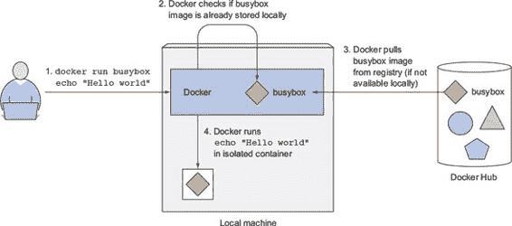
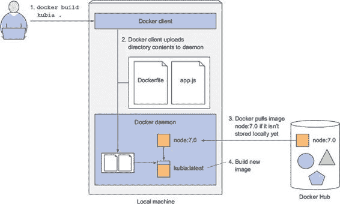
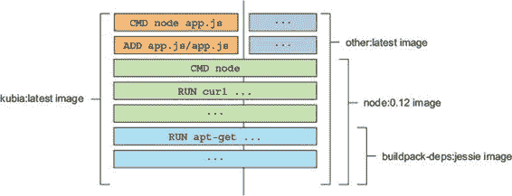
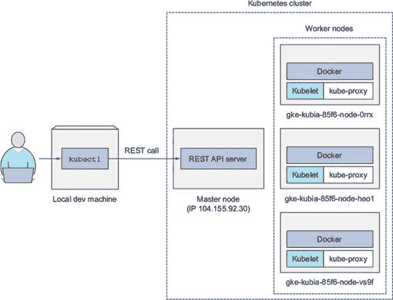
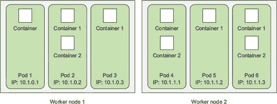
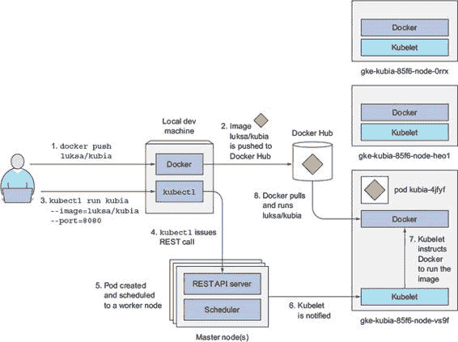
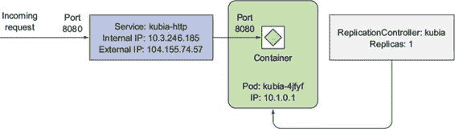
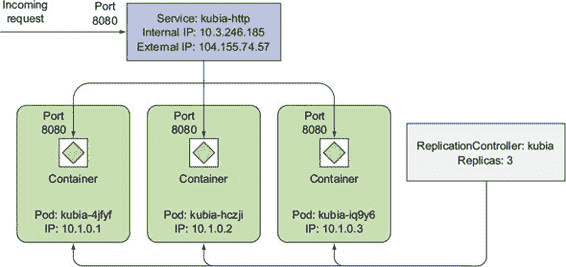
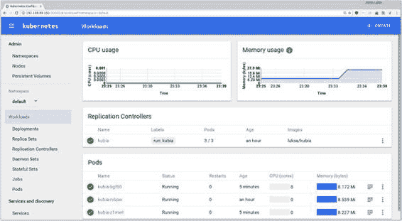

第二章：Docker 和 Kubernetes 的第一步

本章涵盖

+   使用 Docker 创建、运行和共享容器镜像

+   在本地运行单节点 Kubernetes 集群

+   在 Google Kubernetes Engine 上设置 Kubernetes 集群

+   设置和使用`kubectl`命令行客户端

+   在 Kubernetes 上部署应用程序并水平扩展

在您开始详细了解 Kubernetes 概念之前，让我们看看如何创建一个简单的应用程序，将其打包到容器镜像中，并在管理的 Kubernetes 集群（在 Google Kubernetes Engine 中）或本地单节点集群中运行。这应该会给你提供一个对整个 Kubernetes 系统的略微更好的概述，并使你更容易跟随接下来的几章，我们将介绍 Kubernetes 中的基本构建块和概念。

2.1\. 创建、运行和共享容器镜像

正如你在上一章中学到的，在 Kubernetes 中运行应用程序需要将它们打包到容器镜像中。如果你还没有使用过 Docker，我们将对其进行基本介绍。在接下来的几节中，你将

1.  安装 Docker 并运行您的第一个“Hello world”容器

1.  创建一个简单的 Node.js 应用程序，你稍后将在 Kubernetes 中部署它

1.  将应用程序打包到容器镜像中，以便您可以将其作为隔离的容器运行

1.  基于镜像运行容器

1.  将镜像推送到 Docker Hub，以便任何人都可以在任何地方运行它

2.1.1\. 安装 Docker 并运行 Hello World 容器

首先，你需要在你的 Linux 机器上安装 Docker。如果你不使用 Linux，你需要启动一个 Linux 虚拟机（VM），并在该 VM 中运行 Docker。如果你使用 Mac 或 Windows，并按照说明安装 Docker，Docker 会为你设置一个 VM，并在该 VM 中运行 Docker 守护进程。Docker 客户端可执行文件将可用在你的主机操作系统上，并与 VM 内的守护进程进行通信。

要安装 Docker，请遵循[`docs.docker.com/engine/installation/`](http://docs.docker.com/engine/installation/)中针对您特定操作系统的说明。完成安装后，您可以使用 Docker 客户端可执行文件运行各种 Docker 命令。例如，您可以尝试从 Docker Hub 拉取并运行一个现有的镜像，Docker Hub 是公共 Docker 注册库，其中包含许多知名软件包的现成容器镜像。其中之一是`busybox`镜像，您将使用它来运行简单的`echo "Hello world"`命令。

运行 Hello World 容器

如果你不太熟悉 busybox，它是一个包含许多标准 UNIX 命令行工具的单个可执行文件，例如`echo`、`ls`、`gzip`等。除了`busybox`镜像外，您还可以使用任何其他完整的 OS 容器镜像，如 Fedora、Ubuntu 或其他类似镜像，只要它包含`echo`可执行文件即可。

你如何运行`busybox`镜像？你不需要下载或安装任何东西。使用`docker run`命令并指定要下载和运行的镜像以及（可选）要执行的命令，如下所示。

列表 2.1\. 使用 Docker 运行“Hello world”容器

`$ docker run busybox echo "Hello world"` `无法在本地找到镜像 'busybox:latest' latest: 正在从 docker.io/busybox 拉取 9a163e0b8d13: 拉取完成 fef924a0204a: 拉取完成 Digest: sha256:97473e34e311e6c1b3f61f2a721d038d1e5eef17d98d1353a513007cf46ca6bd 状态: 下载了较新的镜像 for docker.io/busybox:latest Hello world`

这看起来并不那么令人印象深刻，但当你考虑到整个“应用”都是通过单个命令下载和执行的，而你无需安装该应用或任何其他东西，你就会同意这真是太棒了。在你的情况下，应用是一个单独的可执行文件（busybox），但它也可能是一个具有许多依赖关系的极其复杂的应用。设置和运行应用的全过程将完全相同。同样重要的是，应用是在容器内执行的，完全隔离于你机器上运行的所有其他进程。

理解幕后发生的事情

图 2.1 展示了当你执行`docker run`命令时发生了什么。首先，Docker 检查`busybox:latest`镜像是否已经存在于你的本地机器上。它不在，所以 Docker 从 Docker Hub 注册表[`docker.io`](http://docker.io)中拉取了它。镜像下载到你的机器后，Docker 从该镜像创建了一个容器并在其中运行了命令。`echo`命令将文本打印到 STDOUT，然后进程终止，容器停止。

图 2.1\. 在基于 busybox 容器镜像的容器中运行 echo “Hello world”

运行其他镜像

运行其他现有的容器镜像与运行`busybox`镜像的方式非常相似。实际上，它通常甚至更简单，因为你通常不需要指定要执行什么命令，就像在示例中那样（`echo "Hello world"`）。应该执行的命令通常已经嵌入到镜像本身中，但如果你想的话，可以覆盖它。在搜索或浏览了[`hub.docker.com`](http://hub.docker.com)或另一个公共注册表上公开可用的镜像后，你告诉 Docker 这样运行镜像：

`$ docker run <image>`

容器镜像的版本控制

所有软件包都会更新，因此通常存在一个软件包的多个版本。Docker 支持在相同名称下拥有同一镜像的多个版本或变体。每个变体都必须有一个唯一的标签。当引用未明确指定标签的镜像时，Docker 将假设你指的是所谓的最新标签。要运行镜像的不同版本，你可以像这样指定标签和镜像名称：

`$ docker run <image>:<tag>`

2.1.2\. 创建一个简单的 Node.js 应用

现在你已经有一个工作的 Docker 设置，你将创建一个应用。你将构建一个简单的 Node.js 网络应用并将其打包成容器镜像。该应用将接受 HTTP 请求并返回运行在其中的机器的主机名。这样，你就会看到容器中的应用看到的是它自己的主机名，而不是宿主机的，尽管它像任何其他进程一样在宿主机上运行。这将在你部署应用在 Kubernetes 上并扩展它（水平扩展；也就是说，运行应用的多个实例）时很有用。你会看到你的 HTTP 请求击中应用的不同实例。

你的应用将包含一个名为 app.js 的单个文件，其内容如下所示。

列表 2.2\. 一个简单的 Node.js 应用：app.js

`const http = require('http'); const os = require('os');  console.log("Kubia 服务器启动...");  var handler = function(request, response) {   console.log("收到来自 " + request.connection.remoteAddress + " 的请求");   response.writeHead(200);   response.end("您已击中 " + os.hostname() + "\n"); };  var www = http.createServer(handler); www.listen(8080);`

应该很清楚这段代码的作用。它启动了 8080 端口的 HTTP 服务器。服务器对每个请求返回 HTTP 响应状态码`200 OK`和文本`"您已击中 <hostname>"`。请求处理程序还将客户端的 IP 地址记录到标准输出，这你以后会用到。

| |
| --- |

注意

返回的主机名是服务器的实际主机名，而不是客户端在 HTTP 请求的`Host`头中发送的那个。

| |
| --- |

现在，你可以下载并安装 Node.js 并直接测试你的应用，但这不是必需的，因为你会使用 Docker 将应用打包成容器镜像，并使其能够在任何地方运行，无需下载或安装任何东西（除了 Docker，它确实需要在你想运行镜像的机器上安装）。

2.1.3\. 为镜像创建 Dockerfile

要将你的应用打包成镜像，你首先需要创建一个名为 Dockerfile 的文件，该文件将包含 Docker 在构建镜像时将执行的指令列表。Dockerfile 需要与 app.js 文件在同一个目录中，并应包含以下列表中显示的命令。

列表 2.3\. 为你的应用构建容器镜像的 Dockerfile

`FROM node:7 ADD app.js /app.js ENTRYPOINT ["node", "app.js"]`

`FROM`行定义了你将用作起始点的容器镜像（你将在其上构建的基础镜像）。在你的情况下，你使用的是`node`容器镜像，标签`7`。在第二行，你将你的 app.js 文件从本地目录添加到镜像的根目录下，使用相同的名称（app.js）。最后，在第三行，你定义了当有人运行镜像时应执行什么命令。在你的情况下，命令是`node app.js`。

| |
| --- |

选择基础镜像

你可能会想知道为什么我们选择了这个特定的镜像作为基础。因为你的应用是一个 Node.js 应用，你需要你的镜像包含 `node` 二进制可执行文件来运行应用。你可以使用包含该二进制的任何镜像，或者甚至可以使用像 `fedora` 或 `ubuntu` 这样的 Linux 发行版基础镜像，并在镜像构建时将 Node.js 安装到容器中。但是，因为 `node` 镜像是专门为运行 Node.js 应用而制作的，并且包含了运行你的应用所需的一切，所以你会使用它作为基础镜像。

2.1.4\. 构建容器镜像

现在你有了 Dockerfile 和 app.js 文件，你已经拥有了构建镜像所需的一切。要构建它，运行以下 Docker 命令：

`$ docker build -t kubia .`

图 2.2 展示了构建过程中的情况。你正在告诉 Docker 基于当前目录的内容构建一个名为 `kubia` 的镜像（注意构建命令末尾的点）。Docker 将在目录中查找 Dockerfile，并根据文件中的说明构建镜像。

图 2.2\. 从 Dockerfile 构建新的容器镜像

理解镜像的构建过程

构建过程不是由 Docker 客户端执行的。相反，整个目录的内容被上传到 Docker 守护进程，并在那里构建镜像。客户端和守护进程不需要在同一个机器上。如果你在非 Linux 操作系统上使用 Docker，客户端位于你的宿主操作系统上，但守护进程在虚拟机内部运行。因为构建目录中的所有文件都上传到了守护进程，如果它包含许多大文件且守护进程没有本地运行，上传可能需要更长的时间。

小贴士

不要在构建目录中包含任何不必要的文件，因为它们会减慢构建过程——尤其是在 Docker 守护进程在远程机器上时。

在构建过程中，Docker 将首先从公共镜像仓库（Docker Hub）拉取基础镜像（node:7），除非该镜像已经被拉取并存储在你的机器上。

理解镜像层

镜像不是一个单一的、大的二进制块，而是由多个层组成，你可能已经在运行 busybox 示例时注意到了这一点（有多个 `Pull complete` 行——每一行对应一个层）。不同的镜像可能共享几个层，这使得存储和传输镜像变得更加高效。例如，如果你基于相同的基镜像创建了多个镜像（例如示例中的 `node:7`），构成基镜像的所有层将只存储一次。此外，在拉取镜像时，Docker 将单独下载每一层。可能已经有几个层存储在你的机器上，所以 Docker 只会下载那些尚未下载的层。

你可能会认为每个 Dockerfile 只创建一个新层，但这并不是事实。在构建镜像时，Dockerfile 中的每个单独命令都会创建一个新的层。在你的镜像构建过程中，在拉取所有基础镜像层之后，Docker 将在它们之上创建一个新的层并将 app.js 文件添加进去。然后它将创建另一个层，该层将指定在运行镜像时应执行的命令。这个最后的层将被标记为`kubia:latest`。这如图 2.3figure 2.3 所示，它还显示了另一个名为`other:latest`的不同镜像如何使用与你的镜像相同的 Node.js 镜像层。 

图 2.3\. 容器镜像由可以供不同镜像共享的层组成。

当构建过程完成后，你将在本地存储一个新镜像。你可以通过告诉 Docker 列出所有本地存储的镜像来查看它，如下面的列表所示。

列表 2.4\. 列出本地存储的镜像

`$ docker images` `REPOSITORY   TAG      IMAGE ID           CREATED             VIRTUAL SIZE kubia        latest   d30ecc7419e7       1 minute ago        637.1 MB ...`

比较使用 Dockerfile 构建镜像与手动构建

Dockerfile 是使用 Docker 构建容器镜像的常用方式，但你也可以通过从现有镜像运行一个容器、在容器中执行命令、退出容器并将最终状态提交为新的镜像来手动构建镜像。这正是从 Dockerfile 构建时发生的情况，但它会自动执行且可重复，这允许你随时修改 Dockerfile 并重新构建镜像，而无需再次手动输入所有命令。

2.1.5\. 运行容器镜像

你现在可以使用以下命令运行你的镜像：

`$ docker run --name kubia-container -p 8080:8080 -d kubia`

这告诉 Docker 从一个名为`kubia`的镜像运行一个新的容器`kubia-container`。容器将从控制台分离（`-d`标志），这意味着它将在后台运行。本地机器上的 8080 端口将被映射到容器内的 8080 端口（`-p 8080:8080`选项），因此你可以通过 http://localhost:8080 访问应用。

如果你没有在本地机器上运行 Docker 守护进程（如果你使用 Mac 或 Windows，守护进程在虚拟机中运行），你需要使用运行守护进程的虚拟机的主机名或 IP 地址而不是 localhost。你可以通过`DOCKER_HOST`环境变量来查找它。

访问你的应用

现在尝试通过 http://localhost:8080 访问你的应用（如果需要，请确保将 localhost 替换为 Docker 主机的主机名或 IP 地址）：

`$ curl localhost:8080` `您已访问 44d76963e8e1`

那就是您应用程序的响应。您的小型应用程序现在正在容器内运行，与其他所有内容隔离。如您所见，它正在返回`44d76963e8e1`作为其主机名，而不是您主机机的实际主机名。这个十六进制数是 Docker 容器的 ID。

列出所有正在运行的容器

让我们在下面的列表中列出所有正在运行的容器，这样您就可以检查列表（我已经编辑了输出以使其更易于阅读——想象最后两行是前两行的延续）。

列表 2.5\. 列出正在运行的容器

`$ docker ps` `CONTAINER ID  IMAGE         COMMAND               CREATED        ... 44d76963e8e1  kubia:latest  "/bin/sh -c 'node ap  6 minutes ago  ...  ...  STATUS              PORTS                    NAMES ...  Up 6 minutes        0.0.0.0:8080->8080/tcp   kubia-container`

单个容器正在运行。对于每个容器，Docker 都会打印出其 ID 和名称、运行容器的镜像以及容器内正在执行的命令。

获取关于容器的额外信息

`docker ps`命令只显示关于容器最基本的信息。要查看更多信息，您可以使用`docker inspect`：

`$ docker inspect kubia-container`

Docker 将打印出一个包含关于容器低级信息的长 JSON。

2.1.6\. 探索正在运行的容器内部

如果您想看看容器内部的环境是什么样的呢？因为多个进程可以在同一个容器内运行，所以您总是可以在其中运行一个额外的进程来查看内部情况。如果您提供的镜像中包含 shell 的二进制可执行文件，您甚至可以运行一个 shell。

在现有容器内运行 shell

您基于的 Node.js 镜像包含 bash shell，因此您可以在容器内部像这样运行 shell：

`$ docker exec -it kubia-container bash`

这将在现有的`kubia-container`容器内部运行`bash`。`bash`进程将具有与主容器进程相同的 Linux 命名空间。这允许您从容器内部探索容器，并查看 Node.js 和您的应用程序在容器内运行时如何看待系统。`-it`选项是两个选项的缩写：

+   `-i`，这确保 STDIN 保持打开。您需要这个来向 shell 输入命令。

+   `-t`，这会分配一个伪终端（TTY）。

如果您想像平时一样使用 shell，您需要两者。 （如果您省略了第一个，您就不能输入任何命令，如果您省略了第二个，命令提示符将不会显示，并且某些命令会抱怨`TERM`变量未设置。）

从容器内部探索容器

让我们看看如何在以下列表中使用 shell 来查看容器内正在运行的进程。

列表 2.6\. 从容器内部列出进程

`root@44d76963e8e1:/# ps aux` `USER  PID %CPU %MEM    VSZ   RSS TTY STAT START TIME COMMAND root    1  0.0  0.1 676380 16504 ?   Sl   12:31 0:00 node app.js root   10  0.0  0.0  20216  1924 ?   Ss   12:31 0:00 bash root   19  0.0  0.0  17492  1136 ?   R+   12:38 0:00 ps aux`

你只能看到三个进程。你看不到宿主 OS 上的任何其他进程。

了解容器中的进程是在宿主操作系统上运行的

如果你现在打开另一个终端并列出宿主 OS 上的进程，你将在所有其他宿主进程之间，也会看到容器中运行的进程，如列表 2.7 所示。

注意

如果你使用的是 Mac 或 Windows，你需要登录到 Docker 守护进程正在运行的虚拟机中，才能看到这些进程。

列表 2.7\. 容器的进程在宿主 OS 上运行

`$ ps aux | grep app.js USER  PID %CPU %MEM    VSZ   RSS TTY STAT START TIME COMMAND root  382  0.0  0.1 676380 16504 ?   Sl   12:31 0:00 node app.js`

这证明了在容器中运行的进程是在宿主 OS 上运行的。如果你有敏锐的观察力，你可能已经注意到容器内部与宿主上的进程 ID 不同。容器正在使用自己的 PID Linux 命名空间，并且有一个完全隔离的进程树，有自己的数字序列。

容器的文件系统也是隔离的

就像有一个隔离的进程树一样，每个容器也有一个隔离的文件系统。列出容器内根目录的内容只会显示容器中的文件，并将包括镜像中的所有文件以及容器运行期间创建的任何文件（日志文件等），如下面的列表所示。

列表 2.8\. 容器拥有自己的完整文件系统

`root@44d76963e8e1:/# ls /` `app.js  boot  etc   lib    media  opt   root  sbin  sys  usr bin     dev   home  lib64  mnt    proc  run   srv   tmp  var`

它包含`app.js`文件和其他系统目录，这些目录是`node:7`基础镜像的一部分。要退出容器，通过运行`exit`命令退出 shell，你将返回到宿主机器（例如，从 ssh 会话注销）。

提示

以这种方式进入正在运行的容器非常有用，当你调试容器中运行的程序时。当出现问题的时候，你首先想探索的是应用程序所看到的实际系统状态。请记住，应用程序不仅会看到它自己的唯一文件系统，还会看到进程、用户、主机名和网络接口。

2.1.7\. 停止和删除容器

要停止你的应用程序，你告诉 Docker 停止`kubia-container`容器：

`$ docker stop kubia-container`

这将停止容器中运行的主进程，从而停止容器，因为容器内没有其他进程在运行。容器本身仍然存在，你可以使用`docker ps -a`来查看它。`-a`选项会打印出所有容器，包括正在运行的和已经停止的。要真正删除一个容器，你需要使用`docker rm`命令来删除它：

`$ docker rm kubia-container`

这将删除容器。所有内容都将被删除，并且无法再次启动。

2.1.8\. 将图像推送到图像注册表

你构建的图像到目前为止只在你本地机器上可用。为了允许你在任何其他机器上运行它，你需要将图像推送到外部图像注册表。为了简化，你不会设置私有图像注册表，而是将图像推送到 Docker Hub ([`hub.docker.com`](http://hub.docker.com))，这是公开可用的注册表之一。其他广泛使用的注册表包括 Quay.io 和 Google Container Registry。

在你这样做之前，你需要根据 Docker Hub 的规则重新标记你的图像。如果图像的仓库名称以你的 Docker Hub ID 开头，Docker Hub 将允许你推送图像。你通过在[`hub.docker.com`](http://hub.docker.com)注册来创建你的 Docker Hub ID。在下面的示例中，我将使用我的 ID（`luksa`）。请将所有出现的地方都替换为你的 ID。

在附加标签下标记图像

一旦你知道你的 ID，你就可以准备重命名你的图像，当前标记为`kubia`，为`luksa/kubia`（将`luksa`替换为你的 Docker Hub ID）：

`$ docker tag kubia luksa/kubia`

这不会重命名标签；它为相同的图像创建了一个额外的标签。你可以通过使用`docker images`命令列出你系统上存储的图像来确认这一点，如下面的列表所示。

列表 2.9\. 一个容器图像可以有多个标签

`$ docker images | head` `REPOSITORY        TAG      IMAGE ID        CREATED             VIRTUAL SIZE luksa/kubia       latest   d30ecc7419e7    大约一个小时前   654.5 MB kubia             latest   d30ecc7419e7    大约一个小时前   654.5 MB docker.io/node    7.0      04c0ca2a8dad    两天前          654.5 MB ...`

如你所见，`kubia`和`luksa/kubia`都指向相同的图像 ID，因此它们实际上是一个带有两个标签的单个图像。

将图像推送到 Docker Hub

在你可以将图像推送到 Docker Hub 之前，你需要使用`docker login`命令以你的用户 ID 登录。一旦登录，你就可以像这样最终将`yourid/kubia`图像推送到 Docker Hub：

`$ docker push luksa/kubia`

在不同机器上运行图像

在将图像推送到 Docker Hub 完成后，图像将对每个人可用。你现在可以在任何运行 Docker 的机器上运行该图像，只需执行以下命令：

`$ docker run -p 8080:8080 -d luksa/kubia`

没有什么比这更简单了。而且，最好的事情是，你的应用程序每次运行时都会在相同的环境中运行。如果它在你的机器上运行良好，它也应该在其他任何 Linux 机器上运行良好。无需担心主机机器是否安装了 Node.js。实际上，即使安装了，你的应用程序也不会使用它，因为它将使用镜像内部安装的版本。

2.2\. 设置 Kubernetes 集群

现在你已经将你的应用程序打包在容器镜像中并通过 Docker Hub 提供了，你可以在 Kubernetes 集群中部署它，而不是直接在 Docker 中运行。但首先，你需要设置集群本身。

设置一个完整的、多节点的 Kubernetes 集群不是一项简单的任务，尤其是如果你不熟悉 Linux 和网络管理。一个合适的 Kubernetes 安装跨越多个物理或虚拟机器，并需要正确设置网络，以便 Kubernetes 集群内部运行的所有容器都能通过相同的扁平网络空间相互连接。

安装 Kubernetes 集群的方法有很多。这些方法在 [`kubernetes.io`](http://kubernetes.io) 的文档中有详细描述。我们不会在这里列出所有方法，因为列表不断在变化，但 Kubernetes 可以运行在你的本地开发机器上，你自己的组织机器集群上，在提供虚拟机的云服务提供商（如 Google Compute Engine、Amazon EC2、Microsoft Azure 等）上，或者通过使用管理的 Kubernetes 集群，例如 Google Kubernetes Engine（之前称为 Google Container Engine）。

在本章中，我们将介绍两种简单的方法来获取一个正在运行的 Kubernetes 集群。你将看到如何在你的本地机器上运行一个单节点 Kubernetes 集群，以及如何访问运行在 Google Kubernetes Engine（GKE）上的托管集群。

第三个选项，涵盖了使用 `kubeadm` 工具安装集群，在 附录 B 中有解释。那里的说明展示了如何使用虚拟机设置一个三节点 Kubernetes 集群，但我建议你在阅读本书的前 11 章后再尝试。

另一个选项是将 Kubernetes 安装在亚马逊的 AWS（Amazon Web Services）上。为此，你可以查看 `kops` 工具，它建立在前面提到的 `kubeadm` 之上，可在 [`github.com/kubernetes/kops`](http://github.com/kubernetes/kops) 找到。它可以帮助你在 AWS 上部署生产级别的、高可用的 Kubernetes 集群，并最终支持其他平台（如 Google Kubernetes Engine、VMware、vSphere 等）。

2.2.1\. 使用 Minikube 运行本地单节点 Kubernetes 集群

使用 Minikube 是实现一个完全功能化的 Kubernetes 集群最简单、最快的方法。Minikube 是一个工具，它设置了一个单节点集群，非常适合测试 Kubernetes 和本地开发应用程序。

尽管我们无法展示与多节点上管理应用程序相关的某些 Kubernetes 功能，但单节点集群应该足以探索本书中讨论的大多数主题。

安装 Minikube

Minikube 是一个单二进制文件，需要下载并放置到你的路径中。它适用于 OSX、Linux 和 Windows。要安装它，最佳做法是访问 GitHub 上的 Minikube 仓库 ([`github.com/kubernetes/minikube`](http://github.com/kubernetes/minikube)) 并遵循那里的说明。

例如，在 OSX 和 Linux 上，Minikube 可以通过单个命令下载和设置。对于 OSX，命令如下所示：

`$ curl -Lo minikube https://storage.googleapis.com/minikube/releases/``v0.23.0/minikube-darwin-amd64 && chmod +x minikube && sudo mv minikube``/usr/local/bin/`

在 Linux 上，你需要下载不同的版本（在 URL 中将“darwin”替换为“linux”）。在 Windows 上，你可以手动下载文件，将其重命名为 minikube.exe，并将其放置到你的路径中。Minikube 在通过 VirtualBox 或 KVM 运行的 VM 内运行 Kubernetes，因此在你开始 Minikube 集群之前，你还需要安装其中一个。

使用 Minikube 启动 Kubernetes 集群

一旦你在本地安装了 Minikube，你就可以立即使用以下列表中的命令启动 Kubernetes 集群。

列表 2.10\. 启动 Minikube 虚拟机

`$ minikube start` `Starting local Kubernetes cluster... Starting VM... SSH-ing files into VM... ... Kubectl is now configured to use the cluster.`

启动集群需要超过一分钟，所以不要在命令完成之前中断它。

安装 Kubernetes 客户端（kubectl）

要与 Kubernetes 交互，你还需要 `kubectl` CLI 客户端。同样，你所需要做的只是下载它并将其放置到你的路径中。例如，OSX 的最新稳定版本可以通过以下命令下载和安装：

`$ curl -LO https://storage.googleapis.com/kubernetes-release/release``/$(curl -s https://storage.googleapis.com/kubernetes-release/release``/stable.txt)/bin/darwin/amd64/kubectl``&& chmod +x kubectl``&& sudo mv kubectl /usr/local/bin/`

要下载 Linux 或 Windows 的 `kubectl`，将 URL 中的 `darwin` 替换为 `linux` 或 `windows`。

注意

如果你将使用多个 Kubernetes 集群（例如，同时使用 Minikube 和 GKE），请参阅附录 A（index_split_135.html#filepos1721130）以获取有关如何设置和在不同 `kubectl` 上下文之间切换的信息。

检查集群是否启动并且 kubectl 可以与之通信

要验证您的集群是否正常工作，您可以使用以下列表中的 `kubectl cluster-info` 命令。

列表 2.11\. 显示集群信息

`$ kubectl cluster-info` `Kubernetes master is running at https://192.168.99.100:8443 KubeDNS is running at https://192.168.99.100:8443/api/v1/proxy/... kubernetes-dashboard is running at https://192.168.99.100:8443/api/v1/...`

这表明集群正在运行。它显示了各种 Kubernetes 组件的 URL，包括 API 服务器和网页控制台。

| |
| --- |

提示

您可以运行 `minikube ssh` 登录到 Minikube 虚拟机并从内部探索它。例如，您可能想查看节点上正在运行哪些进程。

| |
| --- |

2.2.2\. 使用 Google Kubernetes Engine 托管 Kubernetes 集群

如果您想探索一个完整的、多节点的 Kubernetes 集群，您可以使用托管 Google Kubernetes Engine (GKE) 集群。这样，您就不需要手动设置所有集群节点和网络，这对于刚开始使用 Kubernetes 的人来说通常太多。使用像 GKE 这样的托管解决方案可以确保您不会得到一个配置错误、无法工作或部分工作的集群。

设置 Google Cloud 项目并下载必要的客户端二进制文件

在您设置新的 Kubernetes 集群之前，您需要设置您的 GKE 环境。因为过程可能会改变，所以我这里没有列出具体的指令。要开始，请遵循[`cloud.google.com/container-engine/docs/before-you-begin`](https://cloud.google.com/container-engine/docs/before-you-begin)上的说明。

大概来说，整个过程包括

1.  在不太可能的情况下，如果您还没有 Google 账户，请注册一个。

1.  在 Google Cloud Platform 控制台中创建一个项目。

1.  启用计费。这确实需要您的信用卡信息，但 Google 提供了 12 个月的免费试用期。而且他们足够好，不会在免费试用期结束后自动开始收费。）

1.  启用 Kubernetes Engine API。

1.  下载并安装 Google Cloud SDK。（这包括 gcloud 命令行工具，您需要它来创建 Kubernetes 集群。）

1.  使用 `gcloud components install kubectl` 安装 `kubectl` 命令行工具。

| |
| --- |

注意

某些操作（例如步骤 2 中的操作）可能需要几分钟才能完成，所以请放松，同时喝杯咖啡。

| |
| --- |

创建一个包含三个节点的 Kubernetes 集群

安装完成后，您可以使用以下列表中的命令创建一个包含三个工作节点的 Kubernetes 集群。

列表 2.12\. 在 GKE 中创建一个三节点集群

`$ gcloud container clusters create kubia --num-nodes 3``--machine-type f1-micro` `Creating cluster kubia...done. Created [https://container.googleapis.com/v1/projects/kubia1-1227/zones/europe-west1-d/clusters/kubia]. kubeconfig entry generated for kubia. NAME   ZONE   MST_VER MASTER_IP     TYPE     NODE_VER NUM_NODES STATUS kubia  eu-w1d 1.5.3   104.155.92.30 f1-micro 1.5.3    3         RUNNING`

您现在应该有一个运行中的 Kubernetes 集群，其中包含三个工作节点，如图 2.4 所示。您使用三个节点来更好地展示适用于多个节点的功能。如果您想的话，可以使用更少的节点。

图 2.4\. 您如何与您的三节点 Kubernetes 集群交互

获取集群概览

为了让您对集群的外观和如何与之交互有一个基本的了解，请参阅图 2.4。每个节点都运行 Docker、Kubelet 和 kube-proxy。您将通过`kubectl`命令行客户端与集群交互，该客户端向运行在主节点上的 Kubernetes API 服务器发出 REST 请求。

通过列出集群节点来检查集群是否启动

您现在将使用`kubectl`命令列出您集群中的所有节点，如下所示。

列表 2.13\. 使用`kubectl`列出集群节点

`$ kubectl get nodes` `NAME                      STATUS  AGE  VERSION gke-kubia-85f6-node-0rrx  Ready   1m    v1.5.3 gke-kubia-85f6-node-heo1  Ready   1m    v1.5.3 gke-kubia-85f6-node-vs9f  Ready   1m    v1.5.3`

`kubectl get`命令可以列出各种 Kubernetes 对象。您将经常使用它，但它通常只显示列出对象的最低级信息。

提示

您可以使用`gcloud compute ssh <node-name>`登录到其中一个节点，以探索节点上正在运行的内容。

获取对象的额外详细信息

要查看关于对象的更详细信息，您可以使用`kubectl describe`命令，它显示的信息更多：

`$ kubectl describe node gke-kubia-85f6-node-0rrx`

我省略了`describe`命令的实际输出，因为它相当宽，在这里的书本中会完全无法阅读。输出显示了节点的状态、其 CPU 和内存数据、系统信息、节点上运行的容器以及更多内容。

在之前的`kubectl describe`示例中，您明确指定了节点的名称，但您也可以简单地执行一个不带节点名称的`kubectl describe node`，它将打印出所有节点的详细描述。

提示

当只有一个特定类型的对象存在时，不指定对象名称来运行`describe`和`get`命令会很有用，这样您就不会浪费时间输入或复制粘贴对象的名称。

当我们谈论减少按键次数时，让我在继续运行你的第一个 Kubernetes 应用程序之前，给你一些额外的建议，让你使用 `kubectl` 的工作变得更简单。

2.2.3. 为 `kubectl` 设置别名和命令行补全

你会经常使用 `kubectl`。很快你就会意识到每次都必须输入完整的命令真的很痛苦。在你继续之前，花一分钟时间设置一个别名和 `kubectl` 的自动补全，让你的生活变得更轻松。

创建别名

在整本书中，我都会使用 `kubectl` 可执行文件的完整名称，但你可能想添加一个简短的别名，比如 `k`，这样你就不必每次都输入 `kubectl`。如果你还没有使用过别名，这里是如何定义一个别名的方法。将以下行添加到你的 `~/.bashrc` 或等效文件中：

`alias k=kubectl`

| |
| --- |

注意

如果你使用 `gcloud` 设置集群，你可能已经有了 `k` 可执行文件。

| |
| --- |

为 `kubectl` 配置自动补全

即使是像 `k` 这样简短的别名，你仍然需要输入比你想的多的内容。幸运的是，`kubectl` 命令还可以为 bash 和 zsh shell 输出自动补全代码。它不仅启用了命令名称的自动补全，还启用了实际对象名称的自动补全。例如，在先前的例子中，你不需要输入整个节点名称，你只需要输入

`$ kubectl desc<TAB> no<TAB> gke-ku<TAB>`

要在 bash 中启用自动补全，你首先需要安装一个名为 `bash-completion` 的包，然后运行以下命令（你可能还希望将其添加到 `~/.bashrc` 或等效文件中）：

`$ source <(kubectl completion bash)`

但有一个注意事项。当你运行前面的命令时，自动补全只会在你使用完整的 `kubectl` 名称时才起作用（使用 `k` 别名时不会起作用）。为了解决这个问题，你需要稍微修改一下 `kubectl completion` 命令的输出：

`$ source <(kubectl completion bash | sed s/kubectl/k/g)`

| |
| --- |

注意

不幸的是，在我写这篇文章的时候，在 MacOS 上，shell 自动补全对别名不起作用。如果你想使用自动补全，你必须使用完整的 `kubectl` 命令名称。

| |
| --- |

现在你已经准备好开始与你的集群交互，而无需输入太多。你终于可以在 Kubernetes 上运行你的第一个应用程序了。

2.3. 运行你的第一个 Kubernetes 应用程序

因为这可能是你的第一次，你将使用最简单的方法在 Kubernetes 上运行应用程序。通常，你会准备一个 JSON 或 YAML 清单，其中包含你想要部署的所有组件的描述，但由于我们还没有讨论你可以在 Kubernetes 中创建的组件类型，你将使用一个简单的单行命令来运行一些内容。

2.3.1. 部署你的 Node.js 应用程序

部署您的应用程序最简单的方法是使用`kubectl run`命令，该命令将创建所有必要的组件，而无需处理 JSON 或 YAML。这样，我们就不必深入研究每个对象的架构。尝试运行您之前创建并推送到 Docker Hub 的镜像。以下是您如何在 Kubernetes 中运行它的方法：

`$ kubectl run kubia --image=luksa/kubia --port=8080 --generator=run/v1` `replicationcontroller "kubia" created`

`--image=luksa/kubia`部分显然指定了您想要运行的容器镜像，而`--port=8080`选项告诉 Kubernetes 您的应用程序正在监听 8080 端口。最后一个标志（`--generator`）确实需要解释。通常，您不会使用它，但在这里您使用它，以便 Kubernetes 创建一个 ReplicationController 而不是 Deployment。您将在本章后面了解 ReplicationController 是什么，但我们不会在第九章之前讨论 Deployment。这就是为什么我不想让`kubectl`现在就创建一个 Deployment。

如前一个命令的输出所示，已创建了一个名为`kubia`的 ReplicationController。如前所述，我们将在本章后面了解它是什么。现在，让我们从底部开始，关注您创建的容器（您可以根据在`run`命令中指定的容器镜像来假设已经创建了一个容器）。

Pod 介绍

您可能想知道您是否可以在显示所有运行容器的列表中看到您的容器。也许像`kubectl get containers`这样的命令？嗯，这并不是 Kubernetes 的工作方式。它不会直接处理单个容器。相反，它使用多个协同定位容器的概念。这个容器组被称为 Pod。

Pod 是一组紧密相关的容器，这些容器将始终在同一个工作节点和同一个 Linux 命名空间（s）上一起运行。每个 Pod 就像一个独立的逻辑机器，拥有自己的 IP 地址、主机名、进程等，运行单个应用程序。该应用程序可以是一个单独的进程，在单个容器中运行，或者它可以是主应用程序进程和附加的辅助进程，每个进程都在自己的容器中运行。Pod 中的所有容器看起来就像在同一个逻辑机器上运行，而其他 Pod 中的容器，即使它们运行在同一个工作节点上，看起来就像在另一个节点上运行。

为了更好地理解容器、Pod 和节点之间的关系，请查看图 2.5。正如您所看到的，每个 Pod 都有自己的 IP 地址，并包含一个或多个容器，每个容器运行一个应用程序进程。Pod 被分散在不同的工作节点上。

图 2.5\. 容器、Pod 和物理工作节点之间的关系

列出 Pod

由于您不能列出单个容器，因为它们不是独立的 Kubernetes 对象，您能否列出 pods？是的，您可以。让我们看看如何告诉 `kubectl` 列出 pods，如下面的列表所示。

列表 2.14\. 列出 pods

`$ kubectl get pods` `NAME          READY     STATUS    RESTARTS   AGE kubia-4jfyf   0/1       Pending   0          1m`

这是你的 pod。其状态仍然是 `Pending`，pod 的单个容器显示为尚未就绪（这就是 `READY` 列中的 `0/1` 的含义）。pod 尚未运行的原因是因为分配给 pod 的工作节点正在下载容器镜像，以便运行它。下载完成后，pod 的容器将被创建，然后 pod 将过渡到 `Running` 状态，如下面的列表所示。

列表 2.15\. 再次列出 pods 以查看 pod 的状态是否已更改

`$ kubectl get pods` `NAME          READY     STATUS    RESTARTS   AGE kubia-4jfyf   1/1       Running   0          5m`

要查看有关 pod 的更多信息，您还可以使用 `kubectl describe pod` 命令，就像您之前为工作节点之一所做的那样。如果 pod 一直处于 `Pending` 状态，可能是因为 Kubernetes 无法从注册表中拉取镜像。如果您使用的是自己的镜像，请确保它在 Docker Hub 上标记为公共。为了确保镜像可以成功拉取，请尝试在另一台机器上使用 `docker pull` 命令手动拉取镜像。

理解幕后发生的事情

为了帮助你可视化所发生的事情，请查看 图 2.6。它显示了您必须执行的两个步骤，以便在 Kubernetes 内运行容器镜像。首先，您构建了镜像并将其推送到 Docker Hub。这是必要的，因为仅在您的本地机器上构建镜像只会使其在本地机器上可用，但您需要使其对运行在工作节点上的 Docker 守护进程可访问。

图 2.6\. 在 Kubernetes 中运行 `luksa/kubia` 容器镜像

当您运行 `kubectl` 命令时，它通过向 Kubernetes API 服务器发送 REST HTTP 请求，在集群中创建了一个新的 ReplicationController 对象。然后 ReplicationController 创建了一个新的 pod，该 pod 由调度器调度到工作节点之一。该节点上的 Kubelet 看到 pod 被调度到它，并指示 Docker 从注册表中拉取指定的镜像，因为镜像在本地不可用。下载镜像后，Docker 创建并运行了容器。

显示其他两个节点是为了提供上下文。它们在过程中没有发挥作用，因为 pod 没有被调度到它们。

| |
| --- |

定义

术语调度意味着将 pod 分配到节点。pod 将立即运行，而不是像术语可能让你认为的那样在未来某个时间运行。

| |
| --- |

2.3.2\. 访问您的 Web 应用程序

当您的 Pod 运行时，您如何访问它？我们提到每个 Pod 都有自己的 IP 地址，但这个地址是集群内部的，并且无法从集群外部访问。为了使 Pod 可以从外部访问，您将通过服务对象将其公开。您将创建一个特殊的服务类型`LoadBalancer`，因为如果您创建一个普通的服务（一个`ClusterIP`服务），就像 Pod 一样，它也只可以从集群内部访问。通过创建`LoadBalancer`类型的服务，将创建一个外部负载均衡器，您可以通过负载均衡器的公网 IP 连接到 Pod。

创建服务对象

要创建服务，您将告诉 Kubernetes 公开您之前创建的 ReplicationController：

`$ kubectl expose rc kubia --type=LoadBalancer --name kubia-http` `service "kubia-http" exposed`

| |
| --- |

注意

我们使用缩写`rc`代替`replicationcontroller`。大多数资源类型都有这样的缩写，这样您就不必输入完整的名称（例如，`po`代表`pods`，`svc`代表`services`等）。

| |
| --- |

列出服务

`expose`命令的输出提到了一个名为`kubia-http`的服务。服务是像 Pod 和 Node 这样的对象，因此您可以通过运行`kubectl get services`命令来查看新创建的服务对象，如下所示。

列表 2.16\. 列出服务

`$ kubectl get services` `NAME         CLUSTER-IP     EXTERNAL-IP   PORT(S)         AGE kubernetes   10.3.240.1     <none>        443/TCP         34m kubia-http   10.3.246.185   <pending>     8080:31348/TCP  4s`

列表显示了两个服务。现在忽略`kubernetes`服务，仔细查看您创建的`kubia-http`服务。它还没有外部 IP 地址，因为云基础设施创建负载均衡器需要时间。一旦负载均衡器启动，服务的公网 IP 地址应该会显示出来。让我们稍等片刻，再次列出服务，如下所示。

列表 2.17\. 再次列出服务以查看是否已分配外部 IP

`$ kubectl get svc` `NAME         CLUSTER-IP     EXTERNAL-IP   PORT(S)         AGE kubernetes   10.3.240.1     <none>        443/TCP         35m kubia-http   10.3.246.185   104.155.74.57 8080:31348/TCP  1m`

哎，这就是外部 IP。现在您的应用程序可以从世界任何地方通过 http://104.155.74.57:8080 访问。

| |
| --- |

注意

Minikube 不支持`LoadBalancer`类型的服务，因此服务永远不会获得外部 IP。但您仍然可以通过其外部端口访问该服务。如何在下一节的提示中描述。

| |
| --- |

通过其外部 IP 访问您的服务

您现在可以通过服务的公网 IP 和端口向您的 Pod 发送请求：

`$ curl 104.155.74.57:8080` `您已访问 kubia-4jfyf`

哇哦！你的应用程序现在正在你的三个节点 Kubernetes 集群（或者如果你使用 Minikube，则是一个单节点集群）的某个地方运行。如果你不计入设置整个集群所需的步骤，只需两个简单的命令就能让你的应用程序运行起来，并使其对全球用户可访问。

| |
| --- |

小贴士

当使用 Minikube 时，你可以通过运行 `minikube service kubia-http` 来获取访问服务的 IP 地址和端口。

| |
| --- |

如果你仔细观察，你会看到应用程序正在报告 Pod 的名称作为其主机名。正如之前提到的，每个 Pod 都像一台独立的机器，拥有自己的 IP 地址和主机名。尽管应用程序运行在工作节点的操作系统上，但对于应用程序来说，它似乎是在一个专门为该应用程序本身运行的独立机器上运行——没有其他进程与它并行运行。

2.3.3. 系统的逻辑部分

到目前为止，我主要解释了系统的实际物理组件。你有三个工作节点，它们是运行 Docker 和 Kubelet 的虚拟机，你还有一个控制整个系统的主节点。老实说，我们不知道是否单个主节点托管了 Kubernetes 控制平面的所有单个组件，或者它们分散在多个节点上。这并不重要，因为你只与 API 服务器交互，该服务器可以通过单个端点访问。

除了这个系统的物理视图之外，还有一个独立的逻辑视图。我已经提到了 Pod、ReplicationController 和 Service。所有这些内容将在接下来的几章中解释，但让我们快速看一下它们是如何结合在一起以及它们在你的小配置中扮演的角色。

理解 ReplicationController、Pod 和 Service 如何结合

正如我已经解释的，你并不是直接创建和操作容器。相反，Kubernetes 的基本构建块是 Pod。但是，你也没有真正创建任何 Pod，至少不是直接创建。通过运行 `kubectl run` 命令，你创建了一个 ReplicationController，而这个 ReplicationController 就是创建实际 Pod 对象的东西。为了使该 Pod 从集群外部可访问，你告诉 Kubernetes 将该 ReplicationController 管理的所有 Pod 作为单个 Service 公开。这三个元素的大致图示在图 2.7 中展示。

图 2.7. 你的系统由 ReplicationController、Pod 和 Service 组成。

理解 Pod 及其容器

你系统中的主要和最重要的组件是 Pod。它只包含一个容器，但通常 Pod 可以包含你想要的任意数量的容器。在容器内部是你的 Node.js 进程，它绑定到 8080 端口，并等待 HTTP 请求。Pod 有其唯一的私有 IP 地址和主机名。

理解 ReplicationController 的作用

下一个组件是`kubia` ReplicationController。它确保始终有一个 Pod 实例在运行。通常，ReplicationControllers 用于复制 Pod（即创建 Pod 的多个副本）并保持它们运行。在您的例子中，您没有指定您想要多少个 Pod 副本，所以 ReplicationController 创建了一个单一的副本。如果您的 Pod 因任何原因消失，ReplicationController 将创建一个新的 Pod 来替换缺失的 Pod。

理解为什么你需要一个服务

您系统的第三个组件是`kubia-http`服务。要了解为什么你需要服务，你需要了解关于 Pod 的一个关键细节。它们是短暂的。Pod 可能在任何时候消失——因为运行它的节点失败了，因为有人删除了 Pod，或者因为 Pod 被从其他健康的节点驱逐出去。当这些情况中的任何一种发生时，ReplicationController 将用新的 Pod 替换缺失的 Pod，如前所述。这个新的 Pod 将获得一个与被替换的 Pod 不同的 IP 地址。这就是服务发挥作用的地方——解决不断变化的 Pod IP 地址的问题，以及在一个单一的恒定 IP 和端口对中公开多个 Pod。

当创建服务时，它会获得一个静态 IP，在整个服务生命周期中都不会改变。客户端不应直接连接到 Pod，而应通过其恒定的 IP 地址连接到服务。服务确保其中一个 Pod 接收连接，无论 Pod 当前运行在哪里（以及它的 IP 地址是什么）。

服务代表了一组一个或多个提供相同服务的 Pod 的静态位置。发送到服务 IP 和端口的请求将被转发到该服务当时属于的一个 Pod 的 IP 和端口。

2.3.4. 横向扩展应用程序

您现在有一个正在运行的应用程序，由 ReplicationController 监控并保持运行，并通过服务向世界公开。现在让我们看看会发生什么额外的魔法。

使用 Kubernetes 的主要好处之一是您可以轻松地扩展您的部署。让我们看看扩展 Pod 数量的过程有多简单。您将增加运行实例的数量到三个。

您的 Pod 由 ReplicationController 管理。让我们用`kubectl get`命令来看看：

`$ kubectl get replicationcontrollers` `NAME        DESIRED    CURRENT   AGE kubia       1          1         17m`

使用 kubectl get 列出所有资源类型

您一直在使用相同的`kubectl get`命令来列出集群中的内容。您已经使用此命令列出 Node、Pod、Service 和 ReplicationController 对象。您可以通过不指定类型来调用`kubectl get`以获取所有可能的对象类型的列表。然后您可以使用这些类型与各种`kubectl`命令，如`get`、`describe`等。列表还显示了之前提到的缩写。

列表中显示了一个名为 `kubia` 的单个 ReplicationController。`DESIRED` 列显示了您希望 ReplicationController 保持的 pod 副本数量，而 `CURRENT` 列显示了当前实际运行的 pod 数量。在您的例子中，您希望运行单个 pod 副本，并且目前正好有一个副本正在运行。

增加期望副本计数

要增加 pod 副本的数量，您需要像这样更改 ReplicationController 上的期望副本计数：

`$ kubectl scale rc kubia --replicas=3` 

您现在已告诉 Kubernetes 确保始终运行三个 pod 实例。请注意，您没有指示 Kubernetes 应采取什么行动。您没有告诉它添加两个额外的 pod。您只是设置了新的期望实例数量，并让 Kubernetes 确定需要采取哪些行动来实现请求的状态。

这是 Kubernetes 最基本的原则之一。您不是告诉 Kubernetes 应该执行哪些具体操作，而是仅声明性地更改系统的期望状态，并让 Kubernetes 检查当前的实际情况，并将其与期望状态进行协调。这在 Kubernetes 的所有方面都是如此。

查看扩展后的结果

回到您的副本计数增加。让我们再次列出 ReplicationControllers 以查看更新的副本计数：

`$ kubectl get rc` 

由于实际的 pod 数量已经增加到三个（如 `CURRENT` 列所示），现在列出所有 pod 应该显示三个 pod 而不是一个：

`$ kubectl get pods` 

正如您所看到的，现在存在三个 pod 而不是一个。其中两个已经运行，一个仍在挂起状态，但应该在几秒钟内准备好，一旦容器镜像下载完成并且容器启动。

正如您所看到的，扩展应用程序非常简单。一旦您的应用程序在生产环境中运行，并且需要扩展应用程序，您就可以通过单个命令添加额外的实例，而无需手动安装和运行额外的副本。

请记住，应用程序本身需要支持水平扩展。Kubernetes 并不会神奇地使您的应用程序可扩展；它只是使扩展应用程序变得非常简单。

当访问服务时，看到请求击中所有三个 pod

由于您现在有多个应用程序实例正在运行，让我们看看再次访问服务 URL 时会发生什么。您是否会始终击中相同的应用程序实例？

`$ curl 104.155.74.57:8080` `您已访问 kubia-hczji` `$ curl 104.155.74.57:8080` `您已访问 kubia-iq9y6` `$ curl 104.155.74.57:8080` `您已访问 kubia-iq9y6` `$ curl 104.155.74.57:8080` `您已访问 kubia-4jfyf`

请求随机地击中不同的 pods。当有多个 pod 实例支持服务时，这就是 Kubernetes 中的服务所做的事情。它们充当多个 pod 前面的负载均衡器。当只有一个 pod 时，服务为单个 pod 提供一个静态地址。无论服务是由单个 pod 还是多个 pod 支持，这些 pod 在集群中移动时来来去去，这意味着它们的 IP 地址会改变，但服务始终在同一个地址上。这使得客户端很容易连接到 pods，无论存在多少个以及它们的位置如何频繁变化。

可视化您系统的最新状态

让我们再次可视化您的系统，看看与之前相比有什么变化。图 2.8 显示了您系统的最新状态。您仍然只有一个服务和一个 Replication-Controller，但现在您有三个 pod 实例，所有这些实例都由 ReplicationController 管理。服务不再将所有请求发送到单个 pod，而是像前一小节中用 `curl` 实验所示，将它们分散到所有三个 pod 上。

图 2.8\. 由同一个 ReplicationController 管理、通过单个服务 IP 和端口暴露的三个 pod 实例。

作为一项练习，您现在可以通过增加 ReplicationController 的副本计数来启动更多实例，然后再将其缩小。

2.3.5\. 检查您的应用运行在哪些节点上

您可能想知道您的 pods 被调度到了哪些节点。在 Kubernetes 世界里，pod 运行在哪个节点上并不是那么重要，只要它被调度到了一个可以提供 pod 正常运行所需的 CPU 和内存的节点。

无论它们被调度到哪个节点，容器内运行的所有应用都具有相同类型的操作系统环境。每个 pod 都有自己的 IP 地址，并且可以与任何其他 pod 通信，无论该 pod 是否也在同一个节点上运行或在不同的节点上。每个 pod 都提供了请求的计算资源量，因此这些资源是由一个节点还是另一个节点提供并不重要。

列出 pods 时显示 pod IP 和 pod 的节点

如果您一直很注意，您可能已经注意到 `kubectl get pods` 命令甚至没有显示任何关于 pods 被调度到哪些节点的信息。这是因为这通常不是一条重要的信息。

但您可以使用 `-o wide` 选项请求显示额外的列。当列出 pods 时，此选项会显示 pod 的 IP 地址以及 pod 运行的节点：

`$ kubectl get pods -o wide` `NAME          READY   STATUS    RESTARTS   AGE   IP         NODE kubia-hczji   1/1     Running   0          7s    10.1.0.2   gke-kubia-85...`

使用 kubectl describe 检查 pod 的其他详细信息

你还可以使用 `kubectl describe` 命令查看节点，该命令显示了 pod 的许多其他详细信息，如下所示。

列表 2.18\. 使用 `kubectl describe` 描述 pod

`$ kubectl describe pod kubia-hczji` `Name:        kubia-hczji Namespace:   default Node:        gke-kubia-85f6-node-vs9f/10.132.0.3` `1` `Start Time:  Fri, 29 Apr 2016 14:12:33 +0200 Labels:      run=kubia Status:      Running IP:          10.1.0.2 Controllers: ReplicationController/kubia Containers:  ... Conditions:   Type       Status   Ready      True Volumes: ... Events: ...`

+   1 这里是 pod 被调度到的节点。

这显示了包括节点在内的其他信息，例如 pod 被调度到的节点、启动时间、运行的镜像（们）以及其他有用的信息。

2.3.6\. 介绍 Kubernetes 仪表板

在我们结束这个初步的实践章节之前，让我们看看另一种探索 Kubernetes 集群的方法。

到目前为止，你只使用过 `kubectl` 命令行工具。如果你更喜欢图形化网页用户界面，你将很高兴听到 Kubernetes 还附带了一个很好的（但仍在发展中）网页仪表板。

仪表板允许你列出集群中部署的所有 Pods、ReplicationControllers、Services 以及其他对象，以及创建、修改和删除它们。图 2.9 展示了仪表板。

图 2.9\. Kubernetes 网页仪表板的截图

虽然在这本书中你不会使用仪表板，但你随时可以打开它，以便快速查看通过 `kubectl` 创建或修改对象后集群中部署的图形视图。

在 GKE 中运行 Kubernetes 时访问仪表板

如果你使用 Google Kubernetes Engine，你可以通过 `kubectl cluster-info` 命令找到仪表板的 URL，我们之前已经介绍过：

`$ kubectl cluster-info | grep dashboard` `kubernetes-dashboard is running at https://104.155.108.191/api/v1/proxy/`  `namespaces/kube-system/services/kubernetes-dashboard`

如果你在这个 URL 中打开浏览器，你会看到一个用户名和密码提示。你可以通过运行以下命令找到用户名和密码：

`$ gcloud container clusters describe kubia | grep -E "(username|password):"` `password: 32nENgreEJ632A12` `1` `username: admin` `1`

+   1 仪表板的用户名和密码

使用 Minikube 访问仪表板

在使用 Minikube 运行 Kubernetes 集群时，在浏览器中打开仪表板的命令如下：

`$ minikube dashboard`

仪表板将在你的默认浏览器中打开。与 GKE 不同，你访问它时不需要输入任何凭证。

2.4\. 摘要

希望这个初步的实践章节已经向你展示了 Kubernetes 不是一个复杂的平台，你准备好深入学习它所能提供的一切。在阅读这一章之后，你现在应该知道如何

+   拉取并运行任何公开可用的容器镜像

+   将你的应用打包成容器镜像，并通过将镜像推送到远程镜像仓库使任何人都可以访问

+   进入一个正在运行的容器并检查其环境

+   在 Google Kubernetes Engine 上设置一个多节点 Kubernetes 集群

+   为`kubectl`命令行工具配置别名和 Tab 补全

+   在 Kubernetes 集群中列出并检查 Nodes、Pods、Services 和 ReplicationControllers

+   在 Kubernetes 中运行一个容器并使其可以从集群外部访问

+   对 Pods、ReplicationControllers 和 Services 三者之间的关系有一个基本的认识

+   通过更改 ReplicationController 的副本数量水平扩展应用

+   在 Minikube 和 GKE 上访问基于 Web 的 Kubernetes 仪表板
