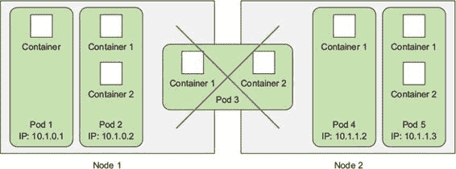
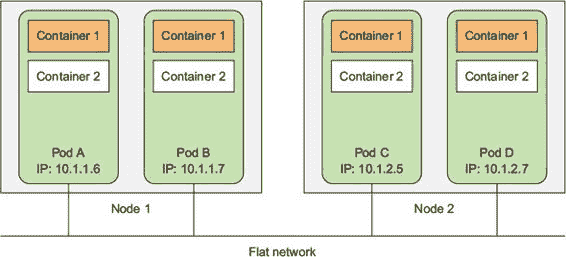
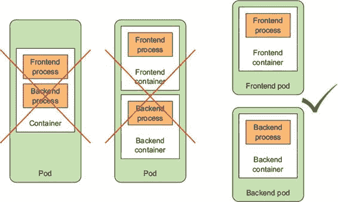
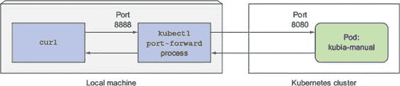
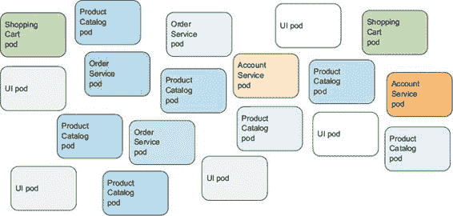
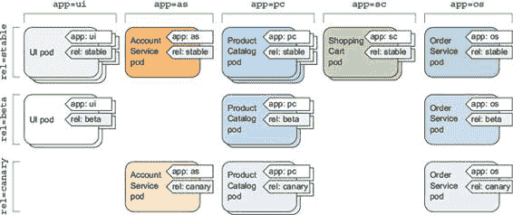
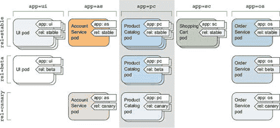
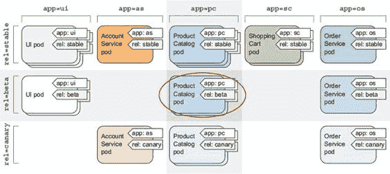
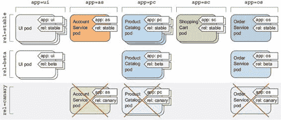

第三章\. Pods：在 Kubernetes 中运行容器

本章涵盖

+   创建、运行和停止 Pod

+   使用标签组织 Pod 和其他资源

+   对具有特定标签的所有 Pod 执行操作

+   使用命名空间将 Pod 分成非重叠组

+   将 Pod 调度到特定类型的 Worker 节点上

上一章应该已经为您提供了一个关于在 Kubernetes 中创建的基本组件的大致轮廓以及它们至少的概述。现在，我们将更详细地回顾所有类型的 Kubernetes 对象（或资源），以便您了解何时、如何以及为什么使用它们。我们将从 Pod 开始，因为它们是 Kubernetes 中中心、最重要的概念。其他所有内容要么管理、公开，要么被 Pod 使用。

3.1\. Pod 简介

您已经了解到 Pod 是一组位于同一位置的容器，并且代表 Kubernetes 中的基本构建块。您不是单独部署容器，而是始终部署和操作容器 Pod。我们并不是暗示 Pod 总是包含多个容器——Pod 只包含单个容器是很常见的。关于 Pod 的关键点是，当 Pod 确实包含多个容器时，所有这些容器都总是在单个 Worker 节点上运行——它永远不会跨越多个 Worker 节点，如图 3.1 所示。

图 3.1\. Pod 中的所有容器都在同一个节点上运行。Pod 永远不会跨越两个节点。

3.1.1\. 理解为什么我们需要 Pod

但为什么我们甚至需要 Pod？为什么我们不能直接使用容器？为什么我们甚至需要一起运行多个容器？我们不能把所有进程都放入一个容器中吗？我们现在就来回答这些问题。

理解为什么多个容器比一个容器运行多个进程更好

想象一个由多个进程组成的 app，这些进程要么通过 IPC（进程间通信）通信，要么通过本地存储的文件通信，这要求它们在同一台机器上运行。因为在 Kubernetes 中，您总是运行容器中的进程，每个容器都类似于一个隔离的机器，您可能会认为在单个容器中运行多个进程是有意义的，但您不应该这样做。

容器被设计为每个容器只运行一个进程（除非进程本身产生子进程）。如果您在单个容器中运行多个不相关的进程，那么您有责任保持所有这些进程的运行，管理它们的日志等。例如，如果您必须包括一个机制来自动重启崩溃的个别进程。此外，所有这些进程都会记录到相同的标准输出，因此您很难弄清楚哪个进程记录了什么。

因此，您需要为每个进程运行其自己的容器。这就是 Docker 和 Kubernetes 被设计成使用的样子。

3.1.2\. 理解 Pod

由于你不应该将多个进程组合到一个容器中，显然你需要另一个更高级的结构，这样你就可以将容器绑定在一起，并将它们作为一个单一单元来管理。这就是 pod 的推理依据。

容器 pod 允许你将紧密相关的进程一起运行，并为它们提供（几乎）与它们都在单个容器中运行时相同的环境，同时保持它们在一定程度上隔离。这样，你就可以兼得两者之利。你可以利用容器提供的所有功能，同时同时给进程一种它们在一起运行的错觉。

理解同一 pod 中容器之间的部分隔离

在上一章中，你了解到容器是完全相互隔离的，但现在你看到你想要隔离容器组而不是单个容器。你希望组内的容器共享某些资源，尽管不是全部，这样它们就不会完全隔离。Kubernetes 通过配置 Docker，让 pod 中的所有容器共享同一组 Linux 命名空间来实现这一点，而不是每个容器都有自己的命名空间集。

因为一个 pod 中的所有容器都在相同的网络和 UTS 命名空间下运行（这里我们谈论的是 Linux 命名空间），它们都共享相同的主机名和网络接口。同样，一个 pod 中的所有容器都在相同的 IPC 命名空间下运行，并且可以通过 IPC 进行通信。在最新的 Kubernetes 和 Docker 版本中，它们还可以共享相同的 PID 命名空间，但这个功能默认是未启用的。

| |
| --- |

注意

当同一 pod 中的容器使用单独的 PID 命名空间时，你在容器中运行 `ps aux` 命令时只能看到容器的自身进程。

| |
| --- |

但是，当涉及到文件系统时，情况就有些不同了。因为大多数容器的文件系统来自容器镜像，默认情况下，每个容器的文件系统与其他容器完全隔离。然而，可以使用 Kubernetes 的一个概念——Volume，让它们共享文件目录，我们将在第六章（[index_split_055.html#filepos588298]）中讨论。

理解容器如何共享相同的 IP 和端口空间

这里要强调的一点是，因为 pod 中的容器运行在相同的网络命名空间中，它们共享相同的 IP 地址和端口空间。这意味着在相同 pod 的容器中运行的过程需要注意不要绑定到相同的端口，否则会遇到端口冲突。但这只涉及同一 pod 中的容器。不同 pod 的容器永远不会遇到端口冲突，因为每个 pod 都有独立的端口空间。pod 中的所有容器也具有相同的回环网络接口，因此一个容器可以通过 localhost 与同一 pod 中的其他容器通信。

介绍扁平的 pod 间网络

Kubernetes 集群中的所有 Pod 都位于一个单一的、共享的、网络地址空间中（如图 3.2 所示 figure 3.2），这意味着每个 Pod 都可以通过其他 Pod 的 IP 地址访问其他 Pod。它们之间不存在 NAT（网络地址转换）网关。当两个 Pod 之间发送网络数据包时，它们各自都会看到对方实际的 IP 地址作为数据包中的源 IP。

图 3.2\. 每个 Pod 都分配一个可路由的 IP 地址，所有其他 Pod 都能看到该 IP 地址下的 Pod。

因此，Pod 之间的通信总是简单的。无论两个 Pod 是否被调度到同一个或不同的工作节点上，在这两种情况下，Pod 内部的容器都可以通过扁平的、无 NAT 的网络相互通信，就像局域网（LAN）中的计算机一样，无论实际的节点间网络拓扑结构如何。就像局域网中的计算机一样，每个 Pod 都有自己的 IP 地址，并且可以通过为 Pod 专门建立的这一网络从所有其他 Pod 访问。这通常是通过在真实网络之上添加一个额外的软件定义网络来实现的。

总结本节所涵盖的内容：Pod 是逻辑主机，在非容器世界中表现得就像物理主机或虚拟机。在同一 Pod 中运行的进程就像在同一个物理或虚拟机上运行的进程一样，只是每个进程都被封装在一个容器中。

3.1.3\. 正确组织 Pod 间的容器

你应该将 Pod 视为独立的机器，但每个机器只托管特定的应用程序。与过去我们经常将各种应用程序挤在同一台主机上的做法不同，我们不会这样做 Pod。因为 Pod 相对较轻量级，你可以拥有你需要的任意多个，而几乎不会产生任何开销。而不是将所有内容都塞入一个 Pod 中，你应该将应用程序组织到多个 Pod 中，其中每个 Pod 只包含紧密相关的组件或进程。

话虽如此，你认为一个由前端应用服务器和后端数据库组成的多层应用程序应该配置为一个 Pod 还是两个 Pod？

将多层应用程序拆分为多个 Pod

虽然没有阻止你在单个 Pod 中使用两个容器同时运行前端服务器和数据库，但这并不是最合适的方式。我们说过，同一个 Pod 中的所有容器总是运行在同一个位置，但网页服务器和数据库真的需要运行在同一台机器上吗？答案显然是否定的，所以你不希望将它们放入同一个 Pod 中。但这样做是否错误呢？从某种意义上说，是的。

如果前端和后端都在同一个 Pod 中，那么它们将始终在同一个机器上运行。如果你有一个两节点 Kubernetes 集群，并且只有一个这个单独的 Pod，那么你将只使用一个工作节点，而不会利用你在第二个节点上可用的计算资源（CPU 和内存）。将 Pod 拆分为两个将允许 Kubernetes 将前端调度到一个节点，而后端调度到另一个节点，从而提高你的基础设施利用率。

将其拆分为多个 Pod 以实现单独扩展

不应该将它们都放入同一个 Pod 的另一个原因是扩展。Pod 也是扩展的基本单位。Kubernetes 无法水平扩展单个容器；相反，它扩展整个 Pod。如果你的 Pod 由前端和后端容器组成，当你将 Pod 实例的数量扩展到，比如说两个时，你最终会得到两个前端容器和两个后端容器。

通常，前端组件的扩展需求与后端完全不同，所以我们倾向于单独扩展它们。更不用说后端（如数据库）通常比（无状态的）前端 Web 服务器更难扩展。如果你需要单独扩展容器，这清楚地表明它需要部署在单独的 Pod 中。

理解何时在 Pod 中使用多个容器

将多个容器放入单个 Pod 的主要原因是当应用程序由一个主进程和一个或多个补充进程组成时，如图 3.3 所示。

图 3.3\. Pod 应该包含紧密耦合的容器，通常是一个主容器和支撑主容器的容器。

例如，Pod 中的主容器可能是一个从特定文件目录提供文件的 Web 服务器，而一个附加容器（边车容器）会定期从外部源下载内容并将其存储在 Web 服务器的目录中。在第六章中，你会看到你需要使用一个 Kubernetes 卷，并将其挂载到两个容器中。

边车容器的其他例子包括日志轮换器和收集器、数据处理程序、通信适配器等。

决定何时在 Pod 中使用多个容器

为了回顾容器应该如何分组到 Pod 中——在决定是否将两个容器放入同一个 Pod 还是两个独立的 Pod 中时，你总是需要问自己以下问题：

+   它们是否需要一起运行，或者是否可以在不同的主机上运行？

+   它们是否代表一个整体或独立的组件？

+   它们是否需要一起扩展或单独扩展？

基本上，你应该始终倾向于在单独的 Pod 中运行容器，除非有特定的原因要求它们成为同一个 Pod 的一部分。图 3.4 将帮助你记住这一点。

图 3.4\. 容器不应该运行多个进程。如果不需要在同一个机器上运行，pod 不应包含多个容器。

尽管 pods 可以包含多个容器，但为了保持简单，你将在本章中只处理单容器 pod。你将在第六章（index_split_055.html#filepos588298）中看到如何在同一个 pod 中使用多个容器。

3.2\. 从 YAML 或 JSON 描述符创建 pod

Pods 和其他 Kubernetes 资源通常是通过向 Kubernetes REST API 端点发送 JSON 或 YAML 清单来创建的。此外，你也可以使用其他更简单的方式来创建资源，例如你在上一章中使用的 `kubectl run` 命令，但它们通常只允许你配置一组有限的属性，而不是全部。此外，将所有 Kubernetes 对象定义在 YAML 文件中，使得可以将它们存储在版本控制系统（VCS）中，从而带来所有这些好处。

为了配置每种类型资源的所有方面，你需要了解和理解 Kubernetes API 对象定义。随着你在本书中学习每种资源类型，你将了解其中大部分。我们不会解释每个属性，因此当创建对象时，你也应参考 Kubernetes API 参考文档 [`kubernetes.io/docs/reference/`](http://kubernetes.io/docs/reference/)。

3.2.1\. 检查现有 pod 的 YAML 描述符

你已经在上一章创建了一些现有的 pod，所以让我们看看其中一个 pod 的 YAML 定义是什么样的。你可以使用带有 `-o yaml` 选项的 `kubectl get` 命令来获取 pod 的完整 YAML 定义，如下所示。

列表 3.1\. 已部署 pod 的完整 YAML

`$ kubectl get po kubia-zxzij -o yaml` `apiVersion: v1` `1` `kind: Pod` `2` `metadata:` `3` `annotations:` `3` `kubernetes.io/created-by: ...` `3` `creationTimestamp: 2016-03-18T12:37:50Z` `3` `generateName: kubia-` `3` `labels:` `3` `run: kubia` `3` `name: kubia-zxzij` `3` `namespace: default` `3` `resourceVersion: "294"` `3` `selfLink: /api/v1/namespaces/default/pods/kubia-zxzij` `3` `uid: 3a564dc0-ed06-11e5-ba3b-42010af00004` `3` `spec:` `4` `containers:` `4` `- image: luksa/kubia` `4` `imagePullPolicy: IfNotPresent` `4` `name: kubia` `4` `ports:` `4` `- containerPort: 8080` `4` `protocol: TCP` `4` `resources:` `4` `requests:` `4` `cpu: 100m` `4` `terminationMessagePath: /dev/termination-log` `4` `volumeMounts:` `4` `- mountPath: /var/run/secrets/k8s.io/servacc` `4` `name: default-token-kvcqa` `4` `readOnly: true` `4` `dnsPolicy: ClusterFirst` `4` `nodeName: gke-kubia-e8fe08b8-node-txje` `4` `restartPolicy: Always` `4` `serviceAccount: default` `4` `serviceAccountName: default` `4` `terminationGracePeriodSeconds: 30` `4` `volumes:` `4` `- name: default-token-kvcqa` `4` `secret:` `4` `secretName: default-token-kvcqa` `4` `status:` `5` `conditions:` `5` `- lastProbeTime: null` `5` `lastTransitionTime: null` `5` `status: "True"` `5` `type: Ready` `5` `containerStatuses:` `5` `- containerID: docker://f0276994322d247ba...` `5` `image: luksa/kubia` `5` `imageID: docker://4c325bcc6b40c110226b89fe...` `5` `lastState: {}` `5` `name: kubia` `5` `ready: true` `5` `restartCount: 0` `5` `state:` `5` `running:` `5` `startedAt: 2016-03-18T12:46:05Z` `5` `hostIP: 10.132.0.4` `5` `phase: Running` `5` `podIP: 10.0.2.3` `5` `startTime: 2016-03-18T12:44:32Z` `5`

+   1 在此 YAML 描述符中使用的 Kubernetes API 版本

+   2 Kubernetes 对象/资源的类型

+   3 Pod 元数据（名称、标签、注解等）

+   4 Pod 规范/内容（Pod 的容器、卷等的列表）

+   5 Pod 及其容器的详细状态

我知道这看起来很复杂，但一旦你了解了基础知识并且知道如何区分重要部分和细节，它就会变得简单。此外，你可以放心，当你创建一个新的 Pod 时，你需要编写的 YAML 文件会短得多，就像你稍后将会看到的那样。

介绍 Pod 定义的主要部分

Pod 定义由几个部分组成。首先，是 YAML 中使用的 Kubernetes API 版本以及 YAML 描述的资源类型。然后，在几乎所有的 Kubernetes 资源中都可以找到三个重要的部分：

+   元数据包括名称、命名空间、标签以及其他关于 Pod 的信息。

+   Spec 包含 Pod 内容的实际描述，例如 Pod 的容器、卷和其他数据。

+   状态包含关于运行 Pod 的当前信息，例如 Pod 的状态、每个容器的描述和状态，以及 Pod 的内部 IP 和其他基本信息。

列表 3.1 展示了一个正在运行的 pod 的完整描述，包括其状态。`status` 部分包含只读的运行时数据，显示了资源在某一时刻的状态。在创建新的 pod 时，您永远不需要提供 `status` 部分。

之前描述的三个部分展示了 Kubernetes API 对象的典型结构。正如您将在本书的其余部分看到的那样，所有其他对象都具有相同的结构。这使得理解新对象相对容易。

在之前的 YAML 中逐个检查所有单个属性没有太多意义，所以，让我们看看创建 pod 的最基本 YAML 看起来是什么样子。

3.2.2\. 创建一个简单的 YAML 描述符用于 pod

您将创建一个名为 kubia-manual.yaml 的文件（您可以在任何目录中创建它），或者下载本书的代码存档，您将在 Chapter03 目录中找到该文件。以下列表显示了文件的全部内容。

列表 3.2\. 基本 pod 清单：kubia-manual.yaml

`apiVersion: v1` `1` `kind: Pod` `2` `metadata:   name: kubia-manual` `3` `spec:   containers:   - image: luksa/kubia` `4` `name: kubia` `5` `ports:     - containerPort: 8080` `6` `protocol: TCP`

+   1 描述符符合 Kubernetes API 的 v1 版本

+   2 您正在描述一个 pod。

+   3 pod 的名称

+   4 从容器创建的容器镜像

+   5 容器的名称

+   6 应用程序监听的端口

我相信您会同意这比 列表 3.1 中的定义要简单得多。让我们详细检查这个描述符。它符合 Kubernetes API 的 `v1` 版本。您所描述的资源类型是 `pod`，名称为 `kubia-manual`。该 pod 由基于 `luksa/kubia` 镜像的单个容器组成。您还为容器命名，并指明它正在监听端口 `8080`。

指定容器端口

在 pod 定义中指定端口纯粹是信息性的。省略它们不会影响客户端是否可以通过端口连接到 pod。如果容器通过绑定到 0.0.0.0 地址的端口接受连接，其他 pod 总是能够连接到它，即使该端口没有在 pod 规范中明确列出。但是，明确定义端口是有意义的，这样每个人都可以快速看到每个 pod 公开的端口。明确定义端口还允许您为每个端口分配一个名称，这在本书后面的内容中会很有用。

使用 kubectl explain 来发现可能的 API 对象字段

在准备清单时，您可以选择查阅 Kubernetes 参考文档 [`kubernetes.io/docs/api`](http://kubernetes.io/docs/api)，以查看每个 API 对象支持哪些属性，或者您可以使用 `kubectl explain` 命令。

例如，当从头开始创建 pod 清单时，您可以首先让 `kubectl` 解释 pods：

`$ kubectl explain pods` `描述：Pod 是一组可以在主机上运行的容器。该资源由客户端创建并调度到主机上。    字段：    kind      <字符串>    类型是一个字符串值，表示此对象表示的 REST 资源...    metadata  <对象>    标准对象元数据...    spec      <对象>    pod 的期望行为规范...    status    <对象>    pod 最近观察到的状态。这些数据可能不是最新的...`

Kubectl 打印出对象的说明并列出对象可以包含的属性。然后你可以深入了解以了解更多关于每个属性的信息。例如，你可以像这样检查`spec`属性：

`$ kubectl explain pod.spec` `资源：spec <对象>  描述：    pod 的期望行为规范...    podSpec 是 pod 的描述。    字段：    hostPID   <布尔型>    使用主机的 pid 命名空间。可选：默认为 false。    ...    volumes   <[]对象>    pod 中容器可以挂载的卷列表。    Containers  <[]对象> -必需-    pod 中属于容器的列表。容器目前不能添加或删除。pod 中必须至少有一个容器。    不能更新。更多信息：    http://releases.k8s.io/release-1.4/docs/user-guide/containers.md`

3.2.3\. 使用 kubectl create 创建 pod

要从你的 YAML 文件创建 pod，请使用`kubectl create`命令：

`$ kubectl create -f kubia-manual.yaml` `pod "kubia-manual" 已创建`

`kubectl create -f` 命令用于从 YAML 或 JSON 文件创建任何资源（不仅仅是 pod）。

获取正在运行的 pod 的整个定义

在创建 pod 之后，你可以向 Kubernetes 请求 pod 的完整 YAML。你会看到它与之前看到的 YAML 类似。你将在下一节中了解返回定义中出现的附加字段。请使用以下命令查看 pod 的完整描述符：

`$ kubectl get po kubia-manual -o yaml`

如果你更喜欢 JSON，你也可以让`kubectl`返回 JSON 而不是 YAML，如下所示（即使你使用 YAML 创建了 pod，这也适用）：

`$ kubectl get po kubia-manual -o json`

在 pod 列表中查看你新创建的 pod

你的 pod 已经创建，但你怎么知道它在运行呢？让我们列出 pod 以查看它们的状态：

`$ kubectl get pods` `名称            就绪   状态    重启次数   年龄 kubia-manual    1/1     运行中   0          32 秒 kubia-zxzij     1/1     运行中   0          1 天`

这就是你的`kubia-manual` pod。其状态显示它正在运行。如果你像我一样，你可能想通过与 pod 通信来确认这一点。你将在下一分钟这样做。首先，你将查看应用程序日志以检查是否有任何错误。

3.2.4\. 查看应用程序日志

你小巧的 Node.js 应用程序将日志记录到进程的标准输出。容器化应用程序通常将日志记录到标准输出和标准错误流，而不是将日志写入文件。这是为了让用户能够以简单、标准的方式查看不同应用程序的日志。

容器运行时（在你的情况下是 Docker）将这些流重定向到文件，并允许你通过运行以下命令来获取容器的日志

`$ docker logs <容器 ID>`

你可以使用`ssh`登录到你的 Pod 运行的节点，并使用`docker logs`检索其日志，但 Kubernetes 提供了一个更简单的方法。

使用 kubectl logs 检索 Pod 的日志

要查看你的 Pod 日志（更准确地说，是容器的日志），你需要在本地机器上运行以下命令（无需`ssh`到任何地方）：

`$ kubectl logs kubia-manual` `Kubia 服务器启动...`

你还没有向你的 Node.js 应用程序发送任何 Web 请求，所以日志只显示一条关于服务器启动的单个日志语句。正如你所见，如果 Pod 只包含一个容器，那么在 Kubernetes 中检索运行的应用程序的日志非常简单。

| |
| --- |

注意

容器日志会自动每天轮换，并且每当日志文件达到 10MB 大小时也会轮换。`kubectl logs`命令只显示上一次轮换后的日志条目。

| |
| --- |

在获取多容器 Pod 的日志时指定容器名称

如果你的 Pod 包含多个容器，你必须在使用`kubectl logs`时显式指定容器名称，包括`-c <容器名称>`选项。在你的`kubia-manual` Pod 中，你将容器的名称设置为`kubia`，所以如果 Pod 中存在其他容器，你必须像这样获取其日志：

`$ kubectl logs kubia-manual -c kubia` `Kubia 服务器启动...`

注意，你只能检索仍然存在的 Pod 的容器日志。当一个 Pod 被删除时，其日志也会被删除。为了在 Pod 删除后仍然可以访问 Pod 的日志，你需要设置集中式、集群范围内的日志记录，将所有日志存储到中央存储中。第十七章解释了集中式日志记录是如何工作的。

3.2.5. 向 Pod 发送请求

Pod 现在正在运行——至少`kubectl get`和你的应用程序日志是这样说的。但你是如何看到它在实际中的运行情况的？在前一章中，你使用了`kubectl expose`命令来创建一个服务以外部访问 Pod。现在你不会这样做，因为整章都致力于服务，而且你有其他方法连接到 Pod 进行测试和调试。其中之一是通过端口转发。

将本地网络端口转发到 Pod 中的端口

当你想与特定的 Pod 通信而不通过服务（用于调试或其他原因）时，Kubernetes 允许你配置到 Pod 的端口转发。这是通过`kubectl port-forward`命令完成的。以下命令将你的机器的本地端口`8888`转发到`kubia-manual` Pod 的端口`8080`：

`$ kubectl port-forward kubia-manual 8888:8080` `... 正在转发从 127.0.0.1:8888 到 8080 ... 正在转发从 [::1]:8888 到 8080`

端口转发器正在运行，你现在可以通过本地端口连接到你的 Pod。

通过端口转发器连接到 Pod

在不同的终端中，你现在可以使用`curl`通过运行在`localhost:8888`上的`kubectl port-forward`代理向你的 Pod 发送 HTTP 请求：

`$ curl localhost:8888` `您已访问 kubia-manual`

图 3.5 显示了一个过于简化的视图，展示了发送请求时会发生什么。实际上，在`kubectl`进程和 Pod 之间有几个额外的组件，但它们现在并不相关。

图 3.5. 使用`kubectl port-forward`与 curl 一起使用时的简化视图

使用这种方式进行端口转发是测试单个 Pod 的有效方法。你将在本书的其余部分了解其他类似的方法。

3.3. 组织带有标签的 Pod

到目前为止，你的集群中已经运行了两个 Pod。在部署实际应用程序时，大多数用户最终会运行更多的 Pod。随着 Pod 数量的增加，将它们分类到子集的需求变得越来越明显。

例如，在微服务架构中，部署的微服务数量很容易超过 20 个或更多。这些组件可能会被复制（将部署相同组件的多个副本）并且会同时运行多个版本或发布（稳定版、测试版、金丝雀版等）。这可能导致系统中出现数百个 Pod。如果没有组织它们的机制，你最终会得到一个庞大且难以理解的一团糟，就像图 3.6 中所示的那样。该图显示了多个微服务的 Pod，其中一些运行多个副本，而其他则运行同一微服务的不同版本。

图 3.6. 微服务架构中的未分类 Pod

显然，你需要一种方法将它们根据任意标准组织成更小的组，这样每个处理你系统的开发人员和系统管理员都可以轻松地看到哪个 Pod 是哪个。你还将希望对属于某个组的每个 Pod 执行单个操作，而不是对每个 Pod 单独执行操作。

组织 Pod 和所有其他 Kubernetes 对象是通过标签完成的。

3.3.1. 介绍标签

标签是 Kubernetes 中一个简单而又极其强大的功能，用于组织不仅限于 Pod，还包括所有其他 Kubernetes 资源。标签是你附加到资源上的任意键值对，然后在使用标签选择器选择资源时被利用（资源根据是否包含选择器中指定的标签进行过滤）。一个资源可以有多个标签，只要这些标签的键在该资源内是唯一的。你通常在创建资源时附加标签，但也可以稍后添加额外的标签或甚至修改现有标签的值，而无需重新创建资源。

让我们回到图 3.6 中的微服务示例。通过向这些 Pod 添加标签，你将得到一个组织得更好、大家都能轻松理解的系统。每个 Pod 都被标记为两个标签：

+   `app`，它指定 Pod 属于哪个应用程序、组件或微服务。

+   `rel`，它显示 Pod 中运行的应用程序是稳定版、测试版还是金丝雀发布。

定义

金丝雀发布是指你在稳定版本旁边部署应用程序的新版本，并且只让一小部分用户访问新版本，以观察其行为，然后再将其推广给所有用户。这可以防止不良发布版本暴露给太多用户。

通过添加这两个标签，你实际上已经将你的 Pod 组织成两个维度（水平方向按应用程序，垂直方向按发布），如图 3.7 所示。

图 3.7\. 使用 Pod 标签组织微服务架构中的 Pod

现在每个有权访问你的集群的开发者或运维人员都可以通过查看 Pod 的标签，轻松地看到系统的结构和每个 Pod 的位置。

3.3.2\. 在创建 Pod 时指定标签

现在，你将通过创建一个带有两个标签的新 Pod 来看到标签的实际应用。创建一个名为 kubia-manual-with-labels.yaml 的新文件，并包含以下内容的列表。

列表 3.3\. 带有标签的 Pod：kubia-manual-with-labels.yaml

`apiVersion: v1 kind: Pod metadata:   name: kubia-manual-v2   labels:     creation_method: manual` `1` `env: prod` `1` `spec:   containers:   - image: luksa/kubia     name: kubia     ports:     - containerPort: 8080       protocol: TCP`

+   1 附加了两个标签到 Pod 上。

你已经包含了 `creation_method=manual` 和 `env=data.labels` 部分。你现在将创建这个 Pod：

`$ kubectl create -f kubia-manual-with-labels.yaml` `pod "kubia-manual-v2" created`

默认情况下，`kubectl get pods` 命令不会列出任何标签，但你可以通过使用 `--show-labels` 开关来查看它们：

`$ kubectl get po --show-labels` `NAME            READY  STATUS   RESTARTS  AGE LABELS kubia-manual    1/1    Running  0         16m <none> kubia-manual-v2 1/1    Running  0         2m  creat_method=manual,env=prod kubia-zxzij     1/1    Running  0         1d  run=kubia`

如果您只对某些标签感兴趣，而不是列出所有标签，您可以使用 `-L` 开关指定它们，并将每个标签单独显示在其自己的列中。再次列出 pods 并显示您附加到 `kubia-manual-v2` pod 的两个标签的列：

`$ kubectl get po -L creation_method,env` `NAME            READY   STATUS    RESTARTS   AGE   CREATION_METHOD   ENV kubia-manual    1/1     Running   0          16m   <none>            <none> kubia-manual-v2 1/1     Running   0          2m    manual            prod kubia-zxzij     1/1     Running   0          1d    <none>            <none>`

3.3.3\. 修改现有 pods 的标签

标签还可以添加到现有 pods 上并对其进行修改。因为 `kubia-manual` pod 也是手动创建的，所以让我们向它添加 `creation_method=manual` 标签：

`$ kubectl label po kubia-manual creation_method=manual` `pod "kubia-manual" labeled`

现在，让我们也将 `kubia-manual-v2` pod 上的 `env=prod` 标签更改为 `env=debug`，以查看现有标签如何更改。

注意

更改现有标签时，需要使用 `--overwrite` 选项。

`$ kubectl label po kubia-manual-v2 env=debug --overwrite` `pod "kubia-manual-v2" labeled`

再次列出 pods 以查看更新的标签：

`$ kubectl get po -L creation_method,env` `NAME            READY   STATUS    RESTARTS   AGE   CREATION_METHOD   ENV kubia-manual    1/1     Running   0          16m` `manual``<none> kubia-manual-v2 1/1     Running   0          2m    manual` `debug` `kubia-zxzij     1/1     Running   0          1d    <none>            <none>`

如您所见，将标签附加到资源是微不足道的，更改现有资源上的标签也是如此。现在可能还不明显，但这是一个非常强大的功能，您将在下一章中看到。但首先，让我们看看除了在列出 pods 时显示它们之外，您还可以用这些标签做什么。

3.4\. 通过标签选择器列出 pods 的子集

将标签附加到资源以便在列出时可以看到每个资源旁边的标签并不那么有趣。但标签与标签选择器密不可分。标签选择器允许您选择带有特定标签的 pod 的子集，并对这些 pod 执行操作。标签选择器是一个标准，它根据资源是否包含具有特定值的特定标签来过滤资源。

标签选择器可以根据资源是否包含具有特定值的特定标签来选择资源

+   包含（或不包含）具有特定键的标签

+   包含具有特定键和值的标签

+   包含具有特定键但值不等于您指定的标签

3.4.1\. 使用标签选择器列出 pods

让我们使用标签选择器来查看您迄今为止创建的 pods。要查看您手动创建的所有 pods（您用 `creation_method=manual` 标记了它们），请执行以下操作：

`$ kubectl get po -l creation_method=manual` `NAME              READY     STATUS    RESTARTS   AGE kubia-manual      1/1       运行中   0          51 分钟 kubia-manual-v2   1/1       运行中   0          37 分钟`

要列出所有包含`env`标签的 Pod，无论其值是什么：

`$ kubectl get po -l env` `NAME              READY     STATUS    RESTARTS   AGE kubia-manual-v2   1/1       运行中   0          37 分钟`

以及那些没有`env`标签的 Pod：

`$ kubectl get po -l '!env'` `NAME           READY     STATUS    RESTARTS   AGE kubia-manual   1/1       运行中   0          51 分钟 kubia-zxzij    1/1       运行中   0          10 天`

注意

请确保在`!env`周围使用单引号，这样 bash shell 就不会评估感叹号。

类似地，你也可以使用以下标签选择器来匹配 Pod：

+   `creation_method!=manual` 用于选择标签`creation_method`设置为除`manual`之外任何值的 Pod

+   `env in (prod,devel)` 用于选择标签`env`设置为`prod`或`devel`的 Pod

+   `env notin (prod,devel)` 用于选择标签`env`设置为除`prod`或`devel`之外任何值的 Pod

回到面向微服务的架构示例中的 Pod，你可以通过使用`app=pc`标签选择器（如图所示）来选择所有属于产品目录微服务的 Pod。

图 3.8\. 使用“app=pc”标签选择器选择产品目录微服务的 Pod

3.4.2\. 在标签选择器中使用多个条件

选择器也可以包含多个以逗号分隔的标准。资源需要匹配所有这些标准才能匹配选择器。例如，如果你想选择仅运行产品目录微服务 beta 版本的 Pod，你会使用以下选择器：`app=pc,rel=beta`（如图 3.9 所示）。

图 3.9\. 使用多个标签选择器选择 Pod

标签选择器不仅对列出 Pod 有用，还可以用于对所有 Pod 的子集执行操作。例如，在本章的后面，你会看到如何使用标签选择器一次性删除多个 Pod。但标签选择器不仅被`kubectl`使用，它们也被内部使用，你将在下面看到。

3.5\. 使用标签和选择器来约束 Pod 调度

你迄今为止创建的所有 Pod 都已被随机调度到你的工作节点上。正如我在上一章提到的，这是在 Kubernetes 集群中工作的正确方式。因为 Kubernetes 将集群中的所有节点暴露为一个单一的、大型的部署平台，所以你不需要关心 Pod 被调度到哪个节点。因为每个 Pod 都获得了它请求的确切计算资源（CPU、内存等），并且它从其他 Pod 的访问性并不受 Pod 被调度到的节点的影响，通常你不需要告诉 Kubernetes 确切地在哪里调度你的 Pod。

然而，在某些情况下，你可能希望至少对 Pod 应该调度到哪个位置有少许发言权。一个很好的例子是当你的硬件基础设施不均匀时。如果你的部分工作节点有旋转硬盘，而其他节点有 SSD，你可能希望将某些 Pod 调度到一组节点，其余的调度到另一组。另一个例子是当你需要将执行基于 GPU 的密集计算的 Pod 调度到提供所需 GPU 加速的节点上。

你永远不希望明确指出 Pod 应该调度到哪个节点，因为这会将应用程序与基础设施耦合在一起，而 Kubernetes 整个理念是隐藏实际基础设施，使其对在其上运行的应用程序不可见。但如果你想对 Pod 应该调度到哪个位置有发言权，而不是指定一个确切的节点，你应该描述节点需求，然后让 Kubernetes 选择一个符合这些需求的节点。这可以通过节点标签和节点标签选择器来实现。

3.5.1\. 使用标签对工作节点进行分类

如你之前所学的，Pod 不是唯一可以附加标签的 Kubernetes 资源类型。标签可以附加到任何 Kubernetes 对象，包括节点。通常，当运维团队向集群添加新节点时，他们会通过附加标签来对节点进行分类，这些标签指定了节点提供的硬件类型或其他可能在调度 Pod 时有用的任何内容。

让我们假设你的集群中的一个节点包含一个用于通用 GPU 计算的 GPU。你想要给这个节点添加一个标签来显示这个特性。你将向你的一个节点添加标签 `gpu=true`（从 `kubectl get nodes` 返回的列表中选择一个）：

`$ kubectl label node gke-kubia-85f6-node-0rrx gpu=true` `node "gke-kubia-85f6-node-0rrx" labeled`

现在，你可以在列出节点时使用标签选择器，就像之前列出 Pod 时所做的那样。仅列出包含标签 `gpu=true` 的节点：

`$ kubectl get nodes -l gpu=true` `NAME                      STATUS AGE gke-kubia-85f6-node-0rrx  Ready  1d`

如预期的那样，只有一个节点有这个标签。你也可以尝试列出所有节点，并告诉 `kubectl` 显示每个节点的 `gpu` 标签值（`kubectl get nodes -L gpu`）。

3.5.2\. 将 Pod 调度到特定节点

现在假设你想要部署一个新的 Pod，该 Pod 需要 GPU 来执行其工作。为了要求调度器只从提供 GPU 的节点中选择，你将在 Pod 的 YAML 中添加一个节点选择器。创建一个名为 kubia-gpu.yaml 的文件，包含以下内容的列表，然后使用 `kubectl create -f kubia-gpu.yaml` 来创建 Pod。

列表 3.4\. 使用标签选择器将 Pod 调度到特定节点：kubia-gpu.yaml

`apiVersion: v1 kind: Pod metadata:   name: kubia-gpu spec:   nodeSelector:` `1` `gpu: "true"` `1` `containers:   - image: luksa/kubia     name: kubia`

+   1 个`nodeSelector`告诉 Kubernetes 只将此 Pod 部署到包含`gpu=true`标签的节点。

您在`spec`部分下添加了一个`nodeSelector`字段。当您创建 Pod 时，调度器将只从包含`gpu=true`标签的节点中选择（在这种情况下，只有一个节点）。

3.5.3\. 将调度指定到特定节点

类似地，您也可以将 Pod 调度到特定的节点，因为每个节点都有一个唯一的标签，键为`kubernetes.io/hostname`，值为节点的实际主机名。但通过主机名标签将`nodeSelector`设置为特定节点可能会导致节点离线时 Pod 不可调度。您不应该从单个节点的角度思考。始终考虑满足通过标签选择器指定的某些标准节点的逻辑组。

这只是一个快速演示，说明了标签和标签选择器的工作原理以及如何使用它们来影响 Kubernetes 的操作。在下一章讨论 Replication-Controllers 和 Services 时，标签选择器的重要性和实用性将变得更加明显。

| |
| --- |

注意

影响 Pod 调度到哪个节点的方法的其他方式在第十六章中介绍。

| |
| --- |

3.6\. 注解 Pod

除了标签外，Pod 和其他对象还可以包含注解。注解也是键值对，因此本质上与标签相似，但它们不是为了持有标识信息而设计的。它们不能像标签那样用于分组对象。虽然可以通过标签选择器选择对象，但不存在注解选择器。

另一方面，注解可以包含大量信息，主要用于工具使用。某些注解是由 Kubernetes 自动添加到对象中的，但其他注解则是由用户手动添加的。

在引入 Kubernetes 的新功能时，注解也经常被使用。通常，新功能的 alpha 和 beta 版本不会向 API 对象引入任何新字段。注解代替字段使用，一旦所需的 API 更改变得明确并被 Kubernetes 开发者同意，就会引入新字段，并弃用相关的注解。

使用注解的一个很好的用途是为每个 Pod 或其他 API 对象添加描述，这样集群中的每个人都可以快速查找有关每个单独对象的信息。例如，用于指定创建对象的人名的注解可以使在集群上工作的每个人的协作变得更加容易。

3.6.1\. 查找对象的注解

让我们看看 Kubernetes 自动添加到上一章创建的 Pod 中的注解示例。要查看注解，您需要请求 Pod 的完整 YAML 文件或使用`kubectl describe`命令。以下列表中将使用第一种方法。

列表 3.5\. Pod 的注解

`$ kubectl get po kubia-zxzij -o yaml` `apiVersion: v1 kind: pod metadata:   annotations:     kubernetes.io/created-by: |       {"kind":"SerializedReference", "apiVersion":"v1",       "reference":{"kind":"ReplicationController", "namespace":"default", ...`

不深入细节的话，如您所见，`kubernetes.io/created-by` 注解包含有关创建容器的对象的 JSON 数据。这不是您想放入标签中的内容。标签应该是简短的，而注解可以包含相对较大的数据块（总大小最多为 256 KB）。

注意

`kubernetes.io/created-by` 注解在版本 1.8 中已被弃用，并在 1.9 中将被移除，因此您在 YAML 中将不再看到它。

3.6.2\. 添加和修改注解

注解显然可以在创建容器时添加，就像标签一样。它们也可以在现有的容器中添加或修改。向现有对象添加注解的最简单方法是使用 `kubectl annotate` 命令。

现在您将尝试向您的 `kubia-manual` 容器添加一个注解：

`$ kubectl annotate pod kubia-manual mycompany.com/someannotation="foo bar"` `pod "kubia-manual" annotated`

您已添加注解 `mycompany.com/someannotation`，其值为 `foo bar`。使用这种格式作为注解键是一个好主意，以防止键冲突。当不同的工具或库向对象添加注解时，如果它们没有使用像您在这里使用的唯一前缀，它们可能会意外地覆盖彼此的注解。

您可以使用 `kubectl describe` 来查看您添加的注解：

`$ kubectl describe pod kubia-manual` `... Annotations:    mycompany.com/someannotation=foo bar ...`

3.7\. 使用命名空间来分组资源

让我们暂时回到标签。我们已经看到它们如何将容器和其他对象组织成组。因为每个对象可以有多个标签，这些对象组可能会重叠。此外，当通过 `kubectl` 等工具与集群交互时，如果您没有明确指定标签选择器，您将始终看到所有对象。

但有时您可能想要将对象分成单独的、不重叠的组？您可能只想一次操作一个组。出于这些和其他原因，Kubernetes 还将对象分组到命名空间中。这些不是我们在第二章中讨论的 Linux 命名空间，它们用于隔离进程。Kubernetes 命名空间为对象名称提供了作用域。您可以将所有资源放在一个命名空间中，也可以将它们分成多个命名空间，这还允许您在不同命名空间中使用相同的资源名称多次。

3.7.1\. 理解命名空间的需求

使用多个命名空间允许你将具有许多组件的复杂系统分割成更小的独立组。它们也可以用于在多租户环境中分离资源，将资源分割成生产、开发和 QA 环境，或者以任何其他你可能需要的方式。资源名称只需要在命名空间内是唯一的。两个不同的命名空间可以包含具有相同名称的资源。但是，尽管大多数类型的资源都是命名空间化的，但有一些资源不是。其中之一是 Node 资源，它是全局的，不与单个命名空间绑定。你将在后面的章节中了解其他集群级资源。

现在我们来看看如何使用命名空间。

3.7.2\. 发现其他命名空间及其 Pod

首先，让我们列出你集群中的所有命名空间：

`$ kubectl get ns` `NAME          LABELS    STATUS    AGE default       <none>    Active    1h kube-public   <none>    Active    1h kube-system   <none>    Active    1h`

到目前为止，你只在使用`default`命名空间。当使用`kubectl get`命令列出资源时，你从未明确指定命名空间，所以`kubectl`总是默认使用`default`命名空间，只显示该命名空间中的对象。但是，正如你所看到的列表，`kube-public`和`kube-system`命名空间也存在。让我们通过告诉`kubectl`只在该命名空间中列出 Pod 来查看属于`kube-system`命名空间的 Pod：

`$ kubectl get po --namespace kube-system` `NAME                                 READY     STATUS    RESTARTS   AGE fluentd-cloud-kubia-e8fe-node-txje   1/1       Running   0          1h heapster-v11-fz1ge                   1/1       Running   0          1h kube-dns-v9-p8a4t                    0/4       Pending   0          1h kube-ui-v4-kdlai                     1/1       Running   0          1h l7-lb-controller-v0.5.2-bue96        2/2       Running   92         1h`

| |
| --- |

小贴士

你也可以使用`-n`代替`--namespace`。

| |
| --- |

你将在本书的后面部分了解这些 Pod（如果这里显示的 Pod 与你的系统中的 Pod 不完全匹配，请不要担心）。从命名空间的名字可以看出，这些是与 Kubernetes 系统本身相关的资源。通过将它们放在这个独立的命名空间中，可以保持一切井然有序。如果它们都在默认命名空间中，与你自己创建的资源混合在一起，你将很难看到哪些属于哪里，你可能会意外删除系统资源。

命名空间允许你将不属于一起的资源分离成不重叠的组。如果多个用户或用户组正在使用同一个 Kubernetes 集群，并且他们各自管理自己独特的一组资源，那么他们应该各自使用自己的命名空间。这样，他们不需要特别注意不要无意中修改或删除其他用户的资源，也不需要担心名称冲突，因为命名空间为资源名称提供了范围，正如之前提到的。

除了隔离资源外，命名空间还用于仅允许某些用户访问特定的资源，甚至可以限制分配给单个用户的计算资源量。你将在第十二章到 14 章中了解这一点。

3.7.3\. 创建命名空间

命名空间就像 Kubernetes 中的任何其他资源一样，因此你可以通过向 Kubernetes API 服务器提交 YAML 文件来创建它。现在让我们看看如何做。

从 YAML 文件创建命名空间

首先，创建一个包含以下内容的 custom-namespace.yaml 文件（你可以在本书的代码存档中找到该文件）。

列表 3.6\. 命名空间的 YAML 定义：custom-namespace.yaml

`apiVersion: v1 kind: Namespace` `1` `metadata:   name: custom-namespace` `2`

+   1 这表示你正在定义一个命名空间。

+   2 这是命名空间的名字。

现在，使用 `kubectl` 将文件提交到 Kubernetes API 服务器：

`$ kubectl create -f custom-namespace.yaml` `namespace "custom-namespace" created`

使用 kubectl create namespace 创建命名空间

虽然编写像之前的文件这样的内容并不是什么大事，但仍然有些麻烦。幸运的是，你还可以使用专门的 `kubectl create namespace` 命令来创建命名空间，这比编写 YAML 文件要快。通过让你为命名空间创建 YAML 清单，我想强调在 Kubernetes 中，所有内容都有一个相应的 API 对象，你可以通过向 API 服务器提交 YAML 清单来创建、读取、更新和删除。

你可以像这样创建命名空间：

`$ kubectl create namespace custom-namespace` `namespace "custom-namespace" created`

注意

尽管大多数对象的名称必须符合 RFC 1035（域名）中指定的命名约定，这意味着它们可能只包含字母、数字、破折号和点，但命名空间（以及其他一些对象）不允许包含点。

3.7.4\. 管理其他命名空间中的对象

要在创建的资源中创建资源，你可以在 `metadata` 部分添加 `namespace: custom-namespace` 条目，或者在使用 `kubectl create` 命令创建资源时指定命名空间：

`$ kubectl create -f kubia-manual.yaml -n custom-namespace` `pod "kubia-manual" created`

你现在有两个具有相同名称（`kubia-manual`）的 pod。一个在 `default` 命名空间中，另一个在你的 `custom-namespace` 中。

当在其它命名空间中列出、描述、修改或删除对象时，您需要向 `kubectl` 命令传递 `--namespace`（或 `-n`）标志。如果您没有指定命名空间，`kubectl` 将在当前 `kubectl` 上下文中配置的默认命名空间中执行操作。当前上下文的命名空间和当前上下文本身可以通过 `kubectl config` 命令进行更改。要了解更多关于管理 `kubectl` 上下文的信息，请参阅附录 A。

提示

要快速切换到不同的命名空间，您可以设置以下别名：`alias kcd='kubectl config set-context $(kubectl config current-context) --namespace '`。然后您可以使用 `kcd some-namespace` 在命名空间之间切换。

3.7.5\. 理解命名空间提供的隔离

为了总结关于命名空间的部分，让我解释一下命名空间不提供什么——至少不是默认提供的。尽管命名空间允许您将对象隔离到不同的组中，从而允许您仅操作指定命名空间中的对象，但它们不提供对运行对象的任何隔离。

例如，您可能会认为当不同用户在不同命名空间中部署 Pod 时，这些 Pod 之间是隔离的，并且不能相互通信，但这并不一定正确。命名空间是否提供网络隔离取决于与 Kubernetes 一起部署的网络解决方案。当解决方案不提供命名空间间的网络隔离时，如果 `foo` 命名空间中的 Pod 知道 `bar` 命名空间中 Pod 的 IP 地址，那么没有任何东西可以阻止它向另一个 Pod 发送流量，例如 HTTP 请求。

3.8\. 停止和删除 Pod

您已创建了许多 Pod，它们都应该仍在运行。您在 `default` 命名空间中有四个 Pod，在 `custom-namespace` 中有一个 Pod。您现在将停止所有这些 Pod，因为您不再需要它们。

3.8.1\. 通过名称删除 Pod

首先，通过名称删除 `kubia-gpu` Pod：

`$ kubectl delete po kubia-gpu` `pod "kubia-gpu" 已删除`

通过删除 Pod，您指示 Kubernetes 终止该 Pod 中所有容器的运行。Kubernetes 向进程发送 `SIGTERM` 信号并等待一定时间（默认为 30 秒）以优雅地关闭。如果它没有及时关闭，则通过 `SIGKILL` 杀死进程。要确保您的进程始终优雅地关闭，它们需要正确处理 `SIGTERM` 信号。

提示

您也可以通过指定多个以空格分隔的名称来删除多个 Pod（例如，`kubectl delete po pod1 pod2`）。

3.8.2\. 使用标签选择器删除 Pod

与通过名称指定每个要删除的 Pod 相比，您现在将使用您所学的标签选择器来停止 `kubia-manual` 和 `kubia-manual-v2` Pod。这两个 Pod 都包含 `creation_method=manual` 标签，因此您可以使用标签选择器来删除它们：

`$ kubectl delete po -l creation_method=manual` `pod "kubia-manual" deleted pod "kubia-manual-v2" deleted`

在早期的微服务示例中，您有数十（或可能数百）个 pods，例如，您可以通过指定`rel=canary`标签选择器（如图 3.10 所示）一次性删除所有金丝雀 pods：

`$ kubectl delete po -l rel=canary`

图 3.10\. 通过`rel=canary`标签选择器选择和删除所有金丝雀 pods

3.8.3\. 通过删除整个命名空间来删除 pods

好吧，回到您的真实 pods。关于`custom-namespace`中的 pods 怎么办？您不再需要该命名空间中的 pods，或者命名空间本身。您可以使用以下命令删除整个命名空间（pods 将随着命名空间的删除而自动删除）：

`$ kubectl delete ns custom-namespace` `namespace "custom-namespace" deleted`

3.8.4\. 删除命名空间中的所有 pods，同时保留命名空间

您现在几乎清理了一切。但是，关于您在第二章中使用`kubectl run`命令创建的 pods 怎么办？它仍在运行：

`$ kubectl get pods` `NAME            READY   STATUS    RESTARTS   AGE kubia-zxzij     1/1     Running   0          1d`

这次，不是删除特定的 pods，而是告诉 Kubernetes 使用`--all`选项删除当前命名空间中的所有 pods：

`$ kubectl delete po --all` `pod "kubia-zxzij" deleted`

现在，请再次确认没有 pods 仍在运行：

`$ kubectl get pods` `NAME            READY   STATUS        RESTARTS   AGE kubia-09as0     1/1     Running       0          1d kubia-zxzij     1/1     Terminating   0          1d`

等等！？！`kubia-zxzij` pods 正在终止，但一个名为`kubia-09as0`的新 pods 出现了，之前并不存在。无论您删除所有 pods 多少次，都会出现一个名为 kubia-something 的新 pods。

您可能记得您是使用`kubectl run`命令创建的第一个 pods。在第二章中，我提到这并不直接创建 pods，而是创建一个 ReplicationController，然后它再创建 pods。一旦您删除由 ReplicationController 创建的 pods，它立即创建一个新的。要删除 pods，您还需要删除 ReplicationController。

3.8.5\. 删除命名空间中的（几乎）所有资源

您可以通过删除当前命名空间中的所有资源，使用单个命令来删除 ReplicationController、pods 以及您创建的所有服务：

`$ kubectl delete all --all` `pod "kubia-09as0" deleted replicationcontroller "kubia" deleted service "kubernetes" deleted service "kubia-http" deleted`

命令中的第一个 `all` 指定您正在删除所有类型的资源，而 `--all` 选项指定您正在删除所有资源实例，而不是按名称指定它们（您在运行上一个删除命令时已经使用了此选项）。

注意

使用 `all` 关键字删除所有内容并不会删除所有内容。某些资源（如我们在第七章中将要介绍的 Secrets）被保留，需要显式删除。

在删除资源时，`kubectl` 将打印出它删除的每个资源的名称。在列表中，您应该看到您在第二章中创建的 `kubia` ReplicationController 和 `kubia-http` 服务。

注意

`kubectl delete all --all` 命令也会删除 `kubernetes` 服务，但它应该会在几秒钟内自动重新创建。

3.9. 摘要

在阅读本章之后，您现在应该对 Kubernetes 的核心构建块有了一定的了解。您在接下来的几章中学习的每个其他概念都与 Pod 直接相关。

在本章中，您已经学习了

+   如何决定某些容器是否应该在一个 Pod 中分组在一起。

+   Pod 可以运行多个进程，在非容器世界中类似于物理主机。

+   YAML 或 JSON 描述符可以编写并用于创建 Pod，然后检查 Pod 的规范及其当前状态。

+   标签和标签选择器应用于组织 Pod 并轻松地对多个 Pod 同时执行操作。

+   您可以使用节点标签和选择器来调度仅具有特定功能的节点上的 Pod。

+   注释允许通过人员或工具和库将更大的数据块附加到 Pod 上。

+   命名空间可用于允许不同的团队使用同一个集群，就像他们使用单独的 Kubernetes 集群一样。

+   如何使用 `kubectl explain` 命令快速查找任何 Kubernetes 资源的信息。

在下一章中，您将学习关于 ReplicationController 和其他管理 Pod 的资源。
