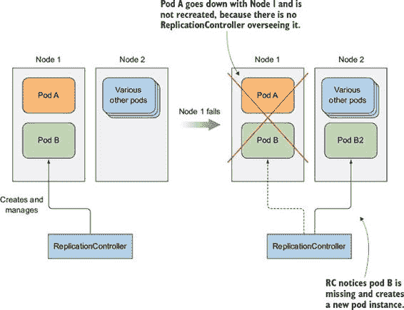
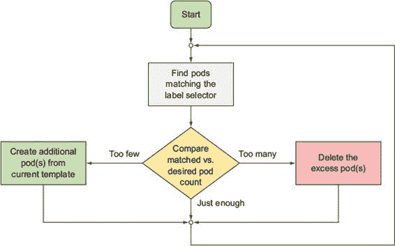
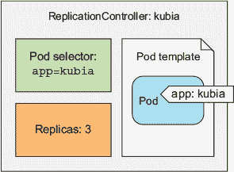
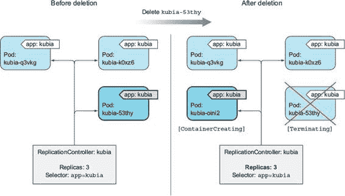
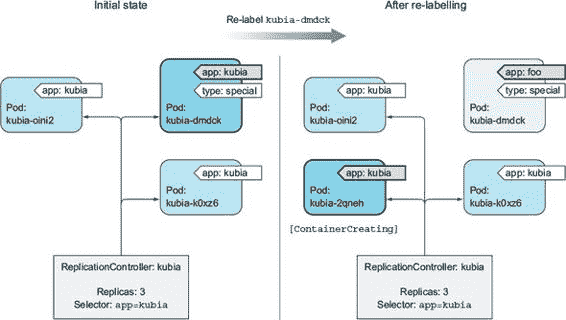
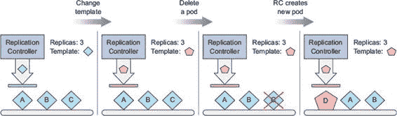
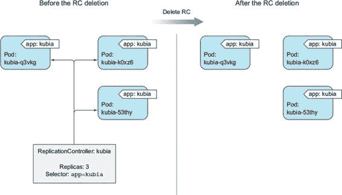
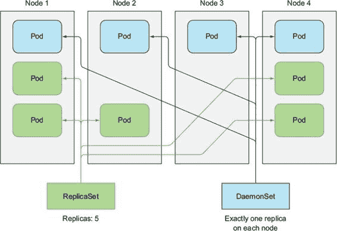
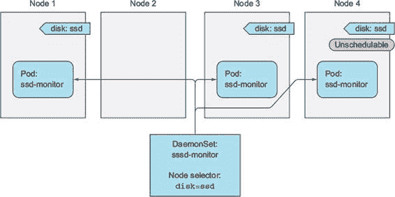
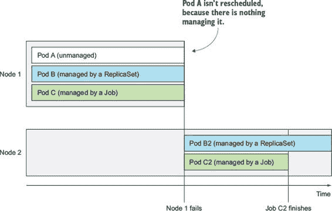

第四章\. 复制和其他控制器：部署托管 Pod

本章涵盖

+   保持 Pod 健康

+   运行相同 Pod 的多个实例

+   在节点失败后自动重新调度 Pod

+   横向扩展 Pod

+   在每个集群节点上运行系统级 Pod

+   运行批处理作业

+   定期或将来运行作业的调度

如你所知，Pod 是 Kubernetes 中的基本可部署单元。你知道如何手动创建、监督和管理它们。但在实际应用场景中，你希望你的部署能够自动保持运行状态，无需任何手动干预，并保持健康。为此，你几乎从不直接创建 Pod。相反，你创建其他类型的资源，例如 ReplicationControllers 或 Deployments，然后由它们创建和管理实际的 Pod。

当你创建未管理的 Pod（例如你在上一章中创建的 Pod）时，集群节点被选中来运行 Pod，然后在该节点上运行其容器。在本章中，你将了解到 Kubernetes 随后会监控这些容器，并在它们失败时自动重新启动它们。但如果整个节点失败，该节点上的 Pod 将丢失，并且不会用新的 Pod 替换，除非这些 Pod 由之前提到的 ReplicationControllers 或类似资源管理。在本章中，你将了解 Kubernetes 如何检查容器是否仍然存活，并在它不存活时重新启动它。你还将了解如何运行托管 Pod——包括那些无限期运行和那些执行单个任务后停止的 Pod。

4.1\. 保持 Pod 健康

使用 Kubernetes 的主要好处之一是能够给它一个容器列表，并让它保持这些容器在集群中的某个位置运行。你通过创建 Pod 资源并让 Kubernetes 为它选择一个工作节点，并在该节点上运行 Pod 的容器来实现这一点。但如果其中一个容器死亡怎么办？如果一个 Pod 的所有容器都死亡了怎么办？

一旦一个 Pod 被调度到某个节点，该节点上的 Kubelet 将运行其容器，并且从那时起，只要 Pod 存在，就会保持它们运行。如果容器的主进程崩溃，Kubelet 将重新启动容器。如果你的应用程序有一个导致它偶尔崩溃的 bug，Kubernetes 会自动重新启动它，因此即使应用程序本身没有做任何特殊处理，在 Kubernetes 中运行应用程序也会自动赋予它自我修复的能力。

但有时应用程序停止工作，而其进程并未崩溃。例如，一个存在内存泄漏的 Java 应用程序将开始抛出 OutOfMemoryErrors，但 JVM 进程将继续运行。如果能有一种方法让应用程序向 Kubernetes 发出信号，表明它不再正常工作，并且让 Kubernetes 重新启动它，那就太好了。

我们已经说过，如果一个容器崩溃了，它会自动重启，所以你可能认为你可以在应用程序中捕获这些类型的错误，并在它们发生时退出进程。你当然可以这样做，但这仍然不能解决你所有的问题。

例如，当你的应用程序停止响应，因为它陷入无限循环或死锁时，这种情况怎么办？为了确保在这种情况下应用程序被重启，你必须从外部检查应用程序的健康状况，而不是依赖应用程序内部进行。

4.1.1\. 介绍存活探针

Kubernetes 可以通过存活探针检查容器是否仍然存活。你可以在 Pod 规范中为每个容器指定一个存活探针。Kubernetes 将定期执行探针，如果探针失败，则重启容器。

| |
| --- |

注意

Kubernetes 还支持就绪性探针，我们将在下一章中学习。务必不要混淆这两个概念。它们用于不同的事情。

| |
| --- |

Kubernetes 可以使用三种机制之一来探测容器：

+   HTTP GET 探针对容器 IP 地址、你指定的端口和路径执行 HTTP GET 请求。如果探针收到响应，并且响应代码不表示错误（换句话说，如果 HTTP 响应代码是 2xx 或 3xx），则探针被视为成功。如果服务器返回错误响应代码或根本不响应，则探针被视为失败，容器将被重启。

+   TCP Socket 探针尝试与容器的指定端口建立 TCP 连接。如果连接成功建立，则探针成功。否则，容器将被重启。

+   Exec 探针在容器内部执行任意命令并检查命令的退出状态码。如果状态码为 0，则探针成功。所有其他代码都被视为失败。

4.1.2\. 创建基于 HTTP 的存活探针

让我们看看如何将存活探针添加到你的 Node.js 应用程序中。因为它是一个 Web 应用程序，添加一个检查其 Web 服务器是否正在处理请求的存活探针是有意义的。但是，因为这个特定的 Node.js 应用程序过于简单，永远不会失败，所以你需要人为地使应用程序失败。

为了正确演示存活探针，你将稍微修改应用程序，使其在第五个请求之后对每个请求返回 500 内部服务器错误 HTTP 状态码——你的应用程序将正确处理前五个客户端请求，然后在随后的每个请求上返回错误。多亏了存活探针，它应该在发生这种情况时重启，以便它可以再次正确处理客户端请求。

你可以在本书的代码存档中找到新应用程序的代码（在 Chapter04/kubia-unhealthy 文件夹中）。我已经将容器镜像推送到 Docker Hub，所以你不需要自己构建它。

你将创建一个新的 Pod，该 Pod 包含一个基于 HTTP GET 的存活探针。以下列表显示了 Pod 的 YAML。

列表 4.1\. 向 pod 添加存活探针：kubia-liveness-probe.yaml

`apiVersion: v1 kind: pod metadata:   name: kubia-liveness spec:   containers:   - image: luksa/kubia-unhealthy` `1` `name: kubia     livenessProbe:` `2` `httpGet:` `2` `path: /` `3` `port: 8080` `4`

+   1 这是包含（有些）损坏的应用程序的镜像。

+   2 将执行 HTTP GET 的存活探针

+   3 HTTP 请求中请求的路径

+   4 探针应连接到的网络端口

pod 描述符定义了一个 `httpGet` 存活探针，它告诉 Kubernetes 定期在端口 `8080` 上的路径 `/` 上执行 HTTP GET 请求，以确定容器是否仍然健康。这些请求在容器启动时立即开始。

在进行五次此类请求（或实际客户端请求）后，您的应用程序开始返回 HTTP 状态码 500，Kubernetes 将将其视为探针失败，因此会重启容器。

4.1.3\. 观察存活探针的实际操作

要查看存活探针的作用，现在尝试创建 pod。大约一分半钟后，容器将被重启。您可以通过运行 `kubectl get` 来查看：

`$ kubectl get po kubia-liveness` `NAME             READY     STATUS    RESTARTS   AGE kubia-liveness   1/1       运行中   1          2m`

`RESTARTS` 列显示 pod 的容器已重启一次（如果您再等一分半钟，它将再次重启，然后无限期地继续循环）。

获取崩溃容器的应用程序日志

在上一章中，您学习了如何使用 `kubectl logs` 打印应用程序的日志。如果您的容器被重启，`kubectl logs` 命令将显示当前容器的日志。

当您想找出前一个容器终止的原因时，您会想查看那些日志而不是当前容器的日志。这可以通过使用 `--previous` 选项来完成：

`$ kubectl logs mypod --previous`

您可以通过查看 `kubectl describe` 输出的内容来了解为什么容器必须重启，如下所示。

列表 4.2\. 容器重启后的 pod 描述

`$ kubectl describe po kubia-liveness` `Name:           kubia-liveness ... Containers:    kubia:    Container ID:       docker://480986f8    Image:              luksa/kubia-unhealthy    Image ID:           docker://sha256:2b208508    Port:            State:              Running    1    Started:          Sun, 14 May 2017 11:41:40 +0200    1    Last State:         Terminated    2    Reason:           Error    2    Exit Code:        137    2    Started:          Mon, 01 Jan 0001 00:00:00 +0000    2    Finished:         Sun, 14 May 2017 11:41:38 +0200    2    Ready:              True    3    Restart Count:      1    3    Liveness:           http-get http://:8080/ delay=0s timeout=1s    period=10s #success=1 #failure=3    ... Events:    ... Killing container with id docker://95246981:pod "kubia-liveness ..."    container "kubia" is unhealthy, it will be killed and re-created.`

+   1 当前容器正在运行。

+   2 前一个容器因错误终止并退出，退出代码为 137。

+   3 容器已重启一次。

你可以看到容器当前正在运行，但它之前因为错误而终止。退出代码是 `137`，它有特殊含义——表示进程被外部信号终止。数字 `137` 是两个数字的和：`128+x`，其中 `x` 是发送给导致进程终止的进程的信号号。在示例中，`x` 等于 `9`，这是 `SIGKILL` 信号的数量，意味着进程被强制终止。

列在底部的事件显示了容器被终止的原因——Kubernetes 检测到容器不健康，因此将其终止并重新创建。

| |
| --- |

注意

当容器被终止时，会创建一个全新的容器——它不是再次重启的同一个容器。

| |
| --- |

4.1.4\. 配置存活探测的附加属性

你可能已经注意到 `kubectl describe` 还显示了关于存活探测的附加信息：

`Liveness: http-get http://:8080/ delay=0s timeout=1s period=10s #success=1`  `#failure=3`

除了你明确指定的存活探测选项之外，你还可以看到其他附加属性，例如 `delay`、`timeout`、`period` 等。`delay=0s` 部分表示探测在容器启动后立即开始。`timeout` 设置为仅 1 秒，因此容器必须在 1 秒内返回响应，否则探测被视为失败。容器每 10 秒探测一次（`period=10s`），容器在探测连续三次失败后重启（`#failure=3`）。

这些附加参数可以在定义探测时进行自定义。例如，要设置初始延迟，将 `initialDelaySeconds` 属性添加到存活探测中，如下面的列表所示。

列表 4.3\. 带有初始延迟的存活探测：kubia-liveness-probe-initial-delay.yaml

`livenessProbe:    httpGet:        path: /        port: 8080    initialDelaySeconds: 15` `1`

+   1 Kubernetes 将在执行第一个探测前等待 15 秒。

如果你没有设置初始延迟，探测器将在容器启动时立即开始探测，这通常会导致探测失败，因为应用程序还没有准备好开始接收请求。如果失败次数超过失败阈值，容器在能够正确响应请求之前就会被重启。

小贴士

总是要记得设置一个初始延迟来考虑你的应用程序的启动时间。

我在很多情况下都见过这种情况，用户们困惑为什么他们的容器会被重启。但如果他们使用了 `kubectl describe`，他们就会看到容器以退出代码 137 或 143 终止，这告诉他们 pod 是被外部终止的。此外，pod 事件的列表将显示容器被杀死是因为存活探测失败。如果你在 pod 启动时看到这种情况发生，那是因为你没有适当地设置 `initialDelaySeconds`。

注意

退出代码 137 表示进程被外部信号终止（退出代码是 128 + 9（SIGKILL））。同样，退出代码 143 对应于 128 + 15（SIGTERM）。

4.1.5\. 创建有效的存活探测

对于在生产中运行的 pod，你应该始终定义一个存活探测。如果没有，Kubernetes 没有办法知道你的应用程序是否仍然存活。只要进程仍在运行，Kubernetes 就会认为容器是健康的。

存活探测应该检查的内容

你的简单存活探测只是检查服务器是否响应。虽然这可能看起来过于简单，但即使是这样的存活探测也能产生奇迹，因为它会导致容器在运行在容器内的 Web 服务器停止响应 HTTP 请求时重启。与没有存活探测相比，这是一个重大的改进，在大多数情况下可能已经足够。

但为了更好的存活检查，你应配置探测在特定的 URL 路径上执行请求（例如 `/health`），并让应用程序对应用程序内部运行的所有关键组件进行内部状态检查，以确保它们都没有死亡或无响应。

小贴士

确保 `/health` HTTP 端点不需要身份验证；否则，探测将始终失败，导致你的容器无限重启。

一定要检查应用程序的内部，而不是受外部因素影响的任何内容。例如，如果前端 Web 服务器无法连接到后端数据库，其存活探测不应该返回失败。如果根本原因在数据库本身，重启 Web 服务器容器并不能解决问题。因为存活探测将再次失败，你最终会看到容器反复重启，直到数据库再次可访问。

保持探测轻量

生存探针不应使用过多的计算资源，也不应花费太长时间完成。默认情况下，探针执行相对频繁，并且只允许一秒钟完成。拥有一个执行大量工作的探针可能会显著减慢容器的速度。在本书的后面部分，您还将了解到如何限制容器可用的 CPU 时间。探针的 CPU 时间计入容器的 CPU 时间配额，因此拥有一个重量级的生存探针会减少主应用程序进程可用的 CPU 时间。

小贴士

如果您在容器中运行 Java 应用程序，请务必使用 HTTP GET 生存探针而不是 Exec 探针，后者会启动一个新的 JVM 来获取生存信息。对于任何基于 JVM 或类似的应用程序，其启动过程需要大量的计算资源也是如此。

不要在您的探针中实现重试循环

您已经看到探针的失败阈值是可配置的，并且通常探针必须失败多次，容器才会被杀死。但即使您将失败阈值设置为 1，Kubernetes 也会在将其视为单个失败尝试之前重试探针几次。因此，在探针中实现自己的重试循环是徒劳的。

生存探针总结

您现在明白，Kubernetes 通过在容器崩溃或生存探针失败时重启它们来保持容器运行。这项工作由运行在托管 Pod 的节点上的 Kubelet 执行——运行在主节点上的 Kubernetes 控制平面组件在这个过程中没有发挥作用。

但如果节点本身崩溃，那么控制平面必须为与节点一起宕机的所有 Pod 创建替代品。它不会为直接创建的 Pod 做这件事。这些 Pod 除了由 Kubelet 管理之外，没有其他管理方式，但由于 Kubelet 运行在节点本身上，如果节点失败，它什么也无法做。

为了确保您的应用程序在另一个节点上重启，您需要让 Pod 由 ReplicationController 或类似机制管理，我们将在本章的其余部分讨论这一点。

4.2. 介绍 ReplicationController

ReplicationController 是 Kubernetes 资源，确保其 Pod 始终运行。如果 Pod 因任何原因消失，例如节点从集群中消失或 Pod 被从节点驱逐，ReplicationController 会注意到缺失的 Pod 并创建一个替代 Pod。

图 4.1 展示了当一个节点宕机并带走两个 Pod 时会发生什么。Pod A 是直接创建的，因此是一个未管理的 Pod，而 Pod B 由 ReplicationController 管理。节点失败后，ReplicationController 创建一个新的 Pod（Pod B2）来替换缺失的 Pod B，而 Pod A 则完全丢失——它永远不会被重新创建。

图 4.1。当一个节点失败时，只有由 ReplicationController 支持的 Pod 会被重新创建。

图中的 ReplicationController 只管理一个 Pod，但通常情况下，ReplicationController 的目的是创建和管理 Pod 的多个副本（replicas）。这就是 ReplicationController 名字的由来。

4.2.1\. ReplicationController 的操作

ReplicationController 持续监控正在运行的 Pod 列表，并确保“类型”的 Pod 实际数量始终与目标数量匹配。如果运行的此类 Pod 太少，它会从 Pod 模板创建新的副本。如果运行的此类 Pod 太多，它会删除多余的副本。

您可能会想知道为什么副本数量会超过目标数量。这可能是由于以下几个原因：

+   人工创建了一个相同类型的 Pod。

+   人工更改现有 Pod 的“类型”。

+   人工减少所需的 Pod 数量，等等。

我多次使用了“Pod 类型”这个术语。但事实上并不存在这样的类型。ReplicationController 不是在 Pod 类型上操作，而是在匹配特定标签选择器的 Pod 集合上操作（您在上一章中已经了解过它们）。

介绍控制器的协调循环

ReplicationController 的职责是确保 Pod 的确切数量始终与其标签选择器匹配。如果不匹配，ReplicationController 将采取适当的行动来协调实际数量与目标数量。ReplicationController 的操作在图 4.2 中显示。

图 4.2\. ReplicationController 的协调循环

理解 ReplicationController 的三个部分

ReplicationController 有三个基本部分（也显示在图 4.3 中）：

+   一个标签选择器，它决定了哪些 Pod 位于 ReplicationController 的作用域内

+   一个副本数量，它指定了应该运行的目标 Pod 数量

+   一个 Pod 模板，用于创建新的 Pod 副本

图 4.3\. ReplicationController 的三个关键部分（pod 选择器、副本数量和 Pod 模板）

ReplicationController 的副本数量、标签选择器，甚至 Pod 模板都可以随时修改，但只有副本数量的更改会影响现有的 Pod。

理解更改控制器标签选择器或 Pod 模板的影响

标签选择器和 Pod 模板的更改对现有 Pod 没有影响。更改标签选择器会使现有 Pod 脱离 ReplicationController 的作用域，因此控制器不再关心它们。ReplicationController 在创建 Pod 后，也不再关心其 Pod 的实际“内容”（容器镜像、环境变量和其他事物）。因此，模板只影响由该 ReplicationController 创建的新 Pod。您可以将它视为切割新 Pod 的模具。

理解使用 ReplicationController 的好处

像 Kubernetes 中的许多事物一样，尽管 ReplicationController 是一个极其简单的概念，但它提供了或启用了以下强大的功能：

+   它通过在现有的 Pod 失踪时启动一个新的 Pod，确保一个 Pod（或多个 Pod 副本）始终在运行。

+   当集群节点失败时，它会为在失败的节点上运行的所有 Pod 创建替换副本（那些在 Replication-Controller 控制下的 Pod）。

+   它使得 Pod 的水平扩展变得简单——无论是手动还是自动（参见第十五章中的水平 Pod 自动扩展 [index_split_113.html#filepos1423922])。

| |
| --- |

注意

Pod 实例永远不会被转移到另一个节点。相反，Replication-Controller 会创建一个全新的 Pod 实例，它与它所替换的实例没有任何关系。

| |
| --- |

4.2.2\. 创建一个 ReplicationController

让我们看看如何创建一个 ReplicationController，然后看看它是如何保持 Pod 运行的。像 Pod 和其他 Kubernetes 资源一样，您通过向 Kubernetes API 服务器发送 JSON 或 YAML 描述符来创建 ReplicationController。

您将创建一个名为 kubia-rc.yaml 的 YAML 文件，用于您的 ReplicationController，如下所示。

列表 4.4\. 一个 ReplicationController 的 YAML 定义：kubia-rc.yaml

`apiVersion: v1 kind: ReplicationController` `1` `metadata:   name: kubia` `2` `spec:   replicas: 3` `3` `selector:` `4` `app: kubia` `4` `template:` `5` `metadata:` `5` `labels:` `5` `app: kubia` `5` `spec:` `5` `containers:` `5` `- name: kubia` `5` `image: luksa/kubia` `5` `ports:` `5` `- containerPort: 8080` `5`

+   1 此清单定义了一个 ReplicationController（RC）

+   2 这个 ReplicationController 的名称

+   3 所需的 Pod 实例数量

+   4 确定 RC 正在操作的 Pod 的 Pod 选择器

+   5 创建新 Pod 的 Pod 模板

当您将文件发送到 API 服务器时，Kubernetes 创建一个名为 `kubia` 的新 Replication-Controller，确保三个 Pod 实例始终匹配标签选择器 `app=kubia`。当 Pod 数量不足时，将根据提供的 Pod 模板创建新的 Pod。模板的内容几乎与您在上一章中创建的 Pod 定义相同。

模板中的 Pod 标签必须显然与 ReplicationController 的标签选择器匹配；否则，控制器将无限期地创建新的 Pod，因为启动一个新的 Pod 并不会使实际副本数更接近所需的副本数。为了防止此类情况，API 服务器会验证 ReplicationController 的定义，如果配置错误则不会接受它。

完全不指定选择器也是一种选择。在这种情况下，它将自动从 Pod 模板中的标签配置。

| |
| --- |

提示

在定义 ReplicationController 时不要指定 Pod 选择器。让 Kubernetes 从 Pod 模板中提取它。这将使您的 YAML 更短、更简单。

| |
| --- |

要创建 ReplicationController，使用你已知的`kubectl create`命令：

`$ kubectl create -f kubia-rc.yaml` `replicationcontroller "kubia" created`

一旦创建 ReplicationController，它就会开始工作。让我们看看它做了什么。

4.2.3\. 查看 ReplicationController 的实际操作

因为没有 Pod 具有`app=kubia`标签，ReplicationController 应该从 Pod 模板启动三个新的 Pod。列出 Pods 以查看 ReplicationController 是否完成了它应该做的事情：

`$ kubectl get pods` `NAME          READY     STATUS              RESTARTS   AGE kubia-53thy   0/1       ContainerCreating   0          2s kubia-k0xz6   0/1       ContainerCreating   0          2s kubia-q3vkg   0/1       ContainerCreating   0          2s`

的确如此！你想要三个 Pod，它创建了三个 Pod。现在它正在管理这三个 Pod。接下来，你会稍微干扰它们，以查看 Replication-Controller 如何响应。

查看 ReplicationController 对已删除 Pod 的响应

首先，你将手动删除一个 Pod，以查看 ReplicationController 如何立即启动一个新的 Pod，将匹配的 Pod 数量恢复到三个：

`$ kubectl delete pod kubia-53thy` `pod "kubia-53thy" deleted`

再次列出 Pods 时，显示四个 Pod，因为你要删除的那个 Pod 正在终止，并且已经创建了一个新的 Pod：

`$ kubectl get pods` `NAME          READY     STATUS              RESTARTS   AGE kubia-53thy   1/1       Terminating         0          3m kubia-oini2   0/1       ContainerCreating   0          2s kubia-k0xz6   1/1       Running             0          3m kubia-q3vkg   1/1       Running             0          3m`

ReplicationController 再次完成了它的任务。它是一个很好的小助手，不是吗？

获取 ReplicationController 的信息

现在，让我们看看`kubectl get`命令对于 ReplicationControllers 显示的信息：

`$ kubectl get rc` `NAME      DESIRED   CURRENT   READY     AGE kubia     3         3         2         3m`

注意

我们使用`rc`作为`replicationcontroller`的简称。

你看到有三列显示所需的 Pod 数量、实际 Pod 数量以及有多少个是就绪的（你将在下一章讨论就绪性探针时了解这意味着什么）。

你可以使用`kubectl describe`命令查看关于你的 ReplicationController 的更多信息，如下所示。

列表 4.5\. 使用`kubectl describe`显示 ReplicationController 的详细信息

`$ kubectl describe rc kubia` `名称：           kubia 命名空间：      default 选择器：       app=kubia 标签：         app=kubia 注解：    无` `副本：       3 当前 / 3 期望` `1` `Pods 状态：    4 运行 / 0 等待 / 0 成功 / 0 失败` `2` `Pod 模板：    标签：       app=kubia 容器：   ... 卷：      无 事件：` `3` `来源                    类型      原因           消息 ----                    -------  ------            ------- replication-controller  正常   成功创建 Created pod: kubia-53thy replication-controller  正常   成功创建 Created pod: kubia-k0xz6 replication-controller  正常   成功创建 Created pod: kubia-q3vkg replication-controller  正常   成功创建 Created pod: kubia-oini2`

+   1 实际与期望的 Pod 实例数量

+   2 每个 Pod 状态的 Pod 实例数量

+   3 与此 ReplicationController 相关的事件

当前副本数量与期望数量匹配，因为控制器已经创建了一个新的 Pod。它显示有四个正在运行的 Pod，因为一个正在终止的 Pod 仍然被视为正在运行，尽管它不计入当前的副本计数。

底部的活动列表显示了 Replication-Controller 采取的行动——它已经创建了四个 Pod。

确切理解导致控制器创建新 Pod 的原因

控制器通过创建一个新的替换 Pod 来响应 Pod 的删除（见图 4.4）。好吧，技术上讲，它并不是在响应删除本身，而是响应的结果——Pod 数量不足。

图 4.4。如果一个 Pod 消失了，ReplicationController 会看到 Pod 数量过少，并创建一个新的替换 Pod。

虽然 ReplicationController 会立即通知关于 Pod 被删除的情况（API 服务器允许客户端监视资源及其列表的变化），但这并不是导致它创建替换 Pod 的原因。通知触发控制器检查实际的 Pod 数量并采取适当的行动。

响应节点故障

观察 ReplicationController 对 Pod 手动删除的响应并不太有趣，所以让我们看看更好的例子。如果你使用 Google Kubernetes Engine 来运行这些示例，你有一个三节点 Kubernetes 集群。你将断开其中一个节点与网络的连接来模拟节点故障。

| |
| --- |

注意

如果你使用 Minikube，你不能做这个练习，因为你只有一个节点同时作为主节点和工作节点。

| |
| --- |

在非 Kubernetes 世界中，如果一个节点失败，运维团队需要手动将运行在该节点上的应用程序迁移到其他机器上。另一方面，Kubernetes 会自动完成这项工作。ReplicationController 检测到其 Pod 挂起后不久，就会启动新的 Pod 来替换它们。

让我们看看实际操作。你需要使用`gcloud compute ssh`命令登录到节点之一，然后使用`sudo ifconfig eth0 down`关闭其网络接口，如下所示。

| |
| --- |

注意

通过使用`-o wide`选项列出 Pod 来选择至少运行了一个 Pod 的节点。

| |
| --- |

列表 4.6\. 通过关闭网络接口来模拟节点故障

`$ gcloud compute ssh gke-kubia-default-pool-b46381f1-zwko` `输入密钥对`/home/luksa/.ssh/google_compute_engine`的密码：`欢迎使用 Kubernetes v1.6.4! ...` `luksa@gke-kubia-default-pool-b46381f1-zwko ~ $ sudo ifconfig eth0 down`

当你关闭网络接口时，`ssh`会话将停止响应，因此你需要打开另一个终端或从`ssh`会话中硬退出。在新的终端中，你可以列出节点以查看 Kubernetes 是否检测到节点已关闭。这需要大约一分钟的时间。然后，节点的状态将显示为`NotReady`：

`$ kubectl get node` `NAME                                   STATUS     AGE gke-kubia-default-pool-b46381f1-opc5   Ready      5h gke-kubia-default-pool-b46381f1-s8gj   Ready      5h gke-kubia-default-pool-b46381f1-zwko   NotReady   5h` `1`

+   1 节点未就绪，因为它已断开网络连接

如果你现在列出 Pod，你仍然会看到之前相同的三个 Pod，因为 Kubernetes 在重新调度 Pod 之前会等待一段时间（以防节点因临时网络故障或 Kubelet 重启而不可达）。如果节点连续几分钟都不可达，分配给该节点的 Pod 的状态将变为`Unknown`。到那时，ReplicationController 将立即启动一个新的 Pod。你可以通过再次列出 Pod 来看到这一点：

`$ kubectl get pods` `NAME          READY   STATUS    RESTARTS   AGE kubia-oini2   1/1     Running   0          10m kubia-k0xz6   1/1     Running   0          10m kubia-q3vkg   1/1     Unknown   0          10m` `1` `kubia-dmdck   1/1     Running   0          5s` `2`

+   1 这个 Pod 的状态是未知，因为它的节点不可达。

+   2 这个 Pod 是五秒前创建的。

通过观察 Pod 的年龄，你可以看到`kubia-dmdck` Pod 是新的。你现在又有三个 Pod 实例正在运行，这意味着 ReplicationController 再次完成了其工作，将系统的实际状态带到期望状态。

如果节点失败（无论是崩溃还是变得不可达），也不需要立即的人工干预。系统会自动修复。

要将节点恢复，你需要使用以下命令：

`$ gcloud compute instances reset gke-kubia-default-pool-b46381f1-zwko`

当节点再次启动时，其状态应该返回到`Ready`，状态为`Unknown`的 Pod 将被删除。

4.2.4\. 在 ReplicationController 的作用范围内移动 Pod

由 ReplicationController 创建的 pod 与 ReplicationController 没有任何绑定关系。在任何时刻，ReplicationController 管理着匹配其标签选择器的 pod。通过更改 pod 的标签，它可以从 ReplicationController 的作用域中移除或添加。它甚至可以被移动到另一个 ReplicationController。

小贴士

尽管 pod 没有绑定到 ReplicationController，但 pod 确实在`metadata.ownerReferences`字段中引用了它，你可以使用这个字段轻松地找到 pod 所属的 ReplicationController。

如果你更改 pod 的标签，使其不再匹配 ReplicationController 的标签选择器，那么 pod 就像任何其他手动创建的 pod 一样。它不再由任何东西管理。如果运行 pod 的节点失败，pod 显然不会被重新调度。但请注意，当你更改 pod 的标签时，复制控制器注意到丢失了一个 pod，并启动了一个新的 pod 来替换它。

让我们用你的 pod 试一试。因为你的 ReplicationController 管理着带有 `app=kubia` 标签的 pod，所以你需要移除这个标签或更改其值，将 pod 移出 ReplicationController 的作用域。添加另一个标签将没有任何效果，因为 ReplicationController 不关心 pod 是否有任何额外的标签。它只关心 pod 是否具有标签选择器中引用的所有标签。

向由 ReplicationController 管理的 pod 添加标签

让我们确认 ReplicationController 不关心你是否为其管理的 pod 添加额外的标签：

`$ kubectl label pod kubia-dmdck type=special` `pod "kubia-dmdck" labeled` `$ kubectl get pods --show-labels` `NAME          READY   STATUS    RESTARTS   AGE   LABELS kubia-oini2   1/1     Running   0          11m   app=kubia kubia-k0xz6   1/1     Running   0          11m   app=kubia kubia-dmdck   1/1     Running   0          1m    app=kubia,type=special`

你已经将 `type=special` 标签添加到了一个 pod 上。再次列出所有 pod，应该显示与之前相同的三个 pod，因为就 ReplicationController 而言没有发生变化。

更改管理 pod 的标签

现在，你将更改 `app=kubia` 标签为其他内容。这将使 pod 无法匹配 ReplicationController 的标签选择器，使其只能匹配两个 pod。因此，ReplicationController 应该启动一个新的 pod，将数量恢复到三个：

`$ kubectl label pod kubia-dmdck app=foo --overwrite` `pod "kubia-dmdck" labeled`

`--overwrite` 参数是必要的；否则 `kubectl` 将只会打印出一个警告，而不会更改标签，以防止你在意图添加新标签时意外更改现有标签的值。

再次列出所有 pod 现在应该显示四个 pod：

`$ kubectl get pods -L app` `名称         READY  状态             RESTARTS  AGE  APP kubia-2qneh  0/1    容器创建中  0         2s   kubia` `1` `kubia-oini2  1/1    运行中            0         20m  kubia kubia-k0xz6  1/1    运行中            0         20m  kubia kubia-dmdck  1/1    运行中            0         10m  foo` `2`

+   1 新创建的 Pod，用于替换你从 ReplicationController 作用范围中移除的 Pod

+   2 Pod 不再由 ReplicationController 管理

注意

你正在使用`-L app`选项在列中显示`app`标签。

现在，你总共有四个 Pod：一个不受你的 Replication-Controller 管理，另外三个是。其中就包括新创建的 Pod。

图 4.5 展示了当你更改 Pod 的标签，使其不再匹配 ReplicationController 的 Pod 选择器时发生了什么。你可以看到你的三个 Pod 和你的 ReplicationController。在你将 Pod 的标签从`app=kubia`更改为`app=foo`后，ReplicationController 就不再关心这个 Pod 了。因为控制器的副本计数设置为 3，只有两个 Pod 匹配标签选择器，所以 ReplicationController 启动了`kubia-2qneh` Pod，将数量恢复到 3。`kubia-dmdck` Pod 现在完全独立，将一直运行，直到你手动删除它（你现在可以这样做，因为你不再需要它了）。

图 4.5\. 通过更改标签从 ReplicationController 的作用范围中移除 Pod

实际中从控制器中移除 Pod

当你想对特定的 Pod 执行操作时，从 ReplicationController 的作用范围中移除 Pod 会很有用。例如，你可能有一个 bug，导致 Pod 在经过一段时间或特定事件后开始表现不佳。如果你知道某个 Pod 出现故障，你可以将其从 ReplicationController 的作用范围中移除，让控制器用一个新的 Pod 替换它，然后以任何你想要的方式调试或操作这个 Pod。一旦完成，你就可以删除这个 Pod。

修改 ReplicationController 的标签选择器

作为检验你是否完全理解 ReplicationController 的练习，如果你不是更改 Pod 的标签，而是修改 Replication-Controller 的标签选择器，你认为会发生什么？

如果你的答案是这会使所有 Pod 脱离 ReplicationController 的作用范围，从而导致它创建三个新的 Pod，你完全正确。这表明你理解了 ReplicationController 是如何工作的。

Kubernetes 允许你更改 ReplicationController 的标签选择器，但本章后半部分介绍的其他资源（这些资源也用于管理 Pod）则不是这样。你永远不会更改控制器的标签选择器，但你会经常更改其 Pod 模板。让我们看看这一点。

4.2.5\. 修改 Pod 模板

ReplicationController 的 pod 模板可以在任何时候进行修改。更改 pod 模板就像更换一个模具。它只会影响之后切出的饼干，而不会影响你已经切出的饼干（参见图 4.6）。要修改旧 pod，你需要删除它们，并让 Replication-Controller 用基于新模板的新 pod 替换它们。

图 4.6\. 更改 ReplicationController 的 pod 模板只会影响之后创建的 pod，而不会影响现有的 pod。

作为练习，你可以尝试编辑 ReplicationController 并为 pod 模板添加一个标签。你可以使用以下命令编辑 ReplicationController：

`$ kubectl edit rc kubia`

这将在你的默认文本编辑器中打开 ReplicationController 的 YAML 定义。找到 pod 模板部分并添加一个额外的标签到元数据。在你保存更改并退出编辑器后，`kubectl` 将更新 ReplicationController 并打印以下消息：

`replicationcontroller "kubia" edited`

你现在可以再次列出 pod 和它们的标签，并确认它们没有改变。但如果你删除 pod 并等待它们的替代品被创建，你会看到新的标签。

通过这种方式编辑 ReplicationController 以更改 pod 模板中的容器镜像，删除现有的 pod，并让它们由新模板中的新 pod 替换，这可以用于升级 pod，但你将在第九章（index_split_074.html#filepos865425）中学习更好的方法。

| |
| --- |

配置 kubectl edit 以使用不同的文本编辑器

你可以通过设置 `KUBE_EDITOR` 环境变量来告诉 `kubectl` 使用你选择的文本编辑器。例如，如果你想使用 `nano` 编辑 Kubernetes 资源，执行以下命令（或将它放入你的 `~/.bashrc` 或等效文件中）：

`export KUBE_EDITOR="/usr/bin/nano"`

如果没有设置 `KUBE_EDITOR` 环境变量，`kubectl edit` 将回退到使用默认编辑器，通常通过 `EDITOR` 环境变量配置。

| |
| --- |

4.2.6\. 水平扩展 pod

你已经看到了 ReplicationControllers 如何确保始终运行特定数量的 pod 实例。由于更改期望副本数量的操作极其简单，这也意味着水平扩展 pod 是微不足道的。

上调或下调 pod 的数量就像更改 ReplicationController 资源中 replicas 字段的值一样简单。更改后，Replication-Controller 将会看到 pod 数量过多（在缩小时）并删除其中的一部分，或者看到 pod 数量过少（在扩小时）并创建额外的 pod。

扩展 ReplicationController

你的 ReplicationController 一直在运行你的 Pod 的三个实例。现在你将把这个数字增加到 10。你可能还记得，你已经在第二章中扩展了一个 ReplicationController。你可以使用之前的相同命令：

`$ kubectl scale rc kubia --replicas=10`

但这次你会用不同的方式来做。

通过编辑定义扩展 ReplicationController

而不是使用`kubectl scale`命令，你将通过编辑 ReplicationController 的定义以声明式的方式对其进行扩展：

`$ kubectl edit rc kubia`

当文本编辑器打开时，找到`spec.replicas`字段，并将其值更改为`10`，如下所示。

列表 4.7. 通过运行`kubectl edit`在文本编辑器中编辑 RC

`# 请编辑以下对象。以'#'开头的行将被忽略，# 一个空文件将终止编辑。如果在保存此文件时发生错误，则将重新打开此文件并显示相关失败。apiVersion: v1 kind: ReplicationController metadata:   ... spec:   replicas: 3` `1` `selector:     app: kubia   ...`

+   1 将此行中的数字 3 更改为数字 10。

当你保存文件并关闭编辑器时，ReplicationController 将被更新，并且它立即将 Pod 的数量扩展到 10：

`$ kubectl get rc` `NAME      DESIRED   CURRENT   READY     AGE kubia     10        10        4         21m`

就这样。如果`kubectl scale`命令让你看起来像是在告诉 Kubernetes 确切要做什么，那么现在就更加清楚，你是在对 ReplicationController 的期望状态进行声明式更改，而不是告诉 Kubernetes 做什么。

使用 kubectl scale 命令缩小规模

现在将其缩放到 3。你可以使用`kubectl scale`命令：

`$ kubectl scale rc kubia --replicas=3`

这个命令所做的只是修改 ReplicationController 定义中的`spec.replicas`字段——就像你通过`kubectl edit`修改它一样。

理解声明式扩展方法

在 Kubernetes 中水平扩展 Pod 是一个表达你愿望的问题：“我想运行 x 个实例。”你并没有告诉 Kubernetes 做什么或如何做。你只是指定了期望的状态。

这种声明式方法使得与 Kubernetes 集群交互变得简单。想象一下，如果你必须手动确定当前运行的实例数量，然后明确告诉 Kubernetes 要运行多少额外的实例。那将是一项更多的工作，并且更容易出错。更改一个简单的数字要容易得多，在第十五章中，你将了解到，如果你启用了水平 Pod 自动扩展，甚至那也可以由 Kubernetes 本身完成。

4.2.7. 删除一个 ReplicationController

当你通过`kubectl delete`删除 ReplicationController 时，Pod 也会被删除。但由于由 ReplicationController 创建的 Pod 不是 ReplicationController 的组成部分，并且仅由它管理，因此你可以仅删除 ReplicationController 并保持 Pod 运行，如图 4.7 所示。

图 4.7\. 使用`--cascade=false`删除 replication controller 会留下未管理的 Pod。

这可能在你最初有一组由 ReplicationController 管理的 Pod 时很有用，然后决定用 ReplicaSet 替换 ReplicationController，例如（你将在下一章中了解它们）。你可以这样做而不影响 Pod，并在替换管理它们的 ReplicationController 时保持它们的无间断运行。

当使用`kubectl delete`删除 ReplicationController 时，可以通过向命令传递`--cascade=false`选项来保持其 Pod 运行。现在尝试一下：

`$ kubectl delete rc kubia --cascade=false` `replicationcontroller "kubia" deleted`

你已经删除了 ReplicationController，所以 Pod 们现在独立运行。它们不再受管理。但你可以始终创建一个新的 ReplicationController，并使用适当的标签选择器来再次管理它们。

4.3\. 使用 ReplicaSet 代替 ReplicationController

最初，ReplicationController 是 Kubernetes 中用于复制 Pod 并在节点失败时重新调度 Pod 的唯一组件。后来，引入了一个类似资源，称为 ReplicaSet。它是 ReplicationController 的新一代，并完全取代了它（ReplicationController 最终将被弃用）。

您本可以以创建 ReplicaSet 而不是 ReplicationController 开始本章，但我认为从 Kubernetes 最初可用的内容开始是一个好主意。此外，你仍然会在野外看到 ReplicationController 的使用，所以了解它们对你来说是有好处的。话虽如此，从现在开始，你应该始终创建 ReplicaSet 而不是 ReplicationController。它们几乎相同，所以你应该不会在使用它们时遇到任何麻烦。

你通常不会直接创建它们，而是在创建更高层次的 Deployment 资源时自动创建它们，你将在第九章（index_split_074.html#filepos865425）中了解它。无论如何，你应该了解 ReplicaSet，让我们看看它们与 ReplicationController 有何不同。

4.3.1\. 将 ReplicaSet 与 ReplicationController 进行比较

ReplicaSet 的行为与 ReplicationController 完全相同，但它具有更丰富的 Pod 选择器。而 ReplicationController 的标签选择器仅允许匹配包含特定标签的 Pod，ReplicaSet 的选择器还允许匹配缺少特定标签或包含特定标签键的 Pod，无论其值如何。

此外，例如，单个 ReplicationController 不能同时匹配带有标签`env=production`和带有标签`env=devel`的 Pods。它只能匹配带有`env=production`标签的 Pods 或带有`env=devel`标签的 Pods。但单个 ReplicaSet 可以匹配这两组 Pods 并将它们视为一个单一组。

同样，ReplicationController 不能仅仅根据标签键的存在来匹配 Pods，无论其值如何，而 ReplicaSet 可以。例如，ReplicaSet 可以匹配所有包含键为`env`的标签的 Pods，无论其实际值是什么（你可以将其视为`env=*`）。

4.3.2\. 定义 ReplicaSet

你现在将创建一个 ReplicaSet 来查看之前由你的 ReplicationController 创建然后被遗弃的孤儿 Pods 现在如何可以被 ReplicaSet 所采用。首先，你需要将你的 ReplicationController 重写为一个 ReplicaSet，通过创建一个名为 kubia-replicaset.yaml 的新文件，并包含以下列表中的内容。

列表 4.8\. ReplicaSet 的 YAML 定义：kubia-replicaset.yaml

`apiVersion: apps/v1beta2` `1` `kind: ReplicaSet` `1` `metadata:` `1` `name: kubia` `1` `spec:` `1` `replicas: 3` `1` `selector:` `1` `matchLabels:` `2` `app: kubia` `2` `template:` `3` `metadata:` `3` `labels:` `3` `app: kubia` `3` `spec:` `3` `containers:` `3` `- name: kubia` `3` `image: luksa/kubia` `3`

+   1 ReplicaSets 不是 v1 API 的一部分，但属于`apps` API 组，版本为 v1beta2。

+   2 你在这里使用的是更简单的 matchLabels 选择器，这与 ReplicationController 的选择器非常相似。

+   3 模板与 ReplicationController 中的相同。

首先要注意的是，ReplicaSets 不是 v1 API 的一部分，所以在创建资源时你需要确保指定正确的`apiVersion`。你正在创建一个类型为 ReplicaSet 的资源，其内容与之前创建的 Replication-Controller 非常相似。

唯一的区别在于选择器。你不需要在`selector`属性下直接列出 Pods 需要拥有的标签，而是在`selector.matchLabels`下指定它们。这是在 ReplicaSet 中定义标签选择器的一种更简单（且不那么表达性）的方式。稍后，你还将看到更表达性的选项。

关于 API 版本属性

这是你第一次看到`apiVersion`属性指定了两件事：

+   API 组（在这个例子中是`apps`）

+   实际的 API 版本（`v1beta2`）

你会在整本书中看到，某些 Kubernetes 资源位于所谓的核心 API 组中，在`apiVersion`字段中不需要指定（你只需指定版本——例如，在定义 Pod 资源时，你一直使用`apiVersion: v1`）。其他资源，在后来的 Kubernetes 版本中引入，被分类到几个 API 组中。查看书的封面内部以查看所有资源和它们各自的 API 组。

由于你仍然有三个匹配 `app=kubia` 选择器的 pod 在之前运行，创建这个 ReplicaSet 不会导致创建任何新的 pod。ReplicaSet 将将现有的三个 pod 纳入其翼下。

4.3.3\. 创建和检查 ReplicaSet

使用 `kubectl create` 命令从 YAML 文件创建 ReplicaSet。之后，你可以使用 `kubectl get` 和 `kubectl describe` 检查 ReplicaSet：

`$ kubectl get rs` `NAME      DESIRED   CURRENT   READY     AGE kubia     3         3         3         3s`

| |
| --- |

提示

使用 `rs` 简写，代表 `replicaset`。

| |
| --- |

`$ kubectl describe rs` `Name:           kubia Namespace:      default Selector:       app=kubia Labels:         app=kubia Annotations:    <none> Replicas:       3 current / 3 desired Pods Status:    3 Running / 0 Waiting / 0 Succeeded / 0 Failed Pod Template:    Labels:       app=kubia    Containers:   ...    Volumes:      <none>    Events:         <none>`

如你所见，ReplicaSet 与 ReplicationController 没有任何不同。它显示有三个副本匹配选择器。如果你列出所有 pod，你会看到它们仍然是之前的那三个 pod。ReplicaSet 没有创建任何新的 pod。

4.3.4\. 使用 ReplicaSet 的更表达式标签选择器

ReplicaSet 相比 ReplicationController 的主要改进是它们更表达式的标签选择器。你故意在第一个 ReplicaSet 示例中使用了更简单的 `matchLabels` 选择器，以查看 ReplicaSet 与 Replication-Controllers 没有任何不同。现在，你将重写选择器以使用更强大的 `matchExpressions` 属性，如下所示。

列表 4.9\. 一个 `matchExpressions` 选择器：kubia-replicaset-matchexpressions.yaml

`selector:   matchExpressions:    - key: app    operator: In    values:    - kubia`

+   1 此选择器要求 pod 包含一个具有“app”键的标签。

+   2 标签的值必须是“kubia”。

| |
| --- |

注意

只显示了选择器。你可以在书籍的代码存档中找到整个 ReplicaSet 定义。

| |
| --- |

你可以向选择器添加额外的表达式。例如，每个表达式必须包含一个 `key`、一个 `operator` 以及可能（根据操作符）的 `values` 列表。你将看到四个有效的操作符：

+   `In—`标签的值必须匹配指定的 `values`。

+   `NotIn—`标签的值必须不匹配指定的任何 `values`。

+   `Exists—`Pod 必须包含具有指定键的标签（值不重要）。当使用此操作符时，你不应该指定 `values` 字段。

+   `DoesNotExist—`Pod 必须不包含具有指定键的标签。`values` 属性不得指定。

如果你指定了多个表达式，所有这些表达式都必须评估为真，选择器才能匹配 pod。如果你指定了 `matchLabels` 和 `matchExpressions`，所有标签都必须匹配，所有表达式都必须评估为真，pod 才能匹配选择器。

4.3.5. 总结 ReplicaSets

这是对 ReplicaSets 作为 ReplicationControllers 的替代方法的快速介绍。记住，始终使用它们而不是 ReplicationControllers，但你可能会在其他人的部署中找到 ReplicationControllers。

现在，删除 ReplicaSet 以清理你的集群。你可以用删除 ReplicationController 的相同方式删除 ReplicaSet：

`$ kubectl delete rs kubia` `replicaset "kubia" deleted`

删除 ReplicaSet 应该会删除所有 pod。列出 pod 以确认这一点。

4.4. 在每个节点上使用 DaemonSet 运行一个 pod

ReplicationControllers 和 ReplicaSets 都用于在 Kubernetes 集群中的任何位置运行特定数量的 pod。但在某些情况下，你可能希望 pod 在集群的每个节点上运行（并且每个节点需要运行 pod 的确切一个实例，如图 4.8 所示 图 4.8）。

图 4.8. DaemonSet 在每个节点上只运行一个 pod 副本，而 ReplicaSets 则将它们随机散布在整个集群中。

这些情况包括与基础设施相关的 pod，它们执行系统级操作。例如，你可能在每个节点上运行日志收集器和资源监控器。另一个很好的例子是 Kubernetes 自身的 kube-proxy 进程，它需要在所有节点上运行以使服务工作。

在 Kubernetes 之外，此类进程通常会在节点启动时通过系统初始化脚本或 systemd 守护进程启动。在 Kubernetes 节点上，你仍然可以使用 systemd 运行你的系统进程，但那时你就无法利用 Kubernetes 提供的所有功能。

4.4.1. 使用 DaemonSet 在每个节点上运行 pod

要在所有集群节点上运行 pod，你需要创建一个 DaemonSet 对象，这与 ReplicationController 或 ReplicaSet 非常相似，只不过由 DaemonSet 创建的 pod 已经指定了目标节点，并跳过了 Kubernetes 调度器。它们不会在集群中随机分布。

DaemonSet 确保创建与节点数量相等的 pod，并将每个 pod 部署在其自己的节点上，如图 4.8 所示 图 4.8。

虽然 ReplicaSet（或 ReplicationController）确保集群中存在所需数量的 pod 副本，但 DaemonSet 没有任何关于所需副本数量的概念。它不需要它，因为它的任务是确保匹配其 pod 选择器的 pod 在每个节点上运行。

如果节点宕机，DaemonSet 不会在其他地方创建 pod。但当集群中添加新节点时，DaemonSet 会立即在该节点上部署一个新的 pod 实例。如果有人意外删除了其中一个 pod，导致节点没有 DaemonSet 的 pod，它也会这样做。像 ReplicaSet 一样，DaemonSet 会从配置在其内的 pod 模板中创建 pod。

4.4.2. 使用 DaemonSet 仅在特定节点上运行 pod

DaemonSet 将 Pod 部署到集群中的所有节点，除非您指定 Pod 应仅在所有节点的一个子集上运行。这是通过在 Pod 模板中指定 `node-Selector` 属性来完成的，该属性是 DaemonSet 定义的一部分（类似于 ReplicaSet 或 ReplicationController 中的 Pod 模板）。

您已经在 第三章 中使用节点选择器将 Pod 部署到特定的节点。在 DaemonSet 中的节点选择器类似——它定义了 DaemonSet 必须部署其 Pod 的节点。

| |
| --- |

注意

在本书的后面部分，您将了解到节点可以被设置为不可调度，防止 Pod 部署到它们。DaemonSet 仍会将 Pod 部署到这样的节点，因为不可调度属性仅由调度器使用，而由 DaemonSet 管理的 Pod 完全绕过调度器。这通常是期望的，因为 DaemonSets 的目的是运行系统服务，这些服务通常需要在不可调度的节点上运行。

| |
| --- |

以示例解释 DaemonSet

让我们想象有一个名为 `ssd-monitor` 的守护进程需要在包含固态硬盘（SSD）的所有节点上运行。您将创建一个 DaemonSet，在标记为具有 SSD 的所有节点上运行此守护进程。集群管理员已将这些节点的 `disk=ssd` 标签添加到所有此类节点，因此您将创建一个带有节点选择器的 DaemonSet，仅选择具有该标签的节点，如图 4.9 所示。

图 4.9\. 使用带有节点选择器的 DaemonSet 仅在特定节点上部署系统 Pod

创建 DaemonSet YAML 定义

您将创建一个运行模拟 `ssd-monitor` 进程的 DaemonSet，该进程每五秒向标准输出打印一次“SSD OK”。我已经准备好了模拟容器镜像并将其推送到 Docker Hub，因此您可以使用它而不是自己构建。创建 DaemonSet 的 YAML，如下所示。

列表 4.10\. DaemonSet 的 YAML：ssd-monitor-daemonset.yaml

`apiVersion: apps/v1beta2` `1` `kind: DaemonSet` `1` `metadata:` `1` `name: ssd-monitor` `1` `spec:` `1` `selector:` `1` `matchLabels:` `1` `app: ssd-monitor` `1` `template:` `1` `metadata:` `1` `labels:` `1` `app: ssd-monitor` `1` `spec:` `1` `nodeSelector:` `2` `disk: ssd` `2` `containers:` `1` `- name: main` `1` `image: luksa/ssd-monitor`

+   1 DaemonSet 位于 apps API 组，版本 v1beta2。

+   2 Pod 模板包括一个节点选择器，该选择器选择具有 disk=ssd 标签的节点。

您正在定义一个 DaemonSet，该 DaemonSet 将基于 `luksa/ssd-monitor` 容器镜像运行一个包含单个容器的 Pod。对于每个具有 `disk=ssd` 标签的节点，都将创建一个此 Pod 的实例。

创建 DaemonSet

您将像创建 YAML 文件中的资源一样创建 DaemonSet：

`$ kubectl create -f ssd-monitor-daemonset.yaml` `daemonset "ssd-monitor" created`

让我们看看创建的 DaemonSet：

`$ kubectl get ds` `NAME          DESIRED  CURRENT  READY  UP-TO-DATE  AVAILABLE  NODE-SELECTOR ssd-monitor   0        0        0      0           0          disk=ssd`

那些零看起来很奇怪。DaemonSet 没有部署任何 pod 吗？列出 pod：

`$ kubectl get po` `No resources found.`

那些 pod 在哪里？你知道发生了什么吗？是的，你忘记给你的节点添加 `disk=ssd` 标签了。没问题——你现在可以这么做。DaemonSet 应该会检测到节点的标签已更改，并将 pod 部署到所有匹配标签的节点上。让我们看看这是否是真的。

给你的节点（们）添加所需的标签

无论你是在使用 Minikube、GKE 还是其他多节点集群，你首先需要列出节点，因为当你标记节点时，你需要知道节点的名称：

`$ kubectl get node` `NAME       STATUS    AGE       VERSION minikube   Ready     4d        v1.6.0`

现在，像这样给你的一个节点添加 `disk=ssd` 标签：

`$ kubectl label node minikube disk=ssd` `node "minikube" labeled`

注意

如果你不是使用 Minikube，将 `minikube` 替换为你节点的一个名称。

DaemonSet 现在应该创建了一个 pod。让我们看看：

`$ kubectl get po` `NAME                READY     STATUS    RESTARTS   AGE ssd-monitor-hgxwq   1/1       Running   0          35s`

好吧；到目前为止一切顺利。如果你有多个节点，并且你给更多的节点添加相同的标签，你会看到 DaemonSet 会为每个节点启动 pod。

从节点移除所需的标签

现在，假设你犯了一个错误，错误地标记了一个节点。它有一个旋转的磁盘驱动器，而不是 SSD。如果你更改节点的标签会发生什么？

`$ kubectl label node minikube disk=hdd --overwrite` `node "minikube" labeled`

让我们看看这个变化是否对那个节点上运行的 pod 有任何影响：

`$ kubectl get po` `NAME                READY     STATUS        RESTARTS   AGE ssd-monitor-hgxwq   1/1       Terminating   0          4m`

Pod 正在终止。但你知道这是要发生的，对吧？这标志着你对 DaemonSet 的探索结束，所以你可能想要删除你的 `ssd-monitor` DaemonSet。如果你还有其他正在运行的 daemon pod，你会看到删除 DaemonSet 也会删除那些 pod。

4.5\. 运行执行单个可完成任务的 pod

到目前为止，我们只讨论了需要持续运行的 pod。你会有一些只想运行在完成工作后终止的任务的情况。ReplicationControllers、ReplicaSets 和 DaemonSets 运行的是持续任务，这些任务永远不会被认为已完成。此类 pod 中的进程在退出时会被重启。但在可完成的任务中，在其进程终止后，它不应该再次重启。

4.5.1\. 介绍 Job 资源

Kubernetes 通过作业资源支持这一点，这与我们在本章中讨论的其他资源类似，但它允许你运行一个容器，当运行在其中的进程成功完成后，该容器不会被重启。一旦完成，该 Pod 就被认为是完成了。

在节点故障的情况下，由作业管理的该节点上的 Pod 将像 ReplicaSet Pod 一样重新调度到其他节点。如果进程本身发生故障（当进程返回错误退出代码时），可以配置作业是重启容器还是不重启。

图 4.10 展示了如果最初调度的节点失败，由作业创建的 Pod 将如何重新调度到新的节点。该图还显示了两种类型的 Pod：一种是由作业管理的 Pod，它不会被重新调度；另一种是由 ReplicaSet 支持的 Pod，它会被重新调度。

图 4.10\. 由作业管理的 Pod 将在成功完成之前重新调度。

例如，作业对于临时任务很有用，在这些任务中，任务正确完成至关重要。你可以在未管理的 Pod 中运行任务并等待其完成，但在节点故障或 Pod 在执行任务时被从节点驱逐的情况下，你需要手动重新创建它。手动这样做没有意义——特别是如果作业需要数小时才能完成。

这样的作业的一个例子是，如果你在某处存储了数据，你需要将其转换并导出到某处。你将通过运行基于 `busybox` 图像构建的容器镜像来模拟这个过程，该镜像将执行两分钟的 `sleep` 命令。我已经构建了镜像并将其推送到 Docker Hub，但你可以在本书的代码存档中查看其 Dockerfile。

4.5.2\. 定义作业资源

按照以下列表创建作业清单。

列表 4.11\. 作业的 YAML 定义：exporter.yaml

`apiVersion: batch/v1` `1` `kind: Job` `1` `metadata:   name: batch-job spec:` `2` `template:     metadata:       labels:` `2` `app: batch-job` `2` `spec:       restartPolicy: OnFailure` `3` `containers:       - name: main         image: luksa/batch-job`

+   1 作业位于 batch API 组，版本 v1。

+   2 你没有指定 Pod 选择器（它将基于 Pod 模板中的标签创建）。

+   3 作业不能使用默认的重启策略，即 Always。

作业是 `batch` API 组和 `v1` API 版本的一部分。YAML 定义了一个类型为 Job 的资源，该资源将运行 `luksa/batch-job` 镜像，该镜像调用一个运行恰好 120 秒然后退出的进程。

在 Pod 的规范中，你可以指定当容器中运行的进程结束时 Kubernetes 应该做什么。这是通过`restartPolicy` Pod 规范属性完成的，默认为`Always`。作业 Pod 不能使用默认策略，因为它们不是无限期运行的。因此，你需要明确地将重启策略设置为`OnFailure`或`Never`。这个设置是防止容器在完成时重启的原因（而不是 Pod 由作业资源管理）。

4.5.3\. 观察作业运行 Pod

使用`kubectl create`命令创建此作业后，你应该立即看到它启动一个 Pod：

`$ kubectl get jobs` `NAME        DESIRED   SUCCESSFUL   AGE batch-job   1         0            2s` `$ kubectl get po` `NAME              READY     STATUS    RESTARTS   AGE batch-job-28qf4   1/1       Running   0          4s`

经过两分钟后，Pod 将不再出现在 Pod 列表中，作业将被标记为完成。默认情况下，完成后的 Pod 在列出 Pod 时不会显示，除非你使用`--show-all`（或`-a`）开关：

`$ kubectl get po -a` `NAME              READY     STATUS      RESTARTS   AGE batch-job-28qf4   0/1       Completed   0          2m`

Pod 在完成时不会被删除的原因是允许你检查其日志；例如：

`$ kubectl logs batch-job-28qf4` `Fri Apr 29 09:58:22 UTC 2016 Batch job starting Fri Apr 29 10:00:22 UTC 2016 Finished successfully`

当你删除它或创建它的作业时，Pod 将被删除。在你这样做之前，让我们再次看看作业资源：

`$ kubectl get job` `NAME        DESIRED   SUCCESSFUL   AGE batch-job   1         1            9m`

作业显示为成功完成。但为什么这条信息以数字的形式显示，而不是`yes`或`true`？`DESIRED`列表示什么？

4.5.4\. 在作业中运行多个 Pod 实例

作业可以被配置为创建多个 Pod 实例，并可以并行或顺序地运行它们。这是通过在作业规范中设置`completions`和`parallelism`属性来完成的。

顺序运行作业 Pod

如果你需要作业运行多次，你可以将`completions`设置为作业 Pod 需要运行的次数。以下列表显示了一个示例。

列表 4.12\. 需要多次完成的作业：multi-completion-batch-job.yaml

`apiVersion: batch/v1 kind: Job metadata:   name: multi-completion-batch-job spec:   completions: 5` `1` `template:     <template is the same as in listing 4.11>`

+   1 将完成数设置为 5 使得此作业顺序运行五个 Pod。

此作业将依次运行五个 Pod。它最初创建一个 Pod，当 Pod 的容器完成时，它创建第二个 Pod，依此类推，直到五个 Pod 成功完成。如果一个 Pod 失败，作业将创建一个新的 Pod，因此作业总共可能创建超过五个 Pod。

并行运行作业 Pod

除了依次运行单个作业 Pod 之外，你还可以让作业并行运行多个 Pod。你可以通过`parallelism`作业规范属性指定允许并行运行的 Pod 数量，如下所示。

列表 4.13\. 并行运行作业 Pod：multi-completion-parallel-batch-job.yaml

`apiVersion: batch/v1 kind: Job metadata:   name: multi-completion-batch-job spec:   completions: 5` `1` `parallelism: 2` `2` `template:     <same as in listing 4.11>`

+   1 这个作业必须确保五个 Pod 成功完成。

+   2 最多可以并行运行两个 Pod。

通过将`parallelism`设置为 2，作业会创建两个 Pod 并在并行运行：

`$ kubectl get po` `NAME                               READY   STATUS     RESTARTS   AGE multi-completion-batch-job-lmmnk   1/1     Running    0          21s multi-completion-batch-job-qx4nq   1/1     Running    0          21s`

一旦其中一个完成，作业将运行下一个 Pod，直到五个 Pod 成功完成。

扩展作业

你甚至可以在作业运行时更改作业的`parallelism`属性。这类似于扩展 ReplicaSet 或 ReplicationController，可以使用`kubectl scale`命令来完成：

`$ kubectl scale job multi-completion-batch-job --replicas 3` `job "multi-completion-batch-job" scaled`

由于你已经将`parallelism`从 2 增加到 3，因此立即启动了另一个 Pod，现在有三个 Pod 正在运行。

4.5.5\. 限制作业 Pod 完成所需的时间

我们还需要讨论关于作业的最后一件事。作业应该等待 Pod 完成多长时间？如果 Pod 卡住并且根本无法完成（或者无法足够快地完成）怎么办？

可以通过在 Pod 规范中设置`activeDeadlineSeconds`属性来限制 Pod 的运行时间。如果 Pod 运行时间超过这个时间，系统将尝试终止它，并将作业标记为失败。

| |
| --- |

注意

你可以通过在作业清单中指定`spec.backoffLimit`字段来配置作业在标记为失败之前可以重试的次数。如果你没有明确指定它，则默认为 6。

| |
| --- |

4.6\. 定期或未来一次性运行作业的调度

当你创建作业资源时，作业资源会立即运行其 Pod。但许多批处理作业需要在未来的某个特定时间运行，或者在指定的间隔内重复运行。在 Linux 和 UNIX-like 操作系统上，这些作业通常被称为 cron 作业。Kubernetes 也支持它们。

Kubernetes 中的 cron 作业通过创建 CronJob 资源进行配置。作业运行的计划是在众所周知的 cron 格式中指定的，所以如果你熟悉常规的 cron 作业，你将在几秒钟内理解 Kubernetes 的 CronJobs。

在配置的时间，Kubernetes 将根据 CronJob 对象中配置的工作模板创建一个工作资源。当工作资源被创建时，根据工作 Pod 模板，将创建一个或多个 Pod 副本并启动，正如你在上一节中学到的。除此之外没有其他的事情。

让我们看看如何创建 CronJob。

4.6.1\. 创建 CronJob

假设你需要每 15 分钟运行一次你之前示例中的批处理作业。为此，创建一个具有以下规范的 CronJob 资源。

列表 4.14\. CronJob 资源 YAML：cronjob.yaml

`apiVersion: batch/v1beta1` `1` `kind: CronJob metadata: ` `name: batch-job-every-fifteen-minutes spec: ` `schedule: "0,15,30,45 * * * *"` `2` `jobTemplate: `   `spec: `   `template:` `3` `metadata:` `3` `labels:` `3` `app: periodic-batch-job` `3` `spec:` `3` `restartPolicy: OnFailure` `3` `containers:` `3` `- name: main` `3` `image: luksa/batch-job` `3`

+   1 API 组是批处理，版本是 v1beta1

+   2 这个工作应该在每小时的第 0 分钟、第 15 分钟、第 30 分钟和第 45 分钟运行。

+   3 由这个 CronJob 创建的工作资源模板

如你所见，这并不复杂。你已经指定了一个日程安排和一个模板，从这个模板中将会创建工作对象。

配置日程

如果你不太熟悉 cron 日程格式，你可以在网上找到很好的教程和解释，但作为一个快速介绍，从左到右，日程包含以下五个条目：

+   分钟

+   小时

+   月份中的某一天

+   月份

+   星期中的某一天。

在示例中，你希望每 15 分钟运行一次工作，所以日程需要设置为`"0,15,30,45 * * * *"`，这意味着在每个小时的第 0 分钟、第 15 分钟、第 30 分钟和第 45 分钟（第一个星号），每月的每一天（第二个星号），每月的每一天（第三个星号）以及星期的每一天（第四个星号）。

如果你希望它每 30 分钟运行一次，但只在每月的第一天运行，你可以将日程设置为`"0,30 * 1 *"`，如果你想它在每周日早上 3 点运行，你可以设置为`"0 3 * * 0"`（最后的零代表周日）。

配置工作模板

CronJob 从 CronJob 规范中配置的`jobTemplate`属性创建工作资源，因此请参阅第 4.5 节以获取有关如何配置的更多信息。

4.6.2\. 理解预定作业的运行方式

工作资源将在大约预定时间从 CronJob 资源创建。然后工作会创建 Pod。

可能会出现工作或 Pod 创建和运行相对较晚的情况。你可能对工作开始时间有严格的要求，不能超过预定时间太远。在这种情况下，你可以通过在 CronJob 规范中指定`startingDeadlineSeconds`字段来设置一个截止日期，如下面的列表所示。

列表 4.15\. 为 CronJob 指定`startingDeadlineSeconds`

`apiVersion: batch/v1beta1 kind: CronJob spec: schedule: "0,15,30,45 * * * *" startingDeadlineSeconds: 15` `1` `...`

+   1. 最晚，Pod 必须在预定时间后的 15 秒开始运行。

在列表 4.15 的示例中，作业应该运行的时间之一是 10:30:00。如果由于任何原因在 10:30:15 之前没有启动，作业将不会运行，并显示为失败。

在正常情况下，CronJob 总是为调度中配置的每次执行创建单个作业，但有时可能会同时创建两个作业，或者一个都不创建。为了解决第一个问题，你的作业应该是幂等的（多次运行而不是单次运行不应导致不希望的结果）。对于第二个问题，确保下一个作业运行执行之前（错过）运行应该完成的所有工作。

4.7. 摘要

你现在已经学会了如何在节点故障的情况下保持 Pod 运行并重新调度。你应该现在知道

+   你可以指定一个存活探针，以便 Kubernetes 在容器不再健康时立即重启它（其中应用程序定义了什么被认为是健康的）。

+   Pod 不应该直接创建，因为如果它们被错误删除、运行它们的节点失败或从节点中驱逐，它们将不会被重新创建。

+   ReplicationControllers 总是保持所需数量的 Pod 副本运行。

+   水平扩展 Pod 与在 ReplicationController 上更改所需副本计数一样简单。

+   Pod 不属于 ReplicationControllers，如果需要，可以在它们之间移动。

+   ReplicationController 从 Pod 模板创建新的 Pod。更改模板对现有 Pod 没有影响。

+   应该用 ReplicaSets 和 Deployments 替换 ReplicationControllers，它们提供相同的功能，但具有额外的强大功能。

+   ReplicationControllers 和 ReplicaSets 将 Pod 调度到集群的随机节点，而 DaemonSets 确保每个节点运行一个在 DaemonSet 中定义的 Pod 的单个实例。

+   执行批处理任务的 Pod 应该通过 Kubernetes 作业资源创建，而不是直接创建或通过 ReplicationController 或类似对象创建。

+   需要在未来某个时间运行的作业可以通过 CronJob 资源创建。
