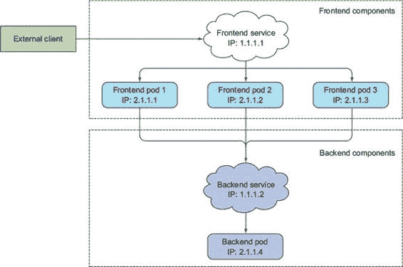
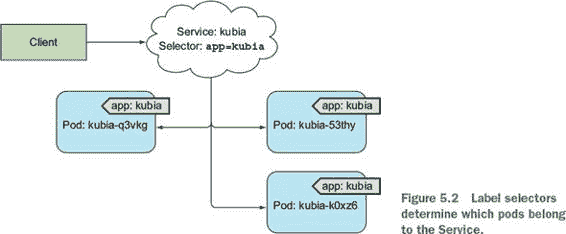
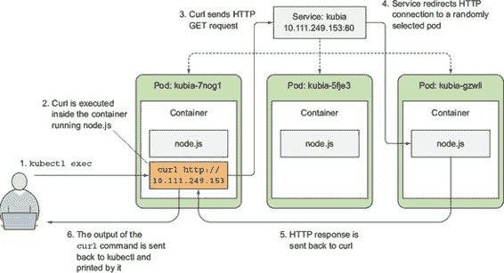
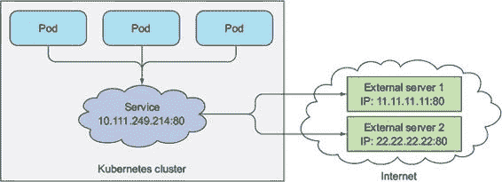
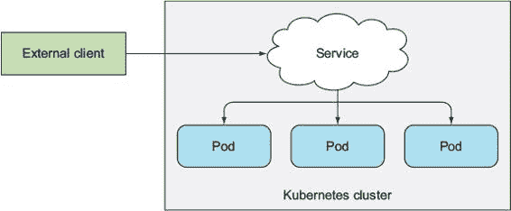
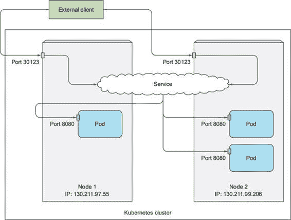
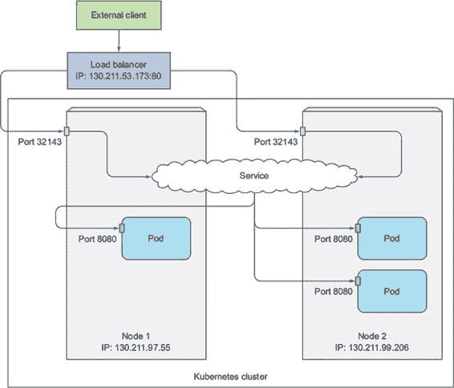
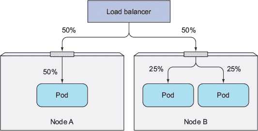
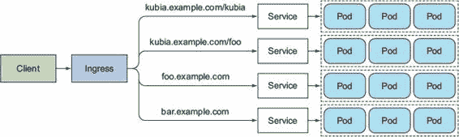
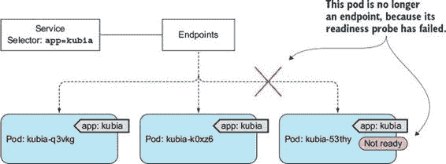

第五章. 服务：使客户端能够发现并与服务 Pod 通信

本章涵盖

+   创建服务资源以在单个地址公开一组 Pod

+   在集群中查找服务

+   将服务暴露给外部客户端

+   从集群内部连接到外部服务

+   控制 Pod 是否准备好成为服务的一部分

+   服务故障排除

你已经了解了 Pod 以及如何通过 ReplicaSet 等资源部署它们以确保它们持续运行。尽管某些 Pod 可以在没有外部刺激的情况下独立工作，但如今许多应用程序都是为了响应外部请求而设计的。例如，在微服务的情况下，Pod 通常会响应来自集群内部其他 Pod 或来自集群外部客户端的 HTTP 请求。

如果 Pod 想要消费它们提供的服务，它们需要一种方式来找到其他 Pod。与 Kubernetes 世界之外的情况不同，在那里系统管理员会通过指定客户端配置文件中提供服务的服务器确切的 IP 地址或主机名来配置每个客户端应用程序，在 Kubernetes 中这样做是不行的，因为

+   Pods 是短暂的——它们可能随时出现或消失，无论是由于 Pod 被从节点中移除以腾出空间给其他 Pod，有人减少了 Pod 的数量，还是因为集群节点故障。

+   Kubernetes 在 Pod 被调度到节点并启动之前为其分配一个 IP 地址——因此客户端无法事先知道服务器 Pod 的 IP 地址。

+   水平扩展意味着多个 Pod 可能提供相同的服务——每个 Pod 都有自己的 IP 地址。客户端不需要关心支持服务的 Pod 数量以及它们的 IP 地址。他们不需要保留所有 Pod 的 IP 地址列表。相反，所有这些 Pod 都应该可以通过一个单一的 IP 地址访问。

为了解决这些问题，Kubernetes 还提供了另一种资源类型——服务，我们将在本章中讨论。

5.1. 介绍服务

Kubernetes 服务是一种资源，你创建它来为提供相同服务的多个 Pod 提供一个单一、恒定的入口点。每个服务都有一个 IP 地址和端口，在服务存在期间这些地址和端口不会改变。客户端可以打开到该 IP 和端口的连接，然后这些连接会被路由到支持该服务的某个 Pod。这样，服务的客户端不需要知道提供服务的单个 Pod 的位置，允许这些 Pod 在集群中随时移动。

用例子解释服务

让我们回顾一下这个例子：你有一个前端 Web 服务器和一个后端数据库服务器。可能有多个 Pod 都充当前端，但可能只有一个后端数据库 Pod。你需要解决两个问题才能使系统正常工作：

+   外部客户端需要连接到前端 Pod，无需关心是否只有一个 Web 服务器或数百个。

+   前端 Pod 需要连接到后端数据库。因为数据库运行在 Pod 内部，它可能会随着时间的推移在集群中移动，导致其 IP 地址发生变化。你不想每次后端数据库移动时都重新配置前端 Pod。

通过为前端 Pod 创建一个服务并配置它可以从集群外部访问，你暴露了一个单一的、恒定的 IP 地址，外部客户端可以通过这个 IP 地址连接到 Pod。同样，通过为后端 Pod 也创建一个服务，你为后端 Pod 创建了一个稳定的地址。即使 Pod 的 IP 地址发生变化，服务地址也不会改变。此外，通过创建服务，你还可以使前端 Pod 能够通过环境变量或 DNS 通过名称轻松找到后端服务。你的系统中的所有组件（两个服务、支持这些服务的两个 Pod 集合以及它们之间的相互依赖关系）都在图 5.1 中展示。

图 5.1\. 内部和外部客户端通常通过服务连接到 Pod。

现在，你已经理解了服务背后的基本概念。现在，让我们通过首先了解它们是如何被创建的来深入探讨。

5.1.1\. 创建服务

正如你所看到的，服务可以由多个 Pod 支持。对服务的连接在所有支持 Pod 之间进行负载均衡。但你是如何定义哪些 Pod 是服务的一部分，哪些不是的呢？

你可能还记得标签选择器和它们如何在 Replication-Controllers 和其他 Pod 控制器中使用，以指定哪些 Pod 属于同一个集合。服务以相同的方式使用相同的机制，正如你在图 5.2 中可以看到的那样。

图 5.2\. 标签选择器确定哪些 Pod 属于服务。

在上一章中，你创建了一个 ReplicationController，然后运行了包含 Node.js 应用的 Pod 的三个实例。再次创建 ReplicationController 并验证三个 Pod 实例是否启动并运行。之后，你将为这三个 Pod 创建一个 Service。

通过 kubectl expose 创建服务

创建服务最简单的方法是通过 `kubectl expose`，你已经在第二章中使用它来暴露你之前创建的 ReplicationController。`expose` 命令创建了一个与 ReplicationController 使用相同的 pod 选择器的 Service 资源，从而通过单个 IP 地址和端口暴露了所有 Pod。

现在，你将不再使用 `expose` 命令，而是通过向 Kubernetes API 服务器提交 YAML 来手动创建服务。

通过 YAML 描述符创建服务

创建一个名为 kubia-svc.yaml 的文件，并包含以下内容列表。

列表 5.1\. 服务的定义：kubia-svc.yaml

`apiVersion: v1 kind: Service metadata:   name: kubia spec:   ports:   - port: 80` `1` `targetPort: 8080` `2` `selector:` `3` `app: kubia` `3`

+   1 该服务将可用的端口

+   2 服务将转发的容器端口

+   3 所有带有 app=kubia 标签的 Pod 都将成为此服务的一部分。

您正在定义一个名为`kubia`的服务，该服务将在端口 80 上接受连接，并将每个连接路由到匹配`app=kubia`标签选择器的 Pod 的端口 8080。

使用`kubectl create`上传文件来创建服务。

检查您的新服务

上传 YAML 文件后，您可以列出您命名空间中的所有服务资源，并看到已为您的服务分配了一个内部集群 IP：

`$ kubectl get svc` `NAME         CLUSTER-IP       EXTERNAL-IP   PORT(S)   AGE kubernetes   10.111.240.1     <none>        443/TCP   30d kubia        10.111.249.153   <none>        80/TCP    6m` `1`

+   1 这里是您的服务。

列表显示分配给服务的 IP 地址是 10.111.249.153。因为这是集群 IP，所以它只能在集群内部访问。服务的主要目的是将 Pod 组暴露给集群中的其他 Pod，但您通常还希望将服务外部暴露。您将在稍后看到如何做到这一点。现在，让我们从集群内部使用您的服务并查看它的工作情况。

在集群内部测试您的服务

您可以通过几种方式在集群内部向您的服务发送请求：

+   明显的方法是创建一个 Pod，它会将请求发送到服务的集群 IP 并记录响应。然后您可以检查 Pod 的日志以查看服务的响应。

+   您可以`ssh`连接到 Kubernetes 的一个节点并使用`curl`命令。

+   您可以通过`kubectl exec`命令在您的现有 Pod 中执行`curl`命令。

让我们选择最后一个选项，这样您也可以学习如何在现有 Pod 中运行命令。

在运行容器中远程执行命令

`kubectl exec`命令允许您在 Pod 的现有容器中远程运行任意命令。当您想检查容器的内容、状态和/或环境时，这非常有用。使用`kubectl get pods`命令列出 Pod，并选择一个作为`exec`命令的目标（在以下示例中，我选择了`kubia-7nog1` Pod 作为目标）。您还需要获取您服务的集群 IP（例如，使用`kubectl get svc`）。当您自己运行以下命令时，请确保将 Pod 名称和服务 IP 替换为您自己的：

`$ kubectl exec kubia-7nog1 -- curl -s http://10.111.249.153` `您已连接到 kubia-gzwli`

如果您之前使用`ssh`在远程系统上执行过命令，您会认识到`kubectl exec`并没有太大区别。

为什么是双横线？

命令中的双横线（`--`）表示`kubectl`命令选项的结束。双横线之后是应该在 Pod 内部执行的命令。如果没有以短横线开头的参数，则不需要使用双横线。但在你的情况下，如果你不使用双横线，`-s`选项将被解释为`kubectl exec`的选项，并导致以下奇怪且极具误导性的错误：

`$ kubectl exec kubia-7nog1 curl -s http://10.111.249.153` `连接到服务器 10.111.249.153 被拒绝 – 你是否指定了正确的宿主或端口？`

这与你的服务拒绝连接无关。这是因为`kubectl`无法连接到 10.111.249.153（API 服务器）的 API 服务器（`-s`选项用于告诉`kubectl`连接到非默认的 API 服务器）。

让我们回顾一下当你运行命令时发生了什么。图 5.3 显示了事件的序列。你指示 Kubernetes 在其中一个 Pod 的容器内执行`curl`命令。Curl 向服务 IP 发送了一个 HTTP 请求，该 IP 由三个 Pod 支持。Kubernetes 服务代理拦截了连接，从三个 Pod 中随机选择了一个 Pod，并将请求转发给它。然后在该 Pod 内部运行的 Node.js 处理了请求，并返回了一个包含 Pod 名称的 HTTP 响应。Curl 随后将响应打印到标准输出，然后由`kubectl`拦截并打印到你的本地机器的标准输出。

图 5.3\. 使用 kubectl exec 通过在 Pod 中运行 curl 测试对服务的连接

在上一个例子中，你作为单独的进程执行了`curl`命令，但它在 Pod 的主容器内部。这与容器中的实际主进程与服务的通信并没有太大的区别。

在服务上配置会话亲和性

如果你多次执行相同的命令，你应该在每次调用时遇到不同的 Pod，因为服务代理通常将每个连接转发到随机选择的支撑 Pod，即使连接来自同一客户端。

另一方面，如果你希望某个客户端发出的所有请求每次都重定向到同一个 Pod，你可以将服务的`sessionAffinity`属性设置为`ClientIP`（而不是默认的`None`），如下所示。

列表 5.2\. 配置了`ClientIP`会话亲和性的服务示例

`apiVersion: v1 kind: Service spec:` `sessionAffinity: ClientIP` `...`

这使得服务代理将所有来自同一客户端 IP 的请求重定向到同一个 Pod。作为一个练习，你可以创建一个额外的服务，将会话亲和性设置为`ClientIP`，并尝试向它发送请求。

Kubernetes 只支持两种类型的服务会话亲和性：`None`和`ClientIP`。你可能对它没有基于 cookie 的会话亲和性选项感到惊讶，但你需要理解 Kubernetes 服务不在 HTTP 级别上操作。服务处理 TCP 和 UDP 数据包，并不关心它们携带的负载。因为 cookie 是 HTTP 协议的一部分，服务不知道它们，这也解释了为什么会话亲和性不能基于 cookie。

在同一服务中暴露多个端口

你的服务只暴露单个端口，但服务也可以支持多个端口。例如，如果你的 Pod 监听两个端口——假设 8080 用于 HTTP 和 8443 用于 HTTPS——你可以使用单个服务将端口 80 和 443 都转发到 Pod 的端口 8080 和 8443。在这种情况下，你不需要创建两个不同的服务。使用单个多端口服务可以通过单个集群 IP 暴露所有服务端口。

注意

当创建具有多个端口的 服务时，你必须为每个端口指定一个名称。

多端口服务的规范如下所示。

列表 5.3\. 在服务定义中指定多个端口

`apiVersion: v1 kind: Service metadata:   name: kubia spec:   ports:   - name: http` `1` `port: 80` `1` `targetPort: 8080` `1` `- name: https` `2` `port: 443` `2` `targetPort: 8443` `2` `selector:` `3` `app: kubia` `3`

+   端口 80 映射到 Pod 的端口 8080。

+   端口 443 映射到 Pod 的端口 8443。

+   标签选择器始终应用于整个服务。

注意

标签选择器应用于整个服务——不能为每个端口单独配置。如果你想让不同的端口映射到不同的 Pod 子集，你需要创建两个服务。

因为你的`kubia` Pods 没有监听多个端口，创建多端口服务和多端口 Pod 留作练习。

使用命名端口

在所有这些示例中，你都是通过端口号来引用目标端口的，但你也可以为每个 Pod 的端口命名，并在服务规范中通过名称引用它。这使得服务规范稍微清晰一些，尤其是如果端口号不是很知名的话。

例如，假设你的 Pod 定义了如下所示端口名称。

列表 5.4\. 在 Pod 定义中指定端口名称

`kind: Pod spec:   containers:   - name: kubia     ports:     - name: http` `1` `containerPort: 8080` `1` `- name: https` `2` `containerPort: 8443` `2`

+   容器的端口 8080 被称为 http

+   端口 8443 被称为 https。

你可以在服务规范中通过名称引用这些端口，如下所示。

列表 5.5\. 在服务中引用命名端口

`apiVersion: v1 kind: Service spec:   ports:   - name: http` `1` `port: 80` `1` `targetPort: http` `1` `- name: https` `2` `port: 443` `2` `targetPort: https` `2`

+   1 端口 80 映射到名为 http 的容器端口。

+   端口 443 映射到名为 https 的容器端口。

但你为什么要费心去命名端口呢？这样做最大的好处是，它允许你在以后更改端口号，而无需更改服务规范。你的 Pod 当前使用 8080 端口进行 http 通信，但如果你后来决定想将其移动到 80 端口怎么办？

如果你正在使用命名端口，你只需要更改 Pod 规范中的端口号（同时保持端口号名称不变）。当你启动具有新端口号的 Pod 时，客户端连接将根据接收连接的 Pod（旧 Pod 上的 8080 端口和新 Pod 上的 80 端口）被转发到相应的端口号。

5.1.2\. 发现服务

通过创建服务，你现在有一个单一且稳定的 IP 地址和端口号，你可以通过它来访问你的 Pod。在整个服务生命周期中，这个地址将保持不变。位于此服务后面的 Pod 可能会来来去去，它们的 IP 可能会改变，它们的数量可能会增加或减少，但它们将通过服务的单一且恒定的 IP 地址始终可访问。

但客户端 Pod 如何知道服务的 IP 和端口号呢？你需要先创建服务，然后手动查找其 IP 地址，并将其传递给客户端 Pod 的配置选项吗？实际上并不需要。Kubernetes 还提供了客户端 Pod 发现服务 IP 和端口号的方法。

通过环境变量发现服务

当 Pod 启动时，Kubernetes 初始化一组环境变量，指向当时存在的每个服务。如果你在创建客户端 Pod 之前创建服务，那些 Pod 中的进程可以通过检查它们的环境变量来获取服务的 IP 地址和端口号。

让我们通过检查你运行中的 Pod 的环境来查看这些环境变量是什么样的。你已经了解到你可以使用`kubectl exec`命令在 Pod 中运行命令，但由于你是在 Pod 创建后才创建服务的，因此服务环境变量还没有被设置。首先你需要解决这个问题。

在你能够看到服务环境变量之前，首先需要删除所有 Pod，并让 ReplicationController 创建新的 Pod。你可能记得你可以这样不指定 Pod 名称来删除所有 Pod：

`$ kubectl delete po --all` `pod "kubia-7nog1" deleted pod "kubia-bf50t" deleted pod "kubia-gzwli" deleted`

现在，你可以列出新的 Pod（我确信你知道如何做），并选择一个作为`kubectl exec`命令的目标。一旦你选择了目标 Pod，你可以在容器内部运行`env`命令来列出环境变量，如下所示。

列表 5.6\. 容器中的服务相关环境变量

`$ kubectl exec kubia-3inly env` `PATH=/usr/local/sbin:/usr/local/bin:/usr/sbin:/usr/bin:/sbin:/bin HOSTNAME=kubia-3inly KUBERNETES_SERVICE_HOST=10.111.240.1 KUBERNETES_SERVICE_PORT=443 ...` `KUBIA_SERVICE_HOST=10.111.249.153``1``KUBIA_SERVICE_PORT=80``2` `...`

+   1 这里是服务的集群 IP。

+   2 这里是服务可用的端口。

在你的集群中定义了两个服务：`kubernetes`和`kubia`服务（你之前通过`kubectl get svc`命令看到了这一点）；因此，有两个与服务相关的环境变量集。在章节开头创建的`kubia`服务相关的变量中，你会看到`KUBIA_SERVICE_HOST`和`KUBIA_SERVICE_PORT`环境变量，分别持有`kubia`服务的 IP 地址和端口。

回到本章开始时我们讨论的前端-后端示例，当你有一个需要使用后端数据库服务器 Pod 的前端 Pod 时，你可以通过一个名为`backend-database`的服务来暴露后端 Pod，然后让前端 Pod 通过环境变量`BACKEND_DATABASE_SERVICE_HOST`和`BACKEND_DATABASE_SERVICE_PORT`查找其 IP 地址和端口。

注意

当服务名称用作环境变量名称的前缀时，服务名称中的破折号会被转换为下划线，并且所有字母都会转换为大写。

环境变量是查找服务 IP 和端口的一种方式，但这通常不是 DNS 的领域吗？为什么 Kubernetes 不包含一个 DNS 服务器并允许你通过 DNS 查找服务 IP 呢？实际上，它确实包含了！

通过 DNS 发现服务

记得在第三章中你列出了`kube-system`命名空间中的 Pod 吗？其中一个 Pod 被称作`kube-dns`。`kube-system`命名空间还包括一个同名的对应服务。

如其名所示，该 Pod 运行一个 DNS 服务器，集群中所有其他运行的 Pod 都会自动配置使用该服务器（Kubernetes 通过修改每个容器的`/etc/resolv.conf`文件来实现这一点）。在 Pod 中运行的任何进程执行的 DNS 查询都将由 Kubernetes 自己的 DNS 服务器处理，该服务器了解系统中运行的所有服务。

注意

是否使用内部 DNS 服务器是由每个 Pod 的 spec 中的`dnsPolicy`属性配置的。

每个服务在内部 DNS 服务器中都有一个 DNS 条目，知道服务名称的客户 Pod 可以通过其完全限定域名（FQDN）访问它，而不是求助于环境变量。

通过 FQDN 连接到服务

为了回顾前端-后端示例，前端 Pod 可以通过打开以下 FQDN 的连接来连接到后端-database 服务：

`backend-database.default.svc.cluster.local`

`backend-database`对应于服务名，`default`表示服务定义的命名空间，而`svc.cluster.local`是用于所有集群本地服务名的可配置集群域名后缀。

| |
| --- |

注意

客户端仍然需要知道服务的端口号。如果服务使用标准端口（例如，HTTP 的 80 或 Postgres 的 5432），这通常不会成问题。如果不是，客户端可以从环境变量中获取端口号。

| |
| --- |

连接到服务甚至可以比这更简单。当前端 pod 与数据库 pod 位于同一命名空间时，你可以省略`svc.cluster.local`后缀甚至命名空间。因此，你可以简单地通过`backend-database`来引用服务。这真是太简单了，对吧？

让我们尝试一下。你将尝试通过其 FQDN 而不是 IP 访问`kubia`服务。同样，你需要在现有的 pod 内部进行此操作。你已经知道如何使用`kubectl exec`在 pod 的容器中运行单个命令，但这次，你将运行`bash` shell 而不是直接运行`curl`命令，这样你就可以在容器中运行多个命令。这与你使用`docker exec -it bash`命令进入使用 Docker 运行的容器时在第二章中做的事情类似。

在 pod 的容器中运行 shell

你可以使用`kubectl exec`命令在 pod 的容器内运行`bash`（或任何其他 shell）。这样，你可以自由地探索容器，而无需为每个要运行的命令执行`kubectl exec`。

| |
| --- |

注意

为了使 shell 正常工作，shell 的二进制可执行文件必须在容器镜像中可用。

| |
| --- |

要正确使用 shell，你需要将`-it`选项传递给`kubectl exec`：

`$ kubectl exec -it kubia-3inly bash` `root@kubia-3inly:/#`

你现在已经在容器内部了。你可以使用`curl`命令以下任何一种方式访问`kubia`服务：

`root@kubia-3inly:/# curl http://kubia.default.svc.cluster.local` `You've hit kubia-5asi2` `root@kubia-3inly:/# curl http://kubia.default` `You've hit kubia-3inly` `root@kubia-3inly:/# curl http://kubia` `You've hit kubia-8awf3`

你可以使用服务名作为请求 URL 中的主机名来访问你的服务。你可以省略命名空间和`svc.cluster.local`后缀，因为每个 pod 容器内部的 DNS 解析器是如何配置的。查看容器中的`/etc/resolv.conf`文件，你就会明白：

`root@kubia-3inly:/# cat /etc/resolv.conf` `search default.svc.cluster.local svc.cluster.local cluster.local ...`

理解为什么无法 ping 通服务 IP

在我们继续之前，还有最后一件事。你现在知道如何创建服务了，所以你很快就会创建自己的服务。但如果你因为任何原因无法访问你的服务怎么办？

你可能会尝试通过进入现有的 Pod 并尝试像上一个例子中那样访问服务来找出问题所在。然后，如果你仍然无法使用简单的`curl`命令访问服务，你可能尝试 ping 服务 IP 以查看它是否在线。我们现在试试看：

`root@kubia-3inly:/# ping kubia` `PING kubia.default.svc.cluster.local (10.111.249.153): 56 data bytes ^C--- kubia.default.svc.cluster.local ping statistics --- 54 packets transmitted, 0 packets received, 100% packet loss`

嗯。使用`curl`访问服务是可行的，但 ping 它却不行。这是因为服务的集群 IP 是一个虚拟 IP，只有与服务端口结合时才有意义。我们将在第十一章（index_split_087.html#filepos1036287）中解释这意味着什么以及服务是如何工作的。我想在这里提一下，因为这是用户在尝试调试损坏的服务时做的第一件事，而且它会让大多数人感到措手不及。

5.2. 连接到集群外部的服务

到目前为止，我们讨论了由集群内部运行的一个或多个 Pod 支持的服务。但存在一些情况，你可能希望通过 Kubernetes 服务功能公开外部服务。你不想让服务将连接重定向到集群中的 Pod，而是希望它重定向到外部 IP 和端口。

这允许你利用服务负载均衡和服务发现的优势。运行在集群中的客户端 Pod 可以像连接内部服务一样连接到外部服务。

5.2.1. 介绍服务端点

在进入如何实现这一点之前，让我首先更详细地解释一下服务。服务并不直接链接到 Pod。相反，一个资源位于其中间——Endpoints 资源。如果你在服务上使用了`kubectl describe`命令，你可能已经注意到了端点，如下所示。

列表 5.7. 使用`kubectl describe`显示的服务详细信息

`$ kubectl describe svc kubia` `Name:                kubia Namespace:           default Labels:              <none> Selector:            app=kubia` `1` `Type:                ClusterIP IP:                  10.111.249.153 Port:                <unset> 80/TCP Endpoints:           10.108.1.4:8080,10.108.2.5:8080,10.108.2.6:8080` `2` `Session Affinity:    None No events.`

+   1 该服务的 Pod 选择器用于创建端点列表。

+   2 代表此服务端点的 Pod IP 和端口列表

Endpoints 资源（是的，复数形式）是一个列出暴露服务的 IP 地址和端口的列表。Endpoints 资源就像其他 Kubernetes 资源一样，因此你可以使用`kubectl get`来显示其基本信息：

`$ kubectl get endpoints kubia` `NAME    ENDPOINTS                                         AGE kubia   10.108.1.4:8080,10.108.2.5:8080,10.108.2.6:8080   1h`

虽然 pod 选择器在服务规范中定义，但在重定向传入连接时并不直接使用。相反，选择器用于构建一个 IP 和端口号列表，然后存储在端点资源中。当客户端连接到服务时，服务代理会从这些 IP 和端口号对中选择一个，并将传入的连接重定向到在该位置监听的服务器。

5.2.2\. 手动配置服务端点

你可能已经意识到了这一点，但将服务的端点与服务解耦允许它们手动配置和更新。

如果你创建一个没有 pod 选择器的服务，Kubernetes 甚至不会创建端点资源（毕竟，没有选择器，它不知道要包含哪些 pod 在服务中）。创建端点资源以指定服务端点列表的责任在你。

要创建手动管理的端点服务，你需要创建一个服务和端点资源。

创建没有选择器的服务

你首先需要创建服务本身的 YAML，如下所示。

列表 5.8\. 没有 pod 选择器的服务：external-service.yaml

`apiVersion: v1 kind: Service metadata:   name: external-service` `1` `spec:` `2` `ports:   - port: 80`

+   1 服务的名称必须与端点对象的名称匹配（见下一列表）。

+   2 此服务未定义选择器。

你正在定义一个名为`external-service`的服务，该服务将在端口 80 上接受传入连接。你没有为服务定义 pod 选择器。

为没有选择器的服务创建端点资源

端点是单独的资源，而不是服务的属性。因为你创建的服务没有选择器，相应的端点资源还没有自动创建，所以你需要自己创建它。下面的列表显示了它的 YAML 表示。

列表 5.9\. 手动创建的端点资源：external-service-endpoints.yaml

`apiVersion: v1 kind: Endpoints metadata:   name: external-service` `1` `subsets:   - addresses:     - ip: 11.11.11.11` `2` `- ip: 22.22.22.22` `2` `ports:     - port: 80` `3`

+   1 端点对象的名称必须与服务的名称匹配（见上一列表）。

+   2 服务将转发连接到的端点 IP

+   3 端点的目标端口

端点对象需要与服务的名称相同，并包含服务的目标 IP 地址和端口号列表。在服务和端点资源都提交到服务器后，服务就可以像任何带有 pod 选择器的常规服务一样使用了。在服务创建后创建的容器将包含服务的环境变量，并且所有连接到其 IP:端口对的连接将在服务的端点之间进行负载均衡。

图 5.4 显示了三个 pod 连接到具有外部端点的服务。

图 5.4\. 消费具有两个外部端点的服务的 Pod。

如果您后来决定将外部服务迁移到在 Kubernetes 内运行的 Pod 中，您可以在服务中添加一个选择器，从而自动管理其端点。反之亦然——通过从服务中移除选择器，Kubernetes 停止更新其端点。这意味着服务 IP 地址可以保持不变，而服务的实际实现可以更改。

5.2.3\. 创建外部服务的别名

与手动配置服务的端点以暴露外部服务相比，一种更简单的方法允许您通过其完全限定域名（FQDN）来引用外部服务。

创建一个 ExternalName 服务

要创建一个作为外部服务别名的服务，您需要创建一个 `type` 字段设置为 `ExternalName` 的服务资源。例如，让我们假设有一个公开的 API 在 [api.somecompany.com](http://api.somecompany.com) 上可用。您可以定义一个指向它的服务，如下所示。

列表 5.10\. `ExternalName` 类型的服务：external-service-externalname.yaml

`apiVersion: v1 kind: Service metadata:   name: external-service spec:   type: ExternalName` `1` `externalName: someapi.somecompany.com` `2` `ports:   - port: 80`

+   1 服务类型设置为 ExternalName

+   2 实际服务的完全限定域名

服务创建后，Pod 可以通过 `external-service.default.svc.cluster.local` 域名（或甚至 `external-service`）连接到外部服务，而不是使用服务的实际 FQDN。这隐藏了实际服务名称及其位置，从而允许您在以后任何时候仅通过更改 `externalName` 属性或将类型更改为 `ClusterIP` 并为服务创建一个端点对象（手动或通过在服务上指定标签选择器并自动创建）来修改服务定义并指向不同的服务。

`ExternalName` 服务仅在 DNS 层面实现——为服务创建一个简单的 `CNAME` DNS 记录。因此，连接到服务的客户端将直接连接到外部服务，完全绕过服务代理。因此，这些类型的服务甚至没有集群 IP。

| |
| --- |

注意

`CNAME` 记录指向一个完全限定域名，而不是一个数字 IP 地址。

| |
| --- |

5.3\. 向外部客户端暴露服务

到目前为止，我们只讨论了服务如何被集群内部的 Pod 消费。但您可能还想将某些服务，如前端 web 服务器，暴露给外部，以便外部客户端可以访问它们，如图 5.5 所示。

图 5.5\. 向外部客户端暴露服务

您有几种方法可以使服务对外部可访问：

+   将服务类型设置为 `NodePort`——对于 `NodePort` 服务，每个集群节点在其自身上打开一个端口（因此得名），并将该端口接收到的流量重定向到底层服务。服务不仅可以通过内部集群 IP 和端口访问，还可以通过所有节点上的专用端口访问。

+   将服务类型设置为 `LoadBalancer`，这是 `NodePort` 类型的扩展——这使得服务可以通过一个专用的负载均衡器访问，该负载均衡器由 Kubernetes 运行的云基础设施提供。负载均衡器将流量重定向到所有节点上的节点端口。客户端通过负载均衡器的 IP 连接到服务。

+   创建一个 Ingress 资源，这是一种通过单个 IP 地址公开多个服务的根本不同的机制——它在 HTTP 层（网络层 7）上运行，因此可以提供比层 4 服务更多的功能。我们将在 第 5.4 节 解释 Ingress 资源。

5.3.1\. 使用 NodePort 服务

将一组 pod 公开给外部客户端的第一种方法是创建一个服务并将其类型设置为 `NodePort`。通过创建 `NodePort` 服务，你让 Kubernetes 在所有节点上保留一个端口（所有这些节点都使用相同的端口号）并将传入的连接转发到属于该服务的 pod。

这与常规服务类似（它们的实际类型是 `ClusterIP`），但 `NodePort` 服务不仅可以通过服务的内部集群 IP 访问，还可以通过任何节点的 IP 和保留的节点端口访问。

当你尝试与 `NodePort` 服务交互时，这会更有意义。

创建 NodePort 服务

你现在将创建一个 `NodePort` 服务来查看如何使用它。以下列表显示了服务的 YAML 格式。

列表 5.11\. `NodePort` 服务定义：kubia-svc-nodeport.yaml

`apiVersion: v1 kind: Service metadata:   name: kubia-nodeport spec:   type: NodePort` `1` `ports:   - port: 80` `2` `targetPort: 8080` `3` `nodePort: 30123` `4` `selector:     app: kubia`

+   1 将服务类型设置为 NodePort。

+   2 这是服务内部集群 IP 的端口。

+   3 这是支持 pod 的目标端口。

+   4 服务将通过您每个集群节点的 30123 端口访问。

你将类型设置为 `NodePort` 并指定该服务应在所有集群节点上绑定的节点端口。指定端口不是强制性的；如果你省略它，Kubernetes 将选择一个随机端口。

| |
| --- |

注意

当你在 GKE 中创建服务时，`kubectl` 会打印出一个警告，关于需要配置防火墙规则。我们很快就会看到如何做。

| |
| --- |

检查你的 NodePort 服务

让我们查看您服务的详细信息，以了解更多信息：

`$ kubectl get svc kubia-nodeport` `NAME             CLUSTER-IP       EXTERNAL-IP   PORT(S)        AGE kubia-nodeport   10.111.254.223   <nodes>       80:30123/TCP   2m`

查看外部 IP 列。它显示`<nodes>`，表示服务可以通过任何集群节点的 IP 地址访问。端口（PORT(S)）列显示了集群 IP 的内部端口（`80`）和节点端口（`30123`）。服务可通过以下地址访问：

+   `10.11.254.223:80`

+   `<1st node's IP>:30123`

+   `<2nd node's IP>:30123`，等等。

图 5.6 显示了您的服务在两个集群节点的 30123 端口上公开（如果您在 GKE 上运行此操作，则适用；Minikube 只有一个节点，但原理相同）。连接到这些端口之一的传入连接将被重定向到随机选择的 Pod，这可能或可能不是连接到的节点上运行的 Pod。

图 5.6\. 外部客户端通过节点 1 或 2 连接到 NodePort 服务

在第一个节点的 30123 端口上接收到的连接可能会被转发到第一个节点上运行的 Pod，或者转发到第二个节点上运行的 Pod 之一。

更改防火墙规则以允许外部客户端访问我们的 NodePort 服务

如我之前所述，在您可以通过节点端口访问服务之前，您需要配置 Google Cloud Platform 的防火墙，以允许在该端口上对您的节点进行外部连接。您现在将这样做：

`$ gcloud compute firewall-rules create kubia-svc-rule --allow=tcp:30123` `Created [https://www.googleapis.com/compute/v1/projects/kubia-1295/global/firewalls/kubia-svc-rule]. NAME            NETWORK  SRC_RANGES  RULES      SRC_TAGS  TARGET_TAGS kubia-svc-rule  default  0.0.0.0/0   tcp:30123`

您可以通过节点 IP 的 30123 端口之一访问您的服务。但您首先需要找出节点的 IP。有关如何操作的说明，请参考侧边栏。

使用 JSONPath 获取所有节点的 IP 地址

您可以在节点的 JSON 或 YAML 描述符中找到 IP 地址。但您不必在相对较大的 JSON 中筛选，您可以告诉`kubectl`仅打印节点 IP 而不是整个服务定义：

`$ kubectl get nodes -o jsonpath='{.items[*].status.``addresses[?(@.type=="ExternalIP")].address}'` `130.211.97.55 130.211.99.206`

您通过指定 JSONPath 来告诉`kubectl`仅输出您想要的信息。您可能熟悉 XPath 及其在 XML 中的应用。JSONPath 基本上是 XPath 的 JSON 版本。上一个示例中的 JSONPath 指示`kubectl`执行以下操作：

+   遍历`items`属性中的所有元素。

+   对于每个元素，进入`status`属性。

+   过滤`addresses`属性的元素，仅选择那些将`type`属性设置为`ExternalIP`的元素。

+   最后，打印过滤元素的`address`属性。

要了解有关如何使用`kubectl`与 JSONPath 的更多信息，请参阅[`kubernetes.io/docs/user-guide/jsonpath`](http://kubernetes.io/docs/user-guide/jsonpath)文档。

一旦您知道了节点的 IP 地址，您可以通过它们尝试访问您的服务：

`$ curl http://130.211.97.55:30123` `您已访问 kubia-ym8or` `$ curl http://130.211.99.206:30123` `您已访问 kubia-xueq1`

提示

当使用 Minikube 时，您可以通过运行 `minikube service <service-name> [-n <namespace>]` 命令，轻松通过浏览器访问您的 `NodePort` 服务。

如您所见，您的 pod 现在可以通过您任何节点的 30123 端口访问整个互联网。客户端发送请求到哪个节点无关紧要。但是，如果您只将客户端指向第一个节点，当该节点失败时，客户端将无法再访问服务。这就是为什么在节点前放置负载均衡器以确保您正在将请求分散到所有健康节点，并且永远不会将请求发送到当时离线的节点是有意义的。

如果您的 Kubernetes 集群支持此功能（当 Kubernetes 部署在云基础设施上时通常支持），则可以通过创建一个 `LoadBalancer` 而不是 `NodePort` 服务来自动配置负载均衡器。我们将在下一节中探讨这一点。

5.3.2\. 通过外部负载均衡器公开服务

在云提供商上运行的 Kubernetes 集群通常支持从云基础设施自动配置负载均衡器。您需要做的只是将服务的类型设置为 `LoadBalancer` 而不是 `NodePort`。负载均衡器将拥有自己的唯一、公开可访问的 IP 地址，并将所有连接重定向到您的服务。因此，您可以通过负载均衡器的 IP 地址访问您的服务。

如果 Kubernetes 运行在不支持 `LoadBalancer` 服务的环境中，则不会配置负载均衡器，但服务仍将像 `NodePort` 服务一样运行。这是因为 `LoadBalancer` 服务是 `NodePort` 服务的扩展。您将在支持 `LoadBalancer` 服务的 Google Kubernetes Engine 上运行此示例。Minikube 不支持，至少在本写作时如此。

创建负载均衡器服务

要创建一个前面有负载均衡器的服务，请从以下 YAML 清单创建服务，如下所示。

列表 5.12\. `LoadBalancer` 类型服务：kubia-svc-loadbalancer.yaml

`apiVersion: v1 kind: Service metadata:   name: kubia-loadbalancer spec:   type: LoadBalancer` `1` `ports:   - port: 80     targetPort: 8080   selector:     app: kubia`

+   1 此类服务从托管 Kubernetes 集群的底层基础设施中获取负载均衡器。

服务类型设置为 `LoadBalancer` 而不是 `NodePort`。您没有指定特定的节点端口，尽管您可以（您让 Kubernetes 选择一个）。

通过负载均衡器连接到服务

在创建服务后，云基础设施需要时间来创建负载均衡器并将它的 IP 地址写入服务对象。一旦完成，IP 地址将作为服务的公网 IP 地址列出：

`$ kubectl get svc kubia-loadbalancer` `NAME                 CLUSTER-IP       EXTERNAL-IP      PORT(S)         AGE kubia-loadbalancer   10.111.241.153` `130.211.53.173``   80:32143/TCP    1m`

在这种情况下，负载均衡器在 IP 130.211.53.173 上可用，因此你现在可以通过该 IP 地址访问服务：

`$ curl http://130.211.53.173` `你访问了 kubia-xueq1`

成功！正如你可能注意到的，这次你不需要像之前使用`NodePort`服务那样去配置防火墙。

会话亲和性与网页浏览器

因为你的服务现在已对外公开，你可以尝试使用你的网页浏览器访问它。你会发现一些可能让你觉得奇怪的事情——浏览器每次都会访问到完全相同的 Pod。服务在这期间是否改变了会话亲和性？使用`kubectl explain`，你可以再次确认服务的会话亲和性仍然设置为`None`，那么为什么不同的浏览器请求没有击中不同的 Pod，就像使用`curl`时那样呢？

让我解释一下正在发生的事情。浏览器正在使用持久连接，并通过单个连接发送所有请求，而`curl`每次都会打开一个新的连接。服务在连接级别上工作，所以当第一次打开到服务的连接时，会随机选择一个 Pod，然后所有属于该连接的网络包都会发送到那个单个 Pod。即使会话亲和性设置为`None`，用户也总是会击中同一个 Pod（直到连接关闭）。

见图 5.7 了解 HTTP 请求是如何被发送到 Pod 的。外部客户端（在你的情况下是`curl`）连接到负载均衡器的 80 端口，并被路由到某个节点上隐式分配的节点端口。从那里，连接被转发到 Pod 实例之一。

图 5.7\. 一个外部客户端连接到`LoadBalancer`服务

如前所述，`LoadBalancer`类型的服务是一个带有额外基础设施提供的负载均衡器的`NodePort`服务。如果你使用`kubectl describe`来显示有关服务的更多信息，你会看到为服务选择了一个节点端口。如果你像在关于`NodePort`服务的上一节中那样为该端口打开防火墙，你也可以通过节点 IP 访问服务。

小贴士

如果你使用 Minikube，即使负载均衡器永远不会被配置，你仍然可以通过节点端口（在 Minikube 虚拟机的 IP 地址）访问服务。

5.3.3\. 理解外部连接的特有之处

你必须注意与外部发起的服务连接相关的几个事项。

理解和防止不必要的网络跳转

当外部客户端通过节点端口连接到服务（这也包括首先通过负载均衡器的情况），随机选择的 Pod 可能或可能不在接收连接的同一节点上运行。需要额外的网络跳转才能到达 Pod，但这可能并不总是希望的。

您可以通过配置服务，仅将外部流量重定向到运行在接收连接的节点上的 Pod 来防止这种额外的跳转。这是通过在服务的`spec`部分设置`externalTrafficPolicy`字段来完成的：

`spec: externalTrafficPolicy: Local ...`

如果服务定义包括此设置，并且通过服务的节点端口打开外部连接，服务代理将选择本地运行的 Pod。如果没有本地 Pod 存在，连接将挂起（不会像不使用注释时那样将连接转发到随机全局 Pod）。因此，您需要确保负载均衡器仅将连接转发到至少有一个此类 Pod 的节点。

使用此注释也有其他缺点。通常，连接会在所有 Pod 之间均匀分配，但使用此注释时，情况就不再是这样了。

想象有两个节点和三个 Pod。假设节点 A 运行一个 Pod，节点 B 运行另外两个 Pod。如果负载均衡器将连接均匀地分配到两个节点，节点 A 上的 Pod 将接收所有连接的 50%，但节点 B 上的两个 Pod 每个只能接收 25%，如图 5.8 所示。

图 5.8\. 使用`Local`外部流量策略的服务可能导致 Pod 之间的负载分布不均。

了解客户端 IP 不保留的情况

通常，当集群内的客户端连接到服务时，支持服务的 Pod 可以获取客户端的 IP 地址。但通过节点端口接收连接时，数据包的源 IP 会改变，因为数据包在源网络地址转换（SNAT）上执行。

支持 Pod 看不到实际的客户端 IP，这可能对一些需要知道客户端 IP 的应用程序来说是个问题。例如，对于 Web 服务器来说，这意味着访问日志不会显示浏览器的 IP。

上一个章节中描述的`Local`外部流量策略会影响客户端 IP 的保留，因为没有在接收连接的节点和托管目标 Pod 的节点之间增加额外的跳转（不会执行 SNAT）。

5.4\. 通过 Ingress 资源外部公开服务

你现在已经看到了两种将服务公开给集群外客户端的方法，但还存在另一种方法——创建 Ingress 资源。

| |
| --- |

定义

Ingress（名词）——进入或进入的行为；进入的权利；进入的手段或地方；入口。

| |
| --- |

让我先解释一下为什么你需要另一种从外部访问 Kubernetes 服务的方法。

理解为什么需要 Ingress

一个重要的原因是，每个 `LoadBalancer` 服务都需要自己的负载均衡器及其自己的公网 IP 地址，而 Ingress 只需要一个是足够的，即使它提供了对数十个服务的访问。当客户端向 Ingress 发送 HTTP 请求时，请求中的主机和路径决定了请求被转发到哪个服务，如图 5.9 所示。

图 5.9\. 可以通过单个 Ingress 暴露多个服务。

Ingress 在网络堆栈的应用层（HTTP）中运行，可以提供诸如基于 cookie 的会话亲和力等功能，这是服务所不能提供的。

理解需要 Ingress 控制器

在我们深入了解 Ingress 对象提供的功能之前，让我强调一点，为了使 Ingress 资源工作，集群中需要运行 Ingress 控制器。不同的 Kubernetes 环境使用不同的控制器实现，但其中一些根本不提供默认控制器。

例如，Google Kubernetes Engine 使用 Google Cloud Platform 自身的 HTTP 负载均衡功能来提供 Ingress 功能。最初，Minikube 并没有提供默认的控制器，但现在它包含了一个可以启用的插件，让你可以尝试 Ingress 功能。按照以下侧边栏中的说明确保已启用。

| |
| --- |

在 Minikube 中启用 Ingress 插件

如果你使用 Minikube 运行本书中的示例，你需要确保 Ingress 插件已启用。你可以通过列出所有插件来检查它是否已启用：

`$ minikube addons list` `- default-storageclass: enabled - kube-dns: enabled - heapster: disabled - ingress: disabled` `1` `- registry-creds: disabled - addon-manager: enabled - dashboard: enabled`

+   1 Ingress 插件尚未启用。

你将在本书中了解这些插件是什么，但应该很清楚 `dashboard` 和 `kube-dns` 插件的作用。启用 Ingress 插件以便你可以看到 Ingress 的实际操作：

`$ minikube addons enable ingress` `ingress was successfully enabled`

这应该已经启动了一个 Ingress 控制器作为另一个 pod。最可能的情况是，控制器 pod 将位于 `kube-system` 命名空间中，但不一定是这样，所以使用 `--all-namespaces` 选项列出所有命名空间中的所有正在运行的 pod：

`$ kubectl get po --all-namespaces` `NAMESPACE    NAME                            READY  STATUS    RESTARTS AGE default      kubia-rsv5m                     1/1    Running   0        13h default      kubia-fe4ad                     1/1    Running   0        13h default      kubia-ke823                     1/1    Running   0        13h kube-system  default-http-backend-5wb0h      1/1    Running   0        18m kube-system  kube-addon-manager-minikube     1/1    Running   3        6d kube-system  kube-dns-v20-101vq              3/3    Running   9        6d kube-system  kubernetes-dashboard-jxd9l      1/1    Running   3        6d kube-system  nginx-ingress-controller-gdts0  1/1    Running   0        18m`

在输出底部，你可以看到 Ingress 控制器 Pod。名称表明 Nginx（一个开源的 HTTP 服务器和反向代理）被用来提供 Ingress 功能。

| |
| --- |
| |

提示

侧边栏中提到的`--all-namespaces`选项在你不知道你的 Pod（或其他类型的资源）位于哪个命名空间，或者你想列出所有命名空间中的资源时很有用。

| |
| --- |

5.4.1\. 创建 Ingress 资源

你已确认你的集群中正在运行 Ingress 控制器，因此你现在可以创建 Ingress 资源。以下列表显示了 Ingress 的 YAML 清单的外观。

列表 5.13\. Ingress 资源定义：kubia-ingress.yaml

`apiVersion: extensions/v1beta1 kind: Ingress metadata:   name: kubia spec:   rules:   - host: kubia.example.com` `1` `http:       paths:       - path: /` `2` `backend:           serviceName: kubia-nodeport` `2` `servicePort: 80` `2`

+   1 此 Ingress 将 kubia.example.com 域名映射到你的服务。

+   2 所有请求都将发送到 kubia-nodeport 服务的 80 端口。

这定义了一个包含单个规则的 Ingress，确保所有通过 Ingress 控制器接收到的、请求主机`kubia.example.com`的 HTTP 请求都将发送到端口`80`上的`kubia-nodeport`服务。

| |
| --- |

注意

云提供商上的 Ingress 控制器（例如在 GKE 上）需要 Ingress 指向一个`NodePort`服务。但这不是 Kubernetes 本身的必要条件。

| |
| --- |

5.4.2\. 通过 Ingress 访问服务

要通过 http://kubia.example.com 访问你的服务，你需要确保域名解析到 Ingress 控制器的 IP 地址。

获取 Ingress 的 IP 地址

要查找 IP，你需要列出 Ingress：

`$ kubectl get ingresses` `NAME      HOSTS               ADDRESS          PORTS     AGE kubia     kubia.example.com   192.168.99.100   80        29m`

| |
| --- |

注意

当在云提供商上运行时，地址可能需要一段时间才能出现，因为 Ingress 控制器在幕后配置了一个负载均衡器。

| |
| --- |

IP 地址显示在`ADDRESS`列中。

确保 Ingress 中配置的主机指向 Ingress 的 IP 地址

一旦您知道了 IP，您可以选择配置您的 DNS 服务器将 kubia.example.com 解析到该 IP，或者您可以在`/etc/hosts`（或在 Windows 上的`C:\windows\system32\drivers\etc\hosts`）中添加以下行：

`192.168.99.100    kubia.example.com`

通过 Ingress 访问 Pod

一切都已设置好，因此您可以通过 http://kubia.example.com（使用浏览器或`curl`）访问服务：

`$ curl http://kubia.example.com` `您已访问 kubia-ke823`

您已成功通过 Ingress 访问了服务。让我们更详细地看看这是如何展开的。

理解 Ingress 的工作原理

图 5.10 显示了客户端如何通过 Ingress 控制器连接到一个 Pod。客户端首先对 kubia.example.com 执行 DNS 查找，DNS 服务器（或本地操作系统）返回 Ingress 控制器的 IP。然后客户端向 Ingress 控制器发送 HTTP 请求，并在`Host`头中指定`kubia.example.com`。从该头信息中，控制器确定了客户端试图访问哪个服务，通过服务关联的 Endpoints 对象查找 Pod IP，并将客户端的请求转发到其中一个 Pod。

图 5.10\. 通过 Ingress 访问 Pod

如您所见，Ingress 控制器没有将请求转发到服务。它只是用它来选择一个 Pod。大多数，如果不是所有控制器都是这样工作的。

5.4.3\. 通过同一 Ingress 暴露多个服务

如果您仔细查看 Ingress 规范，您会看到`rules`和`paths`都是数组，因此它们可以包含多个项目。Ingress 可以将多个主机和路径映射到多个服务，您将在下面看到。让我们首先关注`paths`。

将不同的服务映射到同一主机的不同路径

您可以将同一主机上的多个`path`映射到不同的服务，如下列所示。

列表 5.14\. 在同一主机上暴露多个服务，但不同的`path`

`...   - host: kubia.example.com   http:   paths:   - path: /kubia   1   backend:   1   serviceName: kubia   1   servicePort: 80   1   - path: /foo   2   backend:   2   serviceName: bar   2   servicePort: 80   2`

+   1 请求到 kubia.example.com/kubia 将被路由到 kubia 服务。

+   2 请求到 kubia.example.com/bar 将被路由到 bar 服务。

在这种情况下，根据请求的 URL 路径，请求将被发送到两个不同的服务。因此，客户端可以通过单个 IP 地址（即 Ingress 控制器所在的 IP 地址）访问两个不同的服务。

将不同的服务映射到不同的主机

类似地，您可以使用 Ingress 根据 HTTP 请求中的主机而不是（仅）路径来映射到不同的服务，如下列所示。

列表 5.15\. 在不同主机上暴露多个服务的 Ingress

`spec:    rules:    - host: foo.example.com` `1` `http:        paths:        - path: /        backend:            serviceName: foo` `1` `servicePort: 80    - host: bar.example.com` `2` `http:        paths:        - path: /        backend:            serviceName: bar` `2` `servicePort: 80`

+   1 请求 foo.example.com 将被路由到服务 foo。

+   2 请求 bar.example.com 将被路由到服务 bar。

控制器接收到的请求将被转发到服务 `foo` 或 `bar`，具体取决于请求中的 `Host` 头（类似于在 Web 服务器中处理虚拟主机的方式）。DNS 需要将 foo.example.com 和 bar.example.com 域名都指向 Ingress 控制器的 IP 地址。

5.4.4. 配置 Ingress 以处理 TLS 流量

您已经看到了 Ingress 如何转发 HTTP 流量。那么 HTTPS 呢？让我们快速了解一下如何配置 Ingress 以支持 TLS。

为 Ingress 创建 TLS 证书

当客户端打开到 Ingress 控制器的 TLS 连接时，控制器将终止 TLS 连接。客户端与控制器之间的通信是加密的，而控制器与后端 Pod 之间的通信则不是。Pod 中运行的应用程序不需要支持 TLS。例如，如果 Pod 运行的是 Web 服务器，它只能接受 HTTP 流量，而让 Ingress 控制器处理所有与 TLS 相关的事情。为了使控制器能够这样做，您需要将证书和私钥附加到 Ingress 上。这两个文件需要存储在名为 Secret 的 Kubernetes 资源中，然后在 Ingress 清单中引用它。我们将在第七章（index_split_063.html#filepos687721）中详细解释 Secrets。现在，您将创建 Secret，但不必过分关注它。

首先，您需要创建私钥和证书：

`$ openssl genrsa -out tls.key 2048` `$ openssl req -new -x509 -key tls.key -out tls.cert -days 360 -subj``/CN=kubia.example.com`

然后，您可以根据这两个文件创建 Secret，如下所示：

`$ kubectl create secret tls tls-secret --cert=tls.cert --key=tls.key` `secret "tls-secret" created`

通过 CertificateSigningRequest 资源签名证书

您可以通过创建 `CertificateSigningRequest`（CSR）资源来获取证书的签名，而不是自己签名证书。用户或他们的应用程序可以创建一个常规证书请求，将其放入 CSR 中，然后由人工操作员或自动化流程批准请求，如下所示：

`$ kubectl certificate approve <CSR 名称>`

签名的证书可以从 CSR 的 `status.certificate` 字段中检索。

注意，必须在集群中运行证书签名组件；否则，创建 `CertificateSigningRequest` 以及批准或拒绝它们将没有任何效果。

私钥和证书现在存储在名为`tls-secret`的 Secret 中。现在，您可以更新 Ingress 对象，使其也接受 kubia.example.com 的 HTTPS 请求。Ingress 清单现在应如下所示。

列表 5.16\. Ingress 处理 TLS 流量：kubia-ingress-tls.yaml

`apiVersion: extensions/v1beta1 kind: Ingress metadata:   name: kubia spec:   tls:` `1` `- hosts:` `2` `- kubia.example.com` `2` `secretName: tls-secret` `3` `rules:   - host: kubia.example.com     http:       paths:       - path: /         backend:           serviceName: kubia-nodeport           servicePort: 80`

+   1 整个 TLS 配置都包含在这个属性中。

+   2 将接受对 kubia.example.com 主机名的 TLS 连接。

+   3 应从之前创建的 tls-secret 中获取私钥和证书。

| |
| --- |

提示

您无需删除 Ingress 并从新文件中重新创建它，而是可以调用`kubectl apply -f kubia-ingress-tls.yaml`，这将使用文件中指定的内容更新 Ingress 资源。

| |
| --- |

现在，您可以通过 Ingress 使用 HTTPS 访问您的服务：

`$ curl -k -v https://kubia.example.com/kubia` `* 即将连接()到 kubia.example.com 端口 443 (#0) ... * 服务器证书： *   主题: CN=kubia.example.com ... > GET /kubia HTTP/1.1 > ... 您已访问 kubia-xueq1`

命令的输出显示了应用响应以及与 Ingress 配置的服务器证书。

| |
| --- |

注意

不同 Ingress 控制器实现之间对 Ingress 特性的支持各不相同，因此请检查特定实现的文档以了解支持的内容。

| |
| --- |

Ingress 是相对较新的 Kubernetes 特性，因此您预计在将来会看到许多改进和新特性。尽管它们目前仅支持 L7（HTTP/HTTPS）负载均衡，但计划也支持 L4 负载均衡。

5.5\. 当 Pod 准备好接受连接时发出信号

关于服务和 Ingress，我们还需要讨论一点。您已经了解到，如果 Pod 的标签与服务的 Pod 选择器匹配，则 Pod 被视为服务的端点。一旦创建了带有适当标签的新 Pod，它就成为服务的一部分，请求开始被重定向到该 Pod。但如果 Pod 尚未准备好立即开始处理请求怎么办？

Pod 可能需要时间来加载配置或数据，或者可能需要执行预热程序以防止第一个用户请求耗时过长并影响用户体验。在这种情况下，您不希望 Pod 立即开始接收请求，尤其是当已运行的实例可以正确且快速地处理请求时。在 Pod 完全准备好之前不将请求转发到正在启动的 Pod 是有意义的。

5.5.1\. 介绍就绪探针

在上一章中，你学习了存活探针以及它们如何通过确保不健康的容器自动重启来帮助保持应用程序的健康状态。与存活探针类似，Kubernetes 允许你为你的 Pod 定义一个准备探针。

准备探针定期调用，并确定特定的 Pod 是否应该接收客户端请求。当一个容器的准备探针返回成功时，它表示容器已准备好接受请求。

准备这一概念显然是针对每个容器特定的。Kubernetes 可以检查容器中的应用程序是否响应简单的 `GET /` 请求，或者它可以直接访问特定的 URL 路径，这会导致应用程序执行一系列检查以确定其是否已准备好。这种详细的准备探针，考虑到应用程序的特定情况，是应用程序开发者的责任。

准备探针的类型

与存活探针一样，存在三种类型的准备探针：

+   执行探针，其中执行一个进程。容器的状态由进程的退出状态码确定。

+   HTTP GET 探针，它向容器发送 HTTP `GET` 请求，响应的 HTTP 状态码确定容器是否已准备好。

+   TCP Socket 探针，它打开到容器指定端口的 TCP 连接。如果连接建立，则认为容器已准备好。

理解准备探针的操作

当容器启动时，Kubernetes 可以配置为在执行第一次准备检查之前等待一段可配置的时间。之后，它定期调用探针并根据准备探针的结果采取行动。如果一个 Pod 报告它未准备好，它将被从服务中移除。如果 Pod 之后再次准备好，它将被重新添加。

与存活探针不同，如果容器失败准备检查，它不会被杀死或重启。这是存活探针和准备探针之间的重要区别。存活探针通过杀死不健康的容器并替换为新的、健康的容器来保持 Pod 的健康状态，而准备探针确保只有准备好接收请求的 Pod 才能接收它们。这在容器启动期间是必要的，但容器运行一段时间后也非常有用。

如 图 5.11 所示，如果 Pod 的准备探针失败，Pod 将从 Endpoints 对象中移除。连接到服务的客户端不会重定向到该 Pod。效果与 Pod 完全不匹配服务标签选择器时相同。

图 5.11\. 准备探针失败的 Pod 作为服务的一个端点被移除。

理解为什么准备探针很重要

假设有一组 Pod（例如，运行应用程序服务器的 Pod）依赖于另一个 Pod（例如，后端数据库）提供的服务。如果任何一个前端 Pod 在任何时候遇到连接问题，无法再访问数据库，那么它的就绪探测向 Kubernetes 信号表明 Pod 在当时无法处理任何请求可能是明智的。如果其他 Pod 实例没有遇到相同的连接问题，它们可以正常处理请求。就绪探测确保客户端只与健康的 Pod 通信，并且永远不会注意到系统有任何问题。

5.5.2\. 向 Pod 添加就绪探测

接下来，您将通过修改 Replication-Controller 的 Pod 模板来向现有的 Pod 添加就绪探测。

向 Pod 模板添加就绪探测

您将使用 `kubectl edit` 命令将探测添加到现有 ReplicationController 的 Pod 模板中：

`$ kubectl edit rc kubia`

当 ReplicationController 的 YAML 在文本编辑器中打开时，找到 Pod 模板中的容器规范，并在 `spec.template.spec.containers.` 下的第一个容器中添加以下就绪探测定义。YAML 应该看起来像以下列表。

列表 5.17\. RC 创建带有就绪探测的 Pod：kubia-rc-readinessprobe.yaml

`apiVersion: v1 kind: ReplicationController ... spec:   ...   template:     ...     spec:       containers:       - name: kubia         image: luksa/kubia` `readinessProbe:``1``exec:``1``command:``1``- ls``1``- /var/ready``1` `...`

+   1 每个 Pod 中的容器都可以定义一个就绪探测。

就绪探测将定期在容器内执行 `ls /var/ready` 命令。如果文件存在，`ls` 命令返回退出代码零，否则返回非零退出代码。如果文件存在，就绪探测将成功；否则，它将失败。

您定义这样一个奇怪的就绪探测的原因是可以通过创建或删除相关文件来切换其结果。该文件尚不存在，因此所有 Pod 应该现在都报告未就绪，对吧？嗯，并不完全是这样。如您在前一章中记得的那样，更改 ReplicationController 的 Pod 模板对现有 Pod 没有影响。

换句话说，您现有的所有 Pod 都还没有定义就绪探测。您可以通过使用 `kubectl get pods` 列出 Pod 并查看 `READY` 列来查看这一点。您需要删除 Pod，并让 Replication-Controller 重新创建它们。新的 Pod 将会失败就绪检查，并且直到您在每个 Pod 中创建 /var/ready 文件，它们都不会被包括为服务的端点。

观察和修改 Pod 的就绪状态

再次列出 Pod 并检查它们是否就绪：

`$ kubectl get po` `NAME          READY     STATUS    RESTARTS   AGE kubia-2r1qb` `0/1``Running   0          1m kubia-3rax1` `0/1``Running   0          1m kubia-3yw4s` `0/1``       Running   0          1m`

`READY`列显示没有任何容器就绪。现在通过创建`/var/ready`文件来使其中一个就绪探针开始返回成功状态，该文件的存在使得模拟的就绪探针成功：

`$ kubectl exec kubia-2r1qb -- touch /var/ready`

你已经使用`kubectl exec`命令在`kubia-2r1qb` Pod 的容器内执行了`touch`命令。`touch`命令会在文件不存在时创建该文件。现在 Pod 的就绪探针命令应该以状态码 0 退出，这意味着探针成功，Pod 现在应该显示为就绪。让我们看看它是否就绪：

`$ kubectl get po kubia-2r1qb` `NAME          READY     STATUS    RESTARTS   AGE kubia-2r1qb` `0/1``       运行   0          2m`

Pod 仍然没有就绪。是出了问题还是这是预期的结果？使用`kubectl describe`查看 Pod 的详细信息。输出应包含以下行：

`就绪状态：执行 [ls /var/ready] 延迟=0s 超时=1s 周期=10s #成功=1`  `#失败=3`

就绪探针会定期检查——默认情况下每 10 秒检查一次。由于就绪探针尚未被调用，因此 Pod 尚未就绪。但最迟在 10 秒后，Pod 应该变为就绪状态，并且其 IP 应该被列为服务的唯一端点（运行`kubectl get endpoints kubia-loadbalancer`以确认）。

单个就绪 Pod 访问服务

你现在可以多次访问服务 URL，以查看每个请求都被重定向到这个 Pod：

`$ curl http://130.211.53.173` `您已访问 kubia-2r1qb` `$ curl http://130.211.53.173` `您已访问 kubia-2r1qb ...` `$ curl http://130.211.53.173` `您已访问 kubia-2r1qb`

尽管有三个 Pod 正在运行，但只有单个 Pod 报告为就绪状态，因此它是唯一接收请求的 Pod。如果你现在删除该文件，Pod 将再次从服务中移除。

5.5.3. 理解现实世界的就绪探针应该做什么

这个模拟的就绪探针仅用于演示就绪探针的作用。在现实世界中，就绪探针应根据应用是否能够（并且愿意）接收客户端请求来返回成功或失败。

手动从服务中删除 Pod 应通过删除 Pod 或更改 Pod 的标签来完成，而不是手动在探针中切换开关。

| |
| --- |

小贴士

如果你想手动添加或删除 Pod 到服务中，请将`enabled=true`作为标签添加到你的 Pod 和服务的标签选择器中。当你想从服务中删除 Pod 时，请移除该标签。

| |
| --- |

总是定义一个就绪探针

在我们结束本节之前，还有两个关于就绪探针的最终注意事项需要强调。首先，如果你没有为你的 Pod 添加就绪探针，它们几乎会立即成为服务端点。如果你的应用程序启动并开始监听传入连接需要太长时间，那么击中服务的客户端请求将在 Pod 仍在启动且尚未准备好接受传入连接时被转发到 Pod。因此，客户端将看到“连接被拒绝”类型的错误。

| |
| --- |

小贴士

你应该始终定义一个就绪探针，即使它只是发送一个 HTTP 请求到基本 URL 也是如此。

| |
| --- |

不要将 Pod 关闭逻辑包含在就绪探针中

我需要提到的另一件事与 Pod 生命周期的另一端（Pod 关闭）有关，并且也与客户端遇到连接错误有关。

当 Pod 正在关闭时，运行在其内的应用程序通常会一收到终止信号就停止接受连接。正因为如此，你可能会认为你需要让你的就绪探针在关闭程序启动时立即开始失败，确保 Pod 从它所属的所有服务中被移除。但这是不必要的，因为 Kubernetes 在你删除 Pod 时立即将其从所有服务中移除。

5.6. 使用无头服务来发现单个 Pod

你已经看到服务可以用来提供稳定的 IP 地址，允许客户端连接到每个服务背后的 Pod（或其他端点）。每个对服务的连接都会被转发到随机选择的支持 Pod。但是，如果客户端需要连接到所有这些 Pod 怎么办？如果支持 Pod 本身需要每个都连接到所有其他支持 Pod 怎么办？通过服务连接显然不是这样做的方式。那是什么？

为了让客户端连接到所有 Pod，它需要找出每个单独 Pod 的 IP。一个选项是让客户端调用 Kubernetes API 服务器，并通过 API 调用获取 Pod 列表及其 IP 地址，但因为你应该始终努力保持你的应用程序与 Kubernetes 无关，所以使用 API 服务器并不是最佳选择。

幸运的是，Kubernetes 允许客户端通过 DNS 查找来发现 Pod IP。通常，当你对服务执行 DNS 查找时，DNS 服务器会返回单个 IP——服务的集群 IP。但是，如果你告诉 Kubernetes 你不需要为你的服务提供集群 IP（你通过在服务规范中将`clusterIP`字段设置为`None`来完成此操作）`，DNS 服务器将返回 Pod IP 而不是单个服务 IP。

DNS 服务器不会返回单个 DNS `A`记录，而是为服务返回多个`A`记录，每个记录都指向在那一刻支持该服务的单个 Pod 的 IP。因此，客户端可以执行简单的 DNS `A`记录查找，并获取所有属于该服务的 Pod 的 IP。客户端然后可以使用该信息连接到其中一个、多个或所有 Pod。

5.6.1. 创建无头服务

将服务规范中的`clusterIP`字段设置为`None`使得服务成为无头服务，因为 Kubernetes 不会为其分配一个客户端可以通过它连接到后端 pod 的集群 IP。

现在，你将创建一个名为`kubia-headless`的无头服务。以下列表显示了其定义。

列表 5.18. 无头服务：kubia-svc-headless.yaml

`apiVersion: v1 kind: Service metadata:   name: kubia-headless spec:   clusterIP: None` `1` `ports:   - port: 80     targetPort: 8080   selector:     app: kubia`

+   1 这使得服务成为无头服务。

在你使用`kubectl create`创建服务后，你可以使用`kubectl get`和`kubectl describe`来检查它。你会发现它没有集群 IP，其端点包括（部分）匹配其 pod 选择器的 pod。我说“部分”，因为你的 pod 包含就绪性检查，所以只有就绪的 pod 才会被列为服务的端点。在继续之前，请确保至少有两个 pod 报告为就绪，通过创建与上一个示例中的`/var/ready`文件一样的方法：

`$ kubectl exec <pod name> -- touch /var/ready`

5.6.2. 通过 DNS 发现 pod

在你的 pod 就绪后，你现在可以尝试执行 DNS 查找，看看你是否能得到实际的 pod IP。你需要从其中一个 pod 内部执行查找。不幸的是，你的`kubia`容器镜像不包括`nslookup`（或`dig`）二进制文件，所以你不能用它来执行 DNS 查找。

你所尝试做的只是从集群中运行的 pod 内部执行 DNS 查找。为什么不基于包含所需二进制的镜像运行一个新的 pod 呢？为了执行与 DNS 相关的操作，你可以使用 Docker Hub 上可用的`tutum/dnsutils`容器镜像，它包含`nslookup`和`dig`二进制文件。要运行 pod，你可以通过为其创建 YAML 清单并将其传递给`kubectl create`的整个过程，但这太费事了，对吧？幸运的是，有一个更快的方法。

不编写 YAML 清单运行 pod

在第一章中，你已经通过使用`kubectl run`命令创建了不需要编写 YAML 清单的 pod。但这次你只想创建一个 pod——你不需要创建 ReplicationController 来管理 pod。你可以这样做：

`$ kubectl run dnsutils --image=tutum/dnsutils --generator=run-pod/v1``--command -- sleep infinity` `pod "dnsutils" created`

关键在于`--generator=run-pod/v1`选项，它告诉`kubectl`直接创建 pod，而不需要任何类型的 ReplicationController 或类似的后台。

理解无头服务返回的 DNS A 记录

让我们使用新创建的 pod 来执行 DNS 查找：

`$ kubectl exec dnsutils nslookup kubia-headless` `... Name:    kubia-headless.default.svc.cluster.local Address: 10.108.1.4 Name:    kubia-headless.default.svc.cluster.local Address: 10.108.2.5`

DNS 服务器为`kubia-headless.default.svc.cluster.local` FQDN 返回两个不同的 IP。这些是报告已准备就绪的两个 Pod 的 IP。你可以通过使用`kubectl get pods -o wide`列出 Pod 来确认这一点，它显示了 Pod 的 IP。

这与 DNS 为常规（非无头）服务返回的内容不同，例如你的`kubia`服务，其中返回的 IP 是服务的集群 IP：

`$ kubectl exec dnsutils nslookup kubia` `... Name:    kubia.default.svc.cluster.local Address: 10.111.249.153`

尽管无头服务看起来与常规服务不同，但从客户端的角度来看，它们并没有那么不同。即使是无头服务，客户端也可以通过连接到服务的 DNS 名称来连接到其 Pod，就像它们可以连接到常规服务一样。但在无头服务中，因为 DNS 返回 Pod 的 IP，客户端直接连接到 Pod，而不是通过服务代理。

注意

无头服务仍然通过 DNS 轮询机制而不是通过服务代理在 Pod 之间提供负载均衡。

5.6.3\. 发现所有 Pod——即使那些尚未准备就绪的 Pod

你已经看到只有准备就绪的 Pod 才会成为服务的端点。但有时你希望使用服务发现机制来找到所有匹配服务标签选择器的 Pod，即使它们尚未准备就绪。

幸运的是，你不必求助于查询 Kubernetes API 服务器。你可以使用 DNS 查找机制来找到甚至那些未准备就绪的 Pod。为了告诉 Kubernetes 你希望将所有 Pod 添加到服务中，无论 Pod 的准备状态如何，你必须将以下注释添加到服务中：

`kind: Service metadata:   annotations:` `service.alpha.kubernetes.io/tolerate-unready-endpoints: "true"`

警告

如注释名称所暗示的，在我写这篇文章的时候，这是一个 alpha 特性。Kubernetes 服务 API 已经支持一个新的服务规范字段，称为`publishNotReadyAddresses`，它将取代`tolerate-unready-endpoints`注释。在 Kubernetes 版本 1.9.0 中，该字段尚未得到尊重（注释是确定未准备端点是否包含在 DNS 中的因素）。请查看文档以了解是否已更改。

5.7\. 服务故障排除

服务是 Kubernetes 的一个关键概念，也是许多开发者的挫折之源。我见过许多开发者花费大量时间试图弄清楚为什么他们无法通过服务 IP 或 FQDN 连接到他们的 Pod。因此，简要了解如何故障排除服务是有必要的。

当你无法通过服务访问你的 Pod 时，你应该首先检查以下列表：

+   首先，确保你是在集群内部连接到服务的集群 IP，而不是从外部连接。

+   不要费心 ping 服务 IP 来检查服务是否可访问（记住，服务的集群 IP 是一个虚拟 IP，ping 它永远不会起作用）。

+   如果你已定义就绪探测，请确保它成功；否则，pod 不会成为服务的一部分。

+   要确认一个 pod 是否是服务的一部分，使用 `kubectl get endpoints` 检查相应的 Endpoints 对象。

+   如果你试图通过其 FQDN 或其一部分（例如，myservice.mynamespace.svc.cluster.local 或 myservice.mynamespace）来访问服务，但不起作用，请尝试使用其集群 IP 而不是 FQDN 来访问。

+   检查你是否连接到了服务暴露的端口，而不是目标端口。

+   尝试直接连接到 pod IP 以确认你的 pod 正在正确的端口上接受连接。

+   如果你甚至无法通过 pod 的 IP 访问你的应用程序，请确保你的应用程序不仅绑定到 localhost。

这应该有助于你解决大部分与服务相关的问题。你将在第十一章 chapter 11 中学习更多关于服务如何工作的内容。通过了解它们的确切实现方式，你应该更容易对它们进行故障排除。

5.8. 摘要

在本章中，你学习了如何创建 Kubernetes Service 资源以暴露应用程序中可用的服务，无论有多少个 pod 实例提供每个服务。你学习了 Kubernetes

+   在单个稳定的 IP 地址和端口下暴露匹配特定标签选择器的多个 pod

+   默认情况下使服务在集群内部可访问，但允许你通过将其类型设置为 `NodePort` 或 `LoadBalancer` 来使服务从集群外部可访问

+   通过查找环境变量，使 pod 能够与其 IP 地址和端口一起发现服务

+   通过创建一个不指定选择器的 Service 资源，而不是创建关联的 Endpoints 资源，允许发现和与集群外部的服务进行通信

+   使用 `ExternalName` 服务类型为外部服务提供 DNS `CNAME` 别名

+   通过单个 Ingress（消耗单个 IP）暴露多个 HTTP 服务

+   使用 pod 容器的就绪探测来确定 pod 是否应该或不应作为服务端点包含

+   当你创建一个无头服务时，通过 DNS 发现 pod IP

除了更好地理解服务外，你还学习了如何

+   故障排除它们

+   修改 Google Kubernetes/Compute Engine 的防火墙规则

+   通过 `kubectl exec` 在 pod 容器中执行命令

+   在现有 pod 的容器中运行 `bash` shell

+   通过 `kubectl apply` 命令修改 Kubernetes 资源

+   使用 `kubectl run --generator=run-pod/v1` 运行一个未管理的 ad hoc pod
