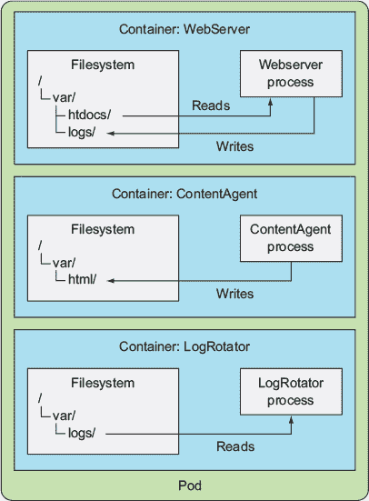
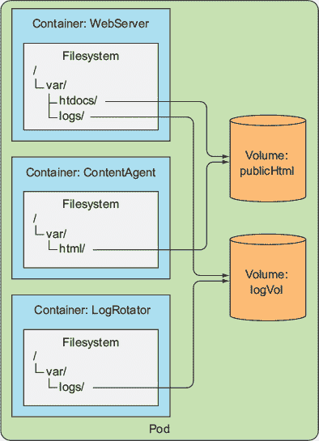
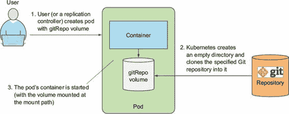
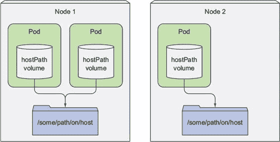
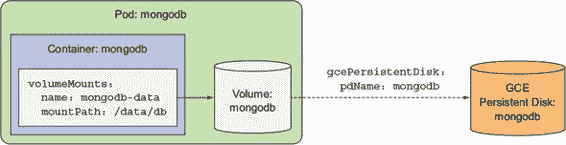
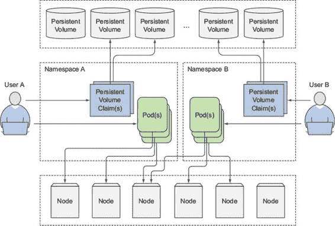
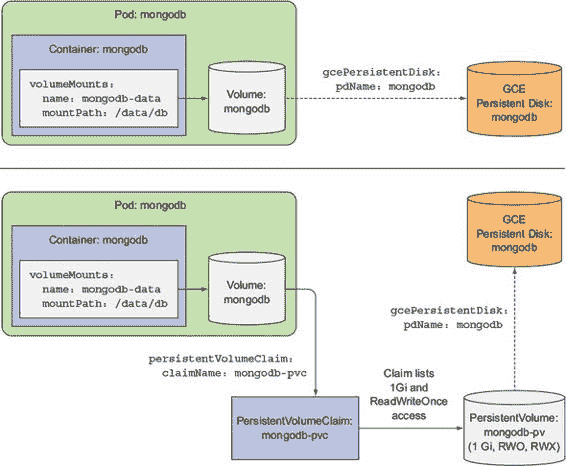
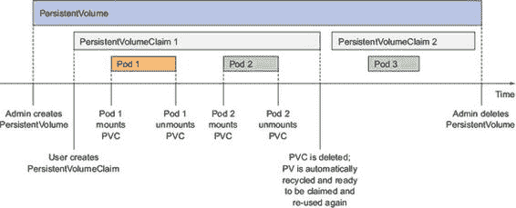
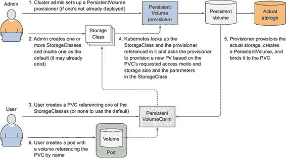

第六章. 卷：将磁盘存储附加到容器

本章涵盖

+   创建多容器 Pod

+   创建卷以在容器之间共享磁盘存储

+   在 Pod 内使用 Git 仓库

+   将持久存储（如 GCE 持久磁盘）附加到 Pod

+   使用预先配置的持久存储

+   持久存储的动态配置

在前三章中，我们介绍了 Pod 以及其他与之交互的 Kubernetes 资源，例如 ReplicationControllers、ReplicaSets、DaemonSets、Jobs 和 Services。现在，我们回到 Pod 内部，学习其容器如何访问外部磁盘存储以及/或它们之间共享存储。

我们提到，Pod 类似于逻辑主机，其中运行的进程共享资源，如 CPU、RAM、网络接口等。人们可能会预期进程也会共享磁盘，但事实并非如此。你会记得，Pod 中的每个容器都有自己的独立文件系统，因为文件系统来自容器的镜像。

每个新容器都以在构建时添加到镜像中的确切文件集开始。结合 Pod 中的容器会重启（无论是由于进程死亡还是因为存活探针向 Kubernetes 发出容器不再健康的信号）的事实，你就会意识到新容器将看不到之前容器写入文件系统的任何内容，即使新启动的容器在同一个 Pod 中运行。

在某些场景下，你希望新容器从上一个容器结束的地方继续，例如在物理机上重启进程时。你可能不需要（或不想）持久化整个文件系统，但你确实想保留包含实际数据的目录。

Kubernetes 通过定义存储卷来实现这一点。它们不是像 Pod 这样的顶级资源，而是作为 Pod 的一部分定义，并具有与 Pod 相同的生命周期。这意味着当 Pod 启动时创建卷，当 Pod 被删除时销毁卷。正因为如此，卷的内容将在容器重启之间持续存在。容器重启后，新容器可以看到之前容器写入卷的所有文件。此外，如果 Pod 包含多个容器，卷可以同时被所有容器使用。

6.1. 介绍卷

Kubernetes 卷是 Pod 的组成部分，因此定义在 Pod 的规范中——就像容器一样。它们不是独立的 Kubernetes 对象，不能单独创建或删除。卷对 Pod 中的所有容器都可用，但必须挂载在每个需要访问它的容器中。在每个容器中，你可以在其文件系统的任何位置挂载卷。

6.1.1. 通过示例解释卷

想象一下，你有一个包含三个容器的舱（如图 6.1 所示）。一个容器运行一个 Web 服务器，从/var/htdocs 目录提供 HTML 页面，并将访问日志存储到/var/logs。第二个容器运行一个代理，创建 HTML 文件并将它们存储在/var/html。第三个容器处理它在/var/logs 目录中找到的日志（旋转、压缩、分析或任何其他操作）。

图 6.1\. 没有共享存储的同一舱的三个容器

每个容器都有一个定义良好的单一职责，但单独来看，每个容器都不会有很大的用处。如果没有共享磁盘存储，创建一个包含这三个容器的舱就没有意义，因为内容生成器会在自己的容器内写入生成的 HTML 文件，而 Web 服务器无法访问这些文件，因为它运行在一个独立的隔离容器中。相反，它会提供一个空目录或在其容器镜像的/var/htdocs 目录中放置的任何内容。同样，日志旋转器永远不会有什么事情要做，因为它的/var/logs 目录总是会保持空，没有任何地方写入日志。基本上，这样一个包含这三个容器且没有卷的舱什么也不做。

但是，如果你向舱中添加两个卷并将它们挂载到三个容器中适当的路径，如图 6.2 所示，你就创建了一个远大于其各部分总和的系统。Linux 允许你在文件树中的任意位置挂载一个文件系统。当你这样做时，挂载的文件系统的内容可以在挂载到的目录中访问。通过将相同的卷挂载到两个容器中，它们可以操作相同的文件。在你的情况下，你在三个容器中挂载了两个卷。通过这样做，你的三个容器可以协同工作并完成一些有用的事情。让我来解释一下。

图 6.2\. 三个容器共享两个在不同挂载路径挂载的卷

首先，舱有一个名为`publicHtml`的卷。这个卷被挂载到`WebServer`容器中的/var/htdocs，因为这是 Web 服务器提供文件的目录。相同的卷也被挂载到`ContentAgent`容器中，但挂载到/var/html，因为这是代理写入文件的目录。通过这样挂载单个卷，Web 服务器现在将提供由内容代理生成的内容。

同样，舱还有一个名为`logVol`的卷用于存储日志。这个卷被挂载到`WebServer`和`LogRotator`容器的/var/logs。请注意，它没有被挂载到`ContentAgent`容器中。即使容器和卷都属于同一个舱，容器也无法访问其文件。仅定义舱中的卷是不够的；如果你想让容器能够访问它，你还需要在容器的规范中定义一个`VolumeMount`。

在这个示例中，这两个卷最初都可以为空，因此你可以使用一种称为 `emptyDir` 的卷类型。Kubernetes 还支持其他类型的卷，这些卷在从外部源初始化卷或挂载现有目录到卷中时被填充。这个过程是在 pod 的容器启动之前执行的。

卷绑定到 pod 的生命周期，并且只有在 pod 存在期间才会存在，但根据卷类型的不同，卷的文件可能在 pod 和卷消失后仍然保持完整，并且可以稍后挂载到新的卷中。让我们看看存在哪些类型的卷。

6.1.2\. 介绍可用的卷类型

可用的卷类型多种多样。其中一些是通用的，而另一些则是针对实际使用的存储技术的特定类型。如果你从未听说过这些技术，请不要担心——至少有一半以上我都没听说过。你可能只会使用你已知并使用的技术的卷类型。以下是一些可用的卷类型列表：

+   `emptyDir`—一个简单的空目录，用于存储临时数据。

+   `hostPath`—用于将工作节点文件系统中的目录挂载到 pod 中。

+   `gitRepo`—通过检出 Git 仓库的内容来初始化的卷。

+   `nfs`—挂载到 pod 中的 NFS 共享。

+   `gcePersistentDisk`（Google Compute Engine 持久磁盘）, `awsElasticBlockStore`（Amazon Web Services 弹性块存储卷）, `azureDisk`（Microsoft Azure 磁盘卷）—用于挂载特定云提供商的存储。

+   `cinder`，`cephfs`，`iscsi`，`flocker`，`glusterfs`，`quobyte`，`rbd`，`flexVolume`，`vsphere-Volume`，`photonPersistentDisk`，`scaleIO`—用于挂载其他类型的网络存储。

+   `configMap`，`secret`，`downwardAPI`—用于将某些 Kubernetes 资源和集群信息暴露给 pod 的特殊类型的卷。

+   `persistentVolumeClaim`—一种使用预先或动态预配的持久存储的方式。（我们将在本章的最后部分讨论它们。）

这些卷类型服务于各种目的。你将在以下章节中了解其中的一些。特殊类型的卷（`secret`，`downwardAPI`，`configMap`）将在下一两章中介绍，因为它们不是用于存储数据，而是用于将 Kubernetes 元数据暴露给在 pod 中运行的应用程序。

单个 pod 可以同时使用多种不同类型的多个卷，并且，正如我们之前提到的，pod 的每个容器都可以选择挂载或不挂载卷。

6.2\. 使用卷在容器之间共享数据

尽管卷在单个容器使用时也可能很有用，但让我们首先关注它是如何用于在 pod 中的多个容器之间共享数据的。

6.2.1\. 使用 emptyDir 卷

最简单的卷类型是 `emptyDir` 卷，所以让我们在定义 pod 中卷的第一个例子中看看它。正如其名所示，卷最初是一个空目录。pod 内运行的程序可以将其需要的任何文件写入其中。因为卷的寿命与 pod 相关联，所以当 pod 被删除时，卷的内容也会丢失。

一个 `emptyDir` 卷对于在同一个 pod 中运行的容器之间共享文件特别有用。但它也可以由单个容器使用，当容器需要临时将数据写入磁盘时，例如在对大型数据集进行排序操作时，这些数据无法适应可用的内存。数据也可以写入容器的文件系统本身（记得容器中顶层的可读写层吗？），但这两个选项之间存在细微的差异。容器的文件系统可能甚至不可写（我们将在本书的末尾讨论这个问题），因此写入挂载的卷可能是唯一的选择。

在 pod 中使用 emptyDir 卷

让我们回顾一下之前的例子，其中 Web 服务器、内容代理和日志轮转器共享两个卷，但让我们简化一下。你将构建一个只包含 Web 服务器容器和内容代理以及单个 HTML 卷的 pod。

你将使用 Nginx 作为 Web 服务器和 UNIX `fortune` 命令来生成 HTML 内容。每次运行 `fortune` 命令时，它都会打印出一个随机引言。你将创建一个脚本，每 10 秒调用一次 `fortune` 命令，并将输出存储在 index.html 中。你可以在 Docker Hub 上找到一个现有的 Nginx 镜像，但你需要自己创建 `fortune` 镜像或者使用我已经构建并推送到 Docker Hub 上的 `luksa/fortune`。如果你想要复习如何构建 Docker 镜像，请参考侧边栏。

构建 fortune 容器镜像

下面是如何构建镜像。创建一个名为 fortune 的新目录，然后在其中创建一个名为 `fortuneloop.sh` 的 shell 脚本，内容如下：

`#!/bin/bash trap "exit" SIGINT mkdir /var/htdocs while : do   echo $(date) Writing fortune to /var/htdocs/index.html   /usr/games/fortune > /var/htdocs/index.html   sleep 10 done`

然后，在同一个目录中，创建一个名为 Dockerfile 的文件，内容如下：

`FROM ubuntu:latest RUN apt-get update ; apt-get -y install fortune ADD fortuneloop.sh /bin/fortuneloop.sh ENTRYPOINT /bin/fortuneloop.sh`

镜像是基于 `ubuntu:latest` 镜像的，默认情况下它不包括 `fortune` 二进制文件。这就是为什么在 Dockerfile 的第二行中，你使用 `apt-get` 安装它。之后，你将 `fortuneloop.sh` 脚本添加到镜像的 `/bin` 文件夹中。在 Dockerfile 的最后一行中，你指定当镜像运行时应该执行 `fortuneloop.sh` 脚本。

准备好这两个文件后，使用以下两个命令构建并上传镜像到 Docker Hub（将`luksa`替换为您自己的 Docker Hub 用户 ID）：

`$ docker build -t luksa/fortune . $ docker push luksa/fortune`

| |
| --- |

创建 Pod

现在您已经有了运行 Pod 所需的两个镜像，是时候创建 Pod 清单了。创建一个名为 fortune-pod.yaml 的文件，其内容如下所示。

列表 6.1.具有两个容器共享相同卷的 Pod：fortune-pod.yaml

`apiVersion: v1 kind: Pod metadata:   name: fortune spec:   containers:   - image: luksa/fortune` `1` `name: html-generator` `1` `volumeMounts:` `2` `- name: html` `2` `mountPath: /var/htdocs` `2` `- image: nginx:alpine` `3` `name: web-server` `3` `volumeMounts:` `4` `- name: html` `4` `mountPath: /usr/share/nginx/html` `4` `readOnly: true` `4` `ports:     - containerPort: 80       protocol: TCP   volumes:` `5` `- name: html` `5` `emptyDir: {}` `5`

+   1 第一个容器被称为 html-generator，运行 luksa/fortune 镜像。

+   2 将名为 html 的卷挂载在容器的/var/htdocs 上。

+   3 第二个容器被称为 web-server，运行 nginx:alpine 镜像。

+   4 与上述相同的卷挂载在/usr/share/nginx/html 上，为只读。

+   5 一个名为 html 的单个 emptyDir 卷，在上述两个容器中挂载

Pod 包含两个容器和一个名为 html 的单个卷，该卷在两个容器中挂载，但路径不同。当`html-generator`容器启动时，它每 10 秒将`fortune`命令的输出写入到/var/htdocs/index.html 文件中。因为卷挂载在/var/htdocs 上，所以 index.html 文件被写入到卷中而不是容器的顶层。一旦`web-server`容器启动，它就开始服务/usr/share/nginx/html 目录中的任何 HTML 文件（这是 Nginx 默认的服务文件目录）。因为您在那个确切位置挂载了卷，所以 Nginx 将服务由运行幸运循环的容器写入的 index.html 文件。最终效果是，向 Pod 的 80 端口发送 HTTP 请求的客户将收到当前的幸运信息作为响应。

观察 Pod 运行

要查看幸运信息，您需要启用对 Pod 的访问权限。您可以通过将本地计算机上的端口转发到 Pod 来实现：

`$ kubectl port-forward fortune 8080:80` `Forwarding from 127.0.0.1:8080 -> 80 Forwarding from [::1]:8080 -> 80`

| |
| --- |

注意

作为练习，您还可以通过服务而不是使用端口转发来公开 Pod。

| |
| --- |

现在，您可以通过本地计算机的 8080 端口访问 Nginx 服务器。使用`curl`来做到这一点：

`$ curl http://localhost:8080` `小心一个高个子金发男子，他穿着一只黑色鞋子。`

如果你等待几秒钟后再次发送请求，你应该会收到不同的消息。通过组合两个容器，你创建了一个简单的应用程序来查看一个卷如何将两个容器粘合在一起并增强它们各自的功能。

指定用于 emptyDir 的中介

你用作卷的`emptyDir`是在托管你的 Pod 的工作节点实际磁盘上创建的，因此其性能取决于节点磁盘的类型。但是，你可以告诉 Kubernetes 在 tmpfs 文件系统（内存而不是磁盘）上创建`emptyDir`。为此，将`emptyDir`的`medium`设置为`Memory`，如下所示：

`volumes:    - name: html    emptyDir:      medium: Memory` `1`

+   1 这个 emptyDir 的文件应该存储在内存中。

`emptyDir`卷是最简单的卷类型，但其他类型都是基于它构建的。在创建空目录之后，它们会填充数据。其中一种卷类型是`gitRepo`卷类型，我们将在下一节介绍。

6.2.2\. 将 Git 仓库作为卷的起点

一个`gitRepo`卷基本上是一个`emptyDir`卷，它在 Pod 启动时（但在创建容器之前）通过克隆 Git 仓库并检出特定版本来填充。展示了这个过程。

图 6.3\. 一个`gitRepo`卷最初是一个`emptyDir`卷，其中包含 Git 仓库的内容。

| |
| --- |

注意

在创建`gitRepo`卷之后，它不会与它引用的仓库保持同步。当你向 Git 仓库推送额外的提交时，卷中的文件不会更新。然而，如果你的 Pod 由 ReplicationController 管理，删除 Pod 将导致创建一个新的 Pod，而这个新 Pod 的卷将包含最新的提交。

| |
| --- |

例如，你可以使用 Git 仓库来存储你网站的静态 HTML 文件，并创建一个包含 Web 服务器容器和`gitRepo`卷的 Pod。每次创建 Pod 时，它都会拉取你网站的最新版本并开始提供服务。这个方法的唯一缺点是，每次你向`gitRepo`推送更改并想要开始提供网站的新版本时，都需要删除 Pod。

让我们立即这样做。这并不像你之前所做的那样不同。

运行一个从克隆的 Git 仓库提供文件的 Web 服务器 Pod

在你创建 Pod 之前，你需要一个包含 HTML 文件的实际 Git 仓库。我在 GitHub 上创建了一个仓库，网址为[`github.com/luksa/kubia-website-example.git`](https://github.com/luksa/kubia-website-example.git)。你需要将其分叉（在 GitHub 上创建仓库的副本），这样你就可以稍后向它推送更改。

一旦你创建了分叉，你就可以继续创建 Pod。这次，你只需要 Pod 中的一个 Nginx 容器和一个`gitRepo`卷（确保将`gitRepo`卷指向你自己的分叉），如下所示。

列表 6.2\. 使用 `gitRepo` 卷的 pod：gitrepo-volume-pod.yaml

`apiVersion: v1 kind: Pod metadata: name: gitrepo-volume-pod spec: containers: - image: nginx:alpine name: web-server volumeMounts: - name: html mountPath: /usr/share/nginx/html readOnly: true ports: - containerPort: 80 protocol: TCP volumes: - name: html gitRepo: repository: https://github.com/luksa/kubia-website-example.git revision: master directory: . 

+   1 您正在创建一个 gitRepo 卷。

+   2 该卷将克隆此 Git 仓库。

+   3 将检出主分支。

+   4 您希望将仓库克隆到卷的根目录中。

当您创建 pod 时，卷首先初始化为一个空目录，然后将指定的 Git 仓库克隆到其中。如果您没有将目录设置为 `.`（点），则仓库将被克隆到 kubia-website-example 子目录中，这不是您想要的。您希望将仓库克隆到卷的根目录中。除了仓库外，您还指定了您希望 Kubernetes 检出在创建卷时主分支指向的任何修订版本。

当 pod 运行时，您可以通过端口转发、服务或从 pod 内部（或集群中的任何其他 pod）执行 `curl` 命令来尝试连接到它。

确认文件没有与 git 仓库保持同步

现在，您将对 GitHub 仓库中的 index.html 文件进行更改。如果您没有在本地使用 Git，您可以直接在 GitHub 上编辑该文件——点击 GitHub 仓库中的文件以打开它，然后点击铅笔图标开始编辑。更改文本后，通过点击底部的按钮提交更改。

Git 仓库的主分支现在包含了您对 HTML 文件所做的更改。这些更改在您的 Nginx 网络服务器上尚不可见，因为 `gitRepo` 卷没有与 Git 仓库保持同步。您可以通过再次连接到 pod 来确认这一点。

要查看网站的最新版本，您需要删除 pod 并重新创建它。而不是每次更改都要删除 pod，您可以运行一个额外的进程，该进程将您的卷与 Git 仓库保持同步。我不会详细解释如何做这件事。相反，尝试自己作为练习来做这件事，但这里有一些提示。

介绍边车容器

Git 同步进程不应在运行 Nginx 网络服务器的同一容器中运行，而应在第二个容器中运行：一个边车容器。边车容器是一种增强 pod 主容器操作的容器。您向 pod 添加边车是为了使用现有的容器镜像，而不是将额外的逻辑塞入主应用程序的代码中，这会使它过于复杂且可重用性降低。

要找到一个现有的容器镜像，该镜像将本地目录与 Git 仓库同步，请访问 Docker Hub 并搜索“git sync”。你会找到很多这样的镜像。然后，在先前的示例 Pod 中的新容器中使用该镜像，将 Pod 现有的`gitRepo`卷挂载到新容器中，并配置 Git 同步容器以保持文件与你的 Git 仓库同步。如果你设置正确，你应该会看到 Web 服务器所服务的文件与你的 GitHub 仓库保持同步。

| |
| --- |

注意

第十八章中的一个示例包括使用这里解释的 Git 同步容器，所以你可以等到你到达第十八章并按照那里的逐步说明进行，而不是现在自己进行这个练习。

| |
| --- |

使用 gitRepo 卷与私有 Git 仓库

需要使用 Git 同步侧边容器还有另一个原因。我们还没有讨论过你是否可以使用`gitRepo`卷与私有 Git 仓库一起使用。结果是，你不能。Kubernetes 开发者的当前共识是保持`gitRepo`卷简单，不添加通过 SSH 协议克隆私有仓库的支持，因为这需要向`gitRepo`卷添加额外的配置选项。

如果你想在容器中克隆一个私有 Git 仓库，你应该使用 gitsync 侧边容器或类似的方法，而不是`gitRepo`卷。

总结 gitRepo 卷

`gitRepo`卷，就像`emptyDir`卷一样，基本上是为包含卷的 Pod 专门创建的目录，并且仅由该 Pod 专用。当 Pod 被删除时，卷及其内容也会被删除。然而，其他类型的卷不会创建新的目录，而是将现有的外部目录挂载到 Pod 容器的文件系统中。该卷的内容可以在多个 Pod 实例化中存活。我们将在下一节学习这些类型的卷。

6.3\. 访问工作节点文件系统上的文件

大多数 Pod 应该对其宿主节点一无所知，因此它们不应该访问节点文件系统上的任何文件。但某些系统级别的 Pod（记住，这些通常将由 DaemonSet 管理）确实需要读取节点的文件或使用节点的文件系统通过文件系统访问节点的设备。Kubernetes 通过`hostPath`卷来实现这一点。

6.3.1\. 介绍 hostPath 卷

`hostPath`卷指向节点文件系统上的特定文件或目录（见图 6.4）。在同一个节点上运行并使用相同路径的`hostPath`卷的 Pod 可以看到相同的文件。

图 6.4\. `hostPath`卷将工作节点上的文件或目录挂载到容器的文件系统中。

`hostPath`卷是我们首先介绍的一种持久化存储类型，因为当 Pod 被销毁时，`gitRepo`和`emptyDir`卷的内容会被删除，而`hostPath`卷的内容则不会。如果一个 Pod 被删除，并且下一个 Pod 使用指向主机上相同路径的`hostPath`卷，新的 Pod 将看到前一个 Pod 留下的任何内容，但仅当它被调度到与第一个 Pod 相同的节点上时。

如果你正在考虑将`hostPath`卷作为存储数据库数据目录的位置，请重新考虑。因为卷的内容存储在特定节点的文件系统上，当数据库 Pod 被重新调度到另一个节点时，它将无法看到数据。这解释了为什么使用`hostPath`卷对于常规 Pod 来说不是一个好主意，因为它使得 Pod 对它被调度到的节点敏感。

6.3.2\. 检查使用 hostPath 卷的系统 Pod

让我们看看如何正确使用`hostPath`卷。我们不是创建一个新的 Pod，而是看看是否有任何现有的系统级 Pod 已经在使用这种类型的卷。如你可能在之前的章节中记得，有几个这样的 Pod 正在`kube-system`命名空间中运行。让我们再次列出它们：

`$ kubectl get pod s --namespace kube-system` `NAME                          READY     STATUS    RESTARTS   AGE fluentd-kubia-4ebc2f1e-9a3e   1/1       Running   1          4d fluentd-kubia-4ebc2f1e-e2vz   1/1       Running   1          31d ...`

选择第一个，看看它使用了哪些类型的卷（如下面的列表所示）。

列表 6.3\. 使用`hostPath`卷访问节点日志的 Pod

`$ kubectl describe po fluentd-kubia-4ebc2f1e-9a3e --namespace kube-system` `Name:           fluentd-cloud-logging-gke-kubia-default-pool-4ebc2f1e-9a3e Namespace:      kube-system ... Volumes:` `varlog:``Type:       HostPath (裸主机目录卷)``Path:       /var/log``varlibdockercontainers:``Type:       HostPath (裸主机目录卷)``Path:       /var/lib/docker/containers`

小贴士

如果你正在使用 Minikube，尝试使用`kube-addon-manager-minikube` Pod。

哎！这个 Pod 使用了两个`hostPath`卷来访问节点的`/var/log`和`/var/lib/docker/containers`目录。你可能会认为你很幸运第一次就找到了使用`hostPath`卷的 Pod，但实际上并不是（至少在 GKE 上不是）。检查其他 Pod，你会发现大多数 Pod 使用这种类型的卷要么是为了访问节点的日志文件，要么是为了访问 kubeconfig（Kubernetes 配置文件），或者是为了访问 CA 证书。

如果你检查其他 Pod，你会发现它们都没有使用`hostPath`卷来存储它们自己的数据。它们都使用它来访问节点的数据。但正如我们将在本章后面看到的，`hostPath`卷通常用于在单节点集群中尝试持久化存储，例如由 Minikube 创建的集群。继续阅读，了解在多节点集群中正确存储持久数据应使用的卷类型。

| |
| --- |

小贴士

记住，只有在你需要读取或写入节点上的系统文件时才使用 `hostPath` 卷。永远不要使用它们在 pod 之间持久化数据。

| |
| --- |

6.4\. 使用持久存储

当在 pod 中运行的应用程序需要将数据持久化到磁盘，并且即使在 pod 被重新调度到另一个节点时也能访问相同的数据时，你不能使用我们之前提到的任何卷类型。因为此数据需要从任何集群节点访问，它必须存储在某种类型的网络附加存储 (NAS) 上。

要了解允许持久化数据的卷，你将创建一个运行 MongoDB 文档型 NoSQL 数据库的 pod。在没有卷或非持久卷的情况下运行数据库 pod 没有意义，除非是为了测试目的，所以你将为 pod 添加适当类型的卷并将其挂载到 MongoDB 容器中。

6.4.1\. 在 pod 卷中使用 GCE 持久磁盘

如果你一直在 Google Kubernetes Engine 上运行这些示例，该引擎在 Google Compute Engine (GCE) 上运行你的集群节点，你将使用 GCE 持久磁盘作为你的底层存储机制。

在早期版本中，Kubernetes 不会自动配置底层存储——你必须手动完成。现在可以实现自动配置，你将在本章后面了解它，但首先，你将从手动配置存储开始。这将给你一个机会了解底层到底发生了什么。

创建 GCE 持久磁盘

你将从首先创建 GCE 持久磁盘开始。你需要在与你的 Kubernetes 集群相同的区域中创建它。如果你不记得你在哪个区域创建了集群，你可以通过使用 `gcloud` 命令列出你的 Kubernetes 集群来查看它，如下所示：

`$ gcloud container clusters list` `NAME   ZONE            MASTER_VERSION  MASTER_IP       ... kubia  europe-west1-b  1.2.5           104.155.84.137  ...`

这表明你已在区域 `europe-west1-b` 中创建了你的集群，因此你需要在同一区域创建 GCE 持久磁盘。你可以这样创建磁盘：

`$ gcloud compute disks create --size=1GiB --zone=europe-west1-b mongodb` `警告：你选择了一个小于 [200GB] 的磁盘大小。这可能会导致 I/O 性能不佳。更多信息，请参阅：https://developers.google.com/compute/docs/disks#pdperformance. 已创建 [https://www.googleapis.com/compute/v1/projects/rapid-pivot- 136513/zones/europe-west1-b/disks/mongodb]. NAME     ZONE            SIZE_GB  TYPE         STATUS mongodb  europe-west1-b  1        pd-standard  READY`

此命令创建了一个 1 GiB 大小的 GCE 持久磁盘，名为 `mongodb`。你可以忽略关于磁盘大小的警告，因为你对即将运行的测试中磁盘的性能并不关心。

使用 gcePersistentDisk 卷创建 pod

现在你已经正确设置了物理存储，你可以在 MongoDB pod 的卷中使用它。你将准备 pod 的 YAML 文件，如下所示。

列表 6.4\. 使用`gcePersistentDisk`卷的 pod：mongodb-pod-gcepd.yaml

`apiVersion: v1 kind: Pod metadata:   name: mongodb spec:   volumes:   - name: mongodb-data` `1` `gcePersistentDisk:` `2` `pdName: mongodb` `3` `fsType: ext4` `4` `containers:   - image: mongo     name: mongodb     volumeMounts:     - name: mongodb-data` `1` `mountPath: /data/db` `5` `ports:     - containerPort: 27017       protocol: TCP`

+   1 卷的名称（在挂载卷时也会引用）

+   2 卷的类型是 GCE 持久磁盘。

+   3 持久磁盘的名称必须与之前创建的实际 PD 匹配。

+   4 文件系统类型是 EXT4（一种 Linux 文件系统）。

+   5 MongoDB 存储数据的位置

注意

如果你使用 Minikube，你不能使用 GCE 持久磁盘，但你可以部署`mongodb-pod-hostpath.yaml`，它使用`hostPath`卷而不是 GCE PD。

Pod 包含一个容器和一个卷，该卷由你创建的 GCE 持久磁盘支持（如图 6.5 所示 figure 6.5）。你将卷挂载到容器内的/data/db，因为那是 MongoDB 存储数据的地方。

图 6.5\. 运行 MongoDB 的单个容器，挂载了一个引用外部 GCE 持久磁盘的卷

通过向你的 MongoDB 数据库添加文档来写入持久存储

现在你已经创建了 pod，并且容器已经启动，你可以在容器内运行 MongoDB shell 并使用它来向数据存储写入一些数据。

你将按照以下列表运行 shell。

列表 6.5\. 进入`mongodb` pod 内的 MongoDB shell

`$ kubectl exec -it mongodb mongo` `MongoDB shell 版本：3.2.8 连接到：mongodb://127.0.0.1:27017 欢迎使用 MongoDB shell。要获取交互式帮助，请输入"help"。要获取更全面的文档，请参阅   http://docs.mongodb.org/ 有问题？尝试支持小组   http://groups.google.com/group/mongodb-user ... >`

MongoDB 允许存储 JSON 文档，所以你会存储一个以查看它是否被持久存储，并且在 pod 重新创建后可以检索。使用以下命令插入一个新的 JSON 文档：

`> use mystore` `切换到数据库 mystore` `> db.foo.insert({name:'foo'})` `WriteResult({ "nInserted" : 1 })`

你插入了一个简单的 JSON 文档，包含一个属性（`name: 'foo'`）。现在，使用`find()`命令查看你插入的文档：

`> db.foo.find()` `{ "_id" : ObjectId("57a61eb9de0cfd512374cc75"), "name" : "foo" }`

就在这里。文档现在应该存储在你的 GCE 持久磁盘上了。

重新创建 pod 并验证它是否可以读取前一个 pod 持久存储的数据

现在，你可以退出 `mongodb` shell（输入 `exit` 并按 Enter），然后删除 pod 并重新创建它：

`$ kubectl delete pod mongodb` `pod "mongodb" deleted` `$ kubectl create -f mongodb-pod-gcepd.yaml` `pod "mongodb" created`

新的 pod 使用与上一个 pod 完全相同的 GCE 持久磁盘，因此运行在其内部的 MongoDB 容器应该看到完全相同的数据，即使 pod 被调度到不同的节点。

提示

你可以通过运行 `kubectl get po -o wide` 来查看一个 pod 被调度到哪个节点。

容器启动后，你还可以再次运行 MongoDB shell 并检查你之前存储的文档是否仍然可以检索，如下所示。

列表 6.6\. 在新的 pod 中检索 MongoDB 的持久数据

`$ kubectl exec -it mongodb mongo` `MongoDB shell version: 3.2.8 connecting to: mongodb://127.0.0.1:27017 Welcome to the MongoDB shell. ...` `> use mystore` `switched to db mystore` `> db.foo.find()` `{ "_id" : ObjectId("57a61eb9de0cfd512374cc75"), "name" : "foo" }`

如预期，数据仍然存在，即使你删除了 pod 并重新创建了它。这证实了你可以使用 GCE 持久磁盘在多个 pod 实例之间持久化数据。

你已经玩够了 MongoDB pod，所以继续删除它，但不要删除底层的 GCE 持久磁盘。你将在本章的后面再次使用它。

6.4.2\. 使用其他类型的卷与底层持久存储

你创建 GCE 持久磁盘卷的原因是因为你的 Kubernetes 集群运行在 Google Kubernetes Engine 上。当你将你的集群运行在其他地方时，你应该使用其他类型的卷，具体取决于底层基础设施。

如果你的 Kubernetes 集群运行在亚马逊的 AWS EC2 上，例如，你可以使用 `awsElasticBlockStore` 卷为你的 pod 提供持久存储。如果你的集群运行在微软的 Azure 上，你可以使用 `azureFile` 或 `azureDisk` 卷。这里我们不会详细介绍如何操作，但与前面的例子几乎相同。首先，你需要创建实际的底层存储，然后在卷定义中设置适当的属性。

使用 AWS 弹性块存储卷

例如，要使用 AWS 弹性块存储而不是 GCE 持久磁盘，你只需更改卷定义，如下所示（查看那些用粗体打印的行）。

列表 6.7\. 使用 `awsElasticBlockStore` 卷的 pod：mongodb-pod-aws.yaml

`apiVersion: v1 kind: Pod metadata:   name: mongodb spec:   volumes:   - name: mongodb-data` `awsElasticBlockStore:``1``volumeId: my-volume``2``fsType: ext4``3` `containers:   - ...`

+   1 使用 awsElasticBlockStore 代替 gcePersistentDisk

+   2 指定你创建的 EBS 卷的 ID。

+   3 文件系统类型与之前相同为 EXT4。

使用 NFS 卷

如果你的集群运行在你自己的服务器上，你有一系列其他支持选项来在你的卷内挂载外部存储。例如，为了挂载一个简单的 NFS 共享，你只需要指定 NFS 服务器和服务器导出的路径，如下面的列表所示。

列表 6.8. 使用 `nfs` 卷的 pod：mongodb-pod-nfs.yaml

`volumes:   - name: mongodb-data   nfs:     server: 1.2.3.4     path: /some/path`

+   1 这个卷由一个 NFS 共享支持。

+   2 NFS 服务器的 IP 地址

+   3 服务器导出的路径

使用其他存储技术

其他支持选项包括用于挂载 ISCSI 磁盘资源的 `iscsi`，用于 GlusterFS 挂载的 `glusterfs`，用于 RADOS 块设备的 `rbd`，`flexVolume`，`cinder`，`cephfs`，`flocker`，`fc`（光纤通道）以及其他选项。如果你没有使用它们，你不需要了解所有这些。这里提到它们是为了向你展示 Kubernetes 支持广泛的存储技术，你可以使用你喜欢的和熟悉的任何一种。

要查看为每种卷类型需要设置的属性详情，你可以查阅 Kubernetes API 参考中的 Kubernetes API 定义，或者通过 `kubectl explain` 查找信息，如第三章中所示。如果你已经熟悉某种特定的存储技术，使用 `explain` 命令应该能让你轻松地找出如何挂载正确类型的卷并在你的 pod 中使用它。

但是开发者是否需要知道所有这些信息？当创建 pod 时，开发者是否需要处理与基础设施相关的存储细节，或者这应该留给集群管理员？

让 pod 的卷指向实际的底层基础设施并不是 Kubernetes 的核心所在，对吧？例如，要求开发者指定 NFS 服务器的主机名感觉是不对的。而且这甚至不是最糟糕的。

将此类与基础设施相关的信息包含在 pod 定义中意味着 pod 定义几乎与特定的 Kubernetes 集群绑定。你不能在另一个集群中使用相同的 pod 定义。这就是为什么使用这种类型的卷不是将持久存储附加到 pod 的最佳方式。你将在下一节中了解如何改进这一点。

6.5. 将 pod 与底层存储技术解耦

我们迄今为止探索的所有持久卷类型都要求 pod 的开发者了解集群中可用的实际网络存储基础设施。例如，为了创建一个基于 NFS 的卷，开发者必须知道 NFS 导出所在的实际服务器。这与 Kubernetes 的基本理念相悖，其目标是隐藏实际基础设施，无论是对于应用程序还是其开发者，使他们免于担心基础设施的细节，并使应用程序能够在广泛的云提供商和本地数据中心之间迁移。

理想情况下，在 Kubernetes 上部署应用程序的开发者永远不需要知道底层使用的是哪种存储技术，就像他们不需要知道运行 pod 所使用的物理服务器类型一样。与基础设施相关的事务应该是集群管理员的专属领域。

当开发者为他们的应用程序需要一定量的持久存储时，他们可以从 Kubernetes 中请求它，就像他们在创建 pod 时可以请求 CPU、内存和其他资源一样。系统管理员可以配置集群，使其能够提供应用程序所需的内容。

6.5.1\. 介绍 PersistentVolumes 和 PersistentVolumeClaims

为了使应用程序能够在 Kubernetes 集群中请求存储而无需处理基础设施的特定细节，引入了两种新的资源。它们是 Persistent-Volumes 和 PersistentVolumeClaims。名称可能有些误导，因为正如你在前几节中看到的，即使是常规的 Kubernetes 卷也可以用来存储持久数据。

在 pod 内部使用 PersistentVolume 比使用常规 pod 卷要复杂一些，所以让我们通过 图 6.6 来说明 pods、PersistentVolumeClaims、PersistentVolumes 和实际底层存储之间的关系。

图 6.6\. PersistentVolumes 由集群管理员提供，通过 PersistentVolumeClaims 被 pod 消耗。

与开发者为他们的 pod 添加特定技术的卷不同，是集群管理员设置底层存储，然后通过在 Kubernetes API 服务器上创建 PersistentVolume 资源来将其注册到 Kubernetes 中。在创建 PersistentVolume 时，管理员指定其大小和它支持的访问模式。

当集群用户需要在他们的 pod 中使用持久存储时，他们首先创建一个 PersistentVolumeClaim 清单，指定所需的最低大小和访问模式。然后用户将 PersistentVolumeClaim 清单提交给 Kubernetes API 服务器，Kubernetes 找到合适的 PersistentVolume 并将卷绑定到请求上。

PersistentVolumeClaim 可以用作 pod 内部的一个卷。其他用户不能使用同一个 PersistentVolume，直到它通过删除绑定的 PersistentVolumeClaim 来释放。

6.5.2\. 创建 PersistentVolume

让我们回顾 MongoDB 的例子，但与之前不同，你不会直接在 pod 中引用 GCE Persistent Disk。相反，你首先假设集群管理员的角色，并创建一个由 GCE Persistent Disk 支持的 PersistentVolume。然后你将扮演应用程序开发者的角色，首先声明 PersistentVolume，然后在你的 pod 中使用它。

在第 6.4.1 节中，你通过配置 GCE Persistent Disk 来设置物理存储，因此你不需要再次这样做。你所需要做的就是通过准备以下列表中显示的清单并在 API 服务器上发布它，在 Kubernetes 中创建 Persistent-Volume 资源。

列表 6.9\. `gcePersistentDisk` PersistentVolume：mongodb-pv-gcepd.yaml

`apiVersion: v1 kind: PersistentVolume metadata:   name: mongodb-pv spec:   capacity:` `1` `storage: 1Gi` `1` `accessModes:` `2` `- ReadWriteOnce` `2` `- ReadOnlyMany` `2` `persistentVolumeReclaimPolicy: Retain` `3` `gcePersistentDisk:` `4` `pdName: mongodb` `4` `fsType: ext4` `4`

+   1 定义 PersistentVolume 的大小

+   2 它可以被单个客户端用于读写，或者被多个客户端仅用于读取。

+   3 在释放声明后，PersistentVolume 应该保留（不删除或删除）。

+   4 PersistentVolume 由你之前创建的 GCE Persistent Disk 支持。

注意

如果你使用 Minikube，请使用 mongodb-pv-hostpath.yaml 文件创建 PV。

在创建 PersistentVolume 时，管理员需要告诉 Kubernetes 其容量是多少，以及是否可以被单个节点或多个节点同时读取和/或写入。他们还需要告诉 Kubernetes 在释放 PersistentVolume 时应该做什么（当它所绑定的 PersistentVolumeClaim 被删除时）。最后，但同样重要的是，他们需要指定这个 PersistentVolume 所支持的存储的类型、位置和其他属性。如果你仔细观察，这部分与之前直接在 pod 卷中引用 GCE Persistent Disk 时完全相同（如下所示）。

列表 6.10\. 在 pod 的卷中引用 GCE PD

`spec:   volumes:   - name: mongodb-data     gcePersistentDisk:       pdName: mongodb       fsType: ext4   ...`

使用`kubectl create`命令创建 PersistentVolume 后，它应该准备好被声明。通过列出所有 PersistentVolumes 来检查它是否可用：

`$ kubectl get pv` `NAME         CAPACITY   RECLAIMPOLICY   ACCESSMODES   STATUS      CLAIM mongodb-pv   1Gi        Retain          RWO,ROX       Available`

注意

省略了几个列。此外，`pv`用作`persistentvolume`的简称。

如预期的那样，PersistentVolume 显示为可用状态，因为你还没有创建 PersistentVolumeClaim。

注意

PersistentVolumes 不属于任何命名空间（见图 6.7）。它们是类似于节点的集群级资源。

图 6.7\. PersistentVolumes，与集群节点一样，不属于任何命名空间，与 pods 和 PersistentVolumeClaims 不同。

6.5.3\. 通过创建 PersistentVolumeClaim 来声明 PersistentVolume

现在，让我们放下管理员帽子，重新戴上开发者帽子。假设你需要部署一个需要持久存储的 Pod。你将使用你之前创建的持久卷。但是你不能直接在 Pod 中使用它。你需要首先声明它。

声明持久卷是一个完全独立于创建 Pod 的过程，因为即使 Pod 被重新调度（记住，重新调度意味着之前的 Pod 被删除并创建一个新的 Pod），你也希望相同的 PersistentVolumeClaim 保持可用。

创建 PersistentVolumeClaim

你现在将创建声明。你需要准备一个像以下列表中所示的 PersistentVolumeClaim 清单，并通过 `kubectl create` 将其发布到 Kubernetes API：

列表 6.11\. 一个 `PersistentVolumeClaim`: mongodb-pvc.yaml

`apiVersion: v1 kind: PersistentVolumeClaim metadata:   name: mongodb-pvc` `1` `spec:   resources:     requests:` `2` `storage: 1Gi` `2` `accessModes:` `3` `- ReadWriteOnce` `3` `storageClassName: ""` `4`

+   1 声明的名称——你稍后在使用声明作为 Pod 的卷时需要这个名称。

+   2 请求 1 GiB 的存储

+   3 你希望存储支持单个客户端（执行读取和写入操作）。

+   4 你将在关于动态预配的部分了解这一点。

一旦创建声明，Kubernetes 就会找到适当的持久卷并将其绑定到声明上。持久卷的容量必须足够大，以容纳声明请求的内容。此外，卷的访问模式必须包括声明请求的访问模式。在你的情况下，声明请求了 1 GiB 的存储和一个 `ReadWriteOnce` 访问模式。你之前创建的持久卷符合这两个要求，因此它被绑定到你的声明上。你可以通过检查声明来看到这一点。

列出 PersistentVolumeClaims

列出所有 PersistentVolumeClaims 以查看你的 PVC 状态：

`$ kubectl get pvc` `名称          状态    卷           容量   访问模式   年龄 mongodb-pvc   已绑定    mongodb-pv   1Gi        RWO,ROX       3s`

注意

我们使用 `pvc` 作为 `persistentvolumeclaim` 的简称。

声明显示为 `已绑定` 到持久卷 `mongodb-pv`。注意访问模式所使用的缩写：

+   `RWO`—`读写一次`—只有单个节点可以挂载卷进行读写。

+   `ROX`—`只读多`—多个节点可以挂载卷进行读取。

+   `RWX`—`读写多`—多个节点可以挂载卷进行读写。

注意

`RWO`, `ROX`, 和 `RWX` 指的是可以同时使用卷的工作节点数量，而不是 Pod 的数量！

列出 PersistentVolumes

你也可以通过使用 `kubectl get` 检查来看到持久卷现在已经是 `已绑定` 而不再是 `可用`：

`$ kubectl get pv` `名称         CAPACITY   访问模式   状态   声明                 年龄 mongodb-pv   1Gi        RWO,ROX       已绑定    default/mongodb-pvc   1m`

PersistentVolume 显示它绑定到了 `default/mongodb-pvc` 的声明。`default` 部分是声明所在的命名空间（你在默认命名空间中创建了声明）。我们之前已经说过，PersistentVolume 资源是集群范围的，因此不能在特定命名空间中创建，但 PersistentVolumeClaims 只能创建在特定命名空间中。它们然后只能由同一命名空间中的 pod 使用。

6.5.4\. 在 pod 中使用 PersistentVolumeClaim

PersistentVolume 现在由你使用。在你释放它之前，其他人无法声明相同的卷。要在 pod 内部使用它，你需要通过 pod 的卷名称引用 PersistentVolumeClaim（是的，是 PersistentVolumeClaim，而不是 PersistentVolume 直接！），如下面的列表所示。

列表 6.12\. 使用 PersistentVolumeClaim 卷的 pod：mongodb-pod-pvc.yaml

`apiVersion: v1 kind: Pod metadata:   name: mongodb spec:   containers:   - image: mongo     name: mongodb     volumeMounts:     - name: mongodb-data       mountPath: /data/db     ports:     - containerPort: 27017       protocol: TCP   volumes:     - name: mongodb-data     persistentVolumeClaim:` `1` `claimName: mongodb-pvc` `1`

+   1 在 pod 卷中按名称引用 PersistentVolumeClaim

继续创建 pod。现在，检查 pod 是否确实使用了相同的 PersistentVolume 和其底层的 GCE PD。你可以通过再次运行 MongoDB shell 来查看之前存储的数据，如下面的列表所示。

列表 6.13\. 使用 PVC 和 PV 在 pod 中检索 MongoDB 的持久化数据

`$ kubectl exec -it mongodb mongo MongoDB shell version: 3.2.8 connecting to: mongodb://127.0.0.1:27017 Welcome to the MongoDB shell. ...` `> use mystore` `switched to db mystore` `> db.foo.find()` `{ "_id" : ObjectId("57a61eb9de0cfd512374cc75"), "name" : "foo" }`

就这样。你能够检索之前存储到 MongoDB 中的文档。

6.5.5\. 理解使用 PersistentVolumes 和 claims 的好处

检查 图 6.8，它显示了 pod 可以使用 GCE Persistent Disk 的两种方式——直接或通过 PersistentVolume 和 claim。

图 6.8\. 直接使用 GCE Persistent Disk 或通过 PVC 和 PV 使用

考虑一下使用这种从基础设施中获取存储的间接方法对于应用程序开发者（或集群用户）来说要简单得多。是的，它确实需要创建 PersistentVolume 和 Persistent-VolumeClaim 的额外步骤，但开发者不需要了解底层使用的实际存储技术。

此外，相同的 pod 和 claim 清单现在可以用于许多不同的 Kubernetes 集群，因为它们不涉及任何特定于基础设施的内容。声明指出，“我需要 x 量的存储，并且我需要能够由单个客户端一次性读写它”，然后 pod 通过其卷之一按名称引用该声明。

6.5.6\. 回收 PersistentVolumes

在你结束关于 PersistentVolumes 的这一节之前，让我们做一个最后的快速实验。删除 pod 和 PersistentVolumeClaim：

`$ kubectl delete pod mongodb` `pod "mongodb" deleted` `$ kubectl delete pvc mongodb-pvc` `persistentvolumeclaim "mongodb-pvc" deleted`

如果你再次创建 PersistentVolumeClaim 会怎样？它会被绑定到 Persistent-Volume 吗？在你创建声明后，`kubectl get pvc` 会显示什么？

`$ kubectl get pvc` `NAME           STATUS    VOLUME       CAPACITY   ACCESSMODES   AGE mongodb-pvc    Pending                                         13s`

该声明的状态显示为 `Pending`。有趣。当你之前创建声明时，它立即绑定到了 PersistentVolume 上，那么为什么现在没有绑定呢？也许列出 PersistentVolumes 可以提供更多线索：

`$ kubectl get pv` `NAME        CAPACITY  ACCESSMODES  STATUS    CLAIM               REASON AGE mongodb-pv  1Gi       RWO,ROX      Released  default/mongodb-pvc        5m`

`STATUS` 列显示 PersistentVolume 为 `Released`，而不是之前的 `Available`。因为你已经使用了该卷，它可能包含数据，并且不应该在没有给集群管理员清理机会的情况下绑定到全新的声明。如果没有这样做，使用相同 PersistentVolume 的新 pod 可能会读取之前 pod 存储在那里的数据，即使声明和 pod 是在不同的命名空间中创建的（因此很可能属于不同的集群租户）。

手动回收 PersistentVolumes

当你创建 PersistentVolume 时，你告诉 Kubernetes 它应该这样表现——通过将其 `persistentVolumeReclaimPolicy` 设置为 `Retain`。你希望 Kubernetes 在释放其声明后保留卷及其内容。据我所知，手动回收 PersistentVolume 以使其再次可用的唯一方法是删除并重新创建 PersistentVolume 资源。当你这样做时，你决定如何处理底层存储上的文件：你可以删除它们，或者让它们保持原样，以便它们可以被下一个 pod 重新使用。

自动回收 PersistentVolumes

存在两种其他可能的回收策略：`Recycle` 和 `Delete`。第一种会删除卷的内容，并使卷可再次被声明。这样，PersistentVolume 可以被不同的 PersistentVolumeClaims 和不同的 pods 多次重用，正如你在 图 6.9 中看到的。

图 6.9\. PersistentVolume、PersistentVolumeClaims 及其使用的 pods 的生命周期

另一方面，`Delete` 策略会删除底层存储。请注意，`Recycle` 选项目前对于 GCE Persistent Disks 不可用。这种类型的 PersistentVolume 只支持 `Retain` 或 `Delete` 策略。其他 Persistent-Volume 类型可能或可能不支持这些选项中的每一个，因此在创建自己的 PersistentVolume 之前，请务必检查您将在卷中使用的特定底层存储支持的回收策略。

| |
| --- |

提示

您可以在现有的 PersistentVolume 上更改其 PersistentVolume 回收策略。例如，如果它最初设置为 `Delete`，您可以轻松地将其更改为 `Retain` 以防止丢失有价值的数据。

| |
| --- |

6.6. 动态 PersistentVolumes 的配置

您已经看到，使用 PersistentVolumes 和 PersistentVolumeClaims 如何使开发者能够轻松地获得持久存储，而无需处理底层使用的实际存储技术。但这仍然需要集群管理员预先配置实际的存储。幸运的是，Kubernetes 可以通过 PersistentVolumes 的动态配置自动执行此任务。

集群管理员，而不是创建 PersistentVolumes，可以部署 PersistentVolume provisioner 并定义一个或多个 StorageClass 对象，让用户选择他们想要的 PersistentVolume 类型。用户可以在他们的 PersistentVolumeClaims 中引用 `StorageClass`，provisioner 将在配置持久存储时考虑这一点。

| |
| --- |

注意

与 PersistentVolumes 类似，StorageClass 资源不是命名空间化的。

| |
| --- |

Kubernetes 包含了大多数流行云提供商的 provisioner，因此管理员并不总是需要部署 provisioner。但如果 Kubernetes 部署在本地，则需要部署一个自定义 provisioner。

而不是管理员预先配置大量 PersistentVolumes，他们需要定义一个或两个（或更多）StorageClasses，并让系统在每次通过 PersistentVolumeClaim 请求时创建一个新的 PersistentVolume。这一点的好处是，不可能耗尽 PersistentVolumes（显然，您可能会耗尽存储空间）。

6.6.1. 通过 StorageClass 资源定义可用的存储类型

在用户可以创建 PersistentVolumeClaim（这将导致新的 Persistent-Volume 被配置）之前，管理员需要创建一个或多个 StorageClass 资源。以下是一个示例。

列表 6.14. StorageClass 定义：storageclass-fast-gcepd.yaml

`apiVersion: storage.k8s.io/v1 kind: StorageClass metadata: name: fast provisioner: kubernetes.io/gce-pd` `1` `parameters:` `1` `type: pd-ssd` `2` `zone: europe-west1-b` `2`

+   1 用于配置 PersistentVolume 的卷插件

+   2 传递给 provisioner 的参数

| |
| --- |

注意

如果使用 Minikube，请部署文件 storageclass-fast-hostpath.yaml。

| |
| --- |

存储类资源指定在 PersistentVolumeClaim 请求此存储类时用于预配 PersistentVolume 的提供者。存储类定义中定义的参数传递给提供者，并且对每个提供者插件都是特定的。

存储类使用 Google Compute Engine (GCE) 持久磁盘 (PD) 提供者，这意味着当 Kubernetes 在 GCE 上运行时可以使用它。对于其他云提供商，需要使用其他提供者。

6.6.2\. 在 PersistentVolumeClaim 中请求存储类

在创建存储类资源后，用户可以在他们的 PersistentVolumeClaims 中通过名称引用存储类。

在 PersistentVolumeClaim 中请求特定存储类

您可以将您的 `mongodb-pvc` 修改为使用动态预配。以下列表显示了 PVC 的更新 YAML 定义。

列表 6.15\. 具有动态预配的 PVC：mongodb-pvc-dp.yaml

`apiVersion: v1 kind: PersistentVolumeClaim metadata:   name: mongodb-pvc spec:   storageClassName: fast` `1` `resources:     requests:       storage: 100Mi   accessModes:     - ReadWriteOnce`

+   1 此 PVC 请求自定义存储类。

除了指定大小和访问模式外，您的 PersistentVolumeClaim 现在还指定了您想要使用的存储类别。当您创建请求时，PersistentVolume 由 `fast` 存储类资源中引用的提供者创建。即使存在与 PersistentVolumeClaim 匹配的现有手动预配的 PersistentVolume，也会使用提供者。

注意

如果在 PVC 中引用了一个不存在的存储类，PV 的预配将失败（当您在 PVC 上使用 `kubectl describe` 时，您将看到 `ProvisioningFailed` 事件）。

检查创建的 PVC 和动态预配的 PV

接下来，您将创建 PVC，然后使用 `kubectl get` 来查看它：

`$ kubectl get pvc mongodb-pvc` `名称          状态   卷         容量   访问模式   存储类 mongodb-pvc   已绑定    pvc-1e6bc048   1Gi        RWO           fast`

`VOLUME` 列显示绑定到此请求的 PersistentVolume（实际名称比上面显示的更长）。您现在可以尝试列出 PersistentVolumes，以查看是否已自动创建新的 PV：

`$ kubectl get pv` `名称           容量  访问模式  回收策略  状态    存储类 mongodb-pv     1Gi       RWO,ROX      保留         已释放 pvc-1e6bc048   1Gi       RWO          删除         已绑定     fast`

注意

仅显示相关列。

您可以看到动态配置的 PersistentVolume。其容量和访问模式是您在 PVC 中请求的。其回收策略是`Delete`，这意味着当 PVC 被删除时，PersistentVolume 也将被删除。除了 PV 之外，提供者还配置了实际的存储。您的`fast` StorageClass 配置为使用`kubernetes.io/gce-pd`提供者，该提供者配置 GCE 持久磁盘。您可以使用以下命令查看磁盘：

`$ gcloud compute disks list` `NAME                          ZONE            SIZE_GB  TYPE         STATUS gke-kubia-dyn-pvc-1e6bc048    europe-west1-d  1        pd-ssd       READY gke-kubia-default-pool-71df   europe-west1-d  100      pd-standard  READY gke-kubia-default-pool-79cd   europe-west1-d  100      pd-standard  READY gke-kubia-default-pool-blc4   europe-west1-d  100      pd-standard  READY mongodb                       europe-west1-d  1        pd-standard  READY`

如您所见，第一个持久磁盘的名称表明它是动态配置的，其类型显示它是一个 SSD，正如您在之前创建的存储类中指定的那样。

理解如何使用存储类

集群管理员可以创建具有不同性能或其他特性的多个存储类。然后，开发者决定他们创建的每个声明最适合哪一个。

StorageClasses 的好处是声明通过名称引用它们。因此，PVC 定义可以在不同的集群之间移植，只要所有集群中的 StorageClass 名称都相同。为了亲自体验这种可移植性，如果您之前一直在使用 GKE，您可以尝试在 Minikube 上运行相同的示例。作为集群管理员，您将不得不创建一个不同的存储类（但名称相同）。在 storageclass-fast-hostpath.yaml 文件中定义的存储类是为 Minikube 量身定制的。然后，一旦您部署了存储类，作为集群用户，您可以部署与之前完全相同的 PVC 清单和 Pod 清单。这显示了 Pod 和 PVC 如何在不同的集群之间移植。

6.6.3\. 不指定存储类进行动态配置

随着我们进入本章，将持久化存储附加到 Pod 的过程变得越来越简单。本章各节反映了存储配置从早期 Kubernetes 版本到现在的演变过程。在本章的最后部分，我们将探讨将 PersistentVolume 附加到 Pod 的最新和最简单方法。

列出存储类

当您创建名为`fast`的自定义存储类时，您没有检查集群中是否已经定义了任何现有的存储类。为什么现在不这样做呢？以下是 GKE 中可用的存储类：

`$ kubectl get sc` `NAME                 TYPE fast                 kubernetes.io/gce-pd standard (default)   kubernetes.io/gce-pd`

注意

我们使用`sc`作为`storageclass`的简称。

除了您自己创建的`fast`存储类之外，还存在一个`standard`存储类，并标记为默认。您将在稍后了解这意味着什么。让我们列出 Minikube 中可用的存储类，以便进行比较：

`$ kubectl get sc` `NAME                 TYPE fast                 k8s.io/minikube-hostpath standard (default)   k8s.io/minikube-hostpath`

再次，`fast`存储类是由您创建的，这里也存在一个默认的`standard`存储类。比较两个列表中的`TYPE`列，您可以看到 GKE 使用的是`kubernetes.io/gce-pd`提供者，而 Minikube 使用的是`k8s.io/minikube-hostpath`。

检查默认存储类

您将使用`kubectl get`来查看 GKE 集群中标准存储类的更多信息，如下所示列表。

列表 6.16\. GKE 上标准存储类的定义

`$ kubectl get sc standard -o yaml` `apiVersion: storage.k8s.io/v1 kind: StorageClass metadata:   annotations:     storageclass.beta.kubernetes.io/is-default-class: "true"` `1` `creationTimestamp: 2017-05-16T15:24:11Z   labels:     addonmanager.kubernetes.io/mode: EnsureExists     kubernetes.io/cluster-service: "true"   name: standard   resourceVersion: "180"   selfLink: /apis/storage.k8s.io/v1/storageclassesstandard   uid: b6498511-3a4b-11e7-ba2c-42010a840014 parameters:` `2` `type: pd-standard` `2` `provisioner: kubernetes.io/gce-pd` `3`

+   1 这个注释将存储类标记为默认。

+   2 类型参数由提供者用于知道要创建哪种类型的 GCE PD。

+   3 GCE 持久磁盘提供者用于配置此类的 PV。

如果您仔细查看列表的顶部，存储类定义中包含一个注释，这使得它成为默认存储类。默认存储类是在 PersistentVolumeClaim 没有明确指定要使用哪个存储类时动态配置 PersistentVolume 所使用的。

创建一个未指定存储类的 PersistentVolumeClaim

您可以创建一个不指定`storageClassName`属性的 PVC，并且在（在 Google Kubernetes Engine 上）将为您自动配置一个类型为`pd-standard`的 GCE 持久磁盘。通过以下列表中的 YAML 创建一个声明来尝试一下。

列表 6.17\. 未定义存储类的 PVC：mongodb-pvc-dp-nostorageclass.yaml

`apiVersion: v1 kind: PersistentVolumeClaim metadata:   name: mongodb-pvc2 spec:` `1` `resources:` `1` `requests:` `1` `storage: 100Mi` `1` `accessModes:` `1` `- ReadWriteOnce` `1`

+   1 您没有指定`storageClassName`属性（与前面的示例不同）。

这个 PVC 定义仅包括存储大小请求和所需的访问模式，但没有存储类。当您创建 PVC 时，将使用标记为默认的任何存储类。您可以确认这一点：

`$ kubectl get pvc mongodb-pvc2` `NAME          STATUS   VOLUME         CAPACITY   ACCESSMODES   STORAGECLASS mongodb-pvc2  Bound    pvc-95a5ec12   1Gi        RWO           standard` `$ kubectl get pv pvc-95a5ec12` `NAME           CAPACITY  ACCESSMODES  RECLAIMPOLICY  STATUS    STORAGECLASS pvc-95a5ec12   1Gi       RWO          Delete         Bound     standard` `$ gcloud compute disks list` `NAME                          ZONE            SIZE_GB  TYPE         STATUS gke-kubia-dyn-pvc-95a5ec12    europe-west1-d  1        pd-standard  READY ...`

强制 PersistentVolumeClaim 绑定到预配置的 PersistentVolume 之一

这最终带我们来到了为什么在列表 6.11（当您想使 PVC 绑定到您手动配置的 PV 时）中将 `storageClassName` 设置为空字符串的原因。让我在这里重复该 PVC 定义的相关行：

`kind: PersistentVolumeClaim spec:   storageClassName: ""` `1`

+   1 将存储类名称指定为空字符串确保 PVC 绑定到预配置的 PV 而不是动态配置一个新的。

如果您没有将 `storageClassName` 属性设置为空字符串，动态卷提供程序会配置一个新的 PersistentVolume，尽管已经存在合适的预配置 PersistentVolume。在那个时刻，我想展示一个请求是如何绑定到一个手动预配置的 PersistentVolume 的。我不想让动态提供程序干扰。

| |
| --- |

提示

如果您想使 PVC 使用预配置的 PersistentVolume，请显式设置 `storageClassName` 为 `""`。

| |
| --- |

理解动态 PersistentVolume 配置的完整情况

这就带我们结束了这一章。总结来说，将持久化存储附加到 Pod 的最佳方式是仅创建 PVC（如果需要，可以显式指定 `storageClassName`）和 Pod（通过名称引用 PVC）。其他所有事情都由动态 PersistentVolume 提供程序处理。

要了解动态配置 PersistentVolume 所涉及的所有步骤的完整情况，请检查图 6.10。

图 6.10. PersistentVolumes 动态配置的完整情况

6.7. 概述

本章向您展示了如何使用卷为 Pod 的容器提供临时或持久存储。您已经学习了如何

+   创建一个多容器 Pod，并通过向 Pod 添加卷并在每个容器中挂载它，使 Pod 的容器操作相同的文件

+   使用 `emptyDir` 卷来存储临时、非持久数据

+   使用 `gitRepo` 卷在 Pod 启动时轻松填充目录，以包含 Git 仓库的内容

+   使用 `hostPath` 卷从主机节点访问文件

+   在卷中挂载外部存储，以在 Pod 重启之间持久化 Pod 数据

+   通过使用 PersistentVolumes 和 PersistentVolumeClaims 解耦 Pod 与存储基础设施

+   为每个 PersistentVolumeClaim 动态配置所需（或默认）的 PersistentVolumes

+   当你希望 PersistentVolumeClaim 绑定到预先配置的 PersistentVolume 时，防止动态配置器干扰

在下一章中，你将看到 Kubernetes 提供了哪些机制来提供配置数据、秘密信息和关于 pod 和容器的元数据给 pod 内部运行的过程。这是通过我们在本章中提到的特殊类型的卷来完成的，但尚未进行探索。
