第七章\. ConfigMaps 和 Secrets：配置应用程序

本章涵盖

+   更改容器的主体进程

+   将命令行选项传递给应用程序

+   设置对应用暴露的环境变量

+   通过`ConfigMap`s 配置应用程序

+   通过`Secret`s 传递敏感信息

到目前为止，你还没有必要将任何类型的配置数据传递给你在本书练习中运行的应用程序。因为几乎所有的应用程序都需要配置（不同部署实例之间的设置、访问外部系统的凭证等），这些配置不应该烘焙到构建的应用程序本身中，让我们看看如何在 Kubernetes 中运行应用程序时传递配置选项。

7.1\. 配置容器化应用程序

在我们介绍如何将配置数据传递给在 Kubernetes 中运行的应用程序之前，让我们看看容器化应用程序通常是如何配置的。

如果你忽略了可以将配置烘焙到应用程序本身的事实，那么在开始开发新应用程序时，你通常会从通过命令行参数配置应用程序开始。然后，随着配置选项列表的增长，你可以将配置移动到一个配置文件中。

另一种在容器化应用程序中广泛流行的方法是通过环境变量将配置选项传递给应用程序。而不是让应用程序读取配置文件或命令行参数，应用程序会查找某个环境变量的值。例如，官方 MySQL 容器镜像使用名为`MYSQL_ROOT_PASSWORD`的环境变量来设置 root 超级用户账户的密码。

但为什么环境变量在容器中如此受欢迎？在 Docker 容器内部使用配置文件有点棘手，因为你必须将配置文件烘焙到容器镜像本身中，或者将包含文件的卷挂载到容器中。显然，将文件烘焙到镜像中类似于将配置硬编码到应用程序的源代码中，因为这要求你每次想要更改配置时都必须重新构建镜像。此外，任何可以访问镜像的人都可以看到配置，包括任何应该保密的信息，如凭证或加密密钥。使用卷更好，但仍需要你确保在容器启动之前文件已写入卷。

如果你已经阅读了上一章，你可能会考虑使用`gitRepo`卷作为配置源。这并不是一个坏主意，因为它允许你保持配置的版本控制良好，并在必要时轻松回滚配置更改。但有一个更简单的方法，允许你将配置数据放入顶级 Kubernetes 资源中，并将所有其他资源定义存储在同一 Git 仓库或任何其他基于文件的存储中。用于存储配置数据的 Kubernetes 资源称为 ConfigMap。我们将在本章中学习如何使用它。

无论你是否使用 ConfigMap 来存储配置数据，你都可以通过以下方式配置你的应用程序：

+   向容器传递命令行参数

+   为每个容器设置自定义环境变量

+   通过特殊类型的卷将配置文件挂载到容器中

我们将在接下来的几节中详细讨论所有这些选项，但在开始之前，让我们从安全的角度来审视配置选项。尽管大多数配置选项不包含任何敏感信息，但其中一些确实包含。这些包括凭证、私有加密密钥以及需要保持安全的数据。这类信息需要特别小心处理，这也是为什么 Kubernetes 提供了一种称为 Secret 的一类一等对象。我们将在本章的最后部分了解它。

7.2. 向容器传递命令行参数

到目前为止的所有示例中，你创建的容器都运行了容器镜像中定义的默认命令，但 Kubernetes 允许在你想运行不同于镜像中指定的可执行文件，或者想用不同的命令行参数运行它时，作为 pod 容器定义的一部分来覆盖命令。我们现在将看看如何做到这一点。

7.2.1. 在 Docker 中定义命令和参数

我需要首先解释的是，在容器中执行的整体命令由两部分组成：命令和参数。

理解 ENTRYPOINT 和 CMD

在 Dockerfile 中，两条指令定义了两个部分：

+   `ENTRYPOINT`定义了容器启动时调用的可执行文件。

+   `CMD`指定传递给`ENTRYPOINT`的参数。

虽然你可以使用`CMD`指令来指定在运行镜像时要执行的命令，但正确的方式是通过`ENTRYPOINT`指令来执行，并且只有当你想定义默认参数时才指定`CMD`。然后可以不指定任何参数来运行镜像

`$ docker run <image>`

或者使用额外的参数，这些参数将覆盖在 Dockerfile 中`CMD`下设置的任何内容：

`$ docker run <image> <arguments>`

理解 shell 和 exec 形式的区别

但还有更多。这两条指令支持两种不同的形式：

+   `shell`形式——例如，`ENTRYPOINT node app.js.`。

+   `exec`形式——例如，`ENTRYPOINT ["node", "app.js"]`。

区别在于指定的命令是否在 shell 内部调用。

在你创建的 kubia 镜像中，你使用了`ENTRYPOINT`指令的`exec`形式：

`ENTRYPOINT ["node", "app.js"]`

这将直接运行 node 进程（不在 shell 内部），正如你可以通过列出容器内部正在运行的过程所看到的那样：

`$ docker exec 4675d ps x` `PID TTY      STAT   TIME COMMAND     1 ?        Ssl    0:00 node app.js    12 ?        Rs     0:00 ps x`

如果您使用了`shell`形式（`ENTRYPOINT node app.js`），这些将是容器的进程：

`$ docker exec -it e4bad ps x` `PID TTY      STAT   TIME COMMAND` `1 ?        Ss     0:00 /bin/sh -c node app.js` `7 ?        Sl     0:00 node app.js` `13 ?        Rs+    0:00 ps x`

如您所见，在这种情况下，主进程（`PID 1`）将是`shell`进程而不是 node 进程。node 进程（`PID 7`）将从该 shell 启动。`shell`进程是不必要的，这就是为什么您应该始终使用`ENTRYPOINT`指令的`exec`形式。

在您的 fortune 镜像中使间隔可配置

让我们修改您的 fortune 脚本和镜像，以便循环中的延迟间隔可配置。您将添加一个`INTERVAL`变量，并将其初始化为第一个命令行参数的值，如下所示。

列表 7.1. 通过参数可配置间隔的 fortune 脚本：fortune-args/fortuneloop.sh

`#!/bin/bash trap "exit" SIGINT` `INTERVAL=$1` `echo Configured to generate new fortune every $INTERVAL seconds` `mkdir -p /var/htdocs while : do echo $(date) Writing fortune to /var/htdocs/index.html /usr/games/fortune > /var/htdocs/index.html` `sleep $INTERVAL` `done`

您已添加或修改了粗体字体的行。现在，您将修改 Dockerfile，使其使用`ENTRYPOINT`指令的`exec`版本，并使用`CMD`指令将默认间隔设置为 10 秒，如下所示。

列表 7.2. 更新后的`fortune`镜像的 Dockerfile：fortune-args/Dockerfile

`FROM ubuntu:latest RUN apt-get update ; apt-get -y install fortune ADD fortuneloop.sh /bin/fortuneloop.sh ENTRYPOINT ["/bin/fortuneloop.sh"]` `1` `CMD ["10"]` `2`

+   1. `ENTRYPOINT`指令的 exec 形式

+   2. 可执行文件的默认参数

您现在可以构建并将镜像推送到 Docker Hub。这次，您将使用`args`而不是`latest`标记镜像：

`$ docker build -t docker.io/luksa/fortune:args .` `$ docker push docker.io/luksa/fortune:args`

您可以通过在本地使用 Docker 运行它来测试镜像：

`$ docker run -it docker.io/luksa/fortune:args` `Configured to generate new fortune every 10 seconds Fri May 19 10:39:44 UTC 2017 Writing fortune to /var/htdocs/index.html`

注意

您可以使用 Control+C 停止脚本。

您可以通过传递它作为参数来覆盖默认的睡眠间隔：

`$ docker run -it docker.io/luksa/fortune:args 15` `Configured to generate new fortune every 15 seconds`

现在您确信您的镜像尊重传递给它的参数，让我们看看如何在 pod 中使用它。

7.2.2. 覆盖 Kubernetes 中的命令和参数

在 Kubernetes 中，当指定容器时，您可以选择覆盖`ENTRYPOINT`和`CMD`。为此，您在容器规范中设置`command`和`args`属性，如下所示。

列表 7.3. 指定自定义命令和参数的 pod 定义

`kind: Pod spec:   containers:   - image: some/image` `command: ["/bin/command"]``args: ["arg1", "arg2", "arg3"]`

在大多数情况下，你只会设置自定义参数，很少会覆盖命令（除非是在通用镜像，如 `busybox`，它根本未定义 `ENTRYPOINT`）。

| |
| --- |

注意

`command` 和 `args` 字段在 Pod 创建后不能更新。

| |
| --- |

两个 Dockerfile 指令及其等效的 Pod 规范字段显示在表 7.1 中。

表 7.1\. 在 Docker 与 Kubernetes 中指定可执行文件及其参数

| Docker | Kubernetes | 描述 |
| --- | --- | --- |
| ENTRYPOINT | command | 在容器内执行的可执行文件 |
| CMD | args | 传递给可执行文件的参数 |

使用自定义间隔运行 fortune Pod

要使用自定义延迟间隔运行 fortune Pod，你需要将你的 fortune-pod.yaml 复制到 fortune-pod-args.yaml 并按以下列表进行修改。

列表 7.4\. 在 Pod 定义中传递参数：fortune-pod-args.yaml

`apiVersion: v1 kind: Pod metadata:` `name: fortune2s``1` `spec:   containers:` `- image: luksa/fortune:args``2``args: ["2"]``3` `name: html-generator     volumeMounts:     - name: html       mountPath: /var/htdocs ...`

+   1 你更改了 Pod 的名称。

+   2 使用 fortune:args 而不是 fortune:latest

+   3 此参数使脚本每两秒生成一个新的 fortune。

你已将 `args` 数组添加到容器定义中。现在尝试创建此 Pod。数组中的值将在容器运行时作为命令行参数传递。

在此列表中使用的数组表示法，如果你只有一个或几个参数时非常好用。如果你有多个参数，你也可以使用以下表示法：

`    args:     - foo     - bar     - "15"`

| |
| --- |

小贴士

你不需要将字符串值用引号括起来（但必须将数字括起来）。

| |
| --- |

指定参数是向容器通过命令行参数传递配置选项的一种方式。接下来，你将看到如何通过环境变量来实现。

7.3\. 为容器设置环境变量

正如我之前提到的，容器化应用程序通常使用环境变量作为配置选项的来源。Kubernetes 允许你为 Pod 的每个容器指定一个自定义的环境变量列表，如图 7.1 所示。图 7.1。虽然定义 Pod 级别的环境变量并使其被其容器继承将非常有用，但目前尚无此选项。

| |
| --- |

注意

与容器的命令和参数一样，环境变量列表在创建 Pod 之后也不能更新。

| |
| --- |

图 7.1\. 可以为每个容器设置环境变量。

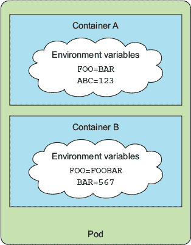

通过环境变量使 fortune 镜像的间隔可配置

让我们再次看看如何修改你的 fortuneloop.sh 脚本，以便它可以从环境变量中进行配置，如下面的列表所示。

列表 7.5\. 通过环境变量配置间隔的 fortune 脚本：fortune-env/fortuneloop.sh

`#!/bin/bash trap "exit" SIGINT echo Configured to generate new fortune every $INTERVAL seconds mkdir -p /var/htdocs while : do   echo $(date) Writing fortune to /var/htdocs/index.html   /usr/games/fortune > /var/htdocs/index.html   sleep $INTERVAL done`

你所需要做的就是删除初始化 `INTERVAL` 变量的那一行。因为你的“应用”是一个简单的 bash 脚本，所以你不需要做其他任何事情。如果应用是用 Java 编写的，你会使用 `System.getenv("INTERVAL")`，而在 Node.JS 中你会使用 `process.env.INTERVAL`，在 Python 中你会使用 `os.environ['INTERVAL']`。

7.3.1\. 在容器定义中指定环境变量

在构建新的镜像（这次我将其标记为 `luksa/fortune:env`）并将其推送到 Docker Hub 后，你可以通过创建一个新的 pod 来运行它，在容器定义中包含环境变量，如下面的列表所示。

列表 7.6\. 在 pod 中定义环境变量：fortune-pod-env.yaml

`kind: Pod spec: containers: - image: luksa/fortune:env` `env:``1``- name: INTERVAL``1``value: "30"``1` `name: html-generator ...`

+   1 向环境变量列表中添加单个变量

如前所述，你是在容器定义中设置环境变量，而不是在 pod 层级上。

| |
| --- |

注意

不要忘记，在每个容器中，Kubernetes 还会自动为同一命名空间中的每个服务暴露环境变量。这些环境变量基本上是自动注入的配置。

| |
| --- |

7.3.2\. 在变量的值中引用其他环境变量

在前面的例子中，你为环境变量设置了一个固定值，但你也可以通过使用 `$(VAR)` 语法来引用先前定义的环境变量或任何其他现有变量。如果你定义了两个环境变量，第二个可以包含第一个的值，如下面的列表所示。

列表 7.7\. 在另一个环境变量中引用环境变量

`env: - name:` `FIRST_VAR` `value: "foo" - name: SECOND_VAR   value:` `"$(FIRST_VAR)bar"`

在这种情况下，`SECOND_VAR` 的值将是 `"foobar"`。同样，你曾在 第 7.2 节 中学到的 `command` 和 `args` 属性也可以这样引用环境变量。你将在 第 7.4.5 节 中使用这种方法。

7.3.3\. 理解硬编码环境变量的缺点

将值硬编码在 Pod 定义中实际上意味着你需要为生产环境和开发环境分别拥有不同的 Pod 定义。为了在多个环境中重用相同的 Pod 定义，将配置与 Pod 描述符解耦是有意义的。幸运的是，你可以使用 ConfigMap 资源来实现这一点，并使用`valueFrom`字段而不是`value`字段作为环境变量值的来源。你将在下一节中了解这一点。

7.4\. 使用 ConfigMap 解耦配置

应用程序配置的整个目的是将不同环境之间或频繁变化的配置选项与应用程序的源代码分开。如果你将 Pod 描述符视为应用程序的源代码（在微服务架构中这确实是如此，因为它定义了如何将单个组件组合成一个功能系统），那么很明显你应该将配置从 Pod 描述符中移出。

7.4.1\. 介绍 ConfigMap

Kubernetes 允许将配置选项分离到称为 ConfigMap 的单独对象中，它是一个包含键/值对的映射，其值范围从简短的字面量到完整的配置文件。

应用程序不需要直接读取 ConfigMap 或甚至知道它的存在。映射的内容作为环境变量或作为卷中的文件传递给容器（见图 7.2）。并且因为可以使用`$(ENV_VAR)`语法在命令行参数中引用环境变量，所以你还可以将 ConfigMap 条目作为命令行参数传递给进程。

图 7.2\. Pods 通过环境变量和`configMap`卷使用 ConfigMap。

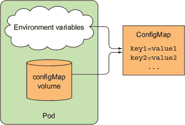

当然，如果需要，应用程序也可以直接通过 Kubernetes REST API 端点读取 ConfigMap 的内容，但除非你真的有这个需求，否则你应该尽可能保持你的应用程序与 Kubernetes 无关。

无论应用程序如何消费 ConfigMap，将配置保存在这样的独立对象中，都允许你为具有相同名称的 ConfigMap 保留多个清单，每个清单针对不同的环境（开发、测试、QA、生产等）。因为 Pod 通过名称引用 ConfigMap，所以你可以在每个环境中使用不同的配置，同时在所有环境中使用相同的 Pod 规范（见图 7.3）。

图 7.3\. 在不同环境中使用相同名称的两种不同的 ConfigMap

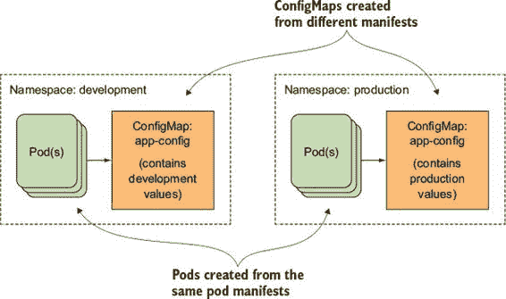

7.4.2\. 创建 ConfigMap

让我们看看如何在您的 Pod 中使用 ConfigMap。首先，从最简单的例子开始，你将首先创建一个包含单个键的映射，并使用它来填充您之前示例中的`INTERVAL`环境变量。你将使用特殊的`kubectl create configmap`命令来创建 ConfigMap，而不是使用通用的`kubectl create -f`命令来发布 YAML。

使用 kubectl create configmap 命令

你可以通过向 `kubectl` 命令传递字面量来定义映射的条目，或者你可以从你的磁盘上的文件创建 ConfigMap。首先使用一个简单的字面量：

`$ kubectl create configmap fortune-config --from-literal=sleep-interval=25` `configmap "fortune-config" created`

| |
| --- |

注意

ConfigMap 键必须是有效的 DNS 子域（它们只能包含字母数字字符、破折号、下划线和点）。它们可以可选地包含一个前导点。

| |
| --- |

这将创建一个名为 `fortune-config` 的 ConfigMap，包含单个条目 `sleep-interval =25` (图 7.4)。

图 7.4\. 包含单个条目的 `fortune-config` ConfigMap

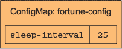

ConfigMap 通常包含多个条目。要创建包含多个字面条目的 ConfigMap，你需要在命令中添加多个 `--from-literal` 参数：

`$ kubectl create configmap myconfigmap``--from-literal=foo=bar --from-literal=bar=baz --from-literal=one=two`

让我们检查使用 `kubectl get` 命令创建的 ConfigMap 的 YAML 描述符，如下所示。

列表 7.8\. 一个 ConfigMap 定义

`$ kubectl get configmap fortune-config -o yaml` `apiVersion: v1 data:   sleep-interval: "25"` `1` `kind: ConfigMap` `2` `metadata:   creationTimestamp: 2016-08-11T20:31:08Z   name: fortune-config` `3` `namespace: default   resourceVersion: "910025"   selfLink: /api/v1/namespaces/default/configmaps/fortune-config   uid: 88c4167e-6002-11e6-a50d-42010af00237`

+   1 该映射中的单个条目

+   2 此描述符描述了一个 ConfigMap。

+   3 该映射的名称（你将通过此名称引用它）

没有什么特别之处。你很容易就能自己编写这个 YAML（当然，你不需要在 `metadata` 部分指定任何内容，除了名称之外）并将其发布到 Kubernetes API 中，使用众所周知的

`$ kubectl create -f fortune-config.yaml`

从文件内容创建 ConfigMap 条目

ConfigMap 还可以存储粗粒度的配置数据，例如完整的配置文件。为此，`kubectl create configmap` 命令还支持从磁盘读取文件并将它们作为 ConfigMap 中的单独条目存储：

`$ kubectl create configmap my-config --from-file=config-file.conf`

当你运行前面的命令时，kubectl 会查找你在其中运行 `kubectl` 的目录中的 `config-file.conf` 文件。然后，它将在 ConfigMap 中以 `config-file.conf` 为键存储文件的全部内容（文件名用作映射键），但你也可以像这样手动指定键：

`$ kubectl create configmap my-config --from-file=customkey=config-file.conf`

此命令将在键 `customkey` 下存储文件的全部内容。与字面量一样，你可以通过多次使用 `--from-file` 参数添加多个文件。

从目录中的文件创建 ConfigMap

你甚至可以导入文件目录中的所有文件，而不是逐个导入每个文件：

`$ kubectl create configmap my-config --from-file=/path/to/dir`

在这种情况下，`kubectl`将为指定目录中的每个文件创建单独的映射条目，但仅限于文件名是有效的 ConfigMap 键。

结合不同的选项

当创建 ConfigMap 时，你可以使用这里提到的所有选项的组合（请注意，这些文件不包括在本书的代码存档中——如果你想要尝试命令，你可以自己创建它们）：

`$ kubectl create configmap my-config` `--from-file=foo.json` `1``--from-file=bar=foobar.conf` `2``--from-file=config-opts/` `3``--from-literal=some=thing` `4`

+   1 一个单独的文件

+   2 存储在自定义键下的文件

+   3 整个目录

+   4 一个字面值

在这里，你已从多个来源创建了 ConfigMap：整个目录、一个文件、另一个文件（但存储在自定义键下而不是使用文件名作为键），以及一个字面值。图 7.5 显示了所有这些来源和生成的 ConfigMap。

图 7.5\. 从单个文件、目录和字面值创建 ConfigMap

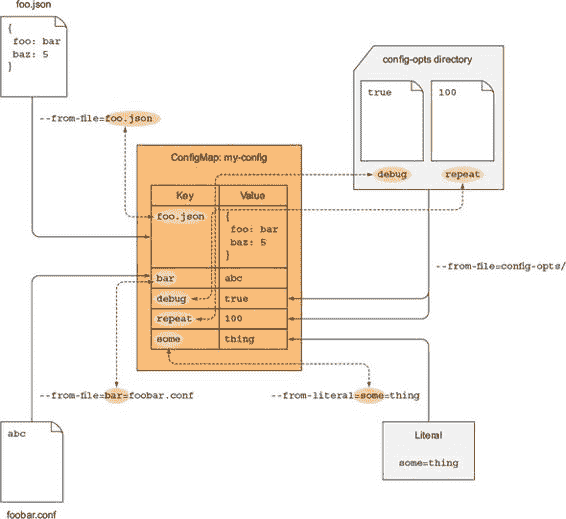

7.4.3\. 将 ConfigMap 条目作为环境变量传递给容器

你现在如何将这个映射的值放入一个容器的容器中？你有三个选项。让我们从最简单的开始——设置一个环境变量。你将使用我提到的`valueFrom`字段，在第 7.3.3 节。Pod 描述符应该看起来像以下列表。

列表 7.9\. 从 ConfigMap 获取`env var`的 Pod：fortune-pod-env-configmap.yaml

`apiVersion: v1 kind: Pod metadata: name: fortune-env-from-configmap spec: containers: - image: luksa/fortune:env env: `1` - name: INTERVAL `1` valueFrom: `2` configMapKeyRef: `2` name: fortune-config `3` key: sleep-interval `4` `...`

+   1 你正在设置名为 INTERVAL 的环境变量。

+   2 你不是设置一个固定值，而是从 ConfigMap 键初始化它。

+   3 引用的 ConfigMap 的名称

+   4 你正在将变量设置为 ConfigMap 中此键下存储的任何内容。

你定义了一个名为`INTERVAL`的环境变量，并将其值设置为存储在`fortune-config` ConfigMap 中`sleep-interval`键下的任何内容。当在`html-generator`容器中运行的进程读取`INTERVAL`环境变量时，它将看到值`25`（如图 7.6 所示）。

图 7.6\. 将 ConfigMap 条目作为环境变量传递给容器

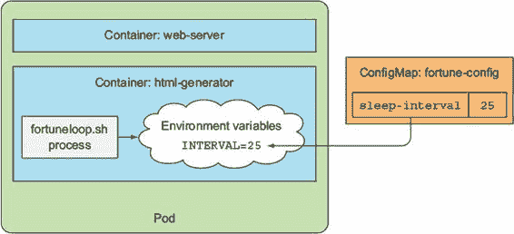

在 Pod 中引用不存在的 ConfigMap

您可能会想知道，当您创建 pod 时，如果引用的 ConfigMap 不存在会发生什么。Kubernetes 会正常调度 pod 并尝试运行其容器。引用不存在 ConfigMap 的容器将无法启动，但其他容器将正常启动。如果您随后创建了缺失的 ConfigMap，失败的容器将启动，而无需您重新创建 pod。

注意

您还可以将 ConfigMap 的引用标记为可选（通过设置 `configMapKeyRef.optional: true`）。在这种情况下，即使 ConfigMap 不存在，容器也会启动。

此示例展示了如何将配置与 pod 规范解耦。这允许您将所有配置选项紧密地放在一起（即使对于多个 pod），而不是让它们散布在 pod 定义中（或在多个 pod 清单中重复）。

7.4.4\. 一次性将 ConfigMap 的所有条目作为环境变量传递

当您的 ConfigMap 包含的条目不止几个时，从每个条目单独创建环境变量变得既繁琐又容易出错。幸运的是，Kubernetes 版本 1.6 提供了一种方法，可以将 ConfigMap 的所有条目作为环境变量暴露。

想象一下有一个名为 `FOO`、`BAR` 和 `FOO-BAR` 的三个键的 ConfigMap。您可以通过使用 `envFrom` 属性将它们全部暴露为环境变量，而不是像之前示例中那样使用 `env`。以下列表显示了一个示例。

列表 7.10\. 包含 ConfigMap 所有条目的 env 变量的 Pod

`spec:    containers:    - image: some-image` `envFrom:` `- prefix: CONFIG_` `1` `configMapRef:` `2` `name: my-config-map` `2` `...`

+   1 使用 envFrom 而不是 env

+   2 所有环境变量都将带有前缀 CONFIG_。

+   3 引用名为 my-config-map 的 ConfigMap

如您所见，您还可以为环境变量指定一个前缀（在这种情况下为 `CONFIG_`）。这导致以下两个环境变量存在于容器内部：`CONFIG_FOO` 和 `CONFIG_BAR`。

注意

前缀是可选的，所以如果您省略它，环境变量将与键具有相同的名称。

你注意到我说了两个变量，但之前我说 ConfigMap 有三个条目（`FOO`、`BAR` 和 `FOO-BAR`）吗？为什么没有 `FOO-BAR` ConfigMap 条目的环境变量？

原因是 `CONFIG_FOO-BAR` 不是一个有效的环境变量名称，因为它包含一个连字符。Kubernetes 不会以任何方式转换键（例如，它不会将连字符转换为下划线）。如果 ConfigMap 键不是正确的格式，它会跳过该条目（但它会记录一个事件通知您它跳过了它）。

7.4.5\. 将 ConfigMap 条目作为命令行参数传递

现在，让我们也看看如何将 ConfigMap 的值作为参数传递给容器中运行的主进程。你无法直接在`pod.spec.containers.args`字段中引用 ConfigMap 条目，但你可以首先从 ConfigMap 条目初始化一个环境变量，然后像图 7.7 中所示的那样在参数中引用该变量。

图 7.7\. 将 ConfigMap 条目作为命令行参数传递

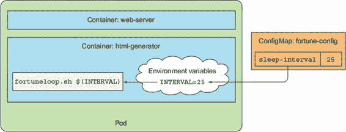

列表 7.11 展示了如何在 YAML 中完成这个例子。

列表 7.11\. 使用 ConfigMap 条目作为参数：fortune-pod-args-configmap.yaml

`apiVersion: v1 kind: Pod metadata:   name: fortune-args-from-configmap spec:   containers:   - image: luksa/fortune:args` `1` `env:` `2` `- name: INTERVAL` `2` `valueFrom:` `2` `configMapKeyRef:` `2` `name: fortune-config` `2` `key: sleep-interval` `2` `args: ["$(INTERVAL)"]` `3` `...`

+   1 使用从第一个参数而不是从环境变量获取间隔的镜像

+   2 正如之前定义环境变量一样

+   3 在参数中引用环境变量

你定义环境变量的方式与之前完全相同，但之后你使用了`$(ENV_VARIABLE_NAME)`语法来让 Kubernetes 将变量的值注入到参数中。

7.4.6\. 使用 configMap 卷将 ConfigMap 条目作为文件暴露

将配置选项作为环境变量或命令行参数传递通常用于短变量值。正如你所见，ConfigMap 也可以包含整个配置文件。当你想要将这些暴露给容器时，你可以使用我在上一章中提到的特殊卷类型之一，即`configMap`卷。

`configMap`卷将 ConfigMap 的每个条目都暴露为一个文件。容器中运行的进程可以通过读取文件的 内容来获取条目的值。

虽然这种方法主要用于将大型配置文件传递到容器中，但没有任何东西阻止你以这种方式传递短的单个值。

创建 ConfigMap

代替再次修改你的`fortuneloop.sh`脚本，你现在将尝试一个不同的例子。你将使用一个配置文件来配置运行在`fortune` pod 的 web-server 容器内的 Nginx web 服务器。假设你希望你的 Nginx 服务器压缩它发送给客户端的响应。为了启用压缩，Nginx 的配置文件需要看起来像以下列表。

列表 7.12\. 启用 gzip 压缩的 Nginx 配置：my-nginx-config.conf

`server {   listen              80;   server_name         www.kubia-example.com;    gzip on;` `1` `gzip_types text/plain application/xml;` `1` `location / {       root   /usr/share/nginx/html;       index  index.html index.htm;   } }`

+   1 这将启用纯文本和 XML 文件的 gzip 压缩。

现在删除现有的 `fortune-config` ConfigMap，使用 `kubectl delete configmap fortune-config`，以便你可以用包含 Nginx 配置文件的新一个替换它。你将从存储在本地磁盘上的文件创建 ConfigMap。

创建一个名为 configmap-files 的新目录，并将前一个列表中的 Nginx 配置存储到 configmap-files/my-nginx-config.conf 中。为了使 ConfigMap 也包含 `sleep-interval` 条目，在同一个目录中添加一个名为 sleep-interval 的纯文本文件，并在其中存储数字 25（参见图 7.8）。

图 7.8. configmap-files 目录及其文件的内容

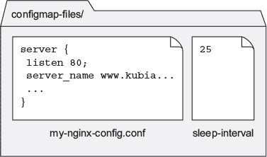

现在创建一个 ConfigMap，如下所示：

`$ kubectl create configmap fortune-config --from-file=configmap-files` `configmap "fortune-config" created`

下面的列表显示了此 ConfigMap 的 YAML 格式。

列表 7.13. 从文件创建的 ConfigMap 的 YAML 定义

`$ kubectl get configmap fortune-config -o yaml` `apiVersion: v1 data:   my-nginx-config.conf: |` `1` `server {` `1` `listen              80;` `1` `server_name         www.kubia-example.com;` `1` `gzip on;` `1` `gzip_types text/plain application/xml;` `1` `location / {` `1` `root   /usr/share/nginx/html;` `1` `index  index.html index.htm;` `1` `}` `1` `}` `1` `sleep-interval: |` `2` `25` `2` `kind: ConfigMap ...`

+   1 保存 Nginx 配置文件内容的条目

+   2 保存 sleep-interval 条目的条目

注意

在两个条目的第一行冒号后面的管道字符表示后面跟着一个字面多行值。

ConfigMap 包含两个条目，其键对应于它们创建的文件的实际名称。你现在将使用 ConfigMap 中的两个容器。

在卷中使用 ConfigMap 的条目

创建一个包含 ConfigMap 内容的卷与通过名称引用 ConfigMap 并在容器中挂载卷一样简单。你已经学习了如何创建卷和挂载它们，所以剩下要学习的就是如何使用 ConfigMap 的条目初始化卷。

Nginx 从 /etc/nginx/nginx.conf 读取其配置文件。Nginx 镜像已经包含了这个文件，并带有默认配置选项，你不希望覆盖这些选项，因此你不想替换整个文件。幸运的是，默认配置文件自动包含 /etc/nginx/conf.d/ 子目录下的所有 .conf 文件，所以你应该在那里添加你的配置文件。图 7.9 显示了你想要实现的内容。

图 7.9. 将 ConfigMap 条目作为卷中的文件传递给 pod

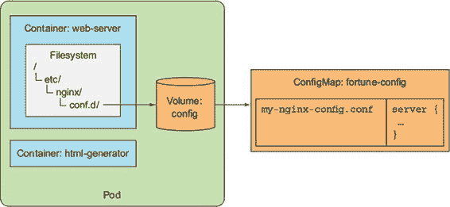

pod 描述符在列表 7.14 中显示（省略了无关部分，但你可以从代码存档中找到完整的文件）。

列表 7.14. 将 ConfigMap 条目挂载为文件的 pod：fortune-pod-configmap-volume.yaml

`apiVersion: v1 kind: Pod metadata:   name: fortune-configmap-volume spec:   containers:   - image: nginx:alpine     name: web-server     volumeMounts:     ...     - name: config       mountPath: /etc/nginx/conf.d` `1` `readOnly: true     ...   volumes:   ...   - name: config     configMap:` `2` `name: fortune-config` `2` `...`

+   1 你正在将 configMap 卷挂载到这个位置。

+   2 该卷指的是你的 fortune-config ConfigMap。

这个 pod 定义包括一个卷，它引用了你的 `fortune-config` Config-Map。你将卷挂载到 /etc/nginx/conf.d 目录，以便 Nginx 使用它。

验证 Nginx 是否正在使用挂载的配置文件

现在 Web 服务器应该被配置为压缩它发送的响应。你可以通过从 localhost:8080 到 pod 的端口 80 启用端口转发，并使用 `curl` 检查服务器的响应来验证这一点，如下面的列表所示。

列表 7.15\. 检查 nginx 响应是否启用了压缩

`$ kubectl port-forward fortune-configmap-volume 8080:80 &` `Forwarding from 127.0.0.1:8080 -> 80 Forwarding from [::1]:8080 -> 80` `$ curl -H "Accept-Encoding: gzip" -I localhost:8080` `HTTP/1.1 200 OK Server: nginx/1.11.1 Date: Thu, 18 Aug 2016 11:52:57 GMT Content-Type: text/html Last-Modified: Thu, 18 Aug 2016 11:52:55 GMT Connection: keep-alive ETag: W/"57b5a197-37" Content-Encoding: gzip` `1`

+   1 这表明响应已被压缩。

检查挂载的 configMap 卷的内容

响应显示你已经实现了想要的结果，但现在让我们看看 /etc/nginx/conf.d 目录现在有什么：

`$ kubectl exec fortune-configmap-volume -c web-server ls /etc/nginx/conf.d` `my-nginx-config.conf sleep-interval`

ConfigMap 中的两个条目已经被添加到目录中。`sleep-interval` 条目也被包括在内，尽管它不应该在那里，因为它仅意味着要由 `fortuneloop` 容器使用。你可以创建两个不同的 ConfigMap，并使用一个来配置 `fortuneloop` 容器，另一个来配置 `web-server` 容器。但不知何故，使用多个 ConfigMap 来配置同一 pod 的容器感觉是错误的。毕竟，同一个 pod 中的容器意味着它们紧密相关，可能也应该作为一个单元来配置。

在卷中暴露某些 ConfigMap 条目

幸运的是，你可以只使用 ConfigMap 条目的一部分来填充 `configMap` 卷——在你的情况下，只有 `my-nginx-config.conf` 条目。这不会影响 `fortuneloop` 容器，因为你通过环境变量而不是通过卷将 `sleep-interval` 条目传递给它。

要定义哪些条目应作为文件在 `configMap` 卷中暴露，请使用卷的 `items` 属性，如下面的列表所示。

列表 7.16\. 将特定的 ConfigMap 条目挂载到文件目录中的 pod：fortune-pod-configmap-volume-with-items.yaml

`volumes:    - name: config      configMap:        name: fortune-config        items:` `1` `- key: my-nginx-config.conf` `2` `path: gzip.conf` `3`

+   1 通过列出条目来选择要包含在卷中的条目

+   2 你希望包含此键下的条目。

+   3 条目的值应存储在此文件中。

当指定单个条目时，你需要为每个单个条目设置文件名以及条目的键。如果你从上一个列表中运行 pod，/etc/nginx/conf.d 目录将保持整洁，因为它只包含 gzip.conf 文件，没有其他文件。

理解挂载目录会隐藏该目录中的现有文件

在这一点上，有一件重要的事情需要讨论。在这两个例子中，你都将卷挂载为目录，这意味着你隐藏了存储在容器镜像中的 /etc/nginx/conf.d 目录中的任何文件。

这通常是在 Linux 中将文件系统挂载到非空目录时发生的情况。然后该目录只包含挂载的文件系统中的文件，而该目录中原有的文件在文件系统挂载期间无法访问。

在你的情况下，这没有严重的副作用，但想象一下将卷挂载到通常包含许多重要文件的 /etc 目录。这很可能会破坏整个容器，因为应该位于 /etc 目录中的所有原始文件将不再存在。如果你需要将文件添加到像 /etc 这样的目录中，你根本不能使用这种方法。

将单个 ConfigMap 条目作为文件挂载，而不隐藏目录中的其他文件

自然地，你现在想知道如何将 ConfigMap 中的单个文件添加到现有目录中，而不会隐藏其中存储的现有文件。`volumeMount` 上的附加 `subPath` 属性允许你挂载卷中的单个文件或单个目录，而不是挂载整个卷。也许这通过视觉方式更容易解释（见图 7.10）。

图 7.10\. 从卷中挂载单个文件

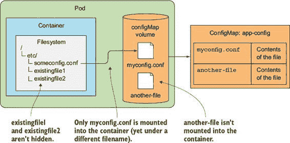

假设你有一个包含 myconfig.conf 文件的 `configMap` 卷，你希望将其添加到 /etc 目录中作为 someconfig.conf。你可以使用 `subPath` 属性将其挂载到那里，而不会影响该目录中的其他任何文件。pod 定义的相应部分如下所示。

列表 7.17\. 将特定的 ConfigMap 条目挂载到特定文件中的 pod

`spec:    containers:    - image: some/image      volumeMounts:      - name: myvolume        mountPath: /etc/someconfig.conf` `1` `subPath: myconfig.conf` `2`

+   1 你正在挂载到文件，而不是目录。

+   2 你不是挂载整个卷，而是只挂载 myconfig.conf 条目。

当挂载任何类型的卷时，可以使用`subPath`属性。您不必挂载整个卷，而是可以挂载其一部分。但是，这种方法挂载单个文件与文件更新相关联的缺点相对较大。您将在下一节中了解更多关于此信息，但首先，让我们通过简要说明文件权限来结束对`configMap`卷初始状态的讨论。

设置 configMap 卷中文件的文件权限

默认情况下，`configMap`卷中所有文件的权限设置为 644（`-rw-r--r--`）。您可以通过在卷规范中设置`defaultMode`属性来更改此设置，如下所示。

列表 7.18\. 设置文件权限：fortune-pod-configmap-volume-defaultMode.yaml

`volumes:   - name: config   configMap:     name: fortune-config     defaultMode: "6600"` `1`

+   1 这将设置所有文件的权限为-rw-rw-----。

虽然 ConfigMaps 应用于非敏感配置数据，但您可能只想让文件对其所属的用户和组可读和可写，正如前一个示例所示。

7.4.7\. 无需重启应用程序即可更新应用程序的配置

我们已经说过，使用环境变量或命令行参数作为配置源的一个缺点是，在进程运行时无法更新它们。使用 ConfigMap 并通过卷公开它，可以在不重新创建 Pod 或甚至重启容器的情况下更新配置。

当您更新 ConfigMap 时，所有引用它的卷中的文件都会更新。然后，取决于进程检测到它们已更改并重新加载它们。但 Kubernetes 最终可能也会支持在更新文件后向容器发送信号。

| |
| --- |

警告

注意，在我撰写本文时，在更新 ConfigMap 后，文件更新所需的时间出奇地长（可能需要整整一分钟）。

| |
| --- |

编辑 ConfigMap

让我们看看您如何更改 ConfigMap，并让在 Pod 中运行的进程重新加载`configMap`卷中公开的文件。您将修改之前示例中的 Nginx 配置文件，并让 Nginx 使用新的配置而不重启 Pod。尝试通过使用`kubectl edit`编辑`fortune-config` ConfigMap 来关闭 gzip 压缩：

`$ kubectl edit configmap fortune-config`

一旦您的编辑器打开，将`gzip on`行更改为`gzip off`，保存文件，然后关闭编辑器。然后 ConfigMap 将被更新，不久之后，卷中的实际文件也将更新。您可以通过使用`kubectl exec`打印文件的 内容来确认这一点：

`$ kubectl exec fortune-configmap-volume -c web-server``cat /etc/nginx/conf.d/my-nginx-config.conf`

如果你还没有看到更新，请稍等片刻再试一次。文件更新需要一段时间。最终，你会在配置文件中看到变化，但你可能会发现这并没有对 Nginx 产生影响，因为它不会监视文件并自动重新加载它们。

向 Nginx 发送信号以重新加载配置

Nginx 将继续压缩其响应，直到你告诉它重新加载其配置文件，你可以使用以下命令来完成：

`$ kubectl exec fortune-configmap-volume -c web-server -- nginx -s reload`

现在，如果你再次使用 `curl` 尝试访问服务器，你应该会看到响应不再被压缩（不再包含 `Content-Encoding: gzip` 标头）。你实际上已经更改了应用的配置，而无需重新启动容器或重新创建 pod。

理解文件是如何原子性地更新的

你可能会想知道，如果一个应用能够自己检测配置文件的变化并在 Kubernetes 完成更新 `configMap` 卷中的所有文件之前重新加载它们，会发生什么。幸运的是，这种情况不会发生，因为所有文件都是原子性地更新的，这意味着所有更新都是同时发生的。Kubernetes 通过使用符号链接来实现这一点。如果你列出挂载的 `configMap` 卷中的所有文件，你会看到如下类似的列表。

列表 7.19\. 挂载的 `configMap` 卷中的文件

`$ kubectl exec -it fortune-configmap-volume -c web-server -- ls -lA``/etc/nginx/conf.d` `total 4 drwxr-xr-x  ... 12:15 ..4984_09_04_12_15_06.865837643 lrwxrwxrwx  ... 12:15 ..data -> ..4984_09_04_12_15_06.865837643 lrwxrwxrwx  ... 12:15 my-nginx-config.conf -> ..data/my-nginx-config.conf lrwxrwxrwx  ... 12:15 sleep-interval -> ..data/sleep-interval`

如你所见，挂载的 `configMap` 卷中的文件是符号链接，指向 `..data` 目录中的文件。`..data` 目录也是一个符号链接，指向一个名为 `..4984_09_04_something` 的目录。当 ConfigMap 被更新时，Kubernetes 创建一个这样的新目录，将所有文件写入其中，然后重新链接 `..data` 符号链接到新目录，从而一次性更改所有文件。

理解挂载到现有目录中的文件不会更新

一个大问题是关于更新由 ConfigMap 支持的卷。如果你在容器中挂载了一个单独的文件而不是整个卷，该文件将不会被更新！至少，在撰写本章时是这样的。

目前，如果你需要添加一个单独的文件，并在更新其源 ConfigMap 时更新它，一个解决方案是将整个卷挂载到不同的目录中，然后创建一个指向该文件的符号链接。这个符号链接可以在容器镜像本身中创建，或者你可以在容器启动时创建这个符号链接。

理解更新 ConfigMap 的后果

容器最重要的特性之一是不可变性，这使我们确信从同一镜像创建的多个运行容器之间不存在差异，那么通过修改运行容器使用的 ConfigMap 来绕过这种不可变性是否正确呢？

主要问题发生在应用程序不支持重新加载其配置时。这导致不同的运行实例配置不同——在 ConfigMap 更改后创建的 Pod 将使用新的配置，而旧的 Pod 仍然使用旧的配置。这并不限于新的 Pod。如果 Pod 的容器重新启动（无论什么原因），新的进程也会看到新的配置。因此，如果应用程序不自动重新加载其配置，修改正在使用的现有 ConfigMap（同时 Pod 正在使用它）可能不是一个好主意。

如果应用程序支持重新加载，修改 ConfigMap 通常不是什么大问题，但你确实需要意识到，由于 ConfigMap 卷中的文件不会在所有运行实例之间同步更新，单个 Pod 中的文件可能最多会有一分钟的同步问题。

7.5. 使用秘密将敏感数据传递到容器中

你迄今为止传递给容器的所有信息都是常规的非敏感配置数据，不需要保持安全。但如我们在本章开头提到的，配置通常还包括敏感信息，如凭证和私有加密密钥，这些信息需要保持安全。

7.5.1. 介绍秘密

为了存储和分发此类信息，Kubernetes 提供了一个名为 Secret 的单独对象。秘密与 ConfigMap 非常相似——它们也是包含键值对的映射。它们可以像 ConfigMap 一样使用。你可以

+   将秘密条目作为环境变量传递给容器

+   将秘密条目作为卷中的文件暴露

Kubernetes 通过确保每个秘密只分发给需要访问秘密的 Pod 运行的节点来帮助保护你的秘密。此外，在节点本身上，秘密始终存储在内存中，永远不会写入物理存储，这需要在从它们中删除秘密后擦除磁盘。

在主节点本身（更具体地说在 etcd 中），秘密以前是以未加密的形式存储的，这意味着需要确保主节点安全，以保持存储在秘密中的敏感数据安全。这不仅包括确保 etcd 存储安全，还包括防止未经授权的用户使用 API 服务器，因为任何可以创建 Pod 的人都可以将秘密挂载到 Pod 中并通过它访问敏感数据。从 Kubernetes 版本 1.7 开始，etcd 以加密形式存储秘密，使系统更加安全。正因为如此，正确选择何时使用秘密或 ConfigMap 至关重要。在它们之间进行选择很简单：

+   使用 ConfigMap 来存储非敏感的纯配置数据。

+   使用密钥来存储任何本质上是敏感的并且需要保密的数据。如果一个配置文件同时包含敏感和非敏感数据，你应该将文件存储在密钥中。

你已经在第五章中使用了密钥，当时你创建了一个密钥来存储 Ingress 资源所需的 TLS 证书。现在你将更详细地探索密钥。

7.5.2\. 介绍默认令牌密钥

你将通过检查每个运行的容器中安装的密钥来开始学习关于密钥的知识。你可能在使用`kubectl describe`命令查看 pod 时注意到了它。命令的输出始终包含类似以下内容：

`卷:   default-token-cfee9:   类型:       密钥（由密钥填充的卷）   密钥名称: default-token-cfee9`

每个 pod 都会自动附加一个`secret`卷。前面的`kubectl describe`输出中的卷指的是名为`default-token-cfee9`的密钥。因为密钥是资源，你可以使用`kubectl get secrets`来列出它们，并在列表中找到`default-token`密钥。让我们看看：

`$ kubectl get secrets` `名称                  类型                                  数据      年龄 default-token-cfee9   kubernetes.io/service-account-token   3         39d`

你也可以使用`kubectl describe`来了解更多关于它的信息，如下面的列表所示。

列表 7.20\. 描述密钥

`$ kubectl describe secrets` `名称:        default-token-cfee9 名称空间:   default 标签:      <无> 注解: kubernetes.io/service-account.name=default   kubernetes.io/service-account.uid=cc04bb39-b53f-42010af00237 类型:        kubernetes.io/service-account-token  数据 ==== ca.crt:      1139 字节` `1` `namespace:   7 字节` `1` `token:       eyJhbGciOiJSUzI1NiIsInR5cCI6IkpXVCJ9...` `1`

+   1 此密钥包含三个条目。

你可以看到，密钥包含三个条目——`ca.crt`、`namespace`和`token`——这些代表了你从你的 pod 中安全地与 Kubernetes API 服务器通信所需的一切。尽管理想情况下你希望你的应用程序完全与 Kubernetes 无关，但在没有其他选择只能直接与 Kubernetes 通信的情况下，你将使用通过此`secret`卷提供的文件。

`kubectl describe pod`命令显示了`secret`卷的挂载位置：

`挂载点:` `/var/run/secrets/kubernetes.io/serviceaccount` `来自 default-token-cfee9`

注意

默认情况下，`default-token`密钥会被挂载到每个容器中，但你可以在每个 pod 的规范中设置`automountService-AccountToken`字段为`false`，或者将服务账户设置为`false`来禁用这一功能。（你将在本书的后面学习到服务账户。）

为了帮助你可视化默认令牌密钥在哪里以及如何挂载，请参阅图 7.11。

图 7.11\. `default-token` 秘密会自动创建，并且每个 pod 都会自动挂载相应的卷。

我们说过秘密就像 ConfigMaps，所以因为这个秘密包含三个条目，你可以预期在挂载 `secret` 卷的目录中看到三个文件。你可以用 `kubectl exec` 轻松检查：

`$ kubectl exec mypod ls /var/run/secrets/kubernetes.io/serviceaccount/` `ca.crt namespace token`

你将在下一章中看到你的应用程序如何使用这些文件来访问 API 服务器。

7.5.3\. 创建一个 Secret

现在，你将创建自己的小秘密。你将通过配置 Nginx 容器以也服务 HTTPS 流量来改进你的 fortune-serving Nginx 容器。为此，你需要创建一个证书和私钥。私钥需要保持安全，所以你会将它们和证书放入一个秘密中。

首先，生成证书和私钥文件（在你的本地机器上执行此操作）。你也可以使用书中的代码存档中的文件（证书和密钥文件位于 `fortune-https` 目录中）：

`$ openssl genrsa -out https.key 2048``$ openssl req -new -x509 -key https.key -out https.cert -days 3650 -subj``/CN=www.kubia-example.com`

现在，为了更好地演示关于 Secrets 的几个方面，创建一个额外的名为 foo 的虚拟文件，并使其包含字符串 `bar`。你将在几分钟后理解为什么需要这样做：

`$ echo bar > foo`

现在，你可以使用 `kubectl create secret` 从三个文件创建一个秘密：

`$ kubectl create secret generic fortune-https --from-file=https.key``--from-file=https.cert --from-file=foo` `secret "fortune-https" created`

这与创建 ConfigMaps 并没有太大区别。在这种情况下，你正在创建一个名为 `fortune-https` 的 `generic` 秘密，并在其中包含两个条目（https.key 包含 https.key 文件的内容，同样适用于 https.cert 密钥/文件）。正如你之前所学的，你也可以使用 `--from-file=fortune-https` 包括整个目录，而不是逐个指定每个文件。

| |
| --- |

注意

你正在创建一个通用的秘密，但你也可以使用 `kubectl create secret tls` 命令创建一个 `tls` 秘密，就像你在第五章（index_split_046.html#filepos469093）中所做的那样。这将创建具有不同条目名称的秘密。

| |
| --- |

7.5.4\. 比较 ConfigMaps 和 Secrets

Secrets 和 ConfigMaps 有很大的不同。这是 Kubernetes 开发者在 Kubernetes 已经支持 Secrets 一段时间后创建 ConfigMaps 的原因。以下列表显示了您创建的秘密的 YAML。

列表 7.21\. 秘密的 YAML 定义

`$ kubectl get secret fortune-https -o yaml` `apiVersion: v1 data:   foo: YmFyCg==   https.cert: LS0tLS1CRUdJTiBDRVJUSUZJQ0FURS0tLS0tCk1JSURCekNDQ...   https.key: LS0tLS1CRUdJTiBSU0EgUFJJVkFURSBLRVktLS0tLQpNSUlFcE... kind: Secret ...`

现在将此与前面创建的 ConfigMap 的 YAML 进行比较，如下所示。

列表 7.22\. ConfigMap 的 YAML 定义

`$ kubectl get configmap fortune-config -o yaml` `apiVersion: v1 data:   my-nginx-config.conf: |     server {       ...     }   sleep-interval: |     25 kind: ConfigMap ...`

注意到区别了吗？Secret 条目的内容以 Base64 编码的字符串形式显示，而 ConfigMap 的内容以明文形式显示。这最初使得在 YAML 和 JSON 清单中使用 Secret 有点痛苦，因为你在设置和读取它们的条目时必须进行编码和解码。

使用 Secret 存储二进制数据

使用 Base64 编码的原因很简单。Secret 的条目可以包含二进制值，而不仅仅是纯文本。Base64 编码允许你在 YAML 或 JSON 中包含二进制数据，这两种格式都是纯文本格式。

小贴士

你甚至可以使用 Secret 存储非敏感的二进制数据，但请注意，Secret 的最大大小限制为 1MB。

引入 stringData 字段

因为并非所有敏感数据都是二进制形式，Kubernetes 也允许通过 `stringData` 字段设置 Secret 的值。以下列表显示了如何使用它。

列表 7.23\. 使用 `stringData` 字段向 `Secret` 添加纯文本条目

`kind: Secret apiVersion: v1 stringData:` `1` `foo: plain text` `2` `data:   https.cert: LS0tLS1CRUdJTiBDRVJUSUZJQ0FURS0tLS0tCk1JSURCekNDQ...   https.key: LS0tLS1CRUdJTiBSU0EgUFJJVkFURSBLRVktLS0tLQpNSUlFcE...`

+   1 可以使用 `stringData` 来存储非二进制 Secret 数据。

+   2 注意，“纯文本”不是 Base64 编码的。

`stringData` 字段是只写的（注意：只写，不是只读）。它只能用来设置值。当你使用 `kubectl get -o yaml` 获取 Secret 的 YAML 时，`stringData` 字段将不会显示。相反，你指定在 `stringData` 字段中的所有条目（如前一个示例中的 `foo` 条目）将显示在 `data` 下，并且像所有其他条目一样进行 Base64 编码。

在 pod 中读取 Secret 的条目

当你通过 `secret` 卷将 Secret 暴露给容器时，Secret 条目的值将被解码并以其实际形式写入文件（无论它是纯文本还是二进制）。同样，当通过环境变量暴露 Secret 条目时也是如此。在这两种情况下，应用程序不需要对其进行解码，可以直接读取文件的正文或查找环境变量的值并直接使用它。

7.5.5\. 在 pod 中使用 Secret

在你的 fortune-https Secret 包含证书和密钥文件后，你现在需要做的只是配置 Nginx 使用它们。

修改 fortune-config ConfigMap 以启用 HTTPS

为了做到这一点，你需要再次修改配置文件，通过编辑 ConfigMap：

`$ kubectl edit configmap fortune-config`

在文本编辑器打开后，修改定义 `my-nginx-config.conf` 条目内容的部分，使其看起来如下所示。

列表 7.24\. 修改 `fortune-config` ConfigMap 的数据

`... data: my-nginx-config.conf: | server { listen 80; listen 443 ssl; server_name www.kubia-example.com; ssl_certificate certs/https.cert; ssl_certificate_key certs/https.key; ssl_protocols TLSv1 TLSv1.1 TLSv1.2; ssl_ciphers HIGH:!aNULL:!MD5; location / { root /usr/share/nginx/html; index index.html index.htm; } } sleep-interval: | ...`

+   1 路径相对于 /etc/nginx。

这配置了服务器从 /etc/nginx/certs 读取证书和密钥文件，因此你需要将 `secret` 卷挂载在那里。

在 pod 中挂载 fortune-https Secret

接下来，你将创建一个新的 fortune-https 容器，并将包含证书和密钥的 `secret` 卷挂载到 `web-server` 容器中的正确位置，如下所示。

列表 7.25\. `fortune-https` 容器的 YAML 定义：fortune-pod-https.yaml

`apiVersion: v1 kind: Pod metadata: name: fortune-https spec: containers: - image: luksa/fortune:env name: html-generator env: - name: INTERVAL valueFrom: configMapKeyRef: name: fortune-config key: sleep-interval volumeMounts: - name: html mountPath: /var/htdocs - image: nginx:alpine name: web-server volumeMounts: - name: html mountPath: /usr/share/nginx/html readOnly: true - name: config mountPath: /etc/nginx/conf.d readOnly: true - name: certs mountPath: /etc/nginx/certs readOnly: true ports: - containerPort: 80 - containerPort: 443 volumes: - name: html emptyDir: {} - name: config configMap: name: fortune-config items: - key: my-nginx-config.conf path: https.conf - name: certs secret: secretName: fortune-https

+   1 你已配置 Nginx 从 /etc/nginx/certs 读取证书和密钥文件，因此需要将 Secret 卷挂载在那里。

+   2 你在这里定义了 secret 卷，引用了 fortune-https Secret。

这个 pod 描述符中有很多内容，让我帮你可视化它。图 7.12 显示了在 YAML 中定义的组件。`default-token` Secret、卷和卷挂载，虽然不是 YAML 的一部分，但会自动添加到你的 pod 中，在图中没有显示。

图 7.12\. 结合 ConfigMap 和 Secret 运行 fortune-https pod

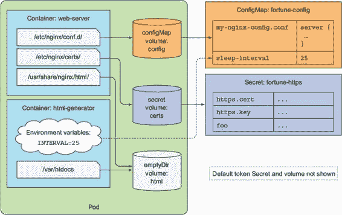

注意

与 `configMap` 卷类似，`secret` 卷也支持通过 `defaultMode` 属性指定在卷中暴露的文件的文件权限。

测试 Nginx 是否正在使用 Secret 中的证书和密钥

当 pod 运行后，你可以通过打开到 pod 的端口 443 的端口转发隧道，并使用 `curl` 向服务器发送请求来查看它是否正在服务 HTTPS 流量：

`$ kubectl port-forward fortune-https 8443:443 &` `转发自 127.0.0.1:8443 -> 443` `转发自 [::1]:8443 -> 443` `$ curl https://localhost:8443 -k`

如果您正确配置了服务器，您应该会收到响应。您可以通过检查服务器的证书来查看它是否与您之前生成的证书匹配。这也可以通过使用 `-v` 选项打开详细日志记录来使用 `curl` 完成，如下面的列表所示。

列表 7.26\. 显示 Nginx 发送的服务器证书

`$ curl https://localhost:8443 -k -v` `* 即将连接()到 localhost 端口 8443 (#0)` `*   尝试 ::1...` `*   连接到 localhost (::1) 端口 8443 (#0)` `*   使用 certpath: sql:/etc/pki/nssdb 初始化 NSS` `*   跳过 SSL 证书验证` `*   使用 TLS_ECDHE_RSA_WITH_AES_256_GCM_SHA384 的 SSL 连接` `*   服务器证书:` `*   *   主题: CN=www.kubia-example.com` `1` `*   *   开始日期: aug 16 18:43:13 2016 GMT` `1` `*   *   过期日期: aug 14 18:43:13 2026 GMT` `1` `*   *   公共名称: www.kubia-example.com` `1` `*   *   发行者: CN=www.kubia-example.com` `1`

+   1 证书与您创建并存储在 Secret 中的证书匹配。

理解 Secret 卷存储在内存中

您通过在 /etc/nginx/certs 目录树中挂载 `secret` 卷，成功将证书和私钥传递到容器中。`secret` 卷使用内存文件系统 (tmpfs) 来存储 Secret 文件。如果您列出容器中的挂载点，您可以看到这一点：

`$ kubectl exec fortune-https -c web-server -- mount | grep certs` `tmpfs on /etc/nginx/certs type` `tmpfs` `(ro,relatime)`

由于使用了 tmpfs，存储在 Secret 中的敏感数据永远不会写入磁盘，这可能会被泄露。

通过环境变量暴露 Secret 的条目

除了使用卷之外，您还可以将 `secret` 中的单个条目作为环境变量暴露，就像您处理 ConfigMap 中的 `sleep-interval` 条目那样。例如，如果您想将 Secret 中的 `foo` 键作为环境变量 `FOO_SECRET` 暴露，您将需要将以下列表中的片段添加到容器定义中。

列表 7.27\. 将 Secret 的条目作为环境变量暴露

`env:   - name: FOO_SECRET     valueFrom:` `1` `secretKeyRef:` `1` `name: fortune-https` `2` `key: foo` `3`

+   1 变量应从 Secret 的条目中设置。

+   2 存有密钥的 Secret 名称

+   3 要暴露的 Secret 的密钥

这几乎与您设置 INTERVAL 环境变量时的情况完全相同，只是这次您使用 `secretKeyRef` 而不是 `configMapKeyRef` 来引用 Secret，后者用于引用 ConfigMap。

尽管 Kubernetes 允许你通过环境变量来暴露 Secret，但这可能不是最好的主意。应用程序通常会在错误报告中丢弃环境变量，甚至在启动时将它们写入应用程序日志，这可能会无意中暴露它们。此外，子进程继承了父进程的所有环境变量，所以如果你的应用程序运行第三方二进制文件，你无法知道你的秘密数据发生了什么。

| |
| --- |

小贴士

在使用环境变量将你的 Secret 传递给容器之前，请三思，因为它们可能会无意中暴露。为了安全起见，始终使用`secret`卷来暴露 Secret。

| |
| --- |

7.5.6. 理解镜像拉取 Secret

你已经学会了如何将 Secret 传递给你的应用程序并使用它们包含的数据。但有时 Kubernetes 本身也需要你向它传递凭证——例如，当你想使用私有容器镜像仓库中的镜像时。这也是通过 Secret 完成的。

到目前为止，你的所有容器镜像都存储在公共镜像仓库中，这些仓库不需要任何特殊凭证来拉取镜像。但大多数组织都不希望他们的镜像对每个人可用，因此使用私有镜像仓库。当部署一个容器镜像位于私有仓库中的 pod 时，Kubernetes 需要知道拉取镜像所需的凭证。让我们看看如何做到这一点。

在 Docker Hub 上使用私有镜像仓库

除了公共镜像仓库外，Docker Hub 还允许你创建私有仓库。你可以通过在浏览器中登录[`hub.docker.com`](http://hub.docker.com)，找到仓库并勾选复选框来标记仓库为私有。

要运行使用私有仓库中镜像的 pod，你需要做两件事：

+   创建一个包含 Docker 注册表凭证的 Secret。

+   在 pod 清单的`imagePullSecrets`字段中引用该 Secret。

为与 Docker 注册表进行身份验证创建 Secret

为与 Docker 注册表进行身份验证创建 Secret 与你在第 7.5.3 节中创建的通用 Secret 没有太大区别。你使用相同的`kubectl create secret`命令，但使用不同的类型和选项：

`$ kubectl create secret docker-registry mydockerhubsecret --docker-username=myusername --docker-password=mypassword --docker-email=my.email@provider.com`

你不是创建一个`generic` Secret，而是创建一个名为`mydockerhubsecret`的`docker-registry` Secret。你指定了你的 Docker Hub 用户名、密码和电子邮件。如果你使用`kubectl describe`检查新创建的 Secret 的内容，你会看到一个名为`.dockercfg`的单个条目。这相当于你家目录中的.dockercfg 文件，它是当你运行`docker login`命令时 Docker 创建的。

在 pod 定义中使用 docker-registry Secret

要让 Kubernetes 在从你的私有 Docker Hub 仓库拉取镜像时使用 Secret，你只需要在 Pod 规范中指定 Secret 的名称，如下面的列表所示。

列表 7.28\. 使用镜像拉取 Secret 的 Pod 定义：pod-with-private-image.yaml

`apiVersion: v1 kind: Pod metadata:   name: private-pod spec:   imagePullSecrets:` `1` `- name: mydockerhubsecret` `1` `containers:   - image: username/private:tag     name: main`

+   1 这使得可以从私有镜像仓库拉取镜像。

在前面列表中的 Pod 定义中，你指定了`mydockerhubsecret` Secret 作为`imagePullSecrets`之一。我建议你自己尝试一下，因为你很可能很快就会处理私有容器镜像。

不需要在每个 Pod 上指定镜像拉取 Secret

考虑到人们通常在系统中运行许多不同的 Pod，这让你想知道是否需要将相同的镜像拉取 Secret 添加到每个 Pod 中。幸运的是，情况并非如此。在第十二章中，你将学习如果将 Secret 添加到 ServiceAccount 中，如何自动将镜像拉取 Secret 添加到所有 Pod 中。

7.6\. 总结

这部分内容总结了如何将配置数据传递给容器。你学习了如何

+   在 Pod 定义中覆盖容器镜像中定义的默认命令

+   将命令行参数传递给主容器进程

+   为容器设置环境变量

+   将配置与 Pod 规范解耦并将其放入 ConfigMap 中

+   在 Secret 中存储敏感数据并将其安全地传递给容器

+   创建一个`docker-registry` Secret 并使用它从私有镜像仓库拉取镜像

在下一章中，你将学习如何将 Pod 和容器元数据传递给运行在其内部的程序。你还将看到我们在这章中学到的默认 token Secret 是如何在 Pod 内部与 API 服务器通信的。
