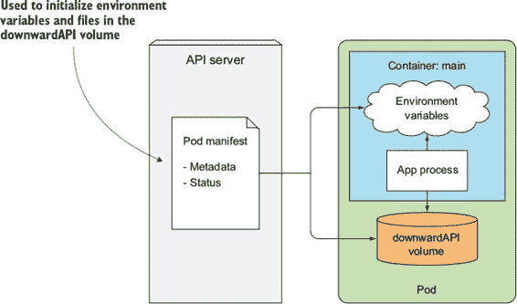
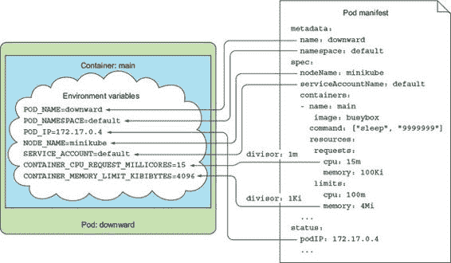
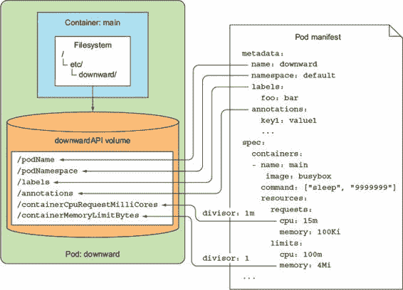
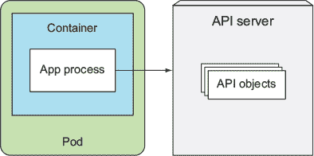
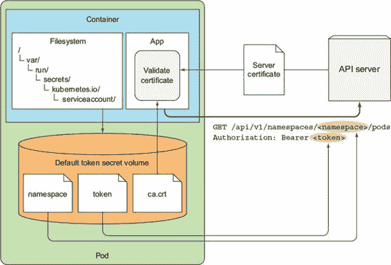
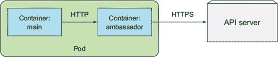
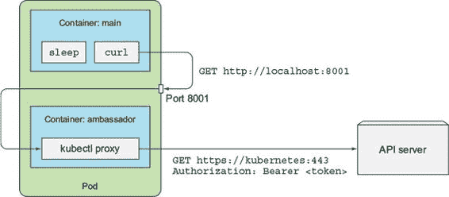

第八章\. 从应用程序访问 Pod 元数据和其它资源

本章涵盖

+   使用 Downward API 将信息传递到容器中

+   探索 Kubernetes REST API

+   将认证和服务器验证留给`kubectl proxy`

+   从容器内访问 API 服务器

+   理解大使容器模式

+   使用 Kubernetes 客户端库

应用程序通常需要了解它们运行的环境信息，包括自身和其他集群组件的详细信息。您已经看到了 Kubernetes 如何通过环境变量或 DNS 进行服务发现，但其他信息怎么办？在本章中，您将了解某些 Pod 和容器元数据如何传递到容器中，以及一个运行在容器中的应用程序与 Kubernetes API 服务器通信以获取集群中部署的资源信息是多么容易，甚至如何创建或修改这些资源。

8.1\. 通过 Downward API 传递元数据

在上一章中，您看到了如何通过环境变量或通过`configMap`和`secret`卷将配置数据传递给您的应用程序。这对于您自己设置且在 Pod 调度到节点并运行之前已知的数据来说效果很好。但对于直到那时才未知的数据怎么办——例如 Pod 的 IP、主机节点的名称，甚至是 Pod 自己的名称（当名称生成时；例如，当 Pod 由 ReplicaSet 或类似控制器创建时）？以及对于已经指定在其他地方的数据怎么办，例如 Pod 的标签和注解？您不希望在多个地方重复相同的信息。

这两个问题都由 Kubernetes Downward API 解决。它允许您通过环境变量或文件（在`downwardAPI`卷中）传递 Pod 及其环境的相关元数据。不要被这个名字迷惑。Downward API 不像一个 REST 端点，您的应用程序需要击中它以获取数据。它是一种将环境变量或文件填充为 Pod 规范或状态中的值的方式，如图 8.1 所示。

图 8.1\. Downward API 通过环境变量或文件暴露 Pod 元数据。

8.1.1\. 理解可用的元数据

Downward API 允许您将 Pod 的自身元数据暴露给在该 Pod 内运行的进程。目前，它允许您将以下信息传递给您的容器：

+   Pod 的名称

+   Pod 的 IP 地址

+   Pod 所属的命名空间

+   Pod 运行所在的节点名称

+   Pod 运行下的服务账户名称

+   每个容器的 CPU 和内存请求

+   每个容器的 CPU 和内存限制

+   Pod 的标签

+   Pod 的注解

列表中的大多数项目不需要进一步解释，除非可能是服务账户以及 CPU/内存请求和限制，这些我们尚未介绍。我们将在第十二章章节 12 中详细介绍服务账户。目前，您需要知道的是，服务账户是 Pod 在与 API 服务器通信时进行身份验证的账户。CPU 和内存请求和限制在第十四章章节 14 中解释。它们是保证给容器的 CPU 和内存量以及它可能获取的最大量。

列表中的大多数项目可以通过环境变量或通过`downwardAPI`卷传递给容器，但标签和注解只能通过卷暴露。部分数据可以通过其他方式获取（例如，直接从操作系统获取），但 Downward API 提供了一个更简单的替代方案。

让我们通过一个例子来看看如何将元数据传递给您的容器化进程。

8.1.2\. 通过环境变量公开元数据

首先，让我们看看您如何通过环境变量将 Pod 和容器的元数据传递给容器。您将从以下清单的 manifest 创建一个简单的单容器 Pod。

列表 8.1\. 用于环境变量的 Downward API：downward-api-env.yaml

`apiVersion: v1 kind: Pod metadata:   name: downward spec:   containers:   - name: main     image: busybox     command: ["sleep", "9999999"]     resources:       requests:         cpu: 15m         memory: 100Ki         limits:         cpu: 100m         memory: 4Mi     env:     - name: POD_NAME       valueFrom:` `1` `fieldRef:` `1` `fieldPath: metadata.name` `1` `- name: POD_NAMESPACE       valueFrom:         fieldRef:           fieldPath: metadata.namespace     - name: POD_IP       valueFrom:         fieldRef:           fieldPath: status.podIP     - name: NODE_NAME       valueFrom:         fieldRef:           fieldPath: spec.nodeName     - name: SERVICE_ACCOUNT       valueFrom:         fieldRef:           fieldPath: spec.serviceAccountName     - name: CONTAINER_CPU_REQUEST_MILLICORES       valueFrom:` `2` `resourceFieldRef:` `2` `resource: requests.cpu` `2` `divisor: 1m` `3` `- name: CONTAINER_MEMORY_LIMIT_KIBIBYTES       valueFrom:         resourceFieldRef:           resource: limits.memory           divisor: 1Ki`

+   1 而不是指定一个绝对值，您正在引用 Pod 清单中的 metadata.name 字段。

+   2 容器的 CPU 和内存请求和限制是通过使用 resourceFieldRef 而不是 fieldRef 来引用的。

+   3 对于资源字段，您定义一个除数以获取所需单位的值。

当你的进程运行时，它可以查找 Pod 规范中定义的所有环境变量。图 8.2 显示了环境变量及其值的来源。Pod 的名称、IP 和命名空间将通过`POD_NAME`、`POD_IP`和`POD_NAMESPACE`环境变量分别暴露。容器运行的节点名称将通过`NODE_NAME`变量暴露。服务账户的名称将通过`SERVICE_ACCOUNT`环境变量提供。你还创建了两个环境变量，将保存此容器请求的 CPU 数量和容器允许消耗的最大内存量。

图 8.2\. Pod 的元数据和属性可以通过环境变量暴露给 Pod。

对于暴露资源限制或请求的环境变量，你指定一个除数。限制或请求的实际值将被除以除数，并通过环境变量暴露结果。在之前的例子中，你为 CPU 请求设置了除数为`1m`（一个毫核心，或 CPU 核心的千分之一）。因为你已将 CPU 请求设置为`15m`，所以环境变量`CONTAINER_CPU_REQUEST_MILLICORES`将被设置为`15`。同样，你将内存限制设置为`4Mi`（4 米字节）和除数为`1Ki`（1 Kibibyte），因此`CONTAINER_MEMORY_LIMIT_KIBIBYTES`环境变量将被设置为`4096`。

CPU 限制和请求的除数可以是`1`，表示一个完整的核心，或者`1m`，表示一个毫核心。内存限制/请求的除数可以是`1`（字节）、`1k`（千字节）或`1Ki`（Kibibyte）、`1M`（兆字节）或`1Mi`（Mebibyte）等。

在创建 Pod 之后，你可以使用`kubectl exec`来查看容器中的所有这些环境变量，如下所示。

列表 8.2\. downward Pod 中的环境变量

`$ kubectl exec downward env` `PATH=/usr/local/sbin:/usr/local/bin:/usr/sbin:/usr/bin:/sbin:/bin HOSTNAME=downward CONTAINER_MEMORY_LIMIT_KIBIBYTES=4096 POD_NAME=downward POD_NAMESPACE=default POD_IP=10.0.0.10 NODE_NAME=gke-kubia-default-pool-32a2cac8-sgl7 SERVICE_ACCOUNT=default CONTAINER_CPU_REQUEST_MILLICORES=15 KUBERNETES_SERVICE_HOST=10.3.240.1 KUBERNETES_SERVICE_PORT=443 ...`

容器内运行的所有进程都可以读取这些变量并按需使用它们。

8.1.3\. 通过 downwardAPI 卷中的文件传递元数据

如果你更喜欢通过文件而不是环境变量来暴露元数据，你可以定义一个`downwardAPI`卷并将其挂载到你的容器中。你必须使用`downwardAPI`卷来暴露 Pod 的标签或其注解，因为它们都不能通过环境变量来暴露。我们稍后会讨论原因。

与环境变量一样，如果你想将元数据公开给进程，你需要明确指定每个元数据字段。让我们看看如何修改前面的示例，使用卷而不是环境变量，如下面的列表所示。

列表 8.3\. 带有`downwardAPI`卷的 Pod：downward-api-volume.yaml

`apiVersion: v1 kind: Pod metadata:   name: downward   labels:` `1` `foo: bar` `1` `annotations:` `1` `key1: value1` `1` `key2: |` `1` `multi` `1` `line` `1` `value` `1` `spec:   containers:   - name: main     image: busybox     command: ["sleep", "9999999"]     resources:       requests:         cpu: 15m         memory: 100Ki         limits:         cpu: 100m         memory: 4Mi     volumeMounts:` `2` `- name: downward` `2` `mountPath: /etc/downward` `2` `volumes:   - name: downward` `3` `downwardAPI:` `3` `items:       - path: "podName"` `4` `fieldRef:` `4` `fieldPath: metadata.name` `4` `- path: "podNamespace"         fieldRef:           fieldPath: metadata.namespace       - path: "labels"` `5` `fieldRef:` `5` `fieldPath: metadata.labels` `5` `- path: "annotations"` `6` `fieldRef:` `6` `fieldPath: metadata.annotations` `6` `- path: "containerCpuRequestMilliCores"         resourceFieldRef:           containerName: main           resource: requests.cpu           divisor: 1m       - path: "containerMemoryLimitBytes"         resourceFieldRef:           containerName: main           resource: limits.memory           divisor: 1`

+   1 这些标签和注解将通过 downwardAPI 卷公开。

+   2 你正在将 downward 卷挂载到/etc/downward 目录下。

+   3 你正在定义一个名为 downward 的 downwardAPI 卷。

+   4 Pod 的名称（来自清单中的 metadata.name 字段）将被写入到 podName 文件中。

+   5 Pod 的标签将被写入到/etc/downward/labels 文件中。

+   6 Pod 的注解将被写入到/etc/downward/annotations 文件中。

你不是通过环境变量传递元数据，而是定义一个名为`downward`的卷，并将其挂载到你的容器中的/etc/downward 目录下。这个卷将包含的文件在卷指定中的`downwardAPI.items`属性下进行配置。

每个项目指定了元数据应该写入的`path`（文件名）以及引用一个 Pod 级别的字段或一个容器资源字段，其值你想存储在文件中（参见图 8.3）。

图 8.3\. 使用`downwardAPI`卷将元数据传递到容器

删除之前的 Pod，并从上一个列表中的清单创建一个新的 Pod。然后查看挂载的`downwardAPI`卷目录的内容。你将卷挂载到/etc/downward/下，所以列出那里的文件，如下面的列表所示。

列表 8.4\. `downwardAPI`卷中的文件

`$ kubectl exec downward ls -lL /etc/downward` `-rw-r--r--   1 root   root   134 May 25 10:23 annotations -rw-r--r--   1 root   root     2 May 25 10:23 containerCpuRequestMilliCores -rw-r--r--   1 root   root     7 May 25 10:23 containerMemoryLimitBytes -rw-r--r--   1 root   root     9 May 25 10:23 labels -rw-r--r--   1 root   root     8 May 25 10:23 podName -rw-r--r--   1 root   root     7 May 25 10:23 podNamespace`

注意

与 `configMap` 和 `secret` 卷一样，您可以通过 pod 规范中 `downwardAPI` 卷的 `defaultMode` 属性更改文件权限。

每个文件对应卷定义中的一个条目。文件的内容与上一个示例中的相同元数据字段相对应，与您之前使用的环境变量值相同，因此我们在此不展示它们。但因为你之前无法通过环境变量暴露标签和注释，请查看以下列表以了解你在其中暴露它们的两个文件的内容。

列表 8.5\. 在 `downwardAPI` 卷中显示标签和注释

`$ kubectl exec downward cat /etc/downward/labels` `foo="bar"` `$ kubectl exec downward cat /etc/downward/annotations` `key1="value1" key2="multi\nline\nvalue\n" kubernetes.io/config.seen="2016-11-28T14:27:45.664924282Z" kubernetes.io/config.source="api"`

如您所见，每个标签/注释都单独一行，以 `key=value` 格式书写。多行值写入一行，换行符用 `\n` 表示。

更新标签和注释

您可能记得，标签和注释可以在 pod 运行时进行修改。正如您所预期的那样，当它们发生变化时，Kubernetes 会更新包含它们的文件，使 pod 总是能看到最新的数据。这也解释了为什么标签和注释不能通过环境变量暴露。因为环境变量值之后无法更新，如果 pod 的标签或注释通过环境变量暴露，那么在它们被修改后就没有办法暴露新的值。

在卷规范中引用容器级元数据

在我们结束本节之前，需要指出一点。当暴露容器级元数据，例如容器的资源限制或请求（使用 `resourceFieldRef` 完成）时，您需要指定您引用的资源字段所属容器的名称，如下所示。

列表 8.6\. 在 `downwardAPI` 卷中引用容器级元数据

`spec:    volumes:    - name: downward    downwardAPI:        items:        - path: "containerCpuRequestMilliCores"        resourceFieldRef:            containerName: main    `1`    resource: requests.cpu    divisor: 1m`

+   1 容器名称必须指定

如果你考虑到卷是在 pod 级别定义的，而不是在容器级别定义的，那么这个原因就变得很明显。当在卷规范中引用容器的资源字段时，你需要明确指定你引用的容器的名称。即使是单容器 pod 也适用。

使用卷来暴露容器的资源请求和/或限制比使用环境变量稍微复杂一些，但好处是它允许你在需要时将一个容器的资源字段传递给另一个容器（但这两个容器需要位于同一个 pod 中）。使用环境变量时，容器只能传递其自身的资源限制和请求。

理解何时使用 Downward API

正如你所看到的，使用 Downward API 并不复杂。它允许你保持应用程序与 Kubernetes 无关。当你处理一个期望在环境变量中获取某些数据的现有应用程序时，这特别有用。Downward API 允许你将数据暴露给应用程序，而无需重写应用程序或将其包装在 shell 脚本中，该脚本收集数据并通过环境变量将其暴露。

但通过 Downward API 可用的元数据相当有限。如果你需要更多，你需要直接从 Kubernetes API 服务器获取它。你将在下一节中学习如何做到这一点。

8.2. 与 Kubernetes API 服务器通信

我们已经看到了 Downward API 如何提供一种简单的方法将某些 pod 和容器元数据传递给它们内部运行的进程。它只暴露 pod 的自身元数据和 pod 数据的一个子集。但有时你的应用程序需要了解更多关于其他 pod 以及在集群中定义的其他资源。在这种情况下，Downward API 并不能提供帮助。

正如你在整本书中看到的那样，可以通过查看服务相关的环境变量或通过 DNS 获取关于服务和 pod 的信息。但当应用程序需要关于其他资源的数据或需要尽可能访问最新信息时，它需要直接与 API 服务器通信（如图 8.4 所示）。

图 8.4. 从 pod 内与 API 服务器通信以获取其他 API 对象的信息

在你看到 pod 内的应用程序如何与 Kubernetes API 服务器通信之前，让我们首先从你的本地机器上探索服务器的 REST 端点，这样你可以看到与 API 服务器通信的样子。

8.2.1. 探索 Kubernetes REST API

你已经了解了不同的 Kubernetes 资源类型。但如果你计划开发与 Kubernetes API 通信的应用程序，你首先需要了解 API。

要做到这一点，你可以尝试直接击中 API 服务器。你可以通过运行 `kubectl cluster-info` 获取其 URL：

`$ kubectl cluster-info` `Kubernetes master is running at https://192.168.99.100:8443`

因为服务器使用 HTTPS 并需要身份验证，所以直接与之通信并不简单。您可以尝试使用 `curl` 并使用 `curl` 的 `--insecure`（或 `-k`）选项来跳过服务器证书检查，但这不会让您走得太远：

`$ curl https://192.168.99.100:8443 -k` `未授权`

幸运的是，您不必自己处理身份验证，可以通过运行 `kubectl proxy` 命令通过代理与服务器通信。

通过 kubectl proxy 访问 API 服务器

`kubectl proxy` 命令运行一个代理服务器，该服务器在您的本地机器上接受 HTTP 连接并将它们代理到 API 服务器，同时处理身份验证，因此您不需要在每次请求中传递身份验证令牌。它还确保您正在与实际的 API 服务器通信，而不是中间人（通过在每次请求上验证服务器的证书）。

运行代理非常简单。您只需运行以下命令：

`$ kubectl proxy` `开始服务于 127.0.0.1:8001`

您无需传递任何其他参数，因为 `kubectl` 已经知道它需要的一切（API 服务器 URL、授权令牌等）。一旦启动，代理就会在本地端口 8001 上开始接受连接。让我们看看它是否工作：

`$ curl localhost:8001` `{   "paths":      "/api",     "/api/v1",     ...`

哇！您向代理发送了请求，它向 API 服务器发送了请求，然后代理返回了服务器返回的内容。现在，让我们开始探索。

通过 kubectl proxy 探索 Kubernetes API

您可以继续使用 `curl`，或者您也可以打开您的网页浏览器并将其指向 http://localhost:8001。让我们更仔细地检查当您点击其基本 URL 时 API 服务器返回的内容。服务器响应了一个路径列表，如下所示。

列表 8.7\. 列出 API 服务器的 REST 端点：http://localhost:8001

`$ curl http://localhost:8001 {   "paths": [     "/api",     "/api/v1",` `1` `"/apis",     "/apis/apps",     "/apis/apps/v1beta1",     ...     "/apis/batch",` `2` `"/apis/batch/v1",` `2` `"/apis/batch/v2alpha1",` `2` `...`

+   1 大多数资源类型都可以在这里找到。

+   2 批量 API 组及其两个版本

这些路径对应于您在创建资源（如 Pods、Services 等）时在资源定义中指定的 API 组和版本。

您可能已经注意到 `/apis/batch/v1` 路径中的 `batch/v1` 是您在 [第四章 中了解到的 Job 资源所属的 API 组和版本。同样，`/api/v1` 对应于您在创建的常见资源（Pods、Services、ReplicationControllers 等）中引用的 `apiVersion: v1`。最常见的资源类型，在 Kubernetes 最早版本中引入，不属于任何特定组，因为 Kubernetes 初始时甚至没有使用 API 组的概念；它们是在后来引入的。

注意

这些没有 API 组的初始资源类型现在被认为是属于核心 API 组。

探索批处理 API 组的 REST 端点

让我们探索作业资源 API。你将从查看 `/apis/batch` 路径背后的内容开始（现在暂时省略版本），如下所示。

列表 8.8\. `/apis/batch`下的端点列表：http://localhost:8001/apis/batch

`$ curl http://localhost:8001/apis/batch` `{   "kind": "APIGroup",   "apiVersion": "v1",   "name": "batch",   "versions": [     {       "groupVersion": "batch/v1",` `1` `"version": "v1"` `1` `},     {       "groupVersion": "batch/v2alpha1",` `1` `"version": "v2alpha1"` `1` `}   ],   "preferredVersion": {` `2` `"groupVersion": "batch/v1",` `2` `"version": "v1"` `2` `},   "serverAddressByClientCIDRs": null }`

+   1 批处理 API 组包含两个版本。

+   2 客户端应使用 v1 版本而不是 v2alpha1。

响应显示了 `batch` API 组的描述，包括可用的版本和客户端应使用的首选版本。让我们继续，看看 `/apis/batch/v1` 路径背后的内容。如下所示。

列表 8.9\. `batch/v1`中的资源类型：http://localhost:8001/apis/batch/v1

`$ curl http://localhost:8001/apis/batch/v1` `{   "kind": "APIResourceList",` `1` `"apiVersion": "v1",   "groupVersion": "batch/v1",` `1` `"resources": [` `2` `{       "name": "jobs",` `3` `"namespaced": true,` `3` `"kind": "Job",` `3` `"verbs": [` `4` `"create",` `4` `"delete",` `4` `"deletecollection",` `4` `"get",` `4` `"list",` `4` `"patch",` `4` `"update",` `4` `"watch"` `4` `]     },     {       "name": "jobs/status",` `5` `"namespaced": true,       "kind": "Job",       "verbs": [` `6` `"get",` `6` `"patch",` `6` `"update"` `6` `]     }   ] }`

+   1 这是 `batch/v1` API 组中的 API 资源列表。

+   2 这里是一个包含该组所有资源类型的数组。

+   3 这描述了命名空间中的作业资源。

+   4 这里列出了可以与该资源一起使用的动词（你可以创建作业；删除单个或多个作业；以及检索、监视和更新它们）。

+   5 资源还有一个用于修改其状态的特殊 REST 端点。

+   6 可以检索、修补或更新状态。

如您所见，API 服务器返回了 `batch/v1` API 组中的资源类型和 REST 端点的列表。其中之一是作业资源。除了资源的 `name` 和相关的 `kind` 之外，API 服务器还包含了关于资源是否 `namespaced` 的信息，以及（如果有的话）其简称（作业没有），以及你可以与资源一起使用的 `verbs` 列表。

返回的列表描述了 API 服务器中公开的 REST 资源。`"name": "jobs"`行告诉你 API 包含`/apis/batch/v1/jobs`端点。`"verbs"`数组表示你可以通过该端点检索、更新和删除 Job 资源。对于某些资源，还公开了额外的 API 端点（例如，`jobs/status`路径，它允许仅修改 Job 的状态）。

列出集群中的所有 Job 实例

要获取集群中 Job 的列表，对路径`/apis/batch/v1/jobs`执行 GET 请求，如下所示。

列表 8.10\. Job 列表：http://localhost:8001/apis/batch/v1/jobs

`$ curl http://localhost:8001/apis/batch/v1/jobs` `{   "kind": "JobList",   "apiVersion": "batch/v1",   "metadata": {     "selfLink": "/apis/batch/v1/jobs",     "resourceVersion": "225162"   },   "items":      {       "metadata": {         "name": "my-job",         "namespace": "default",         ...`

你可能没有在集群中部署任何 Job 资源，所以 items 数组将是空的。你可以尝试部署第八章中的`my-job.yaml`文件，并再次调用 REST 端点以获取与[列表 8.10 相同的输出。

通过名称检索特定的 Job 实例

之前的端点返回了所有命名空间中所有 Job 的列表。要获取一个特定的 Job，你需要指定其名称和命名空间在 URL 中。要检索之前列表中显示的 Job（`name: my-job`；`namespace: default`），你需要请求以下路径：`/apis/batch/v1/namespaces/default/jobs/my-job`，如下所示。

列表 8.11\. 通过名称在特定命名空间中检索资源

`$ curl http://localhost:8001/apis/batch/v1/namespaces/default/jobs/my-job` `{   "kind": "Job",   "apiVersion": "batch/v1",   "metadata": {     "name": "my-job",     "namespace": "default",     ...`

如你所见，你得到了`my-job` Job 资源的完整 JSON 定义，就像你运行以下命令时得到的一样：

`$ kubectl get job my-job -o json`

你已经看到，你可以不使用任何特殊工具来浏览 Kubernetes REST API 服务器，但要完全探索 REST API 并与它交互，本章末尾将描述一个更好的选项。现在，使用`curl`像这样探索它就足够让你理解运行在 Pod 中的应用程序是如何与 Kubernetes 通信的。

8.2.2\. 在 Pod 内部与 API 服务器通信

你已经学会了如何使用`kubectl proxy`从本地机器与 API 服务器通信。现在，让我们看看如何从 Pod 内部与它通信，因为在 Pod 内部（通常）没有`kubectl`。因此，要从 Pod 内部与 API 服务器通信，你需要注意以下三件事：

+   找到 API 服务器的位置。

+   确保你是在与 API 服务器通信，而不是与冒充它的东西通信。

+   使用服务器进行身份验证；否则，它不会让你看到或做任何事情。

你将在接下来的三个部分中看到这是如何完成的。

运行 Pod 以尝试与 API 服务器通信

你首先需要的是一个可以与 API 服务器通信的 Pod。你将运行一个什么也不做的 Pod（它在唯一的容器中运行 sleep 命令），然后使用`kubectl exec`在容器中运行 shell。然后你将尝试在那个 shell 中使用 curl 访问 API 服务器。

因此，你需要使用包含`curl`二进制的容器镜像。如果你在 Docker Hub 上搜索这样的镜像，你会找到`tutum/curl`镜像，所以使用它（你也可以使用任何其他包含`curl`二进制的现有镜像，或者你可以构建自己的）。Pod 定义如下所示。

列表 8.12\. 尝试与 API 服务器通信的 Pod：curl.yaml

`apiVersion: v1 kind: Pod metadata:   name: curl spec:   containers:   - name: main     image: tutum/curl` `1` `command: ["sleep", "9999999"]` `2`

+   1 使用 tutum/curl 镜像，因为需要在容器中提供 curl

+   2 你正在运行带有长时间延迟的 sleep 命令，以保持容器运行。

在创建完 Pod 之后，使用`kubectl exec`命令在容器内部运行 bash shell：

`$ kubectl exec -it curl bash` `root@curl:/#`

现在，你已经准备好与 API 服务器通信了。

查找 API 服务器的地址

首先，你需要找到 Kubernetes API 服务器的 IP 地址和端口号。这很简单，因为名为`kubernetes`的服务在默认命名空间中自动暴露，并配置为指向 API 服务器。你可能记得每次使用`kubectl get svc`列出服务时都会看到它：

`$ kubectl get svc` `NAME         CLUSTER-IP   EXTERNAL-IP   PORT(S)   AGE kubernetes   10.0.0.1     <none>        443/TCP   46d`

你可以从第五章中回忆起，每个服务都会配置环境变量。你可以通过查找`KUBERNETES_SERVICE_HOST`和`KUBERNETES_SERVICE_PORT`变量（在容器内部）来获取 API 服务器的 IP 地址和端口号：

`root@curl:/# env | grep KUBERNETES_SERVICE` `KUBERNETES_SERVICE_PORT=443 KUBERNETES_SERVICE_HOST=10.0.0.1 KUBERNETES_SERVICE_PORT_HTTPS=443`

你也可能记得，每个服务也会有一个 DNS 条目，所以你甚至不需要查找环境变量，只需将 curl 指向 https://kubernetes。公平地说，如果你不知道服务在哪个端口可用，你也需要查找环境变量或执行 DNS SRV 记录查找以获取服务的实际端口号。

之前显示的环境变量表明 API 服务器正在 443 端口监听，这是 HTTPS 的默认端口，因此尝试通过 HTTPS 连接到服务器：

`root@curl:/# curl https://kubernetes` `curl: (60) SSL certificate problem: unable to get local issuer certificate ... If you'd like to turn off curl's verification of the certificate, use the -k (or --insecure) option.`

虽然绕过此问题的最简单方法是使用建议的 `-k` 选项（并且这是您在手动操作 API 服务器时通常会使用的方法），但让我们看看更长（且正确）的路线。您不会盲目信任您连接到的服务器是真实的 API 服务器，而是通过让 `curl` 检查其证书来验证其身份。

| |
| --- |

提示

在实际应用中，切勿跳过检查服务器的证书。这样做可能会导致您的应用将认证令牌暴露给使用中间人攻击的攻击者。

| |
| --- |

验证服务器的身份

在上一章中，当我们讨论机密（Secrets）时，我们查看了一个自动创建的名为 `default-token-xyz` 的机密，该机密被挂载到每个容器的 /var/run/secrets/kubernetes.io/serviceaccount/ 目录下。让我们再次查看该机密的目录内容：

`root@curl:/# ls /var/run/secrets/kubernetes.io/serviceaccount/` `ca.crt    namespace    token`

该机密有三个条目（因此机密卷中有三个文件）。现在，我们将重点关注 ca.crt 文件，该文件包含用于签署 Kubernetes API 服务器证书的证书颁发机构（CA）的证书。为了验证您正在与 API 服务器通信，您需要检查服务器的证书是否由 CA 签署。`curl` 允许您使用 `--cacert` 选项指定 CA 证书，因此请再次尝试调用 API 服务器：

`root@curl:/# curl --cacert /var/run/secrets/kubernetes.io/serviceaccount``/ca.crt https://kubernetes` `Unauthorized`

| |
| --- |

注意

您可能会看到比“未授权”更长的错误描述。

| |
| --- |

好的，您已经取得了进展。`curl` 验证了服务器的身份，因为其证书是由您信任的 CA 签署的。正如“未授权”响应所暗示的，您仍然需要处理认证。您将在稍后进行，但首先让我们看看如何通过设置 `CURL_CA_BUNDLE` 环境变量来使生活更轻松，这样您就不需要在每次运行 `curl` 时都指定 `--cacert`：

`root@curl:/# export CURL_CA_BUNDLE=/var/run/secrets/kubernetes.io/``serviceaccount/ca.crt`

您现在可以不使用 `--cacert` 就调用 API 服务器：

`root@curl:/# curl https://kubernetes` `Unauthorized`

现在好多了。您的客户端（`curl`）现在信任 API 服务器了，但 API 服务器本身表示您无权访问它，因为它不知道您是谁。

使用 API 服务器进行认证

您需要与服务器进行认证，以便它允许您读取，甚至更新和/或删除在集群中部署的 API 对象。为了认证，您需要一个认证令牌。幸运的是，该令牌是通过之前提到的默认令牌机密（Secret）提供的，并存储在 `secret` 卷中的 `token` 文件中。正如机密的名字所暗示的，这就是机密的主要用途。

您将使用令牌来访问 API 服务器。首先，将令牌加载到环境变量中：

`root@curl:/# TOKEN=$(cat /var/run/secrets/kubernetes.io/``serviceaccount/token)`

令牌现在存储在 `TOKEN` 环境变量中。您可以在向 API 服务器发送请求时使用它，如下面的列表所示。

列表 8.13\. 从 API 服务器获取适当的响应

`root@curl:/# curl -H "Authorization: Bearer $TOKEN" https://kubernetes` `{   "paths": [     "/api",     "/api/v1",     "/apis",     "/apis/apps",     "/apis/apps/v1beta1",     "/apis/authorization.k8s.io",     ...     "/ui/",     "/version"   ] }`

禁用基于角色的访问控制（RBAC）

如果您使用的是启用了 RBAC 的 Kubernetes 集群，服务账户可能没有权限访问（API 服务器的）部分。您将在第十二章（index_split_095.html#filepos1145244）中学习有关服务账户和 RBAC 的内容。现在，允许您查询 API 服务器的最简单方法是通过运行以下命令来绕过 RBAC：

`$ kubectl create clusterrolebinding permissive-binding \   --clusterrole=cluster-admin \   --group=system:serviceaccounts`

这将为所有服务账户（我们也可以说所有 Pod）赋予集群管理员权限，允许它们做任何想做的事情。显然，这样做是危险的，不应在生产集群上执行。出于测试目的，这是可以的。

如您所见，您在请求中将令牌传递给了 `Authorization` HTTP 头部。API 服务器识别了令牌为有效的，并返回了适当的响应。现在您可以探索集群中的所有资源，就像您在前面几个部分所做的那样。

例如，您可以列出同一命名空间中的所有 Pod。但首先您需要知道 `curl` Pod 在哪个命名空间中运行。

获取 Pod 运行的命名空间

在本章的第一部分，您看到了如何通过 Downward API 将命名空间传递给 Pod。但如果您注意到了，您可能已经注意到您的 `secret` 卷还包含一个名为 namespace 的文件。它包含 Pod 运行的命名空间，因此您可以读取该文件而不是必须通过环境变量显式地将命名空间传递给您的 Pod。将文件的全部内容加载到 NS 环境变量中，然后列出所有 Pod，如下面的列表所示。

列表 8.14\. 在 Pod 的自身命名空间中列出 Pod

`root@curl:/# NS=$(cat /var/run/secrets/kubernetes.io/``serviceaccount/namespace)``root@curl:/# curl -H "Authorization: Bearer $TOKEN"``https://kubernetes/api/v1/namespaces/$NS/pods` `{   "kind": "PodList",   "apiVersion": "v1",   ...`

就这样。通过使用挂载的 `secret` 卷目录中的三个文件，你列出了与你的 Pod 在同一命名空间中运行的所有 Pod。同样，你也可以通过发送 `PUT` 或 `PATCH` 而不是简单的 `GET` 请求来检索其他 API 对象，甚至更新它们。

回顾 Pod 如何与 Kubernetes 通信

让我们回顾一下运行在 Pod 内的应用程序如何正确访问 Kubernetes API：

+   应用程序应验证 API 服务器的证书是否由证书颁发机构签名，该证书的证书存储在 ca.crt 文件中。

+   应用程序应通过发送包含 `token` 文件中的 bearer 令牌的 `Authorization` 标头来自动进行身份验证。

+   应使用 `namespace` 文件在 Pod 的命名空间内对 API 对象执行 CRUD 操作时将命名空间传递给 API 服务器。

| |
| --- |

定义

CRUD 代表创建（Create）、读取（Read）、更新（Update）和删除（Delete）。相应的 HTTP 方法分别是 `POST`、`GET`、`PATCH`/`PUT` 和 `DELETE`。

| |
| --- |

Pod 与 API 服务器通信的三个方面在图 8.5 中展示。

图 8.5\. 使用默认-token Secret 的文件与 API 服务器通信

8.2.3\. 使用大使容器简化 API 服务器通信

处理 HTTPS、证书和身份验证令牌有时似乎对开发者来说过于复杂。我见过很多次开发者禁用了服务器证书的验证（我承认自己也做过几次）。幸运的是，你可以在保持安全的同时使通信变得更加简单。

记得我们在第 8.2.1 节中提到的 `kubectl proxy` 命令吗？你在本地机器上运行该命令是为了更容易地访问 API 服务器。你并不是直接向 API 服务器发送请求，而是将它们发送到代理，并让它处理身份验证、加密和服务器验证。同样，你可以在你的 Pod 内使用这种方法。

介绍大使容器模式

想象一下有一个应用程序（以及其他一些功能），它需要查询 API 服务器。而不是像上一节中那样直接与 API 服务器通信，你可以在主容器旁边运行 `kubectl proxy` 命令，并通过它与 API 服务器通信。

而不是直接与 API 服务器通信，主容器中的应用程序可以通过 HTTP（而不是 HTTPS）连接到大使，并让大使代理处理与 API 服务器的 HTTPS 连接，透明地处理安全问题（参见图 8.6）。它是通过使用默认令牌的 `secret` 卷中的文件来做到这一点的。

图 8.6\. 使用大使连接到 API 服务器

由于 Pod 中的所有容器共享相同的回环网络接口，因此你的应用程序可以通过 localhost 的端口访问代理。

运行带有额外大使容器的 curl Pod

要查看使节容器模式的作用，你将创建一个新的 pod，类似于你之前创建的 `curl` pod，但这次，你将在 pod 中运行一个额外的基于通用 `kubectl-proxy` 容器镜像的使节容器，该镜像我已经创建并推送到 Docker Hub。如果你想自己构建它，可以在代码存档（在 /Chapter08/kubectl-proxy/）中找到该镜像的 Dockerfile。

pod 的配置文件如下所示。

列表 8.15\. 带有使节容器的 pod：curl-with-ambassador.yaml

`apiVersion: v1 kind: Pod metadata:   name: curl-with-ambassador spec:   containers:   - name: main     image: tutum/curl     command: ["sleep", "9999999"]   - name: ambassador` `1` `image: luksa/kubectl-proxy:1.6.2` `1`

+   1 使节容器，运行 kubectl-proxy 镜像

pod 规范几乎与之前相同，但 pod 名称不同，还有一个额外的容器。运行 pod，然后使用以下命令进入主容器：

`$ kubectl exec -it curl-with-ambassador -c main bash` `root@curl-with-ambassador:/#`

你的 pod 现在有两个容器，你想要在 `main` 容器中运行 `bash`，因此使用了 `-c main` 选项。如果你想在 pod 的第一个容器中运行命令，则不需要明确指定容器。但如果你想在任何其他容器中运行命令，你确实需要使用 `-c` 选项指定容器的名称。

通过使节容器与 API 服务器通信

接下来，你将尝试通过使节容器连接到 API 服务器。默认情况下，`kubectl proxy` 绑定到端口 8001，由于 pod 中的两个容器共享相同的网络接口，包括回环接口，因此你可以将 `curl` 指向 `localhost:8001`，如下所示。

列表 8.16\. 通过使节容器访问 API 服务器

`root@curl-with-ambassador:/# curl localhost:8001` `{   "paths": [     "/api",     ...   ] }`

成功！`curl` 打印的输出与之前看到的相同，但这次你不需要处理身份验证令牌和服务器证书。

为了清楚地了解到底发生了什么，请参考图 8.7。`curl` 向运行在使节容器内部的代理发送了纯 HTTP 请求（没有任何身份验证头），然后代理向 API 服务器发送了 HTTPS 请求，通过发送令牌处理客户端身份验证，并通过验证证书检查服务器的身份。

图 8.7\. 在使节容器中将加密、身份验证和服务器验证卸载到 `kubectl proxy`

这是一个很好的例子，说明了如何使用大使容器来隐藏连接到外部服务的复杂性，并简化在主容器中运行的应用程序。大使容器可以在许多不同的应用程序之间重用，无论主应用程序是用什么语言编写的。缺点是运行了额外的进程，并消耗了额外的资源。

8.2.4. 使用客户端库与 API 服务器通信

如果您的应用程序只需要在 API 服务器上执行一些简单的操作，您通常可以使用常规的 HTTP 客户端库并执行简单的 HTTP 请求，尤其是如果您像上一个示例中那样利用了 `kubectl-proxy` 大使容器。但如果您计划执行比简单的 API 请求更复杂的操作，最好使用现有的 Kubernetes API 客户端库之一。

使用现有客户端库

目前，有两个 Kubernetes API 客户端库由 API Machinery 特别兴趣小组（SIG）支持：

+   Golang 客户端—[`github.com/kubernetes/client-go`](https://github.com/kubernetes/client-go)

+   Python—[`github.com/kubernetes-incubator/client-python`](https://github.com/kubernetes-incubator/client-python)

注意

Kubernetes 社区有几个特别兴趣小组（SIG）和工作组，专注于 Kubernetes 生态系统的特定部分。您可以在 [`github.com/kubernetes/community/blob/master/sig-list.md`](https://github.com/kubernetes/community/blob/master/sig-list.md) 找到它们的列表。

除了两个官方支持的库之外，这里还有许多其他语言的用户贡献的客户端库列表：

+   由 Fabric8 提供的 Java 客户端—[`github.com/fabric8io/kubernetes-client`](https://github.com/fabric8io/kubernetes-client)

+   由 Amdatu 提供的 Java 客户端—[`bitbucket.org/amdatulabs/amdatu-kubernetes`](https://bitbucket.org/amdatulabs/amdatu-kubernetes)

+   tenxcloud 提供的 Node.js 客户端—[`github.com/tenxcloud/node-kubernetes-client`](https://github.com/tenxcloud/node-kubernetes-client)

+   GoDaddy 提供的 Node.js 客户端—[`github.com/godaddy/kubernetes-client`](https://github.com/godaddy/kubernetes-client)

+   PHP—[`github.com/devstub/kubernetes-api-php-client`](https://github.com/devstub/kubernetes-api-php-client)

+   另一个 PHP 客户端—[`github.com/maclof/kubernetes-client`](https://github.com/maclof/kubernetes-client)

+   Ruby—[`github.com/Ch00k/kubr`](https://github.com/Ch00k/kubr)

+   另一个 Ruby 客户端—[`github.com/abonas/kubeclient`](https://github.com/abonas/kubeclient)

+   Clojure—[`github.com/yanatan16/clj-kubernetes-api`](https://github.com/yanatan16/clj-kubernetes-api)

+   Scala—[`github.com/doriordan/skuber`](https://github.com/doriordan/skuber)

+   Perl—[`metacpan.org/pod/Net::Kubernetes`](https://metacpan.org/pod/Net::Kubernetes)

这些库通常支持 HTTPS 并处理认证，因此您不需要使用大使容器。

Fabric8 Java 客户端与 Kubernetes 交互的示例

为了让您了解客户端库如何使您能够与 API 服务器通信，以下列表展示了如何使用 Fabric8 Kubernetes 客户端在 Java 应用程序中列出服务的示例。

列出 8.17。使用 Fabric8 Java 客户端列出、创建、更新和删除 Pod

`import java.util.Arrays; import io.fabric8.kubernetes.api.model.Pod; import io.fabric8.kubernetes.api.model.PodList; import io.fabric8.kubernetes.client.DefaultKubernetesClient; import io.fabric8.kubernetes.client.KubernetesClient;  public class Test {   public static void main(String[] args) throws Exception {     KubernetesClient client = new DefaultKubernetesClient();      // list pods in the default namespace     PodList pods = client.pods().inNamespace("default").list();     pods.getItems().stream()       .forEach(s -> System.out.println("Found pod: " +                s.getMetadata().getName()));      // create a pod     System.out.println("Creating a pod");     Pod pod = client.pods().inNamespace("default")       .createNew()       .withNewMetadata()         .withName("programmatically-created-pod")       .endMetadata()       .withNewSpec()         .addNewContainer()           .withName("main")           .withImage("busybox")           .withCommand(Arrays.asList("sleep", "99999"))         .endContainer()       .endSpec()       .done();     System.out.println("Created pod: " + pod);      // edit the pod (add a label to it)     client.pods().inNamespace("default")       .withName("programmatically-created-pod")       .edit()       .editMetadata()         .addToLabels("foo", "bar")       .endMetadata()       .done();     System.out.println("Added label foo=bar to pod");      System.out.println("Waiting 1 minute before deleting pod...");     Thread.sleep(60000);      // delete the pod     client.pods().inNamespace("default")       .withName("programmatically-created-pod")       .delete();     System.out.println("Deleted the pod");   } }`

代码应该是自我解释的，尤其是因为 Fabric8 客户端提供了一个优雅的、流畅的领域特定语言（DSL）API，这使得阅读和理解变得容易。

使用 Swagger 和 OpenAPI 构建自己的库

如果您选择的编程语言没有可用的客户端，您可以使用 Swagger API 框架生成客户端库和文档。Kubernetes API 服务器在/swaggerapi 处公开 Swagger API 定义，在/swagger.json 处公开 OpenAPI 规范。

要了解更多关于 Swagger 框架的信息，请访问[`swagger.io`](http://swagger.io)。

使用 Swagger UI 探索 API

在本章的早期，我说我会向您介绍一种更好的方法来探索 REST API，而不是使用`curl`来打击 REST 端点。在上一节中提到的 Swagger，不仅是一个指定 API 的工具，而且还提供了一个用于探索 REST API 的 Web UI（如果它们公开 Swagger API 定义）。探索 REST API 的更好方法是使用此 UI。

Kubernetes 不仅公开了 Swagger API，而且还集成了 Swagger UI 到 API 服务器中，尽管默认情况下它是禁用的。您可以通过使用带有`--enable-swagger-ui=true`选项的 API 服务器来启用它。

| |
| --- |

提示

如果您正在使用 Minikube，您可以在启动集群时启用 Swagger UI：`minikube start --extra-config=apiserver.Features.Enable-SwaggerUI=true`

| |
| --- |

在您启用 UI 之后，您可以通过将其指向以下链接在浏览器中打开它：

`http(s)://<api server>:<port>/swagger-ui`

我敦促您尝试使用 Swagger UI。它不仅允许您浏览 Kubernetes API，还可以与之交互（例如，您可以`POST` JSON 资源规范，`PATCH`资源或`DELETE`它们）。

8.3. 摘要

在阅读本章之后，您现在知道您的应用，在 Pod 内部运行，可以获取有关自身、其他 Pod 以及集群中部署的其他组件的数据。您已经学习了

+   如何通过环境变量或`downwardAPI`卷中的文件将 Pod 的名称、命名空间和其他元数据暴露给进程

+   如何将 CPU 和内存请求和限制以应用所需的任何单位传递给应用

+   Pod 如何使用`downwardAPI`卷来获取最新的元数据，这些元数据可能在 Pod 的生命周期内发生变化（例如标签和注解）

+   如何通过`kubectl proxy`浏览 Kubernetes REST API

+   如何通过环境变量或 DNS，类似于在 Kubernetes 中定义的任何其他 Service，Pod 可以找到 API 服务器的位置

+   在 Pod 中运行的应用程序如何验证它正在与 API 服务器通信，以及它如何进行身份验证

+   如何使用大使容器使从应用内部与 API 服务器通信变得更加简单

+   客户端库如何让您在几分钟内与 Kubernetes 交互

在本章中，您学习了如何与 API 服务器通信，所以下一步是学习它是如何工作的。您将在第十一章（index_split_087.html#filepos1036287）中这样做，但在我们深入这些细节之前，您仍然需要了解两个其他 Kubernetes 资源——Deployments 和 StatefulSets。它们将在接下来的两个章节中解释。
