第九章\. 部署：声明式更新应用程序

本章涵盖

+   用新版本替换 Pod

+   更新托管 Pod

+   使用 Deployment 资源声明式地更新 Pod

+   执行滚动更新

+   自动阻止坏版本的发布

+   控制滚动发布的速率

+   将 Pod 回滚到之前的版本

现在，你已经知道如何将你的应用程序组件打包到容器中，将它们分组到 Pod 中，为它们提供临时或永久存储，将秘密和非秘密配置数据传递给它们，并允许 Pod 相互发现和通信。你知道如何运行由独立运行的小组件组成的完整系统——如果你愿意，可以称之为微服务。还有其他什么吗？

最终，你将想要更新你的应用程序。本章介绍了如何在 Kubernetes 集群中更新应用程序以及 Kubernetes 如何帮助你向真正的零停机更新过程迈进。虽然这可以通过仅使用 ReplicationControllers 或 ReplicaSets 来实现，但 Kubernetes 还提供了一个位于 ReplicaSets 之上的 Deployment 资源，它允许声明式应用程序更新。如果你对此完全不确定，请继续阅读——它并不像听起来那么复杂。

9.1\. 更新在 Pod 中运行的应用程序

让我们从简单的例子开始。想象有一组 Pod 实例为其他 Pod 和/或外部客户端提供服务。在阅读这本书的这一部分之后，你可能会认识到这些 Pod 由 ReplicationController 或 ReplicaSet 支持。也存在一个 Service，客户端（在另一个 Pod 中运行的或外部客户端）通过它访问 Pod。这就是在 Kubernetes 中基本应用程序的外观（如图 9.1 所示 figure 9.1）。

图 9.1\. 在 Kubernetes 中运行的应用程序的基本结构

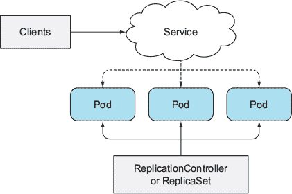

初始时，Pod 运行你的应用程序的第一个版本——假设其镜像被标记为`v1`。然后你开发应用程序的新版本并将其作为新镜像推送到镜像仓库，标记为`v2`。接下来，你希望用这个新版本替换所有 Pod。因为 Pod 创建后不能更改现有 Pod 的镜像，所以你需要删除旧 Pod 并用运行新镜像的新 Pod 替换它们。

你有两种方式来更新所有这些 Pod。你可以执行以下操作之一：

+   首先删除所有现有 Pod，然后启动新的。

+   开始新的，一旦它们启动，就删除旧的。你可以通过一次性添加所有新 Pod 并删除所有旧 Pod，或者通过逐步添加新 Pod 和移除旧 Pod 来实现。

这两种策略都有其优点和缺点。第一种选择会导致你的应用程序在短时间内不可用。第二种选择要求你的应用程序同时运行两个版本的程序。如果你的应用程序在数据存储中存储数据，新版本不应该修改数据模式或以破坏旧版本的方式修改数据。

你如何在 Kubernetes 中执行这两种更新方法？首先，让我们看看如何手动执行；然后，一旦你知道这个过程涉及的内容，你将学习如何让 Kubernetes 自动执行更新。

9.1.1\. 删除旧 Pods 并用新 Pods 替换

你已经知道如何让 ReplicationController 用运行新版本的 Pods 替换所有 Pod 实例。你可能记得 ReplicationController 的 Pod 模板可以在任何时候更新。当 ReplicationController 创建新实例时，它使用更新的 Pod 模板来创建它们。

如果你有一个管理一组`v1` Pods 的 ReplicationController，你可以通过修改 Pod 模板来轻松替换它们，使其引用图像的`v2`版本，然后删除旧的 Pod 实例。ReplicationController 会注意到没有 Pod 匹配其标签选择器，然后它会启动新实例。整个过程如图 9.2 所示。

图 9.2\. 通过更改 ReplicationController 的 Pod 模板和删除旧 Pods 来更新 Pods

如果你可以接受在删除旧 Pods 和新 Pods 启动之间的短暂停机时间，这是更新一组 Pods 的最简单方法。

9.1.2\. 启动新 Pods 然后删除旧 Pods

如果你不想看到任何停机时间，并且你的应用程序支持同时运行多个版本，你可以反转这个过程，首先启动所有新的 Pods，然后才删除旧的 Pods。这将需要更多的硬件资源，因为在一小段时间内，你将有两倍数量的 Pods 同时运行。

与之前的方法相比，这是一种稍微复杂的方法，但你应该能够通过结合到目前为止你学到的关于 ReplicationControllers 和 Services 的知识来完成它。

一次性从旧版本切换到新版本

Pods 通常由 Service 作为前端。在你启动运行新版本的 Pods 时，Service 可以仅作为 Pods 的初始版本的代理。一旦所有新的 Pods 都启动，你可以更改 Service 的标签选择器，让 Service 切换到新的 Pods，如图 9.3 所示。这被称为蓝绿部署。切换后，一旦你确定新版本功能正常，你可以自由地通过删除旧的 ReplicationController 来删除旧 Pods。

注意

你可以使用`kubectl set selector`命令更改 Service 的 Pod 选择器。

图 9.3\. 将 Service 从旧 Pods 切换到新 Pods

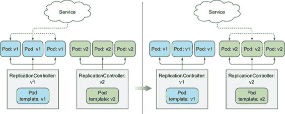

执行滚动更新

除了同时启动所有新 pod 并删除旧 pod 之外，你也可以执行滚动更新，逐步替换 pod。你可以通过逐渐减少上一个 ReplicationController 的规模并增加新的 ReplicationController 的规模来实现这一点。在这种情况下，你希望服务的 pod 选择器包括旧的和新的 pod，以便将请求指向这两组 pod。参见图 9.4。

图 9.4\. 使用两个 ReplicationController 对 pod 执行滚动更新

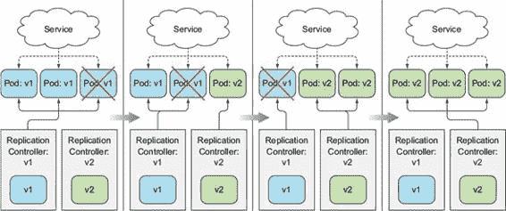

手动执行滚动更新既费时又容易出错。根据副本数量的不同，你可能需要按正确的顺序运行一打或更多的命令来执行更新过程。幸运的是，Kubernetes 允许你使用单个命令执行滚动更新。你将在下一节中学习如何操作。

9.2\. 使用 ReplicationController 执行自动滚动更新

你可以不使用 ReplicationController 手动执行滚动更新，而是让 `kubectl` 来执行。使用 `kubectl` 执行更新使过程变得容易得多，但正如你将在后面看到的，这现在是一种过时的更新应用的方式。尽管如此，我们首先会介绍这个选项，因为它在历史上是执行自动滚动更新的第一种方式，同时也允许我们讨论这个过程而不引入太多额外的概念。

9.2.1\. 运行应用的初始版本

显然，在更新应用之前，你需要有一个应用部署。你将使用你在第二章中创建的稍作修改的 kubia NodeJS 应用作为你的初始版本。如果你不记得它做什么，它是一个简单的 web 应用，在 HTTP 响应中返回 pod 的主机名。

创建 v1 应用

你将修改应用，使其在响应中也返回其版本号，这将允许你区分你即将构建的不同版本。我已经将应用镜像构建并推送到 Docker Hub，名称为 `luksa/kubia:v1`。下面的列表显示了应用的代码。

列表 9.1\. 我们应用的 `v1` 版本：v1/app.js

`const http = require('http'); const os = require('os'); console.log("Kubia 服务器启动..."); var handler = function(request, response) { console.log("收到来自 " + request.connection.remoteAddress + " 的请求"); response.writeHead(200); response.end("这是运行在 pod " + os.hostname() + " 上的 v1\n"); }; var www = http.createServer(handler); www.listen(8080);`

使用单个 YAML 文件运行应用并通过服务公开

要运行你的应用程序，你将创建一个 ReplicationController 和一个 `LoadBalancer` Service，以便你可以从外部访问应用程序。这次，你将创建一个包含这两个资源的单个 YAML 文件，并使用单个 `kubectl create` 命令将其发布到 Kubernetes API。YAML 清单可以包含多个对象，这些对象由包含三个短横线的行分隔，如下所示。

列表 9.2\. 包含 RC 和 Service 的 YAML：kubia-rc-and-service-v1.yaml

`apiVersion: v1 kind: ReplicationController metadata:   name: kubia-v1 spec:   replicas: 3   template:     metadata:       name: kubia       labels:` `1` `app: kubia` `1` `spec:       containers:       - image: luksa/kubia:v1` `2` `name: nodejs ---` `3` `apiVersion: v1 kind: Service metadata:   name: kubia spec:   type: LoadBalancer   selector:` `1` `app: kubia` `1` `ports:   - port: 80     targetPort: 8080`

+   1 该 Service 前端代理了由 ReplicationController 创建的所有 pods。

+   2 你正在为运行此镜像的 pods 创建一个 ReplicationController。

+   3 YAML 文件可以包含多个资源定义，这些定义由包含三个短横线的行分隔。

YAML 定义了一个名为 `kubia-v1` 的 ReplicationController 和一个名为 `kubia` 的 Service。将 YAML 发布到 Kubernetes。过了一会儿，你的三个 `v1` pods 和负载均衡器都应该在运行，这样你就可以查找 Service 的外部 IP 并使用 `curl` 开始访问服务，如下所示。

列表 9.3\. 获取 Service 的外部 IP 并使用 `curl` 在循环中访问服务

`$ kubectl get svc kubia` `NAME      CLUSTER-IP     EXTERNAL-IP       PORT(S)         AGE kubia     10.3.246.195` `130.211.109.222``80:32143/TCP    5m` `$ while true; do curl http://130.211.109.222; done` `这是在 pod kubia-v1-qr192 中运行的 v1` `这是在 pod kubia-v1-kbtsk 中运行的 v1` `这是在 pod kubia-v1-qr192 中运行的 v1` `这是在 pod kubia-v1-2321o 中运行的 v1` ...

注意

如果你使用 Minikube 或任何不支持负载均衡器服务的其他 Kubernetes 集群，你可以使用 Service 的节点端口来访问应用程序。这已在第五章中解释。

9.2.2\. 使用 kubectl 执行滚动更新

接下来，你将创建应用程序的第二个版本。为了保持简单，你只需更改响应内容为“这是 v2”：

`  response.end("This is v2 running in pod " + os.hostname() + "\n");`

这个新版本在 Docker Hub 上的镜像 `luksa/kubia:v2` 中可用，因此你不需要自己构建它。

向相同的镜像标签推送更新

修改应用程序并将其更改推送到相同的镜像标签并不是一个好主意，但我们所有人都在开发过程中倾向于这样做。如果你正在修改`latest`标签，那不是问题，但当你使用不同的标签（例如，标签`v1`而不是`latest`）标记镜像时，一旦镜像被工作节点拉取，该镜像将存储在节点上，并且当运行使用相同镜像的新 Pod 时不会再次拉取（至少这是拉取镜像的默认策略）。

这意味着如果你将更改推送到相同的标签，那么对镜像所做的任何更改都不会被选中。如果新的 Pod 被调度到相同的节点，Kubelet 将运行旧版本的镜像。另一方面，尚未运行旧版本的节点将拉取并运行新镜像，因此你可能会同时运行两个不同版本的 Pod。为了确保这种情况不会发生，你需要将容器的`imagePullPolicy`属性设置为`Always`。

你需要意识到默认的`imagePullPolicy`取决于镜像标签。如果容器引用了`latest`标签（无论是显式引用还是根本未指定标签），则`imagePullPolicy`默认为`Always`，但如果容器引用了任何其他标签，则策略默认为`IfNotPresent`。

当使用除`latest`之外的标签时，如果你在未更改标签的情况下更改了镜像，你需要正确设置`imagePullPolicy`。或者更好的做法是，确保你总是将更改推送到一个新标签下的镜像。

保持`curl`循环运行，并打开另一个终端，在那里你可以启动滚动更新。要执行更新，你需要运行`kubectl rolling-update`命令。你需要做的就是告诉它你正在替换哪个 ReplicationController，为新 ReplicationController 提供一个名称，并指定你想要替换原始镜像的新镜像。以下列表显示了执行滚动更新的完整命令。

列表 9.4\. 使用`kubectl`启动 ReplicationController 的滚动更新

`$ kubectl rolling-update kubia-v1 kubia-v2 --image=luksa/kubia:v2` `已创建 kubia-v2 将 kubia-v2 从 0 扩展到 3，将 kubia-v1 从 3 缩减到 0（保持 3 个可用 Pod，不超过 4 个 Pod）...`

由于你正在用运行版本 2 的 kubia 应用程序替换 ReplicationController `kubia-v1`，你希望新的 ReplicationController 被称为`kubia-v2`并使用`luksa/kubia:v2`容器镜像。

当你运行命令时，会立即创建一个新的 ReplicationController，名为`kubia-v2`。此时系统的状态如图 9.5 所示 figure 9.5。

图 9.5\. 滚动更新启动后系统的状态

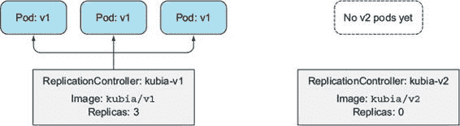

新的 ReplicationController 的 Pod 模板引用了`luksa/kubia:v2`镜像，并且其初始期望副本数设置为 0，如下列所示。

列表 9.5\. 描述滚动更新创建的新 ReplicationController

`$ kubectl describe rc kubia-v2` `名称：       kubia-v2 命名空间：  default 镜像(s)：   luksa/kubia:v2` `1` `选择器：   app=kubia,deployment=757d16a0f02f6a5c387f2b5edb62b155 标签：     app=kubia 副本：   0 当前 / 0 期望` `2` `...`

+   1 新的 ReplicationController 引用 v2 镜像。

+   2 初始时，期望的副本数量为零。

在滚动更新开始之前，理解 kubectl 执行的步骤

`kubectl`通过复制`kubia-v1`控制器并更改其 Pod 模板中的镜像来创建这个 ReplicationController。如果你仔细查看控制器的标签选择器，你会注意到它也被修改了。它不仅包括简单的`app=kubia`标签，还包括一个额外的`deployment`标签，Pod 必须具有这个标签才能由这个 ReplicationController 管理。

你可能已经知道了这一点，但这是必要的，以避免新旧 ReplicationControllers 在相同的 Pod 集上运行。但即使新控制器创建的 Pod 除了`app=kubia`标签外还有额外的`deployment`标签，这并不意味着它们会被第一个 ReplicationController 的选择器选中，因为它设置为`app=kubia`吗？

是的，这正是会发生的事情，但有一个转折。滚动更新过程也修改了第一个 ReplicationController 的选择器：

`$ kubectl describe rc kubia-v1` `名称：       kubia-v1 命名空间：  default 镜像(s)：   luksa/kubia:v1 选择器：   app=kubia,` deployment=3ddd307978b502a5b975ed4045ae4964-orig`

好吧，但这不是意味着第一个控制器现在看到没有 Pod 匹配其选择器，因为之前由它创建的三个 Pod 只包含`app=kubia`标签吗？不，因为`kubectl`在修改 ReplicationController 的选择器之前也修改了活动 Pod 的标签：

`$ kubectl get po --show-labels` `名称            就绪  状态   重启次数  年龄  标签 kubia-v1-m33mv  1/1    运行  0         2m   app=kubia,` deployment=3ddd...` `kubia-v1-nmzw9  1/1    运行  0         2m   app=kubia,` deployment=3ddd...` `kubia-v1-cdtey  1/1    运行  0         2m   app=kubia,` deployment=3ddd...`

如果这变得太复杂，请查看图 9.6，它显示了 Pods、它们的标签以及两个 ReplicationControllers，以及它们的 Pod 选择器。

图 9.6\. 滚动更新开始时旧的和新的 ReplicationControllers 以及 Pods 的详细状态

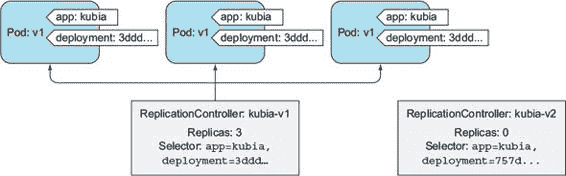

`kubectl`在开始缩放任何东西之前必须完成所有这些。现在想象一下手动进行滚动更新。很容易想象自己在这里犯了一个错误，并且可能让 ReplicationController 杀死了所有的 Pods——这些 Pods 正在积极地为你的生产客户提供服务！

通过缩放两个 ReplicationControllers 来替换旧 Pods

在设置好所有这些之后，`kubectl`首先通过将新控制器扩展到 1 来替换 pods。因此，控制器创建了第一个`v2` pod。然后`kubectl`通过减少 1 来缩减旧的 ReplicationController。这显示在`kubectl`打印的下一行中：

`将 kubia-v2 扩展到 1 将 kubia-v1 缩减到 2`

因为服务正在针对所有带有`app=kubia`标签的 pods，你应该开始看到你的`curl`请求在每几个循环迭代中被重定向到新的`v2` pod：

`这是运行在 pod kubia-v2-nmzw9 中的 v2` `1` `这是运行在 pod kubia-v1-kbtsk 中的 v1` `这是运行在 pod kubia-v1-2321o 中的 v1` `这是运行在 pod kubia-v2-nmzw9 中的 v2` `1` `...`

+   1 击中运行新版本的 pod 的请求

图 9.7 显示了系统的当前状态。

图 9.7\. 在滚动更新期间，服务正在将请求重定向到旧的和新的 pods。

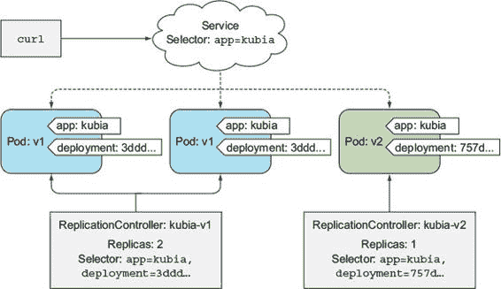

随着`kubectl`继续进行滚动更新，你开始看到越来越多的请求击中`v2` pods，因为更新过程删除了更多的`v1` pods，并用运行你新镜像的 pods 替换它们。最终，原始的 ReplicationController 扩展到零，导致最后一个`v1` pod 被删除，这意味着服务现在只由`v2` pods 支持。在那个时刻，`kubectl`将删除原始的 ReplicationController，更新过程将完成，如下所示。

列表 9.6\. `kubectl rolling-update`执行的最终步骤

`... 将 kubia-v2 扩展到 2 将 kubia-v1 缩减到 1 将 kubia-v2 扩展到 3 将 kubia-v1 缩减到 0 更新成功。删除 kubia-v1 replicationcontroller "kubia-v1"，滚动更新到"kubia-v2"`

现在，你只剩下`kubia-v2` ReplicationController 和三个`v2` pods。在整个更新过程中，你每次都击中了你的服务并得到了响应。实际上，你已经执行了一个零停机时间的滚动更新。

9.2.3\. 理解为什么 kubectl rolling-update 现在已过时

在本节的开头，我提到了一种比通过`kubectl rolling-update`进行更新更好的方法。这个流程有什么问题，以至于需要引入一个更好的流程？

好吧，首先，至少对我来说，我不喜欢 Kubernetes 修改我创建的对象。好吧，调度器在我创建 pods 之后分配节点给我是完全正常的，但 Kubernetes 修改我的 pods 的标签和 ReplicationController 的标签选择器是我没有预料到的，这可能会让我在办公室里对着同事大喊，“谁在捣鼓我的控制器！？！？”

但更重要的是，如果你仔细注意我使用的词语，你可能已经注意到，我一直在明确地说`kubectl`客户端是执行滚动更新所有这些步骤的那个。

你可以通过在触发滚动更新时使用`--v`选项来开启详细日志记录来看到这一点：

`$ kubectl rolling-update kubia-v1 kubia-v2 --image=luksa/kubia:v2 --v 6`

| |
| --- |

提示

使用`--v 6`选项可以将日志级别提高足够，以便让你看到`kubectl`发送给 API 服务器的请求。

| |
| --- |

使用此选项，`kubectl`将打印出它发送给 Kubernetes API 服务器的每个 HTTP 请求。你会看到对 PUT 请求的响应。

`/api/v1/namespaces/default/replicationcontrollers/kubia-v1`

这是表示你的`kubia-v1` ReplicationController 资源的 RESTful URL。这些请求是缩小你的 ReplicationController 的请求，这表明`kubectl`客户端正在执行扩展，而不是由 Kubernetes 主节点执行。

| |
| --- |

提示

在运行其他`kubectl`命令时使用详细日志记录选项，以了解更多关于`kubectl`和 API 服务器之间通信的信息。

| |
| --- |

但为什么客户端执行更新过程而不是在服务器上执行它是一件坏事呢？好吧，在你的情况下，更新过程进行得很顺利，但如果你在`kubectl`执行更新时失去了网络连接怎么办？更新过程会在中途中断。Pod 和 ReplicationController 最终会处于中间状态。

另一个原因是，像这样的更新并不像它本可以做到的那样好，因为它是一种命令式操作。在这本书的整个过程中，我强调了 Kubernetes 是关于你告诉它系统的期望状态，然后由 Kubernetes 自己通过找出最佳方式来实现这一状态。这就是 Pod 的部署和扩展上下文的方式。你永远不会告诉 Kubernetes 添加额外的 Pod 或移除多余的 Pod——你只需更改期望副本的数量即可。

同样，你也会想要更改你的 Pod 定义中期望的镜像标签，并让 Kubernetes 用运行新镜像的新 Pod 替换它们。这正是引入名为 Deployment 的新资源的原因，现在它是 Kubernetes 中部署应用程序的首选方式。

9.3. 使用 Deployment 声明式更新应用

Deployment 是一个高级资源，旨在部署和声明式更新应用程序，而不是通过 ReplicationController 或 ReplicaSet 进行，这两者都被认为是低级概念。

当你创建一个 Deployment 时，会在其下方创建一个 ReplicaSet 资源（最终会有更多）。你可能还记得第四章，ReplicaSets 是 ReplicationControllers 的新一代，应该代替它们使用。ReplicaSet 也会复制和管理 Pod。当使用 Deployment 时，实际的 Pod 是由 Deployment 的 ReplicaSet 创建和管理的，而不是直接由 Deployment 管理（关系如图 9.8 所示）。

图 9.8\. Deployment 由 ReplicaSet 支持，它监督部署的 pod。

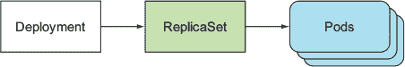

您可能会想知道，为什么要在 ReplicationController 或 ReplicaSet 之上引入另一个对象来使事情复杂化，因为它们已经足够保持一组 pod 实例的运行。正如 第 9.2 节 中的滚动更新示例所证明的，在更新应用程序时，您需要引入一个额外的 ReplicationController 并协调两个控制器，使它们在彼此之间跳舞而不会互相干扰。您需要某种协调这种舞蹈的东西。Deployment 资源负责处理此事（这并不是 Deployment 资源本身，而是在 Kubernetes 控制平面中运行的控制器进程；但我们将在这 第十一章 中讨论这一点）。

使用 Deployment 而不是较低级别的结构可以使更新应用程序变得更加容易，因为您通过单个 Deployment 资源定义所需状态，并让 Kubernetes 处理其余部分，正如您将在接下来的几页中看到的。

9.3.1\. 创建 Deployment

创建 Deployment 与创建 ReplicationController 并无太大区别。Deployment 也由标签选择器、期望副本数和 pod 模板组成。除此之外，它还包含一个字段，该字段指定了部署策略，该策略定义了在修改 Deployment 资源时如何执行更新。

创建 Deployment 清单

让我们看看如何使用本章前面提到的 `kubia-v1` ReplicationController 示例，并对其进行修改，使其描述 Deployment 而不是 ReplicationController。正如您将看到的，这只需要进行三个微小的更改。以下列表显示了修改后的 YAML。

列表 9.7\. 部署定义：kubia-deployment-v1.yaml

`apiVersion: apps/v1beta1` `1` `kind: Deployment` `2` `metadata:` `3` `name: kubia` `4` `spec:` `5` `replicas: 3` `6` `template:` `7` `metadata:` `8` `name: kubia` `9` `labels:` `10` `app: kubia` `11` `spec:` `12` `containers:` `13` `- image: luksa/kubia:v1` `14` `name: nodejs`

+   1 Deployment 位于 apps API 组，版本 v1beta1。

+   2 你已将类型从 ReplicationController 更改为 Deployment。

+   3 在 Deployment 的名称中不需要包含版本号。

注意

你可以在 `extensions/ v1beta1` 中找到 Deployment 资源的老版本，在 `apps/v1beta2` 中找到新版本，它们有不同的必填字段和默认值。请注意，`kubectl explain` 显示的是老版本。

由于之前的 ReplicationController 管理的是特定版本的 pod，所以你将其称为 `kubia-v1`。另一方面，Deployment 不涉及版本问题。在某个特定时间点，Deployment 可以在其下运行多个 pod 版本，因此其名称不应引用应用程序版本。

创建 Deployment 资源

在你创建这个 Deployment 之前，确保删除任何仍在运行的 ReplicationController 和 pod，但暂时保留 `kubia` 服务。你可以使用 `--all` 开关来删除所有这些 ReplicationController，如下所示：

`$ kubectl delete rc --all`

你现在可以创建 Deployment 了：

`$ kubectl create -f kubia-deployment-v1.yaml --record` `deployment "kubia" created`

小贴士

在创建时，务必包含 `--record` 命令行选项。这将记录命令在修订历史中，这在以后会很有用。

显示部署滚动的状态

你可以使用常规的 `kubectl get deployment` 和 `kubectl describe deployment` 命令来查看 Deployment 的详细信息，但让我指向一个额外的命令，这个命令是专门用于检查 Deployment 状态的：

`$ kubectl rollout status deployment kubia` `deployment kubia successfully rolled out`

根据这个信息，Deployment 已经成功部署，你应该看到三个 pod 副本正在运行。让我们看看：

`$ kubectl get po` `NAME                     READY     STATUS    RESTARTS   AGE kubia-1506449474-otnnh   1/1       Running   0          14s kubia-1506449474-vmn7s   1/1       Running   0          14s kubia-1506449474-xis6m   1/1       Running   0          14s`

理解 Deployment 如何创建 ReplicaSet，然后 ReplicaSet 创建 pod

注意这些 pod 的名称。早些时候，当你使用 ReplicationController 创建 pod 时，它们的名称由控制器的名称加上一个随机生成的字符串（例如，`kubia-v1-m33mv`）组成。Deployment 创建的三个 pod 名称中包含一个额外的数字值。这究竟是什么意思？

数字对应于 Deployment 和管理这些 pod 的 ReplicaSet 中的 pod 模板的哈希值。正如我们之前所说的，Deployment 并不直接管理 pod。相反，它创建 ReplicaSet 并将管理任务交给它们，所以让我们看看由你的 Deployment 创建的 ReplicaSet：

`$ kubectl get replicasets` `NAME               DESIRED   CURRENT   AGE kubia-1506449474   3         3         10s`

ReplicaSet 的名称也包含其 pod 模板的哈希值。正如你稍后将会看到的，Deployment 会创建多个 ReplicaSet——每个 pod 模板版本一个。使用 pod 模板的哈希值这样做允许 Deployment 总是使用相同（可能已存在）的 ReplicaSet 来处理特定版本的 pod 模板。

通过服务访问 pod

由于这个 ReplicaSet 创建的三个副本现在正在运行，你可以使用你之前创建的服务来访问它们，因为新 pod 的标签与服务的标签选择器相匹配。

到目前为止，你可能还没有看到足够好的理由说明为什么你应该使用部署（Deployments）而不是副本控制器（ReplicationControllers）。幸运的是，创建部署也没有比创建副本控制器更困难。现在，你将开始使用这个部署，这将清楚地说明为什么部署更优越。这一点将在接下来的几分钟内变得清晰，当你看到如何通过部署资源更新应用程序与通过副本控制器更新应用程序进行比较时。

9.3.2\. 更新部署

在以前，当你使用副本控制器运行应用程序时，你必须明确告诉 Kubernetes 通过运行`kubectl rolling-update`来执行更新。你甚至必须指定应该替换旧副本控制器的新的副本控制器名称。Kubernetes 在过程结束时用新的 Pod 替换了所有原始 Pod，并删除了原始副本控制器。在这个过程中，你基本上必须待在原地，保持终端开启，等待`kubectl`完成滚动更新。

现在比较一下你即将如何更新一个部署。你需要做的唯一一件事是修改部署资源中定义的 Pod 模板，Kubernetes 将执行所有必要的步骤，以将实际系统状态转换为资源中定义的状态。类似于扩展或缩减副本控制器或副本集，你只需要在部署的 Pod 模板中引用一个新的镜像标签，然后让 Kubernetes 转换你的系统，使其与新的期望状态相匹配。

理解可用的部署策略

如何实现这个新状态由部署本身上配置的部署策略所控制。默认策略是执行滚动更新（该策略称为`RollingUpdate`）。另一种策略是`Recreate`策略，它一次性删除所有旧的 Pod，然后创建新的 Pod，类似于修改副本控制器的 Pod 模板然后删除所有 Pod（我们已在第 9.1.1 节中讨论过）。

`Recreate`策略会在创建新 Pod 之前删除所有旧的 Pod。当你的应用程序不支持并行运行多个版本，并且需要在启动新版本之前完全停止旧版本时，请使用此策略。此策略确实涉及一个短暂的时间，此时你的应用程序将完全不可用。

相反，`RollingUpdate`策略会逐个删除旧的 Pod，同时添加新的 Pod，在整个过程中保持应用程序可用，并确保其处理请求的能力不会下降。这是默认策略。可配置的上限和下限是期望副本数量以上或以下的 Pod 数量。你应该只在你的应用程序可以同时运行旧版本和新版本时使用此策略。

为了演示目的减慢滚动更新

在下一个练习中，你将使用 `RollingUpdate` 策略，但你需要稍微减慢更新过程，以便可以看到更新确实是按滚动方式进行的。你可以通过设置 Deployment 上的 `minReadySeconds` 属性来实现这一点。我们将在本章末尾解释这个属性的作用。现在，使用 `kubectl patch` 命令将其设置为 10 秒。

`$ kubectl patch deployment kubia -p '{"spec": {"minReadySeconds": 10}}'` `"kubia" patched`

提示

`kubectl patch` 命令对于修改资源的单个属性或有限数量的属性非常有用，而无需在文本编辑器中编辑其定义。

你使用了 `patch` 命令来更改 Deployment 的规范。这不会引起任何类型的 pod 更新，因为你没有更改 pod 模板。更改其他 Deployment 属性，如期望的副本数或部署策略，也不会触发滚动更新，因为它不会以任何方式影响现有的单个 pod。

触发滚动更新

如果你想要跟踪更新过程，首先在另一个终端中再次运行 `curl` 循环，以查看请求的情况（别忘了将 IP 替换为你的服务的实际外部 IP）：

`$ while true; do curl http://130.211.109.222; done`

要触发实际的滚动更新，你需要将单个 pod 容器中使用的镜像更改为 `luksa/kubia:v2`。你不需要编辑 Deployment 对象的整个 YAML 文件或使用 `patch` 命令来更改镜像，而是使用 `kubectl set image` 命令，该命令允许更改包含容器的任何资源的镜像（ReplicationControllers、ReplicaSets、Deployments 等）。你将使用它来修改你的 Deployment，如下所示：

`$ kubectl set image deployment kubia nodejs=luksa/kubia:v2` `deployment "kubia" image updated`

当你执行此命令时，你正在更新 `kubia` Deployment 的 pod 模板，使其 `nodejs` 容器中使用的镜像更改为 `luksa/kubia:v2`（从 `:v1`）。这如图 9.9 所示。

图 9.9\. 更新部署的 pod 模板以指向新镜像

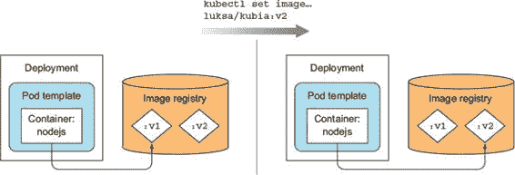

修改 Deployments 和其他资源的方法

在本书的整个过程中，你已经学习了多种修改现有对象的方法。让我们一起列出它们，以刷新你的记忆。

表 9.1\. 在 Kubernetes 中修改现有资源

| 方法 | 它的作用 |
| --- | --- |
| kubectl edit | 在你的默认编辑器中打开对象的规范。在做出更改、保存文件并退出编辑器后，对象将被更新。例如：kubectl edit deployment kubia |
| kubectl patch | 修改对象的单个属性。例如：kubectl patch deployment kubia -p '{"spec": {"template": {"spec": {"containers": [{"name": "nodejs", "image": "luksa/kubia:v2"}]}}}}' |
| kubectl apply | 通过应用完整的 YAML 或 JSON 文件中的属性值来修改对象。如果 YAML/JSON 中指定的对象尚不存在，则将其创建。该文件需要包含资源的完整定义（它不能仅包含你想要更新的字段，正如 kubectl patch 的情况一样）。例如：kubectl apply -f kubia-deployment-v2.yaml |
| kubectl replace | 使用 YAML/JSON 文件中的新对象替换对象。与 apply 命令相比，此命令要求对象存在；否则它将打印错误。例如：kubectl replace -f kubia-deployment-v2.yaml |
| kubectl set image | 更改 Pod、ReplicationController 模板、Deployment、DaemonSet、Job 或 ReplicaSet 中定义的容器镜像。例如：kubectl set image deployment kubia nodejs=luksa/kubia:v2 |

所有这些方法在 Deployments 方面都是等效的。它们所做的就是更改 Deployments 的规范。然后，这种更改会触发滚动过程。

| |
| --- |

如果你已经运行了`curl`循环，你将看到请求最初只击中`v1` pods；然后越来越多的请求击中 v2 pods，直到最后，所有请求都只击中剩余的`v2` pods，在所有`v1` pods 被删除之后。这与`kubectl`执行的滚动更新非常相似。

理解 Deployments 的神奇之处

让我们思考一下发生了什么。通过更改 Deployment 资源中的 Pod 模板，你已经将你的应用程序更新到了一个新版本——只需更改一个字段！

运行在 Kubernetes 控制平面部分的控制器随后执行了更新。这个过程不是由`kubectl`客户端执行的，就像你使用`kubectl rolling-update`时那样。我不知道你，但我觉得这比运行一个特殊的命令告诉 Kubernetes 要做什么然后等待过程完成要简单得多。

| |
| --- |

注意

注意，如果 Deployment 中的 Pod 模板引用了 ConfigMap（或 Secret），则修改 ConfigMap 不会触发更新。当你需要修改应用程序的配置时，触发更新的方法之一是创建一个新的 ConfigMap，并修改 Pod 模板以便它引用新的 ConfigMap。

| |
| --- |

更新期间在 Deployment 表面下发生的事件与`kubectl rolling-update`期间发生的事件类似。创建了一个额外的 ReplicaSet，然后缓慢地将其扩展，同时将之前的 ReplicaSet 扩展到零（初始和最终状态在图 9.10 中显示）。

图 9.10\. 滚动更新开始和结束时 Deployment 的状态

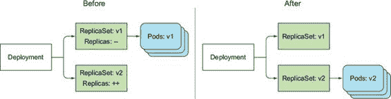

如果你列出它们，你仍然可以看到新 ReplicaSet 旁边旧的 ReplicaSet：

`$ kubectl get rs` `NAME               DESIRED   CURRENT   AGE kubia-1506449474   0         0         24m kubia-1581357123   3         3         23m`

与 ReplicationControllers 类似，你现在所有的新的 pod 都由新的 ReplicaSet 管理。与之前不同，旧的 ReplicaSet 仍然存在，而旧的 Replication-Controller 在滚动更新过程的末尾被删除了。你很快就会看到这个不活跃的 ReplicaSet 的用途。

但是你在这里不应该关心 ReplicaSets，因为你没有直接创建它们。你创建并只操作了 Deployment 资源；底层的 ReplicaSets 是一个实现细节。你会同意，管理单个 Deployment 对象比处理和跟踪多个 ReplicationControllers 要容易得多。

虽然当滚动更新一切顺利时，这种差异可能并不那么明显，但在滚动更新过程中遇到问题时，它就会变得非常明显。现在让我们模拟一个问题。

9.3.3\. 回滚部署

你目前运行的是你的镜像的 `v2` 版本，所以你需要先准备版本 3。

创建你的应用的版本 3

在版本 3 中，你将引入一个错误，使得你的应用只能正确处理前四个请求。从第五个请求开始的请求都将返回内部服务器错误（HTTP 状态码 500）。你将通过在处理函数的开始处添加一个 `if` 语句来模拟这种情况。以下列表显示了新的代码，所有必要的更改都以粗体显示。

列表 9.8\. 我们应用的版本 3（一个有问题的版本）：v3/app.js

`const http = require('http'); const os = require('os');` `var requestCount = 0;` `console.log("Kubia 服务器启动...");  var handler = function(request, response) {   console.log("收到来自 " + request.connection.remoteAddress + " 的请求");` `if (++requestCount >= 5) {``response.writeHead(500);``response.end("发生了一些内部错误！这是 pod " + os.hostname() + "\n");``return;``}` `response.writeHead(200);   response.end("这是 v3 在 pod " + os.hostname() + "\n"); };  var www = http.createServer(handler); www.listen(8080);`

如你所见，在第五次及随后的请求中，代码返回了一个带有消息“发生了一些内部错误...”的 500 错误。

部署版本 3

我已经将 `v3` 版本的镜像作为 `luksa/kubia:v3` 提供。你将通过再次更改 Deployment 规范中的镜像来部署这个新版本：

`$ kubectl set image deployment kubia nodejs=luksa/kubia:v3` `deployment "kubia" image updated`

你可以使用 `kubectl rollout status` 跟踪部署的进度：

`$ kubectl rollout status deployment kubia` `等待滚动更新完成：3 个新副本中有 1 个已更新... 等待滚动更新完成：3 个新副本中有 2 个已更新... 等待滚动更新完成：1 个旧副本正在等待终止... deployment "kubia" 滚动更新成功`

新版本现在已上线。如下列表所示，经过几次请求后，你的网络客户端开始收到错误。

列表 9.9\. 打破你的版本 3

`$ while true; do curl http://130.211.109.222; done` `This is v3 running in pod kubia-1914148340-lalmx This is v3 running in pod kubia-1914148340-bz35w This is v3 running in pod kubia-1914148340-w0voh ... This is v3 running in pod kubia-1914148340-w0voh Some internal error has occurred! This is pod kubia-1914148340-bz35w This is v3 running in pod kubia-1914148340-w0voh Some internal error has occurred! This is pod kubia-1914148340-lalmx This is v3 running in pod kubia-1914148340-w0voh Some internal error has occurred! This is pod kubia-1914148340-lalmx Some internal error has occurred! This is pod kubia-1914148340-bz35w Some internal error has occurred! This is pod kubia-1914148340-w0voh`

回滚部署

您不能让用户遇到内部服务器错误，因此您需要迅速采取措施。在第 9.3.6 节中，您将看到如何自动阻止不良的回滚，但就现在而言，让我们看看您如何手动处理不良的回滚。幸运的是，Deployment 通过告诉 Kubernetes 撤销 Deployment 的最后一次回滚，使得回滚到之前部署的版本变得容易：

`$ kubectl rollout undo deployment kubia` `deployment "kubia" rolled back`

这将 Deployment 回滚到上一个修订版。

小贴士

`undo`命令也可以在回滚过程仍在进行时使用，以实质上中止回滚。在回滚过程中已创建的 Pod 将被移除，并再次替换为旧的 Pod。

显示 Deployment 的回滚历史

由于 Deployments 保留修订历史，因此回滚回滚是可能的。您将在稍后看到，历史记录存储在底层的 ReplicaSets 中。当回滚完成时，旧的 ReplicaSet 不会被删除，这使得您可以回滚到任何修订版，而不仅仅是上一个修订版。可以使用`kubectl rollout history`命令显示修订历史：

`$ kubectl rollout history deployment kubia` `deployments "kubia": REVISION    CHANGE-CAUSE 2           kubectl set image deployment kubia nodejs=luksa/kubia:v2 3           kubectl set image deployment kubia nodejs=luksa/kubia:v3`

记得您在创建 Deployment 时使用的`--record`命令行选项吗？没有它，修订历史中的`CHANGE-CAUSE`列将是空的，这将使得确定每个修订版背后的内容变得更加困难。

回滚到特定的 Deployment 修订版

您可以通过在`undo`命令中指定修订版来回滚到特定的修订版。例如，如果您想回滚到第一个版本，您将执行以下命令：

`$ kubectl rollout undo deployment kubia --to-revision=1`

记得你在第一次修改 Deployment 时留下的那个不活动的 ReplicaSet 吗？ReplicaSet 代表了你的 Deployment 的第一个修订版本。由 Deployment 创建的所有 ReplicaSet 都代表了完整的修订历史，如图 9.11 所示。figure 9.11。每个 ReplicaSet 存储了在该特定修订版本下 Deployment 的完整信息，因此你不应该手动删除它。如果你删除了它，你将失去 Deployment 历史中的那个特定修订版本，这将阻止你回滚到它。

图 9.11\. Deployment 的 ReplicaSet 也充当其修订历史。

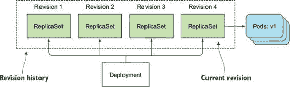

但是，让旧的 ReplicaSet 杂乱地充斥着你的 ReplicaSet 列表并不是理想的做法，因此修订历史的长度由 Deployment 资源上的 `revisionHistoryLimit` 属性限制。默认值为两个，所以通常只有当前和上一个修订版本会显示在历史记录中（并且只保留当前和上一个 ReplicaSet）。旧的 ReplicaSet 将自动被删除。

注意

Deployments 的 `extensions/v1beta1` 版本没有默认的 `revisionHistoryLimit`，而 `apps/v1beta2` 版本的默认值是 10。

9.3.4\. 控制 rollout 的速率

当你执行到 `v3` 版本的 rollout 并使用 `kubectl rollout status` 命令跟踪其进度时，你会看到首先创建了一个新的 pod，当它变得可用时，其中一个旧的 pod 被删除，并创建了一个新的 pod。这个过程一直持续到没有旧的 pod 为止。新 pod 的创建和旧 pod 的删除方式可以通过滚动更新策略的另外两个属性进行配置。

介绍滚动更新策略的 `maxSurge` 和 `maxUnavailable` 属性

两个属性会影响在 Deployment 的滚动更新过程中一次替换多少个 pod。它们是 `maxSurge` 和 `maxUnavailable`，可以作为 Deployment 的 `strategy` 属性的 `rollingUpdate` 子属性的一部分进行设置，如下面的列表所示。

列表 9.10\. 指定 `rollingUpdate` 策略的参数

`spec:   strategy:     rollingUpdate:       maxSurge: 1       maxUnavailable: 0     type: RollingUpdate`

这些属性的作用在 表 9.2 中解释。

表 9.2\. 配置滚动更新速率的属性

| 属性 | 它的作用 |
| --- | --- |
| maxSurge | 确定你允许存在的 pod 实例数量，这些实例的数量超过了在 Deployment 上配置的期望副本数。默认值为 25%，因此 pod 实例的数量最多可以比期望的数量多 25%。如果期望的副本数设置为四个，则在更新过程中运行的所有 pod 实例的数量永远不会超过五个。将百分比转换为绝对数时，数值将向上取整。除了百分比之外，该值也可以是绝对值（例如，可以允许一个或两个额外的 pod）。 |
| maxUnavailable | 确定在更新期间相对于所需副本数量可以不可用的 Pod 实例数量。它也默认为 25%，因此可用的 Pod 实例数量必须始终不低于所需副本数量的 75%。在这里，将百分比转换为绝对数时，数值会向下取整。如果所需的副本数量设置为四个且百分比为 25%，则只能有一个 Pod 不可用。在整个滚动过程中，始终至少有三个 Pod 实例可用于处理请求。与 maxSurge 一样，您也可以指定绝对值而不是百分比。 |

由于您的情况中所需的副本数量是三个，并且这两个属性默认为 25%，`maxSurge`允许所有 Pod 的数量达到四个，而`maxUnavailable`不允许有任何不可用的 Pod（换句话说，必须始终有三个 Pod 可用）。这如图 9.12 所示。#filepos930521。

图 9.12\. 具有三个副本和默认`maxSurge`和`maxUnavailable`的部署滚动更新

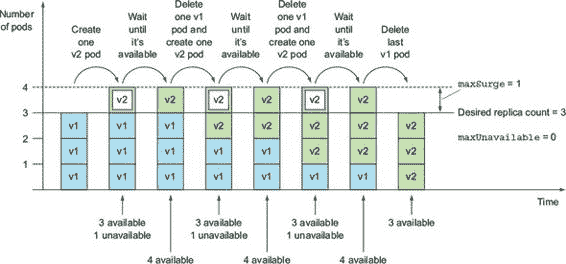

理解 maxUnavailable 属性

Deployments 的`extensions/v1beta1`版本使用不同的默认值——它将`maxSurge`和`maxUnavailable`都设置为`1`而不是`25%`。在三个副本的情况下，`maxSurge`与之前相同，但`maxUnavailable`不同（1 而不是 0）。这使得滚动过程有所不同，如图 9.13 所示。#filepos931452。

图 9.13\. 具有`maxSurge=1`和`maxUnavailable=1`的部署滚动更新

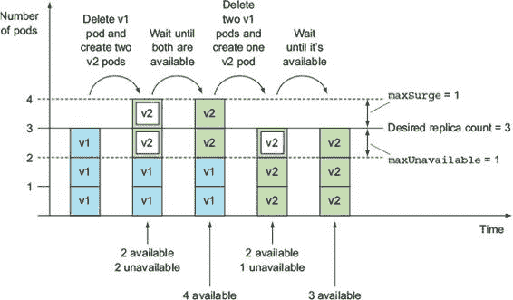

在这种情况下，一个副本可以不可用，因此如果所需的副本数量是三个，则只需要两个副本可用。这就是为什么滚动过程会立即删除一个 Pod 并创建两个新的 Pod。这确保了有两个 Pod 可用，并且 Pod 的最大数量不会超过（在这种情况下最大数量是四个——三个加上`maxSurge`中的一个）。一旦两个新的 Pod 可用，剩余的两个旧 Pod 就会被删除。

这有点难以理解，特别是由于`maxUnavailable`属性会让你认为这是允许的最大不可用 Pod 数量。如果你仔细观察前面的图，你会看到第二列中有两个不可用的 Pod，尽管`maxUnavailable`设置为 1。

需要记住的是，`maxUnavailable`是相对于所需副本数量的。如果副本数量设置为三个且`maxUnavailable`设置为一个，这意味着更新过程必须始终至少保持两个 Pod（3 减去 1）可用，而不可用的 Pod 数量可以超过一个。

9.3.5\. 暂停滚动过程

在你应用版本 3 的糟糕体验之后，想象你已经修复了 bug 并推送了镜像的版本 4。你对以之前的方式将版本 4 滚动发布到所有 Pod 上有些担忧。你希望的是运行一个单独的`v4` Pod，与现有的`v2` Pods 并排运行，并观察它只与所有用户中的一小部分用户交互的表现。然后，一旦你确认一切正常，你可以用新的 Pod 替换所有旧的 Pod。

你可以通过运行一个额外的 Pod，无论是直接运行还是通过额外的 Deployment、ReplicationController 或 ReplicaSet 来实现，但你还有在 Deployment 本身上可用的另一个选项。在滚动发布过程中，Deployment 也可以被暂停。这允许你在继续其他滚动发布之前验证新版本是否一切正常。

暂停滚动发布

我已经准备好了`v4`镜像，所以请继续操作，通过将镜像改为`luksa/kubia:v4`来触发滚动发布，但随后立即（在几秒钟内）暂停滚动发布：

`$ kubectl set image deployment kubia nodejs=luksa/kubia:v4` `deployment "kubia" image updated` `$ kubectl rollout pause deployment kubia` `deployment "kubia" paused`

应该已经创建了一个新的 Pod，但所有原始 Pod 也应该仍然在运行。一旦新的 Pod 启动，所有请求服务的一部分将被重定向到新的 Pod。这样，你实际上已经运行了一个金丝雀发布。金丝雀发布是一种最小化发布不良版本的应用程序风险的技术，它不会影响到所有用户。而不是将新版本滚动发布给所有人，你只替换一个或少数几个旧的 Pod 为新 Pod。这样，最初只有少数用户会接触到新版本。然后你可以验证新版本是否运行正常，然后继续在所有剩余的 Pod 上滚动发布或回滚到上一个版本。

恢复滚动发布

在你的情况下，通过暂停滚动发布过程，只有一小部分客户端请求会击中你的`v4` Pod，而大多数请求仍然会击中`v3` Pods。一旦你确信新版本按预期工作，你可以恢复部署以用新的 Pod 替换所有旧的 Pod：

`$ kubectl rollout resume deployment kubia` `deployment "kubia" resumed`

显然，在滚动发布过程中在某个确切点暂停部署不是你想要的。将来，新的升级策略可能会自动执行此操作，但当前，执行金丝雀发布的正确方式是使用两个不同的 Deployment 并相应地扩展它们。

使用暂停功能来防止滚动发布

暂停部署也可以用来防止对部署的更新启动滚动过程，这样你可以对部署进行多次更改，并在完成所有必要的更改后才开始滚动。

注意

如果一个 Deployment 被暂停，`undo` 命令不会撤销它，直到你恢复 Deployment。

9.3.6\. 阻止坏版本滚动

在你完成这一章之前，我们需要讨论 Deployment 资源的一个更多属性。记得你在 9.3.2 节 开始时设置的 `minReadySeconds` 属性吗？你用它来减慢滚动速度，这样你可以看到它确实是在执行滚动更新，而不是一次性替换所有 pod。`minReadySeconds` 的主要功能是防止部署故障版本，而不是为了好玩而减慢部署。

理解 minReadySeconds 的适用性

`minReadySeconds` 属性指定新创建的 pod 在被视为可用之前应该就绪多长时间。在 pod 可用之前，滚动过程将不会继续（记得 `maxUnavailable` 属性吗？）。当 pod 的所有容器的就绪检查都返回成功时，pod 就处于就绪状态。如果一个新 pod 运行不正常，并且在其就绪检查在 `minReadySeconds` 过去之前开始失败，新版本的滚动将实际上被阻止。

你使用这个属性通过让 Kubernetes 在 pod 就绪后等待 10 秒再继续滚动来减慢你的滚动过程。通常，你会将 `minReadySeconds` 设置得更高，以确保 pod 在开始接收实际流量后继续报告它们处于就绪状态。

虽然你显然应该在将 pod 部署到生产环境之前在测试和预发布环境中对其进行测试，但使用 `minReadySeconds` 就像安全气囊一样，在你已经让有缺陷的版本进入生产后，可以防止你的应用程序造成大混乱。

通过正确配置就绪检查和适当的 `minReadySeconds` 设置，Kubernetes 本可以阻止我们更早地部署有缺陷的 `v3` 版本。让我给你展示一下。

定义就绪检查以防止我们的 v3 版本完全滚动

你将再次部署版本 `v3`，但这次，你将在 pod 上定义适当的就绪检查。你的 Deployment 当前处于版本 `v4`，所以在开始之前，再次回滚到版本 `v2`，这样你可以假装这是你第一次升级到 `v3`。如果你愿意，你可以直接从 `v4` 跳到 `v3`，但接下来的文本假设你首先回到了 `v2`。

与之前不同，之前你只更新了 pod 模板中的图像，现在你还将同时为容器引入就绪性检查。到目前为止，因为没有定义明确的就绪性检查，容器和 pod 始终被认为是就绪的，即使应用程序实际上并没有准备好或者正在返回错误。Kubernetes 无法知道应用程序正在出现故障，不应该暴露给客户端。

要一次性更改图像并引入就绪性检查，你将使用 `kubectl apply` 命令。你将使用以下 YAML 来更新部署（你将把它存储为 `kubia-deployment-v3-with-readinesscheck.yaml`），如下所示。

列表 9.11\. 带有就绪性检查的 Deployment：kubia-deployment-v3-with-readinesscheck.yaml

`apiVersion: apps/v1beta1 kind: Deployment metadata: name: kubia spec: replicas: 3 minReadySeconds: 10` `1` `strategy: rollingUpdate: maxSurge: 1 maxUnavailable: 0` `2` `type: RollingUpdate template: metadata: name: kubia labels: app: kubia spec: containers: - image: luksa/kubia:v3 name: nodejs readinessProbe: periodSeconds: 1` `3` `httpGet:` `4` `path: /` `4` `port: 8080` `4`

+   1 你将保持 minReadySeconds 设置为 10。

+   2 你将保持 maxUnavailable 设置为 0，以便部署逐个替换 pod

+   3 你正在定义一个每秒执行的就绪性检查。

+   4 就绪性检查将对我们的容器执行 HTTP GET 请求。

使用 kubectl apply 更新 Deployment

要更新 Deployment，这次你将使用 `kubectl apply` 如下所示：

`$ kubectl apply -f kubia-deployment-v3-with-readinesscheck.yaml` `部署 "kubia" 已配置`

`apply` 命令更新 Deployment，使其包含 YAML 文件中定义的所有内容。它不仅更新了图像，还添加了就绪性检查定义以及你在 YAML 中添加或修改的任何其他内容。如果新的 YAML 也包含与现有 Deployment 上副本数量不匹配的 `replicas` 字段，apply 操作也会扩展 Deployment，这通常不是你想要的。

小贴士

要在更新 Deployment 时保持期望的副本数量不变，不要在 YAML 中包含 `replicas` 字段。

运行 `apply` 命令将启动更新过程，你可以再次使用 `rollout status` 命令来跟踪：

`$ kubectl rollout status deployment kubia` `等待滚动更新完成：3 个新副本中有 1 个已更新...`

因为状态显示已创建一个新 pod，你的服务应该偶尔会访问它，对吧？让我们看看：

`$ while true; do curl http://130.211.109.222; done` `This is v2 running in pod kubia-1765119474-jvslk This is v2 running in pod kubia-1765119474-jvslk This is v2 running in pod kubia-1765119474-xk5g3 This is v2 running in pod kubia-1765119474-pmb26 This is v2 running in pod kubia-1765119474-pmb26 This is v2 running in pod kubia-1765119474-xk5g3 ...`

没错，你从未触碰到`v3` Pod。为什么没有？它甚至存在吗？列出 Pod：

`$ kubectl get po` `NAME                     READY     STATUS    RESTARTS   AGE kubia-1163142519-7ws0i   0/1       运行中   0          30 秒 kubia-1765119474-jvslk   1/1       运行中   0          9 分钟 kubia-1765119474-pmb26   1/1       运行中   0          9 分钟 kubia-1765119474-xk5g3   1/1       运行中   0          8 分钟`

哎呀！这就是你的问题（或者正如你很快就会学到的那样，你的祝福）！Pod 显示为未就绪，但你是不是一直都在期待这个结果，对吧？发生了什么？

理解就绪检查如何防止不良版本被部署

一旦你的新 Pod 开始运行，就绪检查每秒就会开始被触发（你在 Pod 规范中将检查的间隔设置为 1 秒）。在第五次请求时，就绪检查开始失败，因为你的应用程序从第五次请求开始返回 HTTP 状态码 500。

因此，Pod 被从服务中移除作为端点（见图 9.14）。在你开始通过`curl`循环访问服务之前，Pod 已经被标记为未就绪。这解释了为什么你从未用`curl`触碰到新 Pod。这正是你想要的，因为你不希望客户端触碰到一个未正确运行的 Pod。

图 9.14\. 新 Pod 中因失败的就绪检查而阻止部署

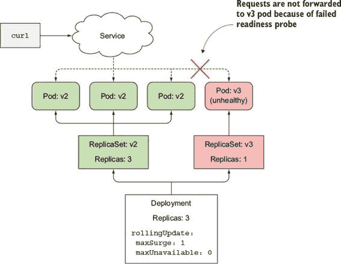

但关于滚动部署过程呢？`rollout status`命令只显示有一个新的副本已启动。幸运的是，滚动部署过程不会继续，因为新的 Pod 永远不会变得可用。要被视为可用，它至少需要就绪 10 秒钟。在它就绪之前，滚动部署过程不会创建任何新的 Pod，也不会移除任何原始 Pod，因为你已经将`maxUnavailable`属性设置为 0。

部署停滞不前是个好事，因为如果它继续用新 Pod 替换旧 Pod，你最终会得到一个完全无法工作的服务，就像你最初推出版本 3 时那样，当时你没有使用就绪检查。但现在，由于就绪检查已经到位，对用户几乎没有负面影响。可能有一些用户遇到了内部服务器错误，但这并不像如果部署替换了所有 Pod 为有缺陷的版本 3 那样成为一个大问题。

小贴士

如果你只定义了就绪探测而没有正确设置 `minReadySeconds`，则新 pod 在就绪探测第一次调用成功时立即被视为可用。如果就绪探测在之后很快开始失败，则不良版本将在所有 pod 上滚动。因此，你应该适当地设置 `minReadySeconds`。

| |
| --- |

为滚动更新配置截止日期

默认情况下，如果在 10 分钟内滚动更新无法取得任何进展，则被视为失败。如果你使用 `kubectl describe` 部署命令，你会看到它显示一个 `ProgressDeadlineExceeded` 条件，如下面的列表所示。

列表 9.12\. 使用 `kubectl describe` 查看部署的条件

`$ kubectl describe deploy kubia` `Name:                   kubia ... Conditions:   Type          Status  Reason    ----          ------  ------    Available     True    MinimumReplicasAvailable    Progressing   False    ProgressDeadlineExceeded` `1`

+   1 部署取得进展的时间过长。

部署被视为失败的时间可以通过部署规范中的 `progressDeadlineSeconds` 属性进行配置。

| |
| --- |

注意

Deployments 的 `extensions/v1beta1` 版本没有设置截止日期。

| |
| --- |

终止不良的滚动更新

由于滚动更新永远不会继续，现在唯一要做的就是通过撤销操作来终止滚动更新：

`$ kubectl rollout undo deployment kubia` `deployment "kubia" rolled back`

| |
| --- |

注意

在未来的版本中，当超过 `progressDeadlineSeconds` 中指定的时间时，滚动更新将自动终止。

| |
| --- |

9.4\. 摘要

本章向您展示了如何通过使用声明性方法在 Kubernetes 中部署和更新应用程序来使您的生活更加轻松。现在您已经阅读了本章，您应该知道如何

+   对由 ReplicationController 管理的 pod 执行滚动更新

+   创建部署而不是较低级别的 ReplicationControllers 或 ReplicaSets

+   通过编辑部署规范中的 pod 模板来更新你的 pod

+   将部署回滚到上一个修订版或回滚到修订历史中列出的任何较早修订版

+   在中途终止部署

+   暂停部署以检查新版本的单个实例在生产中的行为，然后再允许额外的 pod 实例替换旧版本

+   通过 `maxSurge` 和 `maxUnavailable` 属性控制滚动更新的速率

+   使用 `minReadySeconds` 和就绪探测来自动阻止有缺陷版本的滚动

除了这些特定的部署任务外，你还学习了如何

+   使用三个短横线作为分隔符，在单个 YAML 文件中定义多个资源

+   打开 `kubectl` 的详细日志记录功能，以查看它幕后正在做什么

你现在已经知道了如何部署和管理由相同的 pod 模板创建的 pod 集合，并且它们共享相同的持久存储。你甚至知道如何声明式地更新它们。但对于需要每个实例使用自己持久存储的 pod 集合的运行，我们还没有探讨过。这正是我们下一章的主题。
