第十章。StatefulSets：部署复制的有状态应用

本章涵盖

+   部署有状态集群应用

+   为复制的 pod 的每个实例提供单独的存储

+   保证 pod 副本具有稳定的名称和主机名

+   以可预测的顺序启动和停止 pod 副本

+   通过 DNS SRV 记录发现对等节点

你现在知道如何运行单实例和复制的无状态 pod，甚至利用持久存储的状态 pod。你可以运行多个复制的 web-server pod 实例，你也可以运行一个使用持久存储的单一数据库 pod 实例，无论是通过普通的 pod 卷还是通过由 PersistentVolumeClaim 绑定的 Persistent-Volumes。但是，你能使用 ReplicaSet 来复制数据库 pod 吗？

10.1\. 复制有状态 pod

ReplicaSets 从单个 pod 模板创建多个 pod 副本。这些副本之间除了名称和 IP 地址外没有区别。如果 pod 模板包含一个卷，该卷引用特定的 PersistentVolumeClaim，则 ReplicaSet 的所有副本都将使用完全相同的 PersistentVolumeClaim 和因此相同的 PersistentVolume（如图 10.1 所示）。

图 10.1\. 同一个 ReplicaSet 的所有 pod 总是使用相同的 PersistentVolumeClaim 和 PersistentVolume。

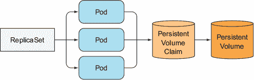

因为引用的声明在 pod 模板中，该模板用于打印多个 pod 副本，所以你不能让每个副本使用它自己的单独的 Persistent-VolumeClaim。你不能使用 ReplicaSet 来运行分布式数据存储，其中每个实例都需要其自己的单独存储——至少不能通过使用单个 ReplicaSet 来实现。说实话，你迄今为止看到的任何 API 对象都无法运行此类数据存储。你需要其他东西。

10.1.1\. 使用每个副本单独存储运行多个副本

如何运行 pod 的多个副本，并让每个 pod 使用其自己的存储卷？ReplicaSets 创建 pod 的精确副本（副本）；因此，你不能使用它们来处理这些类型的 pod。你可以使用什么？

手动创建 pod

你可以手动创建 pod，并让每个 pod 使用它自己的 PersistentVolumeClaim，但由于没有 ReplicaSet 管理它们，你需要手动管理它们，并在它们消失时（例如节点故障事件）重新创建它们。因此，这不是一个可行的选项。

为每个 pod 实例使用一个 ReplicaSet

而不是直接创建 pod，你可以创建多个 ReplicaSets——每个 pod 一个，每个 ReplicaSet 的期望副本数设置为 1，每个 ReplicaSet 的 pod 模板引用一个专用的 PersistentVolumeClaim（如图 10.2 所示）。

图 10.2\. 为每个 pod 实例使用一个 ReplicaSet

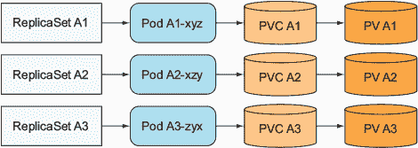

尽管这可以处理节点故障或意外删除 Pod 的情况下的自动重新调度，但与单个 ReplicaSet 相比，操作要繁琐得多。例如，考虑一下在这种情况下如何扩展 Pod。你无法更改期望的副本数量——你将不得不创建额外的 ReplicaSet。

因此，使用多个 ReplicaSet 并不是最佳解决方案。但你是否可以使用单个 ReplicaSet，并且让每个 Pod 实例保持其自己的持久状态，尽管它们都在使用相同的存储卷？

在同一卷中使用多个目录

你可以使用的一个技巧是让所有 Pod 使用相同的 PersistentVolume，然后在卷内为每个 Pod 创建一个单独的文件目录（如图 10.3 所示）。

图 10.3. 通过让每个 Pod 使用不同的文件目录来解决共享存储问题

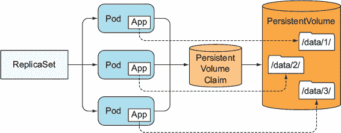

由于你无法将 Pod 副本配置与单个 Pod 模板不同，因此你无法告诉每个实例它应该使用哪个目录，但你可以让每个实例自动选择（并可能创建）一个当时未被任何其他实例使用的数据目录。这种解决方案确实需要实例之间的协调，并且不容易正确执行。这也使得共享存储卷成为瓶颈。

10.1.2. 为每个 Pod 提供稳定的身份

除了存储之外，某些集群应用程序还要求每个实例具有长期稳定的身份。Pod 有时会被杀死并替换为新的 Pod。当 ReplicaSet 替换 Pod 时，新的 Pod 是一个全新的 Pod，具有新的主机名和 IP 地址，尽管其存储卷中的数据可能是被杀死的 Pod 的数据。对于某些应用程序，使用旧实例的数据但具有完全新的网络身份启动可能会引起问题。

为什么某些应用程序强制要求稳定的网络身份？这种要求在分布式有状态应用程序中相当常见。某些应用程序要求管理员在成员的配置文件中列出所有其他集群成员及其 IP 地址（或主机名）。但在 Kubernetes 中，每次 Pod 重新调度时，新的 Pod 都会获得一个新的主机名和新的 IP 地址，因此每次成员重新调度时，整个应用程序集群都需要重新配置。

使用为每个 Pod 实例提供专用服务

解决这个问题的另一个技巧是为集群成员提供一个稳定的网络地址，通过为每个成员创建一个专门的 Kubernetes Service。因为服务 IP 是稳定的，所以你可以在配置中将每个成员指向其服务 IP（而不是 Pod IP）。

这类似于为每个成员创建一个 ReplicaSet 以提供它们各自的存储，如前所述。结合这两种技术，结果就是图 10.4 中所示（还显示了覆盖所有集群成员的额外服务，因为通常你需要一个用于集群客户端）。

图 10.4. 使用每个 Pod 一个 Service 和一个 ReplicaSet 来提供每个 Pod 的稳定网络地址和各自的存储

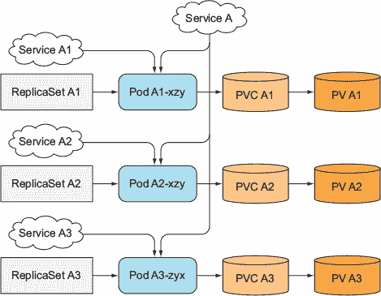

这个解决方案不仅丑陋，而且仍然没有解决所有问题。单个 Pod 无法知道它们通过哪个 Service 暴露（因此无法知道它们的稳定 IP），所以它们无法使用该 IP 在其它 Pod 中进行自我注册。

幸运的是，Kubernetes 帮助我们避免了求助于如此复杂的解决方案。在 Kubernetes 中运行这些特殊类型应用程序的正确、简单方式是通过 StatefulSet。

10.2. 理解 StatefulSet

而不是使用 ReplicaSet 来运行这些类型的 Pod，你创建一个 StatefulSet 资源，该资源专门针对那些必须将应用程序的实例视为不可互换的个体，每个实例都有一个稳定的名称和状态。

10.2.1. 比较 StatefulSet 与 ReplicaSet

要理解 StatefulSet 的目的，最好是将它们与 ReplicaSet 或 ReplicationController 进行比较。但首先让我用这个在领域内广泛使用的类比来解释它们。

使用宠物与牛的类比理解有状态 Pod

你可能已经听说过宠物与牛的类比。如果没有，让我来解释一下。我们可以将我们的应用程序视为宠物或牛。

| |
| --- |

备注

StatefulSet 最初被称为 PetSet。这个名字来源于这里解释的宠物与牛的类比。

| |
| --- |

我们倾向于将应用程序实例视为宠物，为每个实例命名并单独照顾每个实例。但通常将实例视为牛，不对每个个体实例给予特别注意会更好。这使得替换不健康的实例变得容易，无需多加思考，类似于农民替换不健康的牛。

无状态应用程序的实例，例如，表现得非常像牛头。一个实例死亡并不重要——你可以创建一个新的实例，人们不会注意到差异。

另一方面，对于有状态的应用程序，一个应用程序实例更像是一个宠物。当宠物死亡时，你不能去买一个新的，并期望人们不会注意到。要替换丢失的宠物，你需要找到一个看起来和表现完全像旧宠物的新宠物。在应用程序的情况下，这意味着新实例需要与旧实例具有相同的状态和身份。

比较 StatefulSet 与 ReplicaSet 或 ReplicationController

由 ReplicaSet 或 ReplicationController 管理的 Pod 副本就像牛群一样。因为它们大多数是无状态的，所以可以在任何时候用完全新的 Pod 副本替换它们。有状态的 Pod 需要不同的方法。当一个有状态的 Pod 实例死亡（或运行它的节点失败）时，Pod 实例需要在另一个节点上复活，但新的实例需要获得与它所替代的实例相同的名称、网络标识和状态。这就是当 Pod 通过 StatefulSet 管理时发生的情况。

StatefulSet 确保 Pod 以保留其标识和状态的方式进行重新调度。它还允许你轻松地增加或减少宠物的数量。StatefulSet，就像 ReplicaSet 一样，有一个期望的副本计数字段，它决定了你希望在该时间运行多少个宠物。类似于 ReplicaSets，Pod 是从作为 StatefulSet 一部分指定的 Pod 模板创建的（还记得切片机的类比吗？）。但是，与由 ReplicaSet 创建的 Pod 不同，由 StatefulSet 创建的 Pod 不是彼此的精确副本。每个 Pod 都可以有自己的卷集——换句话说，存储（以及持久状态），这使其与其同伴区分开来。宠物 Pod 也有可预测的（和稳定的）标识，而不是每个新的 Pod 实例都获得一个完全随机的标识。

10.2.2. 提供稳定的网络标识

由 StatefulSet 创建的每个 Pod 都被分配一个序号索引（从零开始），然后用于推导 Pod 的名称和主机名，并将稳定的存储附加到 Pod 上。因此，Pod 的名称是可预测的，因为每个 Pod 的名称都是根据 StatefulSet 的名称和实例的序号索引推导出来的。与 Pod 具有随机名称不同，它们被很好地组织起来，如图所示。

图 10.5. 由 StatefulSet 创建的 Pod 具有可预测的名称（和主机名），这与由 ReplicaSet 创建的 Pod 不同

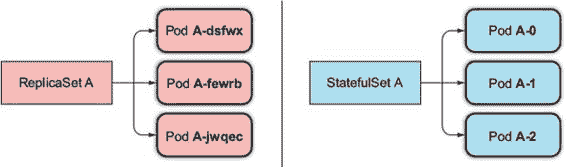

介绍管理服务

但这不仅仅是 Pod 具有可预测的名称和主机名。与常规 Pod 不同，有状态的 Pod 有时需要通过其主机名来寻址，而无状态的 Pod 通常不需要。毕竟，每个无状态 Pod 就像其他任何 Pod 一样。当你需要时，你可以选择任何一个。但是，对于有状态的 Pod，你通常希望对组中的特定 Pod 进行操作，因为它们彼此不同（例如，它们持有不同的状态）。

因此，StatefulSet 需要你创建一个相应的管理无头 Service，该 Service 用于为每个 pod 提供实际的网络身份。通过这个 Service，每个 pod 都会获得自己的 DNS 条目，因此它的对等节点和集群中的其他客户端可以通过主机名来定位 pod。例如，如果管理 Service 属于 `default` 命名空间，并且被命名为 `foo`，其中一个 pod 被命名为 `A-0`，你可以通过其完全限定域名 `a-0.foo.default.svc.cluster.local` 来访问该 pod。你不能用由 ReplicaSet 管理的 pod 做到这一点。

此外，你还可以使用 DNS 通过查找 `foo.default.svc.cluster.local` 域的 SRV 记录来查找所有 StatefulSet 的 pod 名称。我们将在第 10.4 节中解释 SRV 记录，并了解它们是如何用于发现 StatefulSet 的成员的。

替换丢失的宠物

当由 StatefulSet 管理的 pod 实例消失（因为 pod 运行的节点失败，被从节点驱逐，或有人手动删除 pod 对象）时，StatefulSet 确保用新的实例替换它——类似于 ReplicaSet 的做法。但与 ReplicaSet 相比，替换的 pod 将获得与消失的 pod 相同的名称和主机名（ReplicaSet 和 StatefulSet 之间的这种区别在图 10.6 中展示）。

图 10.6\. StatefulSet 用具有相同身份的新 pod 替换丢失的 pod，而 ReplicaSet 则用完全无关的新 pod 替换它。

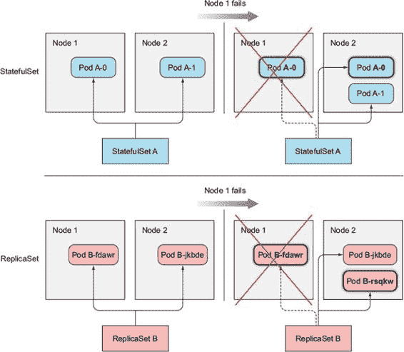

新 pod 不一定会被调度到同一个节点，但正如你早期所学的，pod 运行的节点不应该很重要。这对于有状态的 pod 也是成立的。即使 pod 被调度到不同的节点，它仍然会在之前的主机名下可用和可访问。

扩展 StatefulSet

扩展 StatefulSet 会创建一个新的 pod 实例，并使用下一个未使用的序号索引。如果你从两个实例扩展到三个实例，新实例将获得索引 2（现有的实例显然有索引 0 和 1）。

缩小 StatefulSet 的好处是，你总是知道哪个 pod 将被移除。再次强调，这与缩小 ReplicaSet 相比形成对比，在缩小 ReplicaSet 时，你不知道哪个实例将被删除，甚至无法指定首先删除哪个（但这个功能可能在未来被引入）。缩小 StatefulSet 总是首先删除具有最高序号索引的实例（如图 10.7 所示）。这使得缩小的效果可预测。

图 10.7\. 缩小 StatefulSet 总是首先删除具有最高序号索引的 pod。

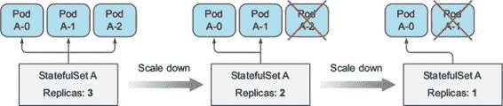

由于某些有状态的应用程序不能很好地处理快速的缩放操作，StatefulSets 一次只缩放一个 Pod 实例。例如，一个分布式数据存储，如果多个节点同时宕机，可能会丢失数据。例如，如果一个复制数据存储被配置为存储每个数据条目的两份副本，在两个节点同时宕机的情况下，如果数据条目正好存储在这两个节点上，那么数据条目就会丢失。如果缩放是顺序的，分布式数据存储就有时间在其他地方创建数据条目的额外副本来替换丢失的（单个）副本。

正因为如此，如果任何实例不健康，StatefulSets 也永远不会允许缩放操作。如果一个实例不健康，同时你减少一个实例，你实际上一次就失去了两个集群成员。

10.2.3. 为每个有状态实例提供稳定的专用存储

你已经看到了 StatefulSets 如何确保有状态的 Pod 拥有稳定的身份，但关于存储呢？每个有状态的 Pod 实例都需要使用自己的存储，而且如果有一个有状态的 Pod 被重新调度（用新的实例替换，但保持与之前相同的身份），新的实例也必须附加相同的存储。StatefulSets 是如何实现这一点的呢？

显然，有状态 Pod 的存储需要是持久的，并且与 Pod 解耦。在第六章章节 6 中，你学习了持久卷和持久卷声明，它们允许通过在 Pod 中按名称引用持久卷声明来将持久存储附加到 Pod。因为持久卷声明与持久卷是一对一映射的，所以 StatefulSet 中的每个 Pod 都需要引用不同的持久卷声明，以便拥有自己的独立持久卷。因为所有 Pod 实例都是从相同的 Pod 模板生成的，它们如何各自引用不同的持久卷声明呢？而且谁会创建这些声明？当然，你不应该期望在 StatefulSet 中预先创建与计划拥有的 Pod 数量一样多的持久卷声明，对吧？

将 Pod 模板与卷声明模板配对

StatefulSet 还必须创建持久卷声明，就像它创建 Pod 一样。因此，StatefulSet 也可以有一个或多个卷声明模板，这使它能够与每个 Pod 实例一起打印出持久卷声明（参见图 10.8）。

图 10.8. StatefulSet 创建 Pod 和持久卷声明。

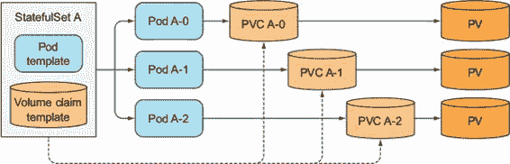

对于持久卷声明，管理员可以提前配置持久卷，或者通过持久卷的动态配置来即时配置，如第六章末所述章节 6。

理解持久卷声明的创建和删除

通过增加一个 StatefulSet 来进行缩放会创建两个或更多的 API 对象（pod 和 pod 引用的一个或多个 PersistentVolumeClaims）。然而，缩放回时，只会删除 pod，而不会删除声明。这个原因很明显，如果你考虑一下删除声明时会发生什么。在删除声明后，与之绑定的 PersistentVolume 会被回收或删除，其内容也会丢失。

因为状态化 pod 是为了运行状态化应用程序，这意味着它们在卷中存储的数据很重要，所以在 Stateful-Set 缩小时删除声明可能是灾难性的——特别是触发缩放只需像减小 StatefulSet 的 `replicas` 字段一样简单。因此，你必须手动删除 PersistentVolumeClaims 来释放底层的 PersistentVolume。

将 PersistentVolumeClaim 重新附加到同一 pod 的新实例

缩放回后 PersistentVolumeClaim 仍然存在，这意味着后续的缩放可以将相同的声明以及与之绑定的 PersistentVolume 和其内容重新附加到新的 pod 实例（如图 10.9 所示 figure 10.9）。如果你意外地缩小了 StatefulSet，你可以通过再次缩放来撤销错误，新的 pod 将再次获得相同的持久状态（以及相同的名称）。

图 10.9\. StatefulSets 在缩放时不会删除 PersistentVolumeClaims；然后在缩放回时重新附加它们。

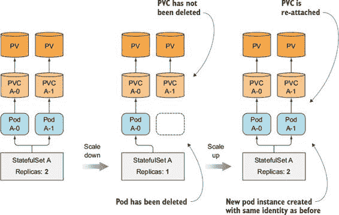

10.2.4\. 理解 StatefulSet 保证

如你所见，StatefulSets 的行为与 ReplicaSets 或 ReplicationControllers 不同。但这并不仅限于 pod 具有稳定的身份和存储。StatefulSets 还对其 pod 有不同的保证。

理解稳定身份和存储的影响

虽然，常规的无状态 pod 是可互换的，但状态化 pod 不是。我们已经看到状态化 pod 总是会被一个相同的 pod 替换（一个具有相同名称和主机名，使用相同的持久存储等）。当 Kubernetes 发现旧 pod 已不再存在时（例如，当你手动删除 pod 时），这种情况就会发生。

但如果 Kubernetes 无法确定 pod 的状态怎么办？如果它创建了一个具有相同身份的替换 pod，系统中可能会运行两个具有相同身份的应用实例。这两个实例也会绑定到相同的存储，因此具有相同身份的两个进程会覆盖相同的文件。由 ReplicaSet 管理的 pod，这并不是一个问题，因为应用显然是为了在相同的文件上工作而设计的。此外，ReplicaSets 会创建具有随机生成身份的 pod，因此两个进程以相同的身份运行是不可能的。

介绍 StatefulSet 的最多一个语义

因此，Kubernetes 必须非常小心，确保两个有状态 Pod 实例永远不会以相同的身份运行，并且绑定到相同的 PersistentVolumeClaim。StatefulSet 必须保证有状态 Pod 实例最多只有一个语义。

这意味着 StatefulSet 必须在创建替换 Pod 之前绝对确定 Pod 已经不再运行。这对处理节点故障有很大影响。我们将在本章后面演示这一点。然而，在我们这样做之前，你需要创建一个 StatefulSet 并观察它的行为。你还将在这个过程中了解它们的一些其他特性。

10.3\. 使用 StatefulSet

为了正确展示 StatefulSet 的作用，你将构建自己的小型集群化数据存储。没有什么花哨的——更像是石器时代的数据存储。

10.3.1\. 创建应用和容器镜像

你将使用本书中一直使用的 kubia 应用作为起点。你将扩展它，使其能够存储和检索每个 Pod 实例的单个数据条目。

你的数据存储源代码的重要部分如下所示。

列表 10.1\. 一个简单的有状态应用：kubia-pet-image/app.js

`... const dataFile = "/var/data/kubia.txt"; ... var handler = function(request, response) {   if (request.method == 'POST') {     var file = fs.createWriteStream(dataFile);` `1` `file.on('open', function (fd) {` `1` `request.pipe(file);` `1` `console.log("New data has been received and stored.");` `1` `response.writeHead(200);` `1` `response.end("Data stored on pod " + os.hostname() + "\n");` `1` `});   } else {     var data = fileExists(dataFile)` `2` `? fs.readFileSync(dataFile, 'utf8')` `2` `: "No data posted yet";` `2` `response.writeHead(200);` `2` `response.write("You've hit " + os.hostname() + "\n");` `2` `response.end("Data stored on this pod: " + data + "\n");` `2` `} };  var www = http.createServer(handler); www.listen(8080);`

+   1 在 POST 请求中，将请求体存储到数据文件中。

+   2 在 GET（以及所有其他类型的）请求中，返回你的主机名和数据文件的内容。

当应用收到 POST 请求时，它会将请求体中的数据写入到文件 `/var/data/kubia.txt`。在 GET 请求中，它返回主机名和存储的数据（文件内容）。很简单，对吧？这是你应用的第一个版本。它还没有集群化，但足以让你开始。你将在本章后面扩展应用。

构建容器镜像的 Dockerfile 如下所示，与之前没有变化。

列表 10.2\. 有状态应用的 Dockerfile：kubia-pet-image/Dockerfile

`FROM node:7 ADD app.js /app.js ENTRYPOINT ["node", "app.js"]`

现在开始构建镜像，或者使用我推送到 docker.io/luksa/kubia-pet 的镜像。

10.3.2\. 通过 StatefulSet 部署应用

要部署你的应用，你需要创建两种（或三种）不同类型的对象：

+   用于存储你的数据文件的 PersistentVolumes（只有当集群不支持 PersistentVolumes 的动态供应时，你才需要创建这些卷）。

+   状态集所需的管理服务。

+   状态集本身。

对于每个 Pod 实例，状态集将创建一个 PersistentVolumeClaim，并将其绑定到一个 PersistentVolume。如果你的集群支持动态供应，你不需要手动创建任何 PersistentVolumes（你可以跳过下一节）。如果不支持，你将需要按照下一节所述创建它们。

创建持久卷

你需要三个 PersistentVolumes，因为你将扩展状态集到三个副本。如果你计划将状态集扩展得更多，你必须创建更多的 PersistentVolumes。

如果你使用 Minikube，请在书籍代码存档中的 Chapter06/persistent-volumes-hostpath.yaml 文件中部署定义的 PersistentVolumes。

如果你使用 Google Kubernetes Engine，你首先需要创建实际的 GCE Persistent Disks，如下所示：

`$ gcloud compute disks create --size=1GiB --zone=europe-west1-b pv-a $ gcloud compute disks create --size=1GiB --zone=europe-west1-b pv-b $ gcloud compute disks create --size=1GiB --zone=europe-west1-b pv-c`

| |
| --- |

注意

确保在节点运行的同一区域创建磁盘。

| |
| --- |

然后从 persistent-volumes-gcepd.yaml 文件创建 PersistentVolumes，该文件如下所示。

列表 10.3\. 三个 PersistentVolumes：persistent-volumes-gcepd.yaml

`kind: List` `1` `apiVersion: v1 items: - apiVersion: v1   kind: PersistentVolume` `1` `metadata:     name: pv-a` `2` `spec:     capacity:       storage: 1Mi` `3` `accessModes:       - ReadWriteOnce     persistentVolumeReclaimPolicy: Recycle` `4` `gcePersistentDisk:` `5` `pdName: pv-a` `5` `fsType: nfs4` `5` `- apiVersion: v1   kind: PersistentVolume   metadata:     name: pv-b ...`

+   1 文件描述了一个包含三个持久卷的列表

+   2 持久卷的名称是 pv-a、pv-b 和 pv-c

+   3 每个持久卷的容量是 1 梅吉字节

+   4 当卷被声明释放时，它将被回收以再次使用。

+   5 该卷使用 GCE Persistent Disk 作为底层存储机制。

| |
| --- |

注意

在上一章中，你通过使用三横线分隔来在同一个 YAML 文件中指定多个资源。在这里，你使用了一种不同的方法，通过定义一个`List`对象并将资源作为对象的项目列出。这两种方法都是等效的。

| |
| --- |

此清单创建了名为`pv-a`、`pv-b`和`pv-c`的 PersistentVolumes。它们使用 GCE Persistent Disks 作为底层存储机制，因此它们不适用于不在 Google Kubernetes Engine 或 Google Compute Engine 上运行的集群。如果你在其他地方运行集群，你必须修改 PersistentVolume 定义并使用适当的卷类型，例如 NFS（网络文件系统），或类似类型。

创建管理服务

如前所述，在部署状态集之前，您首先需要创建一个无头服务，该服务将用于为您的有状态 Pod 提供网络标识。以下列表显示了服务清单。

列表 10.4\. 状态集将使用的无头服务：kubia-service-headless.yaml

`apiVersion: v1 kind: Service metadata:   name: kubia` `1` `spec:   clusterIP: None` `2` `selector:` `3` `app: kubia` `3` `ports:   - name: http     port: 80`

+   1 服务的名称

+   2 状态集的主控服务必须是无头服务。

+   3 所有带有 app=kubia 标签的 Pod 都属于此服务。

您将`clusterIP`字段设置为`None`，这使得这是一个无头服务。它将启用 Pod 之间的对等发现（您稍后会需要）。一旦创建服务，您就可以继续创建实际的状态集。

创建状态集清单

现在，您终于可以创建状态集了。以下列表显示了清单。

列表 10.5\. 状态集清单：kubia-statefulset.yaml

`apiVersion: apps/v1beta1 kind: StatefulSet metadata:   name: kubia spec:   serviceName: kubia   replicas: 2   template:     metadata:       labels:` `1` `app: kubia` `1` `spec:       containers:       - name: kubia         image: luksa/kubia-pet         ports:         - name: http           containerPort: 8080         volumeMounts:         - name: data` `2` `mountPath: /var/data` `2` `volumeClaimTemplates:   - metadata:` `3` `name: data` `3` `spec:` `3` `resources:` `3` `requests:` `3` `storage: 1Mi` `3` `accessModes:` `3` `- ReadWriteOnce` `3`

+   1 状态集创建的 Pod 将具有 app=kubia 标签。

+   2 Pod 内部的容器将在此路径上挂载 pvc 卷。

+   3 将从该模板创建持久卷声明。

状态集清单与您迄今为止创建的副本集或部署清单没有太大区别。新的内容是`volumeClaimTemplates`列表。在其中，您定义了一个名为`data`的卷声明模板，该模板将用于为每个 Pod 创建一个持久卷声明。如您从第六章中可能记得的那样，Pod 通过在清单中包含一个`persistentVolumeClaim`卷来引用声明。在前一个 Pod 模板中，您找不到这样的卷。状态集会自动将其添加到 Pod 规范中，并将卷配置为绑定到状态集为特定 Pod 创建的声明。

创建状态集

现在您将创建状态集：

`$ kubectl create -f kubia-statefulset.yaml` `statefulset "kubia" created`

现在，列出您的 Pod：

`$ kubectl get po` `NAME      READY     STATUS              RESTARTS   AGE kubia-0   0/1       ContainerCreating   0          1s`

注意到有什么奇怪的地方吗？还记得副本控制器或副本集是如何同时创建所有 Pod 实例的吗？您的状态集配置为创建两个副本，但它只创建了一个 Pod。

别担心，没有问题。第二个 pod 将在第一个 pod 启动并就绪后创建。StatefulSets 以这种方式运行，因为某些集群状态应用程序对同时启动的两个或多个集群成员的竞争条件敏感，所以在继续启动其他成员之前，先完全启动每个成员更安全。

再次列出 pods 以查看 pod 创建的进度：

`$ kubectl get po` `NAME      READY     STATUS              RESTARTS   AGE kubia-0   1/1       Running             0          8s kubia-1   0/1       ContainerCreating   0          2s`

看看，第一个 pod 现在正在运行，第二个 pod 已经被创建并正在启动。

检查生成的有状态 pod

让我们仔细看看以下列表中第一个 pod 的 spec，以了解 StatefulSet 是如何从 pod 模板和 PersistentVolumeClaim 模板构建 pod 的。

列表 10.6\. 由 StatefulSet 创建的有状态 pod

`$ kubectl get po kubia-0 -o yaml` `apiVersion: v1 kind: Pod metadata:   ... spec:   containers:   - image: luksa/kubia-pet     ...     volumeMounts:     - mountPath: /var/data` `1` `name: data` `1` `- mountPath: /var/run/secrets/kubernetes.io/serviceaccount       name: default-token-r2m41       readOnly: true   ...   volumes:   - name: data` `2` `persistentVolumeClaim:` `2` `claimName: data-kubia-0` `3` `- name: default-token-r2m41     secret:       secretName: default-token-r2m41`

+   1 如清单中指定的卷挂载

+   2 由 StatefulSet 创建的卷

+   3 由这个卷引用的声明

使用 PersistentVolumeClaim 模板创建了 PersistentVolumeClaim 以及 pod 内部的卷，这指的是创建的 PersistentVolumeClaim。

检查生成的 PersistentVolumeClaims

现在列出生成的 PersistentVolumeClaims 以确认它们已被创建：

`$ kubectl get pvc` `NAME           STATUS    VOLUME    CAPACITY   ACCESSMODES   AGE data-kubia-0   Bound     pv-c      0                        37s data-kubia-1   Bound     pv-a      0                        37s`

生成的 PersistentVolumeClaims 的名称由`volumeClaimTemplate`中定义的名称和每个 pod 的名称组成。你可以检查声明的 YAML 以查看它们是否与模板匹配。

10.3.3\. 玩转你的 pods

由于你的数据存储集群的节点现在正在运行，你可以开始探索它。你不能通过你创建的服务与你的 pods 通信，因为它是无头的。你需要直接连接到单个 pods（或者创建一个常规服务，但这不会允许你与特定的 pod 通信）。

你已经看到了直接连接到 pod 的方法：通过在其他 pod 上附加并运行`curl`，通过端口转发，等等。这次，你将尝试另一个选项。你将使用 API 服务器作为 pods 的代理。

通过 API 服务器与 pods 通信

API 服务器的一个有用功能是能够直接代理连接到单个 pod。如果你想对你的 `kubia-0` pod 执行请求，你将访问以下 URL：

`<apiServerHost>:<port>/api/v1/namespaces/default/pods/kubia-0/proxy/<path>`

由于 API 服务器是受保护的，通过 API 服务器向 pods 发送请求是繁琐的（例如，你需要在每个请求中传递授权令牌）。幸运的是，在 第八章 中你学习了如何使用 `kubectl proxy` 来与 API 服务器通信，而无需处理身份验证和 SSL 证书。再次运行代理：

`$ kubectl proxy` `开始服务在 127.0.0.1:8001`

现在，因为你将通过 `kubectl` 代理与 API 服务器通信，所以你会使用 localhost:8001 而不是实际的 API 服务器主机和端口。你将像这样向 `kubia-0` pod 发送请求：

`$ curl localhost:8001/api/v1/namespaces/default/pods/kubia-0/proxy/` `你已访问 kubia-0 存储在此 pod 上的数据：No data posted yet`

响应显示，请求确实已被运行在你的 pod `kubia-0` 中的应用程序接收和处理。

注意

如果你收到一个空响应，请确保你没有在 URL 的末尾遗漏最后一个斜杠字符（或者确保 `curl` 通过使用其 `-L` 选项跟随重定向）。

因为你是通过连接到 `kubectl` 代理的 API 服务器与 pod 通信的，所以请求通过了两个不同的代理（第一个是 `kubectl` 代理，另一个是代理请求到 pod 的 API 服务器）。为了更清晰地了解，请查看 图 10.10。

图 10.10\. 通过 `kubectl` 代理和 API 服务器代理连接到 pod

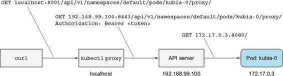

你发送到 pod 的请求是一个 GET 请求，但你也可以通过 API 服务器发送 POST 请求。这是通过向发送 GET 请求的相同代理 URL 发送 POST 请求来完成的。

当你的应用程序收到一个 POST 请求时，它会将请求体中的内容存储到一个本地文件中。向 `kubia-0` pod 发送一个 POST 请求：

`$ curl -X POST -d "Hey there! This greeting was submitted to kubia-0."``localhost:8001/api/v1/namespaces/default/pods/kubia-0/proxy/` `存储在 pod kubia-0 上的数据`

你发送的数据现在应该存储在那个 pod 中。让我们看看当你再次执行 GET 请求时，它是否会返回存储的数据：

`$ curl localhost:8001/api/v1/namespaces/default/pods/kubia-0/proxy/` `你已访问 kubia-0 存储在此 pod 上的数据：Hey there! This greeting was submitted to kubia-0.`

好的，到目前为止一切顺利。现在让我们看看其他集群节点（`kubia-1` pod）会说什么：

`$ curl localhost:8001/api/v1/namespaces/default/pods/kubia-1/proxy/` `你已访问 kubia-1 存储在此 pod 上的数据：No data posted yet`

如预期，每个节点都有自己的状态。但这个状态是否持久化？让我们来查明。

删除有状态的 Pod 以查看重新调度的 Pod 是否连接到相同的存储

你将要删除`kubia-0` Pod 并等待它被重新调度。然后你会看到它是否仍然像之前一样提供相同的数据：

`$ kubectl delete po kubia-0` `pod "kubia-0" deleted`

如果你列出 Pod，你会看到 Pod 正在终止：

`$ kubectl get po` `NAME      READY     STATUS        RESTARTS   AGE kubia-0   1/1       Terminating   0          3m kubia-1   1/1       Running       0          3m`

一旦成功终止，StatefulSet 就会创建一个具有相同名称的新 Pod：

`$ kubectl get po` `NAME      READY     STATUS              RESTARTS   AGE kubia-0   0/1       ContainerCreating   0          6s kubia-1   1/1       Running             0          4m` `$ kubectl get po` `NAME      READY     STATUS    RESTARTS   AGE kubia-0   1/1       Running   0          9s kubia-1   1/1       Running   0          4m`

让我再提醒你一次，这个新 Pod 可能被调度到集群中的任何节点，而不一定是旧 Pod 被调度到的相同节点。旧 Pod 的整个身份（名称、主机名和存储）实际上被移动到了新节点（如图 10.11 所示）。如果你使用 Minikube，你无法看到这一点，因为它只运行一个节点，但在多节点集群中，你可能看到 Pod 被调度到了与之前不同的节点。

图 10.11\. 有状态的 Pod 可能被重新调度到不同的节点，但它保留了名称、主机名和存储。

新 Pod 现在正在运行，让我们检查它是否与其之前的形态具有完全相同的身份。Pod 的名称是相同的，但主机名和持久数据呢？你可以要求 Pod 本身来确认：

`$ curl localhost:8001/api/v1/namespaces/default/pods/kubia-0/proxy/` `You've hit kubia-0 Data stored on this pod: Hey there! This greeting was submitted to kubia-0.`

Pod 的响应显示，主机名和数据与之前相同，这证实了 StatefulSet 总是用实际上完全相同的 Pod 替换被删除的 Pod。

缩放 StatefulSet

缩小 StatefulSet 并在较长时间后将其扩大，应该与删除 Pod 并让 StatefulSet 立即重新创建它没有区别。记住，缩小 StatefulSet 只会删除 Pod，但会保留 PersistentVolumeClaims 不变。我会让你自己尝试缩小 StatefulSet 并确认这种行为。

需要记住的关键点是缩放（缩小和扩大）是逐步进行的——类似于当 StatefulSet 最初创建时创建单个 Pod 的方式。当缩放超过一个实例时，首先删除具有最高序号的 Pod。只有当 Pod 完全终止后，才会删除具有第二高序号的 Pod。

通过常规的非无头 Service 暴露有状态的 Pod

在您继续本章的最后部分之前，您将在 Pod 前面添加一个适当的、非无头服务，因为客户端通常通过服务而不是直接连接来连接到 Pod。

您现在知道如何创建服务，但以防万一您不知道，以下列表显示了清单。

列表 10.7\. 用于访问有状态 Pod 的常规服务：kubia-service-public.yaml

`apiVersion: v1 kind: Service metadata:   name: kubia-public spec:   selector:     app: kubia   ports:   - port: 80     targetPort: 8080`

因为这不是一个公开暴露的服务（它是一个常规的`ClusterIP`服务，而不是`NodePort`或`LoadBalancer`类型的服务），您只能从集群内部访问它。您需要一个 Pod 来访问它，对吗？不一定。

通过 API 服务器连接到集群内部服务

与使用背负式舱室从集群内部访问服务相比，您可以使用 API 服务器提供的相同代理功能以您访问单个 Pod 的方式访问服务。

代理请求到服务的 URI 路径如下所示：

`/api/v1/namespaces/<namespace>/services/<service name>/proxy/<path>`

因此，您可以在本地机器上运行`curl`并通过`kubectl`代理访问服务，如下所示（您之前已运行`kubectl proxy`，并且它应该仍在运行）：

`$ curl localhost:8001/api/v1/namespaces/default/services/kubia-``public/proxy/` `您已访问 kubia-1 数据存储在此 Pod 上：尚未发布数据`

同样，客户端（在集群内部）可以使用`kubia-public`服务将数据存储到您的集群数据存储中，并从中读取数据。当然，每个请求都落在随机集群节点上，因此您每次都会从随机节点获取数据。您将在下一部分改进这一点。

10.4\. 在 StatefulSet 中发现同伴

我们还需要讨论一个更重要的事情。集群应用程序的一个重要要求是节点发现——找到集群中其他成员的能力。StatefulSet 的每个成员都需要轻松地找到所有其他成员。当然，它可以通过与 API 服务器通信来实现这一点，但 Kubernetes 的目标之一是提供帮助保持应用程序完全 Kubernetes 无关的特性。因此，应用程序与 Kubernetes API 通信是不希望的。

Pod 如何在不与 API 通信的情况下发现其同伴？是否存在一种现有、众所周知的您可以使用的技术来实现这一点？域名系统（DNS）怎么样？根据您对 DNS 了解的程度，您可能理解 A、CNAME 或 MX 记录的用途。其他不太为人所知的 DNS 记录类型也存在。其中之一是 SRV 记录。

介绍 SRV 记录

SRV 记录用于指向提供特定服务的服务器的主机名和端口号。Kubernetes 创建 SRV 记录以指向无头服务后端的 Pod 的主机名。

你将通过在新的临时 Pod 中运行 `dig` DNS 查询工具来列出你的有状态 Pod 的 SRV 记录。这是你将使用的命令：

`$ kubectl run -it srvlookup --image=tutum/dnsutils --rm`  `--restart=Never -- dig SRV kubia.default.svc.cluster.local`

该命令运行一个一次性 Pod (`--restart=Never`)，名为 `srvlookup`，它连接到控制台 (`-it`)，并在终止后立即删除 (`--rm`)。该 Pod 运行来自 `tutum/dnsutils` 镜像的单个容器，并执行以下命令：

`dig SRV kubia.default.svc.cluster.local`

以下列表显示了该命令打印的内容。

列表 10.8\. 列出无头服务的 DNS SRV 记录

`... ;; ANSWER SECTION: k.d.s.c.l. 30 IN  SRV     10 33 0 kubia-0.kubia.default.svc.cluster.local. k.d.s.c.l. 30 IN  SRV     10 33 0 kubia-1.kubia.default.svc.cluster.local.  ;; ADDITIONAL SECTION: kubia-0.kubia.default.svc.cluster.local. 30 IN A 172.17.0.4 kubia-1.kubia.default.svc.cluster.local. 30 IN A 172.17.0.6 ...`

| |
| --- |

注意

我不得不缩短实际名称以便将记录放入单行，所以 `kubia.d.s.c.l` 实际上是 `kubia.default.svc.cluster.local`。

| |
| --- |

`ANSWER SECTION` 显示了两个指向支持你的无头服务的 Pod 的 `SRV` 记录。每个 Pod 也都有自己的 `A` 记录，如 `ADDITIONAL SECTION` 所示。

为了让 Pod 获取 StatefulSet 中所有其他 Pod 的列表，你只需要执行一个 SRV DNS 查询。例如，在 Node.js 中，查询是这样执行的：

`dns.resolveSrv("kubia.default.svc.cluster.local", callBackFunction);`

你将在你的应用中使用这个命令来使每个 Pod 能够发现其 peers。

| |
| --- |

注意

返回的 SRV 记录的顺序是随机的，因为它们都具有相同的优先级。不要期望总是看到 `kubia-0` 在 `kubia-1` 之前列出。

| |
| --- |

10.4.1\. 通过 DNS 实现对等发现

你的石器时代数据存储还没有集群化。每个数据存储节点完全独立于所有其他节点运行——它们之间不存在通信。你将在下一部分让它们相互交谈。

通过 `kubia-public` 服务连接到你的数据存储集群的客户发布的数据会落在随机集群节点上。集群可以存储多个数据条目，但客户目前没有很好的方法来查看所有这些条目。因为服务随机转发请求到 Pod，如果客户想要从所有 Pod 获取数据，就需要执行许多请求，直到它击中所有 Pod。

你可以通过让节点响应来自所有集群节点的数据来改进这一点。为此，节点需要找到所有它的 peers。你将使用你关于 StatefulSets 和 SRV 记录的知识来完成这个任务。

你将按照以下列表修改你的应用程序的源代码（完整的源代码可在本书的代码存档中找到；列表只显示了重要的部分）。

列表 10.9\. 在示例应用中查找 peers：kubia-pet-peers-image/app.js

`... const dns = require('dns');  const dataFile = "/var/data/kubia.txt"; const serviceName = "kubia.default.svc.cluster.local"; const port = 8080; ...  var handler = function(request, response) {   if (request.method == 'POST') {     ...   } else {     response.writeHead(200);     if (request.url == '/data') {       var data = fileExists(dataFile)         ? fs.readFileSync(dataFile, 'utf8')         : "No data posted yet";       response.end(data);     } else {       response.write("您已访问 " + os.hostname() + "\n");       response.write("存储在集群中的数据：\n");       dns.resolveSrv(serviceName, function (err, addresses) {` `1` `if (err) {           response.end("无法查找 DNS SRV 记录： " + err);           return;         }         var numResponses = 0;         if (addresses.length == 0) {           response.end("未发现对等节点.");         } else {           addresses.forEach(function (item) {` `2` `var requestOptions = {               host: item.name,               port: port,               path: '/data'             };             httpGet(requestOptions, function (returnedData) {` `2` `numResponses++;               response.write("- " + item.name + ": " + returnedData);               response.write("\n");               if (numResponses == addresses.length) {                 response.end();               }             });           });         }       });     }   } }; ...`

+   1 应用执行 DNS 查询以获取 SRV 记录。

+   2 然后，会联系由 SRV 记录指向的每个 pod 以获取其数据。

图 10.12 展示了当你的应用收到一个 GET 请求时会发生什么。接收请求的服务器首先查找无头 `kubia` 服务的 SRV 记录，然后向服务后端的每个 pod 发送 GET 请求（甚至包括它自己，显然这是不必要的，但我希望保持代码尽可能简单）。然后，它返回所有节点及其上存储的数据列表。

图 10.12\. 你简单分布式数据存储的操作

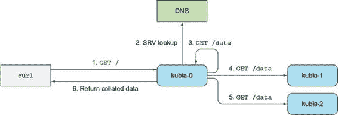

包含此应用新版本的容器镜像可在 docker.io/ luksa/kubia-pet-peers 上找到。

10.4.2\. 更新 StatefulSet

你的 StatefulSet 已经在运行，让我们看看如何更新其 pod 模板，以便 pod 使用新的镜像。同时，你也会将副本数设置为 3。要更新 StatefulSet，请使用 `kubectl edit` 命令（`patch` 命令也是另一种选择）：

`$ kubectl edit statefulset kubia`

这将在你的默认编辑器中打开 StatefulSet 定义。在定义中，将`spec.replicas`更改为`3`，并修改`spec.template.spec.containers.image`属性，使其指向新的镜像（`luksa/kubia-pet-peers`而不是`luksa/kubia-pet`）。保存文件并退出编辑器以更新 StatefulSet。之前有运行了两个副本，所以你现在应该看到一个新的副本`kubia-2`正在启动。列出 pod 以确认：

`$ kubectl get po` `名称      就绪     状态              重启次数   年龄 kubia-0   1/1       运行             0          25m kubia-1   1/1       运行             0          26m kubia-2   0/1       容器创建中   0          4s`

新的 pod 实例正在运行新的镜像。但是现有的两个副本呢？从它们的年龄来看，它们似乎没有被更新。这是预期的，因为最初，StatefulSets 更像是 ReplicaSets 而不是 Deployments，所以当模板被修改时，它们不会执行滚动更新。你需要手动删除副本，然后 StatefulSet 将根据新的模板重新启动它们：

`$ kubectl delete po kubia-0 kubia-1` `pod "kubia-0" 已删除 pod "kubia-1" 已删除`

注意

从 Kubernetes 版本 1.7 开始，StatefulSets 支持与 Deployments 和 DaemonSets 相同的滚动更新。使用`kubectl explain`查看 StatefulSet 的`spec.updateStrategy`字段文档以获取更多信息。

10.4.3\. 尝试你的集群数据存储

两个 pod 启动后，你可以查看你闪亮的新石器时代数据存储是否按预期工作。向集群发送几个请求，如下所示。

列表 10.10\. 通过服务写入集群数据存储

`$ curl -X POST -d "The sun is shining" \``localhost:8001/api/v1/namespaces/default/services/kubia-public/proxy/` `存储在 pod kubia-1 上的数据` `$ curl -X POST -d "The weather is sweet" \``localhost:8001/api/v1/namespaces/default/services/kubia-public/proxy/` `存储在 pod kubia-0 上的数据`

现在，读取存储的数据，如下所示。

列表 10.11\. 从数据存储读取

`$ curl localhost:8001/api/v1/namespaces/default/services``/kubia-public/proxy/` `你已访问 kubia-2 数据存储在每个集群节点上：- kubia-0.kubia.default.svc.cluster.local: The weather is sweet - kubia-1.kubia.default.svc.cluster.local: The sun is shining - kubia-2.kubia.default.svc.cluster.local: 尚未发布数据`

太棒了！当客户端请求到达你的集群节点之一时，它会发现所有对等节点，从它们那里收集数据，并将所有数据发送回客户端。即使你扩展或缩减 StatefulSet，服务客户端请求的 pod 也总能找到当时运行的所有对等节点。

应用本身可能并不那么有用，但我希望你能找到一种有趣的方式来展示复制的有状态应用实例如何发现它们的对等节点，并且可以轻松地处理水平扩展。

10.5\. 理解有状态集如何处理节点故障

在 第 10.2.4 节 中，我们指出 Kubernetes 必须在创建替换 pod 之前绝对确定有状态 pod 已经不再运行。当一个节点突然失败时，Kubernetes 无法知道节点或其 pod 的状态。它无法知道 pod 是否已经不再运行，或者它们是否仍在运行，甚至可能仍然可访问，而且只有 Kubelet 停止向主节点报告节点的状态。

由于有状态集保证不会有两个具有相同身份和存储的 pod 同时运行，当节点看起来已经失败时，有状态集不能也不应该在没有确定 pod 已经不再运行之前创建替换 pod。

它只能知道这一点，当集群管理员告诉它时。为此，管理员需要删除 pod 或删除整个节点（这样做会删除所有调度到该节点的 pod）。

作为本章的最后一个练习，你将查看当集群中的一个节点从网络断开连接时，有状态集及其 pod 会发生什么。

10.5.1\. 模拟节点从网络断开

如 第四章 中所述，你将通过关闭节点的 `eth0` 网络接口来模拟节点从网络断开。由于此示例需要多个节点，你无法在 Minikube 上运行它。你将使用 Google Kubernetes Engine。

关闭节点的网络适配器

要关闭节点的 `eth0` 接口，你需要像这样通过 `ssh` 登录到节点之一：

`$ gcloud compute ssh gke-kubia-default-pool-32a2cac8-m0g1`

然后，在节点内部运行以下命令：

`$ sudo ifconfig eth0 down`

你的 `ssh` 会话将停止工作，因此你需要打开另一个终端以继续。

检查 Kubernetes 主节点看到的节点状态

当节点的网络接口关闭时，运行在节点上的 Kubelet 将无法联系 Kubernetes API 服务器并通知它节点及其所有 pod 仍在运行。

一段时间后，控制平面会将节点标记为 `NotReady`。你可以通过列出节点时看到这一点，如下所示。

列表 10.12\. 观察失败节点的状态变为 `NotReady`

`$ kubectl get node` `NAME                                   STATUS     AGE       VERSION gke-kubia-default-pool-32a2cac8-596v   Ready      16m       v1.6.2 gke-kubia-default-pool-32a2cac8-m0g1` `NotReady``   16m       v1.6.2 gke-kubia-default-pool-32a2cac8-sgl7   Ready      16m       v1.6.2`

由于控制平面不再从节点接收状态更新，该节点上所有 pod 的状态都是 `Unknown`。这在下述 pod 列表中显示。

列表 10.13\. 观察节点变为 `NotReady` 状态后 pod 的状态变化

`$ kubectl get po` `NAME      READY     STATUS    RESTARTS   AGE kubia-0   1/1       Unknown   0          15m kubia-1   1/1       Running   0          14m kubia-2   1/1       Running   0          13m`

如您所见，`kubia-0` Pod 的状态不再已知，因为 Pod（仍然）运行在您关闭了网络接口的节点上。

理解状态未知的 Pod 会发生什么

如果节点重新上线并再次报告其及其 Pod 的状态，Pod 将被再次标记为`Running`。但如果 Pod 的状态未知超过几分钟（这个时间是可以配置的），Pod 将被自动从节点中移除。这是由主节点（Kubernetes 控制平面）完成的。它通过删除 Pod 资源来移除 Pod。

当 Kubelet 看到 Pod 被标记为删除时，它开始终止 Pod。在这种情况下，Kubelet 无法再连接到主节点（因为您已将节点从网络中断开），这意味着 Pod 将继续运行。

让我们检查当前的情况。使用`kubectl describe`来显示`kubia-0` Pod 的详细信息，如下所示。

列表 10.14\. 显示状态未知的 Pod 的详细信息

`$ kubectl describe po kubia-0` `Name:        kubia-0 Namespace:   default Node:        gke-kubia-default-pool-32a2cac8-m0g1/10.132.0.2 ... Status:      Terminating (expires Tue, 23 May 2017 15:06:09 +0200) Reason:      NodeLost Message:     Node gke-kubia-default-pool-32a2cac8-m0g1 which was running pod kubia-0 is unresponsive`

Pod 显示为`Terminating`，终止原因列为`NodeLost`。信息表明节点被认为已丢失，因为它无响应。

注意

这里显示的是控制平面的世界视图。实际上，Pod 的容器仍在正常运行，根本就没有终止。

10.5.2\. 手动删除 Pod

您知道节点不会回来，但您需要所有三个 Pod 运行以正确处理客户端。您需要将`kubia-0` Pod 重新调度到健康的节点。如前所述，您需要手动删除节点或 Pod。

以常规方式删除 Pod

按照您通常删除 Pod 的方式删除 Pod：

`$ kubectl delete po kubia-0` `pod "kubia-0" deleted`

完成了，对吧？通过删除 Pod，StatefulSet 应该立即创建一个替换 Pod，该 Pod 将被调度到剩余的节点之一。再次列出 Pod 以确认：

`$ kubectl get po` `NAME      READY     STATUS    RESTARTS   AGE kubia-0   1/1       Unknown   0          15m kubia-1   1/1       Running   0          14m kubia-2   1/1       Running   0          13m`

这很奇怪。您刚才删除了 Pod，`kubectl`说它已经删除了。为什么同一个 Pod 还在那里？

注意

列表中的 `kubia-0` Pod 并不是一个具有相同名称的新 Pod——通过查看 `AGE` 列可以清楚地看出这一点。如果是新的，它的年龄将仅仅是几秒钟。

理解为什么 Pod 没有被删除

即使你在删除之前，Pod 已经被标记为删除。这是因为控制平面本身已经将其删除（为了将其从节点中驱逐出去）。

如果再次查看列表 10.14，你会看到 Pod 的状态是 `Terminating`。Pod 之前已经被标记为删除，并且一旦其节点上的 Kubelet 通知 API 服务器 Pod 的容器已经终止，它就会被移除。因为节点的网络已断开，所以这种情况永远不会发生。

强制删除 Pod

你唯一能做的就是告诉 API 服务器删除 Pod，而无需等待 Kubelet 确认 Pod 已不再运行。你可以这样做：

`$ kubectl delete po kubia-0 --force --grace-period 0` `警告：立即删除不会等待确认正在运行的资源已被终止。资源可能会在集群中无限期地继续运行。pod "kubia-0" 已删除`

你需要同时使用 `--force` 和 `--grace-period 0` 选项。`kubectl` 显示的警告通知你做了什么。如果你再次列出 Pod，你最终会看到一个新的 `kubia-0` Pod 被创建：

`$ kubectl get po` `NAME          READY     STATUS              RESTARTS   AGE kubia-0       0/1       ContainerCreating   0          8s kubia-1       1/1       Running             0          20m kubia-2       1/1       Running             0          19m`

警告

除非你知道节点不再运行或无法访问（并且将永远如此），否则不要强制删除有状态 Pod。

在继续之前，你可能想将你断开连接的节点重新上线。你可以通过 GCE 网络控制台或通过终端执行以下命令来实现：

`$ gcloud compute instances reset <节点名称>`

10.6. 摘要

这就结束了关于使用 StatefulSets 部署有状态应用程序的章节。本章向你展示了如何

+   为复制的 Pod 提供单独的存储

+   为 Pod 提供稳定的标识

+   创建一个 StatefulSet 和相应的无头管理服务

+   扩展和更新 StatefulSet

+   通过 DNS 发现 StatefulSet 的其他成员

+   通过主机名连接到其他成员

+   强制删除有状态 Pod

现在你已经知道了可以用来让 Kubernetes 运行和管理你的应用程序的主要构建块，我们可以更详细地了解它是如何做到这一点的。在下一章中，你将学习控制 Kubernetes 集群并保持你的应用程序运行的单个组件。
