第十一章\. 理解 Kubernetes 内部机制

本章涵盖

+   构成 Kubernetes 集群的组件

+   每个组件的功能以及它是如何实现的

+   创建 Deployment 对象如何导致运行中的 Pod

+   运行中的 Pod 是什么

+   Pod 之间的网络是如何工作的

+   Kubernetes 服务是如何工作的

+   如何实现高可用性

通过阅读这本书到这一点，你已经熟悉了 Kubernetes 提供的内容以及它所做的工作。但到目前为止，我故意没有花太多时间解释它到底是如何做到这一切的，因为在我看来，在你对系统的工作有良好理解之前，深入探讨系统的工作原理是没有意义的。这就是为什么我们没有详细讨论 Pod 是如何被调度的，以及运行在 Controller Manager 内部的各个控制器是如何使部署的资源变得活跃的。因为你现在已经了解了 Kubernetes 中可以部署的大多数资源，现在是时候深入了解它们的实现方式了。

11.1\. 理解架构

在你查看 Kubernetes 是如何工作的之前，让我们更仔细地看看构成 Kubernetes 集群的组件。在第一章中，你看到 Kubernetes 集群被分为两部分：

+   Kubernetes 控制平面

+   （工作）节点

让我们更仔细地看看这两部分的功能以及它们内部运行的内容。

控制平面的组件

控制平面是控制和使整个集群运行的部分。为了刷新你的记忆，构成控制平面的组件包括

+   etcd 分布式持久化存储

+   API 服务器

+   调度器

+   控制器管理器

这些组件存储和管理集群的状态，但它们不是运行应用程序容器的部分。

工作节点上运行的组件

运行你的容器的任务由每个工作节点上的组件来完成：

+   Kubelet

+   Kubernetes 服务代理（kube-proxy）

+   容器运行时（Docker、rkt 或其他）

附加组件

除了控制平面组件和运行在节点上的组件之外，集群还需要一些附加组件来提供到目前为止所讨论的所有内容。这包括

+   Kubernetes DNS 服务器

+   仪表板

+   入口控制器

+   Heapster，我们将在第十四章中讨论

+   容器网络接口网络插件（我们将在本章后面解释）

11.1.1\. Kubernetes 组件的分布式特性

之前提到的组件都作为独立进程运行。组件及其相互依赖关系在图 11.1 中显示。

图 11.1\. 控制平面和工作节点上的 Kubernetes 组件

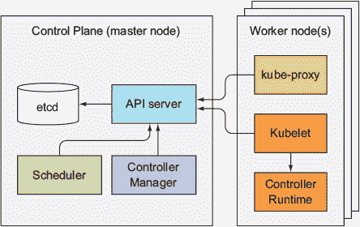

为了获得 Kubernetes 提供的所有功能，所有这些组件都需要运行。但其中一些也可以在没有其他组件的情况下单独执行有用的任务。你将在我们检查每个组件时看到这一点。

检查控制平面组件的状态

API 服务器公开了一个名为 ComponentStatus 的 API 资源，它显示了每个控制平面组件的健康状态。您可以使用`kubectl`列出组件及其状态：

`$ kubectl get componentstatuses` `NAME                 STATUS    MESSAGE              ERROR scheduler            Healthy   ok controller-manager   Healthy   ok etcd-0               Healthy   {"health": "true"}`

这些组件的通信方式

Kubernetes 系统组件仅与 API 服务器通信。它们不会直接相互交谈。API 服务器是唯一与 etcd 通信的组件。其他组件不会直接与 etcd 通信，而是通过与 API 服务器交谈来修改集群状态。

API 服务器与其他组件之间的连接几乎总是由组件发起的，如图 11.1 所示。figure 11.1。但当你使用`kubectl`获取日志、使用`kubectl attach`连接到正在运行的容器或使用`kubectl port-forward`命令时，API 服务器会连接到 Kubelet。

注意

`kubectl attach`命令与`kubectl exec`类似，但它连接到容器中运行的主进程，而不是运行额外的进程。

运行单个组件的多个实例

虽然工作节点上的组件都需要在同一个节点上运行，但控制平面的组件可以轻松地跨多个服务器分割。可以有多个控制平面组件的实例运行，以确保高可用性。虽然 etcd 和 API 服务器的多个实例可以同时激活并并行执行其工作，但调度器和控制器管理器在任何给定时间可能只有一个实例处于活动状态，其他则处于待机模式。

组件的运行方式

控制平面组件以及 kube-proxy 可以直接部署在系统上，或者作为 pods 运行（如图 11.1 所示。listing 11.1）。您可能会对此感到惊讶，但当我们谈到 Kubelet 时，这一切都会变得有意义。

Kubelet 是唯一始终以常规系统组件形式运行的组件，它通过运行其他组件作为 pods 来运行。要将控制平面组件作为 pods 运行，Kubelet 也部署在主节点上。下面的列表显示了使用`kubeadm`创建的集群中`kube-system`命名空间下的 pods，这将在附录 B 中解释。appendix B。

列表 11.1\. Kubernetes 以 pods 形式运行的组件

`$ kubectl get po -o custom-columns=POD:metadata.name,NODE:spec.nodeName``--sort-by spec.nodeName -n kube-system` `POD                              NODE kube-controller-manager-master   master` `1` `kube-dns-2334855451-37d9k        master` `1` `etcd-master                      master` `1` `kube-apiserver-master            master` `1` `kube-scheduler-master            master` `1` `kube-flannel-ds-tgj9k            node1` `2` `kube-proxy-ny3xm                 node1` `2` `kube-flannel-ds-0eek8            node2` `2` `kube-proxy-sp362                 node2` `2` `kube-flannel-ds-r5yf4            node3` `2` `kube-proxy-og9ac                 node3` `2`

+   1 etcd、API 服务器、调度器、控制器管理器和 DNS 服务器都在主节点上运行。

+   2 这三个节点各自运行一个 Kube Proxy pod 和一个 Flannel 网络 pod。

如列表所示，所有控制平面组件都在主节点上作为 pod 运行。有三个工作节点，每个节点运行一个 kube-proxy 和一个 Flannel 网络 pod，为 pod 提供覆盖网络（我们稍后会讨论 Flannel）。

| |
| --- |

提示

如列表所示，您可以使用`-o custom-columns`选项告诉`kubectl`显示自定义列，并使用`--sort-by`对资源列表进行排序。

| |
| --- |

现在，让我们逐一近距离观察每个组件，从控制平面的最低级组件——持久存储开始。

11.1.2\. Kubernetes 如何使用 etcd

在这本书的整个过程中创建的所有对象——Pods、ReplicationControllers、Services、Secrets 等等——都需要以持久的方式存储在某处，以便它们的 manifest 在 API 服务器重启和故障中幸存。为此，Kubernetes 使用 etcd，它是一个快速、分布式且一致性的键值存储。由于它是分布式的，您可以运行多个 etcd 实例，以提供高可用性和更好的性能。

与 etcd 直接通信的唯一组件是 Kubernetes API 服务器。所有其他组件都通过 API 服务器间接读取和写入数据到 etcd。这带来了一些好处，其中包括更健壮的乐观锁系统以及验证；并且，通过将实际的存储机制从所有其他组件中抽象出来，未来替换它要简单得多。值得强调的是，etcd 是 Kubernetes 存储集群状态和元数据的唯一位置。

| |
| --- |

关于乐观并发控制

乐观并发控制（有时称为乐观锁定）是一种方法，在这种方法中，不是锁定数据块并防止在锁定期间读取或更新数据，而是在数据块中包含一个版本号。每次更新数据时，版本号都会增加。在更新数据时，会检查版本号是否在客户端读取数据和提交更新之间增加。如果发生这种情况，更新将被拒绝，客户端必须重新读取新数据并再次尝试更新。

结果是，当两个客户端尝试更新相同的数据条目时，只有第一个客户端会成功。

所有 Kubernetes 资源都包含一个 `metadata.resourceVersion` 字段，客户端在更新对象时需要将其传递回 API 服务器。如果版本与 etcd 中存储的版本不匹配，API 服务器将拒绝更新。

资源在 etcd 中的存储方式

当我写这篇文章时，Kubernetes 可以使用 etcd 的版本 2 或版本 3，但现在推荐使用版本 3，因为其性能得到了提升。etcd v2 在分层键空间中存储键，这使得键值对类似于文件系统中的文件。etcd 中的每个键要么是一个目录，包含其他键，要么是一个具有相应值的常规键。etcd v3 不支持目录，但由于键格式保持不变（键可以包含斜杠），你仍然可以将它们视为分组到目录中。Kubernetes 将其所有数据存储在 `/registry` 下的 etcd 中。以下列表显示了 `/registry` 下存储的键列表。

列表 11.2\. Kubernetes 在 etcd 中存储的顶级条目

`$ etcdctl ls /registry` `/registry/configmaps /registry/daemonsets /registry/deployments /registry/events /registry/namespaces /registry/pods ...`

你会认出这些键对应于你在前几章中学到的资源类型。

注意

如果你使用的是 etcd API 的 v3 版本，你不能使用 `ls` 命令来查看目录的内容。相反，你可以使用 `etcdctl get /registry --prefix=true` 来列出所有以给定前缀开始的键。

以下列表显示了 `/registry/pods` 目录的内容。

列表 11.3\. `/registry/pods` 目录中的键

`$ etcdctl ls /registry/pods` `/registry/pods/default /registry/pods/kube-system`

从名称可以推断，这两个条目对应于 `default` 和 `kube-system` 命名空间，这意味着每个命名空间存储了不同的 pod。以下列表显示了 `/registry/pods/default` 目录中的条目。

列表 11.4\. `default` 命名空间中 pod 的 etcd 条目

`$ etcdctl ls /registry/pods/default` `/registry/pods/default/kubia-159041347-xk0vc /registry/pods/default/kubia-159041347-wt6ga /registry/pods/default/kubia-159041347-hp2o5`

每个条目对应一个单独的 pod。这些不是目录，而是键值条目。以下列表显示了其中一个条目中存储的内容。

列表 11.5\. 代表 Pod 的 etcd 条目

`$ etcdctl get /registry/pods/default/kubia-159041347-wt6ga` `{"kind":"Pod","apiVersion":"v1","metadata":{"name":"kubia-159041347-wt6ga", "generateName":"kubia-159041347-","namespace":"default","selfLink":...`

你会认出这不过是一个 JSON 格式的 Pod 定义。API 服务器将资源的完整 JSON 表示存储在 etcd 中。由于 etcd 的分层键空间，你可以将所有存储的资源视为文件系统中的 JSON 文件。简单，对吧？

| |
| --- |

警告

在 Kubernetes 版本 1.7 之前，`Secret`资源的 JSON 清单也是这样存储的（它没有被加密）。如果有人直接访问了 etcd，他们就能知道你所有的机密信息。从版本 1.7 开始，Secrets 被加密，因此存储得更加安全。

| |
| --- |

确保存储对象的致性和有效性

记得在第一章中提到的 Google 的 Borg 和 Omega 系统吗？它们是 Kubernetes 的基础？就像 Kubernetes 一样，Omega 也使用一个集中存储来保存集群的状态，但与之不同的是，多个控制平面组件直接访问存储。所有这些组件都需要确保它们都遵循相同的乐观锁机制来正确处理冲突。如果一个组件没有完全遵循该机制，可能会导致数据不一致。

Kubernetes 通过要求所有其他控制平面组件通过 API 服务器来改进这一点。这样，集群状态更新总是保持一致，因为乐观锁机制只在单一位置实现，因此错误的可能性更小。API 服务器还确保写入存储的数据始终有效，并且数据的变化只能由授权客户端执行。

当 etcd 集群化时确保一致性

为了确保高可用性，你通常会运行多个 etcd 实例。多个 etcd 实例需要保持一致性。这样的分布式系统需要就实际状态达成共识。etcd 使用 RAFT 共识算法来实现这一点，这确保了在任何给定时刻，每个节点的状态要么是大多数节点同意的当前状态，要么是之前达成共识的状态之一。

连接到 etcd 集群不同节点的客户端将看到实际当前状态或过去的状态之一（在 Kubernetes 中，唯一的 etcd 客户端是 API 服务器，但可能有多个实例）。

一致性算法要求集群拥有多数（或法定多数）才能进步到下一个状态。因此，如果集群分裂成两个不连接的节点组，两组的状态永远不会分歧，因为要从上一个状态过渡到新状态，需要超过一半的节点参与状态变化。如果一个组包含所有节点的多数，另一个组显然不包含。第一个组可以修改集群状态，而另一个组不能。当两个组重新连接时，第二个组可以赶上第一个组的状态（参见图 11.2)。

图 11.2。在脑裂场景中，只有仍然拥有多数（法定多数）的一侧才接受状态变化。

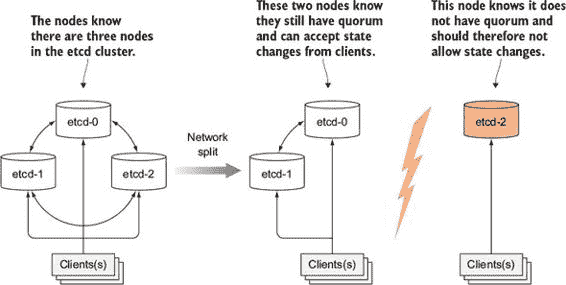

为什么 etcd 实例的数量应该是奇数

etcd 通常以奇数个实例部署。我相信你一定想知道为什么。让我们比较有两个实例和有一个实例的情况。有两个实例需要两个实例都存在才能拥有多数。如果其中任何一个失败，由于没有多数存在，etcd 集群无法过渡到新状态。有两个实例比只有一个实例更糟糕。通过有两个实例，整个集群失败的可能性比单节点集群失败的可能性增加了 100%。

当比较三个实例和四个实例时，情况也相同。有三个实例时，一个实例可以失败，而多数（两个）仍然存在。有四个实例时，需要三个节点才能拥有多数（两个不够）。在三个和四个实例的集群中，只有一个实例可能失败。但运行四个实例时，如果其中一个实例失败，剩余三个实例中另一个实例失败的可能性更高（与一个失败节点和两个剩余节点的三个节点集群相比）。

通常情况下，对于大型集群，五个或七个节点的 etcd 集群就足够了。它可以分别处理两个或三个节点的故障，这在几乎所有情况下都足够了。

11.1.3. API 服务器的作用

Kubernetes API 服务器是所有其他组件以及客户端（如`kubectl`）使用的中心组件。它通过 RESTful API 提供了一个 CRUD（创建、读取、更新、删除）接口，用于查询和修改集群状态。它将这种状态存储在 etcd 中。

除了在 etcd 中提供一致的方式存储对象外，它还执行这些对象的验证，因此客户端不能存储配置不当的对象（如果它们直接写入存储，它们可以这样做）。除了验证外，它还处理乐观锁，因此对象的变化在并发更新的情况下永远不会被其他客户端覆盖。

API 服务器的一个客户端是从本书开始就一直在使用的命令行工具`kubectl`。例如，从 JSON 文件创建资源时，`kubectl`通过 HTTP POST 请求将文件内容发送到 API 服务器。图 11.3 显示了 API 服务器在收到请求时内部发生的事情。这将在接下来的几段中详细解释。

图 11.3\. API 服务器的操作

使用认证插件认证客户端

首先，API 服务器需要验证发送请求的客户端。这是通过 API 服务器中配置的一个或多个认证插件完成的。API 服务器依次调用这些插件，直到其中一个确定谁在发送请求。它是通过检查 HTTP 请求来做到这一点的。

根据认证方法，用户可以从客户端证书或 HTTP 头（例如`Authorization`，您在第八章中使用过）中提取出来。插件提取客户端的用户名、用户 ID 以及用户所属的组。然后，这些数据在下一阶段使用，即授权阶段。

使用授权插件授权客户端

除了认证插件外，API 服务器还配置了使用一个或多个授权插件。它们的工作是确定经过认证的用户是否可以在请求的资源上执行请求的操作。例如，在创建 Pod 时，API 服务器依次咨询所有授权插件，以确定用户是否可以在请求的命名空间中创建 Pod。一旦某个插件表示用户可以执行该操作，API 服务器就进入下一阶段。

使用准入控制插件验证和/或修改请求中的资源

如果请求尝试创建、修改或删除资源，请求将通过准入控制。同样，服务器配置了多个准入控制插件。这些插件可以出于不同原因修改资源。它们可能将资源规范中缺失的字段初始化为配置的默认值，甚至覆盖它们。它们甚至可以修改其他相关资源，这些资源不在请求中，并且也可以根据任何原因拒绝请求。资源将通过所有准入控制插件。

| |
| --- |

注意

当请求仅尝试读取数据时，请求不会通过准入控制。

| |
| --- |

准入控制插件的例子包括

+   `AlwaysPullImages`—覆盖 Pod 的`imagePullPolicy`为`Always`，强制每次部署 Pod 时都拉取镜像。

+   `ServiceAccount`—将默认服务账户应用于未明确指定的 Pod。

+   `NamespaceLifecycle`—防止在正在被删除的命名空间以及不存在命名空间中创建 Pod。

+   `ResourceQuota`—确保特定命名空间中的 Pod 只使用分配给该命名空间的 CPU 和内存。我们将在第十四章中了解更多关于这个内容。第十四章。

你可以在 Kubernetes 文档中找到额外的 Admission Control 插件的列表，网址为[`kubernetes.io/docs/admin/admission-controllers/`](https://kubernetes.io/docs/admin/admission-controllers/)。

验证资源并持久存储

在让请求通过所有 Admission Control 插件之后，API 服务器随后验证对象，将其存储在 etcd 中，并向客户端返回响应。

11.1.4\. 理解 API 服务器如何通知客户端资源变化

API 服务器除了我们讨论的内容外，不做任何事情。例如，当你创建 ReplicaSet 资源时，它不会创建 Pod，它也不会管理服务的端点。这是 Controller Manager 中的控制器所做的事情。

但 API 服务器甚至不会告诉这些控制器要做什么。它所做的只是使这些控制器和其他组件能够观察已部署资源的更改。控制平面组件可以请求在资源被创建、修改或删除时被通知。这使得组件能够在集群元数据发生变化时执行所需的任何任务。

客户端通过打开到 API 服务器的 HTTP 连接来监视变化。通过这个连接，客户端将接收对监视对象的修改流。每当一个对象被更新时，服务器会将对象的最新版本发送给所有连接的、正在监视该对象的客户端。图 11.4 展示了客户端如何监视 Pod 的变化，以及当一个 Pod 发生变化时，它是如何存储到 etcd 中，然后传递给当时所有监视该 Pod 的客户端的。

图 11.4\. 当一个对象被更新时，API 服务器将更新后的对象发送给所有感兴趣的监视者。

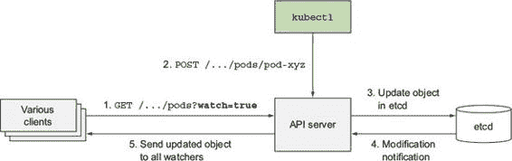

API 服务器的一个客户端是`kubectl`工具，它也支持监视资源。例如，在部署 Pod 时，你不需要通过反复执行`kubectl get pods`来不断轮询 Pod 列表。相反，你可以使用`--watch`标志，并在 Pod 的创建、修改或删除时收到通知，如下面的列表所示。

列表 11.6\. 监视 Pod 的创建和删除

`$ kubectl get pods --watch` `名称                    就绪     状态              重启次数   年龄 kubia-159041347-14j3i   0/1       待定             0          0s kubia-159041347-14j3i   0/1       待定             0          0s kubia-159041347-14j3i   0/1       容器创建中   0          1s kubia-159041347-14j3i   0/1       运行中             0          3s kubia-159041347-14j3i   1/1       运行中             0          5s kubia-159041347-14j3i   1/1       终止中         0          9s kubia-159041347-14j3i   0/1       终止中         0          17s kubia-159041347-14j3i   0/1       终止中         0          17s kubia-159041347-14j3i   0/1       终止中         0          17s`

你甚至可以让 `kubectl` 在每个监视事件上打印出整个 YAML，如下所示：

`$ kubectl get pods -o yaml --watch`

监视机制也被调度器使用，这是你接下来将要了解更多信息的下一个控制平面组件。

11.1.5\. 理解调度器

你已经了解到，通常不指定 pod 应该运行在哪个集群节点上。这由调度器来决定。从远处看，调度器的操作看起来很简单。它所做的只是通过 API 服务器的监视机制等待新创建的 pod，并为每个尚未设置节点的新的 pod 分配一个节点。

调度器不会指示所选节点（或在该节点上运行的 Kubelet）运行 pod。调度器所做的所有事情只是通过 API 服务器更新 pod 定义。然后 API 服务器通知 Kubelet（再次，通过之前描述的监视机制）pod 已被调度。一旦目标节点上的 Kubelet 看到 pod 已被调度到其节点，它就会创建并运行 pod 的容器。

虽然对调度过程的粗略视图看起来很简单，但实际选择最佳节点以供 pod 使用的工作并不简单。当然，最简单的调度器可能会随机选择一个节点，而不关心该节点上已经运行的 pod。在光谱的另一端，调度器可以使用诸如机器学习等高级技术来预测在接下来的几分钟或几小时内将要调度的 pod 类型，并将 pod 调度到最大化未来硬件利用率，而无需重新调度现有的 pod。Kubernetes 的默认调度器介于两者之间。

理解默认调度算法

节点的选择可以分为两个部分，如图 11.5 所示：

+   过滤所有节点列表以获得一个可接受的节点列表，该节点列表可以调度 pod。

+   优先选择可接受的节点并选择最佳节点。如果有多个节点具有最高分数，则使用轮询确保 pod 均匀地部署在所有这些节点上。

图 11.5\. 调度器为 pod 找到可接受的节点，然后选择最佳的节点。

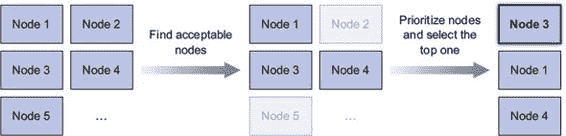

寻找可接受的节点

为了确定哪些节点适合 Pod，调度器将每个节点通过一系列配置的谓词函数。这些检查各种事情，例如

+   节点能否满足 Pod 对硬件资源的需求？你将在第十四章中学习如何指定它们。

+   节点是否资源耗尽（是否报告内存或磁盘压力条件）？

+   如果 Pod 请求被调度到特定的节点（按名称），这是否是这个节点？

+   节点是否有标签与 Pod 规范中的节点选择器匹配（如果已定义）？

+   如果 Pod 请求绑定到特定的主机端口（在第十三章中讨论，index_split_099.html#filepos1232167），这个端口是否已经被这个节点占用？

+   如果 Pod 请求某种类型的卷，这个卷是否可以在这个节点上为这个 Pod 挂载，或者节点上是否已经有其他 Pod 正在使用相同的卷？

+   Pod 是否容忍节点的污点？污点和容忍在第十六章中解释（index_split_118.html#filepos1486732）。

+   Pod 是否指定了节点和/或亲和性或反亲和性规则？如果是，将 Pod 调度到这个节点是否会违反这些规则？这也在第十六章中解释（index_split_118.html#filepos1486732）。

所有这些检查都必须通过，节点才有资格托管 Pod。在每个节点上执行这些检查后，调度器最终会得到一个节点子集。这些节点中的任何一个都可以运行 Pod，因为它们有足够的可用资源来运行 Pod，并且符合你在 Pod 定义中指定的所有要求。

选择最佳的 Pod 节点

尽管所有这些节点都是可接受的并且可以运行 Pod，但其中一些可能比其他节点更好。假设你有一个双节点集群。两个节点都是合格的，但其中一个节点已经运行了 10 个 Pod，而另一个节点，由于某种原因，目前没有运行任何 Pod。在这种情况下，显然调度器应该优先考虑第二个节点。

或者是吗？如果这两个节点由云基础设施提供，那么将 Pod 调度到第一个节点并将第二个节点归还给云服务提供商以节省资金可能更好。

Pod 的高级调度

考虑另一个例子。想象一下有多个 Pod 副本。理想情况下，你希望它们尽可能分散在多个节点上，而不是全部调度到单个节点上。该节点的故障会导致由这些 Pod 支持的服务不可用。但如果 Pod 分散在不同的节点上，单个节点的故障几乎不会对服务的容量造成影响。

默认情况下，属于同一 Service 或 ReplicaSet 的 Pod 会分散在多个节点上。但这并不保证这种情况总是成立。但你可以通过定义 Pod 亲和性和反亲和性规则来强制 Pod 在集群中分散或保持紧密，这些规则在第十六章中解释（index_split_118.html#filepos1486732）。

即使是这两个简单的案例也展示了调度可能有多么复杂，因为它取决于众多因素。因此，调度器可以被配置以适应您的特定需求或基础设施细节，或者甚至可以完全用自定义实现替换。您也可以在没有调度器的情况下运行 Kubernetes 集群，但那样您就必须手动执行调度。

使用多个调度器

您可以在集群中运行多个调度器，而不是运行单个调度器。然后，对于每个 Pod，您通过在 Pod 规范中设置 `schedulerName` 属性来指定应该调度此特定 Pod 的调度器。

没有设置此属性的 Pod 将使用默认调度器进行调度，`schedulerName` 设置为 `default-scheduler` 的 Pod 也同样。所有其他 Pod 都会被默认调度器忽略，因此它们需要手动调度或由另一个监视此类 Pod 的调度器进行调度。

您可以在集群中实现自己的调度器并将它们部署进去，或者您可以部署 Kubernetes 调度器的不同配置选项的额外实例。

11.1.6. 控制器管理器中运行的控制器介绍

如前所述，API 服务器除了在 etcd 中存储资源并通知客户端关于更改之外，不做任何事情。调度器只为 Pod 分配节点，因此您需要其他活跃组件来确保系统的实际状态收敛到 API 服务器通过部署的资源指定的所需状态。这项工作由控制器管理器内部运行的控制器完成。

目前单个控制器管理器进程结合了执行各种协调任务的众多控制器。最终，这些控制器将被拆分为单独的进程，使您能够在必要时用自定义实现替换每个控制器。这些控制器包括

+   复制管理器（ReplicationController 资源的控制器）

+   ReplicaSet、DaemonSet 和作业控制器

+   部署控制器

+   有状态集控制器

+   节点控制器

+   服务控制器

+   端点控制器

+   命名空间控制器

+   持久卷控制器

+   其他

这些控制器各自的功能应该从其名称中显而易见。从列表中，您可以知道几乎为每个可以创建的资源都有一个控制器。资源是对集群中应该运行什么的描述，而控制器是执行实际工作的活跃 Kubernetes 组件，这些工作是由部署的资源触发的。

理解控制器做什么以及它们是如何做的

控制器执行许多不同的事情，但它们都监视 API 服务器以获取资源（部署、服务等）的更改，并对每个更改执行操作，无论是新对象的创建、更新还是现有对象的删除。大多数时候，这些操作包括创建其他资源或更新被监视的资源本身（例如更新对象的`status`）。

通常，控制器运行一个协调循环，该循环将实际状态与期望状态（在资源的`spec`部分指定）进行协调，并将新的实际状态写入资源的`status`部分。控制器使用监视机制来通知更改，但由于使用监视并不能保证控制器不会错过事件，它们还定期执行重新列表操作，以确保没有错过任何内容。

控制器之间从不直接交流。它们甚至不知道其他控制器的存在。每个控制器都连接到 API 服务器，并通过第 11.1.3 节中描述的监视机制，请求在控制器负责的任何类型资源的列表发生变化时通知它。

我们将简要地看看每个控制器都做了什么，但如果你想深入了解它们的功能，我建议你直接查看它们的源代码。侧边栏解释了如何开始。

| |
| --- |

探索控制器源代码的一些提示

如果你感兴趣，想确切地看到这些控制器是如何操作的，我强烈建议你浏览它们的源代码。为了使其更容易，这里有一些提示：

控制器的源代码可在[`github.com/kubernetes/kubernetes/blob/master/pkg/controller`](https://github.com/kubernetes/kubernetes/blob/master/pkg/controller)找到。

每个控制器通常都有一个构造函数，在其中它创建一个`Informer`，这基本上是一个在 API 对象更新时被调用的监听器。通常，Informer 监听特定类型资源的更改。查看构造函数将显示控制器正在监视哪些资源。

接下来，去找`worker()`方法。在其中，你会发现每次控制器需要做某事时都会被调用的方法。实际函数通常存储在一个名为`syncHandler`或类似字段的字段中。这个字段也在构造函数中初始化，所以你会在那里找到被调用的函数的名称。那个函数就是所有魔法发生的地方。

| |
| --- |

复制管理器

使 ReplicationController 资源活跃起来的控制器被称为副本管理器。我们在第四章中讨论了 ReplicationController 的工作方式。真正执行工作的是副本管理器，而不是 ReplicationController。让我们快速回顾一下控制器做了什么，因为这将帮助你理解其他控制器。

在第四章中，我们说 ReplicationController 的操作可以被视为一个无限循环，在每次迭代中，控制器找到匹配其 pod 选择器的 pods 数量，并将这个数量与所需的副本数量进行比较。

现在你已经知道了 API 服务器如何通过 watch 机制通知客户端，那么很明显，控制器并不是在每次迭代中都轮询 pods，而是由 watch 机制通知每个可能影响所需副本数量或匹配 pods 数量的变化（见图 11.6）。任何此类变化都会触发控制器重新检查所需的副本数量与实际副本数量，并相应地采取行动。

图 11.6。副本管理器监视 API 对象的变化。

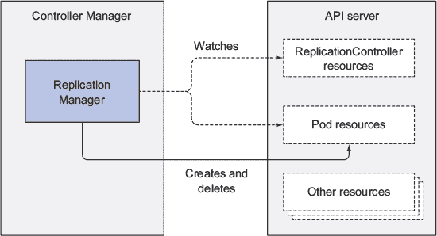

你已经知道，当运行的 pod 实例太少时，Replication-Controller 会运行额外的实例。但实际上它并不运行这些实例。它创建新的 Pod 清单，将它们发布到 API 服务器，并让调度器和 Kubelet 完成它们的任务，即调度和运行 pod。

副本管理器通过 API 服务器操作 Pod API 对象来完成其工作。所有控制器都是这样操作的。

ReplicaSet、DaemonSet 和 Job 控制器

ReplicaSet 控制器几乎与之前描述的副本管理器做相同的事情，所以我们在这里没有太多要补充的。DaemonSet 和 Job 控制器也是类似的。它们从各自资源中定义的 pod 模板创建 Pod 资源。像副本管理器一样，这些控制器不运行 pods，而是将 Pod 定义发布到 API 服务器，让 Kubelet 创建它们的容器并运行它们。

Deployment 控制器

Deployment 控制器负责确保部署的实际状态与在相应的 Deployment API 对象中指定的所需状态保持同步。

每次修改 Deployment 对象时（如果修改应该影响已部署的 pods），Deployment 控制器都会执行新版本的发布。它是通过创建 ReplicaSet，然后根据 Deployment 中指定的策略适当地扩展旧的和新的 ReplicaSet 来实现的，直到所有旧 pods 都被新 pods 替换。它不会直接创建任何 pods。

状态集控制器

状态集控制器，类似于副本集控制器和其他相关控制器，根据状态集资源的规范创建、管理和删除 Pod。但与其他控制器只管理 Pod 不同，状态集控制器还为每个 Pod 实例实例化和管理持久卷声明。

节点控制器

节点控制器管理节点资源，这些资源描述了集群的工作节点。在众多事情中，节点控制器保持节点对象列表与集群中实际运行的机器列表同步。它还监控每个节点的健康状况，并将 Pod 从不可达的节点驱逐出去。

节点控制器并不是唯一对节点对象进行更改的组件。Kubelet 也会更改它们，并且显然也可以通过 REST API 调用由用户修改。

服务控制器

在第五章中，当我们讨论服务时，你了解到存在几种不同类型。其中之一是`LoadBalancer`服务，它从基础设施请求负载均衡器以使服务外部可用。当创建或删除`LoadBalancer`类型的服务时，服务控制器是请求和释放基础设施中的负载均衡器的控制器。

端点控制器

你会记得服务并不是直接链接到 Pod，而是包含一个端点列表（IP 和端口），该列表是手动或根据服务上定义的 Pod 选择器自动创建和更新的。端点控制器是保持端点列表不断更新为匹配标签选择器的 Pod 的 IP 和端口的主动组件。

如图 11.7 所示，控制器监视着服务和 Pod。当服务被添加或更新，或者 Pod 被添加、更新或删除时，它会选择与服务的 Pod 选择器匹配的 Pod，并将它们的 IP 和端口添加到端点资源中。记住，端点对象是一个独立对象，因此控制器在必要时会创建它。同样，当服务被删除时，它也会删除端点对象。

图 11.7\. 端点控制器监视服务和 Pod 资源，并管理端点。

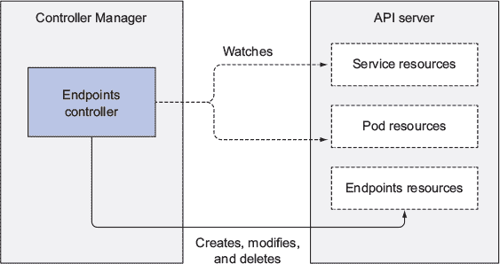

命名空间控制器

记得命名空间（我们在第三章中讨论过）？大多数资源都属于特定的命名空间。当一个命名空间资源被删除时，该命名空间中的所有资源也必须被删除。这就是命名空间控制器所做的事情。当它被通知命名空间对象的删除时，它会通过 API 服务器删除属于该命名空间的所有资源。

持久卷控制器

在第六章中，你学习了关于 PersistentVolumes 和 PersistentVolumeClaims 的内容。一旦用户创建 PersistentVolumeClaim，Kubernetes 必须找到一个合适的 PersistentVolume 并将其绑定到声明。这是由 PersistentVolume 控制器执行的。

当 PersistentVolumeClaim 出现时，控制器通过选择与请求中声明匹配的访问模式且声明容量高于请求容量的最小 PersistentVolume 来找到最佳匹配。它是通过按容量升序保持每个访问模式的 PersistentVolume 有序列表，并从列表中返回第一个卷来实现的。

然后，当用户删除 PersistentVolumeClaim 时，卷将解除绑定并根据卷的回收策略（保持原样、删除或清空）回收。

控制器总结

你现在应该对每个控制器做什么以及控制器通常如何工作有一个很好的感觉。再次强调，所有这些控制器都通过 API 服务器操作 API 对象。它们不会直接与 Kubelets 通信或向它们发出任何类型的指令。实际上，它们甚至不知道 Kubelets 的存在。在控制器更新 API 服务器中的资源后，Kubelets 和 Kubernetes 服务代理（同样对控制器的存在一无所知）执行它们的工作，例如启动 Pod 的容器并将网络存储附加到它们，或者在服务的情况下，在 Pod 之间设置实际的负载均衡。

控制面处理整个系统操作的一部分，因此要完全理解 Kubernetes 集群中事情的发展，还需要了解 Kubelet 和 Kubernetes 服务代理的作用。我们将在下一节学习这一点。

11.1.7\. Kubelet 执行的操作

与所有作为 Kubernetes 控制平面一部分并在主节点（s）上运行的控制器不同，Kubelet 和服务代理都在运行实际 Pod 容器的 worker 节点上运行。Kubelet 究竟做什么？

理解 Kubelet 的工作

简而言之，Kubelet 是负责在 worker 节点上运行一切组件。它的初始任务是创建 API 服务器中的 Node 资源来注册其运行的节点。然后它需要持续监控 API 服务器以查找已调度到节点的 Pod，并启动 Pod 的容器。它是通过告诉配置的容器运行时（Docker、CoreOS 的 rkt 或其他）从特定的容器镜像运行一个容器来实现的。然后 Kubelet 持续监控正在运行的容器并向 API 服务器报告它们的状态、事件和资源消耗。

Kubelet 也是运行容器存活探测的组件，当探测失败时重启容器。最后，当它们的 Pod 从 API 服务器删除时，它会终止容器并通知服务器 Pod 已终止。

在没有 API 服务器的情况下运行静态 pods

虽然 Kubelet 与 Kubernetes API 服务器通信并从那里获取 pod 清单，但它也可以根据特定本地目录中的 pod 清单文件运行 pods，如图 11.8 所示。此功能用于运行控制平面组件的容器化版本作为 pods，正如你在本章开头所见。

图 11.8. Kubelet 根据来自 API 服务器的 pod 规范和本地文件目录运行 pods。

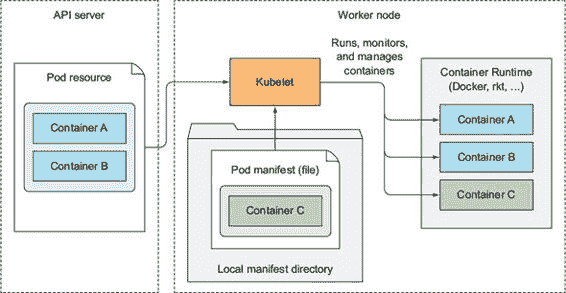

除了以原生方式运行 Kubernetes 系统组件外，您可以将它们的 pod 清单放入 Kubelet 的清单目录中，并让 Kubelet 运行和管理它们。您还可以使用相同的方法运行您自定义的系统容器，但通过 DaemonSet 执行是推荐的方法。

11.1.8. Kubernetes 服务代理的作用

除了 Kubelet 之外，每个工作节点还运行 kube-proxy，其目的是确保客户端可以通过 Kubernetes API 连接到你定义的服务。kube-proxy 确保连接到服务 IP 和端口的连接最终到达支持该服务的某个 pod（或其他非 pod 服务端点）。当一个服务由多个 pod 支持时，代理在这些 pod 之间执行负载均衡。

为什么叫代理

kube-proxy 的初始实现是 `userspace` 代理。它使用实际的服务器进程来接受连接并将它们代理到 pods。为了拦截目的地为服务 IP 的连接，代理配置了 `iptables` 规则（`iptables` 是管理 Linux 内核数据包过滤功能的工具）以将连接重定向到代理服务器。`userspace` 代理模式的粗略图示见 图 11.9。

图 11.9. `userspace` 代理模式

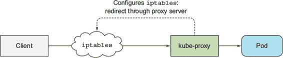

kube-proxy 得名于它实际上是一个代理，但当前的、性能更好的实现仅使用 `iptables` 规则将数据包重定向到随机选择的后端 pod，而不通过实际的代理服务器。这种模式称为 `iptables` 代理模式，如图 11.10 所示。

图 11.10. `iptables` 代理模式

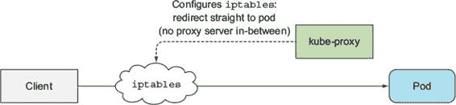

这两种模式之间的主要区别在于数据包是否通过 kube-proxy 并必须在用户空间中处理，或者是否仅由内核（在内核空间）处理。这对性能有重大影响。

另一个较小的区别是，`userspace` 代理模式以真正的轮询方式平衡 pod 之间的连接，而 `iptables` 代理模式则不这样做——它随机选择 pod。当只有少数客户端使用服务时，它们可能不会均匀地分布在 pod 上。例如，如果一个服务有两个后端 pod 但只有大约五个客户端，如果你看到四个客户端连接到 pod A 而只有一个客户端连接到 pod B，请不要感到惊讶。随着客户端或 pod 数量的增加，这个问题就不那么明显了。

你将在第 11.5 节中详细了解 `iptables` 代理模式的工作原理。

11.1.9\. 介绍 Kubernetes 附加组件

我们现在已经讨论了使 Kubernetes 集群工作的核心组件。但在本章的开头，我们也列出了一些附加组件，尽管它们并非总是必需的，但它们启用了诸如 Kubernetes 服务的 DNS 查找、通过单个外部 IP 地址公开多个 HTTP 服务、Kubernetes 网络仪表板等功能。

附加组件的部署方式

这些组件作为附加组件提供，并通过向 API 服务器提交 YAML 清单的方式部署为 pod，正如你在本书中一直所做的那样。其中一些组件通过 Deployment 资源或 ReplicationController 资源部署，而另一些则通过 DaemonSet 部署。

例如，在我撰写本文时，在 Minikube 中，Ingress 控制器和仪表板附加组件作为 ReplicationControllers 部署，如下面的列表所示。

列表 11.7\. 在 Minikube 中与 ReplicationControllers 部署的附加组件

`$ kubectl get rc -n kube-system` `NAME                       DESIRED   CURRENT   READY     AGE default-http-backend       1         1         1         6d kubernetes-dashboard       1         1         1         6d nginx-ingress-controller   1         1         1         6d`

DNS 附加组件作为 Deployment 部署，如下面的列表所示。

列表 11.8\. `kube-dns` Deployment

`$ kubectl get deploy -n kube-system` `NAME       DESIRED   CURRENT   UP-TO-DATE   AVAILABLE   AGE kube-dns   1         1         1            1           6d`

让我们看看 DNS 和 Ingress 控制器是如何工作的。

DNS 服务器的工作原理

默认情况下，集群中的所有 pod 都配置为使用集群的内部 DNS 服务器。这允许 pod 通过名称轻松查找服务，甚至在无头服务的情况下查找 pod 的 IP 地址。

DNS 服务器 Pod 通过`kube-dns`服务暴露，允许 Pod 在集群中移动，就像任何其他 Pod 一样。该服务的 IP 地址被指定为每个容器内部的`/etc/resolv.conf`文件中的`nameserver`。`kube-dns` Pod 使用 API 服务器的监视机制来观察服务和服务端点的变化，并在每次变化时更新其 DNS 记录，使其客户端始终获得（相对）最新的 DNS 信息。我说相对是因为在服务或端点资源更新和 DNS Pod 收到监视通知之间的时间，DNS 记录可能无效。

（大多数）Ingress 控制器是如何工作的

与 DNS 附加组件不同，你会发现有几个不同的 Ingress 控制器实现，但它们大多数以相同的方式工作。Ingress 控制器运行一个反向代理服务器（例如 Nginx），并根据集群中定义的 Ingress、服务和端点资源进行配置。因此，控制器需要观察这些资源（再次，通过监视机制），并在它们中的任何一个发生变化时更改代理服务器的配置。

尽管 Ingress 资源的定义指向服务，但 Ingress 控制器直接将流量转发到服务的 Pod，而不是通过服务 IP。这影响了外部客户端通过 Ingress 控制器连接时客户端 IP 的保留，这使得它们在某些用例中比服务更受欢迎。

使用其他附加组件

你已经看到 DNS 服务器和 Ingress 控制器附加组件与在 Controller Manager 中运行的控制器类似，只是它们也接受客户端连接，而不是仅通过 API 服务器观察和修改资源。

其他附加组件类似。它们都需要观察集群状态，并在状态发生变化时执行必要的操作。我们将在本章和剩余章节中介绍几个其他附加组件。

11.1.10. 将一切整合

现在，你已经了解到整个 Kubernetes 系统由相对较小、松散耦合的组件组成，具有良好的关注点分离。API 服务器、调度器、在 Controller Manager 中运行的各个控制器、Kubelet 和 kube-proxy 共同工作，以保持系统的实际状态与您指定的期望状态同步。

例如，将 Pod 规范提交给 API 服务器会触发各种 Kubernetes 组件的协调舞蹈，最终导致 Pod 的容器运行。你将在下一节中了解这个舞蹈是如何展开的。

11.2. 控制器之间的协作

现在，你已经了解了 Kubernetes 集群由哪些组件组成。现在，为了巩固你对 Kubernetes 工作原理的理解，让我们回顾一下当创建 pod 资源时会发生什么。因为你通常不会直接创建 pod，所以你将创建一个部署资源，并查看启动 pod 容器必须发生的所有操作。

11.2.1\. 理解涉及哪些组件

在你开始整个过程之前，控制器、调度器和 Kubelet 都在监视 API 服务器，以查看它们各自资源类型的更改。这如图 11.11 所示。图中所示的所有组件都将参与你即将触发的过程。该图不包括 etcd，因为它隐藏在 API 服务器后面，你可以将 API 服务器视为对象存储的地方。

图 11.11\. Kubernetes 组件通过 API 服务器监视 API 对象

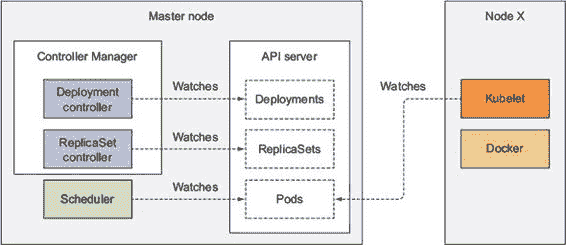

11.2.2\. 事件链

想象你已经准备好了包含部署清单的 YAML 文件，并且你即将通过 `kubectl` 将其提交给 Kubernetes。`kubectl` 会以 HTTP POST 请求的形式将清单发送到 Kubernetes API 服务器。API 服务器验证部署规范，将其存储在 etcd 中，并返回响应给 `kubectl`。现在，一系列事件开始展开，如图 11.12 所示。

图 11.12\. 当部署资源提交到 API 服务器时展开的事件链

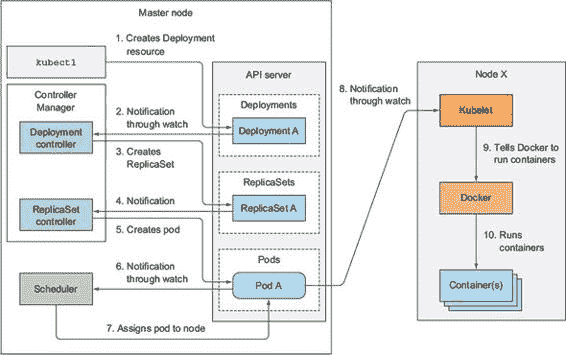

部署控制器创建副本集

所有通过 API 服务器监视部署列表的 API 服务器客户端在部署资源创建后立即收到通知。其中之一是部署控制器，正如我们之前讨论的，它是负责处理部署的活跃组件。

如你从 第九章 记忆的那样，部署背后由一个或多个副本集支持，然后创建实际的 pod。当部署控制器检测到新的部署对象时，它会为部署的当前规范创建一个副本集。这涉及到通过 Kubernetes API 创建一个新的副本集资源。部署控制器根本不处理单个 pod。

副本集控制器创建 pod 资源

新创建的副本集随后被副本集控制器获取，该控制器监视 API 服务器中副本集资源的创建、修改和删除。控制器考虑副本集定义的副本数量和 pod 选择器，并验证是否有足够的现有 pod 与选择器匹配。

控制器随后根据副本集中的 pod 模板（当部署控制器创建副本集时，pod 模板从部署复制过来）创建 pod 资源。

调度器为新创建的 Pod 分配节点

这些新创建的 Pod 现在存储在 etcd 中，但它们各自仍然缺少一个重要的事情——它们还没有关联的节点。它们的`nodeName`属性尚未设置。调度器监视这样的 Pod，当它遇到这样的 Pod 时，会选择最适合该 Pod 的节点并将 Pod 分配给该节点。Pod 的定义现在包括它应该在哪个节点上运行的名字。

到目前为止，所有的事情都在 Kubernetes 控制平面中发生。参与整个过程的控制器除了通过 API 服务器更新资源外，没有做任何有形的工作。

Kubelet 运行 Pod 的容器

到目前为止，工作节点还没有做任何事情。Pod 的容器还没有启动。Pod 容器的镜像甚至还没有下载。

但随着 Pod 现在被调度到特定的节点，该节点上的 Kubelet 终于可以开始工作了。Kubelet 正在监视 API 服务器上 Pod 的变化，看到一个新的 Pod 被调度到它的节点，因此它检查 Pod 定义并指示 Docker 或它所使用的任何容器运行时启动 Pod 的容器。容器运行时随后运行这些容器。

11.2.3\. 观察集群事件

控制平面组件和 Kubelet 在执行这些操作时都会向 API 服务器发送事件。它们通过创建事件资源来完成，这些资源类似于其他任何 Kubernetes 资源。每次你使用`kubectl describe`来检查这些资源时，你都已经看到了与特定资源相关的事件，但你也可以直接使用`kubectl get events`来检索事件。

可能是我个人的感受，但使用`kubectl get`来检查事件很痛苦，因为它们没有按照正确的时间顺序显示。相反，如果一个事件发生多次，事件只会显示一次，显示它首次出现的时间、最后一次出现的时间和发生次数。幸运的是，使用`--watch`选项来监视事件对眼睛来说更容易接受，并且有助于了解集群中正在发生的事情。

以下列表显示了之前描述过程中发出的事件（一些列已被删除，输出经过大量编辑以在页面有限的空白空间中可读）。

列表 11.9\. 监视控制器发出的事件

`$ kubectl get events --watch` `NAME             KIND         REASON              SOURCE ... kubia            Deployment   ScalingReplicaSet   deployment-controller`  `Scaled up replica set kubia-193 to 3 ... kubia-193        ReplicaSet   SuccessfulCreate    replicaset-controller`  `Created pod: kubia-193-w7ll2 ... kubia-193-tpg6j  Pod          Scheduled           default-scheduler`  `Successfully assigned kubia-193-tpg6j to node1 ... kubia-193        ReplicaSet   SuccessfulCreate    replicaset-controller`  `Created pod: kubia-193-39590 ... kubia-193        ReplicaSet   SuccessfulCreate    replicaset-controller`  `Created pod: kubia-193-tpg6j ... kubia-193-39590  Pod          Scheduled           default-scheduler`  `Successfully assigned kubia-193-39590 to node2 ... kubia-193-w7ll2  Pod          Scheduled           default-scheduler`  `Successfully assigned kubia-193-w7ll2 to node2 ... kubia-193-tpg6j  Pod          Pulled              kubelet, node1`  `Container image already present on machine ... kubia-193-tpg6j  Pod          Created             kubelet, node1`  `Created container with id 13da752 ... kubia-193-39590  Pod          Pulled              kubelet, node2`  `Container image already present on machine ... kubia-193-tpg6j  Pod          Started             kubelet, node1`  `Started container with id 13da752 ... kubia-193-w7ll2  Pod          Pulled              kubelet, node2`  `Container image already present on machine ... kubia-193-39590  Pod          Created             kubelet, node2`  `Created container with id 8850184 ...`

如您所见，`SOURCE`列显示了执行操作的控制器，而`NAME`和`KIND`列显示了控制器正在对其采取行动的资源。`REASON`列和`MESSAGE`列（每行显示一次）提供了控制器所做操作的更多详细信息。

11.3. 理解运行中的 Pod 是什么

现在 Pod 已经开始运行，让我们更仔细地看看一个运行中的 Pod 究竟是什么。如果一个 Pod 只包含一个容器，你认为 Kubelet 只是运行这个单个容器，还是还有其他的事情要做？

您在这本书中运行了几个 Pod。如果您是调查型的人，您可能已经偷偷地看了一眼创建 Pod 时 Docker 到底运行了什么。如果不是，让我来解释您会看到什么。

假设您运行了一个单个容器的 Pod。比如说，您创建了一个 Nginx Pod：

`$ kubectl run nginx --image=nginx` `deployment "nginx" created`

现在，你可以使用`ssh`连接到运行 Pod 的工作节点，并检查正在运行的 Docker 容器列表。我在使用 Minikube 进行测试，所以为了连接到单个节点，我使用`minikube ssh`。如果你使用 GKE，你可以使用`gcloud compute ssh <node name>`连接到节点。

一旦你进入了节点内部，你可以使用`docker ps`列出所有正在运行的容器，如下面的列表所示。

列表 11.10\. 列出正在运行的 Docker 容器

`docker@minikubeVM:~$` `docker ps` `CONTAINER ID   IMAGE                  COMMAND                 CREATED c917a6f3c3f7   nginx                  "nginx -g 'daemon off"  4 seconds ago 98b8bf797174   gcr.io/.../pause:3.0   "/pause"                7 seconds ago ...`

| |
| --- |

注意

我已经从之前的列表中移除了无关信息——这包括列和行。我还移除了所有其他正在运行的容器。如果你自己尝试这个操作，请注意几秒钟前创建的两个容器。

| |
| --- |

如预期的那样，你看到了 Nginx 容器，但还有一个额外的容器。从`COMMAND`列来看，这个额外的容器并没有做任何事情（容器的命令是`"pause"`)。如果你仔细观察，你会看到这个容器是在 Nginx 容器之前几秒钟创建的。它的作用是什么？

这个暂停容器是包含一个 Pod 中所有容器的容器。还记得 Pod 中的所有容器共享相同的网络和其他 Linux 命名空间吗？暂停容器是一个基础设施容器，它的唯一目的是包含所有这些命名空间。然后，Pod 中的所有其他用户定义的容器都使用 Pod 基础设施容器的命名空间（参见图 11.13）。

图 11.13\. 一个包含两个容器的 Pod 导致三个运行中的容器共享相同的 Linux 命名空间。

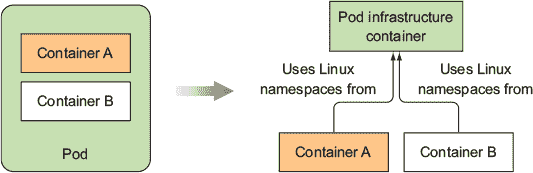

实际的应用容器可能会死亡并重新启动。当这样的容器再次启动时，它需要成为之前相同的 Linux 命名空间的一部分。基础设施容器使得这一点成为可能，因为它的生命周期与 Pod 的生命周期绑定——容器从 Pod 被调度开始运行，直到 Pod 被删除。如果在此时基础设施 Pod 被杀死，Kubelet 会重新创建它以及 Pod 的所有容器。

11.4\. Pod 间网络

到现在为止，你知道每个 Pod 都有自己的唯一 IP 地址，并且可以通过一个平坦的、无 NAT 的网络与其他所有 Pod 进行通信。Kubernetes 究竟是如何实现这一点的呢？简而言之，它并没有实现。网络的设置是由系统管理员或容器网络接口（CNI）插件完成的，而不是由 Kubernetes 本身完成。

11.4.1\. 网络必须具备的特点

Kubernetes 不要求你使用特定的网络技术，但它确实要求 pods（或者更准确地说，它们的容器）能够相互通信，无论它们是否运行在同一个工作节点上。pods 用于通信的网络必须是这样的，即 pod 看到的自己的 IP 地址与所有其他 pod 看到的该 pod 的 IP 地址完全相同。

看看 图 11.14。当 pod A 连接到（向 pod B 发送网络数据包）pod B 时，pod B 看到的源 IP 地址必须与 pod A 看到的自己的 IP 地址相同。在两者之间不应执行网络地址转换（NAT）——pod A 发送的数据包必须以源和目标地址不变的方式到达 pod B。

图 11.14. Kubernetes 要求 pods 通过无 NAT 网络连接。

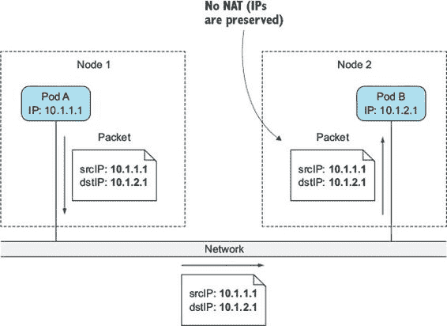

这很重要，因为它使得在 pods 内运行的应用程序的网络变得简单，就像它们在连接到同一网络交换机的机器上运行一样。pod 之间没有 NAT 的存在使得它们内部运行的应用程序能够在其他 pod 中进行自我注册。

例如，假设你有一个客户端 pod X 和 pod Y，它为所有注册到它的 pods 提供一种通知服务。pod X 连接到 pod Y 并告诉它：“嘿，我是 pod X，可在 IP 1.2.3.4 上找到；请将更新发送到这个 IP 地址。”提供服务的 pod 可以通过使用接收到的 IP 地址连接到第一个 pod。

对于 pods 之间无 NAT 通信的要求也扩展到了 pod 到节点和节点到 pod 的通信。但是，当 pod 与互联网上的服务通信时，pod 发送的数据包的源 IP 地址确实需要更改，因为 pod 的 IP 地址是私有的。出站数据包的源 IP 地址被更改为主机工作节点的 IP 地址。

构建合适的 Kubernetes 集群需要根据这些要求设置网络。有各种方法和技术可供选择，每种方法在特定场景下都有其自身的优点或缺点。因此，我们不会深入探讨具体技术。相反，让我们解释一下 pod 之间的网络是如何工作的。

11.4.2. 深入了解网络工作原理

在 第 11.3 节 中，我们了解到 pod 的 IP 地址和网络命名空间是由基础设施容器（即 pause 容器）设置和保留的。然后 pod 的容器使用其网络命名空间。因此，pod 的网络接口就是基础设施容器中设置的内容。让我们看看接口是如何创建的，以及它是如何连接到所有其他 pod 的接口的。看看 图 11.15。我们将在下一节讨论它。

图 11.15. 节点上的 pods 通过虚拟以太网接口对连接到同一个网桥。

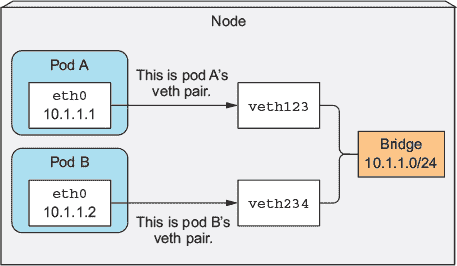

启用同一节点上 pods 之间的通信

在启动基础设施容器之前，为容器创建一个虚拟以太网接口对（veth 对）。这对中的一个接口保留在主机命名空间中（当你在这个节点上运行`ifconfig`时，你会看到它被列为`vethXXX`），而另一个被移动到容器的网络命名空间并重命名为`eth0`。这两个虚拟接口就像管道的两端（或者就像通过以太网线连接的两个网络设备）——一侧进入的内容会在另一侧出来，反之亦然。

主机网络命名空间中的接口连接到容器运行时配置的网络桥接器。容器中的`eth0`接口分配了桥接器地址范围内的 IP 地址。容器内部运行的应用程序发送到`eth0`网络接口（容器命名空间中的那个）的内容，会从主机命名空间中的另一个 veth 接口出来，并发送到桥接器。这意味着它可以被连接到桥接器的任何网络接口接收。

如果 pod A 向 pod B 发送网络数据包，数据包首先通过 pod A 的 veth 对到达桥接器，然后通过 pod B 的 veth 对。一个节点上的所有容器都连接到同一个桥接器，这意味着它们可以相互通信。但为了使运行在不同节点上的容器之间的通信成为可能，那些节点上的桥接器需要以某种方式连接起来。

启用不同节点上 pod 之间的通信

你有多种方式连接不同节点上的桥接器。这可以通过覆盖网络或底层网络或通过常规的第三层路由来实现，我们将在下一节中探讨。

你知道 pod IP 地址在整个集群中必须是唯一的，因此节点之间的桥接器必须使用不重叠的地址范围，以防止不同节点上的 pod 获得相同的 IP。在图 11.16 的示例中，节点 A 上的桥接器使用 10.1.1.0/24 IP 范围，而节点 B 上的桥接器使用 10.1.2.0/24，这确保了不存在 IP 地址冲突。

图 11.16。为了使不同节点上的 pod 能够通信，桥接器需要以某种方式连接起来。

图 11.16 显示，为了通过普通的第三层网络在两个节点之间的 pod 之间启用通信，节点的物理网络接口需要连接到桥接器。节点 A 上的路由表需要配置，以便所有目标为 10.1.2.0/24 的数据包被路由到节点 B，而节点 B 的路由表需要配置，以便发送到 10.1.1.0/24 的数据包被路由到节点 A。

在这种配置下，当一个节点上的容器向另一个节点上的容器发送数据包时，数据包首先通过 veth 对，然后通过桥接到节点的物理适配器，接着通过电线到达另一个节点的物理适配器，通过另一个节点的桥接器，最后通过目标容器的 veth 对。

这只在节点连接到相同的网络交换机时才有效，中间没有路由器；否则，那些路由器会丢弃数据包，因为它们引用的是 Pod IP，这些 IP 是私有的。当然，中间的路由器可以被配置为在节点之间路由数据包，但随着节点之间路由器数量的增加，这变得越来越困难且容易出错。因此，使用软件定义网络（SDN）更容易，它使得节点看起来就像它们连接到相同的网络交换机一样，无论实际的底层网络拓扑多么复杂。从 Pod 发送的数据包被封装并通过网络发送到运行另一个 Pod 的节点，在那里它们被解封装并以原始形式交付给 Pod。

11.4.3\. 介绍容器网络接口

为了更容易地将容器连接到网络，启动了一个名为容器网络接口（CNI）的项目。CNI 允许 Kubernetes 配置使用任何现有的 CNI 插件。这些插件包括

+   Calico

+   Flannel

+   Romana

+   Weave Net

+   以及其他

我们不会深入探讨这些插件的细节；如果你想要了解更多关于它们的信息，请参考[`kubernetes.io/docs/concepts/cluster-administration/addons/`](https://kubernetes.io/docs/concepts/cluster-administration/addons/)。

安装网络插件并不困难。你只需要部署一个包含 DaemonSet 和其他一些支持资源的 YAML 文件。这个 YAML 文件在每个插件的项目页面上提供。正如你可以想象的那样，DaemonSet 用于在所有集群节点上部署网络代理。然后它连接到节点的 CNI 接口，但请注意，Kubelet 需要以`--network-plugin=cni`的方式启动才能使用 CNI。

11.5\. 服务的实现方式

在第五章中，你学习了关于服务的内容，服务允许在持久稳定 IP 地址和端口上暴露一组 Pod。为了专注于服务的目的以及它们的使用方式，我们故意没有深入探讨它们的工作原理。但为了真正理解服务，并在事情没有按预期进行时更好地了解查找方向，你需要了解它们是如何实现的。

11.5.1\. 介绍 kube-proxy

与服务相关的一切都由每个节点上运行的 kube-proxy 进程处理。最初，kube-proxy 是一个实际的代理，等待连接，并为每个传入连接打开到 Pod 的一个新连接。这被称为`userspace`代理模式。后来，性能更好的`iptables`代理模式取代了它。现在这是默认模式，但如果你愿意，仍然可以配置 Kubernetes 使用旧模式。

在我们继续之前，让我们快速回顾一下关于服务的一些内容，这些内容对于理解接下来的几段很重要。

我们了解到每个服务都拥有自己的稳定 IP 地址和端口。客户端（通常是 Pod）通过连接到这个 IP 地址和端口来使用服务。这个 IP 地址是虚拟的——它没有分配给任何网络接口，并且在包离开节点时，该 IP 地址永远不会被列为网络包的源 IP 地址或目标 IP 地址。服务的一个关键细节是，它们由一个 IP 和端口号对（或多个 IP 和端口号对，在多端口服务的情况下）组成，因此服务 IP 本身并不代表任何东西。这就是为什么你不能 ping 它们的原因。

11.5.2\. kube-proxy 如何使用 iptables

当在 API 服务器中创建服务时，虚拟 IP 地址会立即分配给它。随后不久，API 服务器通知所有在工作节点上运行的 kube-proxy 代理，已创建了一个新的服务。然后，每个 kube-proxy 在其运行的节点上使该服务地址可访问。它是通过设置一些`iptables`规则来做到这一点的，这些规则确保每个目标为服务 IP/端口号对的包被拦截，并且其目标地址被修改，因此包被重定向到支持该服务的某个 Pod。

除了监视 API 服务器中服务的更改外，kube-proxy 还监视端点对象的更改。我们在第五章（index_split_046.html#filepos469093）中讨论了它们，但让我来刷新一下你的记忆，因为很容易忘记它们的存在，因为你很少手动创建它们。端点对象包含所有支持服务的 Pod 的 IP/端口号对（IP/端口号对也可以指向除 Pod 之外的东西）。这就是为什么 kube-proxy 也必须监视所有端点对象。毕竟，每当创建或删除一个新的后端 Pod，或者 Pod 的就绪状态改变，或者 Pod 的标签改变，并且它进入或退出服务的范围时，端点对象都会发生变化。

现在，让我们看看 kube-proxy 是如何使客户端能够通过服务连接到那些 Pod 的。这如图 11.17 所示。

图 11.17\. 发送到服务虚拟 IP/端口号对的网络包被修改并重定向到随机选择的后端 Pod。

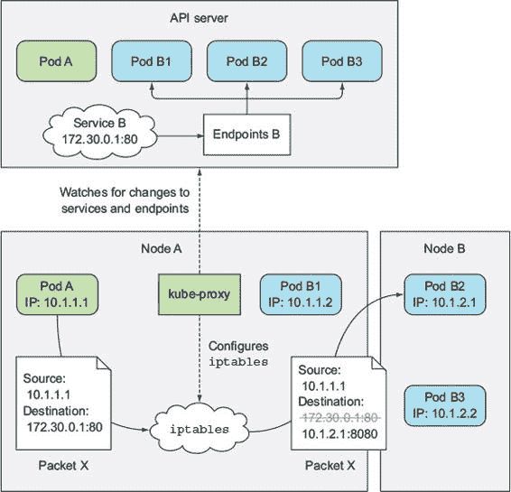

图表显示了`kube-proxy`做了什么以及客户端 Pod 发送的包如何到达支持服务的某个 Pod。让我们检查当客户端 Pod（图中的 Pod A）发送该包时发生了什么。

包的初始目标设置为服务的 IP 和端口（在示例中，服务位于 172.30.0.1:80）。在发送到网络之前，该包首先由节点 A 的内核根据节点上设置的`iptables`规则进行处理。

内核检查该包是否匹配那些`iptables`规则之一。其中之一规定，如果任何包的目标 IP 等于 172.30.0.1 且目标端口等于 80，则该包的目标 IP 和端口应替换为随机选择的 Pod 的 IP 和端口。

示例中的数据包符合该规则，因此其目标 IP/端口被更改。在示例中，Pod B2 被随机选择，因此数据包的目标 IP 被更改为 10.1.2.1（Pod B2 的 IP），端口更改为 8080（在 Service 规范中指定的目标端口）。从现在开始，这就像客户端 Pod 直接将数据包发送到 Pod 而不是通过服务一样。

这比那稍微复杂一点，但这是你需要理解的最重要部分。

11.6\. 运行高度可用的集群

在 Kubernetes 中运行应用程序的原因之一是确保它们在没有中断的情况下运行，在基础设施故障的情况下没有或有限的手动干预。为了无中断地运行服务，不仅应用程序需要始终处于运行状态，Kubernetes 控制平面组件也需要始终处于运行状态。我们将探讨实现高可用性所涉及的内容。

11.6.1\. 使你的应用程序高度可用

在 Kubernetes 中运行应用程序时，各种控制器确保即使在节点失败的情况下，应用程序也能平稳运行并达到指定的规模。为了确保应用程序高度可用，你只需要通过部署资源运行它们并配置适当数量的副本；其他所有事情都由 Kubernetes 处理。

运行多个实例以降低中断的可能性

这要求你的应用程序具有水平扩展性，即使你的应用程序不具备这种特性，你也应该使用一个副本计数设置为 1 的部署。如果副本变得不可用，它将很快被一个新的副本替换，尽管这并不是瞬间发生的。所有涉及的控制器都需要时间来注意到一个节点已经失败，创建新的 Pod 副本，并启动 Pod 的容器。在这之间不可避免地会有一个短暂的中断期。

为非水平扩展应用程序使用领导者选举

为了避免中断，你需要运行额外的非活动副本与活动副本一起，并使用快速响应的租约或领导者选举机制来确保只有一个处于活动状态。如果你不熟悉领导者选举，它是一种在分布式环境中运行多个应用程序实例的方式，以便就哪个是领导者达成一致。这个领导者要么是唯一执行任务的实例，而其他所有实例都在等待领导者失败然后自己成为领导者，或者它们都可以是活动的，其中领导者是唯一执行写入操作的实例，而其他所有实例则提供对数据的只读访问，例如。这确保了两个实例永远不会执行相同的工作，如果那样做会导致由于竞争条件而出现不可预测的系统行为。

该机制不需要集成到应用程序本身中。你可以使用一个侧边容器，该容器执行所有领导者选举操作，并在应该变为活动状态时向主容器发出信号。你可以在 Kubernetes 中找到领导者选举的示例，见[`github.com/kubernetes/contrib/tree/master/election`](https://github.com/kubernetes/contrib/tree/master/election)。

确保你的应用高度可用相对简单，因为 Kubernetes 几乎处理了所有事情。但如果是 Kubernetes 本身失败了怎么办？如果运行 Kubernetes 控制平面组件的服务器宕机了怎么办？这些组件是如何实现高度可用的？

11.6.2\. 使 Kubernetes 控制平面组件高度可用

在本章的开头，你学习了组成 Kubernetes 控制平面的少数几个组件。为了使 Kubernetes 高度可用，你需要运行多个主节点，这些节点运行以下组件的多个实例：

+   etcd，这是所有 API 对象存储的分布式数据存储

+   API 服务器

+   控制管理器，这是所有控制器运行的进程

+   调度器

不深入探讨如何安装和运行这些组件的具体细节，让我们看看使每个组件高度可用所涉及的内容。图 11.18 展示了一个高度可用的集群概览。

图 11.18\. 具有三个主节点的高度可用集群

运行一个 etcd 集群

由于 etcd 被设计为一个分布式系统，其关键特性之一就是能够运行多个 etcd 实例，因此使其高度可用并不是什么大问题。你所需要做的就是在一个适当数量的机器上运行它（如本章前面所述的三台、五台或七台）并使它们相互了解。你可以通过在每个实例的配置中包含所有其他实例的列表来实现这一点。例如，在启动一个实例时，你指定其他 etcd 实例可以访问的 IP 地址和端口号。

etcd 将在所有实例之间复制数据，因此当三机集群运行时，一个节点的故障仍然允许集群接受读写操作。为了提高超过单个节点的容错能力，你需要运行五个或七个 etcd 节点，这分别允许集群处理两个或三个节点故障。拥有超过七个 etcd 实例几乎是不必要的，并且开始影响性能。

运行多个 API 服务器实例

使 API 服务器高可用性甚至更简单。因为 API 服务器（几乎完全）是无状态的（所有数据都存储在 etcd 中，但 API 服务器会缓存它），你可以运行你需要的任何数量的 API 服务器，它们根本不需要相互了解。通常，每个 API 服务器都与每个 etcd 实例一起运行。通过这样做，etcd 实例不需要在它们前面有任何类型的负载均衡器，因为每个 API 服务器实例只与本地 etcd 实例通信。

与 API 服务器不同，API 服务器确实需要由负载均衡器进行前端处理，因此客户端（`kubectl`，但也包括控制器管理器、调度器和所有 Kubelets）始终只连接到健康的 API 服务器实例。

确保控制器和调度器的高可用性

与可以同时运行多个副本的 API 服务器相比，运行多个控制器管理器或调度器的实例并不简单。因为控制器和调度器都积极监视集群状态，并在状态发生变化时采取行动，可能会进一步修改集群状态（例如，当 ReplicaSet 期望的副本数增加一个时，ReplicaSet 控制器会创建一个额外的 Pod），运行这些组件的多个实例会导致它们都执行相同的操作。它们会相互竞争，这可能会导致不期望的效果（如前例中提到的，创建两个而不是一个新 Pod）。

因此，当运行这些组件的多个实例时，在任何给定时间只能有一个实例处于活动状态。幸运的是，所有这些都是由组件本身处理的（这是通过`--leader-elect`选项控制的，默认为 true）。每个单独的组件只有在它是选定的领导者时才会处于活动状态。只有领导者执行实际工作，而所有其他实例都处于待命状态，等待当前领导者失败。当它失败时，剩余的实例将选举一个新的领导者，然后接管工作。这种机制确保两个组件永远不会同时操作并执行相同的工作（参见图 11.19）。

图 11.19。只有一个控制器管理器和单个调度器处于活动状态；其他都在待命。

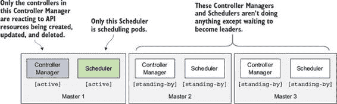

控制器管理器和调度器可以与 API 服务器和 etcd 一起运行，或者它们可以运行在不同的机器上。当它们一起运行时，它们可以直接与本地 API 服务器通信；否则，它们通过负载均衡器连接到 API 服务器。

理解在控制平面组件中使用的领导者选举机制

我觉得这里最有趣的是，这些组件不需要直接相互通信来选举领导者。领导者选举机制完全通过在 API 服务器中创建资源来实现。这甚至不是一种特殊类型的资源——端点资源被用来实现这一点（滥用可能是一个更合适的词）。

使用端点对象（Endpoints object）来完成这个操作并没有什么特别之处。之所以使用它，是因为只要没有同名的服务存在，它就不会产生副作用。任何其他资源都可以使用（实际上，领导选举机制很快将使用 ConfigMaps 而不是端点）。

我相信你对如何使用资源来完成这个目的很感兴趣。以调度器（Scheduler）为例。所有调度器的实例都试图创建（稍后更新）一个名为`kube-scheduler`的端点资源。你可以在`kube-system`命名空间中找到它，如下所示。

列表 11.11. 用于领导选举的`kube-scheduler`端点资源

`$ kubectl get endpoints kube-scheduler -n kube-system -o yaml` `apiVersion: v1 kind: Endpoints metadata:   annotations:     control-plane.alpha.kubernetes.io/leader: '{"holderIdentity":`  `"minikube","leaseDurationSeconds":15,"acquireTime":`  `"2017-05-27T18:54:53Z","renewTime":"2017-05-28T13:07:49Z",`  `"leaderTransitions":0}'   creationTimestamp: 2017-05-27T18:54:53Z   name: kube-scheduler   namespace: kube-system   resourceVersion: "654059"   selfLink: /api/v1/namespaces/kube-system/endpoints/kube-scheduler   uid: f847bd14-430d-11e7-9720-080027f8fa4e subsets: []`

`control-plane.alpha.kubernetes.io/leader`注解是重要的部分。正如你所见，它包含一个名为`holderIdentity`的字段，该字段包含当前领导者的名称。第一个成功将其名称放入那里的实例将成为领导者。实例们相互竞争以完成这项任务，但总是只有一个赢家。

记得我们之前解释的乐观并发吗？那就是确保如果多个实例尝试将它们的名称写入资源，只有其中一个能够成功。根据写入是否成功，每个实例都知道自己是否是领导者。

一旦成为领导者，它必须定期更新资源（默认情况下每两秒更新一次），这样所有其他实例都知道它仍然活跃。当领导者失败时，其他实例会看到资源已经有一段时间没有更新了，并尝试通过将自己的名称写入资源来成为领导者。简单，对吧？

11.7. 摘要

希望这章内容有趣，并且有助于提高你对 Kubernetes 内部运作的了解。本章展示了

+   Kubernetes 集群由哪些组件组成以及每个组件负责什么

+   API 服务器、调度器、在控制器管理器中运行的各个控制器以及 Kubelet 是如何协同工作，使 Pod 得以启动

+   基础设施容器是如何将一个 Pod 中的所有容器绑定在一起的

+   Pod 是如何通过网络桥接与其他节点上运行的 Pod 进行通信的，以及这些不同节点上的桥接是如何连接的，这样不同节点上的 Pod 就可以互相通信

+   kube-proxy 如何通过在节点上配置`iptables`规则，在同一个服务中的 Pod 之间执行负载均衡

+   如何运行每个控制平面组件的多个实例以使集群具有高可用性

接下来，我们将探讨如何保护 API 服务器，以及如何通过扩展保护整个集群。
