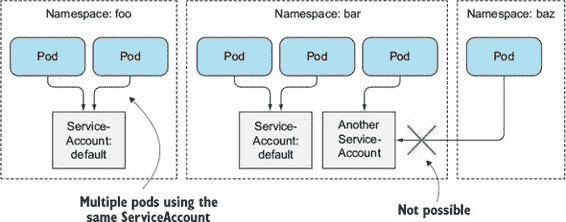
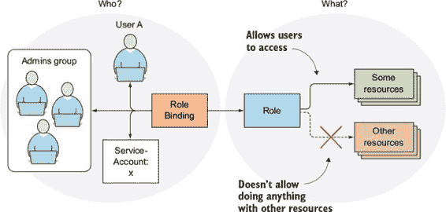
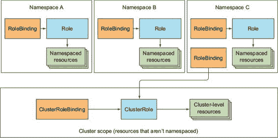
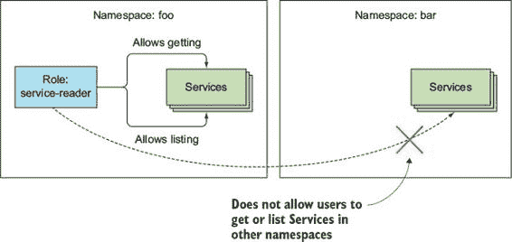
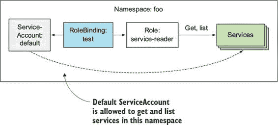
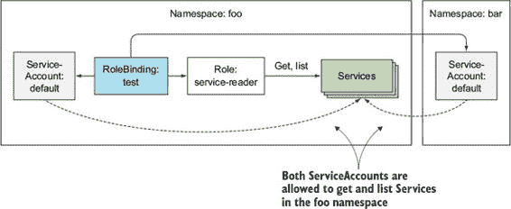
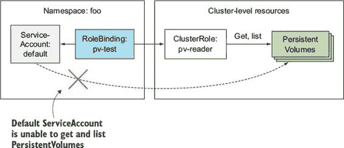
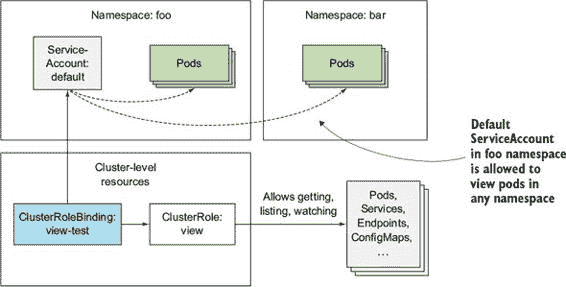
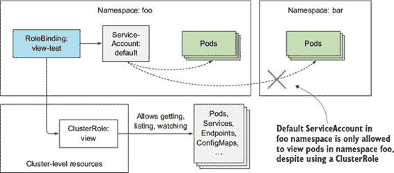

第十二章。保护 Kubernetes API 服务器

本章涵盖

+   理解认证

+   服务账户是什么以及为什么使用它们

+   理解基于角色的访问控制（RBAC）插件

+   使用 Roles 和 RoleBindings

+   使用 ClusterRoles 和 ClusterRoleBindings

+   理解默认角色和绑定

在第八章中，你学习了运行在 Pod 中的应用程序如何与 API 服务器通信以检索或更改集群中部署的资源的状态。为了与 API 服务器进行认证，你使用了挂载到 Pod 中的服务账户令牌。在本章中，你将了解服务账户是什么以及如何配置它们的权限，以及如何配置集群中其他主体的权限。

12.1. 理解认证

在上一章中，我们提到 API 服务器可以配置一个或多个认证插件（同样适用于授权插件）。当 API 服务器收到请求时，它会通过认证插件列表，这样它们可以分别检查请求并尝试确定谁发送了请求。第一个能够从请求中提取该信息的插件将用户名、用户 ID 和客户端所属的组返回给 API 服务器核心。API 服务器停止调用剩余的认证插件并继续到授权阶段。

可用几种认证插件。它们使用以下方法获取客户端的身份：

+   从客户端证书

+   从 HTTP 头中传递的认证令牌

+   基本 HTTP 认证

+   其他

认证插件通过启动 API 服务器时的命令行选项启用。

12.1.1. 用户和组

认证插件返回已认证用户的用户名和组。Kubernetes 不会在任何地方存储该信息；它使用这些信息来验证用户是否有权执行操作。

理解用户

Kubernetes 区分了两种连接到 API 服务器的客户端：

+   实际的人类（用户）

+   Pods（更具体地说，运行在其内部的应用程序）

这两种类型的客户端都使用前面提到的认证插件进行认证。用户应由外部系统管理，例如单点登录（SSO）系统，但 Pod 使用一种称为服务账户的机制，这些服务账户作为 ServiceAccount 资源在集群中创建和存储。相比之下，没有资源代表用户账户，这意味着您无法通过 API 服务器创建、更新或删除用户。

我们不会详细介绍如何管理用户，但我们将详细探讨服务账户，因为它们对于运行 Pod 至关重要。有关如何配置集群以认证人类用户的更多信息，集群管理员应参考 Kubernetes 集群管理员指南[`kubernetes.io/docs/admin`](http://kubernetes.io/docs/admin)。

理解组

人类用户和 ServiceAccounts 都可以属于一个或多个组。我们提到身份验证插件会返回与用户名和用户 ID 一起的组。组用于一次性授予多个用户的权限，而不是必须为每个用户单独授予。

插件返回的组仅仅是字符串，代表任意组名，但内置组有特殊含义：

+   `system:unauthenticated` 组用于那些没有任何身份验证插件能够验证客户端的请求。

+   `system:authenticated` 组会自动分配给成功认证的用户。

+   `system:serviceaccounts` 组包含了系统中的所有 ServiceAccounts。

+   `system:serviceaccounts:<namespace>` 包含了特定命名空间中的所有 ServiceAccounts。

12.1.2\. 介绍 ServiceAccounts

让我们近距离探索 ServiceAccounts。你已经了解到 API 服务器要求客户端在允许它们在服务器上执行操作之前进行身份验证。你已经看到 pod 可以通过发送文件 `/var/run/secrets/kubernetes.io/serviceaccount/token` 的内容来进行身份验证，该文件通过 `secret` 卷挂载到每个容器的文件系统中。

但这个文件究竟代表什么呢？每个 pod 都关联着一个 Service-Account，它代表了 pod 中运行的应用程序的标识。令牌文件包含了 ServiceAccount 的身份验证令牌。当应用程序使用此令牌连接到 API 服务器时，身份验证插件会验证 ServiceAccount 并将 ServiceAccount 的用户名返回给 API 服务器核心。Service-Account 用户名格式如下：

`system:serviceaccount:<namespace>:<service account name>`

API 服务器将此用户名传递给配置的身份验证插件，这些插件确定应用程序尝试执行的操作是否允许由 ServiceAccount 执行。

ServiceAccounts 只是一种方式，让运行在 pod 内部的应用程序通过 API 服务器进行身份验证。正如之前提到的，应用程序通过在请求中传递 ServiceAccount 的令牌来实现这一点。

理解 ServiceAccount 资源

ServiceAccounts 和 Pods、Secrets、ConfigMaps 等一样，是资源，并且范围限定在单个命名空间内。每个命名空间都会自动创建一个默认的 ServiceAccount（这就是你的 pod 一直使用的那个）。

你可以像列出其他资源一样列出 ServiceAccounts：

`$ kubectl get sa` `NAME      SECRETS   AGE default   1         1d`

| |
| --- |

注意

`serviceaccount` 的简写是 `sa`。

| |
| --- |

如你所见，当前命名空间只包含`default` ServiceAccount。在需要时可以添加额外的 ServiceAccounts。每个 Pod 与一个 ServiceAccount 关联，但多个 Pod 可以使用同一个 ServiceAccount。如图 12.1 所示，Pod 只能使用同一命名空间下的 ServiceAccount。

图 12.1\. 每个 Pod 与其命名空间中的单个 ServiceAccount 关联。

理解 ServiceAccount 如何与授权相关联

你可以通过在 Pod 清单中指定账户的名称来将 ServiceAccount 分配给 Pod。如果你没有明确指定，Pod 将使用命名空间中的默认 ServiceAccount。

通过将不同的 ServiceAccount 分配给 Pod，你可以控制每个 Pod 可以访问哪些资源。当 API 服务器接收到携带认证令牌的请求时，服务器使用令牌来验证发送请求的客户端，然后确定相关的 ServiceAccount 是否被允许执行请求的操作。API 服务器从集群管理员配置的全局授权插件中获取这些信息。可用的授权插件之一是基于角色的访问控制（RBAC）插件，这将在本章后面讨论。从 Kubernetes 版本 1.6 开始，RBAC 插件是大多数集群应该使用的插件。

12.1.3\. 创建 ServiceAccount

我们已经说过每个命名空间都包含其自己的默认 ServiceAccount，但如果需要，还可以创建额外的。但为什么你应该费心去创建 ServiceAccount 而不是使用所有 Pod 的默认 ServiceAccount 呢？

显而易见的原因是集群安全。不需要读取任何集群元数据的 Pod 应该在限制账户下运行，该账户不允许它们检索或修改集群中部署的任何资源。需要检索资源元数据的 Pod 应该在只允许读取这些对象元数据的 ServiceAccount 下运行，而需要修改这些对象的 Pod 应该在允许修改 API 对象的自己的 ServiceAccount 下运行。

让我们看看如何创建额外的 ServiceAccounts，它们如何与 Secrets 相关联，以及如何将它们分配给你的 Pod。

创建 ServiceAccount

创建 ServiceAccount 非常简单，多亏了专门的`kubectl create serviceaccount`命令。让我们创建一个名为`foo`的新 ServiceAccount：

`$ kubectl create serviceaccount foo` `serviceaccount "foo" created`

现在，你可以使用`describe`命令检查 ServiceAccount，如下所示。

列表 12.1\. 使用`kubectl describe`检查 ServiceAccount

`$ kubectl describe sa foo` `Name:               foo Namespace:          default Labels:             <none>  Image pull secrets: <none>` `1` `Mountable secrets:  foo-token-qzq7j` `2` `Tokens:             foo-token-qzq7j` `3`

+   1 这些将被自动添加到所有使用此 ServiceAccount 的 pod 中。

+   使用此 ServiceAccount 的 2 个 Pod 只能挂载这些密钥，如果强制执行可挂载密钥。

+   3 个身份验证令牌。第一个被挂载在容器内部。

你可以看到已经创建了一个自定义令牌密钥，并将其与 ServiceAccount 关联。如果你使用 `kubectl describe secret foo-token-qzq7j` 查看密钥的数据，你会看到它包含与默认 ServiceAccount 令牌相同的项（CA 证书、命名空间和令牌），如以下列表所示。

列表 12.2\. 检查自定义 ServiceAccount 的密钥

`$ kubectl describe secret foo-token-qzq7j` `... ca.crt:         1066 bytes namespace:      7 bytes token:          eyJhbGciOiJSUzI1NiIsInR5cCI6IkpXVCJ9...`

注意

你可能听说过 JSON Web Tokens（JWT）。ServiceAccounts 中使用的身份验证令牌是 JWT 令牌。

理解 ServiceAccount 的可挂载密钥

当你使用 `kubectl describe` 检查 ServiceAccount 时，令牌会显示在“可挂载密钥”列表中。让我解释一下这个列表代表什么。在第七章中，你学习了如何创建密钥并在 pod 内部挂载它们。默认情况下，pod 可以挂载它想要的任何密钥。但是，pod 的 ServiceAccount 可以配置为只允许 pod 挂载 ServiceAccount 上列出的可挂载密钥。要启用此功能，ServiceAccount 必须包含以下注解：`kubernetes.io/enforce-mountable-secrets="true"`。

如果 ServiceAccount 被注解了此注解，任何使用它的 pod 只能挂载 ServiceAccount 的可挂载密钥——它们不能使用任何其他密钥。

理解 ServiceAccount 的镜像拉取密钥

ServiceAccount 还可以包含一个镜像拉取密钥列表，我们在第七章中进行了探讨。如果你不记得，它们是包含从私有镜像仓库拉取容器镜像凭证的密钥。

以下列表显示了一个 ServiceAccount 定义示例，其中包含你在第七章中创建的镜像拉取密钥。

列表 12.3\. 带有镜像拉取密钥的 ServiceAccount：sa-image-pull-secrets.yaml

`apiVersion: v1 kind: ServiceAccount metadata:   name: my-service-account imagePullSecrets: - name: my-dockerhub-secret`

ServiceAccount 的镜像拉取密钥的行为与其可挂载密钥略有不同。与可挂载密钥不同，它们不决定 pod 可以使用哪些镜像拉取密钥，而是自动添加到所有使用 Service-Account 的 pod 中。将镜像拉取密钥添加到 ServiceAccount 中可以节省你逐个添加到每个 pod 中的时间。

12.1.4\. 将 ServiceAccount 分配给 pod

在创建额外的 ServiceAccounts 后，你需要将它们分配给 pod。这是通过在 pod 定义中的 `spec.serviceAccountName` 字段中设置 ServiceAccount 的名称来完成的。

注意

创建 pod 时必须设置 pod 的 ServiceAccount。之后不能更改。

创建使用自定义 ServiceAccount 的 pod

在 第八章 中，你部署了一个 pod，该 pod 运行基于 `tutum/curl` 镜像的容器以及旁边的代理容器。你用它来探索 API 服务器的 REST 接口。代理容器运行了 `kubectl proxy` 进程，该进程使用 pod 的 ServiceAccount 的令牌与 API 服务器进行身份验证。

现在，你可以修改 pod，使其使用你几分钟前创建的 `foo` ServiceAccount。下一个列表显示了 pod 定义。

列表 12.4\. 使用非默认 ServiceAccount 的 pod：curl-custom-sa.yaml

`apiVersion: v1 kind: Pod metadata:   name: curl-custom-sa spec:   serviceAccountName: foo` `1` `containers:   - name: main     image: tutum/curl     command: ["sleep", "9999999"]   - name: ambassador     image: luksa/kubectl-proxy:1.6.2`

+   1 此 pod 使用 foo ServiceAccount 而不是默认的。

为了确认自定义 ServiceAccount 的令牌已挂载到两个容器中，你可以打印出令牌的内容，如下所示。

列表 12.5\. 检查挂载到 pod 容器中的令牌

`$ kubectl exec -it curl-custom-sa -c main``cat /var/run/secrets/kubernetes.io/serviceaccount/token` `eyJhbGciOiJSUzI1NiIsInR5cCI6IkpXVCJ9...`

你可以通过比较 列表 12.5 中的令牌字符串与 列表 12.2 中的令牌字符串来看到令牌来自 `foo` ServiceAccount。

使用自定义 ServiceAccount 的令牌与 API 服务器通信

让我们看看你是否可以使用这个令牌与 API 服务器通信。如前所述，代理容器在与服务器通信时使用令牌，因此你可以通过代理容器进行测试，该代理容器监听 `localhost:8001`，如下所示。

列表 12.6\. 使用自定义 ServiceAccount 与 API 服务器通信

`$ kubectl exec -it curl-custom-sa -c main curl localhost:8001/api/v1/pods``{` `"kind": "PodList",   "apiVersion": "v1",   "metadata": {     "selfLink": "/api/v1/pods",     "resourceVersion": "433895"   },   "items":    ...`

好的，你从服务器得到了一个正确的响应，这意味着自定义 Service-Account 被允许列出 pod。这可能是因为你的集群没有使用 RBAC 授权插件，或者你按照 [第八章 中的说明赋予了所有 ServiceAccounts 完全权限。

当你的集群没有使用适当的授权时，创建和使用额外的 ServiceAccounts 并没有太多意义，因为默认的 ServiceAccount 被允许做任何事情。在这种情况下使用 ServiceAccounts 的唯一原因是为了强制挂载 Secrets 或通过 Service-Account 提供图像拉取 Secrets，正如之前所解释的。

但在使用 RBAC 授权插件时，创建额外的 ServiceAccounts 实际上几乎是必须的，我们将在下一节中探讨这一点。

12.2. 集群基于角色的访问控制

从 Kubernetes 版本 1.6.0 开始，集群安全性得到了显著提升。在早期版本中，如果你设法从某个 Pod 获取了认证令牌，你就可以用它来在集群中做任何你想做的事情。如果你在网上搜索，你会找到一些演示，展示了路径遍历（或目录遍历）攻击（客户端可以检索位于 Web 服务器 Web 根目录之外的文件）是如何被用来获取令牌，并使用它来在不受保护的 Kubernetes 集群中运行恶意 Pod 的。

但在版本 1.8.0 中，RBAC 授权插件升级为 GA（通用可用性），现在许多集群默认启用（例如，当使用 kubadm 部署集群时，如附录 B 中所述 appendix B）。RBAC 阻止未经授权的用户查看或修改集群状态。默认 Service-Account 不允许查看集群状态，更不用说以任何方式修改它了，除非你授予它额外的权限。要编写与 Kubernetes API 服务器通信的应用程序（如第八章中所述 chapter 8），你需要了解如何通过 RBAC 特定资源管理授权。

| |
| --- |

注意

除了 RBAC 之外，Kubernetes 还包括其他授权插件，例如基于属性的访问控制（ABAC）插件、Web 钩子插件和自定义插件实现。尽管如此，RBAC 仍然是标准。

| |
| --- |

12.2.1. 介绍 RBAC 授权插件

Kubernetes API 服务器可以被配置为使用授权插件来检查用户请求的操作是否被允许执行。因为 API 服务器公开了一个 REST 接口，用户通过向服务器发送 HTTP 请求来执行操作。用户通过在请求中包含凭证（认证令牌、用户名和密码或客户端证书）来自我认证。

理解操作

但有哪些操作呢？正如你所知，REST 客户端通过向特定 URL 路径发送`GET`、`POST`、`PUT`、`DELETE`和其他类型的 HTTP 请求来发送操作，这些路径代表特定的 REST 资源。在 Kubernetes 中，这些资源包括 Pods、Services、Secrets 等。以下是一些 Kubernetes 中操作示例：

+   获取 Pods

+   创建服务

+   更新 Secrets

+   等等

以下示例中的动词（get、create、update）映射到客户端（客户端执行的 HTTP 方法）执行的 HTTP 方法（`GET`、`POST`、`PUT`）。名词（Pods、Service、Secrets）显然映射到 Kubernetes 资源。

API 服务器内部运行的授权插件 RBAC 确定客户端是否被允许在请求的资源上执行请求的动词。

表 12.1\. 将 HTTP 方法映射到授权动词

| HTTP 方法 | 单个资源的动词 | 集合的动词 |
| --- | --- | --- |
| GET, HEAD | get（以及监视） | list（以及监视） |
| POST | create | n/a |
| PUT | update | n/a |
| PATCH | patch | n/a |
| DELETE | delete | deletecollection |
|  |

注意

额外的动词 `use` 用于 PodSecurityPolicy 资源，这些资源将在下一章中解释。

除了将安全权限应用于整个资源类型之外，RBAC 规则还可以应用于资源的特定实例（例如，名为 `myservice` 的服务）。稍后您将看到，权限还可以应用于非资源 URL 路径，因为并非 API 服务器公开的每个路径都映射到资源（例如，`/api` 路径本身或 `/healthz` 上的服务器健康信息）。

理解 RBAC 插件

如其名称所示，RBAC 授权插件使用用户角色作为确定用户是否可以执行操作的关键因素。一个主体（可能是人类、ServiceAccount 或用户或 ServiceAccount 的组）与一个或多个角色相关联，并且每个角色都允许在特定资源上执行某些动词。

如果用户拥有多个角色，他们可以执行任何他们的角色允许他们做的事情。如果用户的所有角色中都没有更新 Secrets 的权限，API 服务器将阻止用户对 Secrets 执行 `PUT` 或 `PATCH` 请求。

通过 RBAC 插件管理授权很简单。所有操作都是通过创建四个特定的 RBAC Kubernetes 资源来完成的，我们将在下一节中探讨这些资源。

12.2.2\. 介绍 RBAC 资源

RBAC 授权规则通过四个资源进行配置，这些资源可以分为两组：

+   角色和 ClusterRoles，它们指定可以在哪些资源上执行哪些动词。

+   角色绑定和 ClusterRoleBinding，它们将上述角色绑定到特定的用户、组或 ServiceAccount。

角色定义可以做什么，而绑定定义谁可以做（这可以在 图 12.2 中看到）。

图 12.2\. 角色授予权限，而角色绑定将角色绑定到主体。

角色与 ClusterRole，或角色绑定与 ClusterRoleBinding 之间的区别在于，角色和角色绑定是命名空间资源，而 ClusterRole 和 ClusterRoleBinding 是集群级别的资源（非命名空间）。这可以在 图 12.3 中看到。

图 12.3\. 角色和 RoleBindings 是命名空间级别的；ClusterRoles 和 ClusterRoleBindings 不是。

如图中所示，一个命名空间中可以存在多个 RoleBindings（对于 Roles 也是如此）。同样，可以创建多个 ClusterRoleBindings 和 Cluster-Roles。图中还显示，尽管 RoleBindings 是命名空间级别的，但它们也可以引用 ClusterRoles，而 ClusterRoles 不是。

了解这四种资源及其影响的最佳方式是通过实际操作练习来尝试它们。你现在将这样做。

设置你的练习

在你能够探索 RBAC 资源如何影响通过 API 服务器可以执行的操作之前，你需要确保你的集群中启用了 RBAC。首先，确保你至少使用 Kubernetes 的 1.6 版本，并且 RBAC 插件是唯一配置的授权插件。可以并行启用多个插件，如果其中之一允许执行某个操作，则该操作将被允许。

注意

如果你使用的是 GKE 1.6 或 1.7，你需要通过使用 `--no-enable-legacy-authorization` 选项创建集群来显式禁用旧版授权。如果你使用的是 Minikube，你也可能需要通过使用 `--extra-config=apiserver.Authorization.Mode=RBAC` 选项启动 Minikube 来启用 RBAC。

如果你按照 第八章 中的说明禁用了 RBAC，现在是时候通过运行以下命令重新启用它：

`$ kubectl delete clusterrolebinding permissive-binding`

为了尝试 RBAC，你将运行一个 pod，通过这个 pod 你将尝试与 API 服务器通信，就像你在 第八章 中做的那样。但这次你将在不同的命名空间中运行两个 pod，以查看每个命名空间的网络安全行为。

在 第八章 中的示例中，你运行了两个容器来演示一个容器中的应用程序如何使用另一个容器与 API 服务器通信。这次，你将运行一个单独的容器（基于 `kubectl-proxy` 镜像），并使用 `kubectl exec` 在该容器内部直接运行 `curl`。代理将负责身份验证和 HTTPS，这样你就可以专注于 API 服务器安全性的授权方面。

创建命名空间并运行 pod

你将要在命名空间 `foo` 中创建一个 pod，在命名空间 `bar` 中创建另一个 pod，如下面的列表所示。

列表 12.7\. 在不同命名空间中运行测试 pod

`$ kubectl create ns foo` `namespace "foo" created` `$ kubectl run test --image=luksa/kubectl-proxy -n foo` `deployment "test" created` `$ kubectl create ns bar` `namespace "bar" created` `$ kubectl run test --image=luksa/kubectl-proxy -n bar` `deployment "test" created`

现在打开两个终端，并使用 `kubectl exec` 在两个 pod 中运行一个 shell（每个终端一个 pod）。例如，要在命名空间 `foo` 中的 pod 中运行 shell，首先获取 pod 的名称：

`$ kubectl get po -n foo` `NAME                   READY     STATUS    RESTARTS   AGE` `test-145485760-ttq36``   1/1       Running   0          1m`

然后使用`kubectl exec`命令中的名称：

`$ kubectl exec -it test-145485760-ttq36 -n foo sh` `/ #`

在另一个终端中执行相同的操作，但针对`bar`命名空间中的 Pod。

从您的 Pod 中列出服务

要验证 RBAC 是否启用并阻止 Pod 读取集群状态，请使用`curl`列出`foo`命名空间中的服务：

`/ # curl localhost:8001/api/v1/namespaces/foo/services` `用户"system:serviceaccount:foo:default"无法在命名空间"foo"中列出服务。`

您正在连接到`localhost:8001`，这是`kubectl proxy`进程监听的位置（如第八章所述）。进程收到您的请求，并将其发送到 API 服务器，同时以`foo`命名空间中的默认 ServiceAccount 进行身份验证（如 API 服务器的响应所示）。

API 服务器响应称，ServiceAccount 不允许在`foo`命名空间中列出服务，即使 Pod 在该命名空间中运行。您正在看到 RBAC（基于角色的访问控制）的实际应用。ServiceAccount 的默认权限不允许其列出或修改任何资源。现在，让我们学习如何允许 ServiceAccount 执行这些操作。首先，您需要创建一个角色资源。

12.2.3. 使用角色和角色绑定

角色资源定义了可以在哪些资源上执行哪些操作（或者，如前所述，可以在哪些 RESTful 资源上执行哪些类型的 HTTP 请求）。以下列表定义了一个角色，允许用户在`foo`命名空间中`get`和`list`服务。

列表 12.8. 角色定义：service-reader.yaml

`apiVersion: rbac.authorization.k8s.io/v1 kind: Role metadata: namespace: foo` `1` `name: service-reader rules: - apiGroups: [""]` `2` `verbs: ["get", "list"]` `3` `resources: ["services"]` `4`

+   1 角色是命名空间级别的（如果省略命名空间，则使用当前命名空间）。

+   2 服务是核心 apiGroup 中的资源，该 apiGroup 没有名称，因此为“”。

+   3 允许通过名称获取单个服务并列出所有服务。

+   4 此规则适用于服务（必须使用复数形式！）。

警告

指定资源时必须使用复数形式。

此角色资源将在`foo`命名空间中创建。在第八章中，您学习了每种资源类型都属于一个 API 组，您在资源的清单中指定该 API 组（以及版本）字段。在角色定义中，您需要指定定义中包含的每个规则中列出的资源的`apiGroup`。如果您允许访问属于不同 API 组的资源，则使用多个规则。

注意

在示例中，您允许访问所有服务资源，但您也可以通过指定额外的`resourceNames`字段来仅限制对特定服务实例的访问。

| |
| --- |

图 12.4 显示了角色、其动词和资源以及它将被创建的命名空间。

图 12.4\. `service-reader`角色允许在 foo 命名空间中获取和列出服务。

创建角色

现在在`foo`命名空间中创建前面的角色：

`$ kubectl create -f service-reader.yaml -n foo` `role "service-reader" created`

注意

`-n`选项是`--namespace`的缩写。

注意，如果您正在使用 GKE，前面的命令可能会失败，因为您没有集群管理员权限。要授予权限，请运行以下命令：

`$ kubectl create clusterrolebinding cluster-admin-binding``--clusterrole=cluster-admin --user=your.email@address.com`

除了从 YAML 文件创建`service-reader`角色外，您还可以使用特殊的`kubectl create role`命令创建它。让我们使用这种方法在`bar`命名空间中创建角色：

`$ kubectl create role service-reader --verb=get --verb=list``--resource=services -n bar` `role "service-reader" created`

这两个角色将允许您从您的两个 Pod 中列出`foo`和`bar`命名空间中的服务（分别在`foo`和`bar`命名空间中运行）。但是创建两个角色还不够（您可以通过再次执行`curl`命令来检查）。您需要将每个角色绑定到它们各自命名空间中的服务账户。

将角色绑定到服务账户

角色定义了可以执行哪些操作，但它没有指定谁可以执行它们。为了做到这一点，您必须将角色绑定到主体，该主体可以是用户、服务账户或组（用户或服务账户的组）。

通过创建 RoleBinding 资源将角色绑定到主体。要将角色绑定到`default`服务账户，请运行以下命令：

`$ kubectl create rolebinding test --role=service-reader``--serviceaccount=foo:default -n foo` `rolebinding "test" created`

命令应该是自解释的。您正在创建一个 RoleBinding，它将`service-reader`角色绑定到`foo`命名空间中的`default`服务账户。您正在`foo`命名空间中创建 RoleBinding。RoleBinding 以及引用的服务账户和角色在图 12.5 中显示。

图 12.5\. 测试 RoleBinding 将`default ServiceAccount`与`service-reader`角色绑定。

注意

要将角色绑定到用户而不是服务账户，请使用`--user`参数指定用户名。要将它绑定到组，请使用`--group`。

下面的列表显示了您创建的 RoleBinding 的 YAML。

列表 12.9\. 引用角色的 RoleBinding

`$ kubectl get rolebinding test -n foo -o yaml`

+   1 此 RoleBinding 引用了 service-reader Role。

+   2 并将其绑定到 foo 命名空间中的默认 ServiceAccount。

如您所见，RoleBinding 始终引用单个 Role（从`roleRef`属性中可以明显看出），但可以将 Role 绑定到多个`subjects`（例如，一个或多个 Service-Accounts 以及任意数量的用户或组）。因为这个 RoleBinding 将 Role 绑定到了在`foo`命名空间中运行的 pod 的 ServiceAccount，所以您现在可以从该 pod 内部列出 Services。

列表 12.10\. 从 API 服务器获取 Services

`/ # curl localhost:8001/api/v1/namespaces/foo/services`

+   1 项目列表为空，因为没有 Services 存在。

在 RoleBinding 中包含来自其他命名空间的 ServiceAccounts

命名空间`bar`中的 pod 无法列出其自身的 Services，显然也无法列出`foo`命名空间中的 Services。但您可以在`foo`命名空间中编辑您的 RoleBinding 并添加另一个 pod 的 ServiceAccount，即使它位于不同的命名空间中。运行以下命令：

`$ kubectl edit rolebinding test -n foo`

然后将以下行添加到`subjects`列表中，如下所示。

列表 12.11\. 从另一个命名空间引用 ServiceAccount

`subjects: - kind: ServiceAccount name: default`

+   1 您正在引用 bar 命名空间中的默认 ServiceAccount。

现在，您也可以从运行在 bar 命名空间中的 pod 内列出`foo`命名空间中的 Services。运行与列表 12.10 中相同的命令，但在另一个终端中运行，在那里您在另一个 pod 中运行 shell。

在继续到 ClusterRoles 和 ClusterRoleBindings 之前，让我们总结一下您目前拥有的 RBAC 资源。您在`foo`命名空间中有一个 RoleBinding，它引用了`service-reader` Role（也在`foo`命名空间中），并将`foo`和`bar`命名空间中的`default` ServiceAccounts 绑定，如图 12.6 所示。

图 12.6\. 将不同命名空间中的 ServiceAccounts 绑定到同一 Role。

12.2.4\. 使用 ClusterRoles 和 ClusterRoleBindings

Roles 和 RoleBindings 是命名空间资源，这意味着它们位于并应用于单个命名空间中的资源，但，正如我们所见，RoleBindings 也可以引用其他命名空间中的 Service-Accounts。

除了这些命名空间资源外，还存在两个集群级别的 RBAC 资源：集群角色和集群角色绑定。它们不是命名空间化的。让我们看看为什么你需要它们。

常规角色仅允许访问与角色所在同一命名空间中的资源。如果您想允许某人访问不同命名空间中的资源，您必须在每个命名空间中创建一个角色和角色绑定。如果您想扩展到所有命名空间（这可能是一个集群管理员可能需要的），您需要在每个命名空间中创建相同的角色和角色绑定。在创建附加命名空间时，您必须记得在那里创建这两个资源。

正如您在本书中学到的，某些资源根本不是命名空间化的（这包括节点、持久卷、命名空间等）。我们还提到 API 服务器公开了一些不表示资源的 URL 路径（例如`/healthz`）。常规角色无法授予对这些资源或非资源 URL 的访问权限，但集群角色可以。

集群角色是一个集群级别的资源，用于允许访问非命名空间资源或非资源 URL，或用作在单个命名空间内绑定的通用角色，从而节省您在每个命名空间中重新定义相同角色的麻烦。

允许访问集群级别资源

如前所述，集群角色可以用来允许访问集群级别的资源。让我们看看如何允许您的 Pod 在您的集群中列出持久卷。首先，您将创建一个名为`pv-reader`的集群角色：

`$ kubectl create clusterrole pv-reader --verb=get,list``--resource=persistentvolumes` `集群角色 "pv-reader" 已创建`

集群角色的 YAML 配置如下所示。

列表 12.12\. 集群角色定义

`$ kubectl get clusterrole pv-reader -o yaml` `apiVersion: rbac.authorization.k8s.io/v1 kind: ClusterRole metadata:` `1` `name: pv-reader` `1` `resourceVersion: "39932"` `1` `selfLink: ...` `1` `uid: e9ac1099-30e2-11e7-955c-080027e6b159` `1` `rules: - apiGroups:` `2` `- ""` `2` `resources:` `2` `- persistentvolumes` `2` `verbs:` `2` `- get` `2` `- list` `2`

+   1 集群角色不是命名空间化的，因此没有命名空间字段。

+   2 在这种情况下，规则与常规角色中的规则完全相同。

在将此集群角色绑定到您的 Pod 的 ServiceAccount 之前，请验证 Pod 是否可以列出持久卷。在第一个终端中运行以下命令，其中您在`foo`命名空间内运行 Pod 内部的 shell：

`/ # curl localhost:8001/api/v1/persistentvolumes` `用户 "system:serviceaccount:foo:default" 无法在集群范围内列出持久卷。`

| |
| --- |

注意

URL 中不包含命名空间，因为持久卷不是命名空间化的。

| |
| --- |

如预期，默认 ServiceAccount 无法列出 PersistentVolumes。你需要将 ClusterRole 绑定到你的 ServiceAccount 以允许它执行此操作。ClusterRoles 可以通过常规 RoleBindings 绑定到主题，因此你现在将创建一个 RoleBinding：

`$ kubectl create rolebinding pv-test --clusterrole=pv-reader``--serviceaccount=foo:default -n foo` `rolebinding "pv-test" created`

你现在可以列出 PersistentVolumes 吗？

`/` `# curl localhost:8001/api/v1/persistentvolumes` `User "system:serviceaccount:foo:default" cannot list persistentvolumes at the cluster scope.`

嗯，这很奇怪。让我们检查以下列表中 RoleBinding 的 YAML。你能说出它（如果有的话）有什么问题吗？

列表 12.13\. 引用 ClusterRole 的 RoleBinding

`$ kubectl get rolebindings pv-test -o yaml` `apiVersion: rbac.authorization.k8s.io/v1 kind: RoleBinding metadata:   name: pv-test   namespace: foo   ... roleRef:   apiGroup: rbac.authorization.k8s.io   kind: ClusterRole` `1` `name: pv-reader` `1` `subjects: - kind: ServiceAccount` `2` `name: default` `2` `namespace: foo` `2`

+   1 绑定引用了 pv-reader ClusterRole。

+   2 绑定的主题是 foo 命名空间中的默认 ServiceAccount。

YAML 看起来完全正常。你引用了正确的 ClusterRole 和正确的 ServiceAccount，如图 12.7 所示，那么问题出在哪里？

图 12.7\. 引用 ClusterRole 的 RoleBinding 不授予对集群级别资源的访问权限。

虽然你可以在想要启用对命名空间资源访问时创建 RoleBinding 并使其引用 ClusterRole，但你不能对集群级别（非命名空间）资源使用相同的方法。要授予对集群级别资源的访问权限，你必须始终使用 ClusterRoleBinding。

幸运的是，创建 ClusterRoleBinding 并不像创建 Role-Binding 那样不同，但你需要先清理并删除 RoleBinding：

`$ kubectl delete rolebinding pv-test` `rolebinding "pv-test" deleted`

现在创建 ClusterRoleBinding：

`$ kubectl create clusterrolebinding pv-test --clusterrole=pv-reader``--serviceaccount=foo:default` `clusterrolebinding "pv-test" created`

如你所见，你在命令中将 `rolebinding` 替换为 `clusterrolebinding`，并且没有（需要）指定命名空间。图 12.8 显示了你现在的情况。

图 12.8\. 使用 ClusterRoleBinding 和 ClusterRole 授予对集群级别资源的访问权限。

现在看看你是否可以列出 PersistentVolumes：

`/ # curl localhost:8001/api/v1/persistentvolumes` `{   "kind": "PersistentVolumeList",   "apiVersion": "v1", ...`

你可以！实际上，在授予对集群级别资源的访问权限时，你必须使用 ClusterRole 和 ClusterRoleBinding。

提示

记住，即使 RoleBinding 引用了 ClusterRoleBinding，它也无法授予对集群级别资源的访问权限。

允许访问非资源 URL

我们已经提到 API 服务器也公开了非资源 URL。对这些 URL 的访问必须明确授权；否则，API 服务器将拒绝客户端的请求。通常，这会通过 `system:discovery` ClusterRole 和同名 ClusterRoleBinding 自动完成，它们出现在其他预定义的 ClusterRoles 和 ClusterRoleBindings 中（我们将在 第 12.2.5 节 中探讨它们）。

让我们检查以下列表中显示的 `system:discovery` ClusterRole。

列表 12.14\. 默认的 `system:discovery ClusterRole`

`$ kubectl get clusterrole system:discovery -o yaml` `apiVersion: rbac.authorization.k8s.io/v1 kind: ClusterRole metadata:   name: system:discovery   ... rules: - nonResourceURLs:` `1` `- /api` `1` `- /api/*` `1` `- /apis` `1` `- /apis/*` `1` `- /healthz` `1` `- /swaggerapi` `1` `- /swaggerapi/*` `1` `- /version` `1` `verbs:` `2` `- get` `2`

+   1 与引用资源不同，此规则引用非资源 URL。

+   仅允许对这些 URL 使用 HTTP GET 方法。

您可以看到此 ClusterRole 指向 URL 而不是资源（使用 `nonResource-URLs` 字段而不是 `resources` 字段）。`verbs` 字段仅允许在这些 URL 上使用 `GET` HTTP 方法。

注意

对于非资源 URL，使用 `post`、`put` 和 `patch` 等纯 HTTP 动词，而不是 `create` 或 `update`。动词需要小写指定。

与集群级别的资源一样，非资源 URL 的 ClusterRole 必须与 ClusterRoleBinding 绑定。使用 RoleBinding 绑定它们将没有任何效果。`system:discovery` ClusterRole 有对应的 `system:discovery Cluster-RoleBinding`，因此让我们通过以下列表检查其内容。

列表 12.15\. 默认的 `system:discovery` ClusterRoleBinding

`$ kubectl get clusterrolebinding system:discovery -o yaml` `apiVersion: rbac.authorization.k8s.io/v1 kind: ClusterRoleBinding metadata:   name: system:discovery   ... roleRef:   apiGroup: rbac.authorization.k8s.io   kind: ClusterRole` `1` `name: system:discovery` `1` `subjects: - apiGroup: rbac.authorization.k8s.io   kind: Group` `2` `name: system:authenticated` `2` `- apiGroup: rbac.authorization.k8s.io   kind: Group` `2` `name: system:unauthenticated` `2`

+   1 此 ClusterRoleBinding 引用了 system:discovery ClusterRole。

+   2 它将 ClusterRole 绑定到所有已认证和未认证的用户（即所有人）。

YAML 显示 ClusterRoleBinding 指向预期的 `system:discovery` ClusterRole。它绑定到两个组，`system:authenticated` 和 `system:unauthenticated`，这使得它绑定到所有用户。这意味着绝对每个人都可以访问 ClusterRole 中列出的 URL。

注意

组属于身份验证插件的范围。当 API 服务器收到请求时，它会调用身份验证插件以获取用户所属的组列表。然后，这些信息用于授权。

你可以通过从 Pod 内部（通过`kubectl proxy`，这意味着你将以 Pod 的 ServiceAccount 身份进行认证）和从你的本地机器访问`/api` URL 路径来确认这一点，而不需要指定任何认证令牌（使你成为一个未经认证的用户）：

`$ curl https://$(minikube ip):8443/api -k` `{ "kind": "APIVersions", "versions": [...]`

你现在已经使用了 ClusterRole 和 ClusterRoleBinding 来授予对集群级资源和非资源 URL 的访问权限。现在让我们看看 ClusterRole 如何与命名空间 RoleBinding 一起使用，以授予对 Role-Binding 命名空间中命名空间资源的访问权限。

使用 ClusterRole 授予特定命名空间中资源的访问权限

ClusterRole 不一定需要与集群级别的 ClusterRoleBinding 绑定。它们也可以与常规的命名空间 RoleBinding 绑定。你已经开始查看预定义的 ClusterRole，那么让我们看看另一个名为`view`的 ClusterRole，它将在下面的列表中展示。

列表 12.16. 默认的`view` ClusterRole

`$ kubectl get clusterrole view -o yaml` `apiVersion: rbac.authorization.k8s.io/v1 kind: ClusterRole metadata: name: view ... rules: - apiGroups: - "" resources: 1 - configmaps 1 - endpoints 1 - persistentvolumeclaims 1 - pods 1 - replicationcontrollers 1 - replicationcontrollers/scale 1 - serviceaccounts 1 - services 1 verbs: 2 - get 2 - list 2 - watch ...`

+   1 此规则适用于这些资源（注意：它们都是命名空间资源）。

+   2 如 ClusterRole 的名称所暗示的，它只允许读取，而不是写入列出的资源。

此 ClusterRole 有许多规则。列表中只显示了第一个规则。该规则允许获取、列出和监视像 ConfigMaps、Endpoints、Persistent-VolumeClaims 等资源。尽管你正在查看 ClusterRole（而不是常规的命名空间 Role），但这些资源是命名空间资源。这个 Cluster-Role 究竟做了什么？

这取决于它是否与 ClusterRoleBinding 或 RoleBinding 绑定（它可以与任一绑定）。如果你创建一个 ClusterRoleBinding 并在其中引用 ClusterRole，则绑定中列出的主题可以查看所有命名空间中指定的资源。另一方面，如果你创建一个 RoleBinding，则绑定中列出的主题只能查看 RoleBinding 命名空间中的资源。现在你将尝试这两种选项。

你将看到这两种选项如何影响你的测试 Pod 列出 Pod 的能力。首先，让我们看看在没有任何绑定的情况下会发生什么：

`/ # curl localhost:8001/api/v1/pods` `User "system:serviceaccount:foo:default" cannot list pods at the cluster scope./ #` `/ # curl localhost:8001/api/v1/namespaces/foo/pods` `User "system:serviceaccount:foo:default" cannot list pods in the namespace "foo".`

使用第一个命令，你正在尝试列出所有命名空间中的 Pod。使用第二个命令，你正在尝试列出`foo`命名空间中的 Pod。服务器不允许你这样做。

现在，让我们看看当你创建一个 ClusterRoleBinding 并将其绑定到 Pod 的 ServiceAccount 时会发生什么：

`$ kubectl create clusterrolebinding view-test --clusterrole=view``--serviceaccount=foo:default` `clusterrolebinding "view-test" created`

现在 Pod 可以列出`foo`命名空间中的 Pod 吗？

`/ # curl localhost:8001/api/v1/namespaces/foo/pods` `{   "kind": "PodList",   "apiVersion": "v1",   ...`

可以！因为您创建了一个 ClusterRoleBinding，它适用于所有命名空间。在`foo`命名空间中的 Pod 也可以列出`bar`命名空间中的 Pod：

`/ # curl localhost:8001/api/v1/namespaces/bar/pods` `{   "kind": "PodList",   "apiVersion": "v1",   ...`

好的，Pod 被允许列出不同命名空间中的 Pod。它也可以通过访问/api/v1/pods URL 路径来检索所有命名空间中的 Pod：

`/ # curl localhost:8001/api/v1/pods` `{   "kind": "PodList",   "apiVersion": "v1",   ...`

如预期，该 Pod 可以获取集群中所有 Pod 的列表。总结来说，将 ClusterRoleBinding 与引用命名空间资源的 ClusterRole 结合使用，允许 Pod 访问任何命名空间中的命名空间资源，如图 12.9 所示。链接。

图 12.9。ClusterRoleBinding 和 ClusterRole 授予跨所有命名空间的资源权限。

现在，让我们看看如果你用 RoleBinding 替换 ClusterRoleBinding 会发生什么。首先，删除 ClusterRoleBinding：

`$ kubectl delete clusterrolebinding view-test` `clusterrolebinding "view-test" deleted`

接下来创建一个 RoleBinding。因为 RoleBinding 是命名空间级别的，你需要指定你想要在其中创建它的命名空间。在`foo`命名空间中创建它：

`$ kubectl create rolebinding view-test --clusterrole=view``--serviceaccount=foo:default -n foo` `rolebinding "view-test" created`

现在，你在`foo`命名空间中有一个 RoleBinding，将同一命名空间中的`default` Service-Account 与`view` ClusterRole 绑定在一起。你的 Pod 现在可以访问什么？

`/ # curl localhost:8001/api/v1/namespaces/foo/pods` `{   "kind": "PodList",   "apiVersion": "v1",   ...` `/ # curl localhost:8001/api/v1/namespaces/bar/pods` `用户 "system:serviceaccount:foo:default" 无法在命名空间 "bar" 中列出 Pod。` `/ # curl localhost:8001/api/v1/pods` `用户 "system:serviceaccount:foo:default" 无法在集群范围内列出 Pod。`

如您所见，您的 Pod 可以列出`foo`命名空间中的 Pod，但不能列出任何其他特定命名空间或所有命名空间中的 Pod。这如图 12.10 所示。链接。

图 12.10。仅授予 RoleBinding 命名空间内资源的访问权限的 ClusterRole 引用。

总结 Role、ClusterRole、RoleBinding 和 ClusterRoleBinding 组合

我们已经介绍了许多不同的组合，可能对您来说记住何时使用每个组合可能会有点困难。让我们看看我们是否可以通过按特定用例对它们进行分类来理解所有这些组合。请参阅表 12.2。

表 12.2. 使用特定角色和绑定类型组合的时机

| 用于访问 | 要使用的角色类型 | 要使用的绑定类型 |
| --- | --- | --- |
| 集群级别的资源（节点、持久卷、...） | ClusterRole | ClusterRoleBinding |
| 非资源 URL（/api, /healthz, ...） | ClusterRole | ClusterRoleBinding |
| 任何命名空间中的命名空间资源（以及所有命名空间） | ClusterRole | ClusterRoleBinding |
| 特定命名空间中的命名空间资源（在多个命名空间中重复使用相同的 ClusterRole） | ClusterRole | RoleBinding |
| 特定命名空间中的命名空间资源（角色必须在每个命名空间中定义） | Role | RoleBinding |

希望现在您对四个 RBAC 资源之间的关系有了更清晰的认识。如果您仍然觉得您还没有完全掌握所有内容，请不要担心。随着我们探索下一节中预配置的 ClusterRoles 和 ClusterRoleBindings，事情可能会变得明朗起来。

12.2.5. 理解默认的 ClusterRoles 和 ClusterRoleBindings

Kubernetes 附带一组默认的 ClusterRoles 和 ClusterRoleBindings，每次 API 服务器启动时都会更新。这确保了如果您不小心删除了它们，或者如果 Kubernetes 的新版本使用了不同的集群角色和绑定配置，所有默认的角色和绑定都会被重新创建。

您可以在以下列表中查看默认的集群角色和绑定。

列表 12.17. 列出所有 ClusterRoleBinding`s`和 ClusterRole`s`

`$ kubectl get clusterrolebindings` `NAME                                           AGE cluster-admin                                  1d system:basic-user                              1d system:controller:attachdetach-controller      1d ... system:controller:ttl-controller               1d system:discovery                               1d system:kube-controller-manager                 1d system:kube-dns                                1d system:kube-scheduler                          1d system:node                                    1d system:node-proxier                            1d` `$ kubectl get clusterroles` `NAME                                           AGE admin                                          1d cluster-admin                                  1d edit                                           1d system:auth-delegator                          1d system:basic-user                              1d system:controller:attachdetach-controller      1d ... system:controller:ttl-controller               1d system:discovery                               1d system:heapster                                1d system:kube-aggregator                         1d system:kube-controller-manager                 1d system:kube-dns                                1d system:kube-scheduler                          1d system:node                                    1d system:node-bootstrapper                       1d system:node-problem-detector                   1d system:node-proxier                            1d system:persistent-volume-provisioner           1d view                                           1d`

最重要的角色是`view`、`edit`、`admin`和`cluster-admin` ClusterRoles。它们旨在绑定到用户定义的 Pod 使用的 ServiceAccounts。

允许对具有视图 ClusterRole 的资源进行只读访问

在前面的示例中，您已经使用了默认的`view` ClusterRole。它允许读取命名空间中的大多数资源，除了 Roles、RoleBindings 和 Secrets。您可能想知道，为什么不包括 Secrets？因为那些 Secrets 中可能包含一个比`view` ClusterRole 中定义的权限更大的认证令牌，这可能会允许用户伪装成不同的用户以获得额外的权限（权限提升）。

使用 edit ClusterRole 修改资源

接下来是`edit` ClusterRole，它允许您修改命名空间中的资源，同时也允许读取和修改 Secrets。然而，它不允许查看或修改 Roles 或 RoleBindings——这同样是出于防止权限提升的目的。

使用管理员 ClusterRole 授予命名空间的全权控制

在 `admin` ClusterRole 中授予命名空间中资源的完全控制权。具有此 ClusterRole 的主题可以读取和修改命名空间中的任何资源，除了 ResourceQuotas（我们将在第十四章章节 14 中学习这些内容）和命名空间资源本身。`edit` 和 `admin` Cluster-Roles 之间的主要区别在于查看和修改命名空间中的角色和 RoleBindings 的能力。

| |
| --- |

注意

为了防止权限提升，API 服务器只允许用户在已经拥有该角色中列出的所有权限（以及相同的范围）的情况下创建和更新角色。

| |
| --- |

使用 cluster-admin ClusterRole 允许完全控制

可以通过将 `cluster-admin` ClusterRole 分配给主题来授予对 Kubernetes 集群的完全控制权。正如你之前看到的，`admin` ClusterRole 不允许用户修改命名空间的 ResourceQuota 对象或命名空间资源本身。如果你想允许用户这样做，你需要创建一个引用 `cluster-admin` ClusterRole 的 Role-Binding。这会给 RoleBinding 中包含的用户在创建 RoleBinding 的命名空间中的所有方面提供完全控制权。

如果你注意到了，你可能已经知道如何让用户完全控制集群中的所有命名空间。是的，通过在 ClusterRoleBinding 中引用 `cluster-admin` ClusterRole 而不是 RoleBinding 来实现。

理解其他默认 ClusterRoles

默认的 ClusterRoles 列表中包含大量以 `system:` 前缀开头的其他 ClusterRoles，这些 ClusterRoles 旨在被各种 Kubernetes 组件使用。其中，你可以找到诸如 `system:kube-scheduler` 这样的角色，显然它被调度器使用，`system:node` 被 kubelets 使用，等等。

尽管控制器管理器作为一个单独的 pod 运行，但其中运行的每个控制器都可以使用单独的 ClusterRole 和 ClusterRoleBinding（它们以 `system: controller:` 前缀开头）。

这些系统 ClusterRoles 每个都有一个匹配的 ClusterRoleBinding，它将其绑定到系统组件认证的用户。例如，`system:kube-scheduler` ClusterRoleBinding 将同名 ClusterRole 分配给 `system:kube-scheduler` 用户，这是调度器认证时使用的用户名。

12.2.6\. 聪明地授予授权权限

默认情况下，命名空间中的默认 ServiceAccount 除了未认证用户的权限外没有其他权限（正如你可能从之前的示例中记得的，`system:discovery` ClusterRole 和相关绑定允许任何人对一些非资源 URL 进行 GET 请求）。因此，默认情况下，pods 甚至无法查看集群状态。这取决于你授予它们适当的权限来执行此操作。

显然，将所有 ServiceAccounts 都赋予`cluster-admin` ClusterRole 是一个糟糕的想法。正如在安全方面总是那样，最好只给每个人他们完成工作所需的权限，而不是更多的权限（最小权限原则）。

为每个 Pod 创建特定的 ServiceAccounts。

为每个 Pod（或一组 Pod 副本）创建一个特定的 ServiceAccount，然后通过 RoleBinding（而不是 ClusterRoleBinding）将其与定制的 Role（或 ClusterRole）关联起来是一个好主意，因为 ClusterRoleBinding 会给予 Pod 访问其他命名空间资源的权限，这可能不是你想要的）。

如果你的某个 Pod（其中运行的应用程序）只需要读取 Pod，而另一个 Pod 还需要修改它们，那么就创建两个不同的 ServiceAccounts，并通过在 Pod 规范中指定`serviceAccountName`属性来让这些 Pod 使用它们，正如你在本章的第一部分所学。不要将两个 Pod 所需的所有必要权限都添加到命名空间中的默认 ServiceAccount 中。

预期你的应用程序会被入侵

你的目标是减少入侵者获取你的集群的可能性。今天的复杂应用程序包含许多漏洞。你应该预料到不受欢迎的人最终会接触到 ServiceAccount 的认证令牌，因此你应该始终限制 ServiceAccount，以防止他们造成任何真正的损害。

12.3. 摘要

本章为你提供了如何保护 Kubernetes API 服务器的基础知识。你学习了以下内容：

+   API 服务器的客户端包括人类用户和运行在 Pod 中的应用程序。

+   Pod 中的应用程序与 ServiceAccount 相关联。

+   用户和 ServiceAccounts 都与组相关联。

+   默认情况下，Pod 在默认 ServiceAccount 下运行，该 ServiceAccount 为每个命名空间自动创建。

+   可以手动创建额外的 ServiceAccounts 并将其与 Pod 关联。

+   可以配置 ServiceAccounts，以允许在给定的 Pod 中仅挂载受限的 Secrets 列表。

+   ServiceAccount 也可以用来将图像拉取 Secrets 附加到 Pod 上，这样你就不需要在每个 Pod 中指定 Secrets。

+   Roles 和 ClusterRoles 定义了可以在哪些资源上执行哪些操作。

+   RoleBindings 和 ClusterRoleBindings 将 Roles 和 ClusterRoles 绑定到用户、组和 ServiceAccounts。

+   每个集群都包含默认的 ClusterRoles 和 ClusterRoleBindings。

在下一章中，你将学习如何保护集群节点免受 Pod 的攻击，以及如何通过网络安全来隔离 Pod。
