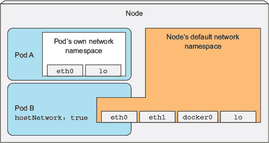
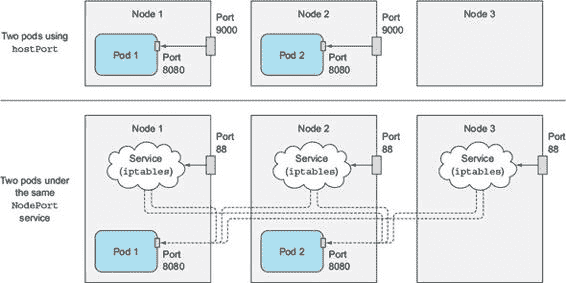
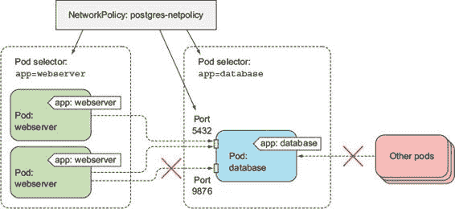
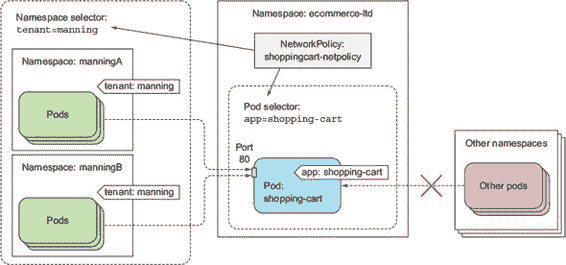

第十三章. 保护集群节点和网络

本章涵盖

+   在 Pod 中使用节点的默认 Linux 命名空间

+   以不同用户运行容器

+   运行特权容器

+   添加或删除容器的内核能力

+   定义安全策略以限制 Pod 可以做什么

+   保护 Pod 网络

在上一章中，我们讨论了保护 API 服务器。如果一个攻击者获得了对 API 服务器的访问权限，他们可以通过将他们的代码打包成容器镜像并在 Pod 中运行它来执行任何他们喜欢的事情。但他们能造成真正的损害吗？容器不是与其他容器以及它们运行的节点隔离的吗？

不一定。在本章中，你将学习如何允许 Pod 访问它们运行的节点上的资源。你还将学习如何配置集群，使用户无法随意使用他们的 Pod。然后，在章节的最后部分，你还将学习如何保护 Pod 用于通信的网络。

13.1\. 在 Pod 中使用主机节点的命名空间

Pod 中的容器通常在单独的 Linux 命名空间中运行，这使它们的进程与其他容器或节点默认命名空间中运行的进程隔离。

例如，我们了解到每个 Pod 都有自己的 IP 和端口空间，因为它使用自己的网络命名空间。同样，每个 Pod 都有自己的进程树，因为它有自己的 PID 命名空间，它还使用自己的 IPC 命名空间，只允许同一 Pod 中的进程通过进程间通信机制（IPC）相互通信。

13.1.1\. 在 Pod 中使用节点的网络命名空间

某些 Pod（通常是系统 Pod）需要在主机的默认命名空间中运行，这样它们就可以查看和操作节点级别的资源和设备。例如，一个 Pod 可能需要使用节点的网络适配器而不是自己的虚拟网络适配器。这可以通过将 Pod 规范中的 `hostNetwork` 属性设置为 `true` 来实现。

在这种情况下，Pod 可以使用节点的网络接口，而不是拥有自己的集合，如图 13.1 所示。这意味着 Pod 没有自己的 IP 地址，如果它运行一个绑定到端口的进程，该进程将绑定到节点的端口。

图 13.1\. `hostNetwork: true` 的 Pod 使用节点的网络接口而不是自己的。

你可以尝试运行这样的 Pod。下面的列表显示了一个示例 Pod 清单。

列表 13.1\. 使用节点网络命名空间的 Pod：pod-with-host-network.yaml

`apiVersion: v1 kind: Pod metadata:   name: pod-with-host-network spec:   hostNetwork: true` `1` `containers:   - name: main     image: alpine     command: ["/bin/sleep", "999999"]`

+   1 使用主机节点的网络命名空间

在你运行 Pod 之后，你可以使用以下命令来查看它确实使用了主机的网络命名空间（例如，它可以看到所有主机的网络适配器）。

列表 13.2\. 使用主机网络命名空间的 pod 中的网络接口

`$ kubectl exec pod-with-host-network ifconfig` `docker0   链路封装:以太网  硬件地址 02:42:14:08:23:47         inet 地址:172.17.0.1  广播:0.0.0.0  子网掩码:255.255.0.0         ...  eth0      链路封装:以太网  硬件地址 08:00:27:F8:FA:4E         inet 地址:10.0.2.15  广播:10.0.2.255  子网掩码:255.255.255.0         ...  lo        链路封装:本地回环         inet 地址:127.0.0.1  子网掩码:255.0.0.0         ...  veth1178d4f 链路封装:以太网  硬件地址 1E:03:8D:D6:E1:2C         inet6 地址: fe80::1c03:8dff:fed6:e12c/64 范围:链路         UP 广播 运行 多播  MTU:1500  度量:1 ...`

当 Kubernetes 控制平面组件作为 pod 部署时（例如，当您使用 `kubeadm` 部署您的集群，如附录 B 所解释的那样），您会发现这些 pod 使用 `hostNetwork` 选项，实际上使它们表现得好像它们没有在 pod 内运行。

13.1.2\. 不使用主机网络命名空间绑定到主机端口

一个相关的功能允许 pod 绑定到节点默认命名空间中的端口，但仍然有自己的网络命名空间。这是通过在 `spec.containers.ports` 字段中定义的容器端口之一使用 `hostPort` 属性来实现的。

不要混淆使用 `hostPort` 的 pod 与通过 `NodePort` 服务暴露的 pod。它们是两件不同的事情，如图 13.2 所解释的那样。

图 13.2\. 使用 `hostPort` 的 pod 与位于 `NodePort` 服务后面的 pod 之间的区别。

在图中，您首先会注意到，当一个 pod 使用 `hostPort` 时，节点端口的连接会直接转发到该节点上运行的 pod，而使用 `NodePort` 服务时，节点端口的连接会转发到随机选择的 pod（可能在另一个节点上）。另一个区别是，使用 `hostPort` 的 pod，节点端口仅在运行此类 pod 的节点上绑定，而 `NodePort` 服务将端口绑定到所有节点，即使在那些没有运行此类 pod 的节点上（如图中的节点 3）。

重要的是要理解，如果一个 pod 使用特定的主机端口，则每个节点只能调度一个 pod 实例，因为两个进程不能绑定到同一个主机端口。调度器在调度 pod 时会考虑这一点，因此不会将多个 pod 调度到同一个节点，如图 13.3 所示。如果您有三个节点并想部署四个 pod 副本，则只有三个会被调度（一个 pod 将保持挂起状态）。

图 13.3\. 如果使用主机端口，则只能将单个 pod 实例调度到节点。

让我们看看如何在 pod 的 YAML 定义中定义 `hostPort`。以下列表显示了运行您的 `kubia` pod 并将其绑定到节点端口 9000 的 YAML。

列表 13.3\. 将 pod 绑定到节点端口空间中的端口：kubia-hostport.yaml

`apiVersion: v1 kind: Pod metadata:   name: kubia-hostport spec:   containers:   - image: luksa/kubia     name: kubia     ports:     - containerPort: 8080` `1` `hostPort: 9000` `2` `protocol: TCP`

+   1 容器可以通过 pod 的 IP 地址的 8080 端口访问。

+   2 它也可以通过其部署的节点的 9000 端口访问。

在你创建这个 pod 之后，你可以通过它被调度到的节点的 9000 端口访问它。如果你有多个节点，你会看到你不能通过其他节点的该端口访问 pod。

注意

如果你正在 GKE 上尝试此操作，你需要使用`gcloud compute firewall-rules`正确配置防火墙，就像你在第五章中做的那样章节 5。

`hostPort`功能主要用于暴露系统服务，这些服务使用 DaemonSets 部署到每个节点。最初，人们也用它来确保同一 pod 的两个副本永远不会调度到同一节点，但现在你有更好的方法来实现这一点——它将在第十六章中解释章节 16。

13.1.3\. 使用节点的 PID 和 IPC 命名空间

与`hostNetwork`选项类似的是`hostPID`和`hostIPC` pod 规范属性。当你将它们设置为`true`时，pod 的容器将使用节点的 PID 和 IPC 命名空间，允许在容器中运行的进程看到节点上的所有其他进程或通过 IPC 与它们通信。以下列表提供了一个示例。

列表 13.4\. 使用主机的 PID 和 IPC 命名空间：pod-with-host-pid-and-ipc.yaml

`apiVersion: v1 kind: Pod metadata:   name: pod-with-host-pid-and-ipc spec:   hostPID: true` `1` `hostIPC: true` `2` `containers:   - name: main     image: alpine     command: ["/bin/sleep", "999999"]`

+   1 你希望 pod 使用主机的 PID 命名空间。

+   2 你还希望 pod 使用主机的 IPC 命名空间。

你会记得，pods 通常只能看到它们自己的进程，但如果你运行这个 pod 然后从其容器中列出进程，你会看到在主机节点上运行的所有进程，而不仅仅是容器中运行的进程，如下面的列表所示。

列表 13.5\. `hostPID: true`的 pod 中可见的进程

`$ kubectl exec pod-with-host-pid-and-ipc ps aux` `PID   USER     TIME   COMMAND     1 root       0:01 /usr/lib/systemd/systemd --switched-root --system ...     2 root       0:00 [kthreadd]     3 root       0:00 [ksoftirqd/0]     5 root       0:00 [kworker/0:0H]     6 root       0:00 [kworker/u2:0]     7 root       0:00 [migration/0]     8 root       0:00 [rcu_bh]     9 root       0:00 [rcu_sched]    10 root       0:00 [watchdog/0] ...`

通过将`hostIPC`属性设置为`true`，pod 中的容器进程也可以通过进程间通信（Inter-Process Communication）与节点上运行的所有其他进程进行通信。

13.2\. 配置容器的安全上下文

除了允许 Pod 使用主机的 Linux 命名空间外，还可以通过 `security-Context` 属性在 Pod 及其容器上配置其他安全相关功能，这些属性可以直接在 Pod 规范下以及单个容器的规范内部指定。

理解安全上下文中可配置的内容

配置安全上下文允许你执行各种操作：

+   指定容器中进程将运行的用户（用户的 ID）。

+   防止容器以 root（容器默认运行的默认用户通常在容器镜像本身中定义，因此你可能希望防止容器以 root 运行）运行。

+   以特权模式运行容器，使其能够完全访问节点的内核。

+   通过添加或删除能力来配置细粒度的权限，这与在特权模式下运行容器以授予所有可能的权限形成对比。

+   将 SELinux（安全增强型 Linux）选项设置为强锁定容器。

+   防止进程向容器的文件系统写入。

我们将在下一节中探讨这些选项。

不指定安全上下文运行 Pod

首先，运行具有默认安全上下文选项的 Pod（通过完全不指定它们），这样你可以看到它与具有自定义安全上下文的 Pod 的行为有何不同：

`$ kubectl run pod-with-defaults --image alpine --restart Never``-- /bin/sleep 999999` `pod "pod-with-defaults" created`

让我们看看容器运行的用户和组 ID，以及它属于哪些组。你可以通过在容器内部运行 `id` 命令来查看：

`$ kubectl exec pod-with-defaults id` `uid=0(root) gid=0(root) groups=0(root), 1(bin), 2(daemon), 3(sys), 4(adm), 6(disk), 10(wheel), 11(floppy), 20(dialout), 26(tape), 27(video)`

容器以用户 ID (`uid`) `0` 运行，即 `root`，并且以组 ID (`gid`) `0`（也是 `root`）运行。它也是多个其他组的成员。

注意

容器运行的用户由容器镜像指定。在 Dockerfile 中，这是通过使用 `USER` 指令来完成的。如果省略，容器将以 root 运行。

现在，你将运行一个容器以不同用户运行的 Pod。

13.2.1\. 以特定用户运行容器

要在不同于容器镜像中内置的用户 ID 下运行 Pod，你需要设置 Pod 的 `securityContext.runAsUser` 属性。你将使容器以用户 `guest` 运行，其用户 ID 在 alpine 容器镜像中为 `405`，如下所示。

列表 13.6\. 以特定用户运行容器：pod-as-user-guest.yaml

`apiVersion: v1 kind: Pod metadata:   name: pod-as-user-guest spec:   containers:   - name: main     image: alpine     command: ["/bin/sleep", "999999"]     securityContext:       runAsUser: 405` `1`

+   1 你需要指定用户 ID，而不是用户名（ID 405 对应于 guest 用户）。

现在，为了看到 `runAsUser` 属性的效果，像之前一样在这个新 pod 中运行 `id` 命令：

`$ kubectl exec pod-as-user-guest id` `uid=405(guest) gid=100(users)`

如请求，容器正在以 `guest` 用户运行。

13.2.2\. 防止容器以 root 用户运行

如果你不在乎容器运行的用户是谁，但仍然想防止它以 root 用户运行，会怎样？

想象一下，部署了一个使用 Dockerfile 中的 `USER daemon` 指令构建的容器镜像，该指令使得容器以 `daemon` 用户运行。如果攻击者获取了对你的镜像仓库的访问权限，并在相同的标签下推送了不同的镜像，会怎样？攻击者的镜像被配置为以 root 用户运行。当 Kubernetes 调度你的 pod 的新实例时，Kubelet 将下载攻击者的镜像并运行其中放入的任何代码。

尽管容器大多数情况下与主机系统隔离，但以 root 用户运行它们的进程仍然被认为是一种不良做法。例如，当主机目录被挂载到容器中时，如果容器中运行的过程是以 root 运行的，它将完全访问挂载的目录，而如果它是以非 root 运行的，则不会。

为了防止之前描述的攻击场景，你可以指定 pod 的容器需要以非 root 用户运行，如下面的列表所示。

列表 13.7\. 防止容器以 root 用户运行：pod-run-as-non-root.yaml

`apiVersion: v1 kind: Pod metadata: name: pod-run-as-non-root spec: containers: - name: main image: alpine command: ["/bin/sleep", "999999"] securityContext: runAsNonRoot: true`

+   1 这个容器只允许以非 root 用户运行。

如果你部署了这个 pod，它会被调度，但不会被允许运行：

`$ kubectl get po pod-run-as-non-root` `NAME                 READY  STATUS pod-run-as-non-root  0/1    container has runAsNonRoot and image will run`  as root`

现在，如果有人篡改你的容器镜像，他们也不会走得太远。

13.2.3\. 以特权模式运行 pod

有时 pod 需要做它在运行的节点上能做的一切，比如使用受保护的系统设备或其他内核功能，这些功能对常规容器是不可访问的。

这样的 pod 的一个例子是 kube-proxy pod，它需要修改节点的 `iptables` 规则以使服务工作，正如在第十一章中解释的那样。第十一章。如果你遵循附录 B 中的说明并使用 `kubeadm` 部署集群，你会看到每个集群节点都运行一个 kube-proxy pod，你可以检查其 YAML 规范以查看它使用的所有特殊功能。

要完全访问节点的内核，pod 的容器以特权模式运行。这是通过将容器 `security-Context` 属性中的 `privileged` 属性设置为 `true` 来实现的。您将从以下列表中的 YAML 创建一个特权 pod。

列表 13.8\. 带有特权容器的 pod：pod-privileged.yaml

`apiVersion: v1 kind: Pod metadata:   name: pod-privileged spec:   containers:   - name: main     image: alpine     command: ["/bin/sleep", "999999"]     securityContext:       privileged: true` `1`

+   1 此容器将以特权模式运行

继续部署此 pod，以便您可以将其与您之前运行的非特权 pod 进行比较。

如果您熟悉 Linux，您可能知道它有一个特殊的文件目录，称为 /dev，其中包含系统上所有设备的设备文件。这些不是磁盘上的常规文件，而是用于与设备通信的特殊文件。让我们看看您之前部署的非特权容器（`pod-with-defaults` pod）中可见的设备，如下所示，通过列出其 /dev 目录中的文件。

列表 13.9\. 非特权 pod 中可用的设备列表

`$ kubectl exec -it pod-with-defaults ls /dev` `core             null             stderr           urandom fd               ptmx             stdin            zero full             pts              stdout fuse             random           termination-log mqueue           shm              tty`

列表显示了所有设备。列表相当短。现在，将此与以下列表进行比较，该列表显示了您的特权 pod 可以看到的设备文件。

列表 13.10\. 特权 pod 中可用的设备列表

`$ kubectl exec -it pod-privileged ls /dev` `autofs              snd                 tty46 bsg                 sr0                 tty47 btrfs-control       stderr              tty48 core                stdin               tty49 cpu                 stdout              tty5 cpu_dma_latency     termination-log     tty50 fd                  tty                 tty51 ...                 ...                 ...`

我没有包括整个列表，因为列表太长，不适合本书，但很明显，设备列表比之前长得多。实际上，特权容器可以看到宿主节点上的所有设备。这意味着它可以自由使用任何设备。

例如，当我想要在运行在树莓派上的 pod 中控制连接到它的 LED 时，我必须使用类似这样的特权模式。

13.2.4\. 向容器添加单个内核功能

在前面的部分中，您看到了赋予容器无限权力的方法之一。在过去的岁月里，传统的 UNIX 实现只区分特权和非特权进程，但多年来，Linux 通过内核能力支持了一个更细粒度的权限系统。

与将容器设置为特权并赋予它无限权限相比，一种更安全的方法（从安全角度考虑）是只给它提供它真正需要的内核功能访问权限。Kubernetes 允许您为每个容器添加能力或删除其中的一部分，这允许您微调容器的权限并限制攻击者潜在入侵的影响。

例如，容器通常不允许更改系统时间（硬件时钟的时间）。您可以通过尝试在您的 `pod-with-defaults` pod 中设置时间来确认这一点：

`$ kubectl exec -it pod-with-defaults -- date +%T -s "12:00:00"` `date: can't set date: Operation not permitted`

如果您想允许容器更改系统时间，您可以将名为 `CAP_SYS_TIME` 的能力添加到容器的 `capabilities` 列表中，如下所示。

列表 13.11 添加 `CAP_SYS_TIME` 能力：pod-add-settime-capability.yaml

`apiVersion: v1 kind: Pod metadata:   name: pod-add-settime-capability spec:   containers:   - name: main     image: alpine     command: ["/bin/sleep", "999999"]     securityContext:` `1` `capabilities:` `1` `add:` `2` `- SYS_TIME` `2`

+   1 能力是在 securityContext 属性下添加或删除的。

+   2 您正在添加 SYS_TIME 能力。

| |
| --- |

注意

Linux 内核能力通常以 `CAP_.` 为前缀。但在 pod 规范中指定它们时，必须省略前缀。

| |
| --- |

如果您在这个新 pod 的容器中运行相同的命令，系统时间将成功更改：

`$ kubectl exec -it pod-add-settime-capability -- date +%T -s "12:00:00"` `12:00:00` `$ kubectl exec -it pod-add-settime-capability -- date` `Sun May  7 12:00:03 UTC 2017`

| |
| --- |

警告

如果您亲自尝试，请注意这可能会使您的工作节点变得不可用。在 Minikube 中，尽管系统时间被网络时间协议（NTP）守护进程自动重置，但我不得不重新启动虚拟机来调度新的 pod。

| |
| --- |

您可以通过检查运行 pod 的节点上的时间来确认节点的时间已更改。在我的情况下，我使用 Minikube，所以我只有一个节点，我可以这样获取它的时间：

`$ minikube ssh date` `Sun May  7 12:00:07 UTC 2017`

以这种方式添加能力比使用 `privileged: true` 给容器赋予全部权限要好得多。诚然，这需要您了解并理解每个能力的作用。

| |
| --- |

小贴士

您可以在 Linux man 页面中找到 Linux 内核能力的列表。

| |
| --- |

13.2.5 从容器中删除能力

你已经看到了如何添加能力，但你也可以移除容器可能拥有的能力。例如，默认授予容器的能力包括`CAP_CHOWN`能力，它允许进程更改文件系统中的文件所有权。

你可以通过将`pod-with-defaults` pod 中的/tmp 目录的所有权更改为`guest`用户来验证这一点，例如：

`$ kubectl exec pod-with-defaults chown guest /tmp``$ kubectl exec pod-with-defaults -- ls -la / | grep tmp` `drwxrwxrwt    2 guest    root             6 May 25 15:18 tmp`

为了防止容器执行此操作，你需要通过在容器的`securityContext.capabilities.drop`属性下列出它来移除能力，如下面的列表所示。

列表 13.12\. 从容器中移除能力：pod-drop-chown-capability.yaml

`apiVersion: v1 kind: Pod metadata:   name: pod-drop-chown-capability spec:   containers:   - name: main     image: alpine     command: ["/bin/sleep", "999999"]     securityContext:       capabilities:         drop:` `1` `- CHOWN` `1`

+   1 你没有允许这个容器更改文件所有权。

通过移除`CHOWN`能力，你将不允许在这个 pod 中更改/tmp 目录的所有权：

`$ kubectl exec pod-drop-chown-capability chown guest /tmp` `chown: /tmp: Operation not permitted`

你几乎完成了对容器安全上下文选项的探索。让我们再看一个。

13.2.6\. 防止进程向容器的文件系统写入

你可能希望防止在容器中运行的进程向容器的文件系统写入，而只允许它们写入挂载的卷。你主要会出于安全原因这样做。

让我们想象你正在运行一个具有隐藏漏洞的 PHP 应用程序，这个漏洞允许攻击者向文件系统写入。PHP 文件在构建时被添加到容器镜像中，并从容器的文件系统中提供服务。由于这个漏洞，攻击者可以修改这些文件并向其中注入恶意代码。

这些类型的攻击可以通过防止容器向其文件系统写入来阻止，通常应用程序的可执行代码存储在该文件系统中。这是通过将容器的`securityContext.readOnlyRootFilesystem`属性设置为`true`来实现的，如下面的列表所示。

列表 13.13\. 具有只读文件系统的容器：pod-with-readonly-filesystem.yaml

`apiVersion: v1 kind: Pod metadata:   name: pod-with-readonly-filesystem spec:   containers:   - name: main     image: alpine     command: ["/bin/sleep", "999999"]     securityContext:` `1` `readOnlyRootFilesystem: true` `1` `volumeMounts:` `2` `- name: my-volume` `2` `mountPath: /volume` `2` `readOnly: false` `2` `volumes:   - name: my-volume     emptyDir:`

+   1 这个容器的文件系统无法写入...

+   2 ...但是写入/volume 是被允许的，因为在那里挂载了一个卷。

当你部署这个 Pod 时，容器以 root 用户身份运行，对`/`目录有写权限，但尝试在那里写入文件会失败：

`$ kubectl exec -it pod-with-readonly-filesystem touch /new-file` `touch: /new-file: Read-only file system`

另一方面，写入挂载的卷是允许的：

`$ kubectl exec -it pod-with-readonly-filesystem touch /volume/newfile``$ kubectl exec -it pod-with-readonly-filesystem -- ls -la /volume/newfile` `-rw-r--r--    1 root     root       0 May  7 19:11 /mountedVolume/newfile`

如示例所示，当你将容器的文件系统设置为只读时，你可能希望在每个应用程序写入的目录中挂载一个卷（例如，日志、磁盘缓存等）。

小贴士

为了提高安全性，在生产环境中运行 Pod 时，将它们的容器`readOnlyRootFilesystem`属性设置为`true`。

在 Pod 级别设置安全上下文选项

在所有这些例子中，你都设置了单个容器的安全上下文。这些选项中的几个也可以在 Pod 级别设置（通过`pod.spec.security-Context`属性）。它们作为 Pod 中所有容器的默认值，但可以在容器级别被覆盖。Pod 级别的安全上下文还允许你设置额外的属性，我们将在下一节中解释。

13.2.7. 当容器以不同用户运行时共享卷

在第六章中，我们解释了如何使用卷在 Pod 的容器之间共享数据。你在一个容器中写入文件并在另一个容器中读取它们时没有遇到任何麻烦。

但这仅仅是因为两个容器都以 root 用户身份运行，从而能够访问卷中的所有文件。现在想象一下使用我们之前解释的`runAsUser`选项。你可能需要以两个不同的用户运行这两个容器（也许你正在使用两个第三方容器镜像，每个镜像在其自己的特定用户下运行其进程）。如果这两个容器使用卷来共享文件，它们可能不一定能够读取或写入对方的文件。

这就是为什么 Kubernetes 允许你为在容器中运行的所有 Pod 指定补充组，无论它们以什么用户 ID 运行，都可以共享文件。这是通过以下两个属性完成的：

+   `fsGroup`

+   `supplementalGroups`

他们所做的事情最好通过一个例子来解释，所以让我们看看如何在 Pod 中使用它们，然后看看它们的效果。接下来的列表描述了一个包含两个容器共享相同空间的 Pod。

列表 13.14. `fsGroup` & `supplementalGroups`: pod-with-shared-volume-fsgroup.yaml

`apiVersion: v1 kind: Pod metadata:   name: pod-with-shared-volume-fsgroup spec:   securityContext:` `1` `fsGroup: 555` `1` `supplementalGroups: [666, 777]` `1` `containers:   - name: first     image: alpine     command: ["/bin/sleep", "999999"]     securityContext:` `2` `runAsUser: 1111` `2` `volumeMounts:` `3` `- name: shared-volume` `3` `mountPath: /volume       readOnly: false   - name: second     image: alpine     command: ["/bin/sleep", "999999"]     securityContext:` `4` `runAsUser: 2222` `4` `volumeMounts:` `3` `- name: shared-volume` `3` `mountPath: /volume       readOnly: false   volumes:` `3` `- name: shared-volume` `3` `emptyDir:`

+   1 fsGroup 和 supplementalGroups 在 Pod 级别的安全上下文中定义。

+   2 第一个容器以用户 ID 1111 运行。

+   3 两个容器使用相同的卷

+   4 第二个容器以用户 ID 2222 运行。

在创建此 Pod 之后，在其第一个容器中运行一个 shell，查看容器运行时的用户和组 ID：

`$ kubectl exec -it pod-with-shared-volume-fsgroup -c first sh``/ $ id` `uid=1111 gid=0(root) groups=555,666,777`

`id` 命令显示容器正在以用户 ID `1111` 运行，正如 Pod 定义中所指定。实际组 ID 是 `0(root)`，但组 ID `555`、`666` 和 `777` 也与用户相关联。

在 Pod 定义中，您将 `fsGroup` 设置为 `555`。因此，挂载的卷将由组 ID `555` 拥有，如下所示：

`/ $ ls -l / | grep volume` `drwxrwsrwx    2 root     555              6 May 29 12:23 volume`

如果您在挂载卷的目录中创建文件，该文件将由用户 ID `1111`（这是容器运行时的用户 ID）和组 ID `555` 所拥有：

`/ $ echo foo > /volume/foo``/ $ ls -l /volume` `total 4 -rw-r--r--    1` `1111     555``              4 May 29 12:25 foo`

这与为新创建的文件设置所有权的常规方式不同。通常，用户的实际组 ID（在你的情况下是`0`）在用户创建文件时使用。您可以通过在容器的文件系统中创建文件而不是在卷中创建文件来查看这一点：

`/ $ echo foo > /tmp/foo``/ $ ls -l /tmp` `total 4 -rw-r--r--    1 1111` `root``             4 May 29 12:41 foo`

如您所见，当进程在卷中创建文件时使用`fsGroup`安全上下文属性（但这取决于所使用的卷插件），而`supplementalGroups`属性定义了与用户关联的附加组 ID 列表。

这部分关于容器安全上下文配置的内容到此结束。接下来，我们将看到集群管理员如何限制用户进行此类操作。

13.3. 限制 Pod 中安全相关功能的用法

上一节中的示例展示了部署 pod 的人如何通过在节点上部署一个特权 pod 等方式，在任意集群节点上做他们想做的事情。显然，必须有一种机制来防止用户执行所解释的部分或全部操作。集群管理员可以通过创建一个或多个 PodSecurityPolicy 资源来限制之前描述的安全相关功能的使用。

13.3.1. PodSecurityPolicy 资源介绍

PodSecurityPolicy 是一个集群级别的（非命名空间）资源，它定义了用户可以在他们的 pod 中使用或不能使用的与安全相关的功能。维护 PodSecurityPolicy 资源中配置的策略的任务由运行在 API 服务器上的 PodSecurity-Policy 接受控制插件执行（我们在第十一章中解释了接受控制插件章节 11）。

| |
| --- |

注意

PodSecurityPolicy 接受控制插件可能未在您的集群中启用。在运行以下示例之前，请确保它已启用。如果您使用 Minikube，请参考下一侧边栏。

| |
| --- |

当有人将 pod 资源发布到 API 服务器时，PodSecurityPolicy 接受控制插件会根据配置的 PodSecurityPolicies 验证 pod 定义。如果 pod 符合集群的策略，它将被接受并存储到 etcd 中；否则，它将被立即拒绝。插件还可以根据策略中配置的默认值修改 pod 资源。

| |
| --- |

在 Minikube 中启用 RBAC 和 PodSecurityPolicy 接受控制

我使用 Minikube 版本 v0.19.0 来运行这些示例。该版本既没有启用 PodSecurityPolicy 接受控制插件，也没有启用 RBAC 授权，这在部分练习中是必需的。一项练习还需要以不同的用户身份进行身份验证，因此您还需要在定义在文件中的用户处启用基本身份验证插件。

要运行所有这些插件都启用的 Minikube，您可能需要使用此（或类似）命令，具体取决于您使用的版本：

`$ minikube start --extra-config apiserver.Authentication.PasswordFile.`  `BasicAuthFile=/etc/kubernetes/passwd --extra-config=apiserver.`  `Authorization.Mode=RBAC --extra-config=apiserver.GenericServerRun`  `Options.AdmissionControl=NamespaceLifecycle,LimitRanger,Service`  `Account,PersistentVolumeLabel,DefaultStorageClass,ResourceQuota,`  `DefaultTolerationSeconds,PodSecurityPolicy`

在您在命令行选项中指定的密码文件创建之前，API 服务器不会启动。以下是创建文件的方法：

`$ cat <<EOF | minikube ssh sudo tee /etc/kubernetes/passwd password,alice,1000,basic-user password,bob,2000,privileged-user EOF`

您将在第十三章的代码存档 Chapter13/minikube-with-rbac-and-psp-enabled.sh 中找到一个运行这两个命令的 shell 脚本。

| |
| --- |

理解 PodSecurityPolicy 可以做什么

PodSecurityPolicy 资源定义了如下内容：

+   一个 pod 是否可以使用主机的 IPC、PID 或网络命名空间

+   pod 可以绑定到哪些主机端口

+   容器可以运行哪些用户 ID

+   是否可以创建具有特权容器的 pod

+   哪些内核能力是被允许的，哪些是默认添加的，哪些总是被丢弃

+   容器可以使用哪些 SELinux 标签

+   容器是否可以使用可写根文件系统

+   容器可以运行在哪些文件系统组中

+   pod 可以使用哪些卷类型

如果你已经阅读到本章的这一部分，那么前一个列表中的所有内容都应该熟悉。最后一个条目也应该相当清晰。

检查一个示例 PodSecurityPolicy

以下列表显示了一个示例 PodSecurityPolicy，它阻止 pod 使用主机的 IPC、PID 和网络命名空间，并阻止运行特权容器以及使用大多数主机端口（除了 10000-11000 和 13000-14000 的端口）。该策略不对容器可以运行的用户、组或 SELinux 组设置任何约束。

列表 13.15\. 一个示例 PodSecurityPolicy：pod-security-policy.yaml

`apiVersion: extensions/v1beta1 kind: PodSecurityPolicy metadata:   name: default spec:   hostIPC: false` `1` `hostPID: false` `1` `hostNetwork: false` `1` `hostPorts:` `2` `- min: 10000` `2` `max: 11000` `2` `- min: 13000` `2` `max: 14000` `2` `privileged: false` `3` `readOnlyRootFilesystem: true` `4` `runAsUser:` `5` `rule: RunAsAny` `5` `fsGroup:` `5` `rule: RunAsAny` `5` `supplementalGroups:` `5` `rule: RunAsAny` `5` `seLinux:` `6` `rule: RunAsAny` `6` `volumes:` `7` `- '*'` `7`

+   1 容器不允许使用主机的 IPC、PID 或网络命名空间。

+   2 它们只能绑定到主机端口 10000 到 11000（包含）或主机端口 13000 到 14000。

+   3 容器不能以特权模式运行。

+   4 容器被强制以只读根文件系统运行。

+   5 容器可以以任何用户和任何组运行。

+   6 它们还可以使用它们想要的任何 SELinux 组。

+   7 所有卷类型都可以在 pod 中使用。

在示例中指定的大多数选项应该是自解释的，尤其是如果你已经阅读了前面的章节。在此 PodSecurityPolicy 资源发布到集群之后，API 服务器将不再允许你部署之前使用的特权 pod。例如

`$ kubectl create -f pod-privileged.yaml` `Error from server (Forbidden): error when creating "pod-privileged.yaml": pods "pod-privileged" is forbidden: unable to validate against any pod security policy: [spec.containers[0].securityContext.privileged: Invalid value: true: Privileged containers are not allowed]`

同样，你不能再部署想要使用主机 PID、IPC 或网络命名空间的 pod。此外，因为你将策略中的 `readOnlyRootFilesystem` 设置为 `true`，所以所有 pod 中的容器文件系统都将为只读（容器只能写入卷）。

13.3.2\. 理解 runAsUser、fsGroup 和 supplementalGroups 策略

之前示例中的策略没有对容器可以运行的哪些用户和组施加任何限制，因为你在 `run-As-User`、`fsGroup` 和 `supplementalGroups` 字段中使用了 `RunAsAny` 规则。如果你想限制允许的用户或组 ID 列表，请将规则更改为 `MustRunAs` 并指定允许的 ID 范围。

使用 MustRunAs 规则

让我们看看一个例子。为了仅允许容器以用户 ID `2` 运行，并将默认文件系统组 ID 和补充组 ID 限制在 `2–10` 或 `20–30`（全部包含），你需要在 PodSecurityPolicy 资源中包含以下片段。

列表 13.16\. 指定容器必须运行的 ID：psp-must-run-as.yaml

`runAsUser:     rule: MustRunAs     ranges:     - min: 2` `1` `max: 2` `1` `fsGroup:     rule: MustRunAs     ranges:     - min: 2` `2` `max: 10` `2` `- min: 20` `2` `max: 30` `2` `supplementalGroups:     rule: MustRunAs     ranges:     - min: 2` `2` `max: 10` `2` `- min: 20` `2` `max: 30` `2`

+   1 添加一个范围，最小值等于最大值，以设置一个特定的 ID。

+   2 支持多个范围——在这里，组 ID 可以是 2–10 或 20–30（包含）。

如果 pod 规范尝试将其中任何一个字段设置为这些范围之外的值，则 API 服务器将不接受该 pod。要尝试此操作，请删除之前的 PodSecurity-Policy 并从 psp-must-run-as.yaml 文件创建新的一个。

注意

更改策略对现有 pod 没有影响，因为 Pod-Security-Policies 仅在创建或更新 pod 时强制执行。

在策略范围之外部署具有 runAsUser 的 pod

如果你尝试部署之前提到的 pod-as-user-guest.yaml 文件，其中指定容器应以用户 ID `405` 运行，API 服务器将拒绝该 pod：

`$ kubectl create -f pod-as-user-guest.yaml` `错误来自服务器（禁止）：创建 "pod-as-user-guest.yaml" 时出错：pods "pod-as-user-guest" 被禁止：无法验证任何 pod 安全策略：[securityContext.runAsUser: 无效值：405：容器 main 上的 UID 不符合所需范围。找到 405，允许：[{2 2}]]`

好的，这是显而易见的。但是，如果你部署了一个没有设置 `runAs-User` 属性的 pod，但用户 ID 已嵌入到容器镜像中（使用 Dockerfile 中的 `USER` 指令），会发生什么？

使用超出范围的用户 ID 部署容器镜像的 pod

我为书中使用的 Node.js 应用程序创建了一个替代镜像。该镜像配置为容器将以用户 ID 5 运行。该镜像的 Dockerfile 如下所示。

列表 13.17\. 包含 USER 指令的 Dockerfile：kubia-run-as-user-5/Dockerfile

`FROM node:7 ADD app.js /app.js USER 5` `1` `ENTRYPOINT ["node", "app.js"]`

+   1 从此镜像运行的容器将以用户 ID 5 运行。

我将镜像推送到 Docker Hub，命名为`luksa/kubia-run-as-user-5`。如果我用这个镜像部署一个 Pod，API 服务器不会拒绝它：

`$ kubectl run run-as-5 --image luksa/kubia-run-as-user-5 --restart Never` `pod "run-as-5" created`

与之前不同，API 服务器接受了 Pod，并且 Kubelet 已经运行了其容器。让我们看看容器正在以哪个用户 ID 运行：

`$ kubectl exec run-as-5 -- id` `uid=2(bin) gid=2(bin) groups=2(bin)`

正如你所见，容器正在以用户 ID `2` 运行，这是你在 PodSecurityPolicy 中指定的 ID。PodSecurityPolicy 可以用来覆盖容器镜像中硬编码的用户 ID。

在 runAsUser 字段中使用 MustRunAsNonRoot 规则

对于`runAsUser`字段，可以使用一个额外的规则：`MustRunAsNonRoot`。正如其名所示，它阻止用户部署以 root 身份运行的容器。要么容器规范必须指定一个`runAsUser`字段，该字段不能为零（零是 root 用户的 ID），要么容器镜像本身必须以非零用户 ID 运行。我们之前解释了为什么这是好事。

13.3.3\. 配置允许、默认和禁止的能力

如你所学，容器可以以特权模式或非特权模式运行，你可以通过在每个容器中添加或删除 Linux 内核能力来定义更细粒度的权限配置。有三个字段影响容器可以使用或不能使用的功能：

+   `allowedCapabilities`

+   `defaultAddCapabilities`

+   `requiredDropCapabilities`

我们首先来看一个例子，然后讨论这三个字段各自的作用。下面的列表显示了一个 PodSecurityPolicy 资源片段，定义了与能力相关的三个字段。

列表 13.18\. 在 PodSecurityPolicy 中指定能力：psp-capabilities.yaml

`apiVersion: extensions/v1beta1 kind: PodSecurityPolicy spec:   allowedCapabilities:` `1` `- SYS_TIME` `1` `defaultAddCapabilities:` `2` `- CHOWN` `2` `requiredDropCapabilities:` `3` `- SYS_ADMIN` `3` `- SYS_MODULE` `3` `...`

+   1 允许容器添加`SYS_TIME`能力。

+   2 自动将`CHOWN`能力添加到每个容器。

+   3 要求容器放弃`SYS_ADMIN`和`SYS_MODULE`能力。

注意

`SYS_ADMIN`能力允许一系列管理操作，而`SYS_MODULE`能力允许加载和卸载 Linux 内核模块。

指定可以添加到容器中的能力

`allowedCapabilities`字段用于指定 Pod 作者可以在容器规范中的`securityContext.capabilities`字段中添加哪些能力。在先前的某个例子中，你向你的容器添加了`SYS_TIME`能力。如果 Pod-Security-Policy 准入控制插件已被启用，你将无法添加该能力，除非它在 PodSecurityPolicy 中指定，如列表 13.18 所示。

向所有容器添加能力

在`defaultAddCapabilities`字段下列出的所有功能都将添加到每个部署 Pod 的容器中。如果用户不希望某些容器具有这些功能，他们需要在那些容器的规范中明确删除它们。

列表 13.18 中的示例启用了将`CAP_CHOWN`功能自动添加到每个容器的功能，从而允许在容器中运行的进程更改容器中文件的拥有权（例如，使用`chown`命令）。

从容器中删除功能

本例中的最后一个字段是`requiredDropCapabilities`。我必须承认，一开始这个名称对我来说有些奇怪，但它并不复杂。该字段中列出的功能将自动从每个容器中删除（PodSecurityPolicy 准入控制插件将它们添加到每个容器的`security-Context.capabilities.drop`字段）。

如果用户尝试创建一个 Pod，并明确添加策略`requiredDropCapabilities`字段中列出的功能之一，Pod 将被拒绝：

`$ kubectl create -f pod-add-sysadmin-capability.yaml` `Error from server (Forbidden): error when creating "pod-add-sysadmin-capability.yaml": pods "pod-add-sysadmin-capability" is forbidden: unable to validate against any pod security policy: [capabilities.add: Invalid value: "SYS_ADMIN": capability may not be added]`

13.3.4\. 限制 Pod 可以使用的卷类型

PodSecurityPolicy 资源可以做的最后一件事是定义用户可以向其 Pod 添加哪些卷类型。至少，PodSecurityPolicy 应该允许使用至少`emptyDir`、`configMap`、`secret`、`downwardAPI`和`persistentVolumeClaim`卷。此类 PodSecurityPolicy 资源的相关部分如下所示。

列表 13.19\. 允许仅使用特定卷类型的 PSP 片段：psp-volumes.yaml

`kind: PodSecurityPolicy spec:    volumes:    - emptyDir    - configMap    - secret    - downwardAPI    - persistentVolumeClaim`

如果存在多个 PodSecurityPolicy 资源，Pod 可以使用任何策略中定义的卷类型（使用所有`volumes`列表的并集）。

13.3.5\. 为不同的用户和组分配不同的 PodSecurityPolicies

我们提到 PodSecurityPolicy 是一个集群级别的资源，这意味着它不能存储并应用于特定的命名空间。这意味着它总是应用于所有命名空间吗？不，因为那样会使它们相对不可用。毕竟，系统 Pod 通常需要执行常规 Pod 不应执行的操作。

通过 RBAC 机制将不同的策略分配给不同的用户是上一章中描述的。想法是创建尽可能多的策略，并通过创建 ClusterRole 资源并按名称指向它们，使它们对单个用户或组可用。通过将那些 ClusterRoles 绑定到特定的用户或组（使用 ClusterRoleBindings），当 PodSecurityPolicy 接受控制插件需要决定是否接受 pod 定义时，它将只考虑创建 pod 的用户可访问的策略。

你将在下一节练习中看到如何做到这一点。你将首先创建一个额外的 PodSecurityPolicy。

创建允许部署具有特权容器的 PodSecurityPolicy

你将创建一个特殊的 PodSecurityPolicy，它将允许特权用户创建具有特权容器的 pod。以下列表显示了策略的定义。

列表 13.20\. 为特权用户创建的 PodSecurityPolicy：psp-privileged.yaml

`apiVersion: extensions/v1beta1 kind: PodSecurityPolicy metadata:   name: privileged` `1` `spec:   privileged: true` `2` `runAsUser:     rule: RunAsAny   fsGroup:     rule: RunAsAny   supplementalGroups:     rule: RunAsAny   seLinux:     rule: RunAsAny   volumes:   - '*'`

+   1 该策略的名称是“privileged。”

+   2 它允许运行特权容器。

在将此策略发布到 API 服务器后，集群中就有两个策略：

`$ kubectl get psp` `NAME         PRIV    CAPS   SELINUX    RUNASUSER   FSGROUP    ... default      false   []     RunAsAny   RunAsAny    RunAsAny   ... privileged   true    []     RunAsAny   RunAsAny    RunAsAny   ...`

注意

`PodSecurityPolicy` 的缩写是 `psp`。

如你在 `PRIV` 列中看到的，`default` 策略不允许运行特权容器，而 `privileged` 策略则允许。因为你目前以集群管理员身份登录，所以你可以看到所有策略。当创建 pod 时，如果任何策略允许你部署具有特定功能的 pod，API 服务器将接受你的 pod。

现在想象有两个额外的用户正在使用你的集群：Alice 和 Bob。你希望 Alice 只能部署受限（非特权）的 pod，但你希望允许 Bob 也能部署特权 pod`s`。你可以通过确保 Alice 只能使用默认的 PodSecurityPolicy，同时允许 Bob 使用两者来实现这一点。

使用 RBAC 为不同的用户分配不同的 PodSecurityPolicies

在上一章中，你使用了 RBAC 来授予用户访问特定资源类型的权限，但我提到可以通过引用它们的名称来授予对特定资源实例的访问权限。这就是你将用来让用户使用不同的 PodSecurityPolicy 资源的方法。

首先，你将创建两个 ClusterRoles，每个 ClusterRole 允许使用一个策略。你将第一个命名为 `psp-default`，并在其中允许使用 `default` PodSecurityPolicy 资源。你可以使用 `kubectl create clusterrole` 来完成这个任务：

`$ kubectl create clusterrole psp-default --verb=use``--resource=podsecuritypolicies --resource-name=default` `clusterrole "psp-default" created`

注意

你使用特殊的动词`use`而不是`get`、`list`、`watch`或类似的。

如你所见，你通过使用`--resource-name`选项来引用 PodSecurityPolicy 资源的特定实例。现在，创建另一个名为`psp-privileged`的 ClusterRole，指向`privileged`策略：

`$ kubectl create clusterrole psp-privileged --verb=use``--resource=podsecuritypolicies --resource-name=privileged` `clusterrole "psp-privileged" created`

现在，你需要将这些策略绑定到用户。如你可能在上一章中记得的，如果你绑定一个授予对集群级资源访问权限的 ClusterRole（PodSecurityPolicy 资源就是这样的），你需要使用 Cluster-RoleBinding 而不是（命名空间级别的）RoleBinding。

你将把`psp-default` ClusterRole 绑定到所有已认证用户，而不仅仅是 Alice。这是必要的，因为否则没有人可以创建任何 pods，因为 Admission Control 插件会抱怨没有设置策略。所有已认证用户都属于`system:authenticated`组，所以你需要将 ClusterRole 绑定到该组：

`$ kubectl create clusterrolebinding psp-all-users``--clusterrole=psp-default --group=system:authenticated` `clusterrolebinding "psp-all-users" created`

你将只将`psp-privileged` ClusterRole 绑定到 Bob：

`$ kubectl create clusterrolebinding psp-bob``--clusterrole=psp-privileged --user=bob` `clusterrolebinding "psp-bob" created`

作为已认证用户，Alice 现在应该能够访问`default` PodSecurityPolicy，而 Bob 应该能够访问`default`和`privileged` PodSecurityPolicies。Alice 不应该能够创建特权 pods，而 Bob 应该可以。让我们看看这是否正确。

为 kubectl 创建额外用户

但你如何以 Alice 或 Bob 的身份进行认证，而不是当前认证的身份？本书的附录 A 解释了如何使用`kubectl`与多个集群以及多个上下文一起使用。一个上下文包括用于与集群通信的用户凭据。转向附录 A 以了解更多信息。在这里，我们将展示允许你以 Alice 或 Bob 身份使用`kubectl`的基本命令。

首先，你将在`kubectl`的配置中创建两个新用户，使用以下两个命令：

`$ kubectl config set-credentials alice --username=alice --password=password` `User "alice" set.` `$ kubectl config set-credentials bob --username=bob --password=password` `User "bob" set.`

命令的作用应该是显而易见的。因为你正在设置用户名和密码凭证，`kubectl`将为这两个用户使用基本 HTTP 认证（其他认证方法包括令牌、客户端证书等）。

以不同用户创建 Pod

你现在可以尝试以 Alice 的身份认证创建一个特权 Pod。你可以通过使用`--user`选项来告诉`kubectl`使用哪个用户的凭证：

`$ kubectl --user alice create -f pod-privileged.yaml` `Error from server (Forbidden): error when creating "pod-privileged.yaml": pods "pod-privileged" is forbidden: unable to validate against any pod security policy: [spec.containers[0].securityContext.privileged: Invalid value: true: Privileged containers are not allowed]`

如预期的那样，API 服务器不允许 Alice 创建特权 Pod。现在，让我们看看它是否允许 Bob 这样做：

`$ kubectl --user bob create -f pod-privileged.yaml` `pod "pod-privileged" created`

然后，你就成功了。你已经成功使用 RBAC 使 Admission Control 插件为不同的用户使用不同的 PodSecurityPolicy 资源。

13.4. 独立 Pod 网络

到目前为止，在本章中，我们已经探讨了适用于单个 Pod 及其容器的许多安全相关配置选项。在本章的剩余部分，我们将探讨如何通过限制哪些 Pod 可以与哪些 Pod 通信来保护 Pod 之间的网络。

这是否可配置取决于集群中使用的容器网络插件。如果网络插件支持，你可以通过创建 NetworkPolicy 资源来配置网络隔离。

NetworkPolicy 应用于匹配其标签选择器的 Pod，并指定哪些源可以访问匹配的 Pod 或从匹配的 Pod 可以访问哪些目标。这是通过入口和出口规则分别配置的。这两种类型的规则只能匹配匹配 Pod 选择器的 Pod、标签匹配命名空间选择器的命名空间中的所有 Pod，或使用无类别域间路由（CIDR）表示法指定的网络 IP 块（例如，192.168.1.0/24）。

我们将查看入口和出口规则以及所有三个匹配选项。

| |
| --- |

注意

NetworkPolicy 中的入口规则与第五章中讨论的入口资源（chapter 5）无关。

| |
| --- |

13.4.1. 在命名空间中启用网络隔离

默认情况下，给定命名空间中的 Pod 可以被任何人访问。首先，你需要改变这一点。你将创建一个`default-deny` NetworkPolicy，这将阻止所有客户端连接到你的命名空间中的任何 Pod。NetworkPolicy 的定义如下所示。

列表 13.21. 一个`default-deny` NetworkPolicy: network-policy-default-deny.yaml

`apiVersion: networking.k8s.io/v1 kind: NetworkPolicy metadata: name: default-deny spec: podSelector: 1`

+   1 空 Pod 选择器匹配同一命名空间中的所有 Pod

当你在某个命名空间中创建此 NetworkPolicy 时，没有人可以连接到该命名空间中的任何 Pod。

注意

集群中使用的 CNI 插件或其他类型的网络解决方案必须支持 NetworkPolicy，否则将对 Pod 之间的连接没有影响。

13.4.2. 允许命名空间中的一些 Pod 连接到服务器 Pod

为了让客户端连接到命名空间中的 Pod，你现在必须明确指出谁可以连接到 Pod。通过“谁”我指的是哪些 Pod。让我们通过一个例子来探讨如何做到这一点。

想象有一个运行在`foo`命名空间中的 PostgreSQL 数据库 Pod 和一个使用数据库的 web-server Pod。其他 Pod 也位于该命名空间中，你不希望允许它们连接到数据库。为了保护网络，你需要在数据库 Pod 相同的命名空间中创建以下列表中所示的 NetworkPolicy 资源。

列表 13.22. Postgres Pod 的 NetworkPolicy：network-policy-postgres.yaml

`apiVersion: networking.k8s.io/v1 kind: NetworkPolicy metadata: name: postgres-netpolicy spec: podSelector: matchLabels: app: database ingress: - from: podSelector: matchLabels: app: webserver ports: - port: 5432`

+   1 此策略保护了带有 app=database 标签的 Pod 的访问。

+   2 它只允许来自带有 app=webserver 标签的 Pod 的入站连接。

+   3 允许连接到此端口的连接。

示例 NetworkPolicy 允许带有`app=webserver`标签的 Pod 连接到带有`app=database`标签的 Pod，并且仅在端口 5432 上。其他 Pod 不能连接到数据库 Pod，而且没有人（甚至不是 webserver Pods）可以连接到数据库 Pod 的其他端口。这如图图 13.4 所示。

图 13.4. 只允许某些 Pod 在特定端口上访问其他 Pod 的 NetworkPolicy

客户端 Pod 通常通过 Service 而不是直接连接到 Pod 来连接到服务器 Pod，但这不会改变任何事情。当通过 Service 连接时，也会强制执行 NetworkPolicy。

13.4.3. 在 Kubernetes 命名空间之间隔离网络

现在让我们看看另一个例子，其中多个租户正在使用同一个 Kubernetes 集群。每个租户可以使用多个命名空间，每个命名空间都有一个标签指定它所属的租户。例如，其中一个是 Manning。他们所有的命名空间都被标记为`tenant: manning`。在他们其中一个命名空间中，他们运行了一个需要对其所有命名空间中运行的任何 Pod 都可见的购物车微服务。显然，他们不希望其他租户访问他们的微服务。

为了保护他们的微服务，他们创建了以下列表中所示的 NetworkPolicy 资源。

列表 13.23. 购物车 Pod 的 NetworkPolicy：network-policy-cart.yaml

`apiVersion: networking.k8s.io/v1 kind: NetworkPolicy metadata:   name: shoppingcart-netpolicy spec:   podSelector:` `1` `matchLabels:` `1` `app: shopping-cart` `1` `ingress:   - from:     - namespaceSelector:` `2` `matchLabels:` `2` `tenant: manning` `2` `ports:     - port: 80`

+   1 此策略适用于标记为 microservice= shopping-cart 的 Pod。

+   2 只有在标记为 tenant=manning 的命名空间中运行的 Pod 才允许访问微服务。

此 NetworkPolicy 确保只有标记为`tenant: manning`的命名空间中运行的 Pod 可以访问其购物车微服务，如图 13.5 所示 figure 13.5。

图 13.5\. 只允许匹配`namespaceSelector`的命名空间中的 Pod 访问特定 Pod 的 NetworkPolicy。

如果购物车提供商也希望允许其他租户（或许是其合作伙伴公司之一）访问，他们可以创建一个额外的 NetworkPolicy 资源，或者向现有的 NetworkPolicy 添加一个额外的入口规则。

注意

在多租户 Kubernetes 集群中，租户通常不能自己向他们的命名空间添加标签（或注释）。如果他们可以，他们就能绕过基于`namespaceSelector`的入口规则。

13.4.4\. 使用 CIDR 表示法进行隔离

除了指定 Pod 或命名空间选择器来定义谁可以访问 NetworkPolicy 中指定的目标 Pod 外，还可以指定 CIDR 表示法中的 IP 块。例如，要允许上一节中的`shopping-cart` Pod 只能从 192.168.1.1 到.255 范围内的 IP 访问，你将在下一列表中指定入口规则。

列表 13.24\. 在入口规则中指定 IP 块：network-policy-cidr.yaml

`ingress:   - from:     - ipBlock:` `1` `cidr: 192.168.1.0/24` `1`

+   1 此入口规则仅允许来自 192.168.1.0/24 IP 块的客户端流量。

13.4.5\. 限制一组 Pod 的出站流量

在所有之前的示例中，你都是通过入口规则限制匹配 NetworkPolicy 的 Pod 选择器的 Pod 的入站流量，但你也可以通过出口规则限制它们的出站流量。下一个列表中展示了示例。

列表 13.25\. 在 NetworkPolicy 中使用出口规则：network-policy-egress.yaml

`spec:   podSelector:` `1` `matchLabels:` `1` `app: webserver` `1` `egress:` `2` `- to:` `3` `- podSelector:` `3` `matchLabels:` `3` `app: database` `3`

+   1 此策略适用于带有 app=webserver 标签的 Pod。

+   2 它限制了 Pod 的出站流量。

+   3 Webserver Pods 只能连接到带有 app=database 标签的 Pod。

之前列出的 NetworkPolicy 允许带有`app=webserver`标签的 Pod 只能访问带有`app=database`标签的 Pod，其他什么都不能访问（无论是其他 Pod，还是任何其他 IP，无论它是在集群内部还是外部）。

13.5\. 摘要

在本章中，你学习了如何从 Pod 保护集群节点，以及从其他 Pod 保护 Pod。你了解到

+   Pods 可以使用节点的 Linux 命名空间，而不是使用它们自己的。

+   容器可以被配置为以不同于容器镜像中定义的用户和/或组运行。

+   容器还可以以特权模式运行，允许它们访问节点上其他情况下不对 Pod 暴露的设备。

+   容器可以以只读模式运行，防止进程向容器的文件系统写入（并且只允许它们写入挂载的卷）。

+   可以创建集群级别的 PodSecurityPolicy 资源，以防止用户创建可能危害节点的 Pod。

+   PodSecurityPolicy 资源可以通过 RBAC 的 ClusterRoles 和 ClusterRoleBindings 与特定用户关联。

+   NetworkPolicy 资源用于限制 Pod 的入站和/或出站流量。

在下一章中，你将学习如何限制 Pod 可用的计算资源，以及如何配置 Pod 的服务质量。
