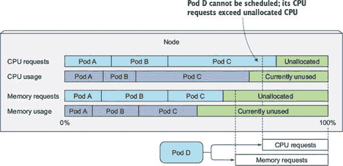
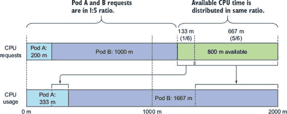
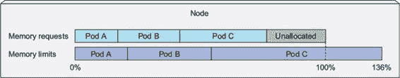
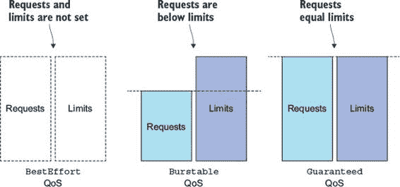
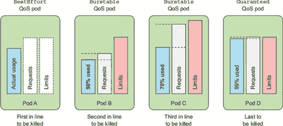
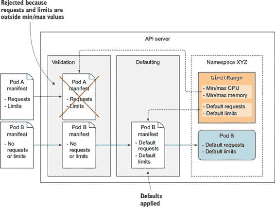
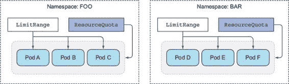
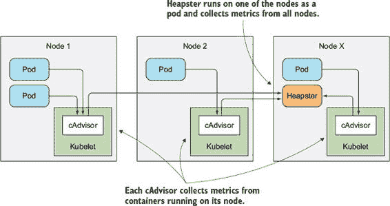
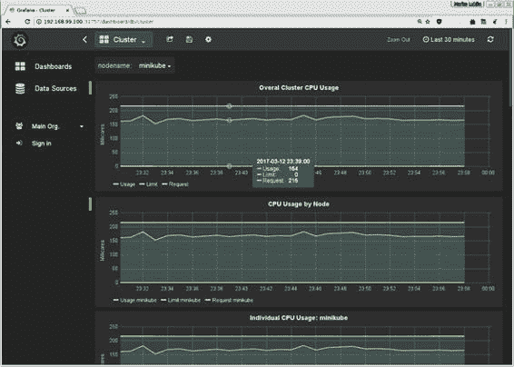
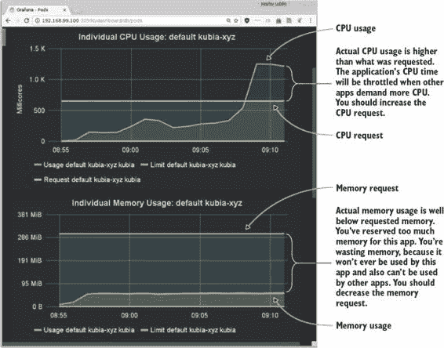

第十四章 管理 Pod 的计算资源

本章涵盖

+   为容器请求 CPU、内存和其他计算资源

+   为 CPU 和内存设置硬性限制

+   理解 Pod 服务质量保证

+   在命名空间中为 Pod 设置默认、最小和最大资源

+   限制命名空间中可用的总资源量

到目前为止，你创建 Pod 时并没有关心它们可以消耗多少 CPU 和内存。但正如你将在本章中看到的，设置 Pod 预期消耗的量和最大允许消耗的量是任何 Pod 定义的关键部分。设置这两组参数确保 Pod 只占用 Kubernetes 集群提供的资源中的公平份额，并影响 Pod 在集群中的调度方式。

14.1\. 为 Pod 的容器请求资源

在创建一个 Pod 时，你可以指定容器需要的 CPU 和内存量（这些被称为请求）以及它可能消耗的硬性限制（称为限制）。这些限制是针对每个容器单独指定的，而不是针对整个 Pod。Pod 的资源请求和限制是所有容器请求和限制的总和。

14.1.1\. 使用资源请求创建 Pod

让我们看看一个示例 Pod 清单，它为其单个容器指定了 CPU 和内存请求，如下所示。

列表 14.1\. 具有资源请求的 Pod：requests-pod.yaml

`apiVersion: v1 kind: Pod metadata:   name: requests-pod spec:   containers:   - image: busybox     command: ["dd", "if=/dev/zero", "of=/dev/null"]     name: main` `1` `resources:` `1` `requests:` `1` `cpu: 200m` `2` `memory: 10Mi` `3`

+   1 你正在为主容器指定资源请求。

+   2 容器请求 200 毫核（即单个 CPU 核心时间的 1/5）。

+   3 容器还请求 10 兆字节（mebibytes）的内存。

在 Pod 清单中，你的单个容器需要 CPU 核心的五分之一（200 毫核）来正常运行。五个这样的 Pod/容器可以在单个 CPU 核心上足够快地运行。

当你没有指定 CPU 的请求时，你表示你不在乎运行在容器中的进程被分配了多少 CPU 时间。在最坏的情况下，它可能根本得不到任何 CPU 时间（这发生在 CPU 上有其他进程的重需求时）。虽然这可能适用于低优先级的批处理作业，这些作业不是时间敏感的，但它显然不适用于处理用户请求的容器。

在 Pod 规范中，你还在容器中请求了 10 兆字节（mebibytes）的内存。通过这样做，你表示你期望容器内运行的进程最多使用 10 兆字节的 RAM。它们可能使用更少，但你并不期望它们在正常情况下使用超过这个量。稍后在本章中，你将看到如果它们这样做会发生什么。

现在，您将运行 pod。当 pod 启动时，您可以通过在容器内运行 `top` 命令来快速查看进程的 CPU 消耗，如下所示。

列表 14.2\. 从容器内部检查 CPU 和内存使用情况

`$ kubectl exec -it requests-pod top` `内存：1288116K 已使用，760368K 可用，9196K 共享，25748K 缓冲，814840K 缓存 CPU：9.1% 用户 42.1% 系统 0.0% 网络接口 48.4% 空闲 0.0% I/O 0.0% 中断 0.2% 软中断 负载平均：0.79 0.52 0.29 2/481 10 PID PPID 用户 STAT VSZ %VSZ CPU %CPU 命令 1 0 root R 1192 0.0 1` `50.2` `dd if /dev/zero of /dev/null 7 0 root R 1200 0.0 0 0.0 top`

您在容器中运行的 `dd` 命令会尽可能多地消耗 CPU，但它只运行一个线程，因此它只能使用一个核心。Minikube 虚拟机，这是本例运行的地方，分配给它两个 CPU 核心。这就是为什么进程显示消耗了整个 CPU 的 50%。

两个核心的百分之五十显然是一个完整的核心，这意味着容器正在使用超过您在 pod 规范中请求的 200 millicores。这是预期的，因为请求并不限制容器可以使用的 CPU 量。您需要指定 CPU 限制才能做到这一点。您稍后会尝试这样做，但首先，让我们看看在 pod 中指定资源请求如何影响 pod 的调度。

14.1.2\. 理解资源请求如何影响调度

通过指定资源请求，您指定了 pod 需要的最小资源量。调度器在将 pod 调度到节点时使用这些信息。每个节点可以分配给 pod 一定数量的 CPU 和内存。在调度 pod 时，调度器将只考虑有足够未分配资源来满足 pod 资源要求的节点。如果未分配的 CPU 或内存量小于 pod 请求的量，Kubernetes 不会将 pod 调度到该节点，因为节点无法提供 pod 所需的最小量。

理解调度器如何确定 pod 是否可以放置在节点上

这里重要的是并且有些令人惊讶的是，调度器在调度时不会查看每个单独的资源在确切时间点使用了多少，而是查看节点上已部署的 pod 请求的资源总和。即使现有 pod 可能使用的资源少于它们请求的量，基于实际资源消耗来调度另一个 pod 也会破坏对已部署 pod 给出的保证。

这在图 14.1 中得到了可视化。节点上部署了三个 pod。总共，它们请求了节点 CPU 的 80% 和内存的 60%。图中最右下角的 pod D 不能调度到该节点，因为它请求了 25% 的 CPU，这超过了未分配 CPU 的 20%。这三个 pod 当前只使用了 70% 的 CPU 的事实无关紧要。

图 14.1. 调度器只关心请求，而不是实际使用情况。

理解调度器在为 Pod 选择最佳节点时如何使用 Pod 的请求

你可能还记得从第十一章中提到的，调度器首先过滤掉那些 Pod 无法放置的节点列表，然后根据配置的优先级函数对剩余节点进行排序。其中，两个优先级函数根据请求的资源量对节点进行排名：`LeastRequestedPriority`和`MostRequestedPriority`。第一个优先级函数更倾向于具有较少请求资源（具有更多未分配资源）的节点，而第二个优先级函数则正好相反——它更倾向于具有最多请求资源（较少未分配 CPU 和内存）的节点。但是，正如我们之前讨论的，它们都考虑了请求的资源量，而不是实际消耗的资源量。

调度器被配置为只使用这些功能中的一个。你可能想知道为什么有人会想使用`MostRequestedPriority`函数。毕竟，如果你有一组节点，你通常希望在这些节点之间均匀地分配 CPU 负载。然而，在云基础设施上运行时并非如此，你可以随时添加和删除节点。通过配置调度器使用`Most-RequestedPriority`函数，你可以确保 Kubernetes 在使用节点时，仍然能够为每个 Pod 提供其请求的 CPU/内存量，同时使用尽可能少的节点。通过紧密打包 Pod，某些节点会空闲出来，可以被移除。因为你为单个节点付费，这可以为你节省费用。

检查节点的容量

让我们看看调度器是如何工作的。你将部署一个 Pod，其请求的资源量是之前的四倍。但在你这样做之前，让我们看看你的节点容量。因为调度器需要知道每个节点有多少 CPU 和内存，Kubelet 会将这些数据报告给 API 服务器，使其通过节点资源可用。你可以通过使用`kubectl describe`命令来查看，如下面的列表所示。

列表 14.3. 节点的容量和可分配资源

`$ kubectl describe nodes` `Name:       minikube ... Capacity:` `1` `cpu:           2` `1` `memory:        2048484Ki` `1` `pods:          110` `1` `Allocatable:` `2` `cpu:           2` `2` `memory:        1946084Ki` `2` `pods:          110` `2` `...`

+   1 节点的总体容量

+   2 可分配给 Pod 的资源

输出显示了与节点上可用资源相关的两组金额：节点的容量和可分配资源。容量代表节点的总资源，其中可能并非所有资源都对 Pod 可用。某些资源可能被保留给 Kubernetes 和/或系统组件。调度器仅基于可分配资源量做出决策。

在前面的例子中，名为`minikube`的节点在一个具有两个核心的虚拟机上运行，没有预留 CPU，因此整个 CPU 都可以分配给 Pod。因此，调度器应该没有问题安排另一个请求 800 毫核的 Pod。

现在运行 Pod。你可以使用代码存档中的 YAML 文件，或者使用以下`kubectl run`命令运行 Pod：

`$ kubectl run requests-pod-2 --image=busybox --restart Never``--requests='cpu=800m,memory=20Mi' -- dd if=/dev/zero of=/dev/null` `pod "requests-pod-2" created`

让我们看看是否已经安排好了：

`$ kubectl get po requests-pod-2` `NAME             READY     STATUS    RESTARTS   AGE requests-pod-2   1/1       Running   0          3m`

好的，Pod 已经被安排并正在运行。

创建一个无法在任何节点上运行的 Pod

你现在有两个 Pod 已部署，它们总共请求了 1,000 毫核或正好 1 个核心。因此，你应该还有 1,000 毫核可用于其他 Pod，对吧？你可以部署另一个请求 1,000 毫核资源的 Pod。使用与之前类似的命令：

`$ kubectl run requests-pod-3 --image=busybox --restart Never``--requests='cpu=1,memory=20Mi' -- dd if=/dev/zero of=/dev/null` `pod "requests-pod-2" created`

注意

这次你指定的是整核 CPU 请求（`cpu=1`），而不是毫核（`cpu=1000m`）。

到目前为止，一切顺利。Pod 已被 API 服务器接受（你可能会记得，在前一章中，如果 Pod 以任何方式无效，API 服务器可以拒绝 Pod）。现在，检查 Pod 是否正在运行：

`$ kubectl get po requests-pod-3` `NAME             READY     STATUS    RESTARTS   AGE requests-pod-3   0/1` `Pending``   0          4m`

即使你等待一段时间，Pod 仍然处于挂起状态。你可以通过使用`kubectl describe`命令来查看更多关于这种情况的信息，如下所示。

列表 14.4. 使用`kubectl describe pod`检查 Pod 为什么处于挂起状态

`$ kubectl describe po requests-pod-3` `Name:       requests-pod-3 Namespace:  default Node:       /` `1` `... Conditions:   Type           Status   PodScheduled   False` `2` `... Events: ... Warning` `FailedScheduling``No nodes are available` `3` `that match all of the` `3` `following predicates::` `3``Insufficient cpu` `(1).` `3`

+   1 没有节点与该 Pod 关联。

+   2 Pod 没有被安排。

+   3 由于 CPU 不足，调度失败。

输出显示 Pod 尚未被安排，因为它由于你的单个节点上 CPU 不足而无法在任何节点上运行。但为什么会这样呢？所有三个 Pod 的 CPU 请求总和为 2,000 毫核或正好两个核心，这正是你的节点可以提供的。问题出在哪里？

确定 Pod 为什么没有被安排

你可以通过检查节点资源来找出 pod 为什么没有被调度。再次使用 `kubectl describe node` 命令，并仔细检查以下列表的输出。

列表 14.5\. 使用 `kubectl describe node` 检查节点上的已分配资源

`$ kubectl describe node` `Name:                   minikube ... 非终止 Pods:    (总共 7 个)   Namespace    Name            CPU Requ.   CPU Lim.  Mem Req.    Mem Lim.   ---------    ----            ----------  --------  ---------   --------   default      requests-pod    200m (10%)  0 (0%)    10Mi (0%)   0 (0%)   default      requests-pod-2  800m (40%)  0 (0%)    20Mi (1%)   0 (0%)   kube-system  dflt-http-b...  10m (0%)    10m (0%)  20Mi (1%)   20Mi (1%)   kube-system  kube-addon-...  5m (0%)     0 (0%)    50Mi (2%)   0 (0%)   kube-system  kube-dns-26...  260m (13%)  0 (0%)    110Mi (5%)  170Mi (8%)   kube-system  kubernetes-...  0 (0%)      0 (0%)    0 (0%)      0 (0%)   kube-system  nginx-ingre...  0 (0%)      0 (0%)    0 (0%)      0 (0%)` `已分配资源:` `(总限制可能超过 100%，即超配。)` `CPU 请求``CPU 限制      内存请求 内存限制   ------------  ----------      --------------- -------------` `1275m (63%)``   10m (0%)        210Mi (11%)     190Mi (9%)`

如果你查看列表的左下角，你会看到正在运行的 pods 请求了总共 1,275 个毫核心，比你部署的前两个 pods 请求的多了 275 个毫核心。有些东西正在消耗额外的 CPU 资源。

你可以在上一列表中的 pods 列表中找到罪魁祸首。在 `kube-system` 命名空间中有三个 pods 明确请求了 CPU 资源。这些 pods 加上你的两个 pods，只剩下 725 个毫核心可用于额外的 pods。因为你的第三个 pod 请求了 1,000 个毫核心，调度器不会将其调度到这个节点，因为这会使节点超配。

释放资源以使 pod 被调度

只有当释放足够的 CPU 资源时（例如删除前两个 pods 中的一个），pod 才会被调度。如果你删除第二个 pod，调度器会通过 第十一章 中描述的监视机制通知删除操作，并在第二个 pod 终止后立即调度你的第三个 pod。这在下述列表中显示。

列表 14.6\. 删除另一个 pod 后 pod 被调度

`$ kubectl delete po requests-pod-2` `pod "requests-pod-2" 已删除` `$ kubectl get po` `NAME             READY     STATUS        RESTARTS   AGE requests-pod     1/1       运行中       0          2h requests-pod-2   1/1` `正在终止``0          1h requests-pod-3   0/1` `挂起``0          1h` `$ kubectl get po` `NAME             READY     STATUS    RESTARTS   AGE requests-pod     1/1       运行中   0          2h requests-pod-3   1/1` `运行中``   0          1h`

在所有这些示例中，你指定了内存请求，但在调度中它并没有发挥作用，因为你的节点有足够的可分配内存来容纳所有 Pod 的请求。调度器以相同的方式处理 CPU 和内存请求，但与内存请求不同，Pod 的 CPU 请求在 Pod 运行时也发挥作用。你将在下一节中了解这一点。

14.1.3. 理解 CPU 请求如何影响 CPU 时间共享

现在，你的集群中有两个 Pod 正在运行（你可以暂时忽略系统 Pod，因为它们大部分是空闲的）。一个请求了 200 毫芯，另一个请求了五倍于此。在章节开头，我们说 Kubernetes 区分资源请求和限制。你还没有定义任何限制，所以这两个 Pod 在 CPU 消耗方面没有任何限制。如果每个 Pod 内部的进程尽可能多地消耗 CPU 时间，每个 Pod 将获得多少 CPU 时间？ 

CPU 请求不仅影响调度，还决定了剩余（未使用）的 CPU 时间如何在 Pod 之间分配。因为你的第一个 Pod 请求了 200 毫芯的 CPU，而另一个请求了 1000 毫芯，任何未使用的 CPU 将以 1 到 5 的比例在两个 Pod 之间分配，如图 14.2 所示。如果两个 Pod 都尽可能多地消耗 CPU，第一个 Pod 将获得六分之一或 16.7%的 CPU 时间，而另一个 Pod 将获得剩余的五分之六或 83.3%。

但如果一个容器想要尽可能多地使用 CPU，而另一个容器在某个时刻处于空闲状态，第一个容器将被允许使用整个 CPU 时间（减去第二个容器使用的少量时间，如果有的话）。毕竟，如果没有人使用，使用所有可用的 CPU 是有意义的，对吧？一旦第二个容器需要 CPU 时间，它将获得它，第一个容器将被限制。

14.1.4. 定义和请求自定义资源

Kubernetes 还允许你向节点添加自己的自定义资源，并在 Pod 的资源请求中请求它们。最初这些被称为不透明整数资源，但在 Kubernetes 1.8 版本中被扩展资源所取代。

首先，显然你需要通过将其添加到节点对象的`capacity`字段中，让 Kubernetes 知道你的自定义资源。这可以通过执行`PATCH` HTTP 请求来完成。资源名称可以是任何东西，例如`example.org/my-resource`，只要它不以`kubernetes.io`域开头。数量必须是一个整数（例如，你不能将其设置为 100 毫秒，因为 0.1 不是一个整数；但你可以将其设置为 1000m 或 2000m，或者简单地设置为 1 或 2）。值将自动从`capacity`复制到`allocatable`字段。

然后，在创建 Pod 时，你可以在容器规范中的 `resources.requests` 字段下指定相同的资源名称和请求的数量，或者在像之前示例中那样使用 `kubectl run` 时使用 `--requests`。调度器将确保 Pod 只部署到具有所需自定义资源数量的节点。显然，每个部署的 Pod 都会减少资源的可分配单元数量。

自定义资源的例子可以是节点上可用的 GPU 单元数量。需要使用 GPU 的 Pod 在其请求中指定这一点。然后调度器确保 Pod 只被调度到至少有一个未分配 GPU 的节点。

14.2\. 限制容器可用的资源

在一个 Pod 中为容器设置资源请求确保每个容器都能获得其所需的最小资源量。现在让我们看看硬币的另一面——容器将被允许消耗的最大资源量。

14.2.1\. 为容器可使用的资源数量设置硬限制

我们已经看到，如果其他所有进程都在空闲状态，容器可以消耗掉所有的 CPU。但你可能希望防止某些容器使用超过特定数量的 CPU。而且你总是希望限制容器可以消耗的内存量。

CPU 是一种可压缩资源，这意味着容器使用的数量可以被限制，而不会以不利的方式影响容器中运行的进程。内存显然不同——它是不可压缩的。一旦进程被分配了一块内存，这块内存就不能从它那里拿走，直到进程本身释放它。这就是为什么你需要限制容器可以获得的内存最大量。

如果不限制内存，运行在工作节点上的容器（或 Pod）可能会消耗掉所有可用的内存，并影响节点上的所有其他 Pod 以及任何新调度到该节点的 Pod（记住，新 Pod 是根据内存请求而不是实际内存使用来调度到节点的）。一个故障或恶意 Pod 实际上可以使整个节点无法使用。

创建具有资源限制的 Pod

为了防止这种情况发生，Kubernetes 允许你为每个容器指定资源限制（与资源请求一样，实际上以相同的方式）。以下列表显示了一个具有资源限制的示例 Pod 清单。

列表 14.7\. 具有硬限制的 CPU 和内存的 Pod：limited-pod.yaml

`apiVersion: v1 kind: Pod metadata: name: limited-pod spec: containers: - image: busybox command: ["dd", "if=/dev/zero", "of=/dev/null"] name: main resources: limits: cpu: 1 memory: 20Mi`

+   1 为容器指定资源限制

+   2 此容器将被允许使用最多 1 个 CPU 核心。

+   3 容器将被允许使用最多 20 兆字节的内存。

这个 pod 的容器为 CPU 和内存都配置了资源限制。容器内运行的进程或进程将不允许消耗超过 1 个 CPU 核心和 20 兆字节的内存。

注意

因为您没有指定任何资源请求，所以它们将被设置为与资源限制相同的值。

超出限制的过度提交

与资源请求不同，资源限制不受节点可分配资源数量的约束。节点上所有 pod 的所有限制总和允许超过节点容量的 100% (图 14.3)。重申一下，资源限制可以被过度提交。这有一个重要的后果——当节点资源使用率达到 100% 时，某些容器将需要被杀死。

图 14.3\. 节点上所有 pod 的资源限制总和可能超过节点容量的 100%。

您将在第 14.3 节中看到 Kubernetes 如何决定杀死哪些容器，但即使容器试图使用超过其资源限制指定的更多资源，也可以杀死单个容器。您将在下一部分了解更多关于这一点。

14.2.2\. 超出限制

当一个在容器中运行的过程试图使用比允许的更多资源时，会发生什么？

您已经了解到 CPU 是一种可压缩的资源，当进程不在等待 I/O 操作时，它想要消耗所有 CPU 时间是很自然的。正如您所学的，进程的 CPU 使用率是受限制的，因此当为容器设置 CPU 限制时，进程不会获得超过配置限制的更多 CPU 时间。

对于内存来说，情况不同。当进程试图分配超过其限制的内存时，进程将被杀死（容器被称为 `OOMKilled`，其中 OOM 代表内存不足）。如果 pod 的重启策略设置为 `Always` 或 `OnFailure`，进程将立即重启，因此您可能甚至没有注意到它被杀死。但如果它继续超过内存限制并被杀死，Kubernetes 将开始以增加的重启间隔重启它。在这种情况下，您将看到 `CrashLoopBackOff` 状态：

`$ kubectl get po` `NAME        READY     STATUS             RESTARTS   AGE memoryhog   0/1` `CrashLoopBackOff``   3          1m`

`CrashLoopBackOff` 状态并不意味着 Kubelet 已经放弃。这意味着在每次崩溃后，Kubelet 都会增加在重启容器之前的时间间隔。第一次崩溃后，它立即重启容器，然后如果再次崩溃，将等待 10 秒后再重启它。在随后的崩溃中，这个延迟将以指数方式增加到 20、40、80 和 160 秒，并最终限制为 300 秒。一旦间隔达到 300 秒的限制，Kubelet 将无限期地每五分钟重启容器，直到 pod 停止崩溃或被删除。

要检查容器崩溃的原因，你可以检查 pod 的日志和/或使用 `kubectl describe pod` 命令，如下所示。

列表 14.8\. 检查容器为何以 `kubectl describe pod` 终止

`$ kubectl describe pod` `Name:       memoryhog ... Containers:   main:     ...     State:          Terminated` `1` `Reason:       OOMKilled` `1` `Exit Code:    137       Started:      Tue, 27 Dec 2016 14:55:53 +0100       Finished:     Tue, 27 Dec 2016 14:55:58 +0100     Last State:     Terminated` `2` `Reason:       OOMKilled` `2` `Exit Code:    137       Started:      Tue, 27 Dec 2016 14:55:37 +0100       Finished:     Tue, 27 Dec 2016 14:55:50 +0100     Ready:          False ...`

+   1 当前容器被杀死是因为它内存不足（OOM）。

+   2 之前的容器也是因为 OOM 被杀死的

`OOMKilled` 状态告诉你，容器被杀死是因为内存不足。在先前的列表中，容器超过了其内存限制并被立即杀死。

如果你不希望容器被杀死，不要设置太低的内存限制。但即使容器没有超过其限制，它们也可能被 `OOMKilled`。你将在 第 14.3.2 节 中看到原因，但首先，让我们讨论一下大多数用户在第一次开始为他们的容器指定限制时通常会感到意外的某个问题。

14.2.3\. 理解容器中的应用程序如何看到限制

如果你还没有从 列表 14.7 部署 pod，现在就部署它：

`$ kubectl create -f limited-pod.yaml` `pod "limited-pod" created`

现在，在容器中运行 `top` 命令，就像你在本章开头所做的那样。命令的输出如下所示。

列表 14.9\. 在 CPU 和内存受限的容器中运行 `top` 命令

`$ kubectl exec -it limited-pod top``Mem: 1450980K used, 597504K free``, 22012K shrd, 65876K buff, 857552K cached` `CPU: 10.0% usr 40.0% sys``  0.0% nic 50.0% idle  0.0% io  0.0% irq  0.0% sirq Load average: 0.17 1.19 2.47 4/503 10   PID  PPID USER     STAT   VSZ %VSZ CPU %CPU COMMAND     1     0 root     R     1192  0.0   1 49.9 dd if /dev/zero of /dev/null     5     0 root     R     1196  0.0   0  0.0 top`

首先，让我提醒你，pod 的 CPU 限制设置为 1 个核心，其内存限制设置为 20 MiB。现在，仔细检查 `top` 命令的输出。有什么让你觉得奇怪的吗？

查看已使用和空闲的内存量。这些数字与你为容器设置的 20 MiB 限制相去甚远。同样，你将 CPU 限制设为单个核心，但看起来主进程只使用了 50% 的可用 CPU 时间，尽管 `dd` 命令在你使用它的方式下，通常会用尽它所有的 CPU。这是怎么回事？

理解容器总是看到节点的内存，而不是容器的内存

`top`命令显示了容器运行的整个节点的内存量。即使你为容器设置了内存限制，容器也不会意识到这个限制。

这对任何查找系统上可用的内存量并使用该信息来决定它想要保留多少内存的应用程序都有不幸的影响。

当运行 Java 应用程序时，这个问题尤为明显，尤其是如果你没有使用`-Xmx`选项为 Java 虚拟机指定最大堆大小。在这种情况下，JVM 将根据主机的总内存而不是容器的可用内存来设置最大堆大小。当你将你的容器化 Java 应用程序在你的笔记本电脑上的 Kubernetes 集群中运行时，问题不会显现出来，因为你在 Pod 上设置的内存限制与你的笔记本电脑上总内存之间的差异并不大。

但是，当你将你的 Pod 部署到生产系统上，其中节点拥有更多的物理内存时，JVM 可能会超过你配置的容器内存限制，并会被`OOMKilled`。

如果你认为正确设置`-Xmx`选项可以解决这个问题，那么很遗憾，你错了。`-Xmx`选项仅限制堆大小，但对 JVM 的堆外内存没有任何作用。幸运的是，Java 的新版本通过考虑配置的容器限制来减轻这个问题。

理解容器也会看到所有节点的 CPU 核心

就像内存一样，容器也会看到所有节点的 CPU，无论为容器配置的 CPU 限制是多少。将 CPU 限制设置为单个核心并不会神奇地只向容器暴露一个 CPU 核心。所有 CPU 限制所做的只是限制容器可以使用的 CPU 时间量。

在 64 核心 CPU 上运行的单核心 CPU 限制的容器将获得整体 CPU 时间的 1/64。即使其限制设置为单个核心，容器的进程也不会只在单个核心上运行。在不同的时间点，其代码可能会在不同的核心上执行。

这并没有什么问题，对吧？虽然通常情况下是这样的，但至少存在一种情况，这种情况下这种情况是灾难性的。

某些应用程序会查找系统上的 CPU 数量来决定它们应该运行多少个工作线程。同样，这样的应用程序在开发笔记本电脑上运行良好，但当部署到具有更多核心的节点上时，它将启动过多的线程，所有线程都在竞争（可能是）有限的 CPU 时间。此外，每个线程都需要额外的内存，导致应用程序的内存使用量激增。

你可能想使用 Downward API 将 CPU 限制传递给容器，并使用它而不是依赖于你的应用程序在系统上可以看到的 CPU 数量。你也可以直接访问 cgroups 系统，通过读取以下文件来获取配置的 CPU 限制：

+   /sys/fs/cgroup/cpu/cpu.cfs_quota_us

+   /sys/fs/cgroup/cpu/cpu.cfs_period_us

14.3\. 理解 pod QoS 类别

我们已经提到，资源限制可以被过度承诺，并且节点不一定能为其所有 pod 提供其资源限制中指定的资源量。

想象有两个 pod，其中 pod A 正在使用节点内存的 90%，然后 pod B 突然需要比之前使用更多的内存，而节点无法提供所需的内存量。应该杀死哪个容器？应该杀死 pod B，因为其内存请求无法得到满足，还是应该杀死 pod A 以释放内存，以便提供给 pod B？

显然，这取决于具体情况。Kubernetes 无法独立做出正确的决定。你需要一种方式来指定在这种情况下哪些 pod 具有优先级。Kubernetes 通过将 pod 分为三个服务质量（QoS）类别来实现这一点：

+   `BestEffort`（最低优先级）

+   `Burstable`

+   `Guaranteed`（最高）

14.3.1\. 为 pod 定义 QoS 类

你可能期望这些类别可以通过清单中的单独字段来分配，但实际上并非如此。QoS 类别是从 pod 容器的资源请求和限制的组合中派生出来的。以下是具体方法。

将 pod 分配到 BestEffort 类

最低优先级的 QoS 类别是 `BestEffort` 类。它被分配给没有任何请求或限制设置的 pod（在任何容器中）。这是在前面章节中创建的所有 pod 分配的 QoS 类别。在这些 pod 中运行的容器没有任何资源保证。在最坏的情况下，它们可能几乎得不到任何 CPU 时间，并且当需要为其他 pod 释放内存时，它们将是首先被杀死的。但是，由于 `BestEffort` pod 没有设置内存限制，如果可用内存足够，其容器可以使用尽可能多的内存。

将 pod 分配到 Guaranteed 类

在另一端是 `Guaranteed` QoS 类别。这个类别分配给那些容器请求等于所有资源限制的 pod。对于一个 pod 的类别要成为 `Guaranteed`，需要满足以下三个条件：

+   需要为 CPU 和内存设置请求和限制。

+   需要为每个容器设置这些。

+   它们需要相等（限制需要与每个容器中每个资源的请求相匹配）。

由于容器的资源请求（如果没有明确设置），默认为限制，因此为所有资源（对于 pod 中的每个容器）指定限制就足够使 pod 成为 `Guaranteed`。这些 pod 中的容器获得请求的资源量，但不能消耗额外的资源（因为它们的限制不高于它们的请求）。

将 Burstable QoS 类别分配给 pod

在 `BestEffort` 和 `Guaranteed` 之间是 `Burstable` QoS 类别。所有其他 pod 都属于这个类别。这包括容器限制与其请求不匹配的单容器 pod，以及至少有一个容器指定了资源请求但没有指定限制的所有 pod。它还包括一个容器的请求与其限制相匹配，但另一个容器没有指定请求或限制的 pod。`Burstable` pod 会获得其请求的资源，但在需要时可以额外使用资源（最多达到限制）。 

理解请求和限制之间的关系如何定义 QoS 类别

所有三个 QoS 类别及其与请求和限制的关系都在图 14.4 中展示。

图 14.4\. 资源请求、限制和 QoS 类别

考虑一个 pod 的 QoS 类别可能会让你感到困惑，因为它涉及到多个容器、多个资源以及请求和限制之间所有可能的关系。如果你从容器级别的 QoS（尽管 QoS 类别是 pod 的属性，而不是容器的属性）开始思考，然后从容器的 QoS 类别推导出 pod 的 QoS 类别，那就更容易理解了。

确定容器的 QoS 类别

表 14.1 展示了基于单个容器上定义的资源请求和限制的 QoS 类别。对于单容器 pod，QoS 类别也适用于 pod。

表 14.1\. 基于资源请求和限制的单容器 pod 的 QoS 类别

| CPU 请求与限制 | 内存请求与限制 | 容器 QoS 类别 |
| --- | --- | --- |
| 未设置 | 未设置 | BestEffort |
| 未设置 | 请求 < 限制 | 可扩展 |
| 未设置 | 请求 = 限制 | 可扩展 |
| 请求 < 限制 | 未设置 | 可扩展 |
| 请求 < 限制 | 请求 < 限制 | 可扩展 |
| 请求 < 限制 | 请求 = 限制 | 可扩展 |
| 请求 = 限制 | 请求 = 限制 | Guaranteed |
|  |

注意

如果只设置了请求，但没有设置限制，请参考请求小于限制的表格行。如果只设置了限制，请求默认为限制值，因此请参考请求等于限制的行。

确定具有多个容器的 pod 的 QoS 类别

对于多容器 pod，如果所有容器具有相同的 QoS 类别，那么这也是 pod 的 QoS 类别。如果至少有一个容器具有不同的类别，那么 pod 的 QoS 类别是 `Burstable`，无论容器的类别是什么。表 14.2 展示了两个容器 pod 的 QoS 类别如何与其两个容器的类别相关。你可以轻松地将这个扩展到具有两个以上容器的 pod。

表 14.2\. 从其容器的类别推导出的 Pod 的 QoS 类别

| 容器 1 QoS 类别 | 容器 2 QoS 类别 | Pod 的 QoS 类别 |
| --- | --- | --- |
| BestEffort | BestEffort | BestEffort |
| BestEffort | 可扩展 | 可扩展 |
| BestEffort | Guaranteed | 可扩展 |
| 可扩展 | 可扩展 | 可扩展 |
| Burstable | Guaranteed | Burstable |
| Guaranteed | Guaranteed | Guaranteed |
| |

注意

当运行`kubectl describe pod`时，pod 的 QoS 类别会显示出来，并在 pod 的 YAML/JSON 表示中的`status.qosClass`字段中。

| |
| --- |

我们已经解释了如何确定 QoS 类别，但我们还需要看看它们是如何在过载系统中确定哪个容器会被杀死的。

14.3.2. 理解内存低时哪个进程会被杀死

当系统过载时，服务质量（QoS）类别决定了哪个容器首先被杀死，以便释放的资源可以分配给优先级更高的 pod。首先被杀死的是`BestEffort`类别的 pod，其次是`Burstable` pod，最后是`Guaranteed` pod，只有当系统进程需要内存时，`Guaranteed` pod 才会被杀死。

理解 QoS 类别的排列方式

让我们看看图 14.5 中显示的示例。想象有两个单容器 pod，第一个 pod 具有`BestEffort` QoS 类别，第二个 pod 的类别是`Burstable`。当节点的全部内存已经达到最大值，并且节点上的某个进程尝试分配更多内存时，系统需要杀死一个进程（可能是尝试分配额外内存的进程）以遵守分配请求。在这种情况下，运行在`BestEffort` pod 中的进程将始终在运行在`Burstable` pod 中的进程之前被杀死。

图 14.5. 哪些 pod 先被杀死

显然，在杀死任何`Guaranteed` pod 的进程之前，`BestEffort` pod 的进程也会被杀死。同样，在杀死`Guaranteed` pod 之前，`Burstable` pod 的进程也会被杀死。但如果只有两个`Burstable` pod 呢？显然，选择过程需要优先考虑其中一个。

理解具有相同 QoS 类别的容器是如何处理的

每个正在运行的过程都有一个内存不足（OOM）分数。系统通过比较所有运行进程的 OOM 分数来选择要杀死的进程。当需要释放内存时，分数最高的进程会被杀死。

OOM 分数由两件事计算得出：进程消耗的可用内存百分比和一个固定的 OOM 分数调整，该调整基于 pod 的 QoS 类别和容器请求的内存。当存在两个单容器 pod，且两者都属于`Burstable`类别时，系统将杀死使用其请求内存比例更高的那个。这就是为什么在图 14.5 中，使用 90%请求内存的 pod B 在只使用 70%的 pod C 之前被杀死，尽管 pod B 使用的内存兆字节比 pod C 多。

这表明您需要留心的不只是请求和限制之间的关系，还要注意请求和预期实际内存消耗之间的关系。

14.4. 为每个命名空间中的 pod 设置默认请求和限制

我们已经探讨了如何为每个单独的容器设置资源请求和限制。如果你没有设置它们，容器就会受制于所有其他指定了资源请求和限制的容器。为每个容器设置请求和限制是一个好主意。

14.4.1\. 介绍 LimitRange 资源

除了为每个容器执行此操作外，您还可以通过创建 Limit-Range 资源来完成此操作。它允许您指定（对于每个命名空间）您可以为每个资源在容器上设置的最低和最高限制，以及未明确指定请求的容器的默认资源请求，如图 14.6 所示。

图 14.6\. LimitRange 用于验证和默认 pod。

LimitRange 资源由 LimitRanger 接受控制插件使用（我们在第十一章中解释了这些插件）。当一个 pod 清单被提交到 API 服务器时，LimitRanger 插件会验证 pod 规范。如果验证失败，则立即拒绝清单。正因为如此，LimitRange 对象的一个很好的用途是防止用户创建比集群中任何节点都大的 pod。如果没有这样的 LimitRange，API 服务器会欣然接受 pod，但随后永远不会调度它。

LimitRange 资源中指定的限制适用于与 LimitRange 对象在同一命名空间中创建的每个单独的 pod/容器或其他类型的对象。它们不会限制命名空间中所有 pod 可用资源的总量。这通过 ResourceQuota 对象来指定，该对象在第 14.5 节中进行了说明。

14.4.2\. 创建 LimitRange 对象

让我们看看一个完整的 LimitRange 示例，看看各个属性的作用。以下列表显示了 LimitRange 资源的完整定义。

列表 14.10\. LimitRange 资源：limits.yaml

`apiVersion: v1 kind: LimitRange metadata: name: example spec: limits: - type: Pod min: cpu: 50m memory: 5Mi max: cpu: 1 memory: 1Gi - type: Container defaultRequest: cpu: 100m memory: 10Mi default: cpu: 200m memory: 100Mi min: cpu: 50m memory: 5Mi max: cpu: 1 memory: 1Gi maxLimitRequestRatio: cpu: 4 memory: 10 - type: PersistentVolumeClaim min: storage: 1Gi max: storage: 10Gi`

+   1 指定整个 pod 的限制

+   2 pod 的容器可以请求的总最小 CPU 和内存

+   3 每个 pod 的容器可以请求（和限制）的最大 CPU 和内存

+   4 容器限制在此行以下指定。

+   5 将应用于未明确指定它们的容器的 CPU 和内存的默认请求

+   6 未指定限制的容器的默认限制

+   容器可以拥有的最小和最大请求/限制

+   每个资源限制与请求之间的最大比率是 8

+   9 LimitRange 还可以设置 PVC 可以请求的最小和最大存储量。

如前例所示，可以配置整个 Pod 的最小和最大限制。它们适用于 Pod 中所有容器的请求和限制的总和。

在容器级别，您不仅可以设置最小和最大值，还可以设置默认资源请求（`defaultRequest`）和默认限制（`default`），这些将应用于每个未明确指定的容器。

除了最小、最大和默认值之外，您甚至可以设置限制与请求之间的最大比率。前面的列表将 CPU `maxLimitRequestRatio` 设置为 `4`，这意味着容器的 CPU 限制将不允许超过其 CPU 请求的四倍。如果 CPU 限制设置为 801 毫核或更高，则请求 200 毫核的容器将不被接受。对于内存，最大比率设置为 10。

在第六章中，我们探讨了 PersistentVolumeClaims (PVC)，它允许您以类似于 Pod 的容器请求 CPU 和内存的方式请求一定量的持久存储。同样地，您应该限制单个 PVC 可以请求的存储量。LimitRange 对象允许您这样做，如示例底部所示。

示例显示了一个包含所有内容的单个 LimitRange 对象，但您也可以根据偏好将它们拆分为多个对象（例如，一个用于 Pod 限制，另一个用于容器限制，还有一个用于 PVC）。在验证 Pod 或 PVC 时，来自多个 LimitRange 对象的所有限制都将合并。

由于 LimitRange 对象中配置的验证（和默认值）是在 API 服务器接收到新的 Pod 或 PVC 清单时执行的，因此如果您之后修改了限制，现有的 Pod 和 PVC 将不会被重新验证——新的限制将仅适用于之后创建的 Pod 和 PVC。

14.4.3\. 执行限制

在设置了限制之后，您现在可以尝试创建一个请求比 LimitRange 允许的更多 CPU 的 Pod。您可以在代码存档中找到 Pod 的 YAML。下一个列表仅显示与讨论相关的部分。

列表 14.11\. 一个 CPU 请求大于限制的 Pod：limits-pod-too-big.yaml

`    资源:       请求:       cpu: 2`

Pod 的单个容器请求了两个 CPU，这超过了您之前在 LimitRange 中设置的极限。创建 Pod 的结果如下：

`$ kubectl create -f limits-pod-too-big.yaml` `Error from server (Forbidden): error when creating "limits-pod-too-big.yaml": pods "too-big" is forbidden: [   maximum cpu usage per Pod is 1, but request is 2.,   maximum cpu usage per Container is 1, but request is 2.]`

我稍微修改了输出，使其更易于阅读。服务器错误信息的好处是它列出了导致 pods 被拒绝的所有原因，而不仅仅是第一个遇到的原因。正如你所看到的，pods 被拒绝了两个原因：你为容器请求了两个 CPU，但容器的最大 CPU 限制是一个。同样，整个 pods 请求了两个 CPU，但最大限制是一个 CPU（如果这是一个多容器 pods，即使每个容器请求的 CPU 少于最大量，它们加在一起仍然需要请求少于两个 CPU 才能通过 pods 的最大 CPU 限制）。

14.4.4. 应用默认资源请求和限制

现在我们也来看看默认资源请求和限制是如何设置在未指定它们的容器上的。再次部署`kubia-manual` pod，来自第三章：

`$ kubectl create -f ../Chapter03/kubia-manual.yaml` `pod "kubia-manual" created`

在设置你的 LimitRange 对象之前，所有的 pods 都是没有资源请求或限制被创建的，但现在在创建 pods 时会自动应用默认值。你可以通过描述`kubia-manual` pod 来确认这一点，如下所示。

列表 14.12. 检查自动应用到 pods 上的限制

`$ kubectl describe po kubia-manual` `Name:           kubia-manual ... Containers:   kubia:     Limits:       cpu:      200m       memory:   100Mi     Requests:       cpu:      100m       memory:   10Mi`

容器的请求和限制与你在 LimitRange 对象中指定的相匹配。如果你在另一个命名空间中使用了不同的 LimitRange 规范，那么在该命名空间中创建的 pods 将显然具有不同的请求和限制。这允许管理员为每个命名空间配置 pods 的默认、最小和最大资源。如果命名空间被用来分隔不同的团队，或者用来分隔在同一 Kubernetes 集群中运行的开发、QA、预发布和生产 pods，那么在每个命名空间中使用不同的 LimitRange 可以确保只能在某些命名空间中创建大型 pods，而其他则被限制在较小的 pods。

但请记住，LimitRange 中配置的限制仅适用于每个单独的 pods/容器。仍然有可能创建许多 pods 并消耗掉集群中所有的资源。LimitRanges 不能提供对此类情况的保护。另一方面，Resource-Quota 对象可以。你将在下一部分学习它们。

14.5. 限制命名空间中可用的总资源

正如您所看到的，LimitRanges 仅适用于单个 Pod，但集群管理员还需要一种方法来限制命名空间中可用的资源总量。这是通过创建资源配额对象来实现的。

14.5.1\. 介绍资源配额对象

在第十章中，我们提到 API 服务器内部运行的几个准入控制插件会验证 Pod 是否可以创建。在前一节中，我说 LimitRanger 插件强制执行 LimitRange 资源中配置的策略。同样，资源配额准入控制插件会检查正在创建的 Pod 是否会超出配置的资源配额。如果是这种情况，Pod 的创建将被拒绝。因为资源配额在 Pod 创建时生效，所以资源配额对象只会影响在资源配额对象创建之后创建的 Pod——创建它对现有 Pod 没有影响。

资源配额（ResourceQuota）限制了命名空间中可以消耗的计算资源量以及持久卷声明（PersistentVolumeClaims）的存储量。它还可以限制用户在命名空间内可以创建的 Pod、声明和其他 API 对象的数量。由于你到目前为止主要处理的是 CPU 和内存，让我们先看看如何为它们指定配额。

创建 CPU 和内存的资源配额

通过创建资源配额对象，定义了命名空间中所有 Pod 允许消耗的总 CPU 和内存量，如下所示列表。

列表 14.13\. CPU 和内存的资源配额：quota-cpu-memory.yaml

`apiVersion: v1 kind: ResourceQuota metadata:   name: cpu-and-mem spec:   hard:     requests.cpu: 400m     requests.memory: 200Mi     limits.cpu: 600m     limits.memory: 500Mi`

与为每个资源定义单个总量不同，您为 CPU 和内存的请求和限制分别定义单独的总量。您会注意到结构与 LimitRange 的结构略有不同。在这里，所有资源的请求和限制都在一个地方定义。

此资源配额将命名空间中 Pod 请求的最大 CPU 量设置为 400 毫核。命名空间中最大总 CPU 限制设置为 600 毫核。对于内存，最大总请求设置为 200 MiB，而限制设置为 500 MiB。

资源配额对象应用于其创建的命名空间，就像 Limit-Range 一样，但它应用于所有 Pod 的资源请求和限制的总量，而不是每个单独的 Pod 或容器，如图 14.7 所示。

图 14.7\. LimitRanges 应用于单个 Pod；资源配额应用于命名空间中的所有 Pod。

检查配额和配额使用情况

在将资源配额对象发布到 API 服务器后，您可以使用`kubectl describe`命令查看已使用的配额量，如下所示。

列表 14.14\. 使用`kubectl describe quota`检查 ResourceQuota

`$ kubectl describe quota` `Name: cpu-and-mem Namespace: default Resource Used Hard -------- ---- ---- limits.cpu 200m 600m limits.memory 100Mi 500Mi requests.cpu 100m 400m requests.memory 10Mi 200Mi`

我只运行了`kubia-manual` Pod，所以`Used`列与它的资源请求和限制相匹配。当我运行额外的 Pod 时，它们的请求和限制会被加到已使用量中。

与 ResourceQuota 一起创建 LimitRange

创建 ResourceQuota 时有一个注意事项，那就是你也会想同时创建一个 Limit-Range 对象。在你的情况下，你已经从上一节配置了 LimitRange，但如果你没有配置，你就无法运行`kubia-manual` Pod，因为它没有指定任何资源请求或限制。以下是这种情况会发生什么：

`$ kubectl create -f ../Chapter03/kubia-manual.yaml` `错误来自服务器（禁止）：创建"../Chapter03/kubia-manual.yaml"时出错：pods "kubia-manual"被禁止：` `失败配额：cpu-and-mem：必须指定 limits.cpu，limits.memory，requests.cpu，requests.memory`

当为特定资源（CPU 或内存）配置配额（请求或限制）时，Pod 需要为该资源设置相应的请求或限制（分别）；否则 API 服务器将不接受该 Pod。这就是为什么为这些资源设置默认值的 LimitRange 可以使创建 Pod 的人生活变得容易一些。

14.5.2\. 指定持久存储的配额

ResourceQuota 对象还可以限制在命名空间中可以声明的持久存储量，如下面的列表所示。

列表 14.15\. 存储资源的 ResourceQuota：quota-storage.yaml

`apiVersion: v1 kind: ResourceQuota metadata: name: storage spec: hard: requests.storage: 500Gi 1 ssd.storageclass.storage.k8s.io/requests.storage: 300Gi 2 standard.storageclass.storage.k8s.io/requests.storage: 1Ti`

+   1 总共可声明的存储量

+   2 在 StorageClass ssd 中可声明的存储量

在这个例子中，一个命名空间中所有 PersistentVolumeClaims 可以请求的存储量被限制为 500 GiB（由 ResourceQuota 对象中的`requests.storage`条目限制）。但正如你从第六章中记得的那样，PersistentVolumeClaims 可以请求特定 StorageClass 的动态预配 PersistentVolume。这就是为什么 Kubernetes 还允许为每个 StorageClass 单独定义存储配额。前面的例子将可声明的总 SSD 存储量（由`ssd` StorageClass 指定）限制为 300 GiB。性能较低的 HDD 存储（StorageClass standard）限制为 1 TiB。

14.5.3\. 限制可以创建的对象数量

ResourceQuota 也可以配置为限制单个命名空间内 Pods、Replication-Controllers、Services 和其他对象的数量。这允许集群管理员根据用户的付费计划等限制用户可以创建的对象数量，也可以限制公共 IP 或节点端口 Services 可以使用的数量。

以下列表显示了限制对象数量的 ResourceQuota 对象可能的样子。

列表 14.16\. 限制资源最大数量的 ResourceQuota：quota-object-count.yaml

`apiVersion: v1 kind: ResourceQuota metadata:   name: objects spec:   hard:     pods: 10` `1` `replicationcontrollers: 5` `1` `secrets: 10` `1` `configmaps: 10` `1` `persistentvolumeclaims: 4` `1` `services: 5` `2` `services.loadbalancers: 1` `2` `services.nodeports: 2` `2` `ssd.storageclass.storage.k8s.io/persistentvolumeclaims: 2` `3`

+   1 在命名空间中可以创建最多 10 个 Pods、5 个 ReplicationControllers、10 个 Secrets、10 个 ConfigMaps 和 4 个 PersistentVolumeClaims。

+   2 总共可以创建五个服务，其中最多一个可以是 LoadBalancer 服务，最多两个可以是 NodePort 服务。

+   3 只有两个 PVC 可以使用 ssd StorageClass 声明存储。

在此列表中，ResourceQuota 允许用户在命名空间中创建最多 10 个 Pods，无论它们是手动创建还是由 ReplicationController、ReplicaSet、DaemonSet、Job 等创建。它还限制了 ReplicationController 的数量为五个。最多可以创建五个服务，其中只有一个可以是 `LoadBalancer` 类型的服务，并且只有两个可以是 `NodePort` 类型的服务。类似于可以指定每个 StorageClass 的最大请求存储量，也可以按 StorageClass 限制 PersistentVolumeClaims 的数量。

当前可以为以下对象设置对象计数配额：

+   Pods

+   ReplicationControllers

+   Secrets

+   ConfigMaps

+   PersistentVolumeClaims

+   Services（一般），以及两种特定类型的 Services，例如 `Load-Balancer` Services (`services.loadbalancers`) 和 `NodePort` Services (`services.nodeports`)

最后，您甚至可以为 ResourceQuota 对象本身设置对象计数配额。其他对象（如 ReplicaSets、Jobs、Deployments、Ingresses 等）的数量还不能限制（但自本书出版以来，这可能已经改变，所以请查阅文档以获取最新信息）。

14.5.4\. 为特定 pod 状态和/或 QoS 类指定配额

您迄今为止创建的配额已应用于所有 Pods，无论它们的当前状态和 QoS 类别如何。但是，配额也可以限制到一组配额范围。目前有四个范围可用：`BestEffort`、`NotBestEffort`、`Terminating` 和 `NotTerminating`。

`BestEffort` 和 `NotBestEffort` 范围决定了配额是否适用于具有 `BestEffort` QoS 类的 Pods 或其他两个类别（即 `Burstable` 和 `Guaranteed`）的 Pods。

其他两个作用域（`Terminating`和`NotTerminating`）不适用于正在（或未在）关闭过程中的 pods，正如名称可能让您所想的那样。我们还没有讨论这一点，但您可以指定每个 pods 在终止并标记为`Failed`之前允许运行的最长时间。这是通过在 pods 规范中设置`active-Deadline-Seconds`字段来完成的。此属性定义了 pods 在节点上相对于其启动时间允许活跃的秒数，在标记为`Failed`并终止之前。`Terminating`配额作用域适用于已设置`active-DeadlineSeconds`的 pods，而`Not-Terminating`适用于未设置的 pods。

在创建 ResourceQuota 时，您可以指定它应用的作用域。一个 pods 必须匹配所有指定的作用域，配额才能应用于它。此外，配额可以限制的内容取决于配额的作用域。`BestEffort`作用域只能限制 pods 的数量，而其他三个作用域可以限制 pods 的数量、CPU/内存请求和 CPU/内存限制。

例如，如果您希望配额仅应用于`BestEffort`、`NotTerminating` pods，您可以创建以下列表中所示的 ResourceQuota 对象。

列表 14.17\. `BestEffort/NotTerminating` pods 的 ResourceQuota：quota-scoped.yaml

`apiVersion: v1 kind: ResourceQuota metadata:   name: besteffort-notterminating-pods spec:   scopes:` `1` `- BestEffort` `1` `- NotTerminating` `1` `hard:     pods: 4` `2`

+   1 此配额仅适用于具有 BestEffort QoS 且未设置活动截止日期的 pods。

+   2 只能存在四个这样的 pods。

此配额确保最多存在四个具有`BestEffort` QoS 类且没有活动截止日期的 pods。如果配额针对的是`NotBestEffort` pods，您也可以指定`requests.cpu`、`requests.memory`、`limits.cpu`和`limits.memory`。

注意

在您进入本章的下一节之前，请删除您创建的所有 ResourceQuota 和 LimitRange 资源。您将不再需要它们，并且它们可能会干扰以下章节中的示例。

14.6\. 监控 pod 资源使用情况

正确设置资源请求和限制对于充分利用您的 Kubernetes 集群至关重要。如果请求设置得太高，您的集群节点将得不到充分利用，您会浪费金钱。如果设置得太低，您的应用程序可能会因 CPU 不足而被杀死。您如何找到请求和限制的最佳平衡点？

您可以通过监控容器在预期负载水平下的实际资源使用情况来找到它。一旦应用程序向公众开放，您应该继续监控它，并在必要时调整资源请求和限制。

14.6.1\. 收集和检索实际资源使用情况

如何监控在 Kubernetes 中运行的应用程序？幸运的是，Kubelet 本身已经包含了一个名为 cAdvisor 的代理，它执行节点上运行的每个容器以及整个节点的资源消耗数据的基本收集。为了在整个集群中集中收集这些统计信息，您需要运行一个名为 Heapster 的附加组件。

Heapster 作为 pod 在节点上运行，并通过常规 Kubernetes 服务暴露，使其可以通过稳定的 IP 地址访问。它从集群中的所有 cAdvisors 收集数据，并在单个位置暴露。 展示了从 pod 到 cAdvisor，再到 Heapster 的指标数据流。

![图 14.8\. 指标数据流入 Heapster 的流程]

图中的箭头显示了指标数据的流动方式。它们不显示哪个组件连接到哪个以获取数据。pod（或在其中运行的容器）对 cAdvisor 一无所知，cAdvisor 也不知道 Heapster。是 Heapster 连接到所有 cAdvisors，而 cAdvisors 收集容器和节点使用数据，无需与 pod 容器内运行的进程交谈。

启用 Heapster

如果您在 Google Kubernetes Engine 上运行集群，Heapster 默认启用。如果您使用 Minikube，它作为附加组件可用，可以使用以下命令启用：

`$ minikube addons enable heapster` `heapster was successfully enabled`

要在其他类型的 Kubernetes 集群中手动运行 Heapster，您可以参考位于 [`github.com/kubernetes/heapster`](https://github.com/kubernetes/heapster) 的说明。

启用 Heapster 后，您需要等待几分钟，以便它收集指标，然后您才能看到集群的资源使用统计信息，所以请耐心等待。

显示集群节点的 CPU 和内存使用情况

在您的集群中运行 Heapster 可以通过 `kubectl top` 命令获取节点和单个 pod 的资源使用情况。要查看您的节点上使用了多少 CPU 和内存，可以运行以下列表中的命令。

列表 14.18\. 节点的实际 CPU 和内存使用情况

`$ kubectl top node` `NAME       CPU(cores)   CPU%      MEMORY(bytes)   MEMORY% minikube   170m         8%        556Mi           27%`

这显示了节点上运行的所有 pod 的实际、当前 CPU 和内存使用情况，与 `kubectl describe node` 命令不同，后者显示的是 CPU 和内存请求量以及限制量，而不是实际的运行时使用数据。

显示单个 pod 的 CPU 和内存使用情况

要查看每个 pod 使用了多少资源，可以使用 `kubectl top pod` 命令，如下所示。

列表 14.19\. pod 的实际 CPU 和内存使用情况

`$ kubectl top pod --all-namespaces` `NAMESPACE      NAME                             CPU(cores)   MEMORY(bytes) kube-system    influxdb-grafana-2r2w9           1m           32Mi kube-system    heapster-40j6d                   0m           18Mi default        kubia-3773182134-63bmb           0m           9Mi kube-system    kube-dns-v20-z0hq6               1m           11Mi kube-system    kubernetes-dashboard-r53mc       0m           14Mi kube-system    kube-addon-manager-minikube      7m           33Mi`

这两个命令的输出相当简单，所以你可能不需要我解释，但我确实需要提醒你一件事。有时 `top pod` 命令会拒绝显示任何指标，而是打印出类似这样的错误：

`$ kubectl top pod` `W0312 22:12:58.021885   15126 top_pod.go:186] 指标对于 pod default/kubia-3773182134-63bmb 不可用，年龄：1h24m19.021873823s 错误：对于 pod default/kubia-3773182134-63bmb 指标不可用，年龄：1h24m19.021873823s`

如果发生这种情况，请不要立即寻找错误的根源。放松一下，稍等片刻，然后重新运行命令——可能需要几分钟，但指标最终应该会显示出来。`kubectl top` 命令从 Heapster 获取指标，Heapster 会将数据聚合几分钟，并不会立即暴露出来。

小贴士

要查看跨各个容器的资源使用情况而不是 pod，可以使用 `--containers` 选项。

14.6.2\. 存储和分析历史资源消耗统计

`top` 命令只显示当前资源使用情况——它不会显示你的 pod 在过去一小时、昨天或一周前消耗了多少 CPU 或内存，例如。实际上，cAdvisor 和 Heapster 只保留短时间窗口的资源使用数据。如果你想分析你的 pod 在更长的时间段内的资源消耗，你需要运行额外的工具。

当使用 Google Kubernetes Engine 时，你可以使用 Google Cloud Monitoring 监控你的集群，但当你运行自己的本地 Kubernetes 集群（无论是通过 Minikube 还是其他方式）时，人们通常使用 InfluxDB 存储统计数据，并使用 Grafana 进行可视化和分析。

介绍 InfluxDB 和 Grafana

InfluxDB 是一个开源的时间序列数据库，非常适合存储应用程序指标和其他监控数据。Grafana，也是开源的，是一个具有美观网页控制台的分析和可视化套件，它允许你可视化存储在 InfluxDB 中的数据，并发现你的应用程序资源使用随时间的变化情况（如图 14.9 所示的三个 Grafana 图表示例）。

图 14.9\. 显示集群 CPU 使用情况的 Grafana 仪表板

在你的集群中运行 InfluxDB 和 Grafana

InfluxDB 和 Grafana 都可以作为 Pod 运行。部署它们很简单。所有必要的清单都可在 Heapster Git 仓库的[`github.com/kubernetes/heapster/tree/master/deploy/kube-config/influxdb`](http://github.com/kubernetes/heapster/tree/master/deploy/kube-config/influxdb)中找到。

当使用 Minikube 时，你甚至不需要手动部署它们，因为当你启用 Heapster 附加组件时，它们会与 Heapster 一起部署。

使用 Grafana 分析资源使用情况

要发现你的 Pod 随时间需要多少每种资源，请打开 Grafana Web 控制台并探索预定义的仪表板。通常，你可以使用`kubectl cluster-info`找到 Grafana Web 控制台的 URL：

`$ kubectl cluster-info` `...` `monitoring-grafana` `运行在 https://192.168.99.100:8443/api/v1/proxy/namespaces/kube- system/services/monitoring-grafana`

当使用 Minikube 时，Grafana 的 Web 控制台通过`NodePort`服务暴露，因此你可以使用以下命令在浏览器中打开它：

`$ minikube service monitoring-grafana -n kube-system` `在默认浏览器中打开 kubernetes 服务 kube-system/monitoring-grafana...`

将会打开一个新的浏览器窗口或标签页，显示 Grafana 的主屏幕。在右侧，你会看到一个包含两个条目的仪表板列表：

+   集群

+   Pods

要查看节点的资源使用统计信息，请打开集群仪表板。在那里，你会看到几个图表，显示整体集群使用情况、按节点使用情况以及 CPU、内存、网络和文件系统的单个使用情况。图表不仅会显示实际使用情况，还会显示那些资源的请求和限制（如果适用）。

如果你切换到 Pods 仪表板，你可以检查每个单独 Pod 的资源使用情况，同样会显示请求和限制与实际使用情况并列。

初始时，图表显示过去 30 分钟的统计数据，但你可以放大并查看更长时间段的数据：几天、几个月，甚至几年。

使用图表中显示的信息

通过查看图表，你可以快速了解为你的 Pod 设置的资源请求或限制是否需要提高，或者是否可以降低以允许更多的 Pod 适合你的节点。让我们看看一个例子。图 14.10 显示了 Pod 的 CPU 和内存图表。

图 14.10. Pod 的 CPU 和内存使用图表

在顶部图表的最右侧，您可以看到 Pod 使用的 CPU 比 Pod 的清单中请求的要多。尽管当这是节点上唯一运行的 Pod 时，这并不成问题，但您应该记住，Pod 只能保证通过资源请求请求的资源量。您的 Pod 现在可能运行良好，但当其他 Pod 部署到同一节点并开始使用 CPU 时，您的 Pod 的 CPU 时间可能会被限制。因此，为了确保 Pod 在任何时候都能使用它所需的尽可能多的 CPU，您应该提高 Pod 容器的 CPU 资源请求。

底部图表显示了 Pod 的内存使用情况和请求。这里的情况正好相反。Pod 使用的内存量远远低于 Pod 规范中请求的量。请求的内存为 Pod 保留，不会对其他 Pod 可用。因此，未使用的内存因此被浪费。您应该降低 Pod 的内存请求，以便将内存提供给节点上运行的其他 Pod。

14.7. 摘要

本章向您展示了您需要考虑您的 Pod 资源使用情况，并为您的 Pod 配置资源请求和限制，以保持一切运行顺畅。本章的关键要点是

+   指定资源请求有助于 Kubernetes 在集群中调度 Pod。

+   指定资源限制可以防止 Pod 使其他 Pod 的资源匮乏。

+   未使用的 CPU 时间是根据容器的 CPU 请求分配的。

+   如果容器尝试使用过多的 CPU，它们不会被杀死，但如果它们尝试使用过多的内存，它们会被杀死。

+   在过度承诺的系统中，容器也会被杀死，以释放内存，为更重要的 Pod 提供内存，这基于 Pod 的 QoS 类别和实际内存使用情况。

+   您可以使用 LimitRange 对象来定义单个 Pod 的最小、最大和默认资源请求和限制。

+   您可以使用 ResourceQuota 对象来限制命名空间中所有 Pod 可用的资源量。

+   要知道如何设置 Pod 的资源请求和限制，您需要监控 Pod 在足够长的时间内的资源使用情况。

在下一章中，您将看到这些指标如何被 Kubernetes 用来自动扩展您的 Pod。
