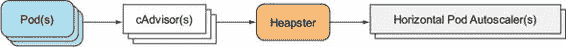
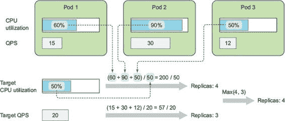
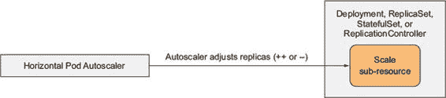
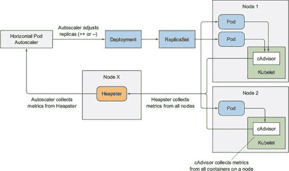
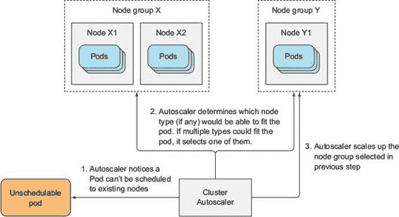

第十五章. Pod 和集群节点自动扩展

本章涵盖

+   根据 CPU 利用率配置 Pod 的自动水平扩展

+   根据自定义指标配置 Pod 的自动水平扩展

+   理解为什么 Pod 的垂直扩展目前不可行

+   理解集群节点自动水平扩展

运行在 Pod 中的应用程序可以通过在 ReplicationController、ReplicaSet、Deployment 或其他可扩展资源中增加`replicas`字段来手动扩展。Pod 也可以通过增加其容器的资源请求和限制（尽管目前只能在 Pod 创建时进行，不能在 Pod 运行时进行）进行垂直扩展。尽管手动扩展在可以提前预测负载峰值或在较长时间内负载逐渐变化时是可行的，但需要手动干预来处理突然、不可预测的流量增加并不是理想的做法。

幸运的是，Kubernetes 可以监控您的 Pod，并在检测到 CPU 使用量或其他指标增加时自动扩展它们。如果在云基础设施上运行，它甚至可以在现有节点无法接受更多 Pod 时启动额外的节点。本章将解释如何让 Kubernetes 同时进行 Pod 和节点自动扩展。

Kubernetes 中的自动扩展功能在 1.6 和 1.7 版本之间完全重写，因此请注意，您可能会在网上找到关于这个主题的过时信息。

15.1. 水平 Pod 自动扩展

水平 Pod 自动扩展是由控制器管理的 Pod 副本数量的自动扩展。它由水平控制器执行，该控制器通过创建 HorizontalPodAutoscaler (HPA) 资源来启用和配置。控制器定期检查 Pod 指标，计算满足 HorizontalPodAutoscaler 资源中配置的目标指标值所需的副本数量，并调整目标资源（Deployment、ReplicaSet、Replication-Controller 或 StatefulSet）上的`replicas`字段。

15.1.1. 理解自动扩展过程

自动扩展过程可以分为三个步骤：

+   获取由扩展资源对象管理的所有 Pod 的指标。

+   计算需要多少 Pod 才能将指标提升到（或接近）指定的目标值。

+   更新扩展资源的`replicas`字段。

让我们接下来检查所有三个步骤。

获取 Pod 指标

自动扩展器本身不执行 pod 指标的收集。它从不同的来源获取指标。正如我们在上一章中看到的，pod 和节点指标由一个称为 cAdvisor 的代理收集，该代理在每个节点上运行 Kubelet，然后由集群范围内的组件 Heapster 进行聚合。水平 pod 自动扩展器控制器通过 REST 调用查询 Heapster 来获取所有 pod 的指标。指标数据的流程如图 15.1 所示（尽管所有连接都是相反方向发起的）。

图 15.1\. 从 pod 到水平 pod 自动扩展器的指标流程

这意味着 Heapster 必须在集群中运行才能使自动扩展工作。如果你使用 Minikube 并且在上一章中跟随操作，Heapster 应该已经在你的集群中启用。如果没有，确保在尝试任何自动扩展示例之前启用 Heapster 扩展。

虽然你不需要直接查询 Heapster，但如果你有兴趣这样做，你将在 `kube-system` 命名空间中找到 Heapster Pod 和它暴露的 Service。

| |
| --- |

查看与自动扩展器获取指标相关联的更改

在 Kubernetes 版本 1.6 之前，水平 pod 自动扩展器直接从 Heapster 获取指标。在版本 1.8 中，自动扩展器可以通过启动 Controller Manager 时使用 `--horizontal-pod-autoscaler-use-rest-clients=true` 标志来通过资源指标 API 的聚合版本获取指标。从版本 1.9 开始，此行为将默认启用。

核心 API 服务器不会自己公开指标。从版本 1.7 开始，Kubernetes 允许注册多个 API 服务器并将它们表现为单个 API 服务器。这允许它通过这些底层 API 服务器之一公开指标。我们将在最后一章中解释 API 服务器聚合。

选择在他们的集群中使用哪个指标收集器将由集群管理员决定。通常需要一个简单的翻译层来在适当的 API 路径和适当的格式中公开指标。

| |
| --- |

计算所需的 pod 数量

一旦自动扩展器获得了正在扩展的资源（部署、副本集、复制控制器或有状态集资源）所属的所有 pod 的指标，它就可以使用这些指标来确定所需的副本数量。它需要找到将所有这些副本的指标平均值尽可能接近配置的目标值的数字。此计算的输入是一组 pod 指标（每个 pod 可能可能有多个指标），输出是一个整数（pod 副本的数量）。

当自动扩展器配置为仅考虑单个指标时，计算所需的副本数量是简单的。只需将所有 Pod 的指标值相加，然后除以 HorizontalPodAutoscaler 资源上设置的目标值，最后向上取整到下一个更大的整数。实际的计算比这要复杂一些，因为它还确保当指标值不稳定且快速变化时，自动扩展器不会频繁波动。

当自动扩展基于多个 Pod 指标（例如，CPU 使用率和每秒查询数[QPS]）时，计算并没有变得复杂多少。自动扩展器会为每个指标单独计算副本数量，然后取最高值（例如，如果需要四个 Pod 来实现目标 CPU 使用率，而需要三个 Pod 来实现目标 QPS，自动扩展器将扩展到四个 Pod）。图 15.2 展示了这个例子。

图 15.2\. 从两个指标计算副本数量

更新扩展资源上的期望副本数量

自动扩展操作的最终步骤是在扩展资源对象（例如 ReplicaSet）上更新期望副本数量字段，然后让 ReplicaSet 控制器负责启动额外的 Pod 或删除多余的 Pod。

自动扩展器控制器通过 Scale 子资源修改扩展资源的`replicas`字段。它使自动扩展器能够在不知道它所扩展的资源任何细节的情况下（除了通过 Scale 子资源暴露的内容之外），完成其工作（参见图 15.3）。

图 15.3\. 水平 Pod 自动扩展器仅修改 Scale 子资源。

这使得自动扩展器可以在任何可扩展资源上操作，只要 API 服务器为其公开 Scale 子资源。目前，它已公开用于

+   Deployments

+   ReplicaSets

+   ReplicationControllers

+   StatefulSets

这些是目前您可以附加自动扩展器的唯一对象。

理解整个自动扩展过程

您现在已经了解了自动扩展涉及的三步，那么让我们可视化自动扩展过程中涉及的所有组件。它们在图 15.4 中展示。

图 15.4\. 自动扩展器如何获取指标并调整目标部署

从 Pod 指向 cAdvisors 的箭头，这些箭头继续指向 Heapster，最后指向 Horizontal Pod Autoscaler，表示指标数据的流向。重要的是要意识到，每个组件都会定期从其他组件获取指标（即 cAdvisor 以连续循环的方式从 Pod 获取指标；Heapster 和 HPA 控制器也是如此）。最终结果是，指标数据传播和重新扩展操作需要相当长的时间。这不是立即发生的。当你观察自动扩展器的工作时，请记住这一点。

15.1.2\. 基于 CPU 利用率的扩展

可能你最希望基于的最重要的指标是运行在你 Pod 内的进程消耗的 CPU 数量。想象一下有几个 Pod 提供一种服务。当它们的 CPU 使用率达到 100%时，很明显它们已经无法再满足需求，需要扩展，要么向上（垂直扩展——增加 Pod 可以使用的 CPU 数量），要么向外（水平扩展——增加 Pod 的数量）。因为我们在这里讨论的是 Horizontal Pod Autoscaler，所以我们只关注向外扩展（增加 Pod 的数量）。通过这样做，平均 CPU 使用率应该会下降。

由于 CPU 使用率通常不稳定，因此在 CPU 完全饱和之前进行扩展是有意义的——例如，当 Pod 的平均 CPU 负载达到或超过 80%时。但这里的 80%是指什么？

小贴士

总是设置目标 CPU 使用率低于 100%（并且绝对不能超过 90%），以留出足够的空间来处理突发的负载峰值。

如你从上一章所记得的，运行在容器内的进程通过为容器指定的资源请求保证获得 CPU 数量。但在没有其他进程需要 CPU 的时候，进程可能会使用节点上所有可用的 CPU。当有人说一个 Pod 消耗了 80%的 CPU 时，并不清楚他们是指节点的 80%的 CPU，Pod 保证的 80%的 CPU（资源请求），还是通过资源限制为 Pod 配置的硬限制的 80%。

对于自动扩展器而言，在确定 Pod 的 CPU 利用率时，只有 Pod 保证的 CPU 数量（即 CPU 请求）是重要的。自动扩展器比较 Pod 的实际 CPU 消耗和其 CPU 请求，这意味着你正在自动扩展的 Pod 需要设置 CPU 请求（无论是直接设置还是通过 LimitRange 对象间接设置），以便自动扩展器能够确定 CPU 利用率百分比。

基于 CPU 使用情况创建 HorizontalPodAutoscaler

现在我们来看看如何创建一个 HorizontalPodAutoscaler，并配置它根据 Pod 的 CPU 利用率进行扩展。你将创建一个类似于第九章中提到的 Deployment，但正如我们讨论的那样，你需要确保由 Deployment 创建的所有 Pod 都指定了 CPU 资源请求，以便实现自动扩展。你必须在 Deployment 的 Pod 模板中添加一个 CPU 资源请求，如下所示。

列表 15.1\. 设置了 CPU 请求的 Deployment：deployment.yaml

`apiVersion: extensions/v1beta1 kind: Deployment metadata:   name: kubia spec:   replicas: 3` `1` `template:     metadata:       name: kubia       labels:         app: kubia     spec:       containers:       - image: luksa/kubia:v1` `2` `name: nodejs         resources:` `3` `requests:` `3` `cpu: 100m` `3`

+   1 手动设置（初始）所需的副本数为三个

+   2 运行 kubia:v1 镜像

+   每个 Pod 请求 100 毫核 CPU

这是一个常规的 Deployment 对象——它还没有使用自动扩展。它将运行三个`kubia` NodeJS 应用的实例，每个实例请求 100 毫核的 CPU。

在创建 Deployment 之后，为了启用其 Pod 的水平自动扩展，你需要创建一个 HorizontalPodAutoscaler (HPA)对象并将其指向 Deployment。你可以准备和发布 HPA 的 YAML 清单，但有一个更简单的方法——使用`kubectl autoscale`命令：

`$ kubectl autoscale deployment kubia --cpu-percent=30 --min=1 --max=5` `deployment "kubia" autoscaled`

这将为你创建 HPA 对象，并将名为`kubia`的 Deployment 设置为扩展目标。你正在设置 Pod 的目标 CPU 利用率为 30%，并指定了最小和最大副本数。自动扩展器将不断调整副本数，以保持其 CPU 利用率在 30%左右，但绝不会将副本数缩减到少于一个或增加到多于五个。

小贴士

总是要确保自动扩展 Deployment 而不是底层的 ReplicaSet。这样，你确保了在应用程序更新期间保留所需的副本数（记住，Deployment 为每个版本创建一个新的 ReplicaSet）。同样的规则也适用于手动扩展。

让我们看看 HorizontalPodAutoscaler 资源的定义，以便更好地理解它。它如下所示。

列表 15.2\. HorizontalPodAutoscaler 的 YAML 定义

`$ kubectl get hpa.v2beta1.autoscaling kubia -o yaml` `apiVersion: autoscaling/v2beta1` `1` `kind: HorizontalPodAutoscaler` `1` `metadata:   name: kubia` `2` `... spec:   maxReplicas: 5` `3` `metrics:` `4` `- resource:` `4` `name: cpu` `4` `targetAverageUtilization: 30` `4` `type: Resource` `4` `minReplicas: 1` `3` `scaleTargetRef:` `5` `apiVersion: extensions/v1beta1` `5` `kind: Deployment` `5` `name: kubia` `5` `status:   currentMetrics: []` `6` `currentReplicas: 3` `6` `desiredReplicas: 0` `6`

+   1 HPA 资源位于 autoscaling API 组中。

+   2 每个 HPA 都有一个名称（它不需要与部署的名称匹配，如本例所示）。

+   3 你指定的副本的最小和最大数量

+   4 你希望自动扩展器调整 Pod 的数量，使每个 Pod 利用 30%的请求 CPU。

+   5 这个自动扩展器将要作用的资源目标

+   6 自动扩展器的当前状态

注意

HPA 资源存在多个版本：新的`autoscaling/v2beta1`和旧的`autoscaling/v1`。你在这里请求的是新版本。

看到第一次自动缩放事件

在自动扩展器可以采取行动之前，cAdvisor 需要获取 CPU 指标，Heapster 需要收集它们，这需要一段时间。在这段时间内，如果你使用`kubectl get`显示 HPA 资源，`TARGETS`列将显示`<unknown>`：

`$ kubectl get hpa` `NAME      REFERENCE          TARGETS           MINPODS   MAXPODS   REPLICAS kubia     Deployment/kubia   <unknown> / 30%   1         5         0`

由于你正在运行三个当前没有收到请求的 Pod，这意味着它们的 CPU 使用率应该接近零，因此你应该预期自动扩展器将它们缩放到单个 Pod，因为即使只有一个 Pod，CPU 利用率仍然会低于 30%的目标。

确实如此，自动扩展器正是这样做的。它很快将 Deployment 缩放到单个副本：

`$ kubectl get deployment` `NAME` `DESIRED``CURRENT   UP-TO-DATE   AVAILABLE   AGE kubia` `1``         1         1            1           23m`

记住，自动扩展器只调整 Deployment 上的期望副本数。然后，Deployment 控制器负责更新 ReplicaSet 对象上的期望副本数，这会导致 ReplicaSet 控制器删除两个多余的 Pod，留下一个 Pod 运行。

你可以使用`kubectl describe`来查看关于 HorizontalPod-Autoscaler 和底层控制器操作的更多信息，如下面的列表所示。

列表 15.3\. 使用`kubectl describe`检查 HorizontalPodAutoscaler

`$ kubectl describe hpa` `Name:                             kubia Namespace:                        default Labels:                           <none> Annotations:                      <none> CreationTimestamp:                Sat, 03 Jun 2017 12:59:57 +0200 Reference:                        Deployment/kubia Metrics:                          ( current / target )   resource cpu on pods   (as a percentage of request):   0% (0) / 30% Min replicas:                     1 Max replicas:                     5 Events: From                        Reason              Message ----                        ------              --- horizontal-pod-autoscaler   SuccessfulRescale   New size: 1; reason: All                                                 metrics below target`

注意

输出已被修改以使其更易于阅读。

将你的注意力转向列表底部的事件表。你看到水平 pod 自动扩展器已成功调整到 1 个副本，因为所有指标都低于目标。

触发扩容

你已经见证了你的第一个自动调整大小事件（缩小）。现在，你将开始向你的 pod 发送请求，从而增加其 CPU 使用率，你应该看到自动扩展器检测到这一点并启动额外的 pods。

你需要通过一个 Service 来暴露 pods，这样你就可以通过一个 URL 访问它们。你可能记得，这样做最简单的方式是使用`kubectl expose`：

`$ kubectl expose deployment kubia --port=80 --target-port=8080` `service "kubia" exposed`

在你开始对你的 pod(s)发送请求之前，你可能想在另一个终端中运行以下命令，以便密切关注 HorizontalPodAutoscaler 和 Deployment 的情况，如下所示。

列表 15.4.并行监视多个资源

`$ watch -n 1 kubectl get hpa,deployment` `每 1.0 秒：kubectl get hpa,deployment  NAME        REFERENCE          TARGETS    MINPODS   MAXPODS   REPLICAS  AGE hpa/kubia   Deployment/kubia   0% / 30%   1         5         1         45m  NAME           DESIRED   CURRENT   UP-TO-DATE   AVAILABLE   AGE deploy/kubia   1         1         1            1           56m`

小贴士

使用逗号分隔符，通过`kubectl get`列出多个资源类型。

如果你使用的是 OSX，你必须将`watch`命令替换为循环，手动定期运行`kubectl get`，或者使用`kubectl`的`--watch`选项。但尽管普通的`kubectl get`可以同时显示多种类型的资源，但在使用上述`--watch`选项时并非如此，所以如果你想同时监视 HPA 和 Deployment 对象，你需要使用两个终端。

在运行负载生成 pod 时，请密切关注这两个对象的状态。你需要在另一个终端中运行以下命令：

`$ kubectl run -it --rm --restart=Never loadgenerator --image=busybox``-- sh -c "while true; do wget -O - -q http://kubia.default; done"`

这将运行一个 Pod，该 Pod 会反复调用`kubia`服务。你已经多次在运行`kubectl exec`命令时看到`-it`选项。正如你所见，它也可以与`kubectl run`一起使用。这允许你将控制台附加到进程，这不仅会直接显示进程的输出，而且在你按下 CTRL+C 时也会终止进程。`--rm`选项会在之后删除 Pod，而`--restart=Never`选项会导致`kubectl run`直接创建一个未管理的 Pod，而不是通过 Deployment 对象，这你不需要。这种选项组合对于在集群内部运行命令而不需要依赖现有 Pod 非常有用。它不仅表现得与你在本地运行命令时一样，而且在命令终止时还会清理所有内容。

观察自动扩展器扩展部署

随着负载生成器 Pod 的运行，你会看到它最初攻击单个 Pod。和之前一样，更新指标需要时间，但一旦更新，你就会看到自动扩展器增加副本的数量。在我的情况下，Pod 的 CPU 利用率最初跳升到 108%，这导致自动扩展器将 Pod 的数量增加到四个。然后，单个 Pod 的利用率下降到 74%，然后稳定在大约 26%左右。

注意

如果你情况下的 CPU 负载不超过 30%，尝试运行额外的负载生成器。

再次强调，你可以使用`kubectl describe`来检查自动扩展器的事件，以查看自动扩展器做了什么（以下列表中只显示了最重要的信息）。

列表 15.5. 水平 Pod 自动扩展器的事件

`From    Reason              Message ----    ------              ------- h-p-a   SuccessfulRescale   New size: 1; reason: All metrics below target h-p-a   SuccessfulRescale   New size: 4; reason: cpu resource utilization (percentage of request) above target`

你是否觉得奇怪，在我只有一个 Pod 的情况下，初始的平均 CPU 利用率竟然达到了 108%，这超过了 100%？记住，容器的 CPU 利用率是容器的实际 CPU 使用量除以其请求的 CPU。请求的 CPU 定义了容器可用的 CPU 的最小量，而不是最大量，因此容器可能消耗的 CPU 超过请求量，导致百分比超过 100%。

在我们继续之前，让我们做一点数学计算，看看自动扩展器是如何得出需要四个副本的结论的。最初，有一个副本处理请求，其 CPU 利用率激增到 108%。将 108 除以 30（目标 CPU 利用率百分比）得到 3.6，然后自动扩展器将其四舍五入到 4。如果你将 108 除以 4，你得到 27%。如果自动扩展器扩展到四个 Pod，它们的平均 CPU 利用率预计将在 27%左右，这接近于 30%的目标值，并且几乎与观察到的 CPU 利用率完全一致。

理解最大扩展速率

在我的情况下，CPU 使用率飙升至 108%，但一般来说，初始 CPU 使用率可能会更高。即使初始平均 CPU 利用率更高（比如说 150%），需要五个副本才能达到 30%的目标，自动扩展器在第一步中仍然只会扩展到四个 Pod，因为它对单次扩展操作中可以添加的副本数量有限制。如果当前副本数量超过两个，自动扩展器在单次操作中最多只会将副本数量翻倍。如果只有一到两个副本，它将单步扩展到最多四个副本。

此外，它还对后续自动扩展操作可以在前一个操作之后多快发生有限制。目前，只有在最后三分钟内没有发生重新缩放事件时，才会发生扩展。缩放事件发生的频率更低——每五分钟一次。请记住这一点，以免您不明白为什么即使指标清楚地显示应该进行缩放操作，自动扩展器也拒绝执行缩放操作。

在现有的 HPA 对象上修改目标度量值

为了总结本节内容，让我们进行最后一个练习。也许您最初的 30% CPU 利用率目标有点低，所以将其提高到 60%。您可以通过使用`kubectl edit`命令编辑 HPA 资源来完成此操作。当文本编辑器打开时，将`targetAverageUtilization`字段更改为`60`，如下所示。

列表 15.6\. 通过编辑 HPA 资源提高目标 CPU 利用率

`... spec:    maxReplicas: 5    metrics:    - resource:        name: cpu        targetAverageUtilization: 60` `1` `type: Resource ...`

+   1 将此从 30 更改为 60。

与大多数其他资源一样，修改资源后，自动扩展器控制器会检测到您的更改并采取行动。您也可以删除资源，并使用不同的目标值重新创建它，因为通过删除 HPA 资源，您只是禁用了目标资源（在这种情况下是 Deployment）的自动扩展，并使其保持在当时的规模。创建新的 HPA 资源后，自动扩展将重新启动。

15.1.3\. 基于内存消耗进行缩放

你已经看到了如何轻松地配置水平自动扩展器以保持 CPU 利用率在目标水平。但基于 Pod 内存使用量的自动扩展又如何呢？

基于内存的自动扩展比基于 CPU 的自动扩展问题更多。主要原因是在扩展之后，旧的 Pod 需要以某种方式被迫释放内存。这需要由应用程序本身完成——系统无法完成。系统所能做的就是杀死并重新启动应用程序，希望它使用的内存比之前少。但如果应用程序随后使用与之前相同的内存量，自动扩展器会再次将其扩展。一次又一次，直到达到 HPA 资源上配置的最大 Pod 数量。显然，这不是任何人想要的。基于内存的自动扩展是在 Kubernetes 版本 1.8 中引入的，其配置方式与基于 CPU 的自动扩展完全相同。探索它留给读者自行完成。

15.1.4\. 基于其他和自定义指标的扩展

您已经看到，根据 CPU 使用情况扩展 Pod 是多么容易。最初，这是唯一在实践中可用的自动扩展选项。要让自动扩展器使用自定义的应用定义指标来驱动其自动扩展决策相当复杂。自动扩展器的初始设计并没有使其容易超越简单的基于 CPU 的扩展。这促使 Kubernetes 自动扩展特别兴趣小组（SIG）完全重新设计自动扩展器。

如果您对使用初始自动扩展器与自定义指标有多么复杂感兴趣，我邀请您阅读我的一篇博客文章，标题为“不使用主机端口进行基于自定义指标的 Kubernetes 自动扩展”，您可以在网上找到[`medium.com/@marko.luksa`](http://medium.com/@marko.luksa)。您将了解我在尝试根据自定义指标设置自动扩展时遇到的所有其他问题。幸运的是，Kubernetes 的新版本没有这些问题。我将在一篇新的博客文章中介绍这个主题。

在这里不通过一个完整的示例，让我们快速了解一下如何配置自动扩展器以使用不同的指标源。我们将首先检查我们在上一个示例中定义了什么指标。以下列表显示了您的上一个 HPA 对象是如何配置为使用 CPU 使用率指标的。

列表 15.7\. 基于 CPU 的自动扩展的 HorizontalPodAutoscaler 定义

`... spec:    maxReplicas: 5    metrics:    - type: Resource` `1` `resource:    name: cpu` `2` `targetAverageUtilization: 30` `3` `...`

+   1 定义指标类型

+   2 将要监控的资源利用率

+   3 该资源的目标利用率

如您所见，`metrics`字段允许您定义多个要使用的指标。在列表中，您正在使用单个指标。每个条目定义了指标的`type`——在这种情况下，是一个`Resource`指标。在 HPA 对象中，您可以使用三种类型的指标：

+   `Resource`

+   `Pods`

+   `Object`

理解资源指标类型

`Resource`类型使自动扩展器基于资源指标（如容器资源请求中指定的指标）进行自动扩展决策。我们已经看到了如何做到这一点，所以让我们关注其他两种类型。

理解 Pods 指标类型

`Pods`类型用于引用与 Pod 直接相关的任何其他（包括自定义）指标。此类指标的一个例子可以是已经提到的每秒查询数（QPS）或消息代理队列中的消息数量（当消息代理作为 Pod 运行时）。要配置自动扩展器使用 Pod 的 QPS 指标，HPA 对象需要在它的`metrics`字段下包含以下列表中显示的条目。

列表 15.8.在 HPA 中引用自定义 Pod 指标

`... spec: metrics: - type: Pods` `1` `resource: metricName: qps` `2` `targetAverageValue: 100` `3` `...`

+   1 定义 Pod 指标

+   2 指标的名称

+   3 在所有目标 Pod 中的目标平均值

列表中给出的示例配置了自动扩展器，使其保持由该 HPA 资源针对的 ReplicaSet（或其他）控制器管理的所有 Pod 的平均 QPS 为`100`。

理解 Object 指标类型

当你想根据不直接与这些 Pod 相关的指标来使自动扩展器扩展 Pod 时，使用`Object`指标类型。例如，你可能想根据另一个集群对象（如 Ingress 对象）的指标来扩展 Pod。该指标可以是列表 15.8 中的 QPS，平均请求延迟或其他完全不同的指标。

与前一个案例不同，在前一个案例中，自动扩展器需要获取所有目标 Pod 的指标，然后使用这些值的平均值，当你使用`Object`指标类型时，自动扩展器从单个对象获取单个指标。在 HPA 定义中，你需要指定目标对象和目标值。以下列表显示了一个示例。

列表 15.9.在 HPA 中引用不同对象的指标

`... spec: metrics: - type: Object` `1` `resource: metricName: latencyMillis` `2` `target: apiVersion: extensions/v1beta1` `3` `kind: Ingress` `3` `name: frontend` `3` `targetValue: 20` `4` `scaleTargetRef:` `5` `apiVersion: extensions/v1beta1` `5` `kind: Deployment` `5` `name: kubia` `5` `...`

+   1 使用特定对象的指标

+   2 指标的名称

+   3 自动扩展器应获取其指标的特定对象

+   4 自动扩展器应该扩展，使指标的值保持接近这个值。

+   5 自动扩展器将扩展的可伸缩资源

在此示例中，HPA 被配置为使用`frontend` Ingress 对象的`latencyMillis`指标。该指标的的目标值是`20`。水平 Pod 自动扩展器将监控 Ingress 的指标，如果它上升得太远高于目标值，自动扩展器将扩展`kubia` Deployment 资源。

15.1.5.确定哪些指标适合自动扩展

你需要理解并非所有指标都适合用作自动扩展的基础。如前所述，Pod 容器的内存消耗不是自动扩展的好指标。如果增加副本数不会导致观察到的指标的平均值线性减少（或者至少接近线性），自动扩展器将无法正常工作。

例如，如果你只有一个 Pod 实例，并且指标的值为 X，自动扩展器将副本数扩展到两个，那么指标值需要下降到大约 X/2。这种自定义指标的例子是每秒查询数（QPS），在 Web 应用程序的情况下，它报告每秒应用程序接收到的请求数量。增加副本数将始终导致 QPS 成比例下降，因为更多的 Pod 将处理相同数量的总请求。

在你决定基于你应用程序自己的自定义指标设置自动扩展器之前，请务必考虑当 Pod 数量增加或减少时其值的行为。

15.1.6. 缩放到零副本

水平 Pod 自动扩展器目前不允许将`minReplicas`字段设置为 0，因此自动扩展器永远不会缩放到零，即使 Pod 没有做任何事情。允许 Pod 的数量缩放到零可以显著提高硬件的利用率。当你运行每几小时或甚至每天只接收一次请求的服务时，让它们一直运行，消耗其他 Pod 可能使用的资源是没有意义的。但当你需要这些服务在客户端请求到来时立即可用时，你仍然希望它们存在。

这被称为空闲和取消空闲。它允许提供特定服务的 Pod 被缩放到零。当新的请求到来时，请求将被阻塞，直到 Pod 启动，然后请求最终被转发到 Pod。

Kubernetes 目前还没有提供这个功能，但最终会提供。请检查文档以查看是否已实现空闲状态。

15.2. 垂直 Pod 自动扩展

水平扩展很棒，但并非每个应用程序都可以水平扩展。对于这类应用程序，唯一的选项是将它们垂直扩展——给它们更多的 CPU 和/或内存。因为节点通常拥有的资源比单个 Pod 请求的资源多，所以几乎总是可以垂直扩展 Pod，对吧？

由于一个 Pod 的资源请求是通过 Pod 清单中的字段配置的，因此垂直扩展 Pod 将通过更改这些字段来实现。我说“将”是因为目前无法更改现有 Pod 的资源请求或限制。在我开始写这本书（超过一年前）的时候，我确信在我写这一章的时候，Kubernetes 已经支持了适当的垂直 Pod 自动扩展，所以我将其包含在我的目录提案中。遗憾的是，似乎是一生的时间之后，垂直 Pod 自动扩展仍然还没有实现。

15.2.1. 自动配置资源请求

一个实验性功能为新创建的 Pod 设置了 CPU 和内存请求，如果它们的容器没有明确设置这些值。这个功能由一个名为 InitialResources 的准入控制插件提供。当创建一个没有资源请求的新 Pod 时，该插件会查看 Pod 容器的历史资源使用数据（根据底层容器镜像和标签），并相应地设置请求。

你可以部署 Pod 而不指定资源请求，并依赖 Kubernetes 最终确定每个容器的资源需求。实际上，Kubernetes 正在垂直扩展 Pod。例如，如果一个容器不断耗尽内存，那么下次创建具有该容器镜像的 Pod 时，其内存资源请求将自动设置得更高。

15.2.2. 在 Pod 运行时修改资源请求

最终，将使用相同的机制来修改现有 Pod 的资源请求，这意味着它将在 Pod 运行时垂直扩展 Pod。在我写这段话的时候，一个新的垂直 Pod 自动扩展提案正在最终确定。请参考 Kubernetes 文档以了解垂直 Pod 自动扩展是否已经实现。

15.3. 集群节点的水平扩展

水平 Pod 自动扩展器在需要时创建额外的 Pod 实例。但是，当所有节点都达到容量并且无法运行更多 Pod 时怎么办？显然，这个问题不仅限于当自动扩展器创建新的 Pod 实例时。即使手动创建 Pod，你也可能遇到没有任何节点可以接受新 Pod 的问题，因为节点的资源已经被现有的 Pod 用完。

在那种情况下，你需要删除一些现有的 Pod，垂直缩小它们的规模，或者向你的集群添加额外的节点。如果你的 Kubernetes 集群在本地运行，你需要物理添加一台新机器并将其作为 Kubernetes 集群的一部分。但如果你的集群在云基础设施上运行，添加额外的节点通常只需要几点击或对云基础设施的 API 调用。这可以自动完成，对吧？

Kubernetes 包含了在检测到需要额外的节点时自动从云服务提供商请求额外节点的功能。这是由集群自动扩展器执行的。

15.3.1\. 介绍集群自动扩展器

集群自动扩展器负责在检测到由于节点资源不足而无法将 pod 调度到现有节点时，自动提供额外的节点。当节点长时间未被充分利用时，它也会取消节点分配。

从云基础设施请求额外的节点

如果在创建新的 pod 之后，调度器无法将其调度到任何现有节点，则会分配一个新的节点。集群自动扩展器会关注这类 pod，并要求云服务提供商启动一个额外的节点。但在这样做之前，它会检查新节点是否能够容纳该 pod。毕竟，如果不行，启动这样的节点就没有意义了。

云服务提供商通常将节点分组为相同大小（或具有相同功能）的节点组（或池）。因此，集群自动扩展器不能简单地说“给我一个额外的节点。”它还需要指定节点类型。

集群自动扩展器通过检查可用的节点组，以确定是否至少有一种节点类型能够容纳未调度的 pod。如果恰好存在一个这样的节点组，自动扩展器可以增加节点组的大小，让云服务提供商向该组添加另一个节点。如果存在多个选项，自动扩展器必须选择最佳方案。显然，“最佳”的确切含义将需要可配置。在最坏的情况下，它会随机选择一个。集群自动扩展器对不可调度的 pod 的简单反应概述如图 15.5 所示。图 15.5。

图 15.5\. 当集群自动扩展器找到一个无法调度到现有节点的 pod 时，它会进行扩展。

当新节点启动时，该节点上的 Kubelet 会联系 API 服务器，并通过创建节点资源来注册节点。从那时起，该节点就成为了 Kubernetes 集群的一部分，pod 可以被调度到该节点。

简单吗？那缩小规模怎么办？

放弃节点

当节点未被充分利用时，集群自动扩展器还需要缩小节点数量。自动扩展器通过监控所有节点上请求的 CPU 和内存来完成这项工作。如果给定节点上所有 pod 的 CPU 和内存请求都低于 50%，则认为该节点是不必要的。

这不是决定是否关闭节点的唯一决定因素。自动缩放器还会检查是否有任何系统 pod 仅在该节点上运行（除了那些在每个节点上运行的 pod，因为它们是由 DaemonSet 等部署的）。如果一个节点上运行了系统 pod，则该节点不会被释放。同样，如果一个未管理的 pod 或具有本地存储的 pod 在该节点上运行，因为这会导致 pod 提供的服务中断，也会出现这种情况。换句话说，只有当集群自动缩放器知道节点上运行的 pod 将被重新调度到其他节点时，节点才会返回到云提供商。

当一个节点被选中关闭时，该节点首先被标记为不可调度，然后从节点驱逐所有运行的 pod。因为这些 pod 都属于 ReplicaSet 或其他控制器，它们的替代品将被创建并调度到剩余的节点（这就是为什么正在关闭的节点首先被标记为不可调度）。

手动隔离和驱逐节点

节点也可以通过以下 `kubectl` 命令手动标记为不可调度并驱逐：

+   `kubectl cordon <node>` 将节点标记为不可调度（但对该节点上运行的 pod 不做任何操作）。

+   `kubectl drain <node>` 将节点标记为不可调度，然后从节点驱逐所有 pod。

在这两种情况下，在您再次使用 `kubectl uncordon <node>` 命令解除节点隔离之前，不会将新的 pod 调度到该节点。

15.3.2\. 启用集群自动缩放

集群自动缩放目前可在

+   谷歌 Kubernetes 引擎 (GKE)

+   谷歌计算引擎 (GCE)

+   亚马逊网络服务 (AWS)

+   微软 Azure

启动自动缩放器的方式取决于您的 Kubernetes 集群运行的位置。对于在 GKE 上运行的 `kubia` 集群，您可以通过以下方式启用集群自动缩放：

`$ gcloud container clusters update kubia --enable-autoscaling \``--min-nodes=3 --max-nodes=5`

如果您的集群运行在 GCE 上，在运行 `kube-up.sh` 之前，您需要设置三个环境变量：

+   `KUBE_ENABLE_CLUSTER_AUTOSCALER=true`

+   `KUBE_AUTOSCALER_MIN_NODES=3`

+   `KUBE_AUTOSCALER_MAX_NODES=5`

有关在其他平台上启用自动缩放器的信息，请参阅集群自动缩放器 GitHub 仓库：[`github.com/kubernetes/autoscaler/tree/master/cluster-autoscaler`](https://github.com/kubernetes/autoscaler/tree/master/cluster-autoscaler)。

注意

集群自动缩放器将其状态发布到 `kube-system` 命名空间中的 `cluster-autoscaler-status` ConfigMap。

15.3.3\. 限制集群缩小时服务中断

当一个节点意外失败时，您无法阻止其 pod 变得不可用。但是当一个节点自愿关闭，无论是集群自动缩放器还是由人工操作员关闭，您可以通过一个附加功能确保操作不会中断在该节点上运行的 pod 提供的服务。

某些服务要求始终运行一定数量的 Pod；这对于基于法定人数的集群应用程序尤其如此。因此，Kubernetes 提供了一种指定在执行这些类型操作时需要保持运行的最小 Pod 数量的方法。这是通过创建一个 PodDisruptionBudget 资源来实现的。

尽管资源的名称听起来很复杂，但它是最简单的 Kubernetes 资源之一。它仅包含一个 Pod 标签选择器和指定必须始终可用的最小 Pod 数量的数字，或者从 Kubernetes 版本 1.7 开始，可以不可用的最大 Pod 数量。我们将查看 PodDisruptionBudget (PDB) 资源清单的样子，但您将使用 `kubectl create pod-disruptionbudget` 创建它，然后稍后获取并检查 YAML。

如果您想确保您的 `kubia` Pod 的三个实例始终运行（它们具有标签 `app=kubia`），则可以创建一个类似这样的 PodDisruptionBudget 资源：

`$ kubectl create pdb kubia-pdb --selector=app=kubia --min-available=3` `poddisruptionbudget "kubia-pdb" created`

简单，对吧？现在，检索 PDB 的 YAML。它将在下一个列表中显示。

列表 15.10\. PodDisruptionBudget 定义

`$ kubectl get pdb kubia-pdb -o yaml` `apiVersion: policy/v1beta1 kind: PodDisruptionBudget metadata:   name: kubia-pdb spec:   minAvailable: 3` `1` `selector:` `2` `matchLabels:` `2` `app: kubia` `2` `status:   ...`

+   1 应该始终有多少个 Pod 可用

+   2 确定此预算应用于哪些 Pod 的标签选择器

您还可以在 `minAvailable` 字段中使用百分比而不是绝对数字。例如，您可以声明所有带有 `app=kubia` 标签的 Pod 中有 60% 需要始终运行。

注意

从 Kubernetes 1.7 版本开始，PodDisruptionBudget 资源也支持 `maxUnavailable` 字段，如果您想阻止在更多 Pod 不可用的情况下驱逐，可以使用它而不是 `minAvailable`。

我们对这个资源没有更多要说的。只要它存在，集群自动扩展器和 `kubectl drain` 命令都将遵守它，并且如果驱逐 Pod 会将此类 Pod 的数量降至三个以下，则永远不会驱逐带有 `app=kubia` 标签的 Pod。

例如，如果有四个 Pod 总共，并且 `minAvailable` 设置为三个，就像示例中那样，Pod 驱逐过程将逐个驱逐 Pod，等待被驱逐的 Pod 被副本集控制器替换，然后再驱逐另一个 Pod。

15.4\. 摘要

本章向您展示了 Kubernetes 如何扩展您的 Pod 和节点。您已经了解到

+   配置 Pod 的自动水平扩展与创建一个 Horizontal-PodAutoscaler 对象并将它指向 Deployment、ReplicaSet 或 ReplicationController，并指定 Pod 的目标 CPU 利用率一样简单。

+   除了让水平 Pod 自动缩放根据 Pod 的 CPU 利用率执行缩放操作外，您还可以配置它根据您自己的应用程序提供的自定义指标或与集群中部署的其他对象相关的指标进行缩放。

+   垂直 Pod 自动缩放目前尚不可行。

+   如果您的 Kubernetes 集群运行在受支持的云服务提供商上，甚至集群节点也可以自动缩放。

+   您可以使用带有`-it`和`--rm`选项的`kubectl run`命令在 Pod 中运行一次性进程，并在您按下 CTRL+C 后自动停止并删除 Pod。

在下一章中，您将探索高级调度功能，例如如何将某些 Pod 与某些节点隔离开来，以及如何将 Pod 调度得既紧密又分散。
