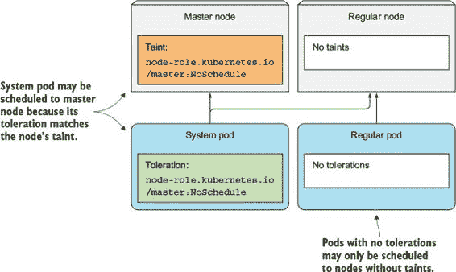
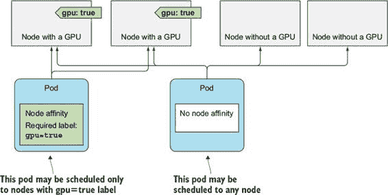
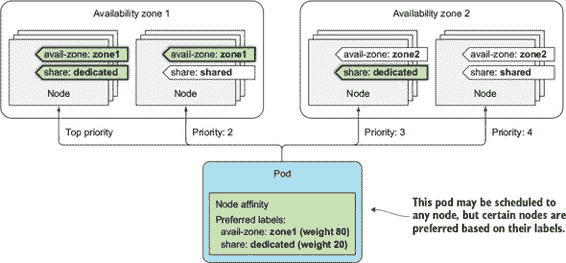
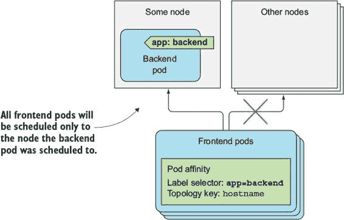
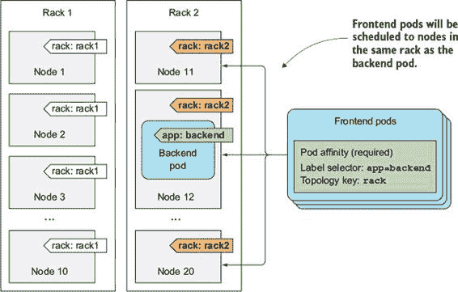
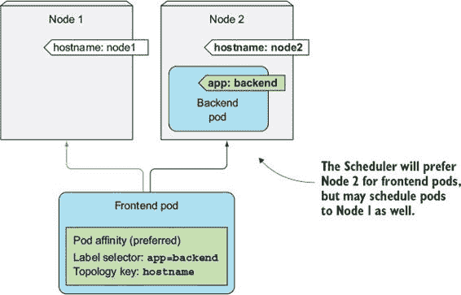
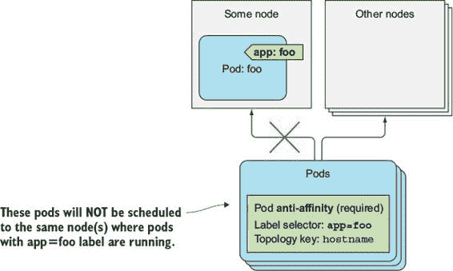

第十六章\. 高级调度

本章涵盖

+   使用节点污点和 pod 容忍度将 pod 保持远离某些节点

+   将节点亲和性规则定义为节点选择器的替代方案

+   使用 pod 亲和性将 pod 部署在一起

+   使用 pod 反亲和性将 pod 保持彼此远离

Kubernetes 允许你影响 pod 的调度位置。最初，这仅通过在 pod 规范中指定节点选择器来完成，但后来又添加了额外的机制来扩展这一功能。这些内容在本章中介绍。

16.1\. 使用污点和容忍度将 pod 从某些节点排斥

我们在这里将要探索的前两个与高级调度相关的功能是节点污点以及 pod 对这些污点的容忍度。它们用于限制哪些 pod 可以使用某个节点。只有当 pod 容忍节点的污点时，它才能被调度到该节点。

这与使用节点选择器和节点亲和性有些不同，你将在本章后面的内容中了解到。节点选择器和节点亲和性规则使得可以通过在 pod 中特别添加相关信息来选择 pod 可以或不可以被调度到哪些节点，而污点允许通过仅在节点上添加污点来拒绝 pod 的部署，而无需修改现有的 pod。你想要部署在污点节点上的 pod 需要选择加入以使用该节点，而与节点选择器不同，pod 明确指定它们想要部署到的节点。

16.1.1\. 介绍污点和容忍度

了解节点污点的最佳途径是查看现有的污点。附录 B 展示了如何使用 `kubeadm` 工具设置多节点集群。默认情况下，此类集群中的主节点被污点标记，因此只有控制平面 pod 可以部署在其上。

显示节点的污点

你可以使用 `kubectl describe node` 来查看节点的污点，如下面的列表所示。

列表 16.1\. 描述使用 `kubeadm` 创建的集群中的主节点

`$ kubectl describe node master.k8s` `Name:         master.k8s` `Role:           master.k8s` `Labels:       beta.kubernetes.io/arch=amd64` `             beta.kubernetes.io/os=linux` `             kubernetes.io/hostname=master.k8s` `             node-role.kubernetes.io/master= Annotations:  node.alpha.kubernetes.io/ttl=0` `             volumes.kubernetes.io/controller-managed-attach-detach=true` `Taints:       node-role.kubernetes.io/master:NoSchedule` `1` `...`

+   1 主节点有一个污点。

主节点有一个单一的污点。污点有一个键、一个值和一个效果，表示为 `<key>=<value>:<effect>`。前一个列表中显示的主节点的污点具有键 `node-role.kubernetes.io/master`，一个 `null` 值（在污点中未显示）和效果 `NoSchedule`。

这个污点阻止 pod 被调度到主节点，除非这些 pod 容忍这个污点。容忍它的 pod 通常都是系统 pod（参见图 16.1）。

图 16.1\. 只有当 pod 容忍节点的污点时，才会将 pod 调度到节点。

显示 pod 的容忍度

在使用`kubeadm`安装的集群中，kube-proxy 集群组件作为 pod 在每个节点上运行，包括主节点，因为作为 pod 运行的 master 组件可能也需要访问 Kubernetes 服务。为了确保 kube-proxy pod 也运行在主节点上，它包括适当的容忍度。总共，该 pod 有三个容忍度，如下所示。

列表 16.2\. pod 的容忍度

`$ kubectl describe po kube-proxy-80wqm -n kube-system` `... 容忍度：    node-role.kubernetes.io/master=:NoSchedule               node.alpha.kubernetes.io/notReady=:Exists:NoExecute               node.alpha.kubernetes.io/unreachable=:Exists:NoExecute ...`

如您所见，第一个容忍度与主节点的污点匹配，允许此 kube-proxy pod 被调度到主节点。

备注

忽略显示在 pod 的容忍度中但不在节点的污点中的等号。Kubectl 在污点/容忍度的值为`null`时似乎以不同的方式显示污点和容忍度。

理解污点效果

kube-proxy pod 上的另外两个容忍度定义了 pod 在未就绪或不可达的节点上运行的时间长度（秒数未显示，但可以在 pod 的 YAML 中看到）。这两个容忍度指的是`NoExecute`效果而不是`NoSchedule`效果。

每个污点都与一个效果相关联。存在三种可能的效果：

+   `NoSchedule`，这意味着如果 pod 不容忍污点，则不会将其调度到节点。

+   `PreferNoSchedule`是`NoSchedule`的软版本，意味着调度器会尝试避免将 pod 调度到节点，但如果无法在其他地方调度，则会将其调度到节点。

+   `NoExecute`与仅影响调度的`NoSchedule`和`PreferNoSchedule`不同，它还会影响节点上已运行的 pod。如果您向节点添加`NoExecute`污点，则已在该节点上运行且不容忍`NoExecute`污点的 pod 将被从节点驱逐。

16.1.2\. 向节点添加自定义污点

想象一下拥有一个单一的 Kubernetes 集群，您在其中运行生产和非生产工作负载。非生产 pod 永远不会在生产节点上运行这一点至关重要。这可以通过向生产节点添加污点来实现。要添加污点，您使用`kubectl taint`命令：

`$ kubectl taint node node1.k8s node-type=production:NoSchedule` `node "node1.k8s" 污点`

这添加了一个具有键`node-type`、值`production`和`NoSchedule`效果的污点。如果您现在部署常规 pod 的多个副本，您将看到它们都没有被调度到您已污点的节点，如下所示。

列表 16.3\. 部署没有容忍度的 pod

`$ kubectl run test --image busybox --replicas 5 -- sleep 99999` `deployment "test" created` `$ kubectl get po -o wide` `NAME                READY  STATUS    RESTARTS   AGE   IP          NODE test-196686-46ngl   1/1    Running   0          12s   10.47.0.1   node2.k8s test-196686-73p89   1/1    Running   0          12s   10.47.0.7   node2.k8s test-196686-77280   1/1    Running   0          12s   10.47.0.6   node2.k8s test-196686-h9m8f   1/1    Running   0          12s   10.47.0.5   node2.k8s test-196686-p85ll   1/1    Running   0          12s   10.47.0.4   node2.k8s`

现在，没有人可以意外地将 Pod 部署到生产节点上。

16.1.3\. 为 Pod 添加容忍度

要将生产 Pod 部署到生产节点，它们需要容忍您添加到节点上的污点。您生产 Pod 的清单需要包含以下列表中所示的 YAML 片段。

列表 16.4\. 具有容忍度的生产 Deployment：production-deployment.yaml

`apiVersion: extensions/v1beta1 kind: Deployment metadata:   name: prod spec:   replicas: 5   template:     spec:       ...       tolerations:       - key: node-type` `1` `Operator: Equal` `1` `value: production` `1` `effect: NoSchedule` `1`

+   1 此容忍度允许 Pod 被调度到生产节点。

如果您部署此 Deployment，您将看到其 Pod 被部署到生产节点，如下一列表所示。

列表 16.5\. 具有容忍度的 Pod 被部署在生产`node1`上

`$ kubectl get po -o wide` `NAME                READY  STATUS    RESTARTS   AGE   IP          NODE prod-350605-1ph5h   0/1    Running   0          16s   10.44.0.3` `node1``.k8s prod-350605-ctqcr   1/1    Running   0          16s   10.47.0.4   node2.k8s prod-350605-f7pcc   0/1    Running   0          17s   10.44.0.6` `node1``.k8s prod-350605-k7c8g   1/1    Running   0          17s   10.47.0.9   node2.k8s prod-350605-rp1nv   0/1    Running   0          17s   10.44.0.4` `node1``.k8s`

正如列表所示，生产型 Pod 也被部署到了`node2`，而它并不是一个生产节点。为了防止这种情况发生，您还需要对非生产节点施加一个污点，例如`node-type=non-production:NoSchedule`。然后，您还需要为所有非生产 Pod 添加相应的容忍度。

16.1.4\. 理解污点和容忍度可以用于什么

节点可以有多个污点，Pod 也可以有多个容忍度。如您所见，污点只能有一个键和一个效果，不需要值。容忍度可以通过指定`Equal`运算符（如果不指定，这也是默认运算符）来容忍特定值，或者如果使用`Exists`运算符，它们可以容忍特定污点键的任何值。

在调度过程中使用污点和容忍度

污点可以用来防止新 Pod 的调度（`NoSchedule`效果），定义不首选的节点（`PreferNoSchedule`效果），甚至从节点驱逐现有的 Pod（`NoExecute`）。

你可以按任何你认为合适的方式设置污点和容忍度。例如，你可以将集群划分为多个分区，允许你的开发团队只将 Pod 调度到各自的节点。你也可以在多个节点提供特殊硬件且只有部分 Pod 需要使用该硬件时使用污点和容忍度。

配置节点故障后 Pod 重新调度的延迟时间

你还可以使用容忍度来指定在 Pod 所在的节点变得不可就绪或不可达后，Kubernetes 应该在重新调度 Pod 到另一个节点之前等待多长时间。如果你查看你的 Pod 的容忍度，你会看到两个容忍度，如下所示。

列表 16.6\. 默认容忍度的 Pod

`$ kubectl get po prod-350605-1ph5h -o yaml` `...   tolerations:   - effect: NoExecute   1   key: node.alpha.kubernetes.io/notReady   1   operator: Exists   1   tolerationSeconds: 300   1   - effect: NoExecute   2   key: node.alpha.kubernetes.io/unreachable   2   operator: Exists   2   tolerationSeconds: 300   2`

+   1 Pod 可以容忍节点 notReady 状态持续 300 秒，然后需要重新调度。

+   2 同样适用于节点不可达的情况。

这两个容忍度说明，这个 Pod 可以容忍节点在`notReady`或`unreachable`状态持续`300`秒。当 Kubernetes 控制平面检测到节点不再就绪或不可达时，它会在删除 Pod 并将其重新调度到另一个节点之前等待 300 秒。

这两个容忍度会自动添加到未定义它们的 Pod 中。如果这个五分钟的延迟对于你的 Pod 来说太长了，你可以通过将这两个容忍度添加到 Pod 的规范中来缩短延迟。

注意

这目前是一个 alpha 特性，因此它可能在 Kubernetes 的未来版本中发生变化。基于污点的驱逐默认也是未启用的。你可以通过运行带有`--feature-gates=Taint-BasedEvictions=true`选项的 Controller Manager 来启用它们。

16.2\. 使用节点亲和将 Pod 吸引到特定节点

正如你所学的，污点（taints）用于将 Pod 从某些节点上移除。现在你将了解一种称为节点亲和（node affinity）的新机制，它允许你告诉 Kubernetes 只将 Pod 调度到特定的节点子集。

比较节点亲和与节点选择器

Kubernetes 早期版本中的初始节点亲和机制是 Pod 规范中的`node-Selector`字段。节点必须包含该字段中指定的所有标签才能有资格成为 Pod 的目标。

节点选择器完成了工作且很简单，但它们并不提供你可能需要的所有功能。因此，引入了一种更强大的机制。节点选择器最终将被弃用，因此了解新的节点亲和规则非常重要。

与节点选择器类似，每个 Pod 都可以定义自己的节点亲和性规则。这允许你指定硬要求或偏好。通过指定偏好，你告诉 Kubernetes 你希望为特定 Pod 使用的节点，Kubernetes 将尝试将 Pod 调度到这些节点之一。如果不可能，它将选择其他节点之一。

检查默认节点标签

节点亲和性根据节点的标签选择节点，这与节点选择器的方式相同。在你了解如何使用节点亲和性之前，让我们检查 Google Kubernetes Engine 集群（GKE）中的一个节点的标签，以查看默认节点标签是什么。它们在以下列表中显示。

列表 16.7\. GKE 中节点的默认标签

`$ kubectl describe node gke-kubia-default-pool-db274c5a-mjnf` `Name:     gke-kubia-default-pool-db274c5a-mjnf Role: Labels:   beta.kubernetes.io/arch=amd64           beta.kubernetes.io/fluentd-ds-ready=true           beta.kubernetes.io/instance-type=f1-micro           beta.kubernetes.io/os=linux           cloud.google.com/gke-nodepool=default-pool           failure-domain.beta.kubernetes.io/region=europe-west1` `1` `failure-domain.beta.kubernetes.io/zone=europe-west1-d` `1` `kubernetes.io/hostname=gke-kubia-default-pool-db274c5a-mjnf` `1`

+   1 这三个标签是与节点亲和性最相关的最重要的标签。

节点有许多标签，但在节点亲和性和 Pod 亲和性方面，最后三个标签是最重要的。你将在后面了解这些标签的含义。以下是对这三个标签含义的说明：

+   `failure-domain.beta.kubernetes.io/region` 指定了节点所在的地理区域。

+   `failure-domain.beta.kubernetes.io/zone` 指定了节点所在的可用区。

+   `kubernetes.io/hostname` 显然是节点的主机名。

这些和其他标签可以在 Pod 亲和性规则中使用。在第三章中，你已经学习了如何向节点添加自定义标签并在 Pod 的节点选择器中使用它。你通过向 Pod 添加节点选择器来使用自定义标签，以便只在该标签的节点上部署 Pod。现在，你将看到如何使用节点亲和性规则来完成同样的操作。

16.2.1\. 指定硬节点亲和规则

在第三章的示例中，你使用了节点选择器来部署一个只要求在具有 GPU 的节点上运行的 Pod。Pod 规范中包含了以下列表所示的`nodeSelector`字段。

列表 16.8\. 使用节点选择器的 Pod：kubia-gpu-nodeselector.yaml

`apiVersion: v1 kind: Pod metadata:   name: kubia-gpu spec:   nodeSelector:` `1` `gpu: "true"` `1` `...`

+   1 此 Pod 仅调度到具有`gpu=true`标签的节点。

`nodeSelector`字段指定 Pod 应该只部署在包含`gpu=true`标签的节点上。如果你用节点亲和性规则替换节点选择器，Pod 定义将类似于以下列表。

列表 16.9\. 使用`nodeAffinity`规则的 Pod：kubia-gpu-nodeaffinity.yaml

`apiVersion: v1 kind: Pod metadata:   name: kubia-gpu spec:   affinity:     nodeAffinity:       requiredDuringSchedulingIgnoredDuringExecution:         nodeSelectorTerms:         - matchExpressions:           - key: gpu             operator: In             values:             - "true"`

您首先会注意到，这比简单的节点选择器要复杂得多。但这是因为它具有更强的表达能力。让我们详细检查这个规则。

理解长节点亲和性属性名称

如您所见，Pod 的 spec 部分包含一个包含`nodeAffinity`字段的`affinity`字段，该字段包含一个极其长的字段，所以让我们首先关注这个字段。

让我们将其分为两部分，并检查它们的意义：

+   `requiredDuringScheduling...`表示在此字段下定义的规则指定了节点必须具有的标签，以便 Pod 可以调度到该节点。

+   `...IgnoredDuringExecution`表示在此字段下定义的规则不会影响已经在节点上运行的 Pod。

在这一点上，让我通过让您知道亲和性目前仅影响 Pod 调度，永远不会导致 Pod 从节点中被驱逐，来简化事情。这就是为什么所有当前的规则都以`IgnoredDuringExecution`结束。最终，Kubernetes 也将支持`RequiredDuringExecution`，这意味着如果您从节点中删除一个标签，需要该标签的节点才能调度 Pod 的 Pod 将被从该节点驱逐。正如我所说的，这还不是 Kubernetes 支持的功能，所以我们不再关注那个长字段的第二部分。

理解 nodeSelectorTerms

通过记住上一节中解释的内容，很容易理解`nodeSelectorTerms`字段和`matchExpressions`字段定义了节点标签必须匹配哪些表达式，以便 Pod 可以调度到该节点。示例中的单个表达式很容易理解。节点必须有一个值为`true`的`gpu`标签。

因此，这个 Pod 将只调度到具有`gpu=true`标签的节点，如图 16.2 所示。

图 16.2\. Pod 的节点亲和性指定了节点必须具有哪些标签，以便 Pod 可以调度到该节点。

现在是更有趣的部分。节点亲和性还允许您在调度期间优先考虑节点。我们将在下一部分查看这一点。

16.2.2\. 在调度 Pod 时优先考虑节点

新引入的节点亲和性功能最大的好处是能够指定调度特定 Pod 时调度器应该优先考虑哪些节点。这是通过`preferredDuringSchedulingIgnoredDuringExecution`字段实现的。

想象一下，你拥有多个分布在不同国家的数据中心。每个数据中心代表一个单独的可用区。在每个区域，你有一些仅用于你自己的机器，以及一些你的合作伙伴公司可以使用的机器。现在你想要部署几个 Pod，你希望它们被调度到`zone1`以及为你公司部署预留的机器上。如果那些机器没有足够的空间来容纳 Pod，或者存在其他重要原因阻止它们在那里调度，你也会接受它们被调度到你的合作伙伴使用的机器和其他区域。节点亲和性允许你做到这一点。

标记节点

首先，节点需要被适当地标记。每个节点都需要一个标签来指定节点所属的可用区，以及一个标记来表明它是一个专用节点还是一个共享节点。

附录 B 解释了如何在本地运行的 VM 中设置一个三节点集群（一个主节点和两个工作节点）。在以下示例中，我将使用该集群中的两个工作节点，但你也可以使用 Google Kubernetes Engine 或任何其他多节点集群。

注意

Minikube 不是运行这些示例的最佳选择，因为它只运行一个节点。

首先，按照以下列表标记节点。

列表 16.10\. 标记节点

`$ kubectl label node node1.k8s availability-zone=zone1` `node "node1.k8s" labeled` `$ kubectl label node node1.k8s share-type=dedicated` `node "node1.k8s" labeled` `$ kubectl label node node2.k8s availability-zone=zone2` `node "node2.k8s" labeled` `$ kubectl label node node2.k8s share-type=shared` `node "node2.k8s" labeled` `$ kubectl get node -L availability-zone -L share-type` `NAME         STATUS    AGE       VERSION   AVAILABILITY-ZONE   SHARE-TYPE master.k8s   Ready     4d        v1.6.4    <none>              <none> node1.k8s    Ready     4d        v1.6.4` `zone1               dedicated` `node2.k8s    Ready     4d        v1.6.4` `zone2               shared`

指定优先节点亲和规则

在设置了节点标签之后，你现在可以创建一个偏好于`zone1`中的`dedicated`节点的 Deployment。以下列表显示了 Deployment 的清单。

列表 16.11\. 带有首选节点亲和性的 Deployment：preferred-deployment.yaml

`apiVersion: extensions/v1beta1 kind: Deployment metadata:   name: pref spec:     ...     spec:       affinity:         nodeAffinity:           preferredDuringSchedulingIgnoredDuringExecution:` `1` `- weight: 80` `2` `preference:` `2` `matchExpressions:` `2` `- key: availability-zone` `2` `operator: In` `2` `values:` `2` `- zone1` `2` `- weight: 20` `3` `preference:` `3` `matchExpressions:` `3` `- key: share-type` `3` `operator: In` `3` `values:` `3` `- dedicated` `3` `...`

+   1 你指定的是偏好，而不是硬性要求。

+   2 你希望 Pod 被调度到 zone1。这是你最重要的偏好。

+   你还希望你的 Pod 被调度到专用节点上，但这比你的区域偏好重要四倍。

让我们仔细检查列表。你正在定义一个节点亲和性偏好，而不是一个硬性要求。你希望 Pod 被调度到包含标签`availability-zone=zone1`和`share-type=dedicated`的节点上。你通过将其`weight`设置为`80`来说明第一个偏好规则很重要，而第二个则不那么重要（`weight`设置为`20`）。

理解节点偏好如何工作

如果你的集群有很多节点，当在前面列表中调度 Deployment 的 Pod 时，节点会被分成四个组，如图 16.3 所示。图 16.3。具有与 Pod 节点亲和性匹配的`availability-zone`和`share-type`标签的节点排名最高。然后，由于 Pod 节点亲和性规则中配置的权重，接下来是`zone1`中的`shared`节点，然后是其他区域的`dedicated`节点，最后是所有其他节点。

图 16.3\. 根据 Pod 的节点亲和性偏好优先级节点

在双节点集群中部署 Pod

如果你在一个双节点集群中创建这个 Deployment，你应该会看到大多数（如果不是全部）Pod 都部署到了`node1`。查看以下列表，看看这是否属实。

列表 16.12\. 查看 Pod 的调度位置

`$ kubectl get po -o wide` 

在创建的五个 Pod 中，有四个部署到了`node1`，只有一个部署到了`node2`。为什么其中一个 Pod 会部署到`node2`而不是`node1`呢？原因在于，除了节点亲和性优先级函数之外，调度器还会使用其他优先级函数来决定 Pod 的调度位置。其中之一就是`Selector-SpreadPriority`函数，它确保属于同一 ReplicaSet 或 Service 的 Pod 被分散到不同的节点上，这样节点故障就不会导致整个服务崩溃。这很可能是导致其中一个 Pod 被调度到`node2`的原因。

你可以尝试将 Deployment 扩展到 20 个或更多，你会发现大多数 Pod 都会被调度到`node1`。在我的测试中，只有两个 Pod 被调度到了`node2`。如果你没有定义任何节点亲和性偏好，Pod 将被均匀地分散到两个节点上。

16.3\. 将具有亲和性和反亲和性的 Pod 放置在一起

你已经看到了如何使用节点亲和性规则来影响 Pod 调度到哪个节点。但这些规则只影响 Pod 与节点之间的亲和性，而有时你可能希望有指定 Pod 之间亲和性的能力。

例如，想象有一个前端 Pod 和一个后端 Pod。将这些 Pod 部署在彼此附近可以减少延迟并提高应用程序的性能。你可以使用节点亲和性规则来确保它们都部署到同一节点、机架或数据中心，但这样你就必须指定确切哪个节点、机架或数据中心来调度它们，这并不是最佳解决方案。更好的做法是让 Kubernetes 将你的 Pod 部署到它认为合适的地方，同时保持前端和后端 Pod 靠近。这可以通过使用 Pod 亲和性来实现。让我们通过一个例子来了解更多。

16.3.1\. 使用节点亲和性将 Pod 部署到同一节点

你将部署一个后端 Pod 和五个前端 Pod 副本，并配置 Pod 亲和性，以确保它们都部署在后端 Pod 相同的节点上。

首先，部署后端 Pod：

`$ kubectl run backend -l app=backend --image busybox -- sleep 999999` `deployment "backend" created`

这个 Deployment 没有任何特殊之处。你需要注意的唯一一件事是使用 `-l` 选项添加到 Pod 中的 `app=backend` 标签。这就是你将在前端 Pod 的 `podAffinity` 配置中使用的标签。

在 Pod 定义中指定 pod affinity

前端 Pod 的定义如下所示。

列表 16.13\. 使用 `podAffinity` 的 Pod：frontend-podaffinity-host.yaml

`apiVersion: extensions/v1beta1 kind: Deployment metadata:   name: frontend spec:   replicas: 5   template:     ...     spec:       affinity:         podAffinity:` `1` `requiredDuringSchedulingIgnoredDuringExecution:` `2` `- topologyKey: kubernetes.io/hostname` `3` `labelSelector:` `3` `matchLabels:` `3` `app: backend` `3` `...`

+   1 定义 podAffinity 规则

+   2 定义硬性要求，而不是偏好

+   3 此 Deployment 的 Pod 必须部署在与选择器匹配的 Pod 相同的节点上。

列表显示，这个 Deployment 将创建具有硬性要求部署在具有 `app=backend` 标签的 Pod 相同节点（由 `topologyKey` 字段指定）上的 Pod（参见图 16.4）。

图 16.4\. Pod 亲和性允许将 Pod 调度到具有特定标签的其他 Pod 所在的节点。

注意

除了更简单的 `matchLabels` 字段外，你也可以使用更表达性的 `matchExpressions` 字段。

部署具有 Pod 亲和性的 Pod

在你创建此 Deployment 之前，让我们看看后端 Pod 之前被调度到了哪个节点：

`$ kubectl get po -o wide` `NAME                   READY  STATUS   RESTARTS  AGE  IP         NODE backend-257820-qhqj6   1/1    Running  0         8m   10.47.0.1` `node2``.k8s`

当你创建前端 Pod 时，它们也应该部署到 `node2` 上。你将创建 Deployment 并查看 Pod 的部署位置。这将在下一个列表中展示。

列表 16.14\. 部署前端 Pod 并查看它们被调度到哪个节点

`$ kubectl create -f frontend-podaffinity-host.yaml` `deployment "frontend" created` `$ kubectl get po -o wide` `NAME                   READY  STATUS    RESTARTS  AGE  IP         NODE backend-257820-qhqj6   1/1    Running   0         8m   10.47.0.1` `node2``.k8s frontend-121895-2c1ts  1/1    Running   0         13s  10.47.0.6` `node2``.k8s frontend-121895-776m7  1/1    Running   0         13s  10.47.0.4` `node2``.k8s frontend-121895-7ffsm  1/1    Running   0         13s  10.47.0.8` `node2``.k8s frontend-121895-fpgm6  1/1    Running   0         13s  10.47.0.7` `node2``.k8s frontend-121895-vb9ll  1/1    Running   0         13s  10.47.0.5` `node2``.k8s`

所有前端 Pod 确实都被调度到了与后端 Pod 相同的节点。在调度前端 Pod 时，调度器首先找到所有与前端 Pod `podAffinity` 配置中定义的 `labelSelector` 匹配的 Pod，然后将前端 Pod 调度到同一节点。

理解调度器如何使用 Pod 亲和性规则

有趣的是，如果你现在删除后端 Pod，即使调度器本身没有定义任何 Pod 亲和性规则（规则仅在前端 Pod 上），调度器也会将 Pod 调度到 `node2`。这是有道理的，因为否则如果后端 Pod 被意外删除并重新调度到不同的节点，前端 Pod 的亲和性规则将会被破坏。

如果你增加调度器的日志级别并检查其日志，你可以确认调度器考虑了其他 Pod 的 Pod 亲和性规则。以下列表显示了相关的日志行。

列表 16.15\. 调度器日志显示为什么后端 Pod 被调度到 `node2`

`... 尝试调度 Pod：default/backend-257820-qhqj6 ... ... ... backend-qhqj6 -> node2.k8s: 污点容忍优先级，得分：(10) ... backend-qhqj6 -> node1.k8s: 污点容忍优先级，得分：(10)` `... backend-qhqj6 -> node2.k8s: Pod 亲和性优先级，得分：(10)``... backend-qhqj6 -> node1.k8s: Pod 亲和性优先级，得分：(0)` `... backend-qhqj6 -> node2.k8s: 选择器扩散优先级，得分：(10) ... backend-qhqj6 -> node1.k8s: 选择器扩散优先级，得分：(10) ... backend-qhqj6 -> node2.k8s: 节点亲和性优先级，得分：(0) ... backend-qhqj6 -> node1.k8s: 节点亲和性优先级，得分：(0) ... 主节点 node2.k8s => 得分 100030 ... 主节点 node1.k8s => 得分 100022 ... 尝试将 backend-257820-qhqj6 绑定到 node2.k8s`

如果你关注两条加粗的行，你将看到在调度后端 Pod 时，由于 Pod 亲和性，`node2` 收到的得分高于 `node1`。

16.3.2\. 在同一机架、可用区或地理区域内部署 Pod

在前面的例子中，您使用了 `podAffinity` 将前端 Pod 部署到与后端 Pod 相同的节点上。您可能不希望所有前端 Pod 都运行在同一台机器上，但您仍然希望将它们保持靠近后端 Pod——例如，在同一个可用区运行它们。

在同一可用区协同放置 Pod

我使用的集群在我的本地机器上的三个虚拟机上运行，所以所有节点都在同一个可用区，换句话说。但如果节点在不同的区域，要运行与后端 Pod 在同一区域的前端 Pod，只需将 `topologyKey` 属性更改为 `failure-domain.beta.kubernetes.io/zone`。

在同一地理区域内协同放置 Pod

要允许 Pod 在同一区域而不是同一区域（云服务提供商通常在不同的地理区域拥有数据中心，并在每个区域中分割成多个可用区）部署，`topologyKey` 应设置为 `failure-domain.beta.kubernetes.io/region`。

理解 `topologyKey` 的工作原理

`topologyKey` 的工作方式很简单。我们之前提到的三个键并不特殊。如果您愿意，可以轻松地使用自己的 `topologyKey`，例如 `rack`，以便将 Pod 调度到同一服务器机架。唯一的前提是向您的节点添加一个 `rack` 标签。这种情况在 图 16.5 中有所展示。

图 16.5. `podAffinity` 中的 `topologyKey` 决定了 Pod 应该被调度到的范围。

例如，如果你有 20 个节点，每个机架有 10 个，你将前十个标记为 `rack=rack1`，其余的标记为 `rack=rack2`。然后，当定义 Pod 的 `podAffinity` 时，你会将 `toplogyKey` 设置为 `rack`。

当调度器决定部署 Pod 的位置时，它会检查 Pod 的 `pod-Affinity` 配置，找到匹配标签选择器的 Pod，并查找它们运行的节点。具体来说，它会查找节点标签中键与 `podAffinity` 中指定的 `topologyKey` 字段匹配的标签。然后，它选择所有标签与它之前找到的 Pod 的值匹配的节点。在 图 16.5 中，标签选择器匹配了运行在 Node 12 上的后端 Pod。该节点上 `rack` 标签的值等于 `rack2`，因此当调度前端 Pod 时，调度器将只选择具有 `rack=rack2` 标签的节点。

注意

默认情况下，标签选择器仅匹配与正在调度的 Pod 在同一命名空间中的 Pod。但您也可以通过添加与 `label-Selector` 同级的 `namespaces` 字段来选择来自其他命名空间的 Pod。

16.3.3. 表达 Pod 亲和力偏好而不是硬性要求

之前，当我们讨论节点亲和性时，你看到`nodeAffinity`可以用来表达一个硬性要求，这意味着 Pod 只被调度到符合节点亲和性规则的节点上。它也可以用来指定节点偏好，指示调度器将 Pod 调度到特定的节点，如果这些节点因为任何原因无法容纳 Pod，则允许调度到其他任何地方。

同样，这也适用于`podAffinity`。你可以告诉调度器你希望你的前端 Pod 被调度到与你的后端 Pod 相同的节点上，但如果那不可能，你也能接受它们被调度到其他地方。下面是一个使用`preferredDuringSchedulingIgnoredDuringExecution` Pod 亲和性规则的 Deployment 示例。

列表 16.16\. Pod 亲和性偏好

`apiVersion: extensions/v1beta1 kind: Deployment metadata:   name: frontend spec:   replicas: 5   template:     ...     spec:       affinity:         podAffinity:           preferredDuringSchedulingIgnoredDuringExecution:` `1` `- weight: 80` `2` `podAffinityTerm:` `2` `topologyKey: kubernetes.io/hostname` `2` `labelSelector:` `2` `matchLabels:` `2` `app: backend` `2` `containers: ...`

+   1 偏好而非必需

+   2 在上一个示例中指定了权重和一个 Pod 亲和性项

与`nodeAffinity`偏好规则一样，你需要为每个规则定义一个权重。你还需要指定`topologyKey`和`labelSelector`，就像硬性要求的`podAffinity`规则中那样。图 16.6 展示了这个场景。

图 16.6\. 可以使用 Pod 亲和性来使调度器偏好运行具有特定标签的 Pod 的节点。

部署这个 Pod，就像你的`nodeAffinity`示例一样，将四个 Pod 部署到与后端 Pod 相同的节点上，另一个 Pod 部署到其他节点上（见以下列表）。

列表 16.17\. 使用`podAffinity`偏好的 Pod 部署

`$ kubectl get po -o wide` `NAME                   READY  STATUS   RESTARTS  AGE  IP          NODE backend-257820-ssrgj   1/1    Running  0         1h   10.47.0.9   node2.k8s frontend-941083-3mff9  1/1    Running  0         8m   10.44.0.4   node1.k8s frontend-941083-7fp7d  1/1    Running  0         8m   10.47.0.6   node2.k8s frontend-941083-cq23b  1/1    Running  0         8m   10.47.0.1   node2.k8s frontend-941083-m70sw  1/1    Running  0         8m   10.47.0.5   node2.k8s frontend-941083-wsjv8  1/1    Running  0         8m   10.47.0.4   node2.k8s`

16.3.4\. 使用 Pod 反亲和性将 Pod 调度到彼此远离的位置

你已经看到了如何告诉调度器将 Pod 放置在一起，但有时你可能想要完全相反的效果。你可能希望将 Pod 彼此隔离开来。这被称为 Pod 反亲和性。它与 Pod 亲和性的指定方式相同，只是你使用`podAntiAffinity`属性而不是`podAffinity`，这会导致调度器永远不会选择运行匹配`podAntiAffinity`标签选择器的 Pod 的节点，如图 16.7 所示。

图 16.7\. 使用 Pod 反亲和性将 Pod 与运行具有特定标签的 Pod 的节点隔离开来。

使用 Pod 反亲和性的一个例子是，当两组 Pod 在同一个节点上运行时，它们会相互干扰性能。在这种情况下，你希望告诉调度器永远不要将这些 Pod 调度到同一个节点上。另一个例子是强制调度器将同一组的 Pod 分散到不同的可用区或区域，这样整个区域（或区域）的故障永远不会完全使服务中断。

使用反亲和性将同一 Deployment 的 Pod 分散开来

让我们看看如何强制将你的前端 Pod 调度到不同的节点。以下列表显示了如何配置 Pod 的反亲和性。

列表 16.18\. 具有反亲和性的 Pod：frontend-podantiaffinity-host.yaml

`apiVersion: extensions/v1beta1 kind: Deployment metadata: name: frontend spec: replicas: 5 template: metadata: labels: app: frontend spec: affinity: podAntiAffinity: requiredDuringSchedulingIgnoredDuringExecution: topologyKey: kubernetes.io/hostname labelSelector: matchLabels: app: frontend containers: ...`

+   1 前端 Pod 具有 app=frontend 标签。

+   2 定义 Pod 反亲和性的硬性要求

+   3 前端 Pod 不得被调度到与具有 app=frontend 标签的 Pod 相同的机器上。

这次，你定义的是`podAntiAffinity`而不是`podAffinity`，并且你使`labelSelector`与 Deployment 创建的相同 Pod 匹配。让我们看看创建此 Deployment 时会发生什么。它创建的 Pod 如下所示。

列表 16.19\. 由 Deployment 创建的 Pod

`$ kubectl get po -l app=frontend -o wide` `NAME                    READY  STATUS   RESTARTS  AGE  IP         NODE frontend-286632-0lffz   0/1    Pending  0         1m   <none> frontend-286632-2rkcz   1/1    Running  0         1m   10.47.0.1  node2.k8s frontend-286632-4nwhp   0/1    Pending  0         1m   <none> frontend-286632-h4686   0/1    Pending  0         1m   <none> frontend-286632-st222   1/1    Running  0         1m   10.44.0.4  node1.k8s`

如您所见，只有两个 Pod 被调度——一个调度到`node1`，另一个调度到`node2`。剩下的三个 Pod 都是`Pending`状态，因为调度器不允许将它们调度到相同的节点。

使用优先 Pod 反亲和性

在这种情况下，你可能应该指定一个软性要求而不是硬性要求（使用`preferredDuringSchedulingIgnoredDuringExecution`属性）。毕竟，如果两个前端 Pod 运行在同一节点上并不是一个大问题。但在那种情况下，使用`requiredDuringScheduling`是合适的。

与 Pod 亲和性一样，`topologyKey`属性决定了 Pod 不应部署到的范围。你可以使用它来确保 Pod 不会被部署到同一机架、可用区、区域或任何你使用自定义节点标签创建的任何自定义范围。

16.4. 摘要

在本章中，我们探讨了如何确保 Pod 不会被调度到某些节点或只被调度到特定节点，这可能是由于节点的标签或运行在其上的 Pod。

你了解到

+   如果你向节点添加污点，除非 Pod 容忍该污点，否则 Pod 不会被调度到该节点。

+   存在三种类型的污点：`NoSchedule`完全阻止调度，`Prefer-NoSchedule`不那么严格，而`NoExecute`甚至可以将现有 Pod 从节点中驱逐出去。

+   `NoExecute`污点也用于指定当节点变得不可达或未准备好时，控制平面应该等待多长时间才重新调度 Pod。

+   节点亲和性允许你指定 Pod 应该调度到哪些节点。它可以用来指定硬性要求或仅表达节点偏好。

+   Pod 亲和性用于使调度器将 Pod 部署到运行另一个 Pod 的同一节点（基于 Pod 的标签）。

+   Pod 亲和性的`topologyKey`指定了 Pod 应该部署得有多接近另一个 Pod（在同一节点上或在同一机架、可用区或可用区域内节点上）。

+   Pod 反亲和性可以用来保持某些 Pod 彼此远离。

+   与节点亲和性一样，Pod 亲和性和反亲和性都可以指定硬性要求或偏好。

在下一章中，你将了解开发应用程序的最佳实践以及如何在 Kubernetes 环境中使它们运行顺畅。
