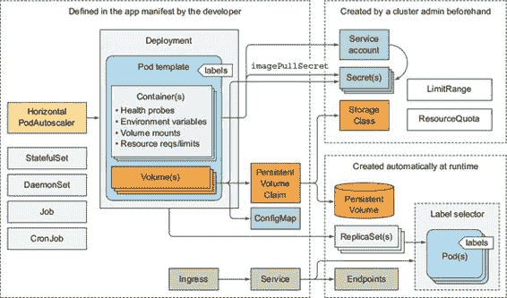
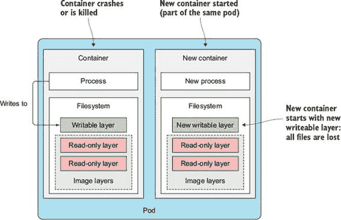
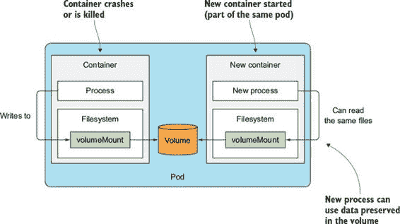
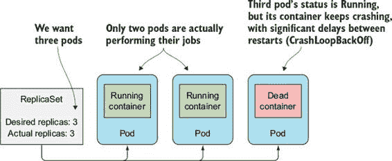
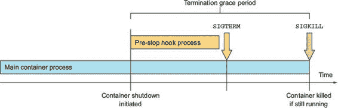
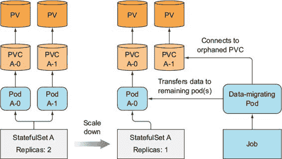
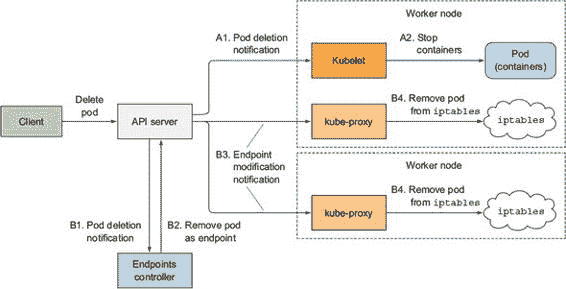
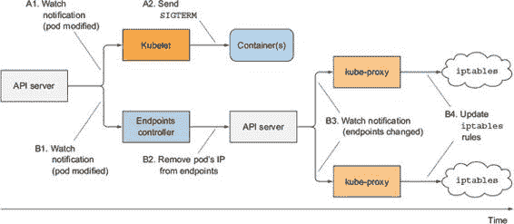
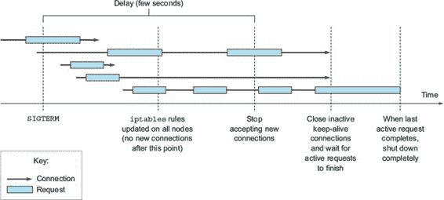

第十七章. 开发应用程序的最佳实践

本章涵盖

+   理解在典型应用程序中哪些 Kubernetes 资源出现

+   添加 post-start 和 pre-stop Pod 生命周期钩子

+   正确终止应用程序而不会破坏客户端请求

+   使应用程序在 Kubernetes 中易于管理

+   在 Pod 中使用 init 容器

+   使用 Minikube 在本地开发

我们现在已经涵盖了您在 Kubernetes 中运行应用程序所需了解的大部分内容。我们已经探讨了每个单独的资源做什么以及如何使用它。现在我们将看到如何在 Kubernetes 上运行的典型应用程序中将它们结合起来。我们还将看看如何使应用程序运行顺畅。毕竟，这就是使用 Kubernetes 的全部意义，对吧？

希望本章能帮助澄清任何误解，并解释那些尚未明确说明的事情。在这个过程中，我们还将介绍一些到目前为止尚未提到的额外概念。

17.1. 将一切整合

让我们先看看一个实际应用程序由什么组成。这将也给你一个机会看看你是否记得你所学到的所有内容，并看看大局。显示了在典型应用程序中使用的 Kubernetes 组件。

图 17.1. 典型应用程序中的资源

典型的应用程序清单包含一个或多个 Deployment 和/或 StatefulSet 对象。这些对象包括一个包含一个或多个容器的 Pod 模板，每个容器都有一个存活探针，以及为容器提供的（如果有的话）服务（s）的就绪探针。为其他 Pod 提供服务的 Pod 通过一个或多个 Service 进行暴露。当它们需要从集群外部可达时，Service 可以配置为 `LoadBalancer` 或 `NodePort` 类型的 Service，或者通过 Ingress 资源进行暴露。

Pod 模板（以及从中创建的 Pod）通常引用两种类型的 Secrets——用于从私有镜像仓库拉取容器镜像的 Secrets 和直接由 Pod 内运行的进程使用的 Secrets。Secrets 本身通常不是应用程序清单的一部分，因为它们不是由应用程序开发者配置的，而是由运维团队配置的。Secrets 通常分配给 Service-Accounts，这些 Service-Accounts 被分配给单个 Pod。

应用程序还包含一个或多个 ConfigMaps，这些 ConfigMaps 既可以用来初始化环境变量，也可以作为 `configMap` 卷挂载到 Pod 中。某些 Pod 使用额外的卷，例如 `emptyDir` 或 `gitRepo` 卷，而需要持久存储的 Pod 则使用 `persistentVolumeClaim` 卷。Persistent-VolumeClaims 也是应用程序清单的一部分，而它们所引用的 StorageClasses 则是由系统管理员预先创建的。

在某些情况下，应用程序还需要使用 Jobs 或 CronJobs。DaemonSets 通常不是应用程序部署的一部分，但通常由系统管理员创建，以在所有或部分节点上运行系统服务。HorizontalPodAutoscalers 要么由开发者包含在清单中，要么由运维团队在系统后期添加。集群管理员还会创建 LimitRange 和 ResourceQuota 对象，以保持单个 Pod 和所有 Pod（作为一个整体）的计算资源使用量在可控范围内。

应用程序部署后，各种 Kubernetes 控制器会自动创建额外的对象。这包括由 Endpoints 控制器创建的服务端点对象，由 Deployment 控制器创建的 ReplicaSet，以及由 ReplicaSet（或 Job、CronJob、StatefulSet 或 Daemon-Set）控制器实际创建的 Pod。

资源通常被标记为一个或多个标签以保持其组织有序。这不仅适用于 Pod，也适用于所有其他资源。除了标签之外，大多数资源还包含描述每个资源的注释，列出负责该资源的人员或团队的联系方式，或为管理和其他工具提供额外的元数据。

所有这些的中心是 Pod，可以说是 Kubernetes 最重要的资源。毕竟，每个应用程序都在其中运行。为了确保你知道如何开发能够充分利用其环境的应用程序，让我们最后一次仔细看看 Pod——这次是从应用程序的角度来看。

17.2. 理解 Pod 的生命周期

我们已经说过，Pod 可以与仅运行单个应用的 VM 进行比较。尽管在 Pod 内运行的应用程序与在 VM 中运行的应用程序没有太大区别，但确实存在一些显著差异。一个例子是，在 Pod 中运行的应用程序可以随时被终止，因为 Kubernetes 需要将 Pod 重新定位到另一个节点，原因可能是出于某种原因，也可能是由于缩放请求。我们将在下一节探讨这个方面。

17.2.1. 应用程序必须预期会被终止和重新定位

在 Kubernetes 之外，运行在 VM 中的应用程序很少从一个机器移动到另一个机器。当操作员移动应用程序时，他们也可以重新配置应用程序，并手动检查应用程序在新位置是否运行良好。在 Kubernetes 中，应用程序的迁移更加频繁和自动——没有人类操作员重新配置它们并确保迁移后仍然正常运行。这意味着应用程序开发者需要确保他们的应用程序允许相对频繁地移动。

预期本地 IP 和主机名会发生变化

当一个 Pod 被终止并在其他地方运行时（技术上，这是一个新的 Pod 实例替换了旧的 Pod；Pod 并没有被重新定位），它不仅有一个新的 IP 地址，还有一个新的名称和主机名。大多数无状态应用程序通常可以处理这种情况而不会产生任何不利影响，但状态化应用程序通常不能。我们已经了解到，可以通过 StatefulSet 运行状态化应用程序，这确保了当应用程序在重新调度后在新的节点上启动时，它仍然会看到之前相同的宿主机名和持久状态。尽管如此，Pod 的 IP 地址仍然会改变。应用程序需要为此做好准备。因此，应用程序开发者永远不应该基于集群应用程序成员的 IP 地址来确定成员资格，如果基于主机名，则始终应使用 StatefulSet。

期待写入磁盘的数据消失

另一点需要记住的是，如果应用程序将数据写入磁盘，那么在应用程序在新的 Pod 内部启动后，这些数据可能不可用，除非你在应用程序写入数据的位置挂载持久存储。应该清楚，当 Pod 重新调度时会发生这种情况，但即使在不涉及任何重新调度的场景中，写入磁盘的文件也会消失。即使在单个 Pod 的生命周期内，Pod 中运行的应用程序写入磁盘的文件也可能消失。让我用一个例子来解释这一点。

想象一个应用程序有一个漫长且计算密集型的初始启动过程。为了帮助应用程序在后续启动时更快地启动，开发者将应用程序的初始启动结果缓存到磁盘上（例如，在启动时扫描所有 Java 类以查找注解，然后将结果写入索引文件）。由于 Kubernetes 中的应用程序默认在容器中运行，这些文件会被写入容器的文件系统。如果容器随后被重启，它们都会丢失，因为新的容器从完全新的可写层开始（参见图 17.2）。

图 17.2\. 当容器重启时，写入容器文件系统的文件会丢失。

不要忘记，单个容器可能由于多种原因被重启，例如进程崩溃、存活性检查返回失败，或者因为节点开始运行内存不足，进程被 OOMKiller 杀死。当这种情况发生时，Pod 仍然是相同的，但容器本身是完全新的。Kubelet 不会再次运行相同的容器；它总是创建一个新的容器。

使用卷来在容器重启之间保留数据

当其容器重启时，示例中的应用程序需要再次执行密集的启动程序。这可能或可能不是期望的。为了确保像这样的数据不会丢失，你需要至少使用一个 Pod 作用域的卷。因为卷与 Pod 共存亡，新的容器将能够重用前一个容器写入卷的数据（图 17.3）。

图 17.3\. 使用卷在容器重启之间持久化数据

使用卷在容器重启之间保留文件有时是个好主意，但并不总是如此。如果数据被损坏并导致新创建的进程再次崩溃怎么办？这将导致持续崩溃循环（Pod 将显示`CrashLoopBackOff`状态）。如果你没有使用卷，新容器将从头开始启动，并且很可能会崩溃。像这样使用卷在容器重启之间保留文件是一把双刃剑。你需要仔细考虑是否使用它们。

17.2.2\. 已死亡或部分死亡 Pod 的重新调度

如果一个 Pod 的容器持续崩溃，Kubelet 会无限期地重启它。重启之间的时间将以指数级增加，直到达到五分钟。在这五分钟的时间间隔内，Pod 实际上已经死亡，因为其容器的进程没有运行。公平地说，如果这是一个多容器 Pod，某些容器可能正常运行，所以 Pod 只是部分死亡。但如果 Pod 只包含一个容器，Pod 实际上已经死亡，完全无用，因为其中不再有进程运行。

你可能会惊讶地发现，即使这些 Pod 是 ReplicaSet 或类似控制器的一部分，它们也不会自动被移除并重新调度。如果你创建一个期望副本数为三的 ReplicaSet，然后其中一个 Pod 中的一个容器开始崩溃，Kubernetes 不会删除并替换 Pod。最终结果是 ReplicaSet 只有两个正确运行的副本，而不是期望的三（图 17.4）。

图 17.4\. ReplicaSet 控制器不会重新调度已死亡的 Pod。

你可能预期 Pod 会被删除，并替换为另一个可能在其他节点上成功运行的 Pod 实例。毕竟，容器可能因为与节点相关的问题而崩溃，这个问题在其他节点上没有表现出来。遗憾的是，情况并非如此。ReplicaSet 控制器不在乎 Pod 是否已死亡——它只关心 Pod 的数量是否与期望的副本数匹配，在这种情况下，它确实匹配。

如果你想亲自查看，我已包含一个 ReplicaSet 的 YAML 清单，其 Pod 将不断崩溃（请参阅代码存档中的文件 replicaset-crashingpods.yaml）。如果你创建了 ReplicaSet 并检查创建的 Pod，你将看到以下列表。

列表 17.1\. ReplicaSet 和持续崩溃的 Pod

`$ kubectl get po` `NAME                  READY     STATUS             RESTARTS   AGE crashing-pods-f1tcd   0/1` `CrashLoopBackOff``5          6m` `1` `crashing-pods-k7l6k   0/1       CrashLoopBackOff   5          6m crashing-pods-z7l3v   0/1       CrashLoopBackOff   5          6m` `$ kubectl describe rs crashing-pods` `Name:           crashing-pods Replicas:` `3 current` `/` `3 desired``2` `Pods Status:` `3 Running` `/ 0 Waiting / 0 Succeeded / 0 Failed` `3``$ kubectl describe po crashing-pods-f1tcd` `Name:           crashing-pods-f1tcd Namespace:      default Node:           minikube/192.168.99.102 Start Time:     Thu, 02 Mar 2017 14:02:23 +0100 Labels:         app=crashing-pods Status:         Running` `4`

+   1 Pod 的状态显示 Kubelet 正在延迟重启，因为容器持续崩溃。

+   2 控制器没有采取任何行动，因为当前副本数与期望副本数匹配

+   3 显示了 3 个副本正在运行。

+   4 kubectl describe 同样显示 Pod 的状态为运行

在某种程度上，Kubernetes 以这种方式运行是可以理解的。容器每五分钟会重启一次，希望解决崩溃的根本原因。其逻辑是，将 Pod 重新调度到另一个节点最可能也无法解决问题，因为应用程序运行在容器内，所有节点应该大致相同。这并不总是情况，但大多数情况下是这样的。

17.2.3\. 按特定顺序启动 Pod

Pod 中运行的应用程序与手动管理中的应用程序之间还有一个区别是，部署这些应用的运维人员了解它们之间的依赖关系。这使得他们可以按顺序启动应用程序。

理解 Pod 的启动过程

当你使用 Kubernetes 运行你的多 Pod 应用程序时，你没有内置的方式来告诉 Kubernetes 先运行某些 Pod，其余的只有在第一个 Pod 已经启动并准备好服务时才运行。当然，你可以在发布第一个应用的清单之后等待 Pod 准备好，然后再发布第二个清单，但你的整个系统通常定义在单个 YAML 或 JSON 文件中，包含多个 Pod、服务和其他对象。

Kubernetes API 服务器确实会按照列表中的顺序处理 YAML/JSON 中的对象，但这仅仅意味着它们会按照这个顺序写入 etcd。你不能保证 Pod 也会按照这个顺序启动。

但是，你可以通过在 Pod 中包含一个 init 容器来防止 Pod 的主容器在满足预条件之前启动。

引入 Init 容器

除了常规容器之外，Pod 还可以包含 init 容器。正如其名所示，它们可以用来初始化 Pod——这通常意味着将数据写入 Pod 的卷，然后这些卷会被挂载到 Pod 的主容器中。

一个 pod 可以有任意数量的初始化容器。它们按顺序执行，并且只有最后一个完成之后，pod 的主容器才会启动。这意味着初始化容器也可以用来延迟 pod 主容器的启动——例如，直到满足某个先决条件。初始化容器可以等待 pod 主容器所需的服务启动并就绪。当它就绪时，初始化容器终止，并允许主容器启动。这样，主容器就不会在服务就绪之前使用该服务。

让我们来看一个使用初始化容器来延迟主容器启动的 pod 示例。还记得你在第七章中创建的 `fortune` pod 吗？它是一个返回幸运名言作为对客户端请求响应的 Web 服务器。现在，让我们假设你有一个 `fortune-client` pod，它需要在主容器启动之前，`fortune` 服务必须处于运行状态。你可以添加一个初始化容器，该容器会检查服务是否对请求做出响应。在得到响应之前，初始化容器会不断重试。一旦得到响应，初始化容器就会终止，并允许主容器启动。

将初始化容器添加到 pod 中

初始化容器可以在 pod 规范中定义，就像主容器一样，但通过 `spec.initContainers` 字段。你可以在本书的代码存档中找到 fortune-client pod 的完整 YAML。以下列表显示了定义初始化容器的部分。

列表 17.2\. 在 pod 中定义的初始化容器：fortune-client.yaml

`spec:    initContainers:` `1` `- name: init    image: busybox    command:    - sh    - -c    - 'while true; do echo "等待 fortune 服务启动...";' `2` `wget http://fortune -q -T 1 -O /dev/null >/dev/null 2>/dev/null` `2` `&& break; sleep 1; done; echo "服务已启动！启动主` `2` `容器。"``

+   1 你正在定义一个初始化容器，而不是一个普通容器。

+   2 初始化容器运行一个循环，直到 fortune 服务启动。

当你部署此 pod 时，只有它的初始化容器会启动。这在你使用 `kubectl get` 列出 pod 时 pod 的状态中显示：

`$ kubectl get po` `NAME             READY` `STATUS` `RESTARTS` `AGE fortune-client   0/1` `Init:0/1` `0` `1m`

`STATUS` 列显示零个或一个初始化容器已完成。你可以使用 `kubectl logs` 查看初始化容器的日志：

`$ kubectl logs fortune-client -c init` `等待 fortune 服务启动...`

当运行 `kubectl logs` 命令时，你需要使用 `-c` 开关指定初始化容器的名称（在示例中，pod 的初始化容器名称为 `init`，如你在列表 17.2 中看到的）。

主容器将在你部署 `fortune` 服务和 `fortune-server` pod 之后才运行。你可以在 fortune-server.yaml 文件中找到它们。

处理 pod 间依赖关系的最佳实践

你已经看到了如何使用初始化容器来延迟启动 pod 的主容器（直到满足某个条件，例如确保 pod 所依赖的服务已就绪），但编写不需要在应用启动前依赖的所有服务都就绪的应用程序会更好。毕竟，服务也可能在应用已经运行后离线。

应用需要内部处理其依赖项可能未就绪的可能性。别忘了就绪性探针。如果一个应用因为其依赖项之一缺失而无法执行其工作，它应该通过其就绪性探针发出信号，这样 Kubernetes 就知道它也不就绪。你想要这样做不仅因为这样可以防止应用被添加为服务端点，而且因为应用的就绪性也被 Deployment 控制器在执行滚动更新时使用，从而防止推出一个坏版本。

17.2.4. 添加生命周期钩子

我们已经讨论了如何使用初始化容器来挂钩 pod 的启动，但 pod 也允许你定义两个生命周期钩子：

+   启动后钩子

+   预停止钩子

这些生命周期钩子是针对每个容器指定的，与初始化容器不同，初始化容器适用于整个 pod。正如它们的名称所暗示的，它们在容器启动时执行，在容器停止前执行。

生命周期钩子与存活性和就绪性探针类似，因为它们可以

+   在容器内执行命令

+   对一个 URL 执行 HTTP GET 请求

让我们分别看看这两个钩子，看看它们对容器生命周期有什么影响。

使用启动后容器生命周期钩子

一个启动后钩子在容器的主进程启动后立即执行。你用它来在应用启动时执行额外的操作。当然，如果你是运行在容器中的应用的作者，你总是可以在应用代码内部执行这些操作。但当你运行由其他人开发的应用时，你通常不希望（或不能）修改其源代码。启动后钩子允许你在不接触应用的情况下运行额外的命令。这些可能向外部监听器发出应用正在启动的信号，或者初始化应用以便它可以开始执行其工作。

钩子与主进程并行运行。这个名字可能有些误导，因为它不会等待主进程完全启动（如果进程有一个初始化过程，Kubelet 显然不能等待该过程完成，因为它没有方法知道何时完成）。

但即使钩子是异步运行的，它也会以两种方式影响容器。直到钩子完成，容器将保持 `Waiting` 状态，原因标记为 `ContainerCreating`。因此，Pod 的状态将是 `Pending` 而不是 `Running`。如果钩子运行失败或返回非零退出代码，主容器将被终止。

包含启动后钩子的 Pod 清单看起来如下所示。

列表 17.3\. 包含启动后生命周期钩子的 Pod：post-start-hook.yaml

`apiVersion: v1 kind: Pod metadata:   name: pod-with-poststart-hook spec:   containers:   - image: luksa/kubia     name: kubia     lifecycle:` `1` `postStart:` `1` `exec:` `2` `command:` `2` `- sh` `2` `- -c` `2` `- "echo 'hook will fail with exit code 15'; sleep 5; exit 15"` `2`

+   1 钩子在容器启动时执行。

+   2 它在容器内 /bin 目录中执行 postStart.sh 脚本。

在示例中，`echo`、`sleep` 和 `exit` 命令与容器的主进程一起在容器创建时执行。你通常不会运行这样的命令，而是会运行存储在容器镜像中的 shell 脚本或二进制可执行文件。

很遗憾，如果由钩子启动的过程将日志记录到标准输出，你将无法在任何地方看到输出。这使得调试生命周期钩子变得痛苦。如果钩子失败，你只能在 Pod 的事件中看到 `FailedPostStartHook` 警告（你可以使用 `kubectl describe pod` 来查看它们）。稍后，你将看到更多关于钩子失败原因的信息，如下所示。

列表 17.4\. 显示失败命令基于钩子的退出代码的 Pod 事件

`FailedSync``Error syncing pod, skipping: failed to "StartContainer" for              "kubia" with PostStart handler: command 'sh -c echo 'hook              will fail with exit code 15'; sleep 5 ; exit 15' exited              with` `15``: : "PostStart Hook Failed"`

最后行中的数字 `15` 是命令的退出代码。当使用 HTTP GET 钩子处理程序时，原因可能看起来如下所示（你可以通过从本书的代码存档中部署 post-start-hook-httpget.yaml 文件来尝试此操作）。

列表 17.5\. 显示 HTTP GET 钩子失败原因的 Pod 事件

`FailedSync``Error syncing pod, skipping: failed to "StartContainer" for              "kubia" with PostStart handler: Get              http://10.32.0.2:9090/postStart: dial tcp 10.32.0.2:9090:              getsockopt:` `connection refused``: "PostStart Hook Failed"`

注意

启动后钩子故意配置错误，使用端口 9090 而不是正确的端口 8080，以展示钩子失败时会发生什么。

基于命令的启动后钩子的标准输出和错误输出不会记录在任何地方，因此你可能希望钩子调用的进程将日志记录到容器文件系统中的文件，这将允许你使用类似以下方式检查文件内容：

`$ kubectl exec my-pod cat logfile.txt`

如果由于任何原因（包括钩子失败）容器被重新启动，文件可能在你可以检查它之前就已经消失了。你可以通过将`emptyDir`卷挂载到容器中，并让钩子将其写入，来解决这个问题。

使用预停止容器生命周期钩子

预停止钩子在容器终止前立即执行。当容器需要被终止时，如果配置了预停止钩子，Kubelet 将运行它，然后只向进程发送`SIGTERM`信号（如果进程没有优雅地终止，稍后将其杀死）。

如果容器在接收到`SIGTERM`信号后没有优雅地关闭，可以使用预停止钩子来启动容器的优雅关闭。它们还可以在关闭前执行任意操作，而无需在应用程序本身中实现这些操作（当你运行一个第三方应用程序，且没有访问其源代码或无法修改它时，这很有用）。

在 pod 清单中配置预停止钩子与添加启动后钩子没有太大区别。之前的例子展示了执行命令的启动后钩子，所以现在我们将看看执行 HTTP GET 请求的预停止钩子。以下列表显示了如何在 pod 中定义预停止 HTTP GET 钩子。

列表 17.6\. 预停止钩子 YAML 片段：pre-stop-hook-httpget.yaml

`lifecycle:       preStop:` `1` `httpGet:` `1` `port: 8080` `2` `path: shutdown` `2`

+   1 这是一个执行 HTTP GET 请求的预停止钩子。

+   2 请求发送到[`POD_IP:8080/shutdown`](http://POD_IP:8080/shutdown)。

本列表中定义的预停止钩子会在 Kubelet 开始终止容器时立即执行一个 HTTP GET 请求到[`POD_IP:8080/shutdown`](http://POD_IP:8080/shutdown)。除了列表中显示的`port`和`path`之外，你还可以设置`scheme`字段（HTTP 或 HTTPS）、`host`以及应发送到请求中的`httpHeaders`。`host`字段默认为 pod IP。请确保不要将其设置为 localhost，因为 localhost 将指向节点，而不是 pod。

与启动后钩子相比，无论钩子的结果如何——使用基于命令的钩子时，错误 HTTP 响应代码或非零退出代码都不会阻止容器被终止。如果预停止钩子失败，你将在 pod 的事件中看到`FailedPreStopHook`警告事件，但由于 pod 随后很快被删除（毕竟，pod 的删除最初触发了预停止钩子），你可能甚至都没有注意到预停止钩子未能正确运行。

提示

如果预停止钩子的成功完成对于系统的正常操作至关重要，请验证它是否真的被执行了。我曾目睹过预停止钩子没有运行，而开发者甚至都没有意识到这一点。

由于你的应用程序没有接收到 SIGTERM 信号而使用停止前钩子

许多开发者犯了一个错误，就是仅仅为了在停止前钩子中向他们的应用程序发送`SIGTERM`信号而定义一个停止前钩子。他们这样做是因为他们没有看到他们的应用程序接收到由 Kubelet 发送的`SIGTERM`信号。应用程序没有接收到信号的原因并不是 Kubernetes 没有发送它，而是信号没有传递到容器内部的 app 进程。如果你的容器镜像配置为运行一个 shell，该 shell 又运行 app 进程，信号可能会被 shell 本身消耗掉，而不是传递给子进程。

在这种情况下，与其在停止前钩子中直接向你的应用程序发送信号，正确的修复方法是确保 shell 将信号传递给应用程序。这可以通过在作为主容器进程运行的 shell 脚本中处理信号并将其传递给应用程序来实现。或者你也可以不配置容器镜像以运行 shell，而是直接运行应用程序的二进制文件。你可以通过在 Dockerfile 中使用`ENTRYPOINT`或`CMD`的 exec 形式来实现这一点：`ENTRYPOINT ["/mybinary"]`而不是`ENTRYPOINT /mybinary`。

使用第一种形式的容器以`mybinary`可执行文件作为其主进程运行，而第二种形式则以 shell 作为主进程，并将`mybinary`进程作为 shell 进程的子进程执行。

理解生命周期钩子针对的是容器，而不是 Pod

关于启动后和停止前的钩子，让我最后强调一点，这些生命周期钩子与容器相关，而不是与 Pod 相关。你不应该使用停止前钩子来执行在 Pod 终止时需要执行的操作。原因是停止前钩子在容器被终止时会被调用（很可能是由于存活性探测失败）。这种情况在 Pod 的生命周期中可能发生多次，而不仅仅是当 Pod 正在关闭过程中。

17.2.5. 理解 Pod 关闭

我们已经提到了 Pod 终止的话题，那么让我们更详细地探讨这个话题，并了解在 Pod 关闭期间确切发生了什么。这对于理解如何干净地关闭在 Pod 中运行的应用程序非常重要。

让我们从开始讲起。Pod 的关闭是由 API 服务器通过删除 Pod 对象触发的。当收到 HTTP DELETE 请求时，API 服务器不会立即删除对象，而是在其中设置一个`deletionTimestamp`字段。设置了`deletionTimestamp`字段的 Pod 正在终止。

一旦 Kubelet 注意到 Pod 需要被终止，它就开始终止 Pod 中的每个容器。它给每个容器时间来优雅地关闭，但时间是有限的。这个时间被称为终止宽限期，并且可以按 Pod 进行配置。计时器在终止过程开始时启动。然后执行以下事件序列：

1.  如果已配置，运行预停止钩子，并等待其完成。

1.  向容器的主进程发送 `SIGTERM` 信号。

1.  等待容器干净地关闭或直到终止宽限期结束。

1.  如果进程还没有优雅地终止，则使用 `SIGKILL` 强制终止进程。

事件序列如图 17.5 所示。figure 17.5。

图 17.5\. 容器终止序列

指定终止宽限期

可以通过设置 `spec.terminationGracePeriodSeconds` 字段在 pod 规范中配置终止宽限期。默认值为 30，这意味着 pod 的容器在被强制杀死之前将获得 30 秒的时间来优雅地终止。

| |
| --- |

提示

你应该将宽限期设置得足够长，以便你的进程可以在那段时间内完成清理。

| |
| --- |

在删除 pod 时，也可以覆盖 pod 规范中指定的宽限期：

`$ kubectl delete po mypod --grace-period=5`

这将使 Kubelet 等待五秒钟，直到 pod 优雅地关闭。当 pod 的所有容器都停止时，Kubelet 会通知 API 服务器，并且 Pod 资源最终被删除。你可以通过将宽限期设置为零并添加 `--force` 选项来强制 API 服务器立即删除资源，而不必等待确认，如下所示：

`$ kubectl delete po mypod --grace-period=0 --force`

使用此选项时要小心，特别是与有状态集的 pod 一起使用。有状态集控制器非常小心，从不同时运行相同 pod 的两个实例（具有相同序号索引和名称，并附加到同一持久卷的两个 pod）。通过强制删除 pod，你将导致控制器在没有等待被删除 pod 的容器关闭的情况下创建替换 pod。换句话说，同一 pod 的两个实例可能会同时运行，这可能导致你的有状态集群出现故障。只有在你绝对确定 pod 已经不再运行或无法与集群的其他成员通信时（当你确认托管 pod 的节点已失败或已从网络断开且无法重新连接时），才强制删除有状态 pod。

现在你已经了解了容器是如何关闭的，让我们从应用程序的角度来看，并回顾一下应用程序应该如何处理关闭过程。

在你的应用程序中实现适当的关闭处理程序

应用程序应该通过启动它们的关闭过程并在完成后终止来响应 `SIGTERM` 信号。除了处理 `SIGTERM` 信号外，应用程序还可以通过预停止钩子来通知关闭。在两种情况下，应用程序都只有固定的时间来干净地终止。

但如果你无法预测应用程序干净关闭需要多长时间怎么办？例如，想象你的应用程序是一个分布式数据存储。在缩小时，一个 Pod 实例将被删除并因此关闭。在关闭过程中，Pod 需要将所有数据迁移到剩余的 Pod 中，以确保数据不会丢失。Pod 是否应该在收到终止信号（通过 `SIGTERM` 信号或通过 pre-stop 钩子）时开始迁移数据？

绝对不行！至少有以下两个原因不建议这样做：

+   容器终止并不一定意味着整个 Pod 正在被终止。

+   你没有任何保证关闭程序会在进程被杀死之前完成。

这种第二种情况不仅发生在应用程序在优雅关闭过程中 grace period 超出之前，还发生在运行 Pod 的节点在容器关闭序列中途失败时。即使节点随后重新启动，Kubelet 也不会重新启动关闭程序（甚至不会再次启动容器）。绝对没有保证 Pod 能够完成整个关闭程序。

用专用关闭程序 Pod 替换关键关闭程序

你如何确保绝对必须运行到完成的临界关闭程序确实运行到完成（例如，确保 Pod 的数据迁移到其他 Pod）？

一种解决方案是应用程序（在收到终止信号后）创建一个新的 Job 资源，该资源将运行一个新的 Pod，其唯一任务是迁移被删除 Pod 的数据到剩余的 Pod 中。但如果你一直很注意，你就会知道你没有任何保证应用程序确实每次都能成功创建 Job 对象。如果节点在应用程序尝试这样做时失败，那会怎样？

处理这个问题的正确方法是运行一个专用、持续运行的 Pod，不断检查孤儿数据的存在。当这个 Pod 发现孤儿数据时，它可以将其迁移到剩余的 Pod 中。除了持续运行的 Pod 之外，您还可以使用 CronJob 资源定期运行 Pod。

你可能会认为 StatefulSets 可以在这里有所帮助，但它们并不能。正如你将记得的那样，缩小 StatefulSet 会导致 PersistentVolumeClaims 成孤儿，使得存储在 PersistentVolume 上的数据变得孤立。是的，在随后的扩展中，Persistent-Volume 将重新连接到新的 Pod 实例，但如果没有发生扩展（或者发生得很晚），那会怎样？因此，当使用 StatefulSets 时，你可能还想要运行一个数据迁移 Pod（此场景在图 17.6 中显示）。为了防止在应用程序升级期间发生迁移，数据迁移 Pod 可以配置为等待一段时间，以便在执行迁移之前给有状态的 Pod 时间重新启动。 

图 17.6\. 使用专用 Pod 迁移数据

17.3. 确保所有客户端请求得到妥善处理

您现在对如何使 Pod 干净地关闭有了很好的理解。现在，我们将从 Pod 客户端的角度来看待 Pod 的生命周期（客户端正在消费 Pod 提供的服务）。如果您不想在扩展 Pod 时遇到问题，这一点很重要。

毋庸置疑，您希望所有客户端请求都得到妥善处理。显然，您不希望在 Pod 启动或关闭时看到断开连接。仅凭 Kubernetes 本身并不能防止这种情况发生。您的应用程序需要遵循一些规则来防止断开连接。首先，让我们专注于确保在 Pod 启动时所有连接都得到妥善处理。

17.3.1. 防止 Pod 启动时客户端连接断开

如果您理解服务和服务端点的工作方式，确保在 Pod 启动时每个连接都得到妥善处理是简单的。当 Pod 启动时，它被添加为所有标签选择器与 Pod 标签匹配的服务的端点。如您可能记得的第五章，Pod 还需要向 Kubernetes 发出就绪信号。直到它就绪，它不会成为服务端点，因此不会从客户端接收任何请求。

如果您在 Pod 规范中没有指定就绪探针，则 Pod 始终被认为是就绪的。它将几乎立即开始接收请求——一旦第一个 kube-proxy 在其节点上更新了`iptables`规则，并且第一个客户端 Pod 尝试连接到服务。如果您的应用程序当时还没有准备好接受连接，客户端将看到“连接拒绝”类型的错误。

您需要做的只是确保您的就绪探针仅在您的应用程序准备好妥善处理传入请求时返回成功。一个好的第一步是添加一个 HTTP GET 就绪探针，并将其指向您应用程序的基本 URL。在许多情况下，这足以让您走得很远，并让您免于在应用程序中实现特殊的就绪端点。

17.3.2. 防止 Pod 关闭期间的连接断开

现在我们来看看一个 Pod 生命周期的另一端会发生什么——当 Pod 被删除并且其容器被终止时。我们已经讨论了 Pod 的容器应该在接收到`SIGTERM`信号（或者当其预停止钩子被执行）后立即干净地关闭。但是，这能确保所有客户端请求都得到妥善处理吗？

当应用程序接收到终止信号时，它应该如何表现？它应该继续接受请求吗？对于已经接收但尚未完成的请求怎么办？对于可能处于请求之间但处于打开状态的持久 HTTP 连接怎么办（当连接上没有活跃请求时）？在我们可以回答这些问题之前，我们需要详细查看当 Pod 被删除时在集群中展开的事件链。

理解 pod 删除时发生的事件序列

在 第十一章 中，我们深入探讨了构成 Kubernetes 集群的组件。你需要始终记住，这些组件在多台机器上作为单独的进程运行。它们并不都是单一大型单体进程的一部分。所有组件都达到关于集群状态的共识需要时间。让我们通过查看 pod 被删除时集群中发生的情况来探索这一事实。

当 API 服务器接收到 pod 删除请求时，它首先在 etcd 中修改状态，然后通知其监视者关于删除的消息。在这些监视者中包括 Kubelet 和端点控制器。这两个并行发生的事件序列（用 A 或 B 标记），在 图 17.7 中显示。

图 17.7\. 删除 pod 时发生的事件序列

在事件序列 A 中，你会看到，一旦 Kubelet 收到 pod 应该终止的通知，它就会启动关闭序列，如 第 17.2.5 节 所解释的那样（运行预停止钩子，发送 `SIGTERM`，等待一段时间，如果容器尚未自行终止，则强制杀死容器）。如果应用程序通过立即停止接收客户端请求来响应 `SIGTERM`，那么任何尝试连接到它的客户端都会收到连接拒绝错误。由于从 pod 删除到发生此事件的时间相对较短，这是由于 API 服务器到 Kubelet 的直接路径。

现在，让我们看看在另一个事件序列中会发生什么——即 pod 从 `iptables` 规则中移除的事件序列（图中的序列 B）。当端点控制器（在 Kubernetes 控制平面的控制器管理器中运行）接收到 pod 被删除的通知时，它会将 pod 从 pod 所在的所有服务中的端点移除。它是通过向 API 服务器发送 REST 请求来修改端点 API 对象来做到这一点的。然后 API 服务器通知所有监视端点对象的客户端。在这些监视者中包括所有在工作节点上运行的 kube-proxies。然后，每个代理都会更新其节点上的 `iptables` 规则，这是防止新连接被转发到正在终止的 pod 的原因。这里的一个重要细节是，移除 `iptables` 规则对现有连接没有影响——已经连接到 pod 的客户端仍然会通过这些现有连接向 pod 发送额外的请求。

这两个事件序列都是并行发生的。很可能关闭 Pod 中应用程序进程所需的时间略短于更新 `iptables` 规则所需的时间。导致更新 `iptables` 规则的事件链相当长（见 图 17.8），因为事件必须首先到达 Endpoints 控制器，然后控制器向 API 服务器发送新的请求，然后 API 服务器必须通知 kube-proxy，最后代理才会修改 `iptables` 规则。有很大可能性，`SIGTERM` 信号会在所有节点上的 `iptables` 规则更新之前被发送。

图 17.8\. 删除 Pod 时的事件时间线

最终结果是，Pod 在收到终止信号后可能仍然会收到客户端请求。如果应用程序立即关闭服务器套接字并停止接受连接，这将导致客户端收到“连接被拒绝”类型的错误（类似于 Pod 启动时如果应用程序无法立即接受连接且没有为其定义就绪探针时发生的情况）。

解决问题

在 Google 上搜索这个问题的解决方案，似乎添加一个就绪探针到你的 Pod 就能解决这个问题。据说，你所需要做的就是让就绪探针在 Pod 收到 `SIGTERM` 信号后立即开始失败。这应该会导致 Pod 作为服务的端点被移除。但是，移除只会发生在就绪探针连续失败几次之后（这在就绪探针规范中是可配置的）。显然，移除后还需要到达 kube-proxy，然后 Pod 才会从 `iptables` 规则中移除。

实际上，就整个流程而言，就绪探针根本没有任何影响。当 Endpoints 控制器收到删除 Pod 的通知（当 Pod 的 spec 中的 `deletionTimestamp` 字段不再是 `null` 时），它就会立即将 Pod 从服务端点中移除。从那时起，就绪探针的结果就无关紧要了。

问题的正确解决方案是什么？你如何确保所有请求都得到完全处理？

很明显，Pod 需要在接收到终止信号后继续接受连接，直到所有 kube-proxies 完成更新 `iptables` 规则。嗯，不仅仅是 kube-proxies。还可能有 Ingress 控制器或负载均衡器直接将连接转发到 Pod，而不通过 Service (`iptables`)。这还包括使用客户端负载均衡的客户端。为了确保没有任何客户端经历断开连接的情况，你必须等待所有客户端以某种方式通知你，他们将不再将连接转发到 Pod。

这是不可能的，因为所有这些组件都分布在不同计算机上。即使你知道每一个组件的位置，并且可以等待它们都表示可以关闭 pod，如果其中一个没有响应怎么办？你等待响应需要多长时间？记住，在这段时间里，你正在阻碍关闭过程。

你唯一合理能做的事情是等待足够长的时间以确保所有代理都完成了它们的工作。但多长时间才算足够长？在大多数情况下，几秒钟应该足够了，但无法保证每次都足够。当 API 服务器或端点控制器过载时，通知到达 kube-proxy 可能需要更长的时间。重要的是要理解你无法完美解决这个问题，但即使添加 5 或 10 秒的延迟也应该显著改善用户体验。你可以使用更长的延迟，但不要过度，因为延迟将阻止容器及时关闭，并导致 pod 在被删除很久之后仍然出现在列表中，这对删除 pod 的用户来说总是令人沮丧的。

总结本节内容

总结一下——正确关闭应用包括以下步骤：

+   等待几秒钟，然后停止接受新的连接。

+   关闭所有不在请求中间的保持连接。

+   等待所有活跃的请求完成。

+   然后完全关闭。

要了解在此过程中连接和请求的情况，仔细检查图 17.9。

图 17.9. 接收到终止信号后正确处理现有和新连接

这并不像一收到终止信号就立即退出进程那么简单，对吧？这样做值得吗？这由你决定。但至少你可以添加一个预停止钩子，等待几秒钟，就像下面列表中的那样，也许。

列表 17.7. 用于防止连接损坏的预停止钩子

`    lifecycle:    preStop:      exec:            command:            - sh            - -c            - "sleep 5"`

这样，你根本不需要修改你应用的代码。如果你的应用已经确保所有进行中的请求都被完全处理，那么这个预停止延迟可能就是你所需要的全部。

17.4. 制作易于在 Kubernetes 中运行和管理的应用

希望你现在对如何让你的应用优雅地处理客户端有了更好的理解。现在我们将探讨应用应该如何构建以便在 Kubernetes 中更容易管理。

17.4.1. 制作可管理的容器镜像

当你将应用打包成镜像时，你可以选择包含应用的二进制可执行文件和它需要的任何附加库，或者你可以将整个操作系统文件系统与应用一起打包。太多的人这样做，尽管这通常是不必要的。

你是否需要在图像中包含操作系统分布的每个文件？可能不是。大多数文件永远不会被使用，会使你的图像比所需的更大。当然，图像分层确保每个单独的层只下载一次，但即使第一次将 pod 调度到节点时需要等待更长的时间也是不理想的。

部署新的 pod 并对其进行扩展应该是快速的。这要求拥有没有不必要的冗余的小图像。如果你使用 Go 语言构建应用程序，你的图像不需要包含除了应用程序的单个可执行二进制文件之外的其他任何内容。这使得基于 Go 的容器图像非常小，非常适合 Kubernetes。

小贴士

在 Dockerfile 中使用`FROM scratch`指令来创建这些图像。

但在实践中，你很快会发现这些最小图像极其难以调试。当你第一次需要在容器内部运行像`ping`、`dig`、`curl`或类似工具时，你会意识到容器图像也至少需要包括这些工具的有限集合是多么重要。我无法告诉你应该在图像中包含什么和排除什么，因为这取决于你如何做事，所以你需要自己找到最佳平衡点。

17.4.2\. 正确标记您的图像并明智地使用 imagePullPolicy

你很快就会了解到，在您的 pod 配置文件中引用`latest`图像标签会导致问题，因为你无法确定每个单独的 pod 副本正在运行哪个版本的图像。即使最初所有 pod 副本都运行相同的图像版本，如果你在`latest`标签下推送了新版本的图像，然后 pod 被重新调度（或者你扩展了 Deployment），新的 pod 将运行新版本，而旧的 pod 仍然会运行旧版本。此外，使用`latest`标签使得无法回滚到之前的版本（除非你再次推送图像的旧版本）。

几乎强制使用包含适当版本指定符的标签，而不是`latest`，除了可能在开发环境中。记住，如果你使用可变标签（你向相同的标签推送更改），你需要将 pod 规范中的`imagePullPolicy`字段设置为`Always`。但如果你在生产 pod 中使用它，请注意与之相关的大问题。如果图像拉取策略设置为`Always`，容器运行时会每次部署新 pod 时都联系图像注册库。这会稍微减慢 pod 的启动速度，因为节点需要检查图像是否已被修改。更糟糕的是，此策略阻止 pod 在无法联系注册库时启动。

17.4.3\. 使用多维标签而不是单维标签

不要忘记标记所有资源，而不仅仅是 Pod。确保为每个资源添加多个标签，这样它们就可以在每个单独的维度上被选择。当资源数量增加时，你（或运维团队）会感激你这样做。

标签可能包括以下内容

+   资源所属的应用程序（或可能是微服务）的名称

+   应用程序层（前端、后端等）

+   环境（开发、QA、预发布、生产等）

+   版本

+   发布类型（稳定、金丝雀、绿色或蓝色用于绿色/蓝色部署等）

+   客户（如果您为每个客户运行单独的 pod 而不是使用命名空间）

+   分片系统中的分片

这将允许您以组为单位而不是单个资源来管理资源，并使查看每个资源属于何处变得容易。

17.4.4. 通过注释描述每个资源

要向资源添加更多信息，请使用注释。至少，资源应包含一个描述资源的注释以及负责人的联系信息注释。

在微服务架构中，pod 可能包含一个注释，列出 pod 正在使用的其他服务的名称。这使得显示 pod 之间的依赖关系成为可能。其他注释可能包括构建和版本信息以及由工具或图形用户界面（图标名称等）使用的元数据。

标签和注释都使管理运行中的应用程序变得容易得多，但没有什么比应用程序开始崩溃而您不知道原因更糟糕的了。

17.4.5. 提供进程终止原因的信息

没有什么比不得不弄清楚为什么容器终止（或者甚至持续终止）更令人沮丧的了，尤其是在最糟糕的时刻发生时。对运维人员友好，通过在日志文件中包含所有必要的调试信息来使他们的生活变得更轻松。

但为了使分类更加容易，您还可以使用另一个 Kubernetes 功能，该功能可以显示 pod 中容器终止的原因。您通过让进程将终止消息写入容器文件系统中的特定文件来实现这一点。当容器终止时，Kubelet 会读取该文件的内容，并在 `kubectl describe pod` 的输出中显示。如果应用程序使用此机制，操作员可以快速看到应用程序终止的原因，甚至无需查看容器日志。

进程需要写入消息的默认文件是 /dev/termination-log，但可以通过在 pod 规范中的容器定义中设置 `terminationMessagePath` 字段来更改。

您可以通过运行一个容器立即死亡的 pod 来看到这个功能在行动，如下面的列表所示。

列表 17.8. Pod 写入终止消息：termination-message.yaml

`apiVersion: v1 kind: Pod metadata: name: pod-with-termination-message spec: containers: - image: busybox name: main terminationMessagePath: /var/termination-reason command: - sh - -c - 'echo "I\'ve had enough" > /var/termination-reason ; exit 1'` `1` `2`

+   1 您正在覆盖终止消息文件默认路径。

+   2 容器将在退出前将消息写入文件。

当运行此 Pod 时，您很快就会看到 Pod 的状态显示为`CrashLoopBackOff`。如果您此时使用`kubectl describe`，您可以看到容器死亡的原因，而无需深入查看其日志，如下所示。

列表 17.9\. 使用 `kubectl describe` 查看容器的终止消息

`$ kubectl describe po` `Name:           pod-with-termination-message ... Containers: ...     State:      Waiting       Reason:   CrashLoopBackOff     Last State: Terminated       Reason:   Error       Message:` `I've had enough``1` `Exit Code:        1       Started:          Tue, 21 Feb 2017 21:38:31 +0100       Finished:         Tue, 21 Feb 2017 21:38:31 +0100     Ready:              False     Restart Count:      6`

+   1 您可以查看容器死亡的原因，而无需检查其日志。

如您所见，进程写入文件`/var/termination-reason`的“`I've had enough`”消息显示在容器的`Last State`（最后状态）部分。请注意，此机制不仅限于崩溃的容器。它也可以用于运行可完成任务并成功终止的 Pod（您可以在文件`termination-message-success.yaml`中找到一个示例）。

此机制非常适合已终止的容器，但你可能会同意，类似的机制对于显示运行中（而不仅仅是已终止）容器的应用程序特定状态消息也同样有用。Kubernetes 目前不提供此类功能，我也不了解有任何计划引入它。

| |
| --- |

注意

如果容器没有将消息写入任何文件，您可以设置`terminationMessagePolicy`字段为`FallbackToLogsOnError`。在这种情况下，容器日志的最后几行用作其终止消息（但仅当容器未成功终止时）。

| |
| --- |

17.4.6\. 处理应用程序日志

在我们讨论应用程序日志的问题上，让我们重申，应用程序应该写入标准输出而不是文件。这使得使用`kubectl logs`命令查看日志变得容易。

| |
| --- |

小贴士

如果容器崩溃并被新的容器替换，您将看到新容器的日志。要查看前一个容器的日志，请使用`kubectl logs`的`--previous`选项。

| |
| --- |

如果应用程序将日志记录到文件而不是标准输出，您可以使用另一种方法显示日志文件：

`$ kubectl exec <pod> cat <logfile>`

这将在容器内部执行`cat`命令并将日志流回 kubectl，kubectl 在您的终端中打印它们。

将日志和其他文件复制到和从容器中

您还可以使用我们尚未讨论的`kubectl cp`命令将日志文件复制到您的本地机器。它允许您从容器中复制文件到容器中。例如，如果 Pod 名为`foo-pod`且其单个容器在`/var/log/foo.log`位置有一个文件，您可以使用以下命令将其传输到您的本地机器：

`$ kubectl cp foo-pod:/var/log/foo.log foo.log`

要将文件从您的本地机器复制到 Pod 中，请在第二个参数中指定 Pod 的名称：

`$ kubectl cp localfile foo-pod:/etc/remotefile`

这会将本地文件复制到 Pod 容器内的 /etc/remotefile。如果 Pod 有多个容器，您可以使用 `-c containerName` 选项指定容器。

使用集中式日志

在生产系统中，您会希望使用集中式、集群范围内的日志解决方案，以便将所有日志收集并（永久）存储在中央位置。这允许您检查历史日志并分析趋势。如果没有这样的系统，Pod 的日志仅在 Pod 存在期间可用。一旦删除，其日志也会被删除。

Kubernetes 本身不提供任何类型的集中式日志。提供所有容器日志集中存储和分析所需组件必须由额外的组件提供，这些组件通常作为在集群中运行的常规 Pod 运行。

部署集中式日志解决方案很简单。您只需部署几个 YAML/JSON 清单，然后就可以开始了。在 Google Kubernetes Engine 上，这甚至更简单。在设置集群时，请勾选启用 Stackdriver 日志复选框。在本地 Kubernetes 集群上设置集中式日志超出了本书的范围，但我将简要概述通常是如何操作的。

您可能已经听说过由 ElasticSearch、Logstash 和 Kibana 组成的 ELK 堆栈。略有修改的变体是 EFK 堆栈，其中 Logstash 被替换为 FluentD。

当使用 EFK 堆栈进行集中式日志时，每个 Kubernetes 集群节点运行一个 FluentD 代理（通常作为通过 DaemonSet 部署的 Pod），负责从容器收集日志，用 Pod 特定的信息标记它们，并将它们交付给 ElasticSearch，它将它们持久化存储。ElasticSearch 也作为 Pod 部署在集群的某个位置。然后可以通过 Kibana 在网络浏览器中查看和分析日志，Kibana 是一个用于可视化 ElasticSearch 数据的 Web 工具。它通常也作为 Pod 运行，并通过服务暴露。EFK 堆栈的三个组件在以下图中显示。

图 17.10\. 使用 FluentD、ElasticSearch 和 Kibana 的集中式日志

| |
| --- |

注意

在下一章中，您将了解 Helm 图表。您可以使用 Kubernetes 社区创建的图表来部署 EFK 堆栈，而不是创建自己的 YAML 清单。

| |
| --- |

处理多行日志语句

FluentD 代理将日志文件的每一行存储为 ElasticSearch 数据存储中的一个条目。这里有一个问题。跨越多行的日志语句，如 Java 中的异常堆栈跟踪，在集中式日志系统中显示为单独的条目。

要解决这个问题，你可以让应用输出 JSON 而不是纯文本。这样，多行日志语句就可以作为一个单独的条目存储和显示在 Kibana 中。但这样做会让使用 `kubectl logs` 查看日志变得不太人性化。

解决方案可能是继续将可读日志输出到标准输出，同时将 JSON 日志写入文件，并由 FluentD 处理。这需要适当地配置节点级别的 FluentD 代理或为每个 Pod 添加一个日志边车容器。

17.5. 开发和测试的最佳实践

我们已经讨论了在开发应用时需要注意的事项，但还没有讨论那些可以帮助你简化这些流程的开发和测试工作流程。我不想在这里过多地详细说明，因为每个人都需要找到最适合他们的方法，但这里有一些起点。

17.5.1. 在开发期间在 Kubernetes 之外运行应用

当你开发一个将在生产 Kubernetes 集群中运行的应用时，这意味着你也需要在开发期间在 Kubernetes 中运行它吗？实际上并不是。每次进行小修改后都必须构建应用，然后构建容器镜像，推送到注册表，然后重新部署 Pod，这会让开发变得缓慢且痛苦。幸运的是，你不需要经历所有这些麻烦。

你总是可以在你的本地机器上开发和运行应用，就像你习惯的那样。毕竟，在 Kubernetes 中运行的应用是一个在集群节点上运行的常规（尽管是隔离的）进程。如果应用依赖于 Kubernetes 环境提供的某些功能，你可以在你的开发机器上轻松地复制该环境。

我甚至不是在谈论在容器中运行应用。大多数时候，你不需要那样做——你通常可以直接从你的 IDE 中运行应用。

连接到后端服务

在生产环境中，如果应用连接到后端服务并使用 `BACKEND_SERVICE_HOST` 和 `BACKEND_SERVICE_PORT` 环境变量来查找服务的坐标，你显然可以在本地机器上手动设置这些环境变量并将它们指向后端服务，无论它是在 Kubernetes 集群外部还是内部运行。如果它在 Kubernetes 内部运行，你始终可以（至少暂时地）通过将其更改为 `NodePort` 或 `LoadBalancer` 类型的服务来使服务对外部可访问。

连接到 API 服务器

同样，如果你的应用在 Kubernetes 集群内部运行时需要访问 Kubernetes API 服务器，它可以在开发期间轻松地从集群外部与 API 服务器通信。如果它使用 ServiceAccount 的令牌进行身份验证，你可以始终使用 `kubectl cp` 将 ServiceAccount 的 Secret 文件复制到你的本地机器。API 服务器不会关心访问它的客户端是在集群内部还是外部。

如果应用使用像第八章中描述的代理容器（chapter 8），你甚至不需要那些 Secret 文件。在你的本地机器上运行 `kubectl proxy`，本地运行你的应用，它应该已经准备好与你的本地 `kubectl proxy` 进行通信（只要它和代理容器将代理绑定到相同的端口）。

在这种情况下，你需要确保你的本地 `kubectl` 所使用的用户账户具有与应用将运行的 ServiceAccount 相同的权限。

在开发过程中在容器内运行

当你在开发过程中出于任何原因绝对需要在容器中运行应用时，有一种方法可以避免每次都需要构建容器镜像。你不需要将二进制文件烘焙到镜像中，你总是可以通过 Docker 卷将你的本地文件系统挂载到容器中，例如。这样，在你构建了应用二进制的新版本后，你所需要做的就是重启容器（或者如果支持热重载，甚至不需要这样做）。无需重新构建镜像。

17.5.2\. 在开发中使用 Minikube

如你所见，没有强制要求你在开发期间在 Kubernetes 内运行你的应用。但你仍然可以这样做，以查看应用在真实 Kubernetes 环境中的行为。

你可能已经使用 Minikube 运行过本书中的示例。尽管 Minikube 集群只运行一个工作节点，但无论如何，它都是一个在 Kubernetes 中尝试你的应用（当然，还包括开发构成完整应用的资源清单）的有价值的方法。Minikube 并不提供像正常的多个节点 Kubernetes 集群那样的一切，但在大多数情况下，这并不重要。

将本地文件挂载到 minikube VM 然后挂载到你的容器中

当你在使用 Minikube 进行开发，并希望尝试将你的应用的所有更改在 Kubernetes 集群中运行时，你可以使用 `minikube mount` 命令将你的本地文件系统挂载到 Minikube VM 中，然后通过 `hostPath` 卷将其挂载到容器中。你可以在 Minikube 文档中找到如何操作的额外说明，文档地址为 [`github.com/kubernetes/minikube/tree/master/docs`](https://github.com/kubernetes/minikube/tree/master/docs)。

使用 minikube VM 内部的 Docker 守护进程构建你的镜像

如果你使用 Minikube 开发你的应用，并计划在每次更改后构建容器镜像，你可以使用 Minikube VM 内部的 Docker 守护进程来构建镜像，而不是通过你的本地 Docker 守护进程构建镜像，推送到仓库，然后由 VM 内的守护进程拉取。要使用 Minikube 的 Docker 守护进程，你只需要将你的 `DOCKER_HOST` 环境变量指向它。幸运的是，这比听起来要简单得多。你只需要在本地机器上运行以下命令：

`$ eval $(minikube docker-env)`

这将为您设置所有必需的环境变量。然后，您将以与 Docker 守护进程在本地机器上运行相同的方式构建您的镜像。构建镜像后，您不需要将其推送到任何地方，因为它已经存储在 Minikube VM 的本地，这意味着新的 Pod 可以立即使用该镜像。如果您的 Pod 已经在运行，您需要删除它们或终止它们的容器以便重新启动。

在本地构建镜像并将其直接复制到 minikube VM

如果您无法在 VM 内部使用守护进程来构建镜像，您仍然有方法避免将镜像推送到注册表，并让运行在 Minikube VM 中的 Kubelet 拉取它。如果您在本地机器上构建镜像，可以使用以下命令将其复制到 Minikube VM：

`$ docker save <image> | (eval $(minikube docker-env) && docker load)`

与之前一样，镜像立即准备好在 Pod 中使用。但请确保您的 Pod 规范中的`imagePullPolicy`没有设置为`Always`，因为这会导致镜像再次从外部注册表中拉取，您将丢失复制过的更改。

将 Minikube 与合适的 Kubernetes 集群结合使用

在使用 Minikube 开发应用程序时，您几乎没有任何限制。您甚至可以将 Minikube 集群与一个合适的 Kubernetes 集群结合起来。我有时在我的本地 Minikube 集群中运行我的开发工作负载，并让它们与部署在数千英里外的远程多节点 Kubernetes 集群中的其他工作负载通信。

一旦开发完成，我可以将本地工作负载无缝迁移到远程集群，无需任何修改，也无需任何问题，这得益于 Kubernetes 如何将底层基础设施从应用程序中抽象出来。

17.5.3\. 版本控制和自动部署资源清单

由于 Kubernetes 使用声明性模型，您永远不需要确定已部署资源的当前状态并发出 imperative 命令来将状态带到您所期望的状态。您需要做的只是告诉 Kubernetes 您所期望的状态，它将采取所有必要的行动来使集群状态与期望状态相协调。

您可以将资源清单的集合存储在版本控制系统（Version Control System）中，这样您就可以执行代码审查、保留审计跟踪，并在必要时回滚更改。在每次提交后，您都可以运行`kubectl apply`命令，以便您的更改反映在已部署的资源中。

如果你运行一个代理，该代理定期（或当它检测到新的提交时）从版本控制系统（VCS）检出你的清单，然后运行 `apply` 命令，你可以通过将更改提交到 VCS 来简单地管理你的运行中的应用程序，而无需手动与 Kubernetes API 服务器通信。幸运的是，Box 的人（巧合的是，他们使用了这个书的手稿和其他材料）开发和发布了一个名为 `kube-applier` 的工具，它正好做了我描述的事情。你可以在 [`github.com/box/kube-applier`](https://github.com/box/kube-applier) 找到这个工具的源代码。

你可以使用多个分支将清单部署到开发、QA、预发布和生产集群（或在同一集群的不同命名空间中）。

17.5.4\. 介绍 Ksonnet 作为编写 YAML/JSON 清单的替代方案

我们在书中看到了许多 YAML 清单。我认为编写 YAML 并不是太大的问题，尤其是当你学会了如何使用 `kubectl explain` 来查看可用选项时，但有些人确实觉得有困难。

正当我正在完成这本书的手稿时，一个名为 Ksonnet 的新工具被宣布推出。它是一个建立在 Jsonnet 之上的库，而 Jsonnet 是一种用于构建 JSON 数据结构的数据模板语言。它允许你定义参数化的 JSON 片段，给它们命名，然后通过引用这些片段的名称来构建完整的 JSON 清单，而不是在多个位置重复相同的 JSON 代码——这就像你在编程语言中使用函数或方法一样。

Ksonnet 定义了你在 Kubernetes 资源清单中找到的片段，允许你用更少的代码快速构建完整的 Kubernetes 资源 JSON 清单。以下列表显示了一个示例。

列表 17.10\. 使用 Ksonnet 编写的 `kubia` 部署：kubia.ksonnet

`local k = import "../ksonnet-lib/ksonnet.beta.1/k.libsonnet";  local container = k.core.v1.container; local deployment = k.apps.v1beta1.deployment;  local kubiaContainer =` `1` `container.default("kubia", "luksa/kubia:v1") +` `1` `container.helpers.namedPort("http", 8080);` `1` `deployment.default("kubia", kubiaContainer) +` `2` `deployment.mixin.spec.replicas(3)` `2`

+   1 这定义了一个名为 kubia 的容器，它使用 luksa/kubia:v1 镜像，并包含一个名为 http 的端口。

+   2 这将被扩展为一个完整的 Deployment 资源。这里定义的 kubiaContainer 将包含在 Deployment 的 pod 模板中。

当你运行以下命令时，将列表中显示的 kubia.ksonnet 文件转换为完整的 JSON Deployment 清单：

`$ jsonnet kubia.ksonnet`

当你意识到你可以定义自己的高级片段，并使所有清单保持一致且无重复时，Ksonnet 和 Jsonnet 的强大功能就显现出来了。你可以在 [`github.com/ksonnet/ksonnet-lib`](https://github.com/ksonnet/ksonnet-lib) 找到有关使用和安装 Ksonnet 和 Jsonnet 的更多信息。

17.5.5. 采用持续集成和持续交付 (CI/CD)

我们在前两节中提到了自动化部署 Kubernetes 资源，但你可能希望设置一个完整的 CI/CD 流水线，用于构建你的应用程序二进制文件、容器镜像和资源清单，然后在一个或多个 Kubernetes 集群中部署它们。

你会发现许多在线资源都在讨论这个主题。在这里，我想特别指出 Fabric8 项目 ([`fabric8.io`](http://fabric8.io))，这是一个针对 Kubernetes 的集成开发平台。它包括知名的、开源的自动化系统 Jenkins，以及其他各种工具，以提供完整的 CI/CD 流水线，用于 DevOps 风格的开发、部署和管理 Kubernetes 上的微服务。

如果你想要构建自己的解决方案，我还建议查看 Google Cloud Platform 的在线实验室之一，该实验室讨论了这个主题。它可在 [`github.com/GoogleCloudPlatform/continuous-deployment-on-kubernetes`](https://github.com/GoogleCloudPlatform/continuous-deployment-on-kubernetes) 找到。

17.6. 摘要

希望这一章的信息能让你对 Kubernetes 的工作原理有更深入的了解，并帮助你构建在 Kubernetes 集群中部署时感觉如鱼得水的应用程序。本章的目标是

+   展示这本书中涵盖的所有资源是如何结合在一起，以表示在 Kubernetes 中运行的典型应用程序。

+   让你思考很少在机器之间移动的应用程序和作为 pods 运行的应用程序之间的区别，后者被重新定位得更加频繁。

+   帮助你理解你的多组件应用程序（或者如果你愿意，微服务）不应该依赖于特定的启动顺序。

+   介绍初始化容器，它们可以用来初始化一个 pod 或在满足先决条件之前延迟 pod 的主要容器的启动。

+   教你关于容器生命周期钩子和何时使用它们。

+   深入了解 Kubernetes 组件的分布式性质及其最终一致性模型的后果。

+   学习如何让你的应用程序正确关闭，而不会中断客户端连接。

+   给你一些小贴士，如何通过保持镜像大小小、为所有资源添加注释和多维标签，以及使查看应用程序终止原因更容易，来使你的应用程序更容易管理。

+   教你如何开发 Kubernetes 应用程序，并在将它们部署到真正的多节点集群之前，在本地或 Minikube 中运行它们。

在下一章和最后一章中，我们将学习如何使用你自己的自定义 API 对象和控制器扩展 Kubernetes，以及其他人是如何做到的，以在 Kubernetes 之上创建完整的 Platform-as-a-Service 解决方案。
