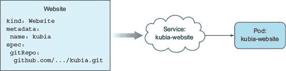
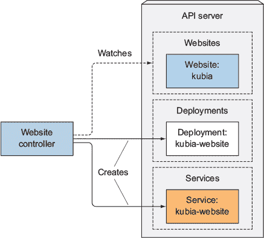
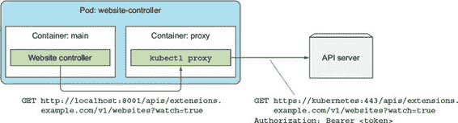
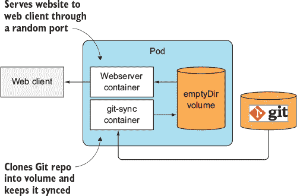
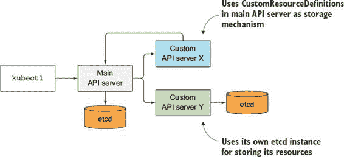
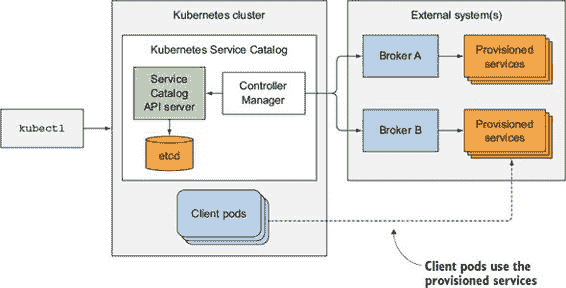
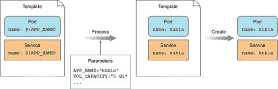
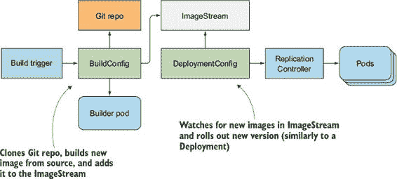
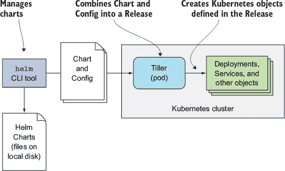

第十八章. 扩展 Kubernetes

本章涵盖

+   将自定义对象添加到 Kubernetes

+   为自定义对象创建控制器

+   添加自定义 API 服务器

+   使用 Kubernetes 服务目录进行服务自助配置

+   Red Hat 的 OpenShift 容器平台

+   Deis Workflow 和 Helm

你几乎完成了。为了总结，我们将探讨如何定义自己的 API 对象并为这些对象创建控制器。我们还将探讨其他人如何扩展 Kubernetes，并在其上构建 Platform-as-a-Service 解决方案。

18.1. 定义自定义 API 对象

在整本书中，你已经学习了 Kubernetes 提供的 API 对象以及它们如何用于构建应用程序系统。目前，Kubernetes 用户主要只使用这些对象，尽管它们代表相对低级、通用的概念。

随着 Kubernetes 生态系统的不断发展，你将看到越来越多的高级对象，这些对象将比 Kubernetes 今天支持的资源更加专业化。你将不再处理 Deployments、Services、ConfigMaps 等资源，而是创建和管理代表整个应用程序或软件服务的对象。一个自定义控制器将观察这些高级对象，并根据它们创建低级对象。例如，要在 Kubernetes 集群内运行消息代理，你只需要创建一个 Queue 资源实例，所有必要的 Secrets、Deployments 和 Services 都将由自定义 Queue 控制器创建。Kubernetes 已经提供了添加此类自定义资源的方法。

18.1.1. 介绍 CustomResourceDefinitions

要定义一个新的资源类型，你所需要做的就是将 CustomResourceDefinition 对象（CRD）发布到 Kubernetes API 服务器。CustomResourceDefinition 对象是自定义资源类型的描述。一旦 CRD 被发布，用户就可以通过将 JSON 或 YAML 清单发布到 API 服务器来创建自定义资源的实例，就像对任何其他 Kubernetes 资源一样。

| |
| --- |

注意

在 Kubernetes 1.7 版本之前，自定义资源是通过 ThirdPartyResource 对象定义的，这些对象与 CustomResourceDefinitions 类似，但在版本 1.8 中被移除。

| |
| --- |

创建 CRD 以便用户可以创建新类型的对象，如果这些对象在集群中不产生任何实际效果，那么这个功能就没有什么用处。每个 CRD 通常也会有一个相关的控制器（一个基于自定义对象执行某些操作的活跃组件），就像所有核心 Kubernetes 资源都有相关的控制器一样，这在第十一章中已经解释过了。因此，为了正确展示 CustomResourceDefinitions 允许你做什么，除了添加自定义对象的实例之外，还需要部署一个控制器。你将在下一个示例中这样做。

介绍示例 CustomResourceDefinition

让我们想象一下，你希望尽可能容易地让 Kubernetes 集群的用户运行静态网站，而无需处理 Pod、Service 和其他 Kubernetes 资源。你想要实现的是用户创建类型为 Website 的对象，这些对象除了包含网站名称和获取网站文件（HTML、CSS、PNG 等）的来源之外，不包含任何其他内容。你将使用 Git 仓库作为这些文件的来源。当用户创建 Website 资源实例时，你希望 Kubernetes 启动一个新的 web 服务器 Pod，并通过 Service 进行暴露，如图 18.1 所示 figure 18.1。

图 18.1\. 每个 Website 对象都应导致创建一个 Service 和一个 HTTP 服务器 Pod。

为了创建 Website 资源，你希望用户提交类似于以下列表中的清单。

列表 18.1\. 一个假想的自定义资源：imaginary-kubia-website.yaml

`kind: Website` `1` `metadata:   name: kubia` `2` `spec:   gitRepo: https://github.com/luksa/kubia-website-example.git` `3`

+   1 一个自定义对象类型

+   2 网站的名称（用于命名生成的 Service 和 Pod）

+   3 存放网站文件的 Git 仓库

与所有其他资源一样，你的资源包含一个 `kind` 和 `metadata.name` 字段，并且与大多数资源一样，它还包含一个 `spec` 部分。它包含一个名为 `gitRepo` 的单个字段（你可以选择名称）——它指定包含网站文件的 Git 仓库。你还需要包含一个 `apiVersion` 字段，但你还不清楚自定义资源需要什么值。

如果你尝试将此资源提交到 Kubernetes，你会收到错误，因为 Kubernetes 还不知道 Website 对象是什么：

`$ kubectl create -f imaginary-kubia-website.yaml` `error: unable to recognize "imaginary-kubia-website.yaml": no matches for`  `/, Kind=Website`

在你可以创建自定义对象实例之前，你需要让 Kubernetes 识别它们。

创建自定义资源定义对象

为了让 Kubernetes 接受你的自定义 Website 资源实例，你需要将以下列表中的自定义资源定义提交到 API 服务器。

列表 18.2\. 自定义资源定义清单：website-crd.yaml

`apiVersion: apiextensions.k8s.io/v1beta1` `1` `kind: CustomResourceDefinition` `1` `metadata:   name: websites.extensions.example.com` `2` `spec:   scope: Namespaced` `3` `group: extensions.example.com` `4` `version: v1` `4` `names:` `5` `kind: Website` `5` `singular: website` `5` `plural: websites` `5`

+   1 自定义资源定义属于此 API 组和版本。

+   2 你的自定义对象的完整名称

+   3 你希望 Website 资源是命名空间的。

+   4 定义 Website 资源的 API 组和版本。

+   5 你需要指定自定义对象名称的各种形式。

在你将描述符发布到 Kubernetes 之后，它将允许你创建任意数量的自定义网站资源实例。

你可以从代码存档中提供的 website-crd.yaml 文件创建 CRD：

`$ kubectl create -f website-crd-definition.yaml` `customresourcedefinition "websites.extensions.example.com" created`

我相信你一定在好奇 CRD 的长名称。为什么不叫它网站呢？原因是为了防止名称冲突。通过在 CRD 的名称后添加后缀（通常包括创建 CRD 的组织的名称），你可以保持 CRD 名称的唯一性。幸运的是，长名称并不意味着你需要使用 `kind: websites.extensions.example.com` 来创建你的网站资源，而是按照 CRD 中 `names.kind` 属性指定的 `kind: Website` 来创建。`extensions.example.com` 部分是你的资源 API 组。

你已经看到了创建部署对象时需要将 `apiVersion` 设置为 `apps/v1beta1` 而不是 `v1` 的原因。斜杠之前的部分是 API 组（部署属于 `apps` API 组），斜杠之后的部分是版本名称（在部署的情况下是 `v1beta1`）。当创建自定义网站资源的实例时，需要将 `apiVersion` 属性设置为 `extensions.example.com/v1`。

创建自定义资源实例

考虑到你所学到的知识，你现在将为你网站资源实例创建适当的 YAML。YAML 清单如下所示。

列表 18.3\. 自定义网站资源：kubia-website.yaml

`apiVersion: extensions.example.com/v1` `1` `kind: Website` `2` `metadata:   name: kubia` `3` `spec:   gitRepo: https://github.com/luksa/kubia-website-example.git`

+   1 你的自定义 API 组和版本

+   2 此清单描述了一个网站资源实例。

+   3 网站实例的名称

你的资源类型是网站，而 `apiVersion` 是由你在自定义资源定义中定义的 API 组和版本号组成的。

现在创建你的网站对象：

`$ kubectl create -f kubia-website.yaml` `website "kubia" created`

响应告诉你 API 服务器已接受并存储了你的自定义网站对象。让我们看看你现在是否能检索到它。

获取自定义资源实例

列出你集群中的所有网站：

`$ kubectl get websites` `NAME      KIND kubia     Website.v1.extensions.example.com`

与现有的 Kubernetes 资源一样，你可以创建并列出自定义资源的实例。你也可以使用 `kubectl describe` 来查看自定义对象的详细信息，或者使用 `kubectl get` 获取整个 YAML，如下所示。

列表 18.4\. 从 API 服务器检索到的完整网站资源定义

`$ kubectl get website kubia -o yaml` `apiVersion: extensions.example.com/v1 kind: Website metadata: creationTimestamp: 2017-02-26T15:53:21Z name: kubia namespace: default resourceVersion: "57047" selfLink: /apis/extensions.example.com/v1/.../default/websites/kubia uid: b2eb6d99-fc3b-11e6-bd71-0800270a1c50 spec: gitRepo: https://github.com/luksa/kubia-website-example.git`

注意，资源包括原始 YAML 定义中的所有内容，以及 Kubernetes 以与其他所有资源相同的方式初始化了额外的元数据字段。

删除自定义对象的实例

显然，除了创建和检索自定义对象实例之外，您还可以删除它们：

`$ kubectl delete website kubia` `website "kubia" deleted`

注意

您正在删除一个网站实例，而不是网站 CRD 资源。您也可以删除 CRD 对象本身，但让我们先暂时不这么做，因为在下一节中您将创建更多的网站实例。

让我们回顾一下您所做的一切。通过创建一个 CustomResourceDefinition 对象，您现在可以通过 Kubernetes API 服务器存储、检索和删除自定义对象。这些对象目前还没有做任何事情。您需要创建一个控制器来使它们执行某些操作。

通常，创建此类自定义对象的目的并不总是要在对象创建时发生某些操作。某些自定义对象用于存储数据，而不是使用更通用的机制，如 ConfigMap。运行在 Pod 内的应用程序可以查询 API 服务器以获取这些对象，并读取它们存储的内容。

但在这种情况下，我们说您希望网站对象的存在导致启动一个提供 Git 仓库内容的 web 服务器。我们将在下一节中查看如何实现这一点。

18.1.2. 使用自定义控制器自动化自定义资源

要使您的网站对象运行一个通过 Service 公开的 web 服务器 Pod，您需要构建和部署一个网站控制器，该控制器将监视 API 服务器以创建网站对象，然后为每个对象创建 Service 和 web 服务器 Pod。

为了确保 Pod 被管理并能在节点故障中存活，控制器将创建一个 Deployment 资源而不是直接创建一个未管理的 Pod。控制器的工作总结在图 18.2 中。

图 18.2. 网站控制器监视网站对象，并为每个对象创建一个 Deployment 和一个 Service。

我已经编写了一个简单的初始版本的控制器，它足以展示 CRDs 和控制器的作用，但它远未达到生产就绪状态，因为它过于简化。容器镜像可在 docker.io/luksa/website-controller:latest 找到，源代码在[`github.com/luksa/k8s-website-controller`](https://github.com/luksa/k8s-website-controller)。我将不会通过其源代码进行说明，而是解释控制器的作用。

理解 Website 控制器的作用

启动后立即，控制器开始通过请求以下 URL 监视 Website 对象：

`http://localhost:8001/apis/extensions.example.com/v1/websites?watch=true`

你可能已经识别出主机名和端口号——控制器不是直接连接到 API 服务器，而是连接到`kubectl proxy`进程，该进程在同一个 pod 中的 sidecar 容器中运行，并作为 API 服务器的使者（我们在第八章中考察了使者模式章节 8）。代理将请求转发到 API 服务器，同时处理 TLS 加密和认证（见图 18.3）。

图 18.3\. Website 控制器通过代理（在 ambassador 容器中）与 API 服务器通信

通过这个 HTTP GET 请求打开的连接，API 服务器将为任何 Website 对象的每个更改发送监视事件。

每当创建一个新的 Website 对象时，API 服务器都会发送`ADDED`监视事件。当控制器收到此类事件时，它会从接收到的监视事件中的 Website 对象中提取 Website 的名称和 Git 仓库的 URL，并通过将它们的 JSON 清单发布到 API 服务器来创建 Deployment 和 Service 对象。

Deployment 资源包含一个具有两个容器的 pod 模板（如图 18.4 所示）：一个运行 nginx 服务器，另一个运行 gitsync 进程，该进程将本地目录与 Git 仓库的内容同步。本地目录通过`emptyDir`卷与 nginx 容器共享（你在第六章中做了类似的事情章节 6，但不是将本地目录与 Git 仓库同步，而是使用`gitRepo`卷在 pod 启动时下载 Git 仓库的内容；在之后，卷的内容没有与 Git 仓库保持同步）。服务是一个`NodePort`服务，它通过每个节点上的随机端口公开你的 web 服务器 pod（所有节点上使用相同的端口）。当 Deployment 对象创建 pod 时，客户端可以通过节点端口访问网站。

图 18.4\. 服务器端 pod 为 Website 对象指定的网站提供服务

当 Website 资源实例被删除时，API 服务器也会发送一个 `DELETED` 观察事件。在接收到事件后，控制器会删除它之前创建的 Deployment 和 Service 资源。一旦用户删除了 Website 实例，控制器将关闭并移除为该网站服务的 web 服务器。

注意

我过于简化的控制器并没有得到适当的实现。它观察 API 对象的方式并不能保证不会错过单个观察事件。通过 API 服务器观察对象的正确方式不仅是要观察它们，还要定期重新列出所有对象，以防错过任何观察事件。

以 pod 的形式运行控制器

在开发过程中，我在我的本地开发笔记本电脑上运行了控制器，并使用本地运行的 `kubectl proxy` 进程（不以 pod 的形式运行）作为 Kubernetes API 服务器的使者。这使我能够快速开发，因为我不需要在每次更改源代码后构建容器镜像，然后再在 Kubernetes 内运行它。

当我准备将控制器部署到生产环境时，最好的方式是将控制器在 Kubernetes 本身运行，就像运行所有其他核心控制器一样。要在 Kubernetes 中运行控制器，你可以通过 Deployment 资源部署它。以下列表显示了一个这样的 Deployment 示例。

列表 18.5\. Website 控制器 Deployment：website-controller.yaml

`apiVersion: apps/v1beta1 kind: Deployment metadata:   name: website-controller spec:   replicas: 1` `1` `template:     metadata:       name: website-controller       labels:         app: website-controller     spec:       serviceAccountName: website-controller` `2` `containers:` `3` `- name: main` `3` `image: luksa/website-controller` `3` `- name: proxy` `3` `image: luksa/kubectl-proxy:1.6.2` `3`

+   1 你将运行控制器的单个副本。

+   2 它将在一个特殊的 ServiceAccount 下运行。

+   3 两个容器：主容器和代理侧容器

如您所见，Deployment 部署了一个包含两个容器的 pod 的单个副本。一个容器运行您的控制器，而另一个容器是用于与 API 服务器进行简单通信的使者容器。该 pod 在其自己的特殊 ServiceAccount 下运行，因此您在部署控制器之前需要创建它：

`$ kubectl create serviceaccount website-controller` `serviceaccount "website-controller" created`

如果你的集群启用了基于角色的访问控制（RBAC），Kubernetes 将不允许控制器观察 Website 资源或创建 Deployment 或 Service。为了允许它这样做，你需要通过创建一个类似这样的 ClusterRoleBinding 将 `website-controller` ServiceAccount 绑定到 `cluster-admin` ClusterRole：

`$ kubectl create clusterrolebinding website-controller``--clusterrole=cluster-admin``--serviceaccount=default:website-controller` `clusterrolebinding "website-controller" created`

一旦设置了 ServiceAccount 和 ClusterRoleBinding，你就可以部署控制器的部署。

观察控制器的工作情况

控制器现在正在运行，再次创建 `kubia` 网站资源：

`$ kubectl create -f kubia-website.yaml` `website "kubia" created`

现在，让我们检查控制器的日志（如下所示列表）以查看它是否收到了监视事件。

列表 18.6\. 显示网站控制器的日志

`$ kubectl logs website-controller-2429717411-q43zs -c main` `2017/02/26 16:54:41 website-controller started. 2017/02/26 16:54:47 Received watch event: ADDED: kubia: https://github.c... 2017/02/26 16:54:47 Creating services with name kubia-website in namespa... 2017/02/26 16:54:47 Response status: 201 Created 2017/02/26 16:54:47 Creating deployments with name kubia-website in name... 2017/02/26 16:54:47 Response status: 201 Created`

日志显示控制器收到了 `ADDED` 事件，并且它为 `kubia-website` 网站创建了服务和服务。API 服务器响应了 `201 Created` 状态，这意味着这两个资源现在应该存在。让我们验证部署、服务和由此产生的 Pod 是否已创建。以下列表列出了所有部署、服务和 Pod。

列表 18.7\. 为 `kubia-website` 创建的部署、服务和 Pod

`$ kubectl get deploy,svc,po` `NAME                        DESIRED   CURRENT   UP-TO-DATE   AVAILABLE  AGE` `deploy/kubia-website``1         1         1            1          4s deploy/website-controller   1         1         1            1          5m  NAME                CLUSTER-IP     EXTERNAL-IP   PORT(S)        AGE svc/kubernetes      10.96.0.1      <none>        443/TCP        38d` `svc/kubia-website``10.101.48.23   <nodes>       80:32589/TCP   4s  NAME                                     READY     STATUS    RESTARTS   AGE` `po/kubia-website-1029415133-rs715``        2/2       Running   0          4s po/website-controller-1571685839-qzmg6   2/2       Running   1          5m`

就在这里。你可以通过 `kubia-website` 服务访问你的网站，该服务在所有集群节点上的 `32589` 端口可用。你可以用浏览器访问它。太棒了，不是吗？

你的 Kubernetes 集群的用户现在可以在几秒钟内部署静态网站，无需了解关于 Pod、服务或任何其他 Kubernetes 资源的信息，除了你的自定义网站资源。

显然，你仍有改进的空间。例如，控制器可以监视服务对象，一旦节点端口分配，就将网站可访问的 URL 写入网站资源实例的 `status` 部分。或者它也可以为每个网站创建一个 Ingress 对象。我将将这些额外功能的实现留给你作为练习。

18.1.3\. 验证自定义对象

您可能已经注意到，您在 Website CustomResourceDefinition 中没有指定任何类型的验证架构。用户可以在他们的 Website 对象的 YAML 中包含他们想要的任何字段。API 服务器不会验证 YAML 的内容（除了通常的字段如 `apiVersion`、`kind` 和 `metadata`），因此用户可以创建无效的 Website 对象（例如，没有 `gitRepo` 字段）。

是否有可能向控制器添加验证并防止无效对象被 API 服务器接受？这是不可能的，因为 API 服务器首先存储对象，然后向客户端（`kubectl`）返回成功响应，然后才通知所有监视器（控制器就是其中之一）。控制器真正能做的就是当它在一个监视事件中接收到对象时验证对象，如果对象无效，就将错误信息写入 Website 对象（通过向 API 服务器发送一个新的请求来更新对象）。用户不会自动收到错误通知。他们必须通过查询 API 服务器以获取 Website 对象来注意错误信息。除非用户这样做，否则他们无法知道对象是否有效。

这显然不是理想的。您希望 API 服务器验证对象并立即拒绝无效对象。自定义对象的验证是在 Kubernetes 版本 1.8 中作为一个 alpha 特性引入的。要使 API 服务器验证您的自定义对象，您需要在 API 服务器中启用 `CustomResourceValidation` 功能门，并在 CRD 中指定一个 JSON 架构。

18.1.4\. 为您的自定义对象提供自定义 API 服务器

在 Kubernetes 中添加对自定义对象支持的一种更好的方式是实现您自己的 API 服务器，并让客户端直接与其通信。

引入 API 服务器聚合

在 Kubernetes 版本 1.7 中，您可以通过 API 服务器聚合将您的自定义 API 服务器与主 Kubernetes API 服务器集成。最初，Kubernetes API 服务器是一个单一的模块化组件。从 Kubernetes 版本 1.7 开始，多个聚合的 API 服务器将在单个位置暴露。客户端可以连接到聚合的 API，并且他们的请求将透明地转发到适当的 API 服务器。这样，客户端甚至不会意识到有多个 API 服务器在幕后处理不同的对象。甚至核心 Kubernetes API 服务器最终也可能被分割成多个较小的 API 服务器，并通过聚合器作为一个单独的服务器暴露，如图 18.5 所示。

图 18.5\. API 服务器聚合

在您的案例中，您可以创建一个负责处理您的 Website 对象的 API 服务器。它可以像核心 Kubernetes API 服务器验证对象那样验证这些对象。您就不再需要创建 CRD 来表示这些对象，因为您将直接在自定义 API 服务器中实现 Website 对象类型。

通常，每个 API 服务器负责存储它们自己的资源。如图 18.5 所示，它可以运行自己的 etcd 实例（或整个 etcd 集群），或者它可以通过在核心 API 服务器中创建 CRD 实例将资源存储在核心 API 服务器 etcd 存储中。在这种情况下，它需要首先创建 CRD 对象，然后再创建 CRD 实例，就像您在示例中所做的那样。

注册自定义 API 服务器

要将自定义 API 服务器添加到您的集群中，您需要将其作为 pod 部署并通过服务公开。然后，为了将其集成到主 API 服务器，您需要部署一个描述 APIService 资源（如下所示列表）的 YAML 清单。

列表 18.8\. 一个 `APIService` YAML 定义

`apiVersion: apiregistration.k8s.io/v1beta1` `1` `kind: APIService` `1` `metadata:` `2` `name: v1alpha1.extensions.example.com` `2` `spec:` `3` `group: extensions.example.com` `3` `version: v1alpha1` `3` `priority: 150` `4` `service:` `4` `name: website-api` `4` `namespace: default` `4`

+   1 这是一个 APIService 资源。

+   2 该 API 服务器负责的 API 组

+   3 支持的 API 版本

+   4 自定义 API 服务器通过的服务

在从上一列表创建 APIService 资源之后，发送到主 API 服务器且包含来自 `extensions.example.com` API 组和版本 `v1alpha1` 的任何资源的客户端请求将被转发到通过 `website-api` 服务公开的自定义 API 服务器 pod(s)。

创建自定义客户端

虽然您可以使用常规的 `kubectl` 客户端从 YAML 文件创建自定义资源，但要使自定义对象的部署更加容易，除了提供自定义 API 服务器外，您还可以构建自定义 CLI 工具。这将允许您添加用于操作这些对象的专用命令，类似于 `kubectl` 通过资源特定的命令（如 `kubectl create secret` 或 `kubectl create deployment`）允许创建 Secrets、Deployments 和其他资源。

正如我已经提到的，自定义 API 服务器、API 服务器聚合以及其他与扩展 Kubernetes 相关的功能目前正在积极开发中，因此它们可能在本书出版后发生变化。要获取有关该主题的最新信息，请参阅 Kubernetes GitHub 仓库[`github.com/kubernetes`](http://github.com/kubernetes)。

18.2\. 使用 Kubernetes 服务目录扩展 Kubernetes

通过 API 服务器聚合添加到 Kubernetes 的第一个附加 API 服务器之一是服务目录 API 服务器。服务目录是 Kubernetes 社区的一个热门话题，因此您可能想了解它。

目前，为了一个 Pod 能够消费一个服务（这里我使用这个术语是一般性的，而不是与 Service 资源相关；例如，数据库服务包括允许用户在他们的应用程序中使用数据库所需的所有内容），需要有人部署提供服务的 Pods、Service 资源，以及可能的一个 Secret，以便客户端 Pod 可以使用它来与该服务进行身份验证。这个人通常是部署客户端 Pod 的同一用户，或者如果有一个团队专门负责部署这些类型的通用服务，用户需要提交一个工单并等待团队提供该服务。这意味着用户需要创建服务所有组件的清单，知道在哪里找到现有的清单集合，知道如何正确配置它，并手动部署它，或者等待其他团队来完成。

但 Kubernetes 应该是一个易于使用、自助服务的系统。理想情况下，需要特定服务的应用程序（例如，需要后端数据库的 Web 应用程序）的用户应该能够对 Kubernetes 说：“嘿，我需要一个 PostgreSQL 数据库。请为我提供它，并告诉我如何连接到它。”这将通过 Kubernetes 服务目录很快实现。

18.2.1. 介绍服务目录

如其名所示，服务目录是服务的目录。用户可以浏览目录，并自行提供目录中列出的服务的实例，而无需处理 Pods、Services、ConfigMaps 和其他服务运行所需的其他资源。你会认识到这与你对 Website 自定义资源所做的是类似的。

而不是为每种服务向 API 服务器添加自定义资源，服务目录引入了以下四个通用 API 资源：

+   ClusterServiceBroker，它描述了一个可以提供服务的（外部）系统

+   ClusterServiceClass，它描述了可以提供的服务类型

+   ServiceInstance，它是已经提供的服务的一个实例

+   ServiceBinding，它代表了一组客户端（Pods）与 ServiceInstance 之间的绑定

这四个资源之间的关系在图 18.6 中展示，并在以下段落中解释。

图 18.6. 服务目录 API 资源之间的关系。

简而言之，集群管理员为每个他们希望在集群中提供服务的服务代理创建一个 ClusterServiceBroker 资源。Kubernetes 随后要求代理提供一个它可以提供的服务的列表，并为每个服务创建一个 ClusterServiceClass 资源。当用户需要提供一项服务时，他们创建一个 ServiceInstance 资源，然后创建一个 ServiceBinding 将 Service-Instance 绑定到他们的 Pods 上。然后，这些 Pods 被注入一个 Secret，其中包含连接到提供的服务实例所需的所有必要凭证和其他数据。

服务目录系统架构如图 18.7 所示。

图 18.7\. 服务目录的架构

图中所示组件将在以下章节中进行解释。

18.2.2\. 介绍服务目录 API 服务器和控制器管理器

与核心 Kubernetes 类似，服务目录是一个由三个组件组成的分布式系统：

+   服务目录 API 服务器

+   etcd 作为存储

+   控制器管理器，所有控制器都在这里运行

我们之前介绍的四个与服务目录相关的资源是通过向 API 服务器发送 YAML/JSON 清单创建的。然后它将它们存储到自己的 etcd 实例中，或者使用主 API 服务器中的 CustomResourceDefinitions 作为替代存储机制（在这种情况下，不需要额外的 etcd 实例）。

在控制器管理器中运行的控制器是那些对这些资源进行操作的控制器。它们显然会与服务目录 API 服务器通信，就像其他核心 Kubernetes 控制器与核心 API 服务器通信一样。这些控制器不会自己提供请求的服务。它们将这项工作留给外部服务代理，这些代理通过在服务目录 API 中创建 ServiceBroker 资源进行注册。

18.2.3\. 介绍服务代理和 OpenServiceBroker API

群集管理员可以在服务目录中注册一个或多个外部服务代理。每个代理都必须实现 OpenServiceBroker API。

介绍 OpenServiceBroker API

服务目录通过该 API 与代理通信。该 API 相对简单。它是一个提供以下操作的 REST API：

+   使用 `GET /v2/catalog` 获取服务列表

+   配置服务实例 (`PUT /v2/service_instances/:id`)

+   更新服务实例 (`PATCH /v2/service_instances/:id`)

+   绑定服务实例 (`PUT /v2/service_instances/:id/service_bindings/:binding_id`)

+   解除实例绑定 (`DELETE /v2/service_instances/:id/service_bindings/:binding_id`)

+   取消配置服务实例 (`DELETE /v2/service_instances/:id`)

您可以在 [`github.com/openservicebrokerapi/servicebroker`](https://github.com/openservicebrokerapi/servicebroker) 找到 OpenServiceBroker API 规范。

在服务目录中注册代理

群集管理员通过向服务目录 API 发送 ServiceBroker 资源清单来注册代理，如下所示。

列表 18.9\. ClusterServiceBroker 清单：database-broker.yaml

`apiVersion: servicecatalog.k8s.io/v1alpha1` `1` `kind: ClusterServiceBroker` `1` `metadata:` `name: database-broker` `2` `spec:` `url: http://database-osbapi.myorganization.org` `3`

+   1 资源类型和 API 组及版本

+   2 此代理的名称

+   3 服务目录可以联系代理的位置（其 OpenServiceBroker [OSB] API URL）

列表描述了一个可以配置不同类型数据库的虚拟代理。在管理员创建 ClusterServiceBroker 资源后，Service Catalog Controller Manager 中的控制器连接到资源中指定的 URL 以检索此代理可以配置的服务列表。

在服务目录检索服务列表后，它为每个服务创建一个 ClusterServiceClass 资源。每个 ClusterServiceClass 资源描述了一种可以配置的服务类型（ClusterServiceClass 的一个例子是“PostgreSQL 数据库”）。每个 ClusterServiceClass 都与一个或多个服务计划相关联。这些允许用户选择他们需要的服务的级别（例如，数据库 ClusterServiceClass 可以提供一个“免费”计划，其中数据库的大小有限，底层存储是旋转磁盘，以及一个“高级”计划，具有无限大小和 SSD 存储）。

列出集群中的可用服务

Kubernetes 集群的用户可以使用`kubectl get serviceclasses`检索集群中可以配置的所有服务的列表，如下所示。

列表 18.10\. 集群中 ClusterServiceClasses 的列表

`$ kubectl get clusterserviceclasses` `NAME                KIND postgres-database   ClusterServiceClass.v1alpha1.servicecatalog.k8s.io mysql-database      ServiceClass.v1alpha1.servicecatalog.k8s.io mongodb-database    ServiceClass.v1alpha1.servicecatalog.k8s.io`

列表显示了可以为您的虚拟数据库代理提供的服务 ClusterServiceClasses。您可以将 ClusterServiceClasses 与我们在第六章中讨论的 StorageClasses 进行比较。StorageClasses 允许您选择在您的 Pod 中想要使用的存储类型，而 ClusterServiceClasses 允许您选择服务类型。

您可以通过检索其 YAML 来查看 ClusterServiceClass 的详细信息。以下是一个示例。

列表 18.11\. ClusterServiceClass 定义

`$ kubectl get serviceclass postgres-database -o yaml` `apiVersion: servicecatalog.k8s.io/v1alpha1 bindable: true brokerName: database-broker` `1` `description: A PostgreSQL database kind: ClusterServiceClass metadata:   name: postgres-database   ... planUpdatable: false plans: - description: A free (but slow) PostgreSQL instance` `2` `name: free` `2` `osbFree: true` `2` `... - description: A paid (very fast) PostgreSQL instance` `3` `name: premium` `3` `osbFree: false` `3` `...`

+   1 此 ClusterServiceClass 由数据库代理提供。

+   2 此服务的免费计划

+   3 一个付费计划

列表中的 ClusterServiceClass 包含两个计划——一个`免费`计划和一个`高级`计划。您可以看到此 ClusterServiceClass 是由`database-broker`代理提供的。

18.2.4\. 服务配置和使用

让我们想象一下你部署的 Pod 需要使用数据库。你已经检查了可用的 ClusterServiceClasses 列表，并选择了使用`postgres-database` ClusterServiceClass 的`free`计划。

配置一个 ServiceInstance

为了让你使用的数据库被配置好，你所需要做的就是创建一个 Service-Instance 资源，如下所示。

列表 18.12. ServiceInstance 清单：database-instance.yaml

`apiVersion: servicecatalog.k8s.io/v1alpha1 kind: ServiceInstance metadata:   name: my-postgres-db` `1` `spec:   clusterServiceClassName: postgres-database` `2` `clusterServicePlanName: free` `2` `parameters:     init-db-args: --data-checksums` `3`

+   1 你正在给这个实例命名。

+   2 你想要的 ServiceClass 和 Plan

+   3 传递给代理的附加参数

你创建了一个名为`my-postgres-db`的 ServiceInstance（这将是你要部署的资源名称），并指定了 ClusterServiceClass 和所选的计划。你还指定了一个参数，这是针对每个代理和 ClusterServiceClass 特定的。让我们假设你查阅了代理文档中可能的参数。

一旦你创建了此资源，服务目录将联系属于 ClusterServiceClass 的代理，并要求它配置服务。它将传递所选的 ClusterServiceClass 和计划名称，以及你指定的所有参数。

然后，完全取决于代理如何处理这些信息。在你的情况下，你的数据库代理可能会在某个地方启动一个新的 PostgreSQL 数据库实例——不一定是在同一个 Kubernetes 集群中，甚至可能根本不在 Kubernetes 中。它可以在虚拟机上运行，并在那里运行数据库。服务目录不在乎，请求服务的用户也不在乎。

你可以通过检查你创建的 my-postgres-db ServiceInstance 的`status`部分来验证服务是否已成功配置，如下所示。

列表 18.13. 检查 ServiceInstance 的状态

`$ kubectl get instance my-postgres-db -o yaml` `apiVersion: servicecatalog.k8s.io/v1alpha1 kind: ServiceInstance ... status:   asyncOpInProgress: false   conditions:   - lastTransitionTime: 2017-05-17T13:57:22Z     message: The instance was provisioned successfully` `1` `reason: ProvisionedSuccessfully` `1` `status: "True"     type: Ready` `2`

+   1 数据库已成功配置。

+   2 它现在可以使用了。

数据库实例现在在某个地方运行，但如何在你的 Pod 中使用它？为了做到这一点，你需要将其绑定。

绑定一个 ServiceInstance

要在你的 Pod 中使用已配置的 ServiceInstance，你需要创建一个 ServiceBinding 资源，如下所示。

列表 18.14. ServiceBinding：my-postgres-db-binding.yaml

`apiVersion: servicecatalog.k8s.io/v1alpha1 kind: ServiceBinding metadata:   name: my-postgres-db-binding spec:   instanceRef:` `1` `name: my-postgres-db` `1` `secretName: postgres-secret` `2`

+   1 您正在引用您之前创建的实例。

+   2 您希望将访问服务的凭据存储在这个 Secret 中。

列表显示您正在定义一个名为`my-postgres-db-binding`的 ServiceBinding 资源，在其中您引用了您之前创建的`my-postgres-db`服务实例。您还指定了一个 Secret 的名称。您希望服务目录将访问服务实例所需的所有必要凭据放入名为`postgres-secret`的 Secret 中。但您将 ServiceInstance 绑定到 Pod 的哪里？实际上是没有地方。

目前，服务目录还不能使 Pod 能够注入服务实例的凭据。当一个新的 Kubernetes 功能 PodPresets 可用时，这将成为可能。在此之前，您可以为要存储凭据的 Secret 选择一个名称，并将该 Secret 手动挂载到您的 Pod 中。

当您将上一列表中的 ServiceBinding 资源提交给服务目录 API 服务器时，控制器将再次联系数据库代理，并为您之前配置的服务实例创建一个绑定。代理响应一个包含连接到数据库所需凭据和其他数据的列表。服务目录创建一个新的 Secret，其名称与您在 Service-Binding 资源中指定的名称相同，并将所有这些数据存储在 Secret 中。

使用新创建的 Secret 在客户端 Pod 中

服务目录系统创建的 Secret 可以挂载到 Pod 中，这样它们就可以读取其内容，并使用这些内容连接到配置的服务实例（例如，示例中的 PostgreSQL 数据库）。Secret 可能看起来像以下列表中的那样。

列表 18.15. 存储连接到服务实例凭据的 Secret

`$ kubectl get secret postgres-secret -o yaml` `apiVersion: v1 data:   host: <数据库的主机 base64 编码名称>` `1` `username: <用户名的 base64 编码>` `1` `password: <密码的 base64 编码>` `1` `kind: Secret metadata:   name: postgres-secret   namespace: default   ... type: Opaque`

+   1 这就是 Pod 应该用来连接到数据库服务的内容。

因为您可以自己选择 Secret 的名称，您可以在配置或绑定服务之前部署 Pod。正如您在第七章中学到的，Pod 将在这样的 Secret 存在之前不会启动。

如果需要，可以为不同的 Pod 创建多个绑定。服务代理可以选择在每个绑定中使用相同的凭据集，但为每个绑定实例创建一个新的凭据集会更好。这样，可以通过删除 ServiceBinding 资源来防止 Pod 使用服务。

18.2.5. 解除绑定和取消配置

一旦不再需要 ServiceBinding，您就可以像删除其他资源一样删除它：

`$ kubectl delete servicebinding my-postgres-db-binding` `servicebinding "my-postgres-db-binding" deleted`

当您这样做时，服务目录控制器将删除 Secret 并调用代理执行解绑操作。服务实例（在您的情况下是一个 PostgreSQL 数据库）仍在运行。因此，如果您想的话，可以创建一个新的 ServiceBinding。

但如果您不再需要数据库实例，也应该删除 Service-Instance 资源：

`$ kubectl delete serviceinstance my-postgres-db` `serviceinstance "my-postgres-db" deleted`

删除 ServiceInstance 资源会导致服务目录在服务代理上执行解配操作。再次强调，这具体意味着什么取决于服务代理，但在您的情况下，代理应该关闭我们在提供服务实例时创建的 PostgreSQL 数据库实例。

18.2.6. 理解服务目录带来的好处

正如您所学的，服务目录使服务提供商能够通过在该集群中注册代理来在任何 Kubernetes 集群中公开这些服务。例如，我从一开始就参与了服务目录，并实现了一个代理，这使得在 Kubernetes 集群中提供消息系统并将其公开给 pod 变得非常简单。另一个团队实现了一个代理，使得提供亚马逊网络服务变得容易。

通常，服务代理允许在 Kubernetes 中轻松提供和公开服务，这将使 Kubernetes 成为部署应用程序的更加强大的平台。

18.3. 基于 Kubernetes 的平台

我相信您会同意 Kubernetes 本身就是一个伟大的系统。鉴于它很容易扩展到其所有组件，也就难怪之前开发自己定制平台的公司现在正在 Kubernetes 之上重新实现它们。实际上，Kubernetes 正在成为新一代 PaaS 提供的广泛接受的基础。

在基于 Kubernetes 的最知名 PaaS 系统中，有 Deis Workflow 和 Red Hat 的 OpenShift。我们将快速概述这两个系统，以便您了解它们在 Kubernetes 已经提供的所有精彩功能之上还能提供什么。

18.3.1. Red Hat OpenShift 容器平台

Red Hat OpenShift 是一个平台即服务（PaaS），因此它非常注重开发者体验。其目标包括实现应用程序的快速开发、易于部署、扩展以及长期维护。OpenShift 的历史比 Kubernetes 悠久得多。版本 1 和 2 是从头开始构建的，与 Kubernetes 无关，但 Kubernetes 发布后，Red Hat 决定从头开始重建 OpenShift 版本 3——这次是在 Kubernetes 之上。当像 Red Hat 这样的公司决定放弃其软件的旧版本，并在现有技术如 Kubernetes 之上构建新版本时，对每个人来说都应该很清楚 Kubernetes 有多么出色。

Kubernetes 自动化了发布和应用程序扩展，而 OpenShift 还自动构建应用程序镜像及其自动部署，无需您将持续集成解决方案集成到您的集群中。

OpenShift 还提供了用户和组管理，这使得您可以运行一个安全的多租户 Kubernetes 集群，其中单个用户只能访问他们自己的 Kubernetes 命名空间，并且在这些命名空间中运行的应用程序默认情况下也完全网络隔离。

介绍 OpenShift 中可用的额外资源

除了 Kubernetes 中所有可用的 API 对象之外，OpenShift 还提供了一些额外的 API 对象。我们将在接下来的几段中解释它们，以便您对 OpenShift 做什么以及它提供什么有一个良好的概述。

额外的资源包括

+   Users & Groups

+   Projects

+   Templates

+   BuildConfigs

+   DeploymentConfigs

+   ImageStreams

+   Routes

+   以及其他

理解用户、组和项目

我们说过，OpenShift 为用户提供了一个合适的多租户环境。与 Kubernetes 不同，Kubernetes 没有用于表示集群单个用户的 API 对象（但确实有 ServiceAccounts 表示在其中运行的服务），OpenShift 提供了强大的用户管理功能，这使得可以指定每个用户可以做什么以及他们不能做什么。这些功能早于基于角色的访问控制，而基于角色的访问控制现在是纯 Kubernetes 的标准。

每个用户都有访问某些项目的权限，这些项目不过是带有额外注解的 Kubernetes 命名空间。用户只能对其有权访问的项目中的资源采取行动。项目访问权由集群管理员授予。

介绍应用程序模板

Kubernetes 通过单个 JSON 或 YAML 清单部署一组资源。OpenShift 更进一步，允许该清单可参数化。在 OpenShift 中，可参数化的列表称为模板；它是一系列对象，其定义可以包括占位符，当您处理并实例化模板时，这些占位符将被参数值替换（参见图 18.8）。

图 18.8\. OpenShift 模板

模板本身是一个 JSON 或 YAML 文件，其中包含在相同 JSON/YAML 中定义的资源中引用的参数列表。模板可以像任何其他对象一样存储在 API 服务器上。在模板可以实例化之前，需要对其进行处理。要处理模板，你需要提供模板参数的值，然后 OpenShift 将参数的引用替换为这些值。结果是经过处理的模板，它就像一个 Kubernetes 资源列表，然后可以通过单个 POST 请求创建。

OpenShift 提供了一系列预先构建的模板，允许用户通过指定少量参数（如果没有提供参数，因为模板为这些参数提供了良好的默认值）快速运行复杂的应用程序。例如，一个模板可以启用创建所有必要的 Kubernetes 资源，以便在应用程序服务器内运行 Java EE 应用程序，该服务器连接到后端数据库，也作为该模板的一部分部署。所有这些组件都可以通过单个命令部署。

使用 BuildConfigs 从源构建镜像

OpenShift 最优秀的功能之一是能够通过指向包含应用程序源代码的 Git 仓库来构建和立即在 OpenShift 集群中部署应用程序。你根本不需要构建容器镜像——OpenShift 会为你完成这项工作。这是通过创建一个名为 Build-Config 的资源来实现的，它可以配置为在源 Git 仓库提交更改后立即触发容器镜像的构建。

尽管 OpenShift 本身不监控 Git 仓库，但仓库中的钩子可以通知 OpenShift 有新的提交。然后 OpenShift 将从 Git 仓库拉取更改并开始构建过程。一种名为“源到镜像”的构建机制可以检测 Git 仓库中应用类型，并为其运行适当的构建过程。例如，如果检测到 pom.xml 文件，这是 Java Maven 格式项目使用的，它将运行 Maven 构建。生成的工件被打包到适当的容器镜像中，然后推送到内部容器注册库（由 OpenShift 提供）。从那里，它们可以立即被拉取并在集群中运行。

通过创建 BuildConfig 对象，开发人员可以指向 Git 仓库，而不必担心构建容器镜像。开发人员几乎不需要了解任何关于容器的内容。一旦运维团队部署了 OpenShift 集群并允许开发人员访问它，那些开发人员就可以像以前一样开发他们的代码，提交并推送到 Git 仓库。然后 OpenShift 负责从该代码构建、部署和管理应用程序。

使用 DeploymentConfigs 自动部署新构建的镜像

一旦构建了新的容器镜像，它也可以在集群中自动部署。这是通过创建一个 DeploymentConfig 对象并将其指向 ImageStream 来实现的。正如其名所示，ImageStream 是一系列镜像。当镜像构建时，它会被添加到 ImageStream 中。这使得 DeploymentConfig 能够注意到新构建的镜像，并允许它采取行动并启动新镜像的部署（见图 18.9）。

图 18.9\. OpenShift 中的 BuildConfigs 和 DeploymentConfigs

DeploymentConfig 几乎与 Kubernetes 中的 Deployment 对象相同，但它更早出现。像 Deployment 对象一样，它有一个可配置的策略，用于在部署之间进行转换。它包含一个用于创建实际 Pods 的 Pod 模板，但它还允许你配置部署前和部署后的钩子。与 Kubernetes 的 Deployment 相比，它创建 ReplicationControllers 而不是 ReplicaSets，并提供了一些额外的功能。

使用 Routes 公开服务

在早期，Kubernetes 没有提供 Ingress 对象。要将服务暴露给外部世界，你需要使用`NodePort`或`LoadBalancer`类型的 Service。但那时，OpenShift 已经通过 Route 资源提供了一个更好的选择。Route 类似于 Ingress，但它提供了与 TLS 终止和流量分割相关的额外配置。

与 Ingress 控制器类似，Route 需要一个 Router，这是一个提供负载均衡器或代理的控制器。与 Kubernetes 不同，Router 在 OpenShift 中是开箱即用的。

尝试 OpenShift

如果你感兴趣尝试 OpenShift，你可以从使用 Minishift 开始，它是 Minikube 的 OpenShift 等价物，或者你可以尝试在[`manage.openshift.com`](https://manage.openshift.com)上的 OpenShift Online Starter，这是一个免费的多租户托管解决方案，旨在帮助你开始使用 OpenShift。

18.3.2\. Deis Workflow 和 Helm

一家名为 Deis 的公司，最近已被微软收购，它也提供了一种名为 Workflow 的 PaaS 服务，该服务也是建立在 Kubernetes 之上的。除了 Workflow 之外，他们还开发了一个名为 Helm 的工具，它在 Kubernetes 社区中作为一种在 Kubernetes 中部署现有应用的标准方式而受到欢迎。我们将简要地看看这两个工具。

介绍 Deis Workflow

你可以将 Deis Workflow 部署到任何现有的 Kubernetes 集群中（与 OpenShift 不同，OpenShift 是一个完整的集群，具有修改后的 API 服务器和其他 Kubernetes 组件）。当你运行 Workflow 时，它会创建一组服务和 ReplicationControllers，然后为开发者提供一个简单、友好的环境。

通过 `git push deis master` 推送您的更改并让 Workflow 处理其余部分来触发部署您应用程序的新版本。类似于 OpenShift，Workflow 也提供了源到镜像机制、应用程序部署和回滚、边缘路由，以及核心 Kubernetes 中不可用的日志聚合、指标和警报。

要在您的 Kubernetes 集群中运行 Workflow，您首先需要安装 Deis Workflow 和 Helm CLI 工具，然后将 Workflow 安装到您的集群中。我们这里不会详细介绍如何操作，但如果您想了解更多信息，请访问 [`deis.com/workflow`](https://deis.com/workflow) 网站。我们将在这里探讨 Helm 工具，它可以不使用 Workflow 使用，并在社区中获得了流行。

通过 Helm 部署资源

Helm 是 Kubernetes 的包管理器（类似于 Linux 中的 `yum` 或 `apt` 或 MacOS 中的 `homebrew` 这样的操作系统包管理器）。

Helm 由两部分组成：

+   `helm` CLI 工具（客户端）。

+   Tiller，一个在 Kubernetes 集群内部运行的 Pod 中的服务器组件。

这两个组件用于在 Kubernetes 集群中部署和管理应用程序包。Helm 应用程序包被称为 Charts。它们与一个包含配置信息的 Config 结合，合并成一个 Chart，以创建一个 Release，即应用程序的运行实例（一个结合了 Chart 和 Config 的组合）。您可以使用 `helm` CLI 工具部署和管理 Release，该工具与 Tiller 服务器通信，Tiller 服务器是创建 Chart 中定义的所有必要 Kubernetes 资源的组件，如图 18.10 所示。[链接](https://wiki.example.org/feynmans_learning_method)。

图 18.10\. Helm 概览

您可以自己创建图表并将它们保存在本地磁盘上，或者您可以使用任何现有的图表，这些图表由社区维护的 helm 图表列表中提供，该列表在 [`github.com/kubernetes/charts`](https://github.com/kubernetes/charts) 上不断增长。列表包括 PostgreSQL、MySQL、MariaDB、Magento、Memcached、MongoDB、OpenVPN、PHPBB、RabbitMQ、Redis、WordPress 等应用程序的图表。

与您手动构建和安装其他人开发的 Linux 系统中的应用程序一样，您可能不想手动构建和管理自己的 Kubernetes 清单，对吧？这就是为什么您会想使用 Helm 和我提到的 GitHub 仓库中可用的图表。

当您想在 Kubernetes 集群中运行 PostgreSQL 或 MySQL 数据库时，不要开始编写它们的清单。相反，检查是否有人已经为此准备了 Helm 图表。

一旦有人为特定的应用程序准备了一个 Helm 图表并将其添加到 Helm 图表 GitHub 存储库中，安装整个应用程序只需要一条单行命令。例如，要在您的 Kubernetes 集群中运行 MySQL，您只需将图表 Git 存储库克隆到您的本地机器上，并运行以下命令（假设您在集群中运行了 Helm 的 CLI 工具和 Tiller）：

`$ helm install --name my-database stable/mysql`

这将创建运行 MySQL 所需的所有必要的部署、服务、机密和持久卷声明。您无需担心需要哪些组件以及如何配置它们以正确运行 MySQL。我相信您会同意这很棒。

| |
| --- |

小贴士

在存储库中可用的最有趣的图表之一是 OpenVPN 图表，它可以在您的 Kubernetes 集群内部运行 OpenVPN 服务器，并允许您通过 VPN 进入 pod 网络，就像您的本地机器是集群中的 pod 一样访问服务。当您在本地开发和运行应用程序时，这很有用。

| |
| --- |

这些是 Kubernetes 可以如何扩展以及像 Red Hat 和 Deis（现在是微软）这样的公司如何扩展它的几个例子。现在去开始自己驾驭 Kubernetes 的浪潮吧！

18.4. 摘要

这最后一章向您展示了如何超越 Kubernetes 提供的现有功能，以及像 Dies 和 Red Hat 这样的公司是如何做到的。您已经学会了如何

+   可以通过创建自定义资源定义对象来在 API 服务器中注册自定义资源。

+   可以存储、检索、更新和删除自定义对象的实例，而无需更改 API 服务器代码。

+   可以实现一个自定义控制器来使这些对象变得活跃。

+   Kubernetes 可以通过 API 聚合扩展到自定义 API 服务器。

+   Kubernetes 服务目录使得能够自助配置外部服务并将它们暴露给在 Kubernetes 集群中运行的 pod。

+   建立在 Kubernetes 之上的平台服务使得在同一个 Kubernetes 集群内部构建容器化应用程序变得容易，然后运行它们。

+   一个名为 Helm 的包管理器使得部署现有应用程序而无需为它们构建资源清单变得容易。

感谢您抽出时间阅读这本长篇巨著。我希望您从阅读中学到的知识和我从写作中学到的知识一样多。
