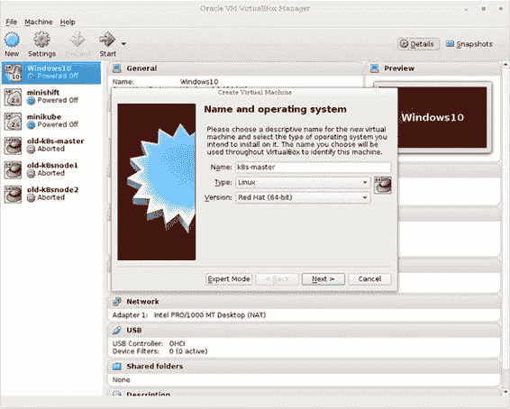
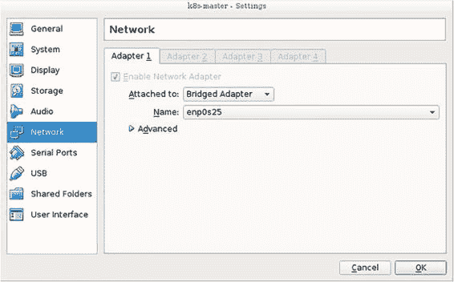
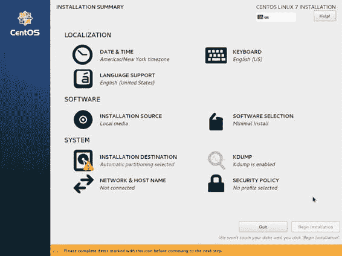
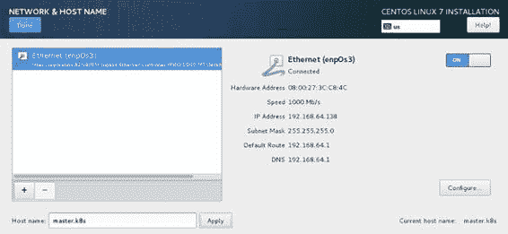
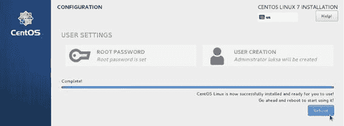
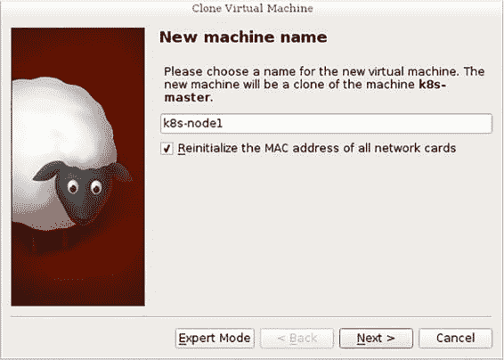

附录 B. 使用 kubeadm 设置多节点集群

本附录展示了如何使用多个节点安装 Kubernetes 集群。您将通过 VirtualBox 在虚拟机中运行节点，但也可以使用不同的虚拟化工具或裸机。为了设置主节点和工作节点，您将使用`kubeadm`工具。

B.1\. 设置操作系统和所需软件包

首先，如果您还没有安装，需要下载并安装 VirtualBox。您可以从[`www.virtualbox.org/wiki/Downloads`](https://www.virtualbox.org/wiki/Downloads)下载。启动后，从[www.centos.org/download](http://www.centos.org/download)下载 CentOS 7 最小化 ISO 镜像。您也可以使用不同的 Linux 发行版，但请确保它由[kubernetes.io](http://kubernetes.io)网站支持。

B.1.1\. 创建虚拟机

接下来，您将创建 Kubernetes 主节点的虚拟机。首先，点击左上角的“新建”图标。然后输入“k8s-master”作为名称，选择 Linux 作为类型，选择 Red Hat（64 位）作为版本，如图 B.1 所示。

图 B.1\. 在 VirtualBox 中创建虚拟机

点击下一步按钮后，您可以设置虚拟机的内存大小并设置硬盘。如果您有足够的内存，至少选择 2GB（请注意，您将运行三个这样的虚拟机）。在创建硬盘时，保留默认选项。以下是我案例中的选项：

+   硬盘文件类型：VDI（VirtualBox 磁盘镜像）

+   物理硬盘上的存储：动态分配

+   文件位置和大小：k8s-master，大小 8GB

B.1.2\. 配置虚拟机的网络适配器

创建完虚拟机后，您需要配置其网络适配器，因为默认设置不会允许您正确运行多个节点。您将配置适配器使其使用桥接适配器模式。这将使您的虚拟机连接到与您的宿主机相同的网络。每个虚拟机将获得自己的 IP 地址，就像它是一个连接到与宿主机相同交换机的物理机器一样。其他选项要复杂得多，因为它们通常需要设置两个网络适配器。

要配置网络适配器，请确保在 VirtualBox 主窗口中选择虚拟机，然后点击设置图标（在您之前点击的新图标旁边）。

将出现一个类似于图 B.2 的窗口。在左侧，选择网络，然后在右侧的主面板中，选择附加到：桥接适配器，如图所示。在名称下拉菜单中，选择您用于连接机器到网络的宿主机适配器。

图 B.2\. 配置虚拟机的网络适配器

B.1.3\. 安装操作系统

您现在可以运行虚拟机并安装操作系统了。确保虚拟机仍在列表中选中，然后在 VirtualBox 主窗口的顶部点击“开始”图标。

选择启动磁盘

在虚拟机启动之前，VirtualBox 将询问您要使用哪个启动磁盘。点击下拉列表旁边的图标（如图 B.3 所示），然后找到并选择您之前下载的 CentOS ISO 映像。然后点击“开始”以启动虚拟机。

图 B.3\. 选择安装 ISO 映像

启动安装

当虚拟机启动时，将出现一个文本菜单屏幕。使用光标向上键选择“安装 CentOS Linux 7”选项，然后按 Enter 键。

设置安装选项

几分钟后，将出现一个图形化的“欢迎使用 CentOS Linux 7”屏幕，允许您选择要使用的语言。我建议您保持语言设置为英语。点击“继续”按钮进入如图 B.4 所示的主设置屏幕。

图 B.4\. 主设置屏幕

小贴士

当您点击进入虚拟机的窗口时，您的键盘和鼠标将被虚拟机捕获。要释放它们，请按虚拟机运行的 VirtualBox 窗口右下角显示的键。这通常是 Windows 和 Linux 上的右控制键或 MacOS 上的左 Command 键。

首先，点击“安装位置”，然后立即点击出现的屏幕上的“完成”按钮（您不需要点击其他任何地方）。

然后点击“网络与主机名”。在下一屏幕上，首先通过点击右上角的开关启用网络适配器。然后输入左下角的字段中的主机名，如图 B.5 所示。您目前正在设置主节点，因此将主机名设置为 master.k8s。点击文本字段旁边的“应用”按钮以确认新的主机名。

图 B.5\. 设置主机名和配置网络适配器

要返回主设置屏幕，点击左上角的“完成”按钮。

您还需要设置正确的时间区域。点击“日期和时间”，然后在打开的屏幕上选择区域和城市或点击地图上的您的位置。通过点击左上角的“完成”按钮返回主屏幕。

运行安装

要开始安装，点击右下角的“开始安装”按钮。将出现如图 B.6 所示的屏幕。在安装操作系统时，设置 root 密码，如果您想的话，还可以创建用户账户。安装完成后，点击右下角的“重启”按钮。

图 B.6\. 在安装操作系统并重启后设置 root 密码

B.1.4\. 安装 Docker 和 Kubernetes

以 root 身份登录机器。首先，您需要禁用两个安全功能：SELinux 和防火墙。

禁用 SELinux

要禁用 SELinux，运行以下命令：

`# setenforce 0`

但这只会临时禁用（直到下一次重启）。要永久禁用，编辑`/etc/selinux/config`文件，将`SELINUX=enforcing`行更改为`SELINUX=permissive`。

禁用防火墙

你还将禁用防火墙，以免遇到任何与防火墙相关的问题。运行以下命令：

`# systemctl disable firewalld && systemctl stop firewalld` `Removed symlink /etc/systemd/system/dbus-org.fedoraproject.FirewallD1... Removed symlink /etc/systemd/system/basic.target.wants/firewalld.service.`

添加 Kubernetes yum 仓库

要使 Kubernetes RPM 包对 yum 包管理器可用，你需要在`/etc/yum.repos.d/`目录中添加一个 kubernetes.repo 文件，如下所示。

列表 B.1\. 添加 Kubernetes RPM 仓库

`# cat <<EOF > /etc/yum.repos.d/kubernetes.repo` `[kubernetes] name=Kubernetes baseurl=http://yum.kubernetes.io/repos/kubernetes-el7-x86_64 enabled=1 gpgcheck=1 repo_gpgcheck=1 gpgkey=https://packages.cloud.google.com/yum/doc/yum-key.gpg         https://packages.cloud.google.com/yum/doc/rpm-package-key.gpg EOF`

注意

如果你正在复制粘贴，请确保 EOF 后没有空格。

安装 Docker、Kubelet、kubeadm、kubectl 和 Kubernetes-CNI

现在你已经准备好安装所有需要的包了：

`# yum install -y docker kubelet kubeadm kubectl kubernetes-cni`

如你所见，你正在安装相当多的包。以下是它们的内容：

+   `docker`——容器运行时

+   `kubelet`——Kubernetes 节点代理，将为你运行一切

+   `kubeadm`——用于部署多节点 Kubernetes 集群的工具

+   `kubectl`——与 Kubernetes 交互的命令行工具

+   `kubernetes-cni`——Kubernetes 容器网络接口

一旦安装完成，你需要手动启用`docker`和`kubelet`服务：

`# systemctl enable docker && systemctl start docker``# systemctl enable kubelet && systemctl start kubelet`

启用 net.bridge.bridge-nf-call-iptables 内核选项

我注意到有某个东西禁用了`bridge-nf-call-iptables`内核参数，这是 Kubernetes 服务正常运行所必需的。为了解决这个问题，你需要运行以下两个命令：

`# sysctl -w net.bridge.bridge-nf-call-iptables=1``# echo "net.bridge.bridge-nf-call-iptables=1" > /etc/sysctl.d/k8s.conf`

禁用交换

如果启用了交换，Kubelet 将不会运行，所以你需要使用以下命令来禁用它：

`# swapoff -a &&  sed -i '/ swap / s/^/#/' /etc/fstab`

B.1.5\. 克隆虚拟机

到目前为止你做的所有事情都必须在计划用于你的集群的每台机器上执行。如果你是在裸机上执行此操作，你需要至少重复前一个章节中描述的过程两次——对于每个工作节点。如果你正在使用虚拟机构建集群，现在是克隆虚拟机的时候了，这样你最终会有三个不同的虚拟机。

关闭虚拟机

要在 VirtualBox 中克隆机器，首先通过运行 shutdown 命令关闭虚拟机：

`# shutdown now`

克隆虚拟机

现在，在 VirtualBox UI 中右键单击虚拟机并选择克隆。输入新机器的名称，如图 B.7 所示（例如，第一个克隆为 k8s-node1 或第二个克隆为 k8s-node2）。确保您选中了“重新初始化所有网络卡的 MAC 地址”选项，以便每个虚拟机使用不同的 MAC 地址（因为它们将位于同一网络中）。

图 B.7\. 克隆主虚拟机

点击“下一步”按钮，然后确保在再次点击“下一步”之前选中了“完整克隆”选项。然后，在下一屏幕上，点击“克隆”（保留“当前机器状态”选项选中）。

对第二个节点的虚拟机重复此过程，然后通过选择所有三个并点击“启动”图标来启动所有三个虚拟机。

在克隆的虚拟机上更改主机名

由于您从主虚拟机创建了两个克隆，因此所有三个虚拟机都配置了相同的主机名。因此，您需要更改两个克隆的主机名。为此，以 root 身份登录到两个节点中的每一个（作为 root）并运行以下命令：

`# hostnamectl --static set-hostname node1.k8s`

| |
| --- |

注意

确保在第二个节点上将主机名设置为 `node2.k8s`。

| |
| --- |

配置所有三个主机的名称解析

您需要确保所有三个节点都可以解析，无论是通过向 DNS 服务器添加记录还是通过编辑所有节点的 `/etc/hosts` 文件来实现。例如，您需要将以下三行添加到 hosts 文件中（用您虚拟机的 IP 地址替换），如下所示。

列表 B.2\. 需要添加到每个集群节点 `/etc/hosts` 中的条目

`192.168.64.138 master.k8s 192.168.64.139 node1.k8s 192.168.64.140 node2.k8s`

您可以通过以 root 身份登录到节点，运行 `ip addr` 并找到与 `enp0s3` 网络适配器关联的 IP 地址来获取每个节点的 IP，如下所示。

列表 B.3\. 查找每个节点的 IP 地址

`# ip addr` `1: lo: <LOOPBACK,UP,LOWER_UP> mtu 65536 qdisc noqueue state UNKNOWN qlen 1     link/loopback 00:00:00:00:00:00 brd 00:00:00:00:00:00     inet 127.0.0.1/8 scope host lo        valid_lft forever preferred_lft forever     inet6 ::1/128 scope host        valid_lft forever preferred_lft forever 2:` `enp0s3:` `<BROADCAST,MULTICAST,UP,LOWER_UP> mtu 1500 qdisc pfifo_fast state UP qlen 1000     link/ether 08:00:27:db:c3:a4 brd ff:ff:ff:ff:ff:ff     inet` `192.168.64.138``/24 brd 192.168.64.255 scope global dynamic enp0s3        valid_lft 59414sec preferred_lft 59414sec     inet6 fe80::77a9:5ad6:2597:2e1b/64 scope link        valid_lft forever preferred_lft forever`

上一列表中的命令输出显示，机器的 IP 地址是 `192.168.64.138`。您需要在每个节点上运行此命令以获取所有节点的 IP 地址。

B.2\. 使用 kubeadm 配置主节点

您现在可以最终在主节点上设置 Kubernetes 控制平面了。

运行 kubeadm init 以初始化主节点

感谢出色的`kubeadm`工具，初始化主节点您只需运行一个命令，如下所示。

列表 B.4\. 使用 kubeadm init 初始化主节点

`# kubeadm init` `[kubeadm] WARNING: kubeadm is in beta, please do not use it for production clusters. [init] Using Kubernetes version: v.1.8.4 ... You should now deploy a pod network to the cluster. Run "kubectl apply -f [podnetwork].yaml" with one of the options listed at: http://kubernetes.io/docs/admin/addons/ You can now join any number of machines by running the following on each node as root: kubeadm join --token eb3877.3585d0423978c549 192.168.64.138:6443 --discovery-token-ca-cert-hash sha256:037d2c5505294af196048a17f184a79411c7b1eac48aaa0ad137075be3d7a847`

| |
| --- |

注意

记下 kubeadm init 输出最后一行的命令。您稍后需要用到它。

| |
| --- |

Kubeadm 已部署所有必要的控制平面组件，包括 etcd、API 服务器、调度器和控制器管理器。它还部署了 kube-proxy，使 Kubernetes 服务从主节点可用。

B.2.1\. 理解 kubeadm 如何运行组件

所有这些组件都以容器形式运行。您可以使用`docker ps`命令来确认这一点。但`kubeadm`并不直接使用 Docker 来运行它们。它将它们的 YAML 描述符部署到`/etc/kubernetes/manifests`目录。该目录由 Kubelet 监控，然后通过 Docker 运行这些组件。这些组件作为 Pod 运行。您可以使用`kubectl get`命令查看它们。但首先，您需要配置`kubectl`。

在主节点上运行 kubectl

在初始步骤之一中，您安装了`kubectl`、`docker`、`kubeadm`和其他软件包。但您必须首先通过 kubeconfig 文件配置它，才能使用`kubectl`与您的集群通信。

幸运的是，必要的配置存储在`/etc/kubernetes/admin.conf`文件中。您需要做的只是通过设置`KUBECONFIG`环境变量来让`kubectl`使用它，如附录 A（index_split_135.html#filepos1721130）中所述：

`# export KUBECONFIG=/etc/kubernetes/admin.conf`

列出 pods

要测试`kubectl`，您可以列出控制平面（它们位于`kube-system`命名空间中）的 pods，如下所示。

列表 B.5\. kube-system 命名空间中的系统 pods

`# kubectl get po -n kube-system` `NAME                                 READY     STATUS    RESTARTS   AGE etcd-master.k8s                      1/1       Running   0          21m kube-apiserver-master.k8s            1/1       Running   0          22m kube-controller-manager-master.k8s   1/1       Running   0          21m kube-dns-3913472980-cn6kz            0/3       Pending   0          22m kube-proxy-qb709                     1/1       Running   0          22m kube-scheduler-master.k8s            1/1       Running   0          21m`

列出节点

你已经完成了主节点的设置，但你仍然需要设置节点。尽管你已经在两个工作节点上安装了 Kubelet（你可能是分别安装每个节点，或者在安装所有必需的包后克隆了初始 VM），但它们还不是你的 Kubernetes 集群的一部分。你可以通过使用 `kubectl` 列出节点来查看这一点：

`# kubectl get node` `NAME         STATUS     ROLES     AGE       VERSION master.k8s   NotReady   master    2m        v1.8.4`

看看，只有主节点被列为节点。甚至主节点也被显示为不就绪。你稍后会看到原因。现在，你将设置你的两个节点。

B.3\. 使用 kubeadm 配置工作节点

当使用 `kubeadm` 时，配置工作节点甚至比配置主节点更容易。实际上，当你运行 `kubeadm init` 命令来设置你的主节点时，它已经告诉你如何配置你的工作节点（在下一列表中重复）。

列表 B.6\. `kubeadm init` 命令输出的最后部分

`你现在可以通过在每个节点上以 root 用户运行以下命令来加入任意数量的机器：  kubeadm join --token eb3877.3585d0423978c549 192.168.64.138:6443    --discovery-token-ca-cert-hash    sha256:037d2c5505294af196048a17f184a79411c7b1eac48aaa0ad137075be3d7a847`

你需要做的就是运行带有指定令牌和主节点 IP 地址/端口的 `kubeadm join` 命令在你的两个节点上。然后节点注册到主节点上只需不到一分钟的时间。你可以通过在主节点上再次运行 `kubectl get node` 命令来确认它们已经注册：

`# kubectl get nodes` `NAME         STATUS     ROLES     AGE       VERSION master.k8s   NotReady   master    3m        v1.8.4 node1.k8s    NotReady   <none>    3s        v1.8.4 node2.k8s    NotReady   <none>    5s        v1.8.4`

好的，你已经取得了进展。你的 Kubernetes 集群现在由三个节点组成，但它们都不处于就绪状态。让我们来调查一下。

让我们使用以下列表中的 `kubectl describe` 命令来查看更多信息。在顶部某个地方，你会看到一个 `Conditions` 列表，显示节点上的当前状态。其中之一将显示以下 `Reason` 和 `Message`。

列表 B.7\. `kubectl describe` 显示节点不就绪的原因

`# kubectl describe node node1.k8s` `... KubeletNotReady    runtime network not ready: NetworkReady=false                    reason:NetworkPluginNotReady message:docker:                    network plugin is not ready: cni config uninitialized`

根据这个情况，Kubelet 并未完全就绪，因为容器网络（CNI）插件尚未就绪，这是预期的，因为你尚未部署 CNI 插件。你现在将部署一个。

B.3.1\. 设置容器网络

你将安装 Weave Net 容器网络插件，但还有其他几种替代方案也可用。它们列在可用的 Kubernetes 附加组件中，见[`kubernetes.io/docs/admin/addons/`](http://kubernetes.io/docs/admin/addons/)。

部署 Weave Net 插件（就像大多数其他附加组件一样）非常简单：

`$ kubectl apply -f "https://cloud.weave.works/k8s/net?k8s-version=$(kubectl``version | base64 | tr -d '\n')`

这将部署一个 DaemonSet 和一些与安全相关的资源（有关 ClusterRole 和 ClusterRoleBinding 的解释，请参阅第十二章，这些资源与 DaemonSet 一起部署）。

一旦 DaemonSet 控制器创建了 pod 并在所有节点上启动，节点应该变为就绪状态：

`# k get node` `NAME         STATUS    ROLES     AGE       VERSION master.k8s   Ready     master    9m        v1.8.4 node1.k8s    Ready     <none>    5m        v1.8.4 node2.k8s    Ready     <none>    5m        v1.8.4`

就这样。你现在拥有了一个完全功能的三节点 Kubernetes 集群，Weave Net 提供了覆盖网络。所有必需的组件（除了 Kubelet 本身）都作为 pod 运行，由 Kubelet 管理，如下所示。

列表 B.8\. 部署 Weave Net 后 kube-system 命名空间中的系统 pod

`# kubectl get po --all-namespaces` `NAMESPACE     NAME                                 READY     STATUS    AGE kube-system   etcd-master.k8s                      1/1       Running   1h kube-system   kube-apiserver-master.k8s            1/1       Running   1h kube-system   kube-controller-manager-master.k8s   1/1       Running   1h kube-system   kube-dns-3913472980-cn6kz            3/3       Running   1h kube-system   kube-proxy-hcqnx                     1/1       Running   24m kube-system   kube-proxy-jvdlr                     1/1       Running   24m kube-system   kube-proxy-qb709                     1/1       Running   1h kube-system   kube-scheduler-master.k8s            1/1       Running   1h kube-system   weave-net-58zbk                      2/2       Running   7m kube-system   weave-net-91kjd                      2/2       Running   7m kube-system   weave-net-vt279                      2/2       Running   7m`

B.4\. 在本地机器上使用集群

到目前为止，你已经在主节点上使用 `kubectl` 与集群通信。你可能还希望配置本地机器上的 `kubectl` 实例。

要做到这一点，您需要使用以下命令将 /etc/kubernetes/admin.conf 文件从主机关复制到您的本地机器：

`$ scp root@192.168.64.138:/etc/kubernetes/admin.conf ~/.kube/config2`

将 IP 替换为您的主机的 IP。然后，将 `KUBECONFIG` 环境变量指向 ~/.kube/config2 文件，如下所示：

`$ export KUBECONFIG=~/.kube/config2`

Kubectl 将现在使用此配置文件。要切换回使用之前的配置文件，取消设置环境变量。

现在，您已经准备好从您的本地机器使用集群了。
