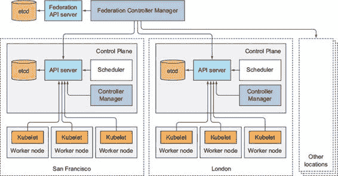
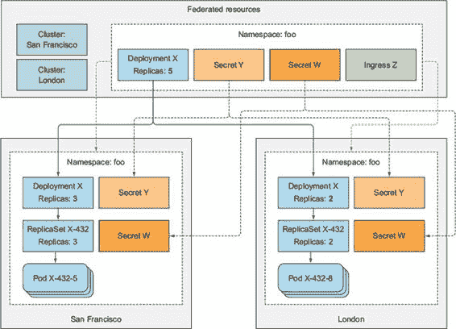

附录 D. 集群联邦

在第十一章关于高可用性的部分中，我们探讨了 Kubernetes 如何处理单个机器甚至整个服务器机架或支持基础设施的故障。但整个数据中心如果出现故障怎么办呢？

为了确保您不会受到数据中心级故障的影响，应用应该部署在多个数据中心或云可用区。当其中一个数据中心或可用区不可用时，客户端请求可以被路由到剩余健康的数据中心或区域中运行的应用。

虽然 Kubernetes 不要求您在同一个数据中心运行控制平面和节点，但您几乎总是想这样做，以保持它们之间的网络延迟低，并减少它们彼此断开连接的可能性。而不是有一个跨多个位置的单一集群，更好的选择是在每个位置都有一个独立的 Kubernetes 集群。我们将在此附录中探讨这种方法。

D.1\. 介绍 Kubernetes 集群联邦

Kubernetes 允许您通过集群联邦将多个集群组合成一个集群的集群。它允许用户在世界不同位置的多个集群中部署和管理应用，也可以跨不同云提供商与本地集群（混合云）结合。集群联邦的动机不仅是为了确保高可用性，而且是为了将多个异构集群合并成一个由单个管理界面管理的超级集群。

例如，通过将本地集群与运行在云提供商基础设施上的集群相结合，您可以在本地运行应用程序系统的隐私敏感组件，而无需敏感部分运行在云中。另一个例子是最初仅在小型本地集群中运行您的应用程序，但当应用程序的计算需求超过集群的容量时，允许应用程序溢出到基于云的集群，该集群在云提供商的基础设施上自动配置。

D.2\. 理解架构

让我们快速了解一下 Kubernetes 集群联邦是什么。集群的集群可以与一个常规集群相比较，其中不是节点，而是完整的集群。正如 Kubernetes 集群由控制平面和多个工作节点组成一样，联邦集群由联邦控制平面和多个 Kubernetes 集群组成。类似于 Kubernetes 控制平面如何管理一组工作节点上的应用，联邦控制平面做的是同样的事情，但跨一组集群而不是节点。

联邦控制平面由三部分组成：

+   etcd 用于存储联邦 API 对象

+   联邦 API 服务器

+   联邦控制器管理器

这与常规 Kubernetes 控制平面没有太大区别。etcd 存储联邦 API 对象，API 服务器是所有其他组件通信的 REST 端点，联邦控制器管理器运行各种基于您通过 API 服务器创建的 API 对象的操作执行的联邦控制器。

用户通过联邦 API 服务器创建联邦 API 对象（或联邦资源）。联邦控制器监视这些对象，然后与底层集群的 API 服务器通信以创建常规 Kubernetes 资源。联邦集群的架构如图 D.1 所示。

图 D.1\. 不同地理位置的集群联邦

D.3\. 理解联邦 API 对象

联邦 API 服务器允许您创建本书中提到的对象的联邦版本。

D.3.1\. 介绍 Kubernetes 资源的联邦版本

在撰写本文时，以下联邦资源得到支持：

+   命名空间

+   ConfigMaps 和 Secrets

+   服务和入口

+   部署、副本集、作业和守护进程集

+   HorizontalPodAutoscalers

注意

请查阅 Kubernetes 集群联邦文档，以获取支持的联邦资源的最新列表。

除了这些资源外，联邦 API 服务器还支持集群对象，该对象代表底层 Kubernetes 集群，就像节点对象代表常规 Kubernetes 集群中的工作节点一样。为了帮助您可视化联邦对象与底层集群中创建的对象之间的关系，请参阅图 D.2。

图 D.2\. 联邦资源与底层集群中常规资源之间的关系

D.3.2\. 理解联邦资源的作用

对于部分联邦对象，当您在联邦 API 服务器中创建对象时，运行在联邦控制器管理器中的控制器将在所有底层 Kubernetes 集群中创建常规集群范围资源，并管理它们，直到联邦对象被删除。

对于某些联邦资源类型，底层集群中创建的资源是联邦资源的精确副本；对于其他类型，它们是略微修改的版本，而某些联邦资源在底层集群中根本不会引起任何创建。副本与原始联邦版本保持同步。但同步是单向的，仅从联邦服务器到底层集群。如果您在底层集群中修改资源，更改将不会同步到联邦 API 服务器。

例如，如果您在联邦 API 服务器中创建一个命名空间，所有底层集群中都会创建一个具有相同名称的命名空间。如果您然后在那个命名空间内创建一个联邦 ConfigMap，所有底层集群中都会创建一个具有该确切名称和内容的 ConfigMap，位于相同的命名空间中。这也适用于 Secrets、Services 和 DaemonSets。

ReplicaSets 和 Deployments 是不同的。它们不会被盲目地复制到底层集群，因为这不是用户通常想要的。毕竟，如果您创建了一个期望副本数为 10 的 Deployment，您可能不希望每个底层集群都运行 10 个 Pod 副本。您希望总共有 10 个副本。因此，当您在 Deployment 或 ReplicaSet 中指定期望副本数时，联邦控制器会创建底层 Deployments/ReplicaSets，使得它们的期望副本数之和等于联邦 Deployment 或 ReplicaSet 中指定的期望副本数。默认情况下，副本会在集群之间均匀分布，但这可以被覆盖。

| |
| --- |

备注

目前，您需要单独连接到每个集群的 API 服务器，以获取在该集群中运行的 Pod 列表。您无法通过联邦 API 服务器列出所有集群的 Pod。

| |
| --- |

另一方面，联邦 Ingress 资源不会在底层集群中创建任何 Ingress 对象。您可能还记得第五章，Ingress 代表外部客户端访问服务的单个入口点。因此，联邦 Ingress 资源创建了一个全局的、跨所有底层集群的服务的多集群入口点。

| |
| --- |

备注

对于常规的 Ingress，需要联邦 Ingress 控制器来实现这一点。

| |
| --- |

设置联邦 Kubernetes 集群超出了本书的范围，因此您可以通过参考 Kubernetes 在线文档中的用户和管理指南中的集群联邦部分来了解更多关于该主题的信息，[`kubernetes.io/docs/`](http://kubernetes.io/docs/)。
