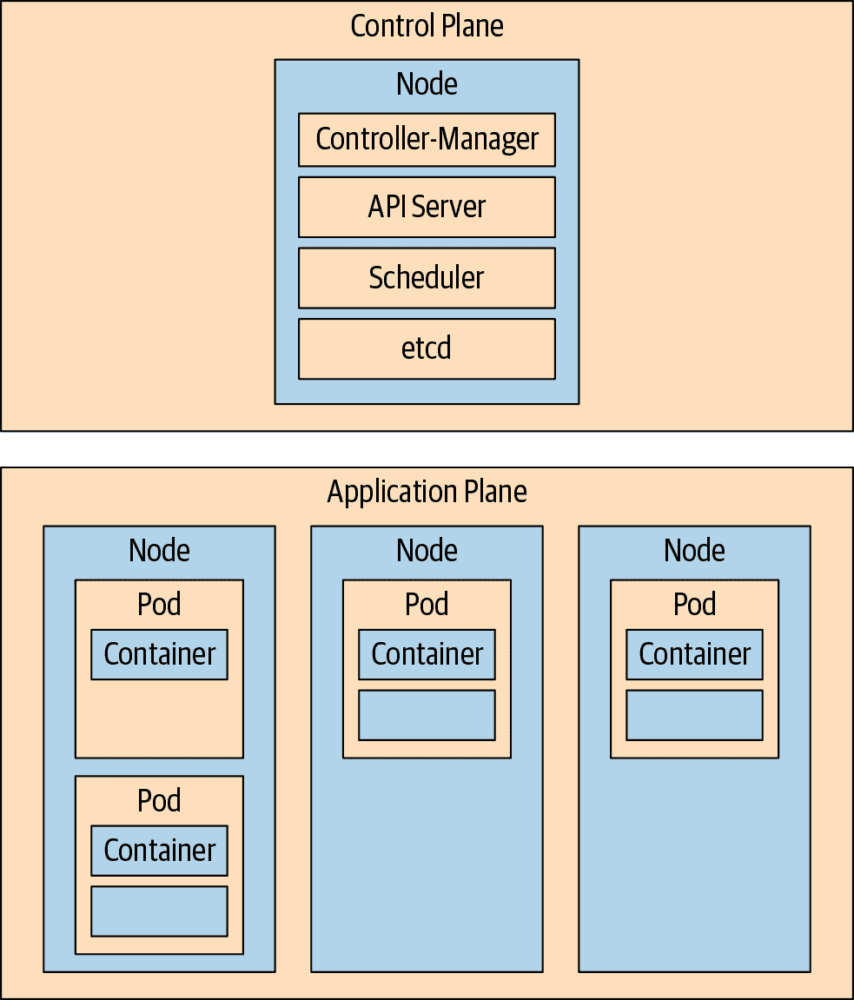
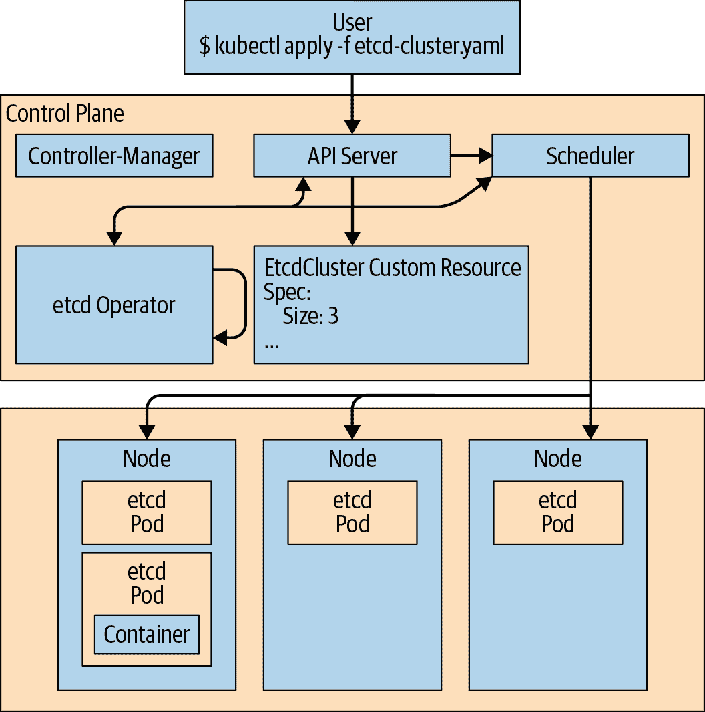

# 第一章：操作员教 Kubernetes 新技巧

操作员是打包、运行和维护 Kubernetes 应用程序的一种方式。Kubernetes 应用程序不仅部署在 Kubernetes 上，还设计为与 Kubernetes 的设施和工具协同使用和运行。

操作员建立在 Kubernetes 抽象之上，自动化管理它所管理的软件的整个生命周期。因为它们扩展了 Kubernetes，操作员在一个庞大且不断增长的社区中提供应用程序特定的自动化。对于应用程序程序员来说，操作员使得部署和运行其应用程序所依赖的基础服务变得更容易。对于基础设施工程师和供应商来说，操作员提供了在 Kubernetes 集群上分发软件的一致方法，并通过在报警器响起之前识别和修正应用程序问题来减少支持负担。

在我们开始描述操作员如何完成这些工作之前，让我们定义一些 Kubernetes 术语，以提供上下文和共享语言，描述操作员的概念和组件。

# Kubernetes 的工作原理

Kubernetes 自动化状态无关应用程序（如静态 Web 服务器）的生命周期。没有状态，应用程序的任何实例都是可互换的。这个简单的 Web 服务器检索文件并将它们发送到访客的浏览器上。因为服务器不跟踪状态或存储任何输入或数据，当一个服务器实例失败时，Kubernetes 可以用另一个替换它。Kubernetes 将这些实例称为集群中运行的应用程序副本的每个副本。

Kubernetes 集群是一组计算机，称为 *节点*。所有集群工作在一个、一些或所有集群节点上运行。工作的基本单位和复制单位是 *Pod*。Pod 是一组一个或多个 Linux 容器，具有共享网络、存储和访问共享内存等资源。

###### 注意

[Kubernetes Pod 文档](https://oreil.ly/ziz5q) 是了解 Pod 抽象更多信息的好起点。

从高层次来看，Kubernetes 集群可以分为两个平面。*控制平面* 简单来说就是 Kubernetes 本身。一组 Pod 组成了控制平面，并实现了 Kubernetes 应用程序编程接口（API）和集群编排逻辑。

*应用平面* 或 *数据平面* 是其他所有的内容。这是应用 Pod 运行的节点组。通常有一个或多个节点专门用于运行应用程序，而有一个或多个节点通常被隔离出来，仅用于运行控制平面 Pod。与应用 Pod 一样，控制平面组件的多个副本可以在多个控制器节点上运行，以提供冗余性。

控制平面的*控制器*实现控制循环，不断比较集群的期望状态与实际状态。当两者不一致时，控制器会采取行动使它们匹配。Operator 扩展了这种行为。图 1-1 中的示意图展示了主要的控制平面组件，工作节点上运行应用工作负载。

尽管控制平面和应用平面之间的严格分隔是一种便捷的心理模型和部署 Kubernetes 集群的常见方式，但控制平面组件是运行在节点上的一组 Pod，就像任何其他应用程序一样。在小集群中，控制平面组件通常与应用工作负载共享同一或两个节点。

被隔离的控制平面的概念模型也并非如此整洁。例如，运行在每个节点上的 kubelet 代理就是控制平面的一部分。同样，Operator 是一种控制器类型，通常被视为控制平面组件。然而，Operator 可能会模糊这两个平面之间的明确边界。将控制和应用平面视为孤立的域是一种有用的简化抽象，而非绝对真理。



###### 图 1-1\. Kubernetes 控制平面和工作节点

# 示例：无状态 Web 服务器

由于您尚未设置集群，本章节的示例更像是终端摘录的“屏幕截图”，显示了 Kubernetes 与应用程序之间的基本交互。不要期望像在本书的其余部分一样执行这些命令。在这个第一个示例中，Kubernetes 管理一个相对简单的应用程序，并且没有涉及 Operator。

考虑一个运行单个无状态静态 Web 服务器副本的集群：

```
$ kubectl get pods>
NAME                        READY     STATUS    RESTARTS   AGE

staticweb-69ccd6d6c-9mr8l   1/1       Running   0          23s

```

在声明应有三个副本后，集群的实际状态与期望状态不同，Kubernetes 启动了两个新的 Web 服务器实例来调和二者，扩展 Web 服务器部署：

```
$ kubectl scale deployment staticweb --replicas=3
$ kubectl get pods
NAME                        READY   STATUS    RESTARTS   AGE
staticweb-69ccd6d6c-4tdhk   1/1     Running   0          6s
staticweb-69ccd6d6c-9mr8l   1/1     Running   0          100s
staticweb-69ccd6d6c-m9qc7   1/1     Running   0          6s

```

删除其中一个 Web 服务器 Pod 将触发控制平面中的工作，以恢复三个副本的期望状态。Kubernetes 启动一个新的 Pod 来替换已删除的 Pod。在本节中，替换的 Pod 显示为`STATUS`为`ContainerCreating`：

```
$ kubectl delete pod staticweb-69ccd6d6c-9mr8l
$ kubectl get pods
NAME                        READY   STATUS                RESTARTS   AGE
staticweb-69ccd6d6c-4tdhk   1/1     Running               0          2m8s
staticweb-69ccd6d6c-bk27p   0/1     ContainerCreating     0          14s
staticweb-69ccd6d6c-m9qc7   1/1     Running               0          2m8s

```

这个静态站点的 Web 服务器可以与任何其他副本互换，或者与替换副本之一的新 Pod 互换。它不会以任何方式存储数据或维护状态。Kubernetes 不需要做任何特殊安排来替换失败的 Pod，或者通过添加或删除服务器的副本来扩展应用程序。

# 状态固态难

大多数应用程序都有状态。它们还有启动细节、组件相互依赖和配置的特定内容。它们通常有自己对“集群”含义的理解。它们需要可靠地存储关键且有时是庞大的数据。这些只是现实世界中应用程序必须维护状态的三个方面之一。理想情况下，可以通过统一的机制管理这些应用程序，同时自动化它们复杂的存储、网络和集群连接需求。

Kubernetes 不能同时了解每个有状态、复杂且集群化的应用程序的所有细节，同时保持通用、适应性和简单性。它的目标是提供一组灵活的抽象，涵盖调度、复制和故障转移自动化的基本应用程序概念，同时为更高级或特定于应用程序的操作提供清晰的扩展机制。Kubernetes 本身不应该也不会知道例如 PostgreSQL 数据库集群的配置值，以及其安排的成员和有状态的持久存储。

# 操作员是软件 SRE

站点可靠性工程（SRE）是运行大型系统的一组模式和原则。起源于 Google，SRE 对行业实践产生了显著影响。实践者必须解释并应用 SRE 理念到特定的情况中，但其关键原则之一是通过编写软件来运行您的软件来自动化系统管理。从机械性维护工作中解放出来的团队有更多时间创建新功能、修复错误并总体改进其产品。

操作员类似于应用程序的自动化站点可靠性工程师。它将一个专家管理员的技能编码到软件中。例如，操作员可以管理一个数据库服务器集群。它了解配置和管理应用程序的详细信息，并且可以安装声明的软件版本和成员数量的数据库集群。操作员在应用程序运行时继续监视其运行状态，可以备份数据、从故障中恢复，并自动随时间升级应用程序。集群用户使用`kubectl`和其他标准工具与操作员和它们管理的应用程序一起工作，因为操作员扩展了 Kubernetes 的功能。

# 操作员的工作原理

操作员通过扩展 Kubernetes 控制平面和 API 来工作。在其最简单的形式中，操作员向 Kubernetes API 添加一个称为*自定义资源*（CR）的端点，以及一个监视和维护新类型资源的控制平面组件。然后，操作员可以根据资源的状态采取行动。这在图 1-2 中有所说明。



###### 图 1-2\. 操作员是监视自定义资源的自定义控制器

## Kubernetes CRs

CR 是 Kubernetes 中的 API 扩展机制。*自定义资源定义*（CRD）定义了一个 CR；它类似于 CR 数据的模式。与官方 API 的成员不同，给定的 CRD 不会存在于每个 Kubernetes 集群中。CRD 扩展了它们定义的特定集群的 API。CR 为读写结构化数据提供端点。集群用户可以像处理其他 API 资源一样使用 `kubectl` 或其他 Kubernetes 客户端与 CR 交互。

# 如何创建操作员

Kubernetes 将一组资源与实际情况进行比较；即集群的运行状态。它采取行动使实际情况与这些资源描述的期望状态匹配。操作员将此模式扩展到特定集群上的特定应用程序。操作员是一个自定义 Kubernetes 控制器，监视一个 CR 类型，并采取特定应用程序的操作，以使实际情况与该资源中的 `spec` 匹配。

制作一个操作员意味着创建一个 CRD 并提供一个在循环中运行的程序，监视该类 CR。操作员对 CR 中的更改作出响应的方式取决于操作员管理的应用程序。操作员执行的操作几乎可以是任何事情：扩展复杂应用程序，应用程序版本升级，甚至管理具有专用硬件的计算集群节点的内核模块。

# 示例：etcd 操作员

etcd 是一个分布式键值存储。换句话说，它是一种轻量级数据库集群。etcd 集群通常需要一个熟练的管理员来管理。etcd 管理员必须知道如何：

+   加入新节点到 etcd 集群，包括配置其端点，建立与持久存储的连接，并让现有成员知道它。

+   备份 etcd 集群数据和配置。

+   将 etcd 集群升级到新的 etcd 版本。

etcd 操作员知道如何执行这些任务。操作员了解其应用程序的内部状态，并定期采取行动，以使该状态与一个或多个自定义资源规范中表达的期望状态保持一致。

与前面的示例类似，接下来的 shell 摘录仅作说明，如果没有事先设置，您将无法执行它们。您将在 第二章 中进行设置并运行操作员。

## 缺失成员的案例

由于 etcd 操作员了解 etcd 的状态，它可以像 Kubernetes 在前面示例中替换已删除的无状态 Web 服务器 pod 一样从 etcd 集群成员的故障中恢复。假设由 etcd 操作员管理的三节点 etcd 集群本身和 etcd 集群成员都作为 pod 运行：

```
$ kubectl get pods
NAME                              READY     STATUS    RESTARTS   AGE
etcd-operator-6f44498865-lv7b9    1/1       Running   0          1h
example-etcd-cluster-cpnwr62qgl   1/1       Running   0          1h
example-etcd-cluster-fff78tmpxr   1/1       Running   0          1h
example-etcd-cluster-lrlk7xwb2k   1/1       Running   0          1h

```

删除一个 etcd Pod 将触发一次协调过程，而 etcd Operator 知道如何恢复到三个副本的所需状态——这是 Kubernetes 单独无法完成的。但与无状态 Web 服务器的空白重启不同，Operator 必须安排新的 etcd Pod 的集群成员身份，配置它以适应现有的端点，并与其余的 etcd 成员建立连接：

```
$ kubectl delete pod example-etcd-cluster-cpnwr62qgl
$ kubectl get pods
NAME                              READY     STATUS            RESTARTS  AGE
etcd-operator-6f44498865-lv7b9    1/1       Running           0         1h
example-etcd-cluster-fff78tmpxr   1/1       Running           0         1h
example-etcd-cluster-lrlk7xwb2k   1/1       Running           0         1h
example-etcd-cluster-r6cb8g2qqw   0/1       PodInitializing   0         4s  

```


替换的 Pod 处于`PodInitializing`状态。

在 Operator 修复 etcd 集群时，etcd API 仍然对客户端可用。在第二章中，您将部署 etcd Operator 并使用 etcd API 来读取和写入数据。现在值得记住的是，向运行中的 etcd 集群添加成员并不像只运行新的 etcd Pod 那样简单，而 etcd Operator 隐藏了这种复杂性并自动修复 etcd 集群。

# Operator 适合谁？

Operator 模式是为了响应基础设施工程师和开发人员希望扩展 Kubernetes 以提供特定于其站点和软件的功能而出现的。Operators 使集群管理员能够更轻松地启用，并使开发人员能够使用像数据库和存储系统这样的基础软件组件，减少管理开销。例如，如果“killernewdb”数据库服务器适合您的应用程序的后端，并且有一个 Operator 来管理它，您可以部署 killernewdb 而无需成为专家级的 killernewdb DBA。

应用程序开发人员构建 Operators 来管理他们正在交付的应用程序，简化其客户的 Kubernetes 集群上的部署和管理体验。基础设施工程师创建 Operators 来控制已部署的服务和系统。

## Operator 采用

许多开发人员和公司已经采用了 Operator 模式，并且已经有许多 Operators 可用，使得作为应用程序组件使用关键服务更加容易。例如，CrunchyData 开发了一个管理 PostgreSQL 数据库集群的 Operator。还有流行的 MongoDB 和 Redis 的 Operators。Rook 管理在 Kubernetes 集群上的 Ceph 存储，而其他 Operators 则提供对外部存储服务（如 Amazon S3）的集群内管理。

此外，基于 Kubernetes 的发行版，如 Red Hat 的 OpenShift，使用 Operators 在 Kubernetes 核心之上构建功能，以确保 OpenShift Web 控制台可用且最新。例如，在用户端，OpenShift 已添加了在 Web 控制台中进行点-and-click Operator 安装和使用的机制，并为 Operator 开发人员提供了与[OperatorHub.io](https://operatorhub.io)集成的方法，详见第八章和第十章。

# 让我们开始吧！

运营商需要一个 Kubernetes 集群来运行。在下一章中，我们将向您展示几种获取集群访问权限的方式，无论是在笔记本电脑上的本地虚拟 Kubernetes，还是在某些节点上的完整安装，或者是外部服务。一旦您具有 Kubernetes 集群的管理员访问权限，您将部署 etcd Operator 并查看它如何代表您管理 etcd 集群。
