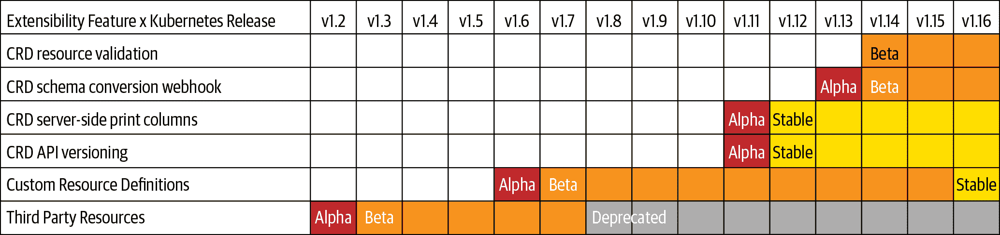

# 第二章：运行运算符

在本章的第一节中，我们概述了运行本书示例的要求，并提供建议，说明如何建立符合这些要求的 Kubernetes 集群访问权限。在第二节中，您将使用该集群安装和使用运算符，了解运算符的功能。

到最后，您将拥有一个 Kubernetes 集群作为运算符测试基地，并且将知道如何从一组清单中在其上部署现有的运算符。您还将看到一个运算符在面对变化和故障时管理其应用程序特定内部状态的示例，这将增强您对运算符架构和后续章节中介绍的构建工具的理解。

# 设置运算符实验室

要在以下章节中构建、测试和运行运算符，您需要`cluster-admin`访问权限，访问运行 Kubernetes 版本 v1.11.0 或更高版本的集群。如果您已经满足这些要求，可以直接跳到下一节。在本节中，我们为需要设置 Kubernetes 集群或需要运算符开发和测试的本地环境的读者提供一般建议。

## 集群版本要求

我们已经测试了本书中的示例，涵盖 Kubernetes 版本 v1.11 到 v1.16。当我们检查的任何功能或操作需要比 v1.11 更高版本时，我们将声明。

### 控制平面的可扩展性

Kubernetes 1.2 版本引入了 API 扩展机制，被称为*第三方资源*（TPR），基本形式是图 2-1 中所示。自那时起，构建运算符的组件已经多样化和成熟化。CRD 在 Kubernetes 1.7 版本中正式化。



###### 图 2-1\. Kubernetes 发布的可扩展性功能

正如您在第一章中所看到的，CRD 是特定集群 Kubernetes API 中新的、特定站点资源（或 API 端点）的定义。CRD 是运算符模式的两个基本构建块之一：一个自定义控制器管理 CR。

## 授权要求

由于运算符扩展了 Kubernetes 本身，您需要拥有特权的、整个集群范围的 Kubernetes 访问权限来部署它们，例如常见的`cluster-admin`集群角色。

###### 注意

较低权限的用户可以使用运算符管理的服务和应用程序——“操作数”。

尽管在生产环境中应配置更精细的 Kubernetes 基于角色的访问控制（RBAC），但完全控制您的集群意味着您可以立即部署 CRD 和运算符。随着您开发运算符及其管理的应用程序的角色、服务帐户和绑定，您还将有权声明更详细的 RBAC。

您可以询问 Kubernetes API 关于 `cluster-admin` 角色是否存在于您的集群中。以下 shell 摘录显示了如何使用`kubectl`的`describe`子命令获取角色的摘要：

```
$ `kubectl` `describe` `clusterrole` `cluster-admin`
Name:         cluster-admin  
Labels:       kubernetes.io/bootstrapping=rbac-defaults
PolicyRule:
  Resources  Non-Resource URLs  Resource Names  Verbs
  ---------  -----------------  --------------  -----
  *.*        []                 []              [*]
             [*]                []              [*]

```


RBAC `cluster-admin` ClusterRole：任何事情都可以。

## 标准工具和技术

运营商旨在使其管理的复杂应用程序成为 Kubernetes API 的一级公民。我们将在后续章节的示例中展示这意味着什么。在此阶段，这意味着部署和与集群上的基本运营商交互的唯一要求是使用最新版本的命令行 Kubernetes API 工具`kubectl`。

需要安装或更新`kubectl`的读者应参考[当前的 kubectl 文档](https://oreil.ly/ke6KM)。

###### 注意

使用 Red Hat OpenShift Kubernetes 分发的用户（如下所述），可以选择（并可以互换地）使用`oc` OpenShift API 实用程序代替`kubectl`。

## 建议的集群配置

在你可以部署运营商的 Kubernetes 集群中，有许多方法。如前所述，如果你已经在运行最新的 Kubernetes 版本，则可以跳过这些建议，直接进入“运行一个简单的运营商”。如果没有，我们已经测试了本节描述的 Kubernetes 打包或分发版本，足以支持本书中的练习。

### Minikube

[Minikube v1.5.2](https://oreil.ly/dBPzK) 部署 Kubernetes v1.16.2。它在您本地系统的虚拟机（VM）上运行单节点 Kubernetes 集群的超级处理器。默认情况下，Minikube 期望使用 VirtualBox，因为其广泛可用，但通过几个额外步骤，它也可以使用您平台的本机超级处理器，如 Linux 上的 KVM，Windows 上的 Hyper-V，或 macOS 上的 HyperKit 和 Hypervisor.framework。我们在这里避免详细的安装说明，因为这些最好留给[Minikube 文档](https://oreil.ly/eRZpQ)。我们已经通过 Minikube 最彻底地测试了本书中的示例，并且基于便利性和成本的考虑，我们建议您使用类似的本地环境，如 CodeReady Containers（请参阅下一节），或者使用[Kubernetes in Docker (kind)](https://oreil.ly/2y6PD)。

### Red Hat OpenShift

OpenShift 是 Red Hat 的 Kubernetes 发行版。您可以在 OpenShift 上进行与等效核心版本的 Kubernetes 相同的操作。（OpenShift 还内置了一些基于 Kubernetes 的特定功能，但这超出了本书的范围。）OpenShift 版本 4 提供了一个全功能的 Kubernetes 发行版，它本身使用 Operators 进行设计、交付和管理。它是一个“自托管”的 Kubernetes，能够在不影响托管工作负载的情况下执行原地平台升级。OpenShift 包括 Operator 生命周期管理器，详见第四章，以及一个操作员目录分发机制的图形界面。

您可以通过访问 Red Hat 的免费试用许可证，部署完整的 OpenShift v4 集群到 Amazon Web Services（AWS）、Microsoft Azure 或 Google Cloud Platform，网址为[*https://try.openshift.com*](https://try.openshift.com)。

###### 提示

要在您的笔记本上运行 OpenShift，请查看 Minikube 的等效工具，[Red Hat CodeReady Containers](https://github.com/code-ready/crc)。

## 检查您的集群版本

通过运行`kubectl version`命令验证您的集群是否运行在 Kubernetes v1.11 或更高版本。该命令将为您的`kubectl`二进制文件返回一个 API 版本字符串，并为其连接的集群返回第二个版本字符串：

```
$ kubectl version
Client Version: version.Info{Major:"1", Minor:"16", GitVersion:"v1.16.2",
GitCommit:"c97fe5036ef3df2967d086711e6c0c405941e14b", GitTreeState:"clean",
BuildDate:"2019-10-15T19:18:23Z", GoVersion:"go1.12.10", Compiler:"gc",
Platform:"darwin/amd64"}
Server Version: version.Info{Major:"1", Minor:"16", GitVersion:"v1.16.2",
GitCommit:"c97fe5036ef3df2967d086711e6c0c405941e14b", GitTreeState:"clean",
BuildDate:"2019-10-15T19:09:08Z", GoVersion:"go1.12.10", Compiler:"gc",
Platform:"linux/amd64"}

```

在上述输出中，客户端和服务器均运行 Kubernetes 版本 1.16.2。虽然[a `kubectl`客户端在服务器上的一次更新之后应该能正常工作](https://oreil.ly/I7K1e)，为简单起见，确保您的客户端和服务器次要版本匹配。如果您有 v1.11 或更高版本，则可以开始尝试使用 Operators。

# 运行一个简单的 Operator

一旦验证您具有兼容版本的 Kubernetes 集群的特权访问权限，您就可以部署一个 Operator 并查看 Operators 的功能。稍后，您将再次看到相同过程的框架，当您部署和测试构建的 Operator 时。etcd Operator 通过简单的自动化恢复和升级展示了 Kubernetes Operators 的原理和目标。

## 一个常见的起点

[etcd](https://github.com/coreos/etcd)是一个分布式键值存储，起源于 CoreOS，现在由 Cloud Native Computing Foundation 管理。它是 Kubernetes 核心下的基础数据存储，并且是几个分布式应用程序的关键部分。etcd 通过实现一种称为[Raft](https://raft.github.io/)的协议来提供可靠的存储，保证了多数成员之间的一致性。

etcd 操作员通常作为操作员模式的价值和机制的“Hello World”示例，我们在这里遵循这一传统。我们之所以回到它，是因为展示 etcd 的最基本用法并不难，但 etcd 集群的设置和管理需要精通特定应用程序知识的操作员。要使用 etcd，您可以通过名称*put*键和值，并通过名称*get*它们。创建一个可靠的最小三个或更多节点的 etcd 集群需要配置端点、认证和其他通常留给 etcd 专家（或其自定义 shell 脚本集合）的问题。随着时间的推移保持 etcd 的运行和升级需要持续的管理。etcd 操作员知道如何做到这一点。

在接下来的章节中，您将部署 etcd 操作员，然后让它根据您的规范创建 etcd 集群。您将让操作员从故障中恢复并执行版本升级，同时 etcd API 继续服务读写请求，展示了操作员如何自动化基础软件的生命周期。

###### 注意

您可以在运行的 OpenShift 集群上无需任何设置即可按照[OpenShift 学习门户](https://oreil.ly/j-xKh)上的示例进行操作。

## 获取 etcd 操作员清单

本书为每章的示例代码提供了一个[伴随的 Git 仓库](https://github.com/kubernetes-operators-book/chapters.git)。获取*chapters*仓库并切换到第三章的示例目录，如下所示：

```
$ `git` `clone` `https://github.com/kubernetes-operators-book/chapters.git`
$ `cd` `chapters/ch03`

```

## CRs：自定义 API 端点

与 Kubernetes 中的几乎所有内容一样，YAML 清单描述了 CRD。CR 是 Kubernetes API 中的命名端点。名为`etcdclusters.etcd.database.coreos.com`的 CRD 表示新的端点类型。

### 创建 CRD

CRD 定义了 CR 实例内的类型和值。此示例定义了新的*kind*资源类型，即 EtcdCluster。

使用`cat`、`less`或您喜欢的分页程序阅读名为*etcd-operator-crd.yaml*的文件。您将看到类似以下内容的 YAML，该 YAML 指定了 EtcdCluster CRD 的规范：

```
apiVersion: apiextensions.k8s.io/v1beta1
kind: CustomResourceDefinition
metadata:
  name: etcdclusters.etcd.database.coreos.com
spec:
  group: etcd.database.coreos.com
  names:
    kind: EtcdCluster
    listKind: EtcdClusterList
    plural: etcdclusters
    shortNames:
    - etcdclus
    - etcd
    singular: etcdcluster
  scope: Namespaced
  versions:
  - name: v1beta2
    served: true
    storage: true
```

CRD 定义了 Kubernetes API 应如何引用此新资源。在这里也定义了缩写的昵称，以帮助您在`kubectl`中少打一些字。

在您的集群上创建 CRD：

```
$ `kubectl` `create` `-f` `etcd-operator-crd.yaml`

```

一次快速检查显示新的 CRD，`etcdclusters.etcd.database.coreos.com`：

```
$ `kubectl` `get` `crd`
NAME                                    CREATED AT
etcdclusters.etcd.database.coreos.com   2019-11-15T02:50:14Z

```

###### 注意

CR 的组、版本和类型共同形成 Kubernetes 资源类型的完全限定名称。该规范名称在整个集群中必须是唯一的。您创建的 CRD 代表了`etcd.database.coreos.com`组的`v1beta2`版本和`EtcdCluster`类型的资源。

## 我是谁：定义操作员服务账户

在第三章中，我们概述了 Kubernetes 授权并定义了服务账户、角色和其他授权概念。目前，我们只想初步了解服务账户的基本声明及其运行 etcd 操作员所需的能力。

文件 *etcd-operator-sa.yaml* 定义了服务账户：

```
apiVersion: v1
kind: ServiceAccount
metadata:
  name: etcd-operator-sa
```

使用 `kubectl create` 创建服务账户：

```
$ `kubectl` `create` `-f` `etcd-operator-sa.yaml`
serviceaccount/etcd-operator-sa created

```

如果你检查集群服务账户列表，你会看到它出现了：

```
$ kubectl get serviceaccounts
NAME               SECRETS   AGE
builder            2         2h
default            3         2h
deployer           2         2h
etcd-operator-sa   `2`         3s
[...]

```

### 角色

管理服务账户的角色定义在名为 *etcd-operator-role.yaml* 的文件中。我们将详细讨论 RBAC 留在后面的章节和附录 C 中，但角色清单中的关键项目是非常明显的。我们给角色一个名称，以便我们可以在其他地方引用它：`etcd-operator-role`。YAML 继续列出角色可能使用的资源类型以及它们可以做的事情，也就是说，它可以说的`动词`：

```
apiVersion: rbac.authorization.k8s.io/v1
kind: Role
metadata:
  name: etcd-operator-role
rules:
- apiGroups:
  - etcd.database.coreos.com
  resources:
  - etcdclusters
  - etcdbackups
  - etcdrestores
  verbs:
  - '*'
- apiGroups:
  - ""
  resources:
  - pods
  - services
  - endpoints
  - persistentvolumeclaims
  - events
  verbs:
  - '*'
- apiGroups:
  - apps
  resources:
  - deployments
  verbs:
  - '*'
- apiGroups:
  - ""
  resources:
  - secrets
  verbs:
  - get
```

如同服务账户一样，用 `kubectl` 创建角色：

```
$ `kubectl` `create` `-f` `etcd-operator-role.yaml`
role.rbac.authorization.k8s.io/etcd-operator-role created

```

### 角色绑定

最后一部分 RBAC 配置，RoleBinding，将角色分配给 etcd 操作员的服务账户。它声明在文件 *etcd-operator-rolebinding.yaml* 中：

```
apiVersion: rbac.authorization.k8s.io/v1
kind: RoleBinding
metadata:
  name: etcd-operator-rolebinding
roleRef:
  apiGroup: rbac.authorization.k8s.io
  kind: Role
  name: etcd-operator-role
subjects:
- kind: ServiceAccount
  name: etcd-operator-sa
  namespace: default
```

注意最后一行。如果你在一个全新的 OpenShift 集群上，比如由 CodeReady Containers 提供的，默认情况下你的 `kubectl` 或 `oc` 命令将在命名空间 `myproject` 中运行。如果你在一个类似未配置的 Kubernetes 集群上，你的上下文默认通常会是命名空间 `default`。无论你在哪里，在这个 RoleBinding 中的 `namespace` 值必须与你正在工作的集群上的命名空间匹配。

现在创建绑定：

```
$ `kubectl` `create` `-f` `etcd-operator-rolebinding.yaml`
rolebinding.rbac.authorization.k8s.io/etcd-operator-rolebinding created

```

## 部署 etcd 操作员

操作员是一个自定义控制器，运行在一个 pod 中，并监视你之前定义的 EtcdCluster CR。清单文件 *etcd-operator-deployment.yaml* 概述了操作员 pod 的规格，包括你正在部署的操作员的容器镜像。注意，它没有定义 etcd 集群的规格。一旦操作员运行起来，你将在一个 CR 中描述想要的 etcd 集群给部署的 etcd 操作员：

```
apiVersion: extensions/v1beta1
kind: Deployment
metadata:
  labels:
    name: etcdoperator
  name: etcd-operator
spec:
  replicas: 1
  selector:
      name: etcd-operator
  template:
        name: etcd-operator
    spec:
      containers:
      - name: etcd-operator
        image: quay.io/coreos/etcd-operator:v0.9.4
        command:
        - etcd-operator
        - --create-crd=false
        [...]
        imagePullPolicy: IfNotPresent
      serviceAccountName: etcd-operator-sa
```

部署为你的操作员提供标签和名称。这里需要注意的一些关键项是在此部署的 pod 中运行的容器镜像 `etcd-operator:v0.9.4`，以及部署的资源应该使用的服务账户来访问集群的 Kubernetes API。`etcd-operator` 部署使用为其创建的 `etcd-operator-sa` 服务账户。

和往常一样，你可以从清单在集群上创建这个资源：

```
$ kubectl create -f etcd-operator-deployment.yaml
deployment.apps/etcd-operator created
$ kubectl get deployments
NAME            DESIRED   CURRENT   UP-TO-DATE   AVAILABLE   AGE
etcd-operator   1         1         1            1           19s

```

etcd 操作员本身是在该部署中运行的一个 pod。在这里，你可以看到它正在启动：

```
$ kubectl get pods
NAME                             READY     STATUS              RESTARTS   AGE
etcd-operator-594fbd565f-4fm8k   0/1       ContainerCreating   0          4s

```

## 声明一个 etcd 集群

早些时候，您创建了一个 CRD 来定义一种新的资源类型，即 EtcdCluster。现在您有一个监视 EtcdCluster 资源的 Operator，您可以声明一个具有所需状态的 EtcdCluster。为此，请提供 Operator 识别的两个`spec`元素：`size`，etcd 集群成员的数量，和每个成员应运行的 etcd`version`。

您可以在名为*etcd-cluster-cr.yaml*的文件中看到`spec`部分：

```
apiVersion: etcd.database.coreos.com/v1beta2
kind: EtcdCluster
metadata:
  name: example-etcd-cluster
spec:
  size: 3
  version: 3.1.10
```

这份简短的清单声明了三个集群成员的期望状态，每个成员运行的是 etcd 服务器的 3.1.10 版本。使用熟悉的`kubectl`语法创建这个 etcd 集群：

```
$ kubectl create -f etcd-cluster-cr.yaml
etcdcluster.etcd.database.coreos.com/example-etcd-cluster created
$ kubectl get pods -w
NAME                              READY   STATUS      RESTARTS   AGE
etcd-operator-594fbd565f-4fm8k    1/1     Running     0           3m
example-etcd-cluster-95gqrthjbz   1/1     Running     2           38s
example-etcd-cluster-m9ftnsk572   1/1     Running     0           34s
example-etcd-cluster-pjqhm8d4qj   1/1     Running     0           31s

```

此示例 etcd 集群是您集群 API 中的一级资源，即`EtcdCluster`。由于它是一个 API 资源，您可以直接从 Kubernetes 获取 etcd 集群的规范和状态。尝试`kubectl describe`以报告您的 etcd 集群的大小、etcd 版本和状态，如下所示：

```
$ `kubectl` `describe` `etcdcluster/example-etcd-cluster`
Name:         example-etcd-cluster
Namespace:    default
API Version:  etcd.database.coreos.com/v1beta2
Kind:         EtcdCluster
[...]
Spec:
  Repository:  quay.io/coreos/etcd
  Size:        3
  Version:     3.1.10
Status:
  Client Port:  2379
  Conditions:
    Last Transition Time:  2019-11-15T02:52:04Z
    Reason:                Cluster available
    Status:                True
    Type:                  Available
  Current Version:         3.1.10
  Members:
    Ready:
      example-etcd-cluster-6pq7qn82g2
      example-etcd-cluster-dbwt7kr8lw
      example-etcd-cluster-t85hs2hwzb
  Phase:           Running
  Service Name:    example-etcd-cluster-client

```

## 运行 etcd

您现在拥有一个运行中的 etcd 集群。etcd Operator 在 etcd 集群的命名空间中创建了一个 Kubernetes [*service*](https://oreil.ly/meXW_)。服务是客户端可以获取访问一组 Pod 的终结点，即使组成员可能会发生变化的地方。服务默认具有在集群中可见的 DNS 名称。操作员通过将`-client`附加到 CR 中定义的 etcd 集群名称来构造 etcd API 客户端使用的服务名称。在这里，客户端服务名为`example-etcd-cluster-client`，并且监听通常的 etcd 客户端 IP 端口 2379。kubectl 可以列出与 etcd 集群关联的服务：

```
$ `kubectl` `get` `services` `--selector` `etcd_cluster``=``example-etcd-cluster`
NAME                         TYPE       CLUSTER-IP    ... PORT(S)            AGE
example-etcd-cluster         ClusterIP  None          ... 2379/TCP,2380/TCP  21h
example-etcd-cluster-client  ClusterIP  10.96.46.231  ... 2379/TCP           21h

```

###### 注意

etcd Operator 创建的另一个服务`example-etcd-cluster`被 etcd 集群成员使用，而不是 etcd API 客户端。

您可以在集群上运行 etcd 客户端，并使用它连接到客户端服务，并与 etcd API 交互。以下命令将您置于 etcd 容器的 shell 中：

```
$ `kubectl` `run` `--rm` `-i` `--tty` `etcdctl` `--image` `quay.io/coreos/etcd` \
  `--restart``=``Never` `--` `/bin/sh`

```

从 etcd 容器的 shell 中，使用`etcdctl`的`put`和`get`动词在 etcd 中创建和读取键值对：

```
$ `export` `ETCDCTL_API``=``3`
$ `export` `ETCDCSVC``=``http://example-etcd-cluster-client:2379`
$ `etcdctl` `--endpoints` `$ETCDCSVC` `put` `foo` `bar`
$ `etcdctl` `--endpoints` `$ETCDCSVC` `get` `foo`
foo
bar

```

在您进行每项更改后，重复这些查询或在`etcdctl` shell 中运行新的`put`和`get`命令。您将看到 etcd Operator 在增长集群、替换成员和升级 etcd 版本时，etcd API 服务的持续可用性。

## 扩展 etcd 集群

您可以通过修改声明的`size`规范来扩展 etcd 集群。编辑*etcd-cluster-cr.yaml*文件，并将`size`从`3`更改为`4`个 etcd 成员。将更改应用于 EtcdCluster CR：

```
$ kubectl apply -f etcd-cluster-cr.yaml

```

检查运行中的 Pods 显示 Operator 正在向 etcd 集群添加新的 etcd 成员：

```
$ kubectl get pods
NAME                              READY   STATUS      RESTARTS   AGE
etcd-operator-594fbd565f-4fm8k    1/1     Running     1          16m
example-etcd-cluster-95gqrthjbz   1/1     Running     2          15m
example-etcd-cluster-m9ftnsk572   1/1     Running     0           15m
example-etcd-cluster-pjqhm8d4qj   1/1     Running     0           15m
example-etcd-cluster-w5l67llqq8   0/1     Init:0/1    0           3s

```

###### 提示

您还可以尝试使用`kubectl edit etcdcluster/example-etcd-cluster`进入编辑器，实时更改集群大小。

## 失败和自动恢复

你在 第一章 中看到 etcd Operator 替换失败的成员。在你现场看到之前，值得再次强调一下你必须手动处理这个问题的一般步骤。不像无状态程序，没有一个 etcd pod 是独立运行的。通常，人类 etcd “操作员” 必须注意到成员的失败，执行一个新副本，并提供配置使其能够加入剩余成员的 etcd 集群中。etcd Operator 理解 etcd 的内部状态并使恢复过程自动化。

### 从失败的 etcd 成员中恢复

运行 `kubectl get pods -l app=etc` 快速获取你的 etcd 集群中的 pod 列表。选择一个你不喜欢的，并告诉 Kubernetes 删除它：

```
$ kubectl delete pod example-etcd-cluster-95gqrthjbz
pod "example-etcd-cluster-95gqrthjbz" deleted

```

Operator 察觉到集群现实状态与期望状态之间的差异，并添加一个 etcd 成员以替换你删除的成员。当检索 pod 列表时，你可以在 `PodInitializing` 状态中看到新的 etcd 集群成员，如下所示：

```
$ kubectl get pods -w
NAME                              READY   STATUS            RESTARTS   AGE
etcd-operator-594fbd565f-4fm8k    1/1     Running           1         18m
example-etcd-cluster-m9ftnsk572   1/1     Running           0         17m
example-etcd-cluster-pjqhm8d4qj   1/1     Running           0         17m
example-etcd-cluster-r6cb8g2qqw   0/1     PodInitializing   0         31s

```

`-w` 开关告诉 `kubectl` “监视” pod 列表，并在列表的每次更改时通过标准输出打印更新。你可以按 Ctrl-C 停止监视并返回你的 shell 提示符。

你可以检查 `Events` 查看记录在 `example-etcd-cluster` CR 中的恢复操作：

```
$ `kubectl` `describe` `etcdcluster/example-etcd-cluster`
[...]
Events:
  Normal  Replacing Dead Member  4m    etcd-operator-589c65bd9f-hpkc6
    The dead member example-etcd-cluster-95gqrthjbz is being replaced
  Normal  Member Removed         4m    etcd-operator-589c65bd9f-hpkc6
    Existing member example-etcd-cluster-95gqrthjbz removed from the cluster
[...]

```

在恢复过程中，如果再次启动 etcd 客户端 pod，则可以向 etcd 集群发出请求，包括检查其总体健康状况：

```
$ kubectl run --rm -i --tty etcdctl --image quay.io/coreos/etcd \
  --restart=Never -- /bin/sh
If you don't see a command prompt, try pressing enter.
$ etcdctl --endpoints http://example-etcd-cluster-client:2379 cluster-health
member 5ee0dd47065a4f55 is healthy: got healthy result ...
member 70baca4290889c4a is healthy: got healthy result ...
member 76cd6c58798a7a4b is healthy: got healthy result ...
cluster is healthy
$ exit
pod "etcdctl" deleted

```

etcd Operator 在其复杂的有状态应用中从故障中恢复的方式与 Kubernetes 自动化处理无状态应用的恢复相同。这在概念上很简单，但在操作上非常强大。建立在这些概念之上，Operators 可以执行更高级的技巧，比如升级它们管理的软件。自动化升级可以通过确保事物保持最新状态，对安全性产生积极影响。当一个 Operator 在保持服务可用性的同时执行其应用程序的滚动升级时，更容易保持软件补丁更新到最新修复版本。

## 升级 etcd 集群

如果你已经是 etcd 的用户，可能会注意到我们指定了一个较旧的版本，3.1.10。我们创造了这个版本以便可以探索 etcd Operator 的升级技能。

### 以困难的方式升级

此时，你有一个运行版本为 3.1.10 的 etcd 集群。要升级到 etcd 3.2.13，你需要执行一系列步骤。由于本书讨论的是 Operators，而不是 etcd 管理，我们在这里概述了该过程，略去了网络和主机级别的考虑。手动升级的步骤如下：

1.  检查每个 etcd 节点的版本和健康状态。

1.  为灾难恢复创建集群状态的快照。

1.  停止一个 etcd 服务器。用 v3.2.13 二进制文件替换现有版本。启动新版本。

1.  在一个三个成员的集群中，至少还需重复两次。

欲知详细信息，请参阅 [etcd 升级文档](https://oreil.ly/II9Pn)。

### 简单的方法：让 Operator 完成

通过手动升级过程中的重复和易出错性感受到，将 etcd 特定知识编码到 etcd Operator 中更容易看到其威力。Operator 可以管理 etcd 版本，升级变成了在 EtcdCluster 资源中声明新的期望版本的事情。

### 触发 etcd 升级

通过查询某个 `etcd-cluster` pod 获取当前 etcd 容器镜像的版本，将输出进行过滤以查看版本：

```
$ kubectl get pod example-etcd-cluster-795649v9kq `\`
  -o yaml | grep `"image:"` | uniq
image: quay.io/coreos/etcd:v3.1.10
image: busybox:1.28.0-glibc

```

或者，既然您已向 Kubernetes API 添加了 EtcdCluster 资源，您可以通过使用 `kubectl describe` 直接总结 `example-etcd-cluster` 的 Operator 图像，就像您之前所做的那样：

```
$ `kubectl` `describe` `etcdcluster/example-etcd-cluster`

```

您会看到集群正在运行 etcd 版本 3.1.10，如文件 *etcd-cluster-cr.yaml* 和从中创建的 CR 所指定的。

编辑 `etcd-cluster-cr.yaml` 并将 `version` 规范从 `3.1.10` 更改为 `3.2.13`。然后将新的规范应用到集群中的资源：

```
$ `kubectl` `apply` `-f` `etcd-cluster-cr.yaml`

```

再次使用 `describe` 命令查看当前版本和目标版本，以及 `Events` 部分中成员升级通知：

```
$ `kubectl` `describe` `etcdcluster/example-etcd-cluster`
Name:         example-etcd-cluster
Namespace:    default
API Version:  etcd.database.coreos.com/v1beta2
Kind:         EtcdCluster
[...]
Status:
  Conditions:
    [...]
    Message:               upgrading to 3.2.13
    Reason:                Cluster upgrading
    Status:                True
    Type:                  Upgrading
  Current Version:         3.1.10
  [...]
  Size:            3
  Target Version:  3.2.13
Events:
  Type    Reason           Age  From                           ...
  ----    ------           ---  ----                           ---
  Normal  Member Upgraded  3s   etcd-operator-594fbd565f-4fm8k ...
  Normal  Member Upgraded  5s   etcd-operator-594fbd565f-4fm8k ...

```

### 升级升级

通过一些 `kubectl` 技巧，您可以直接通过 Kubernetes API 进行相同的编辑。这一次，让我们从 3.2.13 升级到此刻可用的最新的 etcd 小版本，版本为 3.3.12：

```
$ kubectl patch etcdcluster example-etcd-cluster --type='json' \
  -p `'[{"op": "replace", "path": "/spec/version", "value":3.3.12}]'`

```

请记住，您始终可以在 etcd 集群的 CR 清单中进行此更改，然后使用 `kubectl apply` 应用它，就像触发第一个升级时所做的那样。

连续的 `kubectl describe etcdcluster/example-etcd-cluster` 命令将显示从旧版本到目标版本的过渡，直到它成为当前版本，此时您将看到 `当前版本: 3.3.12`。`Events` 部分记录了每次升级：

```
  Normal  Member Upgraded   1m    etcd-operator-594fbd565f-4fm8k
    Member example-etcd-cluster-pjqhm8d4qj upgraded from 3.1.10 to 3.2.23
  Normal  Member Upgraded   27s   etcd-operator-594fbd565f-4fm8k
    Member example-etcd-cluster-r6cb8g2qqw upgraded from 3.2.23 to 3.3.12
```

## 清理

在继续之前，如果您删除了用于尝试 etcd Operator 的资源并操纵它们将会很有帮助。如下面的 shell 摘录所示，您可以使用用于创建它们的清单删除资源。首先确保您的当前工作目录是您之前克隆的 *chapters* Git 存储库中的 *ch03* 目录 (`cd chapters/ch03`)：

```
$ kubectl delete -f etcd-operator-sa.yaml
$ kubectl delete -f etcd-operator-role.yaml
$ kubectl delete -f etcd-operator-rolebinding.yaml
$ kubectl delete -f etcd-operator-crd.yaml
$ kubectl delete -f etcd-operator-deployment.yaml
$ kubectl delete -f etcd-cluster-cr.yaml
serviceaccount "etcd-operator-sa" deleted
role.rbac.authorization.k8s.io "etcd-operator-role" deleted
rolebinding.rbac.authorization.k8s.io "etcd-operator-rolebinding" deleted
customresourcedefinition.apiextensions.k8s.io \
  "etcdclusters.etcd.database.coreos.com" deleted
deployment.apps "etcd-operator" deleted
etcdcluster.etcd.database.coreos.com "example-etcd-cluster" deleted

```

# 摘要

我们在这里使用 `etcdctl` 工具的 etcd API，为了简单起见，但是一个应用程序使用相同的 API 请求与 etcd 交互，存储、检索和监视键和范围。etcd Operator 自动化了 etcd 集群部分，使得可靠的键值存储对更多应用程序可用。

Operator 变得更加复杂，管理各种关注点，正如您从应用程序特定扩展中所期望的那样。尽管如此，大多数 Operator 遵循在 etcd Operator 中可辨认的基本模式：CR 指定了某些期望的状态，如应用程序的版本，自定义控制器监视资源，在集群上维护期望的状态。

现在，您已经拥有一个用于处理运算符的 Kubernetes 集群。您已经看到如何部署运算符并触发其执行特定于应用程序的状态协调。接下来，我们将介绍运算符构建所依赖的 Kubernetes API 元素，然后介绍运算符框架和 SDK，这是您用来构建运算符的工具包。
