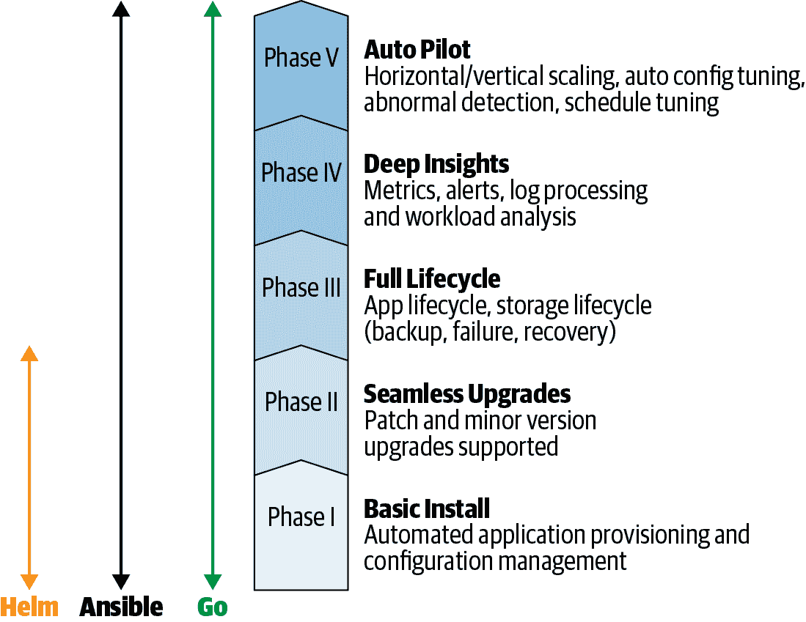

# 第四章：操作者框架

开发操作者以及管理其分发、部署和生命周期中存在不可避免的复杂性。Red Hat 操作者框架使创建和分发操作者变得更简单。它通过软件开发工具包（SDK）自动化了大部分重复的实现工作，使操作者构建更加容易。框架还提供了部署和管理操作者的机制。操作者生命周期管理器（OLM）是一个安装、管理和升级其他操作者的操作者。操作者计量是一个度量系统，用于记录操作者对集群资源的使用情况。本章概述了框架的这三个关键部分，以准备好使用这些工具来构建和分发一个示例操作者。在此过程中，您将安装 `operator-sdk` 命令行工具，这是 SDK 功能的主要接口。

# 操作者框架的起源

操作者 SDK 构建在 Kubernetes 的 [`controller-runtime`](https://oreil.ly/AM0TP) 之上，这是一组使用 Go 编程语言提供基本 Kubernetes 控制器例程的库。作为操作者框架的一部分，SDK 提供集成点用于通过 OLM 分发和管理操作者，并通过操作者计量对其进行衡量。SDK 和整个 Red Hat 操作者框架都是开源的，社区和其他组织的贡献者参与其中，并正在向供应商中立的 [Cloud Native Computing Foundation](https://www.cncf.io/) 捐赠过程中。

# 操作者成熟度模型

操作者成熟度模型，如 图 4-1 所示，描绘了一种思考不同操作者功能级别的方式。您可以从一个最小可行产品开始，安装其操作对象，然后添加生命周期管理和升级能力，随着时间的推移迭代，最终实现应用程序的完全自动化。



###### 图 4-1 操作者成熟度模型

一个操作者可以起源于不起眼的地方，并在一系列开发周期中不断发展复杂性。模型的第一阶段仅需要足够的特定于应用程序的代码来创建操作对象所需的任何资源。换句话说，第一阶段是应用程序的准备、自动化安装。

# 操作者 SDK

[Operator SDK](https://oreil.ly/IcfRf) 是一组用于搭建、构建和准备操作符进行部署的工具。SDK 目前主要支持使用 Go 编程语言构建操作符，并计划支持其他语言。SDK 还为[Helm](https://oreil.ly/IYH2d)图表或[Ansible](https://oreil.ly/ek6jP) playbooks 提供了可以描述为适配器架构的支持。我们将在第六章中介绍这些适配器操作符。在第七章中，我们将展示如何在 Go 中实现应用程序特定的管理例程，以使用 SDK 工具构建自定义操作符。

## 安装 Operator SDK 工具

Operator SDK 围绕一个名为 `operator-sdk` 的命令行工具展开，帮助您构建操作符。SDK 强制执行标准项目布局，并生成基本的 Kubernetes API 控制器实现的 Go 源代码和应用程序特定处理程序的占位符。从那里开始，SDK 提供方便的命令来构建操作符，并将其包装在 Linux 容器中，生成部署操作符所需的 YAML 格式 Kubernetes 清单。

### 二进制安装

要为您的操作系统安装二进制文件，请从[Kubernetes SDK 仓库](https://oreil.ly/TTnC6)下载 `operator-sdk`，使其可执行，并将其移动到您的 `$PATH` 目录中。该程序是静态链接的，因此准备在已发布版本上运行的平台上使用。在撰写本文时，该项目为 x86-64 架构的 macOS 和 Linux 操作系统提供了构建。

###### 提示

使用像 `operator-sdk` 这样快速发展的项目时，查看[项目的安装说明](https://oreil.ly/ZbaBT)获取最新的安装方法是个好主意。

### 从源代码安装

要获取最新的开发版本，或者对于没有二进制发行版的平台，请从源代码构建 `operator-sdk`。我们假设您已安装了 `git` 和 `go`：

```
$ `go` `get` `-d` `github.com/operator-framework/operator-sdk`
$ `cd` `$GOPATH``/src/github.com/operator-framework/operator-sdk`
$ `git` `checkout` `master`
$ `make` `tidy`
$ `make` `install`

```

成功的构建过程会将 `operator-sdk` 二进制文件写入您的 *$GOPATH/bin* 目录。运行 `operator-sdk version` 来检查它是否在您的 `$PATH` 中。

这是获取 SDK 工具最常见且最少依赖的两种方式。查看项目的[安装文档](https://oreil.ly/fAC1b)以获取其他选项。本书后续示例使用版本系列 0.11.x 的 `operator-sdk`。

# 运算符生命周期管理器

操作符解决了任何平台上获取、部署和随时间管理应用程序的一般原则。操作符本身是 Kubernetes 应用程序。虽然操作符管理其操作数，但谁管理操作符呢？

[操作员生命周期管理器](https://oreil.ly/SDL7q)将操作员模式提升到堆栈的更高层次：它是一个在 Kubernetes 集群上获取、部署和管理操作员的操作员。像任何应用程序的操作员一样，OLM 通过自定义资源和自定义控制器扩展了 Kubernetes，以便也可以根据 Kubernetes API 的术语以声明方式管理操作员。

OLM 为操作员元数据定义了一种架构，称为集群服务版本（CSV），用于描述操作员及其依赖关系。具有 CSV 的操作员可以列为可供运行在 Kubernetes 集群上的 OLM 使用的*目录*中的条目。然后用户可以从目录中*订阅*操作员，告知 OLM 要为其提供所需的操作员并管理。而该操作员反过来在集群上提供和管理其应用程序或服务。

根据操作员在其 CSV 中提供的描述和参数，OLM 可以管理操作员的整个生命周期：监控其状态、采取维持其运行所需的措施、在集群中的多个实例之间进行协调，并将其升级到新版本。操作员反过来可以使用最新的自动化功能控制其应用程序的最新版本。

# 操作员计量

操作员计量是一个分析在 Kubernetes 集群上运行的操作员资源使用情况的系统。计量分析 Kubernetes 的 CPU、内存和其他资源指标，以计算基础设施服务的成本。它还可以检查特定于应用程序的指标，例如根据使用情况计费应用程序用户所需的指标。计量为运维团队提供了一个模型，可以将云服务或集群资源的成本映射到消费它的应用程序、命名空间和团队。它是一个平台，您可以在其上构建特定于您的操作员和其管理的应用程序的定制报告，帮助进行三个主要活动：

预算编制

团队在其集群上使用操作员时，可以深入了解基础设施资源的使用情况，特别是在自动缩放集群或混合云部署中，帮助改善预测和分配，以避免浪费。

计费

当您构建一个向付费客户提供服务的操作员时，可以通过反映操作员和应用程序内部结构的计费代码或标签来跟踪资源使用情况，以计算准确和详细的账单。

指标聚合

可跨命名空间或团队查看服务使用情况和指标。例如，它可以帮助您分析在运行许多数据库服务器集群和多个数据库的 PostgreSQL 数据库操作程序的资源消耗，这些数据库为共享大型 Kubernetes 集群的不同团队提供服务。

# 总结

本章介绍了运算符框架的三大支柱：用于构建和开发运算符的 Operator SDK；用于分发、安装和升级运算符的 Operator Lifecycle Manager；以及用于测量运算符性能和资源消耗的 Operator Metering。这些框架元素共同支持制作运算符并保持其运行的过程。

你还安装了`operator-sdk`工具，因此你已经配备了构建运算符的主要工具。要开始，我们将首先介绍示例应用程序，您将构建一个运算符来管理访客站点。
