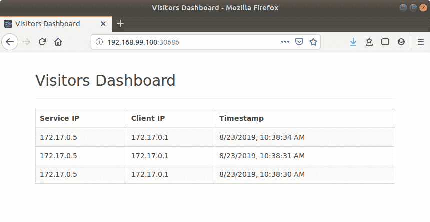
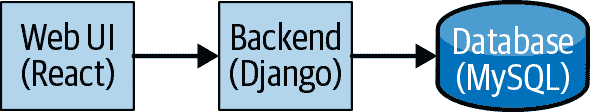

# 第五章：示例应用程序：访客站点

真实的生产级应用程序很难。基于容器的架构通常由多个服务组成，每个服务都需要自己的配置和安装过程。维护这些类型的应用程序，包括各个组件及其交互，是一个耗时且容易出错的过程。操作员的设计目的在于简化此过程的复杂性。

简单的单容器“Hello World”应用程序不足以展示操作员的全部功能。为了帮助您真正理解操作员的能力，我们需要一个需要多个 Kubernetes 资源、配置值交叉使用的应用程序作为演示。

在本章中，我们介绍了访客站点应用程序，这将作为接下来涵盖操作员编写的章节的示例。我们将查看应用程序架构以及运行站点和通过传统的 Kubernetes 清单安装它的过程。在接下来的章节中，我们将使用 Operator SDK（Helm、Ansible 和 Go 提供的各种方法）创建操作员来部署此应用程序，并探讨每种方法的利弊。

# 应用程序概述

访客站点追踪有关每个对其主页的请求的信息。每次刷新页面时，都会存储一个包含客户端、后端服务器和时间戳详细信息的条目。主页显示最近访问的列表（如图 5-1 所示）。



###### 图 5-1。访客站点主页

尽管主页本身相当简单，但架构使其成为一个探索操作员的有趣示例。访客站点是一个传统的三层应用程序，包括：

+   一个 web 前端，使用[React](https://reactjs.org/)实现

+   一个 REST API，使用[Python](https://www.python.org/)和[Django 框架](https://www.djangoproject.com/)实现

+   使用[MySQL](https://www.mysql.com/)的数据库

如图 5-2 所示，每个组件都部署为单独的容器。流程简单，用户与 web 接口交互，接口本身调用后端 REST API。提交到 REST API 的数据持久存储在 MySQL 数据库中，该数据库也作为其自己的容器运行。



###### 图 5-2。访客站点架构

请注意，数据库不连接到持久卷，并且临时存储其数据。虽然这不是适合生产的解决方案，但在本示例中，重要的是部署和容器之间的交互。

# 使用清单进行安装

访客站点中的每个组件都需要两个 Kubernetes 资源：

部署

包含创建容器所需的信息，包括镜像名称、公开端口和单个部署的特定配置。

服务

部署中的所有容器之间的网络抽象。如果部署的容器数量超过一个（这将在后端完成），服务将位于前端并在所有副本之间平衡传入的请求。

第三个资源用于存储数据库的认证详细信息。MySQL 容器在启动时使用此*密钥*，后端容器在发出请求时使用它进行数据库认证。

此外，组件之间必须保持一致的配置值。例如，后端需要知道连接的数据库服务的名称。在通过清单部署应用程序时，需要意识到这些关系，以确保这些值对应正确。

在以下清单中，提供的数值将产生一个可工作的访客网站部署。每个部分将突出需要用户干预的具体实例。

你可以在[书籍的 GitHub 存储库](https://github.com/kubernetes-operators-book/chapters/tree/master/ch05)中找到所有的清单。

## 部署 MySQL

在部署数据库之前必须创建密钥，因为它在容器启动期间被使用：

```
apiVersion: v1
kind: Secret
metadata:
  name: mysql-auth 
type: Opaque
stringData:
  username: visitors-user 
  password: visitors-pass 
```


当数据库和后端部署使用密钥时，它被此名称引用。


简单起见，在本示例中，用户名和密码默认为测试值。

你可以在本书的[GitHub 存储库](https://oreil.ly/jZTgt)的*database.yaml*文件中找到密钥资源的定义。

一旦密钥就位，使用以下清单部署 MySQL 实例到 Kubernetes 中：

```
apiVersion: apps/v1
kind: Deployment
metadata:
  name: mysql  
spec:
  replicas: 1
  selector:
    matchLabels:
      app: visitors
      tier: mysql
  template:
    metadata:
      labels:
        app: visitors
        tier: mysql
    spec:
      containers:
        - name: visitors-mysql
          image: "mysql:5.7"  
          imagePullPolicy: Always
          ports:
            - name: mysql
              containerPort: 3306  
              protocol: TCP
          env:  
            - name: MYSQL_ROOT_PASSWORD
              value: password
            - name: MYSQL_DATABASE
              value: visitors_db
            - name: MYSQL_USER
              valueFrom:
                secretKeyRef:
                  name: mysql-auth 
                  key: username
            - name: MYSQL_PASSWORD
              valueFrom:
                secretKeyRef:
                  name: mysql-auth 
                  key: password
```


部署名称必须在部署的命名空间中是唯一的。


部署需要包含其名称和托管存储库的映像的详细信息。


用户必须了解镜像公开的每个端口，并明确引用它们。


用于配置此特定部署的容器的值通过环境变量传递。


该密钥提供了数据库认证凭据的值。

要记住容器端口的值，以及每个环境变量的值，因为其他清单使用这些值。

部署将创建 MySQL 容器；然而，它不提供任何入口配置来访问它。为此，我们将需要一个服务。以下清单将创建一个 Kubernetes 服务，提供对 MySQL 部署的访问：

```
apiVersion: v1
kind: Service
metadata:
  name: mysql-service  
  labels:
    app: visitors
    tier: mysql
spec:
  clusterIP: None
  ports:
    - port: 3306  
  selector:
    app: visitors
    tier: mysql
```


与部署一样，服务名称在给定的命名空间中必须是唯一的。这也适用于后端和前端组件的部署和服务。


服务映射到部署暴露的端口，因此此值必须与部署的`ports`部分中的值相同。

## 后端

与 MySQL 资源类似，后端需要部署和服务。然而，与数据库独立不同，后端的配置严重依赖于为数据库设置的值。虽然这并不是不合理的要求，但用户需要确保这些值在两个资源中保持一致。一个错误可能导致后端无法与数据库通信。这是部署后端的清单：

```
apiVersion: apps/v1
kind: Deployment
metadata:
  name: visitors-backend
spec:
  replicas: 1  
  selector:
    matchLabels:
      app: visitors
      tier: backend
  template:
    metadata:
      labels:
        app: visitors
        tier: backend
    spec:
      containers:
        - name: visitors-backend
          image: "jdob/visitors-service:1.0.0"
          imagePullPolicy: Always
          ports:
            - name: visitors
              containerPort: 8000
          env:
            - name: MYSQL_DATABASE  
              value: visitors_db
            - name: MYSQL_SERVICE_HOST  
              value: mysql-service
            - name: MYSQL_USERNAME
              valueFrom:
                secretKeyRef:
                  name: mysql-auth  
                  key: username
            - name: MYSQL_PASSWORD
              valueFrom:
                secretKeyRef:
                  name: mysql-auth  
                  key: password
```


每个部署配置都包括它应该生成的容器数量。


必须手动检查这些值，以确保它们与 MySQL 部署上设置的值匹配。否则，后端将无法与数据库建立连接。


此值告诉后端应用程序在哪里找到数据库，必须与先前创建的 MySQL 服务的名称匹配。


与数据库部署一样，密钥提供数据库的身份验证凭据。

使用容器化应用程序的主要好处之一是它们使您能够单独扩展特定组件。在此处显示的后端部署中，可以修改`replicas`字段来扩展后端。以下章节中的示例操作员使用自定义资源来将此副本计数公开为访问者站点自定义资源的一流配置值。用户不需要手动导航到特定后端部署，就像使用清单时一样。操作员知道如何适当地使用输入的值。

服务清单看起来与您为数据库创建的服务清单类似：

```
apiVersion: v1
kind: Service
metadata:
  name: visitors-backend-service
  labels:
    app: visitors
    tier: backend
spec:
  type: NodePort
  ports:
    - port: 8000  
      targetPort: 8000
      nodePort: 30685  
      protocol: TCP
  selector:
    app: visitors
    tier: backend
```


与数据库服务一样，服务定义中引用的端口必须与部署暴露的端口相匹配。


在此示例中，后端配置为通过与 Minikube 相同的 IP 地址的端口 30685 运行。前端在获取数据时使用此端口进行后端调用。为简化起见，前端默认使用此值，因此在部署前端时无需指定。

## 前端

与后端部署类似，前端需要与后端部署一致的配置。再次，用户需要手动验证这些值在两个位置上是否一致。以下是创建前端部署的清单：

```
apiVersion: apps/v1
kind: Deployment
metadata:
  name: visitors-frontend
spec:
  replicas: 1
  selector:
    matchLabels:
      app: visitors
      tier: frontend
  template:
    metadata:
      labels:
        app: visitors
        tier: frontend
    spec:
      containers:
        - name: visitors-frontend
          image: "jdob/visitors-webui:1.0.0"
          imagePullPolicy: Always
          ports:
            - name: visitors
              containerPort: 3000
          env:
            - name: REACT_APP_TITLE  
              value: "Visitors Dashboard"
```


为使访客站点应用程序更加有趣，您可以通过环境变量覆盖主页标题。在接下来的章节中，您将学习如何通过 CR 将其公开为访客站点的值，使终端用户无需知道在哪个部署中指定该值。

与 MySQL 和后端部署类似，以下清单创建了一个服务，用于访问前端部署：

```
apiVersion: v1
kind: Service
metadata:
  name: visitors-frontend-service
  labels:
    app: visitors
    tier: frontend
spec:
  type: NodePort
  ports:
    - port: 3000
      targetPort: 3000
      nodePort: 30686  
      protocol: TCP
  selector:
    app: visitors
    tier: frontend
```


前端服务看起来与后端服务非常相似，但有一个显著的区别，即它在端口 30686 上运行。

# 部署清单

您可以使用`kubectl`命令自行运行访客站点：

```
$ `kubectl` `apply` `-f` `ch05/database.yaml`
secret/mysql-auth created
deployment.apps/mysql created
service/mysql-service created

$ `kubectl` `apply` `-f` `ch05/backend.yaml`
deployment.apps/visitors-backend created
service/visitors-backend-service created

$ `kubectl` `apply` `-f` `ch05/frontend.yaml`
deployment.apps/visitors-frontend created
service/visitors-frontend-service created

```

# 访问访客站点

使用这些清单，您可以通过使用 Minikube 实例的 IP 地址并在浏览器中指定端口 30686 来找到主页。`minikube`命令提供了访问的 IP 地址：

```
$ `minikube` `ip`
192.168.99.100

```

对于此 Minikube 实例，您可以通过打开浏览器并转到*http://192.168.99.100:30686*来访问访客站点。

点击几次刷新按钮将在该页面上的表格中填充内部集群 IP 和每个请求的时间戳的详细信息，如前文中所示的图 5-1。

# 清理工作

类似于部署清单，您可以使用`kubectl`命令删除创建的资源：

```
$ kubectl delete -f ch05/frontend.yaml
deployment.apps "visitors-frontend" deleted
service "visitors-frontend-service" deleted

$ kubectl delete -f ch05/backend.yaml
deployment.apps "visitors-backend" deleted
service "visitors-backend-service" deleted

$ kubectl delete -f ch05/database.yaml
secret "mysql-auth" deleted
deployment.apps "mysql" deleted
service "mysql-service" deleted

```

# 摘要

我们将在接下来的章节中使用这个示例应用程序来演示多种技术，您可以在其上构建运算符。

除了运算符实现外，还要考虑最终用户的体验。在本章中，我们展示了基于清单的安装，需要进行多项手动更改和内部引用。所有以下运算符实现都会创建一个自定义资源定义，作为创建和配置访客站点实例的唯一 API。
