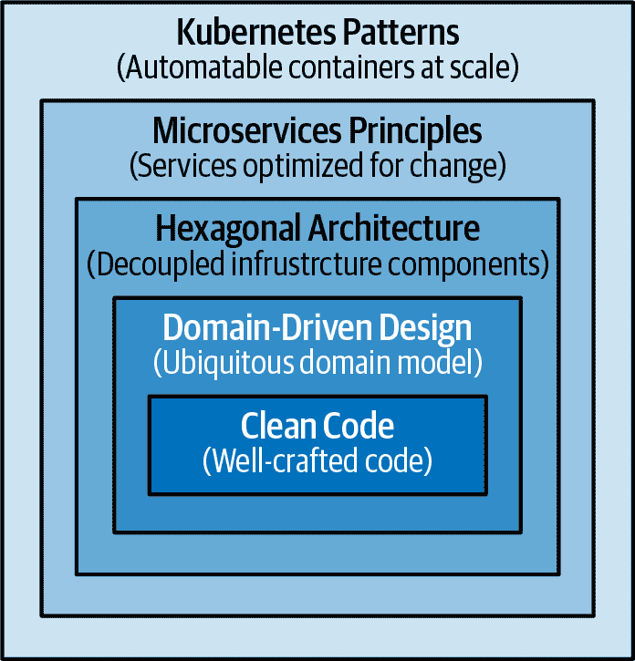
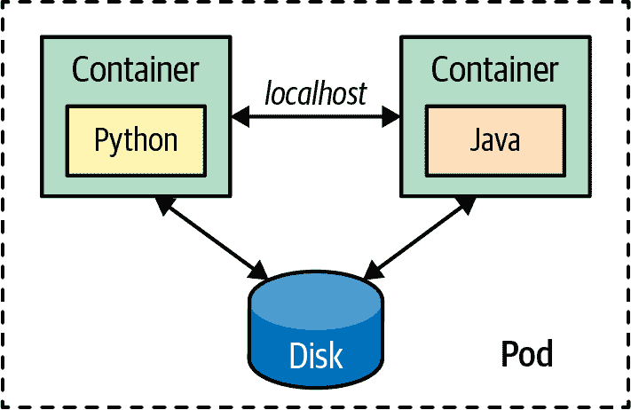
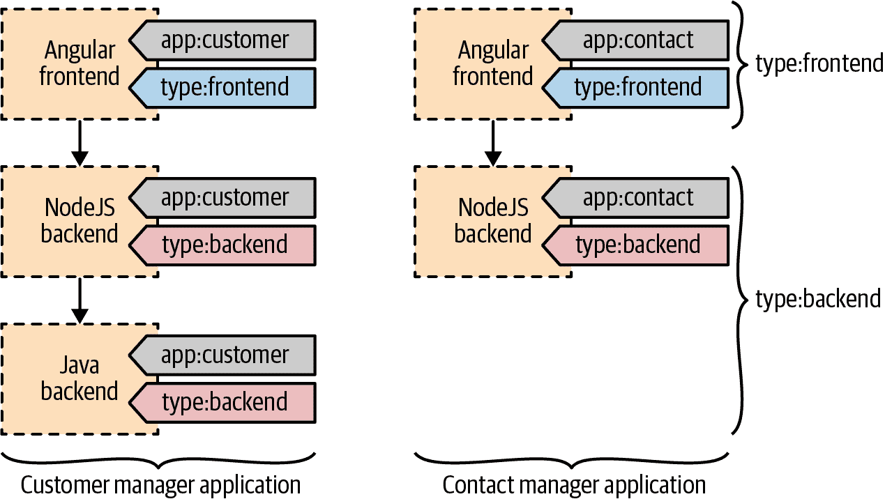
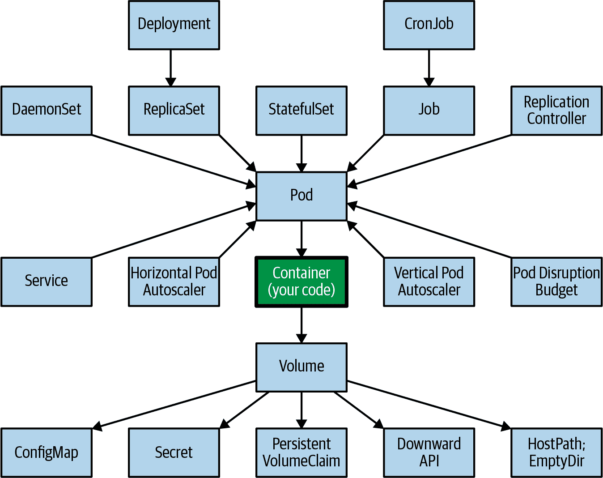

# 第一章：介绍

在本书的这一介绍性章节中，我们通过解释用于设计和实现云原生应用的一些核心 Kubernetes 概念，为接下来的内容设定了背景。理解这些新的抽象以及来自本书的相关原则和模式对于构建可以由 Kubernetes 自动化操作的分布式应用至关重要。

本章不是理解后续描述的模式的先决条件。熟悉 Kubernetes 概念的读者可以跳过本章，直接进入感兴趣的模式类别。

# 通往云原生的路径

微服务是创建云原生应用程序的最流行的架构风格之一。它们通过业务能力的模块化来解决软件复杂性，并通过操作复杂性交换开发复杂性。这就是为什么成功使用微服务的关键先决条件是创建可以通过 Kubernetes 进行规模化操作的应用程序。

作为微服务运动的一部分，有大量关于从头开始创建微服务或将单体应用拆分为微服务的理论、技术和补充工具。这些实践大多基于[*领域驱动设计*](https://oreil.ly/UoON5)（Eric Evans 著，Addison-Wesley 出版）以及有界上下文和聚合的概念。*有界上下文*通过将大型模型划分为不同组件来处理大模型，而*聚合*则有助于将有界上下文进一步分组为具有定义事务边界的模块。然而，除了这些业务域考虑因素外，对于每个分布式系统——无论它是否基于微服务——还存在其外部结构和运行时耦合的技术考虑。容器和容器编排器（如 Kubernetes）引入了新的原语和抽象，以解决分布式应用的关注点，在此我们讨论了在将分布式系统部署到 Kubernetes 中时需要考虑的各种选项。

在本书中，我们通过将容器视为黑盒子来审视容器和平台的交互。然而，我们创建了这一节来强调放入容器的内容的重要性。容器和云原生平台为您的分布式应用程序带来了巨大的好处，但如果您将垃圾放入容器中，您将会在规模上获得分布式垃圾。图 1-1 展示了创建优秀云原生应用所需的技能组合及 Kubernetes 模式的适用位置。

###### 图 1-1\. 通往云原生的路径

从高层次上看，创建优秀的云原生应用程序需要熟悉多种设计技术：

+   在最低的*代码层面*，你定义的每个变量、创建的每个方法以及决定实例化的每个类，在长期维护应用程序中都起着作用。无论你使用何种容器技术和编排平台，开发团队及其创建的工件将产生最大的影响。培养努力编写清晰代码、具备适量自动化测试、持续重构以提高代码质量，并以软件工艺精神为指导原则的开发人员非常重要。

+   *领域驱动设计*是从业务角度来看待软件设计的方法，旨在尽可能保持架构与现实世界的接近。这种方法最适合面向对象的编程语言，但也有其他良好的方式来为实际问题建模和设计软件。一个具有正确业务和交易边界、易于消费的接口和丰富 API 的模型，是未来成功容器化和自动化的基础。

+   *六边形架构*及其变体，如洋葱和清洁架构，通过解耦应用程序组件并为其交互提供标准化接口，提高了应用程序的灵活性和可维护性。通过将系统的核心业务逻辑与周围基础设施解耦，六边形架构使得将系统移植到不同环境或平台更加容易。这些架构与领域驱动设计相辅相成，并帮助将应用程序代码组织成具有明确边界和外部化基础设施依赖的结构。

+   *微服务架构风格*和[十二要素应用](https://12factor.net)方法迅速发展成为创建分布式应用程序的标准，并提供了有价值的设计原则和实践。应用这些原则可以创建出针对规模、弹性和变化速度优化的实现，这些是今天任何现代软件的常见要求。

+   *容器*迅速成为打包和运行分布式应用程序的标准方式，无论是微服务还是函数。创建模块化、可重用的容器，这些容器在云原生环境中表现良好，是另一个基本前提。*云原生*是一个术语，用于描述自动化容器化应用程序的原则、模式和工具。我们将*云原生*与*Kubernetes*交替使用，后者是当今最流行的开源云原生平台。

在本书中，我们不涵盖干净的代码、领域驱动设计、六边形架构或微服务。我们仅专注于解决容器编排关注的模式和实践。但是，为了这些模式能够有效，你的应用程序需要从内部使用干净的代码实践、领域驱动设计、六边形架构等方法，像隔离外部依赖和微服务原则等其他相关设计技术。

# 分布式原语

为了解释我们所说的新抽象和原语，我们在这里将它们与众所周知的面向对象编程（OOP），特别是 Java 进行比较。在 OOP 的宇宙中，我们有诸如类、对象、包、继承、封装和多态等概念。然后 Java 运行时提供了特定的功能和保证，来管理我们的对象及整个应用的生命周期。

Java 语言和 Java 虚拟机（JVM）提供了本地、进程内的构建块来创建应用程序。Kubernetes 通过提供一套新的分布式原语和运行时，为跨多个节点和进程扩展的分布式系统建设增添了全新的维度。有了 Kubernetes 的支持，我们不仅依赖于本地原语来实现整个应用行为。

我们仍然需要使用面向对象的构建模块来创建分布式应用的组件，但我们也可以使用 Kubernetes 原语来处理某些应用行为。Table 1-1 显示了在 JVM 和 Kubernetes 中，本地和分布式原语如何以不同方式实现各种开发概念。

表 1-1\. 本地和分布式原语

| 概念 | 本地原语 | 分布式原语 |
| --- | --- | --- |
| 行为封装 | 类 | 容器镜像 |
| 行为实例 | 对象 | 容器 |
| 可重用单元 | *.jar* | 容器镜像 |
| 组合 | 类 A 包含类 B | Sidecar 模式 |
| 继承 | 类 A 继承自类 B | 容器的 `FROM` 父镜像 |
| 部署单元 | *.jar*/*.war*/*.ear* | Pod |
| 构建时/运行时隔离 | 模块，包，类 | 命名空间，Pod，容器 |
| 初始化前提条件 | 构造函数 | Init 容器 |
| 后初始化触发器 | Init-method | `postStart` |
| 预销毁触发器 | Destroy-method | `preStop` |
| 清理过程 | `finalize()`, shutdown hook | - |
| 异步和并行执行 | `ThreadPoolExecutor`, `ForkJoinPool` | Job |
| 定期任务 | `Timer`, `ScheduledExecutorService` | CronJob |
| 后台任务 | 守护线程 | DaemonSet |
| 配置管理 | `System.getenv()`, `Properties` | ConfigMap, Secret |

进程内原语和分布式原语有共同点，但不能直接比较和替换。它们在不同的抽象级别上运行，并具有不同的前提条件和保证。有些原语应该一起使用。例如，我们仍然必须使用类来创建对象并将它们放入容器镜像中。但是，一些其他原语如 Kubernetes 中的 CronJob 可以完全替代 Java 中的`ExecutorService`行为。

接下来，让我们看看一些 Kubernetes 中特别适合应用开发者的分布式抽象和原语。

## 容器

*容器*是基于 Kubernetes 的云原生应用的构建模块。如果我们将其与 OOP 和 Java 进行比较，容器镜像就像类，而容器则像对象。就像我们可以扩展类以重用和改变行为一样，我们可以有扩展其他容器镜像以重用和改变行为的容器镜像。同样，我们可以进行对象组合并使用功能，我们可以通过将容器放入 Pod 并使用协作容器来进行容器组合。

如果我们继续比较，Kubernetes 就像是分布在多个主机上的 JVM，并且负责运行和管理容器。Init 容器有点类似于对象构造函数；DaemonSet 则类似于在后台运行的守护线程（例如 Java 垃圾收集器）。一个 Pod 类似于一个控制反转（IoC）上下文（例如 Spring 框架），在这里多个运行中的对象共享管理的生命周期并可以直接访问彼此。

这种类比不能太深入，但关键是容器在 Kubernetes 中扮演着基础角色，创建模块化、可重用、单一目的的容器镜像对于任何项目的长期成功，甚至容器生态系统作为整体都是至关重要的。除了提供打包和隔离的技术特性外，容器镜像在分布式应用程序中代表什么，以及其在其中的作用是什么？以下是如何看待容器的几点建议：

+   容器镜像是解决单一关注点的功能单元。

+   容器镜像由一个团队拥有并有其自己的发布周期。

+   容器镜像是自包含的，定义并携带其运行时依赖项。

+   容器镜像是不可变的，一旦构建完成，就不会更改；它是经过配置的。

+   容器镜像定义其资源需求和外部依赖项。

+   容器镜像具有明确定义的 API 以公开其功能。

+   一个容器通常作为单个 Unix 进程运行。

+   容器是可丢弃的，可以随时进行扩展或缩减。

除了所有这些特性之外，一个合适的容器镜像是模块化的。它是参数化的，并且为在不同环境中运行而重用而创建。拥有小型、模块化和可重用的容器镜像会在长期内创建更专业化和稳定的容器镜像，类似于编程语言世界中优秀的可重用库。

## Pod

观察容器的特性，我们可以看到它们非常适合实现微服务原则。一个容器镜像提供了一个功能单元，归属于一个团队，有独立的发布周期，并提供部署和运行时隔离。大多数情况下，一个微服务对应一个容器镜像。

然而，大多数云原生平台提供了另一种原语来管理一组容器的生命周期——在 Kubernetes 中称为 Pod。*Pod* 是一组容器的调度、部署和运行时隔离的原子单位。Pod 中的所有容器总是被调度到同一台主机上，一起部署和扩展，并且还可以共享文件系统、网络和进程命名空间。这种联合生命周期允许 Pod 中的容器通过文件系统或通过本地主机或宿主机进程通信机制（如果需要，例如出于性能原因）相互交互。对于一个应用程序来说，Pod 也代表了一个安全边界。虽然可能在同一个 Pod 中有具有不同安全参数的容器，但通常所有容器都具有相同的访问级别、网络分割和身份。

正如您在 图 1-2 中看到的，在开发和构建时，一个微服务对应于一个团队开发和发布的容器镜像。但在运行时，一个微服务由 Pod 表示，它是部署、放置和扩展的单位。运行容器的唯一方式——无论是为了扩展还是迁移——都是通过 Pod 抽象。有时一个 Pod 包含多个容器。在这样的例子中，一个容器化的微服务在运行时使用辅助容器，正如 第十六章，“Sidecar” 中所示。

###### 图 1-2\. Pod 作为部署和管理单元

容器、Pod 及其独特特性为设计基于微服务的应用程序提供了一组新的模式和原则。我们看到了设计良好的容器的一些特性；现在让我们来看看 Pod 的一些特性：

+   Pod 是调度的原子单位。这意味着调度器试图找到一个满足 Pod 所有容器需求的主机（我们在第十五章，“初始化容器”中详细讨论了一些关于初始化容器的具体内容）。如果创建一个具有多个容器的 Pod，调度器需要找到一个具有足够资源来满足所有容器需求的主机。这个调度过程在第六章，“自动化部署”中描述。

+   一个 Pod 确保容器的共存。由于共存，同一 Pod 中的容器有额外的方式进行互操作。最常见的通信方式包括使用共享的本地文件系统交换数据，使用本地主机网络接口，或使用一些主机进程间通信（IPC）机制进行高性能互动。

+   一个 Pod 具有 IP 地址、名称和端口范围，所有属于它的容器共享这些信息。这意味着同一 Pod 中的容器必须仔细配置，以避免端口冲突，就像并行运行的 Unix 进程在共享主机的网络空间时需要小心一样。

Pod 是 Kubernetes 的原子单位，您的应用程序驻留在其中，但您不直接访问 Pod —— 这就是服务进入场景的地方。

## 服务

Pod 是短暂的。它们会因各种原因随时出现和消失（例如，扩展和缩减，失败的容器健康检查，节点迁移）。只有在调度和在节点上启动后，Pod 的 IP 地址才能被知晓。如果运行 Pod 的节点不再健康，Pod 可以被重新调度到另一个节点。这意味着应用程序的生命周期中可能会改变 Pod 的网络地址，需要另一个基元进行发现和负载均衡。

这就是 Kubernetes 服务发挥作用的地方。服务是 Kubernetes 的另一个简单但强大的抽象，将服务名称永久绑定到 IP 地址和端口号。因此，服务表示访问应用程序的命名入口点。在最常见的情况下，服务作为一组 Pod 的入口点，但并非总是如此。服务是一个通用的基元，也可以指向 Kubernetes 集群外提供的功能。因此，服务基元可用于服务发现和负载均衡，允许在不影响服务使用者的情况下更改实现和扩展。我们在第十三章，“服务发现”中详细解释了服务。

## 标签

我们已经看到，微服务是一个在构建时是容器镜像，但在运行时由 Pod 表示的概念。那么由多个微服务组成的应用程序是什么呢？在这里，Kubernetes 提供了另外两个基元，可以帮助您定义应用程序的概念：标签和命名空间。

在微服务出现之前，一个应用程序对应于一个单一的部署单元，有一个单一的版本控制方案和发布周期。应用程序在 *.war*、*.ear* 或其他某种打包格式中有一个单一的文件。但后来，应用程序被拆分为微服务，这些微服务可以独立开发、发布、运行、重启或扩展。在微服务中，应用程序的概念减弱了，没有关键的工件或在应用程序级别执行的活动。但是，如果你仍然需要一种方法来指示一些独立服务属于一个应用程序，*标签* 可以被使用。让我们想象一下，我们已经将一个单体应用程序拆分为三个微服务，另一个拆分为两个微服务。

现在我们有五个 Pod 定义（可能还有许多 Pod 实例），从开发和运行时的角度来看是独立的。然而，我们可能仍然需要指示前三个 Pod 代表一个应用程序，而另外两个 Pod 代表另一个应用程序。即使 Pod 可能是独立的，为了提供业务价值，它们可能彼此依赖。例如，一个 Pod 可能包含负责前端的容器，另外两个 Pod 则负责提供后端功能。如果其中任何一个 Pod 停止运行，从业务角度来看，应用程序就变得无用了。使用标签选择器使我们能够查询和识别一组 Pod，并将其作为一个逻辑单元进行管理。图 1-3 展示了如何使用标签将分布式应用程序的各部分分组成特定的子系统。

###### 图 1-3\. 作为 Pod 应用标识的标签

以下是标签可能有用的几个示例：

+   ReplicaSets 使用标签来保持特定 Pod 的一些实例在运行。这意味着每个 Pod 定义都需要一组唯一的标签组合用于调度。

+   标签也被调度器广泛使用。调度器使用标签来将 Pod 放置在满足 Pod 要求的节点上，以实现共存或扩展。

+   一个标签可以指示一组 Pod 的逻辑分组，并为它们提供一个应用程序标识。

+   除了上述典型用例外，标签还可用于存储元数据。很难预测标签可能用于什么，但最好有足够的标签来描述 Pod 的所有重要方面。例如，有标签用于指示应用程序的逻辑组、业务特性和关键性，特定的运行时平台依赖如硬件架构或位置偏好都是有用的。

后来，这些标签可以由调度程序用于更精细的调度，或者可以从命令行使用相同的标签来管理规模化的匹配 Pod。但是，不要过度添加太多标签。如果需要，您可以随时稍后添加它们。删除标签更为风险，因为没有直接的方法来找出标签用于何处，以及这样的操作可能会导致什么意外效果。

## 命名空间

另一个可以帮助管理一组资源的原始 Kubernetes*命名空间*。正如我们所描述的，命名空间可能看起来类似于标签，但实际上，它是一个具有不同特性和目的的非常不同的原语。

Kubernetes 命名空间允许您将一个 Kubernetes 集群（通常跨多个主机）分成资源的逻辑池。命名空间为 Kubernetes 资源提供作用域，并提供了在集群子集中应用授权和其他策略的机制。命名空间最常见的用例是表示不同的软件环境，如开发、测试、集成测试或生产环境。命名空间还可以用于实现多租户，并为团队工作空间、项目甚至特定应用程序提供隔离。但是，对于某些环境的更大隔离，命名空间是不够的，通常会使用单独的集群。通常情况下，有一个非生产 Kubernetes 集群用于某些环境（开发、测试和集成测试），另一个生产 Kubernetes 集群用于性能测试和生产环境。

让我们看看命名空间的一些特性以及它们如何在不同场景中帮助我们：

+   命名空间作为一个 Kubernetes 资源进行管理。

+   命名空间为诸如容器、Pod、服务或副本集等资源提供作用域。资源的名称在命名空间内必须是唯一的，但在命名空间之间不必如此。

+   默认情况下，命名空间为资源提供作用域，但没有任何机制来隔离这些资源，防止一个资源访问另一个资源。例如，来自开发命名空间的 Pod 可以访问生产命名空间的另一个 Pod，只要知道 Pod 的 IP 地址。“通过创建轻量级多租户解决方案的命名空间跨命名空间的网络隔离在第二十四章，“网络分段”中有描述。

+   其他一些资源，如命名空间、节点和持久卷，不属于命名空间，应具有唯一的整个集群范围名称。

+   每个 Kubernetes 服务都属于一个命名空间，并且会获得相应的域名服务（DNS）记录，其中命名空间以`<service-name>.<namespace-name>.svc.cluster.local`的形式存在于每个属于给定命名空间的服务的 URL 中。这就是命名空间在每个服务的 URL 中至关重要的原因。

+   ResourceQuotas 提供了限制每个命名空间的聚合资源消耗的约束。通过 ResourceQuotas，集群管理员可以控制命名空间中允许的每种类型对象的数量。例如，开发者命名空间可能只允许五个 ConfigMaps、五个 Secrets、五个 Services、五个 ReplicaSets、五个 PersistentVolumeClaims 和十个 Pods。

+   ResourceQuotas 还可以限制我们在给定命名空间中可以请求的计算资源总和。例如，在容量为 32 GB RAM 和 16 个核心的集群中，可以为生产命名空间分配 16 GB RAM 和 8 个核心，为暂存环境分配 8 GB RAM 和 4 个核心，为开发分配 4 GB RAM 和 2 个核心，测试命名空间也是相同。脱离底层基础设施的形状和限制施加资源约束的能力是无价的。

# 讨论

我们只简要介绍了本书中使用的一些主要 Kubernetes 概念。然而，开发人员日常使用的基元还有更多。例如，如果您创建一个容器化服务，可以使用大量 Kubernetes 抽象来获取 Kubernetes 的所有优势。请记住，这些只是应用开发人员用于将容器化服务集成到 Kubernetes 中的少数对象。还有许多其他概念，主要由集群管理员用于管理 Kubernetes。图 1-4 概述了对开发者有用的主要 Kubernetes 资源。

###### 图 1-4\. 开发者的 Kubernetes 概念

随着时间的推移，这些新的基元产生了解决问题的新方法，其中一些重复的解决方案变成了模式。在本书中，我们不会详细描述每个 Kubernetes 资源，而是专注于作为模式证明的概念。

# 更多信息

+   [十二因素应用](https://oreil.ly/ad0al)

+   [CNCF 云原生定义 v1.0](https://oreil.ly/NUiXM)

+   [六边形架构](https://oreil.ly/rvcDB)

+   [*领域驱动设计：软件核心复杂性的挑战*](https://oreil.ly/8IHI4)

+   [编写 Dockerfile 的最佳实践](https://oreil.ly/Be0g6)

+   [基于容器的应用设计原则](https://oreil.ly/-x16l)

+   [通用容器镜像指南](https://oreil.ly/yyItc)
