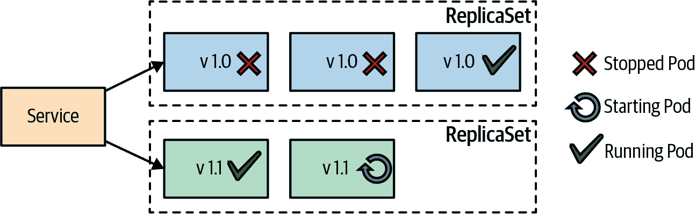
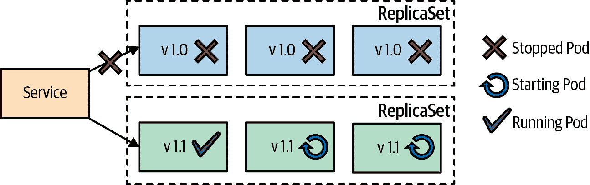
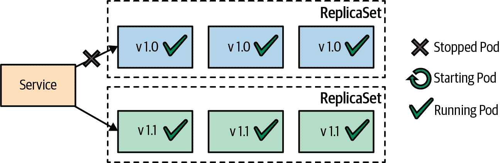
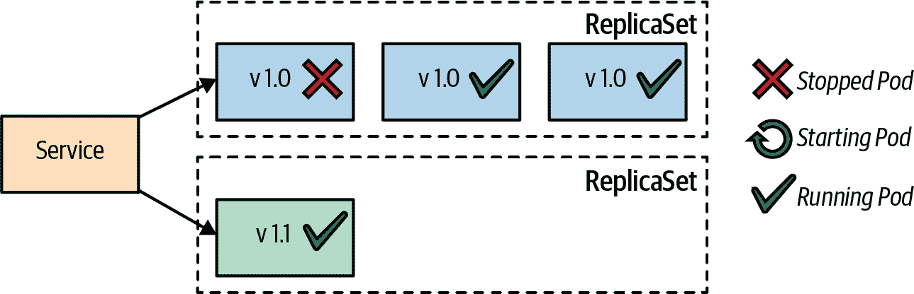
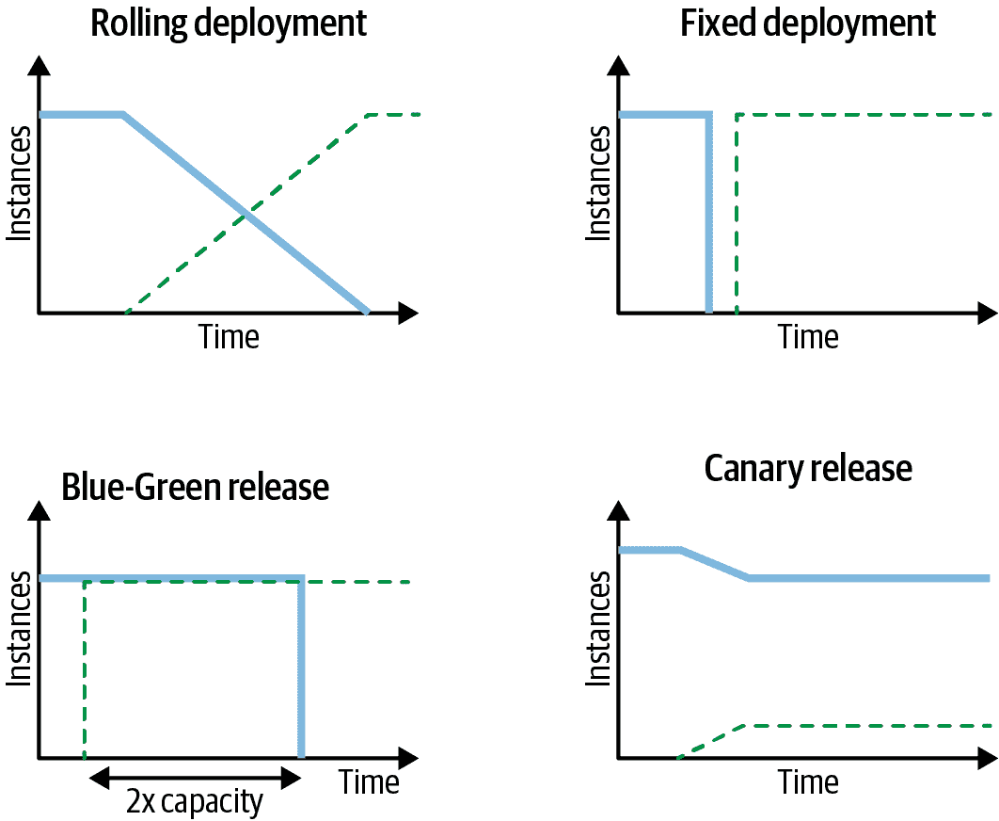

# 第三章：声明式部署

*声明式部署* 模式的核心是 Kubernetes 的 Deployment 资源。这种抽象封装了一组容器的升级和回滚过程，并使其执行成为可重复和自动化的活动。

# 问题

我们可以自助方式在命名空间中为隔离环境提供资源，并通过调度程序将应用程序放置在这些环境中，几乎不需要人为干预。但随着微服务数量的增加，持续更新并用新版本替换它们也成为了越来越大的负担。

将服务升级到下一个版本涉及到启动新版本的 Pod、优雅地停止旧版本的 Pod、等待并验证其成功启动，有时在失败时回滚到先前版本。这些活动通过允许一些停机时间但不运行并发服务版本，或者在更新过程中由于两个版本的服务同时运行而导致资源使用增加来执行。手动执行这些步骤可能会导致人为错误，并且正确地脚本化可能需要大量的工作量，这些很快就会将发布过程变成瓶颈。

# 解决方案

幸运的是，Kubernetes 也实现了应用程序的自动化升级。使用 *Deployment* 的概念，我们可以描述应用程序如何更新，使用不同的策略并调整更新过程的各个方面。如果考虑到每个微服务实例的每个发布周期都要执行多次 Deployment（这取决于团队和项目，可以从几分钟到几个月不等），这也是 Kubernetes 提供的另一种节省工作的自动化。

在 第二章，“可预测需求” 中，我们看到，为了有效地执行其工作，调度程序需要主机系统上充足的资源、适当的放置策略以及具有充分定义的资源配置文件的容器。类似地，为了正确执行 Deployment 的工作，它期望容器成为良好的云原生公民。在 Deployment 的核心是可预测地启动和停止一组 Pod 的能力。为了让这一切正常工作，容器本身通常会监听并遵循生命周期事件（如 SIGTERM；参见 第五章，“托管生命周期”）并提供健康检查端点，如 第四章，“健康探测” 中描述的那样，指示它们是否成功启动。

如果一个容器准确覆盖了这两个方面，平台就可以干净地关闭旧容器并通过启动更新实例来替换它们。然后，更新过程的所有其他方面都可以以声明方式定义，并作为一个具有预定义步骤和预期结果的原子操作执行。让我们看看容器更新行为的选项。

## 滚动部署

在 Kubernetes 中，更新应用程序的声明方式是通过 Deployment 的概念。在幕后，Deployment 创建支持基于集合的标签选择器的 ReplicaSet。此外，Deployment 抽象允许您使用 `RollingUpdate`（默认）和 `Recreate` 等策略来塑造更新过程的行为。示例 3-1 显示了为滚动更新策略配置 Deployment 的重要部分。

##### 示例 3-1\. 滚动更新的 Deployment

```
apiVersion: apps/v1
kind: Deployment
metadata:
  name: random-generator
spec:
  replicas: 3            
  strategy:
    type: RollingUpdate
    rollingUpdate:
      maxSurge: 1        
      maxUnavailable: 1  
  minReadySeconds: 60    
selector:
    matchLabels:
      app: random-generator
  template:
    metadata:
      labels:
        app: random-generator
    spec:
      containers:
      - image: k8spatterns/random-generator:1.0
        name: random-generator
        readinessProbe:  
          exec:
            command: [ "stat", "/random-generator-ready" ]
```


三个副本的声明。进行滚动更新需要多于一个副本才有意义。


在更新期间，除了指定的副本数之外，可以临时运行的 Pod 数量。在这个例子中，最多可以有四个副本。


在更新期间可能不可用的 Pod 数量。在这种情况下，更新期间可能一次只有两个 Pod 可用。


所有就绪探针在滚出的 Pod 上必须健康的秒数，直到推出继续。


对于滚动部署而言，健康探针至关重要，以确保零停机时间—不要忘记它们（见第 4 章，“健康探针”）。

`RollingUpdate` 策略的行为确保更新过程中没有停机时间。在幕后，Deployment 实现通过创建新的 ReplicaSets 并替换旧容器来执行类似的操作。这里的一个增强功能是，使用 Deployment，可以通过 `maxSurge` 和 `maxUnavailable` 字段控制新容器的推出速率。

这两个字段可以是 Pods 的绝对数或相对百分比，应用于 Deployment 配置的副本数，并向上（`maxSurge`）或向下（`maxUnavailable`）舍入到下一个整数值。默认情况下，`maxSurge` 和 `maxUnavailable` 都设置为 25%。

另一个影响推出行为的重要参数是 `minReadySeconds`。此字段指定 Pod 的准备探针需要成功运行的秒数，直到 Pod 自身在推出中被视为可用。增加此值可确保应用程序 Pod 在继续推出之前成功运行一段时间。此外，较大的 `minReadySeconds` 间隔有助于调试和探索新版本。当更新步骤之间的间隔较大时，可能更容易利用 `kubectl rollout pause`。

图 3-1 展示了滚动更新过程。



###### 图 3-1\. 滚动部署

要触发声明性更新，您有三个选项：

+   使用 `kubectl replace` 用新版本的 Deployment 替换整个 Deployment。

+   使用 `kubectl patch` 或交互式编辑 (`kubectl edit`) Deployment 来设置新版本的容器镜像。

+   使用 `kubectl set image` 在 Deployment 中设置新的镜像。

另请参阅我们仓库中的 [完整示例](https://oreil.ly/xSsID)，该示例演示了这些命令的用法，并展示了如何使用 `kubectl rollout` 监控或回滚升级。

除了解决部署服务的命令式方法的缺点之外，Deployment 还具有以下优点：

+   Deployment 是 Kubernetes 资源对象，其状态完全由 Kubernetes 在内部管理。整个更新过程在服务器端执行，无需客户端交互。

+   Deployment 的声明性质指定了部署状态应该如何看起来，而不是达到那个状态所需的步骤。

+   Deployment 定义是一个可执行的对象，不仅仅是文档。它可以在达到生产环境之前在多个环境中进行试验和测试。

+   更新过程也完全记录和版本化，包括暂停、继续和回滚到以前的版本的选项。

## 固定部署

`RollingUpdate` 策略对于确保更新过程中零停机时间很有用。然而，这种方法的副作用是在更新过程中可能会同时运行两个版本的容器。这可能会对服务消费者造成问题，特别是当更新过程在服务 API 中引入了不兼容的变化，而客户端无法处理这些变化时。对于这种情况，可以使用 `Recreate` 策略，如 图 3-2 所示，它可以解决这些问题。



###### 图 3-2\. 使用 `Recreate` 策略进行固定部署

`Recreate` 策略的效果是将 `maxUnavailable` 设置为声明的副本数。这意味着它首先终止当前版本的所有容器，然后在旧容器被驱逐时同时启动所有新容器。这个序列的结果是在停止所有旧版本容器的同时发生停机时间，而且没有新容器准备好处理传入请求。积极的一面是，两个不同版本的容器不会同时运行，因此服务消费者一次只能连接一个版本。

## 蓝绿发布

*蓝绿部署* 是一种用于在生产环境中部署软件的发布策略，通过最小化停机时间和降低风险来实现。Kubernetes 的部署抽象是一个基本概念，它允许您定义 Kubernetes 如何从一个版本过渡到另一个版本的不可变容器。我们可以将部署原语作为构建块，与其他 Kubernetes 原语一起实现这种更高级的发布策略。

蓝绿部署如果没有像服务网格或 Knative 这样的扩展，需要手动完成。从技术上讲，它通过创建第二个部署来运行最新版本的容器（我们称之为 *绿色*），但此时这些容器尚未处理任何请求。在此阶段，原始部署中的旧 Pod 副本（称为 *蓝色*）仍在运行并处理活动请求。

一旦我们确信新版本的 Pod 已经健康且准备好处理实时请求，我们就会将流量从旧 Pod 副本切换到新的副本。在 Kubernetes 中，可以通过更新服务的选择器来匹配新容器（标记为绿色）来完成此操作。如图 3-3 所示，一旦绿色（v1.1）容器处理了所有流量，蓝色（v1.0）容器就可以被删除，释放资源供未来的蓝绿部署使用。



###### 图 3-3\. 蓝绿部署

蓝绿部署的一个好处是一次只有一个应用程序版本在提供请求，这降低了通过服务消费者处理多个并发版本的复杂性。缺点是在蓝色和绿色容器都在运行时，需要两倍的应用程序容量。此外，在过渡期间，长时间运行的进程和数据库状态漂移可能会导致重大的复杂性。

## 金丝雀发布

*金丝雀发布* 是一种通过仅替换少部分旧实例来温和地将新版本的应用程序部署到生产环境的方式。这种技术通过让只有一部分消费者能访问更新版本，来减少引入新版本到生产环境中的风险。当我们对服务的新版本和它在一小部分用户中的表现感到满意时，我们可以在此金丝雀发布后的附加步骤中，将所有旧实例替换为新版本。图 3-4 展示了金丝雀发布的实施过程。

在 Kubernetes 中，可以通过创建具有小副本计数的新部署来实现此技术，该部署可用作金丝雀实例。在此阶段，服务应将一些消费者定向到更新的 Pod 实例。金丝雀发布后，一旦我们确信新的 ReplicaSet 的所有工作都如预期那样正常运行，我们就会将新的 ReplicaSet 扩展起来，将旧的 ReplicaSet 缩减到零。在某种程度上，我们正在执行一个受控且经过用户测试的增量部署。



###### 图 3-4\. 金丝雀发布

# 讨论

部署原语是 Kubernetes 将手动更新应用程序这一繁琐过程转变为声明性活动的一个例子，可重复和自动化。开箱即用的部署策略（滚动和重新创建）控制新旧容器的替换，而高级发布策略（蓝绿部署和金丝雀发布）则控制新版本如何对服务消费者可用。后两种发布策略基于人类决策作为过渡触发器，因此 Kubernetes 并未完全自动化，而需要人类交互。图 3-5 总结了部署和发布策略，展示了过渡期间的实例计数。



###### 图 3-5\. 部署和发布策略

所有软件都是不同的，部署复杂系统通常需要额外的步骤和检查。本章讨论的技术涵盖了 Pod 更新过程，但不包括更新和回滚其他 Pod 依赖项，如 ConfigMaps、Secrets 或其他相关服务。

今天一种可行的方法是创建一个脚本来管理使用本书讨论的部署和其他原语更新服务及其依赖关系的过程。然而，这种描述单个更新步骤的命令式方法并不符合 Kubernetes 的声明性特性。

作为替代，出现了在 Kubernetes 之上的更高级别的声明性方法。在下文中描述了最重要的平台。这些技术与运算符（参见第 28 章，“运算符”）一起工作，它们采用部署过程的声明性描述，并在服务器端执行必要的操作，其中一些还包括在更新错误时自动回滚。对于高级、生产就绪的发布场景，建议查看其中一个扩展。

无论您使用哪种部署策略，对于 Kubernetes 来说，了解应用程序 Pod 何时处于运行状态非常重要，以执行达到定义的目标部署状态所需的步骤序列。下一模式，*健康探针*，在第 4 章描述了您的应用程序如何向 Kubernetes 通报其健康状态。

# 更多信息

+   [声明性部署示例](https://oreil.ly/xSsID)

+   [执行滚动更新](https://oreil.ly/paEA0)

+   [部署](https://oreil.ly/NKEnH)

+   [使用部署运行无状态应用程序](https://oreil.ly/wb7D5)

+   [蓝绿部署](https://oreil.ly/sbN9T)

+   [金丝雀发布](https://oreil.ly/Z-vFT)

+   [Flagger: 部署策略](https://oreil.ly/JGL4C)

+   [Argo Rollouts](https://oreil.ly/0lzcD)

+   [Knative: 流量管理](https://oreil.ly/PAwMQ)
