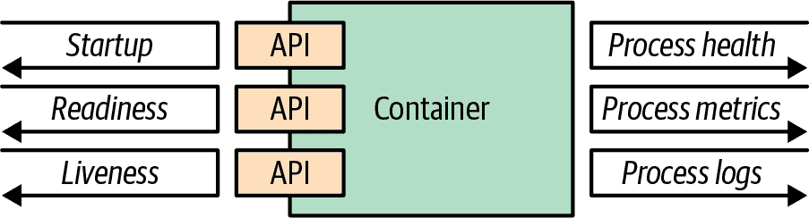

# 第四章：健康探针

*Health Probe* 模式表明应用程序如何将其健康状态传达给 Kubernetes。为了实现完全自动化，云原生应用程序必须通过允许推断其状态来高度可观察，以便 Kubernetes 可以检测应用程序是否启动并且是否准备好响应请求。这些观察结果会影响 Pod 的生命周期管理以及流量路由到应用程序的方式。

# 问题

Kubernetes 定期检查容器进程状态，并在检测到问题时重新启动它。然而，从实践中我们知道，仅检查进程状态不足以确定应用程序的健康状态。在许多情况下，应用程序可能会挂起，但其进程仍在运行。例如，Java 应用程序可能会抛出 `OutOfMemoryError`，但 JVM 进程仍在运行。或者，应用程序可能会因进入无限循环、死锁或某种 thrashing（缓存、堆、进程）而冻结。为了检测这些情况，Kubernetes 需要一种可靠的方式来检查应用程序的健康状态——即不是理解应用程序内部的工作方式，而是检查应用程序是否按预期运行，并能够为消费者提供服务。

# 解决方案

软件行业已经接受了一个事实，即编写无 bug 的代码是不可能的。此外，与分布式应用程序一起工作时，故障的可能性进一步增加。因此，处理故障的重点已经从避免转移到检测故障和恢复上。检测故障并非一项可以为所有应用程序统一执行的简单任务，因为每个人对故障有不同的定义。而且，不同类型的故障需要不同的纠正措施。瞬态故障可能会在足够的时间内自行恢复，而其他一些故障可能需要重新启动应用程序。让我们看看 Kubernetes 用于检测和纠正故障的检查方法。

## 进程健康检查

*进程健康检查* 是 Kubelet 对容器进程定期执行的最简单健康检查。如果容器进程未运行，将在分配了 Pod 的节点上重新启动容器。因此，即使没有其他健康检查，通过这种通用检查，应用程序的健壮性也会稍有提升。如果您的应用程序能够检测到任何类型的故障并自行关闭，进程健康检查就足够了。然而，对于大多数情况来说，这还不够，还需要其他类型的健康检查。

## 存活性探针

如果您的应用程序遇到死锁，从进程健康检查的角度来看它仍然是健康的。为了检测这种类型的问题以及根据您的应用程序业务逻辑检测任何其他类型的故障，Kubernetes 提供了*存活性探测*——由 Kubelet 代理执行的定期检查，要求您的容器确认其仍然是健康的。重要的是从外部执行健康检查而不是在应用程序本身中执行，因为某些故障可能会阻止应用程序看门狗报告其故障。关于纠正措施，此健康检查类似于进程健康检查，因为如果检测到故障，容器将被重新启动。但它在选择用于检查应用程序健康状况的方法方面提供了更大的灵活性，具体如下：

HTTP 探测

对容器 IP 地址执行 HTTP GET 请求，并期望返回成功的 HTTP 响应代码（200 到 399 之间）。

TCP Socket 探测

假设成功的 TCP 连接。

执行探测

在容器的用户和内核命名空间中执行任意命令，并期望成功的退出代码（0）。

gRPC 探测

利用 gRPC 对健康检查的内在支持。

除了探测操作外，健康检查行为还受以下参数影响：

`initialDelaySeconds`

指定等待第一个存活性探测检查之前的秒数。

`periodSeconds`

存活性探测检查之间的秒数间隔。

`timeoutSeconds`

在探测检查返回前允许的最大时间，超过此时间将视为失败。

`failureThreshold`

指定探测检查连续失败多少次后，容器被视为不健康并需要重新启动。

显示了一个基于 HTTP 的存活性探测示例，见示例 4-1。

##### 示例 4-1\. 带有存活性探测的容器

```
apiVersion: v1
kind: Pod
metadata:
  name: pod-with-liveness-check
spec:
  containers:
  - image: k8spatterns/random-generator:1.0
    name: random-generator
    env:
    - name: DELAY_STARTUP
      value: "20"
    ports:
    - containerPort: 8080
    protocol: TCP
    livenessProbe:
      httpGet:                  
        path: /actuator/health
        port: 8080
      initialDelaySeconds: 30   
```


向健康检查端点进行 HTTP 探测。


在进行第一次存活性检查之前等待 30 秒，以便应用程序有些时间进行预热。

根据您的应用性质，您可以选择最适合您的方法。由应用程序决定是否认为自己是健康的。但请注意，未通过健康检查的结果是容器将重新启动。如果重新启动容器没有帮助，那么健康检查失败将毫无意义，因为 Kubernetes 会在不修复潜在问题的情况下重新启动您的容器。

## 可用性探测

存活检查通过终止不健康的容器并用新的替换来保持应用程序健康。但有时，当容器不健康时，重新启动可能无济于事。一个典型的例子是容器仍在启动中，尚未准备好处理任何请求。另一个例子是应用程序仍在等待依赖项（如数据库）可用。此外，容器可能会因负载过重而过载，增加延迟，因此你希望它在一段时间内对额外负载进行屏蔽，并指示它在负载减少之前不可用。

对于这种情况，Kubernetes 有*就绪探测*。执行就绪检查的方法（HTTP、TCP、Exec、gRPC）和定时选项与存活检查相同，但纠正措施不同。与重新启动容器不同，失败的就绪探测会导致容器从服务端点中移除，并且不接收任何新的流量。就绪探测信号容器何时准备好，以便在受到来自服务的请求之前有一些时间预热。它还有助于在后期阶段屏蔽容器免受流量影响，因为就绪探测定期执行，类似于存活检查。示例 4-2 展示了如何通过探测应用程序创建的文件的存在来实现就绪探测，以指示应用程序已准备好运行。

##### 示例 4-2\. 带就绪探测的容器

```
apiVersion: v1
kind: Pod
metadata:
  name: pod-with-readiness-check
spec:
  containers:
  - image: k8spatterns/random-generator:1.0
    name: random-generator
    readinessProbe:
      exec:  
        command: [ "stat", "/var/run/random-generator-ready" ]
```


检查应用程序创建的文件的存在，以指示它已准备好提供服务。如果文件不存在，`stat`会返回错误，导致就绪检查失败。

再次强调，由健康检查的实现决定何时应用程序准备好执行其工作，以及何时应该让其独自运行。虽然进程健康检查和存活检查旨在通过重新启动容器来从故障中恢复，但就应用程序而言，就绪检查为其提供了时间，并期望其能够自行恢复。请记住，Kubernetes 试图防止容器在收到 SIGTERM 信号后继续接收新请求（例如在关闭时），无论就绪检查在接收 SIGTERM 信号后是否仍然通过。

在许多情况下，存活和就绪探测执行相同的检查。然而，有了就绪探测，您的容器有时间启动。只有通过就绪检查，部署才被视为成功，以便例如，具有旧版本的 Pod 可以作为滚动更新的一部分终止。

对于需要很长时间初始化的应用程序，很可能在启动完成之前未能通过存活检查导致容器重新启动。为了防止这些意外关闭，可以使用*启动探测*来指示启动何时完成。

## 启动探测

活跃性探针也可以仅用于通过延长检查间隔、增加重试次数和在初始活跃性探针检查中添加较长延迟来允许较长的启动时间。然而，这种策略并不理想，因为这些定时参数也将适用于启动后阶段，并且将阻止应用程序在发生致命错误时快速重新启动。

当应用程序启动需要几分钟（例如，Jakarta EE 应用服务器）时，Kubernetes 提供了*启动探针*。

启动探针配置与活跃性探针相同，但允许探针动作和定时参数的不同值。 `periodSeconds` 和 `failureThreshold` 参数的配置值比相应的活跃性探针大得多，以考虑较长的应用程序启动时间。只有启动探针报告成功后，才会调用活跃性和可用性探针。如果启动探针在配置的失败阈值内不成功，则容器将重新启动。

虽然启动和活跃性探针可以使用相同的探测动作，但通常通过启动探针检查存在的标记文件指示成功启动。

示例 4-4 是一个典型的 Jakarta EE 应用服务器启动时间较长的示例。

##### 示例 4-4\. 带有启动和活跃性探针的容器

```
apiVersion: v1
kind: Pod
metadata:
  name: pod-with-startup-check
spec:
  containers:
  - image: quay.io/wildfly/wildfly 
    name: wildfly
    startupProbe:
      exec:
        command: [ "stat", "/opt/jboss/wildfly/standalone/tmp/startup-marker" ]  
        initialDelaySeconds: 60    
        periodSeconds: 60
        failureThreshold: 15
    livenessProbe:
      httpGet:
        path: /health
        port: 9990
        periodSeconds: 10          
        failureThreshold: 3
```


JBoss WildFly Jakarta EE 服务器启动可能需要一些时间。


WildFly 在成功启动后创建的标记文件。


定时参数指定容器在启动探针在首次检查后未通过之后的 15 分钟内应重新启动（60 秒的暂停直到第一次检查，然后最多 15 次检查，每次间隔 60 秒）。


活跃性探针的定时参数要小得多，如果后续活跃性探针在 20 秒内失败，则会重新启动（每次间隔 10 秒的三次重试）。

活跃性、可用性和启动探针是云原生应用程序自动化的基本构建块。诸如 Quarkus SmallRye Health、Spring Boot Actuator、WildFly Swarm health check、Apache Karaf health check 或 Java 的 MicroProfile 规范等应用框架提供了健康探针的实现。

# 讨论

要完全自动化，云原生应用程序必须通过提供管理平台读取和解释应用程序健康状态的手段来进行高度观察。健康检查在部署、自愈、扩展等活动的自动化中起着基本作用。然而，还有其他方法可以使您的应用程序提供关于其健康状况更多的可见性。

达到此目的的显而易见且古老的方法是通过日志记录。对于容器来说，将任何重要事件记录到系统输出和系统错误，并将这些日志收集到中央位置进行进一步分析，是一个良好的实践。通常情况下，日志不用于自动采取操作，而是用于引发警报和进一步的调查。日志的更有用的方面是故障的事后分析和检测不明显的错误。

除了记录到标准流之外，将容器退出的原因记录到 */dev/termination-log* 也是一种良好的实践。这个位置是容器在永久消失之前声明其最后遗愿的地方。^(1) 图 4-1 展示了容器与运行时平台进行通信的可能选项。



###### 图 4-1\. 容器可观察性选项

容器通过将其视为不透明系统的统一方式提供了打包和运行应用程序的方法。然而，任何旨在成为云原生成员的容器必须为运行时环境提供 API，以观察容器的健康状况并据此采取行动。这种支持是统一方式自动化容器更新和生命周期的基本先决条件，从而提高系统的弹性和用户体验。在实践中，这意味着，作为最低要求，您的容器化应用程序必须为不同类型的健康检查（活跃性和就绪性）提供 API。

更好的行为应用程序还必须通过集成跟踪和度量收集库（如 OpenTracing 或 Prometheus）提供其他手段，使管理平台能够观察容器化应用程序的状态。将您的应用程序视为不透明系统，但实现所有必要的 API，以帮助平台以最佳方式观察和管理您的应用程序。

下一个模式，*托管生命周期*，也涉及应用程序与 Kubernetes 管理层之间的通信，但角度相反。它关注的是应用程序如何被告知重要的 Pod 生命周期事件。

# 更多信息

+   [健康探测示例](https://oreil.ly/moMx7)

+   [配置活跃性、就绪性和启动探测](https://oreil.ly/h862g)

+   [Kubernetes 最佳实践：使用就绪性和活跃性探测设置健康检查](https://oreil.ly/q0wKy)

+   [Node.js 和 Kubernetes 的优雅关闭](https://oreil.ly/kEik7)

+   [Kubernetes 启动探测—实用指南](https://oreil.ly/MHbup)

+   [使用 Pod 就绪门提高应用程序可用性](https://oreil.ly/h_W1G)

+   [定制终止消息](https://oreil.ly/O2sA2)

+   [SmallRye 健康](https://oreil.ly/lhetJ)

+   [Spring Boot 执行器：生产就绪特性](https://oreil.ly/7kYX6)

+   [Kubernetes 中的高级健康检查模式](https://oreil.ly/aKEGe)

^(1) 或者，您可以将 Pod 的 `.spec.containers.terminationMessagePolicy` 字段更改为 `FallbackToLogsOnError`，在这种情况下，当 Pod 终止时，日志的最后一行用作 Pod 的状态消息。
