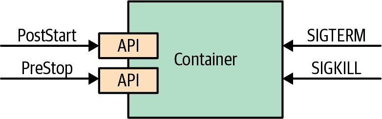

# 第五章：托管生命周期

由云原生平台管理的容器化应用程序无法控制其生命周期，为了成为良好的云原生公民，它们必须监听管理平台发出的事件，并相应地调整其生命周期。*托管生命周期* 模式描述了应用程序如何以及应该如何响应这些生命周期事件。

# 问题

在 第四章，“健康探测” 中，我们解释了为什么容器必须为不同的健康检查提供 API。健康检查 API 是平台持续探测以获取应用程序洞察的只读端点。这是平台从应用程序中提取信息的机制。

除了监视容器的状态外，平台有时可能会发出命令，并期望应用程序对其做出反应。受政策和外部因素驱动，云原生平台可能会决定随时启动或停止其管理的应用程序。这取决于容器化应用程序确定哪些事件对其重要，并如何做出响应。实际上，这是平台用于与应用程序通信和发送命令的 API。此外，应用程序可以选择从生命周期管理中受益，或者如果它们不需要此服务，则可以忽略它。

# 解决方案

我们发现仅检查进程状态并不足以判断应用程序的健康状况。这就是为什么存在用于监视容器健康的不同 API 的原因。同样地，仅使用进程模型来运行和停止进程也不够。现实世界的应用程序需要更精细的交互和生命周期管理能力。一些应用程序需要预热，一些应用程序需要温和且干净的关闭过程。出于这些以及其他用例的考虑，平台会发出一些事件，如 图 5-1 所示，容器可以选择监听并根据需要做出响应。



###### 图 5-1\. 托管容器生命周期

应用程序的部署单元是 Pod。正如您已经知道的那样，Pod 由一个或多个容器组成。在 Pod 级别，还有其他构造，比如我们在 第十五章，“Init 容器” 中介绍的 init 容器，它们可以帮助管理容器生命周期。本章描述的事件和钩子都应用于单个容器级别，而不是 Pod 级别。

## SIGTERM 信号

每当 Kubernetes 决定关闭一个容器，无论是因为其所属的 Pod 正在关闭，还是因为失败的存活探测导致容器重启，容器都会收到 SIGTERM 信号。SIGTERM 是对容器进行轻微提示，要求其在 Kubernetes 发送更突然的 SIGKILL 信号之前进行干净的关闭。一旦收到 SIGTERM 信号，应用程序应尽快关闭。对于某些应用程序来说，这可能是快速终止，而对于其他应用程序可能需要完成正在进行的请求、释放打开的连接和清理临时文件，这可能需要更长的时间。在所有情况下，响应 SIGTERM 是以干净的方式关闭容器的正确时机。

## SIGKILL 信号

如果容器进程在收到 SIGTERM 信号后没有关闭，将通过后续的 SIGKILL 信号强制关闭。Kubernetes 不会立即发送 SIGKILL 信号，而是在发出 SIGTERM 信号后默认等待 30 秒。此优雅期可以通过 `.spec.terminationGracePer⁠iodSeconds` 字段在每个 Pod 中定义，但无法保证，因为在向 Kubernetes 发送命令时可以覆盖它。设计和实现容器化应用程序的目标应该是短暂的，具有快速启动和关闭过程。

## PostStart 钩子

仅使用进程信号管理生命周期有一定限制。这就是为什么 Kubernetes 提供了额外的生命周期钩子，如 `postStart` 和 `preStop` 的原因。包含 `postStart` 钩子的 Pod 清单看起来像 示例 5-1 中的那样。

##### 示例 5-1\. 带有 `postStart` 钩子的容器

```
apiVersion: v1
kind: Pod
metadata:
  name: post-start-hook
spec:
  containers:
  - image: k8spatterns/random-generator:1.0
    name: random-generator
    lifecycle:
      postStart:
        exec:
          command:  
          - sh
          - -c
          - sleep 30 && echo "Wake up!" > /tmp/postStart_done
```


`postStart` 命令等待 30 秒。`sleep` 仅是对任何可能在此时运行的长时间启动代码进行模拟。此外，它使用触发文件与主应用程序同步，后者并行启动。

`postStart` 命令在容器创建后执行，与主容器进程异步进行。即使应用程序初始化和预热逻辑的大部分可以作为容器启动步骤的一部分实现，`postStart` 仍然涵盖了一些用例。`postStart` 操作是一个阻塞调用，容器状态保持 *Waiting* 直到 `postStart` 处理程序完成，从而保持 Pod 状态为 *Pending*。`postStart` 的这种特性可以用来延迟容器的启动状态，同时允许主容器进程初始化的时间。

另一个使用 `postStart` 的例子是在 Pod 不满足某些前提条件时阻止容器启动。例如，当 `postStart` 钩子通过返回非零退出码指示错误时，Kubernetes 会终止主容器进程。

`postStart` 和 `preStop` 钩子调用机制类似于第四章，“健康探针”中描述的健康探针，并支持这些处理程序类型：

exec

直接在容器中运行命令

httpGet

对一个 Pod 容器打开的端口执行 HTTP GET 请求

在 `postStart` 钩子中执行的关键逻辑要非常小心，因为它的执行没有任何保证。由于钩子与容器进程并行运行，可能会在容器启动之前执行钩子。此外，钩子旨在具有至少一次语义，因此实现必须注意重复执行。另一个要记住的方面是平台不会对未到达处理程序的失败 HTTP 请求进行任何重试尝试。

## PreStop 钩子

`preStop` 钩子是在容器终止之前发送到容器的阻塞调用。它具有与 SIGTERM 信号相同的语义，并且应该用于在无法响应 SIGTERM 时启动容器的优雅关闭。在发送删除容器的调用到容器运行时之前，`preStop` 操作在示例 5-2 中必须完成，这会触发 SIGTERM 通知。

##### 示例 5-2\. 带有 `preStop` 钩子的容器

```
apiVersion: v1
kind: Pod
metadata:
  name: pre-stop-hook
spec:
  containers:
  - image: k8spatterns/random-generator:1.0
    name: random-generator
    lifecycle:
      preStop:
        httpGet:  
          path: /shutdown
          port: 8080
```


调用运行在应用程序内部的 `/shutdown` 端点。

即使 `preStop` 是阻塞的，但在其上保持或返回不成功的结果并不会阻止删除容器和终止进程。`preStop` 钩子只是优雅应用程序关闭的方便替代方法，没有其他作用。它还提供了与我们之前介绍的 `postStart` 钩子相同的处理程序类型和保证。

## 其他生命周期控制

到目前为止，我们专注于允许您在容器生命周期事件发生时执行命令的钩子。但是，另一种机制不是在容器级别而是在 Pod 级别，允许您执行初始化指令。

我们在第十五章中深入描述了*初始化容器*模式，但在这里我们简要描述它以与生命周期钩子进行比较。与常规应用容器不同，初始化容器按顺序运行，直到完成，并在 Pod 中的任何应用容器启动之前运行。这些保证允许您使用初始化容器执行 Pod 级别的初始化任务。生命周期钩子和初始化容器在不同的粒度上运行（分别在容器级别和 Pod 级别），有时可以互换使用，或在其他情况下互补使用。表 5-1 总结了两者之间的主要区别。

表 5-1\. 生命周期钩子和初始化容器

| 方面 | 生命周期钩子 | 初始化容器 |
| --- | --- | --- |
| 激活时间 | 容器生命周期阶段。 | Pod 生命周期阶段。 |
| 启动阶段操作 | 一个`postStart`命令。 | 执行一系列`initContainers`的列表。 |
| 关闭阶段操作 | 一个`preStop`命令。 | 没有等效特性。 |
| 时间保证 | `postStart`命令与容器的`ENTRYPOINT`同时执行。 | 所有初始化容器必须在任何应用程序容器启动之前成功完成。 |
| 使用场景 | 执行特定于容器的非关键启动/关闭清理。 | 使用容器执行类似工作流的顺序操作；重复使用容器执行任务。 |

如果需要更多控制来管理应用程序容器的生命周期，有一种高级技术可以重写容器的入口点，有时也称为[*Commandlet*模式](https://oreil.ly/CVZX6)。当 Pod 中的主要容器必须按特定顺序启动并且需要额外的控制级别时，此模式特别有用。基于 Kubernetes 的流水线平台如 Tekton 和 Argo CD 要求按顺序执行共享数据的容器，并支持并行运行的附加 sidecar 容器（我们在第十六章，“Sidecar”中更详细地讨论了 sidecars）。

对于这些场景，仅使用一系列初始化容器是不够的，因为初始化容器不允许 sidecars。作为替代方案，可以使用一种称为*entrypoint 重写*的高级技术，以允许对 Pod 主容器进行精细化的生命周期控制。每个容器镜像定义了一个默认在容器启动时执行的命令。在 Pod 规范中，您还可以直接在 Pod 规范中定义此命令。entrypoint 重写的想法是用一个通用的包装命令替换这个命令，该命令调用原始命令并处理生命周期相关的问题。这个通用命令是从另一个容器镜像中注入的，然后再启动应用程序容器之前。

这个概念最好通过一个例子来解释。 示例 5-3 展示了一个典型的 Pod 声明，该声明启动了一个带有给定参数的单个容器。

##### 示例 5-3\. 启动带有命令和参数的简单 Pod

```
apiVersion: v1
kind: Pod
metadata:
  name: simple-random-generator
spec:
  containers:
  - image: k8spatterns/random-generator:1.0
    name: random-generator
    command:
    - "random-generator-runner"  
    args:                        
    - "--seed"
    - "42"
```


容器启动时执行的命令。


提供给入口点命令的额外参数。

现在的技巧是用一个通用的监管程序来包装给定的命令`random-generator-runner`，该监管程序负责处理生命周期方面的问题，如对`SIGTERM`或其他外部信号的反应。 示例 5-4 展示了一个包含初始化容器以安装监管程序的 Pod 声明，然后启动监管程序来监视主应用程序。

##### 示例 5-4\. 使用监管程序包装原始 entrypoint 的 Pod

```
apiVersion: v1
kind: Pod
metadata:
  name: wrapped-random-generator
spec:
  volumes:
  - name: wrapper                   
    emptyDir: { }
  initContainers:
  - name: copy-supervisor           
    image: k8spatterns/supervisor
    volumeMounts:
    - mountPath: /var/run/wrapper
      name: wrapper
    command: [ cp ]
    args: [ supervisor, /var/run/wrapper/supervisor ]
  containers:
  - image: k8spatterns/random-generator:1.0
    name: random-generator
    volumeMounts:
    - mountPath: /var/run/wrapper
      name: wrapper
    command:
    - "/var/run/wrapper/supervisor" 
    args:                           
    - "random-generator-runner"
    - "--seed"
    - "42"
```


创建一个新的`emptyDir`卷来共享监控守护程序。


用于将监控守护程序复制到应用容器的初始容器。


在示例 5-3 中定义的原始命令`randomGenerator`被来自共享卷的监控守护程序所取代。


原始命令规范变为监控命令的参数。

对于基于 Kubernetes 的应用程序而言，这种入口重写特别有用，它会以编程方式创建和管理 Pod，例如 Tekton，在运行持续集成（CI）流水线时创建 Pod。这样，它们可以更好地控制何时启动、停止或在 Pod 中链式连接容器。

关于使用哪种机制没有严格的规则，除非需要特定的定时保证。我们可以完全跳过生命周期钩子和初始容器，而使用一个 bash 脚本来执行容器启动或关闭命令中的特定操作。这是可能的，但它会将容器与脚本紧密耦合，并将其变成维护的噩梦。我们也可以使用 Kubernetes 生命周期钩子执行一些操作，如本章所述。或者，我们甚至可以进一步运行执行单个操作的容器，使用初始容器或注入监控守护程序以实现更复杂的控制。在这一序列中，选项需要越来越多的努力，但同时提供更强的保证并支持重用。

理解容器和 Pod 生命周期的各个阶段和可用钩子对于创建由 Kubernetes 管理的应用程序至关重要。

# 讨论

云原生平台提供的主要好处之一是能够可靠和可预测地在可能不稳定的云基础设施上运行和扩展应用程序。这些平台为在其上运行的应用程序提供一组约束和合同。对应用程序而言，遵守这些合同以从云原生平台提供的所有功能中受益至关重要。处理和响应这些事件确保您的应用程序可以在最小影响消费服务的情况下优雅地启动和关闭。目前，在其基本形式中，这意味着容器应该像任何设计良好的 POSIX 进程一样行为。未来，可能会有更多事件提供提示，告知应用程序何时将被扩展或要求释放资源以防止关闭。理解应用程序生命周期不再由个人控制，而是完全由平台自动化管理是至关重要的。

除了管理应用程序生命周期外，像 Kubernetes 这样的编排平台的另一个重要职责是在节点群中分发容器。下一个模式，*自动化放置*，解释了从外部影响调度决策的选项。

# 更多信息

+   [托管生命周期示例](https://oreil.ly/2T2jc)

+   [容器生命周期钩子](https://oreil.ly/xzeMi)

+   [将处理程序附加到容器生命周期事件](https://oreil.ly/NTi1h)

+   [Kubernetes 最佳实践：优雅终止](https://oreil.ly/j-5yl)

+   [使用 Kubernetes 优雅关闭 Pod](https://oreil.ly/TgjCp)

+   [Argo 和 Tekton：在 Kubernetes 上推动可能性的边界](https://oreil.ly/CVZX6)

+   [俄罗斯套娃：使用嵌套进程扩展容器](https://oreil.ly/iBhoQ)
