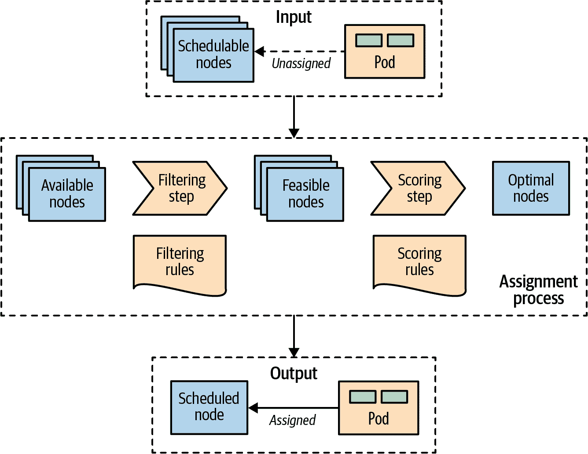
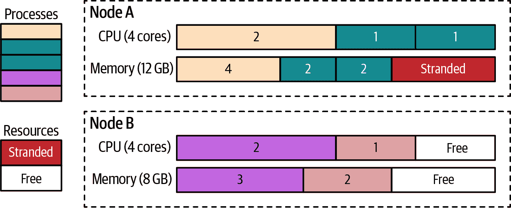
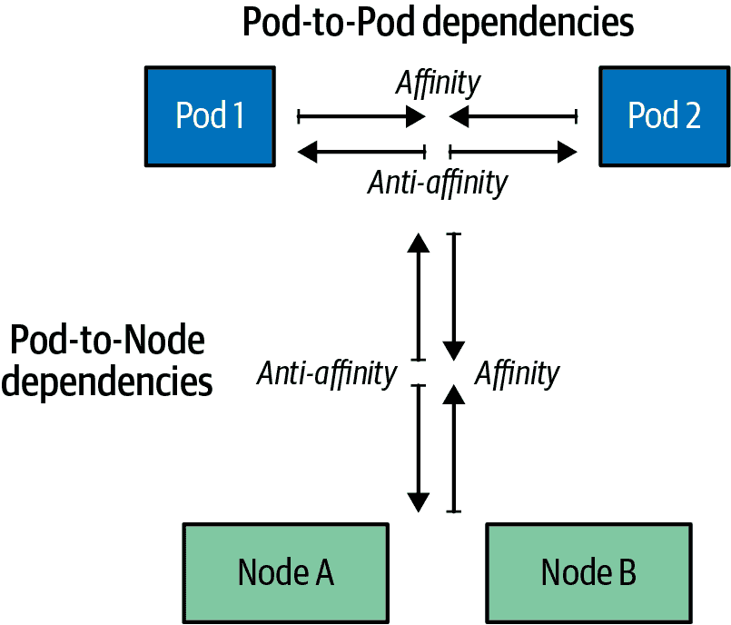

# 第六章：自动化部署

*自动化部署* 是 Kubernetes 调度器的核心功能，用于将新的 Pod 分配给符合容器资源请求并遵守调度策略的节点。此模式描述了 Kubernetes 调度算法的原则以及如何从外部影响部署决策。

# 问题

一个合理大小的基于微服务的系统由数十甚至数百个隔离的进程组成。容器和 Pod 提供了打包和部署的良好抽象，但并没有解决将这些进程放置在合适节点上的问题。对于数量庞大且不断增长的微服务，单独将它们分配和放置到节点上是一项不可管理的活动。

容器彼此之间存在依赖关系，与节点之间存在依赖关系，并且存在资源需求，所有这些都随时间而变化。集群上可用的资源也随时间变化，通过缩小或扩展集群或通过已放置容器来消耗它。我们放置容器的方式也影响分布系统的可用性、性能和容量。所有这些都使得将容器调度到节点成为一个动态目标。

# 解决方案

在 Kubernetes 中，将 Pod 分配给节点是由调度器完成的。它是 Kubernetes 的一个高度可配置的部分，并且仍在不断演进和改进中。在本章中，我们将涵盖主要的调度控制机制，影响部署位置的驱动因素，为何选择其中一种选项以及由此产生的后果。Kubernetes 调度器是一个强大且节省时间的工具。它在整个 Kubernetes 平台中起着基础性作用，但类似于其他 Kubernetes 组件（API 服务器、Kubelet），它可以独立运行或完全不使用。

在非常高的层次上，Kubernetes 调度器执行的主要操作是从 API 服务器检索每个新创建的 Pod 定义，并将其分配给节点。它为每个 Pod 找到最合适的节点（只要有这样的节点），无论是用于初始应用程序部署、扩展还是在将应用程序从不健康节点移动到健康节点时。它通过考虑运行时依赖关系、资源需求以及高可用性的指导策略来实现这一点；通过水平扩展 Pods 进行分布；并且通过在性能和低延迟交互方面将 Pods 放置在附近。然而，为了使调度器能够正确地执行其工作并允许声明式部署，它需要具有可用容量的节点和已声明资源配置和指导策略的容器。让我们更详细地看看每个方面。

## 可用节点资源

首先，Kubernetes 集群需要具有足够资源容量的节点来运行新的 Pods。每个节点都有用于运行 Pods 的可用容量，并且调度器确保为 Pod 请求的容器资源总和小于可分配的节点容量。考虑到一个专门用于 Kubernetes 的节点，其容量使用以下公式计算，详见 示例 6-1。

##### 示例 6-1\. 节点容量

```
*Allocatable* [capacity for application pods] =
    *Node Capacity* [available capacity on a node]
        - *Kube-Reserved* [Kubernetes daemons like kubelet, container runtime]
        - *System-Reserved* [Operating System daemons like sshd, udev]
        - *Eviction Thresholds* [Reserved memory to prevent system OOMs]

```

如果不为操作系统和 Kubernetes 本身的系统守护程序保留资源，则 Pods 可以被调度到节点的全部容量，这可能导致 Pods 和系统守护程序竞争资源，从而导致节点上的资源匮乏问题。即使如此，节点上的内存压力也可能通过 OOMKilled 错误影响运行在其上的所有 Pods，或导致节点暂时下线。OOMKilled 是 Linux 内核因内存不足而终止进程时显示的错误消息。当可用内存低于保留值时，驱逐阈值是 Kubelet 为保留节点上的内存并尝试驱逐 Pods 的最后手段。

此外，请注意，如果容器运行在不受 Kubernetes 管理的节点上，则这些容器使用的资源不会反映在 Kubernetes 对节点容量计算中。一个解决方法是运行一个占位 Pod，它什么都不做，但只有对应于未跟踪的容器资源使用量的 CPU 和内存请求。这样的 Pod 只创建用于表示和保留未跟踪容器的资源消耗，并帮助调度器构建节点的更好资源模型。

## 容器资源需求

有效的 Pod 放置的另一个重要要求是定义容器的运行时依赖和资源需求。我们在 第二章，“可预测的需求” 中更详细地讨论了这一点。它归结为具有声明其资源配置文件（使用 `request` 和 `limit`）以及存储或端口等环境依赖项的容器。只有这样，Pods 才能被最优地分配到节点上，并且在高峰使用期间可以运行而不相互影响或面临资源匮乏问题。

## 调度器配置

下一个拼图是为您的集群需求配置正确的过滤或优先级配置。调度程序已配置了一组默认的断言和优先级策略，适用于大多数用例。在 Kubernetes v1.23 之前的版本中，可以使用调度策略来配置调度器的断言和优先级。Kubernetes 的新版本使用调度配置文件来实现相同的效果。这种新方法将调度过程的不同步骤暴露为扩展点，并允许您配置覆盖步骤的默认实现的插件。示例 6-2 演示了如何使用自定义插件覆盖从 `score` 步骤中的 `PodTopologySpread` 插件。

##### 示例 6-2\. 调度器配置

```
apiVersion: kubescheduler.config.k8s.io/v1
kind: KubeSchedulerConfiguration
profiles:
  - plugins:
      score:                          
        disabled:
        - name: PodTopologySpread     
        enabled:
        - name: MyCustomPlugin        
          weight: 2
```


在此阶段的插件为每个通过过滤阶段的节点提供评分。


此插件实现了稍后在本章中将看到的拓扑扩展约束。


在前一步中禁用的插件被新插件所替换。

###### 注意

只有管理员作为集群配置的一部分才能定义调度程序插件和自定义调度程序。作为在集群上部署应用程序的普通用户，您只需引用预定义的调度程序。

默认情况下，调度器使用默认的调度器配置文件和默认插件。还可以在集群上运行多个调度器，或在调度器上运行多个配置文件，并允许 Pod 指定使用哪个配置文件。每个配置文件必须具有唯一的名称。然后，在定义 Pod 时，您可以添加字段 `.spec.schedulerName` ，并指定要使用的配置文件名称到 Pod 的规范中，Pod 将由所需的调度器配置文件处理。

## 调度过程

根据放置策略，Pod 被分配给具有特定容量的节点。为了完整起见，图 6-1 在高层次上展示了这些元素如何组合以及 Pod 在调度过程中经历的主要步骤。



###### 图 6-1\. 一个 Pod 到节点的分配过程

一旦创建了尚未分配到节点的 Pod，调度程序就会与所有可用节点一起选取它以及一组过滤和优先级策略。在第一阶段，调度程序应用过滤策略并删除不符合条件的所有节点。满足 Pod 调度要求的节点称为*可行节点*。在第二阶段，调度程序运行一组函数对剩余的可行节点进行评分，并按权重对它们进行排序。在最后阶段，调度程序通知 API 服务器有关分配决策的结果，这是调度过程的主要结果。整个过程也称为*调度*、*放置*、*节点分配*或*绑定*。

在大多数情况下，最好让调度程序完成 Pod 到节点的分配，而不是微观管理放置逻辑。但是，在某些情况下，您可能希望强制将 Pod 分配到特定节点或节点组。可以使用节点选择器来执行此分配。`.spec.nodeSelector` Pod 字段指定了必须作为节点上标签存在的键值对映射，以使节点有资格运行 Pod。例如，假设您想要强制将 Pod 运行在具有 SSD 存储或 GPU 加速硬件的特定节点上。使用在示例 6-3 中具有匹配 `disktype: ssd` 的 `nodeSelector` 的 Pod 定义，只有带有 `disktype=ssd` 标签的节点才有资格运行该 Pod。

##### 示例 6-3\. 基于可用磁盘类型的节点选择器

```
apiVersion: v1
kind: Pod
metadata:
  name: random-generator
spec:
  containers:
  - image: k8spatterns/random-generator:1.0
    name: random-generator
  nodeSelector:
    disktype: ssd      
```


必须匹配的一组节点标签，以便将该 Pod 视为此节点的节点。

除了向节点指定自定义标签之外，您还可以使用每个节点上都存在的一些默认标签。每个节点都有一个唯一的 `kubernetes.io/hostname` 标签，可以通过其主机名将 Pod 放置在节点上。还有其他默认标签，指示操作系统、架构和实例类型，这些标签对于放置也可能很有用。

## 节点亲和性

Kubernetes 支持许多更灵活的配置调度过程的方法。其中一种功能是*节点亲和性*，它是前面描述的节点选择器方法的更具表现力的方式，允许将规则指定为必需或首选。*必需规则*必须满足才能将 Pod 调度到节点，而首选规则只是通过增加匹配节点的权重来表示偏好，而不会使它们成为必需的。此外，节点亲和性功能通过使用诸如 `In`、`NotIn`、`Exists`、`DoesNotExist`、`Gt` 或 `Lt` 等运算符使语言更具表现力，极大地扩展了您可以表达的约束类型。示例 6-4 演示了如何声明节点亲和性。

##### 示例   示例 6-4\. 具有节点亲和性的 Pod

```
apiVersion: v1
kind: Pod
metadata:
  name: random-generator
spec:
  affinity:
    nodeAffinity:
      requiredDuringSchedulingIgnoredDuringExecution:   
        nodeSelectorTerms:
        - matchExpressions:                             
          - key: numberCores
            operator: Gt
            values: [ "3" ]
      preferredDuringSchedulingIgnoredDuringExecution:  
      - weight: 1
        preference:
          matchFields:
          - key: metadata.name
            operator: NotIn
            values: [ "control-plane-node" ]
  containers:
  - image: k8spatterns/random-generator:1.0
    name: random-generator
```


节点必须具有超过三个核心（由节点标签表示）才能考虑在调度过程中。如果节点上的条件发生变化，则在执行过程中不会重新评估该规则。


匹配标签。在此示例中，匹配所有具有值大于 3 的标签 `numberCores` 的节点。


软要求，这是带有权重的选择器列表。对于每个节点，计算所有匹配选择器的权重之和，并选择值最高的节点，只要它符合硬性要求。

## Pod 亲和性和反亲和性

*Pod 亲和性* 是一种更强大的调度方式，当 `nodeSelector` 不够用时应该使用。该机制允许您根据标签或字段匹配来限制 Pod 可以在哪些节点上运行。它不允许您表达 Pod 之间的依赖关系以指导 Pod 应该相对于其他 Pod 放置在哪里。为了表达如何将 Pod 分散以实现高可用性，或者将其打包和共同放置以提高延迟，您可以使用 Pod 亲和性和反亲和性。

节点亲和性在节点粒度上起作用，但 Pod 亲和性不限于节点，并且可以根据节点上已运行的 Pod 在各种拓扑级别上表达规则。使用 `topologyKey` 字段和匹配标签，可以强制执行更精细的规则，结合节点、机架、云服务提供商区域和区域等领域的规则，如 示例 6-5 所示。

##### 示例 6-5\. 具有 Pod 亲和性的 Pod

```
apiVersion: v1
kind: Pod
metadata:
  name: random-generator
spec:
  affinity:
    podAffinity:
      requiredDuringSchedulingIgnoredDuringExecution:  
      - labelSelector:                                 
          matchLabels:
            confidential: high
        topologyKey: security-zone                     
    podAntiAffinity:                                   
      preferredDuringSchedulingIgnoredDuringExecution: 
      - weight: 100
        podAffinityTerm:
          labelSelector:
            matchLabels:
              confidential: none
          topologyKey: kubernetes.io/hostname
  containers:
  - image: k8spatterns/random-generator:1.0
    name: random-generator
```


关于目标节点上运行的其他 Pod 的 Pod 放置的必要规则。


标签选择器，用于找到要与之共存的 Pod。


具有标签 `confidential=high` 的 Pod 所在的节点应该带有 `security-zone` 标签。此处定义的 Pod 被调度到具有相同标签和值的节点。


反亲和性规则用于找到不应放置 Pod 的节点。


规则描述 Pod 不应（但可以）放置在任何具有标签 `confidential=none` 的 Pod 的节点上。

类似于节点亲和性，Pod 亲和性和反亲和性也有硬性和软性要求，分别称为 `requiredDuringSchedulingIgnoredDuringExecution` 和 `preferredDuringSchedulingIgnoredDuringExecution`。与节点亲和性类似，`IgnoredDuringExecution` 后缀存在于字段名称中，这是为了未来的可扩展性。目前，如果节点上的标签发生更改并且亲和性规则不再有效，Pod 仍然继续运行，^(1) 但将来，也可能考虑运行时的更改。

## 拓扑传播约束

Pod 亲和规则允许将无限多的 Pod 放置在单个拓扑中，而 Pod 反亲和性则禁止将 Pod 放置在同一拓扑中。拓扑传播约束使您可以更细粒度地控制如何在集群中均匀分布 Pod，并实现更好的集群利用率或应用程序的高可用性。

让我们看一个例子来理解拓扑传播约束如何帮助解决问题。假设我们有一个具有两个副本和两个节点集群的应用程序。为了避免停机时间和单点故障，我们可以使用 Pod 反亲和规则，防止将 Pod 放置在同一节点上，并将其分布到两个节点上。虽然这种设置有其合理性，但它将阻止您执行滚动升级，因为第三个替换的 Pod 无法由于 Pod 反亲和性约束放置在现有节点上。我们将不得不添加另一个节点或将部署策略从滚动更改为重新创建。在资源不足时，拓扑传播约束将是更好的解决方案，因为它们允许您在集群中的 Pod 分布不均匀时容忍一定程度的不平衡。示例 6-6 允许将第三个滚动部署 Pod 放置在两个节点中的一个，因为它允许不均匀—即一个 Pod 的偏斜。

##### 示例 6-6\. 具有拓扑传播约束的 Pod

```
apiVersion: v1
kind: Pod
metadata:
  name: random-generator
  labels:
    app: bar
spec:
  topologySpreadConstraints:                  
  - maxSkew: 1                                
    topologyKey: topology.kubernetes.io/zone  
    whenUnsatisfiable: DoNotSchedule          
    labelSelector:                            
      matchLabels:
        app: bar
  containers:
  - image: k8spatterns/random-generator:1.0
    name: random-generator
```


Pod 拓扑传播约束在 Pod 规范的 `topologySpreadConstraints` 字段中定义。


`maxSkew` 定义了在拓扑中 Pod 可不均匀分布的最大程度。


拓扑域是您基础设施的逻辑单元。`topologyKey` 是 Node 标签的关键字，其中相同的值被视为属于同一拓扑。


当 `maxSkew` 无法满足时，`whenUnsatisfiable` 字段定义了应采取的操作。`DoNotSchedule` 是阻止调度 Pod 的硬性约束，而 `ScheduleAnyway` 是软性约束，它会优先调度减少集群不平衡的节点。


`labelSelector` 匹配此选择器的 Pod 被分组并计数，以满足约束条件。

在本文撰写时，拓扑分布约束是一个正在不断发展的功能。内置的集群级拓扑分布约束允许基于默认的 Kubernetes 标签进行某些不平衡，并使您能够遵守或忽略节点亲和性和污点策略。

## 污点和宽容性

基于污点和宽容性的高级功能控制 Pod 可以调度和允许运行的位置。而节点亲和性是允许 Pod 选择节点的属性，污点和宽容性则相反。它们允许节点控制哪些 Pod 应该或不应该在其上调度。*污点* 是节点的特征，当存在时，它会阻止 Pod 在节点上调度，除非 Pod 对该污点具有宽容性。从这个意义上说，污点和宽容性可以被视为一种 *选择加入*，允许在默认情况下不可用于调度的节点上进行调度，而亲和性规则则是一种 *选择退出*，通过显式选择在哪些节点上运行来排除所有未选定的节点。

通过使用 `kubectl` 将污点添加到节点：`kubectl taint nodes control-plane-node node-role.kubernetes.io/control-plane="true":NoSchedule`，其效果如 示例 6-7 所示。通过在 Pod 中添加匹配的宽容性，如 示例 6-8 所示。请注意，在 示例 6-7 的 `taints` 部分和 示例 6-8 的 `tolerations` 部分中，`key` 和 `effect` 的值是相同的。

##### 示例 6-7\. 带污点的节点

```
apiVersion: v1
kind: Node
metadata:
  name: control-plane-node
spec:
  taints:                                   
  - effect: NoSchedule
    key: node-role.kubernetes.io/control-plane
    value: "true"
```


标记此节点为不可调度，除非 Pod 对此污点具有宽容性。

##### 示例 6-8\. Pod 对节点污点的宽容

```
apiVersion: v1
kind: Pod
metadata:
  name: random-generator
spec:
  containers:
  - image: k8spatterns/random-generator:1.0
    name: random-generator
  tolerations:
  - key: node-role.kubernetes.io/control-plane 
    operator: Exists
    effect: NoSchedule                         
```


宽容（即考虑调度）带有关键字`node-role.kubernetes.io/control-plane`的节点。在生产集群中，此污点设置在控制平面节点上，以防止在该节点上调度 Pod。此类宽容性允许此 Pod 安装在控制平面节点上。


仅当污点指定为`NoSchedule`时才能容忍。此处该字段可以为空，在这种情况下，宽容性适用于每种效果。

存在硬污点以阻止在节点上调度（`effect=NoSchedule`），软污点尝试避免在节点上调度（`effect=PreferNoSchedule`），以及可以从节点上驱逐已运行的 Pods 的污点（`effect=NoExecute`）。

污点和宽容性允许处理复杂的用例，例如专用节点供一组特定的 Pods 使用，或通过对这些节点进行污点处理来强制驱逐问题节点上的 Pods。

您可以根据应用程序的高可用性和性能需求影响其位置，但尽量不要限制调度程序太多，并使自己陷入无法调度更多 Pods 和有太多搁置资源的境地。例如，如果您的容器资源需求过于粗粒度，或者节点太小，则可能导致节点中存在未使用的搁置资源。

在图 6-2 中，我们可以看到节点 A 有 4GB 的内存，因为没有剩余的 CPU 可用于放置其他容器，所以无法利用。创建具有较小资源需求的容器可能有助于改善这种情况。另一个解决方案是使用 Kubernetes 的*descheduler*，它有助于整理节点并提高其利用率。



###### 图 6-2。安排到节点和搁置资源的进程

一旦 Pod 分配给节点，调度程序的工作就完成了，除非删除并重新创建没有节点分配的 Pod，否则不会更改 Pod 的位置。正如您所见，随着时间的推移，这可能导致资源碎片化和集群资源的利用不足。另一个潜在问题是调度器的决策是基于其在调度新 Pod 时的集群视图。如果集群是动态的，并且节点的资源配置文件发生变化或添加了新节点，则调度程序不会纠正其先前的 Pod 位置。除了更改节点容量外，您还可以更改影响位置的节点标签，但不会纠正过去的位置。

所有这些情况都可以通过调度程序来解决。 Kubernetes 调度程序是一个可选功能，通常作为作业运行，当集群管理员决定是整理和碎片整理集群的好时机时，重新安排 Pods。调度程序配备了一些预定义的策略，可以启用、调整或禁用。

无论使用哪种策略，调度程序避免驱逐以下内容：

+   节点或集群关键的 Pods

+   不受 ReplicaSet、Deployment 或 Job 管理的 Pods，因为这些 Pods 无法重新创建

+   由 DaemonSet 管理的 Pods

+   带有本地存储的 Pods

+   具有 PodDisruptionBudget 的 Pods，驱逐将违反其规则

+   带有非空`DeletionTimestamp`字段设置的 Pods

+   取消调度 Pod 本身（通过将自身标记为关键 Pod 实现）

当然，所有驱逐操作都会尊重 Pods 的 QoS 级别，首先选择*Best-Efforts* Pods，然后是*Burstable* Pods，最后是*Guaranteed* Pods 作为驱逐的候选对象。有关这些 QoS 级别的详细解释，请参阅第二章，“可预测的需求”。

# 讨论

放置是将 Pod 分配给节点的艺术。您希望尽可能少地干预，因为多个配置的组合很难预测。在更简单的场景中，根据资源约束调度 Pod 应该是足够的。如果您遵循《第二章，“可预测的需求”》的指南，声明容器的所有资源需求，调度器将完成其工作，并将 Pod 放置在可能性最大的节点上。

然而，在更现实的场景中，您可能希望根据其他约束条件（如数据局部性、Pod 位置关联性、应用程序高可用性和有效的集群资源利用率）将 Pod 安排到特定的节点上。在这些情况下，有多种方法可以引导调度器朝向所需的部署拓扑进行调度。

图 6-3 展示了 Kubernetes 中不同调度技术的一种思考和理解方法。



###### 图 6-3\. Pod 到 Pod 和 Pod 到节点的依赖关系

从识别 Pod 与节点之间的力量和依赖关系开始（例如，基于专用硬件能力或有效资源利用率）。使用以下节点亲和性技术将 Pod 定向到所需的节点，或者使用反亲和性技术将 Pod 从不希望的节点中移开：

nodeName

这个字段提供了将 Pod 硬编码到节点的最简单形式。这个字段应该由调度器理想地填充，调度器是通过策略驱动而不是手动节点分配。通过这种方法将 Pod 分配到节点可以防止将 Pod 调度到任何其他节点。如果指定的节点没有容量，或者节点不存在，Pod 将永远不会运行。这将我们带回到 Kubernetes 之前的时代，当我们明确需要指定运行应用程序的节点时。手动设置此字段不是 Kubernetes 的最佳实践，应仅作为例外使用。

nodeSelector

节点选择器是一个标签映射。为了使 Pod 有资格在节点上运行，Pod 必须具有节点上指定的键值对作为标签。在 Pod 和节点上放置一些有意义的标签（无论如何都应该这样做），节点选择器是控制调度器选择的最简单的推荐机制之一。

节点亲和性

此规则改进了手动节点分配方法，并允许 Pod 使用逻辑运算符和约束表达对节点的依赖性，提供细粒度的控制。它还提供了控制节点亲和性约束严格程度的软和硬调度要求。

Taints 和 tolerations

Taints 和 tolerations 允许节点控制应该或不应该调度到它们上的 Pod，而无需修改现有的 Pod。默认情况下，没有为节点污点设置 tolerations 的 Pod 将被拒绝或从节点中驱逐。Taints 和 tolerations 的另一个优点是，如果通过添加具有新标签的新节点来扩展 Kubernetes 集群，你不需要在所有 Pod 上添加新标签，而只需要在应该放置在新节点上的 Pod 上添加标签。

一旦在 Kubernetes 术语中表达了 Pod 与节点之间的期望关联，就可以识别不同 Pod 之间的依赖关系。使用 Pod 亲和性技术来将紧密耦合的应用程序放置在同一节点上以进行 Pod 集中，使用 Pod 反亲和性技术来将 Pod 分布在节点上，以避免单点故障：

Pod 亲和性和反亲和性

这些规则允许基于 Pod 对其他 Pod 的依赖而不是节点进行调度。亲和性规则有助于在低延迟和数据局部性需求的情况下，在同一拓扑上放置由多个 Pod 组成的紧密耦合应用程序堆栈。另一方面，反亲和性规则可以在集群中不同故障域之间分布 Pod，以避免单点故障，或者通过避免将资源密集型 Pod 放置在同一节点上来防止竞争资源。

拓扑分布约束

要使用这些功能，平台管理员必须为节点打标签，并提供拓扑信息，如区域、区域或其他用户定义的域。然后，创建 Pod 配置的工作负载作者必须了解底层集群拓扑，并指定拓扑分布约束。您还可以指定多个拓扑分布约束，但必须满足所有约束才能放置 Pod。您必须确保它们不会彼此冲突。您还可以将此功能与 NodeAffinity 和 NodeSelector 结合使用，以过滤需要应用均匀性的节点。在这种情况下，务必理解其差异：多个拓扑分布约束是独立计算结果集并生成 AND 连接的结果，而与 NodeAffinity 和 NodeSelector 结合使用则过滤节点约束的结果。

在某些情况下，所有这些调度配置可能不足以表达定制的调度需求。在这种情况下，您可能需要定制和调整调度器配置，甚至提供一个能够理解您自定义需求的自定义调度器实现。

调度器调优

默认调度器负责将新的 Pod 放置到集群中的节点上，并且执行得很好。然而，可以修改一个或多个阶段在过滤和优先级排序阶段中的操作。这种具有扩展点和插件的机制专门设计用于允许进行小的修改，而无需完全实现一个新的调度器。

自定义调度器

如果前述方法都不够理想，或者您有复杂的调度需求，您也可以编写自己的自定义调度器。自定义调度器可以代替或与标准 Kubernetes 调度器并行运行。一个混合方法是使用“调度器扩展器”进程，这个进程在进行调度决策的最后阶段被标准 Kubernetes 调度器调用。这样一来，您不必实现一个完整的调度器，只需提供 HTTP API 来过滤和优先考虑节点。拥有自己的调度器的优势在于，您可以考虑 Kubernetes 集群之外的因素，如硬件成本、网络延迟以及在分配 Pods 到节点时的更好利用率。您还可以在默认调度器旁边使用多个自定义调度器，并配置每个 Pod 使用哪个调度器。每个调度器可以针对一组 Pods 使用不同的策略。

总结一下，有许多方法可以控制 Pod 的放置方式，选择合适的方法或者结合多种方法可能会让人感到不知所措。本章的要点是：定义并声明容器资源配置文件，并为了最佳资源消耗驱动调度结果对 Pods 和节点进行标记。如果这些方法不能实现预期的调度结果，可以从小的迭代变化开始尝试。努力实现对 Kubernetes 调度器的最小策略影响，以表达节点依赖性和 Pod 之间的依赖关系。

# 更多信息

+   [自动放置示例](https://oreil.ly/N-iAz)

+   [将 Pods 分配给 Nodes](https://oreil.ly/QlbMB)

+   [调度器配置](https://oreil.ly/iPbBT)

+   [Pod 拓扑传播约束](https://oreil.ly/qkp60)

+   [配置多个调度器](https://oreil.ly/appyT)

+   [Kubernetes 的去调度器](https://oreil.ly/4lPFX)

+   [中断](https://oreil.ly/oNGSR)

+   [为关键附加 Pods 提供保证的调度](https://oreil.ly/w9tKY)

+   [保持 Kubernetes 集群平衡：高可用性的秘密](https://oreil.ly/_MODM)

+   [高级 Kubernetes Pod 到节点调度](https://oreil.ly/6Tog3)

^(1) 然而，如果节点标签改变，并允许未调度的 Pods 匹配它们的节点亲和选择器，这些 Pods 将被调度到该节点上。
